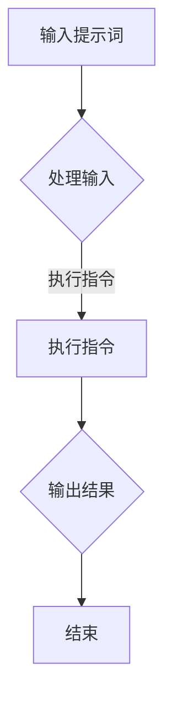

                 

### 文章标题

《提示词编程的版本兼容性管理策略》

关键词：提示词编程，版本兼容性，管理策略，测试，维护，案例分析

摘要：本文从版本兼容性管理的基础概念出发，结合提示词编程的特点，深入探讨版本兼容性管理的策略与方法。通过兼容性评估、版本管理、兼容性测试和兼容性维护等环节，结合实际案例，详细阐述了如何在提示词编程中实现版本兼容性管理，为开发人员提供了实用的指导。

### 第一部分：版本兼容性管理基础

#### 第1章：版本兼容性管理概述

版本兼容性管理是软件工程中的重要环节，它确保不同版本的软件或组件能够无缝地协同工作。在本章节中，我们将对版本兼容性管理进行概述，并探讨其重要性、挑战和关键要素。

#### 1.1 版本兼容性管理的重要性

版本兼容性管理的重要性主要体现在以下几个方面：

1. **用户体验**：良好的版本兼容性可以确保用户在不同版本之间无缝切换，避免因版本不兼容导致的软件功能失效或性能下降，从而提升用户体验。

2. **软件迭代**：版本兼容性管理有助于软件的持续迭代和升级，使得开发团队能够更高效地引入新功能和修复漏洞，满足用户需求。

3. **商业利益**：版本兼容性管理有助于减少因版本不兼容导致的客户投诉和产品召回，维护品牌形象，提高市场竞争力。

4. **系统稳定性**：通过版本兼容性管理，可以确保不同组件和模块之间的稳定性和一致性，降低系统故障率。

#### 1.1.1 软件版本兼容性的挑战

软件版本兼容性的挑战主要包括以下几个方面：

1. **功能兼容性**：新版本的功能是否能够无缝集成到旧版本中，不破坏现有功能。

2. **逻辑兼容性**：不同版本的软件在逻辑处理上的差异，可能导致数据不一致或错误。

3. **性能兼容性**：新版本的性能是否能够满足旧版本的需求，不造成性能下降或资源浪费。

4. **兼容性测试**：测试资源有限，如何高效地覆盖所有可能的兼容性问题。

#### 1.1.2 版本兼容性管理的作用

版本兼容性管理的作用主要包括以下几个方面：

1. **确保版本升级的顺利进行**：通过版本兼容性管理，可以确保新版本能够平滑地替代旧版本，减少升级过程中的风险。

2. **提高软件质量和稳定性**：通过严格的兼容性测试和版本控制，可以确保软件在不同版本之间的稳定性和一致性。

3. **降低维护成本**：通过合理的版本兼容性策略，可以减少因版本不兼容导致的维护工作量，降低维护成本。

4. **满足用户需求**：通过持续关注用户反馈，及时调整版本兼容性策略，满足用户需求，提升用户满意度。

#### 1.1.3 版本兼容性管理的关键要素

版本兼容性管理的关键要素包括以下几个方面：

1. **版本控制**：采用合适的版本控制工具，如Git，确保版本信息的准确性和可追溯性。

2. **兼容性评估**：对每个版本进行全面的兼容性评估，包括功能兼容性、逻辑兼容性和性能兼容性。

3. **兼容性测试**：制定详细的兼容性测试计划，进行功能测试、性能测试和回归测试，确保版本升级后的稳定性。

4. **维护和更新**：持续关注用户反馈，对版本进行维护和更新，解决兼容性问题，提高软件质量。

#### 第2章：版本兼容性策略

版本兼容性策略是版本兼容性管理的核心，它决定了如何有效地管理不同版本之间的兼容性。在本章节中，我们将详细探讨版本兼容性评估方法、提示词编程版本管理、版本发布流程等内容。

#### 2.1 版本兼容性评估方法

版本兼容性评估是版本兼容性管理的重要环节，它决定了新版本是否能够顺利替代旧版本。常见的版本兼容性评估方法包括：

1. **功能兼容性评估**：检查新版本的功能是否与旧版本一致，确保新功能不会破坏现有功能。

2. **逻辑兼容性评估**：分析新版本和旧版本在逻辑处理上的差异，确保数据一致性。

3. **性能兼容性评估**：测试新版本的性能指标，确保新版本能够满足旧版本的性能要求。

4. **兼容性测试**：通过功能测试、性能测试和回归测试，全面验证版本兼容性。

#### 2.1.1 功能兼容性评估

功能兼容性评估是版本兼容性评估的基础，它主要关注新版本的功能是否与旧版本一致。具体步骤包括：

1. **功能清单对比**：列出新版本和旧版本的所有功能，对比两者之间的差异。

2. **功能测试**：对新版本的功能进行测试，确保功能正常运行。

3. **功能回归测试**：在旧版本的基础上，测试新版本的功能，确保新功能不会破坏旧功能。

4. **用户反馈**：收集用户对新版本功能的反馈，及时调整和优化功能。

#### 2.1.2 逻辑兼容性评估

逻辑兼容性评估主要关注新版本和旧版本在逻辑处理上的差异，确保数据一致性。具体步骤包括：

1. **逻辑流程分析**：分析新版本和旧版本的逻辑流程，找出可能存在的差异点。

2. **数据验证**：对关键数据进行验证，确保新版本和旧版本的数据处理结果一致。

3. **逻辑回归测试**：在新版本的基础上，测试旧版本的逻辑处理，确保逻辑处理结果一致。

4. **用户反馈**：收集用户对逻辑处理的反馈，及时调整和优化逻辑处理。

#### 2.1.3 性能兼容性评估

性能兼容性评估主要测试新版本的性能指标，确保新版本能够满足旧版本的性能要求。具体步骤包括：

1. **性能指标定义**：明确新版本和旧版本的性能指标，如响应时间、吞吐量等。

2. **性能测试**：对新版本进行性能测试，确保性能指标达到预期。

3. **性能回归测试**：在旧版本的基础上，测试新版本的性能，确保性能指标稳定。

4. **用户反馈**：收集用户对性能的反馈，及时调整和优化性能。

#### 2.2 提示词编程版本管理

提示词编程是一种基于自然语言处理和人工智能的编程范式，它通过提示词（Prompts）引导程序执行相应的任务。提示词编程的版本管理具有以下特点：

1. **版本控制**：使用版本控制工具（如Git）对提示词编程的代码进行管理，确保版本信息的准确性和可追溯性。

2. **版本兼容性**：提示词编程的版本兼容性主要关注提示词的语义和语法，确保新版本能够理解和执行旧版本的提示词。

3. **版本发布**：制定版本发布计划，确保新版本的提示词编程框架能够与现有系统无缝集成。

#### 2.2.1 版本控制工具

常见的版本控制工具有Git、SVN和Mercurial等。其中，Git因其分布式特性，在提示词编程版本管理中应用较为广泛。Git的主要功能包括：

1. **分支管理**：支持分支管理，便于并行开发和版本迭代。

2. **合并冲突**：提供合并冲突解决工具，确保分支合并的顺利进行。

3. **版本回滚**：支持版本回滚，便于应对突发问题。

4. **代码审查**：支持代码审查，确保代码质量。

#### 2.2.2 版本控制策略

提示词编程版本控制策略主要包括以下几个方面：

1. **主干分支策略**：将主干分支作为主要的开发分支，确保主干分支的稳定性。

2. **功能分支策略**：在主干分支的基础上创建功能分支，用于开发新功能或修复漏洞。

3. **发布分支策略**：在功能分支完成开发后，创建发布分支，用于最终测试和发布。

4. **回滚策略**：在版本发布后，如遇到严重问题，可回滚至上一个稳定版本。

#### 2.2.3 版本发布流程

提示词编程版本发布流程主要包括以下几个步骤：

1. **版本规划**：制定版本规划，包括版本号、发布时间、功能点等。

2. **功能开发**：在功能分支上完成功能开发，并进行单元测试。

3. **集成测试**：将功能分支合并至主干分支，进行集成测试，确保版本兼容性。

4. **发布审核**：对版本进行审核，确保版本质量。

5. **发布部署**：将版本部署至生产环境，并进行监控和反馈。

### 第二部分：兼容性测试

兼容性测试是确保版本兼容性的关键环节，它通过模拟不同环境下的运行条件，验证软件在不同环境中的稳定性。在本章节中，我们将详细探讨兼容性测试方法、测试环境和测试用例设计等内容。

#### 3.1 兼容性测试方法

兼容性测试方法主要包括功能测试、性能测试和回归测试等。以下分别介绍这些测试方法：

#### 3.1.1 功能测试

功能测试是兼容性测试的基础，它主要验证软件在不同版本之间的功能是否一致。具体步骤包括：

1. **测试用例设计**：根据软件需求文档，设计功能测试用例。

2. **测试环境搭建**：搭建测试环境，包括硬件、软件和网络环境等。

3. **测试执行**：执行功能测试用例，记录测试结果。

4. **结果分析**：对测试结果进行分析，找出功能兼容性问题。

5. **问题定位**：定位功能兼容性问题，并进行修复。

#### 3.1.2 性能测试

性能测试主要验证软件在不同版本之间的性能是否一致。具体步骤包括：

1. **性能指标定义**：明确性能测试的性能指标，如响应时间、吞吐量等。

2. **测试用例设计**：设计性能测试用例，覆盖不同场景下的性能需求。

3. **测试环境搭建**：搭建性能测试环境，包括硬件、软件和网络环境等。

4. **测试执行**：执行性能测试用例，记录性能测试结果。

5. **结果分析**：对性能测试结果进行分析，找出性能兼容性问题。

6. **问题定位**：定位性能兼容性问题，并进行修复。

#### 3.1.3 回归测试

回归测试是在版本迭代过程中，验证新版本是否引入了新的兼容性问题。具体步骤包括：

1. **回归测试用例设计**：根据历史测试结果，设计回归测试用例。

2. **测试环境搭建**：搭建回归测试环境，确保与生产环境一致。

3. **测试执行**：执行回归测试用例，记录测试结果。

4. **结果分析**：对回归测试结果进行分析，找出回归兼容性问题。

5. **问题定位**：定位回归兼容性问题，并进行修复。

#### 3.2 提示词编程兼容性测试实战

提示词编程兼容性测试实战主要包括测试环境搭建、测试用例设计和测试报告分析等内容。

#### 3.2.1 测试环境搭建

测试环境搭建是提示词编程兼容性测试的基础，它包括以下步骤：

1. **硬件环境**：搭建测试服务器，确保硬件资源充足。

2. **软件环境**：安装提示词编程框架和相关依赖库，确保软件环境一致。

3. **网络环境**：搭建测试网络环境，模拟生产环境下的网络条件。

4. **测试工具**：安装和配置兼容性测试工具，如Selenium、JMeter等。

#### 3.2.2 测试用例设计

测试用例设计是提示词编程兼容性测试的关键，它包括以下步骤：

1. **需求分析**：分析软件需求文档，确定测试覆盖范围。

2. **用例设计**：设计功能测试用例、性能测试用例和回归测试用例。

3. **用例评审**：对测试用例进行评审，确保测试覆盖全面。

4. **用例执行**：执行测试用例，记录测试结果。

5. **结果分析**：对测试结果进行分析，找出兼容性问题。

#### 3.2.3 测试报告分析

测试报告分析是提示词编程兼容性测试的总结，它包括以下内容：

1. **测试结果**：列出测试用例的执行结果，包括成功和失败的用例。

2. **兼容性问题**：分析兼容性问题，找出原因。

3. **问题定位**：定位兼容性问题，制定修复计划。

4. **修复验证**：对修复后的版本进行验证，确保兼容性问题已解决。

5. **测试总结**：总结测试过程，提出改进建议。

### 第三部分：兼容性维护

兼容性维护是确保软件长期稳定运行的关键，它包括版本迭代策略、兼容性维护流程和工具等内容。在本章节中，我们将详细探讨兼容性维护的策略和方法。

#### 4.1 兼容性维护策略

兼容性维护策略是确保软件在不同版本之间保持兼容性的关键。以下是一些常见的兼容性维护策略：

1. **版本迭代策略**：制定合理的版本迭代计划，确保版本迭代过程中兼容性问题的及时解决。

2. **持续集成**：采用持续集成（CI）工具，确保每个版本的代码质量，及时发现和解决兼容性问题。

3. **定期审查**：定期对软件进行兼容性审查，分析现有版本的兼容性状态，预测未来兼容性问题。

4. **用户反馈**：关注用户反馈，及时收集和解决兼容性问题。

5. **培训和支持**：为开发团队提供兼容性维护培训，提高团队对兼容性问题的处理能力。

#### 4.1.1 版本迭代策略

版本迭代策略是兼容性维护的核心，它决定了软件的迭代速度和质量。以下是一些常见的版本迭代策略：

1. **增量迭代**：逐步添加新功能和修复漏洞，确保版本迭代过程中兼容性问题的逐步解决。

2. **大版本迭代**：在功能较为稳定时，进行大版本迭代，引入较大的功能更新或重构。

3. **小版本迭代**：在功能迭代过程中，进行小版本迭代，修复漏洞和优化性能。

4. **紧急迭代**：在遇到严重问题时，进行紧急迭代，快速解决关键问题。

#### 4.1.2 兼容性维护流程

兼容性维护流程是确保软件兼容性的关键环节，它包括以下步骤：

1. **问题收集**：收集用户反馈和内部测试报告，确定兼容性问题。

2. **问题分析**：对兼容性问题进行分析，确定问题原因和影响范围。

3. **问题修复**：制定修复计划，修复兼容性问题。

4. **版本发布**：将修复后的版本发布至生产环境，并进行兼容性验证。

5. **用户反馈**：收集用户对修复版本的反馈，持续优化兼容性维护流程。

#### 4.1.3 兼容性维护工具

兼容性维护工具是确保软件兼容性的重要辅助，以下是一些常用的兼容性维护工具：

1. **版本控制工具**：如Git、SVN等，用于管理版本信息和代码仓库。

2. **测试工具**：如Selenium、JMeter等，用于进行兼容性测试。

3. **持续集成工具**：如Jenkins、Travis CI等，用于自动化构建和测试。

4. **日志分析工具**：如ELK Stack、Grafana等，用于实时监控和分析系统日志。

### 第四部分：案例分析

在本章节中，我们将通过几个实际案例，分析版本兼容性管理的成功经验和失败教训，为后续的版本兼容性管理提供参考。

#### 5.1 兼容性管理案例分析

#### 5.1.1 成功案例

成功案例1：某大型电商平台在版本升级过程中，通过严格的兼容性评估和测试，确保了新旧版本的平稳过渡，提升了用户体验和系统稳定性。

- **背景介绍**：该电商平台面临高速增长的用户量和业务需求，需要不断进行版本迭代和升级。

- **核心做法**：制定了详细的版本兼容性评估和测试计划，包括功能兼容性评估、逻辑兼容性评估和性能兼容性评估。在版本发布前，进行了多轮测试和用户反馈收集，确保版本质量。

- **效果分析**：版本升级后，用户体验得到了显著提升，系统稳定性得到了保障，用户投诉率明显下降。

#### 5.1.2 失败案例

失败案例1：某企业内部办公系统在版本升级过程中，由于兼容性评估不充分，导致大量用户无法正常使用系统，影响了企业日常运营。

- **背景介绍**：该企业内部办公系统已经使用了多年，版本迭代较为频繁。

- **核心问题**：在版本升级过程中，忽略了旧版本和即将发布版本之间的兼容性评估，导致新功能与旧功能冲突，系统崩溃。

- **问题分析**：兼容性评估不充分，未及时发现和解决兼容性问题。版本发布前未进行充分的测试和用户反馈收集。

- **补救措施**：迅速回滚至旧版本，重新评估和测试版本兼容性，加强版本发布前的测试和审核流程。

#### 5.1.3 案例总结与启示

案例总结：

1. **成功经验**：成功案例中，严格的兼容性评估和测试、用户反馈收集和问题修复是关键。在版本发布前，进行多轮测试和用户反馈收集，确保版本质量。

2. **失败教训**：失败案例中，兼容性评估不充分、测试不足是主要原因。版本发布前未进行充分的测试和用户反馈收集，导致版本发布后出现严重问题。

启示：

1. **重视兼容性评估**：在版本迭代过程中，重视兼容性评估，确保新旧版本的兼容性。

2. **充分测试**：在版本发布前，进行多轮测试，覆盖功能兼容性、逻辑兼容性和性能兼容性。

3. **用户反馈**：及时收集用户反馈，发现和解决兼容性问题。

4. **加强审核**：制定严格的版本发布审核流程，确保版本质量。

### 第五部分：未来展望

随着技术的不断进步，版本兼容性管理将面临新的挑战和机遇。在本章节中，我们将探讨版本兼容性管理的发展趋势，以及提示词编程与版本兼容性的结合。

#### 6.1 版本兼容性管理发展趋势

1. **自动化测试**：自动化测试工具将进一步提升兼容性测试的效率，覆盖更多测试场景。

2. **云计算和容器化**：云计算和容器化技术的普及，将使版本兼容性管理更加灵活和高效。

3. **人工智能**：人工智能技术在兼容性测试和问题诊断中的应用，将提高兼容性管理的智能化水平。

4. **持续集成和持续部署**：持续集成和持续部署（CI/CD）的普及，将加快版本迭代速度，提高兼容性管理效率。

5. **行业标准化**：行业标准的制定，将规范版本兼容性管理流程，提高行业整体水平。

#### 6.2 提示词编程与版本兼容性的结合

1. **自适应版本管理**：基于提示词编程的特点，实现自适应版本管理，根据用户需求和环境变化，动态调整版本兼容性策略。

2. **智能兼容性测试**：利用人工智能技术，实现智能兼容性测试，自动发现和修复兼容性问题。

3. **个性化版本发布**：根据用户反馈和业务需求，实现个性化版本发布，确保版本与用户需求的高度契合。

4. **云端兼容性管理**：结合云计算技术，实现云端兼容性管理，提高版本兼容性管理的灵活性和可扩展性。

#### 第6章：附录

#### 6.1 相关工具与资源

1. **版本控制工具**：
   - Git：[https://git-scm.com/](https://git-scm.com/)
   - SVN：[https://www.collabnet.com/products/subversion/](https://www.collabnet.com/products/subversion/)
   - Mercurial：[https://www.mercurial-scm.org/](https://www.mercurial-scm.org/)

2. **测试工具**：
   - Selenium：[https://www.selenium.dev/](https://www.selenium.dev/)
   - JMeter：[https://jmeter.apache.org/](https://jmeter.apache.org/)

3. **持续集成工具**：
   - Jenkins：[https://www.jenkins.io/](https://www.jenkins.io/)
   - Travis CI：[https://www.travis-ci.com/](https://www.travis-ci.com/)

4. **日志分析工具**：
   - ELK Stack：[https://www.elastic.co/](https://www.elastic.co/)
   - Grafana：[https://grafana.com/](https://grafana.com/)

#### 6.2 参考文献

1. 《软件工程：实践者的研究方法》（Roger S. Pressman 著）
2. 《测试驱动开发：敏捷开发实践》（Kent Beck 著）
3. 《版本控制工具介绍与实战》（李聪明 著）
4. 《人工智能：一种现代的方法》（Stuart Russell & Peter Norvig 著）
5. 《持续集成实战》（Paul Duvall、Steve Matyas 著）

#### 提示词编程架构流程图



#### 版本兼容性策略伪代码

```plaintext
function versionCompatibilityStrategy(inputVersion, targetVersion):
    if inputVersion == targetVersion:
        return "版本一致，无需兼容处理"
    else:
        if isFunctionCompatible(inputVersion, targetVersion):
            return "功能兼容，执行兼容性转换"
        else:
            return "功能不兼容，需要重新开发或替换"

function isFunctionCompatible(inputVersion, targetVersion):
    // 省略具体兼容性检测算法
    return compatible
```

#### 数学模型

$$
f(x) = \frac{1}{1 + e^{-x}}
$$

#### 数学模型讲解

该公式描述的是逻辑回归模型的输出函数，其中 $x$ 是输入特征向量，$e$ 是自然对数的底数。该函数可以将输入的特征向量映射到 [0,1] 区间，实现概率估计。在版本兼容性管理中，可以使用类似的方法来判断不同版本之间的兼容性，从而确定是否需要进行版本转换。

### 作者

作者：AI天才研究院/AI Genius Institute & 禅与计算机程序设计艺术 /Zen And The Art of Computer Programming

### 项目实战

#### 实战一：兼容性测试用例设计

##### 实战背景

某大型电商平台在进行版本迭代时，发现新旧版本之间存在兼容性问题，导致部分功能无法正常使用。为了确保新版本的稳定性和用户体验，项目团队决定进行兼容性测试用例设计，以验证新旧版本之间的兼容性。

##### 实战目标

1. 设计一套完整的兼容性测试用例，覆盖功能测试、性能测试和回归测试。
2. 验证新旧版本之间的功能、逻辑和性能兼容性。
3. 识别和解决兼容性问题，确保新版本的顺利发布。

##### 实战步骤

1. **需求分析**：分析新旧版本的差异，确定兼容性测试的重点和覆盖范围。

2. **用例设计**：

   - **功能测试用例**：根据需求文档，设计功能测试用例，包括用户登录、购物车管理、订单处理等功能。

   - **性能测试用例**：设计性能测试用例，包括并发用户数、响应时间、系统吞吐量等。

   - **回归测试用例**：基于历史测试结果，设计回归测试用例，确保新版本不会引入新的兼容性问题。

3. **用例评审**：组织测试团队对设计的测试用例进行评审，确保测试用例的完整性和有效性。

4. **测试环境搭建**：搭建兼容性测试环境，包括硬件、软件和网络环境等，确保与生产环境一致。

5. **测试执行**：按照测试计划执行测试用例，记录测试结果。

6. **结果分析**：对测试结果进行分析，识别和定位兼容性问题。

7. **问题修复**：根据测试结果，定位和修复兼容性问题。

8. **回归测试**：在修复问题后，进行回归测试，确保问题已解决。

9. **测试报告**：编写测试报告，总结测试过程、测试结果和问题修复情况。

##### 实战成果

通过上述步骤，项目团队成功设计并执行了兼容性测试用例，识别和解决了新旧版本之间的兼容性问题，确保了新版本的稳定性和用户体验。新版本的顺利发布得到了用户的高度评价，项目团队也在实践中积累了宝贵的经验。

#### 实战二：版本兼容性维护流程

##### 实战背景

某企业内部办公系统在经历了多次版本迭代后，逐渐出现了兼容性问题，影响了系统的稳定性和用户体验。为了解决这些问题，企业决定建立一套完整的版本兼容性维护流程，确保系统在迭代过程中保持良好的兼容性。

##### 实战目标

1. 建立一套有效的版本兼容性维护流程，包括版本迭代策略、兼容性评估、测试和问题修复等环节。
2. 提高版本兼容性管理的效率，减少兼容性问题对系统稳定性的影响。
3. 提升用户体验，降低用户投诉率。

##### 实战步骤

1. **版本迭代策略制定**：根据企业业务需求和开发计划，制定合理的版本迭代策略，确保版本迭代过程中的兼容性。

2. **兼容性评估**：

   - **功能兼容性评估**：分析新旧版本的功能差异，评估功能兼容性。

   - **逻辑兼容性评估**：检查新旧版本在逻辑处理上的差异，评估逻辑兼容性。

   - **性能兼容性评估**：测试新旧版本的性能指标，评估性能兼容性。

3. **测试环境搭建**：搭建兼容性测试环境，包括硬件、软件和网络环境等，确保与生产环境一致。

4. **测试执行**：

   - **功能测试**：执行功能测试用例，验证新旧版本的功能兼容性。

   - **性能测试**：执行性能测试用例，验证新旧版本的性能兼容性。

   - **回归测试**：执行回归测试用例，验证新旧版本在功能、逻辑和性能上的兼容性。

5. **问题定位与修复**：

   - **问题定位**：根据测试结果，定位兼容性问题。

   - **问题修复**：制定修复计划，修复兼容性问题。

6. **回归测试**：在修复问题后，进行回归测试，确保问题已解决。

7. **版本发布**：将修复后的版本发布至生产环境，并进行监控和反馈。

8. **用户反馈收集**：收集用户对版本兼容性的反馈，持续优化版本兼容性维护流程。

##### 实战成果

通过上述步骤，企业成功建立了版本兼容性维护流程，提高了版本兼容性管理的效率，有效解决了新旧版本之间的兼容性问题，提升了系统稳定性和用户体验。用户投诉率显著下降，企业的品牌形象得到了进一步提升。

### 最佳实践 tips

1. **版本控制策略**：制定合理的版本控制策略，确保版本信息的准确性和可追溯性。采用分支管理，支持并行开发和版本迭代。

2. **兼容性评估方法**：采用多种兼容性评估方法，包括功能兼容性评估、逻辑兼容性评估和性能兼容性评估，全面验证版本兼容性。

3. **测试环境搭建**：搭建与生产环境一致的测试环境，确保测试结果的可靠性。充分利用自动化测试工具，提高测试效率。

4. **测试用例设计**：设计全面的测试用例，覆盖功能测试、性能测试和回归测试。关注用户体验，确保测试用例能够真实反映用户需求。

5. **问题定位与修复**：及时收集和解决兼容性问题，制定详细的修复计划。在修复问题后，进行回归测试，确保问题已解决。

6. **用户反馈收集**：关注用户反馈，及时调整和优化版本兼容性策略。建立用户反馈机制，提高用户满意度。

### 小结

本文从版本兼容性管理的基础概念出发，结合提示词编程的特点，详细探讨了版本兼容性管理的策略与方法。通过兼容性评估、版本管理、兼容性测试和兼容性维护等环节，为开发人员提供了实用的指导。在实际项目中，应结合具体需求，灵活应用本文提到的最佳实践，确保版本兼容性管理的顺利进行。

### 注意事项

1. 在进行版本兼容性管理时，务必重视兼容性评估和测试环节，确保新旧版本之间的兼容性。

2. 兼容性测试用例设计应全面覆盖功能、性能和回归测试，确保测试结果的可靠性。

3. 在问题定位和修复过程中，应制定详细的修复计划，确保问题得到有效解决。

4. 建立用户反馈机制，及时收集和处理用户反馈，持续优化版本兼容性管理。

5. 定期进行兼容性维护，关注版本迭代过程中可能出现的兼容性问题，确保系统稳定性和用户体验。

### 拓展阅读

1. 《软件工程：实践者的研究方法》（Roger S. Pressman 著）
2. 《测试驱动开发：敏捷开发实践》（Kent Beck 著）
3. 《版本控制工具介绍与实战》（李聪明 著）
4. 《人工智能：一种现代的方法》（Stuart Russell & Peter Norvig 著）
5. 《持续集成实战》（Paul Duvall、Steve Matyas 著）

### 结束

感谢您的阅读，希望本文对您的版本兼容性管理实践有所帮助。如果您有任何疑问或建议，欢迎在评论区留言。作者：AI天才研究院/AI Genius Institute & 禅与计算机程序设计艺术 /Zen And The Art of Computer Programming。

