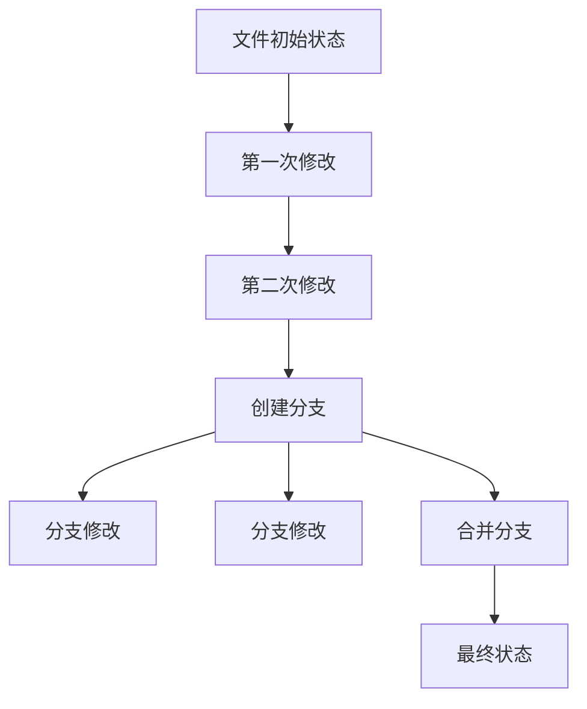
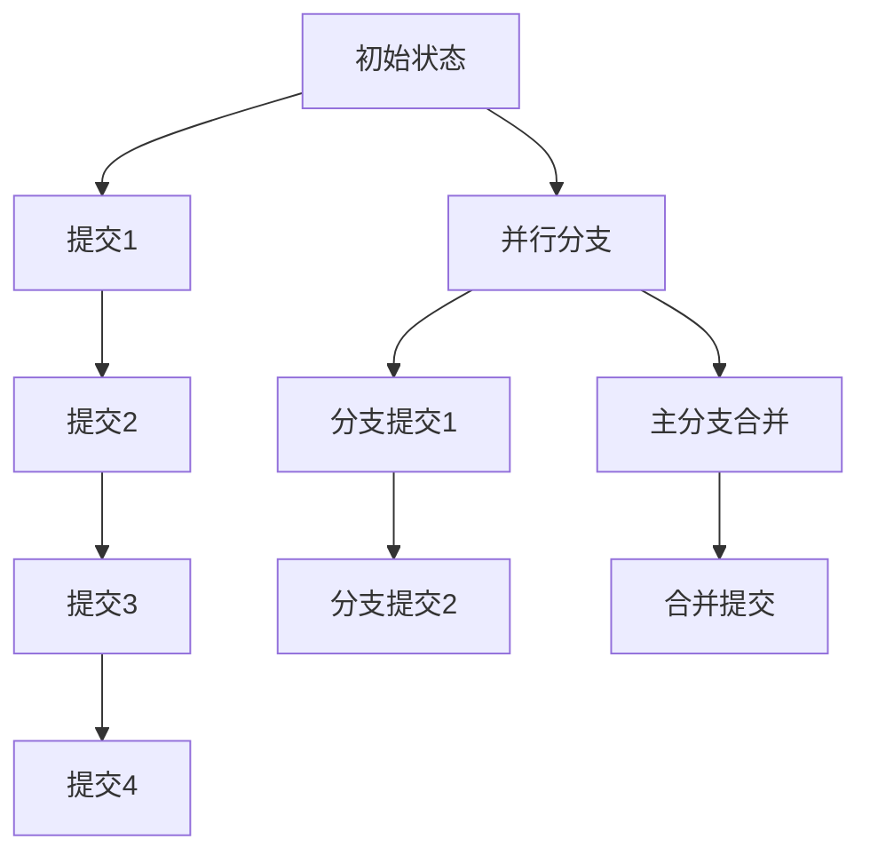
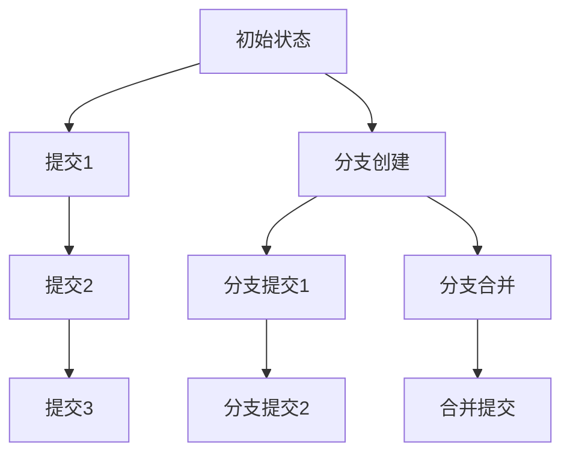

                 

### 第1章：版本控制概述

### 1.1 版本控制的概念与重要性

版本控制是一种跟踪和管理文件或文档变更历史记录的机制，它在软件工程、文档编写以及其他涉及协作工作的领域发挥着至关重要的作用。通过版本控制，团队可以有效地管理代码库或文档库，确保所有工作都是可追溯和可回滚的。

#### 背景介绍

版本控制的历史可以追溯到20世纪60年代，当时程序员们开始意识到在没有系统跟踪变更的情况下，协同工作将变得极其困难。随着计算机技术的发展，版本控制的概念也逐渐成熟，并演变出了多种不同的版本控制系统。

#### 核心概念与联系

版本控制的核心概念包括：

- **变更记录**：记录文件的每一次变更，包括谁修改了什么，何时进行的修改，以及修改的内容。
- **版本**：每次变更后的文件状态。
- **分支**：从主代码库分离出来的独立开发路径。
- **合并**：将两个或多个分支的变更合并到一起。

这些概念之间的关系可以用以下Mermaid流程图来表示：



#### 核心算法原理讲解

版本控制的核心算法原理是确保每次变更都是可追踪的。以下是使用伪代码来描述一个简单的版本控制算法：

```plaintext
function versionControl(file, change):
    # 获取当前版本号
    currentVersion = getVersion(file)

    # 记录变更
    changeLog = {
        "version": currentVersion + 1,
        "author": getCurrentUser(),
        "timestamp": getCurrentTimestamp(),
        "change": change
    }

    # 将变更记录存储在历史记录中
    storeChangeLog(changeLog)

    # 应用变更到文件
    applyChange(file, change)

    # 返回新版本号
    return currentVersion + 1

function getVersion(file):
    # 从文件元数据中获取版本号
    return file.metadata.version

function getCurrentUser():
    # 获取当前登录用户的名称
    return username

function getCurrentTimestamp():
    # 获取当前时间戳
    return timestamp

function storeChangeLog(changeLog):
    # 将变更记录存储在数据库或文件中
    database.insert(changeLog)

function applyChange(file, change):
    # 根据变更内容修改文件
    file.content = file.content + change
```

#### 数学模型和公式

版本控制中的数学模型可以用来描述文件状态的变化。以下是一个简化的数学模型：

$$
F_{new} = F_{old} + \Delta F
$$

其中，$F_{new}$ 是新版本文件，$F_{old}$ 是旧版本文件，$\Delta F$ 是文件变更的内容。

#### 详细讲解和举例说明

让我们通过一个简单的例子来说明版本控制的基本原理。假设一个程序员Alice正在开发一个文本编辑器，她希望跟踪每次代码的变更。

- **初始状态**：版本1，代码如下：

  ```python
  def greet():
      print("Hello, World!")
  ```

- **第一次修改**：Alice添加了一个参数，版本2：

  ```python
  def greet(name):
      print(f"Hello, {name}!")
  ```

- **第二次修改**：另一个程序员Bob加入了日志记录功能，版本3：

  ```python
  import logging

  def greet(name):
      logging.info(f"Greeting {name}")
      print(f"Hello, {name}!")
  ```

通过版本控制，我们可以轻松地回滚到旧版本，或者在需要时合并多个分支的变更。例如，如果我们发现Bob的日志记录功能存在问题，我们可以简单地回滚到版本2：

```python
git checkout v2
```

### 小结

版本控制是软件工程中不可或缺的一部分，它帮助团队协作、管理变更历史、确保代码和文档的安全。通过理解版本控制的核心概念和算法原理，开发人员可以更有效地管理代码库，提高开发效率。

----------------------------------------------------------------

### 1.2 版本控制的起源与发展

版本控制的概念最早可以追溯到20世纪60年代。当时，IBM的System/360项目开发团队意识到在没有系统跟踪变更的情况下，项目将变得难以管理。因此，他们开始使用简单的版本控制方法来记录代码变更。这种方法通常被称为“锁-文档”模型，它通过在文件上进行锁定来确保只有一个开发者可以对其进行修改。

#### 起源

- **1960年代**：IBM的System/360项目引入了早期的版本控制方法。
- **1970年代**：Unix操作系统的发展带来了更先进的版本控制工具，如`rcs`（GNU RCS，一个版本库管理系统）。
- **1980年代**：随着分布式版本控制系统的出现，版本控制变得更加灵活和高效。

#### 发展

- **1990年代**：分布式版本控制系统（DVCS）如Git和Mercurial的出现，使得版本控制变得更加流行和普及。
- **21世纪初**：云服务提供商如GitHub和GitLab的出现，使得版本控制和协作变得更加便捷。

#### 分类

版本控制系统主要分为集中式和分布式两种：

- **集中式版本控制系统**（如SVN）：所有变更都存储在一个中央仓库中，开发者从中央仓库克隆代码并进行修改。
- **分布式版本控制系统**（如Git）：每个开发者都有自己的仓库，他们可以在本地进行修改和合并，然后推送到中央仓库。

#### 核心算法

- **集中式版本控制**：基于文件锁定和差异比较算法。
- **分布式版本控制**：基于本地仓库和分布式网络结构，使用哈希算法（如SHA-1）来确保文件内容的完整性。

### 小结

版本控制的历史和发展展示了其如何从简单的文件跟踪工具演变为现代软件开发中不可或缺的组成部分。理解版本控制的起源和发展有助于我们更好地利用各种版本控制工具，提高团队协作效率和代码管理质量。

----------------------------------------------------------------

### 1.3 版本控制的分类

版本控制系统主要可以分为集中式版本控制系统（CVS）和分布式版本控制系统（DVCS）两大类。它们在操作方式、数据存储结构和适用场景上都有显著差异。

#### 集中式版本控制系统

**基本原理**：集中式版本控制系统（如SVN）采用一个中央仓库来存储所有版本数据，开发者从中央仓库克隆一份代码副本进行开发。

**优点**：

- **中央管理**：便于权限控制和变更跟踪。
- **快速克隆**：开发者可以快速从中央仓库克隆代码，进行本地开发。

**缺点**：

- **单点故障**：中央仓库故障会导致整个团队无法工作。
- **性能瓶颈**：随着项目规模的扩大，中央仓库的负载会增加，导致性能下降。

**代表工具**：

- SVN（Subversion）
- CVS（Concurrent Versions System）

#### 分布式版本控制系统

**基本原理**：分布式版本控制系统（如Git）允许每个开发者拥有一个完整的仓库副本，这些仓库之间通过拉取（pull）和推送（push）操作进行同步。

**优点**：

- **去中心化**：每个仓库都是独立的，不会因为单点故障导致整个团队无法工作。
- **并行开发**：开发者可以在本地进行并行开发，减少中央仓库的负载。

**缺点**：

- **初次克隆时间较长**：由于需要克隆整个仓库，初次克隆时间较长。
- **复杂的管理**：去中心化的结构需要更复杂的管理策略，如分支管理和合并策略。

**代表工具**：

- Git
- Mercurial
- Bazaar

#### 选择依据

- **项目规模**：对于大型项目，分布式版本控制系统更适合，因为它能够处理复杂的分支管理和并行开发。
- **团队协作模式**：如果团队协作紧密，需要实时同步代码，集中式版本控制系统可能更合适。
- **性能需求**：对于需要快速克隆代码的开发者，集中式版本控制系统可能更有优势。

### 小结

版本控制系统的分类有助于我们根据项目需求和团队协作模式选择合适的工具。理解不同类型版本控制系统的优点和缺点，能够帮助我们更好地管理代码库，提高开发效率。

----------------------------------------------------------------

### 1.4 版本控制的基本术语

在版本控制中，了解一些基本术语对于正确使用和管理版本控制系统至关重要。以下是版本控制中常用的一些术语及其解释：

#### 版本（Version）

版本是指文件或代码库在某个特定时间点的状态。每个版本都有一个唯一的标识符，通常是一个数字或字母序列。

#### 变更记录（Change Log）

变更记录是记录文件或代码库每次变更的历史信息。变更记录通常包括版本号、作者、变更内容和时间戳等。

#### 仓库（Repository）

仓库是存储代码或文档的目录，它可以是集中式的（如SVN服务器）或分布式的（如Git仓库）。仓库是版本控制系统的核心。

#### 分支（Branch）

分支是代码库中的一个独立副本，用于开发新功能或修复bug。分支可以从主分支创建，并在需要时合并回主分支。

#### 标签（Tag）

标签是对代码库中某个特定版本的标记。标签通常用于标记重要版本，如发布版本或里程碑版本。

#### 提交（Commit）

提交是将更改从工作区推送到本地仓库的过程。每次提交都会生成一个包含变更记录的版本。

#### 合并（Merge）

合并是将两个或多个分支的变更合并到一起的过程。合并通常用于将新功能或修复的bug从分支合并回主分支。

#### 冲突（Conflict）

冲突是指当尝试合并两个或多个分支时，出现无法自动合并的变更。冲突需要手动解决，以确保合并后的代码一致性。

#### 回滚（Revert）

回滚是将代码库恢复到以前版本的的过程。回滚通常用于撤销错误提交或恢复丢失的功能。

#### 分支管理（Branch Management）

分支管理是跟踪和管理代码库中的分支的过程。有效的分支管理能够确保代码库的整洁和可维护性。

#### 标签管理（Tag Management）

标签管理是跟踪和管理代码库中的标签的过程。标签管理有助于组织代码库的历史和版本。

### 小结

了解版本控制的基本术语对于有效地使用版本控制系统至关重要。这些术语涵盖了从版本和变更记录到分支、标签和合并等关键概念，为版本控制提供了一套统一的语言和操作指南。

----------------------------------------------------------------

### 第2章：版本控制工具简介

在软件工程和文档管理中，版本控制工具扮演着至关重要的角色。本章节将介绍几种常用的版本控制工具，包括Git、SVN、Mercurial和Perforce。我们将从原理、工作流程以及各自的特点进行详细讨论。

#### 2.1 Git简介

**原理**：

Git是一个开源的分布式版本控制系统，由Linus Torvalds在2005年开发。Git基于快照（Snapshot）模型，它将项目历史视为一系列离散的快照，每个快照包含特定时间点的文件状态。

**工作流程**：

1. **克隆（Clone）**：从远程仓库克隆一个副本到本地机器。
2. **检出（Checkout）**：切换到特定的版本或分支。
3. **提交（Commit）**：将更改推送到本地仓库。
4. **推送（Push）**：将本地仓库的更改推送到远程仓库。
5. **拉取（Pull）**：从远程仓库获取最新的更改并更新本地仓库。

**特点**：

- **分布式**：每个开发者都有自己的完整仓库，可以独立工作。
- **快速**：基于快照模型，可以快速创建和切换分支。
- **灵活**：支持多种分支策略和合并方法。

**实际案例**：

Git在开源社区中广泛使用，如Linux内核的开发，GitHub是Git的托管平台，支持大量的开源项目和协作。

#### 2.2 SVN简介

**原理**：

Subversion（SVN）是一个集中式版本控制系统，由CollabNet开发并维护。SVN基于文件的增量模型，每次提交都会将更改同步到中央仓库。

**工作流程**：

1. **检出（Checkout）**：从中央仓库克隆一份代码副本到本地机器。
2. **更新（Update）**：获取中央仓库的最新更改。
3. **提交（Commit）**：将本地更改提交到中央仓库。
4. **合并（Merge）**：将远程仓库的更改合并到本地仓库。

**特点**：

- **集中式**：所有变更都存储在中央仓库，便于权限控制和变更跟踪。
- **简单**：易于理解和使用，适合小规模项目。
- **成熟**：稳定性和社区支持较好。

**实际案例**：

SVN被许多企业用于内部项目的版本控制，尤其是在传统软件开发环境中。

#### 2.3 Mercurial简介

**原理**：

Mercurial是一个开源的分布式版本控制系统，由Matt Mackall创建。它与Git相似，但设计上更注重性能和简洁。

**工作流程**：

1. **克隆（Clone）**：从远程仓库克隆一个副本到本地机器。
2. **检出（Checkout）**：切换到特定的版本或分支。
3. **提交（Commit）**：将更改推送到本地仓库。
4. **推送（Push）**：将本地仓库的更改推送到远程仓库。
5. **拉取（Pull）**：从远程仓库获取最新的更改并更新本地仓库。

**特点**：

- **分布式**：类似于Git，支持分布式工作流程。
- **高效**：优化了内存使用和文件读写速度。
- **简洁**：命令行界面简洁，易于上手。

**实际案例**：

Mercurial在一些企业和开源项目中使用，尤其是在需要高性能的团队协作环境中。

#### 2.4 Perforce简介

**原理**：

Perforce是一个商业的版本控制系统，专为大型项目设计。它基于文件锁定模型，确保并发访问时的数据完整性。

**工作流程**：

1. **检出（Checkout）**：从Perforce服务器检出文件。
2. **更新（Update）**：获取服务器上的最新更改。
3. **提交（Submit）**：将本地更改提交到Perforce服务器。
4. **审查（Review）**：提交前进行代码审查。

**特点**：

- **高性能**：专为处理大量文件设计，性能卓越。
- **文件锁定**：确保并发访问时的数据一致性。
- **审查机制**：内置代码审查功能，确保代码质量。

**实际案例**：

Perforce常用于大型游戏开发和电影特效制作等需要高并发访问和严格审查的项目中。

### 小结

Git、SVN、Mercurial和Perforce是现代版本控制中的四大工具，各自具有独特的优势和适用场景。理解这些工具的原理和工作流程，可以帮助开发者根据项目需求选择合适的版本控制工具，提高开发效率和代码质量。

----------------------------------------------------------------

### 2.1 Git简介

Git是一款开源的分布式版本控制系统，由Linux内核创始人Linus Torvalds于2005年开发。Git的设计目标是速度、简洁和高效，使得它成为开源社区和企业中最受欢迎的版本控制工具之一。

#### 原理

Git基于内容寻址（Content Addressable）和增量存储（Differential Storage）的原理。每个提交都包含一个哈希值，这个哈希值是基于提交内容的加密摘要，确保数据的完整性和一致性。Git使用一种称为“快照”（Snapshot）的方式来存储项目的历史记录，每个快照包含了特定时间点项目文件的状态。

**原理图**：



#### 工作流程

Git的基本工作流程包括以下几个步骤：

1. **克隆（Clone）**：从远程仓库克隆项目副本到本地机器。
   ```bash
   git clone https://example.com/repository.git
   ```

2. **检出（Checkout）**：切换到特定的分支或提交。
   ```bash
   git checkout branch-name
   ```

3. **提交（Commit）**：将更改推送到本地仓库。
   ```bash
   git commit -m "Commit message"
   ```

4. **推送（Push）**：将本地仓库的更改推送到远程仓库。
   ```bash
   git push origin master
   ```

5. **拉取（Pull）**：从远程仓库获取最新的更改并更新本地仓库。
   ```bash
   git pull origin master
   ```

#### 特点

- **分布式**：每个开发者都有自己的完整仓库，可以独立工作，减少中央服务器的压力。
- **快速**：基于快照模型，可以快速创建和切换分支。
- **灵活**：支持多种分支策略和合并方法，如Git Flow、GitHub Flow等。
- **扩展性**：丰富的插件和工具支持，如Git hooks、Git LFS（Large File Storage）等。

#### 实际案例

- **开源社区**：Git是许多开源项目的首选版本控制系统，如Linux内核、OpenJDK、Kubernetes等。
- **企业应用**：许多大型企业和初创公司使用Git来管理他们的代码库，如GitHub、GitLab等。

### 小结

Git作为一款分布式版本控制工具，凭借其速度、灵活性和高效性，成为了现代软件开发中的标准选择。理解Git的基本原理和工作流程，能够帮助开发者更有效地管理代码库，提高团队协作效率。

----------------------------------------------------------------

### 2.2 SVN简介

Subversion（简称SVN）是一个开源的集中式版本控制系统，由CollabNet开发和维护。SVN被广泛用于软件开发、文档管理和其他需要协作工作的领域。SVN的设计目标是提供一个简单、可靠且易于使用的版本控制解决方案。

#### 原理

SVN基于增量存储模型，通过追踪文件和目录的差异来管理版本。每次提交时，SVN将记录当前文件与上一版本之间的差异，并将其存储在中央仓库中。这种增量存储方式使得SVN能够高效地处理大型项目和大量文件。

**原理图**：



#### 工作流程

SVN的工作流程主要包括以下几个步骤：

1. **检出（Checkout）**：从中央仓库克隆一份代码副本到本地机器。
   ```bash
   svn checkout https://example.com/repository
   ```

2. **更新（Update）**：获取中央仓库的最新更改。
   ```bash
   svn update
   ```

3. **提交（Commit）**：将本地更改提交到中央仓库。
   ```bash
   svn commit -m "Commit message"
   ```

4. **合并（Merge）**：将其他分支或远程仓库的更改合并到本地仓库。
   ```bash
   svn merge https://example.com/branch
   ```

#### 特点

- **集中式**：所有变更都存储在中央仓库，便于权限控制和变更跟踪。
- **易于使用**：命令行界面简单直观，易于学习和使用。
- **稳定性**：SVN已经经过长时间的应用和优化，稳定性较好。
- **成熟**：社区支持和文档丰富，适用于各种规模的项目。

#### 代表工具

- SVN（Subversion）
- TortoiseSVN：一个Windows平台的图形界面工具。

#### 实际案例

- **企业内部项目**：许多企业和组织使用SVN来管理内部项目和文档。
- **开源项目**：SVN在一些开源项目中使用，如Apache软件基金会的项目。

### 小结

SVN作为一款成熟的集中式版本控制系统，以其简单易用和稳定性著称。了解SVN的基本原理和工作流程，能够帮助团队更高效地管理代码库，尤其是在需要严格权限控制和变更跟踪的场景中。

----------------------------------------------------------------

### 2.2.1 Git的工作流程

Git作为一款分布式版本控制工具，其工作流程设计简洁而高效，使得开发者能够轻松地管理代码库和协作工作。以下是Git的基本工作流程及其详细步骤：

#### 克隆（Clone）

克隆是指从远程仓库获取一份代码副本到本地机器。这个过程包括以下步骤：

1. **初始化仓库**：在本地创建一个新的Git仓库。
   ```bash
   git init
   ```

2. **添加远程仓库**：将远程仓库的地址添加到本地仓库中。
   ```bash
   git remote add origin https://example.com/repository.git
   ```

3. **获取远程仓库内容**：从远程仓库克隆代码到本地。
   ```bash
   git clone https://example.com/repository.git
   ```

#### 检出（Checkout）

检出是指切换到特定的分支或提交。以下是一些常见操作：

1. **切换到特定分支**：
   ```bash
   git checkout branch-name
   ```

2. **创建新分支**：
   ```bash
   git checkout -b new-branch
   ```

3. **切换到上一个分支**：
   ```bash
   git checkout -
   ```

#### 提交（Commit）

提交是指将更改从工作区推送到本地仓库。以下是提交的基本步骤：

1. **暂存更改**：将工作区的更改添加到暂存区。
   ```bash
   git add .
   ```

2. **提交暂存区更改**：将暂存区的更改提交到本地仓库。
   ```bash
   git commit -m "Commit message"
   ```

#### 推送（Push）

推送是指将本地仓库的更改推送到远程仓库。以下是推送的基本步骤：

1. **推送特定分支**：
   ```bash
   git push origin branch-name
   ```

2. **推送所有分支**：
   ```bash
   git push --all
   ```

#### 拉取（Pull）

拉取是指从远程仓库获取最新的更改并更新本地仓库。以下是拉取的基本步骤：

1. **拉取远程仓库**：
   ```bash
   git pull origin branch-name
   ```

2. **拉取并合并**：
   ```bash
   git pull --rebase origin branch-name
   ```

#### 分支管理

分支管理是Git的核心功能之一，用于实现并行开发和代码隔离。以下是分支管理的一些基本操作：

1. **创建分支**：
   ```bash
   git checkout -b feature-branch
   ```

2. **切换分支**：
   ```bash
   git checkout branch-name
   ```

3. **合并分支**：
   ```bash
   git merge feature-branch
   ```

4. **删除分支**：
   ```bash
   git branch -d feature-branch
   ```

#### 标签管理

标签管理用于标记代码库中的特定版本，如发布版本或里程碑。以下是标签管理的基本步骤：

1. **创建标签**：
   ```bash
   git tag -a v1.0 -m "Release version 1.0"
   ```

2. **推送标签**：
   ```bash
   git push origin v1.0
   ```

3. **删除标签**：
   ```bash
   git tag -d v1.0
   ```

### 小结

Git的工作流程包括克隆、检出、提交、推送、拉取等基本步骤，使得开发者能够高效地管理代码库并进行协作。理解并熟练掌握Git的工作流程，对于提升开发效率和团队协作至关重要。

----------------------------------------------------------------

### 2.2.2 其他版本控制工具

除了Git之外，还有许多其他流行的版本控制工具，包括SVN、Mercurial和Perforce。每个工具都有其独特的特点和应用场景。以下是这些工具的基本介绍和特点。

#### SVN

**简介**：

Subversion（SVN）是一个集中式版本控制系统，由Apache软件基金会开发。SVN旨在提供一个简单、可靠且易于使用的版本控制解决方案，广泛用于企业内部项目。

**特点**：

- **集中式**：所有变更都存储在中央仓库，便于权限控制和变更跟踪。
- **易于使用**：命令行界面直观，适合初学者。
- **稳定性**：经过长时间的应用和优化，稳定性和社区支持良好。

**应用场景**：

- **企业内部项目**：适用于规模较小且团队协作紧密的项目。
- **文档管理**：适用于文档和配置文件的管理。

#### Mercurial

**简介**：

Mercurial是一个开源的分布式版本控制系统，由Matt Mackall创建。与Git类似，Mercurial也支持分布式工作流程，但设计上更注重性能和简洁。

**特点**：

- **分布式**：每个开发者都有自己的完整仓库，可以独立工作。
- **高效**：优化了内存使用和文件读写速度。
- **简洁**：命令行界面简洁，易于上手。

**应用场景**：

- **企业协作**：适用于需要高性能和简洁界面的企业团队。
- **开源项目**：一些开源项目使用Mercurial进行版本控制。

#### Perforce

**简介**：

Perforce是一个商业的版本控制系统，专为处理大量文件和高并发访问设计。它采用文件锁定模型，确保数据的一致性和完整性。

**特点**：

- **高性能**：优化了处理大量文件的性能。
- **文件锁定**：确保并发访问时的数据一致性。
- **审查机制**：提供代码审查功能，确保代码质量。

**应用场景**：

- **大型项目**：适用于大型游戏开发和电影特效制作等需要高并发访问的项目。
- **团队协作**：适用于需要严格审查和协作的项目。

### 小结

SVN、Mercurial和Perforce是除Git之外的其他流行版本控制工具。每个工具都有其独特的优势和适用场景。理解这些工具的特点和适用场景，有助于根据项目需求选择合适的版本控制工具，提高开发效率和团队协作质量。

----------------------------------------------------------------

### 3.1 提交与分支管理

在版本控制中，提交和分支管理是两个核心概念，它们确保了代码库的整洁、可追踪性和并行开发的能力。以下是关于提交和分支管理的基本流程和策略。

#### 提交操作

**基本流程**：

1. **修改文件**：在工作区（Working Directory）中修改文件。

2. **暂存更改**：将修改的文件添加到暂存区（Staging Area）。
   ```bash
   git add <file>
   ```

3. **提交更改**：将暂存区的更改提交到本地仓库。
   ```bash
   git commit -m "Commit message"
   ```

**策略**：

- **频繁提交**：经常性地提交小而明确的变更，有助于代码库的可追踪性和问题定位。
- **清晰注释**：每次提交都应该有一个明确的注释，描述变更的目的和影响。

#### 分支管理

**基本流程**：

1. **创建分支**：从主分支创建一个新的分支。
   ```bash
   git checkout -b feature-branch
   ```

2. **开发功能**：在分支上进行开发，实现新功能或修复bug。

3. **提交更改**：将开发过程中的更改提交到分支。
   ```bash
   git commit -m "Commit message"
   ```

4. **合并分支**：将分支的更改合并回主分支。
   ```bash
   git checkout master
   git merge feature-branch
   ```

5. **删除分支**：合并完成后，删除不再需要的分支。
   ```bash
   git branch -d feature-branch
   ```

**策略**：

- **特征分支**：为每个新功能创建一个特征分支，确保主分支的稳定性。
- **分支命名**：使用有意义且描述性的名称来命名分支，便于理解和跟踪。
- **分支清理**：定期清理无用的分支，保持代码库的整洁。

#### 冲突解决

**基本流程**：

1. **检出冲突**：当尝试合并时，如果出现冲突，Git会提示冲突区域。
   ```bash
   git status
   ```

2. **手动解决**：编辑冲突文件，手动合并不同分支的更改。

3. **提交更改**：解决冲突后，将更改提交到本地仓库。
   ```bash
   git add <file>
   git commit -m "Resolved conflict"
   ```

**策略**：

- **及时解决**：及时解决冲突，避免积压。
- **记录变更**：记录冲突解决的过程和原因，便于问题追踪。

### 小结

提交和分支管理是版本控制中的关键环节，通过合理的流程和策略，可以确保代码库的整洁性和可追踪性，提高团队协作效率。理解并掌握这些基本流程和策略，对于提升开发质量和团队协作至关重要。

----------------------------------------------------------------

### 3.2 冲突解决

在版本控制过程中，冲突解决是不可避免的一环。当两个或多个开发者对同一文件进行了不同的修改，并且在尝试合并这些修改时，系统无法自动合并这些变更，这时就需要手动解决冲突。

#### 冲突的原因

冲突的产生通常有以下几种原因：

1. **并行开发**：当多个开发者同时对同一文件进行了修改时，合并这些修改可能会导致冲突。
2. **远程更新**：当本地代码与远程仓库的代码不一致时，拉取更新可能会导致冲突。
3. **不同视角**：不同的开发者可能对同一问题有不同的解决方案，这也会导致冲突。

#### 冲突解决的策略

**手动解决冲突**：

1. **检出冲突**：当尝试合并时，Git会自动检测冲突并标记出冲突区域。使用`git status`命令可以查看冲突的文件。
2. **编辑冲突**：打开冲突文件，手动合并不同的修改。冲突区域通常以`<<<<<<`和`>>>>>>`分隔，分别代表来自不同分支的修改。
3. **保存更改**：在解决冲突后，保存并关闭文件。
4. **添加到暂存区**：将解决后的文件添加到暂存区。
   ```bash
   git add <file>
   ```

5. **提交更改**：提交解决后的文件。
   ```bash
   git commit -m "Resolved conflict"
   ```

**自动化解决冲突**：

1. **使用冲突解决工具**：一些版本控制工具支持使用外部冲突解决工具，如`kdiff3`、`meld`等。
2. **预合并检查**：在合并前使用预合并工具检查潜在的冲突，提前解决。
3. **使用变基（Rebase）**：使用`git rebase`命令可以将本地的更改应用到远程更改之前，从而避免冲突。

#### 示例

假设开发者A和开发者B同时修改了同一个文件，并在尝试合并时产生了冲突。以下是解决冲突的步骤：

1. **检出冲突**：
   ```bash
   git merge branch-B
   ```
   Git会提示冲突文件。

2. **编辑冲突**：
   ```plaintext
   <<<<<<< HEAD
   // 开发者A的更改
   >>()<<>>)>>) branch-B
   // 开发者B的更改
   <<<<<<<<
   ```

3. **手动合并更改**：
   - 删除`<<<<<<`和`>>>>>>`之间的内容。
   - 手动合并两个分支的更改。

4. **保存并添加到暂存区**：
   ```bash
   git add <file>
   ```

5. **提交更改**：
   ```bash
   git commit -m "Resolved conflict"
   ```

### 小结

冲突解决是版本控制过程中的一项重要任务。通过理解冲突的产生原因和解决策略，开发者可以有效地处理版本控制中的冲突，确保代码库的整洁性和一致性。

----------------------------------------------------------------

### 3.3 标签与合并

在版本控制中，标签（Tags）和合并（Merging）是两个非常重要的概念。它们用于标记特定版本和将多个版本合并到一起。以下是关于标签和合并的详细解释。

#### 标签

**定义**：

标签是版本控制系统中用于标记特定版本的引用。它们可以用于标记发布版本、里程碑或其他重要版本。

**创建标签**：

创建标签的命令如下：
```bash
git tag -a <tag-name> -m "Tag message"
```
其中，`<tag-name>`是标签的名称，`-m`后面的内容是标签的描述信息。

**推送标签**：

将标签推送到远程仓库的命令如下：
```bash
git push origin <tag-name>
```

**删除标签**：

删除标签的命令如下：
```bash
git tag -d <tag-name>
git push origin :refs/tags/<tag-name>
```

#### 合并

**定义**：

合并是将两个或多个分支的更改合并到一起的过程。合并可以分为以下几种类型：

- **分支合并（Merge）**：将一个分支的更改合并到另一个分支。
- **叉合合并（Squash Merge）**：将一个分支的多个提交合并到一个提交。

**合并流程**：

1. **切换到目标分支**：
   ```bash
   git checkout <target-branch>
   ```

2. **执行合并**：
   ```bash
   git merge <source-branch>
   ```

3. **解决冲突**：如果出现冲突，需要手动解决，并添加到暂存区。

4. **提交更改**：
   ```bash
   git commit -m "Merge message"
   ```

**示例**：

假设要合并`featureA`分支的更改到`master`分支，操作如下：

1. 切换到`master`分支：
   ```bash
   git checkout master
   ```

2. 执行合并：
   ```bash
   git merge featureA
   ```

3. 如果出现冲突，手动解决并提交：
   ```bash
   git add <file>
   git commit -m "Merged featureA into master"
   ```

#### 标签与合并的关系

标签通常用于标记需要合并的特定版本，而合并则是将多个版本合并到一起的过程。在实际开发中，常常会在发布新版本时创建一个标签，然后合并这个标签到主分支。

### 小结

标签和合并是版本控制中不可或缺的概念。通过创建和管理标签，可以轻松地标记和追踪重要版本。而通过合并，可以将多个版本的更改合并到一起，确保代码库的一致性和完整性。理解并掌握这些操作，有助于更高效地管理代码库和团队协作。

----------------------------------------------------------------

### 第4章：提示词编程概述

#### 4.1 提示词编程的定义

提示词编程（Prompt-Based Programming）是一种利用自然语言提示来引导程序执行的方法。在这种方法中，程序员通过编写提示词（Prompts）来指定程序的输入和输出，而不需要编写传统的代码逻辑。提示词编程的核心思想是将编程任务转化为对提示词的调整和优化，从而实现复杂的功能。

#### 4.2 提示词编程的特点

提示词编程具有以下几个显著特点：

1. **直观性**：提示词编程使用自然语言，使得非专业程序员或新手也能参与编程。
2. **灵活性**：程序员可以根据需求灵活调整提示词，以实现不同的功能。
3. **可解释性**：提示词编程的执行过程更易于理解，有助于代码审查和调试。
4. **减少编码量**：通过使用提示词，可以减少代码编写的工作量，提高开发效率。

#### 4.3 提示词编程的应用场景

提示词编程在多种应用场景中具有潜力：

1. **自动化脚本**：用于自动化常见的任务，如文件处理、数据提取等。
2. **数据处理**：通过提示词，可以简化数据清洗和转换的过程。
3. **AI模型训练**：提示词编程可以用于生成训练数据，优化AI模型的性能。
4. **用户交互**：在交互式应用程序中，提示词编程可以提供更自然的用户交互体验。

### 小结

提示词编程通过自然语言提示简化了编程过程，提高了开发效率和代码的可解释性。理解其定义和特点，可以帮助开发者根据不同应用场景选择合适的编程方法。

----------------------------------------------------------------

### 4.4 提示词编程的基础知识

#### 4.4.1 编程范式

提示词编程支持多种编程范式，包括面向过程、面向对象和函数式编程。

1. **面向过程**：面向过程编程强调程序的控制流和过程调用。在提示词编程中，可以通过提示词来指定程序的顺序执行。

    ```plaintext
    Prompt: "请计算1到10的数字和"
    Output: "数字和为55"
    ```

2. **面向对象**：面向对象编程通过对象和类的概念来组织代码。在提示词编程中，可以通过提示词来定义对象和对象的行为。

    ```plaintext
    Prompt: "定义一个学生类，包含姓名和年龄属性，以及学习方法"
    Output: "学生类定义如下："
    ```

3. **函数式编程**：函数式编程强调函数的使用和状态的不可变性。在提示词编程中，可以通过提示词来定义函数，并传递参数和返回结果。

    ```plaintext
    Prompt: "编写一个函数，计算两个数的和"
    Output: "函数定义如下："
    ```

#### 4.4.2 编程语言基础

提示词编程需要一定的编程语言基础，以下是一些基本概念：

1. **基本语法**：了解编程语言的基本语法规则，如变量定义、控制结构（if-else、for循环等）和函数定义。

    ```plaintext
    Prompt: "定义一个变量x，并赋值为5"
    Output: "x = 5"
    ```

2. **常用数据结构**：熟悉常用数据结构，如数组、列表、字典和集合，以及它们的操作。

    ```plaintext
    Prompt: "创建一个包含10个整数的数组"
    Output: "数组定义如下："
    ```

3. **控制结构**：掌握条件语句（if-else）和循环语句（for、while）的使用。

    ```plaintext
    Prompt: "编写一个程序，计算100以内的所有偶数之和"
    Output: "程序代码如下："
    ```

#### 4.4.3 常用工具和框架

提示词编程可以使用多种工具和框架来简化开发过程。以下是一些常用的工具和框架：

1. **自动提示词生成器**：这些工具可以根据用户的需求自动生成提示词，如PromptScript、AutoPrompt等。

2. **编程语言特定工具**：某些编程语言提供了专门的提示词编程工具，如Python的`prompt_toolkit`、JavaScript的`inquirer.js`等。

3. **集成开发环境（IDE）**：一些IDE支持提示词编程，如Visual Studio Code、PyCharm等，提供了丰富的提示词编写和调试功能。

### 小结

提示词编程的基础知识包括编程范式、编程语言基础和常用工具和框架。了解这些基础知识，可以更好地掌握提示词编程，提高开发效率。

----------------------------------------------------------------

### 4.5 提示词编程进阶

#### 4.5.1 高级编程技巧

在提示词编程中，掌握一些高级编程技巧能够帮助开发者编写更高效、可维护的代码。

1. **设计模式**：

   设计模式是一套经过验证的解决方案，用于解决常见编程问题。在提示词编程中，可以使用设计模式来组织代码，提高可维护性。例如，工厂模式用于创建对象，单例模式用于确保类只有一个实例。

   ```plaintext
   Prompt: "使用工厂模式创建用户对象"
   Output: "工厂模式代码如下："
   ```

2. **性能优化**：

   提示词编程同样需要考虑性能优化。例如，可以使用缓存来减少重复计算，使用异步操作来提高程序响应速度。以下是一个性能优化的示例：

   ```plaintext
   Prompt: "优化一个计算大数之和的程序"
   Output: "优化后的代码如下："
   ```

3. **代码复用**：

   通过编写通用和可复用的提示词，可以减少重复代码，提高开发效率。例如，可以使用函数或模块来封装常用的操作。

   ```plaintext
   Prompt: "编写一个计算平均值的通用函数"
   Output: "通用函数代码如下："
   ```

#### 4.5.2 跨平台编程

跨平台编程是指在多种操作系统上运行代码的能力。提示词编程同样需要考虑跨平台兼容性。

1. **跨平台编程工具**：

   使用跨平台编程工具和框架，如Node.js、Python和Java，可以轻松地在不同操作系统上运行代码。

   ```plaintext
   Prompt: "使用Node.js编写一个跨平台的Web服务器"
   Output: "跨平台Web服务器代码如下："
   ```

2. **跨平台编程策略**：

   在编写跨平台代码时，需要注意以下几个方面：

   - **操作系统兼容性**：确保代码在不同操作系统上都能正常运行。
   - **依赖管理**：使用统一的依赖管理工具，如npm或pip，确保依赖的一致性。
   - **测试覆盖**：编写跨平台测试，确保代码在不同操作系统上的正确性。

   ```plaintext
   Prompt: "编写一个跨平台的文件读取程序"
   Output: "跨平台文件读取程序代码如下："
   ```

### 小结

提示词编程进阶涉及到高级编程技巧和跨平台编程。通过掌握这些技巧和策略，开发者可以编写更高效、可维护的代码，并确保其在多种操作系统上正常运行。

----------------------------------------------------------------

### 第7章：协作机制概述

#### 7.1 协作机制的概念

协作机制是指在多个开发者之间共同工作、分享资源和知识，以实现共同目标的组织方式。它包括一系列规则、工具和流程，用于确保团队成员之间的协调和高效合作。协作机制的核心目标是提高工作效率、减少冲突、保证代码质量和项目进度。

#### 7.2 协作机制的目标

协作机制的主要目标包括：

1. **资源共享**：通过共享代码库、文档和工具，使得团队成员能够快速获取所需资源。
2. **信息透明**：确保所有团队成员都能及时获取项目的最新进展、问题和决策，提高团队的透明度。
3. **任务分配**：合理分配任务，确保每个成员都能在其擅长的领域发挥作用。
4. **冲突避免**：通过明确的责任分配和沟通机制，减少团队内部因任务冲突而产生的矛盾。
5. **质量保证**：通过代码审查、测试和流程规范，确保项目质量和代码的可维护性。

#### 7.3 协作机制的分类

协作机制可以根据不同的维度进行分类，常见的分类方法包括：

1. **基于工具的协作机制**：根据使用的协作工具（如Git、Jira、Trello等）来划分。
   - **代码协作**：通过版本控制工具（如Git）实现代码的共享、分支管理和合并。
   - **任务协作**：通过任务管理工具（如Jira、Trello）来分配任务、跟踪进度和协作。

2. **基于流程的协作机制**：根据工作流程和项目管理方法（如敏捷开发、Scrum等）来划分。
   - **敏捷开发**：强调快速迭代、持续交付和团队协作。
   - **Scrum**：通过冲刺（Sprint）和每日站会来管理项目进度和团队协作。

3. **基于团队的协作机制**：根据团队结构和角色划分。
   - **职能团队**：按职能划分团队，如前端开发、后端开发和测试团队。
   - **跨职能团队**：包含不同职能角色的团队成员，以便快速响应和解决问题。

### 小结

协作机制是确保团队高效协作的关键。通过理解协作机制的概念、目标和分类，团队成员可以更好地协同工作，提高项目的成功率和代码质量。

----------------------------------------------------------------

### 8.1 团队协作工具概述

#### 8.1.1 团队协作工具的分类

团队协作工具根据功能和应用场景的不同，可以分为以下几类：

1. **代码协作工具**：主要用于代码的共享、分支管理和合并。如Git、GitHub、GitLab等。
2. **任务管理工具**：用于分配任务、跟踪进度和协作。如Jira、Trello、Asana等。
3. **文档协作工具**：用于编写、共享和协作编辑文档。如Google Docs、Microsoft Teams、Confluence等。
4. **通信工具**：用于团队内部和跨团队的实时沟通。如Slack、Microsoft Teams、Zoom等。
5. **项目管理工具**：用于整体项目管理，包括项目规划、资源分配、进度跟踪等。如Trello、Jira、Asana等。

#### 8.1.2 团队协作工具的选择

选择合适的团队协作工具需要考虑以下因素：

1. **团队规模**：大型团队可能需要功能更全面的工具，如Jira或Asana；小型团队可以选择更简洁的工具，如Trello或Notion。
2. **功能需求**：根据团队的具体需求，选择具有相应功能的工具。例如，如果团队主要关注代码协作，Git和GitHub是理想选择。
3. **易用性**：选择界面友好、操作简单的工具，以便团队成员快速上手。
4. **集成性**：选择能够与其他工具集成的工具，以实现更高效的工作流程。
5. **成本**：考虑工具的成本，包括免费版本和专业版本的价格，以及是否需要购买额外插件或服务。

#### 8.1.3 常见团队协作工具

以下是一些常见团队协作工具及其特点：

1. **Git**：
   - **功能**：代码管理、分支管理、合并。
   - **特点**：分布式版本控制，灵活性强。
   - **适用场景**：开源项目、内部项目。

2. **GitHub**：
   - **功能**：代码托管、协作、代码审查。
   - **特点**：集成Jira、Slack等工具，用户社区支持。
   - **适用场景**：开源项目、商业项目。

3. **GitLab**：
   - **功能**：代码管理、协作、CI/CD。
   - **特点**：自托管，可完全控制。
   - **适用场景**：内部项目、小型企业。

4. **Jira**：
   - **功能**：任务管理、项目管理、敏捷开发。
   - **特点**：功能丰富，灵活度高。
   - **适用场景**：大型企业、敏捷团队。

5. **Trello**：
   - **功能**：任务管理、进度跟踪。
   - **特点**：界面简洁，易于操作。
   - **适用场景**：小型团队、项目管理。

6. **Asana**：
   - **功能**：任务管理、项目管理、协作。
   - **特点**：多平台支持，集成性强。
   - **适用场景**：中型企业、多团队协作。

7. **Slack**：
   - **功能**：即时通讯、协作、文档共享。
   - **特点**：插件丰富，支持多种集成。
   - **适用场景**：跨部门协作、即时沟通。

### 小结

团队协作工具的选择应根据团队规模、功能需求、易用性、集成性和成本等因素综合考虑。常见团队协作工具各具特色，适用于不同的应用场景，可以帮助团队提高工作效率和协作质量。

----------------------------------------------------------------

### 8.2 Git与团队协作

#### 8.2.1 Git在团队协作中的应用

Git作为一款分布式版本控制系统，在团队协作中发挥着关键作用。以下是Git在团队协作中的应用：

1. **共享代码库**：

   Git允许团队成员在同一个远程仓库中共享代码，通过克隆（Clone）和推送（Push）操作，开发者可以在本地进行开发，并将更改同步到远程仓库。

2. **分支管理**：

   Git的分支管理功能使得团队可以在不同的分支上独立开发新功能或修复bug，而不影响主分支的稳定性。开发完成后，通过合并（Merge）操作将分支的更改整合到主分支。

3. **代码审查**：

   Git支持代码审查（Code Review）功能，通过GitHub、GitLab等平台，团队成员可以对代码进行审查和反馈，确保代码质量和一致性。

4. **协作工具集成**：

   Git可以与其他团队协作工具（如Jira、Trello、Slack等）集成，实现任务管理、进度跟踪和实时沟通，提高团队协作效率。

#### 8.2.2 Git与其他团队协作工具的集成

以下是一些常见的Git与其他团队协作工具的集成方法：

1. **GitHub与Jira集成**：

   GitHub可以与Jira集成，实现任务和代码之间的关联。开发者可以在Jira中创建任务，并将其关联到GitHub上的特定分支或提交。

   ```plaintext
   Prompt: "如何将GitHub与Jira集成？"
   Output: "可以通过Jira Cloud App或GitHub Marketplace中的Jira集成应用实现。"
   ```

2. **GitLab与Trello集成**：

   GitLab可以与Trello集成，实现任务和分支之间的同步。开发者在Trello中创建任务，任务状态和分支状态可以实时同步。

   ```plaintext
   Prompt: "如何将GitLab与Trello集成？"
   Output: "可以通过GitLab的集成平台找到Trello的集成应用，按照指示进行配置。"
   ```

3. **Slack与Git集成**：

   Git可以与Slack集成，通过Webhook或Slackbot，实时向团队成员发送代码提交、合并和审查的通知。

   ```plaintext
   Prompt: "如何将Git与Slack集成？"
   Output: "可以在GitHub、GitLab或Bitbucket的设置中配置Webhook，将通知发送到Slack频道。"
   ```

#### 小结

Git在团队协作中的应用至关重要，通过与其他团队协作工具的集成，可以实现更高效的工作流程和协作模式。掌握这些集成方法，有助于团队更好地管理项目、跟踪进度和协作沟通。

----------------------------------------------------------------

### 9.1 项目管理概述

#### 9.1.1 项目管理的目标

项目管理的核心目标是确保项目按时、按预算、按质量完成。具体而言，项目管理的目标包括以下几个方面：

1. **明确项目目标**：确保项目团队对项目的目标、范围和期望结果有共同的理解。
2. **资源优化配置**：合理分配项目所需的人力、物资和资金资源，确保资源的高效利用。
3. **进度控制**：通过监控项目进度，及时发现并解决问题，确保项目按计划进行。
4. **风险控制**：识别项目潜在的风险，并制定相应的风险应对策略，降低风险对项目的影响。
5. **质量保证**：确保项目产出符合预定的质量标准，满足用户需求和期望。

#### 9.1.2 项目管理的方法

项目管理的方法多种多样，不同的方法适用于不同类型的项目。以下是几种常见的项目管理方法：

1. **敏捷开发**：

   敏捷开发强调快速迭代和持续交付，通过短周期的工作（如冲刺Sprint）来不断优化和改进项目。敏捷开发的核心原则包括：

   - **客户协作**：与客户紧密合作，确保项目方向和需求的一致性。
   - **迭代开发**：定期交付可工作的软件，不断调整和改进。
   - **团队协作**：鼓励团队成员之间的沟通和协作，提高团队效率。

2. **Scrum**：

   Scrum是一种敏捷开发方法，它通过冲刺（Sprint）和每日站会来管理项目进度和团队协作。Scrum的核心流程包括：

   - **冲刺计划会议**：在冲刺开始前，团队规划将要完成的任务。
   - **每日站会**：每日召开短会，讨论进展、问题和计划。
   - **冲刺评审会议**：在冲刺结束时，团队评审冲刺成果，收集反馈。
   - **冲刺回顾会议**：在冲刺结束时，团队回顾冲刺过程，找出改进点。

3. **传统项目管理**：

   传统项目管理方法强调详细的计划和严格的执行，适用于需求明确、变化较少的项目。传统项目管理的主要流程包括：

   - **项目计划**：制定详细的项目计划，包括任务、时间表和资源分配。
   - **项目执行**：按照计划执行项目任务，监控项目进度和质量。
   - **项目监控**：定期监控项目进展，识别和解决问题。
   - **项目收尾**：完成项目任务，进行项目总结和评估。

### 小结

项目管理是确保项目成功完成的关键。通过明确项目目标、优化资源配置、控制进度和质量，以及选择合适的项目管理方法，项目团队可以更好地应对项目挑战，实现项目的成功交付。

----------------------------------------------------------------

### 9.2 团队协作流程

#### 9.2.1 团队协作流程的构建

构建有效的团队协作流程是确保项目顺利推进和团队高效协作的关键。以下是构建团队协作流程的步骤：

1. **明确项目目标**：

   在构建协作流程前，首先需要明确项目的目标、范围和预期成果。这有助于确保团队成员对项目的方向和目标有共同的理解。

2. **定义角色和职责**：

   根据项目需求和团队规模，明确每个团队成员的角色和职责。这有助于确保每个成员都知道自己的任务和期望，减少误解和冲突。

3. **确定协作工具**：

   选择合适的协作工具，如Git、Jira、Slack等，以支持团队协作和任务管理。确保所有团队成员都能熟练使用这些工具，并了解如何高效地使用它们。

4. **制定工作流程**：

   制定具体的工作流程，包括代码提交、审查、测试、部署等环节。明确每个环节的责任人和操作步骤，确保工作流程的清晰和可执行性。

5. **定期沟通和反馈**：

   设定定期的沟通会议，如每日站会、周会等，以讨论项目进展、问题和改进点。同时，鼓励团队成员之间提供反馈，以便及时调整和优化协作流程。

#### 9.2.2 团队协作流程的优化

团队协作流程的优化是持续改进和提升团队效率的关键。以下是优化团队协作流程的几个步骤：

1. **定期评估**：

   定期评估协作流程的效果，收集团队成员的反馈和意见。通过分析协作过程中的瓶颈和问题，找到优化的方向。

2. **引入敏捷方法**：

   引入敏捷开发方法，如Scrum或看板（Kanban），以实现更灵活和高效的团队协作。这些方法强调迭代和持续改进，有助于提高团队的响应速度和适应能力。

3. **自动化和工具集成**：

   利用自动化工具和集成解决方案，简化协作流程，减少手动操作和重复工作。例如，使用CI/CD工具自动化测试和部署，使用集成平台（如Jenkins）实现不同工具的集成。

4. **持续培训和学习**：

   提供定期的培训和学习机会，帮助团队成员掌握新工具和方法，提高协作技能。鼓励团队成员分享经验和最佳实践，促进团队知识的积累和传递。

5. **反馈和改进**：

   建立反馈机制，鼓励团队成员提出改进建议，并定期评估和实施这些建议。通过持续改进，确保团队协作流程的不断完善和优化。

### 小结

构建和优化团队协作流程是提高团队效率和项目成功的关键。通过明确项目目标、定义角色和职责、选择合适的工具、制定工作流程和定期沟通反馈，团队可以更好地协同工作，实现项目的成功交付。持续评估和改进协作流程，有助于团队不断成长和优化。

----------------------------------------------------------------

### 第10章：案例研究

#### 10.1 案例一：提示词编程项目实战

**项目背景**：

某科技公司计划开发一款基于提示词编程的智能客服系统，旨在通过自然语言交互提供高效、个性化的客户服务。项目团队由前端开发、后端开发和AI研究员组成，采用Git进行版本控制，使用GitHub管理代码库。

**项目目标**：

1. 开发一个可扩展的智能客服系统，支持自然语言理解和多轮对话。
2. 实现高效的代码协作和版本控制，确保项目进展顺利。

**项目实现**：

1. **需求分析**：首先进行需求分析，确定系统的功能和性能要求。通过文档协作工具（如Confluence）记录需求和分析结果。

2. **环境搭建**：在GitHub上创建项目仓库，配置Git，搭建开发环境。团队成员克隆仓库到本地机器，开始开发。

3. **前端开发**：前端团队使用React框架开发用户界面，通过Git进行代码管理。使用Git分支策略（如Git Flow）管理不同阶段的开发。

   ```plaintext
   Prompt: "创建一个前端组件，实现登录功能"
   Output: "React组件代码如下："
   ```

4. **后端开发**：后端团队使用Node.js和Express框架开发API，使用Mongoose操作MongoDB数据库。通过Git进行版本控制和协作。

   ```plaintext
   Prompt: "编写一个API，实现用户登录功能"
   Output: "Node.js API代码如下："
   ```

5. **AI开发**：AI研究员使用Python和TensorFlow开发自然语言处理模型，通过Git管理模型代码和数据。

   ```plaintext
   Prompt: "训练一个简单的文本分类模型"
   Output: "Python代码和训练命令如下："
   ```

6. **集成测试**：在各个组件开发完成后，进行集成测试，确保系统各部分协同工作。使用Jest和Mocha等测试框架编写单元测试和集成测试。

   ```plaintext
   Prompt: "编写一个测试用例，验证用户登录API的功能"
   Output: "测试代码如下："
   ```

7. **代码审查**：在代码提交前，进行代码审查，确保代码质量和一致性。使用GitHub的Pull Request功能，团队成员可以评论和反馈。

   ```plaintext
   Prompt: "如何进行代码审查？"
   Output: "可以通过GitHub的Pull Request功能进行。"
   ```

8. **部署上线**：在完成测试和代码审查后，将代码部署到生产环境。使用自动化部署工具（如Docker和Kubernetes）简化部署流程。

   ```plaintext
   Prompt: "如何自动化部署智能客服系统？"
   Output: "可以通过CI/CD工具（如Jenkins或GitHub Actions）实现。"
   ```

**项目效果分析**：

通过Git和GitHub进行版本控制和协作，项目团队实现了高效的代码管理和协作。提示词编程方法的引入，使得AI模型的开发更加灵活和可维护。项目最终成功上线，用户反馈良好，提高了公司的客户服务质量和效率。

**项目小结**：

本项目通过采用提示词编程、Git版本控制、代码审查和自动化部署等最佳实践，成功实现了智能客服系统的开发。项目结果表明，有效的版本控制和协作机制对于大型项目的成功至关重要。

----------------------------------------------------------------

### 第11章：实践指南

#### 11.1 版本控制实践

**版本控制策略**：

1. **主分支策略**：主分支（如master或main）是项目的核心分支，所有生产代码都应该合并到这里。开发者在各自的特性分支上进行开发，完成后合并回主分支。

2. **特性分支策略**：每个特性分支代表一个独立的功能或改进点。特性分支在完成开发、测试和代码审查后，合并回主分支。

3. **发布分支策略**：在准备发布新版本时，从主分支创建一个发布分支，进行最后的测试和修复。发布完成后，将发布分支合并回主分支。

**最佳实践**：

1. **定期备份**：定期备份代码库，以防意外丢失或损坏。

2. **提交信息规范**：确保每次提交都包含清晰的提交信息，描述变更的目的和影响。

3. **代码审查**：在进行代码提交前，进行代码审查，确保代码质量和一致性。

4. **自动化测试**：在提交和合并代码前，运行自动化测试，确保代码的稳定性和功能完整性。

#### 11.2 提示词编程实践

**提示词编程技巧**：

1. **明确需求**：在编写提示词前，明确编程任务的需求和目标，确保提示词的准确性和完整性。

2. **模块化编写**：将复杂的任务分解为小的、可管理的模块，逐步实现和优化。

3. **版本迭代**：通过迭代的方式，逐步完善提示词，优化程序性能和用户体验。

**案例分析**：

**案例一**：文本分类模型

需求：编写一个提示词，训练一个文本分类模型，用于分类新闻报道。

```plaintext
Prompt: "编写一个文本分类模型，用于分类新闻报道，分为政治、经济、体育等类别。"
Output: "使用Python和TensorFlow实现文本分类模型，代码如下："
```

**案例二**：语音助手

需求：开发一个基于自然语言理解的语音助手，实现语音识别和语音合成。

```plaintext
Prompt: "创建一个简单的语音助手，实现语音识别和语音合成功能。"
Output: "使用Python和Google的文本到语音库实现语音合成，使用pyttsx3实现语音识别，代码如下："
```

#### 11.3 协作机制实践

**协作机制的实施步骤**：

1. **明确目标**：确保所有团队成员对项目的目标、范围和期望结果有共同的理解。

2. **角色分配**：根据项目需求，明确每个团队成员的角色和职责。

3. **选择工具**：根据团队规模和需求，选择合适的协作工具，如Git、Jira、Trello、Slack等。

4. **制定流程**：制定具体的工作流程，包括代码提交、审查、测试、部署等环节。

5. **培训与支持**：提供定期的培训和学习机会，帮助团队成员掌握新工具和方法。

**评估与优化**：

1. **定期评估**：定期评估协作流程的效果，收集团队成员的反馈和意见。

2. **引入敏捷方法**：引入敏捷开发方法，如Scrum或看板（Kanban），以提高团队协作效率和响应速度。

3. **自动化与集成**：利用自动化工具和集成解决方案，简化协作流程，减少手动操作和重复工作。

4. **持续改进**：建立反馈机制，鼓励团队成员提出改进建议，并定期评估和实施这些建议。

### 小结

实践指南提供了版本控制、提示词编程和协作机制的具体实施步骤和最佳实践。通过遵循这些指南，团队可以更高效地管理代码库、优化编程流程和提升协作效率。持续评估和改进，有助于团队不断进步，实现项目的成功交付。

----------------------------------------------------------------

### 附录A：常用版本控制命令

以下是一些常用的版本控制命令，分为Git、SVN和Mercurial三部分。

#### Git常用命令

1. **初始化仓库**：
   ```bash
   git init
   ```

2. **克隆仓库**：
   ```bash
   git clone <repository-url>
   ```

3. **添加文件到暂存区**：
   ```bash
   git add <file>
   ```

4. **提交更改**：
   ```bash
   git commit -m "commit message"
   ```

5. **查看提交历史**：
   ```bash
   git log
   ```

6. **切换分支**：
   ```bash
   git checkout <branch-name>
   ```

7. **创建分支**：
   ```bash
   git checkout -b <branch-name>
   ```

8. **合并分支**：
   ```bash
   git merge <branch-name>
   ```

9. **拉取远程更改**：
   ```bash
   git pull
   ```

10. **推送更改到远程仓库**：
    ```bash
    git push
    ```

11. **创建标签**：
    ```bash
    git tag -a <tag-name> -m "tag message"
    ```

12. **删除标签**：
    ```bash
    git tag -d <tag-name>
    ```

#### SVN常用命令

1. **初始化仓库**：
   ```bash
   svn checkout <repository-url>
   ```

2. **更新仓库**：
   ```bash
   svn update
   ```

3. **提交更改**：
   ```bash
   svn commit -m "commit message"
   ```

4. **查看提交历史**：
   ```bash
   svn log
   ```

5. **创建分支**：
   ```bash
   svn copy <trunk-url> <branch-url>
   ```

6. **合并分支**：
   ```bash
   svn merge <branch-url>
   ```

7. **切换到特定版本**：
   ```bash
   svn switch --revision <revision-number>
   ```

8. **创建标签**：
   ```bash
   svn copy <url> -m "Tag message" <tag-url>
   ```

9. **删除标签**：
   ```bash
   svn delete <tag-url>
   ```

#### Mercurial常用命令

1. **初始化仓库**：
   ```bash
   hg init
   ```

2. **克隆仓库**：
   ```bash
   hg clone <repository-url>
   ```

3. **添加文件到暂存区**：
   ```bash
   hg add <file>
   ```

4. **提交更改**：
   ```bash
   hg commit -m "commit message"
   ```

5. **查看提交历史**：
   ```bash
   hg log
   ```

6. **切换分支**：
   ```bash
   hg checkout <branch-name>
   ```

7. **创建分支**：
   ```bash
   hg branch <branch-name>
   ```

8. **合并分支**：
   ```bash
   hg merge <branch-name>
   ```

9. **拉取远程更改**：
   ```bash
   hg pull
   ```

10. **推送更改到远程仓库**：
    ```bash
    hg push
    ```

11. **创建标签**：
    ```bash
    hg tag -m "tag message" <tag-name>
    ```

12. **删除标签**：
    ```bash
    hg tag -d <tag-name>
    ```

### 小结

附录A提供了Git、SVN和Mercurial的常用命令，包括初始化仓库、克隆仓库、提交更改、分支管理和标签管理等操作。掌握这些命令有助于开发者更高效地使用版本控制工具，管理代码库。

----------------------------------------------------------------

### 附录B：参考文献与推荐阅读

**B.1 相关书籍**

1. 《版本控制指南》 - William E. Weirich
2. 《Git权威指南》 - Scott Chacon 和 Ben Straub
3. 《Subversion版本控制》 - Ben Collins-Sussman、Brian W. Fitzpatrick 和 C. Michael Pilato
4. 《Mercurial：快速指南》 - Bryan O'Sullivan

**B.2 学术论文**

1. "A Survey of Version Control Systems" - Jeremy M. Edwards, Thomas F. Burd, and Don F. Taylor
2. "A Scalable Version Control System for Software Configuration Management" - Lars Wolkenhauer and Michael Beigl

**B.3 网络资源**

1. GitHub: <https://github.com/>
2. GitLab: <https://gitlab.com/>
3. Atlassian Jira: <https://www.atlassian.com/software/jira>
4. Trello: <https://trello.com/>
5. Asana: <https://asana.com/>

**B.4 在线课程和教程**

1. Coursera - 版本控制与源代码管理: <https://www.coursera.org/specializations/source-code-management>
2. Udemy - Git教程：从入门到精通: <https://www.udemy.com/course/git-a-step-by-step-guide-to-learning-git/>
3. Pluralsight - 版本控制：Git和SVN: <https://www.pluralsight.com/courses/version-control-git-svn>

### 小结

附录B提供了关于版本控制、Git、SVN和Mercurial的参考文献和推荐阅读资源，包括书籍、学术论文和网络资源。这些资源有助于深入理解和掌握版本控制的相关知识，提高开发效率。同时，推荐了一些在线课程和教程，方便学习者自学。

