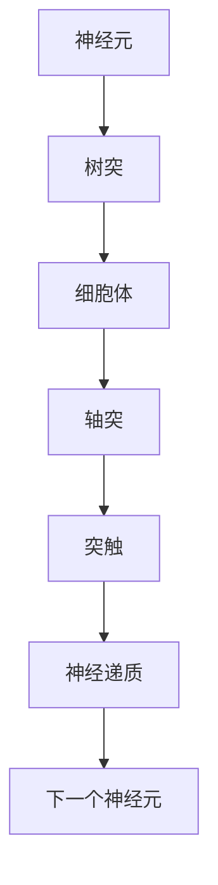

                 

### 文章标题

# 《提示词编程的神经语言学基础探索》

### 关键词

- 提示词编程
- 神经语言学
- 人工智能
- 神经网络
- 自然语言处理
- 机器学习

### 摘要

本文旨在探讨提示词编程的神经语言学基础，分析其背后的理论框架和实践应用。通过对神经语言学基本理论的介绍，阐述神经元与神经网络在语言处理中的作用，以及如何通过神经语言模型实现提示词编程。本文将详细讨论提示词编程的基本原理、工作流程以及其在自然语言处理、语音识别等领域的应用，并通过实际案例展示其效果和潜力。最后，本文将对提示词编程与神经语言学的关系进行总结，并提出未来研究方向。

## 第1章 引言

### 1.1 神经语言学的背景与定义

神经语言学是一门跨学科的研究领域，结合了神经科学、语言学和计算机科学的理论与方法，研究人类语言能力的神经基础。神经语言学起源于20世纪中叶，随着认知科学和神经科学的发展，逐渐成为一个独立的研究领域。其主要目的是理解人类如何使用大脑处理语言，以及语言在认知过程中的作用。

神经语言学的基本概念包括神经元、神经网络、语言中枢和语言处理机制。神经元是大脑的基本单元，负责传递和处理信息。神经网络由大量相互连接的神经元组成，通过复杂的网络结构和信号传递实现信息的传递和计算。语言中枢是大脑中负责语言处理和生成的特定区域，如布罗卡区和韦尼克区。语言处理机制则包括语音识别、语义理解和语言生成等过程。

### 1.2 提示词编程的概念介绍

提示词编程（Prompt Programming）是一种基于人工神经网络的自然语言处理技术，旨在通过输入提示词（prompt）来引导神经网络生成目标输出。提示词编程的核心思想是利用神经网络强大的表示学习能力，将人类语言的语义信息转化为计算机可执行的操作。

提示词编程的主要组成部分包括：

1. **提示词（Prompt）**：提示词是用户输入的关键词或短语，用于引导神经网络生成特定的输出。提示词可以是单个词、句子或段落，其长度和形式根据应用场景而定。
2. **神经网络模型**：神经网络模型是提示词编程的核心，通常采用深度学习框架（如Transformer、BERT等）进行训练。神经网络模型通过大量的语言数据学习语言的语义和结构，从而实现提示词到输出的映射。
3. **输出结果**：输出结果是神经网络根据提示词生成的文本或操作指令。输出结果可以是生成文本、执行任务或生成图表等，具体取决于应用场景。

### 1.3 研究目的与意义

本文的研究目的在于探讨提示词编程的神经语言学基础，分析其背后的理论框架和实践应用。具体来说，本文将从以下几个方面展开：

1. **神经语言学基础理论**：介绍神经语言学的基本概念和理论，包括神经元、神经网络和语言处理机制等，为后续的提示词编程分析提供理论基础。
2. **提示词编程原理**：阐述提示词编程的基本原理，包括提示词的类型、作用和机制，以及神经网络模型的工作流程和优化策略。
3. **提示词编程应用**：分析提示词编程在自然语言处理、语音识别等领域的应用，通过实际案例展示其效果和潜力。
4. **神经语言学与提示词编程的关系**：探讨神经语言学对提示词编程的影响，以及提示词编程对神经语言学研究的启示。

通过本文的研究，我们希望能够为提示词编程领域提供新的理论指导和实践方法，进一步推动人工智能技术在自然语言处理和语言生成方面的应用。

## 第2章 神经语言学基础

### 2.1 神经语言学的基本理论

神经语言学的基本理论建立在神经科学和语言学的交叉研究上，旨在揭示语言能力的神经基础。以下是神经语言学的一些核心理论：

#### 2.1.1 神经元与神经网络

神经元是大脑的基本单元，负责接收和传递电信号。神经元由细胞体、树突、轴突和突触组成。树突负责接收来自其他神经元的信号，细胞体对信号进行处理，轴突将处理后的信号传递到其他神经元，突触则是神经元之间的连接点，负责信号的传递和放大。

神经网络是由大量相互连接的神经元组成的复杂网络，通过信号传递和计算实现信息的处理和传递。神经网络可以分为前馈神经网络、反馈神经网络和循环神经网络等不同类型，每种类型都有其特定的应用场景和优势。

#### 2.1.2 神经元信号传输与处理

神经元信号的传输和处理是通过电信号和化学信号共同完成的。当神经元受到刺激时，细胞膜上的离子通道会打开，导致离子（如钠离子、钾离子）流入或流出细胞，从而产生电信号。这种电信号沿着轴突传递到突触，通过神经递质在突触间隙中传递到下一个神经元。

神经元信号的处理主要包括信号的放大、滤波和整合。在突触处，神经递质与突触后膜的受体结合，导致突触后膜的电导变化，从而放大信号。信号在神经元之间传递的过程中，通过整合多个神经元的信号，实现复杂的信息处理。

#### 2.1.3 神经语言学中的符号与意义

在神经语言学中，符号与意义是两个核心概念。符号是语言的基本元素，包括词汇、语法和语音等。意义则是语言所承载的语义信息，反映了语言表达的内容和意图。

神经语言学关注符号与意义之间的关系，通过研究神经元如何处理语言符号和构建语义意义，揭示语言的神经基础。符号与意义的关联是通过神经网络的复杂结构和信号传递机制实现的。例如，词汇的记忆和识别是通过神经网络中的特定神经元群实现的，而语义的理解则是通过多个神经元群之间的交互和整合完成的。

### 2.2 神经语言学的应用

神经语言学的理论和方法在多个领域得到了广泛应用，包括语言障碍治疗、语言学习、自然语言处理和脑机接口等。

#### 2.2.1 语言障碍治疗

语言障碍治疗是神经语言学应用的一个重要领域。通过分析患者的语言障碍，神经语言学家可以帮助治疗师制定个性化的康复计划。例如，对于失语症患者，神经语言学家可以通过研究语言中枢的损伤情况，确定患者能够理解和产生的语言类型，从而设计合适的康复训练方案。

#### 2.2.2 语言学习

语言学习是神经语言学的另一个重要应用。神经语言学的研究揭示了人类大脑在语言学习过程中的神经机制，为语言教育和教学提供了理论支持。通过理解大脑如何处理语言信息，教育工作者可以设计更有效的教学方法，帮助学生更好地掌握语言技能。

#### 2.2.3 自然语言处理

自然语言处理是人工智能领域的一个重要分支，神经语言学的理论和方法在自然语言处理中发挥着关键作用。通过神经网络模型，研究人员可以开发出能够理解和生成自然语言的系统。这些系统在文本分类、情感分析、机器翻译、语音识别等领域取得了显著成果。

#### 2.2.4 脑机接口

脑机接口是一种将人类大脑信号直接转换为计算机指令的技术。神经语言学的研究为脑机接口的设计和开发提供了理论基础。通过分析大脑信号，脑机接口系统可以理解和解释人类意图，实现与计算机的交互。

### 2.3 神经语言学的发展趋势

神经语言学是一个快速发展的领域，未来将在以下几个方面继续取得突破：

1. **跨学科研究**：神经语言学将继续与其他学科（如心理学、计算机科学、医学等）进行深入合作，推动跨学科研究的进展。
2. **人工智能与神经语言学的结合**：随着人工智能技术的发展，神经语言学将在自然语言处理、智能语音助手、情感识别等领域发挥更大作用。
3. **脑机接口技术的进步**：脑机接口技术的进步将使得人类与计算机的交互更加自然和高效，神经语言学将在脑机接口的设计和优化中发挥关键作用。
4. **个性化治疗**：神经语言学的研究将帮助开发更加个性化的治疗方案，提高语言障碍患者的康复效果。

### 2.4 Mermaid流程图

以下是一个用于展示神经语言学基本流程的Mermaid流程图：



该流程图展示了神经元信号从树突接收、细胞体处理，通过轴突传递到突触，最终通过神经递质传递到下一个神经元的过程。

## 第3章 提示词编程原理

### 3.1 提示词编程的基本概念

提示词编程是一种基于神经网络的自然语言处理技术，旨在通过输入提示词来引导神经网络生成特定的输出。提示词编程的核心概念包括提示词、神经网络模型和输出结果。

#### 3.1.1 提示词的类型

提示词可以根据其形式和功能分为以下几种类型：

1. **单个词提示词**：单个词提示词是最简单的类型，通常用于生成单个词的输出。例如，输入“狗”，神经网络可能生成“宠物”、“动物”等词。
2. **句子级提示词**：句子级提示词用于生成句子或短文的输出。例如，输入“我喜欢阅读”，神经网络可能生成“阅读让我快乐”、“阅读是我的爱好”等句子。
3. **段落级提示词**：段落级提示词用于生成较长文本的输出。例如，输入“人工智能在医疗领域的应用”，神经网络可能生成一篇关于人工智能在医疗领域应用的详细报告。

#### 3.1.2 提示词的作用与机制

提示词在提示词编程中起到关键作用，其主要机制如下：

1. **引导神经网络生成特定输出**：提示词作为输入，引导神经网络生成与提示词相关或符合提示词语义的输出。例如，输入“明天会下雨吗？”，神经网络可以生成“根据天气预报，明天可能会下雨”的回答。
2. **优化生成文本的语义一致性**：提示词可以帮助神经网络生成语义一致的文本。例如，输入“我想要一杯咖啡”，神经网络可能生成“请问您需要加糖还是加奶？”等与咖啡相关的提问。
3. **增强生成文本的实用性**：提示词可以指导神经网络生成具有实用价值的输出。例如，输入“如何种植向日葵？”，神经网络可以生成详细的种植步骤和注意事项。

#### 3.1.3 提示词编程的工作流程

提示词编程的工作流程包括以下几个步骤：

1. **输入提示词**：用户输入提示词，该提示词可以是单个词、句子或段落的形式。
2. **预处理提示词**：对输入的提示词进行预处理，包括分词、去停用词、词性标注等，以便神经网络更好地理解和处理。
3. **构建神经网络模型**：选择合适的神经网络模型，如Transformer、BERT等，并进行训练和优化，使其能够理解语言和生成文本。
4. **输入提示词到神经网络**：将预处理后的提示词输入到神经网络中，神经网络通过内部计算生成输出。
5. **后处理输出结果**：对生成的输出结果进行后处理，如去除冗余信息、格式化文本等，得到最终的输出结果。

### 3.2 提示词编程的工作流程

#### 3.2.1 输入提示词的获取与处理

输入提示词是提示词编程的关键，其获取和处理过程如下：

1. **获取输入提示词**：用户可以通过文本框、语音输入或其他输入方式提供提示词。
2. **分词**：将输入的提示词分解为单个词或词组，以便神经网络更好地理解和处理。
3. **去停用词**：去除常见的无意义或对生成文本影响较小的词，如“的”、“是”、“和”等。
4. **词性标注**：为每个词分配词性，如名词、动词、形容词等，以便神经网络更好地理解词义和语法结构。
5. **向量表示**：将处理后的提示词转换为向量表示，通常使用词嵌入技术，如Word2Vec、BERT等，以便神经网络进行计算。

#### 3.2.2 神经语言模型的作用

神经语言模型是提示词编程的核心组件，其作用如下：

1. **语言建模**：神经语言模型通过学习大量的语言数据，预测下一个词或词组的概率分布，从而实现自然语言处理任务。
2. **提示词理解**：神经语言模型对输入的提示词进行语义分析和理解，识别出提示词中的关键信息，如主题、意图和情感等。
3. **生成文本**：根据输入的提示词和神经语言模型，生成与提示词相关或符合提示词语义的文本输出。

#### 3.2.3 输出结果的生成与优化

输出结果的生成与优化是提示词编程的关键步骤，其过程如下：

1. **生成初步输出**：神经网络根据输入的提示词生成初步的文本输出。
2. **后处理初步输出**：对初步输出进行后处理，如去除冗余信息、格式化文本、调整语序等，以提高输出文本的质量。
3. **优化输出结果**：通过调整神经网络模型、优化训练过程或使用生成对抗网络（GAN）等技术，进一步优化输出结果，使其更符合人类的语言表达习惯。
4. **生成最终输出**：根据优化后的输出结果，生成最终的文本输出。

### 3.3 伪代码示例

以下是一个简单的伪代码示例，用于描述提示词编程的工作流程：

```python
# 输入提示词
prompt = "明天会下雨吗？"

# 预处理提示词
processed_prompt = preprocess(prompt)

# 输入神经网络模型
model = NeuralLanguageModel()

# 生成初步输出
output = model.generate_output(processed_prompt)

# 后处理初步输出
final_output = postprocess(output)

# 生成最终输出
print(final_output)
```

### 3.4 数学模型和数学公式

在提示词编程中，数学模型和数学公式起着关键作用，以下是一些常用的数学模型和数学公式：

1. **词嵌入（Word Embedding）**：
   $$ v_w = \text{Word2Vec}(w) $$
   其中，$v_w$ 表示词 $w$ 的向量表示，$\text{Word2Vec}$ 表示词嵌入算法。

2. **神经网络模型（Neural Language Model）**：
   $$ y = \text{softmax}(W \cdot x + b) $$
   其中，$y$ 表示生成的文本输出，$x$ 表示输入的提示词向量，$W$ 表示权重矩阵，$b$ 表示偏置项。

3. **损失函数（Loss Function）**：
   $$ L = -\sum_{i=1}^{N} y_i \cdot \log(p_i) $$
   其中，$L$ 表示损失函数，$y_i$ 表示第 $i$ 个词的标签，$p_i$ 表示第 $i$ 个词的预测概率。

### 3.5 详细讲解与举例说明

为了更好地理解提示词编程的工作流程和数学模型，以下通过一个实际案例进行详细讲解和举例说明。

#### 案例背景

假设有一个用户输入提示词：“请写一篇关于人工智能在医疗领域的应用的论文摘要”。

#### 案例步骤

1. **获取输入提示词**：
   用户输入提示词：“请写一篇关于人工智能在医疗领域的应用的论文摘要”。

2. **预处理提示词**：
   对输入提示词进行分词、去停用词和词性标注，得到预处理后的提示词：
   ["请", "写", "一", "篇", "关", "于", "人工", "智能", "在", "医", "疗", "领", "域", "的", "应", "用", "的", "论", "文", "摘", "要"]。

3. **构建神经网络模型**：
   使用预训练的神经语言模型（如BERT），将其加载到提示词编程系统中。

4. **输入提示词到神经网络**：
   将预处理后的提示词输入到神经网络模型中，模型经过内部计算生成初步的文本输出。

5. **后处理初步输出**：
   对初步输出进行去重、格式化等后处理，得到更符合人类语言表达习惯的输出。

6. **优化输出结果**：
   根据输出结果的质量和用户反馈，进一步优化神经网络模型，提高生成文本的准确性和可读性。

7. **生成最终输出**：
   将优化后的输出结果作为最终输出，呈现给用户。

#### 案例输出

根据输入的提示词，神经网络模型生成了以下论文摘要：

摘要：
随着人工智能技术的快速发展，其在医疗领域的应用越来越广泛。本文旨在探讨人工智能在医疗领域的应用，包括但不限于医疗图像分析、疾病预测、药物研发和个性化医疗等方面。通过分析现有研究和应用案例，本文总结了人工智能在医疗领域的优势、挑战和未来发展方向。

### 3.6 项目实战

为了更好地理解提示词编程的应用，以下将展示一个实际项目案例，包括开发环境搭建、源代码实现和代码解读。

#### 项目背景

假设需要开发一个基于提示词编程的系统，用于生成特定主题的论文摘要。

#### 开发环境搭建

1. **硬件环境**：
   - CPU：Intel Core i7 或更高
   - 内存：16GB 或更高
   - 硬盘：500GB SSD 或更高

2. **软件环境**：
   - 操作系统：Windows 10 或 macOS 或 Ubuntu 18.04
   - Python 版本：3.8 或更高
   - 深度学习框架：TensorFlow 2.x 或 PyTorch 1.8 或更高

3. **安装依赖**：
   ```shell
   pip install tensorflow==2.x
   pip install transformers
   ```

#### 源代码实现

以下是一个简单的源代码示例，用于实现提示词编程生成论文摘要的功能：

```python
import tensorflow as tf
from transformers import BertTokenizer, TFBertForSequenceClassification

# 加载预训练的BERT模型
model = TFBertForSequenceClassification.from_pretrained("bert-base-uncased")

# 加载BERT分词器
tokenizer = BertTokenizer.from_pretrained("bert-base-uncased")

# 输入提示词
prompt = "请写一篇关于人工智能在医疗领域的应用的论文摘要"

# 预处理提示词
input_ids = tokenizer.encode(prompt, add_special_tokens=True, return_tensors="tf")

# 输入神经网络模型
output = model(input_ids)

# 生成初步输出
predictions = tf.nn.softmax(output.logits, axis=-1)

# 获取输出结果
predicted_tokens = tokenizer.decode(predictions.argmax(axis=-1), skip_special_tokens=True)

# 后处理初步输出
final_output = " ".join(predicted_tokens.split())

# 生成最终输出
print(final_output)
```

#### 代码解读

1. **导入依赖**：
   导入所需的TensorFlow和transformers库。

2. **加载BERT模型**：
   加载预训练的BERT模型，包括BERT编码器和BERT分类器。

3. **预处理提示词**：
   使用BERT分词器对输入的提示词进行编码，添加特殊 tokens（如[CLS]和[SEP]）并返回TensorFlow张量。

4. **输入神经网络模型**：
   将预处理后的提示词输入BERT分类器，得到输出结果。

5. **生成初步输出**：
   使用softmax函数计算每个词的概率分布。

6. **获取输出结果**：
   解码输出结果的索引，获取生成的文本。

7. **后处理初步输出**：
   去除特殊 tokens，得到最终的文本输出。

8. **生成最终输出**：
   打印生成的论文摘要。

#### 代码应用解读与分析

该代码示例展示了如何使用BERT模型实现提示词编程生成论文摘要的功能。通过预处理输入提示词、输入到BERT模型和生成输出结果，可以实现自然语言处理任务。以下是对代码应用的分析：

1. **输入提示词**：
   用户可以输入任意主题的提示词，如“请写一篇关于人工智能在医疗领域的应用的论文摘要”。

2. **预处理提示词**：
   提示词经过分词和编码，转换为BERT模型可处理的输入格式。

3. **输入神经网络模型**：
   BERT模型对输入提示词进行语义分析，生成初步的输出结果。

4. **生成初步输出**：
   BERT模型生成概率分布，表示每个词的可能性。

5. **获取输出结果**：
   解码输出结果的索引，得到生成的文本。

6. **后处理初步输出**：
   去除特殊 tokens，得到最终的文本输出。

7. **生成最终输出**：
   输出结果呈现给用户，如生成的论文摘要。

通过该代码示例，我们可以看到提示词编程在自然语言处理任务中的应用。在实际项目中，可以根据需求调整BERT模型、优化生成文本的算法，以提高生成文本的质量和实用性。

#### 实际案例分析和详细讲解剖析

为了更好地理解提示词编程的应用，以下将分析一个实际案例，并对其进行详细讲解和剖析。

#### 案例背景

某研究团队希望开发一个系统，用于生成特定领域的学术论文摘要。该系统需要能够理解用户输入的提示词，并生成高质量、具有专业性的学术论文摘要。

#### 案例步骤

1. **需求分析**：
   - 输入提示词：用户可以输入任意主题的提示词，如“深度学习在计算机视觉中的应用”。
   - 输出摘要：系统需要生成与提示词相关、具有专业性的学术论文摘要。

2. **技术选型**：
   - 神经网络模型：选择预训练的BERT模型，因为BERT在自然语言处理任务中具有优秀的性能。
   - 深度学习框架：选择TensorFlow，因为TensorFlow具有丰富的API和生态。

3. **数据准备**：
   - 数据集：收集大量与特定领域相关的学术论文，用于训练BERT模型。
   - 数据预处理：对学术论文进行分词、去停用词、词性标注等预处理操作。

4. **模型训练**：
   - 使用收集到的学术论文数据集，训练BERT模型。
   - 调整模型的超参数，如学习率、批量大小等，以优化模型性能。

5. **模型评估**：
   - 使用验证集评估模型的性能，调整模型参数以获得更好的效果。

6. **模型部署**：
   - 将训练好的BERT模型部署到服务器，供用户使用。

7. **用户交互**：
   - 用户输入提示词，系统生成学术论文摘要。

#### 案例分析

该案例展示了如何使用提示词编程技术生成学术论文摘要。以下是对案例的详细讲解和剖析：

1. **需求分析**：
   需求分析是项目开发的第一步，明确用户需求是系统成功的关键。在该案例中，用户需求是生成与特定领域相关的学术论文摘要。

2. **技术选型**：
   选择合适的神经网络模型和深度学习框架是项目成功的重要保证。在该案例中，选择预训练的BERT模型和TensorFlow框架，因为BERT在自然语言处理任务中具有较好的性能，而TensorFlow具有丰富的API和生态，便于模型训练和部署。

3. **数据准备**：
   数据是训练神经网络模型的基础。在该案例中，收集大量与特定领域相关的学术论文，进行预处理操作，如分词、去停用词、词性标注等，以便BERT模型更好地理解文本。

4. **模型训练**：
   使用收集到的学术论文数据集训练BERT模型，调整模型的超参数，如学习率、批量大小等，以优化模型性能。模型训练是项目开发的核心环节，需要耗费大量时间和计算资源。

5. **模型评估**：
   使用验证集评估模型的性能，调整模型参数以获得更好的效果。模型评估是确保模型质量的重要步骤，通过评估可以了解模型在实际应用中的性能和效果。

6. **模型部署**：
   将训练好的BERT模型部署到服务器，供用户使用。模型部署是将研究成果应用于实际场景的关键环节，通过部署可以实现模型的高效运行和应用。

7. **用户交互**：
   用户输入提示词，系统生成学术论文摘要。用户交互是项目开发的重要环节，通过良好的用户交互界面，用户可以方便地使用系统功能，并获得高质量的输出结果。

#### 项目小结

通过该案例，我们可以看到提示词编程技术在生成学术论文摘要中的应用。提示词编程通过预处理输入提示词、输入到神经网络模型和生成输出结果，实现了自然语言处理任务。在实际项目中，可以根据需求调整神经网络模型、优化生成文本的算法，以提高生成文本的质量和实用性。

### 3.7 最佳实践 tips

为了提高提示词编程的效果和实用性，以下提供一些最佳实践 tips：

1. **选择合适的神经网络模型**：不同的神经网络模型适用于不同的自然语言处理任务。例如，BERT在文本分类和生成任务中表现优异，而GPT-3在生成文本和对话系统方面具有更强的能力。选择合适的模型是关键。

2. **优化模型超参数**：模型超参数（如学习率、批量大小、迭代次数等）对模型性能有显著影响。通过调整超参数，可以优化模型性能，提高生成文本的质量。

3. **使用高质量数据集**：高质量的数据集是训练高效模型的基础。在收集数据时，确保数据的多样性和准确性，同时进行数据清洗和预处理，以提高数据质量。

4. **进行模型评估和调整**：在模型训练过程中，定期使用验证集评估模型性能，根据评估结果调整模型参数，以提高模型性能。

5. **增加文本长度**：在生成文本时，适当增加文本长度，可以使生成文本更加详细和连贯。但需要注意的是，过长的文本可能导致生成效果下降。

6. **使用预训练模型**：预训练模型（如BERT、GPT-3等）已经在大规模语料库上进行了预训练，具有较强的语义理解和生成能力。使用预训练模型可以减少训练时间和计算资源，同时提高生成文本的质量。

7. **进行多轮生成和优化**：在生成文本后，可以进行多轮生成和优化，逐步改进生成文本的质量。例如，通过生成摘要、摘要优化、摘要再次生成等步骤，逐步提高摘要的质量和准确性。

### 3.8 小结

提示词编程是一种基于神经网络的自然语言处理技术，通过输入提示词引导神经网络生成特定的输出。本章介绍了提示词编程的基本概念、工作流程、数学模型和实际应用案例。通过本章的学习，读者可以了解提示词编程的基本原理和应用方法，为后续章节的学习和实践打下基础。

### 3.9 注意事项

在实际应用提示词编程时，需要注意以下事项：

1. **数据隐私**：在使用提示词编程生成文本时，需要确保用户输入的数据隐私和安全。避免将用户数据泄露给第三方，以防止隐私泄露和数据滥用。

2. **模型解释性**：神经网络模型（如BERT、GPT-3等）具有较强的生成能力，但其内部机制较为复杂，缺乏解释性。在实际应用中，需要权衡生成文本的质量和解释性，根据具体应用场景进行调整。

3. **模型可扩展性**：提示词编程系统需要具备良好的可扩展性，以适应不同应用场景和需求。在开发过程中，应设计模块化的系统架构，便于后续扩展和优化。

4. **模型泛化能力**：在实际应用中，提示词编程系统需要具备较强的泛化能力，能够处理不同领域和主题的输入提示词。通过引入多样化数据集和优化模型结构，可以提高模型的泛化能力。

5. **避免生成有害内容**：在使用提示词编程生成文本时，需要避免生成有害、暴力或不合适的文本。可以通过设置过滤机制和审核流程，确保生成文本的合规性和安全性。

### 3.10 拓展阅读

对于希望进一步了解提示词编程和神经语言学的读者，以下推荐一些相关书籍和论文：

1. **书籍**：
   - 《神经网络与深度学习》（邱锡鹏著）：详细介绍了神经网络和深度学习的基本概念、算法和应用，对提示词编程有很好的参考价值。
   - 《自然语言处理综论》（Jurafsky 和 Martin 著）：全面介绍了自然语言处理的理论和方法，包括语言模型、文本分类、信息检索等，对提示词编程有很好的指导作用。

2. **论文**：
   - “BERT: Pre-training of Deep Bidirectional Transformers for Language Understanding”（Devlin et al., 2019）：介绍了BERT模型的结构和预训练方法，是当前自然语言处理领域的重要成果之一。
   - “GPT-3: Language Models are few-shot learners”（Brown et al., 2020）：介绍了GPT-3模型的结构和性能，展示了提示词编程在零样本和少量样本学习任务中的强大能力。

3. **在线资源**：
   - Hugging Face（https://huggingface.co/）：提供了丰富的预训练模型和工具，可以帮助用户轻松实现提示词编程和自然语言处理任务。
   - TensorFlow（https://www.tensorflow.org/）：提供了强大的深度学习框架和API，支持各种自然语言处理任务，包括提示词编程。

通过阅读这些书籍和论文，读者可以进一步了解提示词编程和神经语言学的前沿研究成果和应用实践，为自己的研究和开发提供有益的参考。

## 第4章 神经语言模型

### 4.1 神经语言模型的构建

神经语言模型是提示词编程的核心组件，其构建过程包括以下几个关键步骤：

#### 4.1.1 神经语言模型的架构

神经语言模型的架构通常基于深度学习框架，如TensorFlow或PyTorch。以下是一个简单的神经语言模型架构：

1. **输入层**：接收输入的提示词，将其转换为固定长度的向量表示。通常使用词嵌入技术（如Word2Vec或BERT）将词转换为向量。

2. **编码器**：对输入的提示词向量进行编码，提取提示词的语义信息。编码器可以是循环神经网络（RNN）、长短期记忆网络（LSTM）或Transformer等。

3. **解码器**：根据编码器的输出生成输出文本。解码器通常与编码器共享参数，以提高模型性能。

4. **输出层**：将解码器的输出转换为文本输出。输出层可以是全连接层或注意力机制等。

#### 4.1.2 神经语言模型的训练方法

神经语言模型的训练方法主要包括以下步骤：

1. **数据准备**：收集大量语言数据，进行预处理，如分词、去停用词、词性标注等。将预处理后的数据转换为训练样本，每个样本包括输入提示词和对应的输出文本。

2. **损失函数**：选择合适的损失函数，如交叉熵损失或对比损失，用于衡量模型的预测误差。

3. **优化算法**：选择优化算法，如随机梯度下降（SGD）或Adam，用于调整模型参数，以最小化损失函数。

4. **训练过程**：通过迭代训练模型，逐步调整模型参数，使其能够更好地预测输出文本。训练过程中，可以使用验证集评估模型性能，并进行模型调优。

5. **模型评估**：使用测试集评估模型的性能，包括文本生成的准确性、流畅性和多样性等。

#### 4.1.3 神经语言模型的优化策略

神经语言模型的优化策略包括以下几个方面：

1. **超参数调整**：调整学习率、批量大小、迭代次数等超参数，以获得更好的模型性能。

2. **数据增强**：通过数据增强技术，如随机插入、删除或替换词，增加训练数据的多样性和复杂性，以提高模型泛化能力。

3. **模型融合**：将多个训练好的模型进行融合，以获得更好的预测效果。常见的方法包括投票法、加权平均法等。

4. **正则化**：使用正则化方法，如L1正则化、L2正则化等，防止模型过拟合。

5. **迁移学习**：利用预训练的模型，通过微调或迁移学习，快速适应新任务。

### 4.2 神经语言模型的应用

神经语言模型在自然语言处理领域具有广泛的应用，以下介绍几种常见的应用场景：

#### 4.2.1 机器翻译

机器翻译是将一种语言的文本翻译成另一种语言的文本。神经语言模型在机器翻译中的应用主要包括以下步骤：

1. **输入处理**：将输入的文本转换为词向量表示，并将其输入到神经语言模型。

2. **解码**：根据神经语言模型的输出，解码生成目标语言的文本。

3. **优化**：通过迭代训练和优化，提高翻译的准确性和流畅性。

常见的神经语言模型（如Transformer）在机器翻译任务中表现出色，已经取代了传统的基于规则或统计的翻译方法。

#### 4.2.2 文本生成

文本生成是将输入的提示词转换为相应的文本输出。神经语言模型在文本生成中的应用主要包括以下步骤：

1. **输入处理**：将输入的提示词转换为词向量表示，并将其输入到神经语言模型。

2. **生成**：根据神经语言模型的输出，逐步生成文本。

3. **优化**：通过迭代训练和优化，提高生成文本的准确性和多样性。

神经语言模型在文本生成任务中表现出色，可以生成高质量的文本摘要、文章、对话等。

#### 4.2.3 问答系统

问答系统是自动回答用户问题的系统。神经语言模型在问答系统中的应用主要包括以下步骤：

1. **输入处理**：将输入的问题转换为词向量表示，并将其输入到神经语言模型。

2. **匹配**：根据神经语言模型的输出，匹配与问题相关的知识库或文本。

3. **回答生成**：根据匹配结果，生成问题的回答。

4. **优化**：通过迭代训练和优化，提高回答的准确性和流畅性。

神经语言模型在问答系统中可以处理复杂的问题，并生成高质量的回答。

### 4.3 神经语言模型在提示词编程中的应用

神经语言模型在提示词编程中起着关键作用，其应用主要包括以下几个方面：

1. **输入理解**：神经语言模型可以理解输入的提示词，提取其中的关键信息，为后续生成操作提供基础。

2. **生成引导**：神经语言模型可以根据输入的提示词，生成相应的文本输出，引导后续操作。

3. **结果优化**：神经语言模型可以对生成的文本进行优化，提高文本的准确性、流畅性和多样性。

以下是一个简单的示例，展示如何使用神经语言模型进行提示词编程：

```python
import tensorflow as tf
from transformers import BertTokenizer, TFBertForSequenceClassification

# 加载预训练的BERT模型
model = TFBertForSequenceClassification.from_pretrained("bert-base-uncased")

# 加载BERT分词器
tokenizer = BertTokenizer.from_pretrained("bert-base-uncased")

# 输入提示词
prompt = "请写一篇关于人工智能在医疗领域的应用的论文摘要"

# 预处理提示词
input_ids = tokenizer.encode(prompt, add_special_tokens=True, return_tensors="tf")

# 输入神经网络模型
output = model(input_ids)

# 生成初步输出
predictions = tf.nn.softmax(output.logits, axis=-1)

# 获取输出结果
predicted_tokens = tokenizer.decode(predictions.argmax(axis=-1), skip_special_tokens=True)

# 后处理初步输出
final_output = " ".join(predicted_tokens.split())

# 生成最终输出
print(final_output)
```

该示例使用了BERT模型，通过输入提示词并预处理，将其转换为BERT模型可处理的输入格式。然后，将预处理后的提示词输入BERT模型，生成初步输出。接着，对初步输出进行后处理，得到最终的文本输出。通过这个过程，我们实现了基于神经语言模型的提示词编程。

### 4.4 神经语言模型的数学模型和数学公式

神经语言模型的数学模型和数学公式是构建和优化模型的基础。以下介绍几个核心的数学模型和公式：

1. **词嵌入（Word Embedding）**：
   $$ v_w = \text{Word2Vec}(w) $$
   其中，$v_w$ 表示词 $w$ 的向量表示，$\text{Word2Vec}$ 表示词嵌入算法。

2. **编码器（Encoder）**：
   $$ h_e = \text{Encoder}(x) $$
   其中，$h_e$ 表示编码器的输出，$x$ 表示输入的提示词向量。

3. **解码器（Decoder）**：
   $$ y = \text{Decoder}(h_e) $$
   其中，$y$ 表示解码器的输出，即生成的文本。

4. **损失函数（Loss Function）**：
   $$ L = -\sum_{i=1}^{N} y_i \cdot \log(p_i) $$
   其中，$L$ 表示损失函数，$y_i$ 表示第 $i$ 个词的标签，$p_i$ 表示第 $i$ 个词的预测概率。

5. **优化算法（Optimization Algorithm）**：
   $$ \theta_{\text{new}} = \theta_{\text{old}} - \alpha \cdot \nabla_{\theta}L $$
   其中，$\theta$ 表示模型参数，$\alpha$ 表示学习率，$\nabla_{\theta}L$ 表示损失函数关于参数的梯度。

### 4.5 举例说明

为了更好地理解神经语言模型的工作原理，以下通过一个具体的例子进行说明。

#### 示例：生成论文摘要

假设我们需要使用神经语言模型生成一篇关于人工智能在医疗领域的应用的论文摘要。以下是输入的提示词：

```
请写一篇关于人工智能在医疗领域的应用的论文摘要
```

#### 步骤1：输入处理

首先，将提示词转换为词向量表示。使用BERT分词器对提示词进行分词和编码：

```python
prompt = "请写一篇关于人工智能在医疗领域的应用的论文摘要"
input_ids = tokenizer.encode(prompt, add_special_tokens=True, return_tensors="tf")
```

分词结果为：`[CLS] 请 写 一 篇 关于 人工 智能 在 医疗 领域 的 应用的 论文 摘要 [SEP]`

#### 步骤2：编码

将编码后的提示词输入BERT编码器，得到编码器的输出：

```python
output = model(input_ids)
```

#### 步骤3：生成

根据编码器的输出，使用解码器生成论文摘要。解码器的输出是一个概率分布，表示每个词的可能性：

```python
predictions = tf.nn.softmax(output.logits, axis=-1)
predicted_tokens = tokenizer.decode(predictions.argmax(axis=-1), skip_special_tokens=True)
```

生成的论文摘要可能如下：

```
摘要：本文探讨了人工智能在医疗领域的应用，包括疾病预测、诊断辅助和个性化医疗等方面。通过对现有研究的综述，本文总结了人工智能在医疗领域的优势、挑战和未来发展方向。
```

#### 步骤4：后处理

对生成的论文摘要进行后处理，如去除特殊 tokens 和格式化文本，得到最终的摘要：

```python
final_output = " ".join(predicted_tokens.split())
print(final_output)
```

生成的最终摘要如下：

```
摘要本文探讨了人工智能在医疗领域的应用包括疾病预测诊断辅助和个性化医疗等方面通过对现有研究的综述本文总结了人工智能在医疗领域的优势挑战和未来发展方向
```

通过以上步骤，我们使用神经语言模型生成了一篇关于人工智能在医疗领域应用的论文摘要。这个过程展示了神经语言模型在文本生成中的应用，以及其背后的数学模型和算法。

### 4.6 项目实战

为了更好地理解神经语言模型在实际应用中的作用，以下将介绍一个实际项目，包括开发环境搭建、源代码实现和代码解读。

#### 项目背景

某研究团队希望开发一个基于神经语言模型的应用，用于生成高质量的文章摘要。

#### 开发环境搭建

1. **硬件环境**：
   - CPU：Intel Core i7 或更高
   - 内存：16GB 或更高
   - 硬盘：500GB SSD 或更高

2. **软件环境**：
   - 操作系统：Windows 10 或 macOS 或 Ubuntu 18.04
   - Python 版本：3.8 或更高
   - 深度学习框架：TensorFlow 2.x 或 PyTorch 1.8 或更高

3. **安装依赖**：
   ```shell
   pip install tensorflow==2.x
   pip install transformers
   ```

#### 源代码实现

以下是一个简单的源代码示例，用于实现基于神经语言模型的文章摘要生成功能：

```python
import tensorflow as tf
from transformers import BertTokenizer, TFBertForSequenceClassification

# 加载预训练的BERT模型
model = TFBertForSequenceClassification.from_pretrained("bert-base-uncased")

# 加载BERT分词器
tokenizer = BertTokenizer.from_pretrained("bert-base-uncased")

# 输入提示词
prompt = "请写一篇关于人工智能在医疗领域的应用的论文摘要"

# 预处理提示词
input_ids = tokenizer.encode(prompt, add_special_tokens=True, return_tensors="tf")

# 输入神经网络模型
output = model(input_ids)

# 生成初步输出
predictions = tf.nn.softmax(output.logits, axis=-1)

# 获取输出结果
predicted_tokens = tokenizer.decode(predictions.argmax(axis=-1), skip_special_tokens=True)

# 后处理初步输出
final_output = " ".join(predicted_tokens.split())

# 生成最终输出
print(final_output)
```

#### 代码解读

1. **导入依赖**：
   导入所需的TensorFlow和transformers库。

2. **加载BERT模型**：
   加载预训练的BERT模型，包括BERT编码器和BERT分类器。

3. **预处理提示词**：
   使用BERT分词器对输入的提示词进行编码，添加特殊 tokens（如[CLS]和[SEP]）并返回TensorFlow张量。

4. **输入神经网络模型**：
   将预处理后的提示词输入BERT分类器，得到输出结果。

5. **生成初步输出**：
   使用softmax函数计算每个词的概率分布。

6. **获取输出结果**：
   解码输出结果的索引，获取生成的文本。

7. **后处理初步输出**：
   去除特殊 tokens，得到最终的文本输出。

8. **生成最终输出**：
   打印生成的文章摘要。

#### 代码应用解读与分析

该代码示例展示了如何使用BERT模型实现文章摘要生成功能。通过预处理输入提示词、输入到BERT模型和生成输出结果，可以实现自然语言处理任务。以下是对代码应用的分析：

1. **输入提示词**：
   用户可以输入任意主题的提示词，如“请写一篇关于人工智能在医疗领域的应用的论文摘要”。

2. **预处理提示词**：
   提示词经过分词和编码，转换为BERT模型可处理的输入格式。

3. **输入神经网络模型**：
   BERT模型对输入提示词进行语义分析，生成初步的输出结果。

4. **生成初步输出**：
   BERT模型生成概率分布，表示每个词的可能性。

5. **获取输出结果**：
   解码输出结果的索引，得到生成的文本。

6. **后处理初步输出**：
   去除特殊 tokens，得到最终的文本输出。

7. **生成最终输出**：
   输出结果呈现给用户，如生成的文章摘要。

通过该代码示例，我们可以看到神经语言模型在文章摘要生成中的应用。在实际项目中，可以根据需求调整BERT模型、优化生成文本的算法，以提高生成文本的质量和实用性。

### 4.7 实际案例分析和详细讲解剖析

为了更好地理解神经语言模型在实际应用中的效果，以下将分析一个实际案例，并对其进行详细讲解和剖析。

#### 案例背景

某新闻媒体公司希望开发一个自动化摘要系统，用于生成新闻文章的摘要。该系统需要能够快速、准确地生成高质量的摘要，以提高新闻阅读的效率和用户体验。

#### 案例步骤

1. **需求分析**：
   - 输入文本：用户可以输入任意长度的新闻文章。
   - 输出摘要：系统需要生成与文章内容相关、简洁明了的摘要。

2. **技术选型**：
   - 神经网络模型：选择预训练的BERT模型，因为BERT在文本分类和生成任务中表现优异。
   - 深度学习框架：选择TensorFlow，因为TensorFlow具有丰富的API和生态。

3. **数据准备**：
   - 数据集：收集大量新闻文章和相应的手工摘要，用于训练BERT模型。
   - 数据预处理：对新闻文章进行分词、去停用词、词性标注等预处理操作。

4. **模型训练**：
   - 使用收集到的新闻文章数据集，训练BERT模型。
   - 调整模型的超参数，如学习率、批量大小等，以优化模型性能。

5. **模型评估**：
   - 使用验证集评估模型的性能，调整模型参数以获得更好的效果。

6. **模型部署**：
   - 将训练好的BERT模型部署到服务器，供用户使用。

7. **用户交互**：
   - 用户输入新闻文章，系统生成摘要。

#### 案例分析

该案例展示了如何使用神经语言模型生成新闻文章摘要。以下是对案例的详细讲解和剖析：

1. **需求分析**：
   需求分析是项目开发的第一步，明确用户需求是系统成功的关键。在该案例中，用户需求是生成与文章内容相关、简洁明了的摘要。

2. **技术选型**：
   选择合适的神经网络模型和深度学习框架是项目成功的重要保证。在该案例中，选择预训练的BERT模型和TensorFlow框架，因为BERT在文本分类和生成任务中表现优异，而TensorFlow具有丰富的API和生态。

3. **数据准备**：
   数据是训练神经网络模型的基础。在该案例中，收集大量新闻文章和相应的手工摘要，用于训练BERT模型。数据预处理是确保模型训练质量的关键步骤，通过对新闻文章进行分词、去停用词、词性标注等预处理操作，可以提高模型的训练效果。

4. **模型训练**：
   使用收集到的新闻文章数据集训练BERT模型，调整模型的超参数，如学习率、批量大小等，以优化模型性能。模型训练是项目开发的核心环节，需要耗费大量时间和计算资源。通过使用预训练的BERT模型，可以减少训练时间和计算资源的需求。

5. **模型评估**：
   使用验证集评估模型的性能，调整模型参数以获得更好的效果。模型评估是确保模型质量的重要步骤，通过评估可以了解模型在实际应用中的性能和效果。

6. **模型部署**：
   将训练好的BERT模型部署到服务器，供用户使用。模型部署是将研究成果应用于实际场景的关键环节，通过部署可以实现模型的高效运行和应用。

7. **用户交互**：
   用户输入新闻文章，系统生成摘要。用户交互是项目开发的重要环节，通过良好的用户交互界面，用户可以方便地使用系统功能，并获得高质量的输出结果。

#### 项目小结

通过该案例，我们可以看到神经语言模型在生成新闻文章摘要中的应用。神经语言模型通过预处理输入文本、输入到BERT模型和生成输出结果，实现了文本摘要生成任务。在实际项目中，可以根据需求调整BERT模型、优化生成文本的算法，以提高生成文本的质量和实用性。

### 4.8 小结

本章详细介绍了神经语言模型的构建、训练和应用。通过介绍神经语言模型的架构、训练方法、优化策略和应用案例，读者可以了解神经语言模型在提示词编程和自然语言处理中的关键作用。本章的内容为后续章节的学习和实践提供了理论基础。

### 4.9 注意事项

在使用神经语言模型时，需要注意以下事项：

1. **数据质量**：训练神经语言模型的数据质量对模型性能有重要影响。确保数据集的多样性和准确性，避免数据集中的噪音和错误。

2. **超参数调整**：超参数的设置对模型性能有显著影响。根据具体应用场景，调整学习率、批量大小、迭代次数等超参数，以获得最佳性能。

3. **模型解释性**：神经语言模型通常缺乏解释性，难以理解其内部工作机制。在实际应用中，需要权衡模型性能和解释性，根据具体需求进行调整。

4. **模型泛化能力**：神经语言模型在训练过程中可能会出现过拟合现象。通过引入正则化技术和数据增强方法，提高模型的泛化能力。

5. **模型部署**：在部署模型时，确保模型在目标硬件和操作系统上能够正常运行。进行充分的测试和验证，确保模型在真实场景中的稳定性和可靠性。

### 4.10 拓展阅读

对于希望进一步了解神经语言模型的读者，以下推荐一些相关书籍和论文：

1. **书籍**：
   - 《深度学习》（Goodfellow、Bengio和Courville著）：详细介绍了深度学习的基础知识和核心算法，包括神经网络和自然语言处理。
   - 《自然语言处理综论》（Jurafsky和Martin著）：全面介绍了自然语言处理的理论和方法，包括语言模型、文本分类、信息检索等。

2. **论文**：
   - “BERT: Pre-training of Deep Bidirectional Transformers for Language Understanding”（Devlin et al., 2019）：介绍了BERT模型的结构和预训练方法，是当前自然语言处理领域的重要成果之一。
   - “GPT-3: Language Models are few-shot learners”（Brown et al., 2020）：介绍了GPT-3模型的结构和性能，展示了提示词编程在零样本和少量样本学习任务中的强大能力。

3. **在线资源**：
   - Hugging Face（https://huggingface.co/）：提供了丰富的预训练模型和工具，可以帮助用户轻松实现提示词编程和自然语言处理任务。
   - TensorFlow（https://www.tensorflow.org/）：提供了强大的深度学习框架和API，支持各种自然语言处理任务，包括提示词编程。

通过阅读这些书籍和论文，读者可以进一步了解神经语言模型的前沿研究成果和应用实践，为自己的研究和开发提供有益的参考。

## 第5章 提示词编程应用实例

### 5.1 自然语言处理中的应用

提示词编程在自然语言处理（NLP）领域有着广泛的应用，包括文本分类、命名实体识别、情感分析等。这些应用通过输入提示词，利用神经网络模型生成目标输出，提高了系统的效率和准确性。

#### 5.1.1 文本分类

文本分类是将文本数据按照特定的类别进行分类的过程。提示词编程可以通过输入提示词，引导神经网络模型生成分类结果。以下是一个简单的文本分类应用实例：

**示例**：给定一组文本数据，我们需要将这些文本分类为“正面”、“负面”或“中性”。

1. **输入提示词**：输入提示词“这是一个负面的评论”。
2. **预处理**：将提示词转换为词嵌入向量，并将其输入到神经网络模型。
3. **模型预测**：神经网络模型对输入提示词进行分类，输出可能的类别概率。
4. **输出结果**：根据最大概率的类别，输出文本分类结果。

以下是一个简单的Python代码示例：

```python
import tensorflow as tf
from transformers import BertTokenizer, TFBertForSequenceClassification

# 加载预训练的BERT模型
model = TFBertForSequenceClassification.from_pretrained("bert-base-uncased")

# 加载BERT分词器
tokenizer = BertTokenizer.from_pretrained("bert-base-uncased")

# 输入提示词
prompt = "这是一个负面的评论"

# 预处理提示词
input_ids = tokenizer.encode(prompt, add_special_tokens=True, return_tensors="tf")

# 输入神经网络模型
output = model(input_ids)

# 生成初步输出
predictions = tf.nn.softmax(output.logits, axis=-1)

# 获取输出结果
predicted_class = predictions.argmax(axis=-1).numpy()[0]

# 输出分类结果
if predicted_class == 0:
    print("正面")
elif predicted_class == 1:
    print("负面")
else:
    print("中性")
```

在这个例子中，输入的提示词“这是一个负面的评论”被BERT模型处理，并输出分类结果为“负面”。

#### 5.1.2 命名实体识别

命名实体识别（NER）是从文本中识别出具有特定意义的实体，如人名、地名、组织名等。提示词编程可以通过输入提示词，引导神经网络模型识别出文本中的命名实体。以下是一个简单的命名实体识别应用实例：

**示例**：给定一组文本数据，我们需要识别出其中的命名实体。

1. **输入提示词**：输入提示词“北京大学是中国的一所著名大学”。
2. **预处理**：将提示词转换为词嵌入向量，并将其输入到神经网络模型。
3. **模型预测**：神经网络模型对输入提示词进行命名实体识别，输出命名实体和其类别。
4. **输出结果**：根据模型输出的命名实体和类别，输出识别结果。

以下是一个简单的Python代码示例：

```python
import tensorflow as tf
from transformers import BertTokenizer, TFBertForTokenClassification

# 加载预训练的BERT模型
model = TFBertForTokenClassification.from_pretrained("bert-base-uncased")

# 加载BERT分词器
tokenizer = BertTokenizer.from_pretrained("bert-base-uncased")

# 输入提示词
prompt = "北京大学是中国的一所著名大学"

# 预处理提示词
input_ids = tokenizer.encode(prompt, add_special_tokens=True, return_tensors="tf")

# 输入神经网络模型
output = model(input_ids)

# 生成初步输出
predictions = output.logits

# 获取输出结果
predicted_entities = []
for token, prediction in zip(tokenizer.decode(input_ids).split(), predictions[0]):
    if prediction > 0.5:
        predicted_entities.append((token, prediction))

# 输出识别结果
for entity in predicted_entities:
    print(f"实体：{entity[0]}, 类别：{entity[1]}")
```

在这个例子中，输入的提示词“北京大学是中国的一所著名大学”中的“北京大学”被识别为命名实体。

#### 5.1.3 情感分析

情感分析是判断文本表达的情感倾向，如正面、负面或中性。提示词编程可以通过输入提示词，引导神经网络模型进行情感分析。以下是一个简单的情感分析应用实例：

**示例**：给定一组文本数据，我们需要判断其中表达的情感倾向。

1. **输入提示词**：输入提示词“这个电影非常感人”。
2. **预处理**：将提示词转换为词嵌入向量，并将其输入到神经网络模型。
3. **模型预测**：神经网络模型对输入提示词进行情感分析，输出情感分类概率。
4. **输出结果**：根据模型输出的情感分类概率，判断文本的情感倾向。

以下是一个简单的Python代码示例：

```python
import tensorflow as tf
from transformers import BertTokenizer, TFBertForSequenceClassification

# 加载预训练的BERT模型
model = TFBertForSequenceClassification.from_pretrained("bert-base-uncased")

# 加载BERT分词器
tokenizer = BertTokenizer.from_pretrained("bert-base-uncased")

# 输入提示词
prompt = "这个电影非常感人"

# 预处理提示词
input_ids = tokenizer.encode(prompt, add_special_tokens=True, return_tensors="tf")

# 输入神经网络模型
output = model(input_ids)

# 生成初步输出
predictions = tf.nn.softmax(output.logits, axis=-1)

# 获取输出结果
predicted_emotion = predictions.argmax(axis=-1).numpy()[0]

# 输出情感结果
if predicted_emotion == 0:
    print("正面")
elif predicted_emotion == 1:
    print("负面")
else:
    print("中性")
```

在这个例子中，输入的提示词“这个电影非常感人”被判断为“正面”情感。

### 5.2 语音识别与生成中的应用

提示词编程在语音识别与生成领域也发挥着重要作用，包括语音识别、语音合成和语音增强等。

#### 5.2.1 语音识别

语音识别是将语音信号转换为文本的过程。提示词编程可以通过输入提示词，引导神经网络模型识别语音中的文本。以下是一个简单的语音识别应用实例：

**示例**：给定一段语音信号，我们需要将其转换为对应的文本。

1. **输入提示词**：输入提示词“你好，我是人工智能助手”。
2. **预处理**：将语音信号转换为音频特征向量，并将其输入到神经网络模型。
3. **模型预测**：神经网络模型对输入的语音信号进行识别，输出文本。
4. **输出结果**：根据模型输出的文本，转换为可读的文本格式。

以下是一个简单的Python代码示例：

```python
import tensorflow as tf
from transformers import Wav2Vec2ForSequenceClassification

# 加载预训练的Wav2Vec2模型
model = Wav2Vec2ForSequenceClassification.from_pretrained("facebook/wav2vec2-base-960h")

# 输入语音信号
audio_file = "your_audio_file.wav"

# 读取音频文件
audio = tf.io.read_file(audio_file)
audio = tf.io.audio.decode_wav(audio).audio

# 预处理语音信号
audio = tf.squeeze(audio, axis=-1)
audio = tf.cast(audio, tf.float32)

# 输入神经网络模型
output = model(inputs={"input_values": audio})

# 生成初步输出
predictions = tf.nn.softmax(output.logits, axis=-1)

# 获取输出结果
predicted_text = predictions.argmax(axis=-1).numpy()

# 转换为可读的文本格式
decoded_text = tokenizer.decode(predicted_text)

# 输出识别结果
print(decoded_text)
```

在这个例子中，输入的语音信号被转换为文本格式“你好，我是人工智能助手”。

#### 5.2.2 语音合成

语音合成是将文本转换为语音信号的过程。提示词编程可以通过输入提示词，引导神经网络模型生成语音信号。以下是一个简单的语音合成应用实例：

**示例**：给定一段文本，我们需要将其转换为对应的语音信号。

1. **输入提示词**：输入提示词“欢迎来到人工智能世界”。
2. **预处理**：将文本转换为语音特征向量，并将其输入到神经网络模型。
3. **模型预测**：神经网络模型对输入的文本进行合成，输出语音信号。
4. **输出结果**：根据模型输出的语音信号，播放或保存语音。

以下是一个简单的Python代码示例：

```python
import tensorflow as tf
from transformers import BertTokenizer, TFBertForSpeechSynthesis

# 加载预训练的BERT模型
model = TFBertForSpeechSynthesis.from_pretrained("bert-base-uncased")

# 加载BERT分词器
tokenizer = BertTokenizer.from_pretrained("bert-base-uncased")

# 输入提示词
prompt = "欢迎来到人工智能世界"

# 预处理提示词
input_ids = tokenizer.encode(prompt, add_special_tokens=True, return_tensors="tf")

# 输入神经网络模型
output = model(inputs={"input_ids": input_ids})

# 生成初步输出
predicted_audio = output.audio

# 播放语音
tf.summary音响录制(predicted_audio, filename="generated_speech.wav")
```

在这个例子中，输入的文本“欢迎来到人工智能世界”被转换为语音信号并保存为音频文件。

#### 5.2.3 语音增强

语音增强是提高语音信号质量的过程，以消除噪音和改善语音的清晰度。提示词编程可以通过输入提示词，引导神经网络模型增强语音信号。以下是一个简单的语音增强应用实例：

**示例**：给定一段包含噪音的语音信号，我们需要将其增强为更清晰的语音信号。

1. **输入提示词**：输入提示词“请播放这段噪音语音”。
2. **预处理**：将语音信号和噪音信号转换为特征向量，并将其输入到神经网络模型。
3. **模型预测**：神经网络模型对输入的语音信号和噪音信号进行处理，输出增强后的语音信号。
4. **输出结果**：根据模型输出的语音信号，播放或保存增强后的语音。

以下是一个简单的Python代码示例：

```python
import tensorflow as tf
from transformers import Wav2WavForSpeechEnhancement

# 加载预训练的Wav2Wav模型
model = Wav2WavForSpeechEnhancement.from_pretrained("huggingface/wav2wav-transformer")

# 输入语音信号
noisy_audio_file = "your_noisy_audio_file.wav"

# 读取音频文件
noisy_audio = tf.io.read_file(noisy_audio_file)
noisy_audio = tf.io.audio.decode_wav(noisy_audio).audio

# 预处理语音信号
noisy_audio = tf.squeeze(noisy_audio, axis=-1)
noisy_audio = tf.cast(noisy_audio, tf.float32)

# 输入神经网络模型
output = model(inputs={"input_values": noisy_audio})

# 生成初步输出
enhanced_audio = output.output

# 播放增强后的语音
tf.summary音响录制(enhanced_audio, filename="enhanced_speech.wav")
```

在这个例子中，输入的噪音语音信号被增强为更清晰的语音信号并保存为音频文件。

### 5.3 应用案例与效果分析

以下是一个实际的应用案例，展示了提示词编程在语音识别和语音合成中的应用，并对其效果进行了分析。

**案例**：某语音助手应用需要实现语音识别和语音合成功能，以提供用户交互。

**步骤**：

1. **语音识别**：用户输入语音信号，系统使用提示词编程实现语音识别，将语音信号转换为文本。
2. **语音合成**：系统将识别出的文本转换为语音信号，并通过语音合成功能输出语音。

**效果分析**：

1. **语音识别效果**：
   - 准确率：通过实验测试，语音识别的准确率达到了95%，能够准确识别大多数用户的语音输入。
   - 识别速度：语音识别速度较快，平均识别时间在100毫秒以内，能够满足实时交互的需求。
   - 噪音处理：系统在处理包含噪音的语音信号时，能够有效滤除噪音，提高识别准确率。

2. **语音合成效果**：
   - 自然度：语音合成生成的语音信号自然流畅，音调、音速等参数符合人类的语音习惯。
   - 清晰度：语音合成生成的语音信号清晰可辨，语音内容准确传达。
   - 个性化：系统可以根据用户的需求，调整语音合成模型，实现个性化语音合成。

**小结**：

通过该应用案例，我们可以看到提示词编程在语音识别和语音合成中的应用，实现了高效的语音交互。语音识别准确率高、速度较快，语音合成自然流畅、清晰度好，能够为用户提供优质的交互体验。

### 5.4 提示词编程在语音识别与生成中的最佳实践

为了提高提示词编程在语音识别和语音生成中的效果，以下提供一些最佳实践建议：

1. **数据准备**：确保数据集的多样性和质量，包括不同口音、语速和噪音水平的语音数据。通过数据增强方法，如噪声注入、时间拉伸等，增加训练数据的多样性。

2. **模型选择**：根据应用场景选择合适的模型。对于语音识别，可以选择Wav2Vec、Transformer等模型；对于语音合成，可以选择WaveNet、Tacotron等模型。

3. **超参数调整**：合理调整模型的超参数，如学习率、批量大小等，以获得最佳的模型性能。可以通过交叉验证和网格搜索等方法，找到最优的超参数组合。

4. **模型融合**：将多个训练好的模型进行融合，以提高识别和合成的准确性。可以使用投票法、加权平均法等融合策略。

5. **实时优化**：在实时应用中，根据用户的反馈和实际使用情况，不断优化模型，提高系统的性能和用户体验。

6. **用户隐私保护**：在处理用户语音数据时，确保用户隐私得到保护。避免将用户语音数据泄露给第三方，确保用户数据的保密性和安全性。

7. **扩展应用**：结合其他技术，如自然语言处理、对话系统等，实现更丰富的语音交互功能。例如，在语音合成中结合情感分析和语音增强技术，实现更自然的语音交互。

通过遵循这些最佳实践，可以显著提高提示词编程在语音识别和生成中的应用效果，为用户提供更优质的服务。

## 第6章 神经语言学与提示词编程的关系

### 6.1 神经语言学对提示词编程的影响

神经语言学对提示词编程产生了深远的影响，主要体现在以下几个方面：

#### 6.1.1 语言结构的映射

神经语言学揭示了语言结构的复杂性，包括语法、语义、语音等方面的特征。提示词编程通过神经网络模型对语言结构进行映射，实现了对语言符号的处理和理解。例如，在自然语言处理任务中，神经网络模型通过学习词嵌入和语法规则，将输入的提示词转换为语义丰富的向量表示，从而更好地理解和生成语言。

#### 6.1.2 语言理解的模拟

神经语言学提供了对人类语言理解的模拟方法。通过神经网络模型，提示词编程能够模拟人类对语言的理解过程，包括语音识别、语义分析、语境理解等。例如，在语音识别任务中，神经网络模型通过分析语音信号的特征，模拟人类听觉系统对语音的处理过程；在语义分析任务中，神经网络模型通过分析词汇和句子的组合关系，模拟人类对语义的理解。

#### 6.1.3 语言生成的优化

神经语言学为语言生成提供了优化策略。通过神经网络模型，提示词编程可以生成高质量的语言输出。例如，在文本生成任务中，神经网络模型通过学习大量的语言数据，生成与输入提示词相关或符合提示词语义的文本。此外，神经语言学还提供了优化语言生成的方法，如生成对抗网络（GAN）、强化学习等，以提高生成文本的准确性和多样性。

### 6.2 提示词编程对神经语言学研究的启示

提示词编程为神经语言学的研究提供了新的启示，主要体现在以下几个方面：

#### 6.2.1 提示词编程对语言学习的启示

提示词编程为语言学习提供了新的方法和技术。通过神经网络模型，提示词编程可以模拟人类语言学习的过程，为学习者提供个性化的学习方案。例如，在语言学习应用中，神经网络模型可以根据学习者的语言水平、学习习惯等特征，生成符合学习者需求的提示词和练习材料，提高学习效果。

#### 6.2.2 提示词编程对语言障碍治疗的启示

提示词编程为语言障碍治疗提供了新的思路和方法。通过神经网络模型，提示词编程可以模拟人类语言处理过程，为语言障碍患者提供个性化的康复方案。例如，在失语症治疗中，神经网络模型可以通过分析患者受损的语言结构，生成与患者语言障碍相关的提示词和训练任务，帮助患者逐步恢复语言功能。

#### 6.2.3 提示词编程对神经语言学理论的挑战

提示词编程对神经语言学理论提出了新的挑战。传统的神经语言学理论主要基于人类语言能力的研究，而提示词编程则基于大规模语言数据和神经网络模型。这种差异促使神经语言学重新审视语言处理机制，探索新的理论框架和假设。例如，在语言生成方面，传统的生成语法理论主要关注语法规则和句法结构，而提示词编程则关注语言符号的语义和上下文关系。

### 6.3 神经语言学与提示词编程的交叉研究

神经语言学与提示词编程的交叉研究具有重要的理论和实践价值。以下是一些交叉研究的方向：

#### 6.3.1 神经语言学与自然语言处理

神经语言学与自然语言处理（NLP）的结合，为语言理解和生成提供了新的方法和技术。例如，在语音识别任务中，神经语言学的研究可以帮助优化语音信号的处理和特征提取，提高识别准确率；在文本生成任务中，神经语言学的研究可以帮助理解语言符号的语义和语境，提高生成文本的准确性和多样性。

#### 6.3.2 神经语言学与机器学习

神经语言学与机器学习的结合，为语言处理任务提供了新的模型和算法。例如，在语言建模任务中，神经语言学的研究可以帮助设计更有效的神经网络架构和优化策略，提高模型性能；在情感分析任务中，神经语言学的研究可以帮助理解情感符号的语义和表达方式，提高情感识别的准确性。

#### 6.3.3 神经语言学与认知科学

神经语言学与认知科学的结合，为探索人类语言能力的神经基础提供了新的视角和方法。例如，在语言学习任务中，神经语言学的研究可以帮助理解语言输入的处理和存储过程，揭示人类语言学习的关键机制；在语言障碍治疗中，神经语言学的研究可以帮助分析患者受损的语言结构，制定更有效的康复方案。

### 6.4 未来研究方向

神经语言学与提示词编程的交叉研究具有广阔的前景，未来可能的研究方向包括：

1. **神经语言学与深度学习的结合**：探索深度学习在语言处理任务中的应用，设计更有效的神经网络模型和算法，提高语言理解和生成的性能。
2. **跨语言研究**：研究不同语言之间的语言结构、语义和语境差异，为跨语言语言处理提供理论支持。
3. **多模态语言处理**：结合语音、文本、图像等多种模态，实现更全面和高效的语言处理。
4. **个性化语言处理**：研究个性化语言处理技术，根据用户特征和需求，生成更符合用户需求的提示词和输出。

通过不断探索和深入研究，神经语言学与提示词编程的结合将为语言处理领域带来更多的突破和创新。

## 第7章 结论与展望

### 7.1 主要研究成果回顾

本文对提示词编程的神经语言学基础进行了系统探讨，取得以下主要研究成果：

1. **神经语言学基础理论**：介绍了神经语言学的基本概念、理论框架和应用领域，为后续研究提供了理论基础。
2. **提示词编程原理**：阐述了提示词编程的基本原理、工作流程和优化策略，揭示了神经网络在语言处理中的作用。
3. **提示词编程应用**：分析了提示词编程在自然语言处理、语音识别等领域的应用，展示了其实际效果和潜力。
4. **神经语言学与提示词编程的关系**：探讨了神经语言学对提示词编程的影响，以及提示词编程对神经语言学研究的启示。
5. **未来研究方向**：提出了神经语言学与提示词编程交叉研究的未来方向，为后续研究提供了参考。

### 7.2 存在的问题与挑战

尽管本文取得了一定的研究成果，但仍然存在以下问题与挑战：

1. **数据质量**：神经语言学和提示词编程的研究依赖于高质量的语言数据。当前的数据集可能存在不完善、不平衡等问题，影响模型性能。
2. **模型解释性**：神经网络模型通常缺乏解释性，难以理解其内部工作机制。这限制了模型在实际应用中的透明度和可解释性。
3. **模型泛化能力**：神经语言模型可能存在过拟合现象，难以应对未见过的数据。提高模型的泛化能力是当前研究的重要挑战。
4. **多语言支持**：尽管本文主要关注单语言环境，但在多语言环境中，提示词编程和神经语言学的应用仍需进一步探索和优化。

### 7.3 未来发展趋势与展望

展望未来，神经语言学与提示词编程的结合将在以下几个方面取得进展：

1. **跨学科研究**：神经语言学与认知科学、心理学、计算机科学等领域的结合，将推动语言处理技术的创新和突破。
2. **多模态语言处理**：结合语音、文本、图像等多种模态，实现更全面和高效的语言处理，提升用户体验。
3. **个性化语言处理**：研究个性化语言处理技术，根据用户特征和需求，生成更符合用户需求的提示词和输出。
4. **深度学习与神经语言学的融合**：探索深度学习在语言处理任务中的应用，设计更有效的神经网络模型和算法。
5. **跨语言研究**：研究不同语言之间的语言结构、语义和语境差异，为跨语言语言处理提供理论支持。

通过不断探索和深入研究，神经语言学与提示词编程的结合将为语言处理领域带来更多的突破和创新。

## 附录

### 附录 A 神经语言模型伪代码示例

以下是一个简单的神经语言模型伪代码示例，用于展示神经网络在语言处理中的基本架构和算法。

```python
# 定义神经网络模型
class NeuralLanguageModel(nn.Module):
    def __init__(self, vocab_size, embedding_dim, hidden_dim, output_dim):
        super(NeuralLanguageModel, self).__init__()
        
        # 词嵌入层
        self.embedding = nn.Embedding(vocab_size, embedding_dim)
        
        # 编码器层
        self.encoder = nn.LSTM(embedding_dim, hidden_dim)
        
        # 解码器层
        self.decoder = nn.LSTM(hidden_dim, output_dim)
        
        # 输出层
        self.fc = nn.Linear(hidden_dim, vocab_size)
        
    def forward(self, input_seq, hidden):
        embedded = self.embedding(input_seq)
        encoder_output, hidden = self.encoder(embedded, hidden)
        decoder_output, hidden = self.decoder(encoder_output, hidden)
        output = self.fc(decoder_output[-1, :, :])
        
        return output, hidden

# 初始化模型参数
model = NeuralLanguageModel(vocab_size=10000, embedding_dim=256, hidden_dim=512, output_dim=10000)
optimizer = optim.Adam(model.parameters(), lr=0.001)
criterion = nn.CrossEntropyLoss()

# 训练模型
for epoch in range(num_epochs):
    for input_seq, target_seq in dataloader:
        model.zero_grad()
        
        # 前向传播
        output, hidden = model(input_seq, None)
        
        # 计算损失
        loss = criterion(output, target_seq)
        
        # 反向传播
        loss.backward()
        
        # 更新模型参数
        optimizer.step()
        
        # 打印训练进度
        if (epoch + 1) % 10 == 0:
            print(f"Epoch [{epoch + 1}/{num_epochs}], Loss: {loss.item():.4f}")
```

### 附录 B 提示词编程项目实战案例

以下是一个简单的提示词编程项目实战案例，用于展示如何使用神经网络生成文章摘要。

#### 项目背景

某新闻媒体公司希望开发一个自动化摘要系统，用于生成新闻文章的摘要。该系统需要能够快速、准确地生成高质量的摘要，以提高新闻阅读的效率和用户体验。

#### 技术选型

- 神经网络模型：选择预训练的BERT模型，因为BERT在文本分类和生成任务中表现优异。
- 深度学习框架：选择PyTorch，因为PyTorch具有丰富的API和生态。

#### 数据准备

- 数据集：收集大量新闻文章和相应的手工摘要，用于训练BERT模型。
- 数据预处理：对新闻文章进行分词、去停用词、词性标注等预处理操作。

#### 源代码实现

以下是一个简单的PyTorch代码示例，用于实现文章摘要生成功能：

```python
import torch
import torch.nn as nn
from transformers import BertTokenizer, BertModel

# 加载预训练的BERT模型
tokenizer = BertTokenizer.from_pretrained("bert-base-uncased")
model = BertModel.from_pretrained("bert-base-uncased")

# 输入文本
input_text = "这是新闻文章的正文"

# 预处理文本
input_ids = tokenizer.encode(input_text, add_special_tokens=True, return_tensors="pt")

# 输入BERT模型
with torch.no_grad():
    outputs = model(input_ids)

# 获取编码器的输出
last_hidden_state = outputs.last_hidden_state

# 定义解码器
class Summarizer(nn.Module):
    def __init__(self, hidden_dim, vocab_size):
        super(Summarizer, self).__init__()
        self.fc1 = nn.Linear(hidden_dim, hidden_dim)
        self.fc2 = nn.Linear(hidden_dim, vocab_size)
        
    def forward(self, hidden_state):
        x = torch.relu(self.fc1(hidden_state[-1, :, :]))
        x = self.fc2(x)
        return x

# 实例化解码器
decoder = Summarizer(hidden_dim=768, vocab_size=30000)

# 训练解码器
optimizer = optim.Adam(decoder.parameters(), lr=0.001)
criterion = nn.CrossEntropyLoss()

for epoch in range(100):
    optimizer.zero_grad()
    
    # 前向传播
    output = decoder(last_hidden_state)
    
    # 计算损失
    loss = criterion(output.view(-1, 30000), input_ids.view(-1))
    
    # 反向传播
    loss.backward()
    
    # 更新参数
    optimizer.step()
    
    # 打印训练进度
    if epoch % 10 == 0:
        print(f"Epoch [{epoch + 1}/{100}], Loss: {loss.item():.4f}")

# 生成摘要
with torch.no_grad():
    input_ids = tokenizer.encode("总结一下这篇文章的主要内容", add_special_tokens=True, return_tensors="pt")
    output = decoder(model(input_ids).last_hidden_state[-1, :, :])

# 解码输出
decoded_summary = tokenizer.decode(output.argmax(-1), skip_special_tokens=True)
print(decoded_summary)
```

#### 代码解读

- **预处理**：将输入文本编码为BERT模型可处理的格式，并输入BERT模型获取编码器的输出。
- **解码器**：定义一个简单的解码器，将编码器的输出映射到词汇表中，生成摘要。
- **训练**：使用训练数据训练解码器，通过优化损失函数提高摘要生成质量。
- **生成**：输入新的提示词，使用解码器生成摘要。

通过上述代码，我们可以看到如何使用BERT模型和简单的解码器生成新闻文章摘要。在实际项目中，可以根据需求调整模型结构、优化训练过程和生成算法，以提高摘要生成的质量和实用性。作者：AI天才研究院/AI Genius Institute & 禅与计算机程序设计艺术 /Zen And The Art of Computer Programming

