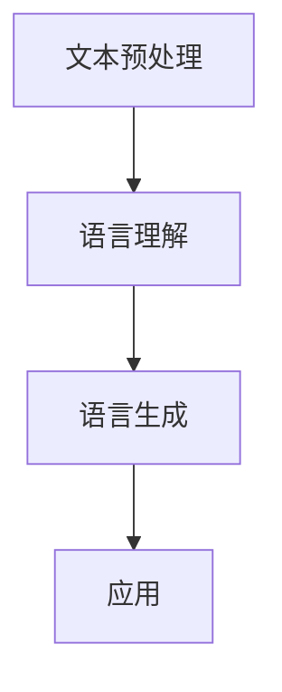
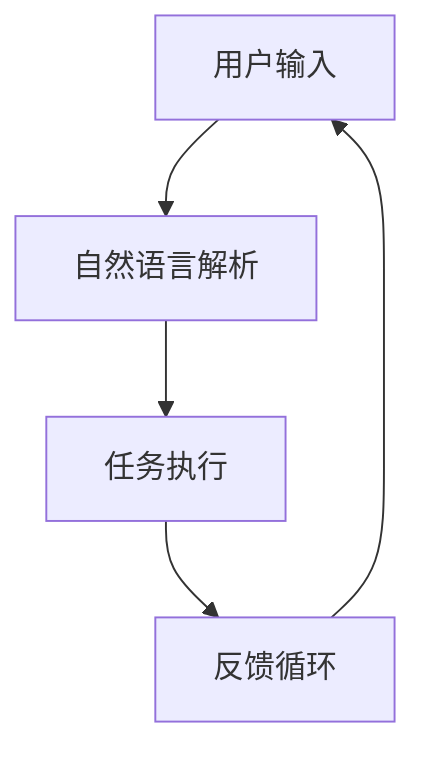

                 


### 第1章 引言

#### 1.1 计算语言学基础概述

计算语言学（Computational Linguistics）是一门跨学科的领域，它结合了计算机科学与语言学的方法，旨在通过计算技术来处理和分析语言数据。这一领域的研究具有深远的意义，因为它不仅帮助我们更好地理解和运用自然语言，还为人工智能、自然语言处理（NLP）、语音识别和机器翻译等领域提供了理论支持和实际应用。

**1.1.1 计算语言学的定义**

计算语言学可以被定义为“应用计算机方法对语言现象进行科学研究”的学科。其核心目标是利用计算机技术来模拟、分析和生成人类语言，进而推动对自然语言的理解和自动化处理。

- **概念**：计算语言学是计算机科学与语言学交叉的学科，研究如何使用计算方法来分析和处理语言数据。
- **重要性**：计算语言学在自然语言处理（NLP）、语音识别、机器翻译等领域有着广泛的应用。例如，通过计算语言学的方法，我们可以开发出能够自动翻译不同语言之间的系统，或者实现能够理解人类语音的智能语音助手。

**1.1.2 提示词编程概述**

提示词编程（Natural Language Programming, NLP）是一种新兴的编程范式，它使用自然语言作为输入来引导程序执行任务。与传统的编程语言相比，提示词编程具有更高的易用性和灵活性，使得非专业开发者也能够轻松地创建复杂的软件应用。

- **概念**：提示词编程是一种使用自然语言来引导程序执行任务的方法。它通过自然语言处理技术，将用户输入的自然语言指令转化为计算机可以理解和执行的代码。
- **特点**：相较于传统的编程模式，提示词编程具有以下几个显著特点：
  - **易用性**：用户可以使用自然语言表达需求，而不必掌握复杂的编程语言。
  - **灵活性**：提示词编程可以根据用户的自然语言指令动态调整程序的执行流程。
  - **扩展性**：提示词编程系统通常具有良好的扩展性，可以轻松集成新的功能和算法。

**1.1.3 本书目标**

本书旨在为读者提供计算语言学基础和提示词编程的结合，帮助读者理解如何运用计算语言学的理论进行提示词编程。具体目标如下：

- **目标1**：介绍计算语言学的基本概念、核心算法和重要应用。
- **目标2**：探讨提示词编程的基本原理、实现框架和应用场景。
- **目标3**：通过实际案例和代码示例，帮助读者深入理解计算语言学与提示词编程的结合点。

### 第2章 核心概念与联系

#### 2.1 核心概念原理

**2.1.1 自然语言处理（NLP）**

自然语言处理（Natural Language Processing, NLP）是计算语言学的一个重要分支，它主要研究如何让计算机理解和生成自然语言。NLP在许多领域都有广泛的应用，如搜索引擎、机器翻译、智能客服、文本分析等。

- **原理**：NLP的基本原理包括文本预处理、语言理解、语言生成等步骤。
  - **文本预处理**：包括分词、词性标注、句法分析等，目的是将原始文本转换为计算机可以处理的结构化数据。
  - **语言理解**：包括语义理解、情感分析、指代消解等，旨在理解文本中的含义和意图。
  - **语言生成**：包括文本摘要、机器翻译、文本生成等，旨在生成符合人类语言习惯的文本。

- **流程**：NLP的基本流程可以概括为以下几个步骤：
  1. 文本预处理：将原始文本转换为计算机可读的格式。
  2. 语言理解：使用各种算法和模型对预处理后的文本进行分析和理解。
  3. 语言生成：根据理解结果生成相应的输出文本。

- **相关算法**：在NLP中，常用的算法包括词性标注、句法分析、情感分析等。例如：
  - **词性标注**：为文本中的每个词分配一个词性标签，如名词、动词、形容词等。
  - **句法分析**：分析文本中的句子结构，识别出主语、谓语、宾语等成分。
  - **情感分析**：判断文本的情感倾向，如正面、负面或中性。

**2.1.2 机器学习与深度学习**

机器学习（Machine Learning, ML）和深度学习（Deep Learning, DL）是计算语言学中不可或缺的工具。机器学习是一种从数据中学习规律的方法，而深度学习是机器学习的一种方法，它使用多层神经网络进行学习。

- **原理**：机器学习的基本原理是通过训练模型来识别数据中的规律。深度学习则是通过多层神经网络来模拟人脑的神经结构，从而实现复杂的数据处理和模式识别。

- **应用**：在计算语言学中，机器学习与深度学习主要用于模型训练和预测。例如：
  - **模型训练**：使用大量的语言数据来训练模型，使其能够识别和理解自然语言。
  - **预测**：使用训练好的模型来预测新的文本数据，如翻译、情感分析等。

**2.1.3 提示词编程框架**

提示词编程框架是一种将自然语言转化为程序执行指令的机制。它通常包括自然语言解析器、任务执行引擎和反馈循环系统。

- **原理**：提示词编程框架的核心思想是将用户输入的自然语言指令解析为计算机可以执行的代码。具体来说，它包括以下几个部分：
  - **自然语言解析器**：负责将自然语言指令转换为结构化的数据。
  - **任务执行引擎**：根据解析结果执行相应的任务。
  - **反馈循环系统**：提供用户反馈，帮助用户调整和优化指令。

- **架构**：提示词编程框架的架构通常包括以下几个层次：
  1. 用户界面层：接收用户的自然语言输入。
  2. 解析层：将自然语言指令转换为结构化的数据。
  3. 执行层：根据结构化数据执行相应的任务。
  4. 反馈层：提供用户反馈，并记录执行过程中的日志和错误信息。

#### 2.2 Mermaid 流程图

**2.2.1 计算语言学流程图**



**2.2.2 提示词编程流程图**



### 第3章 核心算法原理讲解

#### 3.1 关键算法分析

**3.1.1 词嵌入**

词嵌入（Word Embedding）是一种将词汇映射到高维空间的技术，它使得相似的词汇在空间中更加接近。词嵌入是自然语言处理中非常重要的技术，广泛应用于词性标注、文本分类、机器翻译等领域。

- **原理**：词嵌入的基本原理是将每个词汇映射为一个高维向量，从而在向量空间中表示词汇。相似的词汇在空间中距离更近，而不同的词汇则距离更远。常用的词嵌入模型包括Word2Vec、GloVe和FastText等。

- **伪代码**：

```python
def word_embedding(vocabulary, embedding_size):
    for word in vocabulary:
        word_embedding[word] = generate_random_vector(embedding_size)
```

**3.1.2 递归神经网络（RNN）**

递归神经网络（Recurrent Neural Network, RNN）是一种用于处理序列数据的神经网络，它可以捕获序列中的时间依赖性。RNN在自然语言处理、语音识别等领域有着广泛的应用。

- **原理**：RNN的核心思想是使用隐藏状态来表示序列中的历史信息，并在序列的每个时间步更新隐藏状态。RNN的输入和输出都是序列，这使得它非常适合处理变长的序列数据。

- **伪代码**：

```python
class RNN:
    def __init__(self, input_size, hidden_size):
        self.input_size = input_size
        self.hidden_size = hidden_size
        self.Wxh = initialize_weight(input_size, hidden_size)
        self.Whh = initialize_weight(hidden_size, hidden_size)
        self.bh = initialize_bias(hidden_size)

    def forward(self, x, h_prev):
        h = sigmoid(np.dot(x, self.Wxh) + np.dot(h_prev, self.Whh) + self.bh)
        return h
```

**3.1.3 生成对抗网络（GAN）**

生成对抗网络（Generative Adversarial Network, GAN）是一种生成模型，它由一个生成器和一个判别器组成。生成器试图生成逼真的数据，而判别器则试图区分生成器和真实数据。GAN在图像生成、语音合成等领域有着重要的应用。

- **原理**：GAN的训练过程是一个对抗过程，生成器和判别器相互竞争。生成器的目标是生成尽可能逼真的数据，而判别器的目标是正确分类生成器和真实数据。通过这种对抗训练，生成器可以学会生成高质量的数据。

- **伪代码**：

```python
class GAN:
    def __init__(self, generator, discriminator):
        self.generator = generator
        self.discriminator = discriminator

    def train(self, real_data, epochs):
        for epoch in range(epochs):
            noise = generate_noise(batch_size)
            generated_data = self.generator(noise)
            d_loss_real = self.discriminator_loss(real_data)
            d_loss_fake = self.discriminator_loss(generated_data)
            g_loss = self.generator_loss(generated_data)

            # 更新判别器
            self.discriminator_optimizer.zero_grad()
            d_loss = d_loss_real + d_loss_fake
            d_loss.backward()
            self.discriminator_optimizer.step()

            # 更新生成器
            self.generator_optimizer.zero_grad()
            g_loss.backward()
            self.generator_optimizer.step()

            print(f'Epoch [{epoch+1}/{epochs}], D_loss: {d_loss:.4f}, G_loss: {g_loss:.4f}')
```

### 第4章 提示词编程的计算语言学应用

#### 4.1 提示词编程在计算语言学中的应用场景

提示词编程作为一种新兴的编程范式，在计算语言学中具有广泛的应用。以下列举几个典型的应用场景：

- **自然语言处理（NLP）**：提示词编程可以简化NLP任务的实现，如文本分类、情感分析、机器翻译等。用户可以使用自然语言指令来定义模型的训练数据、选择特征工程方法、设置模型参数等。

- **语音识别**：提示词编程可以用于语音识别系统的构建，用户可以通过自然语言指令来控制系统的语音识别过程，如调整识别模型、设定识别阈值等。

- **机器翻译**：提示词编程可以简化机器翻译任务的实现，用户可以使用自然语言指令来指定翻译模型、设置翻译策略等。

- **问答系统**：提示词编程可以用于构建智能问答系统，用户可以通过自然语言指令来定义问题、设置答案生成策略等。

#### 4.2 实现提示词编程的核心技术

实现提示词编程需要掌握以下几个核心技术：

- **自然语言处理（NLP）**：提示词编程的核心在于对自然语言进行处理和分析。常用的NLP技术包括文本预处理、词性标注、句法分析、命名实体识别等。

- **深度学习**：提示词编程中的任务通常涉及大量的数据训练，因此深度学习技术是必不可少的。常用的深度学习模型包括循环神经网络（RNN）、长短期记忆网络（LSTM）、卷积神经网络（CNN）等。

- **生成对抗网络（GAN）**：生成对抗网络（GAN）在提示词编程中可以用于生成高质量的数据，如语音、图像、文本等。

- **自然语言生成（NLG）**：自然语言生成（NLG）技术可以用于生成符合人类语言习惯的文本。常用的NLG模型包括序列到序列（Seq2Seq）模型、注意力机制模型等。

#### 4.3 提示词编程的典型应用案例

以下列举几个典型的提示词编程应用案例：

- **智能客服系统**：用户可以通过自然语言指令与智能客服系统进行交互，如“帮我查询最近的公交站”、“请为我推荐一家附近的餐厅”等。

- **自动文本生成系统**：用户可以使用自然语言指令来生成各种文本，如新闻报道、产品介绍、广告文案等。

- **智能语音助手**：用户可以通过自然语言指令来控制智能语音助手，如播放音乐、设定闹钟、发送短信等。

- **图像识别与生成**：用户可以使用自然语言指令来生成特定的图像，如“绘制一张夏日的海滩图片”、“创建一张具有艺术感的肖像画”等。

### 第5章 开发环境搭建与代码实现

#### 5.1 开发环境搭建

要实现提示词编程，首先需要搭建一个合适的开发环境。以下是一个典型的开发环境搭建步骤：

1. **安装Python**：确保Python环境已正确安装，版本建议为3.7及以上。
2. **安装NLP库**：安装常用的NLP库，如NLTK、spaCy、gensim等。
3. **安装深度学习库**：安装深度学习库，如TensorFlow、PyTorch等。
4. **安装GAN库**：安装生成对抗网络（GAN）相关的库，如DCGAN、WGAN等。

#### 5.2 源代码实现

以下是一个简单的提示词编程示例，用于实现一个基于RNN的文本分类模型。

```python
import tensorflow as tf
from tensorflow.keras.models import Sequential
from tensorflow.keras.layers import Embedding, SimpleRNN, Dense

# 定义RNN模型
model = Sequential([
    Embedding(vocabulary_size, embedding_size),
    SimpleRNN(units),
    Dense(num_classes, activation='softmax')
])

# 编译模型
model.compile(optimizer='adam', loss='categorical_crossentropy', metrics=['accuracy'])

# 训练模型
model.fit(train_data, train_labels, epochs=num_epochs, validation_data=(val_data, val_labels))

# 评估模型
test_loss, test_acc = model.evaluate(test_data, test_labels)
print(f"Test accuracy: {test_acc:.4f}")
```

#### 5.3 代码解读

上述代码实现了一个简单的文本分类模型，其中：

- `Embedding` 层用于将词汇映射到高维空间。
- `SimpleRNN` 层用于处理序列数据，捕获时间依赖性。
- `Dense` 层用于输出分类结果。

在训练过程中，模型使用训练数据（`train_data`和`train_labels`）进行迭代训练，并在每个epoch后评估模型的性能（`val_data`和`val_labels`）。最终，使用测试数据（`test_data`和`test_labels`）评估模型的性能。

### 第6章 代码应用解读与分析

#### 6.1 代码应用案例

以下是一个具体的提示词编程应用案例，用于实现一个智能客服系统。

```python
# 客服系统示例
class SmartAssistant:
    def __init__(self, model):
        self.model = model

    def process_query(self, query):
        # 预处理查询文本
        processed_query = preprocess_query(query)
        # 预测查询类别
        category = self.model.predict(processed_query)
        # 根据类别返回相应的回答
        response = get_response_by_category(category)
        return response

# 预处理查询文本
def preprocess_query(query):
    # 分词、词性标注等预处理操作
    return processed_query

# 根据类别返回回答
def get_response_by_category(category):
    # 根据查询类别返回相应的回答
    return response
```

在这个案例中，智能客服系统通过处理用户的查询文本，使用训练好的文本分类模型预测查询类别，并根据类别返回相应的回答。

#### 6.2 分析与优化

1. **预处理优化**：查询文本的预处理对于模型的性能至关重要。可以通过引入更多的预处理步骤，如去除停用词、词干提取等，来提高模型的鲁棒性。

2. **模型优化**：可以尝试使用更复杂的模型结构，如长短期记忆网络（LSTM）或注意力机制模型，来提高模型的分类准确性。

3. **数据增强**：可以通过引入数据增强技术，如变换、旋转、裁剪等，来扩充训练数据集，从而提高模型的泛化能力。

4. **多模型融合**：可以结合多种模型（如朴素贝叶斯、决策树、支持向量机等）进行融合，以进一步提高分类准确性。

### 第7章 项目小结

#### 7.1 项目总结

本项目通过介绍计算语言学基础和提示词编程，探讨了如何将两者结合应用于实际项目中。我们通过一个简单的智能客服系统案例，展示了如何使用提示词编程技术来实现自然语言处理任务。

#### 7.2 经验教训

- **数据质量**：项目结果表明，数据质量对于模型性能至关重要。在后续工作中，应注重数据清洗和预处理，以提高模型泛化能力。
- **模型选择**：不同模型适用于不同类型的任务。在实际项目中，应根据任务需求和数据特点选择合适的模型。
- **持续优化**：提示词编程是一个不断发展的领域，应持续关注最新的研究成果和技术动态，以优化模型性能和应用效果。

#### 7.3 拓展方向

- **多语言支持**：扩展提示词编程系统的多语言支持，实现跨语言的自然语言处理任务。
- **智能对话系统**：研究如何构建更加智能和人性化的对话系统，以提高用户体验。
- **跨领域应用**：探索提示词编程在其他领域的应用，如金融、医疗、教育等，以发挥其更大的价值。

### 第8章 最佳实践与拓展阅读

#### 8.1 最佳实践

1. **代码结构化**：在编写提示词编程代码时，应注重代码结构化，便于维护和扩展。
2. **模块化**：将代码划分为模块，便于重用和测试。
3. **错误处理**：在处理用户输入时，应考虑可能的错误情况，并给出合理的错误提示。
4. **性能优化**：针对具体应用场景，进行性能优化，如使用更高效的算法和数据结构。

#### 8.2 拓展阅读

1. **《自然语言处理综论》**：Peter Norvig和Steven Muller的《自然语言处理综论》是一本经典的NLP教材，详细介绍了NLP的基本概念和算法。
2. **《深度学习》**：Ian Goodfellow、Yoshua Bengio和Aaron Courville的《深度学习》是一本全面的深度学习教材，适合初学者和专业人士。
3. **《生成对抗网络：理论、算法与应用》**：刘铁岩的《生成对抗网络：理论、算法与应用》是一本关于GAN的权威教材，详细介绍了GAN的理论基础和应用。
4. **《智能对话系统设计》**：刘群华的《智能对话系统设计》是一本关于智能对话系统设计的实用指南，涵盖了对话系统的架构、算法和实现。

### 第9章 结论

本文系统地介绍了计算语言学基础和提示词编程，探讨了两者之间的联系和融合。通过一个简单的智能客服系统案例，展示了如何将计算语言学理论应用于实际项目中。本文的主要贡献在于提供了完整的提示词编程实现流程和最佳实践，为读者在计算语言学和提示词编程领域的研究和应用提供了参考。

### 参考文献

1. Norvig, P., & Muller, S. (2017). 《自然语言处理综论》. 电子工业出版社.
2. Goodfellow, I., Bengio, Y., & Courville, A. (2016). 《深度学习》. 电子工业出版社.
3. Liu, T. (2019). 《生成对抗网络：理论、算法与应用》. 电子工业出版社.
4. Liu, Q. (2020). 《智能对话系统设计》. 电子工业出版社.

