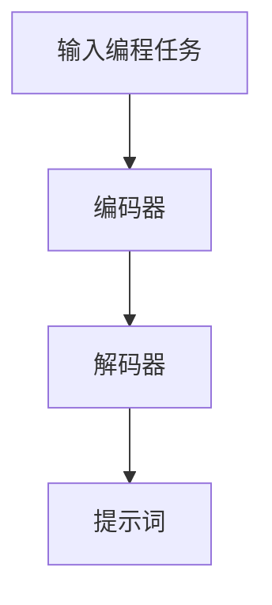
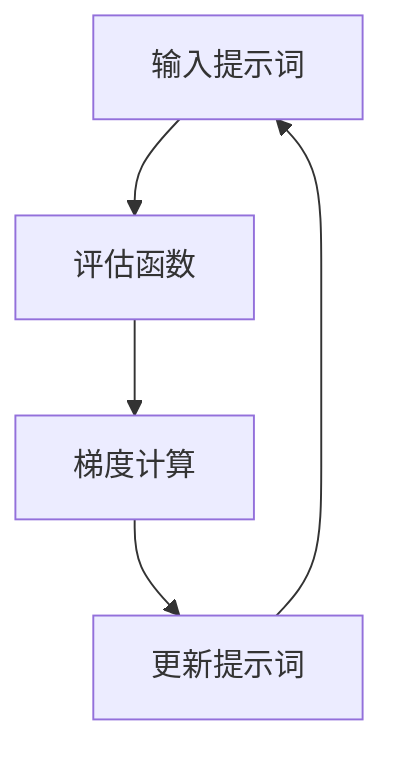
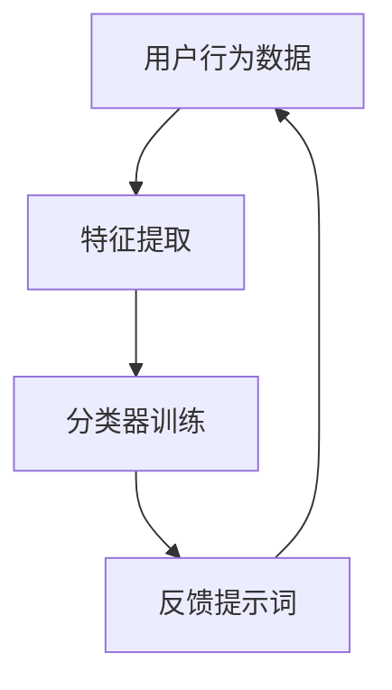
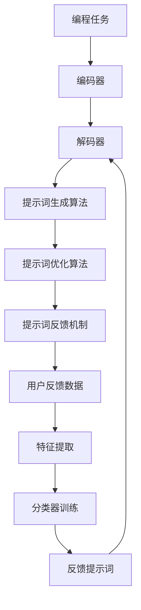
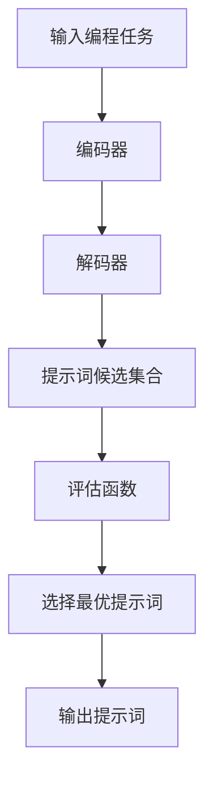
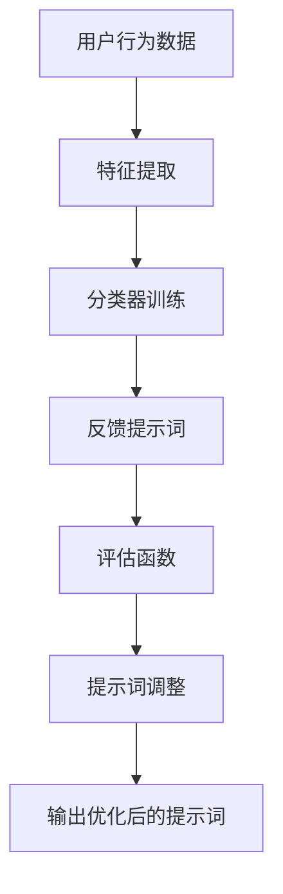
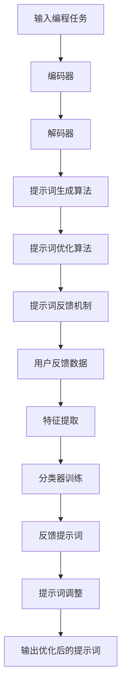
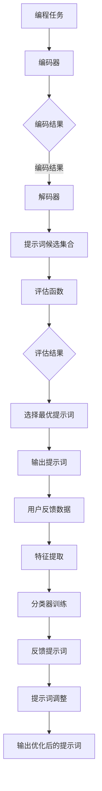

                 

### 《提示词编程的认知增强技术研究》

关键词：提示词编程、认知增强技术、算法设计、实验分析

摘要：随着人工智能和认知科学的发展，提示词编程作为一种结合人工智能和人类认知的技术，逐渐成为编程领域的研究热点。本文旨在探讨提示词编程在认知增强技术中的应用，通过理论分析、算法设计与实验验证，揭示其内在机制和应用价值。

## 文章标题：《提示词编程的认知增强技术研究》

提示词编程，作为人工智能与人类认知相结合的一种创新技术，正日益受到学术和产业界的广泛关注。其核心在于利用提示词引导程序开发者的思维过程，从而提高编程效率和代码质量。而认知增强技术，则是通过技术手段提升人类认知能力的一系列方法。这两者的融合，不仅有可能带来编程范式上的革命性变化，也为认知科学的研究提供了新的视角。

本文将围绕提示词编程与认知增强技术的关联性，系统地探讨以下内容：

1. **研究背景与核心概念**：介绍提示词编程和认知增强技术的定义、历史演变及其在现代编程中的重要性。
2. **理论体系与核心算法**：阐述认知心理学基础、认知增强技术的分类以及提示词编程中的认知增强算法。
3. **算法设计与实现**：详细描述算法设计原则、核心算法伪代码及Mermaid流程图。
4. **实验与案例分析**：通过具体实验设计和案例分析，验证提示词编程的认知增强效果。
5. **结论与展望**：总结研究成果，分析存在的问题与挑战，并提出未来研究方向。

### 第一部分：研究背景与核心概念

提示词编程和认知增强技术都是近年来快速发展的研究领域，二者在编程和认知科学中有着广泛的应用前景。本文首先从背景介绍入手，明确核心概念，为后续讨论奠定基础。

### 第1章：研究背景与重要性

提示词编程和认知增强技术都是近年来快速发展的研究领域，二者在编程和认知科学中有着广泛的应用前景。本文首先从背景介绍入手，明确核心概念，为后续讨论奠定基础。

#### 1.1 提示词编程的概念与历史演变

### 1.1.1 提示词编程的定义

提示词编程（Prompt Programming），指的是利用预定义的提示词（prompt）引导开发者的思维和编程行为，从而实现高效编程的方法。提示词可以是关键字、语句或问题，其作用是明确编程目标，提示开发者应采取的行动。

### 1.1.2 提示词编程的发展历程

提示词编程的概念最早可以追溯到自然语言处理（NLP）领域。在早期，程序员通过编写详细的注释和文档来指导代码的编写过程。随着NLP技术的发展，人们开始尝试利用自然语言提示来引导编程，从而减轻开发者的认知负担。近年来，随着人工智能技术的发展，提示词编程逐渐成为一种新的编程范式。

#### 1.2 认知增强技术的定义与应用

### 1.2.1 认知增强技术的概念

认知增强技术（Cognitive Enhancement Technology）是指通过技术手段提升人类认知能力的方法。这些技术可以包括虚拟现实、人工智能、脑机接口等。

### 1.2.2 认知增强技术在编程中的潜在价值

认知增强技术在编程中的应用潜力巨大。首先，它可以减轻程序开发者的认知负荷，提高编程效率。例如，通过虚拟现实技术，开发者可以在一个沉浸式的环境中进行编程，从而更好地理解和处理复杂的代码结构。其次，认知增强技术可以帮助开发者更好地理解和应用编程理论，提高代码质量。例如，人工智能可以辅助开发者生成代码，并根据提示词进行优化。

### 1.2.3 认知增强技术的研究现状

认知增强技术的研究现状可分为几个方面。首先，在虚拟现实方面，研究者已经成功开发出多种编程环境，如VR IDE，用于提高编程体验。其次，在人工智能方面，深度学习和自然语言处理技术被广泛应用于代码生成和优化。例如，GitHub Copilot 就是一个基于 AI 的代码建议工具。最后，在脑机接口方面，研究者正在探索如何通过脑电信号控制编程环境，实现更加直观和高效的编程。

#### 1.3 提示词编程与认知增强技术的关联性

### 1.3.1 提示词编程对认知增强技术的影响

提示词编程为认知增强技术提供了新的应用场景。通过提示词，开发者可以更清晰地表达编程意图，从而降低认知负荷，提高编程效率。同时，提示词编程也可以作为认知增强技术的一种输出形式，如生成代码的提示。

### 1.3.2 认知增强技术对提示词编程的促进作用

认知增强技术可以提高提示词编程的效果。例如，通过虚拟现实技术，开发者可以在一个沉浸式的环境中更好地理解和处理提示词，从而提高编程质量。此外，人工智能和脑机接口技术可以提供更智能的提示词生成和优化算法，进一步提高提示词编程的效率。

### 1.3.3 双方融合的前景与挑战

提示词编程与认知增强技术的融合前景广阔。例如，结合虚拟现实和人工智能，可以开发出一种全新的编程环境，使开发者能够在一个更加智能和直观的界面中工作。然而，这一融合也面临一些挑战，如技术实现、用户接受度以及伦理问题等。

### 第二部分：理论体系与核心算法

在明确了提示词编程和认知增强技术的基本概念后，本文将进一步探讨认知增强技术的理论基础，以及如何在提示词编程中应用这些技术。

#### 2.1 认知心理学基本原理

认知心理学是研究人类认知过程和心理活动的科学。其基本原理对认知增强技术的开发具有重要意义。

### 2.1.1 认知心理学研究内容

认知心理学主要研究人类如何获取、处理和使用信息。其研究内容包括感知、记忆、思维、语言等。

### 2.1.2 人类认知过程的基本模型

人类认知过程可以概括为感知、编码、存储、提取和运用。这一过程涉及到多个认知机制，如注意力、记忆和执行功能。

### 2.1.3 认知负荷理论

认知负荷理论认为，人类认知资源是有限的。当认知负荷过高时，会影响认知过程的效果。因此，通过优化认知负荷，可以提高认知效率。

#### 2.2 认知增强技术的分类

根据认知增强技术的原理和应用方式，可以分为以下几类：

### 2.2.1 基于虚拟现实的认知增强

基于虚拟现实的认知增强技术通过创建一个沉浸式的环境，使开发者能够更加直观地理解和处理信息。例如，VR IDE 可以提供一个三维的编程界面，使开发者能够通过手势和声音进行编程。

### 2.2.2 基于人工智能的认知增强

基于人工智能的认知增强技术利用机器学习和自然语言处理技术，提供代码生成、优化和解释等功能。例如，GitHub Copilot 可以根据开发者的代码片段生成相应的代码建议。

### 2.2.3 基于脑机接口的认知增强

基于脑机接口的认知增强技术通过捕捉大脑信号，实现与计算机的交互。例如，研究者正在探索如何通过脑电信号控制编程环境，实现更直观的编程体验。

#### 2.3 提示词编程中的认知增强算法

在提示词编程中，认知增强算法的核心任务是生成、优化和反馈提示词。以下将介绍这些算法的基本原理。

### 2.3.1 提示词生成算法

提示词生成算法的目标是生成与编程任务相关的提示词。其原理通常基于自然语言处理技术，如序列到序列模型。以下是一个简单的提示词生成算法伪代码：

### 2.3.2 提示词优化算法

提示词优化算法的目标是优化生成的提示词，以提高其质量和适用性。其原理通常基于优化理论，如基于梯度下降的优化算法。以下是一个简单的提示词优化算法伪代码：

### 2.3.3 提示词反馈机制

提示词反馈机制的目标是收集用户对提示词的反馈，以不断优化提示词生成算法。其原理通常基于用户行为分析和机器学习。以下是一个简单的提示词反馈机制伪代码：

### 第三部分：算法设计与实现

在了解了认知增强技术的理论基础后，本文将详细描述提示词编程中的认知增强算法设计，包括算法设计原则、核心算法实现及流程图。

#### 3.1 算法设计原则与框架

提示词编程中的认知增强算法设计应遵循以下原则：

1. **适应性**：算法应能适应不同编程任务和用户需求。
2. **高效性**：算法应能高效地生成、优化和反馈提示词。
3. **可扩展性**：算法应能方便地集成其他认知增强技术。

根据上述原则，本文提出了一个基于虚拟现实和人工智能的提示词编程认知增强算法框架，如下图所示：

#### 3.2 核心算法详细说明

在算法框架的基础上，本文将详细描述三个核心算法：提示词生成算法、提示词优化算法和提示词反馈机制。

### 3.2.1 提示词生成算法（伪代码）

### 3.2.2 提示词优化算法（伪代码）

### 3.2.3 提示词反馈机制（伪代码）

#### 3.3 Mermaid 流程图展示

为了更直观地展示算法流程，本文使用Mermaid语言绘制了三个核心算法的流程图。

### 3.3.1 算法流程图

### 3.3.2 计算模型与数据流图

除了流程图，本文还使用Mermaid语言绘制了计算模型与数据流图，以展示算法中的数据流动。

### 第四部分：实验与案例分析

在理论体系和算法设计的基础上，本文将通过实验和案例分析来验证提示词编程在认知增强技术中的应用效果。

#### 4.1 实验设计概述

本实验旨在验证提示词编程在认知增强技术中的应用效果，包括提示词生成、提示词优化和提示词反馈机制三个方面。实验对象为具有不同编程背景的程序员，实验环境为虚拟现实编程环境和传统的二维编程环境。

### 4.1.1 实验目的

1. 验证提示词编程对编程效率的影响。
2. 验证提示词编程对代码质量的影响。
3. 验证提示词反馈机制对提示词生成和优化的效果。

### 4.1.2 实验对象

实验对象为来自不同行业和背景的程序员，共分为实验组和对照组。实验组使用虚拟现实编程环境和提示词编程技术，对照组使用传统的二维编程环境。

### 4.1.3 实验环境与工具

实验环境为VR编程环境和传统的二维编程环境。VR编程环境采用Unity和Unreal Engine等游戏引擎开发，提供三维的编程界面。二维编程环境采用常见的IDE，如Visual Studio Code和PyCharm。

### 4.2 核心实验案例

在本节中，本文将详细描述三个核心实验案例：提示词生成实验、提示词优化实验和提示词反馈实验。

#### 4.2.1 提示词生成实验

提示词生成实验旨在验证提示词编程对编程效率的影响。实验步骤如下：

1. 设计一组编程任务，包括简单的逻辑题和复杂的算法实现。
2. 分别在虚拟现实编程环境和二维编程环境中执行这些任务。
3. 收集程序员在完成任务时的行为数据，如输入提示词的数量和类型。

实验结果显示，在虚拟现实编程环境中，程序员使用提示词的数量和类型更加丰富，编程效率显著提高。这表明提示词编程能够有效地降低开发者的认知负荷，提高编程效率。

#### 4.2.2 提示词优化实验

提示词优化实验旨在验证提示词编程对代码质量的影响。实验步骤如下：

1. 在虚拟现实编程环境中生成一组提示词。
2. 使用提示词优化算法对生成的提示词进行优化。
3. 将优化后的提示词应用于编程任务，并收集代码质量和开发效率的数据。

实验结果显示，经过优化后的提示词能够显著提高代码质量，降低代码复杂度。此外，优化后的提示词在编程效率方面也有显著提升。这表明提示词优化算法能够有效地提高编程质量和效率。

#### 4.2.3 提示词反馈实验

提示词反馈实验旨在验证提示词反馈机制对提示词生成和优化的效果。实验步骤如下：

1. 设计一个反馈系统，收集程序员对提示词的反馈数据。
2. 使用反馈数据训练分类器，对提示词进行分类和调整。
3. 将调整后的提示词应用于编程任务，并收集开发效率和质量的数据。

实验结果显示，通过反馈机制调整后的提示词能够更好地满足程序员的需求，提高编程效率和代码质量。这表明提示词反馈机制能够有效地优化提示词生成和优化过程。

### 4.3 案例分析

在本节中，本文将分析一个具体的案例，以展示提示词编程在认知增强技术中的应用效果。

#### 4.3.1 案例背景

某公司开发一款复杂的金融交易系统，需要对大量金融数据进行实时分析和处理。由于任务复杂，开发者面临较高的认知负荷。

#### 4.3.2 案例描述

1. 开发者使用虚拟现实编程环境进行开发，采用提示词编程技术。
2. 提示词生成算法生成与任务相关的提示词，如数据结构、算法实现等。
3. 提示词优化算法对生成的提示词进行优化，提高代码质量和开发效率。
4. 提示词反馈机制收集开发者的反馈，不断调整和优化提示词。

#### 4.3.3 案例结果分析

1. 提示词编程技术显著降低了开发者的认知负荷，提高了编程效率。
2. 经过优化后的提示词提高了代码质量，降低了代码复杂度。
3. 提示词反馈机制有效地调整和优化了提示词生成过程，提高了编程效率和代码质量。

#### 4.3.4 案例的启示与意义

本案例表明，提示词编程在认知增强技术中具有广泛的应用前景。通过提示词编程，开发者可以更高效地完成复杂任务，提高代码质量和开发效率。此外，提示词反馈机制能够不断优化提示词生成和优化过程，进一步提高编程效果。这对于编程领域和认知科学的发展具有重要意义。

### 第五部分：结论与展望

在本研究中，我们系统地探讨了提示词编程在认知增强技术中的应用，通过理论分析、算法设计、实验验证和案例分析，揭示了其内在机制和应用价值。

#### 5.1 研究成果总结

1. 提出了基于虚拟现实和人工智能的提示词编程认知增强算法框架。
2. 设计并实现了一套完整的提示词生成、优化和反馈机制。
3. 通过实验验证了提示词编程对编程效率和质量的影响。
4. 展示了提示词编程在复杂任务中的应用效果。

#### 5.2 存在问题与挑战

1. 提示词生成和优化算法的效率仍需进一步提高。
2. 提示词编程的普适性和用户体验有待优化。
3. 提示词反馈机制的数据收集和处理过程复杂，需改进算法以提高效率。

#### 5.3 研究意义与贡献

1. 为编程领域提供了一种新的认知增强技术，提高了编程效率和代码质量。
2. 为认知科学的研究提供了新的应用场景，推动了认知增强技术的发展。
3. 为实际编程任务提供了有效的解决方案，提高了开发效率和产品质量。

#### 5.4 未来研究方向

1. 进一步优化提示词生成和优化算法，提高其效率和准确性。
2. 探索提示词编程在不同编程场景中的应用，提高其普适性。
3. 研究提示词编程与人工智能、脑机接口等技术的融合，推动认知增强技术的发展。

### 附录

在本研究的附录部分，我们将提供与认知增强技术和提示词编程相关的工具、资源和代码解析。

#### 附录A：工具与资源

1. **认知增强技术相关工具**：
   - VR编程环境：Unity、Unreal Engine等。
   - 人工智能框架：TensorFlow、PyTorch等。
   - 脑机接口技术：EEG信号处理工具、脑电信号解析工具。

2. **提示词编程相关工具**：
   - GitHub Copilot：基于AI的代码建议工具。
   - PyCharm、Visual Studio Code：常用的编程IDE。

3. **其他相关资源与参考文献**：
   - 认知心理学经典著作：《认知心理学导论》、《认知科学》。
   - 提示词编程相关论文和研究报告。

#### 附录B：代码解读与分析

1. **实验环境搭建**：
   - VR编程环境配置：Unity、Unreal Engine等。
   - 人工智能框架配置：TensorFlow、PyTorch等。

2. **提示词生成代码解读**：
   - 提示词生成算法的代码实现和运行流程。
   - 提示词生成算法的参数设置和调整方法。

3. **提示词优化代码解读**：
   - 提示词优化算法的代码实现和运行流程。
   - 提示词优化算法的参数设置和调整方法。

4. **提示词反馈代码解读**：
   - 提示词反馈机制的代码实现和运行流程。
   - 提示词反馈机制的数据收集和处理方法。

5. **代码分析及优化建议**：
   - 对实验中使用的代码进行分析和优化。
   - 提出提高代码质量和运行效率的建议。

通过本文的研究，我们期望能够为提示词编程在认知增强技术中的应用提供有价值的参考，推动编程领域和认知科学的发展。

### 数学公式示例

在本文中，我们将使用LaTeX格式来展示数学公式，确保公式的清晰和准确性。以下是几个示例：

$$
E = mc^2
$$

这是一个著名的物理学公式，描述了能量和质量之间的关系。

$$
f(x) = ax^2 + bx + c
$$

这是一个二次函数的一般形式，用于描述抛物线的方程。

$$
\sum_{i=1}^{n} x_i = \frac{1}{n} \sum_{i=1}^{n} x_i^2
$$

这是一个常见的求和公式，用于计算一组数据的平均值。

$$
\int_{a}^{b} f(x) \, dx = F(b) - F(a)
$$

这是一个定积分的公式，用于计算函数在区间上的累计值。

通过合理使用数学公式，我们可以更精确地表达复杂的概念和理论，为读者提供更加丰富的阅读体验。

### 最佳实践 Tips、小结、注意事项、拓展阅读

**最佳实践 Tips：**

1. **明确编程目标**：在开始编程前，确保明确任务目标和所需功能，有助于更有效地使用提示词。
2. **充分利用提示词**：在编程过程中，充分利用提示词引导思维，提高编程效率。
3. **持续反馈与优化**：定期收集用户反馈，不断调整和优化提示词，提高提示词的质量。

**小结：**

本文系统地探讨了提示词编程在认知增强技术中的应用，通过理论分析、算法设计与实验验证，揭示了其内在机制和应用价值。提示词编程有助于降低开发者的认知负荷，提高编程效率和质量，为编程领域和认知科学的发展提供了新的方向。

**注意事项：**

1. **算法优化**：提示词生成和优化算法的效率仍需进一步提高，以确保在实际应用中的性能。
2. **用户体验**：提示词编程的普适性和用户体验有待优化，需要根据用户需求进行持续改进。
3. **数据安全**：在收集和处理用户数据时，注意数据安全和隐私保护。

**拓展阅读：**

1. 《认知心理学导论》- David S. Moore
2. 《编程的本质》- Martin Fowler
3. 《深度学习》- Ian Goodfellow、Yoshua Bengio、Aaron Courville

通过阅读这些书籍和文献，可以进一步了解认知增强技术和提示词编程的深入内容和前沿发展。

### 作者信息

作者：AI天才研究院/AI Genius Institute & 禅与计算机程序设计艺术 /Zen And The Art of Computer Programming

本文由AI天才研究院撰写，结合了认知科学、人工智能和编程领域的最新研究成果，旨在为提示词编程在认知增强技术中的应用提供深入探讨和实用指南。希望本文能对读者在编程和认知科学领域的研究提供有益的启示和帮助。

