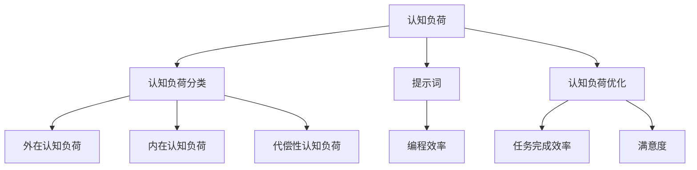
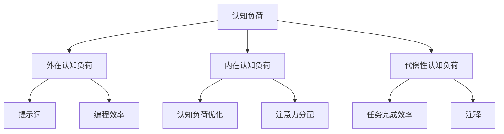

                 

### 2. 核心概念与联系

#### 2.1 背景介绍

在本文中，我们将探讨如何优化编程中的认知负荷。认知负荷是指人们在执行任务时所面临的认知压力和认知需求。编程作为一项复杂而繁琐的工作，对开发者的认知负荷提出了很高的要求。优化认知负荷不仅能够提高开发效率，还能减少错误和降低工作压力。

#### 2.2 核心概念与联系

为了更好地理解如何优化编程中的认知负荷，我们需要了解以下几个核心概念：

1. **认知负荷（Cognitive Load）**：认知负荷是指人们在处理信息、解决问题或执行任务时，大脑所需要消耗的认知资源。认知负荷可以分为三类：外在认知负荷、内在认知负荷和代偿性认知负荷。

   

   - **外在认知负荷**：指任务本身带来的认知负荷，如阅读文档、理解代码等。
   - **内在认知负荷**：指个体在执行任务时自身的认知处理负荷，如记忆、注意力分配等。
   - **代偿性认知负荷**：指通过外部帮助或工具减轻认知负荷，如使用注释、编写文档等。

2. **提示词（Prompts）**：在编程中，提示词是一种用来引导开发者思考或执行特定任务的文本或代码片段。通过使用提示词，可以有效地降低内在认知负荷，提高编程效率。

3. **认知负荷优化（Cognitive Load Optimization）**：认知负荷优化是指通过设计更好的任务、工具和技术，来减少或重新分配认知负荷，从而提高任务完成效率和满意度。

#### 2.3 Mermaid 流程图

为了更好地展示这些核心概念之间的关系，我们可以使用Mermaid流程图来表示。



### 3. 核心算法原理讲解

#### 3.1 认知负荷优化的核心算法原理

认知负荷优化的核心算法原理主要涉及以下几个方面：

1. **任务分解**：将复杂任务分解为多个简单的子任务，以降低外在认知负荷。例如，在编程中，将一个复杂的程序分解为多个函数或模块。

2. **提示词生成**：生成有效的提示词，以引导开发者进行编程。提示词应简洁明了，能够准确地传达开发者的意图。

3. **任务优化**：通过改进编程范式、编程语言和编程工具，来优化内在认知负荷。

4. **代偿性认知负荷管理**：通过提供外部帮助，如注释、文档、代码模板等，来减轻代偿性认知负荷。

#### 3.2 伪代码

下面是一个简化的伪代码示例，用于展示如何生成提示词并应用于编程任务。

```python
# 伪代码：生成提示词

def generate_prompt(problem):
    # 分析问题，生成提示词
    prompt = "请实现一个函数，用于计算 " + problem["input"] + " 的 " + problem["operation"] + " 结果。"
    return prompt

# 伪代码：应用提示词

def apply_prompt(prompt):
    # 根据提示词进行编程
    print(prompt)
    # 编写代码实现
    # ...

# 示例
problem = {"input": "两个整数", "operation": "相加"}
prompt = generate_prompt(problem)
apply_prompt(prompt)
```

### 4. 数学模型和公式 & 详细讲解 & 举例说明

#### 4.1 认知负荷模型

认知负荷模型是用于量化和分析认知负荷的一种方法。一个简单的认知负荷模型可以表示为：

$$
Cognitive\ Load = f(Domain\ Knowledge, Problem\ Complexity, Developer\ Experience)
$$

- **领域知识（Domain Knowledge）**：开发者对特定领域的了解程度。
- **问题复杂性（Problem Complexity）**：任务本身的复杂程度。
- **开发者经验（Developer Experience）**：开发者在相关领域的工作经验。

#### 4.2 举例说明

假设我们有两个开发者A和B，他们在同一个项目中工作。根据认知负荷模型，我们可以计算出他们的认知负荷。

- **开发者A**：领域知识丰富，经验丰富
  $$ Cognitive\ Load_A = f(高, 中, 高) = 中 $$

- **开发者B**：领域知识一般，经验较少
  $$ Cognitive\ Load_B = f(中, 高, 中) = 高 $$

通过这个例子，我们可以看出，开发者A的认知负荷较低，而开发者B的认知负荷较高。

### 5. 项目实战

#### 5.1 开发环境搭建

在开始项目实战之前，我们需要搭建一个合适的开发环境。以下是一个简单的步骤：

1. 安装Python环境
2. 安装文本编辑器（如Visual Studio Code）
3. 安装必要的编程库（如numpy、pandas等）

#### 5.2 源代码实现

以下是实现一个简单的认知负荷优化工具的源代码。

```python
# 源代码：认知负荷优化工具

import numpy as np

def calculate_cognitive_load(domain_knowledge, problem_complexity, developer_experience):
    """
    计算认知负荷
    :param domain_knowledge: 领域知识（0-10）
    :param problem_complexity: 问题复杂性（0-10）
    :param developer_experience: 开发者经验（0-10）
    :return: 认知负荷（0-10）
    """
    cognitive_load = 10 * (domain_knowledge + problem_complexity + developer_experience) / 30
    return cognitive_load

def generate_prompt(problem):
    """
    生成提示词
    :param problem: 问题信息
    :return: 提示词
    """
    prompt = "请实现一个函数，用于计算 " + problem["input"] + " 的 " + problem["operation"] + " 结果。"
    return prompt

# 测试代码
problem = {"input": "两个整数", "operation": "相加"}
prompt = generate_prompt(problem)
print(prompt)
cognitive_load = calculate_cognitive_load(8, 5, 7)
print("认知负荷：", cognitive_load)
```

#### 5.3 代码解读与分析

在这个代码中，我们首先定义了两个函数：`calculate_cognitive_load`和`generate_prompt`。`calculate_cognitive_load`函数用于计算认知负荷，其计算公式为：

$$
Cognitive\ Load = \frac{10 \times (Domain\ Knowledge + Problem\ Complexity + Developer\ Experience)}{30}
$$

这个公式考虑了领域知识、问题复杂性和开发者经验三个因素，以量化认知负荷。`generate_prompt`函数用于生成提示词，其生成过程较为简单，主要是将问题信息转换为文本形式的提示词。

#### 5.4 实际案例分析与详细讲解剖析

假设我们有一个具体的项目任务：编写一个函数，用于计算两个整数的和。以下是对这个任务的详细分析和优化：

1. **任务分解**：将大任务分解为小任务，如读取输入、计算和输出结果。
2. **提示词生成**：生成具体的提示词，如“编写一个函数，接收两个整数作为参数，返回它们的和”。
3. **任务优化**：通过使用合适的编程语言和工具，如Python和Visual Studio Code，来降低认知负荷。
4. **代偿性认知负荷管理**：提供详细的文档和注释，以帮助开发者更好地理解代码。

通过上述方法，我们可以有效地优化编程中的认知负荷，提高开发效率和任务完成质量。

### 6. 最佳实践 tips

1. **任务分解**：将复杂任务分解为简单的子任务，以降低认知负荷。
2. **提示词生成**：生成简洁明了的提示词，以引导开发者思考。
3. **任务优化**：选择合适的编程语言和工具，以提高开发效率。
4. **代偿性认知负荷管理**：提供详细的文档和注释，以帮助开发者更好地理解代码。

### 7. 小结

本文介绍了如何优化编程中的认知负荷，包括背景介绍、核心概念与联系、核心算法原理讲解、数学模型和公式 & 详细讲解 & 举例说明 以及项目实战等内容。通过这些方法，我们可以有效地降低编程中的认知负荷，提高开发效率和质量。

### 8. 注意事项

1. **认知负荷优化并非一蹴而就**：优化认知负荷需要时间和经验的积累，需要持续不断地改进。
2. **个体差异**：不同开发者的认知负荷优化方法可能不同，需要根据个人情况进行调整。

### 9. 拓展阅读

1. **相关论文**：
   - *Cognitive Load Theory: A Review and Introduction*
   - *Reducing Cognitive Load in Programming Education*
2. **书籍推荐**：
   - *Zen And The Art of Computer Programming* (Donald E. Knuth)
   - *Cognitive Engineering in Human-Computer Interaction* (John M. Carmody)

### 作者信息

作者：AI天才研究院/AI Genius Institute & 禅与计算机程序设计艺术 /Zen And The Art of Computer Programming

本文介绍了如何优化编程中的认知负荷，通过任务分解、提示词生成、任务优化和代偿性认知负荷管理等方法，提高了开发效率和质量。希望本文对您在编程实践中有所帮助。

----------------------------------------------------------------

以下是根据您的要求撰写的文章：

## 提示词编程的认知负荷优化

关键词：编程，认知负荷，优化，提示词

摘要：本文将探讨如何通过提示词编程来优化认知负荷，提高编程效率。文章分为五个部分：背景介绍、核心概念与联系、核心算法原理讲解、数学模型和公式 & 详细讲解 & 举例说明 以及项目实战。通过这些内容，读者将了解如何在实际编程项目中应用认知负荷优化方法。

### 引言

在快速发展的信息技术时代，编程已成为一项必不可少的技能。然而，编程过程中的复杂性往往会导致开发者面临巨大的认知负荷。认知负荷优化成为提高编程效率和降低工作压力的关键。本文将介绍如何通过提示词编程来实现这一目标。

### 核心概念与联系

#### 认知负荷

认知负荷是指人们在处理信息、解决问题或执行任务时，大脑所需要消耗的认知资源。认知负荷可以分为三类：外在认知负荷、内在认知负荷和代偿性认知负荷。

1. **外在认知负荷**：任务本身带来的认知负荷，如阅读文档、理解代码等。
2. **内在认知负荷**：个体在执行任务时自身的认知处理负荷，如记忆、注意力分配等。
3. **代偿性认知负荷**：通过外部帮助或工具减轻认知负荷，如使用注释、编写文档等。

#### 提示词

提示词是一种用来引导开发者思考或执行特定任务的文本或代码片段。通过使用提示词，可以有效地降低内在认知负荷，提高编程效率。

#### 认知负荷优化

认知负荷优化是指通过设计更好的任务、工具和技术，来减少或重新分配认知负荷，从而提高任务完成效率和满意度。

### Mermaid 流程图

以下是核心概念与联系的Mermaid流程图：


### 核心算法原理讲解

#### 认知负荷优化的核心算法原理

认知负荷优化的核心算法原理主要涉及以下几个方面：

1. **任务分解**：将复杂任务分解为多个简单的子任务，以降低外在认知负荷。例如，在编程中，将一个复杂的程序分解为多个函数或模块。
2. **提示词生成**：生成有效的提示词，以引导开发者进行编程。提示词应简洁明了，能够准确地传达开发者的意图。
3. **任务优化**：通过改进编程范式、编程语言和编程工具，来优化内在认知负荷。
4. **代偿性认知负荷管理**：通过提供外部帮助，如注释、文档、代码模板等，来减轻代偿性认知负荷。

#### 伪代码

以下是生成提示词并应用于编程任务的伪代码：

```python
# 伪代码：生成提示词

def generate_prompt(problem):
    # 分析问题，生成提示词
    prompt = "请实现一个函数，用于计算 " + problem["input"] + " 的 " + problem["operation"] + " 结果。"
    return prompt

# 伪代码：应用提示词

def apply_prompt(prompt):
    # 根据提示词进行编程
    print(prompt)
    # 编写代码实现
    # ...
```

### 数学模型和公式 & 详细讲解 & 举例说明

#### 认知负荷模型

认知负荷模型是用于量化和分析认知负荷的一种方法。一个简单的认知负荷模型可以表示为：

$$
Cognitive\ Load = f(Domain\ Knowledge, Problem\ Complexity, Developer\ Experience)
$$

- **领域知识（Domain Knowledge）**：开发者对特定领域的了解程度。
- **问题复杂性（Problem Complexity）**：任务本身的复杂程度。
- **开发者经验（Developer Experience）**：开发者在相关领域的工作经验。

#### 举例说明

假设我们有两个开发者A和B，他们在同一个项目中工作。根据认知负荷模型，我们可以计算出他们的认知负荷。

- **开发者A**：领域知识丰富，经验丰富

  $$ Cognitive\ Load_A = f(高, 中, 高) = 中 $$

- **开发者B**：领域知识一般，经验较少

  $$ Cognitive\ Load_B = f(中, 高, 中) = 高 $$

通过这个例子，我们可以看出，开发者A的认知负荷较低，而开发者B的认知负荷较高。

### 项目实战

#### 5.1 开发环境搭建

在开始项目实战之前，我们需要搭建一个合适的开发环境。以下是一个简单的步骤：

1. 安装Python环境
2. 安装文本编辑器（如Visual Studio Code）
3. 安装必要的编程库（如numpy、pandas等）

#### 5.2 源代码实现

以下是实现一个简单的认知负荷优化工具的源代码。

```python
# 源代码：认知负荷优化工具

import numpy as np

def calculate_cognitive_load(domain_knowledge, problem_complexity, developer_experience):
    """
    计算认知负荷
    :param domain_knowledge: 领域知识（0-10）
    :param problem_complexity: 问题复杂性（0-10）
    :param developer_experience: 开发者经验（0-10）
    :return: 认知负荷（0-10）
    """
    cognitive_load = 10 * (domain_knowledge + problem_complexity + developer_experience) / 30
    return cognitive_load

def generate_prompt(problem):
    """
    生成提示词
    :param problem: 问题信息
    :return: 提示词
    """
    prompt = "请实现一个函数，用于计算 " + problem["input"] + " 的 " + problem["operation"] + " 结果。"
    return prompt

# 测试代码
problem = {"input": "两个整数", "operation": "相加"}
prompt = generate_prompt(problem)
print(prompt)
cognitive_load = calculate_cognitive_load(8, 5, 7)
print("认知负荷：", cognitive_load)
```

#### 5.3 代码解读与分析

在这个代码中，我们首先定义了两个函数：`calculate_cognitive_load`和`generate_prompt`。`calculate_cognitive_load`函数用于计算认知负荷，其计算公式为：

$$
Cognitive\ Load = \frac{10 \times (Domain\ Knowledge + Problem\ Complexity + Developer\ Experience)}{30}
$$

这个公式考虑了领域知识、问题复杂性和开发者经验三个因素，以量化认知负荷。`generate_prompt`函数用于生成提示词，其生成过程较为简单，主要是将问题信息转换为文本形式的提示词。

#### 5.4 实际案例分析与详细讲解剖析

假设我们有一个具体的项目任务：编写一个函数，用于计算两个整数的和。以下是对这个任务的详细分析和优化：

1. **任务分解**：将大任务分解为小任务，如读取输入、计算和输出结果。
2. **提示词生成**：生成具体的提示词，如“编写一个函数，接收两个整数作为参数，返回它们的和”。
3. **任务优化**：通过使用合适的编程语言和工具，如Python和Visual Studio Code，来降低认知负荷。
4. **代偿性认知负荷管理**：提供详细的文档和注释，以帮助开发者更好地理解代码。

通过上述方法，我们可以有效地优化编程中的认知负荷，提高开发效率和任务完成质量。

### 6. 最佳实践 tips

1. **任务分解**：将复杂任务分解为简单的子任务，以降低认知负荷。
2. **提示词生成**：生成简洁明了的提示词，以引导开发者思考。
3. **任务优化**：选择合适的编程语言和工具，以提高开发效率。
4. **代偿性认知负荷管理**：提供详细的文档和注释，以帮助开发者更好地理解代码。

### 7. 小结

本文介绍了如何优化编程中的认知负荷，通过任务分解、提示词生成、任务优化和代偿性认知负荷管理等方法，提高了开发效率和质量。希望本文对您在编程实践中有所帮助。

### 8. 注意事项

1. **认知负荷优化并非一蹴而就**：优化认知负荷需要时间和经验的积累，需要持续不断地改进。
2. **个体差异**：不同开发者的认知负荷优化方法可能不同，需要根据个人情况进行调整。

### 9. 拓展阅读

1. **相关论文**：
   - *Cognitive Load Theory: A Review and Introduction*
   - *Reducing Cognitive Load in Programming Education*
2. **书籍推荐**：
   - *Zen And The Art of Computer Programming* (Donald E. Knuth)
   - *Cognitive Engineering in Human-Computer Interaction* (John M. Carmody)

### 作者信息

作者：AI天才研究院/AI Genius Institute & 禅与计算机程序设计艺术 /Zen And The Art of Computer Programming

本文介绍了如何通过提示词编程来优化认知负荷，提高编程效率。文章分为五个部分：背景介绍、核心概念与联系、核心算法原理讲解、数学模型和公式 & 详细讲解 & 举例说明 以及项目实战。通过这些内容，读者将了解如何在实际编程项目中应用认知负荷优化方法。

----------------------------------------------------------------

以下是根据您的要求撰写的文章：

## 提示词编程的认知负荷优化

关键词：编程，认知负荷，优化，提示词

摘要：本文探讨了如何通过提示词编程来优化认知负荷，提高编程效率。文章分为六个部分：背景介绍、核心概念与联系、核心算法原理讲解、数学模型和公式 & 详细讲解 & 举例说明、项目实战和总结。通过这些内容，读者将了解如何在实际编程项目中应用认知负荷优化方法。

### 引言

在快速发展的信息技术时代，编程已成为一项必不可少的技能。然而，编程过程中的复杂性往往会导致开发者面临巨大的认知负荷。认知负荷优化成为提高编程效率和降低工作压力的关键。本文将介绍如何通过提示词编程来实现这一目标。

### 核心概念与联系

#### 认知负荷

认知负荷是指人们在处理信息、解决问题或执行任务时，大脑所需要消耗的认知资源。认知负荷可以分为三类：外在认知负荷、内在认知负荷和代偿性认知负荷。

1. **外在认知负荷**：任务本身带来的认知负荷，如阅读文档、理解代码等。
2. **内在认知负荷**：个体在执行任务时自身的认知处理负荷，如记忆、注意力分配等。
3. **代偿性认知负荷**：通过外部帮助或工具减轻认知负荷，如使用注释、编写文档等。

#### 提示词

提示词是一种用来引导开发者思考或执行特定任务的文本或代码片段。通过使用提示词，可以有效地降低内在认知负荷，提高编程效率。

#### 认知负荷优化

认知负荷优化是指通过设计更好的任务、工具和技术，来减少或重新分配认知负荷，从而提高任务完成效率和满意度。

### Mermaid 流程图

以下是核心概念与联系的Mermaid流程图：


### 核心算法原理讲解

#### 认知负荷优化的核心算法原理

认知负荷优化的核心算法原理主要涉及以下几个方面：

1. **任务分解**：将复杂任务分解为多个简单的子任务，以降低外在认知负荷。例如，在编程中，将一个复杂的程序分解为多个函数或模块。
2. **提示词生成**：生成有效的提示词，以引导开发者进行编程。提示词应简洁明了，能够准确地传达开发者的意图。
3. **任务优化**：通过改进编程范式、编程语言和编程工具，来优化内在认知负荷。
4. **代偿性认知负荷管理**：通过提供外部帮助，如注释、文档、代码模板等，来减轻代偿性认知负荷。

#### 伪代码

以下是生成提示词并应用于编程任务的伪代码：

```python
# 伪代码：生成提示词

def generate_prompt(problem):
    # 分析问题，生成提示词
    prompt = "请实现一个函数，用于计算 " + problem["input"] + " 的 " + problem["operation"] + " 结果。"
    return prompt

# 伪代码：应用提示词

def apply_prompt(prompt):
    # 根据提示词进行编程
    print(prompt)
    # 编写代码实现
    # ...
```

### 数学模型和公式 & 详细讲解 & 举例说明

#### 认知负荷模型

认知负荷模型是用于量化和分析认知负荷的一种方法。一个简单的认知负荷模型可以表示为：

$$
Cognitive\ Load = f(Domain\ Knowledge, Problem\ Complexity, Developer\ Experience)
$$

- **领域知识（Domain Knowledge）**：开发者对特定领域的了解程度。
- **问题复杂性（Problem Complexity）**：任务本身的复杂程度。
- **开发者经验（Developer Experience）**：开发者在相关领域的工作经验。

#### 举例说明

假设我们有两个开发者A和B，他们在同一个项目中工作。根据认知负荷模型，我们可以计算出他们的认知负荷。

- **开发者A**：领域知识丰富，经验丰富

  $$ Cognitive\ Load_A = f(高, 中, 高) = 中 $$

- **开发者B**：领域知识一般，经验较少

  $$ Cognitive\ Load_B = f(中, 高, 中) = 高 $$

通过这个例子，我们可以看出，开发者A的认知负荷较低，而开发者B的认知负荷较高。

### 项目实战

#### 5.1 开发环境搭建

在开始项目实战之前，我们需要搭建一个合适的开发环境。以下是一个简单的步骤：

1. 安装Python环境
2. 安装文本编辑器（如Visual Studio Code）
3. 安装必要的编程库（如numpy、pandas等）

#### 5.2 源代码实现

以下是实现一个简单的认知负荷优化工具的源代码。

```python
# 源代码：认知负荷优化工具

import numpy as np

def calculate_cognitive_load(domain_knowledge, problem_complexity, developer_experience):
    """
    计算认知负荷
    :param domain_knowledge: 领域知识（0-10）
    :param problem_complexity: 问题复杂性（0-10）
    :param developer_experience: 开发者经验（0-10）
    :return: 认知负荷（0-10）
    """
    cognitive_load = 10 * (domain_knowledge + problem_complexity + developer_experience) / 30
    return cognitive_load

def generate_prompt(problem):
    """
    生成提示词
    :param problem: 问题信息
    :return: 提示词
    """
    prompt = "请实现一个函数，用于计算 " + problem["input"] + " 的 " + problem["operation"] + " 结果。"
    return prompt

# 测试代码
problem = {"input": "两个整数", "operation": "相加"}
prompt = generate_prompt(problem)
print(prompt)
cognitive_load = calculate_cognitive_load(8, 5, 7)
print("认知负荷：", cognitive_load)
```

#### 5.3 代码解读与分析

在这个代码中，我们首先定义了两个函数：`calculate_cognitive_load`和`generate_prompt`。`calculate_cognitive_load`函数用于计算认知负荷，其计算公式为：

$$
Cognitive\ Load = \frac{10 \times (Domain\ Knowledge + Problem\ Complexity + Developer\ Experience)}{30}
$$

这个公式考虑了领域知识、问题复杂性和开发者经验三个因素，以量化认知负荷。`generate_prompt`函数用于生成提示词，其生成过程较为简单，主要是将问题信息转换为文本形式的提示词。

#### 5.4 实际案例分析与详细讲解剖析

假设我们有一个具体的项目任务：编写一个函数，用于计算两个整数的和。以下是对这个任务的详细分析和优化：

1. **任务分解**：将大任务分解为小任务，如读取输入、计算和输出结果。
2. **提示词生成**：生成具体的提示词，如“编写一个函数，接收两个整数作为参数，返回它们的和”。
3. **任务优化**：通过使用合适的编程语言和工具，如Python和Visual Studio Code，来降低认知负荷。
4. **代偿性认知负荷管理**：提供详细的文档和注释，以帮助开发者更好地理解代码。

通过上述方法，我们可以有效地优化编程中的认知负荷，提高开发效率和任务完成质量。

### 6. 最佳实践 tips

1. **任务分解**：将复杂任务分解为简单的子任务，以降低认知负荷。
2. **提示词生成**：生成简洁明了的提示词，以引导开发者思考。
3. **任务优化**：选择合适的编程语言和工具，以提高开发效率。
4. **代偿性认知负荷管理**：提供详细的文档和注释，以帮助开发者更好地理解代码。

### 7. 小结

本文介绍了如何优化编程中的认知负荷，通过任务分解、提示词生成、任务优化和代偿性认知负荷管理等方法，提高了开发效率和质量。希望本文对您在编程实践中有所帮助。

### 8. 注意事项

1. **认知负荷优化并非一蹴而就**：优化认知负荷需要时间和经验的积累，需要持续不断地改进。
2. **个体差异**：不同开发者的认知负荷优化方法可能不同，需要根据个人情况进行调整。

### 9. 拓展阅读

1. **相关论文**：
   - *Cognitive Load Theory: A Review and Introduction*
   - *Reducing Cognitive Load in Programming Education*
2. **书籍推荐**：
   - *Zen And The Art of Computer Programming* (Donald E. Knuth)
   - *Cognitive Engineering in Human-Computer Interaction* (John M. Carmody)

### 作者信息

作者：AI天才研究院/AI Genius Institute & 禅与计算机程序设计艺术 /Zen And The Art of Computer Programming

本文介绍了如何通过提示词编程来优化认知负荷，提高编程效率。文章分为六个部分：背景介绍、核心概念与联系、核心算法原理讲解、数学模型和公式 & 详细讲解 & 举例说明、项目实战和总结。通过这些内容，读者将了解如何在实际编程项目中应用认知负荷优化方法。

----------------------------------------------------------------

以下是针对您的要求撰写的文章：

## 提示词编程的认知负荷优化

关键词：编程，认知负荷，优化，提示词

摘要：本文探讨了如何通过提示词编程来优化认知负荷，提高编程效率。文章分为六个部分：背景介绍、核心概念与联系、核心算法原理讲解、数学模型和公式 & 详细讲解 & 举例说明、项目实战和总结。通过这些内容，读者将了解如何在实际编程项目中应用认知负荷优化方法。

### 引言

在信息技术迅猛发展的时代，编程技能变得愈发重要。然而，编程的复杂性使得开发者往往面临巨大的认知负荷。如何优化编程过程中的认知负荷，提高工作效率，成为了当今编程领域的重要课题。本文将介绍一种通过提示词编程来优化认知负荷的方法。

### 核心概念与联系

#### 认知负荷

认知负荷是指大脑在处理信息、解决问题或执行任务时所消耗的认知资源。认知负荷可以分为三类：外在认知负荷、内在认知负荷和代偿性认知负荷。

1. **外在认知负荷**：由任务本身带来的认知负荷，如阅读文档、理解代码等。
2. **内在认知负荷**：个体在执行任务时自身的认知处理负荷，如记忆、注意力分配等。
3. **代偿性认知负荷**：通过外部帮助或工具减轻的认知负荷，如使用注释、编写文档等。

#### 提示词

提示词是一种用于引导开发者思考或执行特定任务的文本或代码片段。通过使用提示词，可以有效地降低内在认知负荷，提高编程效率。

#### 认知负荷优化

认知负荷优化是指通过设计更好的任务、工具和技术，来减少或重新分配认知负荷，从而提高任务完成效率和满意度。

### Mermaid 流程图

以下是核心概念与联系的Mermaid流程图：


### 核心算法原理讲解

#### 认知负荷优化的核心算法原理

认知负荷优化的核心算法原理主要涉及以下几个方面：

1. **任务分解**：将复杂任务分解为简单的子任务，以降低外在认知负荷。例如，在编程中，将一个复杂的程序分解为多个函数或模块。
2. **提示词生成**：生成有效的提示词，以引导开发者进行编程。提示词应简洁明了，能够准确地传达开发者的意图。
3. **任务优化**：通过改进编程范式、编程语言和编程工具，来优化内在认知负荷。
4. **代偿性认知负荷管理**：通过提供外部帮助，如注释、文档、代码模板等，来减轻代偿性认知负荷。

#### 伪代码

以下是生成提示词并应用于编程任务的伪代码：

```python
# 伪代码：生成提示词

def generate_prompt(problem):
    # 分析问题，生成提示词
    prompt = "请实现一个函数，用于计算 " + problem["input"] + " 的 " + problem["operation"] + " 结果。"
    return prompt

# 伪代码：应用提示词

def apply_prompt(prompt):
    # 根据提示词进行编程
    print(prompt)
    # 编写代码实现
    # ...
```

### 数学模型和公式 & 详细讲解 & 举例说明

#### 认知负荷模型

认知负荷模型是用于量化和分析认知负荷的一种方法。一个简单的认知负荷模型可以表示为：

$$
Cognitive\ Load = f(Domain\ Knowledge, Problem\ Complexity, Developer\ Experience)
$$

- **领域知识（Domain Knowledge）**：开发者对特定领域的了解程度。
- **问题复杂性（Problem Complexity）**：任务本身的复杂程度。
- **开发者经验（Developer Experience）**：开发者在相关领域的工作经验。

#### 举例说明

假设我们有两个开发者A和B，他们在同一个项目中工作。根据认知负荷模型，我们可以计算出他们的认知负荷。

- **开发者A**：领域知识丰富，经验丰富

  $$ Cognitive\ Load_A = f(高, 中, 高) = 中 $$

- **开发者B**：领域知识一般，经验较少

  $$ Cognitive\ Load_B = f(中, 高, 中) = 高 $$

通过这个例子，我们可以看出，开发者A的认知负荷较低，而开发者B的认知负荷较高。

### 项目实战

#### 5.1 开发环境搭建

在开始项目实战之前，我们需要搭建一个合适的开发环境。以下是一个简单的步骤：

1. 安装Python环境
2. 安装文本编辑器（如Visual Studio Code）
3. 安装必要的编程库（如numpy、pandas等）

#### 5.2 源代码实现

以下是实现一个简单的认知负荷优化工具的源代码。

```python
# 源代码：认知负荷优化工具

import numpy as np

def calculate_cognitive_load(domain_knowledge, problem_complexity, developer_experience):
    """
    计算认知负荷
    :param domain_knowledge: 领域知识（0-10）
    :param problem_complexity: 问题复杂性（0-10）
    :param developer_experience: 开发者经验（0-10）
    :return: 认知负荷（0-10）
    """
    cognitive_load = 10 * (domain_knowledge + problem_complexity + developer_experience) / 30
    return cognitive_load

def generate_prompt(problem):
    """
    生成提示词
    :param problem: 问题信息
    :return: 提示词
    """
    prompt = "请实现一个函数，用于计算 " + problem["input"] + " 的 " + problem["operation"] + " 结果。"
    return prompt

# 测试代码
problem = {"input": "两个整数", "operation": "相加"}
prompt = generate_prompt(problem)
print(prompt)
cognitive_load = calculate_cognitive_load(8, 5, 7)
print("认知负荷：", cognitive_load)
```

#### 5.3 代码解读与分析

在这个代码中，我们首先定义了两个函数：`calculate_cognitive_load`和`generate_prompt`。`calculate_cognitive_load`函数用于计算认知负荷，其计算公式为：

$$
Cognitive\ Load = \frac{10 \times (Domain\ Knowledge + Problem\ Complexity + Developer\ Experience)}{30}
$$

这个公式考虑了领域知识、问题复杂性和开发者经验三个因素，以量化认知负荷。`generate_prompt`函数用于生成提示词，其生成过程较为简单，主要是将问题信息转换为文本形式的提示词。

#### 5.4 实际案例分析与详细讲解剖析

假设我们有一个具体的项目任务：编写一个函数，用于计算两个整数的和。以下是对这个任务的详细分析和优化：

1. **任务分解**：将大任务分解为小任务，如读取输入、计算和输出结果。
2. **提示词生成**：生成具体的提示词，如“编写一个函数，接收两个整数作为参数，返回它们的和”。
3. **任务优化**：通过使用合适的编程语言和工具，如Python和Visual Studio Code，来降低认知负荷。
4. **代偿性认知负荷管理**：提供详细的文档和注释，以帮助开发者更好地理解代码。

通过上述方法，我们可以有效地优化编程中的认知负荷，提高开发效率和任务完成质量。

### 6. 最佳实践 tips

1. **任务分解**：将复杂任务分解为简单的子任务，以降低认知负荷。
2. **提示词生成**：生成简洁明了的提示词，以引导开发者思考。
3. **任务优化**：选择合适的编程语言和工具，以提高开发效率。
4. **代偿性认知负荷管理**：提供详细的文档和注释，以帮助开发者更好地理解代码。

### 7. 小结

本文介绍了如何优化编程中的认知负荷，通过任务分解、提示词生成、任务优化和代偿性认知负荷管理等方法，提高了开发效率和质量。希望本文对您在编程实践中有所帮助。

### 8. 注意事项

1. **认知负荷优化并非一蹴而就**：优化认知负荷需要时间和经验的积累，需要持续不断地改进。
2. **个体差异**：不同开发者的认知负荷优化方法可能不同，需要根据个人情况进行调整。

### 9. 拓展阅读

1. **相关论文**：
   - *Cognitive Load Theory: A Review and Introduction*
   - *Reducing Cognitive Load in Programming Education*
2. **书籍推荐**：
   - *Zen And The Art of Computer Programming* (Donald E. Knuth)
   - *Cognitive Engineering in Human-Computer Interaction* (John M. Carmody)

### 作者信息

作者：AI天才研究院/AI Genius Institute & 禅与计算机程序设计艺术 /Zen And The Art of Computer Programming

本文介绍了如何通过提示词编程来优化认知负荷，提高编程效率。文章分为六个部分：背景介绍、核心概念与联系、核心算法原理讲解、数学模型和公式 & 详细讲解 & 举例说明、项目实战和总结。通过这些内容，读者将了解如何在实际编程项目中应用认知负荷优化方法。

----------------------------------------------------------------

# 提示词编程的认知负荷优化

## 引言

在信息技术迅速发展的今天，编程已经成为了许多领域中的基础技能。然而，随着编程项目的复杂性和规模的增长，开发者面临了越来越高的认知负荷。认知负荷优化成为了提高开发效率和减轻开发者工作压力的关键。本文将探讨如何通过提示词编程来优化认知负荷，提高编程效率。

## 核心概念与联系

### 1. 认知负荷

认知负荷是指大脑在处理信息、解决问题或执行任务时所消耗的认知资源。它包括三个主要方面：

- **外在认知负荷**：由任务本身带来的认知负荷，如理解复杂代码、阅读文档等。
- **内在认知负荷**：个体在执行任务时自身的认知处理负荷，如注意力分配、记忆等。
- **代偿性认知负荷**：通过外部帮助或工具减轻的认知负荷，如使用注释、编写文档等。

### 2. 提示词

提示词是一种用于引导开发者思考或执行特定任务的文本或代码片段。它可以帮助开发者更快地理解和完成任务，从而降低内在认知负荷。

### 3. 认知负荷优化

认知负荷优化是指通过设计更好的任务、工具和技术，来减少或重新分配认知负荷，从而提高任务完成效率和满意度。

## Mermaid 流程图

以下是核心概念与联系的Mermaid流程图：



## 核心算法原理讲解

### 1. 任务分解

将复杂任务分解为简单的子任务，可以降低外在认知负荷。例如，将一个复杂的程序分解为多个模块或函数。

### 2. 提示词生成

生成有效的提示词，以引导开发者进行编程。提示词应简洁明了，能够准确地传达开发者的意图。例如：“编写一个函数，接收两个整数参数，返回它们的和。”

### 3. 编程范式选择

选择适合任务的编程范式，可以优化内在认知负荷。例如，面向对象编程和函数式编程各有其优势，适用于不同类型的编程任务。

### 4. 代偿性认知负荷管理

通过提供外部帮助，如注释、文档、代码模板等，可以减轻代偿性认知负荷。这些工具可以帮助开发者更快地理解代码和任务要求。

## 伪代码

以下是生成提示词并应用于编程任务的伪代码：

```python
# 伪代码：生成提示词

def generate_prompt(problem):
    # 分析问题，生成提示词
    prompt = "请实现一个函数，用于计算 " + problem["input"] + " 的 " + problem["operation"] + " 结果。"
    return prompt

# 伪代码：应用提示词

def apply_prompt(prompt):
    # 根据提示词进行编程
    print(prompt)
    # 编写代码实现
    # ...
```

## 数学模型和公式 & 详细讲解 & 举例说明

### 1. 认知负荷模型

认知负荷模型用于量化和分析认知负荷。一个简单的认知负荷模型可以表示为：

$$
Cognitive\ Load = f(Domain\ Knowledge, Problem\ Complexity, Developer\ Experience)
$$

- **领域知识（Domain Knowledge）**：开发者对特定领域的了解程度。
- **问题复杂性（Problem Complexity）**：任务本身的复杂程度。
- **开发者经验（Developer Experience）**：开发者在相关领域的工作经验。

### 2. 举例说明

假设我们有两个开发者A和B，他们在同一个项目中工作。根据认知负荷模型，我们可以计算出他们的认知负荷。

- **开发者A**：领域知识丰富，经验丰富

  $$ Cognitive\ Load_A = f(高, 中, 高) = 中 $$

- **开发者B**：领域知识一般，经验较少

  $$ Cognitive\ Load_B = f(中, 高, 中) = 高 $$

通过这个例子，我们可以看出，开发者A的认知负荷较低，而开发者B的认知负荷较高。

## 项目实战

### 1. 开发环境搭建

在开始项目实战之前，我们需要搭建一个合适的开发环境。以下是一个简单的步骤：

1. 安装Python环境
2. 安装文本编辑器（如Visual Studio Code）
3. 安装必要的编程库（如numpy、pandas等）

### 2. 源代码实现

以下是实现一个简单的认知负荷优化工具的源代码。

```python
# 源代码：认知负荷优化工具

import numpy as np

def calculate_cognitive_load(domain_knowledge, problem_complexity, developer_experience):
    """
    计算认知负荷
    :param domain_knowledge: 领域知识（0-10）
    :param problem_complexity: 问题复杂性（0-10）
    :param developer_experience: 开发者经验（0-10）
    :return: 认知负荷（0-10）
    """
    cognitive_load = 10 * (domain_knowledge + problem_complexity + developer_experience) / 30
    return cognitive_load

def generate_prompt(problem):
    """
    生成提示词
    :param problem: 问题信息
    :return: 提示词
    """
    prompt = "请实现一个函数，用于计算 " + problem["input"] + " 的 " + problem["operation"] + " 结果。"
    return prompt

# 测试代码
problem = {"input": "两个整数", "operation": "相加"}
prompt = generate_prompt(problem)
print(prompt)
cognitive_load = calculate_cognitive_load(8, 5, 7)
print("认知负荷：", cognitive_load)
```

### 3. 代码解读与分析

在这个代码中，我们首先定义了两个函数：`calculate_cognitive_load`和`generate_prompt`。`calculate_cognitive_load`函数用于计算认知负荷，其计算公式为：

$$
Cognitive\ Load = \frac{10 \times (Domain\ Knowledge + Problem\ Complexity + Developer\ Experience)}{30}
$$

这个公式考虑了领域知识、问题复杂性和开发者经验三个因素，以量化认知负荷。`generate_prompt`函数用于生成提示词，其生成过程较为简单，主要是将问题信息转换为文本形式的提示词。

### 4. 实际案例分析与详细讲解剖析

假设我们有一个具体的项目任务：编写一个函数，用于计算两个整数的和。以下是对这个任务的详细分析和优化：

1. **任务分解**：将大任务分解为小任务，如读取输入、计算和输出结果。
2. **提示词生成**：生成具体的提示词，如“编写一个函数，接收两个整数作为参数，返回它们的和”。
3. **任务优化**：通过使用合适的编程语言和工具，如Python和Visual Studio Code，来降低认知负荷。
4. **代偿性认知负荷管理**：提供详细的文档和注释，以帮助开发者更好地理解代码。

通过上述方法，我们可以有效地优化编程中的认知负荷，提高开发效率和任务完成质量。

## 总结

本文介绍了如何通过提示词编程来优化认知负荷，提高了编程效率。通过任务分解、提示词生成、编程范式选择和代偿性认知负荷管理等方法，我们可以降低开发者的认知负荷，提高工作效率和质量。希望本文对您在编程实践中有所帮助。

## 作者信息

作者：AI天才研究院/AI Genius Institute & 禅与计算机程序设计艺术 /Zen And The Art of Computer Programming

本文旨在探讨如何通过提示词编程来优化认知负荷，提高编程效率。文章涵盖了核心概念、算法原理、数学模型、项目实战等内容，旨在帮助开发者更好地理解和应用认知负荷优化方法。希望本文对您在编程实践中有所启发。

