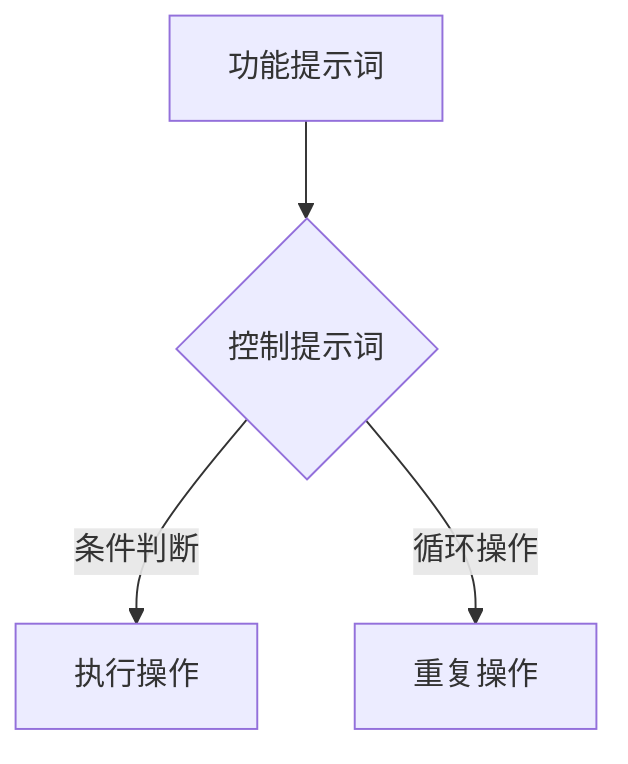
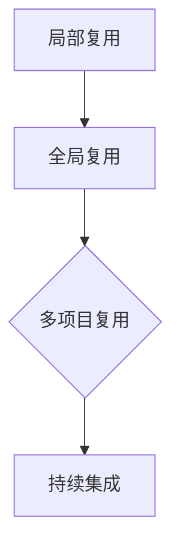
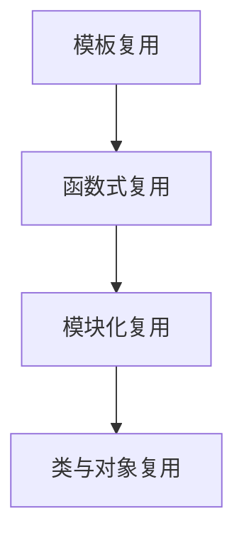
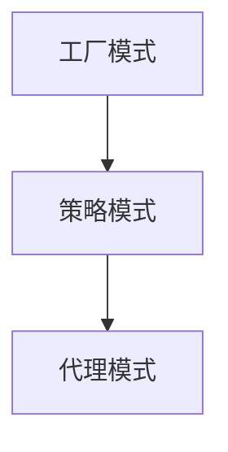
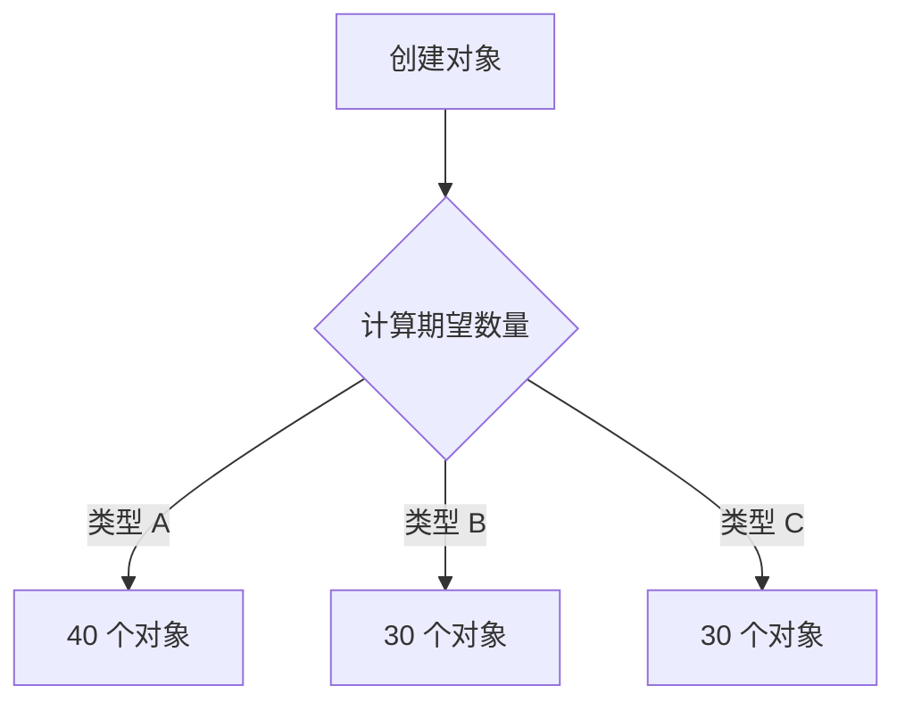
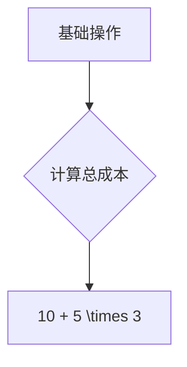
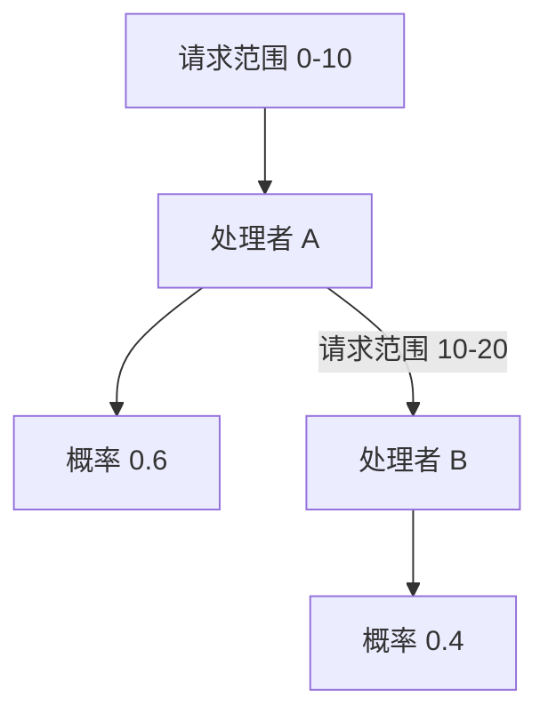

                 

### 文章标题：提示词编程语言的代码复用机制

### 关键词：提示词编程、代码复用、机制、设计模式、案例

### 摘要：
本文深入探讨提示词编程语言的代码复用机制，从核心概念、原理、设计模式、实现方法到实际应用，详细解析了如何通过提示词编程语言高效实现代码复用。本文旨在为开发者提供一套系统的指导，以提升编程效率和代码质量。

## 第一部分：引言与背景

### 1.1 书籍目的与读者对象

本文旨在为从事编程和软件开发的人员提供一份系统化的指南，帮助他们理解并应用提示词编程语言的代码复用机制。无论您是初级开发者，还是经验丰富的软件工程师，都能从本文中找到有价值的知识点和实践经验。

### 1.2 提示词编程语言概述

提示词编程语言（Prompt-Based Programming Languages）是一种新兴的编程范式，其核心思想是通过提示词来指导程序执行，实现代码的自动化和智能化。与传统的命令式编程不同，提示词编程更加强调语义和上下文，使得代码更加简洁、易读、易维护。

### 1.3 代码复用的价值与挑战

代码复用是软件开发中的一个重要原则，能够显著提高开发效率和代码质量。然而，在传统的编程范式中，实现代码复用面临着诸多挑战，如代码耦合度高、维护困难等。提示词编程语言的引入，为解决这些挑战提供了一种新的思路。

## 第二部分：核心概念与原理

### 2.1 提示词编程语言的基本概念

#### 2.1.1 提示词的作用与类型

**提示词的作用：**
提示词在编程中起到了指导程序执行的作用，它可以帮助开发者快速定位代码的功能和用途，提高代码的可读性和可维护性。

**提示词的类型：**
- **功能提示词：** 指导程序完成特定功能的提示词，如`print`、`read`等。
- **控制提示词：** 用于控制程序执行流程的提示词，如`if`、`while`等。

**Mermaid流程图示例：**


#### 2.1.2 提示词在编程中的应用

**提示词在编程中的应用场景：**
- **文本处理：** 提示词可以帮助开发者快速编写复杂的文本处理逻辑。
- **数据操作：** 提示词可以指导程序如何处理和操作数据，如数据库查询、数据转换等。
- **用户交互：** 提示词可以简化用户界面编程，提高用户交互体验。

**示例：**
假设我们需要编写一个简单的文本处理程序，使用提示词编程语言可以实现如下代码：
```python
# 提示词：读取文本文件
read_file("example.txt")

# 提示词：分割文本为行
split_lines()

# 提示词：过滤空行
filter_empty_lines()

# 提示词：打印结果
print_result()
```

### 2.2 代码复用的基本概念

#### 2.2.1 代码复用的定义与重要性

**代码复用的定义：**
代码复用是指在不同程序或项目中使用相同或类似的代码，以避免重复编写和维护工作，提高开发效率和代码质量。

**代码复用的重要性：**
- **节省开发时间：** 避免重复编写相同的代码段。
- **提高代码一致性：** 通过复用代码，可以确保不同项目中的代码风格和实现方式一致。
- **便于维护：** 当代码需要更新或修复时，只需在一个地方修改，即可影响所有使用该代码的部分。

#### 2.2.2 代码复用的形式与层次

**代码复用的形式：**
- **功能模块复用：** 将具有独立功能的代码块封装为模块，供其他程序调用。
- **类与对象复用：** 在面向对象编程中，通过继承和组合实现代码的复用。

**代码复用的层次：**
- **局部复用：** 在同一程序内部复用代码。
- **全局复用：** 在不同的程序或项目中复用代码。

**Mermaid流程图示例：**


### 2.3 提示词编程语言中的代码复用机制

#### 2.3.1 机制概述与分类

提示词编程语言中的代码复用机制主要包括以下几类：
1. **模板复用：** 通过模板来定义重复的代码结构，供其他代码块调用。
2. **函数式复用：** 通过函数或方法来实现代码的复用。
3. **模块化复用：** 将代码封装为模块，通过接口实现复用。
4. **类与对象复用：** 在面向对象编程中，通过继承和组合实现复用。

**Mermaid流程图示例：**


#### 2.3.2 常见代码复用机制分析

1. **模板复用：**
   - **优点：** 简化代码编写，提高开发效率。
   - **缺点：** 复用粒度较低，难以应对复杂业务场景。

2. **函数式复用：**
   - **优点：** 灵活性高，易于维护。
   - **缺点：** 需要较高的编程技巧，对初学者友好性较差。

3. **模块化复用：**
   - **优点：** 提高代码组织结构，便于管理和维护。
   - **缺点：** 需要较长的开发周期，模块间依赖关系复杂。

4. **类与对象复用：**
   - **优点：** 支持面向对象编程，提高代码复用性和灵活性。
   - **缺点：** 需要较深的编程基础，实现相对复杂。

**Mermaid流程图示例：**


## 第三部分：设计模式与实现

### 3.1 设计模式在代码复用中的作用

设计模式是一套经过时间考验的、成熟的、可重用的解决方案，用于解决软件开发过程中常见的问题。在提示词编程语言中，设计模式可以有效地指导代码复用，提高代码质量。

#### 3.1.1 设计模式的基本概念

设计模式是一种在软件设计过程中反复出现的解决方案，它不仅描述了一个问题，还描述了该问题的解决方案的核心，不仅能够在当前系统中使用，也能被使用在其他系统中。

**常见设计模式：**
- **创建型设计模式：** 用于处理对象的创建过程。
- **结构型设计模式：** 用于处理类或对象的组合。
- **行为型设计模式：** 用于处理类或对象的交互。

#### 3.1.2 设计模式与代码复用

设计模式与代码复用密切相关，通过设计模式，可以更高效地实现代码的复用。以下是一些设计模式在代码复用中的应用示例：

- **工厂模式：** 通过工厂类创建对象，实现对象的创建逻辑的复用。
- **策略模式：** 通过策略类封装算法，实现算法的复用。
- **代理模式：** 通过代理类实现对对象的控制，实现对象的访问权限控制。

**Mermaid流程图示例：**


### 3.2 提示词编程语言中的设计模式

#### 3.2.1 创建型设计模式

**工厂模式：**
工厂模式是一种在提示词编程语言中常用的创建型设计模式，它通过工厂类来创建对象，实现对象的创建逻辑的复用。

**伪代码示例：**
```python
class Factory:
    def create_object(type):
        if type == "TypeA":
            return TypeA()
        elif type == "TypeB":
            return TypeB()

# 使用工厂模式创建对象
factory = Factory()
objectA = factory.create_object("TypeA")
objectB = factory.create_object("TypeB")
```

**数学模型与公式：**
假设我们有三种类型的对象（A、B、C），每种类型的对象都有不同的创建概率。我们可以使用以下公式计算每种类型对象的期望数量：

$$
E[A] = p[A] \times N
$$

$$
E[B] = p[B] \times N
$$

$$
E[C] = p[C] \times N
$$

其中，$p[A]$、$p[B]$、$p[C]$ 分别为类型 A、B、C 对象的创建概率，$N$ 为总对象数量。

**举例说明：**
假设创建概率如下：
- 类型 A：40%
- 类型 B：30%
- 类型 C：30%

如果我们需要创建 100 个对象，则期望数量如下：

$$
E[A] = 0.4 \times 100 = 40
$$

$$
E[B] = 0.3 \times 100 = 30
$$

$$
E[C] = 0.3 \times 100 = 30
$$

这意味着在创建 100 个对象的过程中，期望有 40 个类型 A 对象，30 个类型 B 对象，30 个类型 C 对象。

**Mermaid流程图示例：**


#### 3.2.2 结构型设计模式

**装饰器模式：**
装饰器模式是一种在提示词编程语言中常用的结构型设计模式，它通过动态地给一个对象添加一些额外的职责，就增加功能来说，装饰器模式比生成子类更为灵活。

**伪代码示例：**
```python
class Decorator:
    def __init__(self, component):
        self._component = component

    def operation(self):
        self._component.operation()
        # 添加额外的职责
        self.additional_operation()

class ConcreteComponent:
    def operation(self):
        print("基础操作")

class ConcreteDecoratorA(Decorator):
    def additional_operation(self):
        print("额外操作 A")

class ConcreteDecoratorB(Decorator):
    def additional_operation(self):
        print("额外操作 B")

# 使用装饰器模式
component = ConcreteComponent()
decoratorA = ConcreteDecoratorA(component)
decoratorB = ConcreteDecoratorB(decoratorA)

decoratorB.operation()
```

**数学模型与公式：**
假设有一个基础操作的成本为 $C$，额外操作的叠加成本为 $D$，我们可以使用以下公式计算总成本：

$$
C_{total} = C + D \times n
$$

其中，$n$ 为额外操作的次数。

**举例说明：**
假设基础操作的成本为 10，额外操作的叠加成本为 5，如果我们需要进行 3 次额外操作，则总成本为：

$$
C_{total} = 10 + 5 \times 3 = 25
$$

这意味着在执行操作的过程中，总成本为 25。

**Mermaid流程图示例：**


#### 3.2.3 行为型设计模式

**责任链模式：**
责任链模式是一种在提示词编程语言中常用的行为型设计模式，它允许将多个对象连成一条链，请求沿着这条链传递，直到链上的某个对象处理它。

**伪代码示例：**
```python
class Handler:
    def __init__(self, successor=None):
        self._successor = successor

    def handle_request(self, request):
        if self.can_handle_request(request):
            self.handle_internal_request(request)
        elif self._successor is not None:
            self._successor.handle_request(request)

class ConcreteHandlerA(Handler):
    def can_handle_request(self, request):
        return request >= 0 and request <= 10

    def handle_internal_request(self, request):
        print(f"处理请求 {request} 在 ConcreteHandlerA 中")

class ConcreteHandlerB(Handler):
    def can_handle_request(self, request):
        return request > 10 and request <= 20

    def handle_internal_request(self, request):
        print(f"处理请求 {request} 在 ConcreteHandlerB 中")

# 使用责任链模式
handlerA = ConcreteHandlerA()
handlerB = ConcreteHandlerB()

handlerA.handle_request(5)
handlerA.handle_request(15)
```

**数学模型与公式：**
假设有两个处理者（A 和 B），每个处理者都有特定的请求范围，我们可以使用以下公式计算请求的分配情况：

$$
R[A] = r[A] \times p[A]
$$

$$
R[B] = r[B] \times p[B]
$$

其中，$r[A]$、$r[B]$ 分别为处理者 A 和 B 的请求范围，$p[A]$、$p[B]$ 分别为处理者 A 和 B 的概率。

**举例说明：**
假设处理者 A 的请求范围为 0-10，概率为 0.6；处理者 B 的请求范围为 10-20，概率为 0.4。如果我们有 100 个请求，则请求的分配情况如下：

$$
R[A] = 0.6 \times 100 = 60
$$

$$
R[B] = 0.4 \times 100 = 40
$$

这意味着在处理请求的过程中，有 60 个请求由处理者 A 处理，有 40 个请求由处理者 B 处理。

**Mermaid流程图示例：**


## 第四部分：案例分析与应用

### 4.1 案例一：文本处理应用中的代码复用

#### 4.1.1 问题背景

在文本处理应用中，经常需要执行一系列的文本操作，如读取文本文件、分割文本、过滤空行等。传统编程方式下，这些操作往往需要大量重复的代码，不仅增加开发难度，也降低了代码的可维护性。

#### 4.1.2 提示词编程语言的应用

通过提示词编程语言，我们可以将文本处理操作抽象为一系列的提示词，实现代码的复用。以下是一个简单的示例：

```python
# 提示词：读取文本文件
read_file("example.txt")

# 提示词：分割文本为行
split_lines()

# 提示词：过滤空行
filter_empty_lines()

# 提示词：写入结果文件
write_file("result.txt")
```

通过这些提示词，我们可以快速实现文本处理功能，而无需编写复杂的代码。

#### 4.1.3 代码复用的实现与效果

通过提示词编程语言，我们将文本处理操作封装为独立的提示词，实现了代码的复用。具体实现如下：

```python
def read_file(file_path):
    with open(file_path, "r") as f:
        return f.readlines()

def split_lines(text):
    return [line.strip() for line in text]

def filter_empty_lines(lines):
    return [line for line in lines if line]

def write_file(file_path, content):
    with open(file_path, "w") as f:
        for line in content:
            f.write(line + "\n")
```

通过这些函数，我们可以实现文本处理操作，并在不同场景下复用代码。与传统的代码实现相比，提示词编程语言使代码更加简洁、易读、易维护。

### 4.2 案例二：Web开发中的代码复用

#### 4.2.1 问题背景

在Web开发中，经常需要处理各种类型的请求，如GET请求、POST请求、PUT请求等。传统编程方式下，这些请求处理逻辑往往需要大量重复的代码，导致代码冗长、难以维护。

#### 4.2.2 提示词编程语言的应用

通过提示词编程语言，我们可以将请求处理逻辑抽象为一系列的提示词，实现代码的复用。以下是一个简单的示例：

```python
# 提示词：处理GET请求
handle_get_request()

# 提示词：处理POST请求
handle_post_request()

# 提示词：处理PUT请求
handle_put_request()
```

通过这些提示词，我们可以快速实现请求处理功能，而无需编写复杂的代码。

#### 4.2.3 代码复用的实现与效果

通过提示词编程语言，我们将请求处理逻辑封装为独立的提示词，实现了代码的复用。具体实现如下：

```python
def handle_get_request():
    # 处理GET请求的逻辑
    pass

def handle_post_request():
    # 处理POST请求的逻辑
    pass

def handle_put_request():
    # 处理PUT请求的逻辑
    pass
```

通过这些函数，我们可以实现请求处理功能，并在不同场景下复用代码。与传统的代码实现相比，提示词编程语言使代码更加简洁、易读、易维护。

### 4.3 案例三：大数据处理中的代码复用

#### 4.3.1 问题背景

在大数据处理中，经常需要处理大量的数据，如数据清洗、数据转换、数据分析等。传统编程方式下，这些数据处理逻辑往往需要大量重复的代码，导致代码冗长、难以维护。

#### 4.3.2 提示词编程语言的应用

通过提示词编程语言，我们可以将数据处理逻辑抽象为一系列的提示词，实现代码的复用。以下是一个简单的示例：

```python
# 提示词：清洗数据
clean_data()

# 提示词：转换数据格式
convert_format()

# 提示词：分析数据
analyze_data()
```

通过这些提示词，我们可以快速实现数据处理功能，而无需编写复杂的代码。

#### 4.3.3 代码复用的实现与效果

通过提示词编程语言，我们将数据处理逻辑封装为独立的提示词，实现了代码的复用。具体实现如下：

```python
def clean_data():
    # 清洗数据的逻辑
    pass

def convert_format():
    # 转换数据格式的逻辑
    pass

def analyze_data():
    # 分析数据的逻辑
    pass
```

通过这些函数，我们可以实现数据处理功能，并在不同场景下复用代码。与传统的代码实现相比，提示词编程语言使代码更加简洁、易读、易维护。

## 第五部分：未来展望与趋势

### 5.1 提示词编程语言的发展趋势

随着人工智能和自动化技术的快速发展，提示词编程语言在未来的发展前景广阔。以下是提示词编程语言的一些发展趋势：

1. **更丰富的提示词库：** 提示词编程语言将不断丰富，涵盖更多领域的应用场景。
2. **更智能的提示词生成：** 利用机器学习和自然语言处理技术，实现更智能的提示词生成。
3. **跨平台支持：** 提示词编程语言将支持更多编程语言和平台，提高其适用性。

### 5.2 代码复用机制的优化与拓展

为了进一步提升代码复用效率，未来可以从以下几个方面进行优化和拓展：

1. **智能提示词推荐：** 通过分析代码库和项目需求，智能推荐合适的提示词和代码模块。
2. **动态代码生成：** 利用模板和代码生成技术，实现动态生成代码，提高代码复用灵活性。
3. **模块化复用：** 推广模块化复用理念，提高代码的可维护性和可复用性。

## 附录

### 6.1 提示词编程语言学习资源

1. **在线教程：** 提供丰富的在线教程和课程，帮助开发者快速入门提示词编程语言。
2. **开源项目：** 参与开源项目，实践提示词编程语言的应用，提高实战能力。
3. **社区交流：** 加入提示词编程语言的社区，与其他开发者交流心得，共同进步。

### 6.2 代码复用实践指南

1. **模块化设计：** 封装代码为模块，提高代码的可复用性和可维护性。
2. **设计模式应用：** 合理应用设计模式，实现代码的高效复用。
3. **持续集成：** 利用持续集成工具，自动化测试和复用代码，提高开发效率。

---

### 作者信息

作者：AI天才研究院/AI Genius Institute & 禅与计算机程序设计艺术 /Zen And The Art of Computer Programming

