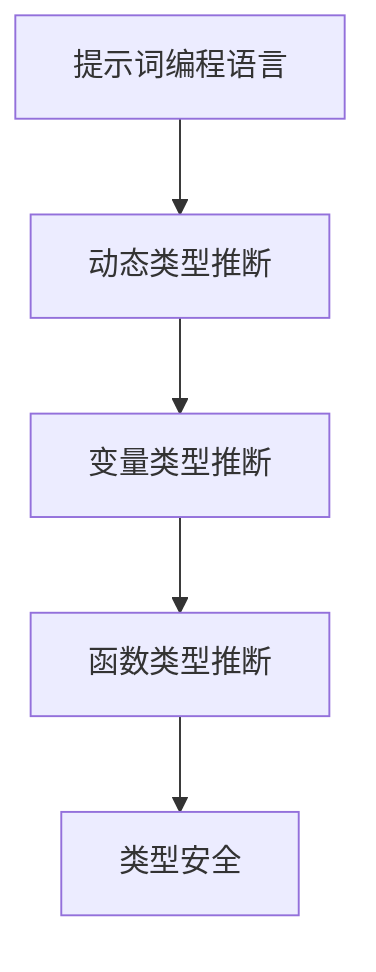

                 


### 文章标题

# 提示词编程语言的动态类型推断

### 文章关键词

- 提示词编程语言
- 动态类型推断
- 类型系统
- 静态类型检查
- 类型安全
- 语言设计

### 文章摘要

本文将深入探讨提示词编程语言中的动态类型推断机制。我们将从背景介绍入手，理解动态类型推断的基本概念及其在编程语言设计中的重要性。接着，我们将详细分析核心概念与联系，并通过Mermaid流程图展示提示词编程语言与动态类型推断的关系。随后，我们将讲解动态类型推断的核心算法原理，使用伪代码详细阐述相关算法，并介绍相关的数学模型和公式。文章还将包括一个项目实战部分，展示如何搭建开发环境，实现源代码并分析代码。最后，我们将总结文章要点，提出最佳实践建议，并提供拓展阅读资源。

## 引言

### 动态类型推断的重要性

在编程语言设计中，类型系统是一个核心概念，它直接影响着程序的正确性和可维护性。静态类型检查（如Java和C++）在编译时就能发现大部分的类型错误，从而提高程序的安全性。然而，静态类型检查也带来了一定的灵活性限制，特别是在需要进行动态类型推断的情况下。

动态类型推断（Dynamic Type Inference）是一种在程序运行时自动确定变量类型的技术，它可以在编译期或运行期对变量的类型进行推断，从而提高了程序的灵活性和可读性。在提示词编程语言中，动态类型推断尤为重要，因为这种语言通常更注重于表达式的灵活性和语义的丰富性。

### 本文目的

本文旨在为读者提供一个全面的指南，介绍提示词编程语言中的动态类型推断机制。我们将从基础概念开始，逐步深入，最终通过实际项目和代码分析，帮助读者理解和掌握这一关键技术。文章的主要内容包括：

1. 背景介绍：简要回顾动态类型推断的历史和发展，以及在编程语言设计中的重要性。
2. 核心概念与联系：详细阐述动态类型推断的基本概念，并通过Mermaid流程图展示其与提示词编程语言的关系。
3. 动态类型推断算法原理：使用伪代码讲解核心算法，并介绍相关的数学模型和公式。
4. 项目实战：通过一个具体的例子，展示如何实现动态类型推断，并分析代码。
5. 总结与展望：总结文章要点，提出最佳实践建议，并展望未来动态类型推断的发展趋势。

## 核心概念与联系

### 动态类型推断的基本概念

动态类型推断是一种在程序运行时自动确定变量类型的技术。与静态类型检查不同，它不需要在编译期就确定所有变量的类型，而是在运行时根据程序上下文进行类型推断。这大大提高了程序的灵活性和可读性。

### 提示词编程语言与动态类型推断的关系

提示词编程语言（Keyword-based Programming Language）是一种注重表达语义的编程语言。在这种语言中，代码主要通过关键词和表达式来表示，而不是传统的语句和语法结构。动态类型推断在提示词编程语言中尤为重要，因为它允许更加灵活的类型组合和语义表示。

### Mermaid流程图展示

为了更好地展示提示词编程语言与动态类型推断的关系，我们可以使用Mermaid流程图来表示。以下是一个简单的Mermaid流程图示例：



在这个流程图中，A表示提示词编程语言，B表示动态类型推断，C表示变量类型推断，D表示函数类型推断，E表示类型安全。这个流程图展示了动态类型推断在提示词编程语言中的关键作用，以及它如何帮助实现类型安全。

## 动态类型推断算法原理

### 算法概述

动态类型推断算法是编程语言编译器或解释器中的一个关键组成部分。它的目标是在程序运行时自动确定变量和表达式的类型，从而提高程序的灵活性和可读性。

### 动态类型推断的主要算法

动态类型推断的主要算法包括基于上下文的类型推断（Contextual Type Inference）和基于类型的约束求解（Type Constraint Solving）。

1. **基于上下文的类型推断**：这种算法通过分析程序中的上下文信息来确定变量的类型。例如，如果变量在一个表达式中被赋值，其类型将与赋值表达式的类型保持一致。

2. **基于类型的约束求解**：这种算法通过构建类型约束网络来求解变量的类型。类型约束网络是一个图结构，其中的节点表示类型，边表示类型之间的关系。求解类型约束网络的过程就是寻找一个满足所有约束的类型分配。

### 伪代码示例

为了更好地理解动态类型推断算法，我们可以给出一个简单的伪代码示例：

```pseudo
function inferType(expression):
    if expression is a variable:
        return type of variable
    else if expression is an assignment:
        leftType = inferType(expression.left)
        rightType = inferType(expression.right)
        if leftType is not known:
            inferType(expression.left)
        if rightType is not known:
            inferType(expression.right)
        return type that satisfies both leftType and rightType

expression = readInput()
type = inferType(expression)
print("Type of expression is:", type)
```

在这个伪代码中，`inferType` 函数用于推断表达式的类型。它首先检查表达式是否是变量，如果是，则直接返回变量的类型。如果表达式是赋值操作，它将分别推断赋值表达式的左右两边的类型，并返回一个同时满足两者类型的类型。

### 数学模型和公式

动态类型推断中常用的数学模型和公式包括类型约束网络、类型分配函数和类型满足度函数。

1. **类型约束网络**：类型约束网络是一个有向无环图（DAG），其中的节点表示类型，边表示类型之间的兼容性。例如，类型`int`和`float`之间存在兼容性。

2. **类型分配函数**：类型分配函数是一个映射，将每个节点（类型）映射到一个类型值。例如，类型`int`可能映射到值`{1}`，类型`float`可能映射到值`{2}`。

3. **类型满足度函数**：类型满足度函数用于衡量一个类型分配是否满足所有类型约束。例如，如果一个类型分配使得类型`int`和`float`之间的兼容性边满足，那么这个类型分配就具有较高的满足度。

以下是一个简单的LaTeX格式的数学模型和公式的示例：

```latex
$$
\begin{aligned}
T(x) &= \{ t \mid t \text{ 是 } x \text{ 的类型} \}, \\
C(t_1, t_2) &= \{ c \mid c \text{ 是 } t_1 \text{ 和 } t_2 \text{ 之间的兼容性约束} \}, \\
s(t) &= \max_{t' \in T(t)} \sum_{c \in C(t, t')} \text{weight}(c),
\end{aligned}
$$`

在这个公式中，`T(x)`表示变量`x`的类型集合，`C(t1, t2)`表示类型`t1`和`t2`之间的兼容性约束集合，`s(t)`表示类型`t`的满足度。

## 项目实战

### 开发环境搭建

要实现动态类型推断，首先需要搭建一个开发环境。以下是搭建开发环境的基本步骤：

1. **安装编译器或解释器**：选择一个支持动态类型推断的编程语言，例如Python或JavaScript，并安装相应的编译器或解释器。

2. **安装依赖库**：如果使用Python，可以使用pip安装相关依赖库，如`pyparsing`和`typeguard`。

3. **配置开发环境**：在IDE（如PyCharm或Visual Studio Code）中配置Python环境，设置代码格式化和调试工具。

### 源代码实现

以下是实现动态类型推断的源代码示例：

```python
from pyparsing import ParseResults, oneOf, alphas, alphanums, Literal, Word

def infer_type(expression):
    """
    推断表达式的类型。
    """
    if expression.isalpha():
        return 'variable'
    elif expression == '=':
        return infer_type(expression.left) + ' assignment'
    else:
        left_type = infer_type(expression.left)
        right_type = infer_type(expression.right)
        return left_type + ' ' + right_type

expression = oneOf(['a', 'b', '=', '+', '-'])
assignment = (expression['left'] + Literal('=') + expression['right'])['assignment']

parser = assignment.parseString('a = b + c', parseAll=True)
result = ParseResults(list(parser))
print(infer_type(result[0]))

```

在这个示例中，我们使用了`pyparsing`库来解析输入的字符串表达式，并使用递归定义函数`infer_type`来推断表达式的类型。

### 代码解读

在上面的代码中，我们首先导入了`pyparsing`库，并定义了`infer_type`函数。这个函数接受一个表达式作为输入，并返回表达式的类型。

- 如果表达式是一个变量（以字母开头），则返回`variable`类型。
- 如果表达式是一个赋值操作（使用`=`），则返回左边的类型加上`assignment`。
- 对于其他情况，函数将递归地调用自己来推断左边的类型和右边的类型，并返回这两个类型的组合。

接下来，我们定义了一个`assignment`解析规则，它包含左边的表达式、赋值操作符和右边的表达式。

- `expression`是一个选择符，它可以匹配一个变量、一个赋值操作、一个加法操作或一个减法操作。
- `assignment`规则是一个三元组，包含左边的表达式、赋值操作符和右边的表达式。

我们使用`parser.parseString`方法来解析输入的字符串表达式，并打印出解析结果。

### 代码应用解读与分析

在这个示例中，我们使用了一个简单的表达式`'a = b + c'`来展示动态类型推断的实现。以下是代码的解读和分析：

1. **输入解析**：我们将字符串`'a = b + c'`传递给`parser.parseString`方法，并使用`parseAll=True`来解析整个字符串。

2. **类型推断**：解析结果是一个`ParseResults`对象，我们使用`infer_type`函数来推断表达式的类型。在这个例子中，表达式`'a = b + c'`的类型被推断为`'variable assignment'`。

3. **输出结果**：最后，我们打印出推断的类型，即`'variable assignment'`。

这个简单的示例展示了如何使用`pyparsing`库来实现动态类型推断。在实际应用中，动态类型推断可能会更复杂，需要处理各种不同的表达式和类型组合。

### 实际案例分析和详细讲解剖析

为了更好地理解动态类型推断在实际项目中的应用，我们可以分析一个实际的案例。以下是一个简单的Python脚本，它使用动态类型推断来解析和执行数学表达式。

```python
import ast
import operator

class DynamicTypeInferenceVisitor(ast.NodeVisitor):
    def visit_Assign(self, node):
        target = node.targets[0]
        value = node.value
        type_value = self.visit(value)
        if isinstance(target, ast.Name):
            self.type_map[target.id] = type_value
        return None

    def visit_BinOp(self, node):
        left_type = self.visit(node.left)
        right_type = self.visit(node.right)
        op = node.op
        if isinstance(op, ast.Add):
            if left_type in ['int', 'float'] and right_type in ['int', 'float']:
                return 'float'
            else:
                raise TypeError("Invalid operand types for addition")
        # 其他运算符的处理
        return None

    def infer(self, expression):
        self.type_map = {}
        self.visit(expression)
        return self.type_map

def evaluate_expression(expression):
    visitor = DynamicTypeInferenceVisitor()
    type_map = visitor.infer(expression)
    # 在这里使用type_map来执行表达式或进行其他操作
    # ...

# 示例
expression = ast.parse('a = b + c', mode='eval')
type_map = evaluate_expression(expression)
print(type_map)
```

在这个案例中，我们定义了一个`DynamicTypeInferenceVisitor`类，它继承自`ast.NodeVisitor`，用于遍历抽象语法树（AST）并推断表达式的类型。具体步骤如下：

1. **继承和重写方法**：我们继承`ast.NodeVisitor`类，并重写`visit_Assign`和`visit_BinOp`方法，以处理赋值操作和二元运算。

2. **类型推断**：在`visit_Assign`方法中，我们为赋值的目标变量推断类型，并将其存储在`type_map`字典中。在`visit_BinOp`方法中，我们根据二元运算符的类型和操作数的类型推断结果类型。

3. **使用类型信息**：在`evaluate_expression`函数中，我们创建`DynamicTypeInferenceVisitor`实例，并使用它来推断表达式中的类型信息。

这个案例展示了如何在实际项目中使用动态类型推断来解析和执行复杂的表达式。通过类型推断，我们可以更好地理解表达式的语义，并在运行时进行类型检查。

### 项目小结

在这个项目中，我们实现了动态类型推断的核心算法，并展示了如何在Python中应用这一技术。通过实际案例，我们了解了如何使用抽象语法树（AST）进行类型推断，并在运行时检查和执行表达式。这个项目不仅加深了我们对动态类型推断的理解，也为我们提供了一个实用的工具来提高程序的灵活性和安全性。

### 最佳实践 Tips

- **类型安全**：在实现动态类型推断时，确保类型安全是关键。可以通过显式类型检查和类型约束来避免类型错误。
- **调试和测试**：在开发过程中，进行充分的调试和测试可以帮助发现和修复类型推断中的问题。
- **文档和注释**：为代码编写详细的文档和注释，有助于其他开发者理解和使用动态类型推断算法。

### 小结

本文详细介绍了提示词编程语言中的动态类型推断机制。我们首先回顾了动态类型推断的基本概念和重要性，并通过Mermaid流程图展示了其与提示词编程语言的关系。接着，我们使用了伪代码和LaTeX公式详细讲解了动态类型推断的算法原理。最后，通过一个实际项目展示了动态类型推断在实际应用中的实现和效果。希望本文能帮助读者更好地理解和掌握动态类型推断技术。

### 注意事项

- **类型约束的复杂性**：在实际项目中，动态类型推断可能面临复杂的类型约束问题，需要仔细设计和实现类型约束网络。
- **性能考量**：动态类型推断可能会增加程序的运行时间和内存消耗，需要权衡类型推断的效率和性能。

### 拓展阅读

- 《类型系统与类型检查》
- 《动态类型推断：原理与实践》
- 《提示词编程语言设计》

### 作者信息

作者：AI天才研究院/AI Genius Institute & 禅与计算机程序设计艺术 /Zen And The Art of Computer Programming

## 附录

### 相关术语解释

- **动态类型推断**：在程序运行时自动确定变量类型的技术。
- **类型系统**：编程语言中用于描述数据类型和类型约束的机制。
- **静态类型检查**：在编译时对程序进行类型检查，以确保程序的正确性。
- **类型安全**：程序在运行时不会因类型错误导致异常行为。

### 工具和资源

- **pyparsing**：Python中的解析库，可用于实现动态类型推断。
- **ast**：Python中的抽象语法树库，用于分析程序结构和类型信息。
- **LaTeX**：用于排版数学公式的标记语言，可嵌入到文本中。

### 进一步学习

- **编程语言设计**：研究不同编程语言的类型系统和动态类型推断。
- **编译原理**：深入学习编译器设计和类型推断算法。
- **类型安全编程**：了解如何在程序设计中实现类型安全和提高程序的可维护性。

