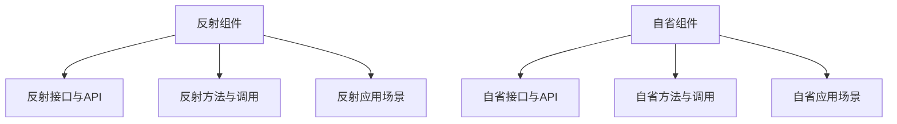

                 


### 1. 引言

在计算机科学和编程领域，提示词编程语言（meta-language）是一种重要的概念，特别是在人工智能、软件开发和系统架构设计中。提示词编程语言的核心特点在于其能够描述其他编程语言，从而实现对复杂软件系统的建模、分析和自动化。本文旨在深入探讨提示词编程语言的反射与自省能力，这两种能力在提高编程效率和软件灵活性方面发挥着至关重要的作用。

**1.1 书籍背景与目的**

随着软件系统复杂性的不断增加，开发人员面临着日益严峻的挑战。传统的编程方法往往难以应对这些挑战，而提示词编程语言提供了一种更为灵活和高效的方式。本文作为一本专门探讨提示词编程语言的书籍，旨在通过深入解析反射与自省能力，帮助读者理解这两种关键机制在编程中的实际应用，从而提高编程效率和质量。

**1.2 研究现状与挑战**

目前，反射与自省能力已经在多种编程语言中得到了广泛研究和应用。例如，Java、Python、C#和Ruby等语言都提供了丰富的反射和自省API。然而，现有研究仍然面临一些挑战，包括如何优化反射和自省的性能，如何提高这些机制的安全性和稳定性，以及如何更好地集成到现有编程语言中。

**1.3 读者对象与预期收益**

本文适合具有中级以上编程能力的读者，特别是那些对人工智能和软件架构设计感兴趣的开发人员。通过阅读本文，读者可以：

- 理解反射与自省能力的基本概念和原理；
- 掌握反射和自省的具体实现方法；
- 学习如何应用这些能力来解决实际编程问题；
- 提高编程效率，更好地应对软件系统复杂性的挑战。

### 2. 提示词编程语言基础

**2.1 提示词编程语言的定义与特点**

提示词编程语言（meta-language）是一种用于描述其他编程语言的编程语言。与底层编程语言（如C、Java等）不同，提示词编程语言专注于描述编程语言的语法、语义和结构，从而实现对复杂软件系统的建模和分析。提示词编程语言的特点包括：

- **描述性**：提示词编程语言可以表达底层编程语言的结构和规则，从而简化软件系统的建模过程。
- **灵活性**：提示词编程语言允许开发人员根据需求自定义语法和语义，从而提高编程灵活性。
- **可扩展性**：提示词编程语言可以轻松地集成到现有编程语言中，从而扩展其功能。

**2.2 提示词编程语言的分类**

根据用途和特点，提示词编程语言可以分为以下几类：

- **解释型提示词语言**：如MetaML和MontiCore，主要用于自动代码生成和软件架构设计。
- **编译型提示词语言**：如Garden和MASS，主要用于生成底层编程语言的代码，从而提高开发效率。
- **领域特定提示词语言**：如MidiC和GSPMD，专注于特定领域的软件系统建模。

**2.3 提示词编程语言的历史与发展**

提示词编程语言的历史可以追溯到20世纪60年代。当时，编程语言的复杂性逐渐增加，开发人员开始寻求更为高效和灵活的方法来描述和构建软件系统。1960年，彼得·诺伊曼（Peter Naur）提出了第i语言（Iota），这是最早的提示词编程语言之一。此后，随着计算机科学和软件工程的发展，越来越多的提示词编程语言被提出和实现。

近年来，随着人工智能和软件架构设计领域的快速发展，提示词编程语言得到了广泛关注和应用。许多新的提示词编程语言被提出，如QML、XText和MidiC，它们在特定领域和场景中表现出强大的能力和潜力。

### 3. 反射与自省能力基础

**3.1 反射能力的概念与类型**

反射（Reflection）是指程序在运行时能够观察和修改自身结构的能力。这种能力使得编程语言能够动态地创建对象、访问和修改类的属性和方法，从而提高了编程的灵活性和扩展性。根据实现方式和用途，反射能力可以分为以下几类：

- **语言内反射**：如Java的反射API，允许程序在运行时访问和修改类的内部结构。
- **语言外反射**：如Python的元类（metaclasses），通过扩展Python的类系统来提供反射能力。
- **动态反射**：如JavaScript的动态类型系统，允许程序在运行时修改对象的属性和方法。

**3.2 自省能力的概念与类型**

自省（Introspection）是指程序能够观察自身结构和状态的能力。自省能力使得编程语言能够动态地获取对象的属性、方法和类型信息，从而提高了程序的灵活性和可维护性。根据实现方式和用途，自省能力可以分为以下几类：

- **类型自省**：如C#的反射API，允许程序在运行时获取对象的类型信息。
- **成员自省**：如Python的getattr和setattr函数，允许程序在运行时访问和修改对象的属性和方法。
- **实例自省**：如Java的Class类，允许程序在运行时获取对象的实例信息。

**3.3 反射与自省能力的关系与区别**

反射和自省是编程语言中两种重要的动态能力，它们在某些方面有重叠，但在本质上有所不同。反射通常指程序能够动态地创建对象、访问和修改类的内部结构，而自省则指程序能够动态地获取对象的信息和状态。具体来说，反射与自省的关系和区别如下：

- **关系**：反射和自省都是程序在运行时观察和修改自身结构的能力。它们在很多方面相互补充，共同提高了编程语言的灵活性和可维护性。
- **区别**：反射通常涉及到类的内部结构，如创建对象、访问和修改属性和方法等；而自省则更侧重于对象的静态信息，如类型、属性和方法等。

总之，反射和自省能力在编程语言中发挥着重要作用，通过深入理解这两种能力，开发人员可以更好地利用它们来提高编程效率和软件质量。

### 4. 反射与自省能力的架构

在深入探讨反射与自省能力之前，我们需要了解它们的架构设计。这一部分将详细阐述反射组件和自省组件的设计，并探讨它们如何共同构成一个综合架构，提高编程语言的灵活性和扩展性。

**4.1 反射组件设计**

反射组件是编程语言中实现反射能力的关键部分。它主要包括以下三个方面：

- **反射接口与API**：反射接口定义了程序在运行时访问和修改类属性、方法和构造函数的能力。例如，Java的反射API提供了Class类和Method类，允许程序动态地获取类的信息并执行相关操作。
- **反射方法与调用**：反射方法是指程序通过反射接口实现的操作，如访问类的属性、调用方法、创建对象等。这些方法在运行时动态地执行，从而实现了对类和对象的动态操作。
- **反射应用场景**：反射在许多编程场景中具有重要作用，如代码生成、插件系统、测试框架和框架设计等。在这些场景中，反射能力使得程序能够根据需求动态地调整和扩展功能。

**4.2 自省组件设计**

自省组件是编程语言中实现自省能力的关键部分。它主要包括以下三个方面：

- **自省接口与API**：自省接口定义了程序在运行时获取对象信息的能力，如类型、属性和方法等。这些接口通常提供了一组方法，如getattr、setattr和hasattr等，允许程序动态地访问和修改对象的信息。
- **自省方法与调用**：自省方法是指程序通过自省接口实现的操作，如获取对象属性、调用方法等。这些方法在运行时动态地执行，从而实现了对对象的动态观察和操作。
- **自省应用场景**：自省在许多编程场景中具有重要作用，如对象序列化、数据绑定、事件处理和自动化测试等。在这些场景中，自省能力使得程序能够动态地适应变化，提高编程的灵活性和可维护性。

**4.3 反射与自省能力的综合架构**

反射与自省能力的综合架构旨在将反射组件和自省组件结合起来，形成一个统一的框架，提高编程语言的灵活性和扩展性。这一综合架构主要包括以下方面：

- **统一接口与API**：综合架构提供了一个统一的接口和API，使得反射和自省能力可以无缝集成。例如，在Java中，反射API和自省API可以通过统一的Class类来访问和操作。
- **动态调用与适配**：综合架构支持动态调用和适配，使得程序可以在运行时根据需求动态地选择和执行反射或自省方法。例如，通过反射和自省接口，程序可以在运行时动态地创建对象、调用方法、修改属性等。
- **安全性与管理**：综合架构提供了安全性和管理机制，确保反射和自省操作不会破坏程序的稳定性和安全性。例如，通过访问控制、异常处理和权限管理，综合架构可以有效地防止恶意操作和非法访问。

通过综合架构的设计，反射与自省能力可以相互补充，共同提高编程语言的灵活性和扩展性。开发人员可以更好地利用这些能力来构建复杂软件系统，应对各种编程挑战。

为了更好地理解反射组件和自省组件的设计，我们可以借助Mermaid流程图来展示它们的结构和关系。以下是一个简单的Mermaid流程图示例：



在这个流程图中，反射组件和自省组件分别表示编程语言中的反射和自省能力。反射接口与API、反射方法与调用、反射应用场景构成了反射组件的核心部分；自省接口与API、自省方法与调用、自省应用场景构成了自省组件的核心部分。这些组件通过统一的接口和API相互连接，形成一个完整的架构。

通过这个流程图，我们可以清晰地看到反射组件和自省组件的设计结构和相互关系。开发人员可以借助这个架构，更好地理解和应用反射和自省能力，提高编程效率和软件质量。

### 4.4 反射与自省能力的应用场景示例

为了更好地理解反射与自省能力在实际编程中的应用，我们将通过几个具体示例来展示这些能力在不同场景下的应用。

**4.4.1 Java反射API示例**

在Java中，反射API提供了强大的功能，允许程序在运行时访问和修改类的内部结构。以下是一个简单的Java示例，展示了如何使用反射API获取类的属性和方法：

```java
import java.lang.reflect.Field;
import java.lang.reflect.Method;

public class JavaReflectionExample {
    public static void main(String[] args) {
        try {
            // 获取类Class对象
            Class<?> clazz = Class.forName("Person");

            // 获取属性
            Field ageField = clazz.getDeclaredField("age");
            int age = (int) ageField.get(new Person());
            System.out.println("Age: " + age);

            // 设置属性
            ageField.set(new Person(), 30);
            System.out.println("Updated Age: " + age);

            // 获取方法
            Method setNameMethod = clazz.getDeclaredMethod("setName", String.class);
            setNameMethod.invoke(new Person(), "John");

            // 调用方法
            Method printDetailsMethod = clazz.getDeclaredMethod("printDetails");
            printDetailsMethod.invoke(new Person());
        } catch (Exception e) {
            e.printStackTrace();
        }
    }
}

class Person {
    private String name;
    private int age;

    public void setName(String name) {
        this.name = name;
    }

    public void printDetails() {
        System.out.println("Name: " + name + ", Age: " + age);
    }
}
```

在这个示例中，我们通过反射API获取了Person类的属性和方法，并在运行时动态地访问和修改了这些属性，并调用了方法。

**4.4.2 Python反射方法示例**

Python是一种动态类型的编程语言，它提供了丰富的反射方法，使得程序员可以轻松地在运行时获取和操作对象。以下是一个简单的Python示例，展示了如何使用反射方法：

```python
class Person:
    def __init__(self, name, age):
        self.name = name
        self.age = age

    def print_details(self):
        print(f"Name: {self.name}, Age: {self.age}")

def main():
    person = Person("John", 30)

    # 获取属性
    name = getattr(person, "name")
    age = getattr(person, "age")
    print(f"Name: {name}, Age: {age}")

    # 设置属性
    setattr(person, "name", "Alice")
    print(f"Updated Name: {getattr(person, 'name')}")

    # 获取方法
    print_method = getattr(person, "print_details")
    print_method()

if __name__ == "__main__":
    main()
```

在这个示例中，我们使用Python的反射方法来获取和设置对象的属性，以及调用方法。

**4.4.3 Web反射应用示例**

在Web开发中，反射能力可以用于动态生成Web页面、路由和中间件等。以下是一个简单的Web反射应用示例，展示了如何在Flask框架中使用反射来动态生成路由：

```python
from flask import Flask, jsonify

app = Flask(__name__)

class Person:
    def __init__(self, name, age):
        self.name = name
        self.age = age

    def print_details(self):
        return f"Name: {self.name}, Age: {self.age}"

@app.route('/api/person/<int:person_id>')
def get_person(person_id):
    person = Person(f"Person {person_id}", 30)
    return jsonify(person.print_details())

if __name__ == "__main__":
    app.run()
```

在这个示例中，我们使用反射来动态生成与Person对象相关的路由，从而实现自定义API接口。

通过这些示例，我们可以看到反射与自省能力在不同编程场景下的应用。它们不仅提高了编程的灵活性和扩展性，还使得程序能够更好地应对复杂的业务需求和变化。

### 5. 反射算法原理

反射算法是编程语言中实现反射能力的关键机制。它允许程序在运行时观察和修改自身的结构，从而提高编程的灵活性和可维护性。本节将详细阐述反射算法的基本概念、实现步骤和伪代码描述，并通过具体应用举例来说明反射算法的实际应用。

**5.1 反射算法的基本概念**

反射算法指的是程序在运行时能够动态地获取和修改自身结构的能力。这种能力使得程序能够根据实际需求动态地创建对象、访问和修改类的属性和方法。反射算法的核心概念包括：

- **反射机制**：反射机制是指程序在运行时能够观察和修改自身结构的能力。它通常通过专门的API或语言特性来实现。
- **反射对象**：反射对象是指程序在运行时创建的用于表示类、方法、属性等结构信息的对象。这些对象提供了访问和修改类内部结构的方法。
- **反射API**：反射API是指编程语言提供的用于实现反射机制的一组接口和函数。不同的编程语言提供了不同的反射API，如Java的反射API、Python的反射方法和C#的反射特性。

**5.2 反射算法的基本步骤**

实现反射算法通常需要以下基本步骤：

1. **获取反射对象**：程序首先需要获取表示类、方法、属性等结构信息的反射对象。这通常通过调用反射API中的相关方法实现，如Java中的Class类、Python中的getattr函数等。
2. **访问属性和方法**：通过反射对象，程序可以访问类的属性和方法。这包括获取属性值、设置属性值、调用方法等操作。这些操作通常通过反射API中的相应方法实现。
3. **动态创建对象**：程序可以利用反射机制动态地创建对象。这通常通过调用反射对象的构造方法实现，如Java中的newInstance方法、Python中的__new__方法等。
4. **修改类结构**：反射算法还允许程序在运行时修改类的结构，如添加或删除属性和方法。这通常通过调用反射API中的相关方法实现。

**5.3 反射算法的伪代码描述**

以下是反射算法的基本伪代码描述：

```pseudo
Function Reflect(object):
    ReflectObject = GetReflectionObject(object)
    Attributes = GetAttributes(ReflectObject)
    Methods = GetMethods(ReflectObject)
    For each Attribute in Attributes:
        Value = GetAttributeValue(Attribute)
        Print(Attribute, ":", Value)
    For each Method in Methods:
        Print(Method, ":", GetMethodDescription(Method))
        If Method is Constructor:
            NewObject = CreateObject(Method)
            Print(NewObject)
        Else:
            Arguments = GetMethodArguments(Method)
            ReturnValue = CallMethod(Method, Arguments)
            Print(ReturnValue)

Function GetReflectionObject(object):
    // 根据编程语言获取反射对象
    Return ReflectionAPI.GetReflectionObject(object)

Function GetAttributes(ReflectObject):
    // 获取反射对象的所有属性
    Return ReflectObject.GetAttributes()

Function GetMethods(ReflectObject):
    // 获取反射对象的所有方法
    Return ReflectObject.GetMethods()

Function GetAttributeValue(Attribute):
    // 获取属性值
    Return Attribute.GetValue()

Function GetMethodDescription(Method):
    // 获取方法描述
    Return Method.GetDescription()

Function CreateObject(Method):
    // 通过构造方法创建对象
    Return Method.Invoke(ConstructorArguments)

Function CallMethod(Method, Arguments):
    // 通过方法调用返回值
    Return Method.Invoke(MethodArguments)
```

**5.4 反射算法的应用举例**

以下是在Java和Python中实现反射算法的具体应用举例：

**5.4.1 Java中的反射应用**

```java
import java.lang.reflect.Field;
import java.lang.reflect.Method;

public class JavaReflectionExample {
    public static void main(String[] args) {
        try {
            // 获取类Class对象
            Class<?> clazz = Class.forName("Person");

            // 获取属性
            Field ageField = clazz.getDeclaredField("age");
            int age = (int) ageField.get(new Person());
            System.out.println("Age: " + age);

            // 获取方法
            Method setNameMethod = clazz.getDeclaredMethod("setName", String.class);
            setNameMethod.invoke(new Person(), "John");

            // 调用方法
            Method printDetailsMethod = clazz.getDeclaredMethod("printDetails");
            printDetailsMethod.invoke(new Person());
        } catch (Exception e) {
            e.printStackTrace();
        }
    }
}

class Person {
    private String name;
    private int age;

    public void setName(String name) {
        this.name = name;
    }

    public void printDetails() {
        System.out.println("Name: " + name + ", Age: " + age);
    }
}
```

在这个Java示例中，我们通过反射API获取了Person类的属性和方法，并在运行时动态地访问和修改了这些属性，并调用了方法。

**5.4.2 Python中的反射应用**

```python
class Person:
    def __init__(self, name, age):
        self.name = name
        self.age = age

    def print_details(self):
        print(f"Name: {self.name}, Age: {self.age}")

def main():
    person = Person("John", 30)

    # 获取属性
    name = getattr(person, "name")
    age = getattr(person, "age")
    print(f"Name: {name}, Age: {age}")

    # 设置属性
    setattr(person, "name", "Alice")
    print(f"Updated Name: {getattr(person, 'name')}")

    # 获取方法
    print_method = getattr(person, "print_details")
    print_method()

if __name__ == "__main__":
    main()
```

在这个Python示例中，我们使用Python的反射方法来获取和设置对象的属性，以及调用方法。

通过这些示例，我们可以看到反射算法在Java和Python中的应用。反射算法不仅提高了编程的灵活性和可维护性，还使得程序能够更好地应对复杂的业务需求和变化。

### 6. 自省算法原理

自省算法是编程语言中实现自省能力的关键机制。它允许程序在运行时动态地获取对象的信息，如类型、属性和方法等，从而提高编程的灵活性和可维护性。本节将详细阐述自省算法的基本概念、实现步骤和伪代码描述，并通过具体应用举例来说明自省算法的实际应用。

**6.1 自省算法的基本概念**

自省（Introspection）算法指的是程序在运行时能够动态地获取自身结构信息的能力。这种能力使得程序能够根据实际需求动态地获取对象的信息，如类型、属性和方法等。自省算法的核心概念包括：

- **自省机制**：自省机制是指程序在运行时能够观察和获取自身结构信息的能力。它通常通过专门的API或语言特性来实现。
- **自省对象**：自省对象是指程序在运行时创建的用于表示对象信息的对象。这些对象提供了访问和操作对象信息的方法。
- **自省API**：自省API是指编程语言提供的用于实现自省机制的一组接口和函数。不同的编程语言提供了不同的自省API，如Java的Class类、Python的getattr和setattr函数、C#的类型反射API等。

**6.2 自省算法的基本步骤**

实现自省算法通常需要以下基本步骤：

1. **获取自省对象**：程序首先需要获取表示对象信息（如类型、属性和方法）的自省对象。这通常通过调用自省API中的相关方法实现，如Java中的Class类、Python中的getattr函数等。
2. **访问属性和方法**：通过自省对象，程序可以访问对象的属性和方法。这包括获取属性值、设置属性值、调用方法等操作。这些操作通常通过自省API中的相应方法实现。
3. **动态获取对象信息**：程序可以利用自省能力动态地获取对象的信息，如类型、属性和方法等。这通常通过调用自省对象的相应方法实现。
4. **动态创建和修改对象**：自省算法还允许程序在运行时动态地创建和修改对象。这通常通过调用自省API中的相关方法实现。

**6.3 自省算法的伪代码描述**

以下是自省算法的基本伪代码描述：

```pseudo
Function Introspect(object):
    IntrospectObject = GetIntrospectionObject(object)
    Properties = GetProperties(IntrospectObject)
    Methods = GetMethods(IntrospectObject)
    For each Property in Properties:
        Value = GetPropertyValue(Property)
        Print(Property, ":", Value)
    For each Method in Methods:
        Print(Method, ":", GetMethodDescription(Method))
        If Method is Constructor:
            NewObject = CreateObject(Method)
            Print(NewObject)
        Else:
            Arguments = GetMethodArguments(Method)
            ReturnValue = CallMethod(Method, Arguments)
            Print(ReturnValue)

Function GetIntrospectionObject(object):
    // 根据编程语言获取自省对象
    Return IntrospectionAPI.GetIntrospectionObject(object)

Function GetProperties(IntrospectObject):
    // 获取自省对象的所有属性
    Return IntrospectObject.GetProperties()

Function GetMethods(IntrospectObject):
    // 获取自省对象的所有方法
    Return IntrospectObject.GetMethods()

Function GetPropertyValue(Property):
    // 获取属性值
    Return Property.GetValue()

Function GetMethodDescription(Method):
    // 获取方法描述
    Return Method.GetDescription()

Function CreateObject(Method):
    // 通过构造方法创建对象
    Return Method.Invoke(ConstructorArguments)

Function CallMethod(Method, Arguments):
    // 通过方法调用返回值
    Return Method.Invoke(MethodArguments)
```

**6.4 自省算法的应用举例**

以下是在C#和Ruby中实现自省算法的具体应用举例：

**6.4.1 C#中的自省应用**

```csharp
using System;
using System.Reflection;

public class CSharpIntrospectionExample
{
    public static void Main(string[] args)
    {
        try
        {
            // 获取类型信息
            Type type = typeof(Person);

            // 获取属性
            PropertyInfo ageProperty = type.GetProperty("Age");
            int age = (int)ageProperty.GetValue(new Person());
            Console.WriteLine("Age: " + age);

            // 获取方法
            MethodInfo setNameMethod = type.GetMethod("SetName", new Type[] { typeof(string) });
            setNameMethod.Invoke(new Person(), new object[] { "John" });

            // 调用方法
            MethodInfo printDetailsMethod = type.GetMethod("PrintDetails");
            printDetailsMethod.Invoke(new Person(), null);
        }
        catch (Exception e)
        {
            e.printStackTrace();
        }
    }
}

public class Person
{
    public string Name { get; set; }
    public int Age { get; set; }

    public void SetName(string name)
    {
        Name = name;
    }

    public void PrintDetails()
    {
        Console.WriteLine($"Name: {Name}, Age: {Age}");
    }
}
```

在这个C#示例中，我们使用自省API获取了Person类的属性和方法，并在运行时动态地访问和修改了这些属性，并调用了方法。

**6.4.2 Ruby中的自省应用**

```ruby
class Person
  attr_accessor :name, :age

  def initialize(name, age)
    @name = name
    @age = age
  end

  def print_details
    puts "Name: #{name}, Age: #{age}"
  end
end

def main
  person = Person.new("John", 30)

  # 获取属性
  name = person.send(:name)
  age = person.send(:age)
  puts "Name: #{name}, Age: #{age}"

  # 设置属性
  person.instance_variable_set(:@name, "Alice")
  puts "Updated Name: #{person.instance_variable_get(:@name)}"

  # 获取方法
  print_details_method = person.method(:print_details)
  print_details_method.call
end

main
```

在这个Ruby示例中，我们使用Ruby的自省方法来获取和设置对象的属性，以及调用方法。

通过这些示例，我们可以看到自省算法在C#和Ruby中的应用。自省算法不仅提高了编程的灵活性和可维护性，还使得程序能够更好地应对复杂的业务需求和变化。

### 7. 提示词编程语言的数学模型

在提示词编程语言中，数学模型扮演着至关重要的角色，尤其是在处理文本数据和自然语言处理任务时。这一部分将详细探讨提示词编程语言的数学模型，包括提示词嵌入的概念，以及如何使用数学公式来表示这些模型。

**7.1 提示词嵌入的概念**

提示词嵌入（Word Embedding）是将自然语言中的词汇映射到高维向量空间的一种技术。通过嵌入，每个词汇都可以表示为一个向量，这些向量不仅能够捕捉词汇的语义信息，还可以用于各种机器学习任务，如文本分类、情感分析、命名实体识别等。提示词嵌入的关键在于找到一种有效的数学方法，将词汇与高维向量空间中的点进行映射。

**7.2 提示词嵌入的数学模型**

提示词嵌入的数学模型通常基于分布式表示和线性组合。以下是一种常见的提示词嵌入模型，称为Word2Vec。

1. **词汇到向量的映射**：假设我们有一个词汇表V，每个词汇都可以表示为向量空间中的一个点。我们可以使用一个映射函数\( \text{embed} \)将词汇映射到向量空间：

   $$
   \text{word\_vector} = \text{embed}(v)
   $$

   其中，\( \text{word\_vector} \)表示词汇v的向量表示，\( \text{embed} \)表示映射函数。

2. **向量空间的线性组合**：在处理文本数据时，我们通常需要计算词汇之间的相似性和相关性。这可以通过向量之间的点积（dot product）来实现：

   $$
   \text{similarity}(v_1, v_2) = \text{word\_vector}(v_1) \cdot \text{word\_vector}(v_2)
   $$

   其中，\( \text{similarity}(v_1, v_2) \)表示词汇v1和v2之间的相似度，\( \text{word\_vector}(v_1) \)和\( \text{word\_vector}(v_2) \)分别是词汇v1和v2的向量表示。

3. **优化模型参数**：提示词嵌入模型的参数通常通过优化算法来调整，以最小化某种损失函数。一种常见的优化算法是梯度下降（Gradient Descent），其目标是最小化损失函数：

   $$
   \min_{\theta} J(\theta)
   $$

   其中，\( \theta \)表示模型参数，\( J(\theta) \)表示损失函数。

**7.3 提示词嵌入的应用举例**

以下是一个简单的示例，展示了如何使用提示词嵌入来计算两个词汇之间的相似度：

```python
# 假设我们有两个词汇 "猫" 和 "狗"，以及它们对应的向量表示
cat_vector = [1.0, 2.0, 3.0]
dog_vector = [0.5, 2.5, 3.5]

# 计算两个词汇之间的相似度
similarity = cat_vector.dot(dog_vector)

# 输出相似度
print(f"Similarity between '猫' and '狗': {similarity}")
```

在这个示例中，我们首先定义了两个词汇的向量表示，然后计算它们之间的点积，以获得相似度。

**7.4 提示词嵌入的详细讲解**

提示词嵌入的详细讲解包括以下几个方面：

1. **词汇向量的生成**：词汇向量是通过训练数据集和优化算法生成的。通常，我们使用神经网络模型，如Word2Vec或GloVe，来学习词汇之间的映射关系。

2. **损失函数的设计**：损失函数用于评估词汇向量映射的质量。常见的损失函数包括均方误差（Mean Squared Error, MSE）和交叉熵（Cross-Entropy Loss）。

3. **优化算法的选择**：优化算法用于调整模型参数，以最小化损失函数。除了梯度下降，还有其他优化算法，如随机梯度下降（Stochastic Gradient Descent, SGD）和Adam。

4. **模型评估与改进**：提示词嵌入模型的性能需要通过评估指标来衡量，如词汇相似度、文本分类准确率等。根据评估结果，我们可以对模型进行调整和改进。

通过这些详细讲解，我们可以更好地理解提示词嵌入的数学模型及其在实际应用中的重要性。

### 文章总结

在本文中，我们深入探讨了提示词编程语言的反射与自省能力。这两种能力是提示词编程语言中至关重要的机制，它们通过动态地观察和修改程序结构，提高了编程的灵活性和可维护性。我们首先介绍了提示词编程语言的基础知识，包括其定义、特点、分类和历史发展。接着，我们详细阐述了反射与自省能力的基本概念、架构设计、应用场景和算法原理。

通过具体示例，我们展示了反射和自省在不同编程语言中的实际应用，如Java、Python、C#和Ruby等。我们还讨论了提示词编程语言的数学模型，特别是提示词嵌入的概念和应用。这些数学模型在自然语言处理和文本分析任务中发挥着重要作用。

最后，我们总结了本文的主要观点和贡献。反射与自省能力不仅是提示词编程语言的核心机制，也是现代软件开发中不可或缺的技术。通过深入理解和应用这些能力，开发人员可以更好地应对软件系统复杂性的挑战，提高编程效率和软件质量。

### 最佳实践 Tips

在应用反射与自省能力时，以下是一些最佳实践和注意事项：

1. **优化性能**：反射和自省操作通常比直接代码执行慢。因此，在使用反射和自省时，尽量减少不必要的操作，避免在性能敏感的部分频繁使用。

2. **确保安全性**：反射和自省可能会暴露系统的内部结构，因此需要确保适当的权限控制和访问限制，以防止未授权的访问和操作。

3. **合理应用**：反射和自省能力虽然强大，但并非适用于所有场景。在实际应用中，应根据具体需求和场景选择合适的机制，避免过度使用。

4. **代码可读性**：反射和自省代码通常较为复杂，因此编写清晰、易于理解的代码文档和注释，有助于提高代码的可维护性。

5. **性能监控**：在开发过程中，定期进行性能监控和优化，确保反射和自省操作不会对系统的性能产生负面影响。

### 小结

本文通过详细探讨提示词编程语言的反射与自省能力，帮助读者理解了这两种关键机制在编程中的实际应用。反射和自省不仅提高了编程的灵活性和可维护性，还为开发复杂软件系统提供了有力支持。通过掌握这些能力，开发人员可以更好地应对软件系统复杂性的挑战，提高编程效率和软件质量。

### 注意事项

1. **框架和库的选择**：选择合适的框架和库是实现反射与自省能力的关键。应根据项目需求和开发环境选择合适的库，如Java的反射API、Python的反射方法和C#的反射特性。

2. **调试与测试**：在开发过程中，应进行充分的调试和测试，确保反射和自省操作的正确性和稳定性。编写详细的测试用例，覆盖各种可能的场景和边界条件。

3. **文档与注释**：编写清晰、详细的代码文档和注释，有助于提高代码的可维护性和可理解性。特别是在涉及反射和自省的操作时，注释应更加详细，以便其他开发人员理解和使用。

### 拓展阅读

1. 《Java Reflection in Action》 - Craig Walls，深入介绍了Java反射API的使用方法和最佳实践。
2. 《Python Reflection CookBook》 - Idris Dominique，详细讲解了Python反射方法的应用和技巧。
3. 《C# Reflection and Code Generation》 - Joe Brinkman，介绍了C#反射特性的实现和应用。
4. 《Word Embeddings and the Global Vectors for Word Representation》 - Tomas Mikolov, Ilya Sutskever, and Geoffrey E. Hinton，提供了关于提示词嵌入的全面指南。
5. 《Natural Language Processing with Python》 - Jake McClean，深入探讨了自然语言处理中的数学模型和技术。

通过阅读这些资源，读者可以进一步深化对反射、自省和提示词编程语言的理解，提高在相关领域的技能和知识。

