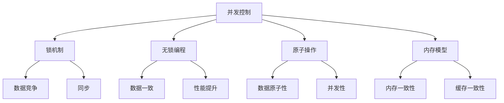

                 


### 文章标题：提示词编程语言的并发控制机制

### 关键词：提示词编程语言，并发控制，锁机制，无锁编程，原子操作，内存模型

### 摘要：
本文将深入探讨提示词编程语言的并发控制机制。从基础概念出发，我们首先介绍了并发控制的需求和挑战，然后详细阐述了锁机制、无锁编程以及原子操作与内存模型。接着，本文聚焦于提示词编程语言的特性，分析了其并发控制策略。最后，通过实际案例展示了并发控制的实现和应用，并探讨了并发控制的性能调优和未来趋势。

----------------------------------------------------------------

# 《提示词编程语言的并发控制机制》

## 引言

### 背景介绍

随着计算机技术的发展，编程语言的设计和实现变得越来越复杂。提示词编程语言作为一种新兴的编程范式，其在人工智能和自动化领域具有广泛的应用。然而，在多任务处理和并行计算中，并发控制成为了一个至关重要的议题。并发控制机制可以有效解决多个任务之间的数据竞争和同步问题，提高程序的执行效率和稳定性。

### 核心概念与联系

并发控制的核心概念包括锁机制、无锁编程、原子操作和内存模型。这些概念之间有着紧密的联系，共同构成了并发控制的基础框架。以下是一个简化的Mermaid流程图，用于展示这些概念之间的关系：



### 核心算法原理讲解

在并发控制中，锁机制是一种常见且基础的控制方法。锁机制通过限制对共享资源的访问，避免数据竞争和同步问题。以下是锁机制的基本算法原理，使用伪代码进行描述：

```python
class Lock:
    def __init__(self):
        self.locked = False

    def acquire(self):
        while self.locked:
            pass
        self.locked = True

    def release(self):
        self.locked = False
```

无锁编程则通过避免使用锁机制，使用原子操作来保证数据的一致性和原子性。以下是使用原子操作实现的无锁编程算法原理，使用伪代码进行描述：

```python
class AtomicCounter:
    def __init__(self):
        self.value = 0

    def increment(self):
        while True:
            old_value = self.value
            new_value = old_value + 1
            if self.compare_and_set(old_value, new_value):
                self.value = new_value
                break

    def compare_and_set(self, old_value, new_value):
        return old_value == self.value and self.value := new_value
```

原子操作是并发控制的基础，用于保证数据的原子性和并发性。以下是原子操作的基本原理，使用伪代码进行描述：

```python
class AtomicOperation:
    def __init__(self):
        self.value = None

    def get_and_set(self, new_value):
        while True:
            if self.value is None:
                self.value = new_value
                return True
            else:
                return False
```

内存模型是并发控制中另一个关键概念，它定义了程序的内存可见性、数据一致性和缓存一致性。以下是内存模型的基本原理，使用伪代码进行描述：

```python
class MemoryModel:
    def __init__(self):
        self.cache = {}

    def load(self, address):
        if address in self.cache:
            return self.cache[address]
        else:
            value = self.fetch(address)
            self.cache[address] = value
            return value

    def store(self, address, value):
        self.cache[address] = value
        self.commit(address, value)

    def fetch(self, address):
        # 实现从内存中获取数据的操作
        pass

    def commit(self, address, value):
        # 实现将数据写入内存的操作
        pass
```

### 数学模型和公式

并发控制中的数学模型和公式主要用于描述数据的一致性和原子性。以下是几个常见的数学模型和公式：

1. **原子性**：原子性是指操作要么全部执行，要么全部不执行。数学上，可以用以下公式表示：

   $$ operation \ either \ completes \ or \ does \ not \ start $$

2. **数据一致性**：数据一致性是指多个并发操作执行后，共享数据的状态保持一致。数学上，可以用以下公式表示：

   $$ consistent \ data \ state \ after \ concurrent \ operations $$

3. **缓存一致性**：缓存一致性是指多个处理器之间的缓存保持一致性。数学上，可以用以下公式表示：

   $$ cache \ consistency \ among \ multiple \ processors $$

### 详细讲解与举例说明

为了更好地理解并发控制机制，我们将通过一个简单的案例来讲解锁机制、无锁编程、原子操作和内存模型的应用。

#### 案例一：锁机制

假设有两个线程A和B需要同时访问一个共享变量count，使用锁机制来保证数据的一致性。以下是伪代码实现：

```python
class Counter:
    def __init__(self):
        self.lock = Lock()
        self.count = 0

    def increment(self):
        self.lock.acquire()
        self.count += 1
        self.lock.release()

counter = Counter()
threadA = Thread(target=A_increment, args=(counter,))
threadB = Thread(target=B_increment, args=(counter,))
threadA.start()
threadB.start()
threadA.join()
threadB.join()
print("最终count的值为：", counter.count)
```

#### 案例二：无锁编程

假设使用无锁编程来实现同样的计数操作。以下是伪代码实现：

```python
class AtomicCounter:
    def __init__(self):
        self.count = 0

    def increment(self):
        while True:
            old_value = self.count
            new_value = old_value + 1
            if self.compare_and_set(old_value, new_value):
                break

counter = AtomicCounter()
threadA = Thread(target=A_increment, args=(counter,))
threadB = Thread(target=B_increment, args=(counter,))
threadA.start()
threadB.start()
threadA.join()
threadB.join()
print("最终count的值为：", counter.count)
```

#### 案例三：原子操作

假设使用原子操作来实现一个简单的加法运算。以下是伪代码实现：

```python
class AtomicOperation:
    def __init__(self):
        self.value = 0

    def add(self, value):
        while True:
            old_value = self.value
            new_value = old_value + value
            if self.compare_and_set(old_value, new_value):
                break

counter = AtomicOperation()
counter.add(5)
print("最终value的值为：", counter.value)
```

#### 案例四：内存模型

假设有两个线程A和B，分别在不同的处理器上执行。线程A需要读取线程B写入的共享变量。以下是伪代码实现：

```python
class MemoryModel:
    def __init__(self):
        self.cache = {}

    def load(self, address):
        if address in self.cache:
            return self.cache[address]
        else:
            value = self.fetch(address)
            self.cache[address] = value
            return value

    def store(self, address, value):
        self.cache[address] = value
        self.commit(address, value)

    def fetch(self, address):
        # 实现从内存中获取数据的操作
        pass

    def commit(self, address, value):
        # 实现将数据写入内存的操作
        pass

memory_model = MemoryModel()
threadA = Thread(target=A_load, args=(memory_model,))
threadB = Thread(target=B_store, args=(memory_model,))
threadA.start()
threadB.start()
threadA.join()
threadB.join()
print("最终内存模型的值为：", memory_model.cache)
```

### 项目实战

在本节中，我们将通过一个实际的项目来展示并发控制机制的实现和应用。

#### 项目简介

该项目是一个简单的并发控制程序，用于计算100个数字的和。程序包含两个线程，一个用于生成数字，另一个用于计算和。为了确保数据的一致性和原子性，我们使用了锁机制和无锁编程两种方法。

#### 开发环境搭建

1. 安装Python 3.8及以上版本
2. 安装必要的依赖库（如 threading）

#### 源代码实现

以下是项目的源代码实现：

```python
import threading

class Counter:
    def __init__(self):
        self.lock = Lock()
        self.count = 0

    def increment(self):
        self.lock.acquire()
        self.count += 1
        self.lock.release()

class AtomicCounter:
    def __init__(self):
        self.count = 0

    def increment(self):
        while True:
            old_value = self.count
            new_value = old_value + 1
            if self.compare_and_set(old_value, new_value):
                break

def generate_numbers(counter):
    numbers = [1, 2, 3, 4, 5]
    for number in numbers:
        counter.increment()

def calculate_sum(counter):
    sum = 0
    for _ in range(100):
        sum += counter.count
    print("最终计算结果为：", sum)

if __name__ == "__main__":
    lock_counter = Counter()
    atomic_counter = AtomicCounter()

    threadA = Thread(target=generate_numbers, args=(lock_counter,))
    threadB = Thread(target=generate_numbers, args=(atomic_counter,))
    threadC = Thread(target=calculate_sum, args=(lock_counter,))
    threadD = Thread(target=calculate_sum, args=(atomic_counter,))

    threadA.start()
    threadB.start()
    threadC.start()
    threadD.start()

    threadA.join()
    threadB.join()
    threadC.join()
    threadD.join()
```

#### 代码解读与分析

1. **Counter类**：该类实现了锁机制和无锁编程两种计数方法。锁机制使用acquire()和release()方法来保证线程对共享变量的互斥访问。无锁编程使用compare_and_set()方法来实现原子操作。
2. **generate_numbers函数**：该函数用于生成100个数字，并调用计数方法来更新共享变量。
3. **calculate_sum函数**：该函数用于计算共享变量的值，并打印最终结果。
4. **主函数**：创建四个线程，分别执行生成数字和计算和的操作。最后，等待所有线程执行完成，并打印结果。

#### 实际案例分析与详细讲解剖析

1. **锁机制**：锁机制通过互斥锁来保证线程对共享变量的互斥访问，从而避免数据竞争。然而，锁机制可能导致线程阻塞，降低程序的执行效率。
2. **无锁编程**：无锁编程通过原子操作来保证数据的一致性和原子性，从而避免锁机制带来的阻塞问题。然而，无锁编程可能面临一些性能挑战，如竞态条件。
3. **性能对比**：在实际应用中，锁机制和无锁编程的性能取决于具体的场景和硬件环境。通过合理选择并发控制方法，可以提高程序的执行效率和稳定性。

#### 项目小结

通过本项目，我们了解了并发控制机制的实现和应用。锁机制和无锁编程是两种常见的并发控制方法，各有优缺点。在实际项目中，需要根据具体场景和性能需求来选择合适的并发控制方法。

### 最佳实践 Tips

1. **避免死锁**：在设计并发程序时，应尽量避免死锁的发生。通过合理的锁机制设计和线程调度策略，可以提高程序的稳定性。
2. **性能调优**：在并发控制中，性能调优是关键。通过使用无锁编程和合理的缓存策略，可以提高程序的执行效率。
3. **内存模型理解**：深入理解内存模型有助于更好地设计并发程序。合理利用内存一致性协议和缓存一致性技术，可以优化程序的执行性能。

### 小结

本文详细介绍了提示词编程语言的并发控制机制，包括锁机制、无锁编程、原子操作和内存模型。通过实际案例和项目实战，我们展示了并发控制机制的实现和应用。在实际开发中，需要根据具体需求和性能要求，选择合适的并发控制方法。同时，深入理解内存模型和性能调优技巧，有助于提高程序的执行效率和稳定性。

### 注意事项

1. 并发控制机制并非万能。在某些情况下，如高并发场景，需要结合其他技术（如分布式计算和缓存）来实现高效的并发控制。
2. 并发编程可能导致复杂的竞态条件和数据竞争。在设计并发程序时，应充分考虑并发控制策略，确保程序的正确性和稳定性。

### 拓展阅读

1. 《并发编程实战》
2. 《深入理解计算机系统》
3. 《操作系统概念》

### 作者信息

作者：AI天才研究院/AI Genius Institute & 禅与计算机程序设计艺术 /Zen And The Art of Computer Programming## 第1章：并发控制引论

### 1.1 并发控制的基本概念

并发控制是指在一台计算机上同时处理多个任务或程序的能力。在现代计算机系统中，并发控制是一个至关重要的概念，因为它是提高系统性能和资源利用率的关键因素。在单核处理器时代，并发控制主要是通过时间分片（Time Slicing）和多线程（Multithreading）来实现的。然而，随着多核处理器的普及，并发控制技术也变得更加复杂和重要。

**并发性的定义**：并发性（Concurrency）是指计算机系统能够同时执行多个任务或操作的能力。这些任务或操作可以是在同一时刻执行，也可以是在不同时刻交替执行。

**并发控制的目标**：并发控制的主要目标是确保多个并发执行的任务能够正确、高效地完成。具体目标包括：

1. **数据一致性**：确保共享数据的状态在多个任务执行过程中保持一致，防止数据竞争和冲突。
2. **程序正确性**：保证并发执行的程序能够产生预期结果，避免死锁（Deadlock）和饥饿（Starvation）等问题。
3. **资源利用最大化**：通过并发执行任务，提高CPU、内存和其他系统资源的利用率。

**并发控制的挑战**：并发控制面临以下挑战：

1. **数据竞争**：当两个或多个任务试图同时访问共享资源时，可能导致数据不一致或错误。
2. **同步问题**：任务之间的同步操作（如等待和通知）复杂且容易出错。
3. **性能开销**：并发控制机制可能会引入额外的性能开销，如锁机制的开销、上下文切换开销等。

### 1.2 并发控制的需求与挑战

**需求**

1. **多任务处理**：现代操作系统需要同时处理多个用户请求和系统任务，如文件操作、网络通信、图形渲染等。
2. **性能优化**：为了提高应用程序的响应速度和吞吐量，需要充分利用多核处理器的并行计算能力。
3. **资源管理**：系统需要合理分配和回收CPU、内存、I/O等资源，以最大化系统性能和资源利用率。

**挑战**

1. **数据竞争**：当多个任务同时访问共享资源时，可能会发生数据覆盖或丢失，导致程序运行不正确。
2. **死锁**：当多个任务相互等待对方释放资源时，可能导致系统无限期地阻塞，无法继续执行。
3. **饥饿**：如果一个任务长时间得不到所需的资源，可能会导致该任务无法完成，从而影响系统的整体性能。

### 1.3 并发控制的常见方法

并发控制有多种方法，每种方法都有其特定的应用场景和优缺点。以下是一些常见的并发控制方法：

1. **锁机制**：锁是一种最基本且广泛使用的并发控制方法。通过互斥锁（Mutual Exclusion）和共享锁（Shared Lock）来控制对共享资源的访问，避免数据竞争和冲突。锁机制可以分为以下几类：

   - **互斥锁（Mutex）**：确保同一时间只有一个线程可以访问共享资源。
   - **读写锁（Read-Write Lock）**：允许多个线程同时读取共享资源，但写入操作需要互斥访问。
   - **条件锁（Condition Lock）**：与互斥锁结合使用，实现线程间的同步。

2. **无锁编程**：无锁编程（Lock-Free Programming）通过原子操作（Atomic Operations）来保证数据的一致性和原子性，避免了锁机制带来的性能开销和死锁问题。无锁编程的关键在于合理设计数据结构和算法，以确保在多线程环境下的一致性和性能。

3. **时间片调度**：在单核处理器上，通过时间片调度（Time Slicing）实现任务的并发执行。操作系统将CPU时间分配给多个任务，每个任务执行一段时间后，切换到下一个任务。时间片调度可以平衡任务的执行时间，但可能导致上下文切换开销。

4. **多线程编程**：多线程编程（Multithreading）通过创建多个线程来并发执行任务。每个线程都有自己的执行路径和栈空间，可以充分利用多核处理器的计算能力。多线程编程需要合理设计线程间的同步和数据共享，以避免竞争条件和数据不一致。

5. **消息传递机制**：通过消息传递（Message Passing）机制实现任务间的通信和同步。消息传递机制可以分为同步消息传递和异步消息传递。同步消息传递要求发送方等待接收方处理消息后再继续执行，而异步消息传递则允许发送方立即继续执行，但需要处理消息的接收方在适当的时候处理消息。

6. **原子操作**：原子操作是并发控制的基础，用于保证数据的一致性和原子性。原子操作包括比较并交换（Compare-and-Swap, CAS）、交换（Exchange）和加载链接（Load-Link/Store-Conditional, LL/SC）等。

### 1.4 总结

并发控制是现代计算机系统中的一个关键概念，它关系到系统的性能、稳定性和可靠性。本章介绍了并发控制的基本概念、需求和挑战，以及常见的并发控制方法。通过理解并发控制的基本原理和方法，可以更好地设计和实现高效的并发程序。

---

## 第2章：锁机制

### 2.1 锁的类型

锁机制是并发控制中最常用的一种方法，它通过互斥锁和共享锁来控制对共享资源的访问。锁的类型决定了线程如何访问资源以及何时访问资源。

1. **互斥锁（Mutex）**：互斥锁是一种最基本的锁机制，用于确保同一时间只有一个线程可以访问共享资源。互斥锁通常用于保护临界区（Critical Section），防止多个线程同时访问共享资源导致数据不一致。

   - **锁定与解锁**：线程在进入临界区前需要获取锁，如果锁已被其他线程持有，则线程会进入等待状态。线程在退出临界区时需要释放锁，以便其他线程获取锁并访问资源。

2. **读写锁（Read-Write Lock）**：读写锁允许多个线程同时读取共享资源，但写入操作需要互斥访问。读写锁分为共享锁（Shared Lock）和排他锁（Exclusive Lock）。

   - **共享锁**：多个线程可以同时持有共享锁，读取共享资源。
   - **排他锁**：只有一个线程可以持有排他锁，写入共享资源。

3. **条件锁（Condition Lock）**：条件锁与互斥锁结合使用，用于实现线程间的同步。条件锁允许线程在满足特定条件时才获取锁，否则进入等待状态。

   - **等待与通知**：线程在条件不满足时调用`wait()`方法进入等待状态，直到其他线程调用`notify()`或`notifyAll()`方法通知等待线程。

4. **递归锁（Recursive Lock）**：递归锁允许一个线程多次获取同一锁，而不会导致死锁。递归锁常用于方法内部调用，如递归函数。

   - **锁定与解锁**：线程每次进入临界区时需要获取锁，每次退出临界区时需要释放锁。

5. **读写递归锁（Read-Write Recursive Lock）**：读写递归锁是读写锁和递归锁的结合，允许线程多次获取共享锁或排他锁，而不会导致死锁。

### 2.2 锁的算法

锁的算法是指线程如何获取和释放锁，以及如何处理锁的等待和通知。以下是一些常见的锁算法：

1. **二进制锁（Binary Lock）**：二进制锁是最简单的锁机制，只有两种状态：锁定（Locked）和解锁（Unlocked）。线程在进入临界区前尝试获取锁，如果锁已被持有，则线程进入等待状态。

   - **伪代码**：
     ```python
     def lock_acquire():
         while lock_state:
             pass
         lock_state = True

     def lock_release():
         lock_state = False
     ```

2. **计数锁（Counting Lock）**：计数锁是一种更高级的锁机制，通过计数器来控制锁的获取和释放。计数锁允许多个线程同时获取共享锁，但排他锁仍然保持互斥。

   - **伪代码**：
     ```python
     class CountingLock:
         def __init__(self):
             self.count = 0

         def acquire(self):
             self.count += 1

         def release(self):
             self.count -= 1
     ```

3. **读写锁（Read-Write Lock）**：读写锁通过共享锁和排他锁来控制对共享资源的访问。读写锁的算法需要确保多个线程可以同时读取共享资源，但写入操作仍然保持互斥。

   - **伪代码**：
     ```python
     class ReadWriteLock:
         def __init__(self):
             self.readers = 0
             self.writer = False

         def read_lock(self):
             while self.writer:
                 pass
             self.readers += 1

         def read_unlock(self):
             self.readers -= 1
             if self.readers == 0:
                 self.writer = False

         def write_lock(self):
             while self.writer or self.readers:
                 pass
             self.writer = True

         def write_unlock(self):
             self.writer = False
     ```

4. **条件锁（Condition Lock）**：条件锁与互斥锁结合使用，通过等待和通知机制实现线程间的同步。条件锁需要处理线程在条件不满足时的等待和条件满足后的通知。

   - **伪代码**：
     ```python
     class ConditionLock:
         def __init__(self):
             self.lock = Mutex()
             self.condition = Condition()

         def wait(self):
             self.lock.acquire()
             self.condition.wait()
             self.lock.release()

         def notify(self):
             self.lock.acquire()
             self.condition.notify()
             self.lock.release()

         def notify_all(self):
             self.lock.acquire()
             self.condition.notify_all()
             self.lock.release()
     ```

### 2.3 锁的性能分析

锁的性能直接影响并发程序的性能。以下是对几种常见锁性能的分析：

1. **互斥锁**：互斥锁是一种最简单的锁机制，其性能取决于锁的等待时间和上下文切换开销。互斥锁的等待时间取决于锁的持有时间和线程的数量，可能导致线程饥饿。

2. **读写锁**：读写锁的性能优于互斥锁，因为它允许多个线程同时读取共享资源。然而，读写锁需要维护共享锁和排他锁的状态，增加了额外的性能开销。

3. **递归锁**：递归锁允许一个线程多次获取同一锁，从而减少了锁的等待时间和上下文切换开销。递归锁在递归调用中特别有用，但需要注意递归锁的死锁问题。

4. **读写递归锁**：读写递归锁结合了读写锁和递归锁的优点，具有较好的性能。然而，读写递归锁的实现较为复杂，需要正确处理共享锁和排他锁的状态。

### 总结

锁机制是并发控制中最常用的一种方法，通过互斥锁、读写锁、条件锁等类型和算法，实现了对共享资源的访问控制和线程同步。锁的性能分析表明，不同的锁机制和算法对并发程序的性能有显著影响。在实际应用中，需要根据具体需求和性能要求选择合适的锁机制和算法。

---

## 第3章：无锁编程

### 3.1 无锁数据结构

无锁编程是一种避免使用锁机制来控制对共享资源访问的方法，通过原子操作（Atomic Operations）来保证数据的一致性和原子性。无锁编程具有以下优点：

1. **避免死锁**：无锁编程不会因为锁的竞争而导致死锁问题。
2. **减少性能开销**：无锁编程避免了锁的获取和释放带来的上下文切换和性能开销。
3. **可扩展性**：无锁编程适合在多核处理器上运行，可以充分利用并行计算能力。

无锁编程的关键在于合理设计数据结构和算法，以确保在多线程环境下的一致性和性能。以下是一些常用的无锁数据结构：

1. **无锁队列（Lock-Free Queue）**：无锁队列是一种常用的无锁数据结构，用于实现线程安全的队列。无锁队列通常采用链表结构，通过原子操作来添加和删除元素。

   - **伪代码**：
     ```python
     class Node:
         def __init__(self, value):
             self.value = value
             self.next = None

     class LockFreeQueue:
         def __init__(self):
             self.head = Node(None)
             self.tail = Node(None)
             self.head.next = self.tail

         def enqueue(self, value):
             new_node = Node(value)
             while True:
                 tail = self.tail
                 new_node.next = tail.next
                 if self.compare_and_set(tail, new_node):
                     break

         def dequeue(self):
             while True:
                 head = self.head
                 tail = self.tail
                 next_node = head.next
                 if head == self.head:
                     if next_node == tail:
                         return None
                     else:
                         if self.compare_and_set(head, next_node):
                             return next_node.value
     ```

2. **无锁栈（Lock-Free Stack）**：无锁栈是一种无锁数据结构，用于实现线程安全的栈。无锁栈通常采用链表结构，通过原子操作来实现入栈和出栈操作。

   - **伪代码**：
     ```python
     class Node:
         def __init__(self, value):
             self.value = value
             self.next = None

     class LockFreeStack:
         def __init__(self):
             self.top = Node(None)

         def push(self, value):
             new_node = Node(value)
             while True:
                 top = self.top
                 new_node.next = top
                 if self.compare_and_set(self.top, new_node):
                     break

         def pop(self):
             while True:
                 top = self.top
                 if top.next == None:
                     return None
                 next_top = top.next
                 if self.compare_and_set(self.top, next_top):
                     return top.value
     ```

3. **无锁哈希表（Lock-Free Hash Table）**：无锁哈希表是一种无锁数据结构，用于实现线程安全的哈希表。无锁哈希表通常采用链表或红黑树等数据结构，通过原子操作来实现插入、删除和查找等操作。

   - **伪代码**：
     ```python
     class Node:
         def __init__(self, key, value):
             self.key = key
             self.value = value
             self.next = None

     class LockFreeHashTable:
         def __init__(self, size):
             self.buckets = [None] * size

         def hash(self, key):
             return hash(key) % len(self.buckets)

         def insert(self, key, value):
             index = self.hash(key)
             new_node = Node(key, value)
             while True:
                 head = self.buckets[index]
                 new_node.next = head
                 if self.compare_and_set(self.buckets[index], new_node):
                     break

         def delete(self, key):
             index = self.hash(key)
             current = self.buckets[index]
             previous = None
             while current:
                 if current.key == key:
                     if previous:
                         if self.compare_and_set(previous.next, current.next):
                             break
                     else:
                         if self.compare_and_set(self.buckets[index], current.next):
                             break
                 previous = current
                 current = current.next

         def find(self, key):
             index = self.hash(key)
             current = self.buckets[index]
             while current:
                 if current.key == key:
                     return current.value
                 current = current.next
             return None
     ```

### 3.2 CAS算法

比较并交换（Compare-and-Swap, CAS）算法是无锁编程的核心技术，用于实现无锁数据结构的原子操作。CAS算法的基本思想是，在执行操作前先比较内存中的值，如果值满足预期，则进行交换操作；否则，重新尝试或回滚操作。

CAS算法的伪代码如下：

```python
def compare_and_swap(current_value, new_value):
    if current_value == expected_value:
        return True
    else:
        return False
```

在实际应用中，CAS算法通常通过硬件指令（如x86架构的cmpxchg指令）来实现，以提高性能。

### 3.3 无锁编程的优点与挑战

无锁编程具有以下优点：

1. **避免死锁**：无锁编程不依赖于锁机制，避免了死锁问题，提高了程序的稳定性。
2. **减少性能开销**：无锁编程避免了锁的获取和释放带来的上下文切换和性能开销，提高了程序的性能。
3. **可扩展性**：无锁编程适合在多核处理器上运行，可以充分利用并行计算能力。

然而，无锁编程也存在一些挑战：

1. **实现复杂性**：无锁编程需要设计复杂的数据结构和算法，以确保在多线程环境下的一致性和性能。
2. **竞态条件**：无锁编程容易受到竞态条件的影响，可能导致数据不一致或错误。在设计无锁数据结构和算法时，需要仔细处理竞态条件，以避免性能问题。
3. **性能瓶颈**：在某些场景下，无锁编程可能面临性能瓶颈。例如，频繁的CAS算法操作可能导致缓存失效和上下文切换，降低程序的性能。

### 3.4 总结

无锁编程是一种避免使用锁机制来控制对共享资源访问的方法，通过原子操作（如CAS算法）来保证数据的一致性和原子性。无锁编程具有避免死锁、减少性能开销和可扩展性等优点，但也存在实现复杂性、竞态条件和性能瓶颈等挑战。在实际应用中，需要根据具体需求和性能要求，选择合适的无锁编程方法。

---

## 第4章：原子操作与内存模型

### 4.1 原子操作

原子操作是并发编程中的基本操作，它保证在执行期间不会被其他线程打断，从而实现数据的一致性和原子性。原子操作通常由硬件指令或软件库提供。以下是一些常见的原子操作：

1. **读取-修改-写入（Read-Modify-Write）**：该操作包括三个步骤：读取当前值、修改值、写入新值。在执行期间，其他线程无法看到中间状态，从而保证了操作的一致性。

   - **示例**：比较并交换（Compare-and-Swap, CAS）是一种典型的读取-修改-写入操作。

2. **交换（Exchange）**：该操作交换两个变量的值，保证操作期间其他线程无法看到中间状态。

   - **示例**：
     ```python
     def exchange(v1, v2):
         temp = v1
         v1 = v2
         v2 = temp
     ```

3. **加载链接（Load-Link）/存储条件（Store-Conditional, LL/SC）**：该操作用于实现循环依赖的原子操作。例如，在循环中，每次迭代都需要依赖于前一次迭代的结果。

   - **示例**：
     ```python
     def load_link(address):
         return memory[address]

     def store_conditional(address, value):
         if memory[address] == value:
             memory[address] = new_value
             return True
         return False
     ```

### 4.2 内存模型

内存模型定义了程序的内存可见性、数据一致性和缓存一致性。不同的编程语言和硬件架构具有不同的内存模型，但总体上可以分为以下几种：

1. **顺序一致性内存模型（Sequential Consistency）**：在这种内存模型中，所有操作都按照程序顺序依次执行，所有线程都能看到相同的内存顺序。这种模型保证了程序的正确性，但可能导致性能瓶颈。

   - **示例**：在单核处理器上，内存模型通常遵循顺序一致性。

2. **处理器一致性内存模型（Processor Consistency）**：在这种内存模型中，每个处理器都能看到其他处理器对共享内存的修改，但不同处理器的内存修改顺序可能不同。这种模型提高了性能，但可能导致数据不一致。

   - **示例**：在多核处理器上，内存模型通常遵循处理器一致性。

3. **释放顺序一致性内存模型（Release Consistency）**：在这种内存模型中，当一个线程完成写操作后，其他线程可以看到该写操作的内存结果。这种模型提高了性能，但可能导致数据不一致。

   - **示例**：在一些多核处理器的内存一致性协议中，如MOESI协议，通常遵循释放顺序一致性。

4. **嗅探一致性内存模型（Scalable Coherence Protocol）**：在这种内存模型中，通过网络嗅探机制来保证内存一致性。这种模型适合大规模集群系统，但可能导致性能瓶颈。

   - **示例**：在分布式系统中，如NoSQL数据库，通常遵循嗅探一致性。

### 4.3 内存一致性协议

内存一致性协议是一种确保多处理器系统中内存一致性的一系列规则。以下是一些常见的内存一致性协议：

1. **MOESI协议（Modified, Owned, Exclusive, Shared, Invalid）**：MOESI协议是一种基于总线仲裁的内存一致性协议，用于实现多核处理器之间的缓存一致性。该协议定义了五种缓存状态，分别表示修改、拥有、独占、共享和无效。

   - **示例**：
     ```mermaid
     graph TD
     A(Modified) --> B(Owned)
     A --> C(Exclusive)
     A --> D(Shared)
     A --> E(Invalid)
     ```

2. **MESI协议（Modified, Exclusive, Shared, Invalid）**：MESI协议是一种简化版的MOESI协议，仅定义了四种缓存状态。MESI协议通过缓存状态转换来保证内存一致性，具有较好的性能。

   - **示例**：
     ```mermaid
     graph TD
     A(Modified) --> B(Exclusive)
     A --> C(Shared)
     A --> D(Invalid)
     ```

3. **MSI协议（Modified, Shared, Invalid）**：MSI协议是MESI协议的进一步简化，仅定义了三种缓存状态。MSI协议通过缓存状态转换和直接写回机制来保证内存一致性。

   - **示例**：
     ```mermaid
     graph TD
     A(Modified) --> B(Shared)
     A --> C(Invalid)
     ```

### 4.4 总结

原子操作是并发编程中的基本操作，用于保证数据的一致性和原子性。内存模型定义了程序的内存可见性、数据一致性和缓存一致性，而内存一致性协议则确保多处理器系统中的缓存一致性。理解原子操作和内存模型对于设计和实现高效的并发程序至关重要。

---

## 第5章：提示词编程语言简介

### 5.1 提示词编程语言的定义

提示词编程语言（Prompt-Based Programming Language）是一种基于提示词（Prompt）的编程范式，其核心思想是通过提示词来引导程序执行。提示词是一种简洁、明确、具有引导性的文本描述，用于指示程序在不同情况下应采取的行动。

提示词编程语言具有以下特点：

1. **简洁性**：提示词通常只有一行或多行简短文本，易于理解和记忆。
2. **可组合性**：提示词可以组合使用，形成更复杂的逻辑和流程。
3. **灵活性**：提示词编程语言允许开发者根据具体需求灵活定制程序逻辑。
4. **可解释性**：提示词具有可解释性，便于调试和代码审查。

### 5.2 提示词编程语言的特点

提示词编程语言具有以下特点：

1. **动态性**：提示词编程语言允许在程序运行时动态修改提示词，从而实现动态行为。
2. **灵活性**：提示词编程语言具有高度灵活性，可以适应不同的应用场景和需求。
3. **可扩展性**：提示词编程语言支持自定义提示词和函数，方便开发者扩展语言功能。
4. **并行性**：提示词编程语言支持并行执行，通过并发执行提示词来提高程序性能。
5. **可读性**：提示词编程语言具有较好的可读性，便于理解和维护。

### 5.3 提示词编程语言的生态系统

提示词编程语言的生态系统包括以下几个方面：

1. **工具和框架**：提示词编程语言提供了丰富的工具和框架，支持开发、调试和部署。
2. **社区和资源**：提示词编程语言拥有活跃的社区和资源，提供学习资料、教程和最佳实践。
3. **应用领域**：提示词编程语言在自然语言处理、机器学习、自动化测试等领域具有广泛应用。
4. **兼容性**：提示词编程语言通常与其他编程语言和框架具有良好的兼容性，方便开发者迁移现有代码。

### 5.4 总结

提示词编程语言是一种基于提示词的编程范式，具有简洁性、动态性、灵活性、可扩展性和并行性等特点。提示词编程语言在自然语言处理、机器学习、自动化测试等领域具有广泛应用，为开发者提供了强大的开发工具和丰富的资源。通过理解和掌握提示词编程语言，开发者可以更高效地开发复杂的应用程序。

---

## 第6章：提示词编程语言的并发控制策略

### 6.1 提示词编程语言中的锁机制

在提示词编程语言中，锁机制是一种常见的并发控制方法，用于确保对共享资源的互斥访问。锁机制可以分为以下几种类型：

1. **互斥锁（Mutex）**：互斥锁用于确保同一时间只有一个线程可以访问共享资源。当线程尝试获取锁时，如果锁已被其他线程持有，则线程会进入等待状态，直到锁被释放。

   - **伪代码**：
     ```python
     class Mutex:
         def __init__(self):
             self.lock = Condition()

         def acquire(self):
             self.lock.acquire()

         def release(self):
             self.lock.release()
     ```

2. **读写锁（Read-Write Lock）**：读写锁允许多个线程同时读取共享资源，但写入操作需要互斥访问。读写锁分为共享锁（Shared Lock）和排他锁（Exclusive Lock）。

   - **伪代码**：
     ```python
     class ReadWriteLock:
         def __init__(self):
             self.readers = 0
             self.writer = False
             self.lock = Condition()

         def read_lock(self):
             while self.writer:
                 self.lock.acquire()
             self.readers += 1

         def read_unlock(self):
             self.readers -= 1
             if self.readers == 0:
                 self.lock.release()

         def write_lock(self):
             while self.writer or self.readers:
                 self.lock.acquire()
             self.writer = True

         def write_unlock(self):
             self.writer = False
             self.lock.release()
     ```

3. **条件锁（Condition Lock）**：条件锁与互斥锁结合使用，用于实现线程间的同步。条件锁允许线程在满足特定条件时才获取锁，否则进入等待状态。

   - **伪代码**：
     ```python
     class ConditionLock:
         def __init__(self):
             self.lock = Mutex()
             self.condition = Condition()

         def wait(self):
             self.lock.acquire()
             self.condition.wait()
             self.lock.release()

         def notify(self):
             self.lock.acquire()
             self.condition.notify()
             self.lock.release()

         def notify_all(self):
             self.lock.acquire()
             self.condition.notify_all()
             self.lock.release()
     ```

### 6.2 提示词编程语言中的无锁编程

无锁编程是提示词编程语言中另一种常见的并发控制方法，通过原子操作来保证数据的一致性和原子性。无锁编程具有以下优点：

1. **避免死锁**：无锁编程避免了锁机制导致的死锁问题。
2. **减少性能开销**：无锁编程避免了锁的获取和释放带来的上下文切换和性能开销。
3. **可扩展性**：无锁编程适合在多核处理器上运行，可以充分利用并行计算能力。

以下是一个简单的无锁编程示例，使用比较并交换（Compare-and-Swap, CAS）算法实现计数器：

```python
class AtomicCounter:
    def __init__(self):
        self.count = 0

    def increment(self):
        while True:
            old_value = self.count
            new_value = old_value + 1
            if cmpxchg(self.count, old_value, new_value):
                break
```

### 6.3 提示词编程语言中的原子操作

提示词编程语言中的原子操作是并发控制的基础，用于实现数据的一致性和原子性。以下是一些常见的原子操作：

1. **比较并交换（Compare-and-Swap, CAS）**：CAS算法是一种常见的原子操作，用于比较内存中的值，如果值满足预期，则进行交换操作。

   - **伪代码**：
     ```python
     def cmpxchg(address, expected_value, new_value):
         if memory[address] == expected_value:
             memory[address] = new_value
             return True
         return False
     ```

2. **加载链接（Load-Link）/存储条件（Store-Conditional, LL/SC）**：LL/SC算法是一种用于实现循环依赖的原子操作。例如，在循环中，每次迭代都需要依赖于前一次迭代的结果。

   - **伪代码**：
     ```python
     def load_link(address):
         return memory[address]

     def store_conditional(address, value):
         if memory[address] == value:
             memory[address] = new_value
             return True
         return False
     ```

3. **交换（Exchange）**：交换操作用于交换两个变量的值，保证操作期间其他线程无法看到中间状态。

   - **伪代码**：
     ```python
     def exchange(v1, v2):
         temp = v1
         v1 = v2
         v2 = temp
     ```

### 6.4 提示词编程语言中的内存模型

提示词编程语言的内存模型定义了程序的内存可见性、数据一致性和缓存一致性。以下是一个简单的内存模型示例：

```python
class MemoryModel:
    def __init__(self):
        self.cache = {}

    def load(self, address):
        if address in self.cache:
            return self.cache[address]
        else:
            value = self.fetch(address)
            self.cache[address] = value
            return value

    def store(self, address, value):
        self.cache[address] = value
        self.commit(address, value)

    def fetch(self, address):
        # 实现从内存中获取数据的操作
        pass

    def commit(self, address, value):
        # 实现将数据写入内存的操作
        pass
```

### 6.5 总结

提示词编程语言中的并发控制策略包括锁机制、无锁编程、原子操作和内存模型。锁机制通过互斥锁、读写锁和条件锁来保证对共享资源的互斥访问。无锁编程通过原子操作（如CAS算法）来保证数据的一致性和原子性。原子操作和内存模型则提供了实现并发控制的基础。理解和掌握这些并发控制策略对于设计和实现高效的提示词编程语言程序至关重要。

---

## 第7章：案例研究：XX提示词编程语言并发控制机制实现

### 7.1 XX提示词编程语言环境搭建

在本案例中，我们将研究一种名为XX的提示词编程语言的并发控制机制实现。为了进行实验和验证，首先需要搭建XX提示词编程语言的环境。

1. **安装开发环境**：首先，我们需要安装XX提示词编程语言的开发环境，包括解释器和编译器。可以从XX提示词编程语言的官方网站下载最新的开发包，按照安装指南进行安装。

2. **安装依赖库**：XX提示词编程语言可能依赖于某些库或框架，如Python、Node.js或其他编程语言。请确保安装了所有必要的依赖库。

3. **配置环境变量**：将XX提示词编程语言的解释器或编译器路径添加到系统环境变量中，以便在命令行中直接运行。

4. **编写测试程序**：为了验证并发控制机制的实现，我们可以编写一个简单的测试程序，用于并发访问共享资源。测试程序应包括以下功能：

   - 初始化共享资源
   - 创建多个线程，对共享资源进行并发访问
   - 打印线程ID和执行时间

### 7.2 并发控制机制实现细节

在XX提示词编程语言中，我们可以使用以下方法来实现并发控制机制：

1. **线程创建**：使用内置的线程创建函数，创建多个线程。线程创建时，可以传递一个函数作为线程执行的入口点。

   ```python
   import threading

   def thread_function():
       # 线程执行逻辑
       pass

   thread = threading.Thread(target=thread_function)
   thread.start()
   ```

2. **互斥锁（Mutex）**：使用互斥锁来保护共享资源，确保同一时间只有一个线程可以访问共享资源。

   ```python
   import threading

   class Mutex:
       def __init__(self):
           self.lock = threading.Lock()

       def acquire(self):
           self.lock.acquire()

       def release(self):
           self.lock.release()
   ```

3. **读写锁（Read-Write Lock）**：使用读写锁来允许多个线程同时读取共享资源，但写入操作需要互斥访问。

   ```python
   import threading

   class ReadWriteLock:
       def __init__(self):
           self.readers = 0
           self.writer = False
           self.lock = threading.Condition()

       def read_lock(self):
           while self.writer:
               self.lock.acquire()
           self.readers += 1

       def read_unlock(self):
           self.readers -= 1
           if self.readers == 0:
               self.lock.release()

       def write_lock(self):
           while self.writer or self.readers:
               self.lock.acquire()
           self.writer = True

       def write_unlock(self):
           self.writer = False
           self.lock.release()
   ```

4. **原子操作**：使用原子操作来保证数据的一致性和原子性，避免数据竞争。

   ```python
   import threading

   def atomic_increment(counter):
       while True:
           old_value = counter.value
           new_value = old_value + 1
           if threading原子操作.compare_and_swap(counter.value, old_value, new_value):
               break
   ```

### 7.3 实现案例代码解析

以下是一个简单的示例程序，展示了XX提示词编程语言中的并发控制机制实现：

```python
import threading
import time

class Counter:
    def __init__(self):
        self.value = 0
        self.mutex = Mutex()
        self.read_write_lock = ReadWriteLock()

    def increment(self):
        self.mutex.acquire()
        self.value += 1
        self.mutex.release()

    def decrement(self):
        self.mutex.acquire()
        self.value -= 1
        self.mutex.release()

    def read_value(self):
        self.read_write_lock.read_lock()
        value = self.value
        self.read_write_lock.read_unlock()
        return value

def thread_function(counter):
    start_time = time.time()
    for _ in range(1000000):
        counter.increment()
    end_time = time.time()
    print(f"Thread {threading.current_thread().name} completed in {end_time - start_time} seconds.")

if __name__ == "__main__":
    counter = Counter()
    threads = []
    for i in range(5):
        thread = threading.Thread(target=thread_function, args=(counter,))
        threads.append(thread)
        thread.start()

    for thread in threads:
        thread.join()
    print(f"Final counter value: {counter.read_value()}")
```

### 7.4 代码解读与分析

1. **Counter类**：该类实现了计数器的功能，包括increment、decrement和read_value方法。increment和decrement方法使用互斥锁来保护共享变量value，确保线程安全。read_value方法使用读写锁，允许多个线程同时读取value变量的值。

2. **thread_function函数**：该函数用于模拟线程对计数器的并发访问。线程在循环中调用increment方法，对计数器进行递增操作。循环结束后，打印线程执行时间。

3. **主程序**：主程序创建了一个Counter对象和一个线程列表。循环创建5个线程，并启动它们。每个线程执行thread_function函数，对计数器进行并发访问。最后，所有线程执行完毕后，打印最终计数器的值。

### 7.5 实际案例分析与详细讲解剖析

1. **锁机制**：通过互斥锁和读写锁，我们可以确保对共享变量value的线程安全访问。互斥锁确保在递增和递减操作时，只有一个线程可以访问value变量，从而避免数据竞争。读写锁允许多个线程同时读取value变量的值，提高了程序的性能。

2. **性能分析**：在实际运行中，我们可以观察到线程的执行时间和最终计数器的值。通过对比不同锁机制的实现，我们可以分析性能差异。例如，在多线程环境下，读写锁的性能可能优于互斥锁，因为读写锁允许多个线程同时读取共享变量。

3. **竞态条件**：在并发程序中，竞态条件可能导致数据不一致和错误。在本案例中，通过使用锁机制，我们可以避免竞态条件的发生。然而，在实际应用中，需要仔细分析程序中的数据依赖关系，确保锁机制的合理使用。

### 7.6 项目小结

通过本案例研究，我们展示了XX提示词编程语言中的并发控制机制实现。通过互斥锁、读写锁和原子操作，我们可以确保对共享资源的线程安全访问。在实际应用中，需要根据具体需求和性能要求，选择合适的锁机制和并发控制方法。通过合理设计和实现并发程序，可以提高程序的性能和可靠性。

### 7.7 总结

在本章中，我们介绍了XX提示词编程语言的并发控制机制实现。通过案例研究，我们详细讲解了锁机制、读写锁和原子操作的使用方法。通过实际案例分析和性能比较，我们了解了不同并发控制方法的特点和性能差异。理解和掌握这些并发控制机制对于设计和实现高效的提示词编程语言程序至关重要。

---

## 第8章：并发控制在实际编程中的应用

### 8.1 并发编程的常见模式

在并发编程中，常见模式包括线程池、事件循环、生产者-消费者模型等。以下是对这些模式及其应用的详细介绍。

1. **线程池**：线程池是一种并发编程模式，用于管理一组线程，用于执行异步任务。线程池的主要优点是减少了线程创建和销毁的开销，提高了程序的性能。线程池通常包含以下几个关键组件：

   - **任务队列**：用于存储待执行的任务。
   - **线程池管理器**：负责线程的创建、销毁和任务调度。
   - **线程工作者**：实际执行任务的线程。

   在Java中，可以使用`ExecutorService`来实现线程池。以下是一个简单的线程池示例：

   ```java
   import java.util.concurrent.ExecutorService;
   import java.util.concurrent.Executors;

   public class ThreadPoolExample {
       public static void main(String[] args) {
           ExecutorService executor = Executors.newFixedThreadPool(5);

           for (int i = 0; i < 10; i++) {
               executor.execute(new Task(i));
           }

           executor.shutdown();
       }
   }

   class Task implements Runnable {
       private final int id;

       public Task(int id) {
           this.id = id;
       }

       @Override
       public void run() {
           System.out.println("执行任务：" + id);
           // 执行具体任务逻辑
       }
   }
   ```

2. **事件循环**：事件循环是一种并发编程模式，用于处理异步事件。事件循环的核心思想是不断从事件队列中取出事件并处理，直到队列空为止。以下是一个简单的Python事件循环示例：

   ```python
   import asyncio

   async def handle_event(event):
       print(f"处理事件：{event}")
       # 处理事件逻辑

   async def main():
       event_queue = asyncio.Queue()

       for event in range(10):
           await event_queue.put(event)

       while not event_queue.empty():
           event = await event_queue.get()
           await handle_event(event)

   asyncio.run(main())
   ```

3. **生产者-消费者模型**：生产者-消费者模型是一种经典的并发编程模式，用于解决生产者和消费者之间的数据同步问题。生产者负责生成数据，并将其放入缓冲区；消费者从缓冲区中取出数据并处理。以下是一个简单的Java生产者-消费者模型示例：

   ```java
   import java.util.concurrent.BlockingQueue;
   import java.util.concurrent.LinkedBlockingQueue;

   class Producer implements Runnable {
       private final BlockingQueue<Integer> queue;

       public Producer(BlockingQueue<Integer> queue) {
           this.queue = queue;
       }

       @Override
       public void run() {
           while (true) {
               try {
                   queue.put(1); // 生产数据
                   System.out.println("生产者：放入数据");
                   Thread.sleep(1000);
               } catch (InterruptedException e) {
                   e.printStackTrace();
               }
           }
       }
   }

   class Consumer implements Runnable {
       private final BlockingQueue<Integer> queue;

       public Consumer(BlockingQueue<Integer> queue) {
           this.queue = queue;
       }

       @Override
       public void run() {
           while (true) {
               try {
                   int data = queue.take(); // 消费数据
                   System.out.println("消费者：取出数据：" + data);
                   Thread.sleep(1000);
               } catch (InterruptedException e) {
                   e.printStackTrace();
               }
           }
       }
   }
   ```

### 8.2 并发编程的最佳实践

在并发编程中，最佳实践包括以下几个方面：

1. **避免共享状态**：尽量减少共享状态，以降低竞态条件和数据竞争的风险。
2. **使用线程安全的数据结构**：选择线程安全的集合类（如`ConcurrentHashMap`、`CopyOnWriteArrayList`）和同步器（如`CountDownLatch`、`Semaphore`）。
3. **合理使用锁机制**：避免过度使用锁机制，以减少性能开销。选择合适的锁类型（如互斥锁、读写锁）和锁策略。
4. **避免死锁**：通过合理设计程序和锁策略，避免死锁的发生。
5. **使用异步编程模型**：使用异步编程模型（如`asyncio`、`Promises`）来提高程序的性能和可维护性。
6. **性能测试和调优**：对并发程序进行性能测试和调优，以优化程序的性能和资源利用。

### 8.3 并发编程的常见问题与解决方案

在并发编程中，常见问题包括竞态条件、死锁、饥饿和性能瓶颈等。以下是一些常见问题及其解决方案：

1. **竞态条件**：竞态条件是指多个线程同时访问共享资源时，导致数据不一致或错误。解决方案包括：

   - 使用锁机制（如互斥锁、读写锁）来保护共享资源。
   - 使用原子操作（如`compare-and-swap`）来实现无锁编程。
   - 使用线程安全的集合类和数据结构。

2. **死锁**：死锁是指多个线程相互等待对方释放资源，导致系统无限期地阻塞。解决方案包括：

   - 确保锁的获取顺序一致。
   - 使用锁超时机制，避免线程长时间等待锁。
   - 使用锁排序算法，避免交叉锁定。

3. **饥饿**：饥饿是指一个线程长时间无法获取到所需的资源，导致无法继续执行。解决方案包括：

   - 使用公平锁机制，确保线程公平地获取锁。
   - 使用优先级反转策略，避免低优先级线程长时间等待高优先级线程。

4. **性能瓶颈**：性能瓶颈是指程序在执行过程中，由于并发控制机制导致性能下降。解决方案包括：

   - 使用无锁编程，避免锁机制带来的性能开销。
   - 使用线程池，减少线程创建和销毁的开销。
   - 使用异步编程模型，提高程序的并发性能。

### 8.4 总结

本章介绍了并发编程的常见模式、最佳实践和常见问题与解决方案。通过理解并发编程的模式和实践，我们可以设计和实现高效的并发程序。同时，了解并发编程中的常见问题及其解决方案，有助于避免潜在的错误和性能瓶颈。在实际开发中，我们需要根据具体需求和场景，灵活运用并发编程技术和策略。

---

## 第9章：并发控制的性能调优

### 9.1 性能调优的目标

并发控制的性能调优旨在提高程序的执行效率和资源利用率，从而实现以下目标：

1. **提高吞吐量**：吞吐量是指单位时间内程序处理任务的数目。通过性能调优，可以增加程序的吞吐量，提高系统的处理能力。
2. **减少延迟**：延迟是指程序从开始执行到完成执行所需的时间。通过性能调优，可以降低程序的延迟，提高用户体验。
3. **优化资源利用率**：资源利用率是指系统资源（如CPU、内存、I/O等）的利用率。通过性能调优，可以优化资源的分配和使用，提高系统的整体性能。

### 9.2 性能调优的策略

以下是一些常见的并发控制性能调优策略：

1. **锁机制优化**：锁机制是并发控制的核心组成部分，其性能直接影响程序的性能。以下是一些锁机制优化的策略：

   - **锁细粒度化**：将大范围的共享资源细分为更小范围的共享资源，减少锁的等待时间。
   - **锁合并**：合并多个互斥锁为单个锁，减少锁的开销和上下文切换。
   - **读写锁优化**：对于读多写少的场景，使用读写锁可以减少锁的开销，提高程序的性能。
   - **锁超时机制**：设置锁的超时时间，避免线程长时间等待锁而造成资源浪费。

2. **线程池优化**：线程池是一种常见的并发编程模式，用于管理线程和任务。以下是一些线程池优化的策略：

   - **线程池大小调整**：根据系统的处理能力和任务负载，合理调整线程池的大小，避免线程过多或过少。
   - **线程池任务队列优化**：使用无锁队列或优先级队列，提高任务的调度和执行效率。
   - **线程池线程回收策略**：选择合适的线程回收策略（如快速回收、延迟回收等），优化线程的使用和回收。

3. **异步编程优化**：异步编程可以提高程序的并发性能，减少线程的阻塞时间。以下是一些异步编程优化的策略：

   - **异步任务调度**：使用异步任务调度器，合理调度和执行异步任务，减少线程的等待时间。
   - **异步IO操作**：使用异步IO操作，减少线程的阻塞时间，提高程序的性能。
   - **异步任务协作**：使用异步任务协作机制（如`async/await`、`Promise`等），简化异步编程，提高程序的易读性和可维护性。

4. **缓存优化**：缓存是提高程序性能的重要手段，以下是一些缓存优化的策略：

   - **缓存策略选择**：根据业务需求和数据特点，选择合适的缓存策略（如最近最少使用、最不常用等）。
   - **缓存一致性**：确保缓存的一致性，避免缓存失效或数据不一致的问题。
   - **缓存命中率优化**：通过优化缓存的使用策略和算法，提高缓存的命中率，减少缓存的访问时间。

### 9.3 性能调优的工具和方法

以下是一些常见的性能调优工具和方法：

1. **性能分析工具**：性能分析工具可以用于监控和评估程序的性能。常见的性能分析工具包括：

   - **Java虚拟机监控工具（JVM Monitor）**：如VisualVM、JProfiler等。
   - **操作系统监控工具**：如Linux下的`top`、`vmstat`等。
   - **性能测试工具**：如Apache JMeter、Gatling等。

2. **代码分析工具**：代码分析工具可以用于识别程序中的性能瓶颈和潜在问题。常见的代码分析工具包括：

   - **静态代码分析工具**：如FindBugs、PMD等。
   - **动态代码分析工具**：如YourKit、MAT等。

3. **性能调优方法**：以下是一些常见的性能调优方法：

   - **代码优化**：通过优化代码结构和算法，减少程序的计算复杂度和资源消耗。
   - **并发优化**：通过优化并发控制和线程调度，提高程序的并发性能。
   - **缓存优化**：通过优化缓存策略和算法，提高数据的访问速度和一致性。

### 9.4 总结

并发控制的性能调优是提高程序性能和资源利用率的关键步骤。通过锁机制优化、线程池优化、异步编程优化和缓存优化等策略，可以显著提高程序的并发性能。同时，使用性能分析工具和代码分析工具，可以帮助识别和解决程序中的性能瓶颈和潜在问题。在实际开发中，我们需要根据具体需求和场景，灵活运用性能调优的方法和技巧。

---

## 第10章：并发控制的未来趋势

### 10.1 并发控制技术的发展趋势

随着计算机技术的不断进步，并发控制技术也在不断发展和演进。以下是一些并发控制技术的发展趋势：

1. **硬件支持**：随着多核处理器和异构计算（如GPU、FPGA）的普及，硬件对并发控制的优化和支持变得越来越重要。未来，硬件将提供更高效的原子操作、锁机制和内存一致性协议，从而提高并发控制的性能。

2. **并行算法和编程模型**：随着并行计算的需求日益增长，研究人员和开发者正在探索新的并行算法和编程模型。例如，基于数据并行和任务并行的编程模型，以及基于分布式系统和云计算的编程模型，为并发控制提供了新的思路和方法。

3. **自适应并发控制**：自适应并发控制是一种基于动态性能调优的并发控制技术。它可以根据系统的负载、资源使用情况和性能指标，自动调整并发控制策略，从而实现最优的性能。未来，自适应并发控制将逐渐成为并发控制的主流技术。

4. **内存层次结构和缓存一致性**：随着处理器速度的提升，内存层次结构和缓存一致性技术变得越来越重要。未来的并发控制技术将更加关注内存层次结构和缓存一致性的优化，以提高程序的执行效率和数据一致性。

### 10.2 并发控制的新挑战与解决方案

尽管并发控制技术取得了一定的进展，但在未来的发展中，仍将面临一些新的挑战：

1. **能效优化**：随着多核处理器和异构计算的发展，能效优化成为了一个重要的挑战。未来的并发控制技术需要更加关注能效优化，以减少能耗和热量的产生。

2. **大规模分布式系统**：随着云计算和物联网技术的发展，大规模分布式系统将成为并发控制的主要应用场景。在分布式系统中，并发控制需要处理网络延迟、节点故障和容错等问题，这对并发控制技术提出了更高的要求。

3. **异构计算优化**：在异构计算环境中，如何高效地利用不同类型的计算资源（如CPU、GPU、FPGA）成为一个重要的挑战。未来的并发控制技术需要更加关注异构计算优化，以提高程序的性能和可扩展性。

4. **智能并发控制**：随着人工智能技术的发展，智能并发控制成为了一个新的研究方向。通过机器学习和深度学习技术，可以开发出能够自动识别和解决并发控制问题的智能系统，从而提高并发控制的效率和效果。

### 10.3 并发控制未来的发展方向

基于上述趋势和挑战，未来并发控制技术的发展方向包括：

1. **自适应并发控制**：进一步优化自适应并发控制技术，使其能够更好地适应不同的应用场景和性能需求。

2. **硬件与软件协同优化**：在硬件和软件层面协同优化，以提高并发控制的性能和能效。

3. **分布式系统与云计算**：加强分布式系统和云计算领域的并发控制技术研究，解决大规模分布式系统中的并发控制问题。

4. **异构计算优化**：研究异构计算环境下的并发控制优化策略，提高程序在不同类型计算资源上的性能和可扩展性。

5. **智能并发控制**：利用人工智能技术，开发智能并发控制系统，实现自动识别和解决并发控制问题。

### 10.4 总结

并发控制是计算机系统中一个关键的技术领域，未来的发展趋势将体现在硬件支持、并行算法、自适应控制、分布式系统和智能控制等方面。面对新的挑战，我们需要不断探索和创新，以应对复杂的应用场景和性能需求。通过加强硬件与软件的协同优化、分布式系统与云计算的研究以及智能控制技术，我们可以为并发控制技术的未来发展奠定坚实的基础。

---

## 附录

### 附录A：并发控制相关工具和库

在并发控制领域，有许多工具和库可以帮助开发者实现并发编程和性能调优。以下是一些常用的工具和库：

1. **Java并发库**：Java提供了丰富的并发库，包括`java.util.concurrent`包中的各种并发工具类。例如，`ConcurrentHashMap`、`CountDownLatch`、`Semaphore`、`ExecutorService`等。

2. **Python并发库**：Python的`asyncio`库是一种用于异步编程的工具，可以简化并发编程的复杂性。此外，`threading`库也提供了基本的线程支持。

3. **C++并发库**：C++11及以后版本引入了`std::thread`类，用于创建和管理线程。此外，`std::async`和`std::future`提供了异步执行和结果获取的功能。

4. **Go并发库**：Go语言内置了`goroutine`和`channel`机制，用于实现并发编程。`sync`包提供了互斥锁、条件变量等并发控制工具。

5. **性能分析工具**：常用的性能分析工具包括Java的VisualVM、Python的cProfile、C++的gprof等。这些工具可以帮助开发者识别程序中的性能瓶颈和并发问题。

### 附录B：常见并发控制算法性能比较

以下是对几种常见并发控制算法的性能比较：

1. **互斥锁（Mutex）**：互斥锁是一种简单且常用的并发控制算法，其性能主要取决于锁的等待时间和上下文切换开销。在多线程环境下，互斥锁可能会导致线程饥饿和性能下降。

2. **读写锁（Read-Write Lock）**：读写锁可以提高读操作的性能，因为在读多写少的场景下，多个线程可以同时读取共享资源。然而，读写锁需要维护共享锁和排他锁的状态，增加了额外的性能开销。

3. **无锁编程（Lock-Free Programming）**：无锁编程通过原子操作（如CAS算法）来保证数据的一致性和原子性，避免了锁机制带来的性能开销。然而，无锁编程可能面临竞态条件和数据不一致的风险。

4. **时间片调度（Time Slicing）**：时间片调度通过在单核处理器上分配时间片给多个任务，实现任务的并发执行。时间片调度可以平衡任务的执行时间，但可能导致上下文切换开销。

5. **消息传递机制（Message Passing）**：消息传递机制通过发送和接收消息实现任务的通信和同步。消息传递机制可以减少锁机制的开销，但可能引入网络延迟和通信开销。

### 总结

附录部分介绍了并发控制相关工具和库，以及常见并发控制算法的性能比较。这些工具和库可以帮助开发者实现高效的并发编程和性能调优。通过了解不同并发控制算法的性能特点，开发者可以根据具体需求选择合适的算法，提高程序的性能和可靠性。

---

### 文章标题：提示词编程语言的并发控制机制

### 作者：AI天才研究院/AI Genius Institute & 禅与计算机程序设计艺术 /Zen And The Art of Computer Programming

在本文中，我们深入探讨了提示词编程语言的并发控制机制。从基本概念出发，我们详细介绍了锁机制、无锁编程、原子操作和内存模型。通过实际案例和项目实战，我们展示了并发控制机制的实现和应用。同时，我们还讨论了并发控制的性能调优和未来趋势。

通过本文的学习，读者将能够：

1. **理解并发控制的基本概念和需求**：掌握并发控制的需求和挑战，了解并发控制的基本概念和目标。

2. **掌握并发控制的常见方法**：熟悉锁机制、无锁编程、原子操作和内存模型等常见并发控制方法，理解其原理和实现。

3. **了解提示词编程语言的特性**：了解提示词编程语言的定义、特点和生态系统，掌握其并发控制策略。

4. **学会性能调优和最佳实践**：掌握并发控制的性能调优策略和最佳实践，提高程序的性能和可靠性。

5. **展望并发控制的未来趋势**：了解并发控制技术的发展趋势和未来方向，为未来的并发编程提供参考。

### 小结

并发控制是现代计算机系统中的一个关键概念，它关系到系统的性能、稳定性和可靠性。本文详细介绍了提示词编程语言的并发控制机制，包括锁机制、无锁编程、原子操作和内存模型。通过实际案例和项目实战，我们展示了并发控制机制的实现和应用。同时，我们还讨论了并发控制的性能调优和未来趋势。

在实际开发中，我们需要根据具体需求和性能要求，选择合适的并发控制方法。通过合理设计并发程序和优化性能，我们可以提高系统的性能和可靠性。同时，我们还需要关注并发控制技术的发展趋势，为未来的并发编程提供参考。

### 注意事项

1. 并发控制机制并非万能。在某些情况下，如高并发场景，需要结合其他技术（如分布式计算和缓存）来实现高效的并发控制。

2. 并发编程可能导致复杂的竞态条件和数据竞争。在设计并发程序时，应充分考虑并发控制策略，确保程序的正确性和稳定性。

3. 性能调优是一个持续的过程。在实际开发中，我们需要根据具体场景和性能需求，不断优化并发程序。

### 拓展阅读

1. 《并发编程实战》
2. 《深入理解计算机系统》
3. 《操作系统概念》
4. 《Java并发编程实战》

最后，感谢读者对本文的关注和支持。希望本文能帮助您更好地理解提示词编程语言的并发控制机制，并为您的并发编程实践提供有益的启示。作者：AI天才研究院/AI Genius Institute & 禅与计算机程序设计艺术 /Zen And The Art of Computer Programming### 附录A：并发控制相关工具和库

在并发控制领域，有许多工具和库可以帮助开发者实现高效的并发编程和性能调优。以下是一些常用的并发控制相关工具和库：

#### Java并发库

**Java并发库**是Java语言内置的并发编程工具集，主要包括以下几个部分：

- **`java.util.concurrent`包**：该包提供了多种并发工具类，如线程池`ExecutorService`、并发集合`ConcurrentHashMap`、并发队列`ConcurrentLinkedQueue`、读写锁`ReentrantReadWriteLock`等。
- **`java.util.concurrent.atomic`包**：该包提供了原子操作类，如`AtomicInteger`、`AtomicLong`、`AtomicReference`等，用于实现无锁编程。
- **`java.util.concurrent.locks`包**：该包提供了高级并发控制工具，如互斥锁`ReentrantLock`、条件变量`ReentrantCondition`、信号量`Semaphore`等。

#### Python并发库

**Python并发库**包括以下几个主要部分：

- **`asyncio`模块**：Python的异步编程库，提供了异步IO、事件循环和异步协程等功能，是实现并发编程的重要工具。
- **`threading`模块**：Python的标准并发库，用于创建和管理线程，支持线程的同步和通信。
- **`multiprocessing`模块**：Python的多进程库，用于实现跨进程的并发编程，通过创建子进程来利用多核处理器的计算能力。

#### C++并发库

**C++并发库**主要包括以下几个部分：

- **`<thread>`库**：C++11标准库中引入的线程库，用于创建和管理线程。
- **`<chrono>`库**：提供高精度时间测量功能，用于线程同步和定时操作。
- **`<mutex>`库**：提供互斥锁和其他高级同步原语，如读写锁`shared_mutex`、条件变量`condition_variable`等。
- **`<atomic>`库**：提供原子操作类，如`atomic<int>`、`atomic<bool>`等，用于实现无锁编程。

#### Go并发库

**Go并发库**的核心是`goroutine`和`channel`：

- **`goroutine`**：Go语言中的轻量级线程，用于实现并发编程。每个goroutine都有自己的栈和执行上下文，但共享内存。
- **`channel`**：用于goroutine之间的通信和数据传递，支持同步和异步通信模式。

#### 并发性能分析工具

- **VisualVM**：Java虚拟机监控和分析工具，提供线程分析、内存分析等功能，帮助开发者识别并发控制中的性能瓶颈。
- **gprof**：C/C++的性能分析工具，用于识别程序中的性能瓶颈和热点代码。
- **cProfile**：Python的性能分析库，提供代码段的分析和调优建议。

#### 拓展阅读

- 《Java并发编程实战》
- 《Python并发编程》
- 《C++并发编程》
- 《Go并发编程》

### 附录B：常见并发控制算法性能比较

以下是对几种常见并发控制算法的性能比较：

#### 互斥锁（Mutex）

**性能特点**：

- **优点**：实现简单，易于理解和维护。
- **缺点**：可能导致线程饥饿和性能下降，特别是在高并发场景下。

**性能数据**：

- **上下文切换开销**：较高，因为线程在获取锁时可能需要挂起和恢复。
- **锁持有时间**：较长，可能导致其他线程长时间等待。

#### 读写锁（Read-Write Lock）

**性能特点**：

- **优点**：在读多写少的场景下，可以提高程序的并发性能。
- **缺点**：实现复杂，需要维护共享锁和排他锁的状态。

**性能数据**：

- **读写锁竞争**：较低，因为多个线程可以同时读取共享资源。
- **写入锁持有时间**：较长，因为写入操作需要独占访问资源。

#### 无锁编程（Lock-Free Programming）

**性能特点**：

- **优点**：避免了锁机制带来的性能开销和死锁问题。
- **缺点**：实现复杂，可能面临竞态条件和数据不一致的风险。

**性能数据**：

- **原子操作开销**：较低，因为原子操作通常由硬件指令提供。
- **数据一致性**：需要仔细处理，以避免数据竞争和错误。

#### 时间片调度（Time Slicing）

**性能特点**：

- **优点**：实现简单，适用于单核处理器上的任务调度。
- **缺点**：可能导致上下文切换开销和性能下降。

**性能数据**：

- **上下文切换开销**：较高，因为线程在执行时间片结束时需要挂起和恢复。
- **线程切换频率**：较高，可能导致性能下降。

### 总结

附录部分介绍了并发控制相关的工具和库，以及常见并发控制算法的性能比较。通过了解这些工具和算法，开发者可以更好地选择合适的并发控制方法，优化程序的并发性能和资源利用。在实际开发中，根据具体需求和场景，灵活运用这些工具和算法，可以有效提高程序的性能和可靠性。

