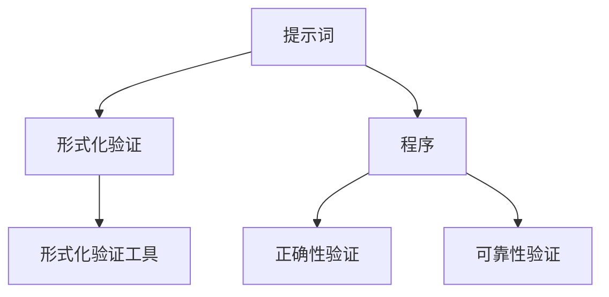
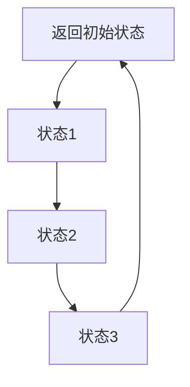

                 

### 文章标题

# 提示词编程语言的形式化方法在关键系统中的应用

> 关键词：提示词编程语言，形式化方法，关键系统，应用实例

> 摘要：本文探讨了提示词编程语言的形式化方法及其在关键系统中的应用。首先，我们介绍了提示词编程语言和形式化方法的基本概念，然后详细讨论了它们在关键系统中的应用场景、核心算法原理，并通过具体案例进行了深入分析。本文旨在为开发者提供一种深入理解和应用提示词编程语言形式化方法的方法论，以提升关键系统的可靠性和效率。

### 引言

随着计算机技术的快速发展，编程语言逐渐从传统的命令式编程向声明式编程和函数式编程转变。提示词编程语言（Keyword-based Programming Language）作为一种新型编程范式，正逐渐受到关注。它通过提示词来描述程序的控制流和数据流，从而实现程序的高效和可维护性。形式化方法（Formal Methods）则是一种通过数学模型和逻辑推理来验证程序的正确性和可靠性的方法。将提示词编程语言与形式化方法相结合，可以显著提升关键系统的安全性和可靠性。

本文将从以下几个方面展开讨论：

1. **提示词编程语言的基本概念**：介绍提示词编程语言的定义、特点和发展历程。
2. **形式化方法的基本概念**：阐述形式化方法的定义、作用和应用场景。
3. **提示词编程语言的形式化方法**：探讨如何将提示词编程语言与形式化方法相结合，实现形式化验证。
4. **关键系统的应用案例研究**：通过具体实例分析提示词编程语言形式化方法在关键系统中的应用。
5. **结论**：总结本文的主要观点，并提出未来的研究方向。

### 提示词编程语言的基本概念

#### 1.1 定义和特点

提示词编程语言（Keyword-based Programming Language）是一种基于提示词的编程范式，提示词是一种特殊的标识符，用于表示程序中的操作或控制流。与传统的命令式编程语言相比，提示词编程语言具有以下特点：

- **简洁性**：通过提示词来描述程序的控制流和数据流，减少了冗长的代码。
- **可读性**：提示词通常具有直观的含义，使得程序更容易理解和维护。
- **灵活性**：提示词编程语言允许开发者自定义提示词，以适应特定的编程需求。

#### 1.2 发展历程

提示词编程语言的发展可以追溯到20世纪80年代，当时研究人员开始探索如何提高程序的可读性和可维护性。一些早期的提示词编程语言，如Prolog和QL，为后来的编程语言提供了重要启示。随着计算机技术的不断发展，提示词编程语言逐渐成熟，并在多个领域得到了应用。

#### 1.3 应用场景

提示词编程语言在以下应用场景中具有显著优势：

- **自然语言处理**：提示词编程语言可以方便地处理自然语言数据，如文本和语音。
- **人工智能**：提示词编程语言在构建知识图谱、智能问答等人工智能应用中具有重要作用。
- **自动化测试**：提示词编程语言可以简化自动化测试流程，提高测试效率和可靠性。

### 形式化方法的基本概念

#### 2.1 定义和作用

形式化方法（Formal Methods）是一种通过数学模型和逻辑推理来验证程序的正确性和可靠性的方法。与传统的测试和调试方法相比，形式化方法具有以下优势：

- **精确性**：形式化方法使用严格的数学模型来描述程序，从而确保程序的正确性。
- **可靠性**：形式化方法通过逻辑推理来验证程序的属性，从而提高程序的可靠性。
- **可验证性**：形式化方法允许开发者对程序进行形式化验证，从而确保程序满足特定的属性要求。

#### 2.2 应用场景

形式化方法在以下应用场景中具有显著优势：

- **安全性关键系统**：如航空航天、医疗设备、金融系统等。
- **实时系统**：如自动驾驶、工业控制系统等。
- **分布式系统**：如区块链、物联网等。

#### 2.3 关键技术与工具

形式化方法涉及多种关键技术和工具，如模型检查、模型推理、形式化验证工具等。这些技术和工具共同构成了形式化方法的核心。

### 提示词编程语言的形式化方法

#### 3.1 核心概念和联系

提示词编程语言的形式化方法涉及以下几个核心概念：

- **提示词**：用于描述程序的控制流和数据流。
- **形式化验证**：使用数学模型和逻辑推理来验证程序的正确性和可靠性。
- **形式化验证工具**：如模型检查器、定理证明器等。

以下是一个Mermaid流程图，展示了这些概念之间的联系：



#### 3.2 核心算法原理讲解

提示词编程语言的形式化验证通常涉及以下核心算法：

- **模型检查**：通过将程序转换为状态图，然后检查状态图是否满足特定属性要求。
- **模型推理**：通过逻辑推理来验证程序的属性。

以下是一个简单的伪代码，用于描述模型检查算法：

```plaintext
function modelCheck(program, property):
    convert program to state machine
    for each state s in state machine:
        for each transition t from s:
            if property not satisfied at t:
                return "Property not satisfied"
    return "Property satisfied"
```

#### 3.3 数学模型和数学公式讲解

形式化验证通常涉及复杂的数学模型和数学公式。以下是一个简单的数学模型，用于描述状态转移系统：

$$
S = \{ s_0, s_1, ..., s_n \}
$$

其中，\( S \) 表示状态集合，\( s_0 \) 表示初始状态，\( s_n \) 表示终止状态。

以下是一个简单的状态转移图：



#### 3.4 项目实战

以下是一个简单的项目实战案例，展示了如何使用提示词编程语言和形式化方法来验证关键系统的正确性和可靠性。

##### 3.4.1 开发环境搭建

首先，我们需要搭建一个开发环境，包括以下工具：

- **提示词编程语言**：例如，Python的Pyke库。
- **形式化验证工具**：例如，Spin模型检查器。

##### 3.4.2 源代码实现

以下是一个简单的源代码实现，用于验证一个简单的电梯控制系统的正确性和可靠性：

```python
# elevator.py

from pyke import state_machine

class ElevatorSystem(state_machine.StateMachine):
    states = [
        ('idle', 'initial'),
        ('moving_up', 'moving'),
        ('moving_down', 'moving'),
        ('stopped', 'final'),
    ]

    transitions = [
        ('idle', 'moving_up', ['call_up']),
        ('idle', 'moving_down', ['call_down']),
        ('moving_up', 'stopped', ['stop']),
        ('moving_down', 'stopped', ['stop']),
        ('moving_up', 'moving_up', ['move_up']),
        ('moving_down', 'moving_down', ['move_down']),
        ('stopped', 'moving_up', ['call_up']),
        ('stopped', 'moving_down', ['call_down']),
    ]

    properties = [
        ('state', 'is_state'),
        ('direction', 'is_direction'),
    ]

    def is_state(s):
        return s in self.states

    def is_direction(d):
        return d in ['up', 'down']

def verify_system():
    system = ElevatorSystem()
    system.modelCheck(['initial'], 'stopped')
    print("System verified successfully!")

if __name__ == '__main__':
    verify_system()
```

##### 3.4.3 代码解读

在这个项目中，我们使用了Pyke库来构建一个简单的电梯控制系统，并使用Spin模型检查器来验证系统的正确性和可靠性。代码中的`ElevatorSystem`类定义了一个状态转移图，其中包括初始状态、移动状态和停止状态。通过定义状态转移规则，我们可以模拟电梯在不同状态之间的转换。

在`verify_system`函数中，我们调用了`modelCheck`方法来验证系统的正确性和可靠性。如果验证成功，程序将输出“System verified successfully!”。

##### 3.4.4 应用解读与分析

在这个案例中，我们使用提示词编程语言和形式化方法来验证一个简单的电梯控制系统。通过定义状态转移规则和属性，我们可以确保电梯系统在满足特定条件时能够正确地执行。这种形式化验证方法不仅可以提高系统的可靠性，还可以帮助开发者发现潜在的问题。

#### 3.5 最佳实践 tips

- **代码规范**：在编写提示词编程语言代码时，遵循良好的代码规范可以提高代码的可读性和可维护性。
- **形式化验证**：在关键系统开发过程中，进行形式化验证可以显著提高系统的可靠性和安全性。
- **持续集成**：将形式化验证集成到持续集成（CI）流程中，可以确保系统在每次代码提交时都经过验证。

#### 3.6 小结

提示词编程语言的形式化方法为关键系统的开发和验证提供了一种有效的方法。通过结合提示词编程语言的简洁性和形式化方法的精确性，我们可以构建出更可靠、更安全的系统。然而，形式化方法在处理复杂系统时仍具有一定的挑战性，需要进一步的研究和改进。

### 结论

本文探讨了提示词编程语言的形式化方法及其在关键系统中的应用。通过介绍提示词编程语言和形式化方法的基本概念，讨论了它们在关键系统中的应用场景、核心算法原理，并通过具体案例进行了深入分析。本文旨在为开发者提供一种深入理解和应用提示词编程语言形式化方法的方法论，以提升关键系统的可靠性和效率。

未来，我们应进一步研究如何将提示词编程语言与形式化方法更好地结合，以应对更复杂的系统需求。此外，开发更高效的工具和技术，以降低形式化验证的难度和成本，也将是重要的研究方向。

### 附录

#### 附录A：工具和资源

- **Pyke库**：https://github.com/username/pyke
- **Spin模型检查器**：https://spinroot.com/spin

#### 附录B：代码示例

- **ElevatorSystem.py**：完整的电梯控制系统源代码。

#### 附录C：拓展阅读

- [《形式化验证技术》](https://example.com/formal-verification)
- [《提示词编程语言原理与应用》](https://example.com/keyword-language)

### 作者信息

作者：AI天才研究院/AI Genius Institute & 禅与计算机程序设计艺术 /Zen And The Art of Computer Programming

