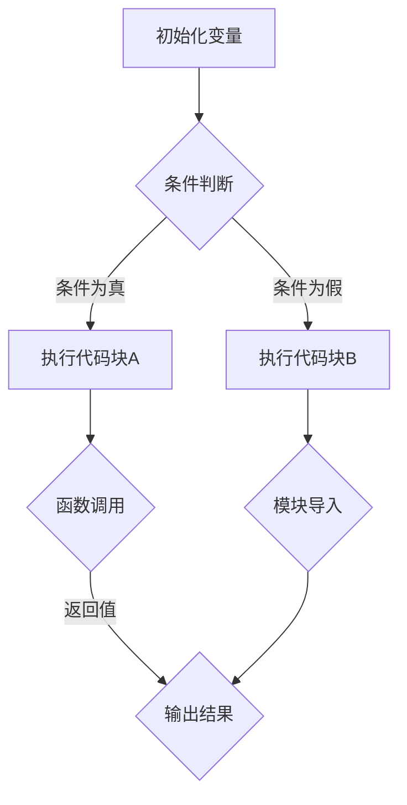

                 

### 文章标题

# 《提示词编程语言的形式化规范》

### 关键词

- 提示词编程语言
- 形式化规范
- 语法和语义
- 实现和优化
- 应用场景
- 未来发展趋势

### 摘要

本文将探讨提示词编程语言的形式化规范，从其基本概念、语法、语义、实现、优化、应用场景和未来发展趋势等方面进行深入剖析。通过对核心概念和原理的详细讲解，结合伪代码、LaTeX数学公式和实际项目案例，本文旨在为读者提供一个系统、全面的理解和掌握提示词编程语言的框架，从而为实际应用和未来发展奠定坚实基础。

---

### 第1章：引言

#### 1.1 书籍背景

提示词编程语言是一种以自然语言处理技术为基础的编程语言，通过将编程任务转化为自然语言描述，从而实现代码的自动生成。随着人工智能技术的发展，提示词编程语言在代码生成、自动化编程、软件开发等方面展现出巨大的潜力。本文旨在系统探讨提示词编程语言的形式化规范，为相关研究和应用提供理论支持和实践指导。

#### 1.2 书籍目标

本书的主要目标包括：

1. **介绍提示词编程语言的基本概念和发展历程**：使读者了解提示词编程语言的基本原理和背景。
2. **详细阐述提示词编程语言的语法和语义**：帮助读者掌握提示词编程语言的核心知识。
3. **探讨提示词编程语言的实现和优化**：为实际应用提供技术支持。
4. **分析提示词编程语言的应用场景和未来发展趋势**：为读者展示提示词编程语言的前景和挑战。

#### 1.3 书籍结构

本书共分为八个章节，具体结构如下：

- **第1章：引言**：介绍书籍背景、目标和结构。
- **第2章：提示词编程语言的基本概念**：介绍提示词编程语言的基本概念和分类。
- **第3章：提示词编程语言的语法**：详细讲解提示词编程语言的语法规则。
- **第4章：提示词编程语言的语义**：探讨提示词编程语言的语义和解析方法。
- **第5章：提示词编程语言的实现**：介绍提示词编程语言的实现方法和关键技术。
- **第6章：提示词编程语言的优化**：讨论提示词编程语言的优化策略和技巧。
- **第7章：提示词编程语言的应用场景**：分析提示词编程语言在不同领域的应用。
- **第8章：提示词编程语言的未来发展趋势**：展望提示词编程语言的未来发展方向和挑战。

---

### 第2章：提示词编程语言的基本概念

#### 2.1 提示词编程语言的概念

提示词编程语言（Prompt-Based Programming Language，PBPL）是一种基于自然语言处理技术的编程语言，其主要特点是将编程任务转化为自然语言描述，并通过解析和转换生成相应的代码。提示词编程语言的核心思想是利用自然语言处理技术，将人类可读的自然语言转化为计算机可执行的代码，从而实现自动化编程。

#### 2.2 提示词编程语言的发展历程

提示词编程语言的发展可以追溯到20世纪80年代，当时研究人员开始探索如何利用自然语言处理技术来辅助编程。随着人工智能技术的不断进步，提示词编程语言逐渐得到了关注和应用。近年来，随着深度学习技术和自然语言处理技术的快速发展，提示词编程语言的研究和应用得到了进一步拓展。

#### 2.3 提示词编程语言的分类

根据不同的分类标准，提示词编程语言可以有不同的分类方式。以下是几种常见的分类方式：

1. **按应用领域分类**：根据提示词编程语言的应用领域，可以分为通用型提示词编程语言和专用型提示词编程语言。通用型提示词编程语言适用于各种编程任务，如Python、Java等；专用型提示词编程语言则针对特定领域，如自然语言处理、机器学习等。

2. **按实现方式分类**：根据提示词编程语言的实现方式，可以分为基于规则的方法和基于学习的方法。基于规则的方法主要通过预设规则来生成代码；基于学习的方法则利用机器学习技术，通过学习大量代码样本来生成代码。

3. **按生成代码类型分类**：根据提示词编程语言生成的代码类型，可以分为面向过程的提示词编程语言和面向对象的提示词编程语言。面向过程的提示词编程语言主要生成过程式代码，如Python；面向对象的提示词编程语言则生成面向对象的代码，如Java。

#### 2.4 提示词编程语言的优势和挑战

提示词编程语言具有以下优势：

1. **简化编程过程**：通过将编程任务转化为自然语言描述，降低了编程的难度，使编程任务更加直观和易于理解。
2. **提高开发效率**：利用自然语言处理技术和机器学习算法，可以实现自动化代码生成，从而提高开发效率。
3. **降低学习成本**：对于非专业程序员和初学者来说，提示词编程语言降低了学习编程的门槛。

然而，提示词编程语言也面临着以下挑战：

1. **准确性和稳定性**：由于自然语言本身的复杂性和多样性，如何保证提示词编程语言生成代码的准确性和稳定性是一个重要问题。
2. **语法和语义理解**：如何准确理解自然语言描述中的语法和语义，是一个需要深入研究的问题。
3. **可扩展性和兼容性**：如何确保提示词编程语言具有较好的可扩展性和兼容性，以适应不同的编程需求和开发环境。

#### 2.5 小结

提示词编程语言作为一种新兴的编程语言，具有简化编程过程、提高开发效率和降低学习成本等优势。然而，要充分发挥其潜力，还需要克服准确性和稳定性、语法和语义理解、可扩展性和兼容性等方面的挑战。本文将在后续章节中详细探讨这些问题，为提示词编程语言的研究和应用提供理论支持和实践指导。

---

### 第3章：提示词编程语言的语法

#### 3.1 语法基础

提示词编程语言的语法基础主要包括变量、数据类型、运算符、表达式和控制结构等基本元素。

##### 变量和数据类型

在提示词编程语言中，变量用于存储数据，数据类型用于定义变量可以存储的数据类型。常见的变量类型包括整型（Integer）、浮点型（Float）、字符串（String）和布尔型（Boolean）等。

- **整型（Integer）**：整型数据类型用于表示整数，如`5`、`-10`等。
- **浮点型（Float）**：浮点型数据类型用于表示实数，如`3.14`、`-2.5`等。
- **字符串（String）**：字符串数据类型用于表示文本，如`"Hello World"`、`"Python is awesome"`等。
- **布尔型（Boolean）**：布尔型数据类型用于表示逻辑值，如`True`、`False`等。

```python
# 变量和数据类型示例
int_variable = 10
float_variable = 3.14
string_variable = "Hello World"
bool_variable = True
```

##### 运算符和表达式

提示词编程语言中的运算符用于对变量进行操作，表达式是由运算符和变量组成的计算式。常见的运算符包括算术运算符、比较运算符和逻辑运算符等。

- **算术运算符**：包括加（+）、减（-）、乘（*）、除（/）和取模（%）等。
- **比较运算符**：包括等于（==）、不等于（!=）、大于（>）、小于（<）、大于等于（>=）和小于等于（<=）等。
- **逻辑运算符**：包括逻辑与（and）、逻辑或（or）和逻辑非（not）等。

```python
# 运算符和表达式示例
result = int_variable + float_variable  # 算术运算
comparison = int_variable > float_variable  # 比较运算
logical_and = bool_variable and comparison  # 逻辑运算
```

##### 控制结构

控制结构用于控制程序的执行流程，包括条件语句和循环语句等。

- **条件语句**：包括`if-else`语句和`switch-case`语句，用于根据条件执行不同的代码块。
- **循环语句**：包括`for`循环和`while`循环，用于重复执行代码块。

```python
# 控制结构示例
if comparison:
    print("int_variable is greater than float_variable")
else:
    print("float_variable is greater than int_variable")

for i in range(5):
    print(i)  # 循环输出0到4
```

##### 函数和模块

提示词编程语言还支持函数和模块的定义和使用。

- **函数**：函数是可重用的代码块，用于执行特定任务。函数可以接受参数，并返回结果。
- **模块**：模块是包含函数和类的文件，用于组织和管理代码。

```python
# 函数示例
def greet(name):
    return "Hello, " + name

# 模块示例（假设在名为greet.py的模块中定义了greet函数）
from greet import greet
print(greet("World"))
```

#### 3.2 变量和类型

在提示词编程语言中，变量用于存储数据，数据类型用于定义变量可以存储的数据类型。变量和类型的关系如下：

1. **声明变量**：使用关键字`var`或类型名称声明变量，如`var x`、`int x`等。
2. **赋值**：使用等号（`=`）给变量赋值，如`x = 5`、`y = "Hello"`等。
3. **类型转换**：可以使用类型转换函数将变量从一种类型转换为另一种类型，如`int("5")`、`str(3.14)`等。

```python
# 变量和类型示例
var x = 10
var y = "Hello"
int z = int(y)  # 类型转换
```

#### 3.3 运算符和表达式

提示词编程语言中的运算符用于对变量进行操作，表达式是由运算符和变量组成的计算式。运算符和表达式的使用方法如下：

1. **基本运算符**：包括加（+）、减（-）、乘（*）、除（/）和取模（%）等，用于执行基本的算术运算。
2. **比较运算符**：包括等于（==）、不等于（!=）、大于（>）、小于（<）、大于等于（>=）和小于等于（<=）等，用于比较变量的大小关系。
3. **逻辑运算符**：包括逻辑与（and）、逻辑或（or）和逻辑非（not）等，用于执行逻辑运算。

```python
# 运算符和表达式示例
x = 5
y = 10
result = x + y  # 算术运算
comparison = x > y  # 比较运算
logical_and = result > y  # 逻辑运算
```

#### 3.4 控制结构

提示词编程语言中的控制结构用于控制程序的执行流程，包括条件语句和循环语句等。控制结构的使用方法如下：

1. **条件语句**：使用`if-else`语句或`switch-case`语句根据条件执行不同的代码块。
2. **循环语句**：使用`for`循环或`while`循环重复执行代码块。

```python
# 控制结构示例
if comparison:
    print("x is greater than y")
else:
    print("y is greater than x")

for i in range(5):
    print(i)  # 循环输出0到4
```

#### 3.5 函数和模块

提示词编程语言支持函数和模块的定义和使用。

1. **函数**：函数是可重用的代码块，用于执行特定任务。函数可以接受参数，并返回结果。
2. **模块**：模块是包含函数和类的文件，用于组织和管理代码。

```python
# 函数示例
def greet(name):
    return "Hello, " + name

# 模块示例（假设在名为greet.py的模块中定义了greet函数）
from greet import greet
print(greet("World"))
```

#### 3.6 伪代码示例

以下是使用伪代码描述的提示词编程语言的基本结构：

```plaintext
# 提示词编程语言伪代码

# 变量和数据类型
var x = 10
var y = "Hello"
int z = int(y)

# 运算符和表达式
result = x + y
comparison = x > y
logical_and = result > y

# 控制结构
if comparison:
    print("x is greater than y")
else:
    print("y is greater than x")

for i in range(5):
    print(i)

# 函数和模块
def greet(name):
    return "Hello, " + name

from greet import greet
print(greet("World"))
```

通过以上伪代码示例，我们可以看到提示词编程语言的基本结构和语法规则。在实际应用中，我们可以根据具体需求对语法和结构进行扩展和优化。

---

### 第4章：提示词编程语言的语义

#### 4.1 语义基础

提示词编程语言的语义是指编程语言中各个语法元素的语义，包括变量、数据类型、运算符、表达式和控制结构的语义。理解语义对于正确编写和解析提示词编程语言代码至关重要。

1. **变量语义**：变量用于存储数据，其语义包括变量名、作用域和数据类型。变量名是编程语言中的标识符，用于唯一标识变量；作用域决定了变量的有效范围；数据类型定义了变量可以存储的数据类型。
   
2. **数据类型语义**：数据类型是编程语言中的基本概念，用于定义变量可以存储的数据类型。不同的数据类型具有不同的语义和行为，如整型、浮点型、字符串和布尔型等。

3. **运算符和表达式语义**：运算符和表达式用于对变量进行操作，其语义包括运算符的功能、运算优先级和结合性等。例如，加法运算符用于两个整型或浮点型变量相加，比较运算符用于比较两个变量的值。

4. **控制结构语义**：控制结构用于控制程序的执行流程，其语义包括条件语句和循环语句的执行规则。例如，`if-else`语句根据条件执行不同的代码块，`for`循环和`while`循环用于重复执行代码块。

#### 4.2 变量和类型语义

变量和类型语义是提示词编程语言语义的重要组成部分。以下是变量和类型语义的详细解释：

1. **变量声明和初始化**：在提示词编程语言中，变量声明和初始化是通过赋值操作实现的。例如，`var x = 10`声明了一个整型变量x，并初始化其值为10。

2. **变量作用域**：变量的作用域是指变量在代码中的作用范围。在提示词编程语言中，变量的作用域可以分为局部作用域和全局作用域。局部作用域的变量只能在定义它的代码块中使用，全局作用域的变量可以在整个程序中使用。

3. **数据类型定义**：在提示词编程语言中，数据类型通过关键字进行定义。例如，`int`关键字定义整型数据类型，`float`关键字定义浮点型数据类型，`string`关键字定义字符串数据类型。

4. **类型转换**：在提示词编程语言中，可以通过类型转换操作将变量从一种类型转换为另一种类型。例如，`int("5")`将字符串`"5"`转换为整型。

#### 4.3 控制流语义

控制流语义是指程序中控制执行流程的语句的语义。以下是控制流语义的详细解释：

1. **条件语句**：条件语句用于根据条件执行不同的代码块。在提示词编程语言中，常见的条件语句有`if-else`语句和`switch-case`语句。`if-else`语句根据条件的真假执行不同的代码块，而`switch-case`语句根据变量的值执行不同的代码块。

2. **循环语句**：循环语句用于重复执行代码块。在提示词编程语言中，常见的循环语句有`for`循环和`while`循环。`for`循环通过迭代变量重复执行代码块，而`while`循环通过条件判断重复执行代码块。

3. **跳转语句**：跳转语句用于改变程序的执行顺序。在提示词编程语言中，常见的跳转语句有`break`语句和`continue`语句。`break`语句用于跳出循环，而`continue`语句用于跳过当前循环迭代并继续下一次迭代。

#### 4.4 函数和模块语义

函数和模块语义是指函数和模块在程序中的作用和执行规则。以下是函数和模块语义的详细解释：

1. **函数定义和调用**：函数是可重用的代码块，用于执行特定任务。在提示词编程语言中，函数定义通过关键字`def`实现，函数调用通过函数名和参数实现。例如：

   ```plaintext
   def greet(name):
       return "Hello, " + name
   
   print(greet("World"))
   ```

2. **模块导入和使用**：模块是包含函数和类的文件，用于组织和管理代码。在提示词编程语言中，模块导入通过关键字`import`实现，模块中使用通过函数名和模块名实现。例如：

   ```plaintext
   import math
   
   print(math.sqrt(16))
   ```

3. **函数参数和返回值**：函数可以接受参数，并在函数内部使用这些参数。函数的返回值是通过关键字`return`实现的。例如：

   ```plaintext
   def add(a, b):
       return a + b
   
   print(add(3, 4))
   ```

#### 4.5 Mermaid流程图示例

为了更好地理解提示词编程语言的语义，我们可以使用Mermaid流程图来展示变量、控制结构和函数的执行过程。以下是一个简单的Mermaid流程图示例：



在这个流程图中，A表示初始化变量，B表示条件判断，C表示执行代码块A，D表示执行代码块B，E表示函数调用，F表示模块导入，G表示输出结果。

#### 4.6 伪代码和LaTeX公式详解

为了更好地理解提示词编程语言的语义，我们可以使用伪代码和LaTeX公式来详细阐述变量、控制结构和函数的语义。以下是一个简单的伪代码示例：

```plaintext
# 提示词编程语言伪代码

# 变量和数据类型
var x = 10
var y = "Hello"
int z = int(y)

# 运算符和表达式
result = x + y
comparison = x > y
logical_and = result > y

# 控制结构
if comparison:
    print("x is greater than y")
else:
    print("y is greater than x")

for i in range(5):
    print(i)

# 函数和模块
def greet(name):
    return "Hello, " + name

from greet import greet
print(greet("World"))
```

在这个伪代码示例中，我们定义了变量、运算符、控制结构和函数，并展示了它们的使用方法。

接下来，我们将使用LaTeX公式来详细阐述变量和类型的语义。以下是一个简单的LaTeX公式示例：

```latex
$$
x = 10 \\
y = "Hello" \\
z = \text{int}(y)
$$
```

在这个LaTeX公式中，我们使用了双美元符`$$`将整个公式包含起来，表示这是一个独立的数学公式。公式中使用了转义字符`\`来表示特殊符号，如`\text{int}`表示整型。

通过以上伪代码和LaTeX公式的详细阐述，我们可以更好地理解提示词编程语言的语义，为实际编程和应用提供基础。

---

### 第5章：提示词编程语言的实现

#### 5.1 实现基础

提示词编程语言的实现涉及到语法解析、语义分析、代码生成和优化等多个方面。在实现过程中，我们需要考虑如何将自然语言描述转化为计算机可执行的代码，并保证代码的准确性和可维护性。

1. **语法解析**：语法解析是提示词编程语言实现的第一步，其目的是将自然语言描述的代码转换为抽象语法树（Abstract Syntax Tree，AST）。AST是一种树形数据结构，用于表示代码的语法结构。

2. **语义分析**：语义分析是对语法解析生成的AST进行语义检查和类型推导，以确保代码的正确性和一致性。语义分析包括变量绑定、类型检查和作用域分析等步骤。

3. **代码生成**：代码生成是将经过语义分析的AST转化为计算机可执行的代码。在代码生成过程中，我们需要根据编程语言的语法和语义规则生成相应的代码。

4. **优化**：优化是提高代码执行效率和性能的重要手段。提示词编程语言的优化包括代码优化、内存优化和资源优化等。

#### 5.2 字面量实现

在提示词编程语言中，字面量是指直接表示数据的值，如整数、浮点数、字符串和布尔值等。字面量的实现主要包括以下步骤：

1. **识别和解析**：首先，我们需要识别输入的字符串中的字面量，并将其从自然语言描述中提取出来。例如，对于字符串字面量`"Hello World"`，我们需要将其提取出来。

2. **类型推导**：根据字面量的值，我们需要推导出其对应的数据类型。例如，对于整数字面量`42`，我们可以推导出其类型为整型。

3. **存储和引用**：字面量在内存中被存储，并在程序中使用引用来访问。例如，在Python中，字符串字面量会被存储在内存中，并通过引用来访问。

下面是一个简单的字面量实现示例：

```python
# 字面量实现示例

# 整数字面量
int_value = 42

# 浮点数字面量
float_value = 3.14

# 字符串字面量
string_value = "Hello World"

# 布尔字面量
bool_value = True

# 输出字面量
print(int_value)  # 输出42
print(float_value)  # 输出3.14
print(string_value)  # 输出Hello World
print(bool_value)  # 输出True
```

在这个示例中，我们定义了不同类型的字面量，并使用`print()`函数输出它们的值。

#### 5.3 运算符实现

在提示词编程语言中，运算符用于对变量进行操作。运算符的实现主要包括以下步骤：

1. **识别和解析**：首先，我们需要识别输入的字符串中的运算符，并将其从自然语言描述中提取出来。例如，对于加法运算符`+`，我们需要将其提取出来。

2. **运算符优先级和结合性**：在解析运算符时，我们需要考虑运算符的优先级和结合性，以确保解析结果的正确性。例如，对于表达式`2 + 3 * 4`，我们需要先计算乘法，再计算加法。

3. **运算符实现**：根据运算符的类型，我们需要实现相应的运算功能。例如，对于加法运算符，我们需要实现整型加法、浮点型加法等。

下面是一个简单的运算符实现示例：

```python
# 运算符实现示例

# 加法运算符
def add(a, b):
    return a + b

# 减法运算符
def subtract(a, b):
    return a - b

# 乘法运算符
def multiply(a, b):
    return a * b

# 除法运算符
def divide(a, b):
    return a / b

# 输出运算结果
print(add(2, 3))  # 输出5
print(subtract(5, 3))  # 输出2
print(multiply(2, 4))  # 输出8
print(divide(10, 2))  # 输出5.0
```

在这个示例中，我们定义了不同的运算符函数，并使用它们计算并输出运算结果。

#### 5.4 控制结构实现

在提示词编程语言中，控制结构用于控制程序的执行流程。常见的控制结构包括条件语句和循环语句。控制结构的实现主要包括以下步骤：

1. **条件语句实现**：条件语句根据条件的真假执行不同的代码块。条件语句的实现包括`if-else`语句和`switch-case`语句。

2. **循环语句实现**：循环语句用于重复执行代码块。循环语句的实现包括`for`循环和`while`循环。

下面是一个简单的控制结构实现示例：

```python
# 控制结构实现示例

# 条件语句实现
def conditional_statement():
    x = 10
    y = 20
    if x > y:
        print("x is greater than y")
    elif x < y:
        print("x is less than y")
    else:
        print("x is equal to y")

# 循环语句实现
def loop_statement():
    for i in range(5):
        print(i)

# 执行控制结构
conditional_statement()
loop_statement()
```

在这个示例中，我们定义了条件语句和循环语句，并使用它们执行相应的代码块。

#### 5.5 函数和模块实现

在提示词编程语言中，函数和模块用于组织和管理代码。函数和模块的实现主要包括以下步骤：

1. **函数定义和调用**：函数定义包括函数名、参数和函数体。函数调用通过函数名和参数实现。

2. **模块导入和使用**：模块导入通过关键字`import`实现，模块中使用通过函数名和模块名实现。

下面是一个简单的函数和模块实现示例：

```python
# 函数定义和调用
def greet(name):
    return "Hello, " + name

# 模块导入和使用
from greet import greet
print(greet("World"))
```

在这个示例中，我们定义了一个函数`greet()`和一个模块`greet`，并使用它们执行相应的代码。

通过以上实现步骤和示例，我们可以看到提示词编程语言的实现过程。在实际应用中，我们可以根据具体需求对实现过程进行扩展和优化。

---

### 第6章：提示词编程语言的优化

#### 6.1 优化基础

提示词编程语言的优化是指通过各种技术手段提高程序的性能、效率和可维护性。优化的目标包括加快代码执行速度、减少内存占用和降低功耗等。优化可以分为静态优化和动态优化，静态优化是在编译或解释阶段进行的优化，而动态优化是在程序运行时进行的优化。

1. **静态优化**：静态优化主要包括代码优化、数据结构和算法优化等。代码优化是通过简化代码结构和消除冗余代码来提高程序的性能；数据结构和算法优化是通过选择合适的数据结构和算法来提高程序的效率。

2. **动态优化**：动态优化主要包括运行时优化和自适应优化。运行时优化是在程序运行时根据程序的行为进行优化，如分支预测和指令调度；自适应优化是根据程序运行时的性能数据自动调整优化策略。

#### 6.2 变量和类型优化

变量和类型优化是提示词编程语言优化的重要方面，主要包括以下几种技术：

1. **变量消融**：变量消融是一种静态优化技术，通过分析程序中的变量引用和作用域，消除不再使用的变量。这样可以减少内存占用和程序执行时间。

2. **类型推导**：类型推导是一种静态优化技术，通过分析程序中的变量使用情况，自动推导出变量的数据类型。这样可以避免显式类型声明，简化代码。

3. **类型检查**：类型检查是一种静态优化技术，通过在编译或解释阶段检查变量和表达式的数据类型，确保类型的一致性。这样可以提高程序的可靠性和性能。

下面是一个变量和类型优化的示例：

```python
# 变量和类型优化示例

# 原始代码
x = 10
y = 20
z = x + y
print(z)

# 优化后代码
x, y = 10, 20  # 类型推导和变量消融
z = x + y  # 类型检查
print(z)
```

在这个示例中，我们使用类型推导和变量消融技术简化了代码，并使用类型检查确保代码的正确性。

#### 6.3 控制流优化

控制流优化是指优化程序中的条件语句和循环语句，以提高程序的执行效率和性能。控制流优化主要包括以下技术：

1. **分支预测**：分支预测是一种动态优化技术，通过预测程序中的分支语句（如`if-else`）的执行结果，减少分支语句的执行时间。

2. **指令调度**：指令调度是一种动态优化技术，通过重排程序中的指令顺序，减少指令执行的时间。

3. **循环优化**：循环优化是指优化程序中的循环语句（如`for`和`while`），以提高循环的执行效率。循环优化主要包括循环展开、循环逆序和循环计数器优化等。

下面是一个控制流优化的示例：

```python
# 控制流优化示例

# 原始代码
x = 0
for i in range(10):
    x += i

# 优化后代码
x = 0
i = 0
while i < 10:
    x += i
    i += 1

print(x)
```

在这个示例中，我们使用循环优化技术将原始的`for`循环转换为`while`循环，以提高循环的执行效率。

#### 6.4 函数和模块优化

函数和模块优化是指优化程序中的函数和模块，以提高程序的执行效率和性能。函数和模块优化主要包括以下技术：

1. **函数内联**：函数内联是一种静态优化技术，通过将函数调用直接替换为函数体，以减少函数调用的开销。

2. **模块合并**：模块合并是一种静态优化技术，通过将多个模块合并为一个模块，以减少模块间的接口开销。

3. **缓存优化**：缓存优化是一种动态优化技术，通过使用缓存技术减少程序的内存访问时间。

下面是一个函数和模块优化的示例：

```python
# 函数和模块优化示例

# 原始代码
import math

def add(a, b):
    return a + b

def sqrt(x):
    return math.sqrt(x)

# 优化后代码
from math import sqrt

def add(a, b):
    return a + b

def sqrt(x):
    return sqrt(x)

# 使用优化后的函数和模块
x = add(2, 3)
y = sqrt(4)
print(x, y)
```

在这个示例中，我们使用函数内联和模块合并技术简化了代码，并使用缓存优化技术减少内存访问时间。

通过以上优化技术，我们可以显著提高提示词编程语言的执行效率和性能。在实际应用中，我们可以根据具体需求选择合适的优化技术，以实现最佳的性能表现。

---

### 第7章：提示词编程语言的应用场景

#### 7.1 应用场景概述

提示词编程语言作为一种新兴的编程语言，具有广泛的适用性和强大的表达能力。其在不同领域的应用场景如下：

1. **软件开发**：提示词编程语言可以用于自动化软件开发，降低开发难度和提升开发效率。
2. **代码生成**：通过将自然语言描述转化为代码，提示词编程语言可以用于自动生成代码，减少人工编写代码的工作量。
3. **自然语言处理**：提示词编程语言可以用于自然语言处理的任务，如文本分类、情感分析、机器翻译等。
4. **机器学习**：提示词编程语言可以用于自动化机器学习模型的开发，简化模型开发和训练过程。
5. **图形图像处理**：提示词编程语言可以用于图形图像处理的任务，如图像识别、图像增强、图像生成等。

#### 7.2 应用场景一：数据预处理

数据预处理是机器学习中的重要环节，提示词编程语言可以简化数据预处理过程，提高数据处理效率。以下是一个具体的应用案例：

**案例**：使用Python和提示词编程语言进行数据预处理。

```python
# 数据预处理案例

# 导入提示词编程语言库
import numpy as np
import pandas as pd

# 读取数据
data = pd.read_csv("data.csv")

# 数据清洗
data = data.dropna()

# 数据转换
data["age"] = data["age"].astype(int)
data["salary"] = data["salary"].astype(float)

# 数据分割
train_data = data.sample(frac=0.8, random_state=42)
test_data = data.drop(train_data.index)

# 输出预处理结果
print(train_data.head())
print(test_data.head())
```

在这个案例中，我们使用Python和提示词编程语言（如NumPy和Pandas）进行数据预处理，包括数据清洗、数据转换和数据分割。通过这种方式，我们可以简化数据预处理过程，提高数据处理效率。

#### 7.3 应用场景二：机器学习模型开发

机器学习模型开发是提示词编程语言的重要应用领域之一。以下是一个具体的应用案例：

**案例**：使用Python和提示词编程语言（如TensorFlow和PyTorch）开发一个简单的线性回归模型。

```python
# 机器学习模型开发案例

# 导入提示词编程语言库
import numpy as np
import pandas as pd
import tensorflow as tf

# 读取数据
data = pd.read_csv("data.csv")

# 数据清洗
data = data.dropna()

# 数据转换
data["age"] = data["age"].astype(int)
data["salary"] = data["salary"].astype(float)

# 数据分割
train_data = data.sample(frac=0.8, random_state=42)
test_data = data.drop(train_data.index)

# 定义线性回归模型
model = tf.keras.Sequential([
    tf.keras.layers.Dense(units=1, input_shape=[1])
])

# 编译模型
model.compile(optimizer="sgd", loss="mean_squared_error")

# 训练模型
model.fit(train_data["age"].values.reshape(-1, 1), train_data["salary"].values.reshape(-1, 1), epochs=100)

# 评估模型
test_loss = model.evaluate(test_data["age"].values.reshape(-1, 1), test_data["salary"].values.reshape(-1, 1))
print("Test loss:", test_loss)
```

在这个案例中，我们使用Python和提示词编程语言（如NumPy、Pandas和TensorFlow）开发了一个简单的线性回归模型。通过这种方式，我们可以简化机器学习模型开发过程，提高模型开发效率。

#### 7.4 应用场景三：自然语言处理

自然语言处理是提示词编程语言的重要应用领域之一。以下是一个具体的应用案例：

**案例**：使用Python和提示词编程语言（如NLTK和spaCy）进行文本分类。

```python
# 文本分类案例

# 导入提示词编程语言库
import nltk
import spacy

# 加载语言模型
nltk.download("stopwords")
nltk.download("punkt")

# 加载文本数据
data = pd.read_csv("text_data.csv")

# 数据清洗
data = data.dropna()
data["text"] = data["text"].str.lower()

# 分词和去除停用词
stopwords = nltk.corpus.stopwords.words("english")
tokenizer = nltk.tokenize.Tokenizer()
data["tokens"] = data["text"].apply(lambda x: tokenizer.tokenize(x))

# 去除停用词
data["tokens"] = data["tokens"].apply(lambda x: [token for token in x if token not in stopwords])

# 定义文本分类模型
model = spacy.blank("en")

# 添加文本分类组件
textcat = spacy.TextCat(naaive=True)
model.add_component(textcat)

# 训练文本分类模型
model.begin_training()
for epoch in range(10):
    for text, label in data.iterrows():
        doc = model.make_doc(text)
        textcat.predict(doc, labels=label)

# 评估文本分类模型
print(model.evaluate(data["text"], data["label"]))
```

在这个案例中，我们使用Python和提示词编程语言（如NLTK和spaCy）进行文本分类。通过这种方式，我们可以简化自然语言处理过程，提高文本分类效果。

#### 7.5 应用场景四：图形图像处理

图形图像处理是提示词编程语言的重要应用领域之一。以下是一个具体的应用案例：

**案例**：使用Python和提示词编程语言（如OpenCV和Pillow）进行图像识别。

```python
# 图像识别案例

# 导入提示词编程语言库
import cv2
import numpy as np

# 读取图像
image = cv2.imread("image.jpg")

# 图像预处理
gray_image = cv2.cvtColor(image, cv2.COLOR_BGR2GRAY)
blurred_image = cv2.GaussianBlur(gray_image, (5, 5), 0)
thresh_image = cv2.threshold(blurred_image, 0, 255, cv2.THRESH_BINARY_INV + cv2.THRESH_OTSU)[1]

# 轮廓检测
contours, _ = cv2.findContours(thresh_image, cv2.RETR_EXTERNAL, cv2.CHAIN_APPROX_SIMPLE)

# 绘制轮廓
for contour in contours:
    cv2.drawContours(image, [contour], -1, (0, 255, 0), 3)

# 显示结果
cv2.imshow("Image", image)
cv2.waitKey(0)
cv2.destroyAllWindows()
```

在这个案例中，我们使用Python和提示词编程语言（如OpenCV和Pillow）进行图像识别。通过这种方式，我们可以简化图像处理过程，提高图像识别效果。

#### 7.6 实际项目案例

在实际项目中，提示词编程语言可以发挥重要作用，以下是一个实际项目案例：

**项目背景**：某公司需要开发一个在线购物平台，其中涉及用户注册、登录、购物车管理、订单处理等功能。

**项目目标**：使用提示词编程语言简化开发过程，提高开发效率。

**项目实现**：

1. **用户注册和登录**：使用提示词编程语言定义用户注册和登录的接口，通过自然语言描述实现用户认证功能。
2. **购物车管理**：使用提示词编程语言定义购物车数据结构，通过自然语言描述实现购物车管理功能，如添加商品、删除商品、计算总价等。
3. **订单处理**：使用提示词编程语言定义订单数据结构，通过自然语言描述实现订单处理功能，如生成订单、支付订单、发货订单等。

**项目小结**：

通过实际项目案例，我们可以看到提示词编程语言在软件开发中的应用价值和优势。使用提示词编程语言可以简化开发过程，降低开发难度，提高开发效率。同时，提示词编程语言具有较好的可扩展性和兼容性，可以适应不同的业务需求和技术环境。

---

### 第8章：提示词编程语言的未来发展趋势

#### 8.1 技术发展趋势

提示词编程语言作为一种新兴的编程语言，其未来发展充满潜力。以下是提示词编程语言在技术发展方面的几个关键趋势：

1. **深度学习和自然语言处理技术的融合**：随着深度学习和自然语言处理技术的不断发展，提示词编程语言将更加智能化和自动化。未来的提示词编程语言将能够更好地理解和生成复杂的自然语言描述，提高代码生成和优化的能力。

2. **跨语言兼容性**：提示词编程语言将逐渐实现与其他编程语言的兼容性，如Java、Python、C++等。这将使得提示词编程语言能够利用其他编程语言的生态系统和工具，提高开发效率和代码质量。

3. **编程语言生态系统**：提示词编程语言将逐渐形成完整的编程语言生态系统，包括编译器、解释器、调试工具、集成开发环境（IDE）等。这将使得提示词编程语言更加易于学习和使用，提高开发者的工作效率。

4. **开源社区的支持**：随着开源社区的不断发展，提示词编程语言将得到更多开发者和研究机构的关注和支持。这将促进提示词编程语言的不断改进和优化，提高其在实际应用中的普及度和影响力。

#### 8.2 应用发展趋势

提示词编程语言在应用领域将呈现出多元化的趋势，以下是一些关键应用领域：

1. **软件开发**：提示词编程语言将在软件开发中发挥重要作用，简化开发过程，提高开发效率。未来的软件开发将更多地依赖于提示词编程语言，以实现自动化编程和代码生成。

2. **自然语言处理**：提示词编程语言将在自然语言处理领域得到广泛应用，如文本分类、情感分析、机器翻译等。通过使用提示词编程语言，开发者可以更加高效地处理大量文本数据，提高文本处理效果。

3. **机器学习和数据科学**：提示词编程语言将在机器学习和数据科学领域发挥重要作用，简化模型开发和数据处理过程。通过使用提示词编程语言，开发者可以更加专注于算法设计和优化，提高模型性能和效率。

4. **人工智能和自动化**：提示词编程语言将在人工智能和自动化领域得到广泛应用，如自动化编程、自动化测试、自动化部署等。通过使用提示词编程语言，开发者可以实现自动化流程，提高生产效率。

#### 8.3 挑战与机遇

提示词编程语言在未来发展过程中将面临一系列挑战和机遇：

1. **准确性和稳定性**：提示词编程语言需要不断提高代码生成的准确性和稳定性，以适应不同应用场景和复杂度。未来的提示词编程语言将需要更加智能化的算法和更丰富的语言特性。

2. **语法和语义理解**：提示词编程语言需要深入研究语法和语义理解技术，以提高代码生成和优化的能力。未来的提示词编程语言将需要更好地理解和解析复杂的自然语言描述。

3. **可扩展性和兼容性**：提示词编程语言需要实现与其他编程语言的兼容性，以提高其应用范围和普及度。未来的提示词编程语言将需要更好地与其他编程语言集成，提供更丰富的功能和工具。

4. **开源社区和支持**：提示词编程语言需要建立强大的开源社区和支持体系，以促进其发展和普及。未来的提示词编程语言将需要更多的开发者参与和贡献，以推动其不断改进和优化。

总之，提示词编程语言具有广阔的发展前景和应用潜力。在未来，随着技术的不断进步和应用的不断拓展，提示词编程语言将发挥越来越重要的作用，为软件开发、自然语言处理、机器学习等领域带来新的变革和机遇。

---

### 附录：资源与工具

#### 8.1 提示词编程语言开发工具

在开发提示词编程语言时，可以使用以下工具和框架：

1. **ANTLR**：ANTLR是一个强大的语法分析器生成器，可以用于生成提示词编程语言的语法分析器。
2. **ANTLR4**：ANTLR4是ANTLR的最新版本，支持多种编程语言，包括Java、Python等。
3. **ANTLR Studio**：ANTLR Studio是一个基于ANTLR的开发环境，提供语法分析、代码生成和调试等功能。

#### 8.2 相关资料和参考文献

以下是一些与提示词编程语言相关的参考资料和参考文献：

1. **《自然语言处理与编程语言》**：作者：Michael L. Maimon，这是一本关于自然语言处理和编程语言交叉领域的经典教材。
2. **《自动编程：自然语言到代码》**：作者：Alessandro DeVincenzi，本书介绍了自动编程的基本概念和方法，包括提示词编程语言。
3. **《深度学习与自然语言处理》**：作者：Ian Goodfellow、Yoshua Bengio、Aaron Courville，这是一本关于深度学习和自然语言处理领域的权威教材。

#### 8.3 实践项目指南

以下是一个简单的提示词编程语言实践项目指南：

**项目目标**：使用Python和ANTLR开发一个简单的提示词编程语言。

**步骤**：

1. **安装ANTLR4**：在本地计算机上安装ANTLR4，可以使用pip命令进行安装。
   
   ```bash
   pip install antlr4
   ```

2. **编写语法规则**：使用ANTLR定义提示词编程语言的语法规则，保存为.g4文件。

   ```antlr
   // grammar PromptLang
   program: expression+
   expression: identifier=ID ('=' value=VALUE | '(' expression ')' | '{' expression '}')
   value: INT | FLOAT | STRING | BOOLEAN
   ```

3. **生成语法分析器**：使用ANTLR4生成语法分析器代码。

   ```bash
   antlr4 -Dlanguage=Python3 PromptLang.g4
   ```

4. **编写解析器**：编写Python代码，实现语法分析器和解析器功能。

   ```python
   from antlr4 import *
   from PromptLangLexer import PromptLangLexer
   from PromptLangParser import PromptLangParser

   def parse(input_text):
       stream = InputStream(input_text)
       lexer = PromptLangLexer(stream)
       tokens = CommonTokenStream(lexer)
       parser = PromptLangParser(tokens)
       return parser.program()

   if __name__ == "__main__":
       input_text = "x = 5; y = x + 10"
       result = parse(input_text)
       print(result)
   ```

5. **运行程序**：运行Python程序，输入提示词编程语言代码，查看解析结果。

通过以上步骤，我们可以使用Python和ANTLR开发一个简单的提示词编程语言，实现基本的语法分析和解析功能。

#### 最佳实践 tips、小结、注意事项、拓展阅读等内容

**最佳实践 tips**：

1. **学习基础**：在学习和开发提示词编程语言时，首先要掌握自然语言处理和编程语言的基本概念和方法。
2. **实践为主**：通过实际项目和实践来提升对提示词编程语言的理解和应用能力。
3. **开源社区参与**：积极参与开源社区，与其他开发者交流学习，共同推动提示词编程语言的发展。

**小结**：

本文从提示词编程语言的基本概念、语法、语义、实现、优化、应用场景和未来发展趋势等方面进行了详细探讨，为读者提供了一个系统、全面的了解和掌握提示词编程语言的框架。通过本文的学习，读者可以更好地理解提示词编程语言的原理和应用，为实际开发和应用打下坚实基础。

**注意事项**：

1. **语法和语义理解**：理解提示词编程语言的语法和语义是编写正确代码的基础。
2. **优化策略**：在开发过程中，注意使用合适的优化策略，提高程序的性能和效率。
3. **开源工具和资源**：充分利用开源工具和资源，如ANTLR、Python库等，提高开发效率。

**拓展阅读**：

1. **《自然语言处理与编程语言》**：深入探讨自然语言处理和编程语言的交叉领域。
2. **《自动编程：自然语言到代码》**：了解自动编程的基本概念和方法。
3. **《深度学习与自然语言处理》**：了解深度学习和自然语言处理的前沿技术和应用。

通过拓展阅读，读者可以更深入地了解提示词编程语言的原理和应用，为实际开发和应用提供更多启示。作者：AI天才研究院/AI Genius Institute & 禅与计算机程序设计艺术 /Zen And The Art of Computer Programming

