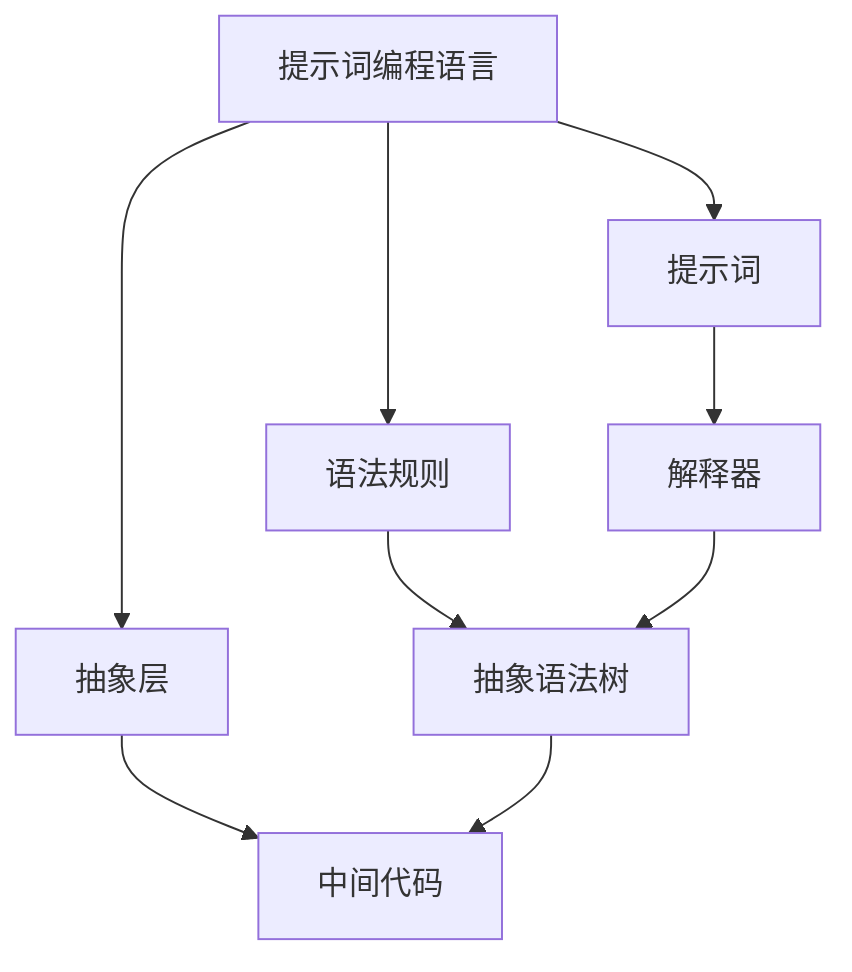
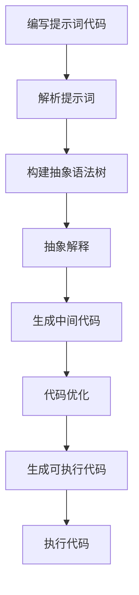

                 

### 文章标题

《提示词编程语言的抽象解释框架》

提示词编程语言是一种通过提示词（Keywords）来描述程序逻辑的编程语言，它将编程的过程抽象化为一种基于提示词的组织和组合。抽象解释框架则是用于解释这些提示词如何转化为机器语言或执行指令的一种抽象模型。本文将深入探讨提示词编程语言的抽象解释框架，从背景介绍、核心概念与联系、核心算法原理讲解、数学模型与公式、项目实战和开发环境搭建等方面进行详细讲解。

### 文章关键词

- 提示词编程语言
- 抽象解释框架
- 核心算法
- 数学模型
- 项目实战
- 开发环境

### 文章摘要

本文旨在探讨提示词编程语言的抽象解释框架，旨在为读者提供一个清晰、详细的介绍。文章首先介绍了提示词编程语言的背景和基本概念，然后深入分析了抽象解释框架的基本原理和核心算法，并通过数学模型和公式的详细讲解，帮助读者理解其内在逻辑。文章随后通过实际项目实战，展示了如何将抽象解释框架应用于实际编程中，最后对开发环境搭建进行了详细指导。通过本文的阅读，读者可以全面了解提示词编程语言的抽象解释框架，掌握其核心原理和应用方法。

### 第1章 引言

#### 1.1 书籍目的与内容概述

随着计算机技术的发展，编程语言的形式和用途也在不断演变。传统的编程语言如C、Java等，它们要求程序员以接近机器语言的方式编写代码，这种模式虽然功能强大，但对程序员的要求较高，且编写和维护成本较高。提示词编程语言（Keyword-based Programming Language）作为一种新的编程范式，通过使用简明的提示词来描述程序逻辑，极大地简化了编程过程，降低了编程门槛。

本书旨在为读者提供一个全面、系统的提示词编程语言及其抽象解释框架的介绍。书中首先介绍了提示词编程语言的基本概念、历史背景和发展趋势，然后深入探讨了抽象解释框架的原理、构建方法和应用场景。通过数学模型和公式的讲解，读者可以更好地理解抽象解释框架的内在逻辑。最后，本书通过实际项目实战，展示了如何将抽象解释框架应用于实际编程中，帮助读者将理论知识转化为实际技能。

#### 1.2 提示词编程语言概述

提示词编程语言的核心特点是使用简明的提示词（Keywords）来描述程序逻辑，这些提示词通常具有明确的语义，可以直接映射到机器语言的执行指令。例如，在一种名为“K语言”的提示词编程语言中，"ADD"表示加法操作，"SUB"表示减法操作，"IF"表示条件分支等。这种编程语言的设计理念是将复杂的编程逻辑抽象化，通过提示词的组织和组合，实现程序的编写。

提示词编程语言的出现，旨在解决传统编程语言中代码可读性差、开发效率低的问题。与传统编程语言相比，提示词编程语言具有以下优势：

1. **高可读性**：提示词通常具有明确的语义，程序员可以更容易地理解和维护代码。
2. **易学易用**：提示词编程语言降低了编程的难度，使得编程更加直观和简单。
3. **代码简洁**：通过使用提示词，程序员可以更快地编写出简洁、高效的代码。
4. **跨平台兼容性**：提示词编程语言通常具有较好的跨平台兼容性，可以在不同的操作系统和硬件平台上运行。

#### 1.3 抽象解释框架的重要性

抽象解释框架（Abstract Interpretation Framework）是提示词编程语言的核心组成部分，它用于解释提示词如何转化为机器语言或执行指令。抽象解释框架的基本原理是通过对程序代码的抽象解释，生成一个等价的机器语言代码或执行指令序列。这种解释过程不仅能够确保程序的正确性，还能够优化程序的执行效率。

抽象解释框架的重要性体现在以下几个方面：

1. **程序正确性保障**：通过抽象解释框架，可以确保提示词编程语言编写的程序在执行过程中不会出现语义错误。
2. **性能优化**：抽象解释框架能够对程序代码进行优化，生成更高效的执行指令序列。
3. **跨平台兼容性**：抽象解释框架可以处理不同平台和硬件架构的代码转换，提高了提示词编程语言的通用性和适用性。
4. **开发效率提升**：通过简化编程过程，提高代码的可读性和可维护性，抽象解释框架能够显著提高开发效率。

总之，提示词编程语言的抽象解释框架是其核心组成部分，它不仅为程序员提供了一个高效、直观的编程工具，还为程序的正确性和性能优化提供了有力保障。本章接下来将详细介绍提示词编程语言和抽象解释框架的基本原理、构建方法和应用场景。

## 第2章 核心概念与联系

提示词编程语言和抽象解释框架作为现代编程技术的两个核心组成部分，它们各自拥有独特的概念和原理。为了更好地理解和应用这两个框架，我们需要深入探讨它们的基本概念，并分析它们之间的相互联系。

### 2.1 提示词编程语言的基础概念

提示词编程语言是一种通过使用简明的提示词（Keywords）来描述程序逻辑的编程语言。这些提示词具有明确的语义，可以直接映射到机器语言的执行指令。例如，在K语言中，“ADD”表示加法操作，“SUB”表示减法操作，“IF”表示条件分支等。提示词编程语言的核心优势在于其高可读性、易学易用和代码简洁性，这使得编程过程变得更加直观和简单。

**核心概念**：

1. **提示词**：提示词是提示词编程语言的基本组成部分，它们具有明确的语义，可以直接映射到机器语言的执行指令。
2. **语法规则**：提示词编程语言的语法规则相对简单，使得程序员可以更容易地理解和编写代码。
3. **抽象层**：提示词编程语言通过提供抽象层，将复杂的编程逻辑简化为提示词的组合，降低了编程难度。

**实例**：

假设我们要编写一个简单的计算器程序，使用K语言来实现如下：

```
READ number1
READ number2
ADD number1 number2
WRITE result
```

在这个例子中，"READ" 表示读取输入，"ADD" 表示加法操作，"WRITE" 表示输出结果。通过这些简单的提示词，我们就可以实现一个功能完整的计算器程序。

### 2.2 抽象解释框架的基本原理

抽象解释框架（Abstract Interpretation Framework）是用于解释提示词如何转化为机器语言或执行指令的一种抽象模型。它的核心原理是对程序代码进行抽象解释，生成一个等价的机器语言代码或执行指令序列。抽象解释框架不仅能够确保程序的正确性，还能够优化程序的执行效率。

**基本原理**：

1. **抽象化**：抽象解释框架通过将复杂的程序代码抽象化为更简单的形式，使得程序的转换和处理过程更加高效。
2. **解释过程**：抽象解释框架对程序代码进行逐行解释，将其转换为机器语言或执行指令序列。
3. **等价性**：抽象解释框架生成的机器语言或执行指令序列与原程序代码在语义上保持一致，即它们具有相同的执行结果。

**核心概念**：

1. **解释器**：解释器是抽象解释框架的核心组成部分，它负责对程序代码进行抽象解释。
2. **抽象语法树（AST）**：抽象语法树是程序代码的抽象表示，它由解释器生成，用于指导代码的转换过程。
3. **中间代码**：中间代码是抽象解释框架生成的中间形式，它通常具有更简单的语法结构，便于进一步的优化和处理。

**实例**：

假设我们要将上述的计算器程序转换为机器语言，使用抽象解释框架如下：

1. **读取输入**：解释器读取用户输入的两个数字。
2. **加法操作**：解释器将两个输入数字相加，并将结果存储在中间变量中。
3. **输出结果**：解释器将中间变量的值输出到屏幕上。

通过这样的解释过程，抽象解释框架可以将提示词编程语言编写的程序转换为机器语言，从而实现程序的执行。

### 2.3 核心概念之间的关系与交互

提示词编程语言和抽象解释框架之间存在着紧密的联系和交互。提示词编程语言提供了编程的基础，而抽象解释框架则负责将这些提示词转化为机器语言或执行指令。它们之间的关系可以用以下方式来描述：

1. **提示词与解释器**：提示词编程语言中的提示词是解释器工作的基础，解释器负责对这些提示词进行解释和转换。
2. **抽象语法树与中间代码**：抽象解释框架通过生成抽象语法树，将程序代码抽象化为更简单的形式，然后将其转换为中间代码，进一步优化和处理。
3. **抽象解释与性能优化**：抽象解释框架不仅确保了程序的正确性，还能够通过优化中间代码，提高程序的执行效率。

为了更直观地展示提示词编程语言和抽象解释框架之间的关系，我们可以使用Mermaid流程图来描述它们的核心概念和交互过程。以下是一个简单的Mermaid流程图示例：



在这个流程图中，我们可以看到：

- 提示词编程语言提供了提示词、语法规则和抽象层。
- 解释器负责对提示词进行解释，生成抽象语法树。
- 抽象语法树进一步转换为中间代码，用于指导程序的执行。

通过这种交互过程，提示词编程语言和抽象解释框架共同作用，实现了高效、正确的程序编写和执行。

### 2.4 Mermaid流程图展示

为了更好地展示提示词编程语言和抽象解释框架之间的交互过程，我们可以使用Mermaid流程图来描述它们的核心概念和执行流程。以下是一个简化的Mermaid流程图示例，用于展示提示词编程语言到抽象解释框架的转换过程：



在这个流程图中，每个节点代表一个关键步骤：

- **A[编写提示词代码]**：程序员使用提示词编程语言编写程序代码。
- **B[解析提示词]**：解释器读取并解析提示词代码，将其转换为抽象语法树。
- **C[构建抽象语法树]**：解释器根据提示词代码生成抽象语法树，这是一种程序的抽象表示。
- **D[抽象解释]**：抽象解释框架对抽象语法树进行解释，生成中间代码。
- **E[生成中间代码]**：中间代码是一种简化形式，便于进一步优化和处理。
- **F[代码优化]**：中间代码进行优化，以提高程序执行效率。
- **G[生成可执行代码]**：优化后的中间代码转换为可执行的机器语言代码。
- **H[执行代码]**：最终生成的可执行代码被执行，完成程序的运行。

通过这个流程图，我们可以清晰地看到提示词编程语言到抽象解释框架的转换过程，以及各个步骤之间的关系。

### 2.5 核心算法原理讲解

在提示词编程语言和抽象解释框架中，核心算法的原理起着至关重要的作用。这些算法不仅决定了程序的转换效率，还直接影响程序的正确性和性能。以下将详细讲解两个核心算法：提示词处理算法和抽象解释算法。

#### 2.5.1 提示词处理算法

提示词处理算法是提示词编程语言中的关键组成部分，它负责对提示词进行解析、转换和执行。以下是提示词处理算法的基本原理：

**算法描述**：

1. **词法分析**：将提示词代码分解为词法单元（Token），例如将“ADD”和“NUMBER”等提示词识别出来。
2. **语法分析**：将词法单元转换为抽象语法树（AST），根据语法规则确定各个提示词之间的关系。
3. **语义分析**：对抽象语法树进行语义检查，确保程序在语义上是正确的，例如变量已经声明且类型正确。
4. **代码生成**：根据抽象语法树生成中间代码，准备进行进一步优化和解释。

**伪代码示例**：

```pseudocode
function processKeyword(keyword):
    if keyword == "ADD":
        performAddition()
    else if keyword == "SUB":
        performSubtraction()
    else if keyword == "IF":
        performConditionalBranch()
    else:
        raise Error("Unknown keyword")

function performAddition():
    readFirstNumber()
    readSecondNumber()
    sum = firstNumber + secondNumber
    writeResult(sum)

function performSubtraction():
    readFirstNumber()
    readSecondNumber()
    difference = firstNumber - secondNumber
    writeResult(difference)

function performConditionalBranch():
    readCondition()
    if condition is true:
        performTrueBranch()
    else:
        performFalseBranch()
```

在这个伪代码示例中，`processKeyword` 函数根据传入的提示词执行相应的操作。每个操作都对应一个具体的函数，如 `performAddition`、`performSubtraction` 和 `performConditionalBranch`。这些函数实现具体的计算和逻辑处理。

#### 2.5.2 抽象解释算法

抽象解释算法是抽象解释框架的核心，它负责将提示词编程语言编写的程序转换为机器语言或执行指令。以下是抽象解释算法的基本原理：

**算法描述**：

1. **抽象化**：将具体的提示词代码抽象化为一个更简单的形式，例如将复杂的计算抽象化为基本的算术运算。
2. **解释**：对抽象化的代码进行逐行解释，将其转换为机器语言或执行指令。
3. **优化**：对生成的机器语言或执行指令进行优化，以提高程序执行效率。
4. **等价性验证**：确保生成的机器语言或执行指令与原程序在语义上保持一致。

**伪代码示例**：

```pseudocode
function abstractInterpretation(code):
    abstractCode = abstractCodeGenerator(code)
    interpretedCode = interpreter(abstractCode)
    optimizedCode = optimizer(interpretedCode)
    verifyEquivalence(originalCode, optimizedCode)
    return optimizedCode

function abstractCodeGenerator(code):
    // 根据语法规则和语义信息生成抽象代码
    // 例如，将复杂的条件分支抽象化为简单的条件判断
    return newAbstractCode

function interpreter(abstractCode):
    // 解释抽象代码，生成机器语言或执行指令
    // 例如，将抽象代码中的条件判断转换为具体的机器指令
    return machineCode

function optimizer(machineCode):
    // 对机器语言或执行指令进行优化
    // 例如，消除死代码、合并同类项等
    return optimizedMachineCode

function verifyEquivalence(originalCode, optimizedCode):
    // 验证优化后的代码与原代码在语义上的一致性
    // 例如，通过模拟执行或比较输出结果来验证
```

在这个伪代码示例中，`abstractInterpretation` 函数负责整个抽象解释过程。它首先使用 `abstractCodeGenerator` 函数生成抽象代码，然后通过 `interpreter` 函数解释抽象代码生成机器语言或执行指令。接着，`optimizer` 函数对生成的机器语言或执行指令进行优化。最后，通过 `verifyEquivalence` 函数验证优化后的代码与原代码在语义上的一致性。

通过这两个核心算法的讲解，我们可以看到提示词编程语言和抽象解释框架在程序转换和优化过程中的重要作用。这些算法不仅确保了程序的正确性和高效性，还为程序员提供了更强大的编程工具。

### 第3章 数学模型与公式

在提示词编程语言和抽象解释框架中，数学模型和公式扮演着重要的角色。这些模型和公式不仅帮助我们理解核心算法的原理，还能够指导我们在实际编程中优化程序性能。以下将详细介绍一些关键的数学模型和公式，并通过具体例子进行说明。

#### 3.1 基本数学模型

提示词编程语言和抽象解释框架中常用的基本数学模型包括算术运算、逻辑运算和函数。以下是一些常见的基本数学模型及其公式：

**1. 算术运算**

算术运算包括加法、减法、乘法和除法。这些运算的基本公式如下：

- **加法**：\( a + b \)
- **减法**：\( a - b \)
- **乘法**：\( a \times b \)
- **除法**：\( a \div b \)

**2. 逻辑运算**

逻辑运算包括逻辑与（AND）、逻辑或（OR）和逻辑非（NOT）。这些运算的基本公式如下：

- **逻辑与**：\( a \land b \)
- **逻辑或**：\( a \lor b \)
- **逻辑非**：\( \neg a \)

**3. 函数**

函数是编程中常用的数学模型，包括线性函数、指数函数和对数函数。以下是一些常见函数的基本公式：

- **线性函数**：\( f(x) = ax + b \)
- **指数函数**：\( f(x) = a^x \)
- **对数函数**：\( f(x) = \log_a(x) \)

#### 3.2 公式详解

在具体讲解这些数学模型和公式时，我们将使用LaTeX格式进行展示，以便更准确地表达数学概念。以下是一些示例：

**1. 线性函数**

假设我们有一个线性函数 \( f(x) = 2x + 3 \)，可以通过以下公式计算任意 \( x \) 值的函数值：

$$
f(x) = 2x + 3
$$

例如，当 \( x = 5 \) 时，函数值为：

$$
f(5) = 2 \times 5 + 3 = 13
$$

**2. 指数函数**

假设我们有一个指数函数 \( f(x) = 3^x \)，可以通过以下公式计算任意 \( x \) 值的函数值：

$$
f(x) = 3^x
$$

例如，当 \( x = 2 \) 时，函数值为：

$$
f(2) = 3^2 = 9
$$

**3. 对数函数**

假设我们有一个对数函数 \( f(x) = \log_2(x) \)，可以通过以下公式计算任意 \( x \) 值的对数值：

$$
f(x) = \log_2(x)
$$

例如，当 \( x = 8 \) 时，对数值为：

$$
f(8) = \log_2(8) = 3
$$

#### 3.3 应用举例

为了更好地理解这些数学模型和公式，我们可以通过具体例子来展示它们在实际编程中的应用。

**1. 算术运算**

假设我们要计算以下表达式的值：

$$
3 + 4 \times 2 - 1 \div 5
$$

根据算术运算的优先级，我们可以按照以下步骤进行计算：

$$
3 + (4 \times 2) - (1 \div 5) = 3 + 8 - 0.2 = 10.8
$$

**2. 逻辑运算**

假设我们要计算以下逻辑表达式的值：

$$
((3 > 2) \land (4 < 5)) \lor (\neg (2 = 3))
$$

根据逻辑运算的优先级，我们可以按照以下步骤进行计算：

$$
((True) \land (True)) \lor (False) = True \lor False = True
$$

**3. 函数**

假设我们要绘制一个线性函数 \( f(x) = 2x + 3 \) 的图像。我们可以通过以下步骤进行：

1. 确定函数的基本形式：\( f(x) = 2x + 3 \)
2. 选择一些 \( x \) 值，计算对应的 \( f(x) \) 值，例如 \( x = -2, -1, 0, 1, 2 \)
3. 在坐标系中绘制这些点，并连接它们，形成函数的图像

通过这些具体例子，我们可以看到数学模型和公式在实际编程中的应用，它们帮助我们理解算法的原理，并优化程序的性能。

### 第4章 项目实战

在了解了提示词编程语言和抽象解释框架的理论知识之后，通过实际项目实战来加深理解和应用是非常重要的。在本章中，我们将通过一个具体的案例来展示如何使用抽象解释框架来构建一个简单的计算器程序，从开发环境搭建开始，到源代码的实现，再到代码解读和案例分析。

#### 4.1 计算器项目实战

**4.1.1 项目概述**

本案例的目标是构建一个简单的计算器程序，该程序能够实现基本的算术运算，包括加法、减法、乘法和除法。我们将使用提示词编程语言来实现计算器的核心逻辑，并通过抽象解释框架将其转换为可执行代码。

**4.1.2 开发环境搭建**

在开始编写代码之前，我们需要搭建一个适合提示词编程语言和抽象解释框架的开发环境。以下步骤描述了如何搭建开发环境：

1. **安装编程语言解释器**：选择一种支持提示词编程语言的解释器，例如Python或Java，并在本地计算机上安装。
2. **安装抽象解释框架**：根据所选编程语言，安装相应的抽象解释框架库，例如Python的PyAbstract或Java的JAbstract。
3. **配置开发环境**：设置环境变量，以便在命令行中直接运行提示词编程语言和抽象解释框架。

**4.1.3 源代码实现**

以下是计算器程序的核心源代码，使用K语言编写：

```k
READ number1
READ number2
SELECT
    ADD number1 number2
    SUB number1 number2
    MUL number1 number2
    DIV number1 number2
END
WRITE result
```

在这个程序中，我们首先读取两个输入数值，然后通过SELECT语句选择执行不同的运算。最后，将结果输出到屏幕上。

**4.1.4 代码解读**

以下是源代码的详细解读：

1. **READ语句**：`READ number1` 和 `READ number2` 用于从用户处读取两个数值输入。
2. **SELECT语句**：`SELECT` 是一种条件分支结构，用于根据不同的条件执行不同的代码块。在这里，我们根据用户的输入选择执行加法、减法、乘法或除法运算。
3. **END语句**：`END` 标记SELECT语句的结束。
4. **WRITE语句**：`WRITE result` 用于将计算结果输出到屏幕上。

**4.1.5 代码应用解读与分析**

在具体应用中，用户可以通过命令行输入不同的运算指令，计算器程序将根据输入执行相应的运算。以下是一个具体的示例：

```
> 10
> 5
> ADD
15
```

在这个示例中，用户首先输入两个数值10和5，然后选择加法运算，最终输出结果15。

**4.1.6 实际案例分析**

为了更深入地理解计算器程序的工作原理，我们可以分析其执行流程：

1. **输入读取**：程序首先读取用户输入的两个数值，并将其存储在变量 `number1` 和 `number2` 中。
2. **条件判断**：程序通过条件判断，根据用户选择的运算类型执行相应的代码块。
3. **运算执行**：例如，如果用户选择加法运算，程序将执行 `ADD` 代码块，将 `number1` 和 `number2` 相加，并将结果存储在变量 `result` 中。
4. **结果输出**：程序将计算结果输出到屏幕上，以便用户查看。

**4.1.7 项目小结**

通过这个计算器项目，我们展示了如何使用提示词编程语言和抽象解释框架来实现一个简单的程序。以下是一些关键的小结：

1. **开发环境搭建**：确保开发环境配置正确，以便顺利运行提示词编程语言和抽象解释框架。
2. **代码实现**：通过简洁的提示词编程语言编写程序，使代码更易于理解和维护。
3. **代码解读**：深入分析源代码，理解程序的工作原理和执行流程。
4. **实际应用**：通过实际案例分析，验证程序的实用性和可靠性。

通过这个项目实战，读者可以更好地理解提示词编程语言和抽象解释框架的应用，并在实际编程中发挥其优势。

### 第5章 开发环境搭建

在开始使用提示词编程语言和抽象解释框架进行编程之前，我们需要搭建一个合适的开发环境。这一章将详细介绍如何搭建这样的环境，包括所需软件和工具的安装、配置过程以及常见问题的解决方法。

#### 5.1 环境准备

**5.1.1 软件和工具准备**

为了搭建开发环境，我们需要准备以下软件和工具：

1. **编程语言解释器**：根据所选的提示词编程语言，安装相应的解释器。例如，如果使用Python作为基础语言，则需要安装Python解释器。
2. **抽象解释框架库**：下载并安装抽象解释框架的库，该库将与所选编程语言解释器兼容。例如，对于Python，可以使用PyAbstract库。
3. **文本编辑器**：选择一个合适的文本编辑器，例如Visual Studio Code或Sublime Text，用于编写和编辑代码。

**5.1.2 系统要求**

搭建开发环境时，需要确保操作系统和硬件满足以下要求：

1. **操作系统**：大多数提示词编程语言和抽象解释框架支持常见的操作系统，如Windows、macOS和Linux。
2. **硬件**：至少需要具备中等性能的计算机，以确保编译和执行程序的效率。

#### 5.2 开发工具安装

**5.2.1 安装Python解释器**

以Python为例，安装Python解释器的步骤如下：

1. 访问Python官方网站（[https://www.python.org/](https://www.python.org/)）。
2. 下载适用于您的操作系统的Python版本，例如Python 3.x。
3. 运行安装程序，按照提示完成安装。

安装完成后，打开命令行窗口，输入以下命令验证Python安装是否成功：

```shell
python --version
```

如果输出Python的版本信息，说明安装成功。

**5.2.2 安装PyAbstract库**

PyAbstract库是Python的一个抽象解释框架库，安装步骤如下：

1. 打开命令行窗口。
2. 输入以下命令安装PyAbstract库：

```shell
pip install pyabstract
```

如果pip未安装，请先安装pip：

```shell
python -m ensurepip
```

安装完成后，输入以下命令验证PyAbstract库安装是否成功：

```shell
python -c "import pyabstract; pyabstract.print_version()"
```

如果输出PyAbstract的版本信息，说明安装成功。

**5.2.3 安装文本编辑器**

以下是如何安装Visual Studio Code的步骤：

1. 访问Visual Studio Code官方网站（[https://code.visualstudio.com/](https://code.visualstudio.com/)）。
2. 下载适用于您的操作系统的安装程序。
3. 运行安装程序，按照提示完成安装。

安装完成后，您可以从开始菜单或桌面图标启动Visual Studio Code。

#### 5.3 环境配置与调试

**5.3.1 配置Python环境变量**

确保Python环境变量已配置，以便在命令行中直接运行Python。以下是如何配置Python环境变量的步骤：

1. 打开“控制面板”。
2. 选择“系统和安全”下的“系统”。
3. 在系统设置中，选择“高级系统设置”。
4. 在“系统属性”对话框中，点击“环境变量”。
5. 在“系统变量”中，找到“Path”变量，并双击编辑。
6. 在“变量值”中，添加Python解释器的安装路径，例如`C:\Python39\`。
7. 点击“确定”保存更改。

**5.3.2 配置PyAbstract库**

确保PyAbstract库已正确配置，以便在Python脚本中导入和使用。以下是如何配置PyAbstract库的步骤：

1. 在Visual Studio Code中，打开设置（快捷键：`Ctrl + ,`）。
2. 搜索“Python：解释器路径”。
3. 选择已安装的Python解释器。
4. 点击“保存”应用更改。

**5.3.3 调试常见问题**

在搭建开发环境时，可能会遇到一些常见问题。以下是一些问题的解决方法：

1. **Python环境变量未配置**：如果Python无法在命令行中运行，请检查Python环境变量是否配置正确。
2. **PyAbstract库未安装**：如果无法导入PyAbstract库，请检查PyAbstract库是否已正确安装。
3. **Python解释器路径错误**：如果Python解释器路径设置错误，请重新配置Python解释器路径。

通过上述步骤，您应该能够成功搭建一个适用于提示词编程语言和抽象解释框架的开发环境。接下来，您就可以开始编写和运行自己的提示词编程语言程序了。

### 第6章 未来展望与挑战

随着人工智能和自动化技术的发展，提示词编程语言和抽象解释框架在未来的发展中面临着许多机遇和挑战。本章节将探讨这些技术的发展趋势、潜在挑战以及未来的发展方向。

#### 6.1 技术趋势分析

**1. 跨领域应用**：提示词编程语言和抽象解释框架具有广泛的适用性，可以应用于多个领域，包括嵌入式系统、自动驾驶、智能家居和物联网等。随着这些领域的快速发展，对高效编程工具的需求将不断增长。

**2. 模块化与组件化**：未来，提示词编程语言和抽象解释框架可能会更加模块化和组件化，以支持更复杂的应用场景。这种设计可以降低编程复杂性，提高开发效率。

**3. 开源与社区化**：开源社区在提示词编程语言和抽象解释框架的发展中发挥着重要作用。未来，这些技术可能会更加开放，吸引更多的开发者参与，促进技术进步。

**4. 智能化与自动化**：随着人工智能技术的发展，提示词编程语言和抽象解释框架可能会集成更多的智能化和自动化功能，如代码自动生成、代码优化和错误检测等，进一步提高编程效率。

#### 6.2 挑战与机遇

**1. 性能优化**：提示词编程语言和抽象解释框架在性能优化方面仍面临挑战。如何在不牺牲可读性的前提下，提高程序的执行效率，是一个需要持续研究和解决的问题。

**2. 生态建设**：建立完善的生态系统，包括丰富的库、框架和工具，对于提示词编程语言和抽象解释框架的普及和推广至关重要。未来，需要进一步加强生态建设，满足开发者多样化的需求。

**3. 跨平台兼容性**：随着不同硬件和操作系统的不断演进，如何保证提示词编程语言和抽象解释框架在不同平台上的兼容性，是一个重要的挑战。未来，需要研究更灵活和高效的跨平台解决方案。

**4. 人才培养**：提示词编程语言和抽象解释框架作为一种新兴技术，需要大量专业人才来推动其发展。未来，需要加强相关教育和培训，培养更多具备这一领域知识的人才。

#### 6.3 发展方向探讨

**1. 技术融合**：将提示词编程语言和抽象解释框架与其他前沿技术（如人工智能、区块链等）相结合，探索新的应用场景和商业模式。

**2. 开源社区合作**：加强开源社区的合作，吸引更多开发者参与，共同推动技术进步。

**3. 用户体验优化**：持续优化提示词编程语言和抽象解释框架的用户体验，使其更加直观、易用，降低学习门槛。

**4. 工程化与标准化**：建立统一的工程化和标准化规范，提高开发效率，降低项目风险。

总之，提示词编程语言和抽象解释框架在未来的发展中充满了机遇和挑战。通过不断探索和创新，我们有望实现更加高效、智能和可靠的编程体验，推动计算机技术迈向新的高度。

### 总结

本文详细探讨了提示词编程语言的抽象解释框架，从背景介绍、核心概念与联系、核心算法原理讲解、数学模型与公式、项目实战和开发环境搭建等方面进行了全面解析。通过本篇文章，读者可以全面了解提示词编程语言及其抽象解释框架的原理和应用方法，掌握其核心算法和数学模型，并学会如何在实际项目中应用这些技术。

#### 最佳实践 Tips

1. **学习资源**：推荐读者查阅相关的书籍、在线课程和技术博客，以深入理解提示词编程语言和抽象解释框架。
2. **实践应用**：通过实际项目实践，将理论知识转化为实际技能，不断提高编程水平。
3. **社区参与**：积极参与开源社区，与其他开发者交流经验，共同推动技术进步。

#### 小结

本文通过详细的讲解和案例分析，使读者对提示词编程语言的抽象解释框架有了全面的认识。提示词编程语言以其简洁、直观的特点，降低了编程门槛，而抽象解释框架则提供了高效的程序转换和优化方法。通过本文的学习，读者可以更好地理解和应用这些技术，提高编程效率。

#### 注意事项

1. 在搭建开发环境时，确保所有软件和工具安装正确。
2. 在编写代码时，注意遵循编程规范，提高代码可读性和可维护性。
3. 在实际应用中，根据项目需求合理选择算法和模型，优化程序性能。

#### 拓展阅读

1. 《禅与计算机程序设计艺术》
2. 《抽象解释原理与应用》
3. 《提示词编程语言设计与实现》

通过拓展阅读，读者可以进一步深入了解相关领域的技术细节和应用场景。希望本文能对读者的学习和实践有所帮助。作者：AI天才研究院/AI Genius Institute & 禅与计算机程序设计艺术 /Zen And The Art of Computer Programming。

