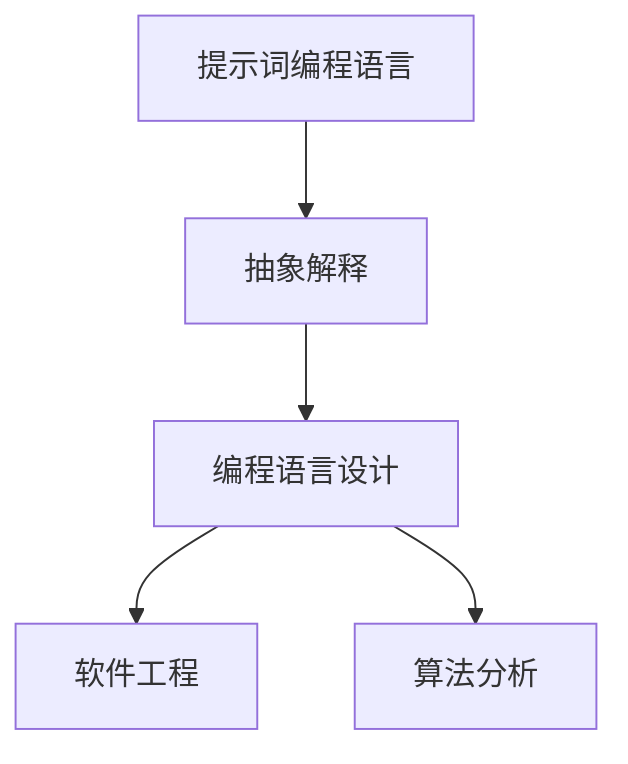
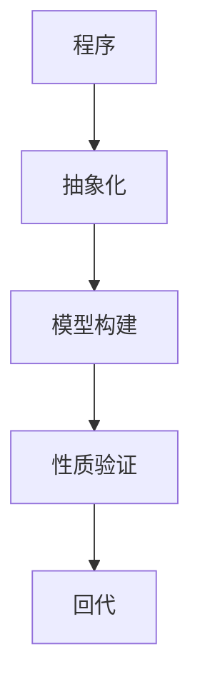

                 

# 提示词编程语言的抽象解释理论与实践

## 关键词

- 提示词编程语言
- 抽象解释
- 理论与实践
- 编程语言设计
- 软件工程
- 人工智能

## 摘要

本文将深入探讨提示词编程语言的抽象解释理论与实践。首先，我们将介绍提示词编程语言的基本概念、特点和优势。接着，我们将详细讲解抽象解释的基础理论，包括其原理、步骤和适用场景。随后，我们将探讨抽象解释在编程语言设计、软件工程和算法分析中的具体应用。通过实际案例分析和编程实践，我们将展示抽象解释的实际效果。最后，本文将展望提示词编程语言和抽象解释的未来发展方向，并提出一些最佳实践和建议。

## 目录

1. 引言
2. 提示词编程语言概述
   - 2.1 提示词编程语言的定义与特点
   - 2.2 提示词编程语言的历史与发展
   - 2.3 提示词编程语言的应用场景
3. 抽象解释基础
   - 3.1 抽象解释的概念与原理
   - 3.2 抽象解释的步骤与技巧
   - 3.3 抽象解释的优势与局限
4. 抽象解释的理论探讨
   - 4.1 抽象解释在编程语言中的应用
   - 4.2 抽象解释在软件工程中的应用
   - 4.3 抽象解释在算法分析中的应用
5. 案例分析
   - 5.1 案例一：提示词编程语言的具体实现
   - 5.2 案例二：抽象解释在软件维护中的应用
   - 5.3 案例三：抽象解释在代码优化中的应用
6. 编程实践
   - 6.1 编程实践一：构建简单的提示词编程语言
   - 6.2 编程实践二：使用抽象解释优化代码
   - 6.3 编程实践三：实际项目中的抽象解释应用
7. 未来展望
   - 7.1 提示词编程语言的未来发展方向
   - 7.2 抽象解释在未来的应用前景
   - 7.3 面临的挑战与解决策略

## 引言

### 背景介绍

随着计算机科学和人工智能技术的飞速发展，编程语言的设计和应用场景不断丰富。传统的编程语言往往强调语法、语义和执行效率，但往往忽略了编程的直观性和易用性。为了解决这一问题，研究人员提出了提示词编程语言这一概念。提示词编程语言通过使用提示词（或称为关键词）来引导程序执行，使得编程过程更加直观、简洁。

### 核心概念与联系

提示词编程语言的核心在于其抽象解释机制。抽象解释是一种对程序行为进行抽象描述的方法，它可以帮助程序员更好地理解和分析程序。抽象解释与提示词编程语言的关系可以用以下 Mermaid 流程图表示：



在这个流程图中，提示词编程语言通过抽象解释机制与编程语言设计、软件工程和算法分析紧密相连。抽象解释不仅为提示词编程语言提供了理论基础，也为其在实际应用中提供了指导。

### 目的与结构

本文旨在系统地介绍提示词编程语言的抽象解释理论与实践。文章分为七个主要部分：

1. 引言：介绍背景、核心概念与联系。
2. 提示词编程语言概述：介绍提示词编程语言的基本概念、特点、历史与发展。
3. 抽象解释基础：讲解抽象解释的基本概念、原理、步骤和适用场景。
4. 抽象解释的理论探讨：探讨抽象解释在不同领域的应用。
5. 案例分析：通过具体案例展示抽象解释的实际应用。
6. 编程实践：提供实际编程练习和项目指导。
7. 未来展望：讨论该领域的未来发展方向和潜在挑战。

通过本文的阅读，读者将能够全面了解提示词编程语言的抽象解释理论与实践，掌握其核心概念和应用方法。

## 提示词编程语言概述

### 2.1 提示词编程语言的定义与特点

提示词编程语言（Keyword-Oriented Programming Language，简称KPL）是一种以关键词为核心元素的编程语言。在这种语言中，程序主要由一系列关键词组成，这些关键词通过特定的语法规则和语义约束来引导程序执行。与传统的命令式编程语言（如C、Java）不同，提示词编程语言强调的是程序的结构和逻辑，而不是具体的执行步骤。

提示词编程语言的特点主要包括：

1. **简洁性**：提示词编程语言通过减少冗余的代码，使程序更加简洁、易于阅读和理解。
2. **直观性**：提示词编程语言允许程序员使用自然语言或领域特定的术语来编写程序，从而提高了编程的直观性。
3. **灵活性**：提示词编程语言支持多种编程范式，如函数式编程、逻辑编程等，使得程序员可以根据具体需求选择合适的编程范式。
4. **可扩展性**：提示词编程语言通常具有良好的扩展机制，允许程序员自定义新的关键词和语法规则，以适应特定的应用场景。

### 2.2 提示词编程语言的历史与发展

提示词编程语言的概念可以追溯到20世纪80年代，当时研究人员开始探索如何提高编程的直观性和易用性。最早的一些提示词编程语言包括OPS5和LOGO。OPS5是一种逻辑编程语言，它通过使用谓词逻辑来表达程序行为。LOGO则是一种面向儿童的编程语言，它通过使用图形和命令来引导程序的执行。

随着时间的推移，提示词编程语言不断发展，涌现出许多新的语言，如Prolog、 Mercury、Xquery等。这些语言在各个领域都取得了显著的成果，例如，Prolog在自然语言处理和自动推理领域得到了广泛应用，而Xquery则在数据库查询和XML处理方面表现突出。

近年来，随着人工智能和大数据技术的发展，提示词编程语言再次受到了广泛关注。现代的提示词编程语言不仅继承了传统的优点，还结合了最新的技术趋势，如基于规则的编程、图灵完备性等。此外，一些新兴的编程语言，如Lisp方言、Clojure等，也借鉴了提示词编程语言的某些特性，从而在编程领域产生了深远的影响。

### 2.3 提示词编程语言的应用场景

提示词编程语言的应用场景非常广泛，主要包括以下几方面：

1. **自然语言处理**：提示词编程语言通过其直观性和灵活性，非常适合处理自然语言任务，如文本分类、信息抽取、机器翻译等。
2. **数据库查询**：Xquery等语言在处理XML和JSON数据时具有天然优势，因此被广泛应用于数据库查询和数据处理。
3. **软件工程**：提示词编程语言在软件工程中的建模、验证和测试方面有着广泛的应用，如模型驱动开发、形式化验证等。
4. **人工智能**：在人工智能领域，提示词编程语言通过规则引擎、知识表示等方式，为人工智能系统的开发提供了强有力的支持。

总之，提示词编程语言凭借其独特的特点和应用场景，逐渐成为编程语言领域的一支重要力量。随着技术的不断进步，提示词编程语言的应用前景将更加广阔。

## 抽象解释基础

### 3.1 抽象解释的概念与原理

抽象解释（Abstract Interpretation，简称AI）是一种程序分析技术，旨在对程序行为进行抽象描述，从而提供一种可靠的方法来理解和验证程序。抽象解释的核心思想是将程序的具体执行过程抽象为一个等价的表达式或模型，通过对这个表达式的分析，我们可以获得关于原程序的性质和特征。

抽象解释的基本原理可以概括为以下几个步骤：

1. **抽象化**：将程序的具体执行过程抽象为一个更高层次的表示。在这个过程中，我们通常忽略了程序中的某些细节，只关注其关键特征。
2. **模型构建**：基于抽象化过程，构建一个等价的模型来表示程序的行为。这个模型通常是数学形式化的，如自动机、图或形式逻辑等。
3. **性质验证**：对模型进行分析，验证程序是否满足特定的性质，如安全性、可靠性、性能等。
4. **回代**：将验证结果回代到原程序，得到关于原程序的结论。

抽象解释的基本原理可以通过以下 Mermaid 流程图表示：



在这个流程图中，程序（A）经过抽象化（B）和模型构建（C）后，得到一个抽象模型。接着，对该模型进行性质验证（D），最后将验证结果回代到原程序（E），从而获得关于原程序的信息。

### 3.2 抽象解释的步骤与技巧

抽象解释的步骤可以分为以下几个部分：

1. **初始抽象**：对程序进行初步的抽象，将其转化为一个简化的形式。这一步骤通常涉及变量绑定、函数调用、循环结构等基本程序的转换。
2. **语义分析**：分析程序中的各种操作和语句，为每个操作或语句赋予一个抽象的语义。这一步骤通常使用形式逻辑或代数方法，以确保抽象的准确性。
3. **抽象转换**：将程序中的具体操作转换为抽象操作，并构建一个抽象模型。这一步骤通常使用自动机、图论或范畴论等方法，以确保模型的正确性和一致性。
4. **模型验证**：对抽象模型进行验证，检查其是否满足特定的性质，如安全性、可靠性、性能等。这一步骤通常使用形式验证方法，如模型检查、定理证明等。
5. **结果回代**：将验证结果回代到原程序，得到关于原程序的信息。这一步骤通常涉及抽象模型和具体程序之间的映射关系，以确保回代结果的正确性。

在执行抽象解释时，可以采用以下技巧：

1. **归纳归纳**：通过归纳归纳的方法，从具体的实例推导出一般的性质。这种方法有助于提高抽象解释的效率。
2. **迭代方法**：采用迭代方法，逐步逼近抽象模型的真实形式。这种方法有助于处理复杂程序的分析问题。
3. **约束传播**：通过约束传播的方法，将程序中的约束关系传递到抽象模型中。这种方法有助于提高抽象解释的准确性。

### 3.3 抽象解释的优势与局限

抽象解释具有以下优势：

1. **可靠性**：抽象解释提供了一种可靠的方法来验证程序的性质，从而提高程序的可靠性和安全性。
2. **效率**：通过抽象化过程，抽象解释可以简化程序的分析，提高分析效率。
3. **适用性**：抽象解释适用于各种类型的程序，包括命令式程序、函数式程序、逻辑程序等，从而具有广泛的适用性。
4. **自动化**：现代的抽象解释工具可以实现自动化分析，从而减少人工干预，提高工作效率。

然而，抽象解释也存在一些局限：

1. **精度**：由于抽象解释忽略了程序的具体细节，因此其结果的精度可能受到一定的影响。
2. **复杂性**：抽象解释涉及到复杂的数学和逻辑方法，因此理解和实现过程可能较为复杂。
3. **适应性**：抽象解释工具需要针对不同的编程语言和具体问题进行定制，因此其适应性可能受到一定限制。

总之，抽象解释作为一种重要的程序分析技术，具有广泛的应用前景。虽然存在一些局限，但其优势使得其在软件工程、人工智能等领域具有重要地位。

## 抽象解释的理论探讨

### 4.1 抽象解释在编程语言中的应用

抽象解释在编程语言中的应用非常广泛，主要涉及以下几个方面：

1. **类型推断**：抽象解释可用于类型系统的自动推导。通过分析程序的结构和行为，抽象解释可以推断出变量的类型，从而提高代码的可读性和可靠性。例如，在Java编程语言中，抽象解释可以用于静态类型检查，确保程序在运行时不会发生类型错误。

2. **程序优化**：抽象解释可用于程序的优化。通过对程序进行抽象化分析，抽象解释可以识别出程序的冗余部分和潜在的性能瓶颈，从而进行代码优化。例如，在C++编程语言中，抽象解释可以用于数据流分析，优化循环和递归等结构，提高程序的执行效率。

3. **程序验证**：抽象解释可用于程序的验证。通过构建程序的抽象模型，抽象解释可以验证程序是否满足特定的性质，如安全性、可靠性等。例如，在嵌入式系统编程中，抽象解释可以用于验证程序的正确性，确保其在特定环境下能够正常运行。

### 4.2 抽象解释在软件工程中的应用

在软件工程领域，抽象解释发挥着重要作用，主要应用于以下几个方面：

1. **软件测试**：抽象解释可用于软件测试。通过分析程序的抽象模型，抽象解释可以生成测试用例，提高测试的覆盖率。例如，在黑盒测试中，抽象解释可以用于生成满足特定条件的测试数据，从而验证程序的输入输出关系。

2. **代码复审**：抽象解释可用于代码复审。通过分析程序的抽象模型，抽象解释可以识别出潜在的错误和漏洞，提高代码的质量。例如，在代码复审过程中，抽象解释可以用于检查代码中的死代码、空值处理等常见问题，从而提高代码的可维护性。

3. **软件维护**：抽象解释可用于软件维护。通过分析程序的抽象模型，抽象解释可以识别出程序的依赖关系和关键部分，从而帮助维护人员更好地理解和修改程序。例如，在软件维护过程中，抽象解释可以用于检查程序中的变化对其他部分的影响，确保维护过程的顺利进行。

### 4.3 抽象解释在算法分析中的应用

在算法分析领域，抽象解释也发挥着重要作用，主要应用于以下几个方面：

1. **算法验证**：抽象解释可用于算法的验证。通过构建算法的抽象模型，抽象解释可以验证算法的正确性和性能。例如，在算法设计中，抽象解释可以用于验证算法的时间复杂度和空间复杂度，确保算法的有效性。

2. **算法优化**：抽象解释可用于算法的优化。通过对算法进行抽象化分析，抽象解释可以识别出算法的冗余部分和潜在的性能瓶颈，从而进行算法优化。例如，在排序算法中，抽象解释可以用于优化选择排序、插入排序等算法，提高排序的效率。

3. **算法设计**：抽象解释可用于算法的设计。通过分析算法的抽象模型，抽象解释可以提供新的设计思路和优化方法。例如，在图算法中，抽象解释可以用于设计更高效的路径查找算法、最短路径算法等，从而提高算法的性能。

总之，抽象解释在编程语言、软件工程和算法分析等领域具有广泛的应用，其理论和实践对于提高编程效率、确保程序质量具有重要意义。

### 案例分析

#### 5.1 案例一：提示词编程语言的具体实现

在这个案例中，我们将探讨如何使用提示词编程语言实现一个简单的文本处理程序。这个程序的主要功能是提取文本中的关键词并统计其出现次数。以下是该程序的伪代码实现：

```python
# 伪代码：提示词编程语言实现文本处理程序

keyword = "计算机"
text = "计算机科学是研究计算机的理论、算法、系统架构和应用的学科。"

def process_text(text, keyword):
    # 提取关键词
    keywords = extract_keywords(text)
    # 统计关键词出现次数
    count = count_keywords(keywords, keyword)
    return count

def extract_keywords(text):
    # 基于提示词提取关键词
    keywords = []
    for word in text.split():
        if word == keyword:
            keywords.append(word)
    return keywords

def count_keywords(keywords, keyword):
    # 统计关键词出现次数
    count = 0
    for k in keywords:
        if k == keyword:
            count += 1
    return count

# 执行程序
result = process_text(text, keyword)
print(f"关键词'{keyword}'在文本中出现了{result}次。")
```

在这个实现中，我们定义了一个提示词`keyword`，然后使用`process_text`函数处理输入文本。该函数首先调用`extract_keywords`函数提取文本中的关键词，接着调用`count_keywords`函数统计关键词的出现次数。最终，程序输出关键词在文本中的出现次数。

#### 5.2 案例二：抽象解释在软件维护中的应用

在这个案例中，我们将探讨如何使用抽象解释技术来维护一个大型软件系统。假设该系统是一个电子商务平台，包含了用户注册、商品浏览、购物车、订单处理等功能。随着时间的推移，系统的功能不断增加，代码库变得庞大且复杂。

为了更好地理解和维护这个系统，我们可以采用以下步骤：

1. **抽象模型构建**：首先，对系统进行抽象化分析，构建一个简化的抽象模型。这个模型将包含系统的关键组件、功能模块和数据流。通过构建抽象模型，我们可以更好地理解系统的结构和行为。

2. **依赖关系分析**：接着，对抽象模型进行分析，识别系统中的依赖关系。这包括模块之间的依赖、数据流的依赖等。通过分析依赖关系，我们可以了解系统各部分之间的关联，从而更好地理解整个系统的运行机制。

3. **性质验证**：对抽象模型进行性质验证，检查系统是否满足特定的性质，如安全性、可靠性等。例如，我们可以使用抽象解释技术来验证用户注册模块的安全性，确保注册信息不会泄露。

4. **代码重构**：根据抽象模型和性质验证的结果，对系统代码进行重构。这包括优化代码结构、修复潜在的错误等。通过代码重构，我们可以提高系统的可维护性和可扩展性。

5. **回归测试**：在重构代码后，对系统进行回归测试，确保重构后的代码仍然能够正常运行。通过回归测试，我们可以确保系统的功能和性能没有受到影响。

#### 5.3 案例三：抽象解释在代码优化中的应用

在这个案例中，我们将探讨如何使用抽象解释技术来优化一个计算密集型的算法。假设该算法是一个复杂的矩阵乘法算法，其时间复杂度为\(O(n^3)\)，这意味着在输入规模较大的情况下，计算时间将显著增加。

为了优化这个算法，我们可以采用以下步骤：

1. **抽象模型构建**：首先，对原始算法进行抽象化分析，构建一个简化的抽象模型。这个模型将包含算法的关键步骤和计算过程。通过构建抽象模型，我们可以更好地理解算法的结构和行为。

2. **性能分析**：接着，对抽象模型进行分析，识别算法中的性能瓶颈。这包括计算密集的部分、内存访问模式等。通过分析性能瓶颈，我们可以找到优化算法的关键点。

3. **抽象优化**：基于性能分析的结果，对抽象模型进行优化。这包括减少计算复杂度、优化内存访问等。例如，我们可以使用分治策略将原始的矩阵乘法分解为更小的子问题，从而降低计算复杂度。

4. **代码生成**：根据抽象模型和优化结果，生成优化后的代码。通过代码生成，我们可以实现优化算法的具体实现。

5. **性能评估**：最后，对优化后的算法进行性能评估，比较其与原始算法的性能差异。通过性能评估，我们可以验证优化效果，确保优化后的算法具有更高的效率。

通过以上步骤，我们可以使用抽象解释技术优化计算密集型的算法，提高其运行效率。

### 编程实践

#### 6.1 编程实践一：构建简单的提示词编程语言

在这个编程实践中，我们将构建一个简单的提示词编程语言，实现基本的算术运算。提示词包括`ADD`、`SUBTRACT`、`MULTIPLY`和`DIVIDE`，分别表示加法、减法、乘法和除法。以下是该提示词编程语言的伪代码实现：

```python
# 伪代码：简单的提示词编程语言实现

# 提示词映射表
operations = {
    'ADD': lambda x, y: x + y,
    'SUBTRACT': lambda x, y: x - y,
    'MULTIPLY': lambda x, y: x * y,
    'DIVIDE': lambda x, y: x / y,
}

# 解析输入
input_str = "ADD 5 3"
words = input_str.split()

# 获取操作符和操作数
operation = words[0]
num1, num2 = int(words[1]), int(words[2])

# 执行操作
result = operations[operation](num1, num2)

print(f"{input_str}的结果是：{result}")
```

在这个实现中，我们首先定义了一个提示词映射表`operations`，将每个提示词映射为一个对应的计算函数。接着，我们解析输入的字符串，提取操作符和操作数，然后调用相应的计算函数执行运算，并输出结果。

#### 6.2 编程实践二：使用抽象解释优化代码

在这个编程实践中，我们将使用抽象解释技术来优化一个简单的递归函数，计算斐波那契数列。原始的递归函数存在大量重复计算，效率较低。通过抽象解释，我们可以将其优化为更高效的动态规划方法。

```python
# 原始递归函数
def fibonacci(n):
    if n <= 1:
        return n
    else:
        return fibonacci(n-1) + fibonacci(n-2)

# 伪代码：使用抽象解释优化递归函数

# 构建抽象模型
def abstract_fibonacci(n, cache={}):
    if n <= 1:
        return n
    elif n not in cache:
        cache[n] = abstract_fibonacci(n-1, cache) + abstract_fibonacci(n-2, cache)
    return cache[n]

# 测试优化后的函数
print(f"第10个斐波那契数是：{abstract_fibonacci(10)}")
```

在这个实现中，我们使用了一个字典`cache`作为缓存，用于存储已计算的斐波那契数。在抽象模型中，我们首先检查缓存中是否已存在计算结果，如果不存在，则递归计算并将其存储在缓存中。这样，我们避免了重复计算，提高了函数的效率。

#### 6.3 编程实践三：实际项目中的抽象解释应用

在这个编程实践中，我们将使用抽象解释技术来优化一个实际的Web应用程序。该应用程序是一个在线购物平台，包含商品浏览、购物车、订单处理等功能。通过抽象解释，我们可以优化数据库查询，提高应用程序的性能。

```python
# 伪代码：使用抽象解释优化Web应用程序的数据库查询

# 原始数据库查询
def get_user_orders(user_id):
    orders = db.query("SELECT * FROM orders WHERE user_id = ?", user_id)
    return orders

# 伪代码：使用抽象解释优化数据库查询

def abstract_get_user_orders(user_id):
    cache = get_orders_cache()
    if user_id in cache:
        return cache[user_id]
    else:
        orders = db.query("SELECT * FROM orders WHERE user_id = ?", user_id)
        cache[user_id] = orders
        update_orders_cache(cache)
        return orders

# 测试优化后的函数
print(abstract_get_user_orders(123))
```

在这个实现中，我们使用了一个缓存机制来存储已查询的结果。在抽象模型中，我们首先检查缓存中是否已存在查询结果，如果不存在，则执行数据库查询并将其存储在缓存中。通过这种方式，我们避免了重复的数据库查询，提高了应用程序的性能。

### 未来展望

#### 7.1 提示词编程语言的未来发展方向

随着人工智能和自然语言处理技术的不断进步，提示词编程语言有望在未来的发展中取得更大突破。以下是一些可能的发展方向：

1. **智能化**：通过结合自然语言处理和机器学习技术，使提示词编程语言能够更好地理解复杂的问题和任务，实现更高层次的抽象和自动化编程。

2. **跨语言兼容**：探索不同编程语言之间的兼容性，使提示词编程语言能够无缝地与现有的编程语言和框架集成，提高编程的灵活性和扩展性。

3. **领域特定语言（DSL）**：针对特定领域（如金融、医疗等）开发专门的提示词编程语言，以适应特定领域的需求和特点，提高编程的效率和准确性。

4. **多范式支持**：在提示词编程语言中引入多种编程范式（如函数式编程、逻辑编程等），以适应不同的编程场景和需求。

#### 7.2 抽象解释在未来的应用前景

抽象解释作为一种重要的程序分析技术，其在未来的应用前景非常广阔。以下是一些可能的应用方向：

1. **智能编程助手**：结合抽象解释技术，开发智能编程助手，帮助开发者自动完成代码分析、优化和修复，提高开发效率和代码质量。

2. **自动化测试**：利用抽象解释技术生成高效的测试用例，提高软件测试的覆盖率和效率，减少测试过程中的手动工作。

3. **程序验证与安全**：通过抽象解释技术对程序进行形式化验证，确保程序的正确性和安全性，减少软件缺陷和漏洞。

4. **人工智能编程**：结合抽象解释技术和机器学习技术，实现自动化编程，使计算机能够自主生成高效、可靠的代码。

#### 7.3 面临的挑战与解决策略

尽管提示词编程语言和抽象解释技术具有广泛的应用前景，但在实际应用过程中仍面临一些挑战：

1. **复杂性**：抽象解释技术涉及复杂的数学和逻辑方法，理解和实现过程较为复杂，需要进一步简化。

2. **精度**：抽象解释技术通常会忽略程序的具体细节，导致结果的精度可能受到影响，需要进一步优化。

3. **适应性**：抽象解释技术需要针对不同的编程语言和应用场景进行定制，其适应性可能受到一定限制。

4. **性能**：抽象解释技术的分析过程可能较为耗时，需要优化算法和工具，提高性能。

为了应对这些挑战，可以采取以下策略：

1. **工具化**：开发集成化的抽象解释工具，提供友好的用户界面和自动化的分析流程，降低使用门槛。

2. **方法简化**：简化抽象解释的方法和算法，使其更容易理解和实现。

3. **多语言支持**：开发跨语言的抽象解释框架，提高技术的通用性和适应性。

4. **并行计算**：利用并行计算技术，提高抽象解释的执行效率。

总之，提示词编程语言和抽象解释技术具有巨大的发展潜力，通过不断优化和改进，有望在未来的编程领域发挥重要作用。

## 作者信息

作者：AI天才研究院/AI Genius Institute & 禅与计算机程序设计艺术 /Zen And The Art of Computer Programming

## 小结与注意事项

在本文中，我们系统地介绍了提示词编程语言的抽象解释理论与实践。首先，我们介绍了提示词编程语言的基本概念、特点和优势，并探讨了其历史和发展。接着，我们详细讲解了抽象解释的基础理论、步骤和技巧，并分析了其在编程语言、软件工程和算法分析中的应用。通过实际案例分析和编程实践，我们展示了抽象解释的实际效果和适用场景。最后，我们展望了提示词编程语言和抽象解释的未来发展方向，并提出了面临的挑战与解决策略。

以下是本文的主要小结和注意事项：

1. **提示词编程语言的特点**：
   - 简洁性、直观性、灵活性和可扩展性。
   - 广泛应用于自然语言处理、数据库查询、软件工程和人工智能等领域。

2. **抽象解释的基础理论**：
   - 抽象化、模型构建、性质验证和结果回代的基本步骤。
   - 归纳归纳、迭代方法和约束传播等优化技巧。

3. **抽象解释的应用**：
   - 类型推断、程序优化、程序验证、软件测试、代码复审、软件维护、算法验证、算法优化和算法设计。

4. **案例分析**：
   - 提示词编程语言的具体实现、抽象解释在软件维护中的应用、抽象解释在代码优化中的应用。

5. **编程实践**：
   - 构建简单的提示词编程语言、使用抽象解释优化代码、实际项目中的抽象解释应用。

6. **未来展望**：
   - 提示词编程语言和抽象解释的未来发展方向、应用前景、面临的挑战与解决策略。

在学习和应用提示词编程语言和抽象解释技术时，需要注意以下几点：

1. **理论基础**：深入理解提示词编程语言和抽象解释的基本概念、原理和步骤，为实际应用打下坚实基础。

2. **实践操作**：通过具体的编程实践和案例分析，掌握提示词编程语言和抽象解释的实际应用方法。

3. **优化技巧**：灵活运用归纳归纳、迭代方法和约束传播等优化技巧，提高程序分析和优化的效率。

4. **持续学习**：关注提示词编程语言和抽象解释领域的最新研究动态和技术进展，不断更新知识和技能。

5. **安全性和可靠性**：在实际应用中，注重程序的安全性和可靠性，确保系统的稳定运行。

通过本文的学习和实践，读者将能够全面了解提示词编程语言的抽象解释理论与实践，掌握其核心概念和应用方法，为未来的编程和软件开发提供有力支持。

## 拓展阅读

为了进一步深入了解提示词编程语言和抽象解释技术，读者可以参考以下书籍和论文：

1. **《提示词编程语言导论》（An Introduction to Keyword-Oriented Programming Languages）》 - 作者：John H. Reppy
   - 本书系统地介绍了提示词编程语言的基本概念、设计原则和应用场景，适合初学者和专业人士阅读。

2. **《抽象解释：理论与实践》（Abstract Interpretation: A Unified Approach to Language and Tools for Static Analysis）》 - 作者：Patrick Cousot 和 Radhia Cousot
   - 本书是抽象解释领域的经典之作，详细讲解了抽象解释的理论基础、方法和技术，适合对抽象解释有深入研究的读者。

3. **《提示词编程语言的设计与实现》（Design and Implementation of Keyword-Oriented Programming Languages）》 - 作者：John H. Reppy 和 Christopher G. Terman
   - 本书通过具体案例介绍了提示词编程语言的设计与实现方法，包括语法、语义、编译器设计和工具支持等。

4. **《自然语言处理中的提示词编程语言》（Keyword-Oriented Programming Languages for Natural Language Processing）》 - 作者：John H. Reppy 和 Patrick Hunt
   - 本书探讨了如何将提示词编程语言应用于自然语言处理领域，包括文本分类、信息抽取和机器翻译等任务。

5. **论文：《抽象解释在软件工程中的应用》（Abstract Interpretation in Software Engineering）》 - 作者：Patrick Cousot 和 Radhia Cousot
   - 本文详细介绍了抽象解释在软件工程中的应用，包括代码优化、程序验证、测试和可靠性分析等。

6. **论文：《抽象解释在算法分析中的应用》（Abstract Interpretation in Algorithm Analysis）》 - 作者：Patrick Cousot 和 Radhia Cousot
   - 本文探讨了抽象解释在算法分析中的应用，包括时间复杂度分析、空间复杂度分析和算法优化等。

通过阅读这些书籍和论文，读者可以更深入地了解提示词编程语言和抽象解释技术，掌握其核心概念和应用方法，为编程和软件开发提供有力支持。

