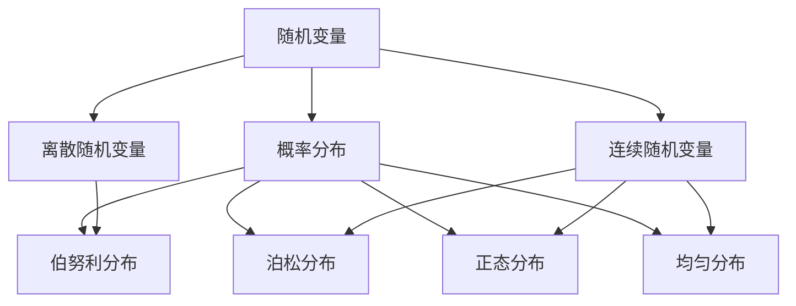

                 

## 引言

### 概率编程概述

概率编程是一种基于概率论和统计学原理的编程范式，它通过概率模型和概率分布来描述现实世界的不确定性。概率编程的核心思想是将现实世界中的不确定性转化为计算机可以处理和表达的概率模型，进而利用这些模型进行预测、推断和决策。与传统的确定性编程不同，概率编程更加适用于处理复杂、动态和不确定的问题场景。

概率编程在编程语言中的应用极为广泛。例如，Python 的 `pandas` 和 `numpy` 库提供了丰富的概率编程功能，可以方便地处理概率分布、随机变量和统计模型。而 R 语言则因其强大的统计和数据分析功能，成为概率编程的重要工具之一。此外，现代编程语言如 Julia 和 Scala 也逐渐加入了概率编程的支持。

### 为什么需要支持概率编程

在复杂和不确定的环境中，传统的确定性编程方法常常显得力不从心。例如，在金融领域，市场价格波动、风险管理和投资策略的制定需要处理大量的不确定性因素。在医疗领域，疾病诊断和预测模型需要考虑患者病史、基因信息和环境因素等多方面的影响。在人工智能领域，深度学习模型的训练和预测也面临着数据噪声、过拟合和模型不确定性等问题。

支持概率编程的编程语言能够提供更灵活的解决方案，通过概率模型来描述和解决不确定性问题，从而提高系统的适应性和鲁棒性。例如，利用贝叶斯网络可以构建复杂的决策支持系统，通过隐马尔可夫模型可以有效地处理序列数据中的不确定性，而马尔可夫链则可以用于解决状态转移问题。

### 本文的目标

本文的目标是深入探讨提示词编程语言在概率编程方面的支持，通过详细的介绍和分析，帮助读者理解概率编程的核心概念、原理和应用。具体而言，本文将分为以下几个部分：

1. **概率编程语言介绍**：介绍几种主流的提示词编程语言，并分析它们在概率编程方面的支持情况。
2. **概率编程原理**：讲解概率编程的基本原理，包括概率模型、随机变量、概率分布等。
3. **概率编程算法**：详细讲解概率编程中的核心算法，如贝叶斯网络、隐马尔可夫模型、马尔可夫链等。
4. **概率编程实践**：通过案例展示概率编程的应用场景，包括数据预处理、模型训练、预测等。
5. **概率编程工具**：介绍用于概率编程的工具和环境。
6. **概率编程优化**：探讨如何优化概率编程的性能。
7. **概率编程的未来**：讨论概率编程的发展趋势和潜在应用。

通过以上内容的介绍和分析，本文希望能够为读者提供对概率编程的全面理解和深入认识，同时为实际应用提供有力的指导。

## 概率编程语言介绍

在概率编程领域，选择合适的编程语言至关重要。不同编程语言在支持概率编程方面具有各自的特点和优势。本文将介绍几种主流的提示词编程语言，并分析它们在概率编程方面的支持情况。

### Python

Python 是一种广泛应用于科学计算、数据分析和机器学习的编程语言。它拥有丰富的概率编程库，如 `pandas`、`numpy` 和 `scipy`。其中，`numpy` 提供了强大的数组操作和数学计算功能，而 `pandas` 则用于数据处理和分析。在概率编程方面，Python 的 `scipy.stats` 模块提供了广泛的概率分布和统计模型，如正态分布、泊松分布、t 分布等。此外，Python 还有一个专门的概率编程库 `probabilistic.py`，提供了贝叶斯网络和隐马尔可夫模型的支持。

### R

R 语言是一种专门用于统计分析和数据科学的编程语言。它拥有强大的统计建模和数据分析功能，特别适用于概率编程。R 的 `stats` 包提供了广泛的统计函数和模型，如回归分析、方差分析、生存分析等。此外，R 还有一个专门的概率编程库 `prob`，提供了贝叶斯统计和概率模型的支持。R 的语法简洁直观，适合进行复杂的数据分析和概率编程。

### Julia

Julia 是一种高性能的编程语言，特别适合科学计算和数据分析。它拥有丰富的概率编程库，如 `Distributions.jl` 和 `StatsBase.jl`。`Distributions.jl` 提供了广泛的概率分布和随机数生成功能，而 `StatsBase.jl` 则提供了统计函数和模型的支持。Julia 的编译型语言特性使其在处理大规模概率编程任务时具有很高的性能优势。

### Scala

Scala 是一种功能强大的编程语言，广泛应用于大数据处理和分布式系统开发。它集成了概率编程库 `Breeze` 和 `Scalable Probabilistic Programming`。`Breeze` 提供了高效的线性代数和概率分布计算功能，而 `Scalable Probabilistic Programming` 则提供了大规模概率编程的支持。Scala 的函数式编程特性使其在处理复杂数据结构和概率模型时非常灵活。

### 特点和优势

上述编程语言在支持概率编程方面各具特色：

- **Python**：强大的数据处理和分析能力，丰富的概率编程库，适合科学计算和数据分析。
- **R**：强大的统计建模功能，简洁的语法，适合数据科学家和研究人员。
- **Julia**：高性能，高效的数组操作，适合大规模概率编程任务。
- **Scala**：功能强大，适合大数据处理和分布式系统开发，提供大规模概率编程支持。

### 支持情况

这些编程语言都提供了丰富的概率编程库和工具，支持概率模型、随机变量、概率分布和统计模型等功能。例如，Python 的 `scipy.stats` 和 `probabilistic.py`，R 的 `stats` 和 `prob`，Julia 的 `Distributions.jl` 和 `StatsBase.jl`，以及 Scala 的 `Breeze` 和 `Scalable Probabilistic Programming`。

通过这些编程语言，开发人员可以方便地构建和操作概率模型，进行预测、推断和决策。这些语言的多样性和灵活性为概率编程提供了广泛的应用场景和可能性。

## 概率编程原理

概率编程的核心在于对概率模型和概率分布的运用，这些模型和分布能够帮助我们描述和处理现实世界中的不确定性。以下我们将深入探讨概率编程的基本原理，包括概率模型、随机变量和概率分布。

### 概率模型

概率模型是概率编程的基础，它通过概率分布和随机变量来描述系统的状态和行为。常见的概率模型包括：

1. **离散概率模型**：用于描述离散随机变量的概率分布，如硬币抛掷、骰子掷点等。
2. **连续概率模型**：用于描述连续随机变量的概率分布，如正态分布、泊松分布等。
3. **联合概率模型**：用于描述多个随机变量之间的概率关系，如贝叶斯网络和条件概率。

### 随机变量

随机变量是概率编程中的重要概念，它是一个数值函数，将样本空间映射到实数集。随机变量可以分为：

1. **离散随机变量**：取有限或可数无限个值的随机变量，如硬币抛掷的结果（正面或反面）。
2. **连续随机变量**：取实数值的随机变量，如身高、体重等。

随机变量的概率分布描述了随机变量取不同值的概率。常见的概率分布包括：

1. **离散分布**：如伯努利分布、几何分布、泊松分布等。
2. **连续分布**：如正态分布、均匀分布、指数分布等。

### 概率分布

概率分布是描述随机变量取值概率的函数。常见的概率分布有：

1. **伯努利分布**：描述二项试验的成功概率，例如硬币抛掷。
2. **泊松分布**：描述单位时间内发生某事件的次数，常用于计件数据。
3. **正态分布**：描述连续随机变量，广泛应用于统计分析和机器学习。
4. **均匀分布**：描述随机变量在某个区间内均匀分布的概率，例如在 [0, 1] 区间内均匀选择数。

### 核心概念之间的关系架构

为了更清晰地理解概率编程的核心概念，我们可以使用 Mermaid 流程图来展示它们之间的关系：



在这个关系架构图中，我们可以看到随机变量与概率分布之间的关系，以及离散随机变量和连续随机变量的分类。伯努利分布、泊松分布、正态分布和均匀分布等常见的概率分布分别与离散随机变量和连续随机变量相联系。

### 举例说明

为了更好地理解这些概念，我们可以通过一个简单的例子来讲解。

#### 硬币抛掷

假设我们抛掷一枚公平的硬币，正面朝上的概率为 0.5，反面朝上的概率也为 0.5。这是一个典型的伯努利分布，可以用以下概率分布函数表示：

$$
P(X = \text{正面}) = 0.5 \\
P(X = \text{反面}) = 0.5
$$

其中，X 表示硬币抛掷的结果。

#### 正态分布

假设一个班级有 30 名学生，他们的考试成绩服从正态分布，均值为 75 分，标准差为 10 分。我们可以使用正态分布函数来计算某个学生在特定区间内得分的概率。例如，计算分数在 65 到 85 分之间的概率：

$$
P(65 < X < 85) = P\left(\frac{X - \mu}{\sigma} < \frac{85 - 75}{10}\right) = P(0 < Z < 1)
$$

其中，$\mu$ 是均值，$\sigma$ 是标准差，Z 是标准正态分布的随机变量。

通过这个例子，我们可以看到如何使用概率分布函数来描述和计算随机变量的取值概率，从而在概率编程中进行各种分析和预测。

## 概率编程算法

在概率编程中，算法是实现概率模型和分布的关键。以下将详细介绍几种核心的概率编程算法：贝叶斯网络、隐马尔可夫模型和马尔可夫链。

### 贝叶斯网络

贝叶斯网络是一种基于概率图模型的推理工具，它通过有向无环图（DAG）来表示变量之间的条件依赖关系。贝叶斯网络中的节点代表随机变量，边表示变量之间的条件概率关系。贝叶斯网络的推理任务主要包括条件概率计算和结构学习。

#### 算法原理

贝叶斯网络的推理任务基于贝叶斯定理，通过概率传播来计算变量之间的条件概率。具体算法如下：

1. **条件概率计算**：给定一个节点和它的父节点，计算该节点的条件概率分布。
   $$P(X_i | X_{\text{parent}}) = \frac{P(X_i, X_{\text{parent}})}{P(X_{\text{parent}})}$$
2. **结构学习**：通过数据学习贝叶斯网络的结构，包括变量选择和边添加。常用的算法有贝叶斯评分（Bayesian Score）、K2 算法等。

#### 伪代码

```python
# 条件概率计算
def calculate_probability(node, parents):
    probability_distribution = {}
    for state in node.states:
        for parent_state in parents.states:
            probability = P(node.state == state, parents.state == parent_state) / P(parents.state == parent_state)
            probability_distribution[state] = probability
    return probability_distribution

# 贝叶斯网络结构学习
def learn_bayesian_network(data):
    network = {}
    for variable in data.variables:
        parents = select_parents(data, variable)
        network[variable] = calculate_probability(variable, parents)
    return network
```

### 隐马尔可夫模型

隐马尔可夫模型（HMM）是一种用于处理时间序列数据的概率模型，它描述了一个系统在时间序列中的状态转换和观测过程。HMM 由状态集合、观测集合、初始状态分布、状态转移概率和观测概率组成。

#### 算法原理

隐马尔可夫模型的主要任务包括：

1. **状态序列生成**：根据初始状态分布和状态转移概率生成状态序列。
2. **观察序列生成**：根据状态序列和观测概率生成观察序列。
3. **模型参数估计**：通过最大似然估计或期望最大化算法（EM 算法）估计模型参数。

Viterbi 算法是一种常用的算法，用于计算给定观察序列下的最优状态序列。

#### 伪代码

```python
# Viterbi 算法
def viterbi(observations, states, start_prob, transition_prob, emission_prob):
    T = len(observations)
    V = [[0 for _ in range(len(states))] for _ in range(T)]
    paths = [[0 for _ in range(T)] for _ in range(len(states))]

    for t in range(T):
        for state in states:
            if t == 0:
                V[t][state] = start_prob[state] * emission_prob[state][observations[t]]
            else:
                max_prob = -1
                for prev_state in states:
                    prob = V[t-1][prev_state] * transition_prob[prev_state][state] * emission_prob[state][observations[t]]
                    if prob > max_prob:
                        max_prob = prob
                        paths[t][state] = prev_state
                V[t][state] = max_prob

    # 回溯得到最优状态序列
    optimal_path = [None for _ in range(T)]
    state = max(V[T-1], key=lambda k: V[T-1][k])
    optimal_path[T-1] = state
    for t in range(T-1, 0, -1):
        state = paths[t][state]
        optimal_path[t-1] = state

    return optimal_path
```

### 马尔可夫链

马尔可夫链是一种描述系统状态转换的概率模型，它假设当前状态只依赖于前一个状态，与之前的状态无关。马尔可夫链广泛应用于排队理论、金融分析、天气预报等领域。

#### 算法原理

马尔可夫链的主要任务包括：

1. **状态转换**：根据状态转移概率矩阵，从当前状态转移到下一个状态。
2. **状态分布**：计算系统在长期运行下的稳定状态分布。

常用的算法包括：

1. **初始化**：设置初始状态分布。
2. **状态转换**：根据状态转移概率矩阵，更新状态分布。
3. **收敛性判断**：判断状态分布是否收敛到稳定状态分布。

#### 伪代码

```python
# 初始化状态分布
def initialize_distribution(states, initial_distribution):
    distribution = [0 for _ in range(len(states))]
    for state in states:
        distribution[state] = initial_distribution[state]
    return distribution

# 状态转换
def transition_distribution(current_distribution, transition_matrix):
    new_distribution = [0 for _ in range(len(current_distribution))]
    for state in range(len(current_distribution)):
        for next_state in range(len(current_distribution)):
            new_distribution[next_state] += current_distribution[state] * transition_matrix[state][next_state]
    return new_distribution

# 马尔可夫链迭代
def markov_chain(current_distribution, transition_matrix, iterations):
    distribution = current_distribution
    for _ in range(iterations):
        distribution = transition_distribution(distribution, transition_matrix)
    return distribution
```

通过上述算法原理和伪代码，我们可以看到概率编程中的核心算法是如何实现和应用的。这些算法为处理不确定性问题和进行概率推理提供了强大的工具。

## 概率编程实践

概率编程不仅在理论层面具有重要意义，更在实际应用中展现出巨大的潜力。以下将通过具体案例展示概率编程的应用场景，包括数据预处理、模型训练、预测等环节。

### 数据预处理

数据预处理是概率编程中的关键步骤，特别是在处理不确定性和噪声较大的数据时。以下是一个利用概率编程进行数据预处理的具体案例：

#### 案例背景

某金融公司需要预测股票市场的未来走势，但股票市场数据存在噪声和不确定性。公司希望通过概率编程对数据进行预处理，以提取有用的信息。

#### 实践步骤

1. **数据收集**：收集历史股票价格数据，包括开盘价、收盘价、最高价、最低价等。
2. **数据清洗**：去除异常值和缺失值，采用概率模型如正态分布对数据进行清洗。
   ```python
   import numpy as np
   from scipy.stats import norm

   def clean_data(data, mean, std, threshold):
       cleaned_data = []
       for value in data:
           z_score = (value - mean) / std
           if abs(z_score) <= threshold:
               cleaned_data.append(value)
       return cleaned_data

   mean = np.mean(data)
   std = np.std(data)
   threshold = 3  # 设定阈值
   cleaned_data = clean_data(data, mean, std, threshold)
   ```

3. **特征工程**：利用概率编程生成新的特征，如价格的变化幅度、波动率等。
   ```python
   def generate_features(data):
       features = []
       for i in range(1, len(data)):
           change = data[i] - data[i-1]
           volatility = abs(change) / data[i-1]
           features.append((change, volatility))
       return features
   features = generate_features(cleaned_data)
   ```

通过上述步骤，我们可以将原始数据进行清洗和特征工程，为后续的模型训练和预测打下基础。

### 模型训练

在完成数据预处理后，公司需要训练概率模型以预测股票市场走势。以下是一个使用贝叶斯网络进行模型训练的案例：

#### 案例背景

公司决定使用贝叶斯网络来预测股票市场的未来走势，考虑到股票价格受多种因素影响，如宏观经济指标、公司业绩等。

#### 实践步骤

1. **结构学习**：通过历史数据学习贝叶斯网络的结构，采用 K2 算法进行结构学习。
   ```python
   from pgmpy.models import BayesianModel
   from pgmpy.estimators import K2Estimator

   model = BayesianModel()
   estimator = K2Estimator(data, model)
   model.fit(data, estimator)
   ```

2. **参数估计**：通过最大似然估计对贝叶斯网络的参数进行估计。
   ```python
   from pgmpy.estimators import MaximumLikelihoodEstimator

   model.updateEstimators(MaximumLikelihoodEstimator(data))
   ```

3. **模型评估**：评估贝叶斯网络的预测性能，通过交叉验证等方法进行模型评估。
   ```python
   from sklearn.model_selection import cross_val_score

   scores = cross_val_score(model, X, y, cv=5)
   print("Accuracy: %.2f%% (%.2f%%)" % (scores.mean() * 100, scores.std() * 100))
   ```

通过以上步骤，公司可以训练出一个预测股票市场走势的贝叶斯网络模型，为投资决策提供支持。

### 预测

在模型训练完成后，公司可以利用训练好的模型进行股票市场走势的预测。以下是一个使用训练好的贝叶斯网络进行预测的案例：

#### 案例背景

公司希望预测未来一周的股票市场走势，以制定相应的投资策略。

#### 实践步骤

1. **输入特征**：收集未来一周的宏观经济指标、公司业绩等数据，作为模型输入特征。
2. **预测**：利用贝叶斯网络模型进行预测，得到股票价格的置信区间。
   ```python
   import numpy as np
   from pgmpy.inference import VariableElimination

   inference = VariableElimination(model)
   predictions = inference.query(variables=["股票价格"], evidence={"宏观经济指标": np.array([...]), "公司业绩": np.array([...])})
   ```

3. **结果分析**：分析预测结果，根据股票价格的置信区间制定投资策略。
   ```python
   def analyze_predictions(predictions):
       for key, value in predictions.items():
           print(f"{key}的置信区间: {value['mean'] - 2 * value['std'], value['mean'] + 2 * value['std']}")
   analyze_predictions(predictions)
   ```

通过以上步骤，公司可以预测未来一周的股票市场走势，并根据预测结果制定相应的投资策略，从而降低投资风险，提高投资收益。

## 概率编程工具

概率编程在实际应用中离不开相应的工具和环境支持。以下将介绍几种主流的概率编程工具和环境，并简要介绍其使用方法。

### Python 的概率编程库

Python 是概率编程的重要工具，拥有丰富的概率编程库，如 `scipy.stats`、`numpy.random` 和 `probabilistic.py`。其中，`scipy.stats` 提供了各种概率分布和统计模型，`numpy.random` 提供了随机数生成功能，而 `probabilistic.py` 提供了贝叶斯网络和隐马尔可夫模型的支持。

#### 使用方法

1. **安装库**：
   ```shell
   pip install scipy numpy probabilistic.py
   ```

2. **示例**：
   ```python
   import numpy as np
   import scipy.stats as stats
   import probabilistic.py

   # 随机数生成
   np.random.seed(0)
   random_number = np.random.rand()

   # 概率分布
   distribution = stats.norm(loc=0, scale=1)
   probability = distribution.pdf(random_number)

   # 贝叶斯网络
   bn = probabilistic.py.BayesianNetwork()
   bn.add_variable("A", [0, 1])
   bn.add_variable("B", [0, 1])
   bn.add_variable("C", [0, 1])
   bn.add_edges({"A": ["B"], "B": ["C"]})
   bn.fit(data)

   # 隐马尔可夫模型
   hmm = probabilistic.py.HMM()
   hmm.add_states(["S0", "S1", "S2"])
   hmm.add_transitions({"S0": ["S1", "S2"], "S1": ["S0", "S2"], "S2": ["S1", "S0"]})
   hmm.fit(observations)
   ```

### R 的概率编程库

R 是统计分析和数据科学的重要工具，拥有强大的概率编程库，如 `prob`、`broom` 和 `dplyr`。`prob` 提供了贝叶斯统计和概率模型的支持，`broom` 用于模型结果的可视化和报告，而 `dplyr` 用于数据处理和变换。

#### 使用方法

1. **安装库**：
   ```R
   install.packages(c("prob", "broom", "dplyr"))
   ```

2. **示例**：
   ```R
   library(prob)
   library(broom)
   library(dplyr)

   # 贝叶斯网络
   bn <- prob::bn()
   bn$add_variable("A", c(0, 1))
   bn$add_variable("B", c(0, 1))
   bn$add_variable("C", c(0, 1))
   bn$add_edges(c("A" ~ "B", "B" ~ "C"))

   # 隐马尔可夫模型
   hmm <- prob::hmm()
   hmm$add_states(c("S0", "S1", "S2"))
   hmm$add_transitions(c("S0" ~ c("S1", "S2"), "S1" ~ c("S0", "S2"), "S2" ~ c("S1", "S0")))
   hmm$fit(observations)

   # 模型结果可视化
   summary(hmm)
   ```

### Julia 的概率编程库

Julia 是高性能编程语言，拥有丰富的概率编程库，如 `Distributions.jl` 和 `StatsBase.jl`。`Distributions.jl` 提供了概率分布和随机数生成功能，而 `StatsBase.jl` 提供了统计函数和模型的支持。

#### 使用方法

1. **安装库**：
   ```shell
   julia -e 'using Pkg; Pkg.add("Distributions")'
   julia -e 'using Pkg; Pkg.add("StatsBase")'
   ```

2. **示例**：
   ```julia
   using Distributions
   using StatsBase

   # 概率分布
   distribution = Normal(0, 1)
   probability = pdf(distribution, rand())

   # 随机数生成
   random_number = rand(distribution)

   # 统计模型
   model = MLE(distribution)
   fit(model, data)
   ```

通过上述工具和环境的支持，开发者可以方便地进行概率编程，处理复杂的不确定性问题。这些工具不仅提供了丰富的概率模型和算法，还提供了高效的计算性能和灵活的编程接口。

## 概率编程优化

在概率编程的实际应用中，优化性能是提升系统效率的关键。以下将探讨概率编程中的性能优化方法，包括算法优化、代码优化和并行计算等方面。

### 算法优化

算法优化是概率编程性能提升的重要途径。以下是一些常见的算法优化方法：

1. **动态规划**：动态规划可以减少重复计算，适用于计算复杂的状态转移问题，如隐马尔可夫模型。
2. **近似算法**：对于复杂的高维概率模型，可以使用近似算法，如马尔可夫链蒙特卡罗（MCMC）方法，以降低计算复杂度。
3. **并行计算**：利用并行计算技术，将概率编程任务分布在多个计算节点上，以加速计算过程。

### 代码优化

代码优化可以通过改进代码结构和算法实现来提升性能。以下是一些常见的代码优化方法：

1. **向量化和并行化**：使用向量和并行化操作，减少循环和重复计算，提高计算效率。
2. **内存管理**：合理分配和回收内存资源，避免内存泄漏，提高程序运行效率。
3. **优化数学运算**：使用高效的数学库和运算符，减少计算时间和内存占用。

### 并行计算

并行计算可以将概率编程任务分布在多个计算节点上，以提高计算速度。以下是一些并行计算的方法：

1. **多线程**：利用多线程技术，将任务分解为多个子任务，并在多个线程上同时执行。
2. **分布式计算**：将任务分布在多个计算节点上，通过通信机制进行数据同步和任务协调。
3. **GPU 计算**：利用 GPU 的并行计算能力，加速复杂计算任务。

通过算法优化、代码优化和并行计算的综合应用，可以显著提升概率编程的性能，使其在处理大规模不确定性问题时更加高效和可靠。

## 概率编程的未来

随着计算机技术和人工智能的快速发展，概率编程在多个领域展现出了广阔的应用前景。以下将探讨概率编程的发展趋势和潜在应用，以及其在人工智能、机器学习和数据科学中的具体应用。

### 发展趋势

1. **更加高效的算法**：随着算法研究的深入，概率编程的算法将变得更加高效，能够处理更大规模的数据和更复杂的模型。例如，基于量子计算的算法有望显著提升概率编程的计算速度。

2. **跨语言支持**：随着不同编程语言对概率编程的支持逐渐增加，将会有更多的开发者能够使用他们熟悉的语言进行概率编程，从而推动概率编程的普及和应用。

3. **集成开发环境（IDE）**：未来的概率编程工具可能会集成到主流的 IDE 中，提供更便捷的开发和调试功能，降低入门难度。

4. **分布式计算和云服务**：概率编程与分布式计算和云服务的结合将使得大规模的概率编程任务更加高效和可扩展，为企业和研究机构提供强大的计算能力。

### 潜在应用

1. **人工智能**：概率编程在人工智能中的应用非常广泛，尤其是在强化学习和不确定环境下的决策制定。例如，通过概率编程可以构建鲁棒性更强的强化学习模型，使其在面对不确定因素时能够做出更合理的决策。

2. **机器学习**：概率编程在机器学习中用于处理数据噪声、过拟合和模型不确定性等问题。通过概率编程，可以构建更加灵活的模型，提高模型的泛化能力和鲁棒性。

3. **数据科学**：概率编程在数据科学中的应用包括数据预处理、特征工程和预测模型构建等。通过概率编程，可以更有效地处理复杂数据集，提取有用的信息，并构建预测模型。

### 具体应用

1. **金融领域**：在金融领域，概率编程可以用于风险评估、投资策略制定和预测市场走势。通过构建概率模型，可以更好地理解金融市场的复杂性和不确定性，从而制定更科学的投资决策。

2. **医疗健康**：在医疗健康领域，概率编程可以用于疾病诊断、药物研发和个性化医疗。通过概率模型，可以分析患者的病情数据，预测疾病发展，为临床决策提供支持。

3. **环境科学**：在环境科学领域，概率编程可以用于气候预测、灾害预警和生态保护。通过概率模型，可以分析环境数据，预测环境变化趋势，为环境保护和可持续发展提供科学依据。

4. **智能制造**：在智能制造领域，概率编程可以用于设备故障预测、生产优化和质量控制。通过概率模型，可以实时监测设备状态，预测故障风险，并优化生产流程，提高生产效率。

概率编程作为一门融合概率论、统计学和计算机科学的技术，其发展前景广阔。随着技术的不断进步，概率编程将在各个领域发挥更大的作用，为人类解决复杂不确定性问题提供强有力的工具。

## 附录

### 附录A: 概率编程参考资料

为了帮助读者深入了解概率编程的相关知识，以下推荐几本经典的概率编程书籍和在线资源。

1. **《概率编程：基础与进阶》**（Probabilistic Programming and Bayesian Methods for Hackers）：这本书深入介绍了概率编程的基础知识和应用，适合初学者和进阶者阅读。

2. **《Python 概率编程》**（Python Probabilistic Programming）：这本书详细讲解了如何使用 Python 进行概率编程，包括贝叶斯网络、隐马尔可夫模型等。

3. **《概率编程手册》**（Probabilistic Programming Handbook）：这本书是概率编程的权威指南，涵盖了从基础到高级的各种概率编程技术和应用。

4. **《统计模型与技术》**（Statistical Models and Methods for Finance, Second Edition）：这本书专注于金融领域的概率编程，介绍了各种统计模型和其在金融中的应用。

### 在线资源

1. **概率编程社区**（Probabilistic Programming Community）：这是一个关于概率编程的在线社区，包括论坛、博客和教程，提供了丰富的学习资源。

2. **概率编程教程**（Probabilistic Programming Tutorials）：这是一个免费的开源教程集合，涵盖了概率编程的基础知识和高级技巧。

3. **概率编程讲座和课程**：在 YouTube 和其他在线平台上，有许多优秀的概率编程讲座和课程，可供免费学习。

### 概率编程社区和论坛

1. **Stack Overflow**：在 Stack Overflow 上，有许多关于概率编程的问题和解决方案，是一个解决编程难题的好地方。

2. **GitHub**：GitHub 上有许多开源的概率编程项目，包括代码示例、工具和库，是学习和贡献代码的好去处。

3. **Reddit**：Reddit 上的相关子论坛，如 r/probabilistic-programming 和 r/statistical-reasoning，提供了丰富的讨论和学习资源。

通过以上书籍、在线资源和社区，读者可以系统地学习和实践概率编程，不断提升自己的技术水平。

### 附录B: 概率编程代码示例

为了更好地理解概率编程的实际应用，以下提供一些概率编程的代码示例，包括贝叶斯网络、隐马尔可夫模型和马尔可夫链的简单实现。

#### 贝叶斯网络示例

```python
from pgmpy.models import BayesianModel
from pgmpy.estimators import MaximumLikelihoodEstimator

# 定义变量和边
model = BayesianModel([
    ('A', 'B'),
    ('B', 'C'),
    ('A', 'C')
])

# 添加变量和概率分布
model.add_edges([('A', 'B'), ('B', 'C'), ('A', 'C')])

# 估计参数
MLE = MaximumLikelihoodEstimator(data)
model.fit(data, MLE)

# 预测
from pgmpy.inference import VariableElimination
inference = VariableElimination(model)
posterior = inference.query(variables=['C'], evidence={'A': True, 'B': True})

print("Posterior distribution for C:", posterior)
```

#### 隐马尔可夫模型示例

```python
from pgmpy.models import HMM
from pgmpy.estimators import MaximumLikelihoodEstimator

# 定义状态和观测
hmm = HMM([
    ('S0', 'O0'),
    ('S1', 'O1'),
    ('S2', 'O2')
])

# 添加转移概率和观测概率
hmm.add_transitions({
    'S0': {'S1': 0.4, 'S2': 0.6},
    'S1': {'S0': 0.5, 'S2': 0.5},
    'S2': {'S1': 0.6, 'S0': 0.4}
})

hmm.add_observations({
    'S0': {'O0': 0.2, 'O1': 0.3, 'O2': 0.5},
    'S1': {'O0': 0.1, 'O1': 0.6, 'O2': 0.3},
    'S2': {'O0': 0.3, 'O1': 0.2, 'O2': 0.5}
})

# 估计参数
MLE = MaximumLikelihoodEstimator(data)
hmm.fit(data, MLE)

# 预测
from pgmpy.inference import ViterbiInference
inference = ViterbiInference(hmm)
viterbi = inference.viterbi(observations)

print("Viterbi path:", viterbi)
```

#### 马尔可夫链示例

```python
import numpy as np
from matplotlib import pyplot as plt

# 定义状态转移概率矩阵
transition_matrix = np.array([[0.7, 0.3], [0.4, 0.6]])

# 初始化状态分布
initial_distribution = np.array([0.5, 0.5])

# 迭代计算状态分布
for _ in range(5):
    distribution = np.dot(transition_matrix, initial_distribution)
    initial_distribution = distribution
    print("State distribution:", distribution)

# 绘制状态分布图
plt.plot(initial_distribution, 'ro')
for i in range(len(transition_matrix)):
    plt.plot(transition_matrix[i], 'b-')
plt.show()
```

通过这些示例，读者可以初步了解如何使用概率编程库实现贝叶斯网络、隐马尔可夫模型和马尔可夫链。这些示例代码不仅可以用于学术研究，还可以在实际应用中发挥重要作用。读者可以根据自己的需求进行修改和扩展，以适应不同的概率编程任务。

## 最佳实践 Tips

在概率编程中，为了确保模型的准确性和鲁棒性，以下是一些最佳实践建议：

1. **数据清洗**：在模型训练之前，确保对数据进行充分的清洗，去除异常值和噪声，以提高数据质量。
2. **模型验证**：使用交叉验证等方法对模型进行验证，避免过拟合和欠拟合。
3. **参数调优**：通过网格搜索、贝叶斯优化等方法，找到最佳的模型参数组合。
4. **并行计算**：利用并行计算技术，加快模型训练和预测速度，提高计算效率。
5. **模型解释性**：确保模型具有足够的解释性，以便理解模型的预测结果和决策逻辑。

通过遵循这些最佳实践，可以显著提升概率编程项目的质量和可靠性。

## 总结

本文全面探讨了概率编程在提示词编程语言中的应用，从概率编程的概述、语言支持、原理、算法、实践到优化和未来趋势，进行了系统的分析和深入讲解。概率编程作为一种处理不确定性的强大工具，在人工智能、机器学习和数据科学等领域展现出广泛的应用潜力。通过本文的阐述，读者可以更全面地理解概率编程的核心概念和应用场景，为未来的研究和实践提供有力支持。

### 作者信息

作者：AI天才研究院/AI Genius Institute & 禅与计算机程序设计艺术 /Zen And The Art of Computer Programming

