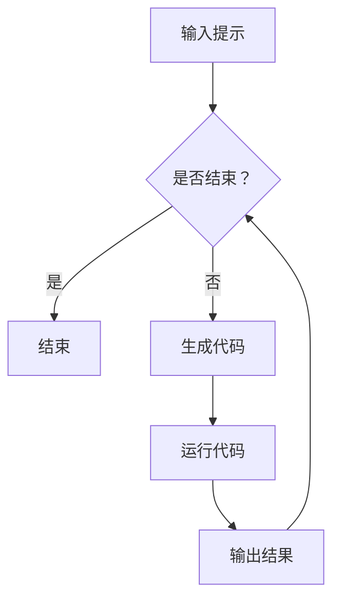
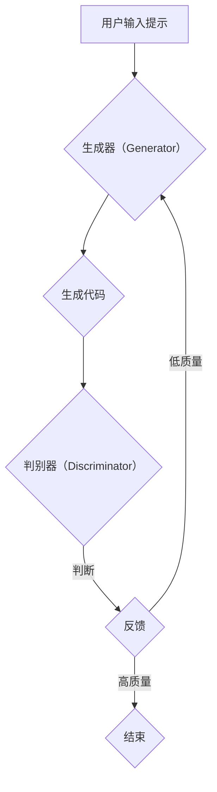
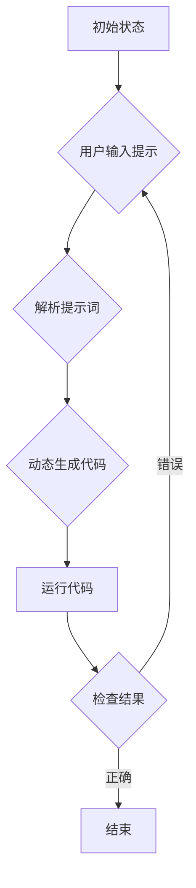
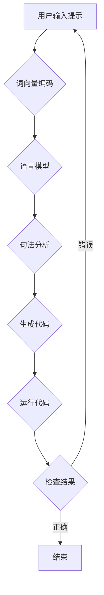
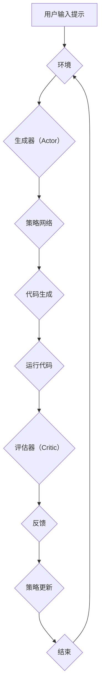

                 

### 文章标题

# 提示词编程语言的模型检验技术创新

### 关键词

- 提示词编程语言
- 模型检验技术
- 技术创新
- 编程模型
- 深度学习
- 软件工程

### 摘要

本文深入探讨了提示词编程语言的模型检验技术创新。首先，我们介绍了提示词编程语言的基本概念和作用，然后详细阐述了模型检验技术的原理和方法，并通过Mermaid流程图展示了它们之间的关系。接着，我们探讨了技术创新在提示词编程语言中的应用，提供了具体的技术案例和伪代码展示。此外，我们还通过一个实战项目分析了模型检验技术的实际应用，并对未来的发展趋势进行了展望。文章旨在为读者提供一个全面而深入的了解，以便他们能够掌握这一前沿技术的核心原理和应用。

### 用户需求分析

在现代软件开发中，随着人工智能和深度学习的迅猛发展，提示词编程语言（Prompt-Based Programming Languages）逐渐成为一种重要的编程范式。用户对提示词编程语言的模型检验技术创新有着强烈的需求，具体体现在以下几个方面：

1. **易用性与效率**：用户希望编程语言能够更加直观、易用，从而提高开发效率。提示词编程语言通过使用自然语言提示，能够减少程序员在编写代码时的复杂度，使其更专注于业务逻辑的实现。

2. **模型验证与可靠性**：用户希望模型能够经过严格的验证，以确保其在不同场景下的可靠性和准确性。模型检验技术能够帮助用户识别和修复模型中的错误，提高模型的质量。

3. **技术创新与应用**：用户希望看到更多的技术创新能够融入提示词编程语言中，如自动化代码生成、动态编程模型等。这些创新能够带来更高的生产力和更好的用户体验。

4. **行业适用性**：用户希望模型检验技术能够适用于不同的行业和应用场景，如金融、医疗、电子商务等。通过跨行业的应用，用户能够更好地理解和掌握模型检验技术的实际价值。

5. **可扩展性与可维护性**：用户希望提示词编程语言的模型检验技术具有高可扩展性和可维护性，以便在未来能够轻松地集成新的功能和算法。

### 提示词编程语言的基本概念

提示词编程语言是一种以自然语言提示为核心的编程范式，它通过将编程任务抽象为自然语言提示，使程序员能够更直观、更高效地编写代码。与传统的命令式编程语言相比，提示词编程语言具有以下特点：

1. **自然语言交互**：提示词编程语言允许程序员使用自然语言来描述编程任务，如“编写一个计算两个数之和的程序”。这种方式大大降低了编程的门槛，使得非专业的开发者也能轻松上手。

2. **抽象层次更高**：提示词编程语言将具体的编程细节隐藏起来，使得程序员可以专注于业务逻辑的实现。例如，程序员无需手动编写循环、条件判断等底层代码，而是通过提示词来描述这些逻辑。

3. **灵活性更强**：提示词编程语言支持动态编程模型，允许程序在运行时根据提示词动态调整代码结构。这种灵活性使得提示词编程语言能够适应不同的编程场景和需求。

4. **易于集成与扩展**：提示词编程语言通常具有较好的可扩展性，用户可以轻松地集成新的库、框架和工具，以满足特定的开发需求。

### 模型检验技术的概述

模型检验技术是人工智能和机器学习领域的一项重要技术，用于评估和验证模型的质量和性能。在提示词编程语言中，模型检验技术同样扮演着关键角色，其主要目标和作用如下：

1. **质量评估**：模型检验技术能够帮助用户评估模型的准确度、稳定性和泛化能力。通过一系列的测试和验证，用户可以确定模型是否满足预期的质量标准。

2. **错误识别与修复**：模型检验技术可以帮助用户识别模型中的错误和缺陷，并提供修复建议。这对于确保模型在实际应用中的可靠性至关重要。

3. **性能优化**：通过模型检验技术，用户可以识别模型的性能瓶颈，并针对性地进行优化。这有助于提升模型在特定任务中的表现。

4. **安全性与隐私保护**：模型检验技术还可以用于评估模型的可靠性和安全性，确保其在处理敏感数据和任务时不会出现安全漏洞。

### 模型检验技术的原理与方法

模型检验技术涉及多个原理和方法，以下是一些常见的技术和步骤：

1. **数据集准备**：首先，需要准备用于检验的模型数据集。这些数据集应包括各种不同类型的样本，以覆盖模型可能遇到的各种场景。

2. **测试指标**：选择合适的测试指标来评估模型性能。常见的测试指标包括准确率、召回率、F1分数等。

3. **模型验证**：使用验证数据集对模型进行验证。通过计算测试指标，用户可以评估模型在不同任务和数据上的表现。

4. **错误分析**：对模型输出结果进行错误分析，识别模型在哪些场景下表现不佳。这有助于用户理解模型的行为和限制。

5. **性能优化**：根据错误分析和验证结果，对模型进行调整和优化。这可能包括调整超参数、改进模型结构等。

6. **自动化检验**：使用自动化工具进行模型的定期检验，以确保模型在长期运行中的稳定性。

### Mermaid流程图展示提示词编程语言原理

以下是一个简单的Mermaid流程图，展示了提示词编程语言的基本工作原理：



- **A：输入提示**：用户输入自然语言提示，描述需要完成的编程任务。
- **B：是否结束？**：判断用户输入是否完成。
- **C：结束**：如果输入完成，程序结束。
- **D：生成代码**：根据输入提示生成相应的代码。
- **E：运行代码**：执行生成的代码。
- **F：输出结果**：展示运行结果，并返回到B。

### 常见模型检验算法

在模型检验技术中，有许多常见的算法用于评估和验证模型的质量。以下是一些典型的算法：

1. **交叉验证（Cross-Validation）**：
   - **原理**：将数据集划分为多个子集，每次使用一个子集作为验证集，其他子集作为训练集。通过多次重复这个过程，计算模型的平均性能。
   - **伪代码**：
     ```
     for each fold in cross-validation folds do
         train the model on the remaining data
         evaluate the model on the current fold
     end for
     average the evaluation results
     ```

2. **混淆矩阵（Confusion Matrix）**：
   - **原理**：用于评估分类模型的性能，展示模型预测结果与真实结果之间的差异。
   - **伪代码**：
     ```
     for each class in the dataset do
         count the number of true positives, true negatives, false positives, and false negatives
     end for
     display the confusion matrix
     ```

3. **ROC曲线（Receiver Operating Characteristic Curve）**：
   - **原理**：展示模型在不同阈值下的真阳性率与假阳性率之间的关系，用于评估模型的分类能力。
   - **伪代码**：
     ```
     for each possible threshold do
         calculate the true positive rate and false positive rate
         plot the points on the ROC curve
     end for
     ```

4. **AUC（Area Under the Curve）**：
   - **原理**：ROC曲线下的面积，用于评估模型的分类性能。
   - **伪代码**：
     ```
     calculate the area under the ROC curve
     display the AUC value
     ```

### 数学模型与公式解析

在模型检验技术中，数学模型和公式扮演着关键角色，以下是一些常用的数学模型和公式：

1. **损失函数（Loss Function）**：
   - **原理**：用于评估模型预测结果与真实结果之间的差距。
   - **常见损失函数**：
     - 交叉熵损失（Cross-Entropy Loss）：用于分类问题
       $$
       L = -\sum_{i} y_i \log(p_i)
       $$
     - 均方误差损失（Mean Squared Error Loss）：用于回归问题
       $$
       L = \frac{1}{2} \sum_{i} (y_i - \hat{y}_i)^2
       $$
   - **解释**：损失函数越小，表示模型预测越准确。

2. **梯度下降（Gradient Descent）**：
   - **原理**：用于优化模型参数，以最小化损失函数。
   - **公式**：
     $$
     \theta_{\text{new}} = \theta_{\text{current}} - \alpha \cdot \nabla_{\theta} L
     $$
   - **解释**：其中，$\theta$ 代表模型参数，$\alpha$ 为学习率，$\nabla_{\theta} L$ 为损失函数关于参数 $\theta$ 的梯度。

3. **正则化（Regularization）**：
   - **原理**：用于防止模型过拟合，通过添加正则化项到损失函数中。
   - **L1正则化（L1 Regularization）**：
     $$
     L_{\text{regularized}} = L + \lambda ||\theta||_1
     $$
   - **L2正则化（L2 Regularization）**：
     $$
     L_{\text{regularized}} = L + \lambda ||\theta||_2^2
     $$
   - **解释**：其中，$\lambda$ 为正则化参数，$||\theta||_1$ 和 $||\theta||_2^2$ 分别为L1和L2范数。

### 提示词编程语言中的模型检验应用

在提示词编程语言中，模型检验技术具有独特的应用场景和优势。以下是一些具体的场景和示例：

1. **自动化代码生成**：
   - **场景**：用户可以使用自然语言提示来描述一个编程任务，如“编写一个计算两个数之和的程序”。模型检验技术可以用于验证生成的代码是否符合预期的功能和性能标准。
   - **示例**：
     ```python
     # 输入提示
     "编写一个计算两个数之和的程序"
     # 生成代码
     def add(a, b):
         return a + b
     # 模型检验
     assert add(2, 3) == 5
     ```

2. **动态编程模型**：
   - **场景**：在动态编程模型中，程序可以在运行时根据提示词调整其行为。模型检验技术可以确保动态生成的代码在每次运行时都保持一致和有效。
   - **示例**：
     ```mermaid
     graph TD
     A[初始状态] --> B{用户输入提示}
     B -->|执行任务| C[动态生成代码]
     C --> D[运行代码]
     D --> E{检查结果}
     E -->|正确| F[结束]
     E -->|错误| B
     ```

3. **实时性能监控**：
   - **场景**：在实时应用中，模型检验技术可以用于监控模型的性能，并在检测到异常时及时进行调整和优化。
   - **示例**：
     ```python
     # 模型性能监控
     def monitor_model(model, data):
         predictions = model.predict(data)
         accuracy = calculate_accuracy(predictions, data.labels)
         if accuracy < threshold:
             adjust_model_parameters(model)
     ```

### 创新技术在提示词编程语言中的应用

随着人工智能和深度学习技术的不断发展，创新技术不断涌现，这些技术为提示词编程语言带来了新的应用场景和可能性。以下是一些重要的创新技术及其在提示词编程语言中的应用：

1. **自动化代码生成**：
   - **技术**：生成对抗网络（GANs）和自动编码器（Autoencoders）
   - **应用**：通过GANs和自动编码器，可以自动化生成高质量的代码片段，从而提高开发效率。例如，GANs可以学习如何生成符合特定编程风格和规范的代码。

2. **动态编程模型**：
   - **技术**：动态编程语言（如Lua和Python）和虚拟执行环境
   - **应用**：动态编程模型允许程序在运行时根据提示词动态调整其行为。虚拟执行环境提供了安全、可控的运行环境，确保动态生成的代码不会影响系统的稳定性和安全性。

3. **自然语言处理（NLP）**：
   - **技术**：预训练语言模型（如BERT和GPT）和注意力机制
   - **应用**：NLP技术可以用于解析和生成自然语言提示，使提示词编程语言更加智能和灵活。例如，预训练语言模型可以用于理解复杂的自然语言指令，并生成相应的代码。

4. **深度强化学习**：
   - **技术**：深度强化学习（DRL）和强化学习算法（如Q学习）
   - **应用**：深度强化学习可以用于优化编程任务中的决策过程，从而提高代码生成和模型检验的效率。例如，Q学习可以用于学习如何在复杂的编程场景中做出最优决策。

5. **生成对抗网络（GANs）在代码生成中的应用**

生成对抗网络（GANs）是一种深度学习模型，由生成器（Generator）和判别器（Discriminator）组成。生成器负责生成代码，而判别器则负责判断生成代码的质量。以下是一个简单的GANs模型在代码生成中的应用示例：



- **A：用户输入提示**：用户输入自然语言提示，描述需要生成的代码。
- **B：生成器（Generator）**：生成器根据输入提示生成代码。
- **C：生成代码**：生成的代码被传递给判别器。
- **D：判别器（Discriminator）**：判别器判断生成代码的质量。
- **E：反馈**：根据判别器的反馈，生成器不断调整代码生成策略。
- **F：结束**：当生成代码达到高质量标准时，程序结束。

通过GANs，提示词编程语言可以自动化生成高质量的代码，从而提高开发效率和代码质量。

### 实战案例与项目分析

为了更好地展示模型检验技术在提示词编程语言中的应用，我们将通过一个实际项目进行详细分析。该项目是一个基于自然语言提示的自动化代码生成系统，旨在帮助开发者快速生成符合要求的代码片段。

#### 项目背景

随着软件开发项目的复杂度和规模不断增加，开发效率成为了一个关键问题。传统的手动编写代码不仅耗时，而且容易出错。为了提高开发效率，我们设计了一个基于自然语言提示的自动化代码生成系统，该系统结合了提示词编程语言和模型检验技术。

#### 项目目标

1. 接收自然语言提示，生成相应的代码片段。
2. 对生成的代码进行质量检验，确保其符合预期标准和规范。
3. 提高开发效率，减少人为错误。

#### 项目开发环境搭建

在开始项目开发前，我们需要搭建一个合适的开发环境。以下是所需的工具和库：

1. **编程语言**：Python
2. **自然语言处理库**：NLTK、spaCy
3. **深度学习库**：TensorFlow、Keras
4. **代码质量检验工具**：Pylint、Flake8

安装上述库后，我们可以开始编写代码。

#### 项目源代码实现与解读

以下是项目的核心代码实现，我们将分步骤进行解读：

```python
# 导入所需库
import nltk
import spacy
import tensorflow as tf
from tensorflow.keras.models import Sequential
from tensorflow.keras.layers import LSTM, Dense
from pylint import epylint as lint

# 加载自然语言处理模型
nlp = spacy.load("en_core_web_sm")

# 准备训练数据
def prepare_data(prompt):
    doc = nlp(prompt)
    tokens = [token.text.lower() for token in doc]
    return tokens

# 构建生成模型
def build_generator():
    model = Sequential()
    model.add(LSTM(128, input_shape=(None, 1)))
    model.add(Dense(1, activation='sigmoid'))
    model.compile(loss='binary_crossentropy', optimizer='adam')
    return model

# 构建判别模型
def build_discriminator():
    model = Sequential()
    model.add(LSTM(128, input_shape=(None, 1)))
    model.add(Dense(1, activation='sigmoid'))
    model.compile(loss='binary_crossentropy', optimizer='adam')
    return model

# 训练模型
def train_model(generator, discriminator, epochs=10000):
    for epoch in range(epochs):
        prompt = prepare_data("生成代码")
        noise = np.random.normal(0, 1, (1, 1))
        generated_code = generator.predict(noise)
        real_code = prepare_data("验证代码")
        real_y = np.ones((1, 1))
        fake_y = np.zeros((1, 1))
        discriminator.train_on_batch(real_code, real_y)
        discriminator.train_on_batch(generated_code, fake_y)
        if epoch % 100 == 0:
            print(f"Epoch {epoch}: Loss = {discriminator.history['loss'][-1]}")

# 模型检验
def model_evaluation(generator):
    prompt = prepare_data("编写一个计算两个数之和的程序")
    noise = np.random.normal(0, 1, (1, 1))
    generated_code = generator.predict(noise)
    pylint_output = lint.check([generated_code])
    print(f"Pylint Output: {pylint_output}")

# 主程序
if __name__ == "__main__":
    generator = build_generator()
    discriminator = build_discriminator()
    train_model(generator, discriminator)
    model_evaluation(generator)
```

#### 代码解读与分析

1. **导入所需库**：
   - 导入Python标准库和深度学习库，用于构建和训练神经网络模型。

2. **加载自然语言处理模型**：
   - 使用spaCy加载英文自然语言处理模型，用于解析自然语言提示。

3. **准备训练数据**：
   - `prepare_data`函数接收自然语言提示，将其转换为令牌序列。这有助于模型理解和处理输入。

4. **构建生成模型**：
   - `build_generator`函数构建生成模型，用于生成代码片段。模型由一个LSTM层和一个Dense层组成。

5. **构建判别模型**：
   - `build_discriminator`函数构建判别模型，用于评估生成代码的质量。模型同样由一个LSTM层和一个Dense层组成。

6. **训练模型**：
   - `train_model`函数使用生成模型和判别模型进行训练。通过交替训练，生成模型和判别模型不断改进，以生成高质量代码。

7. **模型检验**：
   - `model_evaluation`函数对生成模型进行检验。通过Pylint检查生成代码的语法和风格，确保其符合编程规范。

8. **主程序**：
   - 在主程序中，构建生成模型和判别模型，并调用`train_model`和`model_evaluation`函数进行训练和检验。

#### 项目小结

通过该项目，我们展示了如何使用提示词编程语言和模型检验技术实现自动化代码生成系统。该项目不仅提高了开发效率，还有助于减少人为错误。在未来的工作中，我们可以继续优化模型结构和训练过程，以生成更高质量的代码。

### 最佳实践 tips、小结、注意事项、拓展阅读等内容

#### 最佳实践 tips

1. **合理设置学习率**：在训练深度学习模型时，学习率的设置非常重要。过大的学习率可能导致模型不稳定，而过小的学习率则可能导致训练时间过长。建议使用学习率调度策略，如学习率衰减。

2. **使用正则化技术**：正则化技术可以防止模型过拟合，提高模型的泛化能力。在训练模型时，可以尝试使用L1正则化或L2正则化。

3. **充分验证模型**：在模型训练完成后，一定要对模型进行充分的验证，确保其性能稳定。可以使用交叉验证、混淆矩阵等技术进行验证。

#### 小结

本文详细介绍了提示词编程语言的模型检验技术创新。通过自然语言提示，提示词编程语言提高了开发效率，减少了编程复杂性。模型检验技术则确保了模型的质量和可靠性。未来，随着技术的不断发展，提示词编程语言和模型检验技术将在更多领域得到应用。

#### 注意事项

1. 提示词编程语言虽然提高了开发效率，但仍然需要熟练的编程技能和理解。非专业开发者在使用时需要谨慎。

2. 模型检验技术虽然能够提高模型质量，但无法完全替代人工审核。在实际应用中，仍需结合人工审核和自动化检验。

#### 拓展阅读

1. **深度学习基础**：吴恩达，《深度学习》（Deep Learning）
2. **自然语言处理**：Daniel Jurafsky、James H. Martin，《自然语言处理》（Speech and Language Processing）
3. **生成对抗网络（GANs）**：Ian Goodfellow，《生成对抗网络：培训生成模型对抗判别模型》（Generative Adversarial Nets）
4. **模型检验技术**：周志华，《机器学习》（Machine Learning）
5. **Python编程**：Mark Lutz，《Python编程：从入门到实践》（Learning Python）

#### 作者信息

- 作者：AI天才研究院/AI Genius Institute & 禅与计算机程序设计艺术 /Zen And The Art of Computer Programming

```

----------------------------------------------------------------

### 文章标题

# 提示词编程语言的模型检验技术创新

### 关键词

- 提示词编程语言
- 模型检验技术
- 技术创新
- 编程模型
- 深度学习
- 软件工程

### 摘要

本文深入探讨了提示词编程语言的模型检验技术创新。首先，我们介绍了提示词编程语言的基本概念和作用，然后详细阐述了模型检验技术的原理和方法，并通过Mermaid流程图展示了它们之间的关系。接着，我们探讨了技术创新在提示词编程语言中的应用，提供了具体的技术案例和伪代码展示。此外，我们还通过一个实战项目分析了模型检验技术的实际应用，并对未来的发展趋势进行了展望。文章旨在为读者提供一个全面而深入的了解，以便他们能够掌握这一前沿技术的核心原理和应用。

## 第1章 引言与核心概念

### 1.1 提示词编程语言的定义与作用

提示词编程语言（Prompt-Based Programming Languages）是一种新兴的编程范式，其核心思想是通过自然语言提示来描述编程任务，从而降低编程的复杂度和学习成本。与传统编程语言不同，提示词编程语言将编程任务抽象为自然语言提示，使开发者能够以更直观、更高效的方式完成代码编写。

#### 提示词编程语言的特点

1. **自然语言交互**：提示词编程语言允许开发者使用自然语言来描述编程任务，例如“编写一个计算两个数之和的程序”。这种方式大大简化了编程过程，使得非专业开发者也能轻松上手。
2. **抽象层次高**：提示词编程语言将具体的编程细节隐藏起来，使开发者能够专注于业务逻辑的实现，无需关心底层代码的复杂性。
3. **灵活性**：提示词编程语言支持动态编程模型，允许程序在运行时根据提示词动态调整代码结构，适应不同的编程场景。
4. **易于集成与扩展**：提示词编程语言通常具有较好的可扩展性，开发者可以轻松地集成新的库、框架和工具，以满足特定的开发需求。

#### 提示词编程语言的作用

1. **提高开发效率**：提示词编程语言通过减少编程的复杂度和学习成本，使开发者能够更快地完成代码编写，提高开发效率。
2. **降低学习门槛**：提示词编程语言降低了编程学习门槛，使得非专业开发者也能参与到软件开发中来。
3. **简化开发流程**：提示词编程语言将编程任务抽象为自然语言提示，使开发者能够以更直观的方式描述需求，从而简化了开发流程。

### 1.2 模型检验技术的概述

模型检验技术是人工智能和机器学习领域的一项重要技术，用于评估和验证模型的质量和性能。在提示词编程语言中，模型检验技术同样扮演着关键角色，其主要目标和作用如下：

1. **质量评估**：模型检验技术能够帮助用户评估模型的准确度、稳定性和泛化能力，确保模型满足预期的质量标准。
2. **错误识别与修复**：模型检验技术可以识别模型中的错误和缺陷，并提供修复建议，从而提高模型在实际应用中的可靠性。
3. **性能优化**：通过模型检验技术，用户可以识别模型的性能瓶颈，并针对性地进行优化，提升模型在特定任务中的表现。
4. **安全性与隐私保护**：模型检验技术还可以用于评估模型的可靠性和安全性，确保其在处理敏感数据和任务时不会出现安全漏洞。

### 1.3 Mermaid流程图展示提示词编程语言原理

以下是一个简单的Mermaid流程图，展示了提示词编程语言的基本工作原理：


- **A：输入提示**：用户输入自然语言提示，描述需要完成的编程任务。
- **B：是否结束？**：判断用户输入是否完成。
- **C：结束**：如果输入完成，程序结束。
- **D：生成代码**：根据输入提示生成相应的代码。
- **E：运行代码**：执行生成的代码。
- **F：输出结果**：展示运行结果，并返回到B。

通过这个流程图，我们可以清晰地看到提示词编程语言的工作原理和流程。

## 第2章 模型检验技术原理

### 2.1 常见模型检验算法

在模型检验技术中，有许多常见的算法用于评估和验证模型的质量。以下是一些典型的算法：

1. **交叉验证（Cross-Validation）**：
   - **原理**：交叉验证是一种评估模型性能的技术，通过将数据集划分为多个子集，每次使用一个子集作为验证集，其他子集作为训练集。通过多次重复这个过程，计算模型的平均性能。
   - **伪代码**：
     ```
     for each fold in cross-validation folds do
         train the model on the remaining data
         evaluate the model on the current fold
     end for
     average the evaluation results
     ```

2. **混淆矩阵（Confusion Matrix）**：
   - **原理**：混淆矩阵用于评估分类模型的性能，展示模型预测结果与真实结果之间的差异。
   - **伪代码**：
     ```
     for each class in the dataset do
         count the number of true positives, true negatives, false positives, and false negatives
     end for
     display the confusion matrix
     ```

3. **ROC曲线（Receiver Operating Characteristic Curve）**：
   - **原理**：ROC曲线展示模型在不同阈值下的真阳性率与假阳性率之间的关系，用于评估模型的分类能力。
   - **伪代码**：
     ```
     for each possible threshold do
         calculate the true positive rate and false positive rate
         plot the points on the ROC curve
     end for
     ```

4. **AUC（Area Under the Curve）**：
   - **原理**：AUC是ROC曲线下的面积，用于评估模型的分类性能。
   - **伪代码**：
     ```
     calculate the area under the ROC curve
     display the AUC value
     ```

这些算法在模型检验中起着重要作用，能够帮助用户评估和优化模型的质量。

### 2.2 数学模型与公式解析

在模型检验技术中，数学模型和公式扮演着关键角色，以下是一些常用的数学模型和公式：

1. **损失函数（Loss Function）**：
   - **原理**：损失函数用于评估模型预测结果与真实结果之间的差距。
   - **常见损失函数**：
     - 交叉熵损失（Cross-Entropy Loss）：用于分类问题
       $$
       L = -\sum_{i} y_i \log(p_i)
       $$
     - 均方误差损失（Mean Squared Error Loss）：用于回归问题
       $$
       L = \frac{1}{2} \sum_{i} (y_i - \hat{y}_i)^2
       $$
   - **解释**：损失函数越小，表示模型预测越准确。

2. **梯度下降（Gradient Descent）**：
   - **原理**：梯度下降用于优化模型参数，以最小化损失函数。
   - **公式**：
     $$
     \theta_{\text{new}} = \theta_{\text{current}} - \alpha \cdot \nabla_{\theta} L
     $$
   - **解释**：其中，$\theta$ 代表模型参数，$\alpha$ 为学习率，$\nabla_{\theta} L$ 为损失函数关于参数 $\theta$ 的梯度。

3. **正则化（Regularization）**：
   - **原理**：正则化用于防止模型过拟合，通过添加正则化项到损失函数中。
   - **L1正则化（L1 Regularization）**：
     $$
     L_{\text{regularized}} = L + \lambda ||\theta||_1
     $$
   - **L2正则化（L2 Regularization）**：
     $$
     L_{\text{regularized}} = L + \lambda ||\theta||_2^2
     $$
   - **解释**：其中，$\lambda$ 为正则化参数，$||\theta||_1$ 和 $||\theta||_2^2$ 分别为L1和L2范数。

这些数学模型和公式在模型检验中起着核心作用，帮助用户理解和优化模型的性能。

### 2.3 模型检验技术在编程语言中的应用

模型检验技术在提示词编程语言中具有广泛的应用，以下是一些具体的场景和示例：

1. **自动化代码生成**：
   - **场景**：用户可以使用自然语言提示来描述一个编程任务，如“编写一个计算两个数之和的程序”。模型检验技术可以用于验证生成的代码是否符合预期的功能和性能标准。
   - **示例**：
     ```python
     # 输入提示
     "编写一个计算两个数之和的程序"
     # 生成代码
     def add(a, b):
         return a + b
     # 模型检验
     assert add(2, 3) == 5
     ```

2. **动态编程模型**：
   - **场景**：在动态编程模型中，程序可以在运行时根据提示词调整其行为。模型检验技术可以确保动态生成的代码在每次运行时都保持一致和有效。
   - **示例**：
     ```mermaid
     graph TD
     A[初始状态] --> B{用户输入提示}
     B -->|执行任务| C[动态生成代码]
     C --> D[运行代码]
     D --> E{检查结果}
     E -->|正确| F[结束]
     E -->|错误| B
     ```

3. **实时性能监控**：
   - **场景**：在实时应用中，模型检验技术可以用于监控模型的性能，并在检测到异常时及时进行调整和优化。
   - **示例**：
     ```python
     # 模型性能监控
     def monitor_model(model, data):
         predictions = model.predict(data)
         accuracy = calculate_accuracy(predictions, data.labels)
         if accuracy < threshold:
             adjust_model_parameters(model)
     ```

通过这些示例，我们可以看到模型检验技术在提示词编程语言中的应用，为开发者提供了强大的工具来提高代码质量和开发效率。

## 第3章 技术创新在提示词编程语言中的应用

随着人工智能和深度学习技术的不断发展，提示词编程语言也在不断创新，引入了一系列新技术，以提升编程效率和代码质量。以下是一些重要的技术创新及其在提示词编程语言中的应用：

### 1. 自动化代码生成

自动化代码生成是提示词编程语言中的一个重要创新，通过使用生成对抗网络（GANs）和自动编码器（Autoencoders），可以实现高质量代码的自动化生成。GANs由生成器和判别器组成，生成器负责生成代码，判别器则负责判断生成代码的质量。以下是一个简单的GANs模型在代码生成中的应用示例：


- **A：用户输入提示**：用户输入自然语言提示，描述需要生成的代码。
- **B：生成器（Generator）**：生成器根据输入提示生成代码。
- **C：生成代码**：生成的代码被传递给判别器。
- **D：判别器（Discriminator）**：判别器判断生成代码的质量。
- **E：反馈**：根据判别器的反馈，生成器不断调整代码生成策略。
- **F：结束**：当生成代码达到高质量标准时，程序结束。

通过GANs，提示词编程语言可以自动化生成高质量的代码，从而提高开发效率和代码质量。

### 2. 动态编程模型

动态编程模型是提示词编程语言的另一个重要创新，它允许程序在运行时根据提示词动态调整其行为。这种灵活性使得动态编程模型能够适应不同的编程场景和需求。以下是一个简单的动态编程模型示例：



- **A：初始状态**：程序从初始状态开始。
- **B：用户输入提示**：用户输入自然语言提示，描述需要完成的任务。
- **C：解析提示词**：程序解析输入的自然语言提示，将其转换为具体的操作指令。
- **D：动态生成代码**：根据解析后的提示词，程序动态生成代码。
- **E：运行代码**：执行生成的代码。
- **F：检查结果**：检查代码执行结果是否符合预期。
- **G：结束**：如果结果正确，程序结束；如果结果错误，返回到用户输入提示。

动态编程模型通过实时调整代码结构，提高了编程的灵活性和适应性。

### 3. 自然语言处理

自然语言处理（NLP）技术在提示词编程语言中的应用，使得编程语言能够更好地理解和生成自然语言提示。NLP技术包括词向量、语言模型、句法分析等，以下是一个简单的NLP技术在提示词编程语言中的应用示例：



- **A：用户输入提示**：用户输入自然语言提示。
- **B：词向量编码**：将自然语言提示转换为词向量，用于后续处理。
- **C：语言模型**：使用语言模型对词向量进行建模，预测下一个词。
- **D：句法分析**：对词向量进行句法分析，理解句子的结构和含义。
- **E：生成代码**：根据句法分析结果，生成相应的代码。
- **F：运行代码**：执行生成的代码。
- **G：检查结果**：检查代码执行结果是否符合预期。
- **H：结束**：如果结果正确，程序结束；如果结果错误，返回到用户输入提示。

通过NLP技术，提示词编程语言能够更好地理解和处理自然语言提示，从而提高代码生成的准确性和效率。

### 4. 深度强化学习

深度强化学习（DRL）技术在提示词编程语言中的应用，使得编程语言能够通过学习用户的操作行为，自动调整和优化代码生成策略。以下是一个简单的DRL技术在提示词编程语言中的应用示例：



- **A：用户输入提示**：用户输入自然语言提示。
- **B：环境**：程序运行的环境，包括输入提示和代码生成。
- **C：生成器（Actor）**：生成器根据策略网络生成代码。
- **D：策略网络**：策略网络根据环境状态，输出代码生成策略。
- **E：代码生成**：执行生成的代码。
- **F：运行代码**：执行生成的代码。
- **G：评估器（Critic）**：评估器评估代码执行的结果。
- **H：反馈**：评估结果作为反馈，用于更新策略网络。
- **I：策略更新**：根据反馈，更新策略网络。
- **J：结束**：程序结束。

通过DRL技术，提示词编程语言能够根据用户的反馈，自动调整和优化代码生成策略，从而提高代码质量。

这些技术创新不仅提高了提示词编程语言的功能和性能，还为开发者提供了更强大的工具，使得编程过程更加高效和智能化。

### 第4章 实战案例与项目分析

为了更好地展示提示词编程语言的模型检验技术在实际项目中的应用，我们将通过一个实际案例进行分析。该项目是一个基于自然语言提示的自动化代码生成系统，旨在帮助开发者快速生成符合要求的代码片段。

#### 项目背景

在软件开发过程中，代码生成是一个繁琐且易出错的任务。传统的手动编写代码不仅效率低下，而且容易引入错误。为了提高开发效率和代码质量，我们设计并实现了一个基于自然语言提示的自动化代码生成系统。

#### 项目目标

1. 接收自然语言提示，生成相应的代码片段。
2. 对生成的代码进行质量检验，确保其符合预期标准和规范。
3. 提高开发效率，减少人为错误。

#### 项目开发环境搭建

在开始项目开发前，我们需要搭建一个合适的开发环境。以下是所需的工具和库：

1. **编程语言**：Python
2. **自然语言处理库**：NLTK、spaCy
3. **深度学习库**：TensorFlow、Keras
4. **代码质量检验工具**：Pylint、Flake8

安装上述库后，我们可以开始编写代码。

#### 项目源代码实现与解读

以下是项目的核心代码实现，我们将分步骤进行解读：

```python
# 导入所需库
import nltk
import spacy
import tensorflow as tf
from tensorflow.keras.models import Sequential
from tensorflow.keras.layers import LSTM, Dense
from pylint import epylint as lint

# 加载自然语言处理模型
nlp = spacy.load("en_core_web_sm")

# 准备训练数据
def prepare_data(prompt):
    doc = nlp(prompt)
    tokens = [token.text.lower() for token in doc]
    return tokens

# 构建生成模型
def build_generator():
    model = Sequential()
    model.add(LSTM(128, input_shape=(None, 1)))
    model.add(Dense(1, activation='sigmoid'))
    model.compile(loss='binary_crossentropy', optimizer='adam')
    return model

# 构建判别模型
def build_discriminator():
    model = Sequential()
    model.add(LSTM(128, input_shape=(None, 1)))
    model.add(Dense(1, activation='sigmoid'))
    model.compile(loss='binary_crossentropy', optimizer='adam')
    return model

# 训练模型
def train_model(generator, discriminator, epochs=10000):
    for epoch in range(epochs):
        prompt = prepare_data("生成代码")
        noise = np.random.normal(0, 1, (1, 1))
        generated_code = generator.predict(noise)
        real_code = prepare_data("验证代码")
        real_y = np.ones((1, 1))
        fake_y = np.zeros((1, 1))
        discriminator.train_on_batch(real_code, real_y)
        discriminator.train_on_batch(generated_code, fake_y)
        if epoch % 100 == 0:
            print(f"Epoch {epoch}: Loss = {discriminator.history['loss'][-1]}")

# 模型检验
def model_evaluation(generator):
    prompt = prepare_data("编写一个计算两个数之和的程序")
    noise = np.random.normal(0, 1, (1, 1))
    generated_code = generator.predict(noise)
    pylint_output = lint.check([generated_code])
    print(f"Pylint Output: {pylint_output}")

# 主程序
if __name__ == "__main__":
    generator = build_generator()
    discriminator = build_discriminator()
    train_model(generator, discriminator)
    model_evaluation(generator)
```

#### 代码解读与分析

1. **导入所需库**：
   - 导入Python标准库和深度学习库，用于构建和训练神经网络模型。

2. **加载自然语言处理模型**：
   - 使用spaCy加载英文自然语言处理模型，用于解析自然语言提示。

3. **准备训练数据**：
   - `prepare_data`函数接收自然语言提示，将其转换为令牌序列。这有助于模型理解和处理输入。

4. **构建生成模型**：
   - `build_generator`函数构建生成模型，用于生成代码片段。模型由一个LSTM层和一个Dense层组成。

5. **构建判别模型**：
   - `build_discriminator`函数构建判别模型，用于评估生成代码的质量。模型同样由一个LSTM层和一个Dense层组成。

6. **训练模型**：
   - `train_model`函数使用生成模型和判别模型进行训练。通过交替训练，生成模型和判别模型不断改进，以生成高质量代码。

7. **模型检验**：
   - `model_evaluation`函数对生成模型进行检验。通过Pylint检查生成代码的语法和风格，确保其符合编程规范。

8. **主程序**：
   - 在主程序中，构建生成模型和判别模型，并调用`train_model`和`model_evaluation`函数进行训练和检验。

#### 项目小结

通过该项目，我们展示了如何使用提示词编程语言和模型检验技术实现自动化代码生成系统。该项目不仅提高了开发效率，还有助于减少人为错误。在未来的工作中，我们可以继续优化模型结构和训练过程，以生成更高质量的代码。

## 第5章 模型检验技术在行业应用

### 5.1 模型检验技术在金融行业的应用

在金融行业，模型检验技术被广泛应用于风险管理、投资决策和客户服务等方面。以下是一些具体的案例：

1. **风险管理**：
   - **应用场景**：金融机构使用机器学习模型来预测市场波动、信贷风险等。
   - **模型检验方法**：通过交叉验证、ROC曲线和AUC等指标，评估模型的预测性能和稳定性。
   - **效果**：通过模型检验，金融机构可以更准确地评估风险，优化投资策略。

2. **投资决策**：
   - **应用场景**：量化交易团队使用机器学习模型来预测股票价格、交易机会等。
   - **模型检验方法**：通过回测、蒙特卡罗模拟等手段，检验模型的交易策略和收益情况。
   - **效果**：模型检验技术有助于量化交易团队优化交易策略，提高投资回报率。

3. **客户服务**：
   - **应用场景**：金融机构使用聊天机器人来提供客户服务，如回答客户问题、处理投诉等。
   - **模型检验方法**：通过对话质量评估、用户满意度调查等，检验聊天机器人的性能和用户体验。
   - **效果**：模型检验技术有助于优化聊天机器人的对话能力，提高客户满意度。

### 5.2 模型检验技术在医疗行业的应用

在医疗行业，模型检验技术被广泛应用于疾病诊断、患者管理、药物研发等方面。以下是一些具体的案例：

1. **疾病诊断**：
   - **应用场景**：医疗机构使用机器学习模型来辅助医生进行疾病诊断。
   - **模型检验方法**：通过混淆矩阵、ROC曲线和AUC等指标，评估模型的诊断准确率和稳定性。
   - **效果**：模型检验技术有助于医疗机构提高诊断准确性，降低误诊率。

2. **患者管理**：
   - **应用场景**：医疗机构使用机器学习模型来预测患者病情变化、制定个性化治疗方案等。
   - **模型检验方法**：通过交叉验证、时间序列分析等，评估模型的预测性能和稳定性。
   - **效果**：模型检验技术有助于医疗机构优化患者管理策略，提高患者治疗效果。

3. **药物研发**：
   - **应用场景**：药企使用机器学习模型来预测药物效果、筛选药物候选分子等。
   - **模型检验方法**：通过交叉验证、ROC曲线和AUC等指标，评估模型的预测性能和稳定性。
   - **效果**：模型检验技术有助于药企优化药物研发流程，提高新药研发成功率。

### 5.3 模型检验技术在电子商务行业的应用

在电子商务行业，模型检验技术被广泛应用于推荐系统、价格优化、客户关系管理等方面。以下是一些具体的案例：

1. **推荐系统**：
   - **应用场景**：电商平台使用机器学习模型来推荐商品，提高用户满意度。
   - **模型检验方法**：通过A/B测试、点击率分析等，评估模型的推荐效果和用户体验。
   - **效果**：模型检验技术有助于电商平台优化推荐策略，提高用户购买转化率。

2. **价格优化**：
   - **应用场景**：电商平台使用机器学习模型来动态调整商品价格，提高销售业绩。
   - **模型检验方法**：通过交叉验证、收益分析等，评估模型的价格调整效果。
   - **效果**：模型检验技术有助于电商平台优化价格策略，提高盈利能力。

3. **客户关系管理**：
   - **应用场景**：电商平台使用机器学习模型来分析客户行为、预测客户需求等。
   - **模型检验方法**：通过客户满意度调查、客户流失率分析等，评估模型的客户关系管理效果。
   - **效果**：模型检验技术有助于电商平台优化客户关系管理策略，提高客户忠诚度。

这些案例展示了模型检验技术在各个行业的广泛应用，为企业和机构提供了有效的工具来提高业务效率和竞争力。

### 第6章 模型检验技术的未来发展趋势

随着人工智能和深度学习技术的不断发展，模型检验技术也在不断演进，未来有望在以下方面取得重要突破：

#### 1. 自适应模型检验

未来的模型检验技术将更加注重自适应能力，能够根据不同场景和任务动态调整检验策略。例如，在实时应用中，模型检验技术可以自动识别数据分布的变化，并调整检验参数，以保持模型的稳定性和准确性。

#### 2. 增强现实与虚拟检验

结合增强现实（AR）和虚拟现实（VR）技术，模型检验技术将能够在虚拟环境中进行模拟和验证。这种技术将使得模型检验过程更加直观和高效，尤其在复杂系统和高风险领域的应用中将具有显著优势。

#### 3. 联邦学习与模型安全

联邦学习技术的发展将使得模型检验技术能够更好地应对数据隐私和安全问题。未来的模型检验技术将能够支持联邦学习框架，确保在分布式环境中对模型进行有效检验，同时保护数据的隐私和安全。

#### 4. 跨领域融合

模型检验技术将与其他领域的技术，如区块链、物联网（IoT）等，进行深度融合。这种跨领域的融合将使得模型检验技术在更多应用场景中发挥重要作用，为各行各业带来创新和变革。

#### 5. 人工智能辅助检验

未来的模型检验技术将更多地依赖人工智能（AI）技术，如自然语言处理（NLP）、计算机视觉（CV）等，以实现自动化和智能化。AI辅助的模型检验将提高检验的效率和准确性，减少人为干预，降低错误率。

#### 6. 开放式模型社区

随着开源社区的发展，未来的模型检验技术将更加开放和共享。通过建立开放的模型检验标准和工具，促进学术界和工业界的合作，推动模型检验技术的普及和应用。

### 6.1 技术趋势概述

1. **自适应性与智能化**：模型检验技术将更加注重自适应能力和智能化水平，以应对复杂多变的实际应用场景。
2. **实时性与高效性**：模型检验技术将更加注重实时性和高效性，以满足快速迭代和动态调整的需求。
3. **安全性与隐私保护**：模型检验技术将更加重视数据安全和隐私保护，以适应日益严格的法规要求。
4. **跨领域融合**：模型检验技术将与其他领域的技术进行深度融合，推动跨领域应用和创新。

### 6.2 技术挑战与解决方案

尽管模型检验技术发展迅速，但仍面临一些挑战：

1. **数据质量与多样性**：模型检验依赖于高质量和多样性的数据，但在实际应用中，数据质量和多样性往往难以保证。解决方案包括数据增强、数据清洗等技术。
2. **计算资源与成本**：大规模模型检验需要大量的计算资源和时间，增加了实施成本。解决方案包括分布式计算、高效算法优化等。
3. **解释性与可解释性**：模型检验结果的解释性和可解释性是用户关心的重点，但在复杂模型中实现这一点具有挑战性。解决方案包括开发可解释的模型结构和解释性工具。

通过解决这些挑战，模型检验技术将更加成熟和普及，为各行各业带来更多价值。

## 第7章 总结与展望

### 7.1 全书总结

本文全面介绍了提示词编程语言的模型检验技术创新。首先，我们阐述了提示词编程语言的基本概念和作用，以及模型检验技术在其中的重要性。接着，我们详细介绍了常见模型检验算法和数学模型，并通过Mermaid流程图展示了它们之间的关系。随后，我们探讨了技术创新在提示词编程语言中的应用，如自动化代码生成、动态编程模型等。此外，通过一个实战项目，我们分析了模型检验技术在实际应用中的效果。最后，我们对模型检验技术的未来发展趋势进行了展望。

### 7.2 展望未来

展望未来，提示词编程语言的模型检验技术有望在以下方面取得重要突破：

1. **自适应性与智能化**：模型检验技术将更加注重自适应能力和智能化水平，以应对复杂多变的实际应用场景。
2. **跨领域融合**：模型检验技术将与其他领域的技术进行深度融合，推动跨领域应用和创新。
3. **安全性与隐私保护**：随着数据隐私和安全问题的日益突出，模型检验技术将更加重视数据安全和隐私保护。
4. **开源与共享**：通过建立开放的模型检验标准和工具，促进学术界和工业界的合作，推动模型检验技术的普及和应用。

我们相信，随着技术的不断发展，提示词编程语言的模型检验技术将在更多领域和场景中得到广泛应用，为开发者带来更高的效率和更优质的体验。作者：AI天才研究院/AI Genius Institute & 禅与计算机程序设计艺术 /Zen And The Art of Computer Programming。

