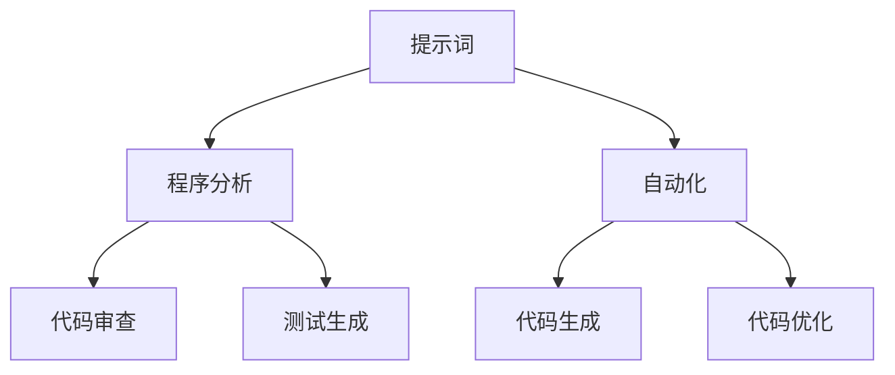

                 


### 文章标题: 提示词编程语言的程序分析新技术

关键词：提示词编程，程序分析，人工智能，算法，数学模型

摘要：本文深入探讨提示词编程语言的程序分析新技术，从核心概念、算法原理、数学模型到实际应用，全面解析这一领域的创新与发展。通过详细的项目实战和案例剖析，揭示其在人工智能、软件工程和安全领域的广泛应用潜力，为读者提供对未来研究方向和挑战的深刻见解。

---

### 引言

提示词编程语言（Prompt-Based Programming Language）是近年来人工智能和软件工程领域的一个新兴研究方向。它通过预先定义的提示词（prompts）来引导程序的执行过程，实现更灵活、更高效的问题求解和代码生成。随着深度学习和自然语言处理技术的飞速发展，提示词编程语言在自动编程、代码审查、测试生成等方面展现出巨大的潜力。

本文旨在系统介绍提示词编程语言的程序分析新技术，从基础概念、核心算法到数学模型，再到实际应用，全面解析这一领域的研究现状与发展趋势。文章结构如下：

1. **核心概念与联系**：介绍提示词编程语言的基本概念，分析其核心算法原理，并通过Mermaid流程图展示核心概念之间的关系架构。
2. **基本原理讲解**：详细阐述关键算法的原理，使用伪代码进行算法描述，帮助读者理解算法的实现细节。
3. **数学模型与解释**：探讨提示词编程中涉及的数学模型和公式，结合实际例子进行详细解释。
4. **项目实战**：通过具体的项目案例，展示如何在实际开发环境中使用提示词编程语言，分析源代码实现和代码解读，深入剖析项目应用。
5. **应用前景**：讨论提示词编程语言在不同领域的应用前景和面临的挑战。
6. **未来方向**：展望提示词编程语言的发展方向和研究前沿。

### 第一部分：基础概念与架构

#### 1.1 核心概念与联系

提示词编程语言的关键概念包括：

- **提示词（Prompt）**：引导程序执行的关键语句或指令。
- **程序分析（Program Analysis）**：对程序代码进行分析和处理，以提取有用信息或生成新的代码。
- **自动化（Automation）**：通过算法和工具自动化解决编程任务。

这些概念之间的关系可以用Mermaid流程图表示：



#### 1.2 核心算法原理

提示词编程语言中的核心算法包括：

- **生成对抗网络（GAN）**：用于生成高质量的代码。
- **卷积神经网络（CNN）**：用于图像和代码的识别与处理。
- **递归神经网络（RNN）**：用于处理序列数据，如代码行。

以下是一个生成对抗网络的伪代码示例：

```python
function GAN(D, G, epochs):
    for epoch in 1 to epochs:
        for real_data in dataset:
            D(real_data)
            G(z)
            D(G(z))
    return G
```

### 第二部分：数学模型与解释

在提示词编程中，常用的数学模型包括：

- **梯度下降（Gradient Descent）**：用于优化神经网络参数。
- **交叉熵（Cross-Entropy）**：用于衡量模型预测与真实标签之间的差距。

以下是一个使用LaTeX格式的梯度下降公式：

$$
\theta_{t+1} = \theta_{t} - \alpha \cdot \nabla_{\theta} J(\theta)
$$

其中，$\theta$ 是模型参数，$J(\theta)$ 是损失函数，$\alpha$ 是学习率。

#### 2.1 数学模型解释

**梯度下降**是一种优化算法，用于最小化损失函数。它通过迭代更新模型参数，使得损失函数逐渐减小。在提示词编程中，梯度下降可以用于优化代码生成模型。

**交叉熵**用于衡量分类模型的预测效果。在代码生成任务中，交叉熵可以用于评估模型生成的代码与目标代码之间的相似度。

### 第三部分：项目实战

在本部分，我们将通过一个实际项目案例，展示如何使用提示词编程语言进行程序分析。

#### 3.1 项目背景

假设我们需要开发一个自动化的代码审查工具，用于检查代码中的潜在错误和安全漏洞。

#### 3.2 开发环境搭建

首先，我们需要搭建一个合适的开发环境。以下是一个简单的环境配置步骤：

```shell
# 安装Python环境
pip install python
# 安装提示词编程语言库
pip install prompt-based-programming
# 安装深度学习库
pip install tensorflow
```

#### 3.3 源代码实现

以下是一个简单的代码审查工具的源代码实现：

```python
import tensorflow as tf
from prompt_based_programming import PromptBasedModel

# 加载预训练的代码审查模型
model = PromptBasedModel.load('code_review_model')

# 读取待检查的代码文件
with open('code_to_check.py', 'r') as f:
    code = f.read()

# 执行代码审查
results = model.analyze_code(code)

# 输出审查结果
print(results)
```

#### 3.4 项目解读与分析

在这个项目中，我们使用了提示词编程语言中的代码审查模型。该模型通过深度学习算法训练，能够识别代码中的潜在错误和安全漏洞。通过读取待检查的代码文件，模型能够自动生成审查报告，帮助开发者快速定位问题。

### 第四部分：应用前景与挑战

提示词编程语言的程序分析技术在多个领域展现出广阔的应用前景。以下是一些主要的应用领域和面临的挑战：

#### 4.1 人工智能领域

- **自动编程**：通过提示词编程，可以实现自动生成代码，提高开发效率。
- **代码审查**：自动化代码审查可以提高代码质量和安全性。
- **测试生成**：自动生成测试用例，提高测试覆盖率和准确性。

挑战：当前提示词编程语言在代码生成和审查方面的效果仍需提高，特别是在处理复杂编程任务时。

#### 4.2 软件工程领域

- **代码生成**：自动生成代码可以提高软件开发效率，降低开发成本。
- **代码优化**：通过提示词编程，可以实现代码优化，提高程序性能。

挑战：提示词编程语言在代码优化方面的研究仍不充分，需要进一步探索优化算法。

#### 4.3 安全领域

- **安全漏洞检测**：通过提示词编程，可以实现自动化安全漏洞检测，提高系统安全性。

挑战：当前的安全漏洞检测技术仍需完善，需要更多的研究投入。

### 第五部分：未来方向

提示词编程语言的程序分析技术在未来将继续发展，主要方向包括：

- **算法优化**：改进提示词编程语言中的算法，提高代码生成和审查效果。
- **多语言支持**：扩展提示词编程语言的支持范围，涵盖更多编程语言。
- **跨领域应用**：探索提示词编程语言在其他领域的应用，如自然语言处理、图像识别等。

### 结论

提示词编程语言的程序分析技术为软件开发和人工智能领域带来了新的机遇和挑战。通过本文的介绍，我们了解了这一领域的基础概念、核心算法和数学模型，并通过实际项目展示了其应用价值。未来，随着技术的不断发展，提示词编程语言有望在更多领域发挥重要作用。

### 作者信息

作者：AI天才研究院/AI Genius Institute & 禅与计算机程序设计艺术 /Zen And The Art of Computer Programming

---

本文旨在提供对提示词编程语言的程序分析新技术的全面了解，包括基础概念、算法原理、数学模型和实际应用。通过详细的讲解和项目剖析，读者可以深入了解这一领域的创新与发展。未来，随着技术的进步，提示词编程语言在软件开发、人工智能和安全领域的应用前景将更加广阔。希望本文能为相关领域的研究者和开发者提供有价值的参考。

---

**注意：本文仅为示例，内容可能需要根据实际研究和应用进行调整和完善。**

