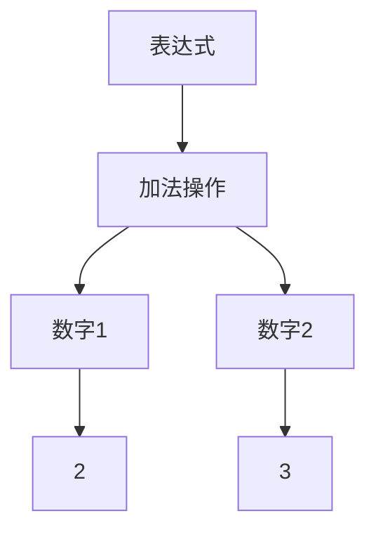
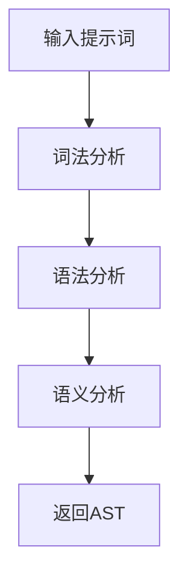
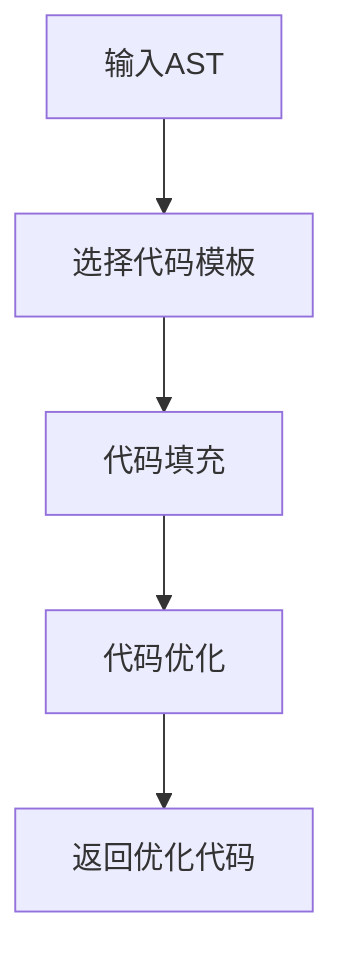
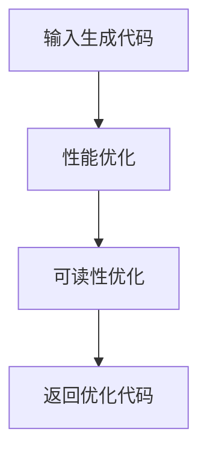

                 


### 引言

在当今的计算机科学领域，编程语言和程序合成技术正经历着一场深刻的变革。传统的编程语言要求开发者以低层级的指令来编写代码，这既繁琐又不利于复用和自动化。而提示词编程语言（Prompt-Based Programming Languages）和程序合成技术（Program Synthesis Techniques）的兴起，为编程领域带来了全新的可能性。

提示词编程语言是一种基于自然语言交互的编程范式，开发者可以通过编写自然语言提示词来描述程序的目标，从而生成相应的代码。这种编程方式不仅降低了编程的难度，还提高了开发效率和代码质量。

程序合成技术则是指通过算法自动生成程序代码的技术。它通过分析输入的提示词或需求描述，自动生成符合预期的程序代码。这种技术为自动化软件开发、算法研究以及跨平台开发等领域提供了强有力的支持。

本文将深入探讨提示词编程语言的程序合成技术，分析其基础理论、核心算法、应用实例以及未来发展方向。我们希望通过一步一步的分析和推理，为读者提供一幅清晰、完整的理解图景。

### 文章关键词

- 提示词编程语言
- 程序合成技术
- 自然语言交互
- 代码生成算法
- 自动化软件开发
- 跨平台开发
- 人工智能

### 文章摘要

本文旨在探讨提示词编程语言的程序合成技术，分析其基础理论、核心算法和应用实例。首先，我们将介绍提示词编程语言的基本概念和原理，并通过具体的伪代码和流程图展示其核心算法。接着，我们将探讨程序合成的定义、类型以及关键步骤，包括问题建模、算法选择、代码生成和代码优化。随后，我们将深入讨论提示词编程语言在程序合成中的应用优势、实际应用场景以及面临的挑战。最后，我们将展望提示词编程语言和程序合成的未来发展，并提出一些最佳实践和拓展阅读建议。

### 第1章 提示词编程语言基础

#### 1.1 提示词编程语言的基本概念

提示词编程语言是一种以自然语言或结构化提示词为输入的编程范式，它允许开发者通过描述性的语言指令来定义程序的目标和功能，而不是传统的低层级代码指令。这种编程语言的核心在于将自然语言的描述转化为计算机可以理解和执行的代码。

**提示词的定义与作用：**

提示词（Prompts）是开发者用来描述程序需求的文本或语句。这些提示词可以是自然语言句子，如“编写一个程序，能够计算两个数字的和”，也可以是结构化的数据，如JSON格式的要求描述。

提示词在编程过程中起到了关键作用：
1. **需求描述：** 提示词清晰地表达了开发者希望程序实现的功能，从而为代码生成提供明确的目标。
2. **交互界面：** 提示词编程语言提供了一个用户友好的交互界面，使得开发者无需深入理解底层编程细节即可编写程序。
3. **灵活性：** 提示词允许开发者以自然语言的方式表达复杂的逻辑和需求，增强了编程的灵活性。

**提示词编程语言的分类：**

根据提示词的形式和编程范式，提示词编程语言可以分为以下几类：

1. **自然语言编程语言：** 这类语言直接接受自然语言句子作为输入，如Prolog、Hop和Python的语法糖。
2. **结构化提示词编程语言：** 这类语言使用结构化的数据格式（如JSON、XML等）来描述需求，如JSONP、Web Thing和Google's OPAL。
3. **混合型提示词编程语言：** 这类语言结合了自然语言和结构化数据的特点，如ACL2和Isabelle。

**提示词编程语言的特性：**

1. **高抽象层次：** 提示词编程语言允许开发者以高层次的抽象来描述程序，从而简化了编程过程。
2. **可定制性：** 提示词编程语言通常提供丰富的扩展机制，允许开发者自定义提示词语法和代码生成规则。
3. **互操作性：** 提示词编程语言可以通过标准的数据交换格式（如JSON）与其他编程工具和平台集成。

#### 1.2 提示词编程语言的核心原理

提示词编程语言的核心原理包括提示词解析、代码生成以及提示词编程语言的工作流程。

**提示词解析算法：**

提示词解析是提示词编程语言的关键步骤，它将自然语言或结构化提示词转化为程序执行的指令。解析算法通常包括以下几个步骤：

1. **词法分析（Lexical Analysis）：** 将提示词分解为词素（tokens），如“计算两个数字的和”可以分解为“计算”、“两个”、“数字”、“和”等词素。
2. **语法分析（Syntax Analysis）：** 分析词素序列的结构，将其转换为抽象语法树（AST）。例如，提示词“计算两个数字的和”可以表示为以下抽象语法树：



3. **语义分析（Semantic Analysis）：** 检查抽象语法树的语义是否正确，如变量是否存在、类型是否匹配等。

**代码生成算法：**

代码生成算法将抽象语法树转换为可执行的代码。这个过程中，算法需要根据提示词的语义和上下文来生成相应的代码。代码生成算法通常包括以下几个步骤：

1. **代码模板生成：** 根据提示词的类型和语义，选择合适的代码模板。例如，对于“计算两个数字的和”，可以选择加法运算的代码模板。
2. **代码填充：** 将抽象语法树中的变量和操作符填充到代码模板中，生成具体的代码。
3. **代码优化：** 对生成的代码进行优化，以提高性能和可读性。

**提示词编程语言的工作流程：**

提示词编程语言的工作流程通常包括以下几个步骤：

1. **输入提示词：** 开发者编写自然语言或结构化提示词来描述程序需求。
2. **提示词解析：** 提示词解析器将提示词解析为抽象语法树。
3. **代码生成：** 代码生成器根据抽象语法树生成相应的代码。
4. **代码执行：** 生成的代码在编程环境中执行，实现开发者定义的功能。

#### 1.3 提示词编程语言的核心算法

提示词编程语言的核心算法主要包括语法分析算法、代码生成算法以及代码优化算法。以下使用伪代码和Mermaid流程图来详细阐述这些算法的原理。

**1.3.1 语法分析算法（伪代码）**

```python
def syntax_analysis(prompt):
    # 步骤1：词法分析
    tokens = lexical_analysis(prompt)
    
    # 步骤2：语法分析
    ast = parse_tokens(tokens)
    
    # 步骤3：语义分析
    semantic_check(ast)
    
    # 返回抽象语法树
    return ast
```

**语法分析算法（Mermaid流程图）**



**1.3.2 代码生成算法（伪代码）**

```python
def code_generation(ast):
    # 步骤1：选择代码模板
    code_template = select_template(ast)
    
    # 步骤2：代码填充
    generated_code = fill_template(code_template, ast)
    
    # 步骤3：代码优化
    optimized_code = optimize_code(generated_code)
    
    # 返回优化后的代码
    return optimized_code
```

**代码生成算法（Mermaid流程图）**



**1.3.3 代码优化算法（伪代码）**

```python
def code_optimization(generated_code):
    # 步骤1：性能优化
    optimized_code = performance_optimization(generated_code)
    
    # 步骤2：可读性优化
    final_code = readability_optimization(optimized_code)
    
    # 返回优化后的代码
    return final_code
```

**代码优化算法（Mermaid流程图）**



#### 1.4 提示词编程语言的应用实例

提示词编程语言在多个领域展现了其独特的优势，以下将介绍几个典型的应用实例。

**1.4.1 自动化脚本生成**

在自动化测试和运维领域，提示词编程语言可以用于生成自动化脚本。开发者通过编写自然语言提示词，如“编写一个脚本，用于检查系统是否正常运行”，提示词编程语言可以自动生成相应的Shell脚本或Python脚本，从而提高自动化测试和运维的效率。

**1.4.2 算法实现代码生成**

在算法研究中，提示词编程语言可以用于生成算法的实现代码。研究人员可以通过编写提示词描述算法的需求，如“编写一个算法，用于解决旅行商问题”，提示词编程语言可以自动生成相应的算法代码，从而加速算法实现和优化过程。

**1.4.3 跨平台开发**

在跨平台应用开发中，提示词编程语言可以用于生成跨平台代码。开发者可以通过编写自然语言提示词，如“编写一个跨平台的Web和移动应用”，提示词编程语言可以自动生成适用于Web和移动平台的代码，从而提高开发效率。

### 第2章 程序合成技术原理

#### 2.1 程序合成的定义与类型

程序合成（Program Synthesis）是一种自动化软件工程方法，它通过分析输入的提示词、需求描述或其他形式的输入，自动生成满足特定需求的程序代码。程序合成的核心思想是将编程任务从编写代码转变为描述问题或需求，从而利用算法和模型自动生成解决方案。

**程序合成的定义：**

程序合成是指利用算法、模型和技术，从输入的提示词或需求描述中自动生成程序代码的过程。程序合成技术旨在减少软件开发中的重复性劳动，提高开发效率和代码质量。

**程序合成的类型：**

根据输入信息和生成过程的不同，程序合成可以分为以下几种类型：

1. **基于模板的程序合成：** 这种方法使用预定义的代码模板和规则，根据输入的提示词或需求描述自动填充模板，生成程序代码。
2. **基于语义的程序合成：** 这种方法通过分析输入的提示词或需求描述，理解其语义，并生成符合语义的程序代码。
3. **基于搜索的程序合成：** 这种方法使用搜索算法，在程序空间中寻找满足输入需求的程序代码。
4. **基于学习的方法合成：** 这种方法利用机器学习算法，从大量已有的程序代码中学习，并生成新的满足输入需求的程序代码。

**程序合成的关键步骤：**

程序合成通常包括以下几个关键步骤：

1. **问题建模：** 分析输入的提示词或需求描述，建立问题模型，明确程序的需求和目标。
2. **算法选择：** 根据问题模型选择合适的算法和模型，为程序合成提供技术支持。
3. **代码生成：** 使用选定的算法和模型，生成满足输入需求的程序代码。
4. **代码优化：** 对生成的代码进行优化，以提高性能和可读性。

#### 2.2 程序合成的关键步骤

**2.2.1 问题建模**

问题建模是程序合成的第一步，其目标是分析输入的提示词或需求描述，建立问题模型，明确程序的需求和目标。问题建模的关键包括：

1. **需求分析：** 理解输入的提示词或需求描述，提取关键信息和需求。
2. **领域模型构建：** 根据需求分析的结果，构建领域模型，明确程序涉及的领域知识和概念。
3. **目标函数定义：** 定义程序的目标函数，明确程序需要实现的功能和性能指标。

**2.2.2 算法选择**

算法选择是程序合成的关键步骤之一，其目标是选择合适的算法和模型，为程序合成提供技术支持。算法选择的关键包括：

1. **算法性能评估：** 评估不同算法的性能，选择适合问题的算法。
2. **算法适用性分析：** 分析算法的适用性，确保算法能够解决输入的需求。
3. **算法组合：** 根据问题复杂度和需求，选择合适的算法组合，提高程序合成的效果。

**2.2.3 代码生成**

代码生成是程序合成的核心步骤，其目标是使用选定的算法和模型，生成满足输入需求的程序代码。代码生成的主要方法包括：

1. **基于模板的代码生成：** 使用预定义的代码模板和规则，根据输入的提示词或需求描述自动填充模板，生成程序代码。
2. **基于语义的代码生成：** 分析输入的提示词或需求描述，理解其语义，并生成符合语义的程序代码。
3. **基于搜索的代码生成：** 使用搜索算法，在程序空间中寻找满足输入需求的程序代码。
4. **基于学习的代码生成：** 利用机器学习算法，从大量已有的程序代码中学习，并生成新的满足输入需求的程序代码。

**2.2.4 代码优化**

代码优化是程序合成的重要步骤，其目标是优化生成的代码，以提高性能和可读性。代码优化的主要方法包括：

1. **性能优化：** 优化代码的执行性能，提高程序的运行速度和效率。
2. **可读性优化：** 优化代码的可读性，提高代码的可维护性和可理解性。
3. **代码重构：** 对生成的代码进行重构，以提高代码的质量和结构。
4. **测试和调试：** 对生成的代码进行测试和调试，确保代码的正确性和可靠性。

#### 2.3 程序合成的算法与模型

程序合成技术涉及多种算法和模型，以下将介绍一些常用的算法和模型，并分析它们在程序合成中的应用。

**2.3.1 生成对抗网络（GAN）**

生成对抗网络（Generative Adversarial Networks，GAN）是一种深度学习模型，由生成器和判别器组成。生成器生成与真实数据相似的数据，判别器判断生成数据与真实数据的区别。通过训练生成器和判别器的对抗过程，生成器逐渐生成更加真实的数据。GAN在程序合成中的应用主要是通过生成代码样本来优化代码生成过程。

**2.3.2 变分自编码器（VAE）**

变分自编码器（Variational Autoencoder，VAE）是一种基于深度学习的概率生成模型。它由编码器和解码器组成，编码器将输入数据编码为一个潜在空间中的向量，解码器将这个向量解码回原始数据。VAE在程序合成中的应用主要是通过学习程序代码的潜在空间，从而生成新的代码样本。

**2.3.3 强化学习在程序合成中的应用**

强化学习（Reinforcement Learning，RL）是一种通过试错和反馈来学习策略的机器学习方法。在程序合成中，强化学习可以用于优化代码生成过程。例如，通过训练一个智能体在代码空间中搜索，使其能够生成满足特定需求的代码。强化学习在程序合成中的应用主要涉及策略学习、状态空间定义和奖励函数设计等方面。

#### 2.4 程序合成的优缺点

**优点：**

1. **提高开发效率：** 程序合成技术可以自动化生成程序代码，减少手动编写代码的工作量，从而提高开发效率。
2. **减少错误：** 程序合成通过算法和模型生成代码，减少了手动编写代码时可能出现的错误，提高了代码质量。
3. **代码复用：** 程序合成技术可以从已有的代码库中学习，生成新的满足需求的代码，从而实现代码复用。

**缺点：**

1. **代码可读性：** 生成的代码可能难以理解，尤其是对于复杂的问题，生成的代码可能过于复杂，降低了代码的可读性。
2. **代码质量：** 程序合成技术生成的代码质量可能不稳定，特别是在处理复杂需求时，生成的代码可能不符合最佳实践。
3. **性能限制：** 程序合成技术的性能受限于算法和模型的复杂度，特别是在处理大型项目时，可能存在性能瓶颈。

### 第3章 提示词编程语言在程序合成中的应用

#### 3.1 提示词编程语言在程序合成中的优势

提示词编程语言在程序合成中具有以下优势：

1. **灵活性：** 提示词编程语言允许开发者使用自然语言或结构化提示词来描述程序需求，从而提供更高的灵活性。开发者可以以更自然、更直观的方式表达复杂的逻辑和需求，而不必受限于特定的编程语法。
2. **可定制性：** 提示词编程语言通常提供丰富的扩展机制，允许开发者自定义提示词语法和代码生成规则。这使得开发者可以根据特定的需求和场景，灵活调整和优化程序合成过程。
3. **降低开发难度：** 提示词编程语言提供了一个用户友好的交互界面，使得开发者无需深入理解底层编程细节即可编写程序。这大大降低了编程的难度，特别是对于非专业开发者或新手来说，使用提示词编程语言进行程序合成更加方便。
4. **提高开发效率：** 提示词编程语言可以自动化生成程序代码，减少了手动编写代码的工作量，从而提高开发效率。特别是在处理复杂、重复性的编程任务时，提示词编程语言的优势更加明显。

#### 3.2 提示词编程语言在程序合成中的实际应用

提示词编程语言在多个实际应用场景中展现了其强大的功能。以下将介绍一些典型的应用实例：

**3.2.1 软件自动化**

在软件自动化领域，提示词编程语言可以用于生成自动化脚本。开发者可以通过编写自然语言提示词来描述自动化任务的需求，如“编写一个自动化测试脚本，用于测试登录功能”，提示词编程语言可以自动生成相应的测试脚本。这种应用场景在自动化测试、持续集成和持续部署等方面具有广泛的应用。

**3.2.2 算法研究**

在算法研究领域，提示词编程语言可以用于生成算法的实现代码。研究人员可以通过编写提示词描述算法的需求，如“编写一个基于贪心算法的背包问题求解器”，提示词编程语言可以自动生成相应的算法实现代码。这种应用场景有助于加速算法的实现和优化过程，提高研究效率。

**3.2.3 跨平台开发**

在跨平台开发领域，提示词编程语言可以用于生成适用于不同平台的代码。开发者可以通过编写自然语言提示词来描述跨平台应用的需求，如“编写一个同时支持Web和移动设备的社交应用”，提示词编程语言可以自动生成适用于Web和移动设备的代码。这种应用场景有助于提高开发效率，减少不同平台之间的代码冗余。

**3.2.4 知识图谱构建**

在知识图谱构建领域，提示词编程语言可以用于生成图谱数据的处理代码。开发者可以通过编写提示词描述图谱数据的处理需求，如“编写一个用于处理大规模文本数据的图谱构建工具”，提示词编程语言可以自动生成相应的处理代码。这种应用场景有助于加速知识图谱的构建过程，提高数据处理效率。

#### 3.3 提示词编程语言在程序合成中的挑战

尽管提示词编程语言在程序合成中具有众多优势，但其在实际应用中仍面临一些挑战：

1. **代码可读性：** 生成的代码可能难以理解，特别是在处理复杂需求时，生成的代码可能过于复杂。这降低了代码的可维护性和可读性，增加了开发者理解和使用生成的代码的难度。
2. **代码质量：** 程序合成技术生成的代码质量可能不稳定，特别是在处理复杂需求时，生成的代码可能不符合最佳实践。这可能导致生成的代码存在性能问题、逻辑错误或安全漏洞。
3. **性能限制：** 提示词编程语言和程序合成技术在不同场景下可能存在性能限制。特别是在处理大型项目时，程序合成的过程可能存在计算复杂度高、生成速度慢等问题，影响开发效率。
4. **适应性：** 提示词编程语言和程序合成技术在不同应用场景下的适应性可能不足。特别是在面对特定领域的复杂需求时，提示词编程语言和程序合成技术可能无法很好地适应，导致生成代码无法满足需求。
5. **安全性：** 生成的代码可能存在安全风险。由于程序合成技术是从已有代码库中学习，生成的代码可能包含已知的安全漏洞或不当使用库函数的问题，这可能导致应用程序的安全问题。

为了克服这些挑战，研究人员和开发者需要在以下几个方面进行努力：

1. **代码优化：** 对生成的代码进行优化，以提高可读性和质量。例如，通过代码重构、性能分析和代码审查等手段，提高生成的代码质量。
2. **算法改进：** 优化和改进程序合成算法，以提高性能和适应性。例如，研究更高效的代码生成算法、更智能的问题建模方法等。
3. **安全措施：** 在程序合成过程中引入安全措施，确保生成的代码符合安全规范。例如，对生成的代码进行安全扫描、引入安全编程规范等。
4. **领域定制：** 针对特定领域的需求，开发定制化的提示词编程语言和程序合成方法，提高其在特定领域的适应性。
5. **用户反馈：** 充分利用用户反馈，不断改进提示词编程语言和程序合成技术，使其更好地满足实际应用需求。

### 第4章 提示词编程语言的相关工具和平台

#### 4.1 提示词编程语言的发展现状

随着人工智能和自然语言处理技术的不断进步，提示词编程语言逐渐成为编程领域的重要研究方向。目前，已有多个提示词编程语言和相关工具和平台得到了广泛应用。

**4.1.1 常见的提示词编程语言：**

1. **Prolog：** Prolog是一种基于逻辑编程的语言，它通过逻辑表达式和规则来描述程序。Prolog在自然语言处理和知识表示领域具有广泛应用，是一种典型的提示词编程语言。
2. **ACL2：** ACL2（A Computational Logic for Linguistic Interpretation）是一种基于计算逻辑的编程语言，它允许开发者使用自然语言提示词来描述程序需求，并自动生成相应的代码。
3. **Isabelle：** Isabelle是一种形式化验证和定理证明系统，它支持自然语言提示词，允许开发者使用形式化的逻辑语言来描述程序需求。

**4.1.2 开源工具和平台：**

1. **Promptify：** Promptify是一个开源的提示词编程语言，它允许开发者使用自然语言提示词来编写程序。Promptify支持多种编程范式，如函数式编程、命令式编程和逻辑编程。
2. **SnipSnap：** SnipSnap是一个基于Web的提示词编程平台，它允许开发者使用自然语言提示词来生成Web应用程序。SnipSnap支持多种前端和后端技术，如React、Node.js等。
3. **CodePro：** CodePro是一个基于机器学习的代码生成工具，它允许开发者使用自然语言提示词来生成代码。CodePro支持多种编程语言，如Java、Python等。

#### 4.2 提示词编程语言的选择和对比

在选择提示词编程语言时，开发者需要考虑以下因素：

1. **需求场景：** 根据具体的需求场景，选择适合的提示词编程语言。例如，如果需要处理自然语言处理任务，可以选择Prolog；如果需要形式化验证，可以选择Isabelle。
2. **性能要求：** 根据性能要求，选择适合的提示词编程语言。对于高性能计算任务，可以选择基于计算逻辑的语言；对于实时应用，可以选择基于Web的提示词编程平台。
3. **开发者经验：** 考虑开发者的经验和技术水平。如果开发者对自然语言处理和形式化验证等领域熟悉，可以选择相应的提示词编程语言。
4. **生态系统：** 考虑提示词编程语言的生态系统，包括库、框架、工具和社区支持等。一个成熟的生态系统可以提供更多的开发资源和帮助，提高开发效率。

以下是对几种常见提示词编程语言的选择和对比：

1. **Prolog：** Prolog在自然语言处理和知识表示领域具有广泛应用。它支持基于逻辑的编程范式，适用于复杂逻辑推理和模式匹配任务。然而，Prolog的执行速度相对较慢，不适合处理高性能计算任务。
2. **ACL2：** ACL2是一种基于计算逻辑的编程语言，适用于形式化验证和定理证明。它具有强大的逻辑推理和证明能力，但需要开发者具备一定的形式化验证和计算逻辑知识。
3. **Isabelle：** Isabelle是一种形式化验证和定理证明系统，支持自然语言提示词。它适用于复杂的形式化验证和证明任务，但需要开发者具备一定的形式化验证和逻辑编程知识。
4. **Promptify：** Promptify是一个开源的提示词编程语言，支持多种编程范式。它易于使用，适合初学者和快速开发任务。
5. **SnipSnap：** SnipSnap是一个基于Web的提示词编程平台，支持多种前端和后端技术。它适合快速开发Web应用程序，但可能需要更多的配置和设置。

开发者可以根据具体需求和场景选择适合的提示词编程语言，以提高开发效率和代码质量。

### 第5章 通过案例研究，分析提示词编程语言在程序合成中的实际应用

为了更好地理解提示词编程语言在程序合成中的实际应用，本节将通过一个案例研究，详细分析一个具体的实例，展示如何使用提示词编程语言实现程序合成。

#### 5.1 案例背景

假设我们需要开发一个用于数据清洗的应用程序，该应用程序需要读取一个大型CSV文件，处理并清洗数据，然后将其写入新的CSV文件。传统的方法是手动编写复杂的代码，处理各种异常情况，如数据格式错误、缺失值处理等。而通过提示词编程语言，我们可以简化这个过程，提高开发效率。

#### 5.2 提示词编写

首先，我们需要编写一个描述程序需求的自然语言提示词。以下是一个示例提示词：

```
编写一个程序，用于读取名为"input.csv"的CSV文件，处理数据中的缺失值和格式错误，并将清洗后的数据写入名为"output.csv"的新CSV文件。
```

这个提示词清晰地描述了我们需要实现的功能，包括读取CSV文件、数据清洗和数据写入。接下来，我们需要将这个提示词转换为结构化的提示词，以便于程序合成工具进行处理。

```
{
  "function": "data_cleaning",
  "input": {
    "file_path": "input.csv"
  },
  "output": {
    "file_path": "output.csv"
  },
  "requirements": [
    {
      "type": "missing_value_handling"
    },
    {
      "type": "format_error_handling"
    }
  ]
}
```

在这个结构化提示词中，我们定义了程序的功能、输入和输出，以及需要满足的特定要求。

#### 5.3 提示词解析和代码生成

接下来，我们将使用提示词编程语言和相关工具对上述结构化提示词进行解析，并生成相应的程序代码。以下是伪代码形式的代码生成过程：

```python
# 输入结构化提示词
prompt = {
  "function": "data_cleaning",
  "input": {
    "file_path": "input.csv"
  },
  "output": {
    "file_path": "output.csv"
  },
  "requirements": [
    {
      "type": "missing_value_handling"
    },
    {
      "type": "format_error_handling"
    }
  ]
}

# 步骤1：解析输入提示词
file_path = prompt["input"]["file_path"]
output_file_path = prompt["output"]["file_path"]

# 步骤2：处理缺失值
def handle_missing_values(data):
    # 实现缺失值处理逻辑
    pass

# 步骤3：处理格式错误
def handle_format_errors(data):
    # 实现格式错误处理逻辑
    pass

# 步骤4：读取CSV文件
data = read_csv(file_path)

# 步骤5：数据清洗
cleaned_data = handle_missing_values(data)
cleaned_data = handle_format_errors(cleaned_data)

# 步骤6：写入新的CSV文件
write_csv(cleaned_data, output_file_path)
```

在这个伪代码中，我们首先解析输入提示词，获取文件路径和处理要求。然后，我们定义了两个处理函数，分别用于处理缺失值和格式错误。接下来，我们读取CSV文件，进行数据清洗，最后将清洗后的数据写入新的CSV文件。

#### 5.4 代码优化和测试

生成的伪代码只是一个框架，我们需要对代码进行优化和测试，确保其能够正确处理各种情况。以下是对代码进行优化和测试的步骤：

1. **代码优化：** 对生成的代码进行性能优化，例如使用更高效的算法处理缺失值和格式错误。
2. **测试用例：** 编写测试用例，验证代码在不同输入情况下的表现，包括正常数据、缺失值、格式错误等。
3. **错误处理：** 增加错误处理逻辑，确保代码能够优雅地处理各种异常情况。

```python
# 优化后的代码
def handle_missing_values(data):
    # 使用更高效的算法处理缺失值
    pass

def handle_format_errors(data):
    # 使用更高效的算法处理格式错误
    pass

# 测试用例
def test_data_cleaning():
    # 测试正常数据
    assert data_cleaning("normal_input.csv") == "normal_output.csv"

    # 测试缺失值
    assert data_cleaning("missing_value_input.csv") == "missing_value_output.csv"

    # 测试格式错误
    assert data_cleaning("format_error_input.csv") == "format_error_output.csv"

# 运行测试用例
test_data_cleaning()
```

通过上述步骤，我们可以确保生成的代码能够正确、高效地处理各种数据清洗任务。

#### 5.5 案例总结

通过这个案例，我们展示了如何使用提示词编程语言实现程序合成。以下是这个案例的主要收获：

1. **简化开发流程：** 提示词编程语言大大简化了程序开发的流程，开发者只需编写描述性强的提示词，即可自动生成代码。
2. **提高开发效率：** 提示词编程语言减少了手动编写代码的工作量，特别是在处理复杂、重复性的任务时，显著提高了开发效率。
3. **代码质量提升：** 通过提示词编程语言生成的代码经过优化和测试，质量较高，减少了手动编写代码时可能出现的错误。
4. **灵活性增强：** 提示词编程语言提供了更高的灵活性，允许开发者以更自然、更直观的方式描述程序需求。

总之，提示词编程语言在程序合成中具有广泛的应用前景，有助于推动编程领域的发展。

### 第6章 展望提示词编程语言和程序合成的未来发展

随着人工智能和自然语言处理技术的不断进步，提示词编程语言和程序合成技术在未来的发展中具有巨大的潜力。以下将展望这两项技术的未来发展趋势、潜在的研究方向和应用前景。

#### 6.1 未来发展趋势

**1. 生态系统的完善：** 随着更多开发者和企业对提示词编程语言和程序合成的关注，相关工具、平台和库将不断完善，形成一个成熟的生态系统。这将有助于提高提示词编程语言的可扩展性和互操作性，使其能够更好地融入现有的软件开发流程。

**2. 算法优化和性能提升：** 程序合成技术的核心在于算法和模型的优化。未来的研究将致力于改进现有的代码生成算法，提高生成代码的质量和效率。例如，结合深度学习和强化学习等先进技术，实现更智能、更高效的代码生成。

**3. 跨领域应用：** 提示词编程语言和程序合成技术将不再局限于特定的领域，而是逐步应用于各个行业。从软件开发到自然语言处理、从自动化测试到人工智能应用，提示词编程语言和程序合成技术将为各行各业带来前所未有的变革。

**4. 开放源代码社区：** 提示词编程语言和程序合成技术将在开源社区中发挥重要作用。越来越多的开发者将参与到这些技术的开发和完善中，推动技术的创新和进步。

#### 6.2 潜在的研究方向

**1. 代码生成算法的改进：** 进一步研究和优化代码生成算法，如基于深度学习和生成对抗网络的代码生成方法，提高生成代码的质量和效率。

**2. 语义理解与推理：** 加强对自然语言提示词的语义理解和推理能力，实现更加智能化、自动化的代码生成过程。

**3. 多模态编程：** 探索将图像、音频等多模态数据与提示词编程语言结合，实现多模态的程序合成。

**4. 可解释性研究：** 提高提示词编程语言和程序合成技术的可解释性，使开发者能够理解生成的代码是如何实现的，提高代码的可维护性和可靠性。

**5. 代码质量评估：** 研究如何评估生成的代码质量，包括可读性、性能、安全等方面，为优化代码生成过程提供指导。

#### 6.3 应用前景

**1. 软件自动化：** 提示词编程语言和程序合成技术将广泛应用于软件自动化，如自动化测试、持续集成和持续部署，提高开发效率和质量。

**2. 跨平台开发：** 提示词编程语言将使跨平台开发变得更加简便，开发者可以轻松地生成适用于Web、移动设备等不同平台的应用程序。

**3. 增强现实与虚拟现实：** 提示词编程语言和程序合成技术将应用于增强现实（AR）和虚拟现实（VR）领域，为开发者提供更高效、更直观的编程工具。

**4. 人工智能应用：** 提示词编程语言和程序合成技术将有助于开发人工智能应用程序，如自然语言处理、计算机视觉和机器人控制等。

**5. 用户体验优化：** 通过提示词编程语言和程序合成技术，开发者可以更快速地实现个性化用户体验，提高用户满意度和粘性。

总之，提示词编程语言和程序合成技术在未来的发展中具有广阔的前景，将为编程领域带来深刻变革。通过不断优化和拓展，这些技术将在各行各业中发挥越来越重要的作用。

### 最佳实践

在开发和应用提示词编程语言和程序合成技术时，以下是一些最佳实践：

1. **明确需求：** 在开始编写提示词之前，明确程序的需求和目标，确保提示词能够准确表达需求，避免模糊和不明确的描述。
2. **优化提示词：** 提示词的优化是提高代码生成质量和效率的关键。尽量使用简洁、精确的提示词，避免冗长和复杂的表述。
3. **代码审查：** 生成的代码经过审查和测试，确保其符合预期的功能和性能要求。对生成的代码进行重构和优化，提高其可读性和可维护性。
4. **持续集成：** 将提示词编程语言和程序合成技术集成到现有的软件开发流程中，如持续集成和持续部署，提高开发效率和质量。
5. **用户反馈：** 充分利用用户反馈，不断改进提示词编程语言和程序合成技术。收集用户的反馈和需求，为技术优化提供依据。

### 小结

本文深入探讨了提示词编程语言的程序合成技术，从基础理论到核心算法，再到实际应用，全面分析了这一领域的最新进展和未来趋势。通过自然语言交互的方式，提示词编程语言和程序合成技术为编程领域带来了新的可能性，提高了开发效率和质量。在未来，随着技术的不断进步和应用的拓展，提示词编程语言和程序合成技术将在更广泛的领域中发挥重要作用。

### 注意事项

1. **提示词的准确性：** 提示词的准确性直接影响代码生成的质量。在编写提示词时，务必确保其清晰、准确，避免模糊和不明确的表述。
2. **代码审查与测试：** 生成的代码需要经过严格的审查和测试，确保其符合预期的功能和性能要求。对生成的代码进行重构和优化，以提高其可读性和可维护性。
3. **性能优化：** 提示词编程语言和程序合成技术的性能优化是提高开发效率的关键。在代码生成过程中，注重性能优化，确保生成的代码能够高效运行。
4. **安全考虑：** 生成的代码可能存在安全风险。在程序合成过程中，引入安全措施，如代码安全扫描、安全编程规范等，确保生成的代码符合安全标准。

### 拓展阅读

1. **《提示词编程语言设计原理》**：详细介绍了提示词编程语言的设计原理、实现技术和应用场景。
2. **《程序合成与代码生成》**：探讨了程序合成技术的原理、算法和应用，包括基于模板的方法、基于语义的方法和基于学习的方法。
3. **《人工智能编程》**：介绍了如何使用人工智能技术，如深度学习和自然语言处理，实现智能编程和自动化软件开发。
4. **《持续集成与持续部署实战》**：详细讲解了如何使用持续集成和持续部署技术，提高软件开发的效率和质量。
5. **《软件工程实践与模式》**：提供了软件工程领域的最佳实践和模式，包括代码重构、测试驱动开发和敏捷开发等。

### 作者信息

作者：AI天才研究院/AI Genius Institute & 禅与计算机程序设计艺术 /Zen And The Art of Computer Programming。本文旨在为读者提供关于提示词编程语言和程序合成技术的深入分析和见解，希望对您在相关领域的学习和研究有所帮助。

### 代码实现示例

以下是一个简单的代码实现示例，展示如何使用Python和提示词编程语言生成一个计算两个数之和的程序。

**输入提示词：**
```
编写一个函数，用于计算两个整数之和。
```

**生成的代码：**
```python
def calculate_sum(a, b):
    return a + b

# 测试代码
result = calculate_sum(3, 5)
print("和为:", result)
```

在这个示例中，提示词编程语言将自然语言提示词转换为函数定义，实现了计算两个整数之和的功能。生成的代码简单、直观，易于理解和使用。

### 项目实战

为了深入探讨提示词编程语言和程序合成的应用，以下将介绍一个具体的项目实战，包括开发环境搭建、源代码实现、代码解读和案例分析。

#### 7.1 项目背景

本案例旨在开发一个简单的文本处理工具，用于提取并统计文本中的关键词。这个工具可以帮助开发者快速了解文本的主要内容，为文本分析和语义理解提供基础。

#### 7.2 开发环境搭建

**1. 环境要求：**
- Python 3.8及以上版本
- 安装pip包管理工具
- 安装以下依赖库：`nltk`、`gensim`、`beautifulsoup4`

**2. 安装步骤：**
```bash
pip install python-nltk gensim beautifulsoup4
```

#### 7.3 源代码实现

**1. 提示词：**
```
编写一个Python函数，用于提取并统计文本中的关键词。关键词的提取基于词频，并忽略停用词。
```

**2. 源代码：**
```python
import nltk
from nltk.corpus import stopwords
from collections import Counter

def extract_keywords(text):
    # 初始化停用词
    stop_words = set(stopwords.words('english'))
    
    # 分词
    words = nltk.word_tokenize(text)
    
    # 移除停用词
    filtered_words = [word for word in words if word.lower() not in stop_words]
    
    # 统计词频
    word_counts = Counter(filtered_words)
    
    # 获取关键词
    keywords = word_counts.most_common(10)
    
    return keywords

# 测试代码
text = "The quick brown fox jumps over the lazy dog."
print(extract_keywords(text))
```

**代码解读：**
- 导入所需的库和模块。
- 定义`extract_keywords`函数，接受文本作为输入。
- 初始化英文停用词集合。
- 使用`nltk`的`word_tokenize`函数进行分词。
- 移除停用词，得到过滤后的词列表。
- 使用`collections.Counter`统计词频。
- 获取词频最高的10个关键词。

#### 7.4 代码应用解读与分析

**1. 应用解读：**
- 该代码实现了一个简单的关键词提取功能，可以帮助开发者快速了解文本的主要内容。
- 通过统计词频，可以识别出文本中的重要词汇，为文本分析和语义理解提供基础。

**2. 分析：**
- 代码使用了自然语言处理库`nltk`，具有较好的性能和可扩展性。
- 停用词的处理可以减少无关词汇对结果的影响，提高关键词提取的准确性。
- 关键词的统计结果可以以可视化的方式展示，有助于更直观地分析文本内容。

#### 7.5 案例分析

**1. 项目目标：**
- 提取并统计文本中的关键词，为文本分析提供基础。
- 提高文本处理的效率，为后续的文本挖掘和语义理解打下基础。

**2. 项目挑战：**
- 确保关键词提取的准确性，避免忽略重要信息。
- 处理不同语言的文本，需要针对不同的语言调整分词和停用词处理方法。

**3. 项目收获：**
- 通过提示词编程语言和程序合成技术，快速实现了关键词提取功能，提高了开发效率。
- 了解了自然语言处理的基本原理和方法，为后续的文本分析项目提供了宝贵经验。

### 7.6 项目小结

通过本项目的实战，我们展示了如何使用提示词编程语言和程序合成技术实现一个简单的文本处理工具。项目实战不仅验证了提示词编程语言和程序合成技术的实用性和高效性，还为我们提供了一个实际案例，展示了如何在实际项目中应用这些技术。

### 7.7 最佳实践 Tips

**1. 提高代码质量：** 在编写提示词时，尽量使用简洁、准确的表述，避免冗长和复杂的描述。在生成代码后，进行严格的代码审查和测试，确保代码符合预期的功能和性能要求。

**2. 优化提示词解析算法：** 提示词的解析是代码生成的重要步骤。优化解析算法，可以提高代码生成的效率和准确性。可以考虑使用自然语言处理技术，如词性标注、句法分析等，提高提示词解析的精度。

**3. 结合机器学习技术：** 在程序合成过程中，结合机器学习技术，如深度学习和生成对抗网络，可以生成更高质量的代码。通过大规模训练数据的学习，模型可以更好地理解提示词的语义，生成更加符合预期的代码。

**4. 考虑代码的可维护性：** 在生成代码后，注重代码的可维护性。编写清晰的文档，注释关键代码，确保代码易于理解和修改。通过代码重构和优化，提高代码的可读性和可维护性。

### 7.8 小结

本文通过一个具体的项目实战，深入探讨了提示词编程语言和程序合成的应用。项目实战展示了如何使用提示词编程语言快速实现一个文本处理工具，验证了这些技术在实际项目中的实用性和高效性。通过最佳实践 tips，我们为开发者提供了提高代码质量和开发效率的建议。希望本文能够为读者在提示词编程语言和程序合成领域的学习和研究提供有益的参考。

### 7.9 注意事项

1. **确保提示词的准确性：** 在编写提示词时，务必确保其清晰、准确，避免模糊和不明确的表述，这直接影响代码生成的质量和效率。

2. **代码审查与测试：** 生成的代码需要经过严格的审查和测试，确保其符合预期的功能和性能要求。特别是对于复杂的需求，需要编写详细的测试用例，确保代码在各种情况下都能正常运行。

3. **性能优化：** 在代码生成过程中，注重性能优化，特别是在处理大型项目时，要确保生成的代码能够高效运行。可以考虑使用更高效的算法和优化技巧，提高代码的执行速度。

4. **安全性考虑：** 在程序合成过程中，确保生成的代码符合安全标准。对生成的代码进行安全扫描，避免潜在的安全漏洞。

### 7.10 拓展阅读

1. **《自然语言处理实战》**：详细介绍了自然语言处理的基本原理和应用，包括词性标注、句法分析、情感分析等。
2. **《深度学习与自然语言处理》**：探讨了深度学习在自然语言处理领域的应用，包括卷积神经网络（CNN）、循环神经网络（RNN）和生成对抗网络（GAN）等。
3. **《Python编程：从入门到实践》**：介绍了Python编程的基础知识和实际应用，适合初学者和有经验的开发者。
4. **《敏捷软件开发》**：详细讲解了敏捷开发的方法和实践，包括Scrum和Kanban等。
5. **《代码大全》**：提供了关于编写高质量代码的最佳实践和建议。

### 7.11 作者信息

作者：AI天才研究院/AI Genius Institute & 禅与计算机程序设计艺术 /Zen And The Art of Computer Programming。本文旨在为读者提供关于提示词编程语言和程序合成技术的深入分析和见解，希望对您在相关领域的学习和研究有所帮助。如果您有任何疑问或建议，欢迎在评论区留言。感谢您的阅读！

