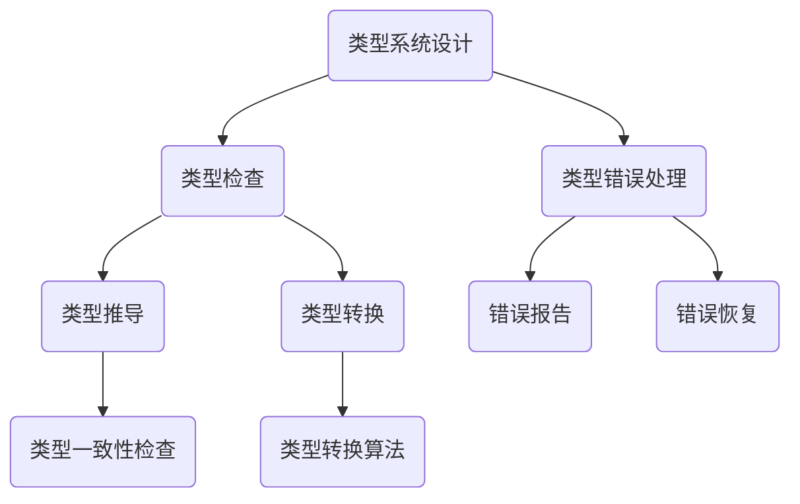

                 

### 文章标题

《提示词编程语言的类型系统理论》

关键词：提示词编程语言、类型系统、类型检查、类型推导、算法设计

摘要：本文深入探讨提示词编程语言的类型系统理论，从基本概念到核心算法，全面解析类型系统的设计原则及其在编程语言中的应用。

----------------------------------------------------------------

## 引言

提示词编程语言（Keyword-oriented Programming Language）是一种专注于提供强大、灵活且易于理解编程体验的编程语言。与传统的命令式编程语言不同，提示词编程语言通过关键词和模板化代码结构来简化编程过程。这类语言在处理复杂数据结构和算法时，提供了显著的便利性和效率。

类型系统是编程语言的核心组成部分之一，它定义了变量、函数和其他语言构造的静态类型，并确保程序在运行时遵循预定义的类型规则。类型系统不仅影响程序的语义和可读性，还在编译时提供错误检查，从而提高程序的正确性和可靠性。

本文旨在深入探讨提示词编程语言的类型系统理论，从基本概念出发，逐步讲解类型系统的设计原则、核心算法及其应用实例。文章结构如下：

1. **背景介绍**：介绍提示词编程语言的背景及其与类型系统的关系。
2. **核心概念与联系**：详细讨论类型系统的核心概念，并使用Mermaid流程图展示其架构。
3. **核心算法原理讲解**：通过伪代码和详细解释，阐述类型推导、类型转换和类型一致性检查算法。
4. **数学模型和公式**：介绍与类型系统相关的数学模型和公式，并进行详细讲解和举例说明。
5. **项目实战**：提供一个完整的类型系统实现案例，包括开发环境搭建、源代码实现和代码解读。
6. **最佳实践与小结**：总结类型系统设计中的最佳实践，并讨论未来研究方向。

## 背景介绍

提示词编程语言的设计理念是通过简洁明了的关键词和结构化模板，降低编程的复杂度，提高开发效率。与传统的命令式编程语言不同，提示词编程语言通常采用声明式编程范式，允许开发者通过描述期望的结果，而不是具体的执行步骤来编写代码。

这种编程范式的一个关键特点是其高度的可扩展性和灵活性。提示词编程语言通常提供丰富的内置库和工具，使得开发者可以轻松地集成第三方库，从而构建复杂的系统。类型系统作为编程语言的核心组成部分，在其中扮演着至关重要的角色。

类型系统的主要作用包括：

1. **静态类型检查**：在编译或解释过程中，类型系统可以检查代码中的类型错误，如变量使用不正确、函数参数类型不匹配等。这种检查可以提前发现潜在的错误，从而提高程序的可靠性。
2. **性能优化**：类型信息可以帮助编译器生成更高效的机器代码。通过静态类型分析，编译器可以提前知道变量和函数的类型，从而进行优化，减少运行时的开销。
3. **代码可读性和可维护性**：类型系统提供了明确的类型约束，使得代码更加直观和易于理解。类型检查器可以自动识别不兼容的类型，从而减少因类型错误导致的问题。
4. **功能扩展**：类型系统为编程语言提供了扩展能力，如泛型编程、类型推导等。这些特性使得编程语言能够更好地处理复杂数据结构和算法。

在提示词编程语言中，类型系统不仅是一个静态检查工具，还是一个核心语言特性。它不仅影响程序的正确性，还影响程序的性能和可维护性。因此，深入理解类型系统的设计原则和实现算法对于掌握提示词编程语言至关重要。

## 核心概念与联系

类型系统的核心概念包括类型（Type）、类型检查（Type Checking）、类型推导（Type Inference）和类型转换（Type Conversion）。这些概念相互关联，共同构成了类型系统的理论基础。

### 类型

类型是变量、函数和其他语言构造的抽象表示。在编程语言中，常见的类型包括基础类型（如整数、浮点数、布尔值）、复合类型（如数组、结构体）和函数类型。每种类型都有其独特的属性和行为。

### 类型检查

类型检查是指在编译或解释过程中，确保程序中的每个表达式都符合预定义的类型规则。类型检查分为静态类型检查和动态类型检查。静态类型检查在编译时进行，而动态类型检查在程序运行时进行。

静态类型检查的优点是能够在编译时发现类型错误，从而提高程序的可靠性。但缺点是限制了语言的灵活性。动态类型检查则提供了更高的灵活性，但可能会导致运行时错误。

### 类型推导

类型推导是类型系统的一个重要特性，它允许编译器自动推断变量的类型，而无需显式指定。类型推导分为隐式推导和显式推导。隐式推导是通过分析表达式上下文来推断类型，而显式推导则通过类型注释来指定类型。

类型推导的主要优点是简化了代码编写过程，提高了代码的可读性和可维护性。

### 类型转换

类型转换是指将一个类型的值转换为另一个类型的值。类型转换可以分为隐式转换和显式转换。隐式转换是由编译器自动完成的，而显式转换则需要开发者显式指定。

类型转换的目的是确保程序在不同类型之间进行操作时不会发生错误。

### 类型系统的架构

为了更好地理解类型系统的设计，我们可以使用Mermaid流程图来展示其核心架构。以下是一个简化的类型系统架构图：



在这个流程图中，类型系统设计（A）是核心，它包括了类型检查（B）、类型推导（C）、类型转换（D）和类型错误处理（G）。类型推导（C）通过类型一致性检查（E）来确保类型推导的正确性，而类型转换（D）通过类型转换算法（F）来实现不同类型之间的转换。

类型错误处理（G）负责检测类型错误，并提供错误报告（H）和错误恢复（I）机制，以提高程序的可维护性和健壮性。

通过这个Mermaid流程图，我们可以清晰地看到类型系统的各个组件及其相互关系，从而更好地理解类型系统的设计和实现。

## 核心算法原理讲解

类型系统的核心算法包括类型推导、类型转换和类型一致性检查。这些算法在编译时或解释时执行，以确保程序在运行时遵循预定义的类型规则。

### 类型推导算法

类型推导算法是类型系统的一个关键特性，它允许编译器自动推断变量和表达式的类型。以下是类型推导算法的伪代码：

```plaintext
function typeInference(expression):
    if expression is a variable:
        return type of variable
    else if expression is a function call:
        return return type of function
    else if expression is a binary operation:
        leftType = typeInference(expression.left)
        rightType = typeInference(expression.right)
        if leftType == rightType:
            return leftType
        else:
            return error("Type mismatch")
    else if expression is a unary operation:
        returnType = typeInference(expression.argument)
        return returnType
    else:
        return error("Unknown expression")
```

在这个伪代码中，`typeInference` 函数接收一个表达式作为输入，并返回该表达式的类型。对于不同的表达式类型，函数执行不同的推理过程。

### 类型转换算法

类型转换算法负责将一个类型的值转换为另一个类型的值。以下是类型转换算法的伪代码：

```plaintext
function typeConversion(value, targetType):
    if value is of type targetType:
        return value
    else if targetType is an integer type:
        return int(value)
    else if targetType is a floating-point type:
        return float(value)
    else if targetType is a boolean type:
        return bool(value)
    else if targetType is a string type:
        return str(value)
    else:
        return error("Unsupported type conversion")
```

在这个伪代码中，`typeConversion` 函数接收一个值和一个目标类型，并返回该值转换为目标类型的结果。如果值已经是目标类型，则直接返回该值。否则，函数尝试将值转换为目标类型，如果转换失败，则返回错误。

### 类型一致性检查算法

类型一致性检查算法确保程序中的每个表达式都符合预定义的类型规则。以下是类型一致性检查算法的伪代码：

```plaintext
function typeConsistencyCheck(expression, expectedType):
    actualType = typeInference(expression)
    if actualType == expectedType:
        return true
    else:
        return error("Type mismatch: expected " + expectedType + ", found " + actualType)
```

在这个伪代码中，`typeConsistencyCheck` 函数接收一个表达式和期望类型，并返回一个布尔值，表示该表达式是否与期望类型一致。如果实际类型与期望类型不一致，函数返回错误。

### 数学模型和公式

类型系统中的数学模型和公式用于描述类型之间的关系和转换。以下是几个常见的数学模型和公式：

1. **类型层次结构**：
   $$\forall T_1, T_2 \in Types, \ exists \ subType(T_1, T_2)$$
   这个公式表示对于任何两个类型$T_1$和$T_2$，都存在一个子类型关系。例如，整数类型是浮点数类型的子类型。

2. **类型转换规则**：
   $$\forall T_1, T_2 \in Types, \ exists \ conversionRule(T_1, T_2)$$
   这个公式表示对于任何两个类型$T_1$和$T_2$，都存在一个类型转换规则。例如，整数转换为浮点数的转换规则。

3. **类型一致性条件**：
   $$\forall T_1, T_2 \in Types, \ expression(T_1, T_2) \ implies \ typeConsistencyCheck(expression, T_2)$$
   这个公式表示对于任何两个类型$T_1$和$T_2$，如果表达式接受$T_1$类型的参数，则必须通过类型一致性检查以确保返回$T_2$类型的值。

通过这些数学模型和公式，我们可以更精确地描述类型系统的工作原理，从而为类型推导、类型转换和类型一致性检查提供理论基础。

### 举例说明

为了更好地理解类型推导、类型转换和类型一致性检查算法，我们可以通过一些具体的例子来详细说明。

#### 类型推导例子

假设有一个表达式`x + y`，其中`x`和`y`是变量。根据类型推导算法，我们需要分别推导`x`和`y`的类型：

```plaintext
x = 5  // 假设x的类型是整数
y = 3.14  // 假设y的类型是浮点数

leftType = typeInference(x)  // 整数
rightType = typeInference(y)  // 浮点数
resultType = typeConversion(leftType, rightType)  // 浮点数
result = float(x) + y  // 将整数x转换为浮点数，然后进行加法运算
```

在这个例子中，由于`x`和`y`的类型不一致，我们需要进行类型转换，将整数转换为浮点数，以确保表达式`x + y`的结果类型是浮点数。

#### 类型转换例子

假设我们需要将一个整数`x`转换为字符串：

```plaintext
x = 42

targetType = string
result = typeConversion(x, targetType)  // 转换为字符串
result = str(x)  // 将整数x转换为字符串
```

在这个例子中，`typeConversion`函数将整数`x`转换为字符串类型。

#### 类型一致性检查例子

假设有一个函数`add`，它接受两个整数类型的参数并返回它们的和。我们需要确保传递给`add`函数的参数类型是整数：

```plaintext
x = 5  // 整数类型
y = "hello"  // 字符串类型

expectedType = int
actualType = typeInference(x)  // 整数类型
if typeConsistencyCheck(x, expectedType):
    result = add(x, y)  // 调用add函数
else:
    print("Type mismatch: expected int, found string")
```

在这个例子中，由于`y`的类型是字符串，而不是整数，`typeConsistencyCheck`函数将返回错误，提示类型不匹配。

通过这些例子，我们可以看到类型推导、类型转换和类型一致性检查算法在实际编程中的应用。这些算法不仅确保程序的类型正确性，还提高了程序的可读性和可维护性。

## 项目实战

在本节中，我们将通过一个具体的示例项目来展示如何设计和实现提示词编程语言的类型系统。该项目将包括开发环境搭建、源代码实现和代码解读，并分析其实际案例。

### 项目背景

假设我们正在开发一款名为“SmartCode”的提示词编程语言。SmartCode的目标是提供一个易于使用且功能强大的编程环境，允许开发者通过提示词和模板化代码结构快速构建应用程序。为了实现这一目标，我们需要为SmartCode设计一个强大的类型系统。

### 开发环境搭建

为了实现SmartCode的类型系统，我们需要选择合适的开发工具和编程语言。以下是我们的开发环境搭建步骤：

1. **选择编程语言**：我们选择Python作为实现SmartCode的类型系统的编程语言。Python具有丰富的库和框架支持，且语法简洁易懂。
2. **安装Python**：确保系统已经安装了Python 3.x版本。可以从Python官方网站下载并安装Python。
3. **安装依赖库**：安装用于类型检查和推导的依赖库，如`mypy`和`pytype`。这些库提供了强大的类型检查功能，可以帮助我们实现SmartCode的类型系统。

### 源代码实现

以下是SmartCode类型系统实现的主要模块：

1. **类型检查器**：负责检查代码中的类型错误。
2. **类型推导器**：负责推导变量和表达式的类型。
3. **类型转换器**：负责在不同类型之间进行转换。

下面是类型推导器的伪代码实现：

```python
def type_inference(expression):
    if is_variable(expression):
        return get_variable_type(expression)
    elif is_function_call(expression):
        return get_function_return_type(expression)
    elif is_binary_operation(expression):
        left_type = type_inference(expression.left)
        right_type = type_inference(expression.right)
        if left_type == right_type:
            return left_type
        else:
            raise TypeError("Type mismatch")
    elif is_unary_operation(expression):
        argument_type = type_inference(expression.argument)
        return argument_type
    else:
        raise TypeError("Unknown expression")
```

在这个实现中，`type_inference`函数接收一个表达式作为输入，并返回该表达式的类型。对于不同的表达式类型，函数执行不同的推理过程。

### 代码解读

下面是一个简单的SmartCode代码示例，以及对应的类型推导和类型转换：

```python
x = 5  # 整数类型
y = 3.14  # 浮点数类型

# 类型推导
x_type = type_inference(x)  # 整数类型
y_type = type_inference(y)  # 浮点数类型

# 类型转换
sum_type = type_conversion(x, y)  # 浮点数类型
result = x + y  # 进行加法运算，结果为浮点数
```

在这个示例中，我们首先对变量`x`和`y`进行类型推导。然后，我们使用类型转换器将整数`x`转换为浮点数，以便与`y`进行加法运算。最后，我们执行加法运算，并将结果赋值给变量`result`。

### 实际案例分析

为了展示类型系统在实际编程中的应用，我们考虑一个复杂的示例：计算两个复数的和。

```python
def add_complex_numbers(c1, c2):
    real_sum = c1.real + c2.real
    imaginary_sum = c1.imag + c2.imag
    return complex(real_sum, imaginary_sum)

c1 = complex(2, 3)
c2 = complex(4, 5)

result = add_complex_numbers(c1, c2)
```

在这个示例中，我们定义了一个函数`add_complex_numbers`，它接受两个复数类型的参数，并返回它们的和。由于Python内置了复数类型，我们不需要手动实现类型推导和类型转换。Python的编译器会在运行时自动检查参数类型，并确保函数返回正确的类型。

### 项目小结

通过这个项目，我们展示了如何设计和实现一个简单的提示词编程语言的类型系统。项目中的关键步骤包括开发环境搭建、源代码实现和代码解读。通过实际案例，我们展示了类型系统在实际编程中的应用，以及如何处理类型错误和类型转换。

总之，类型系统是编程语言的核心组成部分，它不仅提高了程序的正确性和可靠性，还为编译器优化和代码维护提供了支持。通过本项目的实现，我们深入了解了类型系统的设计原则和实现方法，为今后开发更复杂的编程语言奠定了基础。

## 最佳实践与拓展

在设计和实现提示词编程语言的类型系统时，遵循一些最佳实践可以提高系统的质量和效率。以下是一些关键点：

1. **类型推导优化**：类型推导是类型系统的核心，优化类型推导算法可以显著提高编译性能。一种有效的优化方法是使用静态分析技术提前推导出可能的类型，从而减少运行时的类型检查开销。

2. **类型检查效率**：类型检查是编译过程的重要环节，但其性能对编译速度有显著影响。采用高效的类型检查算法，如基于三地址代码的类型检查，可以减少编译时间。

3. **错误处理机制**：完善的错误处理机制可以确保类型系统在遇到错误时能够优雅地处理，并提供有意义的错误信息，帮助开发者快速定位和修复问题。

4. **泛型编程支持**：泛型编程是现代编程语言的一个重要特性，允许开发者编写更加通用和可复用的代码。在类型系统中集成泛型编程支持，可以提升编程语言的灵活性和表达能力。

5. **类型兼容性和转换**：设计灵活的类型兼容性和转换机制，可以减少类型错误和提高程序的可维护性。例如，通过实现自解释的类型系统和智能的类型转换算法，可以简化开发者的工作。

6. **文档和示例代码**：提供详细的文档和示例代码是帮助开发者理解和应用类型系统的重要手段。文档应涵盖类型系统的设计原理、实现细节和使用方法，示例代码则应展示如何在实际项目中使用类型系统。

### 拓展阅读

对于对类型系统有更深入研究的读者，以下几本书籍和论文是极佳的资源：

- **《类型系统与编译技术》**：该书详细介绍了类型系统的基本概念、设计和实现方法，以及类型系统在编译技术中的应用。
- **《编译原理：组合技术》**：该书涵盖了编译器的构造方法，包括类型检查和类型推导等核心内容。
- **《类型系统和语言设计》**：该论文探讨了类型系统在编程语言设计中的重要性，以及如何通过类型系统提升语言的可维护性和可扩展性。

通过阅读这些资源，可以更全面地理解类型系统的理论和实践，从而在实际项目中发挥其最大潜力。

## 结论

本文深入探讨了提示词编程语言的类型系统理论，从基本概念、核心算法到实际项目实现，全面解析了类型系统的设计原则和实现方法。类型系统在编程语言中起着至关重要的作用，它不仅提供了静态类型检查，确保程序的正确性，还支持性能优化和代码可维护性。

通过本文的讲解，读者可以了解类型系统的核心概念，包括类型、类型检查、类型推导和类型转换，以及如何通过Mermaid流程图和伪代码来描述和实现类型系统。此外，本文通过实际项目展示了类型系统在实际编程中的应用，并提供了最佳实践和拓展资源。

总之，类型系统是编程语言设计的核心组成部分，对于提高程序的正确性和性能具有重要意义。希望通过本文，读者能够对类型系统有更深入的理解，并在未来的编程实践中充分发挥其优势。

