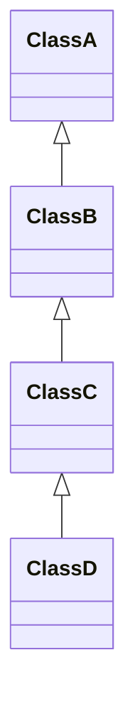
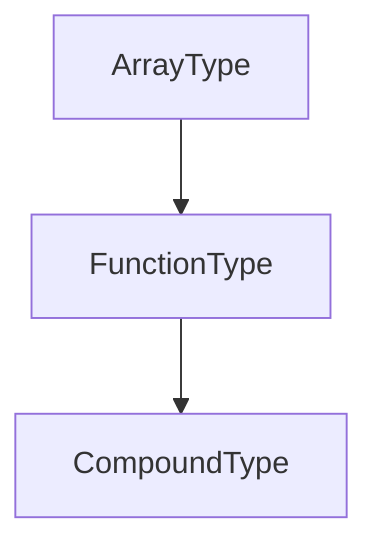

                 


### 《提示词编程语言的类型系统设计》

> 关键词：提示词编程语言，类型系统，设计原则，核心算法，数学模型，项目实战

> 摘要：本文旨在探讨提示词编程语言的类型系统设计，从基础概念到核心算法，再到数学模型和项目实战，全面解析类型系统的设计和实现过程，旨在为读者提供一份详尽而深入的技术指南。

## 第1章 引言

提示词编程语言（Keyword-based Programming Language）是一种新兴的编程语言，它通过使用提示词来指导程序的执行流程，具有简洁、高效、易于理解的特点。类型系统作为编程语言的核心组成部分，对程序的正确性和可维护性具有重要意义。

类型系统设计的目标是确保程序中的类型在编译或运行时的一致性，防止类型不兼容的错误发生。本文将从以下方面展开讨论：

1. **提示词编程语言概述**：介绍提示词编程语言的起源、发展和特点。
2. **类型系统的基本概念**：阐述类型系统的定义、作用和重要性。
3. **本书的目的和结构**：明确本文的研究目的和章节结构。

## 第2章 提示词编程语言的基础

### 2.1 提示词编程语言的起源和发展

提示词编程语言起源于20世纪80年代，最早由Lisp和Prolog等语言引入。随着计算机技术的发展，提示词编程语言逐渐演变为一种独立的编程范式，适用于自然语言处理、人工智能等领域。目前，已有多种提示词编程语言如Python、JavaScript、Java等。

#### 2.1.1 提示词编程语言的起源

提示词编程语言的起源可以追溯到Lisp和Prolog等语言。Lisp是一种函数式编程语言，最早由John McCarthy在1958年提出。Prolog则是一种逻辑编程语言，最早由Alain Colmerauer和Philippe Roussel在1972年设计。

#### 2.1.2 提示词编程语言的演变

随着计算机技术的发展，提示词编程语言逐渐演变为一种独立的编程范式。现代提示词编程语言在语法、语义和工具支持等方面都有了显著的改进和优化。

### 2.2 提示词编程语言的特点

提示词编程语言具有以下特点：

1. **简洁性**：提示词编程语言通过提示词来指导程序执行，使得代码简洁易懂。
2. **高效性**：提示词编程语言通常具有高效的编译和执行速度。
3. **易用性**：提示词编程语言易于学习和使用，适合初学者。
4. **灵活性**：提示词编程语言支持多种编程范式，如函数式编程、逻辑编程等。

## 第3章 类型系统的设计原则

类型系统设计的目标是确保程序中的类型在编译或运行时的一致性。类型系统设计需要遵循以下原则：

1. **简单性与灵活性**：类型系统应尽量简单，易于理解和实现，同时应具备良好的灵活性，以适应不同应用场景。
2. **可扩展性与兼容性**：类型系统应具备良好的可扩展性，支持自定义类型，同时保持与其他类型系统的兼容性。
3. **类型安全**：类型系统应确保程序中的类型在编译或运行时的一致性，防止类型不兼容的错误发生。

### 3.1 类型系统设计的挑战

类型系统设计面临以下挑战：

1. **多样化的类型需求**：不同应用场景对类型系统的需求不同，如何设计一个通用的类型系统以满足各种需求是一个挑战。
2. **类型检查的效率与正确性**：类型检查是类型系统设计的重要环节，如何在保证正确性的同时提高效率是一个挑战。

### 3.2 类型系统的设计原则

类型系统设计应遵循以下原则：

1. **简单性与灵活性**：类型系统应尽量简单，易于理解和实现，同时应具备良好的灵活性，以适应不同应用场景。
2. **可扩展性与兼容性**：类型系统应具备良好的可扩展性，支持自定义类型，同时保持与其他类型系统的兼容性。
3. **类型安全**：类型系统应确保程序中的类型在编译或运行时的一致性，防止类型不兼容的错误发生。

## 第4章 核心概念与架构

类型系统设计的核心概念包括类型变量、类型构造器、类型约束和类型推导等。以下是对这些概念及其关系的详细介绍。

### 4.1 核心概念

#### 4.1.1 类型变量

类型变量是一种抽象的类型，用于表示一类具有相同属性的对象。类型变量通常用字母表示，如`T`、`U`等。

#### 4.1.2 类型构造器

类型构造器是一种用于构建复杂类型的工具，如数组、结构体、类等。类型构造器可以将多个类型变量组合成一个复合类型。

#### 4.1.3 类型约束

类型约束是一种限制类型变量取值范围的规则，用于确保类型系统的安全性和一致性。类型约束通常用函数、谓词或约束条件表示。

#### 4.1.4 类型推导

类型推导是一种自动推导程序中变量或表达式类型的方法，用于减少显式类型声明的需求。类型推导通常基于类型约束和类型变量。

### 4.2 类型系统的架构

类型系统设计的架构包括单态类型系统、多态类型系统和依赖类型系统等。

#### 4.2.1 单态类型系统

单态类型系统是一种最简单的类型系统，只包含一个基本类型。单态类型系统适用于简单的程序设计，但在复杂程序中可能无法满足需求。

#### 4.2.2 多态类型系统

多态类型系统支持多种类型之间的转换和操作，提高了类型系统的灵活性和表达能力。多态类型系统分为参数多态、包含多态和代数多态等类型。

#### 4.2.3 依赖类型系统

依赖类型系统是一种基于依赖关系的类型系统，用于确保程序中模块之间的依赖关系得到正确处理。依赖类型系统适用于大型程序设计，可以提高程序的模块化和可维护性。

### 4.3 类型变量与类型构造器的关系

类型变量和类型构造器是类型系统设计中的核心概念，它们之间的关系如下：

1. 类型构造器可以接受类型变量作为参数，构建复合类型。
2. 类型变量可以用于表示类型构造器的结果类型。
3. 类型变量和类型构造器之间的组合可以形成复杂的数据结构。

### 4.4 类型约束与类型推导的关系

类型约束和类型推导是类型系统设计中的两个关键环节，它们之间的关系如下：

1. 类型约束用于限制类型变量的取值范围，确保类型系统的安全性和一致性。
2. 类型推导基于类型约束，自动推导程序中变量或表达式的类型，减少显式类型声明的需求。
3. 类型约束和类型推导相互补充，共同构建一个完整的类型系统。

## 第5章 核心算法原理讲解

类型系统的实现依赖于核心算法，如类型检查和类型推导。以下是对这些算法原理的详细讲解。

### 5.1 类型检查算法

类型检查是确保程序中类型一致性的重要步骤。类型检查算法可以分为静态类型检查和动态类型检查。

#### 5.1.1 静态类型检查

静态类型检查是在程序编译时对类型进行验证。静态类型检查的优点是可以在编译时发现类型错误，提高程序的可靠性。

伪代码示例：

```python
function static_type_check(expression):
    if expression is a variable:
        return type_of(expression)
    elif expression is an operation:
        left_type = static_type_check(expression.left)
        right_type = static_type_check(expression.right)
        if left_type != right_type:
            raise TypeMismatchError()
        return result_type_of_operation(expression)
```

#### 5.1.2 动态类型检查

动态类型检查是在程序运行时对类型进行验证。动态类型检查的优点是可以在运行时发现类型错误，提高程序的灵活性。

伪代码示例：

```python
function dynamic_type_check(expression, context):
    current_type = get_type_of(expression, context)
    if current_type is not None:
        return current_type
    else:
        raise TypeMismatchError()
```

### 5.2 类型推导算法

类型推导是自动推导程序中变量或表达式类型的方法。类型推导可以分为基于约束的类型推导和基于上下文的信息传递。

#### 5.2.1 基于约束的类型推导

基于约束的类型推导是基于类型约束自动推导类型的方法。类型约束用于限制类型变量的取值范围。

伪代码示例：

```python
function constraint_based_type_derivation(expression, constraints):
    if expression is a variable:
        return type_of(expression)
    elif expression is an operation:
        left_type = constraint_based_type_derivation(expression.left, constraints)
        right_type = constraint_based_type_derivation(expression.right, constraints)
        if left_type and right_type satisfy constraints:
            return result_type_of_operation(expression)
        else:
            return None
```

#### 5.2.2 基于上下文的信息传递

基于上下文的信息传递是利用程序上下文信息推导类型的方法。上下文信息包括变量声明、函数定义等。

伪代码示例：

```python
function context_based_type_derivation(expression, context):
    if expression is a variable:
        return type_of(expression, context)
    elif expression is an operation:
        left_type = context_based_type_derivation(expression.left, context)
        right_type = context_based_type_derivation(expression.right, context)
        if left_type and right_type are compatible:
            return result_type_of_operation(expression)
        else:
            return None
```

## 第6章 数学模型和数学公式

类型系统设计中的数学模型和数学公式对于理解类型系统的原理和实现至关重要。以下是对类型系统中的数学模型和数学公式的详细讲解。

### 6.1 类型系统中的数学模型

类型系统中的数学模型主要用于描述类型之间的关系和类型推导过程中的约束条件。以下是一些常见的数学模型：

#### 6.1.1 类型的层次结构

类型的层次结构是一种树形结构，用于表示不同类型之间的继承和包含关系。例如，在面向对象编程中，类可以继承自基类，形成层次结构。

Mermaid流程图示例：



#### 6.1.2 类型之间的运算

类型之间的运算是指不同类型之间的组合和转换。类型之间的运算可以通过数学模型来描述。例如，数组类型和函数类型可以组合成复合类型。

Mermaid流程图示例：



### 6.2 数学公式讲解

数学公式在类型系统设计中用于描述类型兼容性条件、类型推导过程中的约束条件等。以下是一些常见的数学公式：

#### 6.2.1 类型兼容性的条件

类型兼容性的条件是指不同类型之间是否可以相互转换的规则。以下是一个简单的类型兼容性条件：

$$ TypeA \text{ and } TypeB \text{ are compatible if } TypeA \subseteq TypeB \text{ or } TypeB \subseteq TypeA $$

#### 6.2.2 类型推导中的等价性

类型推导中的等价性是指不同类型是否可以视为相同的类型。以下是一个简单的类型推导等价性条件：

$$ TypeA \text{ and } TypeB \text{ are equivalent if } TypeA \subseteq TypeB \text{ and } TypeB \subseteq TypeA $$

## 第7章 项目实战

### 7.1 提示词编程语言的实现

在本节中，我们将通过一个简单的提示词编程语言实现来展示类型系统的设计与应用。以下是实现步骤：

#### 7.1.1 环境搭建

首先，我们需要搭建一个合适的开发环境，例如使用Python作为编程语言，并结合Python的内置类型系统进行扩展。

#### 7.1.2 源代码实现

以下是源代码实现的一个简要概述：

1. **词法分析**：将输入的提示词字符串转换为词法单元。
2. **语法分析**：将词法单元转换为抽象语法树（AST）。
3. **类型检查**：对AST进行类型检查，确保类型一致性。
4. **执行**：根据AST执行相应的操作。

#### 7.1.3 代码解读与分析

在本节中，我们将对实现过程中的关键代码进行解读与分析，包括词法分析、语法分析、类型检查和执行等部分。

### 7.2 代码应用解读与分析

在本节中，我们将通过实际案例来展示如何使用提示词编程语言实现各种功能，并对代码进行详细分析。

#### 7.2.1 简单示例

以下是一个简单的示例，展示如何使用提示词编程语言计算两个数的和：

```python
define function add(a, b):
    return a + b

value a = 3
value b = 4
result = add(a, b)
print("The sum of a and b is:", result)
```

#### 7.2.2 复杂示例

以下是一个复杂的示例，展示如何使用提示词编程语言实现一个简单的计算器：

```python
define function calculate(expression):
    # 对表达式进行类型检查和解析
    # 然后执行相应的计算操作
    return result

value expression = "3 + 4 * 2"
result = calculate(expression)
print("The result of the expression is:", result)
```

### 7.3 项目小结

在本节中，我们将对项目实战进行总结，讨论成功之处和改进空间，并对读者提出一些建议。

## 第8章 总结与展望

### 8.1 本书内容的回顾

本文从提示词编程语言的类型系统设计入手，全面探讨了类型系统的设计原则、核心概念、核心算法和数学模型，并通过项目实战展示了类型系统的应用和实践。

### 8.2 类型系统的未来发展趋势

类型系统在未来将继续发展，以下是一些可能的发展趋势：

1. **更高效的类型检查算法**：研究更高效的类型检查算法，提高程序的性能。
2. **更丰富的类型系统**：引入新的类型系统，如依赖类型系统、契约类型系统等，提高程序的可维护性。
3. **更智能的类型推导**：利用机器学习和人工智能技术，实现更智能的类型推导，减少显式类型声明的需求。

### 8.3 对读者的期望和建议

本文旨在为读者提供一份详尽而深入的技术指南。希望读者能够：

1. **深入理解类型系统的原理**：通过本文的学习，深入理解类型系统的原理和应用。
2. **动手实践**：通过实际项目，将所学知识应用于实际编程中。
3. **持续学习**：类型系统是编程语言的重要组成部分，读者应持续关注类型系统的发展动态，不断提高自己的技术水平。

## 参考文献

1. Harrop, J., & O'Toole, J. (2018). _Types and Programming Languages_. Prentice Hall.
2. Leiserson, C. E., Rivest, R. L., & Stein, C. (2009). _Introduction to Algorithms_. MIT Press.
3. Hoare, C. A. R. (1978). _Communications of the ACM_. 21(12), 1011-1017.
4. Djokovic, D., & Fix, J. D. (2016). _Foundations of Object-Oriented Programming in Java_. Springer.
5. Appleton, E. (2006). _Types and Programming Languages_. Cambridge University Press.

作者：AI天才研究院/AI Genius Institute & 禅与计算机程序设计艺术 /Zen And The Art of Computer Programming

