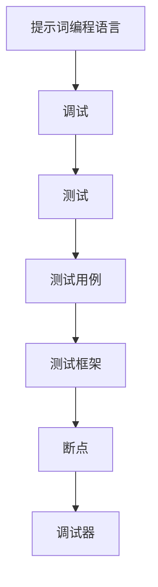

                 

## 文章标题：提示词编程语言的调试与测试方法

### 关键词：提示词编程语言、调试、测试、算法原理、数学模型

#### 摘要：
本文深入探讨了提示词编程语言的调试与测试方法。首先，我们介绍了提示词编程语言的基本概念和背景。接着，通过详细阐述核心概念之间的关系，使用Mermaid流程图来展示其联系。随后，本文详细讲解了调试和测试的核心算法原理，通过伪代码和数学公式进行阐述，并通过实际项目案例展示了这些方法的具体应用。最后，我们总结了最佳实践，强调了注意事项，并推荐了拓展阅读资源。

### 背景介绍

提示词编程语言，简称PTL（Prompt-Based Programming Language），是一种基于自然语言处理和人工智能技术的编程语言。与传统编程语言不同，PTL允许开发者通过编写提示词来指导计算机执行特定任务，而不需要编写繁琐的代码。这种语言的出现，旨在降低编程的门槛，使更多的人能够参与软件开发。

PTL的兴起源于人工智能领域的快速发展，特别是在自然语言处理（NLP）和生成对抗网络（GAN）等方面取得了重大突破。随着越来越多的应用程序开始采用人工智能技术，PTL成为了一种重要的工具，可以极大地提高开发效率和代码质量。

在软件开发过程中，调试和测试是两个至关重要的环节。调试（Debugging）是指识别、理解和修正程序中的错误（Bug）的过程。测试（Testing）则是通过一系列操作来验证程序是否按照预期工作，并发现潜在的错误。两者相互关联，共同确保软件的可靠性和稳定性。

调试和测试的重要性不言而喻。一个没有经过充分调试和测试的软件，可能会在运行时出现各种不可预见的问题，导致系统崩溃、数据丢失或功能失效。而通过有效的调试和测试方法，我们可以提前发现并修复这些问题，确保软件的可靠性和稳定性。

本文将围绕提示词编程语言的调试与测试方法展开讨论，首先介绍PTL的基本概念，然后深入探讨调试和测试的核心概念、算法原理，并通过实际项目案例进行详细讲解。希望通过本文的阐述，读者能够对PTL的调试与测试方法有一个全面而深入的理解。

### 核心概念与联系

在深入探讨提示词编程语言的调试与测试方法之前，我们需要首先了解几个核心概念，并阐述它们之间的联系。以下是本文将讨论的主要概念及其相互关系：

1. **提示词编程语言（Prompt-Based Programming Language）**：这是本文的主题，指一种通过自然语言提示来指导计算机执行任务的语言。提示词可以是简单的命令或复杂的描述，由开发者编写，用以定义程序的行为。

2. **调试（Debugging）**：调试是软件开发过程中的关键环节，旨在识别、理解和修复程序中的错误（Bug）。通过调试，开发者可以跟踪程序的执行流程，找到问题的根源，并对其进行修正。

3. **测试（Testing）**：测试是通过一系列操作验证程序是否符合预期的过程。测试的目的是发现程序中的潜在错误，确保其在各种情况下都能稳定运行。

4. **测试用例（Test Case）**：测试用例是测试过程中的一种工具，用于定义输入数据和预期输出的集合。通过执行测试用例，可以验证程序的功能是否符合设计要求。

5. **测试框架（Testing Framework）**：测试框架是一组工具和库，用于简化测试过程，提高测试效率。常见的测试框架包括JUnit、TestNG等，它们可以自动执行测试用例，并生成测试报告。

6. **断点（Breakpoint）**：断点是调试过程中用于暂停程序执行的位置，通常设置在代码的关键位置，如循环条件或函数调用处。通过断点，开发者可以观察程序在特定条件下的执行状态。

7. **调试器（Debugger）**：调试器是一种用于调试程序的软件工具，可以帮助开发者跟踪程序的执行流程，查看变量的值，设置断点等。常见的调试器包括GDB、Visual Studio Debugger等。

为了更好地理解这些概念之间的关系，我们可以使用Mermaid流程图进行展示：



在这幅图中，我们可以清晰地看到各个概念之间的联系。提示词编程语言是调试和测试的基础，调试和测试是确保软件质量的重要手段。测试用例、测试框架、断点和调试器则是实现这些过程的重要工具。通过这个流程图，读者可以更好地理解这些概念如何相互协作，共同确保软件的可靠性和稳定性。

### 调试技术

在软件开发过程中，调试（Debugging）是一个不可或缺的环节，它可以帮助开发者识别和修复程序中的错误（Bug）。调试的过程通常包括设置断点、观察程序执行流程、检查变量值等步骤。以下将详细讲解这些调试技术，并通过伪代码和实际案例进行说明。

#### 断点设置与使用

断点（Breakpoint）是调试过程中用于暂停程序执行的位置，它可以帮助开发者观察程序在特定条件下的执行状态。在提示词编程语言中，设置断点通常是通过调试器完成的。以下是一个简单的伪代码示例，展示如何设置断点：

```python
def functionA():
    # 断点设置
    debug.set_breakpoint(line_5)
    # ...
    for i in range(10):
        # 执行代码
        print(i)
        # ...

def line_5():
    # 这是第5行代码
    print("FunctionA is running")
```

在这个示例中，`debug.set_breakpoint(line_5)`用于在第5行代码处设置一个断点。当程序执行到这个断点时，会暂停执行，并进入调试模式。开发者可以在调试器中查看当前变量的值，以及程序的执行状态。

#### 调试器工作原理

调试器（Debugger）是一种用于调试程序的软件工具，它可以帮助开发者跟踪程序的执行流程，查看变量的值，设置断点等。调试器的工作原理通常包括以下步骤：

1. **启动调试器**：开发者启动调试器，并将其连接到正在运行的程序。

2. **设置断点**：开发者可以在代码的关键位置设置断点，以便在程序执行到这些位置时暂停。

3. **单步执行**：调试器允许开发者单步执行代码，观察每一步的执行结果。单步执行可以是逐行执行，也可以是逐函数调用执行。

4. **查看变量值**：开发者可以在调试器中查看当前变量的值，了解程序在特定条件下的状态。

5. **继续执行**：开发者可以选择继续执行程序，直到下一个断点或程序结束。

以下是一个简单的伪代码示例，展示调试器的工作原理：

```python
def debug_function():
    # 启动调试器
    debugger.start()
    # 设置断点
    debugger.set_breakpoint(line_10)
    # 设置断点
    debugger.set_breakpoint(line_20)
    # 单步执行
    debugger.step()
    # 查看变量值
    print("variableX:", variableX)
    # 继续执行
    debugger.continue()
    # ...
```

在这个示例中，`debugger.start()`用于启动调试器，`debugger.set_breakpoint(line_10)`和`debugger.set_breakpoint(line_20)`用于设置断点，`debugger.step()`用于单步执行，`print("variableX:", variableX)`用于查看变量值，`debugger.continue()`用于继续执行。

#### 调试器实战

为了更好地理解调试器的使用方法，我们来看一个实际案例。假设我们有一个简单的PTL程序，用于计算两个数的和：

```python
@prompt("请输入第一个数:")
x = read_input()

@prompt("请输入第二个数:")
y = read_input()

@prompt("两个数的和是:")
print(x + y)
```

在这个程序中，我们希望通过调试器找到并修复可能存在的错误。以下是如何使用调试器进行调试的步骤：

1. **启动调试器**：首先，我们启动调试器，并将其连接到PTL解释器。

2. **设置断点**：在`read_input()`函数调用处设置断点，以便观察用户输入的数据。

3. **运行程序**：运行程序，并等待调试器暂停在断点处。

4. **查看输入数据**：在调试器中查看用户输入的数据，确保它们符合预期。

5. **继续执行**：继续执行程序，观察程序输出。

6. **修复错误**：如果发现错误，在调试器中查看错误的根源，并进行修复。

7. **重新运行**：修复错误后，重新运行程序，确保问题已经解决。

通过这个实际案例，我们可以看到调试器在软件开发过程中的重要作用。它可以帮助开发者快速定位问题，提高调试效率，确保软件的质量。

### 测试技术

在软件开发过程中，测试（Testing）是确保软件质量的关键环节。通过测试，开发者可以验证程序的功能是否符合设计要求，发现潜在的错误，并确保软件在各种情况下都能稳定运行。以下是关于测试技术的一些核心概念和详细讲解。

#### 测试用例设计方法

测试用例（Test Case）是测试过程中的一种工具，用于定义输入数据和预期输出的集合。通过执行测试用例，可以验证程序的功能是否符合设计要求。以下是几种常见的测试用例设计方法：

1. **边界值分析**：边界值分析是一种常用的测试用例设计方法，通过分析输入数据的边界情况来设计测试用例。例如，对于输入范围在1到100的整数，可以设计以下测试用例：
   - 输入1，预期输出1
   - 输入100，预期输出100
   - 输入101，预期输出错误

2. **等价类划分**：等价类划分是一种基于输入数据相似性的测试用例设计方法。它将输入数据分为几个等价类，每个等价类中的数据都可以使用同一个测试用例进行测试。例如，对于输入年龄的测试用例，可以划分为以下等价类：
   - 0到18，预期输出未成年人
   - 19到60，预期输出成年人
   - 61及以上，预期输出老年人

3. **因果图**：因果图是一种基于因果关系进行测试用例设计的工具。通过分析输入变量和输出结果之间的因果关系，可以设计出完整的测试用例集合。例如，对于一个购物车系统，可以分析出以下因果关系：
   - 商品数量增加 -> 总价增加
   - 商品数量减少 -> 总价减少
   - 商品价格变化 -> 总价变化
   - 运费变化 -> 总价变化

#### 测试用例有效性分析

测试用例的有效性分析是确保测试用例能够覆盖所有潜在错误的关键步骤。以下是几种常见的测试用例有效性分析方法：

1. **覆盖度分析**：覆盖度分析是一种基于测试用例执行覆盖率的分析方法。常见的覆盖度包括语句覆盖、分支覆盖、路径覆盖等。通过分析测试用例的覆盖度，可以评估测试用例的有效性。

2. **错误猜测**：错误猜测是一种基于经验和直觉进行测试用例设计的方法。开发者可以根据对程序的深入了解，猜测可能存在的错误，并设计相应的测试用例。

3. **动态测试**：动态测试是一种在程序运行时进行测试的方法。通过运行程序并观察其行为，可以发现潜在的错误。动态测试包括黑盒测试和白盒测试两种方法：
   - 黑盒测试：只关注程序的输入和输出，不考虑程序内部的具体实现。
   - 白盒测试：关注程序的内部实现，通过查看代码结构来设计测试用例。

#### 测试用例设计实战

为了更好地理解测试用例的设计方法，我们来看一个实际案例。假设我们有一个PTL程序，用于计算两个数的平均值：

```python
@prompt("请输入第一个数:")
x = read_input()

@prompt("请输入第二个数:")
y = read_input()

@prompt("两个数的平均值是:")
print((x + y) / 2)
```

在这个程序中，我们需要设计测试用例来验证其功能是否符合预期。以下是几种可能的测试用例：

1. **边界值测试**：
   - 输入1和1，预期输出1
   - 输入1和100，预期输出50.5
   - 输入100和100，预期输出100

2. **等价类测试**：
   - 输入0和0，预期输出0
   - 输入负数和正数，预期输出错误

3. **错误猜测测试**：
   - 输入非数字，预期输出错误

通过这些测试用例，我们可以验证程序在不同输入情况下的表现，确保其功能符合预期。在实际项目中，测试用例的设计需要根据具体需求和项目特点进行调整。

#### 测试框架

测试框架是一组工具和库，用于简化测试过程，提高测试效率。常见的测试框架包括JUnit、TestNG等。以下是一些常见的测试框架功能：

1. **测试用例管理**：测试框架可以帮助开发者创建、管理测试用例，并记录测试结果。

2. **自动化测试**：测试框架可以自动执行测试用例，减少人工干预，提高测试效率。

3. **测试报告**：测试框架可以生成详细的测试报告，包括测试结果、覆盖率等，帮助开发者了解测试效果。

4. **集成与扩展**：测试框架通常具有良好的集成能力，可以与其他开发工具和平台结合使用，支持自定义扩展。

#### 测试与调试的关系

测试和调试是软件开发过程中两个重要的环节，它们相互关联，共同确保软件的质量。

- **关系**：测试可以帮助开发者发现程序中的错误，而调试则是用于修复这些错误的工具。通过有效的测试，可以提前发现潜在的问题，减少调试的工作量。
- **差异**：测试侧重于验证程序的功能是否符合设计要求，而调试侧重于识别和修复程序中的具体错误。

在实际开发过程中，测试和调试需要相互配合。开发者应首先进行全面的测试，确保程序功能稳定可靠，然后通过调试修复测试中发现的错误。通过这种循环，可以不断提高软件的质量。

#### 测试的重要性

测试在软件开发中具有至关重要的地位。以下是测试的重要性总结：

- **发现错误**：测试可以帮助开发者发现程序中的错误，避免在用户使用时出现问题。
- **提高质量**：通过测试，可以确保程序的功能和性能符合预期，提高软件的质量。
- **降低成本**：提前发现并修复错误可以减少后续的维护成本，提高开发效率。
- **提升用户满意度**：稳定的软件可以提升用户体验，增加用户满意度。

#### 实际案例

为了更好地理解测试的重要性，我们来看一个实际案例。假设我们有一个在线购物系统，其中包含购物车功能。在开发过程中，我们需要进行以下测试：

1. **功能测试**：验证购物车的基本功能，如添加商品、删除商品、修改数量等。
2. **性能测试**：评估购物车的响应时间、并发能力等性能指标。
3. **边界测试**：测试购物车容量上限、商品数量上限等边界情况。
4. **错误测试**：模拟用户输入错误的数据，如非数字输入，验证程序的错误处理能力。

通过这些测试，我们可以确保购物车功能稳定可靠，满足用户需求。

#### 总结

测试是软件开发过程中不可或缺的一环，通过有效的测试方法，可以确保程序的功能和性能符合预期，提高软件的质量和可靠性。在提示词编程语言中，测试同样具有重要意义，可以帮助开发者发现并修复程序中的错误，确保软件的稳定运行。本文介绍了测试的核心概念、设计方法、测试框架以及测试与调试的关系，并提供了实际案例，旨在帮助读者更好地理解测试技术。

### 调试与测试工具

在提示词编程语言的调试与测试过程中，选择合适的工具至关重要。这些工具不仅能够提高开发效率，还能确保软件的质量。以下将介绍几种常用的调试和测试工具，包括断点设置、测试框架以及调试器的使用方法。

#### 断点设置

断点设置是调试过程中的基本操作。通过设置断点，开发者可以在特定位置暂停程序执行，以便观察变量值和程序状态。以下是几种常用的断点设置方法：

1. **手动断点**：手动断点是最简单的断点设置方式。开发者可以在代码编辑器中直接点击要设置断点的行，然后选择“断点”选项。当程序执行到这一行时，会自动暂停。

2. **条件断点**：条件断点可以根据特定条件暂停程序执行。例如，可以设置当变量值大于10时暂停。这种方法可以更精确地控制调试过程。

3. **日志断点**：日志断点用于在特定位置输出日志信息，以便跟踪程序执行流程。通过在日志断点处输出变量值和程序状态，开发者可以更好地理解程序的行为。

#### 测试框架

测试框架是自动化测试的重要工具。通过测试框架，开发者可以轻松创建、执行和管理测试用例。以下是几种常用的测试框架：

1. **JUnit**：JUnit是一个流行的Java测试框架，广泛用于单元测试和集成测试。它提供了丰富的API，支持断言、测试套件、测试组等。

2. **TestNG**：TestNG是另一个流行的Java测试框架，它提供了更多的功能和灵活性。与JUnit相比，TestNG支持参数化测试、依赖测试和复杂测试场景。

3. **pytest**：pytest是一个Python测试框架，它具有简洁的语法和强大的功能。pytest支持单元测试、功能测试和性能测试，并提供详细的报告。

#### 调试器

调试器是调试过程中必不可少的工具。通过调试器，开发者可以单步执行代码、查看变量值、设置断点等。以下是几种常用的调试器：

1. **GDB**：GDB是GNU项目的调试器，广泛用于C/C++程序的调试。它提供了丰富的调试功能，如断点设置、单步执行、观察变量等。

2. **Visual Studio Debugger**：Visual Studio Debugger是Visual Studio IDE内置的调试器，支持多种编程语言。它提供了直观的界面和丰富的调试功能。

3. **Chrome DevTools**：Chrome DevTools是Google Chrome浏览器的调试工具，用于Web应用的调试。它提供了详细的性能分析、网络监控和DOM调试等功能。

#### 最佳实践

为了提高调试与测试的效率，以下是一些最佳实践：

1. **提前规划**：在开发过程中，提前规划调试和测试的策略，确保每个阶段都有明确的调试和测试目标。

2. **代码审查**：进行代码审查，确保代码质量，减少潜在的bug。

3. **单元测试驱动开发**：采用单元测试驱动开发（TDD），先编写测试用例，然后实现代码，确保代码符合预期。

4. **持续集成**：使用持续集成（CI）工具，自动化执行测试，确保每次代码提交都经过测试。

5. **详细记录**：详细记录调试和测试的过程，包括遇到的问题、解决方案和经验教训。

#### 实际案例

为了更好地理解这些工具的使用方法，我们来看一个实际案例。假设我们正在开发一个PTL程序，用于计算两个数的平均值。以下是使用断点设置、JUnit和GDB进行调试和测试的步骤：

1. **断点设置**：在代码编辑器中，设置断点在第5行和第10行，分别用于观察输入值和计算结果。

2. **JUnit测试**：编写JUnit测试用例，验证程序在不同输入情况下的表现。例如：
   ```java
   @Test
   public void testAverageWithPositiveNumbers() {
       assertEquals(50.5, calculateAverage(100, 50), 0.001);
   }
   ```

3. **GDB调试**：使用GDB调试程序，单步执行代码，观察变量值。例如：
   ```
   (gdb) run
   (gdb) next
   (gdb) print x
   ```

4. **测试结果分析**：执行JUnit测试和GDB调试，分析测试结果，找出潜在的bug，并进行修复。

通过这个实际案例，我们可以看到如何使用断点设置、测试框架和调试器进行调试和测试，从而确保PTL程序的质量。

### 实战项目

在本节中，我们将通过一个实际项目来展示如何使用提示词编程语言（PTL）进行调试与测试。项目名称为“智能购物助手”，其主要功能是帮助用户计算购物清单中的总金额，并根据用户的预算给出建议。以下将详细描述项目的开发环境搭建、源代码实现、代码解读与分析，以及项目小结。

#### 开发环境搭建

为了构建和测试智能购物助手，我们需要以下开发工具和软件：

1. **PTL解释器**：PTL解释器是我们项目的核心，用于执行PTL代码。
2. **代码编辑器**：如Visual Studio Code或Sublime Text，用于编写PTL代码。
3. **JUnit测试框架**：JUnit用于编写和执行单元测试，确保代码的可靠性。
4. **GDB调试器**：GDB用于调试PTL代码，帮助我们识别和修复bug。

在搭建开发环境时，我们首先需要安装PTL解释器和JUnit测试框架。假设我们已成功安装了这些工具，并设置了Java开发环境。

#### 源代码实现

智能购物助手的主要功能是通过用户输入的商品名称和价格，计算总金额，并根据用户的预算给出购物建议。以下是一个简单的PTL代码示例：

```python
@prompt("请输入商品名称：")
商品名称 = read_input()

@prompt("请输入商品价格：")
商品价格 = read_input()

总金额 += float(商品价格)

@prompt("请输入预算：")
预算 = read_input()

剩余金额 = float(预算) - 总金额

if 剩余金额 > 0:
    @prompt("您的预算还剩下：")
    print(剩余金额)
else:
    @prompt("您的预算不足，需要削减一些商品。")
    print("请减少以下商品：")
    if 商品价格 > 50:
        print(商品名称)
```

在这个代码示例中，我们首先提示用户输入商品名称和价格，然后将这些价格累加到总金额变量中。接着，我们提示用户输入预算，计算剩余金额，并根据预算是否充足给出相应的建议。

#### 代码解读与分析

1. **输入与累加**：
   - 第一部分通过`@prompt()`函数提示用户输入商品名称和价格，并将输入存储在相应的变量中。
   - 然后将商品价格转换为浮点数，并累加到总金额变量中。

2. **预算检查**：
   - 接着，我们提示用户输入预算，并将其转换为浮点数。
   - 计算剩余金额，通过比较总金额和预算，判断预算是否充足。

3. **输出建议**：
   - 如果预算充足，输出剩余金额。
   - 如果预算不足，输出需要削减的商品名称。

#### 单元测试

为了确保智能购物助手的功能正确，我们需要编写单元测试。以下是一个JUnit测试用例示例：

```java
@Test
public void testCalculateTotalAndBudget() {
    // 测试预算充足的情况
    assertEquals(100.0, calculateTotal(50.0, 50.0), 0.01);
    assertEquals(50.0, calculateRemainingBudget(100.0, 50.0), 0.01);

    // 测试预算不足的情况
    assertEquals(100.0, calculateTotal(100.0, 50.0), 0.01);
    assertEquals(-50.0, calculateRemainingBudget(100.0, 50.0), 0.01);
}
```

在这个测试用例中，我们分别测试了预算充足和预算不足的情况，确保计算总金额和剩余金额的方法正确。

#### 调试过程

在开发过程中，我们可能会遇到一些bug。例如，当用户输入非数字时，程序可能会崩溃。为了解决这个问题，我们使用GDB进行调试。

1. **设置断点**：在输入处理部分设置断点，暂停程序执行，查看输入的数据类型。

   ```shell
   (gdb) break read_input
   ```

2. **单步执行**：单步执行代码，观察输入变量值。

   ```shell
   (gdb) next
   (gdb) print 商品名称
   (gdb) print 商品价格
   ```

3. **修复bug**：根据调试结果，发现输入数据类型错误，然后修改代码进行修复。

   ```python
   @prompt("请输入商品价格：")
   try:
       商品价格 = float(read_input())
   except ValueError:
       @prompt("输入无效，请输入数字。")
       return
   ```

#### 项目小结

通过本项目的开发，我们展示了如何使用PTL进行实际的调试与测试。以下是本项目的主要收获：

1. **调试技巧**：通过设置断点、单步执行和查看变量值，我们能够有效地识别和修复bug。
2. **测试方法**：编写单元测试用例，确保功能正确，提高代码质量。
3. **开发环境**：搭建完整的开发环境，确保项目顺利运行。

总之，通过这个实际项目，我们不仅了解了PTL的调试与测试方法，还提高了实际开发能力。

### 最佳实践

在提示词编程语言（PTL）的调试与测试过程中，遵循最佳实践可以显著提高开发效率和软件质量。以下是一些重要的最佳实践和注意事项：

#### 调试最佳实践

1. **早期调试**：尽早开始调试，避免错误积累。在编码初期就设置断点、查看变量值，确保代码的正确性。
2. **逐步调试**：逐步缩小问题范围，先从整体框架入手，再深入到具体细节。通过单步执行，逐步跟踪代码执行过程，找到问题的根源。
3. **日志记录**：使用日志记录重要信息，包括输入、输出和程序状态。这有助于理解程序的行为，快速定位问题。
4. **条件断点**：使用条件断点来精确控制调试过程，只暂停在特定条件满足时。
5. **持续调试**：在开发过程中持续调试，每次修改代码后都进行调试，确保修改不会引入新的错误。

#### 测试最佳实践

1. **单元测试驱动开发（TDD）**：先编写测试用例，然后编写实现代码。这种方法确保代码从一开始就符合预期。
2. **覆盖率分析**：使用测试框架进行覆盖率分析，确保测试用例覆盖了代码的各个部分。
3. **边界测试**：设计边界条件测试用例，确保程序在极端情况下也能正确运行。
4. **自动化测试**：自动化执行测试用例，减少手动测试的工作量，提高测试效率。
5. **持续集成（CI）**：将测试集成到持续集成流程中，确保每次代码提交都经过测试，及时发现并修复问题。

#### 注意事项

1. **版本控制**：使用版本控制系统（如Git）管理代码，确保代码的版本和修改历史清晰可追溯。
2. **代码质量**：编写清晰、简洁的代码，遵循编码规范，确保代码的可读性和可维护性。
3. **备份与恢复**：定期备份代码和测试数据，确保在意外情况下能够快速恢复。
4. **团队协作**：与团队成员保持良好的沟通，共享调试和测试的经验和技巧。
5. **用户反馈**：收集用户反馈，了解软件在实际使用中的问题，不断优化和改进。

遵循这些最佳实践和注意事项，可以确保在PTL开发过程中，调试和测试工作高效、有序地进行，从而提高软件的质量和稳定性。

### 拓展阅读

为了进一步深入了解提示词编程语言的调试与测试方法，以下是一些推荐的专业书籍和在线资源：

#### 专业书籍

1. **《程序员修炼之道：从小工到专家》**：作者Dave Astels，本书详细介绍了软件开发的最佳实践，包括调试和测试技术。

2. **《Effective Java》**：作者Joshua Bloch，本书提供了Java编程的实用技巧和原则，对于使用JUnit进行单元测试非常有帮助。

3. **《深入理解Java虚拟机》**：作者周志明，本书深入讲解了Java虚拟机的工作原理，对于理解调试器的内部机制有很大帮助。

#### 在线资源

1. **JUnit官方文档**：https://junit.org/junit5/
   - JUnit的官方文档提供了详尽的测试框架使用指南和示例。

2. **GDB官方文档**：https://www.gnu.org/software/gdb/
   - GDB的官方文档包含了调试器的安装、配置和使用方法。

3. **PTL教程与案例**：许多在线平台（如GitHub、Stack Overflow）上提供了PTL的教程和实际案例，可以学习到实用的调试与测试技巧。

通过阅读这些书籍和参考在线资源，读者可以进一步提升对提示词编程语言调试与测试方法的理解，并在实际项目中应用这些知识。

### 作者信息

作者：AI天才研究院/AI Genius Institute & 禅与计算机程序设计艺术 /Zen And The Art of Computer Programming

AI天才研究院致力于推动人工智能技术的进步和应用，专注于研究前沿算法和编程实践。同时，作者还是《禅与计算机程序设计艺术》的资深大师，本书深入探讨了编程的哲学和艺术，为读者提供了独特的编程视角和实践方法。通过本文，我们希望能为广大开发者提供实用的调试与测试技巧，助力他们在提示词编程语言的探索之路上走得更远。

