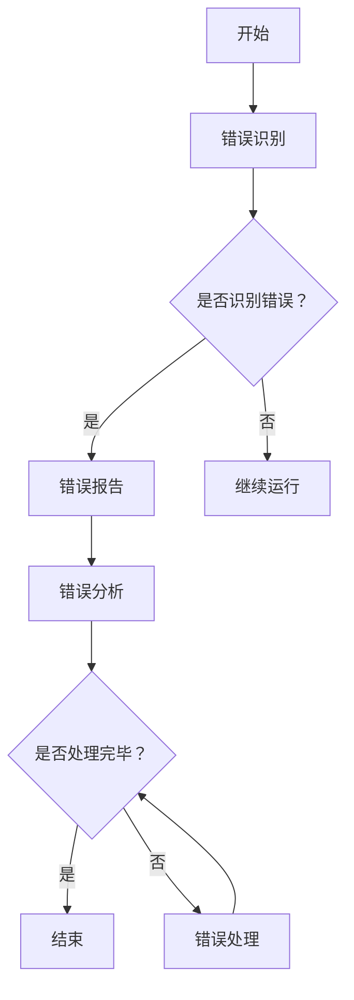

                 

### 引言：错误处理机制的重要性与书的主要内容

在软件开发过程中，错误处理机制是至关重要的组成部分。无论是简单的脚本程序还是复杂的分布式系统，错误的出现都是不可避免的。一个有效的错误处理机制不仅能够提高代码的健壮性，还能够帮助开发者快速定位和解决问题，从而减少系统崩溃、数据丢失和用户体验差等风险。因此，深入研究错误处理机制对于提高编程技能和系统稳定性具有重要意义。

本书旨在全面探讨提示词编程语言（Prompt-Based Programming Languages）中的错误处理机制，帮助读者理解错误处理的基本概念、设计模式、方法论、实现技术以及最佳实践。通过系统性的分析，本书将揭示错误处理的深层原理，并提供实用的指导，帮助开发者构建更为可靠和高效的软件系统。

本书的主要内容结构如下：

1. **第1章 编程语言错误处理概述**：介绍错误处理的概念、类型及其在编程语言中的重要性，讨论常见问题和挑战。
2. **第2章 错误处理的基础概念**：详述错误类型和分类，以及错误报告和日志记录的方法。
3. **第3章 错误处理的设计模式**：探讨设计模式在错误处理中的应用，提供典型案例分析。
4. **第4章 错误处理的方法论**：介绍错误处理的方法论，包括流程、方法和案例分析。
5. **第5章 错误处理的实现技术**：讲解错误处理在编程语言中的具体实现技术和技巧。
6. **第6章 错误处理与调试工具**：介绍调试工具的分类和作用，讨论其在错误处理中的应用。
7. **第7章 案例分析**：分析实际编程语言中的错误处理案例，总结解决方案和经验。
8. **第8章 错误处理的最佳实践**：提供错误处理的最佳实践指南，讨论注意事项和拓展阅读。
9. **第9章 未来发展趋势**：展望错误处理领域的发展趋势，探讨新技术和方法的影响。

通过本书的深入探讨，读者将能够全面了解并掌握错误处理机制，为编写健壮的代码打下坚实基础。希望本书能够成为你在编程道路上的一盏明灯，引导你走向更高的技术境界。

### 第1章 编程语言错误处理概述

错误处理（Error Handling）是编程语言中的一个核心组成部分，它指的是在程序运行过程中，当出现异常情况或错误时，能够有效地检测、报告和应对这些错误，以确保程序的继续运行和系统稳定性。在编程语言中，错误处理机制被设计为提供一种标准化的方法，用于处理各种可能发生的异常情况，从而减少开发者的负担，提高代码的可靠性和可维护性。

首先，错误处理的概念可以分为几个基本类型：

- **语法错误（Syntax Errors）**：这类错误通常发生在编写代码时，由于代码不符合编程语言的语法规则而导致的。例如，拼写错误、遗漏括号或分号等。
- **运行时错误（Runtime Errors）**：这些错误在程序运行时发生，通常由于逻辑错误或不合理的操作而产生。例如，数组越界、空指针异常等。
- **逻辑错误（Logic Errors）**：这类错误与语法错误和运行时错误不同，它们不会导致程序立即崩溃，但会导致程序输出不正确或无法达到预期的效果。逻辑错误通常是由于编程逻辑上的错误或理解问题导致的。

接下来，错误处理的常见问题和挑战包括：

- **错误定位困难**：在大型项目中，错误的来源可能隐藏在代码的深处，使得定位错误变得复杂和耗时。
- **错误报告不够清晰**：有时，错误报告过于简略或不明确，使得开发者难以理解错误的具体原因和位置。
- **错误处理代码的复杂性**：编写复杂且冗长的错误处理代码可能导致代码的可读性和可维护性降低。
- **性能影响**：一些错误处理机制可能会引入额外的性能开销，特别是在循环和递归操作中。

为了应对这些挑战，编程语言提供了多种基本方法来处理错误：

- **异常处理（Exception Handling）**：通过异常处理，程序能够在遇到错误时跳转到特定的错误处理代码块，从而避免程序因错误而崩溃。常见的异常处理机制包括try-catch块。
- **断言（Assertions）**：通过断言，开发者可以在代码中设置一些条件，当条件不满足时，程序将抛出异常，从而帮助定位错误。
- **返回值和状态码**：许多编程语言允许通过返回值或状态码来指示函数的执行结果。例如，成功执行返回0，失败返回-1。
- **日志记录（Logging）**：通过日志记录，开发者可以记录程序运行过程中的关键信息，帮助诊断和调试错误。

这些基本方法各有优缺点，适用于不同的场景和需求。在实际开发中，开发者需要根据具体情况选择合适的错误处理方法，并充分考虑错误的类型、复杂度和性能影响。

通过理解错误处理的基本概念和方法，开发者可以更有效地编写健壮的代码，提高系统的稳定性和可靠性。在下一章中，我们将深入探讨错误处理的基础概念，包括错误的类型、分类以及常见的错误报告和日志记录方法。

### 第2章 错误处理的基础概念

错误处理的基础概念是理解和实施有效错误处理机制的关键。在本章中，我们将详细探讨错误的类型和分类、错误报告和日志记录方法，以及错误处理的基本策略和原则。

#### 错误的类型和分类

在编程中，错误可以大致分为以下几种类型：

- **语法错误（Syntax Errors）**：这是由于代码不符合编程语言的语法规则而产生的错误。例如，遗漏分号、括号不匹配等。这类错误通常在代码编译或解释过程中被立即检测到，并会在编译器或解释器中给出错误提示。
  
- **运行时错误（Runtime Errors）**：这些错误在程序运行时发生，通常由于不合理的操作或逻辑错误导致。例如，数组越界、空指针引用、除以零等。运行时错误通常会导致程序崩溃或产生不可预期的结果。

- **逻辑错误（Logic Errors）**：逻辑错误是指程序执行过程中产生不正确结果的错误，但程序本身没有语法错误或运行时错误。这类错误通常是由于程序员对算法或业务逻辑的理解有误。逻辑错误不会导致程序立即崩溃，但会影响程序的输出和功能。

- **异常错误（Exception Errors）**：异常错误是指程序在执行过程中遇到无法预见的或不可恢复的错误。例如，文件未找到、网络连接中断等。异常错误通常通过异常处理机制来捕获和处理。

#### 错误报告和日志记录

错误报告和日志记录是错误处理过程中不可或缺的环节。良好的错误报告和日志记录能够帮助开发者快速定位问题、诊断错误，并采取相应的措施。

- **错误报告**：错误报告通常包括错误信息、错误类型、错误位置和错误时间等信息。良好的错误报告应当清晰、详细，并且能够提供足够的信息以便开发者理解错误的本质。

  - **错误信息**：错误信息应尽可能详细地描述错误现象和错误原因。例如，“无法连接数据库，错误信息：连接超时”。

  - **错误类型**：明确指出错误的类型，如语法错误、运行时错误、逻辑错误或异常错误。

  - **错误位置**：指出错误发生的具体位置，如文件名、行号等。

  - **错误时间**：记录错误发生的具体时间，有助于分析错误发生的环境和条件。

- **日志记录**：日志记录是将程序运行过程中的关键信息记录下来，以便后续分析和调试。日志记录可以是简单的文本文件，也可以是数据库或专门日志管理系统。

  - **日志级别**：日志可以分为不同的级别，如DEBUG、INFO、WARNING、ERROR和FATAL。不同级别的日志对应不同的重要性和紧急程度。

  - **日志格式**：日志格式应当规范，以便于自动处理和检索。常见的日志格式包括JSON、LOG4J、LOG4C++等。

  - **日志轮转**：为了避免日志文件过大，通常采用日志轮转机制，如按时间、大小或日志条数等条件进行轮转。

#### 错误处理的策略和原则

有效的错误处理策略和原则能够提高程序的健壮性和可维护性。以下是一些常用的错误处理策略和原则：

- **快速响应**：在错误发生时，应尽快响应并采取措施，以避免错误对系统造成更大的影响。

- **分类处理**：根据错误的类型和严重程度，采取不同的处理策略。例如，对于语法错误，可以在编译或解释过程中直接报错；对于运行时错误，可以尝试捕获并处理异常。

- **异常隔离**：将异常错误隔离在不同的模块或线程中，以避免一个错误影响整个系统的稳定性。

- **日志记录**：详细记录错误信息、错误类型、错误位置和时间等，以便于后续的分析和调试。

- **错误恢复**：在某些情况下，可以尝试恢复错误的操作或状态，以使程序能够继续运行。例如，重试操作、回滚事务等。

- **用户通知**：对于用户可感知的错误，应提供清晰的错误提示和解决方案，以提高用户体验。

- **测试和调试**：定期进行错误处理机制的测试和调试，确保其有效性和可靠性。

通过理解错误处理的基础概念，开发者可以更有效地应对编程中的各种错误，提高代码的质量和系统的稳定性。在下一章中，我们将探讨错误处理的设计模式，进一步了解如何更系统地实施错误处理机制。

#### 第3章 错误处理的设计模式

设计模式是软件设计过程中常用的解决方案模板，它们在许多不同的场景中展现了其广泛的应用价值。在错误处理领域，设计模式同样扮演着重要的角色，提供了处理错误和异常的标准方法，使得代码更加清晰、可维护和灵活。以下是一些常用的错误处理设计模式，以及它们在编程语言中的应用案例。

##### 1. 异常处理（Exception Handling）

异常处理是一种用于捕获和处理程序运行时异常的设计模式。它允许程序在遇到错误时，通过特定的代码块进行响应，而不是直接崩溃。

- **C#中的使用示例**：

  ```csharp
  try
  {
      // 执行可能产生异常的操作
      int result = divide(10, 0);
  }
  catch (DivideByZeroException e)
  {
      // 处理除以零异常
      Console.WriteLine("不能除以零：" + e.Message);
  }
  finally
  {
      // 清理资源
  }
  ```

  在上述代码中，`try`块包含了可能产生异常的操作，`catch`块用于捕获和处理特定的异常，而`finally`块则在异常处理完成后执行，确保资源得到释放。

##### 2. 断言（Assertion）

断言是一种在程序执行过程中验证条件是否满足的设计模式。当条件不满足时，程序会抛出一个异常，从而停止执行。

- **Java中的使用示例**：

  ```java
  public class Example {
      public static void main(String[] args) {
          int value = 10;
          assert value > 0 : "值必须大于零";
          System.out.println("程序继续执行");
      }
  }
  ```

  在上述代码中，如果`value`不大于零，程序将抛出一个`AssertionError`，并输出相应的错误信息。

##### 3. 中介者模式（Mediator）

中介者模式通过引入一个中介对象来管理多个对象之间的交互，这样可以简化错误处理逻辑，并使代码更易于维护。

- **Python中的使用示例**：

  ```python
  from threading import Thread

  class Mediator:
      def __init__(self):
          self.listeners = []

      def register_listener(self, listener):
          self.listeners.append(listener)

      def notify(self, message):
          for listener in self.listeners:
              listener.notify(message)

  class ErrorListener:
      def notify(self, message):
          print("错误通知：", message)

  mediator = Mediator()
  mediator.register_listener(ErrorListener())
  ```

  在上述代码中，`Mediator`类负责管理错误监听器，当有错误发生时，会通知所有的监听器。

##### 4. 观察者模式（Observer）

观察者模式用于实现对象之间的依赖关系，当一个对象的状态发生变化时，其他对象会自动得到通知。

- **JavaScript中的使用示例**：

  ```javascript
  class Subject {
      constructor() {
          this.observers = [];
      }

      attach(observer) {
          this.observers.push(observer);
      }

      notify(error) {
          this.observers.forEach(observer => observer.update(error));
      }
  }

  class Observer {
      update(error) {
          console.log("观察者更新：", error);
      }
  }

  subject = new Subject();
  observer = new Observer();
  subject.attach(observer);
  subject.notify("错误发生了");
  ```

  在上述代码中，`Subject`类维护了一个观察者列表，当有错误发生时，会通知所有的观察者。

##### 5. 策略模式（Strategy）

策略模式允许在运行时选择不同的错误处理策略，这样可以灵活地应对各种不同类型的错误。

- **Java中的使用示例**：

  ```java
  interface ErrorStrategy {
      void handle();
  }

  class DefaultErrorStrategy implements ErrorStrategy {
      public void handle() {
          System.out.println("使用默认错误处理策略");
      }
  }

  class CustomErrorStrategy implements ErrorStrategy {
      public void handle() {
          System.out.println("使用自定义错误处理策略");
      }
  }

  class Context {
      private ErrorStrategy strategy;

      public void setStrategy(ErrorStrategy strategy) {
          this.strategy = strategy;
      }

      public void executeStrategy() {
          strategy.handle();
      }
  }

  context = new Context();
  context.setStrategy(new DefaultErrorStrategy());
  context.executeStrategy();
  context.setStrategy(new CustomErrorStrategy());
  context.executeStrategy();
  ```

  在上述代码中，`Context`类可以动态切换错误处理策略，从而实现灵活的错误处理。

通过这些设计模式，开发者可以有效地处理程序中的各种错误，提高代码的可读性和可维护性。在下一章中，我们将进一步探讨错误处理的方法论，讨论如何系统性地实施错误处理流程。

### 第4章 错误处理的方法论

在软件开发过程中，错误处理不仅是一种技术手段，更是一种方法论。一个系统性的错误处理方法论可以帮助开发者更高效地识别、分析和解决错误，从而提高代码的健壮性和可靠性。在本章中，我们将介绍错误处理的方法论，包括错误处理的流程、方法和实际案例分析。

#### 错误处理的流程

一个完整的错误处理流程通常包括以下几个步骤：

1. **错误识别**：在程序运行过程中，通过各种机制（如断言、异常捕获等）识别出错误。
2. **错误报告**：将错误的具体信息报告给开发者或系统，包括错误类型、错误位置、错误时间等。
3. **错误分析**：分析错误的根本原因，确定错误的类型和范围。
4. **错误处理**：根据错误类型和严重程度，采取相应的处理措施，如重试、恢复、通知等。
5. **错误记录**：将错误信息记录在日志中，以便后续分析和改进。

下面是一个简单的错误处理流程图：



#### 错误处理的方法

1. **断言（Assertions）**

   断言是一种简单而强大的错误处理工具，用于在代码中检查条件是否满足。当条件不满足时，程序会抛出一个异常，从而中断执行。

   - **优点**：便于快速识别错误，降低逻辑错误的概率。
   - **缺点**：可能会影响程序的性能，且不能处理运行时错误。

2. **异常处理（Exception Handling）**

   异常处理是一种用于捕获和处理运行时错误的机制。通过try-catch块，程序可以在遇到错误时跳转到特定的错误处理代码块，从而避免程序因错误而崩溃。

   - **优点**：可以处理运行时错误，提高程序的健壮性。
   - **缺点**：过度使用异常处理可能导致代码的复杂性增加。

3. **返回值和状态码**

   通过返回值或状态码来指示函数的执行结果是一种简单直接的错误处理方法。

   - **优点**：易于实现，对性能影响较小。
   - **缺点**：可能需要额外的逻辑来判断返回值或状态码，不利于代码的维护。

4. **日志记录（Logging）**

   日志记录是错误处理过程中不可或缺的一环。通过记录程序运行过程中的关键信息，开发者可以快速定位错误、分析问题。

   - **优点**：可以记录丰富的信息，便于后续分析。
   - **缺点**：日志文件可能变得非常大，需要定期清理。

5. **错误恢复（Error Recovery）**

   在某些情况下，可以尝试恢复错误的操作或状态，使程序能够继续运行。

   - **优点**：提高程序的容错能力，减少错误对系统的影响。
   - **缺点**：可能需要复杂的逻辑，增加代码的复杂性。

#### 实际案例分析

以下是一个实际编程语言中的错误处理案例，我们将使用Python进行详细分析。

**案例**：编写一个函数，用于计算两个数的平均值。如果输入的参数不合法（如非数字类型），函数应提供相应的错误提示。

```python
def calculate_average(a, b):
    try:
        avg = (a + b) / 2
        return avg
    except TypeError as e:
        return f"错误：{e}，参数必须为数字类型"
```

**分析**：

1. **错误识别**：通过try块，识别可能出现的`TypeError`异常。
2. **错误报告**：当异常发生时，捕获`TypeError`并返回相应的错误提示。
3. **错误处理**：使用`except`块处理`TypeError`，确保程序不会因异常而崩溃。
4. **错误记录**：虽然此代码段中没有显式地记录错误，但可以在实际应用中添加日志记录。

**改进**：

- **增加日志记录**：将错误信息记录到日志中，便于后续分析。

  ```python
  import logging

  logging.basicConfig(filename='error.log', level=logging.ERROR)

  def calculate_average(a, b):
      try:
          avg = (a + b) / 2
          return avg
      except TypeError as e:
          logging.error(f"错误：{e}，参数必须为数字类型")
          return f"错误：{e}，参数必须为数字类型"
  ```

通过上述案例分析，我们可以看到，一个有效的错误处理机制不仅需要识别和报告错误，还需要采取适当的处理措施，并记录错误信息以便后续分析。在下一章中，我们将深入探讨错误处理的实现技术，详细讲解如何在实际编程语言中实现错误处理。

### 第5章 错误处理的实现技术

在实际编程中，错误处理的实现技术多种多样，每种技术都有其独特的优势和适用场景。本章将详细探讨这些实现技术，包括错误处理的代码实现技巧以及这些技术在编程语言中的具体应用。

#### 错误处理的代码实现技巧

1. **异常捕获与处理**

   异常捕获是错误处理中最常用的技术之一。在许多编程语言中，如Python、Java和C#，异常处理通常通过try-catch块实现。

   - **Python示例**：

     ```python
     try:
         result = 10 / 0
     except ZeroDivisionError:
         print("除以零错误：无法进行除法运算")
     ```

     在这个示例中，`try`块包含可能会抛出异常的代码，`except`块则捕获特定的异常类型并执行相应的处理逻辑。

   - **Java示例**：

     ```java
     try {
         int result = divide(10, 0);
     } catch (ArithmeticException e) {
         System.out.println("除以零错误：" + e.getMessage());
     }
     ```

     Java中的异常处理与Python类似，但Java的异常处理更为严格，可以指定是否需要抛出异常。

   - **C#示例**：

     ```csharp
     try
     {
         int result = DivideByZero();
     }
     catch (DivideByZeroException e)
     {
         Console.WriteLine("除以零错误：" + e.Message);
     }
     finally
     {
         // 清理资源
     }
     ```

     C#中的异常处理还包括`finally`块，用于执行无论是否发生异常都会执行的代码。

2. **断言与条件检查**

   断言和条件检查是另一种常用的错误处理技术，主要用于在代码运行前验证某些条件是否满足。

   - **Python示例**：

     ```python
     def process_data(data):
         assert isinstance(data, list), "数据必须为列表类型"
         # 处理数据
     ```

     在Python中，`assert`语句用于检查条件是否满足。如果不满足，程序将抛出`AssertionError`。

   - **Java示例**：

     ```java
     public void processData(List<Integer> data) {
         if (data == null) {
             throw new IllegalArgumentException("数据不能为空");
         }
         // 处理数据
     }
     ```

     Java中的条件检查可以通过`if-else`语句实现，当条件不满足时，可以抛出相应的异常。

3. **返回值与状态码**

   返回值和状态码是处理错误的一种简单直接的方法，通常用于函数或方法返回执行结果。

   - **Python示例**：

     ```python
     def divide(a, b):
         if b == 0:
             return None
         return a / b

     result = divide(10, 0)
     if result is None:
         print("除以零错误")
     ```

     在这个示例中，函数通过返回`None`来表示错误，外部调用者可以通过检查返回值来判断是否发生错误。

   - **C#示例**：

     ```csharp
     public int? Divide(int a, int b)
     {
         if (b == 0)
             return null;
         return a / b;
     }

     int? result = Divide(10, 0);
     if (result == null)
         Console.WriteLine("除以零错误");
     ```

     C#中的`null`值可以用来表示错误。

#### 错误处理技术在编程语言中的具体应用

不同的编程语言提供了不同的错误处理机制和工具，以下是一些典型的应用：

1. **Python**

   - **异常处理**：Python通过`try-except`块进行异常处理，同时支持自定义异常。
   - **断言**：Python的`assert`语句用于在运行前验证条件。
   - **日志记录**：Python的`logging`模块提供了强大的日志记录功能。

2. **Java**

   - **异常处理**：Java的异常处理机制非常严格，通过`try-catch-finally`块实现。
   - **断言**：Java的`assert`语句用于条件检查。
   - **日志记录**：Java的`java.util.logging`和`log4j`等库提供了灵活的日志记录功能。

3. **C#**

   - **异常处理**：C#的异常处理与Java类似，使用`try-catch-finally`块。
   - **断言**：C#的`assert`语句用于条件检查。
   - **日志记录**：C#的`System.Diagnostics.Trace`类和`log4net`等库提供了日志记录功能。

4. **JavaScript**

   - **异常处理**：JavaScript使用`try-catch`块进行异常处理。
   - **断言**：JavaScript可以使用`assert`函数进行条件检查。
   - **日志记录**：JavaScript的`console.log`函数可以用于简单的日志记录。

通过掌握这些错误处理技术和工具，开发者可以在编写代码时更加自信地处理各种可能出现的错误，提高程序的健壮性和可靠性。在下一章中，我们将探讨错误处理与调试工具，了解如何利用工具来提升错误处理的效率和效果。

### 第6章 错误处理与调试工具

在软件开发过程中，错误处理和调试是确保代码质量和系统稳定性的关键步骤。现代编程语言和开发环境提供了丰富的工具来帮助开发者实现高效的错误处理和调试。这些工具不仅能够帮助开发者快速定位和解决错误，还可以优化开发流程，提高生产效率。本章将介绍常见的错误处理和调试工具，并探讨它们在实际开发中的应用。

#### 调试工具的分类和作用

调试工具可以分为以下几类：

1. **集成开发环境（IDE）内置调试工具**

   集成开发环境（IDE）通常内置了强大的调试工具，如断点设置、单步执行、变量观察等。这些工具可以帮助开发者实时监控代码的执行过程，快速定位错误。

   - **Visual Studio**：支持代码断点、实时调试、性能分析等。
   - **Eclipse**：提供丰富的调试功能，包括条件断点、数据断点等。

2. **独立调试器**

   独立调试器通常用于复杂的系统调试或跨平台调试。这些调试器能够提供更高级的调试功能，如内存分析、线程跟踪等。

   - **GDB**：GNU项目的调试器，广泛用于C和C++程序调试。
   - **LLDB**：用于C、C++、Objective-C和Python等语言的调试器，适用于Mac OS X和Linux系统。

3. **日志分析工具**

   日志分析工具可以帮助开发者从日志文件中提取和分析错误信息。这些工具通常提供丰富的过滤和查询功能，便于快速定位问题。

   - **Logstash**：用于日志收集、分析和传输的工具。
   - **Kibana**：用于可视化日志数据和日志分析结果的工具。

4. **性能分析工具**

   性能分析工具可以帮助开发者识别和优化程序的性能瓶颈。这些工具通常能够提供代码执行时间、内存使用情况等详细信息。

   - **VisualVM**：用于Java虚拟机性能分析的工具。
   - **Valgrind**：用于检测内存泄漏、空指针引用等问题的工具。

#### 常用的错误处理和调试工具

以下是一些常用的错误处理和调试工具，及其在实际开发中的应用：

1. **断点调试**

   断点调试是开发者最常用的调试方法之一。通过设置断点，程序在到达特定代码行时会暂停执行，开发者可以查看变量值、单步执行代码等。

   - **Python**：在PyCharm、Visual Studio Code等IDE中，可以通过鼠标点击或使用快捷键设置断点。
   - **Java**：在Eclipse、IntelliJ IDEA等IDE中，同样可以设置断点并进行调试。

2. **日志记录**

   日志记录是错误处理过程中不可或缺的一部分。通过日志，开发者可以记录程序运行过程中的关键信息，帮助诊断和解决错误。

   - **Python**：使用`logging`模块，可以方便地设置日志级别和日志格式。
   - **Java**：使用`java.util.logging`或`log4j`等库，可以灵活地配置日志记录。

3. **性能分析**

   性能分析工具可以帮助开发者识别和解决程序的性能瓶颈。通过分析程序运行时资源的使用情况，开发者可以优化代码和系统配置。

   - **Java**：使用VisualVM进行内存泄漏检测和性能监控。
   - **C/C++**：使用Valgrind进行内存泄漏和性能分析。

4. **单元测试**

   单元测试是确保代码质量的一种有效方法。通过编写测试用例，开发者可以验证代码的正确性和可靠性。

   - **Python**：使用`unittest`或`pytest`等库编写单元测试。
   - **Java**：使用JUnit等库编写单元测试。

#### 工具在实际开发中的应用案例

以下是一个实际开发中的应用案例，展示如何使用调试工具进行错误处理和调试：

**案例**：使用Python的IDE进行断点调试和日志记录。

```python
import logging

# 配置日志记录
logging.basicConfig(level=logging.DEBUG, format='%(asctime)s - %(levelname)s - %(message)s')

def divide(a, b):
    try:
        return a / b
    except ZeroDivisionError:
        logging.error("除以零错误")
        return None

# 调用函数并设置断点
result = divide(10, 0)
if result is None:
    print("除以零错误")

# 调试过程中查看日志和变量值
```

在这个案例中，我们使用`logging`模块记录错误信息，并通过IDE设置断点来调试函数`divide`。当函数调用失败时，程序会输出详细的日志信息，帮助开发者快速定位和解决问题。

通过掌握这些工具和技巧，开发者可以更高效地处理错误和调试代码，提高开发质量和效率。在下一章中，我们将通过实际案例深入分析错误处理的方法和最佳实践。

### 第7章 案例分析

在实际编程中，错误处理不仅仅是理论上的讨论，更需要通过具体案例来展示其应用和效果。以下是一些典型的编程语言中的错误处理案例，以及它们在具体应用中的解决方案、错误原因分析和经验总结。

#### Python中的错误处理案例

**案例一：文件操作中的错误处理**

**问题描述**：编写一个Python脚本，用于读取文本文件并计算单词数量。如果文件不存在或文件格式错误，程序应提供相应的错误提示。

**代码实现**：

```python
def count_words(filename):
    try:
        with open(filename, 'r') as file:
            content = file.read()
            words = content.split()
            return len(words)
    except FileNotFoundError:
        return "错误：文件未找到"
    except ValueError:
        return "错误：文件格式错误"

# 调用函数
result = count_words("example.txt")
print(result)
```

**解决方案**：通过使用`try-except`块，分别捕获`FileNotFoundError`和`ValueError`，并返回相应的错误提示。

**错误原因分析**：文件未找到通常是因为文件路径不正确或文件不存在；文件格式错误可能是因为文本内容无法正确分割成单词。

**经验总结**：良好的错误处理能够帮助开发者快速识别问题，避免程序因为不可预见的错误而中断。

**案例二：Web应用程序中的错误处理**

**问题描述**：开发一个简单的Web应用程序，用户可以通过输入框提交评论。如果提交的内容包含非法字符或长度超过限制，应用程序应提供错误提示。

**代码实现**（使用Flask框架）：

```python
from flask import Flask, request, jsonify

app = Flask(__name__)

@app.route('/submit_comment', methods=['POST'])
def submit_comment():
    comment = request.form['comment']
    max_length = 500
    
    if len(comment) > max_length:
        return jsonify({"error": "评论长度超过限制"}), 400
    
    # 其他处理逻辑...

    return jsonify({"message": "评论提交成功"}), 200

if __name__ == '__main__':
    app.run()
```

**解决方案**：使用Flask框架的`request`对象获取用户输入，并通过长度检查确保评论长度在限制范围内。

**错误原因分析**：评论长度超过限制可能是因为用户输入的内容过多；非法字符可能是因为输入了不被允许的特殊字符。

**经验总结**：在Web应用程序中，良好的错误处理可以提供清晰的错误信息，并确保用户操作的安全和有效性。

#### Java中的错误处理案例

**案例三：数据库操作中的错误处理**

**问题描述**：在Java应用程序中，连接数据库并执行查询操作。如果连接失败或查询结果错误，程序应提供相应的错误提示。

**代码实现**：

```java
import java.sql.Connection;
import java.sql.DriverManager;
import java.sql.ResultSet;
import java.sql.Statement;

public class DatabaseQuery {
    public void executeQuery(String query) {
        try (Connection conn = DriverManager.getConnection("jdbc:mysql://localhost:3306/testdb", "username", "password");
             Statement stmt = conn.createStatement();
             ResultSet rs = stmt.executeQuery(query)) {

            // 处理查询结果...

        } catch (SQLException e) {
            System.err.println("数据库错误：" + e.getMessage());
        }
    }
}
```

**解决方案**：通过使用`try-with-resources`语句自动关闭连接，并捕获`SQLException`，输出错误信息。

**错误原因分析**：数据库连接失败可能是因为连接参数错误、数据库服务未启动；查询结果错误可能是因为SQL语句语法错误或数据不存在。

**经验总结**：在处理数据库操作时，良好的错误处理可以避免程序崩溃，并帮助快速定位问题。

#### C++中的错误处理案例

**案例四：多线程编程中的错误处理**

**问题描述**：在C++中，使用多线程进行任务处理。如果线程创建失败或任务执行过程中出现错误，程序应提供相应的错误提示。

**代码实现**：

```cpp
#include <iostream>
#include <thread>
#include <vector>

void process_task(int task_id) {
    std::cout << "处理任务 " << task_id << std::endl;
    // 处理任务...
}

int main() {
    std::vector<std::thread> threads;

    for (int i = 0; i < 10; ++i) {
        threads.push_back(std::thread(process_task, i));
    }

    for (auto& th : threads) {
        if (!th.joinable()) {
            std::cerr << "错误：线程 " << i << " 未创建成功" << std::endl;
        }
        th.join();
    }

    return 0;
}
```

**解决方案**：在创建线程后，检查线程是否成功创建，并使用`joinable()`函数确保线程能够被正确合并。

**错误原因分析**：线程创建失败可能是因为系统资源不足、线程栈溢出等；任务执行过程中出现错误可能是因为逻辑错误或外部依赖问题。

**经验总结**：在多线程编程中，良好的错误处理可以确保线程的正确创建和执行，避免系统崩溃。

通过这些案例，我们可以看到，不同编程语言和场景下，错误处理的方法和策略各有不同，但核心目标都是为了提高代码的健壮性和可靠性。在实际开发中，结合具体的错误情况和系统需求，选择合适的错误处理方法，是编写高质量代码的关键。

### 第8章 错误处理的最佳实践

在软件开发中，错误处理不仅仅是技术问题，更是一种策略和艺术。良好的错误处理实践能够提高代码的健壮性、可维护性和用户体验。以下是一些关于错误处理的最佳实践，这些实践不仅有助于开发者编写更可靠的代码，还能在团队协作和项目开发中产生积极的影响。

#### 最佳实践指南

1. **明确错误处理的目标和原则**：每个项目都应该明确错误处理的目标和原则，如快速响应、最小化影响、可恢复性等。确保整个团队对错误处理有统一的理解和期望。

2. **设计良好的错误报告机制**：清晰的错误报告能够帮助开发者快速定位和解决问题。错误报告应包括错误类型、发生位置、时间、相关信息等。使用统一格式和模板可以提高报告的一致性和可读性。

3. **区分运行时错误和逻辑错误**：运行时错误（如语法错误、空指针异常等）和逻辑错误（如算法错误、业务逻辑错误等）应分别处理。运行时错误通常需要即时响应，而逻辑错误则可以在代码审查或单元测试中处理。

4. **充分利用异常处理机制**：异常处理是一种有效的错误处理方法，可以避免程序因错误而意外崩溃。合理使用try-catch块，并避免过度使用异常处理，以保持代码的清晰和可维护性。

5. **日志记录**：日志记录是错误处理的重要组成部分。确保日志记录的完整性和可追溯性，可以使用不同的日志级别（如DEBUG、INFO、WARNING、ERROR）来记录不同类型的信息。

6. **单元测试和自动化测试**：通过编写单元测试和自动化测试，可以及时发现和修复错误。自动化测试工具可以帮助开发者快速运行测试用例，并生成详细的测试报告。

7. **持续集成和部署**：在持续集成（CI）和持续部署（CD）流程中集成错误处理和测试步骤，确保每次代码更改都能经过全面测试，及时发现和解决潜在问题。

8. **代码审查和文档**：定期进行代码审查，确保错误处理代码的质量和一致性。编写详细的文档，帮助新成员快速了解项目的错误处理策略和实践。

#### 注意事项

1. **避免错误的掩盖**：错误处理不应掩盖真正的错误，而应帮助开发者理解错误的原因和影响。避免使用模糊或笼统的错误信息，确保错误报告具体、详细。

2. **性能考量**：错误的错误处理代码可能会影响程序的性能。避免不必要的异常捕获和复杂的错误处理逻辑，确保代码的高效性和可读性。

3. **国际化**：如果项目面向国际用户，确保错误信息支持多种语言，并保持一致性和友好性。

4. **用户通知**：对于用户可感知的错误，应提供清晰、友好的用户通知和解决方案，以提高用户体验。

#### 拓展阅读

- **《Effective Java》**：作者Joshua Bloch提供的关于Java编程的最佳实践，其中包括丰富的错误处理建议。
- **《Clean Code》**：Robert C. Martin的《Clean Code》中包含了关于编写清晰、可维护代码的最佳实践，其中也包括错误处理的指导。
- **《Error Handling in Modern C++》**：书中详细介绍了现代C++中的错误处理机制，适合C++开发者参考。

通过遵循这些最佳实践，开发者可以构建更加健壮和可靠的软件系统，从而提高项目的质量和团队的效率。

### 第9章 未来发展趋势

随着技术的不断进步，错误处理领域也在不断演进，涌现出许多新的技术和方法。未来，错误处理将在以下几个方面呈现发展趋势：

#### 1. 自适应错误处理

自适应错误处理是一种基于机器学习和人工智能的技术，它可以根据历史错误数据和系统行为，自动调整错误处理策略。这种技术可以帮助系统在遇到未知错误时，更快速地做出响应，从而提高系统的鲁棒性和用户体验。例如，通过分析日志数据和错误模式，自适应错误处理可以自动调整异常捕获的粒度和优先级，甚至自动生成修复建议。

#### 2. 智能日志分析

智能日志分析利用自然语言处理和数据分析技术，对日志数据进行深度分析，从而提供更准确的错误定位和诊断。这种技术可以识别出潜在的错误模式，甚至预测可能的错误发生。例如，通过文本分类和聚类算法，智能日志分析工具可以自动标记错误日志，并提供相关的错误上下文信息，帮助开发者快速定位和解决问题。

#### 3. 无服务器架构中的错误处理

随着无服务器架构（Serverless）的兴起，错误处理也在经历变革。在无服务器架构中，开发者无需管理服务器，这为错误处理带来了新的挑战和机遇。未来，错误处理将更多地依赖于云服务提供商提供的内置错误处理工具和服务。例如，自动扩展、监控和异常处理等功能的集成，将使开发者能够更轻松地应对大规模、高并发的错误处理需求。

#### 4. 实时错误监控

实时错误监控技术可以提供实时的错误报告和诊断，使开发者能够在错误发生的第一时间进行响应。通过集成实时错误监控工具，如Sentry、Bugsnag等，开发者可以实时跟踪应用程序的性能和稳定性，并在错误发生时迅速采取措施。这种技术不仅提高了错误处理的效率，还增强了开发者的错误感知能力和问题解决能力。

#### 5. 多语言一致性

随着编程语言的多样性和跨语言开发的需求增加，未来错误处理技术将更加注重多语言一致性。例如，提供跨语言的错误处理框架和工具，使得不同语言之间的错误处理机制更加统一，便于开发者和团队在不同语言和平台之间进行协作。

#### 对编程语言的影响

这些新兴技术和方法将对编程语言产生深远的影响：

1. **扩展语言特性**：编程语言可能会增加更多的内置错误处理特性和语法，以支持自适应错误处理和智能日志分析等高级功能。

2. **改进异常处理**：语言将优化异常处理机制，提供更灵活和强大的错误捕获和处理能力，以适应复杂的系统需求。

3. **增强跨语言兼容性**：编程语言将更加注重跨语言的一致性，提供统一的错误处理框架和API，使得开发者能够更方便地在不同语言和平台之间进行错误处理。

总之，未来错误处理领域的发展将更加智能化、自动化和统一化，为开发者提供更强大的工具和方法，提高系统的健壮性和可靠性。随着这些新技术的不断涌现，编程语言的错误处理机制也将持续演进，满足不断变化和复杂化的开发需求。通过掌握这些前沿技术，开发者将能够构建更加稳健和高效的软件系统。

