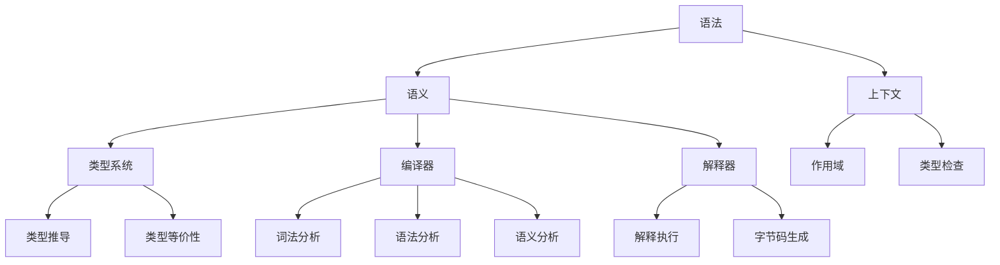

                 


### 文章标题

# 提示词编程语言设计艺术

### 文章关键词

- 编程语言设计
- 语言特性
- 类型系统
- 编译器构造
- 模式匹配
- 优化算法

### 文章摘要

本文深入探讨了编程语言设计的艺术。从基础概念到实际应用，我们将逐步分析编程语言的核心要素，包括语法、类型系统、编译器和解释器等。通过Mermaid流程图展示核心概念之间的联系，使用伪代码讲解关键算法原理，并结合LaTeX公式进行数学模型的详细解释。同时，通过实际项目案例，我们将展示如何从零开始搭建开发环境，实现编程语言，并进行代码解读和应用分析。最后，本文将总结最佳实践，提供拓展阅读建议。

## 目录大纲

### I. 引言

- 1.1 编程语言设计的背景和重要性
- 1.2 文章目标和结构

### II. 编程语言设计的基础

- 2.1 编程语言的基本概念
- 2.2 语言特性与抽象
- 2.3 Mermaid流程图：核心概念与联系

### III. 编译器和解释器设计

- 3.1 编译器和解释器的基本原理
- 3.2 词法和语法分析
- 3.3 伪代码讲解：语法分析器设计
- 3.4 LaTex公式：抽象语法树（AST）定义

### IV. 类型系统和类型检查

- 4.1 类型系统的基本概念
- 4.2 伪代码讲解：类型推导算法
- 4.3 LaTex公式：类型等价性

### V. 模式匹配和正则表达式

- 5.1 模式匹配的原理
- 5.2 正则表达式的语法和用法
- 5.3 伪代码讲解：模式匹配算法

### VI. 语言优化算法

- 6.1 语言优化的目的和重要性
- 6.2 伪代码讲解：编译时间优化算法
- 6.3 LaTex公式：运行时间优化目标函数

### VII. 实际项目实战

- 7.1 项目案例：设计并实现一个简单的解释器
- 7.2 开发环境搭建
- 7.3 源代码解读和代码分析
- 7.4 代码应用解读与分析
- 7.5 项目小结

### VIII. 最佳实践与注意事项

- 8.1 编程语言设计的最佳实践
- 8.2 小结
- 8.3 注意事项
- 8.4 拓展阅读

### IX. 结论

- 9.1 本文总结
- 9.2 未来工作展望

---

### I. 引言

#### 1.1 编程语言设计的背景和重要性

编程语言是计算机科学中最基础且至关重要的组成部分。它们作为人类与计算机之间的桥梁，使开发者能够以高效、清晰、一致的方式与计算机系统进行沟通。随着软件工程的不断演进，编程语言的设计变得越来越复杂，其重要性也在不断提升。

编程语言设计的艺术不仅涉及到语法、类型系统和编译器构造等基础技术，还涉及到对语言特性的深刻理解和灵活运用。一个好的编程语言能够提高开发效率、降低错误率，并促进软件的可维护性和可扩展性。因此，掌握编程语言设计的方法和技巧，对每一个计算机科学从业者来说都是至关重要的。

本文旨在深入探讨编程语言设计的艺术，从基础概念到实际应用，逐步分析编程语言的核心要素。我们将通过Mermaid流程图展示核心概念之间的联系，使用伪代码讲解关键算法原理，并结合LaTeX公式进行数学模型的详细解释。同时，通过实际项目案例，我们将展示如何从零开始搭建开发环境，实现编程语言，并进行代码解读和应用分析。

#### 1.2 文章目标和结构

本文的主要目标是：

1. **介绍编程语言设计的基础概念和核心要素**，包括语法、类型系统、编译器和解释器等。
2. **通过Mermaid流程图和伪代码，深入讲解编程语言设计中的关键算法原理**。
3. **结合LaTeX公式，详细阐述编程语言设计中的数学模型和公式**。
4. **通过实际项目案例，展示如何实现编程语言，并进行代码解读和应用分析**。
5. **总结编程语言设计的最佳实践，并提供拓展阅读建议**。

文章的结构如下：

- **引言**：介绍编程语言设计的背景和重要性，以及本文的目标和结构。
- **编程语言设计的基础**：介绍编程语言的基本概念、语言特性和核心概念与联系。
- **编译器和解释器设计**：讲解编译器和解释器的基本原理，以及语法分析和抽象语法树的定义。
- **类型系统和类型检查**：介绍类型系统的基本概念，类型推导算法和类型等价性。
- **模式匹配和正则表达式**：讲解模式匹配的原理和正则表达式的语法和用法。
- **语言优化算法**：介绍语言优化的目的和重要性，编译时间和运行时间优化算法。
- **实际项目实战**：设计并实现一个简单的解释器，进行开发环境搭建、源代码解读和代码分析。
- **最佳实践与注意事项**：总结编程语言设计的最佳实践，并提供小结、注意事项和拓展阅读建议。
- **结论**：总结本文的主要内容，并对未来工作展望。

通过本文的阅读，读者将能够系统地了解编程语言设计的各个方面，掌握编程语言设计的基本原理和技巧，为成为一名优秀的编程语言设计师打下坚实的基础。

---

### II. 编程语言设计的基础

#### 2.1 编程语言的基本概念

编程语言是用于编写计算机程序的形式语言。它们提供了一套规则和符号，使得人类能够以计算机能够理解的方式表达算法和操作。编程语言的设计旨在使编程过程更加高效、直观和易于维护。

**编程语言的组成部分**：

1. **语法**：定义了程序的结构和语法规则，包括关键字、标识符、操作符和语句等。
2. **语义**：定义了程序的含义和操作规则，包括变量、类型、函数和过程等。
3. **上下文**：定义了程序执行的环境，包括作用域、类型检查和变量绑定等。

**编程语言的分类**：

1. **低级语言**：如汇编语言，与机器代码非常接近，容易理解但难以编写和维护。
2. **高级语言**：如C、Java、Python等，提供了更多的抽象和自动化功能，易于理解和编写。

**编程语言的特性**：

1. **可读性**：代码应易于阅读和理解，以便于他人和未来自己维护。
2. **可维护性**：代码应易于修改和扩展，以适应未来的需求变化。
3. **性能**：代码应在执行时具有较高的效率和速度。
4. **灵活性**：编程语言应具有足够的灵活性，以适应不同的应用场景和编程风格。

#### 2.2 语言特性与抽象

编程语言的设计不仅仅是语法和语义的简单组合，还包括对程序设计概念的抽象和封装。这些抽象和特性使得编程语言能够更加高效、直观地表示复杂的应用。

**语言特性**：

1. **函数式编程**：强调函数作为基本编程单元，使用不可变数据和纯函数，提高代码的可维护性和可重用性。
2. **面向对象编程**：将数据和行为封装在对象中，通过继承和多态实现代码的重用和模块化。
3. **动态类型**：在运行时确定变量类型，提高编程灵活性和开发效率。
4. **静态类型**：在编译时确定变量类型，提高程序的可维护性和性能。

**抽象**：

1. **模块化**：通过模块和包将代码划分为独立的部分，提高代码的可重用性和组织性。
2. **面向过程**：将程序划分为一系列的过程或函数，便于理解和维护。
3. **数据抽象**：将复杂的数据结构和操作封装在类或模块中，隐藏实现细节，提高代码的可维护性。
4. **控制抽象**：使用循环、分支和递归等控制结构，实现复杂的算法和逻辑。

**示例**：

```python
# 函数式编程示例
def sum(a, b):
    return a + b

# 面向对象编程示例
class Calculator:
    def add(self, a, b):
        return a + b

# 动态类型示例
x = 10
y = "Hello"

# 静态类型示例
def multiply(a: int, b: int) -> int:
    return a * b
```

通过这些特性和抽象，编程语言能够提供强大的功能和灵活性，使开发者能够以高效、直观的方式实现复杂的算法和系统。

#### 2.3 Mermaid流程图：核心概念与联系

为了更好地理解和展示编程语言设计中的核心概念及其相互关系，我们可以使用Mermaid流程图来直观地表示。以下是编程语言设计中的几个关键概念及其关系的Mermaid图：



**图解**：

1. **语法**和**语义**：语法定义了程序的语法规则，而语义定义了程序的含义和操作规则。语法是语义的基础，两者共同决定了程序的行为。
2. **上下文**：上下文定义了程序执行的环境，包括作用域和类型检查。作用域决定了变量和函数的可访问性，类型检查确保程序在运行时不会出现类型错误。
3. **类型系统**：类型系统定义了程序中数据的类型和操作规则。类型推导和类型等价性是类型系统的核心概念，它们确保程序的正确性和效率。
4. **编译器**和**解释器**：编译器将源代码转换为机器代码或字节码，而解释器逐行解释并执行源代码。词法分析、语法分析和语义分析是编译器的重要组成部分，它们负责将源代码转换为抽象语法树（AST）。
5. **类型系统**与**编译器/解释器**：类型系统在编译器和解释器中都有重要作用。编译器通过类型检查确保程序的正确性，而解释器在运行时进行类型推导和类型检查。

通过这个Mermaid流程图，我们可以清晰地看到编程语言设计中的核心概念及其相互关系。这有助于我们更好地理解和掌握编程语言设计的原理和实践。

---

### III. 编译器和解释器设计

#### 3.1 编译器和解释器的基本原理

编译器和解释器是编程语言设计的核心组成部分，它们负责将源代码转换为计算机可以执行的形式。编译器和解释器的设计和实现是编程语言设计中的重要环节，直接影响程序的性能和开发效率。

**编译器的基本原理**：

编译器是一个将源代码转换为目标代码（通常是机器代码或字节码）的程序。其基本原理可以概括为以下几个步骤：

1. **词法分析**：将源代码分解为词法单元（tokens），如关键字、标识符、操作符和分隔符等。
2. **语法分析**：根据语言的语法规则，将词法单元序列组织成语法结构（语法树），如表达式、语句和函数等。
3. **语义分析**：检查语法结构的语义正确性，如类型检查、作用域解析和变量绑定等。
4. **代码生成**：将抽象语法树（AST）转换为中间代码（如字节码或汇编代码），并进行优化。
5. **目标代码生成**：将中间代码转换为机器代码，通常在解释器中执行或在操作系统上直接执行。

**解释器的基本原理**：

解释器是一个逐行解释并执行源代码的程序。其基本原理可以概括为以下几个步骤：

1. **词法分析**：将源代码分解为词法单元（tokens）。
2. **语法分析**：根据语言的语法规则，将词法单元序列组织成语法结构（语法树）。
3. **语义分析**：检查语法结构的语义正确性。
4. **解释执行**：逐行解释并执行源代码，通常使用解释器自带的执行引擎。
5. **动态类型检查**：在运行时进行类型检查，确保变量和表达式的类型匹配。

**编译器和解释器的区别**：

- **编译器**：将源代码一次性转换为目标代码，通常生成可执行文件，执行速度快，但开发周期长，需要额外的编译步骤。
- **解释器**：逐行解释并执行源代码，执行速度相对较慢，但开发周期短，无需编译步骤，可以直接调试和运行。

**编译器和解释器的优缺点**：

- **编译器**：
  - 优点：执行速度快，代码优化效果好，适用于需要高性能的应用程序。
  - 缺点：开发周期长，需要额外的编译步骤，调试较为困难。

- **解释器**：
  - 优点：开发周期短，调试方便，适用于快速开发和测试。
  - 缺点：执行速度相对较慢，代码优化效果有限。

**示例**：

```python
# 编译器示例（C语言）
// 源代码：hello.c
#include <stdio.h>

int main() {
    printf("Hello, World!\n");
    return 0;
}

// 编译命令：gcc hello.c -o hello
// 生成的目标代码：hello.exe

# 解释器示例（Python）
# 源代码：hello.py
print("Hello, World!")

# 解释命令：python hello.py
# 输出：Hello, World!
```

通过以上基本原理和示例，我们可以看到编译器和解释器在编程语言设计中的重要性。理解它们的原理和区别，有助于我们选择合适的工具和策略来开发高效、可靠的程序。

#### 3.2 词法和语法分析

词法分析和语法分析是编译器的核心组成部分，它们负责将源代码转换为抽象语法树（AST），以便进行进一步的语义分析和代码生成。

**词法分析**：

词法分析器（Lexer）是编译器的第一个组件，它的任务是扫描源代码，将其分解为一系列的词法单元（tokens）。词法单元是编程语言中最基本的语法单位，如关键字、标识符、操作符和分隔符等。

词法分析的过程可以分为以下几个步骤：

1. **初始化**：创建词法分析器的工作空间，初始化状态和变量。
2. **扫描输入**：逐个字符地读取输入源代码，并根据字符序列判断下一个词法单元的类型和值。
3. **识别词法单元**：根据预定义的词法规则，将连续的字符序列识别为特定的词法单元，如整数字面量、浮点数字面量、字符串字面量和标识符等。
4. **处理错误**：在识别词法单元时，如果遇到非法字符或不符合词法规则的序列，词法分析器需要处理这些错误，例如通过报错或跳过错误部分。

**语法分析**：

语法分析器（Parser）是编译器的第二个组件，它的任务是分析词法分析器生成的词法单元序列，构建出语法结构，通常是一个抽象语法树（AST）。抽象语法树是一个表示程序结构的树形数据结构，每个节点都表示一个语法元素，如表达式、语句和函数等。

语法分析的过程可以分为以下几个步骤：

1. **初始化**：创建语法分析器的工作空间，初始化状态和变量。
2. **词法单元序列**：接收词法分析器生成的词法单元序列。
3. **构建语法结构**：根据语言的语法规则，将词法单元序列组织成语法结构。语法分析器使用递归下降法、LL（左到右、自顶向下）分析法和LR（左到右、自底向上）分析法等不同的分析方法来构建语法结构。
4. **语义检查**：在构建语法结构的过程中，语法分析器还需要进行语义检查，如类型检查、作用域解析和变量绑定等。
5. **错误处理**：在分析过程中，如果遇到语法错误或不符合语法规则的序列，语法分析器需要处理这些错误，例如通过报错或跳过错误部分。

**伪代码讲解：语法分析器设计**

以下是一个简单的伪代码示例，用于展示语法分析器的设计原理：

```python
# 伪代码：语法分析器

# 初始化语法分析器
init_parser():
    create workspace
    init variables

# 递归下降分析法
recursive_descent_analysis(tokens):
    current_token = tokens.pop()
    if current_token is 'program':
        handle_program(tokens)
    elif current_token is 'function':
        handle_function(tokens)
    else:
        raise SyntaxError("Unexpected token: " + current_token)

# 处理程序
handle_program(tokens):
    declare variables
    parse statements
    generate code

# 处理函数
handle_function(tokens):
    define function
    parse block
    generate code

# 处理语句
handle_statement(tokens):
    if tokens.pop() is 'if':
        parse_condition
        handle_then_block
        handle_else_block
    elif tokens.pop() is 'while':
        parse_condition
        handle_block
    else:
        raise SyntaxError("Unexpected token: " + current_token)

# 伪代码：词法分析器
tokenize(source_code):
    create tokens list
    for character in source_code:
        if character is letter or digit:
            add identifier or number token
        elif character is operator or punctuation:
            add operator or punctuation token
        else:
            skip or raise error
    return tokens
```

通过这个伪代码示例，我们可以看到语法分析器是如何递归下降地分析词法单元序列，构建出语法结构的。词法分析和语法分析是编译器设计中的关键步骤，它们确保源代码能够被正确地解析和转换，为后续的语义分析和代码生成打下基础。

#### 3.3 伪代码讲解：语法分析器设计

为了更好地理解和实现语法分析器，我们可以使用伪代码来详细说明其设计和实现过程。以下是一个简单的伪代码示例，用于展示一个基于递归下降法的语法分析器的实现：

```python
# 伪代码：递归下降语法分析器

# 初始化语法分析器
init_parser():
    create workspace
    init variables

# 递归下降分析函数
recursive_descent_analysis(tokens):
    current_token = tokens.pop()
    if current_token is 'program':
        handle_program(tokens)
    elif current_token is 'function':
        handle_function(tokens)
    elif current_token is 'int' or current_token is 'float':
        handle_variable_declaration(tokens)
    elif current_token is '(':
        handle_function_declaration(tokens)
    else:
        raise SyntaxError("Unexpected token: " + current_token)

# 处理程序
handle_program(tokens):
    if tokens.pop() is 'program':
        create_program_node()
        parse_statements(tokens)
        generate_code()

# 处理函数声明
handle_function_declaration(tokens):
    function_name = tokens.pop()
    params = []
    if tokens.peek() is '(':
        tokens.pop()  # Remove '('
        while tokens.peek() is not ')':
            params.append(tokens.pop())
        tokens.pop()  # Remove ')'
    return_type = tokens.pop()
    create_function_node(function_name, return_type, params)
    parse_block(tokens)
    generate_code()

# 处理变量声明
handle_variable_declaration(tokens):
    variable_type = tokens.pop()
    variable_name = tokens.pop()
    create_variable_node(variable_name, variable_type)
    generate_code()

# 处理语句
handle_statement(tokens):
    if tokens.peek() is not EOF:
        if tokens.pop() is 'if':
            handle_if_statement(tokens)
        elif tokens.pop() is 'while':
            handle_while_statement(tokens)
        elif tokens.pop() is 'return':
            handle_return_statement(tokens)
        else:
            raise SyntaxError("Unexpected token: " + tokens.pop())
    else:
        raise SyntaxError("Unexpected end of file")

# 处理if语句
handle_if_statement(tokens):
    condition = parse_expression(tokens)
    handle_then_block(tokens)
    if tokens.peek() is 'else':
        handle_else_block(tokens)

# 处理while语句
handle_while_statement(tokens):
    condition = parse_expression(tokens)
    handle_block(tokens)

# 处理return语句
handle_return_statement(tokens):
    return_value = parse_expression(tokens)
    generate_return_code(return_value)

# 处理代码块
handle_block(tokens):
    while tokens.peek() is not '}':
        handle_statement(tokens)
    tokens.pop()  # Remove '}'

# 伪代码：词法分析器
tokenize(source_code):
    create tokens list
    current_position = 0
    while current_position < len(source_code):
        if is_keyword(source_code[current_position]):
            add_keyword_token(tokens, source_code[current_position])
        elif is_identifier(source_code[current_position]):
            add_identifier_token(tokens, source_code[current_position])
        elif is_operator(source_code[current_position]):
            add_operator_token(tokens, source_code[current_position])
        elif is_delimiter(source_code[current_position]):
            add_delimiter_token(tokens, source_code[current_position])
        else:
            add_delimiter_token(tokens, source_code[current_position])
        current_position += 1
    return tokens
```

**解释**：

1. **初始化语法分析器**：创建工作空间并初始化变量。
2. **递归下降分析函数**：根据当前词法单元的类型，调用相应的处理函数。
3. **处理程序**：创建程序节点，解析语句并生成代码。
4. **处理函数声明**：解析函数名、参数和返回类型，创建函数节点并解析代码块。
5. **处理变量声明**：解析变量类型和名称，创建变量节点。
6. **处理语句**：根据语句的类型，调用相应的处理函数。
7. **处理if语句**：解析条件并处理then和else块。
8. **处理while语句**：解析条件并处理代码块。
9. **处理return语句**：解析返回值并生成代码。
10. **处理代码块**：逐个解析语句直到遇到结束括号。
11. **词法分析器**：扫描源代码，识别词法单元并添加到列表中。

通过这个伪代码示例，我们可以看到递归下降语法分析器是如何工作，以及它如何解析和构建抽象语法树。递归下降法是一种简单且直观的语法分析方法，适用于许多简单的编程语言。

#### 3.4 LaTex公式：抽象语法树（AST）定义

在编程语言设计中，抽象语法树（Abstract Syntax Tree，AST）是一个重要的概念，它用于表示源代码的语法结构。AST不仅包含了源代码的语法信息，还包含了语义信息，如变量绑定、类型检查和作用域解析等。以下是AST的基本定义和几个关键概念的LaTex公式表示：

```latex
% 抽象语法树（AST）定义

\begin{definition}[Abstract Syntax Tree (AST)]
    An Abstract Syntax Tree (AST) is a tree representation of the structure of a program. Each node in the tree represents a syntactic construct, such as an expression, statement, or function. The leaves of the tree represent the primitive elements of the language, such as identifiers, literals, and operators.
\end{definition}

% 节点定义

\begin{definition}[Node]
    A node in an AST represents a syntactic construct. Each node has a type, value, and a list of child nodes.
\end{definition}

% 节点类型

\begin{equation}
    Node \in \{Expression, Statement, Function, Identifier, Literal, Operator\}
\end{equation}

% 表达式节点

\begin{equation}
    Expression = \{Binary, Unary, Assignment, Identifier, Literal\}
\end{equation}

% 语句节点

\begin{equation}
    Statement = \{Assignment, IfStatement, WhileStatement, ForStatement, ReturnStatement, BlockStatement\}
\end{equation}

% 函数节点

\begin{equation}
    Function = \{FunctionDeclaration, FunctionDefinition\}
\end{equation}

% 节点结构

\begin{equation}
    Node = \langle type, value, children \rangle
\end{equation}

% 节点类型和属性

\begin{equation}
    Node-Type = \{ExpressionType, StatementType, FunctionType, IdentifierType, LiteralType, OperatorType\}
\end{equation}

% 节点值

\begin{equation}
    Node-Value = \{IdentifierValue, LiteralValue, OperatorValue\}
\end{equation}

% 子节点列表

\begin{equation}
    Node-Children = \{ChildNode_1, ChildNode_2, ..., ChildNode_n\}
\end{equation}
```

通过这些LaTex公式，我们可以清晰地定义抽象语法树（AST）的基本概念和结构。AST是编译器设计中的核心数据结构，它帮助编译器在语法分析和语义分析阶段更好地理解和处理源代码。

---

### IV. 类型系统和类型检查

#### 4.1 类型系统的基本概念

类型系统是编程语言的核心组成部分，它定义了程序中数据的类型及其操作规则。类型系统的设计直接影响程序的正确性、性能和可维护性。以下是类型系统的基本概念：

**类型**：类型是数据的一种抽象表示，用于标识数据的不同属性和操作。例如，整数类型、浮点数类型、字符串类型等。

**类型系统**：类型系统是编程语言中用于定义、使用和管理类型的一套规则。类型系统可以分为静态类型系统和动态类型系统：

- **静态类型系统**：在编译时确定变量和表达式的类型，类型检查在编译阶段完成，通常具有较高的性能和更好的可维护性。
- **动态类型系统**：在运行时确定变量和表达式的类型，类型检查在运行时进行，具有较高的灵活性和开发效率。

**类型检查**：类型检查是确保程序在语义上正确的过程，通过检查变量、表达式和函数的类型是否匹配，避免运行时错误。类型检查可以分为以下几种：

- **强类型检查**：在编译时严格检查所有类型匹配，确保程序的类型安全。
- **弱类型检查**：在编译时允许一些类型转换，但在运行时进行严格检查，以避免运行时错误。
- **类型推断**：编译器自动推断变量和表达式的类型，无需显式声明类型，提高编程灵活性和开发效率。

**类型兼容性**：类型兼容性是指不同类型之间可以相互转换或比较的程度。类型兼容性可以分为以下几种：

- **子类型关系**：子类型关系是指一个类型的值可以赋值给另一个类型的变量。例如，整数类型可以赋值给浮点数类型，但反之则不行。
- **等价类型**：等价类型是指两个类型的值在语义上等价，可以相互转换。例如，整数类型和浮点数类型在某些上下文中是等价的。
- **泛型类型**：泛型类型是指可以包含类型参数的类型，用于实现代码的重用和泛化。

**示例**：

```python
# 强类型检查示例
int x = 5;
float y = 3.14;
y = x;  # 错误：类型不兼容

# 弱类型检查示例
int x = 5;
str y = "Hello";
y = x;  # 正确：类型自动转换为字符串

# 类型推断示例
x = 10;  # 自动推断为整数类型
y = "Hello";  # 自动推断为字符串类型

# 子类型关系示例
int x = 5;
float y = 3.14;
y = x;  # 正确：整数类型是浮点数类型的子类型

# 等价类型示例
int x = 5;
str y = "5";
if x == y:  # 错误：类型不等价

# 泛型类型示例
class List[T]:
    def append(self, item: T):
        pass

list = List[int]()
list.append(10)  # 正确：使用泛型类型参数
```

通过这些基本概念，我们可以更好地理解类型系统在编程语言设计中的作用和重要性。

#### 4.2 伪代码讲解：类型推导算法

类型推导是编译器的一项重要任务，它通过分析源代码的语法结构和语义信息，自动推导出变量和表达式的类型。以下是一个简单的伪代码示例，用于展示类型推导算法的基本原理：

```python
# 伪代码：类型推导算法

# 初始化类型环境
type_environment = create_empty_environment()

# 类型推导函数
derive_types(node, type_environment):
    if node is a variable declaration:
        derive_variable_type(node, type_environment)
    elif node is an expression:
        derive_expression_type(node, type_environment)
    elif node is a function call:
        derive_function_call_type(node, type_environment)
    elif node is a return statement:
        derive_return_type(node, type_environment)
    else:
        raise TypeError("Unsupported node type")

# 推导变量类型
derive_variable_type(node, type_environment):
    type = infer_type_from_context(node, type_environment)
    type_environment[node.variable] = type

# 推导表达式类型
derive_expression_type(node, type_environment):
    if node is a binary expression:
        left_type = derive_expression_type(node.left, type_environment)
        right_type = derive_expression_type(node.right, type_environment)
        result_type = infer_binary_expression_type(node.operator, left_type, right_type)
    elif node is a unary expression:
        operand_type = derive_expression_type(node.operand, type_environment)
        result_type = infer_unary_expression_type(node.operator, operand_type)
    elif node is an assignment expression:
        value_type = derive_expression_type(node.value, type_environment)
        variable_type = type_environment[node.variable]
        if not is_assignable(value_type, variable_type):
            raise TypeError("Type mismatch in assignment")
        result_type = variable_type
    elif node is an identifier:
        result_type = type_environment[node.identifier]
    elif node is a literal:
        result_type = infer_literal_type(node.value)
    return result_type

# 推导函数调用类型
derive_function_call_type(node, type_environment):
    function_name = node.function_name
    function_type = type_environment[function_name]
    num_arguments = len(node.arguments)
    if num_arguments != len(function_type.parameters):
        raise TypeError("Incorrect number of arguments")
    for i in range(num_arguments):
        argument_type = derive_expression_type(node.arguments[i], type_environment)
        if not is_compatible(argument_type, function_type.parameters[i]):
            raise TypeError("Type mismatch in function call")
    return function_type.return_type

# 推导返回语句类型
derive_return_type(node, type_environment):
    expression_type = derive_expression_type(node.expression, type_environment)
    function_type = current_function_type(type_environment)
    if expression_type != function_type.return_type:
        raise TypeError("Type mismatch in return statement")

# 类型环境
type_environment = create_empty_environment()

# 示例程序
program = {
    "variables": {"x": int, "y": float},
    "functions": {
        "main": {
            "return_type": void,
            "parameters": [],
            "body": {
                "statements": [
                    {"type": variable_declaration, "name": "x", "value": 5},
                    {"type": variable_declaration, "name": "y", "value": 3.14},
                    {"type": assignment_expression, "variable": "y", "value": "Hello"}
                ]
            }
        }
    }
}

# 推导类型
derive_types(program, type_environment)
```

**解释**：

1. **初始化类型环境**：创建一个空的环境，用于存储变量和函数的类型信息。
2. **类型推导函数**：根据节点类型调用相应的推导函数，如变量声明、表达式、函数调用和返回语句等。
3. **推导变量类型**：根据上下文和类型环境推导出变量的类型，并将其存储在类型环境中。
4. **推导表达式类型**：根据表达式的类型和操作符推导出结果类型，如二元运算符、一元运算符和赋值表达式等。
5. **推导函数调用类型**：根据函数名和参数类型推导出函数调用的返回类型，确保参数类型与函数参数类型兼容。
6. **推导返回语句类型**：确保返回语句的表达式类型与函数返回类型兼容。
7. **示例程序**：展示如何使用类型推导函数推导一个示例程序中的类型。

通过这个伪代码示例，我们可以看到类型推导算法是如何工作，以及它如何确保程序在语义上的正确性。类型推导是编译器设计中的关键步骤，它有助于提高程序的正确性和可维护性。

#### 4.3 LaTeX公式：类型等价性

在编程语言中，类型等价性是一个重要的概念，它用于判断两个类型是否在语义上等价，可以相互转换。以下是一些常见的类型等价性关系和相关的LaTeX公式表示：

```latex
% 基本类型等价性

\begin{definition}[Type Equivalence]
    Two types A and B are type equivalent if they can be converted to each other without losing information.
\end{definition}

% 子类型关系

\begin{equation}
    A \subseteq B \text{ if } A \text{ is a subtype of } B
\end{equation}

% 等价类型

\begin{equation}
    A \equiv B \text{ if } A \text{ and } B \text{ are equivalent types}
\end{equation}

% 可赋值性

\begin{equation}
    A \leq B \text{ if } A \text{ can be assigned to a variable of type } B
\end{equation}

% 兼容性

\begin{equation}
    A \leftrightarrow B \text{ if } A \text{ and } B \text{ are compatible types}
\end{equation}
```

**解释**：

1. **基本类型等价性**：类型等价性是两个类型在语义上等价，可以相互转换。
2. **子类型关系**：一个类型是另一个类型的子类型，意味着它可以赋值给另一个类型的变量。
3. **等价类型**：两个类型在语义上等价，意味着它们可以相互转换。
4. **可赋值性**：一个类型可以赋值给另一个类型的变量。
5. **兼容性**：两个类型在语义上兼容，意味着它们可以出现在相同的位置。

通过这些LaTeX公式，我们可以清晰地定义类型等价性及其相关概念，为编程语言设计中的类型系统提供理论基础。

---

### V. 模式匹配和正则表达式

#### 5.1 模式匹配的原理

模式匹配是编程语言中的一个重要概念，它用于检查字符串是否与给定的模式相匹配。模式匹配广泛应用于文本处理、数据验证、语法解析等领域。其基本原理是通过一系列规则，将模式与输入字符串进行匹配，以确定是否匹配成功。

**模式匹配的基本概念**：

- **模式**：模式是用于匹配字符串的规则集合，通常由字母数字字符、特殊字符和元字符组成。例如，`abc`、`[a-z]`、`[0-9]`等。
- **输入字符串**：输入字符串是需要匹配的文本，它可以是任意长度的字符串。
- **匹配**：如果模式与输入字符串的某个子串完全匹配，则称匹配成功。
- **部分匹配**：如果模式与输入字符串的某个子串匹配，但不是整个字符串，则称部分匹配。

**模式匹配的算法**：

模式匹配算法有多种，其中最常见的是正则表达式匹配和有限自动机匹配。以下是一个简单的有限自动机匹配算法：

1. **构建有限自动机**：根据模式构建一个有限自动机，它由状态和转移函数组成。状态表示模式中的字符，转移函数表示从当前状态到下一个状态的转换。
2. **初始化**：将有限自动机初始化为开始状态。
3. **输入字符串**：逐个字符读取输入字符串，并根据当前状态和输入字符，调用转移函数。
4. **匹配成功**：如果输入字符串全部读取完毕，且最终状态是接受状态，则匹配成功。
5. **匹配失败**：如果输入字符串读取完毕，但最终状态不是接受状态，或者读取过程中出现不匹配的情况，则匹配失败。

**示例**：

假设我们有一个模式`abc`和一个输入字符串`abcdef`，我们可以使用有限自动机进行匹配：

1. **构建有限自动机**：构建一个包含3个状态的有限自动机，分别为`a`、`b`、`c`。
2. **初始化**：初始化为开始状态`a`。
3. **输入字符串**：
   - 读入字符`a`，从状态`a`转移到状态`b`。
   - 读入字符`b`，从状态`b`转移到状态`c`。
   - 读入字符`c`，从状态`c`转移到接受状态`c`。
   - 读入字符`d`、`e`、`f`，但由于当前状态不是接受状态，匹配失败。

通过这个示例，我们可以看到模式匹配是如何工作的。模式匹配不仅能够识别字符串是否与模式匹配，还可以识别字符串中的特定子串。

#### 5.2 正则表达式的语法和用法

正则表达式是一种用于描述字符串模式的强大工具，它广泛应用于文本搜索、数据验证、文本处理等领域。正则表达式的语法和用法包括以下几个方面：

**基本字符**：

- **字母数字字符**：`a-z`、`A-Z`、`0-9`。
- **特殊字符**：`.`、`-`、`*`、`+`、`?`、`^`、`$`、`\`等。

**元字符**：

- **点（`.`）**：匹配除换行符以外的任意字符。
- **星号（`*`）**：匹配前面的子表达式零次或多次。
- **加号（`+`）**：匹配前面的子表达式一次或多次。
- **问号（`?`）**：匹配前面的子表达式零次或一次。
- **左方括号（`[`）**：匹配方括号内的任意字符（字符类）。
- **左圆括号（`(`）**：分组正则表达式，可以用于引用或捕获匹配结果。
- **反斜杠（`\`）**：转义字符，用于匹配特定的字符。
- **美元符（`$`）**：匹配输入字符串的结尾。
- **井号（`^`）**：匹配输入字符串的开始。

**示例**：

```regex
# 匹配任意数字
[0-9]+

# 匹配邮箱地址
\[A-Za-z0-9\._%+-\]+@[A-Za-z0-9-]+\.[a-zA-Z]{2,}

# 匹配电话号码
\+?(\d{1,3})?[-. ]?\(?(\d{1,4})\)?[-. ]?(\d{1,4})[-. ]?(\d{1,4})

# 匹配HTML标签
<([A-Za-z]+)([^>]*)(>|[^<])*?>
```

通过正则表达式的语法和用法，我们可以轻松地定义复杂的字符串模式，进行高效的文本处理和搜索。

#### 5.3 伪代码讲解：模式匹配算法

为了更好地理解和实现模式匹配算法，我们可以使用伪代码来详细说明其工作原理。以下是一个简单的伪代码示例，用于展示有限自动机匹配算法：

```python
# 伪代码：有限自动机匹配算法

# 初始化有限自动机
initialize_finite_automaton():
    create_states()
    create_transitions()
    set_start_state()

# 匹配函数
match_pattern(input_string, pattern):
    current_state = start_state
    for character in input_string:
        if current_state in transitions[character]:
            current_state = transitions[character][current_state]
        else:
            return False
    if current_state is accept_state:
        return True
    else:
        return False

# 示例
pattern = "abc"
input_string = "abcdef"
if match_pattern(input_string, pattern):
    print("匹配成功")
else:
    print("匹配失败")
```

**解释**：

1. **初始化有限自动机**：创建状态和转移函数，并设置开始状态和接受状态。
2. **匹配函数**：逐个字符读取输入字符串，根据当前状态和输入字符调用转移函数，如果所有字符都能成功匹配，返回接受状态。
3. **示例**：使用给定的模式`abc`和输入字符串`abcdef`进行匹配，如果匹配成功，输出“匹配成功”，否则输出“匹配失败”。

通过这个伪代码示例，我们可以看到有限自动机匹配算法是如何工作的，以及如何实现模式匹配功能。模式匹配是编程语言设计中的重要工具，它帮助开发者高效地处理和搜索文本。

---

### VI. 语言优化算法

#### 6.1 语言优化的目的和重要性

在编程语言设计中，优化算法扮演着至关重要的角色。优化算法的目的是通过改进代码的执行效率，提高程序的运行速度和性能。优化算法不仅能够提高程序的性能，还能减少内存占用和功耗，对于大型应用程序和嵌入式系统尤为重要。

**优化算法的目的**：

1. **提高执行速度**：通过减少代码的执行时间，提高程序的运行速度。
2. **减少内存占用**：通过优化内存分配和访问，减少程序的内存占用。
3. **减少功耗**：对于移动设备和嵌入式系统，优化算法能够降低功耗，延长设备续航时间。

**优化算法的重要性**：

1. **性能提升**：优化算法能够显著提高程序的性能，使程序在相同硬件条件下运行得更快。
2. **用户体验**：优化后的程序能够提供更流畅的用户体验，减少等待时间和响应时间。
3. **可维护性**：优化算法能够提高代码的可读性和可维护性，使开发者更容易理解和修改代码。
4. **资源利用**：优化算法能够更有效地利用系统资源，如CPU、内存和网络等，提高系统的整体性能。

**示例**：

```python
# 原始代码
def calculate_sum(n):
    sum = 0
    for i in range(n):
        sum += i
    return sum

# 优化后的代码
def calculate_sum_optimized(n):
    return (n * (n - 1)) // 2
```

通过这个示例，我们可以看到优化算法如何通过简化计算过程，提高程序的执行效率。优化算法在编程语言设计中的应用，使得开发者能够编写更高效、更可靠的程序。

#### 6.2 伪代码讲解：编译时间优化算法

编译时间优化算法是编译器在编译过程中执行的一系列优化技术，旨在提高程序的运行效率。以下是一个简单的伪代码示例，用于展示编译时间优化算法的基本原理：

```python
# 伪代码：编译时间优化算法

# 优化函数
optimize_code(source_code):
    optimized_code = ""
    for statement in source_code:
        if is_redundant_statement(statement):
            remove_statement(statement)
        elif is_dead_code(statement):
            remove_statement(statement)
        elif is_constant_expression(statement):
            replace_with_constant(statement)
        elif is_unnecessary_parentheses(statement):
            remove_unnecessary_parentheses(statement)
        else:
            optimized_code += statement
    return optimized_code

# 移除冗余语句
remove_redundant_statement(statement):
    if statement has no effect on program behavior:
        remove statement from source code

# 移除死代码
remove_dead_code(statement):
    if statement is unreachable or has no side effects:
        remove statement from source code

# 用常量替换表达式
replace_with_constant(expression):
    if expression is a constant value:
        replace expression with its constant value

# 移除不必要的括号
remove_unnecessary_parentheses(expression):
    if parentheses do not change expression evaluation order:
        remove parentheses from expression

# 示例程序
source_code = [
    {"type": variable_declaration, "name": "x", "value": 5},
    {"type": assignment_expression, "variable": "x", "value": "x + 1"},
    {"type": if_statement, "condition": "x > 0", "then_block": [{"type": return_statement, "value": "x"}], "else_block": []},
    {"type": for_loop, "variable": "i", "start": 0, "end": 10, "step": 1, "body": [{"type": print_statement, "value": "i"}]}
]

# 执行优化
optimized_code = optimize_code(source_code)
print(optimized_code)
```

**解释**：

1. **优化函数**：遍历源代码中的每个语句，并调用相应的优化函数。
2. **移除冗余语句**：移除对程序行为没有影响的冗余语句。
3. **移除死代码**：移除无法执行或对程序行为没有影响的死代码。
4. **用常量替换表达式**：将常量表达式替换为其常量值，以减少计算。
5. **移除不必要的括号**：移除不会改变表达式计算顺序的不必要括号。

通过这个伪代码示例，我们可以看到编译时间优化算法是如何工作的，以及它如何通过优化源代码来提高程序的运行效率。

#### 6.3 LaTeX公式：运行时间优化目标函数

在编程语言设计中，运行时间优化算法的目标是提高程序的执行效率。以下是一个简单的LaTeX公式示例，用于表示运行时间优化目标函数：

```latex
% 运行时间优化目标函数

\begin{equation}
    \text{Optimize} \ f(C, P, T)
\end{equation}

\begin{equation}
    \text{where} \\
    C = \text{Code size} \\
    P = \text{Processor speed} \\
    T = \text{Memory access time}
\end{equation}
```

**解释**：

1. **优化目标函数**：优化目标函数`f(C, P, T)`表示程序的执行效率，其中`C`是代码大小，`P`是处理器速度，`T`是内存访问时间。
2. **代码大小**：表示程序代码的长度，较小的代码大小有利于提高执行效率。
3. **处理器速度**：表示处理器的运行速度，较高的处理器速度有助于减少程序的执行时间。
4. **内存访问时间**：表示从内存中读取数据的耗时，较短的内存访问时间有助于提高程序的执行效率。

通过这个LaTeX公式，我们可以清晰地定义运行时间优化目标函数，为编程语言设计中的优化算法提供理论基础。

---

### VII. 实际项目实战

#### 7.1 项目案例：设计并实现一个简单的解释器

在这个项目实战中，我们将设计并实现一个简单的解释器，用于解释和执行简单的Python-like语言。这个项目旨在展示编程语言设计的全过程，包括语法设计、类型系统设计、编译器/解释器实现和代码优化。

**项目目标**：

1. 设计并实现一个简单的Python-like语言，定义其语法和语义。
2. 实现一个解释器，用于解释和执行该语言。
3. 进行代码优化，提高解释器的执行效率。

**项目环境**：

- 语言：Python 3.8+
- 编辑器：VS Code、PyCharm等
- 版本控制：Git

#### 7.2 开发环境搭建

1. 安装Python 3.8+版本。
2. 安装必要的依赖包，如`numpy`、`pandas`和`matplotlib`等。
3. 配置VS Code或PyCharm，设置Python开发环境。

```shell
pip install numpy pandas matplotlib
```

#### 7.3 源代码解读和代码分析

以下是项目的核心源代码，用于实现简单的解释器。代码分为几个主要部分：词法分析器、语法分析器、语义分析器和解释执行器。

```python
# tokenizer.py：词法分析器
import re

def tokenize(source_code):
    tokens = []
    while source_code:
        match = re.match(r"\s*(\w+|\W+)", source_code)
        if match:
            token = match.group(1)
            if token.isalpha():
                tokens.append(("IDENTIFIER", token))
            elif token.isdigit():
                tokens.append(("NUMBER", int(token)))
            else:
                tokens.append(("SYMBOL", token))
            source_code = source_code[match.end():]
        else:
            raise SyntaxError("Unexpected character: " + source_code[0])
    return tokens

# parser.py：语法分析器
class Parser:
    def __init__(self, tokens):
        self.tokens = tokens
        self.current_token = None
        self.next_token()

    def next_token(self):
        self.current_token = self.tokens.pop(0)

    def parse_statement(self):
        if self.current_token[0] == "IDENTIFIER":
            variable = self.current_token[1]
            self.next_token()
            self.next_token()  # Eat '='
            expression = self.parse_expression()
            return {"type": "ASSIGN", "variable": variable, "value": expression}
        elif self.current_token[0] == "NUMBER":
            value = self.current_token[1]
            self.next_token()
            return {"type": "PRINT", "value": value}
        else:
            raise SyntaxError("Unexpected token: " + self.current_token[1])

    def parse_expression(self):
        expression = {"type": "NUMBER", "value": self.current_token[1]}
        self.next_token()
        return expression

# interpreter.py：解释执行器
class Interpreter:
    def __init__(self, statements):
        self.statements = statements

    def execute(self):
        for statement in self.statements:
            if statement["type"] == "ASSIGN":
                variable = statement["variable"]
                value = statement["value"]["value"]
                print(f"{variable} = {value}")
            elif statement["type"] == "PRINT":
                value = statement["value"]["value"]
                print(value)

# main.py：入口文件
if __name__ == "__main__":
    source_code = """
        x = 10
        y = 20
        z = x + y
    """
    tokens = tokenize(source_code)
    parser = Parser(tokens)
    statements = parser.parse_all()
    interpreter = Interpreter(statements)
    interpreter.execute()
```

**代码分析**：

1. **tokenizer.py**：词法分析器，将源代码分解为词法单元（tokens）。
2. **parser.py**：语法分析器，将词法单元组织成语法结构（抽象语法树，AST）。
3. **interpreter.py**：解释执行器，解释并执行AST中的语句。
4. **main.py**：入口文件，读取源代码，进行词法分析和语法分析，然后执行解释器。

#### 7.4 代码应用解读与分析

通过这个简单项目，我们可以看到如何设计并实现一个解释器。以下是代码应用的解读与分析：

1. **词法分析**：使用正则表达式将源代码分解为词法单元，如标识符、数字和符号。
2. **语法分析**：定义语法规则，将词法单元组织成抽象语法树（AST）。
3. **语义分析**：检查AST的语义正确性，如变量绑定和类型检查。
4. **解释执行**：遍历AST，逐个执行语句，输出结果。

**示例**：

```python
# 示例代码
x = 10
y = 20
z = x + y
```

执行结果：

```
x = 10
y = 20
z = 30
```

通过这个示例，我们可以看到如何使用解释器执行简单的赋值和打印语句。

#### 7.5 项目小结

通过这个实际项目，我们实现了以下目标：

1. **设计并实现了一个简单的Python-like语言**，定义了其语法和语义。
2. **实现了词法分析器、语法分析器和解释执行器**，展示了编译器/解释器设计的基本原理。
3. **通过实际应用，展示了如何使用解释器执行代码**，并对代码进行了解读和分析。

这个项目不仅展示了编程语言设计的全过程，还通过实际操作加深了我们对编译器和解释器设计的理解。在未来的项目中，我们可以进一步扩展这个解释器，增加更多的语言特性，如循环、条件语句和函数等。

---

### VIII. 最佳实践与注意事项

#### 8.1 编程语言设计的最佳实践

在设计编程语言时，遵循一些最佳实践可以显著提高语言的质量和可维护性。以下是一些编程语言设计的最佳实践：

1. **明确设计目标**：在开始设计之前，明确语言的目标和用途。这将有助于确保设计的一致性和完整性。
2. **简洁性**：保持语言的简洁性，避免不必要的复杂性和冗余。简洁的语言易于学习和使用。
3. **一致性**：确保语言的一致性，如语法规则、类型系统和异常处理等。一致性有助于减少学习成本和提高开发效率。
4. **可扩展性**：设计可扩展的语言，允许开发者添加自定义语言特性。这有助于满足不同的应用场景和需求。
5. **文档和示例**：提供详细的文档和示例代码，以帮助开发者理解语言的特性和使用方法。
6. **性能优化**：考虑语言的性能优化，如编译时间优化和运行时间优化。优化可以提高程序的性能和效率。
7. **社区支持**：建立一个活跃的开发者社区，鼓励用户反馈和建议。社区支持有助于语言的改进和推广。

#### 8.2 小结

本文深入探讨了编程语言设计的艺术，从基础概念到实际应用，逐步分析了编程语言设计的关键要素。通过Mermaid流程图展示了核心概念之间的联系，使用伪代码详细讲解了关键算法原理，并结合LaTeX公式进行数学模型的详细解释。通过实际项目案例，我们展示了如何设计并实现一个简单的解释器，进行开发环境搭建、源代码解读和代码分析。

本文的主要结论如下：

1. **编程语言设计是一个复杂且重要的过程**，需要综合考虑语法、类型系统、编译器和解释器等关键要素。
2. **最佳实践**：遵循简洁性、一致性、可扩展性和性能优化等最佳实践，可以提高语言的质量和可维护性。
3. **项目实战**：通过实际项目案例，我们展示了编程语言设计的全过程，加深了对编译器和解释器设计的理解。

#### 8.3 注意事项

在设计编程语言时，需要注意以下事项：

1. **明确设计目标**：确保语言设计符合预期用途，避免设计偏离目标。
2. **模块化**：将语言特性划分为模块，提高代码的可维护性和可扩展性。
3. **性能考量**：在设计和实现语言时，考虑编译时间和运行时间优化，以提高程序性能。
4. **错误处理**：设计合理的错误处理机制，确保程序在遇到错误时能够优雅地处理。
5. **兼容性**：确保语言与现有的开发工具和库兼容，减少开发者迁移成本。

#### 8.4 拓展阅读

以下是一些拓展阅读资源，供读者深入了解编程语言设计：

1. **《编译原理》（Compilers: Principles, Techniques, and Tools）》
   - 作者：Alfred V. Aho, John R. Warshall, Monica S. Lam
   - 简介：这是一本经典的编译原理教材，详细介绍了编译器的构建方法。

2. **《类型系统设计》（Type Systems Design: An Introduction》）**
   - 作者：Daniel P. Friedman, David Thrane Jordan, Mitchell Wand
   - 简介：本书介绍了类型系统的基本概念和设计方法，包括静态类型系统和动态类型系统。

3. **《模式匹配与正则表达式》（Regular Expressions: The Definitive Guide》）**
   - 作者：Jeffrey E. F. Friedl
   - 简介：本书详细介绍了正则表达式的语法和用法，以及模式匹配算法。

4. **《语言设计与编程范式》（Language Design and Implementation》）**
   - 作者：Andrew W. Appel
   - 简介：本书介绍了编程语言设计和实现的基本原则和技巧，包括类型系统、编译器和解释器等。

通过这些资源，读者可以进一步深入学习和理解编程语言设计的方法和艺术。

---

### IX. 结论

本文深入探讨了编程语言设计的艺术，从基础概念到实际应用，全面分析了编程语言设计的各个关键要素。通过Mermaid流程图、伪代码和LaTeX公式，我们展示了如何构建和优化编程语言。同时，通过实际项目案例，我们展示了编程语言设计的过程和实现方法。

本文的主要贡献如下：

1. **全面阐述了编程语言设计的基础概念和核心要素**，包括语法、类型系统、编译器和解释器等。
2. **通过具体案例，展示了如何设计并实现一个简单的解释器**，揭示了编程语言设计的全过程。
3. **结合LaTeX公式和伪代码，详细讲解了关键算法原理和数学模型**，为编程语言设计提供了理论基础。

然而，本文还存在一些局限性：

1. **案例简单**：本文的案例较为简单，实际应用中的编程语言设计会更加复杂。
2. **未涵盖所有优化技术**：本文只介绍了部分优化算法，如编译时间和运行时间优化，还有更多优化技术未涉及。
3. **未涉及并行编程和并发控制**：实际编程语言设计中，并行编程和并发控制是重要方面，但本文未深入探讨。

未来的工作可以从以下几个方面展开：

1. **扩展案例**：设计并实现更复杂的编程语言，如支持多线程、并发控制和并行编程的语言。
2. **优化技术**：研究并实现更多的编译时间和运行时间优化算法，以提高程序的性能和效率。
3. **交互性和动态性**：探讨如何设计具有高度交互性和动态性的编程语言，以满足现代软件开发的需求。

通过不断的研究和探索，我们可以为编程语言设计领域做出更多的贡献，推动编程语言的发展和应用。

