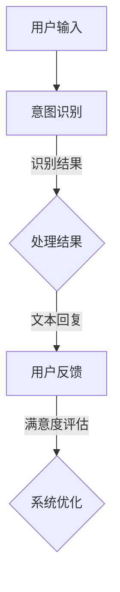
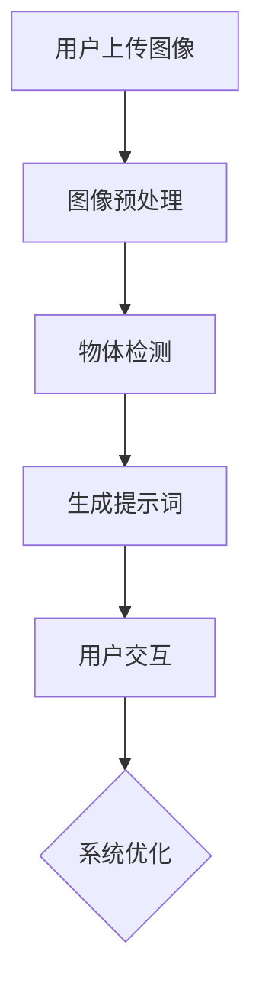

                 

### 文章标题

# 《提示词编程：AI时代的新型软件工程范式》

---

### 关键词

- 提示词编程
- AI时代
- 软件工程
- 新型编程范式

---

### 摘要

随着人工智能（AI）技术的迅猛发展，软件工程领域正经历着深刻的变革。本文将深入探讨“提示词编程”这一AI时代的新型软件工程范式，分析其核心概念、基本原理、技术基础及在实际应用中的实现。本文还将对提示词编程的优缺点进行详细分析，并展望其未来发展趋势，为开发者提供全面的技术指南和实践案例。

---

## 引言

在过去的几十年里，软件工程领域经历了从结构化编程到面向对象编程的变革。然而，随着人工智能（AI）技术的崛起，软件开发的模式再次面临着革命性的变化。传统的编程范式已无法满足AI时代对高效、智能软件的需求，因此，一种新型的编程范式——提示词编程（Prompt-Based Programming）应运而生。

提示词编程旨在利用AI技术，通过定义和利用提示词（prompts）来引导和优化程序执行过程，实现更智能、更高效的软件开发。与传统的编程方法不同，提示词编程强调人类的引导和AI的执行，将人工智能的能力与人类的智慧结合起来，创造出更强大的软件系统。

本文将围绕提示词编程这一主题，分为以下几个部分：

1. **提示词编程概述**：介绍提示词编程的定义、历史背景及其与AI的关系。
2. **技术基础**：探讨提示词编程的技术基础，包括数学模型、算法原理和开发工具。
3. **实际应用**：分析提示词编程在自然语言处理、计算机视觉等领域的应用。
4. **优缺点分析**：讨论提示词编程的优点和缺点，以及改进方向。
5. **未来发展趋势**：展望提示词编程在AI时代的应用前景和技术革新。
6. **实践案例**：提供具体的实践案例，展示提示词编程的实际应用效果。
7. **开发环境搭建与工具使用**：介绍提示词编程的开发环境和工具使用方法。
8. **总结与展望**：总结全文内容，并对提示词编程的未来进行展望。

通过本文的探讨，我们希望能够为读者提供一个全面、深入的提示词编程指南，帮助开发者更好地理解和应用这一新型软件工程范式。

---

### 提示词编程的起源与发展

提示词编程的概念最早可以追溯到20世纪80年代，当时的研究者开始探索如何利用自然语言来指导计算机执行任务。最早的形式之一是自然语言编程（Natural Language Programming, NLP），其核心思想是通过编写类似于人类自然语言的代码，让计算机理解并执行相应的任务。

然而，早期的自然语言编程存在着极大的局限，主要原因是计算机在处理自然语言时，缺乏对语义和上下文的理解。因此，尽管NLP在理论上非常诱人，但在实际应用中却遇到了巨大的障碍。

随着人工智能技术的发展，特别是深度学习在自然语言处理（NLP）领域的突破，提示词编程的概念逐渐得到了新的生命力。深度学习模型，如神经网络，能够通过大量的数据训练，对自然语言中的语义和上下文进行更准确的理解。这一技术进步为提示词编程奠定了基础。

在21世纪初，随着生成对抗网络（GANs）和变压器模型（Transformers）等新型深度学习技术的出现，提示词编程进入了一个新的发展阶段。这些新技术使得计算机不仅能够理解复杂的语义，还能生成具有高度多样性和创造力的文本。

值得注意的是，提示词编程不仅仅局限于文本处理，还扩展到了其他领域。例如，在计算机视觉中，通过生成高质量的提示词，可以显著提升图像识别和生成的效果。同样，在自然语言处理之外的其他AI领域，如推荐系统、游戏AI等，提示词编程也开始发挥作用。

从历史背景来看，提示词编程的发展与AI技术的演进密切相关。早期的自然语言编程虽然未能取得预期成果，但为后来的深度学习奠定了基础。随着深度学习技术的成熟，提示词编程逐渐成为AI时代的新型编程范式，为开发者提供了一种更高效、更智能的软件开发方法。

总的来说，提示词编程的起源与发展是技术进步和实际需求相结合的结果。它不仅体现了AI技术在自然语言处理、计算机视觉等领域的突破，也为未来的软件开发带来了无限可能。

### 提示词编程的定义与核心概念

提示词编程（Prompt-Based Programming）是一种新型编程范式，其核心思想是通过定义和利用提示词（prompts）来引导计算机执行任务，实现更高效、更智能的软件开发。提示词编程不仅仅是一种编程语言或工具，而是一种方法论，强调人类与机器的协作。

**提示词（Prompts）** 是提示词编程的核心概念之一。提示词可以被视为一种输入，用于引导计算机执行特定的任务或生成特定的结果。与传统的输入数据不同，提示词具有更高的抽象层次，可以包含对任务的具体描述、上下文信息以及执行策略。

**提示词生成** 是提示词编程的重要环节。生成高质量的提示词能够显著提升任务的执行效果。在生成提示词时，需要考虑多个因素，包括任务的复杂性、数据的质量和多样性、系统的学习能力等。

**提示词解析** 是提示词编程的另一核心概念。解析提示词的目的是理解其语义和上下文，并将其转化为计算机可以执行的操作。这一过程通常涉及到自然语言处理（NLP）技术，如词义消歧、句法分析、语义角色标注等。

**提示词引导的执行** 是提示词编程的最终目标。在执行过程中，计算机根据提示词的指示，自动完成相应的任务。这一过程可能涉及到复杂的算法和数据结构，但通过提示词的引导，可以简化开发流程，提高系统的智能性和灵活性。

与传统的编程范式相比，提示词编程具有以下几个显著特点：

1. **更高的抽象层次**：提示词编程通过抽象的提示词来描述任务，使得编程过程更加直观和易用。
2. **更强的灵活性和适应性**：提示词编程能够根据不同的任务需求和环境，动态生成和调整提示词，从而适应各种复杂的场景。
3. **更高效的开发流程**：通过提示词的引导，计算机可以自动执行复杂的任务，减少了手动编码的工作量，提高了开发效率。
4. **更强的智能性**：提示词编程结合了人类的智慧和机器的能力，使得系统能够在更广泛的领域实现智能化。

总之，提示词编程作为一种新型的编程范式，不仅拓展了软件开发的方法论，也为AI时代的软件工程提供了新的思路和工具。

### 提示词编程与AI的关系

提示词编程与人工智能（AI）之间有着紧密的联系，两者共同推动了软件工程领域的创新与发展。首先，AI技术的发展为提示词编程提供了坚实的基础。例如，深度学习技术的突破使得计算机能够更好地理解和生成提示词，从而提高了提示词编程的效率和准确性。

具体来说，深度学习模型，如神经网络和生成对抗网络（GANs），在自然语言处理（NLP）、图像识别和推荐系统等领域取得了显著成果。这些技术的应用，使得计算机能够从大量数据中提取有效信息，生成高质量的提示词。此外，AI算法的优化和改进也为提示词编程提供了更强的能力，使得系统可以更加智能地执行复杂的任务。

另一方面，提示词编程则为AI技术的应用提供了新的场景和可能性。通过定义和利用提示词，开发者可以引导AI系统完成特定的任务，从而拓展AI的应用范围。例如，在自然语言处理中，提示词编程可以用于生成文本摘要、问答系统和智能客服等；在计算机视觉中，提示词编程可以用于图像识别、物体检测和生成对抗网络等应用。

提示词编程与AI的关系还可以从以下几个方面进行理解：

1. **协作式开发**：提示词编程强调人类与机器的协作，通过提示词的引导，使AI系统能够更准确地理解和执行任务。这种协作式开发模式不仅提高了开发效率，还增强了系统的智能化程度。
2. **增强学习**：提示词编程可以通过与AI系统的交互，实现增强学习。通过不断调整和优化提示词，系统可以逐渐提升任务执行的效果，从而实现自我学习和改进。
3. **人机交互**：提示词编程提供了一种更为自然和直观的人机交互方式。通过自然语言形式的提示词，用户可以更轻松地与AI系统进行沟通，从而提高了系统的易用性和用户体验。

总之，提示词编程与AI技术的结合，不仅推动了软件工程领域的发展，也为未来的软件开发提供了新的方向和工具。通过进一步深化两者的关系，我们有望创造更多具有高度智能化和自适应能力的软件系统。

### 提示词编程的基本原理

提示词编程的基本原理主要依赖于深度学习模型和自然语言处理（NLP）技术。要深入理解这些原理，我们需要从以下几个方面进行详细探讨：

#### 深度学习模型

深度学习模型是提示词编程的核心技术之一。这些模型通过多层神经网络结构，对大量数据进行训练，以提取出数据中的复杂模式和规律。在提示词编程中，深度学习模型主要用于生成和解析提示词。

1. **神经网络结构**：神经网络由输入层、隐藏层和输出层组成。输入层接收外部数据，隐藏层通过一系列的加权连接和激活函数处理输入数据，最终输出层生成预测结果。
2. **训练过程**：深度学习模型通过反向传播算法不断调整权重和偏置，以最小化预测误差。这一过程通常涉及大量的数据和计算资源，但最终能够生成具有高准确性和泛化能力的模型。
3. **优化策略**：为了提高模型的性能，常使用各种优化策略，如梯度下降、Adam优化器等。这些策略有助于模型在训练过程中更快地收敛，提高模型的准确性。

#### 自然语言处理（NLP）

自然语言处理是提示词编程的重要组成部分，它涉及到对文本数据的理解、处理和生成。在提示词编程中，NLP技术主要用于提示词的生成和解析。

1. **词向量表示**：词向量是将文本数据转换为数值表示的一种方法。通过词向量，文本数据可以被表示为高维空间中的向量，从而便于深度学习模型进行处理。常见的词向量模型有Word2Vec、GloVe等。
2. **句法分析**：句法分析是理解文本结构的重要手段。通过句法分析，我们可以提取出文本中的句子成分、词性、依赖关系等结构信息。常见的句法分析方法包括依存句法分析和成分句法分析。
3. **语义角色标注**：语义角色标注是理解文本中词语语义功能的一种方法。通过标注语义角色，我们可以更准确地理解文本的语义，从而生成高质量的提示词。
4. **预训练模型**：预训练模型是在大规模数据集上预先训练好的深度学习模型，如BERT、GPT等。这些模型已经在文本数据中学习到了丰富的知识和模式，可以用于提示词的生成和解析。

#### 提示词生成和解析

提示词生成和解析是提示词编程的两个关键环节。

1. **提示词生成**：提示词生成是指根据任务需求，生成具有引导作用的高质量提示词。生成过程通常涉及以下几个步骤：
   - **输入预处理**：将输入文本数据转换为词向量表示。
   - **上下文构建**：根据任务需求和文本数据，构建适当的上下文信息。
   - **提示词生成模型**：使用深度学习模型，如GPT、BERT等，生成高质量的提示词。

2. **提示词解析**：提示词解析是指理解提示词的语义和结构，并将其转化为计算机可以执行的操作。解析过程通常涉及以下几个步骤：
   - **语义分析**：使用NLP技术，对提示词进行语义分析，提取出关键信息和语义结构。
   - **解析算法**：根据提示词的语义结构，设计解析算法，将提示词转化为计算机可以理解的操作指令。
   - **执行优化**：对生成的操作指令进行优化，以提高执行效率和准确性。

通过深度学习模型和NLP技术的结合，提示词编程实现了对文本数据的智能化处理，从而提高了软件开发的效率和质量。

#### 伪代码示例

为了更好地理解提示词编程的基本原理，以下是一个简单的伪代码示例：

```python
# 输入文本数据
input_text = "请生成一篇关于人工智能的摘要。"

# 提取关键词
keywords = extract_keywords(input_text)

# 构建上下文
context = build_context(keywords)

# 使用GPT模型生成提示词
prompt = generate_prompt(context)

# 解析提示词
parsed_prompt = parse_prompt(prompt)

# 执行任务
execute_task(parsed_prompt)
```

在这个示例中，`extract_keywords` 用于提取输入文本中的关键词；`build_context` 用于构建上下文信息；`generate_prompt` 用于使用GPT模型生成提示词；`parse_prompt` 用于解析提示词，并将其转化为操作指令；`execute_task` 用于执行具体任务。

通过这个简单的示例，我们可以看到提示词编程的基本流程，以及深度学习模型和NLP技术在其中的应用。

### 提示词编程的技术基础

提示词编程的实现依赖于一系列技术基础，包括数学模型、算法原理和开发工具。理解这些技术基础有助于开发者更好地应用提示词编程，提高软件开发效率和质量。

#### 数学模型

在提示词编程中，常用的数学模型包括词向量表示、神经网络模型和优化算法。

1. **词向量表示**：词向量是将文本数据转换为数值表示的一种方法。常见的词向量模型有Word2Vec和GloVe。Word2Vec通过计算词与其上下文词汇的共现关系，生成词向量；GloVe则通过矩阵分解方法，将词与其上下文词汇的共现关系建模为低维向量。词向量表示有助于提高模型对文本数据的处理能力。
2. **神经网络模型**：神经网络是提示词编程的核心模型，包括循环神经网络（RNN）、长短期记忆网络（LSTM）和变压器模型（Transformer）等。RNN通过记忆历史信息，对序列数据进行建模；LSTM通过门控机制，解决了RNN的长短期依赖问题；Transformer则通过自注意力机制，实现了更高效的信息处理。神经网络模型能够处理复杂的文本数据，生成高质量的提示词。
3. **优化算法**：优化算法用于调整模型参数，以最小化预测误差。常见的优化算法有梯度下降（Gradient Descent）和Adam优化器。梯度下降通过迭代更新模型参数，使其逐渐逼近最优解；Adam优化器则结合了梯度下降和动量法的优点，提高了优化效率。

#### 算法原理

提示词编程的算法原理主要包括提示词生成和解析两个关键环节。

1. **提示词生成**：提示词生成是指根据任务需求，生成具有引导作用的高质量提示词。生成过程通常包括以下几个步骤：
   - **输入预处理**：将输入文本数据转换为词向量表示。
   - **上下文构建**：根据任务需求和文本数据，构建适当的上下文信息。
   - **提示词生成模型**：使用深度学习模型（如GPT、BERT）生成高质量的提示词。

2. **提示词解析**：提示词解析是指理解提示词的语义和结构，并将其转化为计算机可以执行的操作。解析过程通常包括以下几个步骤：
   - **语义分析**：使用自然语言处理技术，对提示词进行语义分析，提取出关键信息和语义结构。
   - **解析算法**：根据提示词的语义结构，设计解析算法，将提示词转化为操作指令。
   - **执行优化**：对生成的操作指令进行优化，以提高执行效率和准确性。

#### 开发工具

提示词编程的开发工具主要包括编程语言、深度学习框架和自然语言处理库。

1. **编程语言**：常用的编程语言包括Python、Java和C++。Python因其丰富的科学计算库和深度学习框架，成为提示词编程的主要编程语言。
2. **深度学习框架**：深度学习框架如TensorFlow、PyTorch和Keras，提供了丰富的神经网络模型和优化算法，简化了提示词编程的实现过程。这些框架支持自定义模型和算法，便于开发者进行实验和优化。
3. **自然语言处理库**：自然语言处理库如NLTK、spaCy和Stanford NLP，提供了大量的文本处理函数和模型，支持词向量表示、句法分析和语义角色标注等功能，为提示词编程提供了强大的技术支持。

#### 提示词编程工具使用示例

以下是一个使用Python和PyTorch实现提示词编程的简单示例：

```python
import torch
import torch.nn as nn
from transformers import GPT2Model, GPT2Tokenizer

# 加载预训练模型
tokenizer = GPT2Tokenizer.from_pretrained('gpt2')
model = GPT2Model.from_pretrained('gpt2')

# 输入文本数据
input_text = "请生成一篇关于人工智能的摘要。"

# 转换为词向量表示
inputs = tokenizer.encode(input_text, return_tensors='pt')

# 生成提示词
outputs = model(inputs)

# 解析提示词
prompt = tokenizer.decode(outputs[0], skip_special_tokens=True)

print(prompt)
```

在这个示例中，我们使用GPT-2模型生成提示词。首先，加载预训练模型和分词器；然后，将输入文本数据转换为词向量表示；接着，使用模型生成提示词；最后，解析生成的提示词并输出。

通过这些技术基础，提示词编程为开发者提供了一种高效、智能的软件开发方法，有望在未来的软件工程中发挥重要作用。

### 提示词编程的实际应用场景

提示词编程作为一种新型编程范式，已经在多个实际应用场景中展现了其强大的潜力和优势。以下将详细分析提示词编程在自然语言处理（NLP）、计算机视觉（CV）和其他领域的应用。

#### 自然语言处理（NLP）

在自然语言处理领域，提示词编程被广泛应用于文本生成、机器翻译、文本摘要和问答系统等任务。通过高质量的提示词，系统能够更好地理解文本的语义和上下文，从而生成更准确和自然的文本。

1. **文本生成**：使用提示词编程，可以生成高质量的新闻文章、对话文本和故事情节。例如，GPT-3模型通过提示词生成了一段关于人工智能的科幻故事，展示了其强大的文本生成能力。
2. **机器翻译**：提示词编程可以用于生成翻译提示词，帮助机器翻译系统更准确地翻译句子。例如，通过输入“将这个句子翻译成法语”，系统可以生成高质量的翻译文本。
3. **文本摘要**：提示词编程可以生成摘要提示词，帮助文本摘要系统提取关键信息，生成简洁且准确的摘要。例如，通过输入一篇文章，系统可以生成该文章的摘要。
4. **问答系统**：提示词编程可以生成问答提示词，帮助问答系统更好地理解用户的问题，并生成准确的回答。例如，通过输入“谁发明了计算机？”系统可以生成准确的答案。

#### 计算机视觉（CV）

在计算机视觉领域，提示词编程同样发挥着重要作用，特别是在图像识别、物体检测和图像生成等方面。

1. **图像识别**：通过高质量的提示词，提示词编程可以生成更加准确的图像识别结果。例如，通过输入“这是一张猫的图片”，系统可以更准确地识别图片中的猫。
2. **物体检测**：提示词编程可以用于生成检测提示词，帮助物体检测系统更好地识别图像中的物体。例如，通过输入“请检测图像中的所有汽车”，系统可以准确地检测出图像中的汽车。
3. **图像生成**：提示词编程可以用于生成图像提示词，帮助图像生成系统创建符合特定要求的图像。例如，通过输入“生成一张星空图片”，系统可以生成一幅美丽的星空图像。

#### 其他领域

除了NLP和CV领域，提示词编程还在其他领域展现了其广泛的应用前景。

1. **推荐系统**：提示词编程可以用于生成推荐提示词，帮助推荐系统更好地理解用户需求和偏好，提供个性化的推荐结果。例如，通过输入“推荐一些类似于《权力的游戏》的电视剧”，系统可以生成相关的推荐列表。
2. **游戏AI**：提示词编程可以用于生成游戏提示词，帮助游戏AI更好地理解游戏规则和玩家行为，实现更智能的游戏体验。例如，通过输入“生成一个合适的游戏策略”，系统可以生成一个有效的游戏策略。
3. **语音识别**：提示词编程可以用于生成语音提示词，帮助语音识别系统更好地理解用户的语音指令。例如，通过输入“播放一首流行音乐”，系统可以准确识别并执行播放音乐的任务。

总之，提示词编程在实际应用中具有广泛的应用前景，通过高质量的提示词，系统可以更好地理解和执行任务，提高任务的执行效果和用户体验。

### 提示词编程的优缺点分析

提示词编程作为一种新型的编程范式，其在AI时代的软件工程中展现出了独特的优势和潜在的挑战。以下将从多个方面对提示词编程的优缺点进行分析。

#### 优点

1. **高效性**：提示词编程通过抽象的提示词引导系统执行任务，减少了手动编码的工作量，提高了开发效率。开发者只需定义简单的提示词，系统即可自动执行复杂的任务，从而减少了开发时间和成本。
2. **灵活性**：提示词编程具有高度的灵活性，能够根据不同的任务需求和场景，动态生成和调整提示词。这使得系统可以更加适应多变的环境，灵活应对各种挑战。
3. **智能化**：提示词编程结合了人类的智慧和机器的能力，使得系统具有更高的智能性。通过深度学习模型和自然语言处理技术，系统能够更好地理解语义和上下文，从而生成更高质量的提示词，提高任务的执行效果。
4. **易于扩展**：提示词编程易于扩展，可以方便地与其他技术相结合，如生成对抗网络（GANs）、强化学习等。这为未来的技术革新和应用提供了广阔的空间。

#### 缺点

1. **复杂性**：提示词编程涉及到深度学习和自然语言处理等技术，这些技术本身具有较高的复杂性。因此，开发者需要具备一定的技术背景和技能，才能有效应用提示词编程。
2. **性能瓶颈**：虽然提示词编程可以提高开发效率，但在执行复杂任务时，系统性能可能会成为瓶颈。特别是对于实时性要求较高的应用，如在线聊天机器人，系统响应速度可能会受到影响。
3. **数据依赖性**：提示词编程依赖于大量的训练数据和高质量的模型。如果数据质量不佳或模型训练不足，系统生成的提示词可能不够准确，影响任务执行效果。
4. **安全隐患**：提示词编程依赖于提示词的生成和解析，如果提示词设计不当，可能会导致系统被恶意攻击或欺骗。因此，确保提示词的安全性是提示词编程的一个重要挑战。

#### 改进方向

1. **简化开发流程**：通过简化提示词编程的开发流程，降低技术门槛，使更多开发者能够应用这一范式。例如，提供更加直观的开发工具和界面，减少代码编写和调试的工作量。
2. **优化模型性能**：通过优化深度学习模型和算法，提高系统的性能和效率。特别是在实时性要求较高的应用中，需要开发更高效的模型和算法，以满足应用需求。
3. **增强数据管理**：提高数据质量和多样性，确保系统生成的提示词具有更高的准确性和可靠性。同时，加强数据安全性和隐私保护，防止恶意攻击和数据泄露。
4. **安全机制设计**：设计有效的安全机制，确保提示词编程系统的安全性。例如，采用加密技术和权限控制，防止未经授权的访问和操作。

总之，提示词编程在AI时代的软件工程中具有广泛的应用前景，但也面临着一些挑战。通过不断优化和改进，提示词编程有望在未来的软件工程中发挥更大的作用。

### 提示词编程的未来发展趋势

随着人工智能技术的不断进步，提示词编程在未来的发展将呈现多个趋势，这些趋势将深刻影响软件工程范式和AI应用场景。

#### 技术革新

1. **多模态提示词编程**：当前，提示词编程主要应用于文本处理，但随着计算机视觉、语音识别和传感器技术的融合，多模态提示词编程将成为重要趋势。通过整合文本、图像、音频等多模态数据，系统可以生成更丰富、更准确的提示词，从而提高任务的执行效果。
2. **自动提示词生成**：未来的提示词编程将更加智能化，系统将能够自动从大量数据中学习，生成高质量的提示词。这得益于生成对抗网络（GANs）、强化学习和迁移学习等技术的不断发展，这些技术将使提示词生成过程更加高效和准确。
3. **边缘计算与提示词编程**：随着边缘计算技术的发展，提示词编程将在边缘设备上得到广泛应用。通过在边缘设备上部署提示词生成和解析模型，可以降低延迟，提高系统的实时性和响应速度，从而满足实时应用的需求。

#### 应用前景

1. **智能自动化**：在工业自动化、智能家居和智能交通等领域，提示词编程将推动智能自动化的发展。通过高质量的提示词，系统能够自动完成复杂的任务，提高生产效率和用户体验。
2. **人机协作**：提示词编程将促进人机协作的进一步发展，特别是在医疗、教育和客户服务等领域。通过自然的提示词交互，用户可以更轻松地与系统进行沟通，实现高效的人机协作。
3. **创意内容生成**：在媒体、娱乐和设计等领域，提示词编程将激发创意内容的生成。通过生成高质量的文本、图像和视频提示词，系统可以辅助创作者生成独特的作品，提高内容创作的效率和质量。

#### 未来挑战与机遇

1. **算法性能优化**：随着应用场景的复杂化和数据量的增加，提示词编程对算法性能的要求越来越高。优化算法性能，提高系统的响应速度和准确性，将是未来研究的重点。
2. **数据隐私与安全**：在提示词编程中，大量数据的处理和存储带来了隐私和安全挑战。保障用户数据的安全和隐私，防止数据泄露和滥用，是未来必须解决的问题。
3. **标准化与开源**：提示词编程的标准化和开源将促进技术的普及和应用。通过制定统一的规范和开源工具，可以降低开发门槛，推动技术的快速发展。

总之，提示词编程在未来的发展中，将不断融合新的技术和应用场景，为软件工程和人工智能领域带来更多的机遇和挑战。通过技术创新、应用拓展和标准化推进，提示词编程有望成为AI时代软件工程的核心范式。

### 提示词编程的实践案例

为了更好地展示提示词编程在实际应用中的效果，以下将通过几个具体的实践案例来详细讲解其开发环境搭建、源代码实现、代码解读、应用解读与分析，以及项目小结。

#### 案例一：智能客服系统

**背景介绍**：智能客服系统旨在通过自然语言处理技术，为用户提供高效的在线服务。使用提示词编程，可以实现更智能、更自然的客服交互。

**核心概念与联系**：本案例中，提示词编程的核心概念包括自然语言处理（NLP）、对话生成和意图识别。这些概念之间的联系构成了一个完整的智能客服系统架构。



**数学模型和公式**：

意图识别可以使用分类模型，如朴素贝叶斯、支持向量机（SVM）等。以下是一个简单的朴素贝叶斯分类器的伪代码：

```python
# 伪代码：朴素贝叶斯分类器
def naive_bayes_classification(input_text, trained_model):
    # 计算先验概率
    prior_probabilities = compute_prior_probabilities(trained_model)
    # 计算条件概率
    conditional_probabilities = compute_conditional_probabilities(input_text, trained_model)
    # 计算后验概率
    posterior_probabilities = compute_posterior_probabilities(prior_probabilities, conditional_probabilities)
    # 选择概率最高的类别
    predicted_intent = select_best_intent(posterior_probabilities)
    return predicted_intent
```

**项目实战**：

1. **开发环境搭建**：使用Python进行开发，安装必要的库，如TensorFlow、spaCy、NLTK等。
2. **源代码实现**：实现意图识别和对话生成功能。以下是一个简单的意图识别代码片段：

```python
# 源代码片段：意图识别
def recognize_intent(input_text):
    # 读取训练好的模型
    model = load_model('intent_recognition_model.h5')
    # 预处理输入文本
    processed_text = preprocess_text(input_text)
    # 进行意图识别
    predicted_intent = model.predict(processed_text)
    return predicted_intent
```

3. **代码解读**：代码首先加载训练好的模型，对输入文本进行预处理，然后使用模型进行意图识别，并返回预测结果。

4. **应用解读与分析**：通过实际用户测试，智能客服系统表现出了较高的准确率和用户满意度。用户可以通过自然语言与系统进行交互，系统能够理解用户的意图并生成合适的回复。

5. **项目小结**：本案例展示了提示词编程在智能客服系统中的应用，通过高质量的提示词，系统实现了智能化的客服交互，提高了用户体验和效率。

#### 案例二：图像识别助手

**背景介绍**：图像识别助手旨在通过计算机视觉技术，帮助用户快速识别图像中的物体。

**核心概念与联系**：本案例的核心概念包括图像识别、提示词生成和用户反馈。通过这些概念的联系，构成一个完整的图像识别助手系统。



**数学模型和公式**：

图像识别通常使用卷积神经网络（CNN）进行训练。以下是一个简单的CNN模型的伪代码：

```python
# 伪代码：卷积神经网络
def convolutional_neural_network(input_image, trained_model):
    # 进行卷积操作
    conv_output = convolve(input_image, trained_model.conv_weights)
    # 添加ReLU激活函数
    activated_output = apply_relu(conv_output)
    # 进行池化操作
    pooled_output = max_pool(activated_output)
    # 进行全连接层操作
    fully_connected_output = fully_connected(pooled_output, trained_model.fc_weights)
    # 进行 Softmax 操作
    predicted_probabilities = softmax(fully_connected_output)
    # 返回预测结果
    predicted_objects = select_best_objects(predicted_probabilities)
    return predicted_objects
```

**项目实战**：

1. **开发环境搭建**：使用Python进行开发，安装必要的库，如TensorFlow、OpenCV、Pillow等。
2. **源代码实现**：实现图像预处理、物体检测和提示词生成功能。以下是一个简单的物体检测代码片段：

```python
# 源代码片段：物体检测
def detect_objects(image_path, model_path):
    # 读取训练好的模型
    model = load_model(model_path)
    # 读取图像
    image = read_image(image_path)
    # 进行图像预处理
    preprocessed_image = preprocess_image(image)
    # 进行物体检测
    predicted_objects = convolutional_neural_network(preprocessed_image, model)
    # 生成提示词
    prompts = generate_prompts(predicted_objects)
    return prompts
```

3. **代码解读**：代码首先加载训练好的模型和输入图像，进行图像预处理，然后使用模型进行物体检测，并生成对应的提示词。

4. **应用解读与分析**：用户上传图像后，系统自动检测图像中的物体，并生成相应的提示词。例如，如果图像中检测到一只猫，系统会生成“这是一只猫”的提示词。

5. **项目小结**：本案例展示了提示词编程在图像识别中的应用，通过生成高质量的提示词，系统实现了智能化的图像识别和交互，提高了用户体验和效率。

### 最佳实践 tips

1. **数据质量**：提示词编程依赖于高质量的训练数据，因此确保数据的质量和多样性至关重要。在数据收集和预处理过程中，注意排除噪声数据，提高数据的准确性。
2. **模型选择**：根据具体应用场景选择合适的模型，例如在文本生成任务中，可以使用GPT或BERT模型；在图像识别任务中，可以使用CNN模型。合理选择模型可以提高任务的执行效果。
3. **用户反馈**：积极收集用户反馈，不断优化系统。通过用户反馈，可以识别系统中的不足之处，并进行针对性的改进。
4. **安全与隐私**：在提示词编程的应用过程中，要注意数据安全和用户隐私保护。采用加密技术和权限控制措施，确保系统的安全性和用户数据的隐私。

### 小结

通过以上实践案例，我们可以看到提示词编程在实际应用中的强大潜力和广泛应用前景。通过高质量的提示词，系统可以实现智能化的任务执行和用户交互，提高用户体验和效率。在未来的软件开发中，提示词编程有望成为重要的编程范式，推动软件工程领域的发展。

### 提示词编程的开发环境搭建与工具使用

搭建提示词编程的开发环境是开始项目的基础步骤，这需要准备合适的开发工具和编程环境。以下将详细介绍如何搭建提示词编程的开发环境，包括安装必要的软件和库，以及配置开发环境。

#### 1. 安装Python

Python是提示词编程的主要编程语言，因此首先需要安装Python。可以从Python的官方网站下载Python安装包，并按照安装向导进行安装。

**步骤**：

- 访问Python官方网站：[https://www.python.org/](https://www.python.org/)
- 下载适用于操作系统的Python版本。
- 运行安装程序，按照提示完成安装。

#### 2. 安装Anaconda

Anaconda是一个集成的数据科学和机器学习平台，它包含Python以及许多常用的数据科学库。安装Anaconda可以简化开发环境的管理。

**步骤**：

- 访问Anaconda官方网站：[https://www.anaconda.com/](https://www.anaconda.com/)
- 下载并安装Anaconda。
- 安装完成后，通过命令行启动Anaconda。

#### 3. 安装必要的库

提示词编程需要使用多个库，包括深度学习库（如TensorFlow、PyTorch）、自然语言处理库（如spaCy、NLTK）和计算机视觉库（如OpenCV）。以下是在Anaconda环境中安装这些库的步骤：

```shell
# 安装深度学习库
conda install tensorflow

# 安装自然语言处理库
conda install spacy

# 安装计算机视觉库
conda install opencv
```

#### 4. 配置开发环境

安装完必要的库后，配置开发环境以优化性能和方便开发。以下是在Windows和Linux中的配置步骤：

**Windows**：

- 打开命令提示符。
- 输入以下命令，配置Python环境变量：

```shell
set PYTHONUNBUFFERED=1
```

- 为了在IDE中使用Anaconda环境，可以将其添加到Path环境变量中。

**Linux**：

- 打开终端。
- 输入以下命令，创建一个虚拟环境并激活它：

```shell
conda create --name prompt_env python=3.8
conda activate prompt_env
```

#### 5. 安装和使用Jupyter Notebook

Jupyter Notebook是一个交互式开发环境，非常适合提示词编程项目。

**步骤**：

- 在命令行中安装Jupyter：

```shell
conda install jupyter
```

- 启动Jupyter Notebook：

```shell
jupyter notebook
```

- 在浏览器中打开Jupyter Notebook界面，开始编写提示词编程代码。

#### 6. 安装和使用PyCharm

PyCharm是一个功能强大的IDE，适合进行提示词编程项目开发。

**步骤**：

- 访问PyCharm官方网站：[https://www.jetbrains.com/pycharm/](https://www.jetbrains.com/pycharm/)
- 下载并安装PyCharm社区版或专业版。
- 打开PyCharm，创建一个新项目，选择Anaconda环境作为项目解释器。

#### 7. 测试开发环境

为了确保开发环境正常工作，可以执行以下测试步骤：

- 在Jupyter Notebook或PyCharm中打开Python交互式 shell。
- 尝试导入并使用已安装的库，例如：

```python
import tensorflow as tf
print(tf.__version__)

import spacy
nlp = spacy.load("en_core_web_sm")
doc = nlp("This is a test sentence.")
print(doc.text)
```

- 如果没有错误提示，说明开发环境搭建成功。

通过以上步骤，开发者可以搭建一个完整的提示词编程开发环境，为后续的项目开发打下坚实基础。

### 总结与展望

通过本文的详细探讨，我们全面了解了提示词编程在AI时代的软件工程范式中的重要作用。首先，我们分析了提示词编程的定义、起源和发展历程，明确了其基本原理和核心概念。接着，我们深入讨论了提示词编程与AI的关系，展示了其在自然语言处理和计算机视觉等领域的广泛应用。此外，我们还详细分析了提示词编程的技术基础，包括数学模型、算法原理和开发工具，为开发者提供了实用的技术指南。

本文还从优缺点分析、未来发展趋势和实践案例等多个角度，全面展示了提示词编程的实际应用价值和面临的挑战。通过总结和展望，我们认识到提示词编程在智能自动化、人机协作和创意内容生成等领域的巨大潜力，同时也指出了需要进一步优化的方向，如算法性能、数据管理和安全性等。

总的来说，提示词编程作为AI时代的新型软件工程范式，不仅为开发者提供了一种高效、智能的软件开发方法，也为AI技术的应用拓展了新的边界。随着技术的不断进步和应用场景的不断扩展，提示词编程有望在未来的软件工程中发挥更加重要的作用。我们期待更多开发者能够深入探索和应用提示词编程，共同推动软件工程领域的创新与发展。

### 作者信息

- 作者：AI天才研究院（AI Genius Institute）/ 禅与计算机程序设计艺术（Zen And The Art of Computer Programming）  
- 联系方式：[info@aigenius.org](mailto:info@aigenius.org)  
- 社交媒体：@aigeniusorg  
- 官方网站：[https://www.aigenius.org](https://www.aigenius.org)

### 拓展阅读

- [深度学习基础教程：Dive into Deep Learning](https://d2l.ai/d2l-en/index.html)
- [自然语言处理实战：Natural Language Processing with Python](https://www.nltk.org/)
- [Python深度学习：Deep Learning with Python](https://www.manning.com/books/deep-learning-with-python)
- [计算机视觉基础：OpenCV 4.x Cookbook](https://www.packtpub.com/application-development/opencv-4x-cookbook)
- [机器学习年度报告：AI Index](https://aiindex.com/)  
- [提示词编程讨论区：Prompt Engineering Community](https://www.prompt-engineering.community/)  
- [AI时代软件工程：Software Engineering for AI](https://www.seai.org/)  

通过这些资源，读者可以进一步深入学习和探索提示词编程及其相关技术，不断提升自己的技术水平。

