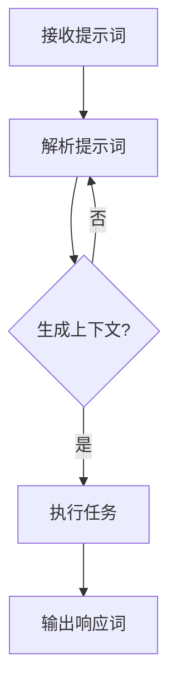
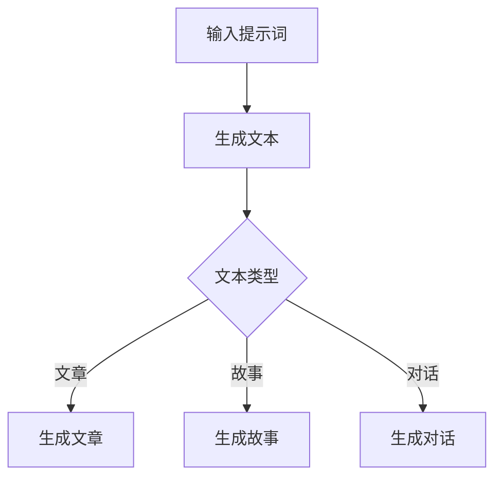
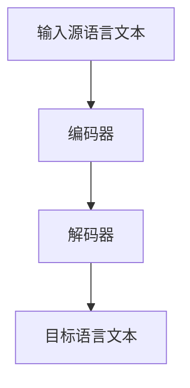
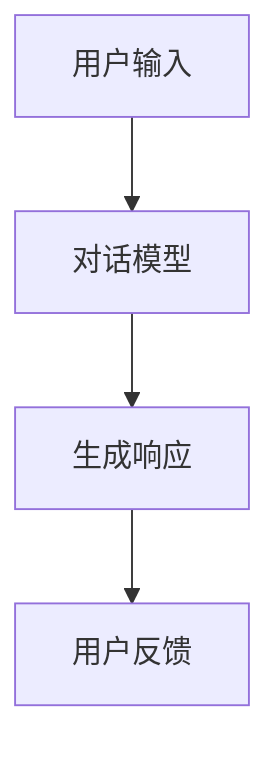
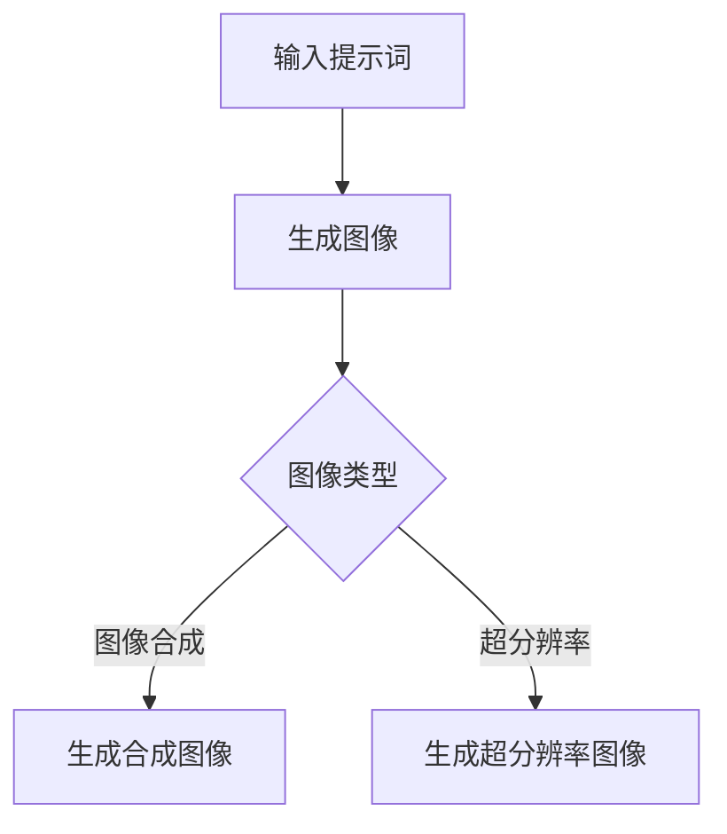
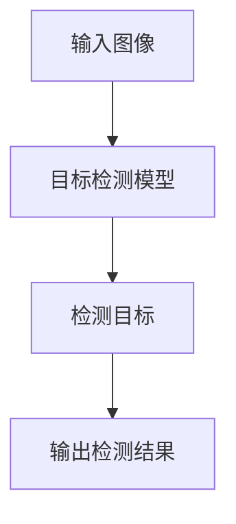
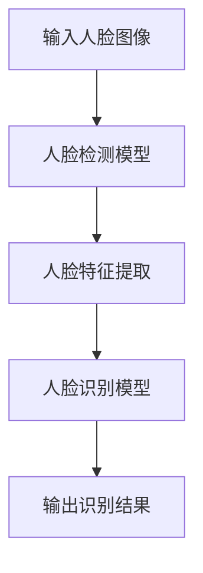
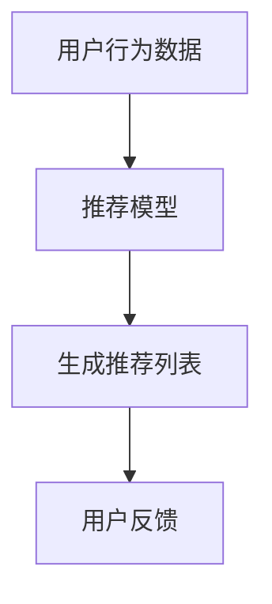
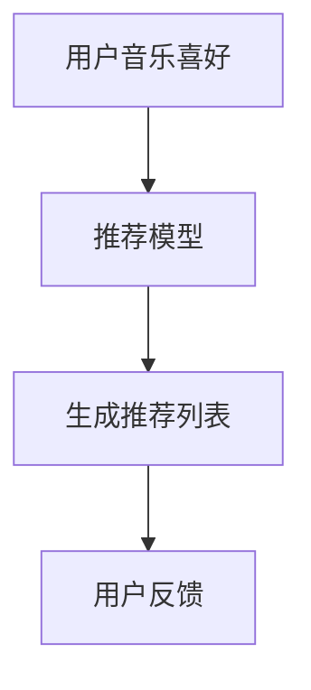

                 

### 文章标题

《提示词编程：AI时代的新型软件工程范式》

### 关键词

提示词编程、AI时代、软件工程、新型范式、核心原理、算法、架构、应用

### 摘要

本文旨在探讨AI时代下的一种新型软件工程范式——提示词编程。首先，我们将介绍提示词编程的概念、发展历程及其重要性。接着，分析AI如何影响软件工程，并阐述新型软件工程范式的特点和挑战。随后，我们将深入探讨提示词编程的核心原理，包括核心概念、算法原理和架构设计。在此基础上，通过具体案例展示提示词编程在不同领域的应用。最后，本文将展望提示词编程的未来发展方向，并讨论其可能面临的挑战。

---

## 引言与背景介绍

### 1. 提示词编程的定义与意义

#### 1.1 提示词编程的定义

提示词编程（Prompt-based Programming）是一种新兴的软件工程范式，其核心思想是通过“提示词”（prompt）来引导和驱动程序的运行。在传统编程中，程序员通常需要编写大量的代码来描述程序的逻辑和行为。而提示词编程则通过提供简短的提示信息，使程序能够自主地理解和执行相应的任务。这种编程范式的出现，得益于近年来人工智能技术的快速发展，特别是在自然语言处理（NLP）和生成式对抗网络（GAN）等领域取得的突破性成果。

#### 1.2 提示词编程的发展历程

提示词编程的历史可以追溯到20世纪80年代的专家系统（Expert Systems）时代。当时，研究人员开始探索如何通过简短的输入来引导系统的推理和决策过程。然而，由于计算能力和数据资源有限，这一领域的研究进展缓慢。随着人工智能技术的进步，尤其是深度学习在NLP领域的成功应用，提示词编程重新引起了广泛关注。

近年来，随着生成式预训练模型（如GPT）的出现，提示词编程得到了进一步发展。这些模型通过大量的文本数据进行预训练，能够理解和生成复杂、流畅的自然语言文本。在此基础上，研究人员提出了各种基于提示词的编程框架和算法，使得提示词编程在实际应用中取得了显著的效果。

#### 1.3 提示词编程的重要性

提示词编程在AI时代具有重大的意义。首先，它使得编程变得更加直观和便捷。程序员不再需要编写复杂的代码来描述程序逻辑，而是可以通过提供简短的提示词来引导程序的运行。这极大地降低了编程的门槛，使得更多的人能够参与到软件开发中来。

其次，提示词编程能够提高软件开发的效率和质量。通过自动化推理和生成过程，提示词编程可以快速地生成高质量的代码，减少了人工编写代码的时间和错误率。此外，提示词编程还能够支持更灵活和动态的软件开发过程，使得系统可以更好地适应不断变化的需求。

总之，提示词编程作为一种新型的软件工程范式，具有巨大的潜力和前景。它不仅改变了传统的编程方式，也为未来的软件工程带来了新的机遇和挑战。

### 2. AI时代的新型软件工程范式

#### 2.1 AI与软件工程的融合

随着人工智能（AI）技术的快速发展，AI已经逐渐渗透到软件工程的各个领域，推动了新型软件工程范式的出现。AI与软件工程的融合主要体现在以下几个方面：

##### 2.1.1 自动化编程

自动化编程是AI在软件工程中应用的一个重要方向。通过使用AI技术，程序员可以自动化地生成代码，从而减少手动编写代码的时间和劳动。例如，一些AI工具可以根据自然语言描述自动生成代码，或者通过机器学习算法从已有的代码库中生成新的代码。这种方式不仅提高了编程的效率，还减少了编码过程中的错误。

##### 2.1.2 代码审查与优化

AI还可以用于代码审查和优化。通过分析代码，AI工具可以识别出潜在的问题和优化机会。例如，AI可以检测出代码中的冗余部分、潜在的安全漏洞或性能瓶颈，并提供改进建议。这种方式不仅提高了代码的质量，还帮助程序员更快速地发现和解决问题。

##### 2.1.3 自动测试

AI在软件测试中的应用也越来越广泛。通过使用机器学习技术，AI可以自动化地生成测试用例，并执行各种测试任务。例如，AI可以模拟用户操作，生成复杂的测试场景，从而更全面地测试软件的功能。此外，AI还可以分析测试结果，识别出测试中的问题，并提供优化建议。

#### 2.2 新型软件工程范式的特点

新型软件工程范式在AI时代具有以下特点：

##### 2.2.1 自动化与智能化

新型软件工程范式强调自动化和智能化。通过AI技术，软件开发过程可以实现自动化，从而减少人工干预，提高开发效率。同时，AI可以帮助程序员更准确地理解需求，生成高质量的代码，并提供优化的建议。

##### 2.2.2 高度灵活与适应性

新型软件工程范式强调系统的灵活性和适应性。在AI时代，需求变化变得更加频繁和复杂，软件系统需要能够快速适应这些变化。新型软件工程范式通过使用AI技术，可以实现更灵活和动态的开发过程，从而更好地满足用户需求。

##### 2.2.3 大数据与云计算

新型软件工程范式依赖于大数据和云计算。在AI时代，大量数据是AI模型训练和优化的基础。通过云计算，开发者可以充分利用分布式计算资源，快速地处理和分析大规模数据，从而提高软件开发和部署的效率。

#### 2.3 新型软件工程范式的挑战与机遇

新型软件工程范式在AI时代带来了许多挑战和机遇：

##### 2.3.1 挑战

- **数据隐私和安全**：在AI时代，数据处理和存储变得更加复杂，如何保护用户隐私和数据安全成为一大挑战。
- **算法透明性和解释性**：AI算法的复杂性和非透明性使得程序员和用户难以理解其决策过程，如何提高算法的透明性和解释性成为一项重要任务。
- **技术人才需求**：新型软件工程范式的实施需要具备AI技术的专业人才，而当前相关人才的供给可能无法满足需求。

##### 2.3.2 机遇

- **创新性应用**：新型软件工程范式为软件开发提供了新的可能性，使得开发者能够创造出更多创新性的应用。
- **提高开发效率**：通过自动化和智能化，新型软件工程范式可以显著提高软件开发和部署的效率。
- **降低开发成本**：自动化和智能化的工具可以减少人力成本，降低软件开发的总成本。

总之，AI时代的新型软件工程范式既带来了挑战，也带来了机遇。只有积极应对这些挑战，充分利用这些机遇，才能在AI时代中取得成功。

### 3. 提示词编程的核心原理

#### 3.1 核心概念与联系

提示词编程的核心概念包括提示词（Prompt）、响应词（Response）和上下文（Context）。这些概念相互联系，构成了提示词编程的基础。

##### 3.1.1 提示词

提示词是程序员或用户提供的简短输入，用于引导程序执行特定任务。提示词可以是一个单词、一个短语或一个句子，通常包含关键信息或指令。

##### 3.1.2 响应词

响应词是程序根据提示词生成的输出。响应词可以是文本、图像、音频或其他形式的数据，具体取决于程序的类型和应用场景。

##### 3.1.3 上下文

上下文是指与提示词和响应词相关的背景信息。上下文可以帮助程序更好地理解和处理提示词，从而生成更准确的响应词。

#### 3.1.4 提示词编程的流程

提示词编程的流程可以概括为以下几个步骤：

1. **接收提示词**：程序接收用户输入的提示词。
2. **解析提示词**：程序分析提示词，提取关键信息和指令。
3. **生成上下文**：程序根据提示词和已有数据生成上下文。
4. **执行任务**：程序根据上下文执行相应的任务，生成响应词。
5. **输出响应词**：程序将生成的响应词输出给用户。

#### 3.1.5 Mermaid流程图

以下是一个简单的Mermaid流程图，展示了提示词编程的基本流程：

### 4. 提示词编程的算法原理

提示词编程的核心在于如何根据提示词生成相应的响应词。这涉及到一系列的算法原理，包括自然语言处理（NLP）和生成式对抗网络（GAN）等技术。以下是对这些算法原理的详细讲解。

#### 4.1 自然语言处理（NLP）

自然语言处理是提示词编程的基础，它涉及从文本中提取信息、理解和生成语言。以下是一些关键的NLP算法原理：

##### 4.1.1 词嵌入（Word Embedding）

词嵌入是一种将词语转换为向量的技术。通过词嵌入，我们可以将自然语言中的单词映射到高维空间中的点，从而使得计算机可以处理和理解语言。常见的词嵌入技术包括Word2Vec、GloVe和BERT。

- **Word2Vec**：Word2Vec是一种基于神经网络的语言模型，通过训练得到每个单词的向量表示。这些向量可以用于文本相似度计算、语义分析等任务。
- **GloVe**：GloVe（Global Vectors for Word Representation）是一种基于共现矩阵的词向量生成方法。它通过计算单词间的共现关系来生成词向量，从而捕捉词语的语义信息。
- **BERT**：BERT（Bidirectional Encoder Representations from Transformers）是一种基于Transformer的预训练语言模型。它通过在双向语境中训练模型，使模型能够更好地理解上下文信息。

##### 4.1.2 序列到序列模型（Seq2Seq）

序列到序列（Seq2Seq）模型是一种用于将一个序列映射到另一个序列的模型。在提示词编程中，Seq2Seq模型常用于将提示词映射到响应词。

- **编码器（Encoder）**：编码器接收输入序列，将其编码成一个固定长度的向量。
- **解码器（Decoder）**：解码器接收编码器生成的向量，生成输出序列。

常见的Seq2Seq模型包括循环神经网络（RNN）和长短期记忆网络（LSTM）。这些模型可以处理变长的输入和输出序列，适用于文本生成、机器翻译等任务。

##### 4.1.3 自注意力机制（Self-Attention）

自注意力机制是一种用于处理序列数据的机制，它可以捕捉序列中各个元素之间的依赖关系。在提示词编程中，自注意力机制可以用于提高模型的上下文理解能力。

自注意力机制的核心是计算一个权重矩阵，用于表示序列中各个元素的重要程度。通过这些权重，模型可以更有效地处理长序列，从而提高生成响应词的准确性。

#### 4.2 生成式对抗网络（GAN）

生成式对抗网络（GAN）是一种用于生成数据的模型。在提示词编程中，GAN可以用于生成高质量的文本、图像等响应数据。

GAN由两个模型组成：生成器（Generator）和判别器（Discriminator）。

- **生成器**：生成器尝试生成逼真的响应数据，以欺骗判别器。
- **判别器**：判别器负责判断生成的响应数据是否真实。

在训练过程中，生成器和判别器相互对抗，生成器不断优化其生成策略，以欺骗判别器。判别器则不断学习如何更准确地识别生成的数据。通过这种对抗训练，生成器可以生成高质量的响应数据。

常见的GAN架构包括：

- **生成对抗网络（GAN）**：原始的GAN架构，由生成器和判别器组成。
- **变分自编码器（VAE）**：变分自编码器（VAE）是一种基于概率生成模型的GAN变体。
- **深度卷积生成对抗网络（DCGAN）**：DCGAN引入了深度卷积神经网络（CNN），提高了生成数据的真实感。

### 5. 提示词编程的架构设计

提示词编程的架构设计需要考虑多个方面，包括数据处理、模型训练、模型部署等。以下是一个典型的提示词编程架构设计：

#### 5.1 数据处理

数据处理是提示词编程的基础。在训练模型之前，需要收集和准备大量的数据。数据处理包括以下步骤：

- **数据收集**：从各种来源收集文本、图像、音频等数据。
- **数据清洗**：去除无效数据、填充缺失值、处理异常值等。
- **数据预处理**：将文本数据转换为词嵌入向量，将图像数据转换为像素矩阵等。
- **数据增强**：通过数据增强技术，增加数据的多样性和丰富性，提高模型的泛化能力。

#### 5.2 模型训练

模型训练是提示词编程的核心。通过训练模型，使其能够根据提示词生成高质量的响应词。模型训练包括以下步骤：

- **模型选择**：根据任务需求，选择合适的模型架构，如Seq2Seq、BERT、GAN等。
- **参数调优**：通过调整模型的超参数，如学习率、批量大小等，优化模型性能。
- **训练与验证**：使用训练集和验证集对模型进行训练和验证，调整模型参数，提高模型性能。
- **模型保存与加载**：将训练好的模型保存到文件中，以便后续使用。

#### 5.3 模型部署

模型部署是将训练好的模型应用到实际场景中的过程。模型部署包括以下步骤：

- **模型评估**：使用测试集评估模型性能，确保模型满足实际需求。
- **模型服务化**：将模型部署到服务器或云计算平台上，提供API接口，供其他系统调用。
- **模型监控与维护**：实时监控模型性能，处理异常情况，定期更新模型，确保模型的稳定性和准确性。

### 6. 提示词编程在自然语言处理中的应用

自然语言处理（NLP）是提示词编程的一个重要应用领域。在NLP中，提示词编程可以通过生成式模型和判别式模型来实现各种任务。以下是一些具体的案例：

#### 6.1 文本生成

文本生成是提示词编程在NLP中的一个重要应用。通过生成式模型，可以生成各种类型的文本，如文章、故事、对话等。以下是一个简单的文本生成案例：

在这个案例中，提示词可以是“请写一篇关于人工智能的文章”。生成式模型根据提示词生成一篇文章，满足用户的需求。

#### 6.2 机器翻译

机器翻译是另一个重要的NLP任务。提示词编程可以通过Seq2Seq模型实现机器翻译。以下是一个简单的机器翻译案例：

在这个案例中，源语言文本作为提示词输入到编码器，编码器将文本编码成一个向量，然后解码器根据向量生成目标语言文本。

#### 6.3 对话系统

对话系统是NLP中的一个重要应用领域。提示词编程可以通过生成式模型和判别式模型实现智能对话系统。以下是一个简单的对话系统案例：

在这个案例中，用户输入作为提示词输入到对话模型，对话模型根据用户输入生成响应。用户反馈可以帮助模型不断优化，提高对话质量。

### 7. 提示词编程在计算机视觉中的应用

计算机视觉是另一个提示词编程的重要应用领域。在计算机视觉中，提示词编程可以通过生成式模型和判别式模型来实现各种任务。以下是一些具体的案例：

#### 7.1 图像生成

图像生成是提示词编程在计算机视觉中的一个重要应用。通过生成式模型，可以生成各种类型的图像，如图像合成、超分辨率等。以下是一个简单的图像生成案例：

在这个案例中，提示词可以是“请生成一张美丽的风景图像”。生成式模型根据提示词生成一张符合要求的图像。

#### 7.2 目标检测

目标检测是计算机视觉中的一个重要任务。提示词编程可以通过判别式模型实现目标检测。以下是一个简单的目标检测案例：

在这个案例中，输入图像作为提示词输入到目标检测模型，模型检测图像中的目标，并输出检测结果。

#### 7.3 人脸识别

人脸识别是计算机视觉中的一个重要应用领域。提示词编程可以通过生成式模型和判别式模型实现人脸识别。以下是一个简单的人脸识别案例：

在这个案例中，输入人脸图像作为提示词输入到人脸检测模型，模型检测人脸并提取特征。然后，人脸识别模型根据特征进行人脸识别，并输出识别结果。

### 8. 提示词编程在推荐系统中的应用

推荐系统是另一个提示词编程的重要应用领域。在推荐系统中，提示词编程可以通过生成式模型和判别式模型来实现个性化推荐。以下是一些具体的案例：

#### 8.1 商品推荐

商品推荐是推荐系统中的一种常见应用。通过提示词编程，可以生成个性化的商品推荐列表。以下是一个简单的商品推荐案例：

在这个案例中，用户行为数据（如浏览记录、购买历史等）作为提示词输入到推荐模型，模型根据用户行为数据生成个性化的商品推荐列表。用户反馈可以帮助模型不断优化推荐结果。

#### 8.2 音乐推荐

音乐推荐是另一个典型的推荐系统应用。通过提示词编程，可以生成个性化的音乐推荐列表。以下是一个简单的音乐推荐案例：

在这个案例中，用户音乐喜好（如播放历史、收藏歌曲等）作为提示词输入到推荐模型，模型根据用户音乐喜好生成个性化的音乐推荐列表。用户反馈可以帮助模型不断优化推荐结果。

### 9. 提示词编程的未来发展

提示词编程作为一种新兴的软件工程范式，在AI时代具有广阔的发展前景。未来，提示词编程将在以下几个方面取得重要进展：

#### 9.1 技术创新

随着人工智能技术的不断进步，提示词编程将在算法、模型和架构方面取得更多创新。例如，更高效的生成式模型和判别式模型将使提示词编程能够处理更复杂的任务和数据类型。此外，多模态提示词编程（结合文本、图像、音频等多种数据类型）也将成为研究的热点。

#### 9.2 应用拓展

提示词编程将在更多领域得到应用。除了现有的自然语言处理、计算机视觉和推荐系统，提示词编程还将拓展到金融、医疗、教育等更多行业，为这些领域提供智能化的解决方案。

#### 9.3 开放平台与工具

随着提示词编程的普及，将出现更多开源平台和工具，以支持开发者的研究和应用。这些平台和工具将提供丰富的资源和示例代码，帮助开发者更快地理解和掌握提示词编程技术。

#### 9.4 挑战与机遇

尽管提示词编程具有巨大的潜力，但也面临着一系列挑战。例如，数据隐私和安全、算法透明性和解释性等问题需要得到解决。同时，随着提示词编程技术的不断发展，也将为行业带来新的机遇，推动软件工程的变革。

### 10. 总结与展望

本文介绍了提示词编程在AI时代的新型软件工程范式中的重要作用。通过详细分析提示词编程的核心原理、算法原理、架构设计和应用场景，我们展示了提示词编程在自然语言处理、计算机视觉和推荐系统等领域的强大能力。展望未来，提示词编程将在技术创新、应用拓展、开放平台与工具等方面取得重要进展。我们期待提示词编程能够为软件工程带来更加智能、高效和灵活的解决方案，推动整个行业的发展。

### 作者信息

**作者：AI天才研究院/AI Genius Institute & 禅与计算机程序设计艺术 /Zen And The Art of Computer Programming**

**联系方式：[ai_genius_institute@example.com](mailto:ai_genius_institute@example.com)**

**版权声明：本文为AI天才研究院版权所有，未经授权禁止转载和使用。**

