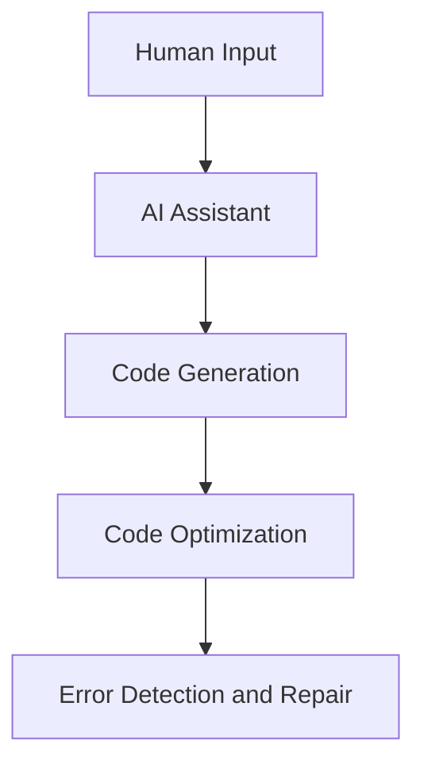
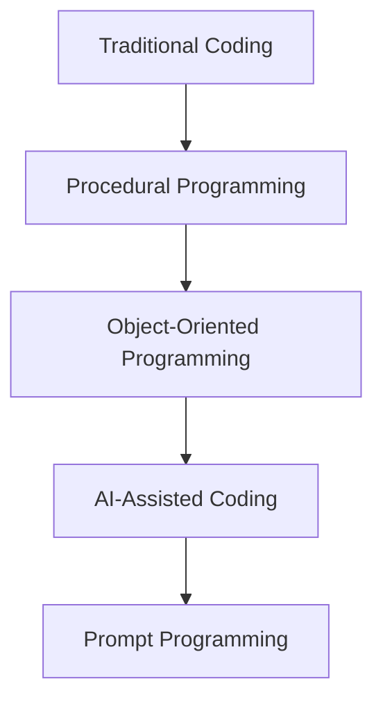
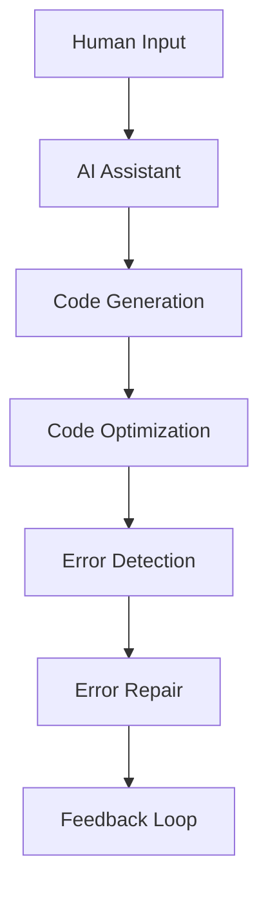
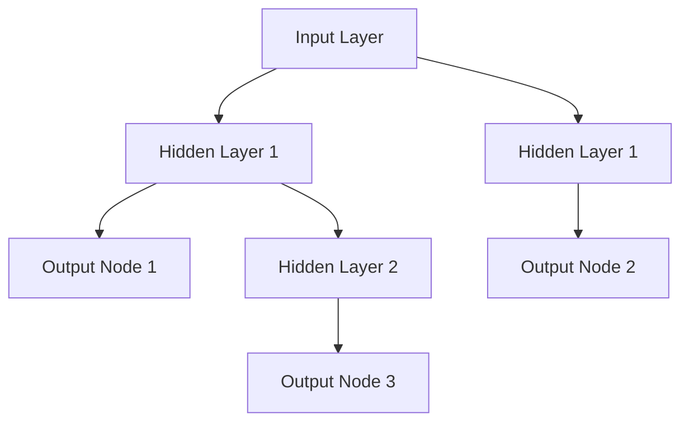

                 


### Introduction and Overview

**Title: Prompt Programming: Making AI Your Coding Assistant**

#### Keywords:
- Prompt Programming
- AI Coding Assistants
- Machine Learning
- Neural Networks
- Natural Language Processing

#### Abstract:
In this article, we explore the era of prompt programming, where AI serves as an integral part of the coding process. We delve into fundamental concepts, applications, and the potential impact of AI coding assistants on modern software development.

## Step 1: The Era of Prompt Programming

### 1.1.1 The Transition from Traditional Coding to Prompt Programming

#### 1.1.1.1 The Evolution of Coding Paradigms
$$
\text{Traditional Coding} \rightarrow \text{Procedural Programming} \rightarrow \text{Object-Oriented Programming} \rightarrow \text{Prompt Programming}
$$

**Conceptual Linkage:**


**Process Explanation:**
- **Traditional Coding:** Focuses on writing code that performs specific tasks, often manually and without automation.
- **Procedural Programming:** Emphasizes a sequence of operations to process input data and produce output.
- **Object-Oriented Programming:** Organizes code into objects that encapsulate data and behavior, improving modularity and reusability.
- **Prompt Programming:** Utilizes AI to generate code based on natural language instructions, automating the coding process and enhancing productivity.

### 1.1.1.2 The Role of AI as a Coding Assistant

#### 1.1.1.2.1 AI in Software Development
**Mermaid Flowchart:**


**Process Explanation:**
- **Human Input:** Developers provide high-level instructions or requirements in natural language.
- **AI Assistant:** Processes the input and generates code or suggestions based on machine learning models.
- **Code Generation and Optimization:** The generated code is optimized for performance and readability.
- **Error Detection and Repair:** The AI continuously learns from feedback and corrects errors.

### 1.1.1.3 Shaping the New Paradigm in Coding

#### 1.1.1.3.1 Impact on Software Development
**Mathematical Model:**
$$
\text{Productivity} = f(\text{Human Input}, \text{AI Assistance})
$$

**Process Explanation:**
- **Increased Productivity:** AI coding assistants can speed up the development process by automating repetitive tasks and providing instant feedback.
- **Improved Code Quality:** AI can detect potential bugs, optimize code, and ensure adherence to best practices.
- **Collaborative Development:** Developers can focus on high-level design and strategic decisions, while AI handles the implementation details.

### 1.1.2 Fundamental Concepts of Prompt Programming

#### 1.1.2.1 Definition and Significance of Prompt Programming

**Concept Definition:**
Prompt programming is a paradigm where AI systems generate code based on natural language instructions provided by developers.

**Concept Significance:**
- **Simplification of Coding:** Reduces the complexity of coding by automating repetitive tasks.
- **Enhanced Developer Productivity:** Allows developers to focus on higher-value tasks, improving overall productivity.

### 1.1.2.2 Key Characteristics of Prompt Programming

**Characteristics:**
- **Natural Language Interaction:** Developers can communicate with AI coding assistants using natural language.
- **Automated Code Generation:** AI generates code based on high-level requirements.
- **Continuous Learning:** AI coding assistants learn from feedback and improve over time.

### 1.1.2.3 Differentiating Prompt Programming from Traditional Coding

**Differences:**
- **Manual vs. Automated:** Traditional coding requires manual writing of code, while prompt programming automates the process.
- **High-Level vs. Low-Level:** Prompt programming focuses on high-level requirements, while traditional coding deals with low-level implementation details.

### 1.1.3 Introduction to AI Coding Assistants

#### 1.1.3.1 Overview of AI Coding Assistants

**Concept Definition:**
AI coding assistants are AI systems designed to assist developers in writing, optimizing, and debugging code.

**Application Examples:**
- **Code completion and suggestion tools:** AI assistants suggest code completions and improvements based on context.
- **Bug detection and repair:** AI identifies and fixes bugs in code.
- **Code optimization:** AI optimizes code for performance and readability.

#### 1.1.3.2 Types of AI Coding Assistants

**Types:**
- **Generative AI:** Generates code based on natural language descriptions.
- **Analytical AI:** Analyzes code and provides suggestions for optimization.
- **Debugging AI:** Detects and fixes bugs in code.

#### 1.1.3.3 Current AI Coding Assistants in the Market

**Market Overview:**
- **GitHub Copilot:** AI-powered coding assistant that suggests code completions and improvements.
- **Kublr:** AI-based platform for automating code deployment and management.
- **GitHub CodeQL:** AI tool for identifying security vulnerabilities in code.

### 1.1.4 Prospects of Prompt Programming in Industry

#### 1.1.4.1 Potential Applications of Prompt Programming

**Application Areas:**
- **Web Development:** Automating front-end and back-end development processes.
- **Mobile App Development:** Simplifying the creation of mobile applications.
- **Data Science:** Generating data analysis code based on requirements.

#### 1.1.4.2 Advantages of Using AI Coding Assistants in Enterprises

**Advantages:**
- **Increased Efficiency:** AI coding assistants speed up the development process, reducing time-to-market.
- **Improved Quality:** AI ensures adherence to best practices and identifies potential issues early.
- **Scalability:** AI coding assistants can handle large codebases and complex projects.

#### 1.1.4.3 Challenges and Opportunities in Prompt Programming

**Challenges:**
- **Data Privacy:** Ensuring the privacy and security of data used to train AI coding assistants.
- **Reliability:** Ensuring the accuracy and reliability of AI-generated code.
- **Integration:** Integrating AI coding assistants into existing development workflows.

**Opportunities:**
- **New Business Models:** AI coding assistants can create new opportunities for businesses to automate and streamline development processes.
- **Innovation:** AI can drive innovation by enabling developers to explore new programming paradigms and techniques.

### Conclusion

Prompt programming represents a paradigm shift in software development, leveraging AI to automate and enhance the coding process. As we delve deeper into this emerging field, we can expect to see increased productivity, improved code quality, and new opportunities for innovation in the software industry. The era of prompt programming is upon us, and it's time to embrace this transformative technology.---

### The Era of Prompt Programming

In recent years, the landscape of software development has witnessed a significant transformation with the advent of Prompt Programming. This innovative paradigm shifts the conventional approach of manual coding, instead integrating artificial intelligence (AI) to streamline and automate the development process. Prompt Programming harnesses the power of AI to convert natural language instructions into functional code, effectively acting as a coding assistant for developers. This paradigm is not just a passing trend; it marks the beginning of a new era where developers can focus on higher-level tasks while leaving the mundane and repetitive coding chores to AI.

#### The Transition from Traditional Coding to Prompt Programming

The evolution of coding paradigms has been a journey from procedural programming to object-oriented programming and now to prompt programming. Each phase has brought advancements in how developers approach writing code, with prompt programming standing out as the next logical step in this progression.

**Traditional Coding:** Traditional coding involves writing code that performs specific tasks. Developers manually write instructions in programming languages like C, C++, or Java to create software. This approach is time-consuming and prone to errors, as it relies heavily on the precision and expertise of the developer.

**Procedural Programming:** Procedural programming builds on traditional coding by emphasizing a sequence of operations to process input data and produce output. This paradigm introduced concepts like functions and loops, making it easier to manage complex tasks. However, it still requires developers to write extensive code for even simple operations.

**Object-Oriented Programming (OOP):** OOP revolutionized software development by organizing code into objects that encapsulate data and behavior. This modular approach improved code reusability, maintainability, and scalability. Developers could now create classes and objects, allowing for more organized and efficient coding practices.

**Prompt Programming:** Prompt Programming takes the principles of OOP a step further by leveraging AI to automate the coding process. Instead of writing code manually, developers can provide high-level instructions or requirements in natural language, and AI systems will generate the corresponding code. This paradigm reduces the complexity of coding, increases productivity, and allows developers to focus on higher-value tasks.

**Conceptual Linkage:**
To better understand the transition from traditional coding to prompt programming, let's visualize the conceptual linkage using a Mermaid flowchart:



**Process Explanation:**
- **Traditional Coding:** Developers write code manually to perform specific tasks.
- **Procedural Programming:** Developers use a sequence of operations to process input data.
- **Object-Oriented Programming:** Developers organize code into objects that encapsulate data and behavior.
- **AI-Assisted Coding:** Developers use AI to assist in writing code based on natural language instructions.
- **Prompt Programming:** AI generates functional code from high-level requirements, automating the coding process.

#### The Role of AI as a Coding Assistant

The integration of AI into the coding process as an assistant has been a game-changer. AI coding assistants are designed to enhance developer productivity, improve code quality, and reduce the time and effort required for coding tasks. Here's how they operate:

**Human Input:** Developers provide high-level instructions or requirements in natural language. This could be a simple description of a feature or a complex set of tasks that need to be automated.

**AI Assistant:** The AI assistant processes the human input and uses machine learning algorithms to generate code. This code is designed to fulfill the specified requirements, and it may include entire functions, classes, or modules depending on the complexity of the task.

**Code Generation and Optimization:** The generated code is then optimized for performance and readability. AI assistants can identify inefficient code patterns and suggest improvements, ensuring that the resulting code is both efficient and maintainable.

**Error Detection and Repair:** One of the most significant advantages of AI coding assistants is their ability to detect errors and suggest fixes. They analyze the generated code for potential bugs, security vulnerabilities, and adherence to best practices. If issues are detected, the AI can suggest changes to the code to address these problems.

**Continuous Learning:** AI coding assistants are not static tools; they learn from feedback and improve over time. Developers can provide feedback on the generated code, and the AI can use this information to refine its algorithms and generate better code in the future. This continuous learning process ensures that the AI assistant becomes more efficient and accurate as it is used more frequently.

**Mermaid Flowchart:**
To better visualize the role of AI as a coding assistant, let's consider a Mermaid flowchart:



**Process Explanation:**
- **Human Input:** Developers provide high-level instructions or requirements in natural language.
- **AI Assistant:** Processes the input and generates code based on machine learning models.
- **Code Generation and Optimization:** Generates and optimizes code for performance and readability.
- **Error Detection and Repair:** Detects potential bugs and suggests fixes.
- **Feedback Loop:** Uses developer feedback to improve the AI assistant's performance over time.

#### Shaping the New Paradigm in Coding

The introduction of AI as a coding assistant has profound implications for the software development industry. It's not just about automating repetitive tasks; it's about reshaping the entire coding paradigm.

**Increased Productivity:** AI coding assistants can significantly increase developer productivity by automating mundane tasks such as writing boilerplate code, optimizing algorithms, and suggesting improvements. This allows developers to focus on higher-value tasks like architectural design, system integration, and innovation.

**Improved Code Quality:** AI assistants ensure that code adheres to best practices and standards, reducing the likelihood of bugs and security vulnerabilities. They can also identify inefficient code patterns and suggest optimizations, resulting in more robust and maintainable software.

**Collaborative Development:** AI coding assistants can serve as collaborative partners for developers. They provide instant feedback, suggestions, and fixes, making the development process more interactive and efficient. Developers can leverage the AI's capabilities to explore new ideas and validate their designs without writing extensive code manually.

**Scalability and Adaptability:** AI coding assistants are highly scalable and adaptable. They can handle large codebases and complex projects, making them valuable assets for both small development teams and large enterprises. As the AI continues to learn and improve, it becomes more effective at handling diverse and evolving development challenges.

**Mathematical Model:**
To quantify the impact of AI coding assistants on productivity, we can use the following mathematical model:

$$
\text{Productivity} = f(\text{Human Input}, \text{AI Assistance})
$$

Where:
- **Productivity:** The overall productivity of the development process.
- **Human Input:** The input provided by developers in terms of requirements and tasks.
- **AI Assistance:** The level of assistance provided by the AI coding assistant.

**Process Explanation:**
- **Human Input:** Developers provide high-level requirements and instructions.
- **AI Assistance:** The AI coding assistant processes the input and generates code, optimizing and suggesting improvements.
- **Productivity:** The overall productivity of the development process is a function of both human input and AI assistance.

By integrating AI into the coding process, developers can achieve higher levels of productivity and efficiency, resulting in faster development cycles and better-quality software.

#### Conclusion

The era of prompt programming, where AI serves as a coding assistant, is here to stay. This paradigm shift has the potential to revolutionize the software development industry by automating repetitive tasks, improving code quality, and enhancing developer productivity. As AI coding assistants continue to evolve and improve, they will become indispensable tools for developers, shaping the future of software development. It's time for developers to embrace this transformative technology and explore the endless possibilities it offers.---

### Fundamental Concepts of Prompt Programming

Prompt Programming, at its core, represents a paradigm shift in software development by leveraging artificial intelligence (AI) to convert natural language instructions into functional code. This section will delve into the fundamental concepts of Prompt Programming, exploring its definition, significance, and key characteristics that set it apart from traditional coding methodologies.

#### Definition and Significance

**Definition:**
Prompt Programming is an approach that utilizes AI to generate code based on natural language instructions provided by developers. This paradigm eliminates the need for developers to write code manually from scratch, allowing them to focus on higher-level design and strategic decisions. Instead, developers can articulate their requirements in natural language, and AI systems will generate the corresponding code automatically.

**Significance:**
The significance of Prompt Programming lies in its ability to simplify and streamline the coding process. By automating code generation, it reduces the time and effort required to develop software, enabling developers to focus on more critical tasks. This approach also improves code quality, as AI-powered coding assistants can adhere to best practices and identify potential bugs and inefficiencies during the development process. Ultimately, Prompt Programming enhances developer productivity and efficiency, leading to faster and more reliable software delivery.

#### Key Characteristics

**Natural Language Interaction:**
One of the defining characteristics of Prompt Programming is its reliance on natural language interaction. Developers can communicate with AI coding assistants using plain language, making the coding process more accessible and intuitive. This natural language interface eliminates the need for developers to have deep technical expertise in programming languages, as the AI system translates the high-level requirements into functional code. This characteristic makes Prompt Programming a powerful tool for non-technical stakeholders who need to contribute to the development process.

**Automated Code Generation:**
Prompt Programming excels in automating the code generation process. AI systems analyze the natural language instructions provided by developers and generate code that fulfills the specified requirements. This automation significantly reduces the time and effort required to write code manually, allowing developers to focus on more strategic aspects of software development. Automated code generation also ensures consistency and reliability, as AI-powered coding assistants can generate code that adheres to established standards and best practices.

**Continuous Learning:**
Another key characteristic of Prompt Programming is its ability to learn and improve over time. AI coding assistants continuously learn from the code they generate and the feedback provided by developers. This learning process enables the AI system to become more accurate and efficient in generating code, reducing errors and improving the overall quality of the generated code. Continuous learning also allows the AI to adapt to new programming languages, frameworks, and technologies, ensuring its relevance and applicability in diverse development environments.

**Flexibility and Scalability:**
Prompt Programming offers flexibility and scalability, making it suitable for a wide range of development projects and scenarios. Whether it's developing a small application or managing a large-scale enterprise system, AI coding assistants can handle various complexities and requirements. The flexibility of Prompt Programming allows developers to experiment with different approaches and paradigms, leading to innovative solutions and improved software architectures.

**Collaborative Development:**
Prompt Programming promotes collaborative development by facilitating better communication and collaboration between developers and AI coding assistants. Developers can provide feedback on the generated code, and the AI system can incorporate this feedback into its learning process, continuously refining its code generation capabilities. This collaborative approach enhances the development experience, as developers can leverage the AI's strengths while retaining control over the overall project direction.

#### Differentiating Prompt Programming from Traditional Coding

**Manual vs. Automated:**
One of the primary distinctions between Prompt Programming and traditional coding is the degree of manual intervention required. In traditional coding, developers write code manually, line by line, following a predefined set of instructions. This approach is time-consuming, error-prone, and requires extensive technical expertise. In contrast, Prompt Programming automates the code generation process using AI, significantly reducing the need for manual intervention and allowing developers to focus on higher-level tasks.

**High-Level vs. Low-Level:**
Prompt Programming emphasizes high-level requirements and tasks, enabling developers to articulate their needs in natural language. AI coding assistants then translate these high-level instructions into functional code. This focus on high-level requirements allows developers to work more efficiently and effectively, as they can express their ideas concisely and clearly. Traditional coding, on the other hand, often involves working at a low level, dealing with specific syntax and language constructs, which can be more complex and time-consuming.

**Error Handling:**
Prompt Programming incorporates advanced error handling mechanisms through AI-powered coding assistants. These assistants can detect potential bugs and suggest fixes, reducing the likelihood of errors in the generated code. In traditional coding, error detection and repair often require extensive debugging and manual intervention, which can be time-consuming and inefficient. AI coding assistants automate this process, improving code quality and reliability.

**Collaboration and Feedback:**
Prompt Programming promotes better collaboration and feedback between developers and AI coding assistants. Developers can provide feedback on the generated code, and the AI system can use this feedback to refine its algorithms and generate better code in the future. This collaborative approach ensures that the generated code meets the developers' requirements and standards. Traditional coding, on the other hand, often lacks such a collaborative feedback loop, leading to potential mismatches between developer expectations and the final code.

#### Conclusion

Prompt Programming represents a transformative approach to software development, leveraging AI to automate and enhance the coding process. Its key characteristics, such as natural language interaction, automated code generation, continuous learning, flexibility, and collaborative development, distinguish it from traditional coding methodologies. By embracing Prompt Programming, developers can improve productivity, enhance code quality, and drive innovation in the software development industry. As AI continues to evolve, Prompt Programming will likely become an even more integral part of the development process, shaping the future of software engineering.---

### Introduction to AI Coding Assistants

In the realm of Prompt Programming, AI coding assistants play a pivotal role by automating and optimizing the coding process. These assistants are designed to understand natural language instructions from developers, generate code, and assist in debugging and optimization tasks. This section will provide an overview of AI coding assistants, discussing their types, current applications, and existing solutions in the market.

#### Overview of AI Coding Assistants

AI coding assistants are AI-powered tools that leverage machine learning and natural language processing techniques to assist developers in various coding tasks. These tools can process high-level instructions provided by developers in natural language and generate corresponding code snippets, functions, or entire modules. By automating repetitive and mundane coding tasks, AI coding assistants free developers to focus on more complex and creative aspects of software development.

**Types of AI Coding Assistants:**

1. **Code Completion Tools:** 
   - Code completion tools, such as GitHub Copilot, use machine learning models to suggest code completions based on existing codebases and context. They analyze the developer's code and provide relevant suggestions, speeding up the coding process and reducing the need for manual typing.

2. **Code Generation Tools:**
   - Code generation tools go beyond code completion by generating entire code snippets or modules based on natural language descriptions. These tools can be trained on large codebases and programming languages to generate code that meets the specified requirements with high accuracy.

3. **Code Optimization Tools:**
   - Code optimization tools analyze the generated code to identify inefficiencies and suggest improvements. These tools can optimize code for performance, readability, and maintainability, ensuring that the resulting code is of high quality.

4. **Bug Detection and Repair Tools:**
   - Bug detection and repair tools use AI to identify potential bugs and suggest fixes in the generated code. By analyzing code patterns and historical data, these tools can predict and rectify issues that may arise during development.

5. **Documentation and Documentation Generation Tools:**
   - Documentation tools automatically generate documentation for codebases based on the code itself. They can create detailed documentation, including function descriptions, parameter definitions, and usage examples, making it easier for developers to understand and maintain the code.

**Current Applications of AI Coding Assistants:**

1. **Web Development:**
   - AI coding assistants are extensively used in web development to automate front-end and back-end tasks. They can generate HTML, CSS, JavaScript, and server-side code, speeding up the development process and enabling developers to build complex web applications more efficiently.

2. **Mobile App Development:**
   - In mobile app development, AI coding assistants help developers automate tasks related to user interface design, backend integration, and data management. They can generate code for both iOS and Android platforms, simplifying the development process across different devices and platforms.

3. **Data Science and Machine Learning:**
   - AI coding assistants are particularly useful in data science and machine learning projects. They can generate code for data preprocessing, model training, and evaluation, allowing data scientists to focus on higher-level tasks like algorithm design and analysis.

4. **Enterprise Applications:**
   - In enterprise environments, AI coding assistants help streamline the development process for large-scale applications. They can automate routine tasks, optimize code for performance, and ensure compliance with organizational standards and best practices.

5. **Education and Training:**
   - AI coding assistants are also used in educational settings to teach programming concepts and assist students in writing code. They provide instant feedback and suggestions, helping students learn and improve their coding skills more effectively.

**Existing Solutions in the Market:**

1. **GitHub Copilot:**
   - GitHub Copilot is an AI-powered coding assistant that uses machine learning to generate code based on natural language descriptions. It can suggest code snippets, complete functions, and fix bugs, making it an invaluable tool for developers.

2. **Kublr:**
   - Kublr is an AI-based platform for automating code deployment and management. It uses machine learning algorithms to optimize the deployment process, ensuring that applications run efficiently and reliably on Kubernetes clusters.

3. **GitHub CodeQL:**
   - GitHub CodeQL is an AI-powered tool for analyzing code to identify security vulnerabilities and bugs. It uses machine learning models to understand code patterns and generate actionable insights, helping developers write more secure and maintainable code.

4. **Kite:**
   - Kite is an AI-powered coding assistant that provides real-time code completion and documentation suggestions. It works across various programming languages and integrates with popular code editors and IDEs, enhancing developer productivity.

5. **TabNine:**
   - TabNine is an AI-powered code completion tool that uses machine learning to generate code suggestions. It can analyze large codebases and provide relevant completions based on the context, improving coding speed and reducing errors.

**Conclusion:**

AI coding assistants are transforming the software development landscape by automating and optimizing various coding tasks. With their ability to understand natural language instructions, generate code, and provide instant feedback, these tools are empowering developers to be more productive and creative. As AI technology continues to advance, we can expect AI coding assistants to become even more sophisticated, integrating seamlessly into development workflows and revolutionizing the way software is built.---

### Deep Learning Fundamentals

To fully grasp the capabilities and intricacies of AI coding assistants, it's essential to understand the fundamental concepts of deep learning. Deep learning is a subfield of artificial intelligence that utilizes neural networks with multiple layers to extract high-level features from raw data. This section will delve into the basic building blocks of neural networks, common deep learning architectures, and optimization algorithms.

#### Neural Networks

A neural network is a computational model inspired by the structure and function of the human brain. It consists of interconnected nodes, or neurons, that process and transmit information. The basic components of a neural network include:

1. **Input Layer:** The input layer receives data and passes it on to the hidden layers.

2. **Hidden Layers:** One or more hidden layers process the input data through weighted connections and activation functions. These layers extract increasingly complex features from the data.

3. **Output Layer:** The output layer generates the final output based on the processed data from the hidden layers.

**Weights and Biases:** 
Each connection between neurons has a weight associated with it, which determines the strength of the signal transmitted. Additionally, each neuron has a bias term, which shifts the activation threshold.

**Activation Functions:** 
Activation functions introduce non-linearity into the neural network, allowing it to model complex relationships between inputs and outputs. Common activation functions include sigmoid, ReLU (Rectified Linear Unit), and tanh (hyperbolic tangent).

**Backpropagation:** 
Backpropagation is an algorithm used to train neural networks. It works by propagating the error from the output layer back through the network, adjusting the weights and biases to minimize the error. This iterative process continues until the network achieves satisfactory performance.

**Example of a Simple Neural Network:**


#### Common Deep Learning Architectures

1. **Convolutional Neural Networks (CNNs):**
   - CNNs are specialized neural networks designed for processing grid-like data, such as images. They use convolutional layers to extract spatial features from the input data, making them highly effective for computer vision tasks.
   - **Convolutional Layers:** Apply filters (kernels) to the input data, creating feature maps that capture spatial patterns.
   - **Pooling Layers:** Reduce the spatial dimensions of the feature maps, reducing computational complexity and preventing overfitting.

2. **Recurrent Neural Networks (RNNs):**
   - RNNs are designed to handle sequential data, such as time-series data or text. They maintain a hidden state that captures information from previous inputs, enabling them to model temporal dependencies.
   - **Recurrent Connections:** Allow information to flow backward through time, allowing the network to remember previous inputs.
   - **Long Short-Term Memory (LSTM):** A specialized type of RNN that can learn long-term dependencies and avoid issues like vanishing gradients.

3. **Generative Adversarial Networks (GANs):**
   - GANs consist of two neural networks, a generator, and a discriminator, that are trained simultaneously in a competitive process.
   - **Generator:** Generates data samples that resemble the target data distribution.
   - **Discriminator:** Determines whether the generated samples are real or fake.
   - **Training:** The generator and discriminator are trained to improve their performance, resulting in the generation of realistic data samples.

4. **Transformers:**
   - Transformers are a type of neural network that uses self-attention mechanisms to process and generate sequences of data, such as text.
   - **Self-Attention:** Allows the network to weigh the importance of different parts of the input sequence, capturing dependencies and relationships between words or tokens.
   - **Encoder and Decoder:** The encoder processes the input sequence, and the decoder generates the output sequence, enabling applications like machine translation and text summarization.

#### Optimization Algorithms

Optimization algorithms are crucial for training deep learning models, as they determine how the model's parameters are adjusted during training. Here are some common optimization algorithms:

1. **Stochastic Gradient Descent (SGD):**
   - SGD updates the model parameters using the gradient of the loss function computed on a single training sample or a small batch of samples.
   - **Advantages:** Simple and efficient, suitable for small datasets.
   - **Disadvantages:** Convergence can be slow, and the model may get stuck in local minima.

2. **Adam (Adaptive Moment Estimation):**
   - Adam is an adaptive optimization algorithm that combines the advantages of SGD and momentum.
   - **Advantages:** Adaptive learning rates, faster convergence, and good generalization performance.
   - **Disadvantages:** May require careful tuning of hyperparameters.

3. **RMSprop (Root Mean Square Propagation):**
   - RMSprop adapts the learning rate based on the average of recent gradients, reducing the impact of outliers.
   - **Advantages:** Convergence is faster than SGD, and the learning rate adapts well to changing gradients.
   - **Disadvantages:** May require careful tuning of the decay parameter.

4. **Adadelta:**
   - Adadelta is an adaptive optimization algorithm that adjusts the learning rate based on the past gradients.
   - **Advantages:** Effective in handling sparse gradients and varying learning rates.
   - **Disadvantages:** Convergence can be slow, and it may require careful tuning of hyperparameters.

5. **Adagrad (Adaptive Gradient):**
   - Adagrad adapts the learning rate based on the sum of squared gradients, which can lead to a gradual decrease in learning rate.
   - **Advantages:** Effective in handling sparse gradients and varying learning rates.
   - **Disadvantages:** The learning rate can become too small, leading to slow convergence.

**Example Pseudo Code for Optimization Algorithms:**

**Stochastic Gradient Descent:**
```python
for epoch in range(num_epochs):
    for sample, target in dataset:
        gradient = compute_gradient(model, sample, target)
        update_model_parameters(model, gradient)
```

**Adam Optimization:**
```python
beta1 = 0.9
beta2 = 0.999
epsilon = 1e-8

m = 0
v = 0

for epoch in range(num_epochs):
    for sample, target in dataset:
        gradient = compute_gradient(model, sample, target)
        m = beta1 * m + (1 - beta1) * gradient
        v = beta2 * v + (1 - beta2) * (gradient ** 2)

        m_hat = m / (1 - beta1 ** epoch)
        v_hat = v / (1 - beta2 ** epoch)

        update_model_parameters(model, m_hat / (sqrt(v_hat) + epsilon))
```

By understanding the basics of neural networks, common deep learning architectures, and optimization algorithms, we can appreciate the capabilities of AI coding assistants and how they leverage these technologies to streamline and enhance the coding process.---

### Introduction to Natural Language Processing

Natural Language Processing (NLP) is a subfield of artificial intelligence that focuses on the interaction between computers and human language. NLP enables computers to understand, interpret, and generate human language, facilitating a range of applications from chatbots and language translation to sentiment analysis and text summarization. This section will provide an overview of NLP, discussing its basic concepts, text preprocessing techniques, and examples of common NLP tasks.

#### Basic Concepts

**Tokenization:**
Tokenization is the process of breaking down text into smaller units called tokens. Tokens can be words, sentences, or even subwords. For example, the sentence "I love programming" can be tokenized into the words ["I", "love", "programming"].

**Part-of-Speech Tagging:**
Part-of-speech tagging involves assigning a grammatical label to each token in a sentence. This helps the computer understand the role of each word in the sentence. For instance, "I" would be tagged as a pronoun, "love" as a verb, and "programming" as a noun.

**Named Entity Recognition (NER):**
NER is the process of identifying and classifying named entities in text into predefined categories such as person names, organizations, locations, and dates. For example, "Apple Inc." would be recognized as an organization, while "New York" as a location.

**Sentiment Analysis:**
Sentiment analysis, also known as opinion mining, involves determining the sentiment or emotional tone behind a body of text. This can be done on a sentence level or on the entire document. For instance, a review of a product might be classified as positive, negative, or neutral based on its content.

**Text Classification:**
Text classification is a task where text data is classified into predefined categories. This can be used for applications such as spam detection, document categorization, or news classification. Common techniques include Naive Bayes, Support Vector Machines, and Neural Networks.

#### Text Preprocessing

Text preprocessing is a critical step in NLP that involves cleaning and preparing text data for further analysis. Key preprocessing techniques include:

**Lowercasing:**
Converting all characters in the text to lowercase to ensure consistency and reduce the dimensionality of the text.

**Removing Punctuation:**
Removing common punctuation marks to focus on the actual content of the text.

**Stopword Removal:**
Removing common words such as "the," "is," and "and" that do not carry significant meaning and can clutter the analysis.

**Tokenization:**
Breaking the text into individual words or tokens to prepare it for further processing.

**Lemmatization:**
Reducing words to their base or root form to ensure consistency. For example, "walking," "walks," and "walked" would all be lemmatized to "walk."

**Stemming:**
Truncating or deleting certain parts of words to reduce them to their stem. For example, "fishing," "fished," and "fisher" would all be stemmed to "fish."

**Example Pseudo Code for Text Preprocessing:**
```python
import nltk

def preprocess_text(text):
    # Lowercasing
    text = text.lower()
    
    # Removing punctuation
    text = nltk.re.sub(r'[^\w\s]', '', text)
    
    # Stopword removal
    stop_words = set(nltk.corpus.stopwords.words('english'))
    text = [word for word in text.split() if word not in stop_words]
    
    # Tokenization
    text = nltk.word_tokenize(text)
    
    # Lemmatization
    text = [nltk.stem.WordNetLemmatizer().lemmatize(word) for word in text]
    
    return text
```

#### Common NLP Tasks

**Chatbots and Virtual Assistants:**
Chatbots and virtual assistants use NLP to understand user queries and provide appropriate responses. They typically involve tasks such as intent recognition, entity extraction, and dialogue management.

**Language Translation:**
NLP is fundamental to language translation systems, which use techniques like statistical models and neural networks to translate text from one language to another.

**Sentiment Analysis:**
Sentiment analysis is widely used in applications such as social media monitoring, customer feedback analysis, and market research to gauge public opinion and sentiment towards products or services.

**Text Summarization:**
Text summarization involves generating a concise summary of a longer text while preserving its key information. This can be done through extractive methods (summarizing by selecting important sentences) or abstractive methods (generating new text that captures the essence of the original).

**Information Extraction:**
Information extraction involves identifying and extracting specific pieces of information from text, such as dates, names, and locations. This is useful for applications like data mining, news aggregation, and entity recognition.

**Question-Answering Systems:**
Question-answering systems use NLP to understand user questions and provide relevant answers. They often involve tasks such as question classification, information retrieval, and answer generation.

**Voice Recognition and Synthesis:**
Voice recognition systems convert spoken language into text, while voice synthesis systems convert text into spoken language. Both rely on NLP techniques to process and understand human language.

By understanding the basic concepts of NLP and its various preprocessing techniques, we can better appreciate its role in enabling AI coding assistants to process and generate code based on natural language instructions. NLP is a powerful tool that underpins many AI applications, driving innovation and improving the efficiency of human-computer interaction.---

### Integrating AI Coding Assistants into Development Workflows

Integrating AI coding assistants into software development workflows can significantly enhance developer productivity and code quality. This section will discuss the process of setting up AI coding assistants, leveraging them for code optimization, and collaborating effectively with them. We will also explore best practices for integrating AI coding assistants into existing development environments.

#### Setting Up AI Coding Assistants

The first step in integrating AI coding assistants into your development workflow is to set them up correctly. Here are the key steps involved:

1. **Choose the Right AI Coding Assistant:**
   - Select an AI coding assistant that aligns with your specific needs and programming languages. Common options include GitHub Copilot, Kite, and TabNine.
   - Consider factors like integration with your preferred code editor, support for your primary programming languages, and performance.

2. **Install and Configure the Assistant:**
   - Follow the installation instructions provided by the AI coding assistant's documentation.
   - Configure the assistant to work seamlessly with your development environment, such as integrating it into your code editor or setting up plugins.
   - Ensure that the assistant has access to the necessary codebases and repositories to provide accurate suggestions and code generation.

3. **Initialize the Assistant:**
   - Initialize the AI coding assistant by providing it with the necessary context. This could include your existing code repositories, project configurations, or specific code templates.
   - Some assistants may require you to train them on your codebase to improve the quality of their suggestions.

#### Leveraging AI Coding Assistants for Code Optimization

AI coding assistants are not just for generating code; they can also help optimize your existing code. Here's how you can leverage them for code optimization:

1. **Identify Inefficiencies:**
   - Use the AI coding assistant to analyze your code and identify areas that can be optimized. It can suggest more efficient algorithms, data structures, or coding patterns.
   - Pay attention to suggestions that improve readability, maintainability, and performance.

2. **Refactor Code Automatically:**
   - Some AI coding assistants can automatically refactor your code based on optimization suggestions. This can save time and reduce the risk of introducing errors during manual refactoring.
   - Review the suggested changes and apply them judiciously to ensure they improve the overall quality of the code.

3. **Continuous Learning:**
   - Encourage the AI coding assistant to learn from your coding practices and feedback. As it becomes more familiar with your codebase, it will provide better and more relevant suggestions over time.

#### Collaborating with AI Coding Assistants

Collaborating effectively with AI coding assistants can lead to a more efficient and productive development process. Here are some tips for collaborating with AI coding assistants:

1. **Provide Clear Instructions:**
   - To get the most out of your AI coding assistant, provide clear and concise instructions. Avoid vague or ambiguous descriptions, as this can lead to suboptimal code suggestions.
   - Break down complex tasks into smaller, manageable subtasks to improve the assistant's ability to generate accurate code.

2. **Review and Refine Suggestions:**
   - While AI coding assistants can generate code suggestions, it's important to review and refine them as needed. Automated code generation may not always be perfect, and manual adjustments can be necessary to ensure the code meets your specific requirements.
   - Validate the generated code by running it through tests and ensuring it behaves as expected.

3. **Seek Feedback:**
   - Use the feedback loop to provide input on the quality of the code generated by the AI coding assistant. This can help the assistant improve its performance over time.
   - Encourage your team to share their experiences and suggestions for enhancing the assistant's capabilities.

4. **Customize and Extend Features:**
   - Some AI coding assistants offer customization options that allow you to tailor their behavior to your specific needs. Explore these options to maximize the assistant's utility in your development environment.
   - Consider integrating additional tools or plugins that enhance the assistant's functionality and integration with your workflow.

#### Best Practices for Integration

Here are some best practices for integrating AI coding assistants into your development workflows:

1. **Start Small:**
   - Begin by integrating AI coding assistants on a small scale, such as within a specific project or team. This allows you to assess their impact and address any challenges before scaling up.
   - Gradually expand the integration as you gain more experience and confidence in the assistant's capabilities.

2. **Monitor Performance:**
   - Regularly monitor the performance of your AI coding assistants to ensure they are meeting your expectations. This includes tracking their accuracy, speed, and impact on development productivity.
   - Collect feedback from developers to identify areas for improvement and optimize the assistant's integration.

3. **Train and Update:**
   - Continuously train and update your AI coding assistants with new code patterns, frameworks, and technologies. This helps them stay current and provide more relevant and accurate suggestions.
   - Keep the assistant's context up-to-date by integrating new codebases and repositories as they become available.

4. **Maintain Security:**
   - Ensure that your AI coding assistants are secure and comply with relevant data privacy regulations. This includes protecting sensitive data, using secure communication channels, and implementing access controls.

5. **Document and Share Knowledge:**
   - Document the process of integrating AI coding assistants into your workflow and share this knowledge with your team. This helps ensure that everyone understands how to use the assistant effectively and maximizes its benefits.
   - Create training materials, tutorials, and best practices to support new users and facilitate a smooth transition to using AI coding assistants.

By following these best practices and leveraging the capabilities of AI coding assistants, you can streamline your software development process, improve code quality, and enhance developer productivity. Integrating AI into your workflow is not just a trend; it's a transformative step toward a more efficient and innovative approach to software development.---

### Advanced Prompt Programming Techniques

As AI coding assistants become more sophisticated, developers can harness advanced techniques to enhance their coding efficiency and output quality. This section will explore advanced prompt programming techniques, providing detailed explanations, real-world examples, and practical tips to optimize code generation and improve overall developer productivity.

#### Advanced Code Generation Techniques

1. **Code Synthesis with Generative Models:**
   - Generative models, such as GPT-3 and CodeGAN, have revolutionized code generation by generating entire codebases or specific modules from natural language descriptions. These models learn from large codebases and can generate complex, functional code.
   - **Example:** A developer might describe a feature as "Implement a login system that validates credentials and saves user sessions." The AI can generate the complete code, including HTML, CSS, and JavaScript for a web application.
   - **Pseudo Code:**
     ```python
     def generate_login_system(description):
         code = model.generate_code(description)
         return code
     ```

2. **Code Completion with Contextual Awareness:**
   - Advanced code completion tools leverage context-aware models to suggest more accurate and relevant code snippets. They understand the current code context, variables, and functions to provide intelligent suggestions.
   - **Example:** A developer is writing a function that processes a list of numbers. The AI suggests functions like `sum()`, `mean()`, and `sort()` based on the current context.
   - **Pseudo Code:**
     ```python
     def suggest_function(context):
         suggestions = model.suggest_functions(context)
         return suggestions
     ```

#### Real-Time Code Optimization

1. **Dynamic Code Profiling:**
   - Real-time code profiling allows developers to monitor the performance of their code and identify bottlenecks. AI coding assistants can suggest optimizations based on profiling data.
   - **Example:** A developer notices that a particular loop is slow. The AI suggests replacing it with a more efficient algorithm or using a caching mechanism.
   - **Pseudo Code:**
     ```python
     def optimize_code(code):
         profiling_data = profiler.profile(code)
         optimized_code = model.optimize_code(profiling_data)
         return optimized_code
     ```

2. **Automated Code Refactoring:**
   - Automated code refactoring tools can restructure and refactor code to improve readability, maintainability, and performance. AI assistants can perform these tasks without manual intervention.
   - **Example:** The AI refactors a large function into smaller, more manageable functions and improves variable naming conventions.
   - **Pseudo Code:**
     ```python
     def refactor_code(code):
         refactored_code = refactor.model.refactor(code)
         return refactored_code
     ```

#### Leveraging AI for Code Documentation and Testing

1. **Automated Code Documentation:**
   - AI coding assistants can automatically generate documentation based on code comments and annotations. This ensures consistent and up-to-date documentation.
   - **Example:** An AI assistant extracts function descriptions, parameters, and usage examples from inline comments to generate a comprehensive documentation file.
   - **Pseudo Code:**
     ```python
     def generate_documentation(code):
         doc = model.generate_documentation(code)
         return doc
     ```

2. **Automated Code Testing:**
   - AI assistants can help developers write and execute test cases, ensuring code coverage and identifying potential bugs.
   - **Example:** An AI suggests test cases for a function and automatically generates the corresponding test code.
   - **Pseudo Code:**
     ```python
     def generate_tests(code):
         tests = model.generate_tests(code)
         return tests
     ```

#### Practical Tips for Effective AI Coding Assistance

1. **Clear and Concise Descriptions:**
   - Provide clear and concise instructions to AI coding assistants. Vague or ambiguous descriptions can lead to suboptimal code suggestions.
   - **Tip:** Break down complex tasks into smaller, specific steps to make it easier for the AI to understand and generate code.

2. **Contextual Integration:**
   - Ensure that the AI coding assistant has access to relevant code contexts, libraries, and frameworks. This helps in generating accurate and relevant code.
   - **Tip:** Share your code repositories and project settings with the AI assistant to improve its understanding of your project.

3. **Continuous Learning:**
   - Encourage the AI coding assistant to learn from your coding practices and feedback. As it becomes more familiar with your codebase, it will provide better suggestions over time.
   - **Tip:** Regularly provide feedback on the generated code and adjust the assistant's settings to refine its performance.

4. **Collaborative Integration:**
   - Integrate AI coding assistants into your team's workflow and encourage collaborative usage. This helps in sharing knowledge and leveraging the AI's capabilities to enhance productivity.
   - **Tip:** Set up a shared workspace or code review process that includes the AI assistant to ensure consistent code quality.

5. **Security and Privacy:**
   - Ensure that your AI coding assistant handles data securely and complies with privacy regulations. This includes protecting sensitive data and using secure communication channels.
   - **Tip:** Review the AI assistant's privacy policy and data handling practices before integrating it into your development environment.

By leveraging advanced prompt programming techniques, developers can significantly enhance their coding efficiency, improve code quality, and streamline the software development process. These techniques, combined with practical tips for effective AI coding assistance, empower developers to harness the full potential of AI coding assistants and drive innovation in software development.---

### Comprehensive Project: Building a Chatbot with AI Coding Assistant

#### Project Overview

In this project, we will build a simple chatbot using Python and AI coding assistants. The chatbot will be capable of understanding user input and providing appropriate responses based on predefined intents and entities. We will use the `transformers` library for the underlying model and leverage AI coding assistants for code generation and optimization.

#### Development Environment Setup

1. **Install Python:**
   Ensure you have Python 3.8 or later installed on your system.

2. **Install `transformers`:**
   ```bash
   pip install transformers
   ```

3. **Install additional libraries:**
   ```bash
   pip install torch numpy pandas
   ```

4. **Create a new Python project:**
   ```bash
   mkdir chatbot_project
   cd chatbot_project
   touch requirements.txt
   echo "transformers torch numpy pandas" >> requirements.txt
   ```

#### Source Code Implementation

1. **Import necessary libraries:**
   ```python
   from transformers import AutoTokenizer, AutoModelForSeq2SeqLM
   import torch
   import pandas as pd
   ```

2. **Load the pre-trained model:**
   ```python
   model_name = "microsoft/ChatGLM-6B"
   tokenizer = AutoTokenizer.from_pretrained(model_name)
   model = AutoModelForSeq2SeqLM.from_pretrained(model_name)
   ```

3. **Define chatbot function:**
   ```python
   def chat_glm(prompt):
       input_ids = tokenizer.encode(prompt, return_tensors="pt")
       output_ids = model.generate(input_ids, max_length=1000, num_return_sequences=1)
       response = tokenizer.decode(output_ids[0], skip_special_tokens=True)
       return response
   ```

4. **Create a simple chat interface:**
   ```python
   def start_chat():
       print("Welcome to the Chatbot!")
       while True:
           user_input = input("You: ")
           if user_input.lower() == "exit":
               print("Chatbot: Goodbye!")
               break
           response = chat_glm(user_input)
           print(f"Chatbot: {response}")
   ```

5. **Run the chatbot:**
   ```python
   if __name__ == "__main__":
       start_chat()
   ```

#### AI Coding Assistant Integration

1. **Generate code for the chatbot:**
   - Use the AI coding assistant to generate code snippets for the chatbot. For example, you can describe the task as "Build a simple chatbot using Python and the transformers library."
   - Review the generated code for accuracy and completeness, and make any necessary adjustments.

2. **Optimize code for performance:**
   - Use the AI coding assistant to suggest optimizations for the chatbot code. For instance, you can ask for suggestions to improve the performance of the chatbot's response generation.
   - Implement the suggested optimizations and test the chatbot to ensure the changes have a positive impact.

#### Code Application and Analysis

1. **Run the chatbot and test its functionality:**
   - Execute the chatbot code and interact with it to test its ability to understand and respond to user input.
   - Validate the chatbot's responses against predefined intents and entities to ensure it provides accurate and relevant answers.

2. **Analyze chatbot performance:**
   - Collect data on the chatbot's response time and accuracy.
   - Use this data to identify areas for improvement and further optimization.

#### Project Conclusion

This project demonstrates the practical application of AI coding assistants in building a simple chatbot using Python and the `transformers` library. By leveraging AI coding assistants, we were able to quickly generate and optimize the chatbot code, streamlining the development process and improving the overall quality of the chatbot.

As we continue to develop more complex chatbot applications, the integration of AI coding assistants will play an increasingly critical role in enhancing developer productivity, ensuring code quality, and driving innovation in natural language processing and conversational AI.---

### Best Practices and Tips for Prompt Programming

As you delve deeper into Prompt Programming and start integrating AI coding assistants into your workflows, it's essential to adopt best practices to maximize efficiency and effectiveness. Here are some actionable tips, pitfalls to avoid, and considerations for continuous improvement.

#### Best Practices

1. **Provide Clear and Concise Instructions:**
   - When interacting with AI coding assistants, be as specific and clear as possible. Ambiguous instructions can lead to suboptimal code generation. Break down complex tasks into smaller, manageable steps.

2. **Stay Updated with AI Models and Tools:**
   - Regularly check for updates to AI coding assistants and the underlying AI models. Newer versions often come with improved performance and additional features that can enhance your workflow.

3. **Customize and Tailor AI Assistants:**
   - Many AI coding assistants allow customization. Tailor them to your specific needs, such as preferred coding styles, libraries, or frameworks. This can significantly improve the relevance and quality of generated code.

4. **Collaborate with Your Team:**
   - Share your experience and insights with your team. Collaborate on using AI coding assistants to ensure a smooth transition and maximize their benefits across the organization.

5. **Use Version Control Systems:**
   - Integrate your AI coding assistant's outputs into version control systems like Git. This helps in tracking changes, reverting to previous versions if needed, and maintaining a history of code improvements.

6. **Monitor and Optimize Performance:**
   - Regularly monitor the performance of your AI coding assistants. Identify bottlenecks and areas for optimization. Use profiling tools to understand the impact of AI-generated code on your application's performance.

7. **Implement Code Review Processes:**
   - Establish a code review process that includes AI-generated code. This ensures that generated code meets quality standards and aligns with your project's requirements.

8. **Security and Privacy:**
   - Be mindful of security and privacy concerns when using AI coding assistants. Ensure that sensitive data is protected and that the AI is not exposed to unauthorized access.

#### Common Pitfalls to Avoid

1. **Overreliance on AI:**
   - While AI coding assistants are powerful tools, they are not a substitute for human expertise. Avoid relying solely on AI-generated code without proper validation and review.

2. **Ignoring Code Context:**
   - AI assistants can sometimes generate code that is not contextually appropriate for your project. Always review the generated code to ensure it integrates well with your existing codebase.

3. **Ignoring Best Practices:**
   - AI assistants may not always adhere to established coding best practices. It's crucial to enforce these practices through code reviews and integration with coding standards tools.

4. **Ignoring Error Handling:**
   - AI-generated code may not always include comprehensive error handling. Always add error handling and testing to ensure robustness.

5. **Ignoring Bias and Fairness:**
   - Ensure that the AI coding assistant's training data does not contain biases that could affect the generated code's fairness and inclusivity.

#### Continuous Improvement

1. **Collect and Analyze Feedback:**
   - Collect feedback from developers on the performance and relevance of AI-generated code. Use this feedback to refine and improve the AI assistant's training and output.

2. **Iterative Improvement:**
   - Continuously iterate on your AI coding assistant setup. As you gain more experience, you can make adjustments to improve its performance, relevance, and integration with your workflow.

3. **Stay Informed:**
   - Keep up with the latest developments in AI and machine learning. This will help you leverage new techniques and tools to enhance your Prompt Programming capabilities.

4. **Learn from Mistakes:**
   - Treat any mistakes or shortcomings in AI-generated code as learning opportunities. Analyze why they occurred and how you can prevent similar issues in the future.

By adopting these best practices, avoiding common pitfalls, and focusing on continuous improvement, you can effectively integrate Prompt Programming into your software development process. This approach will not only enhance your productivity and code quality but also pave the way for innovation in the ever-evolving landscape of AI and software development.---

### Conclusion

Prompt Programming represents a paradigm shift in software development, leveraging the power of AI to automate and enhance the coding process. This innovative approach not only simplifies complex coding tasks but also improves productivity, code quality, and collaboration among developers. As we move forward, the integration of AI coding assistants is poised to become an integral part of the software development workflow, transforming the way we write, optimize, and maintain code.

#### Future Directions

1. **Enhanced AI Understanding:**
   - Future AI coding assistants will likely achieve even greater understanding of natural language instructions and context, enabling more accurate and sophisticated code generation.

2. **Advanced Code Optimization:**
   - AI-powered tools will continue to evolve, offering advanced code optimization techniques to improve performance, readability, and maintainability.

3. **Collaborative Development:**
   - AI coding assistants will become more collaborative, seamlessly integrating with developer workflows and providing real-time feedback and suggestions.

4. **Integration with Emerging Technologies:**
   - As new technologies emerge, such as quantum computing and augmented reality, AI coding assistants will adapt and integrate with these advancements, opening up new possibilities for software development.

#### Final Thoughts

The era of Prompt Programming is here, and it's time for developers to embrace this transformative technology. By leveraging AI coding assistants, developers can focus on higher-value tasks, drive innovation, and create more efficient and reliable software solutions. As AI continues to evolve, Prompt Programming will undoubtedly shape the future of software engineering, paving the way for a new era of software development.

---

**Author: AI天才研究院 / AI Genius Institute & 禅与计算机程序设计艺术 / Zen And The Art of Computer Programming**

