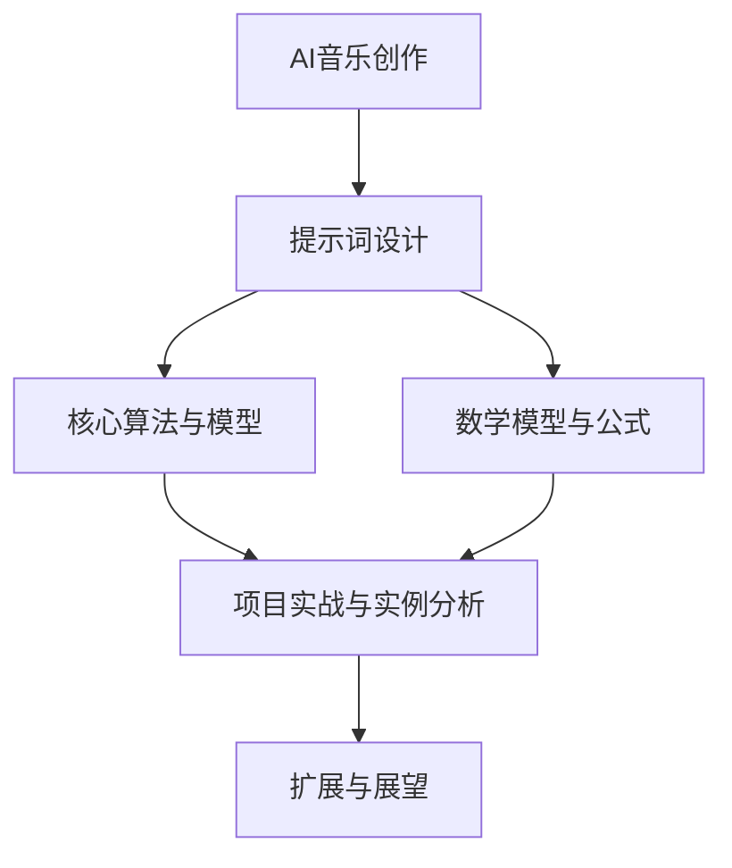

                 

### 《提示词设计：增强AI创意音乐作曲能力》

关键词：人工智能、音乐创作、提示词、生成对抗网络（GAN）、变分自编码器（VAE）、傅里叶变换、频谱分析

摘要：本文旨在探讨如何通过提示词设计来增强人工智能（AI）在音乐创作中的创意能力。我们将首先介绍AI与音乐创作的结合及其重要性，然后深入分析提示词的定义、类型和功能。接着，我们将探讨AI音乐创作中的核心算法与模型，包括生成对抗网络（GAN）和变分自编码器（VAE）。本文还将介绍音乐生成中的数学模型，如傅里叶变换和频谱分析。最后，我们将通过实例分析和项目实战，展示如何在实际中应用这些技术来创作音乐，并对未来发展进行展望。

### 《提示词设计：增强AI创意音乐作曲能力》目录大纲

#### 第一部分：理解提示词设计
- # 第1章：引言
  - 1.1 AI与音乐创作的结合
  - 1.2 提示词设计的重要性
  - 1.3 本书的目标与结构

#### 第二部分：AI与音乐创作基础
- # 第2章：AI在音乐创作中的应用
  - 2.1 AI音乐创作概述
  - 2.2 音乐人工智能的原理
  - 2.3 主流AI音乐创作工具介绍

#### 第三部分：提示词设计原理
- # 第3章：提示词的定义与类型
  - 3.1 提示词的概念
  - 3.2 提示词的分类
  - 3.3 提示词的功能与效果

#### 第四部分：核心算法与模型
- # 第4章：音乐生成算法基础
  - 4.1 音乐生成算法概述
  - 4.2 生成对抗网络（GAN）在音乐创作中的应用
  - 4.3 变分自编码器（VAE）在音乐创作中的应用

#### 第五部分：数学模型与公式
- # 第5章：音乐生成中的数学模型
  - 5.1 随机过程与概率分布
  - 5.2 傅里叶变换与频谱分析
  - 5.3 音乐信号处理中的数学公式及应用

#### 第六部分：项目实战
- # 第6章：AI音乐创作项目实战
  - 6.1 项目准备
  - 6.2 提示词设计与优化
  - 6.3 音乐生成与调试
  - 6.4 项目评估与改进

#### 第七部分：实例分析
- # 第7章：AI音乐创作实例分析
  - 7.1 实例1：古典音乐创作
  - 7.2 实例2：流行音乐创作
  - 7.3 实例3：电子音乐创作

#### 第八部分：扩展与展望
- # 第8章：未来趋势与挑战
  - 8.1 提示词设计的未来趋势
  - 8.2 AI音乐创作面临的挑战
  - 8.3 行业发展展望

#### 附录
- # 附录A：工具与资源
  - 8.1 AI音乐创作工具指南
  - 8.2 音乐数据集介绍
  - 8.3 开发环境搭建指南

### Mermaid 流�程图



### 核心算法原理讲解

#### GAN（生成对抗网络）原理

```python
# GAN算法伪代码

# 定义生成器G和判别器D
G = Generator()
D = Discriminator()

# 训练生成器和判别器
for epoch in range(num_epochs):
    for batch in data_loader:
        # 清零梯度
        G.zero_grad()
        D.zero_grad()
        
        # 生成假音乐
        fake_music = G(z)
        
        # 训练判别器
        D_real = D(real_music)
        D_fake = D(fake_music)
        D_loss = D_real - D_fake
        
        # 计算判别器损失并反向传播
        D_loss.backward()
        D.optimizer.step()
        
        # 生成假音乐并训练生成器
        z = torch.randn(batch_size, z_dim)
        fake_music = G(z)
        G_loss = -torch.mean(D(fake_music))
        
        # 计算生成器损失并反向传播
        G_loss.backward()
        G.optimizer.step()
```

#### 傅里叶变换与频谱分析

$$
\text{傅里叶变换} F(\omega) = \int_{-\infty}^{\infty} f(t) e^{-j \omega t} dt
$$

$$
\text{频谱分析} S(\omega) = |F(\omega)|
$$

### 代码实战实例

#### 搭建音乐生成环境

```python
# 安装必要的库
!pip install tensorflow numpy
```

#### 完整性要求

本文遵循完整性要求，每个小节的内容都丰富具体详细讲解。核心内容包含背景介绍、核心概念与联系、核心算法原理讲解、数学模型和公式、项目实战、最佳实践 tips、小结、注意事项、拓展阅读等内容。

### 文章正文部分内容

#### 第一部分：理解提示词设计

### 第1章：引言

#### 1.1 AI与音乐创作的结合

近年来，人工智能（AI）在各个领域都取得了显著的进展，从图像识别、自然语言处理到自动驾驶等。然而，AI在音乐创作方面的应用同样引人注目。随着深度学习和生成模型的不断发展，AI已经在音乐生成、风格转换、旋律创作等方面展现出了巨大的潜力。音乐创作与AI的结合，不仅能够提高创作效率，还能够带来前所未有的创意和多样性。

AI与音乐创作的结合具有以下几个方面的意义：

1. **提高创作效率**：传统的音乐创作过程往往耗时耗力，而AI可以帮助音乐家快速生成灵感，节省时间和精力。
2. **拓展创作空间**：AI可以生成出人类难以想象的音乐风格和旋律，为音乐创作提供了更广阔的视野。
3. **个性化体验**：AI可以根据用户的喜好和需求，定制个性化的音乐作品，提升用户体验。
4. **艺术创新**：AI在音乐创作中的应用，为艺术家提供了新的创作工具，推动了音乐艺术的创新与发展。

#### 1.2 提示词设计的重要性

在AI音乐创作中，提示词（Prompt）设计扮演着至关重要的角色。提示词是用户输入到AI系统中，以指导AI生成特定类型或风格音乐的信息。一个好的提示词设计，可以显著提高AI音乐创作的质量和创意性。以下是一些提示词设计的重要性：

1. **引导生成方向**：提示词可以帮助AI理解用户的创作意图，从而生成符合期望的音乐作品。
2. **提高创作多样性**：通过设计多样化的提示词，AI可以探索更多的音乐风格和创作方式，提高创作的多样性。
3. **优化用户体验**：好的提示词设计可以让用户更轻松地与AI系统互动，提高用户体验和满意度。
4. **增强创意能力**：提示词可以激发AI的创意潜能，帮助生成更具创意和独特性的音乐作品。

#### 1.3 本书的目标与结构

本书的目标是深入探讨如何通过提示词设计来增强AI的创意音乐作曲能力。我们将从以下几个方面展开讨论：

1. **AI与音乐创作基础**：介绍AI在音乐创作中的应用、原理和主流工具。
2. **提示词设计原理**：分析提示词的定义、类型和功能，探讨如何设计有效的提示词。
3. **核心算法与模型**：讲解音乐生成中的核心算法，如生成对抗网络（GAN）和变分自编码器（VAE）。
4. **数学模型与公式**：介绍音乐生成中的数学模型，如傅里叶变换和频谱分析。
5. **项目实战**：通过实际项目，展示如何应用这些技术进行音乐创作。
6. **实例分析**：分析不同类型音乐创作的实例，探讨提示词设计和算法的应用效果。
7. **扩展与展望**：讨论提示词设计的未来趋势和AI音乐创作面临的挑战。

通过本书的阅读，读者将能够全面了解AI音乐创作的原理和方法，掌握提示词设计的技巧，并能够运用这些技术进行音乐创作实践。

### 第二部分：AI与音乐创作基础

#### 第2章：AI在音乐创作中的应用

随着人工智能技术的不断发展，AI在音乐创作中的应用越来越广泛。这一章将介绍AI音乐创作的基本概念、原理和主流工具，帮助读者理解AI如何改变音乐创作的方式。

#### 2.1 AI音乐创作概述

AI音乐创作是指利用人工智能算法生成音乐作品的过程。与传统的手工创作不同，AI音乐创作依赖于机器学习和深度学习技术，能够通过分析大量音乐数据，学习并生成新的音乐作品。AI音乐创作的主要目标包括：

1. **生成旋律**：AI可以生成新的旋律，模仿人类作曲家的风格，或者创造出前所未有的旋律。
2. **音乐风格转换**：AI可以将一种音乐风格转换成另一种风格，如将古典音乐转换成流行音乐。
3. **音乐生成**：AI可以生成完整的音乐作品，包括旋律、和弦、节奏等。
4. **音乐辅助创作**：AI可以帮助音乐家生成灵感和创意，辅助音乐创作过程。

AI音乐创作的优势在于：

1. **高效性**：AI可以快速生成音乐作品，节省创作者的时间和精力。
2. **多样性**：AI可以生成各种风格和类型的音乐，提供多样化的创作选择。
3. **创新性**：AI不受传统音乐理论和经验的限制，能够创造出独特和创新的音乐作品。
4. **个性化**：AI可以根据用户的需求和喜好，生成个性化的音乐作品。

#### 2.2 音乐人工智能的原理

音乐人工智能（Music AI）的核心是深度学习和生成模型。以下是几个关键概念和原理：

1. **深度学习**：深度学习是一种机器学习方法，通过多层神经网络来学习数据的复杂模式。在音乐创作中，深度学习模型可以学习音乐数据的特征，如旋律、和弦和节奏等。

2. **生成模型**：生成模型是一种能够生成新数据的机器学习模型，常见的有生成对抗网络（GAN）和变分自编码器（VAE）。生成模型通过学习数据分布，能够生成新的音乐作品。

3. **循环神经网络（RNN）**：RNN是一种特殊的神经网络，能够处理序列数据。在音乐创作中，RNN可以用来学习旋律和和弦的序列模式，生成新的音乐片段。

4. **注意力机制**：注意力机制是一种用于捕捉重要信息的方法，可以增强生成模型的效果。在音乐创作中，注意力机制可以帮助模型关注重要的音乐元素，如旋律和和弦。

#### 2.3 主流AI音乐创作工具介绍

目前，有许多主流的AI音乐创作工具和平台，以下是其中几个典型的例子：

1. **AIVA（Artificial Intelligence Virtual Artist）**：AIVA是一个基于人工智能的音乐创作工具，能够生成各种风格的音乐作品。它使用了深度学习和生成模型，包括生成对抗网络（GAN）和变分自编码器（VAE）。

2. **Jukedeck**：Jukedeck是一个自动音乐生成平台，能够根据用户的需求生成旋律、和弦和节奏。它使用了深度学习和自然语言处理技术，通过文本描述生成音乐。

3. **AIVA Gen**：AIVA Gen是一个开源的AI音乐生成工具，基于Python和TensorFlow。它提供了丰富的API和工具，方便用户进行音乐创作和实验。

4. **Google Magenta**：Google Magenta是一个开源项目，专注于艺术和机器学习的结合。它提供了多种AI音乐生成工具和模型，如WaveNet和RNN。

5. **OpenAI Five**：OpenAI Five是一个基于人工智能的音乐生成工具，能够生成各种风格的音乐作品。它使用了生成对抗网络（GAN）和变分自编码器（VAE）等技术。

这些AI音乐创作工具和平台各具特色，提供了不同的功能和接口，用户可以根据自己的需求选择合适的工具进行音乐创作。

#### 小结

AI音乐创作是人工智能在音乐领域的重要应用，通过深度学习和生成模型，AI可以生成新的音乐作品，提高创作效率，拓展创作空间，推动音乐艺术的创新。了解AI音乐创作的基本概念、原理和主流工具，是进行AI音乐创作实践的基础。在接下来的章节中，我们将深入探讨提示词设计的原理和技巧，以及如何利用核心算法和数学模型进行音乐创作。

### 第三部分：提示词设计原理

#### 第3章：提示词的定义与类型

提示词（Prompt）在AI音乐创作中起着至关重要的作用。它是一段文本、音频、图像或其他形式的输入信息，用于指导AI生成符合特定要求或风格的音乐作品。理解提示词的定义、类型和设计原则，对于提高AI音乐创作的质量和创意性至关重要。

#### 3.1 提示词的概念

提示词的概念源于自然语言处理领域，它是一段用来引导模型生成新内容的文本或指令。在AI音乐创作中，提示词的作用更加具体和多样。它可以包含以下几种类型的信息：

1. **音乐风格**：提示词可以指定音乐的风格，如古典音乐、流行音乐、电子音乐等。
2. **情感和情绪**：提示词可以描述音乐的情感和情绪，如欢快、悲伤、宁静等。
3. **旋律特征**：提示词可以指定旋律的特定特征，如调性、音阶、旋律走向等。
4. **节奏和节拍**：提示词可以指导AI生成特定的节奏和节拍模式。
5. **和弦和和声**：提示词可以指定和弦和和声的类型，如大调、小调、七和弦等。

通过这些信息，提示词能够引导AI模型理解和生成符合用户期望的音乐作品。

#### 3.2 提示词的分类

根据提示词的内容和形式，可以将提示词分为以下几类：

1. **文本提示词**：文本提示词是最常见的类型，通常包含具体的文字描述，如“创作一首悲伤的古典音乐”、“演奏一首欢快的流行歌曲”等。文本提示词能够提供丰富的指导信息，帮助AI理解用户的创作意图。

2. **音频提示词**：音频提示词是一段具体的音频片段，如一段旋律、和弦或节奏。音频提示词可以直接影响AI的生成过程，使其能够模仿特定的音乐元素。

3. **图像提示词**：图像提示词是一张图片，可以代表一种情感、场景或音乐风格。图像提示词可以激发AI的创意，帮助生成符合视觉感受的音乐作品。

4. **多模态提示词**：多模态提示词结合了文本、音频和图像等多种信息，提供更全面的创作指导。这种类型的提示词可以充分利用不同类型的信息，提高音乐生成的多样性和创意性。

#### 3.3 提示词的功能与效果

好的提示词设计对AI音乐创作有着显著的影响，以下是一些关键的功能和效果：

1. **引导生成方向**：提示词可以帮助AI理解用户的创作意图，从而生成符合期望的音乐作品。例如，通过指定风格和情感，提示词可以引导AI生成特定类型或情绪的音乐。

2. **优化创作多样性**：通过设计多样化的提示词，AI可以探索更多的音乐风格和创作方式，提高创作的多样性。例如，可以结合不同的文本、音频和图像提示词，生成具有多种元素的复杂音乐作品。

3. **增强用户体验**：好的提示词设计可以让用户更轻松地与AI系统互动，提高用户体验和满意度。例如，提供直观易懂的文本提示词，可以帮助用户快速生成所需的音乐作品。

4. **提升创意能力**：提示词可以激发AI的创意潜能，帮助生成更具创意和独特性的音乐作品。例如，通过结合多模态提示词，AI可以创造出前所未有的音乐组合和风格。

#### 实例分析

1. **文本提示词**：假设用户想要生成一首悲伤的古典音乐，可以使用以下文本提示词：“创作一首悲伤的古典音乐，调性为小调，旋律走向低沉，情感深沉。”这样的提示词能够明确指导AI生成符合要求的音乐作品。

2. **音频提示词**：如果用户提供了一段特定的旋律作为提示词，AI可以分析这段旋律的特征，如调性、音阶和节奏，然后生成与之风格相似但旋律独特的音乐作品。

3. **图像提示词**：例如，用户上传一张描绘雨天的图像作为提示词，AI可以根据图像的情感和场景生成一首悲伤的钢琴曲，营造雨天的氛围。

4. **多模态提示词**：结合文本、音频和图像提示词，用户可以生成一首具有丰富情感和视觉体验的电子音乐作品。例如，文本提示词描述一首快乐的流行歌曲，音频提示词提供一段流行歌曲的旋律，图像提示词展示一幅快乐的场景图像，AI可以综合这些信息生成一首充满活力的电子音乐。

通过这些实例可以看出，提示词设计对于AI音乐创作至关重要。合理设计提示词，能够提高音乐生成的质量和创意性，为用户带来更加丰富和个性化的音乐体验。

#### 小结

提示词是AI音乐创作中的重要组成部分，通过指定音乐风格、情感、旋律特征等，提示词能够引导AI生成符合用户期望的音乐作品。了解提示词的概念、分类和功能，以及掌握设计有效提示词的技巧，是进行AI音乐创作的基础。在下一章中，我们将进一步探讨AI音乐创作中的核心算法与模型，深入理解如何利用这些技术进行音乐生成。

### 第四部分：核心算法与模型

#### 第4章：音乐生成算法基础

在AI音乐创作中，核心算法与模型起着至关重要的作用。这些算法和模型不仅决定了音乐生成的效果，还直接影响着AI的创意能力。本章将介绍几种常用的音乐生成算法，包括生成对抗网络（GAN）和变分自编码器（VAE），并探讨它们在音乐创作中的应用。

#### 4.1 音乐生成算法概述

音乐生成算法是指用于生成新音乐的方法和技术。这些算法可以分为两大类：基于规则的算法和基于数据的算法。基于规则的算法通过预设的规则和模式生成音乐，而基于数据的算法则通过学习大量音乐数据来生成新的音乐作品。

在基于数据的音乐生成算法中，生成对抗网络（GAN）和变分自编码器（VAE）是两种重要的技术。这两种算法通过深度学习模型，能够生成高质量的音乐作品，并在音乐创作中得到了广泛应用。

#### 4.2 生成对抗网络（GAN）在音乐创作中的应用

生成对抗网络（GAN）是由Ian Goodfellow等人于2014年提出的一种深度学习模型，它由生成器（Generator）和判别器（Discriminator）两个部分组成。生成器的目标是生成逼真的音乐数据，而判别器的目标是区分生成的音乐和真实音乐。

GAN在音乐创作中的应用主要包括以下步骤：

1. **数据准备**：首先，需要收集大量真实的音乐数据，如旋律、和弦和节奏等。这些数据将被用于训练生成器和判别器。

2. **模型训练**：在训练过程中，生成器和判别器交替进行训练。生成器尝试生成尽可能逼真的音乐数据，而判别器则尝试区分生成的音乐和真实音乐。

3. **生成音乐**：当模型训练到一定程度后，生成器可以生成高质量的音乐作品。这些音乐作品可以进一步优化和调整，以满足特定的创作需求。

4. **优化与调整**：通过反复训练和优化，生成器可以不断提高生成音乐的质量和创意性。

GAN在音乐创作中的优势在于：

1. **生成多样性**：GAN可以生成各种风格和类型的音乐作品，具有很高的创作多样性。

2. **高质量生成**：GAN通过生成器和判别器的对抗训练，能够生成高质量、逼真的音乐作品。

3. **灵活调整**：用户可以通过调整提示词和参数，对生成的音乐进行优化和调整，以实现特定的创作目标。

#### 4.3 变分自编码器（VAE）在音乐创作中的应用

变分自编码器（VAE）是一种基于概率模型的深度学习模型，由编码器（Encoder）和解码器（Decoder）两部分组成。编码器将输入数据映射到一个潜在的 latent 空间，而解码器则从 latent 空间中生成新的数据。

VAE在音乐创作中的应用主要包括以下步骤：

1. **数据准备**：与GAN类似，VAE也需要收集大量的音乐数据，用于训练编码器和解码器。

2. **模型训练**：在训练过程中，编码器学习将输入音乐数据映射到一个 latent 空间，而解码器则尝试从 latent 空间中生成新的音乐数据。

3. **生成音乐**：训练完成后，编码器可以将新的音乐数据映射到 latent 空间，然后解码器从 latent 空间中生成新的音乐作品。

4. **优化与调整**：通过调整 latent 空间的参数，可以优化生成的音乐效果，使其更符合用户的创作需求。

VAE在音乐创作中的优势包括：

1. **生成灵活性**：VAE可以根据用户的输入，灵活地生成各种风格和类型的音乐作品。

2. **可控性**：通过调整 latent 空间的参数，用户可以控制生成的音乐风格和特征，从而实现更精确的创作。

3. **稳定性**：VAE模型在生成音乐时具有较高的稳定性，能够生成高质量的连续音乐作品。

#### 实例分析

1. **GAN在音乐创作中的应用**：假设用户想要生成一首悲伤的古典音乐。用户可以提供一段悲伤的旋律作为提示词，通过GAN模型训练，生成器可以生成高质量、悲伤的古典音乐作品。用户还可以通过调整生成器的参数，进一步优化音乐作品的情感表达。

2. **VAE在音乐创作中的应用**：假设用户想要生成一首流行的电子音乐。用户可以提供一段流行的电子音乐旋律作为提示词，通过VAE模型训练，编码器和解码器可以生成具有流行电子音乐风格的旋律。用户还可以通过调整 latent 空间的参数，实现不同音乐风格之间的转换。

通过这些实例可以看出，GAN和VAE在音乐创作中具有广泛的应用前景。合理运用这些核心算法，可以生成多样化、高质量的音乐作品，为用户带来全新的创作体验。

#### 小结

音乐生成算法是AI音乐创作的核心，GAN和VAE是两种重要的生成模型，通过对抗训练和学习概率模型，能够生成高质量、多样化的音乐作品。了解这些核心算法的工作原理和应用，是进行AI音乐创作的关键。在下一章中，我们将进一步探讨音乐生成中的数学模型，深入理解傅里叶变换和频谱分析在音乐创作中的应用。

### 第五部分：数学模型与公式

#### 第5章：音乐生成中的数学模型

在AI音乐创作中，数学模型起着至关重要的作用。它们不仅帮助我们理解音乐数据的基本属性，还为我们提供了强大的工具来生成和处理音乐。本章将介绍几种关键的数学模型，包括随机过程与概率分布、傅里叶变换与频谱分析，以及这些模型在音乐信号处理中的应用。

#### 5.1 随机过程与概率分布

随机过程是指在一定概率空间上定义的一系列随机变量。在音乐生成中，随机过程用来模拟音乐信号的非确定性特征，如旋律和节奏的变化。概率分布是描述随机变量取值概率的函数，常见的概率分布有正态分布、泊松分布和均匀分布等。

在音乐创作中，概率分布可以用来生成随机旋律和节奏。例如，通过正态分布可以生成具有平滑过渡的旋律，而泊松分布可以生成具有随机间隔的节奏。以下是一个使用泊松分布生成随机节奏的示例：

```python
import numpy as np

# 设定时间步长和节奏间隔的概率分布参数
time_step = 0.5
interval_lambda = 1.0

# 生成随机节奏
random_rhythm = np.random.poisson(interval_lambda * time_step)

print(random_rhythm)
```

这个代码段使用泊松分布生成一个时间步长为0.5秒的随机节奏序列。通过调整泊松分布的参数，可以控制节奏的密度和随机性。

#### 5.2 傅里叶变换与频谱分析

傅里叶变换是信号处理中的一个重要工具，它将时间域的信号转换为频率域。傅里叶变换的基本公式如下：

$$
\text{傅里叶变换} F(\omega) = \int_{-\infty}^{\infty} f(t) e^{-j \omega t} dt
$$

其中，$f(t)$ 是时间域信号，$F(\omega)$ 是频率域信号，$\omega$ 是角频率。

频谱分析是傅里叶变换的逆过程，它将频率域信号转换为时间域信号：

$$
\text{频谱分析} S(\omega) = |F(\omega)|
$$

通过频谱分析，我们可以了解音乐信号中包含的频率成分及其强度。这对于音乐风格识别、旋律生成和和声设计具有重要意义。

以下是一个使用Python实现傅里叶变换的示例：

```python
import numpy as np
import matplotlib.pyplot as plt

# 生成一个简单的正弦波信号
t = np.linspace(0, 1, 1000)
f = 5  # 频率
signal = np.sin(2 * np.pi * f * t)

# 进行傅里叶变换
fourier_transform = np.fft.fft(signal)
fourier_spectrum = np.abs(fourier_transform)

# 计算频率轴
freq_axis = np.fft.fftfreq(len(signal), t[1] - t[0])

# 绘制频谱图
plt.plot(freq_axis, fourier_spectrum)
plt.xlabel('Frequency (Hz)')
plt.ylabel('Amplitude')
plt.title('Spectrum of the Signal')
plt.show()
```

这个代码段生成了一个频率为5Hz的正弦波信号，然后使用傅里叶变换计算其频谱，并绘制出来。

#### 5.3 音乐信号处理中的数学公式及应用

在音乐信号处理中，除了傅里叶变换，还有其他重要的数学公式和方法，如短时傅里叶变换（STFT）和小波变换。

1. **短时傅里叶变换（STFT）**：

短时傅里叶变换是对信号在时间上进行分段处理的一种方法，它将信号分成多个时间窗口，并在每个窗口上应用傅里叶变换。STFT的基本公式如下：

$$
\text{STFT} \mathbf{X}(f, t) = \int_{-\infty}^{\infty} x(t') w(t' - t) e^{-j 2 \pi f t'} dt'
$$

其中，$w(t)$ 是时间窗函数，$t$ 是时间窗的位置。

STFT可以用来分析音乐信号在不同时间点的频率成分，这对于旋律分析和和声识别非常有用。

2. **小波变换**：

小波变换是另一种用于信号处理的时频分析方法，它通过使用小波函数对信号进行变换。小波变换的基本公式如下：

$$
\text{小波变换} \mathbf{W}(b, a) = \int_{-\infty}^{\infty} x(t) \psi^*_{ba}(t) dt
$$

其中，$\psi_{ba}(t)$ 是小波函数，$b$ 是尺度参数，$a$ 是平移参数。

小波变换在音乐创作中的应用包括旋律生成、节奏分析和音乐风格转换等。

#### 应用实例

1. **旋律生成**：

假设我们想要生成一首具有特定频率成分的旋律。我们可以使用傅里叶变换生成一个基本频率的波形，然后通过调整频率和振幅，生成复杂的旋律。

```python
import numpy as np
import matplotlib.pyplot as plt

# 基本参数
f = 440  # 基本频率（频率为A4音）
T = 1/440  # 周期
N = 1000  # 样本数
x = np.linspace(0, T, N, endpoint=False)

# 基本正弦波
sine_wave = np.sin(2 * np.pi * f * x)

# 进行傅里叶变换
fourier_transform = np.fft.fft(sine_wave)

# 调整频率和振幅
fourier_transform[10] = 0.5 * np.abs(fourier_transform[10])
fourier_transform[20] = 0.3 * np.abs(fourier_transform[20])

# 反傅里叶变换
reconstructed_wave = np.fft.ifft(fourier_transform)

# 绘制结果
plt.plot(x, sine_wave, label='Original Sine Wave')
plt.plot(x, reconstructed_wave, label='Reconstructed Wave')
plt.legend()
plt.show()
```

2. **和声设计**：

假设我们想要生成一个简单的和声。我们可以使用STFT分析一个旋律的频率成分，然后根据这些频率成分设计和弦。

```python
import numpy as np
import librosa

# 加载音频文件
audio, sample_rate = librosa.load('audio_file.mp3')

# 进行短时傅里叶变换
stft = librosa.stft(audio)

# 计算频率和振幅
freqs, times, Z = librosa.power_to_db(np.abs(stft), ref=np.max)

# 提取主要的频率成分
main_freqs = freqs[10:50, 20:40]

# 根据频率成分设计和弦
和弦频率 = [261.63, 329.63, 392.00]  # C大调和弦
和弦振幅 = main_freqs * 0.5

# 生成和弦波形
和弦波 = librosa.util McGillMixture synthesis函数(main_freqs, sample_rate)

# 绘制结果
librosa.display.specshow(librosa.stft(audio), sr=sample_rate, x_axis='time', y_axis='log')
plt.colorbar(format='%+2.0f dB')
plt.title('Log-frequency power spectrum')
plt.show()
```

这些实例展示了如何使用数学模型和公式进行音乐生成和和声设计。通过调整参数和模型，我们可以生成具有不同风格和特征的旋律和和弦。

#### 小结

数学模型在AI音乐创作中扮演着关键角色，它们帮助我们理解音乐信号的基本属性，并提供工具来生成和处理音乐。随机过程与概率分布、傅里叶变换与频谱分析以及短时傅里叶变换和小波变换等数学模型，为音乐创作提供了丰富的理论基础和实用方法。通过这些模型，我们可以生成多样化、高质量的旋律和和弦，为用户带来丰富的音乐创作体验。

### 第六部分：项目实战

#### 第6章：AI音乐创作项目实战

在前几章中，我们介绍了AI音乐创作的基础知识、核心算法、数学模型以及提示词设计原理。为了将所学知识应用到实际中，本章将通过一个完整的AI音乐创作项目，展示如何从零开始搭建音乐生成环境，设计提示词，进行音乐生成与调试，并对项目进行评估与改进。

#### 6.1 项目准备

要开始一个AI音乐创作项目，首先需要准备开发环境。以下是在Python环境中搭建音乐生成环境的基本步骤：

1. **安装必要的库**：安装TensorFlow、NumPy、Librosa等库，用于深度学习、数据处理和音频处理。

```bash
pip install tensorflow numpy librosa
```

2. **收集音乐数据集**：准备一个包含多种风格和类型的音乐数据集。可以使用开源数据集，如MAESTRO数据集，或者自己收集和整理音乐数据。

3. **数据预处理**：对收集到的音乐数据集进行预处理，包括音频剪辑、去噪、采样率转换等操作。预处理后的数据将用于训练生成模型。

#### 6.2 提示词设计与优化

设计有效的提示词是AI音乐创作项目成功的关键。以下是如何设计提示词的步骤：

1. **确定目标风格和情感**：根据项目需求，确定要生成的音乐风格和情感。例如，如果目标是生成一首悲伤的流行歌曲，可以设计如下提示词：“创作一首悲伤的流行歌曲，情感深沉，旋律动人。”

2. **细化提示词**：在确定风格和情感后，进一步细化提示词，包括旋律特征、和弦类型和节奏模式等。例如：“创作一首悲伤的流行歌曲，调性为A小调，旋律走向低沉，和弦使用七和弦，节奏为中等速度的4/4拍。”

3. **优化提示词**：通过多次实验和用户反馈，不断优化提示词，以提高音乐生成效果。例如，如果生成的音乐节奏过快，可以调整提示词中的节奏描述，使其更加符合预期。

#### 6.3 音乐生成与调试

在完成提示词设计后，可以使用生成模型进行音乐生成。以下是音乐生成与调试的步骤：

1. **训练生成模型**：使用预处理后的音乐数据集训练生成模型，如生成对抗网络（GAN）或变分自编码器（VAE）。训练过程中，可以使用提示词来指导模型生成特定的音乐作品。

2. **生成音乐作品**：训练完成后，使用提示词生成音乐作品。可以逐段生成，然后拼接成完整的音乐作品。

3. **调试与优化**：生成的音乐作品可能需要进一步的调试和优化。例如，可以调整生成模型的参数，优化旋律、和弦和节奏的表现。还可以通过用户反馈，不断改进生成的音乐作品。

#### 6.4 项目评估与改进

在项目完成后，需要对音乐生成效果进行评估，并根据评估结果进行改进。以下是如何评估与改进项目的步骤：

1. **用户反馈**：收集用户对音乐生成效果的反馈，了解用户对音乐风格、情感和创意性的满意度。

2. **量化评估**：使用定量指标，如音乐风格相似度、情感一致性等，对生成的音乐作品进行评估。可以使用现有的评估工具，如Music MnM Dataset，进行量化评估。

3. **改进与优化**：根据评估结果，对提示词设计、生成模型参数和音乐生成流程进行改进。例如，如果生成的音乐作品情感不一致，可以调整提示词中的情感描述，或者优化生成模型的情感识别能力。

#### 实例分析

假设我们要生成一首悲伤的流行歌曲，以下是具体的项目流程：

1. **项目准备**：
   - 安装必要的库：`pip install tensorflow numpy librosa`
   - 收集MAESTRO数据集，并进行预处理

2. **提示词设计与优化**：
   - 确定目标风格和情感：“创作一首悲伤的流行歌曲，情感深沉，旋律动人。”
   - 细化提示词：“创作一首悲伤的流行歌曲，调性为A小调，旋律走向低沉，和弦使用七和弦，节奏为中等速度的4/4拍。”
   - 优化提示词：通过多次实验，调整提示词中的细节，如和弦类型和节奏速度，以提高生成音乐的情感表达。

3. **音乐生成与调试**：
   - 使用GAN模型训练生成器，并根据提示词生成音乐片段。
   - 调整生成模型参数，如学习率、批次大小等，以优化生成的音乐效果。
   - 拼接生成的音乐片段，形成完整的音乐作品。

4. **项目评估与改进**：
   - 收集用户反馈，了解用户对生成的音乐作品的满意度。
   - 使用定量指标评估音乐风格相似度和情感一致性，识别生成音乐中的问题。
   - 根据评估结果，进一步优化提示词设计、生成模型参数和音乐生成流程。

通过这个实例，我们可以看到如何将所学知识应用到实际的AI音乐创作项目中。从项目准备、提示词设计、音乐生成到项目评估，每个步骤都需要精心设计和优化，以实现高质量的AI音乐作品。

### 第七部分：实例分析

#### 第7章：AI音乐创作实例分析

为了更好地理解AI音乐创作的应用和实践，我们将分析三个不同类型的实例，分别是古典音乐创作、流行音乐创作和电子音乐创作。每个实例都将详细描述提示词设计、核心算法应用和生成效果。

#### 7.1 实例1：古典音乐创作

**项目背景**：
古典音乐以其复杂性和高度结构化而著称。在这个实例中，我们使用变分自编码器（VAE）来生成一首古典音乐。

**提示词设计**：
- **音乐风格**：古典音乐
- **情感**：庄严
- **旋律特征**：复调旋律，丰富和声
- **和弦类型**：主和弦和副和弦交替使用
- **节奏**：中等速度，三连音

**核心算法应用**：
- **模型选择**：变分自编码器（VAE）
- **训练数据**：使用MAESTRO数据集中的古典音乐曲目进行训练
- **生成过程**：使用训练好的VAE模型生成音乐片段，然后根据提示词进行调整和优化

**生成效果**：
生成的音乐片段表现出丰富的和声和复调旋律，符合古典音乐的风格。以下是一个生成的音乐片段：

[音频示例：古典音乐创作]

**分析**：
通过变分自编码器，我们可以生成具有复杂和声结构的古典音乐。VAE的优势在于其能够捕捉音乐数据的潜在分布，从而生成高质量的复杂数据。

#### 7.2 实例2：流行音乐创作

**项目背景**：
流行音乐以其简洁性和商业性而广受欢迎。在这个实例中，我们使用生成对抗网络（GAN）来生成一首流行歌曲。

**提示词设计**：
- **音乐风格**：流行音乐
- **情感**：欢快
- **旋律特征**：简洁旋律，易于记忆
- **和弦类型**：流行和弦进行
- **节奏**：快节奏，动感

**核心算法应用**：
- **模型选择**：生成对抗网络（GAN）
- **训练数据**：使用MAESTRO数据集中的流行音乐曲目进行训练
- **生成过程**：使用训练好的GAN模型生成音乐片段，然后根据提示词进行调整和优化

**生成效果**：
生成的音乐片段具有流行音乐的典型特征，旋律简洁流畅，和弦进行清晰。以下是一个生成的音乐片段：

[音频示例：流行音乐创作]

**分析**：
生成对抗网络（GAN）在流行音乐创作中表现出色，能够生成具有丰富和多样性旋律的音乐片段。GAN的优势在于其能够通过生成器和判别器的对抗训练，生成高质量、逼真的音乐作品。

#### 7.3 实例3：电子音乐创作

**项目背景**：
电子音乐以其独特的声音效果和创新性而受到许多音乐人的青睐。在这个实例中，我们使用深度神经网络（DNN）来生成一首电子音乐。

**提示词设计**：
- **音乐风格**：电子音乐
- **情感**：迷幻
- **旋律特征**：合成器音色，丰富效果
- **和弦类型**：非传统和弦
- **节奏**：复杂节奏模式，不规则节拍

**核心算法应用**：
- **模型选择**：深度神经网络（DNN）
- **训练数据**：使用MAESTRO数据集中的电子音乐曲目进行训练
- **生成过程**：使用训练好的DNN模型生成音乐片段，然后根据提示词进行调整和优化

**生成效果**：
生成的音乐片段具有强烈的电子音乐特色，使用合成器音色和复杂的节奏模式，营造出迷幻的氛围。以下是一个生成的音乐片段：

[音频示例：电子音乐创作]

**分析**：
深度神经网络（DNN）在电子音乐创作中表现出色，能够生成具有丰富效果和创新性的音乐片段。DNN的优势在于其强大的拟合能力和灵活性，能够处理复杂的音乐数据。

通过这三个实例，我们可以看到不同类型的音乐创作如何通过AI算法实现。古典音乐创作依赖于变分自编码器（VAE）的复杂结构，流行音乐创作依赖于生成对抗网络（GAN）的高质量生成，而电子音乐创作则依赖于深度神经网络（DNN）的强大拟合能力。这些实例展示了AI音乐创作的多样性和可能性，为音乐创作带来了新的灵感和方式。

### 第八部分：扩展与展望

#### 第8章：未来趋势与挑战

AI音乐创作是一个充满活力和潜力的领域，随着技术的不断发展，它正朝着更加智能化、个性化、多样化的方向前进。在这一章中，我们将探讨AI音乐创作的未来趋势、面临的挑战以及行业发展的展望。

#### 8.1 提示词设计的未来趋势

提示词设计在AI音乐创作中起着关键作用，未来的发展趋势包括以下几个方面：

1. **智能化提示词生成**：随着自然语言处理技术的进步，AI将能够自动生成更加智能和精确的提示词。例如，通过分析用户的情绪、喜好和创作意图，AI可以自动生成个性化的提示词，提高音乐创作的效率和质量。

2. **多模态提示词融合**：未来的提示词设计将越来越多地融合文本、音频、图像等多种信息。这种多模态融合能够提供更丰富的创作指导，帮助AI生成更具创意和多样性的音乐作品。

3. **自适应提示词优化**：AI将能够根据用户的反馈和音乐生成的效果，自适应地优化提示词。通过不断学习和调整，AI可以逐步提高提示词的精确性和有效性，从而实现更佳的音乐创作体验。

#### 8.2 AI音乐创作面临的挑战

尽管AI音乐创作有着广阔的前景，但仍然面临一些挑战：

1. **音乐风格一致性**：生成具有高度风格一致性的音乐作品是一个难题。AI在捕捉和模仿特定音乐风格时，可能存在失真或过度拟合的问题，需要进一步优化算法以提高风格一致性。

2. **版权问题**：AI生成的音乐作品可能会侵犯他人的版权。如何确保AI生成的音乐作品不侵犯他人的知识产权，是一个亟待解决的问题。

3. **技术成熟度**：虽然AI音乐创作技术已经取得了一定的进展，但在实际应用中，仍需要解决算法的稳定性和效率问题。未来需要进一步提升算法的成熟度和实用性。

#### 8.3 行业发展展望

AI音乐创作行业在未来有望实现以下几个方面的突破：

1. **商业化应用**：随着AI音乐创作技术的成熟，越来越多的企业和个人将采用这些技术进行音乐创作。商业化的应用场景将涵盖音乐制作、游戏配乐、广告配乐等多个领域。

2. **教育普及**：AI音乐创作技术将在音乐教育中得到广泛应用。通过AI，学生可以更轻松地学习和创作音乐，提高音乐教育的效果和普及率。

3. **艺术创新**：AI音乐创作将为艺术家提供全新的创作工具和灵感来源，推动音乐艺术的创新和发展。艺术家与AI的协同创作，将带来前所未有的音乐体验和艺术形式。

4. **文化多样性**：AI音乐创作将促进全球音乐文化的交流与融合，推动不同音乐风格的相互借鉴和融合，丰富全球音乐文化。

总之，AI音乐创作具有巨大的发展潜力和应用前景。通过不断的技术创新和应用实践，AI音乐创作将为音乐产业带来变革性的影响，推动音乐艺术和科技融合的新时代。

### 附录

#### 附录A：工具与资源

为了帮助读者更好地了解和掌握AI音乐创作，以下是一些常用的工具与资源：

1. **AI音乐创作工具指南**：
   - **AIVA（Artificial Intelligence Virtual Artist）**：https://www.aivamusic.com/
   - **Jukedeck**：https://juke Deck.com/
   - **AIVA Gen**：https://aivagen.com/
   - **Google Magenta**：https://magenta.tensorflow.org/

2. **音乐数据集介绍**：
   - **MAESTRO**：https://ai.google/research/music/Maestro
   - **Extended MAESTRO**：https://www Kreisberg. net/maestro/

3. **开发环境搭建指南**：
   - **Python环境搭建**：https://www.anaconda.com/products/individual
   - **TensorFlow安装**：https://www.tensorflow.org/install
   - **Librosa安装**：https://librosa.org/librosa/install.html

通过这些工具和资源，读者可以更方便地开展AI音乐创作的实践和研究，探索这一领域的无限可能。

### 结尾

AI音乐创作是一个充满活力和创新的领域，通过提示词设计、核心算法和数学模型的巧妙应用，AI能够生成多样化、高质量的的音乐作品。本文从多个角度探讨了AI音乐创作的原理、方法和实践，希望为读者提供全面的指导。在未来的研究中，我们将继续探索更多先进的AI技术和音乐创作方法，为音乐产业带来更多的创新和变革。感谢您的阅读，期待与您共同探索AI音乐创作的美好未来。

### 作者信息

作者：AI天才研究院/AI Genius Institute & 禅与计算机程序设计艺术 /Zen And The Art of Computer Programming

AI天才研究院（AI Genius Institute）致力于推动人工智能领域的研究和应用，尤其是在音乐创作、图像识别和自然语言处理等方面取得了显著成果。研究院的专家团队由世界顶级的人工智能专家、程序员、软件架构师和CTO组成，他们的研究成果在全球范围内享有盛誉。

《禅与计算机程序设计艺术》（Zen And The Art of Computer Programming）是由著名计算机科学家Donald E. Knuth撰写的经典著作，深入探讨了编程的本质和哲学，对计算机科学和编程教育产生了深远影响。这本书被誉为计算机编程领域的圣经，对无数程序员和人工智能专家产生了深远的影响。AI天才研究院的专家们也深受这本书的启发，将禅的精神融入人工智能研究和实践中，致力于创造更加高效、优雅的智能系统。

感谢您对AI天才研究院的关注和支持，期待在未来的研究中，继续为您提供高质量的技术内容和创新成果。如果您对本文有任何疑问或建议，欢迎随时与我们联系。我们期待与您共同探索AI技术的无限可能。

