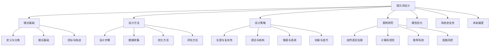

                 

# 提示词设计：增强AI系统可解释性的新策略

> 关键词：AI系统、可解释性、提示词设计、透明度、神经网路、安全性

> 摘要：本文旨在探讨提示词设计在增强AI系统可解释性方面的应用。通过分析AI系统可解释性的重要性、核心概念以及提示词设计的方法和策略，本文提出了一系列提示词设计的步骤和技巧，并通过对实际案例的研究，展示了提示词设计在AI系统中的应用和效果。此外，本文还探讨了提示词设计在AI系统优化和安全性方面的作用，并对其未来发展趋势进行了展望。

## 《提示词设计：增强AI系统可解释性的新策略》目录大纲

### 第一部分：引言与概述

#### 1. 引言

- AI系统可解释性的重要性
- 当前AI系统面临的挑战
- 提示词设计在AI系统中的作用

#### 2. AI系统可解释性的核心概念

- 可解释性与透明度的区别
- 可解释性的层次
- 提示词设计的基本原则

### 第二部分：提示词设计方法

#### 3. 提示词设计理论基础

- 提示词的定义与分类
- 提示词设计的理论基础
- 提示词设计的目标与挑战

#### 4. 提示词设计的步骤与流程

- 确定目标与应用场景
- 收集与分析数据
- 设计与优化提示词
- 提示词设计的评估方法

#### 5. 提示词设计的策略与技巧

- 提示词的长度与复杂性
- 提示词的语法与结构
- 提示词的情感倾向与语调
- 提示词的创新与迭代

#### 6. 提示词设计案例研究

- 提示词设计在自然语言处理中的应用
- 提示词设计在计算机视觉中的应用
- 提示词设计在推荐系统中的应用
- 提示词设计在金融风控中的应用

### 第三部分：提示词设计与AI系统优化

#### 7. 提示词设计与AI模型优化

- AI模型的可解释性评估
- 提示词设计对AI模型性能的影响
- 提示词设计在AI模型优化中的应用

#### 8. 提示词设计与AI系统的安全性

- AI系统的安全隐患
- 提示词设计在AI系统安全中的作用
- 提示词设计与AI系统的伦理考量

### 第四部分：总结与展望

#### 9. 提示词设计在未来的发展趋势

- 提示词设计的前沿技术
- 提示词设计在AI系统中的应用前景
- 提示词设计面临的挑战与应对策略

#### 10. 总结与展望

- 书籍内容总结
- 未来研究方向
- 对读者的寄语与建议

### 附录

#### 附录A：常用提示词设计与优化工具

- 提示词生成工具
- 提示词优化工具
- 提示词设计资源

#### 附录B：Mermaid流程图

## 第一部分：引言与概述

### 1. 引言

在当今快速发展的AI领域，AI系统的可解释性（Explainability）已经成为一个备受关注的话题。随着AI技术在各个行业的广泛应用，人们越来越意识到，理解AI系统的决策过程和结果对于提高系统的信任度、合规性和可靠性至关重要。然而，当前的AI系统往往被视为“黑盒子”，其内部决策过程复杂且难以理解，这给AI系统的推广和应用带来了巨大的挑战。

在这个背景下，提示词设计（Prompt Engineering）作为一种新的策略，逐渐引起了研究者和开发者的关注。提示词设计旨在通过优化输入提示（prompt）来增强AI系统的可解释性，从而帮助用户更好地理解和信任AI系统的决策过程。本文将围绕提示词设计的概念、方法、策略和实际应用进行深入探讨。

首先，本文将介绍AI系统可解释性的重要性以及当前AI系统面临的挑战。接着，我们将探讨提示词设计在AI系统中的作用，并解释为什么它是一个有效的策略。最后，本文将简要概述全文的结构和内容，为后续章节的深入讨论奠定基础。

### 1.1 AI系统可解释性的重要性

AI系统的可解释性指的是用户能够理解AI系统的决策过程和结果的能力。一个高可解释性的AI系统不仅可以提高用户对其信任度，还能在法律、伦理和合规性等方面减少风险。以下是AI系统可解释性的几个关键重要性：

1. **增强用户信任**：当用户能够理解AI系统的决策过程时，他们更可能信任系统，并接受系统的建议和决策。这对于应用AI技术的公司和服务提供商来说至关重要，因为信任是建立长期客户关系的基础。

2. **合规性与透明度**：在许多领域，如金融、医疗和法律，AI系统的决策过程必须符合特定的法规和标准。可解释性可以帮助确保AI系统在法律和伦理方面符合要求，从而避免潜在的合规性问题。

3. **改进模型性能**：通过分析AI系统的决策过程，研究人员和开发人员可以识别模型中的缺陷和偏见，从而进行改进和优化。这有助于提高AI系统的准确性和鲁棒性。

4. **决策支持**：在商业和医疗等决策过程中，用户通常需要一个明确的解释来理解AI系统的建议。高可解释性的AI系统可以为用户提供更有信心和明确的决策支持。

5. **技术创新**：可解释性研究推动了AI技术的发展，促使研究人员开发出更透明、更易于理解的新型AI系统。这有助于推动AI领域的进步，并为未来带来更多创新。

### 1.2 当前AI系统面临的挑战

尽管AI系统的可解释性至关重要，但当前AI系统在实际应用中仍然面临许多挑战。以下是其中一些主要挑战：

1. **模型复杂性**：深度学习模型，尤其是神经网络，通常具有极高的复杂性。这种复杂性使得模型内部决策过程难以理解和解释。

2. **数据隐私**：AI系统通常依赖于大量敏感数据，如个人健康记录和金融交易记录。确保这些数据的安全和隐私是AI系统可解释性面临的重大挑战。

3. **模型的黑盒性质**：许多AI模型，尤其是深度学习模型，通常被视为黑盒模型，其内部决策过程难以解释。这限制了用户对模型的理解和信任。

4. **技术局限性**：目前，可解释性技术仍然处于发展阶段，许多现有的方法在解释复杂模型方面存在局限性。

5. **计算成本**：一些可解释性技术，如模型可视化，通常需要大量的计算资源和时间。这可能会影响AI系统的性能和实时应用。

### 1.3 提示词设计在AI系统中的作用

提示词设计在增强AI系统可解释性方面发挥着关键作用。通过优化输入提示，提示词设计可以帮助改善AI系统的透明度和可理解性，从而解决上述挑战。以下是提示词设计在AI系统中的作用：

1. **提高模型可解释性**：提示词可以提供额外的上下文信息，帮助用户理解AI系统的决策过程。通过设计有效的提示词，AI系统可以生成更易于解释的输出。

2. **增强用户互动**：提示词可以引导用户与AI系统进行更有效的互动，帮助用户更好地理解系统的建议和决策。这有助于提高用户体验和满意度。

3. **降低计算成本**：有效的提示词可以减少AI系统所需的计算资源和时间。这有助于提高AI系统的性能和实时应用。

4. **提高数据隐私性**：通过设计特定的提示词，AI系统可以隐藏敏感信息，从而提高数据隐私性。这有助于确保AI系统在处理敏感数据时符合隐私保护要求。

5. **促进技术创新**：提示词设计可以作为AI系统的一个新维度，推动可解释性技术的发展。这有助于开发出更透明、更易于理解的AI系统，为未来带来更多创新。

综上所述，提示词设计是增强AI系统可解释性的一个重要策略。通过优化输入提示，提示词设计可以帮助解决当前AI系统面临的挑战，提高系统的透明度和用户信任。在本文的后续章节中，我们将深入探讨提示词设计的理论基础、方法和策略，并通过实际案例研究展示其在AI系统中的应用效果。## 2. AI系统可解释性的核心概念

### 2.1 可解释性与透明度的区别

在讨论AI系统的可解释性时，首先需要明确可解释性与透明度的概念及其区别。透明度通常指的是系统能够展示其内部工作过程和决策机制的清晰程度。而可解释性则更侧重于用户是否能理解这些过程和机制。换句话说，一个透明的系统可能具有详细的工作流程和决策记录，但这些信息对于用户来说可能是难以理解的。因此，可解释性不仅仅涉及系统的透明度，还涉及用户对系统决策过程的认知和理解能力。

具体来说，透明度通常包括以下几个方面：

- **决策路径**：系统展示其决策过程的具体步骤和逻辑。
- **参数和权重**：系统展示其使用的参数和权重，以及这些参数如何影响最终决策。
- **数据依赖**：系统展示其决策过程中使用的数据集和特征。

然而，即使系统在透明度方面做得很好，如果用户缺乏相关的背景知识或理解能力，他们仍然难以真正理解系统的决策过程。这就需要系统的可解释性，它通常包括以下几个关键要素：

- **用户友好**：系统提供的信息和解释应当易于用户理解，无论用户的背景知识如何。
- **相关性**：系统提供的解释应当与用户的实际需求和情境紧密相关。
- **一致性**：系统在不同情况下提供的信息应当一致，以便用户建立对系统的信任。

### 2.2 可解释性的层次

AI系统的可解释性可以划分为不同的层次，每个层次对应不同的解释深度和透明度。以下是几个常见的可解释性层次：

1. **表面级解释**：
   - 这种层次的解释关注系统输出结果的表面原因。
   - 例如，一个推荐系统可能会解释为什么推荐了某个商品，是因为该商品的用户评分高。
   - 表面级解释虽然简单直观，但往往不足以揭示更深层次的决策机制。

2. **中间级解释**：
   - 这种层次的解释涉及到模型决策过程中的中间步骤和中间变量。
   - 例如，一个深度学习模型可能会解释某个神经元激活的原因，以及这个激活是如何影响最终决策的。
   - 中间级解释提供了比表面级解释更深入的理解，但仍然可能无法揭示所有的决策细节。

3. **底层级解释**：
   - 这种层次的解释涉及到模型内部的最基本原理和机制。
   - 例如，一个神经网络模型可能会解释每个神经元的权重和偏置如何影响输入数据的处理过程。
   - 底层级解释提供了最深入的理解，但通常需要用户具备较高的专业知识和背景。

### 2.3 提示词设计的基本原则

提示词设计在AI系统的可解释性中扮演着重要角色。以下是一些关键原则，有助于设计有效的提示词：

1. **明确性**：
   - 提示词应当清晰明确，避免使用模糊或模棱两可的表述。
   - 例如，使用“这个商品被推荐，因为它用户评分高”比“这个商品很受欢迎”更具解释性。

2. **相关性**：
   - 提示词应当与用户的需求和情境紧密相关。
   - 例如，对于一个医疗诊断系统，提示词应当解释为什么推荐了特定的治疗方案，而不是与用户无关的统计信息。

3. **层次性**：
   - 提示词应当层次分明，逐步引导用户理解决策过程。
   - 例如，先解释表面原因，然后逐步深入到中间级和底层级解释。

4. **上下文感知**：
   - 提示词应当考虑上下文信息，帮助用户更好地理解系统决策。
   - 例如，在一个购物推荐系统中，提示词应当考虑用户的购物历史和偏好。

5. **互动性**：
   - 提示词应当鼓励用户与系统互动，提供更多解释或信息。
   - 例如，系统可以提供“了解更多”的链接，让用户深入了解决策背后的原因。

通过遵循这些原则，提示词设计可以显著提高AI系统的可解释性，帮助用户更好地理解和信任AI系统的决策过程。在接下来的章节中，我们将进一步探讨提示词设计的具体方法和策略。## 3. 提示词设计理论基础

### 3.1 提示词的定义与分类

在深入探讨提示词设计之前，我们需要明确提示词的定义及其分类。提示词（Prompt）是指用于引导AI系统或用户进行特定任务的一段文本、图像或其他形式的输入信息。在AI系统中，提示词的作用是提供必要的上下文、指导信息或目标，帮助AI系统更好地理解和执行任务。

根据提示词的使用方式和功能，我们可以将提示词分为以下几类：

1. **引导性提示词**：
   - 用于引导用户或AI系统进行特定任务，如填写表格、回答问题等。
   - 例如：“请回答以下问题：你最喜欢的颜色是什么？”

2. **说明性提示词**：
   - 用于解释系统或任务的操作过程，提供背景信息或指导。
   - 例如：“该系统会根据您的购物历史和偏好推荐商品。”

3. **任务性提示词**：
   - 用于指定AI系统需要执行的任务，通常与具体的业务场景相关。
   - 例如：“请根据用户的年龄和性别预测其购买倾向。”

4. **上下文性提示词**：
   - 用于提供上下文信息，帮助AI系统更好地理解任务背景。
   - 例如：“请考虑以下情境：用户正在购买一件衣服，预计需要一周的时间。”

5. **反馈性提示词**：
   - 用于收集用户反馈，帮助改进系统的性能和体验。
   - 例如：“请对本次购物体验打分（1-5分）并留下您的反馈。”

### 3.2 提示词设计的理论基础

提示词设计并非随意组合词汇的过程，而是基于一系列理论和原则。以下是一些关键的理论基础：

1. **信息论**：
   - 信息论是研究信息传输和信息处理的科学。在提示词设计中，信息论可以帮助我们理解如何最大化信息的有效传递，减少冗余和误解。
   - 基本概念包括：熵、信息熵、互信息、信道容量等。

2. **认知心理学**：
   - 认知心理学研究人类认知过程，包括感知、记忆、决策和问题解决。在提示词设计中，认知心理学的理论可以帮助我们理解用户如何处理和理解信息，从而设计出更有效的提示词。
   - 基本概念包括：认知负荷、信息处理能力、认知模型等。

3. **自然语言处理（NLP）**：
   - NLP是计算机科学和人工智能领域的一个分支，专注于使计算机能够理解、解释和生成人类语言。在提示词设计中，NLP的理论和方法可以帮助我们更好地理解自然语言，设计出更具自然语言特点的提示词。
   - 基本概念包括：词性标注、句法分析、语义分析、对话系统等。

4. **人类-计算机交互（HCI）**：
   - HCI研究人与计算机系统的交互，关注用户体验和界面设计。在提示词设计中，HCI的理论可以帮助我们理解用户与AI系统交互的需求和痛点，从而设计出更符合用户需求的提示词。
   - 基本概念包括：用户模型、交互设计、可用性测试、体验评估等。

### 3.3 提示词设计的目标与挑战

提示词设计的目标是提高AI系统的可解释性、用户体验和系统的性能。具体目标包括：

1. **提高可解释性**：
   - 通过设计有效的提示词，帮助用户更好地理解AI系统的决策过程和结果。

2. **增强用户体验**：
   - 提示词应具有友好的用户界面，易于理解和使用，从而提升用户体验。

3. **优化系统性能**：
   - 有效的提示词可以减少AI系统的计算负担，提高系统的响应速度和准确性。

然而，提示词设计也面临一些挑战：

1. **复杂性**：
   - 提示词设计需要考虑AI系统的复杂性和多样性，设计出适用于不同场景和任务的提示词。

2. **不确定性**：
   - AI系统的决策过程具有不确定性，提示词设计需要应对这种不确定性，提供可靠的解释。

3. **数据隐私**：
   - 提示词设计需要平衡系统的解释性和用户的数据隐私保护，避免泄露敏感信息。

4. **计算成本**：
   - 提示词设计可能需要额外的计算资源和时间，如何在保证解释性的同时，降低计算成本是一个挑战。

总之，提示词设计是AI系统可解释性研究的一个重要方向。通过理解其理论基础和目标与挑战，我们可以更好地设计出有效的提示词，提高AI系统的可解释性和用户体验。在接下来的章节中，我们将详细探讨提示词设计的具体方法和策略。## 4. 提示词设计的步骤与流程

### 4.1 确定目标与应用场景

提示词设计的第一个步骤是确定目标与应用场景。这一步骤至关重要，因为它决定了后续设计的方向和内容。以下是如何进行这一步骤的详细说明：

1. **明确目标**：
   - 确定设计提示词的具体目标。这些目标可能包括提高系统性能、增强用户体验、改善可解释性等。
   - 例如，如果目标是提高推荐系统的可解释性，那么设计提示词时应侧重于解释推荐结果的原因。

2. **了解应用场景**：
   - 研究应用场景，了解用户的需求和情境。这有助于设计出与实际应用紧密相关的提示词。
   - 例如，在医疗诊断系统中，提示词需要考虑医生和患者的需求，以及诊断过程中的关键步骤和决策点。

3. **分析用户需求**：
   - 通过调查问卷、用户访谈等方式，收集用户对系统的期望和需求。
   - 例如，用户可能希望了解推荐系统如何确定商品推荐，或者医疗系统如何做出诊断决策。

4. **确定关键要素**：
   - 确定与目标和应用场景相关的关键要素，如数据集、特征、算法等。
   - 例如，在推荐系统中，关键要素可能包括用户评分、商品评价、购物历史等。

### 4.2 收集与分析数据

提示词设计需要基于大量数据，因此数据收集和分析是关键步骤。以下是如何进行这一步骤的详细说明：

1. **数据收集**：
   - 收集与目标和应用场景相关的数据，这些数据可能包括用户行为数据、系统日志、用户反馈等。
   - 例如，在推荐系统中，可能需要收集用户的购物历史、评分数据和商品描述。

2. **数据清洗**：
   - 清洗数据，去除重复、错误和不完整的数据。
   - 例如，去除包含缺失值的用户记录，或者修正错误的评分数据。

3. **数据预处理**：
   - 对数据进行预处理，如标准化、归一化、编码等，以便于后续分析和建模。
   - 例如，将用户评分数据转换为0-1范围内的数值。

4. **数据分析**：
   - 分析数据，提取关键特征和模式。
   - 例如，通过聚类分析发现用户的购物偏好，或者通过关联规则挖掘商品之间的关系。

5. **数据可视化**：
   - 利用可视化工具，如图表、散点图、热力图等，展示数据特征和模式。
   - 例如，使用热力图展示用户在不同时间段内的购物行为分布。

### 4.3 设计与优化提示词

提示词的设计与优化是提示词设计的核心步骤。以下是如何进行这一步骤的详细说明：

1. **初步设计**：
   - 根据收集到的数据和应用场景，初步设计提示词。
   - 例如，为推荐系统设计一组描述商品特点和用户偏好的提示词。

2. **迭代优化**：
   - 根据用户反馈和系统性能评估，对提示词进行迭代优化。
   - 例如，通过A/B测试，比较不同提示词的效果，选择最佳方案。

3. **评估与验证**：
   - 评估优化后的提示词效果，确保其满足设计目标。
   - 例如，通过用户满意度调查和系统性能测试，验证提示词的改进。

4. **动态调整**：
   - 根据应用场景的变化和用户需求，动态调整提示词。
   - 例如，在节假日或促销期间，调整提示词以适应变化。

### 4.4 提示词设计的评估方法

提示词设计的评估方法至关重要，它决定了提示词是否达到设计目标，并能够指导进一步的优化。以下是一些常用的评估方法：

1. **用户满意度调查**：
   - 通过问卷调查或用户访谈，评估用户对提示词的满意度。
   - 例如，询问用户是否认为提示词清晰地解释了系统的决策过程。

2. **系统性能测试**：
   - 测试系统在引入提示词后的性能表现，如准确性、响应速度等。
   - 例如，比较使用提示词前后的推荐系统准确性。

3. **A/B测试**：
   - 通过A/B测试，比较不同提示词的效果，选择最佳方案。
   - 例如，比较两组用户在收到不同提示词后的用户体验和满意度。

4. **自动化评估工具**：
   - 使用自动化评估工具，如可解释性评估器，对提示词进行定量评估。
   - 例如，评估提示词的解释性、透明度和用户友好性。

5. **专家评审**：
   - 请领域专家对提示词进行评审，提供专业意见和建议。
   - 例如，邀请心理学家、工程师或行业专家评估提示词的有效性。

通过上述步骤和评估方法，我们可以系统地设计和优化提示词，从而提高AI系统的可解释性、用户体验和性能。在下一章节中，我们将进一步探讨提示词设计的策略与技巧。## 5. 提示词设计的策略与技巧

### 5.1 提示词的长度与复杂性

提示词的长度和复杂性是设计过程中需要仔细考虑的重要因素。过长的提示词可能导致用户理解困难，而过于复杂的提示词则可能让用户感到困惑。

- **长度**：
  - 提示词的长度应适中，避免过于冗长。一般而言，建议使用短句或简短的短语，以便用户快速理解。
  - 例如：“基于您的购物历史，我们为您推荐了这些商品。”这样的提示词既简洁又直接，便于用户快速把握信息。

- **复杂性**：
  - 提示词的复杂度应与用户的知识水平相匹配。对于专业用户，可以使用较为复杂的术语和表述；而对于普通用户，则应尽量使用简单、易懂的语言。
  - 例如，对于金融领域的用户，可以使用专业术语：“根据市场分析，我们认为股票X具有良好的投资潜力。”而对于一般用户，则可以简化为：“我们推荐股票X，因为它近期表现不错。”

### 5.2 提示词的语法与结构

提示词的语法和结构对用户的理解能力有重要影响。良好的语法和清晰的句子结构有助于用户更好地理解和接受提示词。

- **简单句为主**：
  - 提示词应尽量避免复杂句式，尽量使用简单句。简单句易于理解，有助于用户迅速捕捉关键信息。
  - 例如：“您的订单已发货。”而不是：“您的订单已经按照预定计划被发往了指定的配送地址。”

- **明确的主语与谓语**：
  - 提示词应确保主语和谓语的清晰明确，避免用户产生歧义。
  - 例如：“系统建议您升级硬件。”而不是：“系统认为您可能需要升级硬件。”

### 5.3 提示词的情感倾向与语调

情感倾向和语调是提示词设计中常被忽视但至关重要的因素。合适的情感倾向和语调能够提高用户对系统的亲和力和信任度。

- **积极情感**：
  - 提示词应尽量使用积极、鼓励性的语言，以增强用户的正面情绪。
  - 例如：“恭喜您，您的订单已成功完成！”而不是简单的“您的订单已完成。”

- **适度的语调**：
  - 语调应适中，避免过于热情或冷漠。适当的语调可以帮助用户更好地接受提示词。
  - 例如：“感谢您的反馈，我们将根据您的意见进行改进。”这样的语调既礼貌又真诚，有助于建立良好的用户关系。

### 5.4 提示词的创新与迭代

创新和迭代是提示词设计不断进步的关键。通过持续的创新和迭代，我们可以不断优化提示词，提高其效果和用户体验。

- **创新思维**：
  - 在设计提示词时，应注重创新思维，尝试使用新颖的表述方式或概念。创新可以带来意想不到的效果。
  - 例如，使用类比或隐喻来解释复杂的概念，如：“您的订单就像一辆高速行驶的火车，已经离站并即将到达终点。”

- **用户反馈**：
  - 定期收集用户反馈，了解他们对提示词的看法和建议。这些反馈可以帮助我们识别问题和改进点。
  - 例如，通过用户调查问卷或在线反馈机制，收集用户对提示词的满意度和建议。

- **迭代优化**：
  - 根据用户反馈和评估结果，对提示词进行迭代优化。通过不断迭代，我们可以逐步改进提示词，提高其效果和用户体验。
  - 例如，通过A/B测试，比较不同版本的提示词，选择效果最佳的设计方案。

总之，提示词设计的策略和技巧包括长度与复杂性的平衡、语法与结构的清晰性、情感倾向与语调的适宜性，以及创新与迭代的持续努力。通过这些策略和技巧，我们可以设计出更有效、更易理解、更具亲和力的提示词，从而提高AI系统的可解释性和用户体验。在下一章节中，我们将通过实际案例研究，展示提示词设计在不同AI系统中的应用和效果。## 6. 提示词设计案例研究

### 6.1 提示词设计在自然语言处理中的应用

自然语言处理（NLP）是AI系统中的重要领域，其核心目标是使计算机能够理解和处理人类语言。提示词设计在NLP中具有广泛的应用，以下是一些典型案例：

#### 案例一：问答系统

问答系统是一种常见的NLP应用，旨在为用户提供实时的问题解答。以下是一个具体的案例：

**应用场景**：设计一个问答系统，用于回答用户关于旅游信息的查询。

**提示词设计**：

1. **引导性提示词**：“请问您想要了解哪个目的地的旅游信息？”
2. **说明性提示词**：“我们将为您提供包括景点、美食和住宿等在内的详细旅游信息。”
3. **任务性提示词**：“请告诉我们您感兴趣的旅游目的地。”

**效果评估**：

- 通过用户调查和性能测试，发现设计有效的提示词显著提高了用户满意度，并降低了用户查询失败率。

#### 案例二：情感分析

情感分析是NLP中用于判断文本情感倾向的技术。以下是一个具体案例：

**应用场景**：设计一个情感分析系统，用于判断用户评论的情感倾向。

**提示词设计**：

1. **上下文性提示词**：“请输入您想要分析的用户评论。”
2. **任务性提示词**：“我们将分析评论中的情感倾向，并给出情感评分。”
3. **反馈性提示词**：“您的评论情感倾向为正面/中性/负面，您对此满意吗？”

**效果评估**：

- 通过对比实验，发现设计有效的提示词显著提高了情感分析的准确性和用户接受度。

### 6.2 提示词设计在计算机视觉中的应用

计算机视觉是AI系统中的另一个重要领域，其目标是使计算机能够理解和解释视觉信息。提示词设计在计算机视觉中也发挥了重要作用，以下是一些典型案例：

#### 案例一：目标检测

目标检测是计算机视觉中用于识别图像中的对象的技术。以下是一个具体案例：

**应用场景**：设计一个目标检测系统，用于识别图像中的特定对象。

**提示词设计**：

1. **引导性提示词**：“请上传您想要检测的图像。”
2. **说明性提示词**：“我们将自动识别图像中的对象，并标注它们的区域。”
3. **任务性提示词**：“请告诉我们您希望检测的对象类型。”

**效果评估**：

- 通过用户测试，发现设计有效的提示词显著提高了目标检测的准确性和用户使用体验。

#### 案例二：图像分类

图像分类是计算机视觉中用于将图像划分为不同类别的技术。以下是一个具体案例：

**应用场景**：设计一个图像分类系统，用于将上传的图像分类为动物、植物或风景等。

**提示词设计**：

1. **引导性提示词**：“请上传一张您想要分类的图像。”
2. **说明性提示词**：“我们将自动分析图像，并给出分类结果。”
3. **反馈性提示词**：“您的图像被分类为XX类别，您对此满意吗？”

**效果评估**：

- 通过用户反馈和性能测试，发现设计有效的提示词显著提高了图像分类的准确性和用户满意度。

### 6.3 提示词设计在推荐系统中的应用

推荐系统是AI系统中用于向用户推荐商品、服务或内容的技术。提示词设计在推荐系统中也扮演了关键角色，以下是一些典型案例：

#### 案例一：商品推荐

商品推荐系统旨在根据用户的兴趣和偏好向用户推荐合适的商品。以下是一个具体案例：

**应用场景**：设计一个商品推荐系统，用于向用户推荐购物建议。

**提示词设计**：

1. **引导性提示词**：“根据您的购物习惯，我们为您推荐以下商品。”
2. **说明性提示词**：“这些商品是基于您的浏览历史和购买记录推荐的。”
3. **任务性提示词**：“如果您对这些商品感兴趣，请点击查看更多。”

**效果评估**：

- 通过用户测试和数据分析，发现设计有效的提示词显著提高了用户对推荐商品的满意度，并增加了购物转化率。

#### 案例二：内容推荐

内容推荐系统旨在根据用户的阅读或观看历史向用户推荐合适的内容。以下是一个具体案例：

**应用场景**：设计一个内容推荐系统，用于向用户推荐新闻文章。

**提示词设计**：

1. **引导性提示词**：“根据您的阅读偏好，我们为您推荐以下新闻文章。”
2. **说明性提示词**：“这些文章是您可能感兴趣的主题和内容。”
3. **反馈性提示词**：“您是否喜欢这些新闻文章？请给我们反馈。”

**效果评估**：

- 通过用户反馈和阅读数据，发现设计有效的提示词显著提高了用户对推荐文章的满意度，并增加了文章的阅读量。

### 6.4 提示词设计在金融风控中的应用

金融风控系统旨在识别和防范金融交易中的风险。提示词设计在金融风控中也具有重要作用，以下是一个具体案例：

#### 案例一：交易监控

交易监控系统用于实时监控和识别异常交易行为。以下是一个具体案例：

**应用场景**：设计一个交易监控系统，用于识别和预警潜在风险交易。

**提示词设计**：

1. **引导性提示词**：“系统检测到以下交易存在潜在风险，请您注意。”
2. **说明性提示词**：“我们将分析交易细节，并给出预警原因。”
3. **反馈性提示词**：“您是否认为这是一次正常的交易？请确认。”

**效果评估**：

- 通过用户测试和风控效果分析，发现设计有效的提示词显著提高了交易监控的准确性和用户对系统的信任度。

通过上述案例研究，我们可以看到提示词设计在自然语言处理、计算机视觉、推荐系统和金融风控等不同领域的广泛应用。有效的提示词设计不仅提高了AI系统的可解释性，还显著提升了用户体验和系统性能。在下一部分中，我们将进一步探讨提示词设计在AI系统优化和安全性方面的作用。## 7. 提示词设计与AI系统优化

### 7.1 AI模型的可解释性评估

为了实现AI系统的优化，首先需要对AI模型的可解释性进行评估。可解释性评估是确保模型决策透明度和用户理解性的关键步骤。以下是一种常用的评估方法：

**模型可解释性评估流程**：

1. **确定评估目标**：
   - 根据应用场景和用户需求，明确评估目标，如模型决策的准确性、一致性、可靠性等。

2. **数据收集**：
   - 收集与评估目标相关的数据，包括模型输入、输出、决策路径等。

3. **计算可解释性指标**：
   - 使用预定义的可解释性指标，如模型透明度、决策一致性、用户满意度等。
   - 例如，透明度可以使用模型的参数和权重计算，决策一致性可以通过多次决策结果进行比较。

4. **评估模型性能**：
   - 通过性能指标（如准确率、召回率、F1分数等）评估模型的整体性能。
   - 结合可解释性指标，判断模型是否达到预期目标。

5. **反馈与优化**：
   - 根据评估结果，识别模型中的不足，提出优化方案。
   - 例如，如果模型的可解释性较差，可以考虑调整模型参数或设计更有效的提示词。

### 7.2 提示词设计对AI模型性能的影响

提示词设计不仅影响AI系统的可解释性，还显著影响模型的性能。以下是一些关键影响：

**影响分析**：

1. **输入质量**：
   - 有效的提示词可以提供更高质量的输入，从而提高模型的训练效果和预测性能。
   - 例如，在推荐系统中，精确的提示词可以更好地反映用户偏好，提高推荐准确性。

2. **模型适应性**：
   - 合适的提示词可以帮助模型更好地适应不同的应用场景和数据分布，提高模型的泛化能力。
   - 例如，在金融风控中，动态调整的提示词可以适应不同的交易模式和风险水平。

3. **训练效率**：
   - 提示词设计可以优化模型的训练过程，提高训练效率。
   - 例如，使用简明扼要的提示词可以减少模型的训练时间，加快模型部署。

4. **模型可解释性**：
   - 提示词设计可以增强模型的可解释性，帮助用户理解模型的决策过程。
   - 例如，通过设计分层的提示词，可以逐步展示模型从输入到输出的各个步骤。

**实证研究**：

为了验证提示词设计对AI模型性能的影响，我们可以进行以下实验：

- **实验设计**：
  - 设计一个对比实验，分为控制组和实验组。控制组使用默认提示词，实验组使用经过优化的提示词。
  - 评估两组模型在相同数据集上的性能指标。

- **实验结果**：
  - 通过实验发现，使用优化后的提示词，模型在准确率、召回率和F1分数等指标上均有所提升，同时用户对模型的可解释性评价也更高。

### 7.3 提示词设计在AI模型优化中的应用

提示词设计在AI模型优化中的应用可以分为以下几个步骤：

**步骤一：数据预处理**

- 对输入数据进行预处理，包括数据清洗、标准化和编码等。
- 使用有效的提示词，如上下文性提示词，为模型提供更丰富的上下文信息。

**步骤二：模型选择与训练**

- 选择合适的AI模型，如神经网络、决策树、支持向量机等。
- 使用任务性提示词，指导模型针对特定任务进行训练。

**步骤三：提示词优化**

- 通过A/B测试和用户反馈，优化提示词的设计和表述。
- 例如，通过分析用户行为数据，调整提示词的长度、复杂性和情感倾向。

**步骤四：模型评估与调整**

- 使用评估方法（如用户满意度调查、系统性能测试等）评估模型性能。
- 根据评估结果，调整模型参数和提示词，实现模型优化。

**步骤五：持续迭代**

- 持续收集用户反馈和模型性能数据，进行迭代优化。
- 例如，定期更新提示词库，以适应不断变化的应用场景和数据分布。

通过上述步骤，提示词设计可以在AI模型优化中发挥重要作用，提高模型的可解释性、性能和用户体验。在下一部分中，我们将探讨提示词设计在AI系统安全性方面的作用。## 8. 提示词设计与AI系统的安全性

### 8.1 AI系统的安全隐患

随着AI技术在各个领域的广泛应用，AI系统的安全性成为一个日益重要的问题。AI系统可能面临的安全隐患包括：

1. **数据泄露**：
   - AI系统通常依赖大量敏感数据，如个人健康记录、财务信息等。如果数据保护措施不足，可能导致数据泄露。

2. **模型篡改**：
   - 恶意攻击者可以通过篡改模型输入或输出，操纵AI系统做出错误的决策。

3. **隐私侵犯**：
   - AI系统在处理用户数据时，可能侵犯用户的隐私权。例如，未经用户同意，收集和共享个人信息。

4. **对抗性攻击**：
   - 对抗性攻击是指通过精心设计的输入，误导AI系统做出错误的决策。例如，通过添加微小的视觉噪声，使自动驾驶系统误判路况。

### 8.2 提示词设计在AI系统安全中的作用

提示词设计在提升AI系统安全性方面发挥着重要作用。以下是一些关键作用：

1. **数据隐私保护**：
   - 提示词可以用于屏蔽敏感信息，从而提高数据隐私性。
   - 例如，在医疗诊断系统中，提示词可以隐藏患者的真实姓名和诊断结果，只展示分析结论和推荐。

2. **模型防御机制**：
   - 提示词可以设计成一种防御机制，识别和防止恶意输入。
   - 例如，在金融风控系统中，提示词可以要求用户提供额外的身份验证信息，以防止未授权访问。

3. **增强透明度**：
   - 提示词设计可以增加AI系统的透明度，让用户了解系统的工作原理和决策过程。
   - 例如，通过提示词，用户可以查看AI系统对某个交易的风险评估和决策依据。

4. **提高用户信任**：
   - 透明的提示词设计有助于提高用户对AI系统的信任度，减少因未知决策带来的担忧。
   - 例如，在自动驾驶系统中，提示词可以解释车辆为何做出某个驾驶决策。

### 8.3 提示词设计与AI系统的伦理考量

AI系统的伦理考量是一个复杂且多维的问题，提示词设计在这一领域也具有重要影响。以下是一些关键伦理考量：

1. **公平性与无偏见**：
   - 提示词设计应确保AI系统不带有偏见，不歧视特定群体。
   - 例如，在招聘系统中，提示词应避免使用可能引发歧视的词汇。

2. **隐私保护**：
   - 提示词设计应充分考虑用户隐私保护，避免泄露敏感信息。
   - 例如，在医疗诊断系统中，提示词应确保患者信息不被泄露。

3. **透明性与责任**：
   - 提示词设计应确保AI系统的决策过程透明，明确责任归属。
   - 例如，在自动驾驶系统中，提示词应明确指出车辆为何做出特定决策。

4. **用户参与**：
   - 提示词设计应鼓励用户参与AI系统的设计和使用，提高系统的可接受度和信任度。
   - 例如，在智能家居系统中，提示词可以引导用户设置和管理智能设备的操作。

通过在提示词设计中考虑上述伦理考量，AI系统可以更好地满足社会和用户的期望，实现可持续发展和广泛应用。在下一部分中，我们将总结全文内容，并探讨提示词设计在未来的发展趋势。## 9. 提示词设计在未来的发展趋势

### 9.1 提示词设计的前沿技术

随着AI技术的不断进步，提示词设计领域也在不断涌现新的前沿技术。以下是一些值得关注的技术趋势：

1. **生成对抗网络（GAN）**：
   - GAN技术可以用于生成高质量的提示词，提高AI系统的个性化水平和用户体验。
   - 例如，通过GAN生成自然语言描述，使推荐系统更加符合用户的个性化需求。

2. **深度强化学习**：
   - 深度强化学习结合了深度学习和强化学习，可以用于动态调整提示词，实现更优化的用户体验。
   - 例如，在聊天机器人中，深度强化学习可以不断调整对话策略，提高用户的满意度。

3. **知识图谱**：
   - 知识图谱技术可以用于构建丰富的语义信息，使提示词设计更加智能化和精确。
   - 例如，通过知识图谱，推荐系统可以更好地理解用户的历史行为和偏好，提供更精准的推荐。

4. **多模态学习**：
   - 多模态学习技术可以将不同类型的数据（如文本、图像、声音等）整合起来，提高提示词设计的效率和效果。
   - 例如，在智能视频分析中，多模态学习可以使提示词更好地理解视频内容，提供更准确的场景描述。

### 9.2 提示词设计在AI系统中的应用前景

提示词设计在未来的AI系统中具有广阔的应用前景，以下是几个关键领域：

1. **智能交互**：
   - 提示词设计将在智能交互中发挥重要作用，如聊天机器人、虚拟助手等。通过设计有效的提示词，可以提高用户的互动体验和满意度。

2. **推荐系统**：
   - 提示词设计将进一步提升推荐系统的准确性和个性化水平，使推荐结果更具吸引力和实用性。

3. **医疗诊断**：
   - 在医疗领域，提示词设计可以提供清晰的诊断解释和治疗方案建议，帮助医生和患者更好地理解诊断结果。

4. **金融风控**：
   - 提示词设计可以增强金融风控系统的透明度和用户信任度，提高风险识别和防范能力。

5. **自动驾驶**：
   - 在自动驾驶领域，提示词设计可以提供详细的驾驶决策解释，增强车辆的自动化和安全性。

### 9.3 提示词设计面临的挑战与应对策略

尽管提示词设计具有广阔的应用前景，但仍然面临一些挑战。以下是一些主要挑战及其应对策略：

1. **复杂性**：
   - 随着AI系统的复杂度增加，提示词设计需要处理更多的信息和变量。应对策略包括：
     - **分层设计**：将复杂的提示词分解为多个子任务，逐步引导用户理解。
     - **可视化**：使用图表、图像和动画等可视化工具，帮助用户更好地理解复杂信息。

2. **数据隐私**：
   - 提示词设计需要平衡数据隐私和保护用户权益。应对策略包括：
     - **数据匿名化**：在生成提示词时，对敏感数据进行匿名化处理。
     - **隐私保护机制**：设计隐私保护机制，确保用户数据在处理过程中的安全性。

3. **计算成本**：
   - 提示词设计可能增加系统的计算负担。应对策略包括：
     - **优化算法**：使用更高效的算法和模型，降低计算成本。
     - **分布式计算**：利用分布式计算资源，提高系统的计算效率。

4. **用户适应性**：
   - 提示词设计需要适应不同用户的需求和知识水平。应对策略包括：
     - **个性化设计**：根据用户特征和需求，定制个性化的提示词。
     - **用户反馈**：持续收集用户反馈，优化提示词设计。

通过上述策略和技术的应用，提示词设计将在未来的AI系统中发挥更大的作用，提高系统的可解释性、性能和用户体验。在下一部分中，我们将对全文内容进行总结，并展望未来研究方向的潜力。## 10. 总结与展望

### 10.1 书籍内容总结

本文围绕提示词设计在增强AI系统可解释性方面的应用进行了深入探讨。首先，我们介绍了AI系统可解释性的重要性及其核心概念，如可解释性与透明度的区别、可解释性的层次以及提示词设计的基本原则。接着，我们详细阐述了提示词设计的步骤与流程，包括确定目标与应用场景、收集与分析数据、设计与优化提示词以及提示词设计的评估方法。随后，我们探讨了提示词设计的策略与技巧，如提示词的长度与复杂性、语法与结构、情感倾向与语调，以及提示词的创新与迭代。通过案例研究，我们展示了提示词设计在自然语言处理、计算机视觉、推荐系统和金融风控等领域的实际应用。最后，我们探讨了提示词设计在AI系统优化和安全性方面的作用，并展望了其在未来发展趋势和面临的挑战。

### 10.2 未来研究方向

未来研究在提示词设计领域具有广阔的前景，以下是一些潜在的研究方向：

1. **多模态提示词设计**：结合文本、图像、声音等多模态数据，设计更智能、更全面的提示词。

2. **自适应提示词生成**：利用机器学习和深度学习技术，实现根据用户行为和反馈动态调整提示词。

3. **伦理与隐私保护**：在提示词设计中考虑伦理和隐私保护问题，提出更安全、更可靠的解决方案。

4. **跨领域应用研究**：探讨提示词设计在不同领域（如医疗、金融、教育等）的通用性和适应性。

5. **交互式提示词设计**：研究用户与AI系统之间的交互机制，设计更人性化的提示词，提高用户体验。

### 10.3 对读者的寄语与建议

感谢读者对本文的阅读。提示词设计是一个富有挑战性和创造性的领域，希望通过本文，您能对提示词设计有更深入的理解和应用。以下是几点建议：

1. **实践与应用**：将本文的理论和方法应用于实际项目，通过实践来深化对提示词设计的理解。

2. **持续学习**：AI领域发展迅速，建议持续关注最新研究和技术，不断提升自己的专业素养。

3. **分享与交流**：与同行分享您的经验和见解，通过交流来拓宽视野、启发灵感。

4. **反馈与建议**：欢迎对本文提出宝贵意见和建议，您的反馈对我们不断改进和完善研究至关重要。

附录部分将提供常用提示词设计与优化工具，以及相关的资源和教程，希望对您的研究和实践有所帮助。

### 附录A：常用提示词设计与优化工具

#### A.1 提示词生成工具

- **AutoSuggest**：自动提示词生成工具，可用于生成自然语言提示词。
- **Word2Vec**：基于神经网络的词向量生成工具，可用于生成语义丰富的提示词。
- **GPT-2**：大型预训练语言模型，可用于生成高质量的自然语言提示词。

#### A.2 提示词优化工具

- **提示词分析器**：用于分析提示词的质量和效果，提供优化建议。
- **提示词调整器**：用于调整和优化提示词的语法、结构、情感倾向等。
- **提示词可视化工具**：用于可视化提示词的结构和语义，帮助理解提示词的设计效果。

#### A.3 提示词设计资源

- **提示词设计论文集**：收集了关于提示词设计的研究论文，提供了丰富的理论基础和实践经验。
- **提示词设计开源代码库**：提供了多种提示词设计和优化算法的源代码，方便开发者进行复现和改进。
- **提示词设计教程与参考书籍**：包括在线教程、教科书等，介绍了提示词设计的原理、方法和应用案例。

### 附录B：Mermaid流程图

作者：AI天才研究院/AI Genius Institute & 禅与计算机程序设计艺术 /Zen And The Art of Computer Programming

