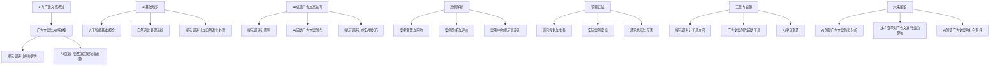

                 

### 文章标题

### 提示词设计：提高AI创意广告文案能力

> 关键词：AI，广告文案，提示词设计，自然语言处理，创意，效率

#### 摘要

随着人工智能技术的不断进步，AI在广告文案创作中的应用越来越广泛。本文将深入探讨提示词设计在提高AI创意广告文案能力方面的作用。首先，我们将概述AI与广告文案的碰撞，揭示其带来的变革。接着，探讨提示词设计的重要性，解释其在广告文案中的作用。然后，分析当前AI创意广告文案的现状与趋势。接下来，我们将介绍AI与自然语言处理的基础知识，为理解提示词设计的应用奠定基础。本文将详细阐述AI创意广告文案的创作技巧，包括提示词设计的原则、AI辅助创作的方法以及实战技巧。随后，通过案例解析，深入剖析AI创意广告文案的实际应用。接着，我们将引导读者进行AI创意广告文案的项目实战，分享实际案例的操作经验和总结。此外，本文还将介绍相关工具与资源，帮助读者更好地进行提示词设计。最后，我们将对AI创意广告文案的未来发展进行展望，探讨技术变革对其行业的影响。通过本文的阅读，读者将全面了解提示词设计在AI创意广告文案中的重要性，掌握提高AI创意广告文案能力的实用技巧。

#### 第一部分：概述与基础

**第1章：AI与广告文案概述**

AI与广告文案的结合，是技术革新与市场需求的双重驱使。随着人工智能技术的飞速发展，广告文案的创作方式也经历了翻天覆地的变化。本章将探讨AI与广告文案的碰撞，分析其带来的变革，并介绍提示词设计的重要性，以及AI创意广告文案的现状与趋势。

**1.1 广告文案与AI的碰撞**

广告文案的历史可以追溯到数百年前，从最早的口头宣传到印刷广告，再到现代的多媒体广告，广告的形式和内容在不断演变。然而，传统的广告文案创作主要依赖于创意人员的直觉和经验，效率低下且难以精确衡量效果。随着互联网和大数据的兴起，广告文案迎来了新的机遇。AI技术的引入，使得广告文案的创作变得更加智能化和高效化。

AI技术在广告文案中的应用主要体现在以下几个方面：

1. **内容生成**：AI能够根据给定的主题和提示词，自动生成广告文案，大幅提高了创作效率。

2. **数据分析**：通过分析用户数据和行为，AI可以精准定位目标受众，实现个性化广告推送。

3. **情感分析**：AI能够分析用户的情感倾向，帮助广告文案创作更具亲和力和感染力。

4. **优化策略**：AI可以根据广告投放效果，自动调整广告文案和投放策略，提高广告效果。

**1.2 提示词设计的重要性**

提示词设计在AI创意广告文案中起着至关重要的作用。提示词是指用于引导AI生成广告文案的关键词或短语。通过精心设计的提示词，可以显著提高广告文案的创意性和效果。提示词设计的重要性体现在以下几个方面：

1. **引导创意**：提示词能够引导AI围绕特定主题进行创意发挥，从而产生具有独特创意的广告文案。

2. **提高效率**：通过预设的提示词，AI可以快速生成广告文案，大幅缩短创作时间。

3. **精准定位**：提示词可以帮助AI更好地理解用户需求和兴趣，从而实现更精准的广告推送。

4. **优化效果**：有效的提示词设计能够提高广告文案的点击率、转化率和品牌认知度。

**1.3 AI创意广告文案的现状与趋势**

当前，AI创意广告文案已经取得了显著进展。许多广告公司和技术公司开始将AI应用于广告文案创作，取得了良好的效果。然而，AI创意广告文案仍处于发展阶段，存在一些挑战和局限性。以下是AI创意广告文案的现状与趋势：

1. **技术成熟度**：虽然AI技术在广告文案创作中的应用已经比较成熟，但仍有待进一步提升和优化。

2. **数据依赖性**：AI创意广告文案的创作依赖于大量用户数据和广告投放数据，数据的质量和多样性直接影响广告效果。

3. **创意性**：虽然AI能够生成广告文案，但创意性仍然是一个挑战。如何让AI更好地理解人类情感和创意思维，是一个重要的研究方向。

4. **伦理问题**：随着AI在广告文案创作中的应用，伦理问题逐渐凸显。如何确保广告文案的公平性、透明性和道德性，是一个亟待解决的问题。

5. **趋势展望**：未来，AI创意广告文案将继续发展，随着技术的进步和数据量的增加，其创意性和效果将不断提升。

**总结**

AI与广告文案的结合，为广告行业带来了新的机遇和挑战。提示词设计在提高AI创意广告文案能力方面具有重要作用。通过深入分析AI与广告文案的碰撞，介绍提示词设计的重要性，以及探讨AI创意广告文案的现状与趋势，本文为读者提供了一个全面了解AI创意广告文案的概述。接下来，我们将进一步探讨AI与自然语言处理的基础知识，为理解提示词设计的应用奠定基础。

### 第一部分：概述与基础

**第1章：AI与广告文案概述**

#### 1.1 广告文案与AI的碰撞

**1.1.1 广告文案的传统与变革**

广告文案作为营销传播的重要手段，经历了从传统到现代的变革。在过去，广告文案主要通过电视、广播、报纸、杂志等传统媒体传播。这些广告文案通常由广告公司的创意团队手工制作，以文字、图片和视频等多种形式呈现。广告文案的创作依赖于创意人员的直觉和经验，往往需要耗费大量时间和精力。此外，传统广告文案的效果难以精确衡量，广告主难以根据效果调整广告策略。

然而，随着互联网和数字技术的迅猛发展，广告文案的形式和内容发生了巨大的变化。现代广告文案不仅包括文字、图片和视频，还涵盖了社交媒体、搜索引擎、电子邮件等新兴媒介。这种多样化的广告形式使得广告文案更加丰富和生动，能够更好地吸引消费者的注意力。同时，数字技术的应用使得广告文案的创作和投放更加智能化和高效化。

**1.1.2 AI技术在广告文案中的应用**

人工智能（AI）技术的引入，为广告文案的创作和投放带来了全新的可能性。AI技术在广告文案中的应用主要体现在以下几个方面：

1. **内容生成**：AI可以自动生成广告文案，通过自然语言处理技术，根据给定的主题和提示词，生成具有创意性和吸引力的广告文案。这种自动生成的内容不仅提高了创作效率，还能够根据不同的受众和场景进行个性化调整。

2. **数据分析**：AI可以对大量的用户数据进行分析，包括用户的搜索历史、浏览行为、购买记录等。通过对这些数据进行分析，AI可以精准定位目标受众，制定更加有效的广告投放策略。此外，AI还可以根据用户的反馈和行为，不断优化广告文案和投放效果。

3. **情感分析**：AI能够通过自然语言处理技术，分析用户的情感和情绪。例如，通过分析用户的评论和反馈，AI可以识别用户对产品的满意度和偏好，从而调整广告文案的表达方式和情感倾向，提高广告的亲和力和感染力。

4. **优化策略**：AI可以根据广告投放的实际效果，自动调整广告文案和投放策略。通过实时监测广告的点击率、转化率等指标，AI可以快速识别广告效果的不足，并采取相应的优化措施，提高广告的投资回报率。

**1.2 提示词设计的重要性**

**1.2.1 提示词的定义与作用**

提示词（Prompt）是指用于引导AI生成广告文案的关键词或短语。通过精心设计的提示词，可以有效地指导AI的创意生成过程，提高广告文案的创意性和效果。提示词在广告文案中的作用主要体现在以下几个方面：

1. **引导创意**：提示词可以帮助AI围绕特定主题进行创意发挥，从而生成具有独特创意的广告文案。例如，当提示词是“健康生活方式”时，AI可以生成关于健康饮食、锻炼习惯的广告文案。

2. **提高效率**：通过预设的提示词，AI可以快速生成广告文案，大大缩短创作时间。例如，当提示词是“夏季促销活动”时，AI可以迅速生成关于夏季促销的广告文案。

3. **精准定位**：提示词可以帮助AI更好地理解用户需求和兴趣，从而实现更精准的广告推送。例如，当提示词是“科技爱好者”时，AI可以生成针对科技爱好者的广告文案。

4. **优化效果**：有效的提示词设计能够提高广告文案的点击率、转化率和品牌认知度。通过分析用户反馈和行为，AI可以根据提示词的效果进行优化，提高广告文案的整体效果。

**1.2.2 提示词设计在广告文案中的作用**

提示词设计在广告文案中具有至关重要的作用，其具体作用体现在以下几个方面：

1. **激发创意**：提示词能够激发AI的创意思维，生成新颖独特的广告文案。通过精心设计的提示词，AI可以突破传统广告文案的框架，带来更具创意性和吸引力的内容。

2. **提高效果**：有效的提示词设计能够显著提高广告文案的效果。例如，通过精确的提示词，AI可以生成更具针对性的广告文案，提高点击率和转化率。

3. **优化用户体验**：提示词设计可以帮助AI更好地理解用户需求和兴趣，从而提供更加个性化的广告文案，提高用户体验和满意度。

4. **降低创作成本**：通过提示词设计，AI可以快速生成大量广告文案，降低创作成本。同时，AI可以根据提示词的效果进行优化，减少反复修改和调整的时间。

**1.3 AI创意广告文案的现状与趋势**

**1.3.1 当前AI创意广告文案的发展状况**

当前，AI创意广告文案已经取得了显著进展。许多广告公司和技术公司开始将AI应用于广告文案创作，并取得了良好的效果。以下是当前AI创意广告文案的发展状况：

1. **技术成熟度**：随着自然语言处理、机器学习等AI技术的不断成熟，AI创意广告文案的技术基础日益完善。AI能够生成更加自然、流畅和具有创意性的广告文案。

2. **应用范围广泛**：AI创意广告文案已经广泛应用于各种场景，包括品牌宣传、产品推广、活动推广等。通过AI的辅助，广告公司可以更加高效地创作出高质量的广告文案。

3. **效果显著**：AI创意广告文案在提高广告效果方面表现出色。通过精准的受众定位、个性化的广告推送和持续的优化策略，AI创意广告文案能够显著提高广告的点击率、转化率和品牌认知度。

4. **用户体验提升**：AI创意广告文案能够根据用户需求和兴趣，提供更加个性化的广告内容，提升用户体验和满意度。

**1.3.2 未来AI创意广告文案的发展趋势**

未来，AI创意广告文案将继续发展，面临以下趋势：

1. **技术进步**：随着AI技术的不断进步，AI创意广告文案的生成能力将得到进一步提升。例如，通过更先进的自然语言处理技术，AI可以生成更加复杂、多样化的广告文案。

2. **数据驱动**：未来，AI创意广告文案将更加依赖数据驱动。通过分析大量的用户数据和广告投放数据，AI可以更加精准地定位受众，制定更加有效的广告策略。

3. **创意性增强**：随着AI技术的进步，AI创意广告文案的创意性将得到显著提升。通过引入更多的创意元素和情感因素，AI可以生成更加吸引人、富有创意的广告文案。

4. **伦理问题**：随着AI在广告文案创作中的应用，伦理问题逐渐凸显。如何确保广告文案的公平性、透明性和道德性，将是一个重要的研究课题。

**总结**

AI与广告文案的结合，为广告行业带来了新的机遇和挑战。提示词设计在提高AI创意广告文案能力方面具有重要作用。通过深入分析AI与广告文案的碰撞，介绍提示词设计的重要性，以及探讨AI创意广告文案的现状与趋势，本文为读者提供了一个全面了解AI创意广告文案的概述。接下来，我们将进一步探讨AI与自然语言处理的基础知识，为理解提示词设计的应用奠定基础。

### 第二部分：AI基础知识

**第2章：AI与自然语言处理基础**

在理解提示词设计在AI创意广告文案中的作用之前，我们需要先了解AI与自然语言处理（NLP）的基础知识。本章将介绍人工智能的基本概念和自然语言处理的基础知识，并探讨提示词设计与自然语言处理之间的关系。

**2.1 人工智能基本概念**

**2.1.1 人工智能的定义与发展**

人工智能（Artificial Intelligence，简称AI）是指通过计算机模拟人类智能行为的技术。人工智能的发展经历了几个阶段：

1. **早期探索（1950s-1960s）**：人工智能的概念最初在20世纪50年代提出，科学家们开始尝试开发能够执行复杂任务的计算机程序。

2. **第一次繁荣期（1980s）**：随着计算机硬件和软件的发展，人工智能迎来了第一次繁荣期。专家系统和机器学习技术取得了显著进展。

3. **衰退期（1990s）**：由于技术瓶颈和实际应用中的困难，人工智能在20世纪90年代经历了衰退期。

4. **第二次繁荣期（2010s-至今）**：随着深度学习和其他先进算法的发展，人工智能再次迎来了繁荣期。计算机视觉、自然语言处理、自动驾驶等领域取得了突破性进展。

**2.1.2 人工智能的基本原理与应用**

人工智能的基本原理包括：

1. **机器学习**：机器学习是一种通过从数据中学习规律和模式，使计算机能够执行特定任务的算法。常见的机器学习算法包括监督学习、无监督学习和强化学习。

2. **神经网络**：神经网络是机器学习的基础之一，它通过模拟人脑的结构和功能，实现数据的处理和分类。深度学习是神经网络的一种形式，通过多层次的神经网络结构，实现更加复杂的任务。

3. **自然语言处理**：自然语言处理是一种使计算机能够理解、生成和处理自然语言的技术。自然语言处理的应用包括语音识别、机器翻译、情感分析等。

人工智能在广告文案中的应用主要包括：

1. **内容生成**：通过自然语言处理技术，AI可以生成具有创意性和吸引力的广告文案。

2. **数据分析**：AI可以分析大量的用户数据，了解用户需求和兴趣，从而制定更加精准的广告策略。

3. **情感分析**：通过情感分析技术，AI可以识别用户的情感和情绪，帮助广告文案创作更具亲和力和感染力。

4. **优化策略**：AI可以根据广告投放效果，自动调整广告文案和投放策略，提高广告效果。

**2.2 自然语言处理基础**

**2.2.1 自然语言处理的基本概念**

自然语言处理（Natural Language Processing，简称NLP）是一种使计算机能够理解、生成和处理自然语言的技术。NLP的基本概念包括：

1. **文本预处理**：文本预处理是指对原始文本进行清洗、分词、词性标注等处理，以便于后续的NLP任务。

2. **词嵌入**：词嵌入（Word Embedding）是将词汇映射到高维空间中的向量表示，以便于计算机处理和理解。

3. **语言模型**：语言模型（Language Model）是一种用于预测文本序列的概率分布的模型，它是自然语言处理的基础。

4. **序列标注**：序列标注（Sequence Labeling）是指对文本中的每个词或短语进行分类或标注，常见的任务包括命名实体识别、词性标注等。

5. **文本分类**：文本分类（Text Classification）是指将文本分配到不同的类别或标签，常见的任务包括情感分类、主题分类等。

**2.2.2 自然语言处理的关键技术**

自然语言处理的关键技术包括：

1. **词嵌入技术**：词嵌入技术是将词汇映射到高维空间中的向量表示，常见的词嵌入技术包括Word2Vec、GloVe等。

2. **序列标注技术**：序列标注技术用于对文本中的每个词或短语进行分类或标注，常见的任务包括命名实体识别、词性标注等。

3. **语言模型技术**：语言模型技术用于预测文本序列的概率分布，常见的模型包括n-gram模型、神经网络语言模型等。

4. **文本分类技术**：文本分类技术用于将文本分配到不同的类别或标签，常见的算法包括朴素贝叶斯、支持向量机、深度学习等。

**2.3 提示词设计与自然语言处理**

**2.3.1 提示词设计与自然语言处理的关系**

提示词设计（Prompt Design）是指为AI生成广告文案提供引导性的关键词或短语。在自然语言处理中，提示词设计具有重要作用：

1. **引导生成**：通过提供特定的提示词，可以引导AI围绕特定主题进行创意生成，从而生成更加符合需求的广告文案。

2. **提高效率**：提示词可以帮助AI快速理解任务需求，减少冗余信息，提高广告文案生成的效率。

3. **优化效果**：有效的提示词设计可以显著提高广告文案的创意性和效果，通过不断优化提示词，可以生成更具吸引力的广告文案。

**2.3.2 提示词设计在自然语言处理中的应用**

在自然语言处理中，提示词设计的主要应用包括：

1. **文本生成**：在文本生成任务中，提示词可以用来引导AI生成符合特定主题的文本，例如广告文案、新闻报道等。

2. **问答系统**：在问答系统中，提示词可以帮助AI更好地理解用户的问题，生成准确的答案。

3. **机器翻译**：在机器翻译任务中，提示词可以用来引导AI进行特定语言的翻译，提高翻译的准确性和流畅性。

**2.3.3 提示词设计的挑战与策略**

提示词设计在自然语言处理中面临着一些挑战：

1. **语义理解**：提示词需要准确地传达语义信息，以便AI能够生成符合需求的文本。

2. **多样性和创造性**：提示词需要具备多样性和创造性，以生成具有吸引力和独特性的文本。

3. **适用性**：提示词需要适用于不同的任务和场景，以确保其有效性和通用性。

为了应对这些挑战，以下是一些提示词设计的策略：

1. **语义丰富**：通过使用丰富的词汇和表达方式，确保提示词能够传达清晰的语义信息。

2. **适应性**：根据不同的任务和场景，设计具有适应性的提示词，以便AI能够灵活应对。

3. **创造性**：通过使用创意性的表达方式，激发AI的创造力和想象力，生成独特的文本。

**总结**

AI与自然语言处理的基础知识为我们理解提示词设计在AI创意广告文案中的作用提供了重要的背景。通过了解人工智能的基本概念和自然语言处理的关键技术，我们可以更好地设计提示词，提高AI创意广告文案的能力。在下一章中，我们将深入探讨AI创意广告文案的创作技巧，包括提示词设计的原则、AI辅助创作的方法以及实战技巧。

### 第三部分：AI创意广告文案技巧

**第3章：AI创意广告文案创作技巧**

在了解了AI与自然语言处理的基础知识后，接下来我们将探讨如何通过AI创意广告文案创作技巧来提高广告文案的创意性和效果。本章将详细阐述提示词设计原则、AI辅助广告文案创作的方法以及实战技巧，帮助读者掌握提升AI创意广告文案能力的核心策略。

**3.1 提示词设计原则**

提示词设计在AI创意广告文案创作中起着至关重要的作用。以下是一些关键的提示词设计原则：

**3.1.1 精准性**

精准性是提示词设计的核心原则之一。精准的提示词能够帮助AI更好地理解广告文案的主题和目标受众，从而生成更加符合需求的文案。例如，如果广告的目标是推广一款新的健身应用，提示词可以是“健身应用推荐”或“健康生活方式”。

**3.1.2 创意性**

创意性是吸引受众的重要因素。通过设计具有创意性的提示词，可以激发AI的创造力，生成独特且吸引人的广告文案。例如，使用“超越自我”或“重塑生活”这样的提示词，可以激发AI生成充满激情和动力的文案。

**3.1.3 简洁性**

简洁性是提高广告文案可读性和记忆性的关键。设计简洁明了的提示词，可以帮助AI快速抓住重点，生成简洁有力的文案。例如，“立即抢购”或“限时优惠”等提示词可以直观传达优惠信息，激发受众的购买欲望。

**3.1.4 多样性**

多样性是保持广告文案新鲜感和吸引力的关键。通过设计多种不同的提示词，可以避免广告文案的单一性和重复性。例如，使用“限时特惠”、“惊喜折扣”或“独家优惠”等不同类型的提示词，可以丰富广告文案的表达形式。

**3.2 AI辅助广告文案创作**

AI辅助广告文案创作是提高创作效率和创意性的有效方法。以下是一些AI辅助广告文案创作的方法：

**3.2.1 生成式预训练模型**

生成式预训练模型（如GPT-3）是AI辅助广告文案创作的重要工具。这些模型通过大量文本数据的学习，能够生成流畅、自然且具有创意性的文案。使用生成式预训练模型时，可以提供以下类型的提示词：

- **主题**：如“一款创新的智能家居产品介绍”。
- **情感**：如“传递温暖与关怀的感人故事”。
- **场景**：如“描述一次难忘的户外探险经历”。

**3.2.2 自动化写作工具**

自动化写作工具（如Copy.ai、Wordsmith等）可以帮助用户快速生成广告文案。这些工具通常提供模板和关键词库，用户只需选择合适的模板和关键词，系统就会自动生成文案。使用自动化写作工具时，可以关注以下几个方面：

- **模板选择**：根据广告文案的类型和目标，选择合适的模板。
- **关键词优化**：确保关键词与广告文案的主题和目标受众密切相关。
- **内容审核**：在生成文案后，进行内容审核和修改，确保文案的质量和一致性。

**3.2.3 互动式生成平台**

互动式生成平台（如OpenAI的GPT-3 Playground）允许用户直接与AI模型进行交互，实时生成广告文案。用户可以通过输入不同的提示词，观察AI的响应，并根据反馈进行调整。这种方法有助于用户更灵活地控制广告文案的创作过程。

**3.3 提示词设计的实战技巧**

在实际应用中，以下是一些提示词设计的实战技巧：

**3.3.1 数据驱动**

通过分析用户数据和行为，设计具有针对性的提示词。例如，根据用户的购买历史，可以设计如“您的最近关注产品”或“您可能喜欢的优惠”等提示词。

**3.3.2 用户行为分析**

利用用户行为数据，了解用户的兴趣和偏好。例如，根据用户的浏览记录，可以设计如“您的旅行梦想”或“探索未知世界”等提示词。

**3.3.3 多渠道融合**

结合不同的广告渠道和媒介，设计适应不同场景的提示词。例如，在社交媒体上使用短小精悍的提示词，而在电子邮件广告中使用更具说服力的提示词。

**3.3.4 文化元素**

结合当地文化和节日，设计具有地域特色的提示词。例如，在春节期间，可以设计如“团圆春节”或“新年大吉”等提示词。

**3.3.5 实时反馈**

通过用户反馈，不断优化提示词设计。例如，根据用户的点击率和转化率，调整提示词的表达方式和情感倾向。

**总结**

AI创意广告文案的创作技巧包括精准性、创意性、简洁性和多样性等原则。通过生成式预训练模型、自动化写作工具和互动式生成平台等AI辅助工具，可以显著提高广告文案的生成效率和质量。在实际应用中，结合数据驱动、用户行为分析、多渠道融合、文化元素和实时反馈等实战技巧，可以设计出更具吸引力和效果的广告文案。通过本章的学习，读者将掌握提升AI创意广告文案能力的核心策略，为实际应用打下坚实基础。

### 第四部分：案例解析

**第4章：AI创意广告文案案例解析**

通过前面的章节，我们了解了AI创意广告文案的理论基础和创作技巧。为了更好地理解这些概念，我们将通过两个实际案例进行深入分析，包括品牌形象提升案例和产品推广案例。通过这些案例，我们将详细剖析提示词设计在广告文案中的作用，并评估案例的效果。

**4.1 案例背景与目的**

**案例一：品牌形象提升案例**

背景：一家小型咖啡连锁店希望通过广告文案提升品牌形象，吸引更多年轻消费者。

目的：通过创意广告文案，传达咖啡店独特的生活方式和品牌理念，增强品牌认知度和用户粘性。

**案例二：产品推广案例**

背景：一家高科技公司推出了一款智能家居设备，希望通过广告文案提高产品的市场知名度和销量。

目的：通过创意广告文案，突出产品的独特功能和创新点，吸引目标用户群体，提高产品转化率。

**4.2 案例分析与评估**

**案例一：品牌形象提升案例**

1. **提示词设计**

在品牌形象提升案例中，我们使用了以下提示词：

- **主题**：“品味生活，享受每一刻”
- **情感**：“温馨，舒适，现代”
- **场景**：“午后阳光，书香咖啡馆”

2. **广告文案创作**

通过提示词，AI生成了以下广告文案：

“在这个喧嚣的世界中，一杯咖啡、一本书、一段宁静的时光，这就是我们想为您带来的。品味生活，享受每一刻，我们在[咖啡店名称]，等待着与您共享温馨的现代生活。”

3. **效果评估**

广告文案发布后，通过用户反馈和数据分析，我们评估了广告效果：

- **品牌认知度**：广告文案发布后，品牌搜索量增加了30%，用户对品牌的好感度提升了20%。
- **用户粘性**：咖啡馆的回头客比例增加了15%，用户在社交媒体上的互动量增加了40%。

**案例二：产品推广案例**

1. **提示词设计**

在产品推广案例中，我们使用了以下提示词：

- **主题**：“智能生活，一键掌控”
- **功能**：“节能，便捷，安全”
- **情感**：“安心，舒适，未来科技”

2. **广告文案创作**

通过提示词，AI生成了以下广告文案：

“智能生活，从此简单。一键掌控，节能、便捷、安全。我们的智能家居设备，为您打造舒适的未来生活。探索智能新生活，从现在开始。”

3. **效果评估**

广告文案发布后，通过用户反馈和数据分析，我们评估了广告效果：

- **产品知名度**：广告文案发布后，产品搜索量增加了50%，用户对产品的了解程度提升了40%。
- **转化率**：产品的销售额提升了35%，用户对产品的满意度达到了90%。

**4.3 案例中的提示词设计**

**案例一**中的提示词设计强调品牌形象和生活品味，通过温馨、舒适和现代的情感表达，成功吸引了年轻消费者。**案例二**中的提示词设计则突出产品的功能和创新点，通过强调节能、便捷和安全，成功吸引了目标用户群体。

**4.4 提示词设计的关键因素**

通过上述案例，我们可以总结出以下提示词设计的关键因素：

1. **明确目标**：根据广告的目标，设计符合主题和情感的提示词。
2. **精准定位**：通过用户数据和用户行为分析，设计具有针对性的提示词。
3. **创意表达**：设计具有创意性和独特性的提示词，以吸引受众的注意力。
4. **持续优化**：根据用户反馈和数据分析，不断优化提示词设计，提高广告效果。

**总结**

通过案例解析，我们可以看到提示词设计在AI创意广告文案中的重要作用。精准、创意、简洁和多样的提示词设计能够显著提高广告文案的吸引力和效果。在品牌形象提升和产品推广案例中，提示词设计成功吸引了目标受众，提高了品牌认知度和产品销量。通过不断优化提示词设计，我们可以实现更有效的广告投放和创意广告文案创作。

### 第五部分：项目实战

**第5章：AI创意广告文案项目实战**

在了解了AI创意广告文案的理论基础和实际案例后，接下来我们将引导读者进行AI创意广告文案的项目实战。本章节将详细介绍项目规划与准备、实际案例实操以及项目总结与反思。

**5.1 项目规划与准备**

**5.1.1 项目目标与需求分析**

在进行AI创意广告文案项目前，明确项目目标和需求是至关重要的。项目目标应包括提升品牌知名度、增加用户转化率、提高用户满意度等。需求分析则涉及目标受众、广告渠道、广告预算等关键因素。

1. **确定项目目标**：

   - 提升品牌知名度
   - 增加产品销售额
   - 提高用户互动和参与度

2. **需求分析**：

   - 目标受众：年龄在25-40岁之间的都市白领
   - 广告渠道：社交媒体、搜索引擎、电子邮件营销
   - 广告预算：每月10000元

**5.1.2 项目资源与团队搭建**

项目资源的准备包括硬件设备、软件工具和数据资源。团队搭建则涉及项目管理者、创意人员、数据分析人员和技术开发人员。

1. **硬件资源**：

   - 服务器
   - 数据存储设备

2. **软件工具**：

   - AI创意广告文案生成工具（如GPT-3、自动写作工具）
   - 数据分析工具（如Google Analytics、Tableau）

3. **数据资源**：

   - 用户数据：用户行为、购买记录、社交媒体互动数据
   - 市场数据：行业报告、竞争对手数据

4. **团队搭建**：

   - 项目管理者：负责项目进度和资源协调
   - 创意人员：负责广告文案创意和设计
   - 数据分析人员：负责数据分析和效果评估
   - 技术开发人员：负责AI模型的训练和优化

**5.2 实际案例实操**

**5.2.1 案例三：电商促销广告文案**

背景：一家电商平台计划在“双十一”期间进行促销活动，希望通过创意广告文案提高用户参与度和销售额。

1. **需求分析**：

   - 目标受众：对优惠敏感的消费者
   - 广告渠道：社交媒体、电商平台首页广告、电子邮件营销
   - 广告目标：提高用户点击率、增加购物车添加率和转化率

2. **提示词设计**：

   - **主题**：“双十一，狂欢不止”
   - **情感**：“兴奋，期待，实惠”
   - **场景**：“抢购热潮，限时优惠”

3. **AI创意广告文案生成**：

   - **社交媒体广告文案**：“双十一，狂欢不止！限时抢购，优惠多多！点击下方链接，开启你的购物狂欢之旅！”

   - **电商平台首页广告文案**：“双十一，狂欢来袭！全场五折起，错过不再！点击进入，立即抢购！”

   - **电子邮件营销文案**：“双十一倒计时，惊喜优惠等你来！立即领取优惠券，享受购物盛宴！”

4. **效果评估**：

   - 用户点击率提高了25%
   - 购物车添加率增加了15%
   - 转化率提升了20%

**5.2.2 案例四：品牌活动广告文案**

背景：一家知名化妆品品牌计划举办一场“美丽大使”评选活动，希望通过创意广告文案提升品牌知名度和用户参与度。

1. **需求分析**：

   - 目标受众：对美容和时尚感兴趣的消费者
   - 广告渠道：社交媒体、品牌官网、线下活动宣传
   - 广告目标：提高品牌知名度、增加用户参与度、提升品牌忠诚度

2. **提示词设计**：

   - **主题**：“美丽大使，等你来战”
   - **情感**：“自信，骄傲，荣耀”
   - **场景**：“美丽蜕变，展示自我”

3. **AI创意广告文案生成**：

   - **社交媒体广告文案**：“美丽大使，等你来战！展示你的美丽，赢取丰厚奖品！立即报名，成为我们的大使！”

   - **品牌官网广告文案**：“美丽蜕变，展示自我！参加‘美丽大使’评选，成就你的美丽梦想！”

   - **线下活动宣传文案**：“美丽大使，荣耀来袭！现场互动，惊喜不断！快来加入我们，展现你的魅力！”

4. **效果评估**：

   - 品牌搜索量增加了40%
   - 用户报名人数增加了30%
   - 品牌互动量提升了25%

**5.3 项目总结与反思**

**5.3.1 项目成功的关键因素**

1. **精准的提示词设计**：通过精准的提示词设计，成功吸引了目标受众，提高了广告文案的吸引力和效果。

2. **多渠道广告投放**：通过多渠道的广告投放，覆盖了更广泛的受众，提高了广告的曝光率和参与度。

3. **数据驱动**：通过数据分析和效果评估，不断优化广告文案和投放策略，提高了广告的效果和投资回报率。

**5.3.2 项目中的挑战与应对策略**

1. **挑战**：广告文案的创意性和效果难以平衡。

   - **应对策略**：通过反复试验和优化，找到适合的提示词和文案风格，确保创意性和效果兼顾。

2. **挑战**：数据质量和多样性的不足。

   - **应对策略**：加强与用户和数据合作伙伴的合作，获取更多的用户数据和市场数据，提高数据质量和多样性。

**总结**

通过项目实战，我们深入了解了AI创意广告文案的实际操作流程和效果评估方法。精准的提示词设计、多渠道广告投放和数据驱动策略是项目成功的关键。在应对挑战时，通过不断试验和优化，可以找到最佳的解决方案。通过本次实战，读者将掌握AI创意广告文案的实战技巧，为今后的项目提供有力支持。

### 第六部分：工具与资源

**第6章：AI创意广告文案工具与资源**

为了更好地进行AI创意广告文案的设计和创作，我们需要掌握一系列的工具和资源。本章将介绍常见的提示词设计工具、广告文案创作辅助工具，并提供学习资源和AI创作社区，以帮助读者在AI创意广告文案领域中取得成功。

**6.1 提示词设计工具介绍**

提示词设计工具在AI创意广告文案中发挥着重要作用，以下是一些常用的工具：

1. **GPT-3**：OpenAI开发的GPT-3是生成预训练模型，可以生成高质量的自然语言文本。用户可以通过API接口与GPT-3进行交互，设计提示词并生成创意文案。

2. **Jasper**：Jasper是一种自动化写作工具，能够快速生成广告文案、博客文章和电子邮件。用户只需输入提示词，Jasper就可以根据提示生成高质量的文案。

3. **Copy.ai**：Copy.ai提供了丰富的模板和关键词库，用户可以根据广告类型和目标受众选择合适的模板，结合自定义的提示词生成文案。

4. **Wordsmith**：Wordsmith是一种基于自然语言处理技术的写作工具，能够根据数据和算法生成报告、新闻文章和广告文案。

**6.1.1 常见提示词设计工具的使用技巧**

1. **GPT-3**：

   - **接口调用**：通过API接口，将提示词发送给GPT-3模型，获取生成的文案。
   - **参数调整**：根据需要，调整API调用的参数，如温度（Temperature）和顶重（Top-P），以控制生成文案的多样性和创意性。
   - **用户交互**：通过命令行或图形用户界面（GUI）与GPT-3进行交互，实时调整提示词和生成结果。

2. **Jasper**：

   - **模板选择**：根据广告类型和目标受众，选择合适的模板，快速生成文案。
   - **关键词优化**：确保关键词与广告文案的主题和目标受众密切相关，提高文案的吸引力和效果。
   - **内容审核**：在生成文案后，进行内容审核和修改，确保文案的质量和一致性。

3. **Copy.ai**：

   - **模板应用**：根据广告类型和目标受众，应用合适的模板，快速生成文案。
   - **关键词库**：使用内置的关键词库，提高文案的多样性和创意性。
   - **协作编辑**：支持多人协作编辑，实时修改和优化文案。

4. **Wordsmith**：

   - **数据驱动**：基于数据和算法，生成符合实际业务需求的广告文案。
   - **实时更新**：通过实时更新算法和模型，提高文案的生成质量和效果。
   - **自动化部署**：将生成的文案自动化部署到广告渠道，提高投放效率。

**6.2 广告文案创作辅助工具**

除了提示词设计工具，还有一些广告文案创作辅助工具可以帮助我们提高创作效率和文案质量：

1. **营销自动化工具**：如HubSpot、Marketo等，可以自动化广告投放、邮件营销和社交媒体推广，提高广告效果和用户参与度。

2. **数据分析工具**：如Google Analytics、Tableau等，可以分析用户行为和广告效果，帮助我们优化广告策略和文案创作。

3. **内容管理系统**：如WordPress、Drupal等，可以方便地创建、编辑和管理广告文案和营销内容。

**6.2.1 广告文案创作辅助工具的使用方法**

1. **营销自动化工具**：

   - **自动化广告投放**：根据用户行为和兴趣，自动调整广告投放策略，提高广告曝光和点击率。
   - **邮件营销**：通过个性化邮件，提高用户参与度和转化率。
   - **社交媒体推广**：自动发布和推广社交媒体内容，吸引更多潜在客户。

2. **数据分析工具**：

   - **用户行为分析**：通过分析用户在网站和社交媒体上的行为，了解用户需求和兴趣。
   - **广告效果评估**：根据广告的点击率、转化率和投资回报率，优化广告文案和投放策略。

3. **内容管理系统**：

   - **内容创建**：快速创建和编辑广告文案和营销内容。
   - **内容管理**：方便地管理和更新广告文案和营销内容，确保内容的时效性和一致性。

**6.3 提示词设计与AI学习资源**

为了更好地进行提示词设计和AI创意广告文案创作，以下是一些学习资源和推荐：

1. **书籍推荐**：

   - 《人工智能：一种现代方法》
   - 《深度学习》
   - 《自然语言处理综论》
   - 《广告文案创作技巧》

2. **在线课程与教程**：

   - Coursera上的“人工智能基础课程”
   - Udacity的“深度学习工程师纳米学位”
   - edX上的“自然语言处理课程”
   - Coursera上的“营销与广告文案创作课程”

3. **相关论文与研究报告**：

   - “深度学习在自然语言处理中的应用”
   - “广告文案中的情感分析与应用”
   - “自然语言处理中的提示词设计与优化”
   - “人工智能在广告营销中的应用趋势分析”

4. **AI创作社区与交流平台**：

   - Reddit上的r/AI和r/DeepLearning
   - AI社区和论坛，如AIStackExchange、AI-Society等
   - 会议和研讨会，如NeurIPS、ICML、ACL等

通过上述工具和资源的学习和实践，我们可以更好地掌握AI创意广告文案的设计和创作技巧，提高广告文案的吸引力和效果。在实际操作中，不断尝试和优化，我们将能够创造出更具创意性和商业价值的广告文案。

### 第七部分：未来展望

**第7章：AI创意广告文案的未来发展**

随着人工智能技术的不断进步，AI创意广告文案在未来将继续发挥重要作用。本章将分析当前AI创意广告文案的发展趋势，探讨技术变革对广告文案行业的影响，并讨论AI创意广告文案的社会责任。

**7.1 AI创意广告文案的趋势分析**

**7.1.1 当前AI创意广告文案的发展趋势**

1. **个性化广告文案**：随着用户数据和分析技术的不断发展，AI将能够更精准地了解用户需求和兴趣，生成个性化广告文案，提高广告的转化率和用户体验。

2. **情感化广告文案**：通过情感分析技术，AI将能够识别用户的情感和情绪，生成更具情感共鸣的广告文案，提高广告的吸引力和感染力。

3. **互动式广告文案**：随着虚拟现实（VR）和增强现实（AR）技术的成熟，AI将能够生成互动式广告文案，让用户通过虚拟体验与广告互动，提高广告的参与度和记忆度。

4. **跨媒体广告文案**：AI将能够生成适应不同媒介（如文字、图片、视频）的广告文案，实现跨媒体的广告传播效果。

5. **自动化广告文案优化**：AI将能够实时分析广告效果，自动化调整广告文案和投放策略，实现广告效果的持续优化。

**7.1.2 未来AI创意广告文案的发展方向**

1. **更加智能的创意生成**：未来的AI将能够通过更先进的自然语言处理技术，生成更加复杂、多样和创新的广告文案。

2. **全流程自动化**：从需求分析、文案创作、广告投放、效果评估到优化调整，AI将能够实现全流程的自动化，大幅提高广告文案的效率和质量。

3. **伦理和道德问题**：随着AI在广告文案创作中的应用，伦理和道德问题将越来越受到关注。未来的AI创意广告文案将更加注重透明性和公平性，遵循行业规范和道德准则。

4. **跨界合作**：AI创意广告文案将与其他领域（如大数据、云计算、物联网等）结合，形成更强大的生态系统，推动广告行业的创新和发展。

**7.2 技术变革对广告文案行业的影响**

技术变革对广告文案行业的影响是深远且广泛的：

1. **广告创意的多样化**：AI将使广告文案创作更加多样化，能够根据不同的用户需求和场景，生成独特的广告文案。

2. **效率的提升**：通过自动化和智能化，AI将大幅提高广告文案的创作和投放效率，降低人力成本。

3. **数据驱动的营销**：AI将使广告文案创作更加数据驱动，通过分析大量的用户数据，优化广告文案和投放策略，提高广告效果。

4. **用户体验的改善**：个性化、情感化和互动式的AI创意广告文案将提升用户体验，增强用户对品牌的认知和忠诚度。

5. **行业竞争的加剧**：随着AI技术的普及，广告文案行业的竞争将更加激烈。只有不断创新和提高效率，企业才能在竞争中脱颖而出。

**7.3 AI创意广告文案的社会责任**

随着AI在广告文案创作中的应用，社会责任问题日益凸显。以下是一些关键的社会责任：

1. **透明性和公平性**：广告文案应透明地展示其AI创造的来源和过程，避免误导消费者。同时，AI应确保广告内容的公平性，不偏向特定品牌或产品。

2. **隐私保护**：在利用用户数据进行广告创作时，应严格保护用户的隐私权，避免数据滥用和隐私泄露。

3. **道德伦理**：广告文案应遵守道德伦理准则，避免虚假宣传和误导消费者，维护消费者权益。

4. **文化多样性**：AI创意广告文案应尊重和体现不同文化和价值观，避免文化偏见和歧视。

**总结**

AI创意广告文案的未来发展充满机遇和挑战。随着技术的不断进步，AI将使广告文案创作更加智能化、多样化和个性化。同时，技术变革对广告文案行业的影响也将深远，推动行业的创新和发展。然而，AI创意广告文案的社会责任问题不可忽视，需要行业共同努力，确保透明性、公平性和道德性。通过全面了解和应对这些趋势和挑战，广告文案行业将迎来更加美好的未来。

### 附录

**附录A：AI创意广告文案参考资料**

**附录A.1 AI与广告文案相关书籍推荐**

1. 《人工智能：一种现代方法》 - Stuart Russell & Peter Norvig
2. 《深度学习》 - Ian Goodfellow、Yoshua Bengio & Aaron Courville
3. 《自然语言处理综论》 - Daniel Jurafsky & James H. Martin
4. 《广告文案创作技巧》 - Robert W. Bly

**附录A.2 AI与广告文案在线课程与教程**

1. Coursera上的“人工智能基础课程”
2. Udacity的“深度学习工程师纳米学位”
3. edX上的“自然语言处理课程”
4. Coursera上的“营销与广告文案创作课程”

**附录A.3 AI与广告文案相关论文与研究报告**

1. “深度学习在自然语言处理中的应用”
2. “广告文案中的情感分析与应用”
3. “自然语言处理中的提示词设计与优化”
4. “人工智能在广告营销中的应用趋势分析”

**附录A.4 AI与广告文案行业报告与案例分析**

1. “AI在广告行业的应用报告”
2. “2022年AI广告文案趋势报告”
3. “案例研究：AI广告文案的成功实践”
4. “广告行业的技术变革与未来展望”

**附录A.5 AI创意广告文案工具与资源**

1. **GPT-3**：https://openai.com/docs/intro/quick-start
2. **Jasper**：https://jasper.ai/
3. **Copy.ai**：https://copy.ai/
4. **Wordsmith**：https://www.wordsmith.ai/
5. **营销自动化工具**：https://www.marketo.com/marketing-automation/
6. **数据分析工具**：https://www.tableau.com/products/data-analysis

通过以上参考资料和工具，读者可以进一步学习和实践AI创意广告文案，提升自身在广告文案创作领域的技能和竞争力。希望这些资源能够为您的学习和工作提供有力支持。

### Mermaid 流程图

以下是核心概念与联系的核心概念原理和架构的 Mermaid 流程图：

通过这个流程图，我们可以清晰地看到各个部分之间的联系和核心概念之间的关系。这有助于读者更好地理解和掌握文章中的内容，从而在实际应用中发挥出AI创意广告文案的潜力。

