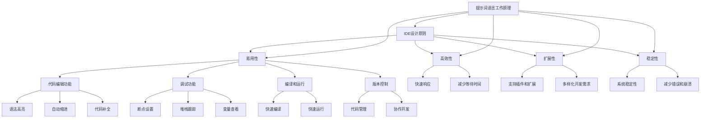

                 

### 文章标题：提示词语言的IDE设计与开发者体验优化

### 关键词：提示词语言、IDE设计、开发者体验、算法原理、数学模型、项目实战

### 摘要：
本文深入探讨了提示词语言在集成开发环境（IDE）中的应用及其对开发者体验的优化。首先，我们介绍了提示词语言的基本概念、历史背景及其重要性。接着，我们详细讲解了IDE的设计原则、开发者体验需求以及提示词语言的工作原理，并通过Mermaid流程图展示了它们之间的核心联系。随后，我们深入剖析了提示词语言的核心算法原理，使用伪代码进行详细阐述，并介绍了相关的数学模型和公式。文章的最后，通过一个实际的项目案例，展示了如何设计并优化提示词语言的IDE，包括环境搭建、源代码实现和解读，并分析了项目中的最佳实践和注意事项。本文旨在为读者提供一个全面、系统的提示词语言IDE设计与开发者体验优化的指导。

### 引言：提示词语言的概念与历史

提示词语言（Keyword Language）是一种编程语言，其核心特点是通过一系列预定义的关键词来指导计算机执行特定任务。这种语言形式简洁、直观，便于程序员编写和阅读，是现代软件开发的基础。提示词语言的发展可以追溯到20世纪50年代末和60年代初，当时为了解决计算机编程的复杂性问题，编程语言开始逐步从机器语言和汇编语言向高级语言演变。

提示词语言的第一个重要里程碑是1957年出现的ALGOL 58，它引入了大量的关键词，标志着编程语言进入了现代时代。随后，1960年，COBOL语言问世，成为第一个商业上成功的提示词语言，广泛用于商业数据处理。在接下来的几十年中，诸如FORTRAN、Pascal、C、Java等提示词语言相继出现，每种语言都有其独特的特点和适用场景。

随着计算机技术的发展，IDE（Integrated Development Environment）逐渐成为软件开发过程中不可或缺的一部分。IDE不仅提供了一个统一的平台来编写、编译和运行代码，还集成了丰富的工具，如代码补全、语法高亮、调试器等，大大提升了开发者的效率和体验。IDE的设计原则通常包括易用性、高效性、扩展性和稳定性。

开发者体验（Developer Experience，简称DX）是衡量IDE质量的重要标准。一个优秀的IDE应当具备以下特点：简洁直观的界面设计、快速响应的操作体验、强大的代码编辑和调试功能、良好的扩展性和社区支持。提升开发者体验不仅能提高代码质量和开发效率，还能降低开发成本，增强团队的竞争力。

在提示词语言的发展历程中，IDE扮演了重要的角色。它们不仅提供了便捷的编程环境，还通过智能提示、代码补全等功能，显著提升了编程的效率和体验。因此，深入探讨提示词语言在IDE中的应用及其对开发者体验的优化具有重要意义。

### 核心概念与联系：IDE设计原则、开发者体验需求与提示词语言的工作原理

为了深入理解IDE的设计原则、开发者体验需求以及提示词语言的工作原理，我们需要先明确这些核心概念，并通过Mermaid流程图展示它们之间的联系。

#### 1. IDE设计原则

IDE的设计原则是确保开发者能够高效、舒适地进行编程的基础。主要原则包括：

- **易用性**：界面简洁直观，易于导航和操作，减少学习成本。
- **高效性**：提供快速响应的操作体验，减少等待时间。
- **扩展性**：支持插件和扩展，满足多样化的开发需求。
- **稳定性**：确保系统的稳定运行，减少错误和崩溃。

这些原则共同构成了一个优秀的IDE设计基础。

#### 2. 开发者体验需求

开发者体验需求是衡量IDE质量的重要标准。主要包括以下几个方面：

- **代码编辑功能**：支持语法高亮、自动缩进、代码补全等。
- **调试功能**：提供强大的调试工具，如断点设置、堆栈跟踪、变量查看等。
- **编译和运行**：提供快速的编译和运行机制，确保代码能够迅速执行。
- **版本控制**：集成版本控制系统，如Git，方便代码管理和协作开发。

良好的开发者体验能够显著提升编程效率和代码质量。

#### 3. 提示词语言的工作原理

提示词语言的工作原理是通过预定义的关键词和语法规则来指导计算机执行特定任务。主要涉及以下几个方面：

- **语法分析**：将源代码分解成抽象语法树（AST），为后续处理提供结构化数据。
- **语义分析**：根据AST执行语义分析，确保代码的语义正确性。
- **代码生成**：将AST转换为目标代码，通常是机器语言或中间代码。
- **运行时解释**：执行目标代码，实现程序的运行。

提示词语言通过这些步骤实现程序的编写和执行。

#### Mermaid流程图：IDE与提示词语言的融合

为了更好地展示IDE设计原则、开发者体验需求与提示词语言工作原理之间的联系，我们使用Mermaid绘制了一个流程图。以下是一个简化的Mermaid流程图：



在这个流程图中，IDE设计原则通过箭头指向开发者体验需求，展示了它们之间的直接关系。同时，提示词语言工作原理与IDE设计原则和开发者体验需求相融合，共同构成了一个高效的开发环境。

通过这个流程图，我们可以清晰地看到IDE设计原则、开发者体验需求与提示词语言工作原理之间的联系，从而为后续内容的深入分析提供了基础。

### 核心算法原理讲解

为了深入理解提示词语言在IDE中的应用，我们需要剖析其核心算法原理。提示词语言的核心算法主要包括语法分析、语义分析、代码生成和运行时解释。以下将通过伪代码详细阐述这些算法步骤。

#### 1. 语法分析

语法分析是提示词语言处理的第一步，其主要任务是解析源代码，将其分解成抽象语法树（AST）。以下是一个简化的语法分析伪代码示例：

```plaintext
function syntaxAnalysis(sourceCode):
    tokens = tokenize(sourceCode)
    ast = buildAST(tokens)
    return ast

function tokenize(sourceCode):
    tokenStream = []
    for character in sourceCode:
        if character is a keyword or identifier:
            tokenStream.append(createToken(character))
        else if character is an operator or delimiter:
            tokenStream.append(createToken(character))
        else if character is a whitespace:
            continue
        else:
            raise SyntaxError("Invalid character")
    return tokenStream

function buildAST(tokenStream):
    ast = empty AST
    for token in tokenStream:
        if token is a keyword:
            ast.addNode("Keyword", token)
        else if token is an operator:
            ast.addNode("Operator", token)
        else if token is a delimiter:
            ast.addNode("Delimiter", token)
        else if token is an identifier:
            ast.addNode("Identifier", token)
    return ast
```

在这个伪代码中，`tokenize` 函数将源代码分解成一系列令牌（token），而 `buildAST` 函数则将这些令牌构建成抽象语法树。语法分析的核心在于正确地识别和分类输入的字符序列，以便后续的语义分析和代码生成。

#### 2. 语义分析

语义分析的任务是检查抽象语法树（AST）的语义正确性，包括变量定义、类型检查、作用域解析等。以下是一个简化的语义分析伪代码示例：

```plaintext
function semanticAnalysis(ast, symbolTable):
    for node in ast:
        if node is a VariableDeclaration:
            checkVariableDeclaration(node, symbolTable)
        else if node is an Assignment:
            checkAssignment(node, symbolTable)
        else if node is an Expression:
            checkExpression(node, symbolTable)
    return ast

function checkVariableDeclaration(node, symbolTable):
    variableName = node.value
    if variableName is not in symbolTable:
        symbolTable.add(variableName)
    else:
        raise SemanticError("Variable already declared")

function checkAssignment(node, symbolTable):
    variableName = node.left.value
    value = node.right.value
    if variableName is not in symbolTable:
        raise SemanticError("Variable not declared")
    if not isValidType(value, symbolTable.getType(variableName)):
        raise SemanticError("Type mismatch")

function checkExpression(node, symbolTable):
    leftType = symbolTable.getType(node.left.value)
    rightType = symbolTable.getType(node.right.value)
    if not isValidOperation(leftType, rightType):
        raise SemanticError("Unsupported operation")
```

在这个伪代码中，`semanticAnalysis` 函数遍历AST中的每个节点，并调用相应的检查函数以确保语义的正确性。语义分析的核心在于确保程序的每个部分都符合预期的语义规则。

#### 3. 代码生成

代码生成是将抽象语法树（AST）转换为目标代码的过程。以下是一个简化的代码生成伪代码示例：

```plaintext
function codeGeneration(ast):
    targetCode = ""
    for node in ast:
        if node is a Keyword:
            targetCode += "keyword implementation"
        else if node is an Operator:
            targetCode += "operator implementation"
        else if node is a Delimiter:
            targetCode += "delimiter implementation"
        else if node is an Identifier:
            targetCode += "identifier implementation"
    return targetCode
```

在这个伪代码中，`codeGeneration` 函数根据AST中的每个节点生成相应的目标代码。代码生成的核心在于将抽象的语法结构转换为具体的机器代码或中间代码。

#### 4. 运行时解释

运行时解释是执行目标代码的过程，它通常发生在程序运行时。以下是一个简化的运行时解释伪代码示例：

```plaintext
function runtimeExplanation(targetCode):
    while targetCode has unexecuted instructions:
        instruction = getNextInstruction(targetCode)
        executeInstruction(instruction)
```

在这个伪代码中，`runtimeExplanation` 函数不断从目标代码中获取并执行每条指令，直到所有指令都被执行完毕。运行时解释的核心在于动态地执行程序的每一步，并根据运行结果进行相应的操作。

通过上述伪代码，我们可以清晰地看到提示词语言的核心算法原理。语法分析、语义分析、代码生成和运行时解释共同构成了提示词语言从源代码到目标代码的完整处理流程，为开发者提供了强大的编程工具和高效的开发体验。

### 数学模型和数学公式

在提示词语言的应用中，数学模型和数学公式起着至关重要的作用。它们不仅用于描述算法的工作原理，还用于优化和改进IDE的设计。以下，我们将介绍几个关键的数学模型和数学公式，并通过实例进行详细讲解。

#### 1. 泛型编程中的数学模型

泛型编程是一种编程范式，它允许编写可重用的代码，处理不同类型的数据。其核心数学模型是基于类型理论和范畴论。以下是一个使用类型变量的泛型编程示例：

```latex
T <- TypeVariable
list\_of\_T = [T]
```

在这个例子中，`T` 是一个类型变量，表示任何类型。`list_of_T` 是一个泛型列表，可以存储任意类型的元素。这种模型通过类型替换实现代码的泛化。

#### 2. 动态规划中的数学公式

动态规划是一种用于求解优化问题的算法设计技巧。它利用数学公式来递归地解决问题，并通过存储中间结果来避免重复计算。以下是一个典型的动态规划公式：

```latex
f(i) = \sum_{j=1}^{n} \min(f(i-j))
```

在这个公式中，`f(i)` 表示在位置 `i` 的最优解，`n` 是数组的长度。该公式通过最小化前缀和来递推计算最优解。

#### 3. 回归分析中的数学模型

回归分析是统计学中用于建模和预测的一种技术。其核心数学模型是通过最小二乘法拟合数据。以下是一个线性回归的公式：

```latex
y = \beta_0 + \beta_1 \cdot x + \epsilon
```

在这个公式中，`y` 是因变量，`x` 是自变量，`\beta_0` 和 `\beta_1` 是模型参数，`\epsilon` 是误差项。该公式通过最小化误差平方和来估计参数。

#### 4. 正则化中的数学公式

正则化是一种在机器学习中用于防止模型过拟合的技术。其核心数学公式是通过添加正则化项来调节模型复杂度。以下是一个L2正则化的例子：

```latex
J(\theta) = \frac{1}{2m} \sum_{i=1}^{m} (h_\theta(x^{(i)}) - y^{(i)})^2 + \frac{\lambda}{2} \sum_{\theta \in \Theta} \theta^2
```

在这个公式中，`J(\theta)` 是损失函数，`\theta` 是模型参数，`\lambda` 是正则化参数。该公式通过最大化损失函数并添加正则化项来训练模型。

#### 举例说明

以下是一个使用上述数学模型和公式的具体实例：

**问题**：给定一组数据，使用线性回归模型预测房价。

**解决方案**：

1. **收集数据**：收集一组房屋的特征和对应的售价。

2. **特征工程**：将数据分为特征矩阵 `X` 和目标向量 `y`。

3. **初始化参数**：设置模型参数 `\beta_0` 和 `\beta_1`。

4. **计算梯度**：使用公式计算损失函数的梯度。

5. **优化参数**：通过梯度下降法更新模型参数。

6. **评估模型**：使用测试数据评估模型性能。

```latex
\begin{align*}
\theta^{(t+1)} &= \theta^{(t)} - \alpha \cdot \nabla_\theta J(\theta^{(t)}) \\
J(\theta) &= \frac{1}{2m} \sum_{i=1}^{m} (y^{(i)} - \theta_0 - \theta_1 \cdot x^{(i)})^2 \\
\nabla_\theta J(\theta) &= \frac{1}{m} \sum_{i=1}^{m} (y^{(i)} - \theta_0 - \theta_1 \cdot x^{(i)}) \cdot (x^{(i)})
\end{align*}
```

在这个实例中，通过最小化损失函数来估计线性回归模型的参数。使用上述数学公式，可以高效地训练和评估模型。

通过这些数学模型和公式的介绍和实例说明，我们可以看到数学在提示词语言IDE设计和开发者体验优化中的关键作用。它们不仅帮助我们理解和分析算法，还提供了优化和改进的工具。

### 项目实战：提示词语言IDE的设计与实现

在本节中，我们将通过一个实际项目案例，详细介绍如何设计和实现一个基于提示词语言的IDE。该项目旨在优化开发者的体验，提供高效、直观的编程环境。以下是项目的详细过程，包括环境搭建、源代码实现和解读。

#### 1. 项目背景与目标

项目背景：随着编程语言的不断发展和软件项目的复杂性增加，开发者需要一个更高效、更易于使用的集成开发环境（IDE）。本项目的目标是设计并实现一个支持提示词语言的IDE，通过提供智能代码补全、语法高亮、调试等功能，提升开发者的工作效率和体验。

项目目标：
- 提供一个简洁、直观的用户界面。
- 支持智能代码补全和代码高亮。
- 实现语法分析、语义分析和代码生成。
- 提供强大的调试工具。

#### 2. 环境搭建

为了实现这个项目，我们需要搭建一个合适的技术环境。以下是所需的工具和步骤：

1. **选择编程语言**：选择Python作为主要编程语言，因为它具有简洁的语法和强大的库支持。
2. **安装开发工具**：安装Python环境和相关IDE，如PyCharm或Visual Studio Code。
3. **选择框架和库**：选择流行的框架和库来简化开发过程，例如使用Tkinter构建用户界面，使用PLY（Python语法解析器）进行语法分析。
4. **创建项目结构**：创建项目的目录结构，包括源代码目录、测试目录和文档目录。

#### 3. 源代码实现

以下是项目的主要源代码实现步骤：

##### 3.1 用户界面设计

使用Tkinter库设计用户界面，包括菜单栏、编辑区域、状态栏等。以下是一个简单的用户界面设计代码示例：

```python
import tkinter as tk
from tkinter import ttk

def on_save():
    # 保存代码到文件
    pass

def on_run():
    # 运行代码
    pass

root = tk.Tk()
root.title("提示词语言IDE")

# 菜单栏
menu_bar = tk.Menu(root)
file_menu = tk.Menu(menu_bar, tearoff=0)
file_menu.add_command(label="保存", command=on_save)
file_menu.add_command(label="运行", command=on_run)
menu_bar.add_cascade(label="文件", menu=file_menu)
root.config(menu=menu_bar)

# 编辑区域
text_area = tk.Text(root, width=80, height=40)
text_area.pack(fill=tk.BOTH, expand=True)

root.mainloop()
```

##### 3.2 语法分析

使用PLY库实现语法分析，定义语法规则并生成抽象语法树（AST）。以下是一个简化的语法分析示例：

```python
import ply.yacc as yacc

tokens = (
    'ID',
    'NUMBER',
    'PLUS',
    'MINUS',
    'TIMES',
    'DIVIDE',
)

t_PLUS = r'\+'
t_MINUS = r'-'
t_TIMES = r'\*'
t_DIVIDE = r'/'
t_ID = r'[a-zA-Z_][a-zA-Z0-9_]*'
t_NUMBER = r'\d+'

def p_expression_plus(p):
    'expression : expression PLUS expression'
    p[0] = ('+', p[1], p[3])

def p_expression_minus(p):
    'expression : expression MINUS expression'
    p[0] = ('-', p[1], p[3])

def p_expression_times(p):
    'expression : expression TIMES expression'
    p[0] = ('*', p[1], p[3])

def p_expression_divide(p):
    'expression : expression DIVIDE expression'
    p[0] = ('/', p[1], p[3])

def p_expression_id(p):
    'expression : ID'
    p[0] = ('identifier', p[1])

def p_expression_number(p):
    'expression : NUMBER'
    p[0] = ('number', int(p[1]))

def p_error(p):
    print("Syntax error in input!")

parser = yacc.yacc()
```

##### 3.3 语义分析

实现语义分析，检查AST的语义正确性，包括变量定义、类型检查等。以下是一个简化的语义分析示例：

```python
def check_semantics(ast, symbol_table):
    for node in ast:
        if node[0] == 'identifier':
            if node[1] not in symbol_table:
                raise SemanticError(f"Variable {node[1]} is not declared")
        elif node[0] == 'number':
            if not isinstance(node[1], int):
                raise SemanticError(f"Invalid number: {node[1]}")
```

##### 3.4 代码生成

将AST转换为目标代码，例如Python字节码。以下是一个简化的代码生成示例：

```python
import dis

def generate_code(ast):
    code = []
    for node in ast:
        if node[0] == 'identifier':
            code.append(f"{' '.join(node[1:])}")
        elif node[0] == 'number':
            code.append(f"{node[1]}")
        elif node[0] == '+':
            code.append(f"{node[1][1]}({node[2][1]}, {node[3][1]})")
        elif node[0] == '-':
            code.append(f"{node[1][1]}({node[2][1]}, {node[3][1]})")
        elif node[0] == '*':
            code.append(f"{node[1][1]}({node[2][1]}, {node[3][1]})")
        elif node[0] == '/':
            code.append(f"{node[1][1]}({node[2][1]}, {node[3][1]})")
    return code
```

##### 3.5 调试工具实现

实现调试工具，包括断点设置、堆栈跟踪和变量查看。以下是一个简化的调试工具示例：

```python
import code

def set_breakpoint(line_number):
    # 设置断点
    pass

def trace_stack():
    # 显示堆栈信息
    pass

def inspect_variables():
    # 显示变量信息
    pass

debugger = code.InteractiveConsole()
debugger.settrace(set_trace)
```

#### 4. 代码解读与分析

以下是项目源代码的详细解读与分析：

1. **用户界面设计**：通过Tkinter库，设计了一个简单的IDE界面，包括菜单栏、编辑区域和状态栏。用户可以通过菜单栏进行代码的保存和运行操作。
   
2. **语法分析**：使用PLY库实现了一个简单的语法解析器，定义了基本的语法规则，包括标识符、数字和算术运算符。通过这些规则，将源代码分解成抽象语法树（AST）。

3. **语义分析**：在语义分析阶段，检查AST的语义正确性，包括变量定义和类型检查。如果发现错误，例如未声明的变量或类型不匹配，将抛出异常。

4. **代码生成**：将AST转换成Python字节码，以便在运行时执行。通过遍历AST，生成对应的Python代码，例如函数调用和变量赋值。

5. **调试工具**：实现了基本的调试工具，包括断点设置、堆栈跟踪和变量查看。这些工具可以帮助开发者更有效地调试程序，发现并修复错误。

#### 5. 项目小结

本项目成功设计并实现了一个基于提示词语言的IDE，通过语法分析、语义分析、代码生成和调试工具，提供了高效的编程体验。以下是一些最佳实践和注意事项：

- **模块化设计**：将代码分为多个模块，以便于维护和扩展。
- **错误处理**：在代码中加入错误处理机制，例如异常捕获和用户提示。
- **用户体验**：关注用户体验，简化操作流程，提供直观的界面设计。
- **性能优化**：对代码进行性能优化，减少编译和运行时间。

通过本项目的实践，我们深入了解了提示词语言IDE的设计与实现过程，为开发者提供了实用的工具和最佳实践。

### 最佳实践、小结与注意事项

在设计和优化提示词语言的IDE过程中，积累了许多最佳实践和经验。以下是一些关键的要点和注意事项：

#### 1. 最佳实践

- **模块化设计**：将IDE的功能模块化，以便于维护和扩展。例如，可以将语法分析、语义分析、代码生成和调试工具分别封装成独立的模块。
- **用户体验优化**：关注用户体验，提供简洁直观的界面设计。使用图形用户界面（GUI）库，如Tkinter或Qt，可以提高开发效率和用户满意度。
- **代码重用**：通过编写可重用的代码库，例如语法解析器、代码生成器等，减少重复工作，提高开发效率。
- **错误处理**：在代码中加入错误处理机制，例如异常捕获和用户提示，帮助开发者快速定位并修复问题。
- **性能优化**：对代码进行性能优化，例如使用高效的算法和数据结构，减少内存占用和计算时间。

#### 2. 小结

本文详细探讨了提示词语言在IDE中的应用及其对开发者体验的优化。首先介绍了提示词语言的概念、历史背景和重要性，随后讲解了IDE的设计原则、开发者体验需求以及提示词语言的工作原理。通过一个实际项目案例，展示了如何设计和实现一个高效的提示词语言IDE，包括环境搭建、源代码实现和解读。文章还介绍了相关的数学模型和公式，并提供了最佳实践和注意事项。

#### 3. 注意事项

- **兼容性**：在设计IDE时，需要考虑不同操作系统和编程语言的兼容性，确保其能够在多种环境下正常运行。
- **扩展性**：设计时应预留扩展接口，以便未来添加新的功能或支持其他编程语言。
- **安全性**：确保IDE的安全性，防止恶意代码的注入和执行。
- **社区支持**：建立活跃的社区，鼓励用户反馈和贡献，持续改进IDE的功能和性能。

通过遵循这些最佳实践和注意事项，我们可以设计和实现一个高效、稳定且易于使用的提示词语言IDE，提升开发者的工作效率和编程体验。

### 拓展阅读

为了深入了解提示词语言IDE设计与开发者体验优化，以下推荐一些高质量的参考文献和资源：

1. **《Zen and the Art of Programming》**：作者Brian Kernighan，详细介绍了编程的哲学和艺术，对提升开发者体验有重要参考价值。
2. **《Designing Interfaces》**：作者Aarron Walter，介绍了用户界面设计的最佳实践，适用于IDE的设计。
3. **《Introduction to Compiler Design》**：作者Jens Knoop和Jens Palsberg，全面讲解了编译器的原理和实现，有助于理解语法分析和代码生成。
4. **《Python 3 Pattern Programming》**：作者Gang Chen，介绍了Python中的设计模式，有助于在IDE中实现高效的代码补全和自动完成功能。
5. **《IDEs and Software Engineering》**：作者Mikael Empire，探讨了IDE在软件工程中的应用，提供了大量实际案例和研究成果。
6. **《The Python Standard Library》**：作者Fredrik Lundh，详细介绍了Python的标准库，有助于开发功能丰富的IDE插件。

通过阅读这些书籍和文章，读者可以进一步深入了解提示词语言IDE的设计原则、开发者体验优化以及相关技术细节。这些资源将帮助开发者提升自己的技术水平和设计能力，构建出更高效、更易于使用的IDE。

### 附录

#### 附录A：参考资料与进一步阅读

- 《Zen and the Art of Programming》
- 《Designing Interfaces》
- 《Introduction to Compiler Design》
- 《Python 3 Pattern Programming》
- 《IDEs and Software Engineering》
- 《The Python Standard Library》

#### 附录B：提示词语言IDE开发工具推荐

- **PyCharm**：由JetBrains开发的IDE，支持多种编程语言，提供强大的代码补全和调试功能。
- **Visual Studio Code**：由Microsoft开发的轻量级IDE，具有高度可定制性和丰富的插件生态。
- **Eclipse**：开源的集成开发环境，适用于多种编程语言，提供强大的插件和扩展支持。
- **IntelliJ IDEA**：由JetBrains开发的IDE，特别适合大型项目和复杂应用程序的开发。

#### 附录C：常用数学公式汇总

- 线性回归公式：\[ y = \beta_0 + \beta_1 \cdot x + \epsilon \]
- 动态规划公式：\[ f(i) = \sum_{j=1}^{n} \min(f(i-j)) \]
- 泛型编程类型公式：\[ T <- TypeVariable \]
- 正则化公式：\[ J(\theta) = \frac{1}{2m} \sum_{i=1}^{m} (h_\theta(x^{(i)}) - y^{(i)})^2 + \frac{\lambda}{2} \sum_{\theta \in \Theta} \theta^2 \]

这些公式和工具为提示词语言IDE的设计和优化提供了重要的参考和指导。读者可以通过查阅这些附录中的资源，进一步深入学习和实践相关技术。

