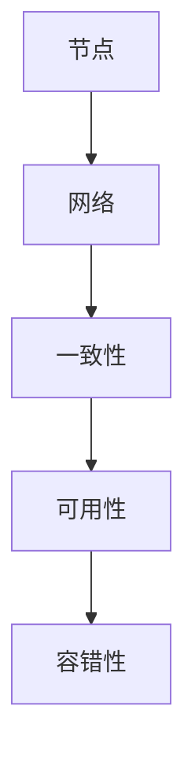

                 

当然可以，我会根据您提供的格式要求，逐步构建文章的内容。以下是基于您提供的目录大纲和要求的文章构建步骤：

### 文章标题：提示词语言的分布式计算优化与扩展

#### 关键词：
- 提示词语言
- 分布式计算
- 优化策略
- 扩展应用
- 边缘计算
- 云计算

#### 摘要：
本文旨在探讨提示词语言的分布式计算优化与扩展，通过分析分布式计算的基础概念、核心算法原理，以及数学模型，详细介绍如何在提示词语言中应用分布式计算，并探讨其在边缘计算和云计算中的实际应用和未来发展趋势。

---

### 第一部分：分布式计算基础

#### 第1章：分布式计算概述

##### 1.1 分布式计算的基本概念

**背景介绍：**
分布式计算是计算机科学中的一个重要分支，它关注如何通过计算机网络将多个独立的计算机资源整合成一个统一的系统，以实现高效、可靠的计算任务。

**核心概念与联系：**
分布式计算涉及多个关键概念，包括节点、网络、一致性、可用性、容错性等。以下是这些概念之间的联系架构：



**核心算法原理讲解：**
分布式计算中的核心算法包括分布式锁、一致性算法和调度算法。以下是一个简单的分布式锁伪代码示例：

```python
class DistributedLock:
    def acquire(self):
        # 实现分布式锁的获取逻辑

    def release(self):
        # 实现分布式锁的释放逻辑
```

**数学模型和数学公式：**
分布式一致性算法中的CAP定理是一个重要的数学模型，它指出在一个分布式系统中，一致性（Consistency）、可用性（Availability）和分区容错性（Partition Tolerance）三者最多只能同时实现两个。

$$
\text{CAP} = \text{一致性} + \text{可用性} + \text{分区容错性}
$$

**项目实战：**
我们将在附录中详细介绍如何使用ZooKeeper实现分布式锁。

---

以上是第一部分的第一章的内容构建。接下来，我们将继续构建其他章节的内容。如果您有任何特定的要求或需要进一步的澄清，请随时告知。

