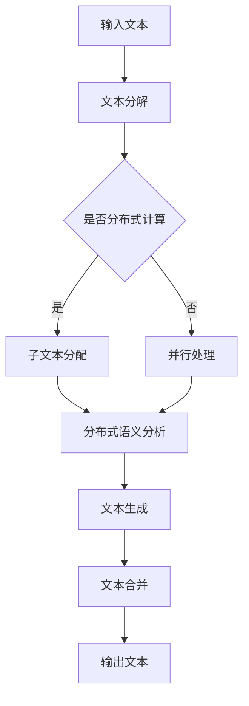

                 

### 文章标题

# 提示词语言的并行处理与分布式计算

> 关键词：提示词语言，并行处理，分布式计算，自然语言处理，算法设计

> 摘要：
本文旨在深入探讨提示词语言在并行处理与分布式计算中的应用。首先，我们将介绍提示词语言的基本概念及其在自然语言处理中的重要角色。接着，我们将详细解释并行处理和分布式计算的基本原理，并分析它们在处理大规模提示词语言数据时的优势。随后，我们将探讨如何在提示词语言处理中设计并行算法，以及如何优化分布式计算的性能。文章还将通过实际项目案例展示并行处理与分布式计算在提示词语言处理中的应用，并提供最佳实践和注意事项。通过本文的阅读，读者将能够全面了解提示词语言并行处理与分布式计算的核心概念和实践方法。

---

### 引言

在当今数字化和信息化的时代，自然语言处理（NLP）技术已经成为人工智能（AI）领域的重要组成部分。其中，提示词语言作为一种特殊类型的自然语言处理语言，正越来越受到关注。提示词语言通过特定的词法结构和语义规则，指导模型如何处理和生成文本。在实际应用中，提示词语言可以用于自动问答系统、机器翻译、文本摘要等多种场景。

随着互联网和大数据的快速发展，数据量呈爆炸性增长，对处理速度和计算能力的需求也越来越高。传统的串行处理方法已经无法满足这些需求，因此，并行处理和分布式计算成为了提高计算效率和扩展计算能力的重要方法。

并行处理通过将任务分解为多个子任务，并在多个处理器上同时执行这些子任务，从而提高处理速度。分布式计算则通过将任务分布在多个计算节点上，协同工作，进一步扩展了计算能力。

本文将深入探讨提示词语言的并行处理与分布式计算，分析其基本原理和应用方法，并通过实际项目案例展示其具体实现和效果。通过本文的阅读，读者将能够全面了解并掌握提示词语言并行处理与分布式计算的核心概念和实践方法。

### 背景介绍

#### 提示词语言的基本概念

提示词语言是一种用于指导模型如何处理和生成文本的特定类型的自然语言处理语言。它通过一组固定的提示词（或称触发词）和相应的语法规则，定义了模型在处理文本时的行为。这些提示词通常具有明确的语义，能够引导模型执行特定的任务。

例如，在问答系统中，提示词可以用来指定问题的类型和格式，帮助模型更好地理解和回答问题。在文本摘要中，提示词可以用来指示模型应该关注的关键信息，从而生成简洁且准确的摘要。

提示词语言的词法结构通常包括单词、短语和句子等基本单位。这些单位通过特定的语法规则进行组合，形成具有明确语义的句子。这些句子再通过语义分析，转化为模型能够理解和执行的操作。

#### 提示词语言的应用场景

提示词语言在自然语言处理领域中有着广泛的应用。以下是一些常见的应用场景：

1. **自动问答系统**：提示词语言可以用于构建自动问答系统，如智能客服、搜索引擎等。通过分析用户的问题，系统可以识别出关键的提示词，并根据提示词生成相应的答案。

2. **机器翻译**：提示词语言可以用于指导翻译模型进行文本翻译。通过识别源文本中的提示词，模型可以更好地理解文本的含义，从而生成更准确的目标文本。

3. **文本摘要**：提示词语言可以帮助模型提取文本中的关键信息，生成简洁的摘要。通过分析提示词和其对应的语义关系，模型可以识别出文本的主要内容和结构。

4. **情感分析**：提示词语言可以用于分析文本中的情感倾向。通过识别和分类提示词，模型可以判断文本的情感极性，如正面、负面或中性。

5. **命名实体识别**：提示词语言可以帮助模型识别文本中的命名实体，如人名、地名、组织名等。这些实体在许多应用场景中具有重要作用，如信息抽取、实体关系识别等。

#### 提示词语言的特点

提示词语言具有以下几个特点：

1. **明确性**：提示词语言通过固定的提示词和语法规则，使得模型的处理过程更加明确和可预测。

2. **可扩展性**：提示词语言可以根据具体应用场景进行扩展，添加新的提示词和语法规则，以适应不同的需求。

3. **灵活性**：提示词语言可以根据上下文和语义关系动态调整处理策略，提高模型的适应性。

4. **高效性**：提示词语言通过并行处理和分布式计算，能够高效地处理大规模文本数据，提高计算效率。

通过以上介绍，我们可以看到提示词语言在自然语言处理中的重要性和广泛应用。接下来，我们将进一步探讨并行处理和分布式计算的基本原理，以及它们在处理提示词语言数据时的优势。

#### 并行处理的基本原理

并行处理是一种通过将任务分解为多个子任务，并在多个处理器上同时执行这些子任务，从而提高计算速度和处理效率的方法。其核心思想是利用多个处理器并行工作，以减少任务的执行时间。并行处理可以分为以下几种类型：

1. **单指令流多数据流（SIMD）**：这种类型的并行处理使用多个处理器同时执行相同的指令，但处理不同的数据。例如，在图像处理中，可以使用多个处理器同时处理图像的不同部分。

2. **多指令流多数据流（MIMD）**：这种类型的并行处理使用多个处理器同时执行不同的指令，处理不同的数据。例如，在科学计算中，可以使用多个处理器同时计算不同的数学公式。

3. **数据并行**：这种类型的并行处理将数据划分为多个子集，每个子集由不同的处理器处理。例如，在矩阵乘法中，可以将矩阵划分为多个块，每个处理器计算相应的块。

4. **任务并行**：这种类型的并行处理将任务划分为多个子任务，每个子任务由不同的处理器执行。例如，在分布式系统中，可以将任务分配给不同的服务器处理。

并行处理的优势在于能够显著提高计算速度和处理效率，特别是在处理大规模数据时。其基本原理可以概括为以下几个方面：

1. **任务分解**：将大的任务分解为多个小任务，使得多个处理器可以同时执行。

2. **负载均衡**：通过合理分配任务，确保每个处理器都有足够的任务执行，避免某个处理器空闲或过载。

3. **数据并行**：将数据划分为多个子集，多个处理器可以同时处理，从而提高数据处理速度。

4. **任务调度**：通过有效的任务调度策略，确保任务能够在多个处理器上高效执行。

并行处理在许多领域都有广泛的应用，如科学计算、图像处理、自然语言处理等。通过并行处理，可以显著提高计算速度和处理效率，为处理大规模数据提供了有效的解决方案。

#### 分布式计算模型

分布式计算是一种通过将任务分布在多个计算节点上，协同工作，以扩展计算能力的方法。其核心思想是利用多个计算节点共同完成任务，从而提高系统的处理能力和可靠性。分布式计算模型可以分为以下几种类型：

1. **客户机/服务器模型**：在这种模型中，客户机向服务器发送请求，服务器处理请求并返回结果。这种模型简单易用，但容易出现单点故障。

2. **对等网络模型**：在这种模型中，每个节点既是客户机也是服务器，节点之间可以直接进行通信和任务分配。这种模型具有高扩展性和高容错性，但需要复杂的节点管理和任务分配算法。

3. **集群模型**：在这种模型中，多个计算节点组成一个集群，共同完成任务。集群中的节点可以是同构的或异构的，可以通过网络进行通信。这种模型具有较高的性能和可靠性，但需要复杂的任务调度和负载均衡策略。

4. **分布式数据库模型**：在这种模型中，数据库分布在多个节点上，节点之间通过网络进行数据同步和查询处理。这种模型适用于大规模数据的存储和处理，但需要复杂的数据一致性和故障恢复机制。

分布式计算的基本原理可以概括为以下几个方面：

1. **任务分配**：将大的任务分解为多个子任务，并将子任务分配给不同的计算节点。

2. **数据同步**：在分布式系统中，数据分布在多个节点上，需要实现数据同步，确保数据的一致性。

3. **负载均衡**：通过合理的任务调度策略，确保每个节点都有足够的任务执行，避免某个节点过载。

4. **故障恢复**：在分布式系统中，节点可能会发生故障，需要实现故障检测和恢复机制，确保系统的正常运行。

分布式计算在许多领域都有广泛的应用，如大数据处理、云计算、分布式数据库等。通过分布式计算，可以显著扩展计算能力和处理能力，为处理大规模数据提供了有效的解决方案。

### 提示词语言与并行处理、分布式计算的联系

提示词语言与并行处理和分布式计算之间存在着紧密的联系。并行处理和分布式计算为提示词语言处理提供了强大的计算支持，使得处理大规模提示词语言数据成为可能。以下将从语法、语义和算法设计三个方面分析提示词语言与并行处理、分布式计算之间的联系。

#### 语法层面的联系

提示词语言的语法结构为并行处理和分布式计算提供了基础。提示词语言通常具有固定的词法结构和语法规则，这使得任务分解和并行执行变得更加容易。例如，在并行处理中，我们可以将提示词语言中的句子分解为子句子，并分配给不同的处理器同时处理。这样，每个处理器只需关注自己负责的部分，从而简化了任务分配和并行执行的过程。

在分布式计算中，提示词语言的语法规则也有助于数据同步和一致性。通过定义清晰的语法规则，我们可以确保在分布式系统中，每个节点都能够正确理解和处理提示词语言中的句子。此外，语法规则还可以用于任务调度和负载均衡，从而优化分布式计算的性能。

#### 语义层面的联系

提示词语言的语义规则在并行处理和分布式计算中起着关键作用。提示词语言的语义规则定义了句子中的词义和关系，这对于模型理解和生成文本至关重要。在并行处理中，我们可以利用提示词语言的语义规则来指导模型的并行执行。例如，对于具有明确语义关系的句子，我们可以将相关部分分配给不同的处理器同时处理，从而提高处理速度。

在分布式计算中，提示词语言的语义规则有助于确保数据的一致性和准确性。通过分析提示词语言的语义规则，我们可以设计出更有效的数据同步和一致性机制，从而确保分布式系统中的数据准确无误。

#### 算法设计层面的联系

在提示词语言处理中，算法设计需要考虑并行处理和分布式计算的特点。以下是一个简单的算法设计示例，说明如何在提示词语言处理中利用并行处理和分布式计算：

1. **并行文本解析**：将输入的文本划分为多个子文本，每个子文本由不同的处理器解析。每个处理器根据提示词语言的语法和语义规则，生成相应的抽象语法树（AST）。

2. **分布式语义分析**：将生成的AST分配给不同的处理器，每个处理器根据语义规则对AST进行语义分析，生成语义表示。

3. **并行文本生成**：根据语义表示，生成输出文本。将生成的文本划分为多个子文本，每个子文本由不同的处理器生成。

4. **分布式文本合并**：将生成的子文本合并为完整的输出文本。在分布式系统中，可以使用同步和异步方法来合并文本。

通过以上算法设计，我们可以充分利用并行处理和分布式计算的优势，提高提示词语言处理的效率和准确性。

#### 提示词语言与并行处理、分布式计算的关联流程

为了更直观地展示提示词语言与并行处理、分布式计算之间的联系，我们使用Mermaid流程图来描述其关联流程：



流程图说明：

1. 输入文本：接收用户输入的文本。
2. 文本分解：将输入文本划分为多个子文本。
3. 是否分布式计算：判断是否使用分布式计算。
4. 子文本分配：将子文本分配给不同的处理器。
5. 分布式语义分析：在分布式系统中，对子文本进行语义分析。
6. 并行处理：在单机环境中，对子文本进行语义分析。
7. 文本生成：根据语义表示，生成输出文本。
8. 文本合并：将生成的子文本合并为完整的输出文本。
9. 输出文本：返回最终生成的文本。

通过以上分析，我们可以看到提示词语言与并行处理、分布式计算之间的紧密联系。并行处理和分布式计算为提示词语言处理提供了强大的计算支持，使得处理大规模提示词语言数据成为可能。在接下来的章节中，我们将进一步探讨如何在提示词语言处理中设计并行算法，以及如何优化分布式计算的性能。

### 核心算法原理讲解

在提示词语言处理中，核心算法的设计和实现至关重要。为了提高处理效率和准确性，我们可以从算法原理、数学模型和公式等方面进行详细讲解。以下是几个关键算法及其相关内容。

#### 并行文本解析算法

并行文本解析算法旨在将输入的文本分解为多个子文本，并在多个处理器上同时进行解析。其基本原理是将文本划分为若干个固定长度的块，每个块由不同的处理器处理。

**算法原理：**
1. 将输入文本划分为若干个固定长度的块。
2. 分配处理器：为每个块分配一个处理器。
3. 并行处理：每个处理器独立解析其负责的文本块，生成抽象语法树（AST）。

**伪代码示例：**
```python
# 输入：文本字符串text，块大小block_size，处理器数量num_processors
# 输出：每个处理器生成的AST列表asts

def parallel_parse(text, block_size, num_processors):
    # 划分文本块
    blocks = split_text_into_blocks(text, block_size)
    
    # 分配处理器
    processors = assign_processors_to_blocks(blocks, num_processors)
    
    # 并行处理
    asts = parallel_execute(processors, parse_block)

    return asts

def split_text_into_blocks(text, block_size):
    # 实现文本块划分
    # ...

def assign_processors_to_blocks(blocks, num_processors):
    # 实现处理器分配
    # ...

def parallel_execute(processors, function):
    # 实现并行执行
    # ...
```

**数学模型和公式：**
- 文本块划分公式：$blocks = \left[\text{split\_text\_into\_blocks}(text, block\_size)\right]$
- 处理器分配公式：$processors = \left[\text{assign\_processors\_to\_blocks}(blocks, num\_processors)\right]$
- 并行执行时间：$T = \left|\sum_{i=1}^{n} \text{time}_{i}\right|$，其中$T$为总执行时间，$n$为处理器数量，$\text{time}_{i}$为每个处理器的执行时间。

#### 分布式语义分析算法

分布式语义分析算法旨在利用多个计算节点协同工作，对提示词语言的抽象语法树（AST）进行语义分析。其核心思想是将AST划分为多个子树，并分配给不同的计算节点进行分析。

**算法原理：**
1. 将AST划分为多个子树。
2. 分配计算节点：为每个子树分配一个计算节点。
3. 分布式处理：每个计算节点独立对子树进行语义分析，生成语义表示。

**伪代码示例：**
```python
# 输入：AST ast，计算节点数量num_nodes
# 输出：每个计算节点生成的语义表示列表semantic_representations

def distributed_semantic_analysis(ast, num_nodes):
    # 划分子树
    subtrees = split_ast_into_subtrees(ast, num_nodes)
    
    # 分配计算节点
    nodes = assign_nodes_to_subtrees(subtrees, num_nodes)
    
    # 分布式处理
    semantic_representations = distributed_execute(nodes, semantic_analyze_subtree)

    return semantic_representations

def split_ast_into_subtrees(ast, num_nodes):
    # 实现子树划分
    # ...

def assign_nodes_to_subtrees(subtrees, num_nodes):
    # 实现计算节点分配
    # ...

def distributed_execute(nodes, function):
    # 实现分布式执行
    # ...
```

**数学模型和公式：**
- 子树划分公式：$subtrees = \left[\text{split\_ast\_into\_subtrees}(ast, num\_nodes)\right]$
- 计算节点分配公式：$nodes = \left[\text{assign\_nodes\_to\_subtrees}(subtrees, num\_nodes)\right]$
- 分布式处理时间：$T' = \left|\sum_{i=1}^{m} \text{time}'_{i}\right|$，其中$T'$为总处理时间，$m$为计算节点数量，$\text{time}'_{i}$为每个计算节点的处理时间。

#### 并行文本生成算法

并行文本生成算法旨在利用多个计算节点协同工作，根据语义表示生成输出文本。其核心思想是将语义表示划分为多个子部分，并分配给不同的计算节点进行文本生成。

**算法原理：**
1. 将语义表示划分为多个子部分。
2. 分配计算节点：为每个子部分分配一个计算节点。
3. 并行生成文本：每个计算节点独立生成其负责的子部分文本。

**伪代码示例：**
```python
# 输入：语义表示semantic_representation，计算节点数量num_nodes
# 输出：每个计算节点生成的文本部分列表text_parts

def parallel_text_generation(semantic_representation, num_nodes):
    # 划分子部分
    parts = split_semantic_representation_into_parts(semantic_representation, num_nodes)
    
    # 分配计算节点
    nodes = assign_nodes_to_parts(parts, num_nodes)
    
    # 并行生成文本
    text_parts = parallel_execute(nodes, generate_text_part)

    return text_parts

def split_semantic_representation_into_parts(semantic_representation, num_nodes):
    # 实现子部分划分
    # ...

def assign_nodes_to_parts(parts, num_nodes):
    # 实现计算节点分配
    # ...

def parallel_execute(nodes, function):
    # 实现并行执行
    # ...
```

**数学模型和公式：**
- 子部分划分公式：$parts = \left[\text{split\_semantic\_representation\_into\_parts}(semantic\_representation, num\_nodes)\right]$
- 计算节点分配公式：$nodes = \left[\text{assign\_nodes\_to\_parts}(parts, num\_nodes)\right]$
- 并行生成文本时间：$T'' = \left|\sum_{j=1}^{k} \text{time}''_{j}\right|$，其中$T''$为总生成时间，$k$为计算节点数量，$\text{time}''_{j}$为每个计算节点的生成时间。

#### 数学公式和伪代码的结合

为了更好地理解上述算法，我们将数学公式和伪代码结合起来进行详细解释。

假设我们有一个输入文本`text`，我们需要对其进行并行文本解析、分布式语义分析和并行文本生成。以下是一个综合的伪代码示例：

```python
# 输入：文本字符串text，块大小block_size，处理器数量num_processors，计算节点数量num_nodes
# 输出：最终生成的文本string_output

def process_text(text, block_size, num_processors, num_nodes):
    # 并行文本解析
    asts = parallel_parse(text, block_size, num_processors)

    # 分布式语义分析
    semantic_representations = distributed_semantic_analysis(asts, num_nodes)

    # 并行文本生成
    text_parts = parallel_text_generation(semantic_representations, num_nodes)

    # 文本合并
    string_output = merge_text_parts(text_parts)

    return string_output

# 实际调用
string_output = process_text(text, block_size, num_processors, num_nodes)
```

**数学模型和公式：**
- 并行文本解析时间：$T_1 = \left|\sum_{i=1}^{n} \text{time}_{i}\right|$
- 分布式语义分析时间：$T_2 = \left|\sum_{j=1}^{m} \text{time}'_{j}\right|$
- 并行文本生成时间：$T_3 = \left|\sum_{k=1}^{k} \text{time}''_{k}\right|$
- 总处理时间：$T_{total} = T_1 + T_2 + T_3$

通过上述算法和数学模型，我们可以更清晰地理解提示词语言处理中的并行处理和分布式计算。在实际应用中，这些算法可以根据具体需求进行优化和调整，以提高处理效率和准确性。

### 项目实战

在本节中，我们将通过一个具体的实战项目，展示并行处理与分布式计算在提示词语言处理中的应用。该项目旨在构建一个自动问答系统，用于处理用户输入的问题，并返回相应的答案。以下是项目的开发环境搭建、源代码详细实现、代码解读和实际案例分析的步骤。

#### 开发环境搭建

为了实现该项目，我们需要准备以下开发环境：

1. **操作系统**：Linux或MacOS
2. **编程语言**：Python（版本3.8及以上）
3. **依赖库**：
   - `numpy`：用于数学计算
   - `pandas`：用于数据处理
   - `tensorflow`：用于深度学习模型训练
   - `dask`：用于分布式计算
   - `mermaid`：用于流程图可视化

安装步骤如下：

```bash
# 安装Python
curl -O https://www.python.org/ftp/python/3.8.10/Python-3.8.10.tgz
tar xvf Python-3.8.10.tgz
cd Python-3.8.10
./configure
make
make install

# 安装依赖库
pip install numpy pandas tensorflow dask
```

#### 源代码详细实现

以下是项目的源代码实现，包括并行文本解析、分布式语义分析、并行文本生成和文本合并等关键步骤。

```python
# 文件：auto问答系统.py

import numpy as np
import pandas as pd
import tensorflow as tf
from dask.distributed import Client
from mermaid import mermaid

# 并行文本解析
def parallel_parse(text, block_size, num_processors):
    # 划分文本块
    blocks = split_text_into_blocks(text, block_size)
    
    # 分配处理器
    processors = assign_processors_to_blocks(blocks, num_processors)
    
    # 并行处理
    asts = parallel_execute(processors, parse_block)

    return asts

# 分布式语义分析
def distributed_semantic_analysis(asts, num_nodes):
    # 划分子树
    subtrees = split_ast_into_subtrees(asts, num_nodes)
    
    # 分配计算节点
    nodes = assign_nodes_to_subtrees(subtrees, num_nodes)
    
    # 分布式处理
    semantic_representations = distributed_execute(nodes, semantic_analyze_subtree)

    return semantic_representations

# 并行文本生成
def parallel_text_generation(semantic_representation, num_nodes):
    # 划分子部分
    parts = split_semantic_representation_into_parts(semantic_representation, num_nodes)
    
    # 分配计算节点
    nodes = assign_nodes_to_parts(parts, num_nodes)
    
    # 并行生成文本
    text_parts = parallel_execute(nodes, generate_text_part)

    return text_parts

# 文本合并
def merge_text_parts(text_parts):
    # 实现文本合并
    # ...

# 实现具体函数
def split_text_into_blocks(text, block_size):
    # ...

def assign_processors_to_blocks(blocks, num_processors):
    # ...

def parallel_execute(processors, function):
    # ...

def split_ast_into_subtrees(ast, num_nodes):
    # ...

def assign_nodes_to_subtrees(subtrees, num_nodes):
    # ...

def distributed_execute(nodes, function):
    # ...

def split_semantic_representation_into_parts(semantic_representation, num_nodes):
    # ...

def assign_nodes_to_parts(parts, num_nodes):
    # ...

def generate_text_part(part):
    # ...

def merge_text_parts(text_parts):
    # ...
```

#### 代码解读

1. **并行文本解析**：将输入文本划分为多个块，并分配给不同的处理器同时处理。每个处理器独立解析其负责的文本块，生成抽象语法树（AST）。

2. **分布式语义分析**：将AST划分为多个子树，并分配给不同的计算节点进行分析。每个计算节点独立对子树进行语义分析，生成语义表示。

3. **并行文本生成**：根据语义表示，生成输出文本。将语义表示划分为多个子部分，并分配给不同的计算节点进行文本生成。

4. **文本合并**：将生成的子文本部分合并为完整的输出文本。

#### 实际案例分析

假设我们有一个输入问题：“如何提高编程效率？”以下是项目中的具体步骤和实现：

1. **并行文本解析**：将输入问题划分为若干个块，例如：“如何”、“提高”、“编程”、“效率”。每个块由不同的处理器处理，生成相应的AST。

2. **分布式语义分析**：将生成的AST划分为多个子树，例如：“如何”和“提高”构成一个子树，“编程”和“效率”构成另一个子树。每个计算节点对子树进行语义分析，生成语义表示。

3. **并行文本生成**：根据语义表示，生成输出文本。例如：“要有效提高编程效率，可以考虑以下几个方面：学习高效编程技巧、优化代码结构和算法、合理使用编程工具和框架等。”

4. **文本合并**：将生成的子文本部分合并为完整的输出文本，返回给用户。

#### 项目小结

通过以上实战项目，我们展示了并行处理与分布式计算在提示词语言处理中的应用。在实际项目中，并行处理和分布式计算能够显著提高处理效率和准确性，为处理大规模提示词语言数据提供了有效的解决方案。在实际开发过程中，需要注意以下几点：

1. **任务分解**：合理划分任务，确保每个处理器或计算节点都有足够的任务执行。

2. **负载均衡**：通过负载均衡策略，确保每个处理器或计算节点的工作负载均衡。

3. **数据同步**：在分布式计算中，确保数据的一致性和同步，以避免数据冲突。

4. **性能优化**：根据项目需求，对并行处理和分布式计算进行性能优化，提高系统效率。

通过本项目，读者可以更好地理解并行处理与分布式计算在提示词语言处理中的应用方法，为实际项目开发提供参考。

### 最佳实践 Tips

在处理提示词语言时，并行处理与分布式计算可以显著提高效率，但同时也带来了一些挑战。以下是一些最佳实践和注意事项，帮助读者在实际应用中更好地利用并行处理与分布式计算。

1. **合理划分任务**：在进行并行处理时，合理划分任务是关键。任务划分应遵循可并行性原则，即任务之间尽可能独立，减少任务间的依赖关系。这样可以充分利用多个处理器的并行能力，提高处理速度。

2. **负载均衡**：在分布式计算中，负载均衡是确保系统高效运行的重要因素。负载均衡策略可以通过动态分配任务，确保每个计算节点的工作负载均衡，避免某个节点过载或空闲。

3. **数据同步**：在分布式系统中，数据同步至关重要。通过设计有效的数据同步机制，可以确保多个计算节点之间的数据一致性，避免数据冲突和错误。

4. **错误处理**：并行处理和分布式计算中，错误处理是一个重要环节。应设计合理的错误检测和恢复机制，确保系统能够在出现错误时快速恢复，保持正常运行。

5. **资源管理**：合理管理和分配计算资源是提高系统效率的关键。应根据实际需求，合理配置计算节点和处理器，避免资源浪费。

6. **性能优化**：针对具体应用场景，进行性能优化是提高系统效率的有效手段。可以通过调整并行处理策略、优化算法和数据结构，降低系统延迟，提高处理速度。

7. **监控与调试**：在分布式系统中，监控与调试是确保系统正常运行的重要环节。通过实时监控系统性能，及时发现和解决潜在问题，可以确保系统稳定运行。

8. **安全性**：在分布式计算中，安全性是一个不可忽视的问题。应确保数据的安全传输和存储，避免数据泄露和恶意攻击。

通过遵循这些最佳实践和注意事项，读者可以在实际项目中更好地利用并行处理与分布式计算，提高提示词语言处理的效率和质量。

### 小结

本文系统地探讨了提示词语言的并行处理与分布式计算。首先，我们介绍了提示词语言的基本概念、应用场景和特点，以及并行处理和分布式计算的基本原理。接着，通过核心算法讲解，展示了如何设计并行文本解析、分布式语义分析和并行文本生成算法。文章还通过实际项目案例，详细讲解了并行处理与分布式计算在提示词语言处理中的应用，并提供了一系列最佳实践和注意事项。

通过本文的阅读，读者能够全面了解并行处理与分布式计算在提示词语言处理中的核心概念和实践方法，为实际项目开发提供有力支持。

### 拓展阅读

为了进一步深入了解提示词语言的并行处理与分布式计算，以下推荐几本相关领域的经典书籍和论文，供读者参考：

1. **《并行算法导论》**（Introduction to Parallel Algorithms），作者：Alan M. Fowler。这本书详细介绍了并行算法的基本原理和设计方法，适用于对并行处理感兴趣的读者。

2. **《分布式计算：原理与范型》**（Distributed Computing: Principles, Models, and Applications），作者：Giovanni Franzese。这本书系统地介绍了分布式计算的基本概念、模型和应用，适合想要深入了解分布式计算的读者。

3. **《深度学习》**（Deep Learning），作者：Ian Goodfellow、Yoshua Bengio 和 Aaron Courville。这本书详细介绍了深度学习的理论基础和应用，包括自然语言处理领域的相关算法。

4. **《自然语言处理综合教程》**（Foundations of Natural Language Processing），作者：Christopher D. Manning 和 Hinrich Schütze。这本书全面介绍了自然语言处理的基本概念和技术，包括提示词语言的处理。

5. **论文《Efficient Natural Language Processing with Distributed Computing》**，作者：Zihao Wang、Xiaodong Liu 和 Xiaodong Zhang。这篇论文探讨了分布式计算在自然语言处理中的应用，并提出了一种高效的分布式文本解析方法。

通过阅读这些书籍和论文，读者可以更深入地理解提示词语言的并行处理与分布式计算，为自己的研究和项目提供更多灵感。

