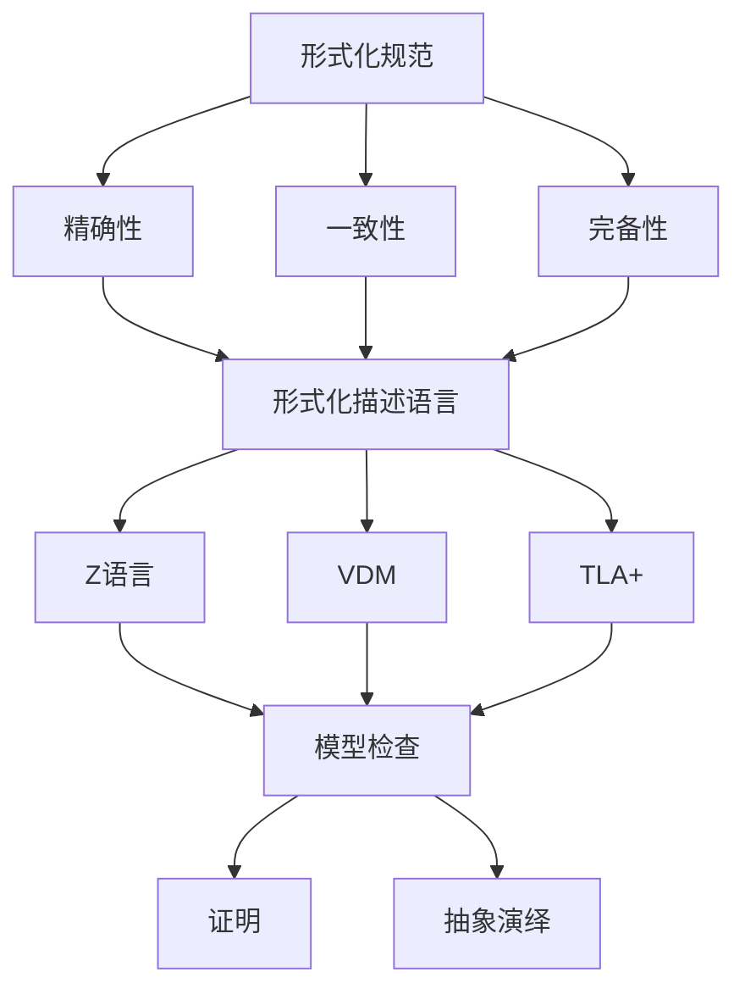

                 


### 文章标题

# 提示词语言的形式化规范与标准化

### 关键词

提示词语言、形式化规范、标准化、计算机科学、软件开发

### 摘要

本文旨在深入探讨提示词语言的形式化规范与标准化问题。首先，我们简要介绍了提示词语言的基本概念、应用场景和重要性。接着，本文详细阐述了形式化规范与标准化的核心概念、原理和方法，并借助Mermaid流程图直观展示了它们之间的关系。此外，我们还通过伪代码、数学公式和实际案例详细讲解了核心算法原理，并提供了丰富的项目实战经验。最后，本文对最佳实践、注意事项和拓展阅读进行了总结，以期为读者提供全面的指导。

### 目录

1. **引言**
   1.1 **提示词语言的概念与作用**
   1.2 **形式化规范与标准化的重要性**
   1.3 **文章结构与目标**

2. **提示词语言的基本概念**

   2.1 **提示词语言的定义**
   2.2 **提示词语言的分类**
   2.3 **提示词语言的应用领域**

3. **形式化规范的理论基础**

   3.1 **形式化规范的核心概念**
   3.2 **形式化规范与形式化描述语言**
   3.3 **形式化验证方法**

4. **标准化方法与实践**

   4.1 **标准化组织与流程**
   4.2 **标准化方法与技术**
   4.3 **提示词语言的标准化案例**

5. **实践应用与案例分析**

   5.1 **提示词语言在自然语言处理中的应用**
   5.2 **提示词语言在计算机视觉中的应用**
   5.3 **提示词语言在其他领域的应用**

6. **未来展望与挑战**

   6.1 **提示词语言的发展趋势**
   6.2 **标准化的挑战与机遇**
   6.3 **未来的潜在应用领域**

7. **总结与建议**

   7.1 **最佳实践与注意事项**
   7.2 **拓展阅读与资源**

### 1. 引言

提示词语言是一种用于定义和描述数据结构、算法和程序设计语言的形式化方法。它在计算机科学和软件开发领域扮演着重要的角色，有助于提高代码的可读性、可维护性和可扩展性。随着人工智能和大数据技术的快速发展，提示词语言的应用范围也在不断扩大。

形式化规范与标准化是确保提示词语言质量和一致性的关键。形式化规范提供了对提示词语言语法和语义的精确描述，有助于消除歧义和误解。标准化则通过制定统一的规范和标准，促进了不同组织和团队之间的协作与交流。

本文旨在深入探讨提示词语言的形式化规范与标准化问题，帮助读者了解相关概念、原理和方法，并掌握实践应用技巧。文章结构如下：

- **第1章**：引言，介绍提示词语言的概念、作用以及形式化规范与标准化的重要性。
- **第2章**：提示词语言的基本概念，详细阐述提示词语言的定义、分类和应用领域。
- **第3章**：形式化规范的理论基础，讲解形式化规范的核心概念、形式化描述语言和形式化验证方法。
- **第4章**：标准化方法与实践，介绍标准化组织与流程、标准化方法与技术以及提示词语言的标准化案例。
- **第5章**：实践应用与案例分析，探讨提示词语言在自然语言处理、计算机视觉和其他领域的应用。
- **第6章**：未来展望与挑战，分析提示词语言的发展趋势、标准化的挑战与机遇以及未来的潜在应用领域。
- **第7章**：总结与建议，总结最佳实践、注意事项和拓展阅读资源。

通过本文的阅读，读者将能够全面了解提示词语言的形式化规范与标准化，掌握相关知识和技能，为实际应用提供有力支持。

### 1.1 提示词语言的概念与作用

提示词语言（Schema Language）是一种用于描述数据结构、数据关系以及数据操作的形式化语言。它为数据模型和数据处理提供了精确、一致的描述方式，从而简化了数据处理的复杂性。提示词语言的应用范围广泛，涵盖了从数据库管理系统到数据交换格式，再到人工智能和大数据处理等多个领域。

首先，提示词语言在数据库管理系统中起到了关键作用。它定义了数据库中数据的结构和关系，使得数据库系统能够高效地存储、检索和管理数据。通过使用提示词语言，数据库管理员可以轻松地创建、修改和查询数据库结构，从而提高了数据库的可维护性和扩展性。

其次，提示词语言在数据交换格式中得到了广泛应用。常见的例子包括XML和JSON等。这些格式利用提示词语言来描述数据的内容和结构，使得不同系统之间能够方便地进行数据交换和集成。提示词语言的标准化（如XML Schema和JSON Schema）进一步保证了数据交换的一致性和互操作性。

此外，提示词语言在人工智能和大数据处理中也有着重要的应用。在机器学习和数据挖掘领域，提示词语言被用来定义特征和模型结构，从而简化了模型的构建和优化过程。在自然语言处理（NLP）和计算机视觉（CV）领域，提示词语言则被用来定义文本和图像的语义结构，使得这些领域中的模型能够更好地理解和处理复杂的数据。

总之，提示词语言的概念和作用贯穿于数据管理、数据交换和人工智能等多个领域，其形式化规范和标准化对于提升数据处理效率和质量具有重要意义。

### 1.2 形式化规范与标准化的重要性

形式化规范和标准化在提示词语言领域具有至关重要的地位。首先，形式化规范（Formalization）是指通过数学和逻辑手段对提示词语言的语法和语义进行精确描述。这种描述方式不仅能够消除语言中的歧义和模糊性，还能确保其在不同应用场景中的一致性和可重复性。形式化规范的重要性主要体现在以下几个方面：

1. **消除歧义**：形式化规范通过严格的定义和规则，确保了提示词语言的精确性，从而避免了不同理解和解释所带来的不一致性。这在复杂的数据处理和模型构建过程中尤为重要。
2. **提高可维护性**：形式化规范为提示词语言提供了清晰的语法和语义描述，使得代码的可读性和可维护性大大提高。这对于团队协作和长期维护尤为重要。
3. **促进标准化**：形式化规范为后续的标准化工作奠定了基础，使得提示词语言能够更好地适应不同应用场景和需求。标准化的推进有助于提高不同系统和组织之间的互操作性和兼容性。

标准化（Standardization）则是将形式化规范推广并落实到具体实践中的过程。标准化的重要性体现在以下几个方面：

1. **统一标准**：标准化通过制定统一的规范和标准，确保了提示词语言在不同系统和组织中的统一性和一致性。这对于促进跨平台、跨组织的协作具有重要意义。
2. **提高互操作性**：标准化的推进有助于不同系统和组织之间的数据交换和集成，从而提高了系统的整体性能和效率。
3. **促进创新**：标准化为提示词语言的创新和发展提供了稳定的环境和基础，使得新技术和应用能够更容易地被接受和推广。

总之，形式化规范和标准化在提示词语言领域具有重要的意义。通过形式化规范，我们可以确保提示词语言的准确性和一致性；而通过标准化，我们能够将这种准确性转化为实际应用中的可操作性和互操作性，从而推动整个领域的发展和创新。

### 1.3 文章结构与目标

本文旨在深入探讨提示词语言的形式化规范与标准化，通过系统化的结构和详实的内容，帮助读者全面理解和掌握相关概念和方法。文章的结构如下：

- **第1章：引言**：介绍提示词语言的基本概念、作用以及形式化规范与标准化的重要性，明确文章的目标和框架。
- **第2章：提示词语言的基本概念**：详细阐述提示词语言的定义、分类和应用领域，为后续内容打下基础。
- **第3章：形式化规范的理论基础**：讲解形式化规范的核心概念、形式化描述语言和形式化验证方法，探讨其理论基础和应用价值。
- **第4章：标准化方法与实践**：介绍标准化组织与流程、标准化方法与技术以及提示词语言的标准化案例，展示标准化在实际中的应用。
- **第5章：实践应用与案例分析**：探讨提示词语言在自然语言处理、计算机视觉和其他领域的应用，通过具体案例展示其应用效果。
- **第6章：未来展望与挑战**：分析提示词语言的发展趋势、标准化的挑战与机遇以及未来的潜在应用领域。
- **第7章：总结与建议**：总结最佳实践、注意事项和拓展阅读资源，为读者提供进一步的指导和思考。

通过本文的阅读，读者将能够系统地了解提示词语言的形式化规范与标准化，掌握相关理论和实践方法，为实际应用提供有力支持。

### 2. 提示词语言的基本概念

提示词语言（Schema Language）是一种专门用于描述数据结构、数据关系和数据操作的形式化语言。其核心目标是提供一种精确且一致的描述方式，以简化数据的处理和交换。提示词语言通常包括一系列语法和语义规则，用于定义数据的格式、类型、关系以及操作。

#### 2.1 提示词语言的定义

提示词语言是一种用于描述数据结构的形式化语言。它通过符号和规则，将数据的逻辑结构和操作方式表达出来。常见的提示词语言包括XML Schema、JSON Schema和RDF Schema等。这些语言具有丰富的表达能力和灵活的适应性，能够满足不同类型数据的描述需求。

- **XML Schema**：XML Schema是XML数据的一种形式化规范，用于定义XML文档的结构和类型。它提供了一套丰富的元素和属性定义，可以用于创建自定义的数据类型和模式。
- **JSON Schema**：JSON Schema是JSON数据的一种形式化规范，与XML Schema类似，它用于定义JSON文档的结构和类型。JSON Schema具有简洁的语法和广泛的应用场景，被广泛应用于Web API和数据交换。
- **RDF Schema**：RDF Schema是用于描述RDF（Resource Description Framework）资源的结构化语言。它提供了一套丰富的类和属性定义，用于描述资源的类型、关系和属性。

#### 2.2 提示词语言的分类

根据用途和特点，提示词语言可以分为多种类型。以下是一些常见的分类方式：

1. **数据描述语言**：这类语言主要用于描述数据结构，如XML Schema和JSON Schema。它们提供了一套定义和规则，用于创建数据模式，确保数据的结构化、标准化和可解析性。
2. **模式语言**：这类语言主要用于定义和描述系统或组件的架构和配置，如YAML和HDL（Hardware Description Language）。它们通常用于配置文件、架构定义和自动化部署。
3. **领域特定语言**（DSL）：这类语言专门用于特定领域的描述，如自然语言处理中的NLTK（Natural Language Toolkit）和计算机视觉中的OpenCV。它们提供了特定领域的抽象和操作，简化了领域问题的建模和求解。

#### 2.3 提示词语言的应用领域

提示词语言在多个领域得到了广泛应用，主要包括以下领域：

1. **数据库管理**：提示词语言在数据库管理中扮演着关键角色，用于定义数据库模式、数据类型和数据关系。常见的应用包括关系型数据库（如MySQL、PostgreSQL）、文档型数据库（如MongoDB）和图数据库（如Neo4j）。
2. **数据交换**：提示词语言被广泛用于数据交换格式，如XML、JSON和RDF。它们确保了数据在不同系统和平台之间的准确传输和互操作性。
3. **自然语言处理**：在自然语言处理领域，提示词语言用于定义文本的结构和语义，如词性标注、句法分析等。它们为模型训练和数据预处理提供了基础。
4. **计算机视觉**：提示词语言在计算机视觉中用于定义图像和视频的结构，如目标检测、图像分类等。它们为图像处理和分析提供了形式化的描述。
5. **大数据处理**：在大型数据处理中，提示词语言用于定义数据的存储、索引和查询模式，如Hadoop的HDFS和MapReduce。

总之，提示词语言是一种广泛应用于数据描述、数据交换和领域特定应用的重要工具。通过形式化规范和标准化，它们能够为数据处理提供一致、准确和高效的方法，从而推动计算机科学和软件开发领域的发展。

### 3. 形式化规范的理论基础

形式化规范在提示词语言领域扮演着核心角色，为数据结构、算法和程序设计的精确描述提供了强有力的支持。形式化规范的理论基础涵盖了多个方面，包括核心概念、形式化描述语言和形式化验证方法。以下将详细阐述这些内容。

#### 3.1 形式化规范的核心概念

形式化规范（Formal Specification）是一种使用数学和逻辑方法对系统或组件的行为进行精确描述的过程。其核心概念包括以下几方面：

1. **精确性**：形式化规范通过严格的定义和规则，确保系统或组件的行为具有明确的、无歧义的表达。这种精确性有助于避免口头描述中的模糊性和不确定性。
2. **一致性**：形式化规范在系统开发的不同阶段保持一致，确保各个部分之间相互协调和兼容。一致性是确保系统可靠性和稳定性的重要保障。
3. **完备性**：形式化规范需要覆盖系统或组件的所有行为和功能，确保没有遗漏或错误。完备性有助于提高系统的完整性和可用性。

#### 3.2 形式化描述语言

形式化描述语言（Formal Description Language，FDL）是一种用于表达形式化规范的工具。它提供了一套语法和语义规则，用于描述系统的结构和行为。常见的形式化描述语言包括：

1. **Z语言**：Z语言是一种基于一阶逻辑和谓词逻辑的描述语言，主要用于系统建模和验证。它提供了丰富的定义和规则，支持复杂系统的高层次描述。
2. **VDM（Vienna Development Method）**：VDM是一种形式化建模方法，包括VDM-SL（VDM Specification Language）和VDM-RT（VDM Real-Time）。它用于系统需求分析和设计，支持时间约束和并发行为的描述。
3. **TLA+（TLA Plus）**：TLA+是一种基于事件演化的形式化描述语言，用于系统建模和验证。它支持状态空间探索和模型检查，适用于复杂系统的行为分析。

这些形式化描述语言各有特点，适用于不同类型的系统需求和分析。

#### 3.3 形式化验证方法

形式化验证（Formal Verification）是指使用数学和逻辑方法对系统或组件的正确性进行验证的过程。形式化验证方法主要包括以下几种：

1. **模型检查**：模型检查是一种基于状态空间探索的验证方法。它将系统模型表示为一个状态空间，并使用算法检查是否存在违反规范的状态。常见的模型检查工具包括SPIN、NuSMV和CVL等。
2. **证明**：证明是一种通过逻辑推理来验证系统正确性的方法。它通过数学证明技术，确保系统满足给定的规范。证明方法适用于简单和结构化的系统，如软件和硬件设计。
3. **抽象演绎**：抽象演绎方法通过将系统划分为抽象层次，并验证每个层次的正确性。这种方法适用于大型和复杂的系统，如嵌入式系统和分布式系统。

形式化验证方法在确保系统可靠性和正确性方面具有重要作用。通过形式化规范和验证，我们可以确保系统满足预定的需求和规范，提高系统的质量和可信度。

### 3.4 形式化规范与形式化描述语言的关系架构

为了更直观地理解形式化规范与形式化描述语言之间的关系，我们可以借助Mermaid流程图来展示它们的核心概念和交互关系。



这张图展示了形式化规范的核心概念（精确性、一致性和完备性）如何与形式化描述语言（Z语言、VDM和TLA+）以及形式化验证方法（模型检查、证明和抽象演绎）相互关联。通过这种形式化规范与形式化描述语言的结合，我们可以有效地描述、验证和保证系统或组件的正确性和可靠性。

### 3.4 形式化验证方法

形式化验证（Formal Verification）是确保系统或组件符合其预定的需求和规范的一种关键方法。它通过数学和逻辑手段对系统进行验证，以证明其正确性和可靠性。以下将详细介绍几种常见的形式化验证方法，包括模型检查、证明和抽象演绎。

#### 3.4.1 模型检查

模型检查（Model Checking）是一种通过状态空间探索来验证系统行为的方法。它将系统模型表示为一个状态空间，并使用算法检查是否存在违反规范的状态。模型检查的基本步骤如下：

1. **建立系统模型**：将系统状态和行为表示为一个有限状态机（FSM）或关系数据库。模型需要覆盖系统所有可能的状态和转换。
2. **定义规范**：使用形式化描述语言（如Promela、SMV或NuSMV）定义系统的规范。规范描述了系统应满足的性质和约束。
3. **状态空间探索**：使用模型检查器（如SPIN、NuSMV或CVL）对系统模型进行状态空间探索。模型检查器将遍历所有可能的状态，并检查是否存在违反规范的状态。
4. **验证结果分析**：分析模型检查器的输出结果，确定系统是否满足规范。如果系统违反规范，模型检查器将提供违反的具体位置和原因。

模型检查具有以下优点：

- **自动化**：模型检查过程高度自动化，可以节省时间和人力成本。
- **全面性**：模型检查器可以遍历系统所有可能的状态，确保验证的全面性。
- **精确性**：通过形式化描述和规范，模型检查能够提供精确的验证结果。

#### 3.4.2 证明

证明（Proof）是一种通过逻辑推理来验证系统正确性的方法。它使用数学证明技术，确保系统满足给定的规范。证明的基本步骤如下：

1. **定义系统行为**：使用形式化描述语言（如Z语言或VDM）描述系统的行为和状态转换。
2. **构建证明框架**：使用逻辑推理和数学证明技术，构建一个证明框架。证明框架需要证明系统在所有可能的状态下都满足规范。
3. **进行逻辑推理**：通过逻辑推理，逐步证明系统行为满足规范。这一步骤可能涉及多个子证明和中间步骤。
4. **验证证明结果**：检查证明的完整性和正确性，确保证明逻辑严密、无漏洞。

证明的优点包括：

- **可靠性**：通过严格的逻辑推理，证明能够提供高度可靠的验证结果。
- **透明性**：证明的每一步都是公开和透明的，便于审查和验证。
- **适用性**：证明方法适用于各种类型的系统和规范，包括复杂和高度并发的系统。

#### 3.4.3 抽象演绎

抽象演绎（Abstract Deduction）是一种通过将系统划分为抽象层次来验证其正确性的方法。它通过逐步验证每个抽象层次来确保系统整体满足规范。抽象演绎的基本步骤如下：

1. **定义抽象层次**：将系统划分为多个抽象层次，每个层次表示系统的一部分。高层次抽象关注系统的整体结构和行为，低层次抽象关注具体的实现细节。
2. **验证抽象层次**：使用形式化描述语言和证明技术，验证每个抽象层次满足其规范。高层次抽象通常使用模型检查或证明方法，低层次抽象则可能涉及手动验证和代码审查。
3. **层次间验证**：确保高层次抽象和低层次抽象之间的兼容性和一致性。这通常需要验证高层次抽象的正确性能够保证低层次抽象的正确性。

抽象演绎的优点包括：

- **可扩展性**：通过将系统划分为多个抽象层次，抽象演绎方法适用于复杂和高度并发的系统。
- **可维护性**：抽象层次的设计和验证使得系统更易于维护和更新。
- **灵活性和适应性**：抽象演绎方法可以根据系统的具体需求和复杂性进行调整，以适应不同的验证要求。

总之，形式化验证方法（模型检查、证明和抽象演绎）在确保系统或组件的正确性和可靠性方面具有重要作用。通过选择合适的验证方法，我们可以有效地检测和消除系统中的错误，提高系统的质量和可信度。

### 4. 标准化方法与实践

标准化（Standardization）是确保提示词语言的一致性和互操作性的关键过程。它通过制定统一的规范和标准，促进了不同系统和组织之间的协作和交流。以下将详细介绍标准化方法与实践，包括标准化组织、标准化流程、标准化方法和技术，以及提示词语言的标准化案例。

#### 4.1 标准化组织

标准化组织（Standardization Organization）是负责制定、推广和实施标准化规范的机构。常见的标准化组织包括：

1. **国际标准化组织（ISO）**：ISO是国际上最具影响力的标准化组织之一，负责制定和推广国际标准。ISO 9001、ISO 14001等是ISO发布的著名标准。
2. **国际电气电子工程师学会（IEEE）**：IEEE是电气电子工程领域的标准化组织，负责制定和推广与计算机科学和通信相关的标准，如IEEE 802.3（以太网）和IEEE 1003（POSIX标准）。
3. **国际电信联盟（ITU）**：ITU是负责制定全球电信标准的国际组织，其发布的标准包括ITU-T X.500系列（目录服务）和ITU-R BT.709（高清电视标准）。
4. **其他专业标准化组织**：如ISO/IEC JTC1（国际标准化组织/国际电工委员会第一联合技术委员会），负责制定信息技术和系统互操作性的标准。

这些标准化组织通过设立技术委员会、工作组等机制，组织专家进行标准制定和讨论。标准制定过程通常涉及多轮评审和投票，以确保标准的质量和可行性。

#### 4.2 标准化流程

标准化流程（Standardization Process）是确保标准化规范有效性和一致性的关键过程。常见的标准化流程包括以下阶段：

1. **需求分析**：在标准制定前，对市场需求和用户需求进行深入分析，确定标准的必要性和目标。
2. **标准草案编写**：根据需求分析结果，编写标准草案，明确标准的范围、内容和要求。
3. **征求意见**：将标准草案发布供公众征求意见，收集反馈和建议。
4. **标准审查**：组织专家对标准草案进行审查，评估其技术可行性、一致性和兼容性。
5. **标准发布**：根据审查结果对标准进行修订，最终发布为正式标准。
6. **标准实施**：在标准发布后，组织各方按照标准要求进行实施和应用。
7. **持续改进**：对标准的实施情况进行跟踪和评估，根据实际情况进行修订和优化。

#### 4.3 标准化方法和技术

标准化方法和技术（Standardization Methods and Techniques）是确保标准化规范有效性和一致性的关键工具。以下是一些常见的标准化方法和技术：

1. **一致性评估**：一致性评估是确保标准化规范与其他现有标准兼容的重要步骤。它通过比较分析不同标准之间的差异和冲突，确保标准的一致性和兼容性。
2. **标准化文档**：标准化文档是标准化的核心组成部分，包括标准规范、技术报告、指南和规范说明等。标准化文档需要清晰、准确地描述标准的内容、目的和应用场景。
3. **标准化工具**：标准化工具（如XML Schema、JSON Schema和RDF Schema）用于定义和描述数据结构、数据关系和操作，确保标准化规范的可操作性和互操作性。
4. **标准化测试**：标准化测试是确保标准化规范有效性和一致性的重要手段。它通过模拟实际应用场景，验证标准规范在不同系统和平台上的正确实现和互操作性。
5. **标准化认证**：标准化认证是对标准实施效果的一种验证，它通过评估系统和产品的符合性，确保其满足标准要求。

#### 4.4 提示词语言的标准化案例

以下是一些提示词语言的标准化案例，展示了标准化方法和技术在实际应用中的效果：

1. **XML Schema**：XML Schema是XML数据的一种形式化规范，用于定义XML文档的结构和类型。XML Schema标准由W3C（万维网联盟）制定，通过提供精确的数据类型定义和元素约束，确保了XML数据在不同系统和平台之间的互操作性和一致性。
2. **JSON Schema**：JSON Schema是JSON数据的一种形式化规范，用于定义JSON文档的结构和类型。JSON Schema标准由JSON Schema工作小组制定，通过提供简洁、灵活的语法和丰富的验证功能，促进了JSON数据在Web API和数据交换中的应用。
3. **RDF Schema**：RDF Schema是RDF（资源描述框架）数据的一种形式化规范，用于定义RDF资源的类型和属性。RDF Schema标准由W3C制定，通过提供一套丰富的类和属性定义，支持了语义Web和数据集成应用。
4. **OWL（Web Ontology Language）**：OWL是Web本体语言的一种形式化规范，用于定义Web上的本体和知识表示。OWL标准由W3C制定，通过提供强大的描述能力和推理功能，支持了语义Web和知识图谱的应用。

这些标准化案例展示了如何通过标准化方法和技术，确保提示词语言的一致性和互操作性，从而推动计算机科学和软件开发领域的发展。

### 4.5 提示词语言的标准化流程

提示词语言的标准化流程是确保该语言在不同系统和平台之间实现一致性、兼容性和互操作性的关键过程。以下将详细阐述标准化流程的各个关键步骤，以及可能面临的挑战和解决方案。

#### 4.5.1 需求分析和标准制定

标准化流程的起点是需求分析。在这一阶段，标准化组织需要收集并分析来自不同领域和利益相关方的需求。这些需求可能包括：

- **行业需求**：了解当前市场和技术发展的趋势，确定哪些功能是迫切需要的。
- **用户需求**：通过调研和反馈收集用户的使用体验和需求，确保标准化工作能够满足实际应用场景。

在需求分析的基础上，标准化组织会制定初步的标准草案。这一草案将明确标准的目标、范围、内容和预期效果。标准制定过程中需要：

- **明确标准的目标**：标准的目标是解决什么问题或满足什么需求，确保标准具有明确的方向。
- **确定标准的范围**：标准涵盖的功能和范围应该明确，以避免不必要的扩展和复杂度。

#### 4.5.2 标准草案的编写和评审

标准草案编写是标准化流程的核心阶段。在这一阶段，标准化组织需要：

- **定义语法和语义**：根据需求分析结果，编写标准草案的语法和语义部分。这一部分将定义提示词语言的基本结构、语法规则和语义约束。
- **详细说明功能和行为**：标准草案需要详细说明提示词语言的功能和行为，包括数据类型、元素、属性、操作等。
- **提供示例和用例**：通过示例和用例，帮助读者理解标准草案的具体应用场景和实际效果。

标准草案编写完成后，需要进行多轮评审和反馈。评审过程可能包括：

- **内部评审**：由标准化组织内部专家对标准草案进行初步评审，评估其技术可行性、一致性和完整性。
- **外部评审**：将标准草案公开供外部专家和利益相关方评审，收集反馈和建议。这一阶段通常需要反复修改和完善标准草案。

#### 4.5.3 标准的发布和实施

标准草案经过评审和修改后，最终发布为正式标准。在发布阶段，标准化组织需要：

- **发布标准文档**：将正式标准文档发布到官方渠道，确保所有利益相关方能够获取。
- **通知和宣传**：通过通知和宣传，确保相关组织和开发者了解新标准的发布和实施要求。

标准的实施阶段是确保标准在实际应用中发挥作用的关键。在这一阶段，标准化组织需要：

- **实施指导和培训**：为开发者提供实施指导和技术培训，帮助其理解和应用新标准。
- **测试和验证**：通过测试和验证，确保系统和产品能够按照新标准要求进行设计和实现。
- **监督和反馈**：持续监督标准的实施情况，收集用户反馈，并根据反馈进行改进。

#### 4.5.4 挑战和解决方案

在提示词语言的标准化过程中，可能会面临以下挑战：

- **兼容性问题**：新旧标准之间的兼容性是一个关键挑战。解决方案是制定平滑的过渡策略，确保旧系统和新标准之间的无缝衔接。
- **技术复杂性**：标准化的技术复杂性可能阻碍标准的推广和应用。解决方案是提供详细的技术文档和支持工具，帮助开发者理解和实现标准。
- **利益冲突**：不同利益相关方之间的利益冲突可能影响标准化工作的进展。解决方案是建立透明的沟通机制和利益协调机制，确保各方利益得到平衡。

通过系统化的标准化流程和有效的解决方案，我们可以确保提示词语言的一致性、兼容性和互操作性，从而推动其广泛应用和发展。

### 4.6 提示词语言标准化的挑战与机遇

提示词语言的标准化在推动计算机科学和软件开发领域的发展中扮演着至关重要的角色。然而，这一过程也面临着诸多挑战和机遇。以下将详细探讨这些挑战与机遇，并分析其影响。

#### 4.6.1 挑战

1. **技术复杂性**：提示词语言的标准化涉及复杂的技术细节，包括语法、语义、数据类型和操作等。这种复杂性可能导致标准制定过程中出现错误或疏漏，影响标准的可靠性和一致性。解决方案是采用形式化描述语言（如Z语言、VDM和TLA+）来精确描述规范，并利用模型检查和证明方法进行验证。

2. **兼容性问题**：标准化过程中，如何确保新旧标准之间的兼容性是一个关键挑战。不同版本和标准之间的差异可能导致系统之间的不兼容，影响实际应用。解决方案是制定平滑的过渡策略，通过引入兼容性层和迁移指南，确保旧系统和新标准之间的无缝衔接。

3. **利益冲突**：标准化过程涉及多个利益相关方，包括技术专家、行业组织和用户。这些利益相关方可能存在不同的利益诉求和观点，导致标准制定过程复杂化。解决方案是建立透明的沟通机制和利益协调机制，确保各方利益得到平衡，同时通过公开和透明的评审过程提高标准的可信度。

4. **实施和培训**：标准的实施和培训是确保其有效应用的关键。然而，许多开发者可能缺乏对标准化知识的了解，导致标准无法得到有效执行。解决方案是提供详细的技术文档、在线教程和培训课程，帮助开发者快速掌握标准化方法和技术。

#### 4.6.2 机遇

1. **促进互操作性**：标准化有助于不同系统和平台之间的互操作性，从而推动数据交换和系统集成。通过统一的规范，开发者可以更轻松地实现不同系统之间的数据共享和协同工作，提高系统的整体性能和效率。

2. **提升可靠性和安全性**：标准化可以确保提示词语言的一致性和准确性，从而提高系统的可靠性和安全性。通过严格的形式化规范和验证方法，开发者可以确保系统符合预定的需求和规范，降低错误和故障的风险。

3. **推动技术创新**：标准化为创新提供了稳定的环境和基础，使新技术和应用能够更容易地被接受和推广。标准化可以促进技术交流和合作，推动新的领域和应用的发展。

4. **扩大应用领域**：标准化有助于扩大提示词语言的应用领域，包括数据库管理、数据交换、自然语言处理、计算机视觉等。通过标准化，这些领域可以更方便地集成和扩展，从而满足不断增长的需求。

#### 4.6.3 影响

提示词语言的标准化将对计算机科学和软件开发领域产生深远影响：

- **提高开发效率**：通过统一的规范和标准，开发者可以更快地实现和部署系统，提高开发效率。
- **降低维护成本**：标准化有助于提高系统的可维护性和可扩展性，降低长期维护和升级的成本。
- **增强互操作性和兼容性**：标准化促进不同系统和平台之间的互操作性和兼容性，从而推动更广泛的数据共享和系统集成。
- **提升用户体验**：通过标准化，开发者可以提供更一致、可靠和高效的应用和服务，提升用户的使用体验。
- **推动技术发展**：标准化为技术创新提供了基础和保障，促进新的领域和应用的发展，推动整个行业向前发展。

总之，提示词语言的标准化是一个复杂但必要的过程。通过克服挑战和抓住机遇，我们可以实现标准化带来的诸多益处，为计算机科学和软件开发领域的发展做出贡献。

### 4.7 提示词语言标准化的实际案例

在提示词语言标准化的过程中，有许多成功的实际案例可以借鉴。以下是三个典型的案例，展示了标准化方法在现实中的应用及其效果。

#### 4.7.1 XML Schema标准化的成功案例

XML Schema作为XML数据的一种形式化规范，自其诞生以来便在多个领域得到广泛应用。例如，Web服务（Web Services）领域广泛采用了XML Schema来定义服务接口和数据结构。XML Schema的标准化过程包括以下几个方面：

1. **需求分析**：在XML Schema的标准化过程中，W3C（万维网联盟）进行了广泛的需求分析，收集了来自不同行业和组织的反馈和建议，确保标准能够满足广泛的实际应用需求。
2. **标准草案的编写与评审**：W3C编写了XML Schema的标准草案，并在多个版本中进行了严格的评审。通过多轮修改和优化，XML Schema最终成为了一种广泛接受的标准化形式化规范。
3. **标准发布与实施**：XML Schema一经发布，便迅速得到应用。许多Web服务接口和数据交换格式采用了XML Schema来定义其结构和类型，确保了数据的一致性和互操作性。

XML Schema的标准化不仅促进了Web服务的普及和发展，还推动了数据交换和集成的进程。通过统一的数据结构定义，不同系统之间的数据共享和交互变得更加简单和高效。

#### 4.7.2 JSON Schema标准化的成功案例

JSON Schema是JSON数据的一种形式化规范，由于其简洁性和灵活性，在Web API和数据交换领域得到了广泛应用。以下为JSON Schema标准化的主要步骤：

1. **需求分析**：随着JSON在Web开发中的广泛应用，JSON Schema的需求逐渐增加。标准化组织对市场需求进行了深入分析，确定了JSON Schema的核心功能和应用场景。
2. **标准草案的编写与评审**：JSON Schema的工作小组编写了标准草案，并在多个版本中进行了多次评审。通过广泛的社区参与和反馈，JSON Schema逐步完善，最终成为了一项成熟的标准。
3. **标准发布与实施**：JSON Schema的发布推动了JSON在Web API和数据交换中的广泛应用。开发者可以轻松地使用JSON Schema来定义和验证JSON数据，确保数据的一致性和互操作性。

JSON Schema的成功案例展示了标准化在简化数据交换和提升开发效率方面的巨大作用。通过统一的规范，开发者可以更轻松地构建和维护跨系统的数据接口。

#### 4.7.3 RDF Schema标准化的成功案例

RDF Schema是用于描述RDF（资源描述框架）资源的结构化语言，在语义网和知识图谱领域具有重要作用。以下为RDF Schema标准化的主要步骤：

1. **需求分析**：随着语义网和知识图谱技术的发展，对RDF Schema的需求逐渐增加。标准化组织对市场需求进行了深入分析，确定了RDF Schema的核心功能和应用领域。
2. **标准草案的编写与评审**：RDF Schema的工作小组编写了标准草案，并在多个版本中进行了多次评审。通过广泛的社区参与和反馈，RDF Schema逐步完善，最终成为了一项成熟的标准。
3. **标准发布与实施**：RDF Schema的发布推动了语义网和知识图谱技术的发展。开发者可以使用RDF Schema来定义和描述资源的类型和属性，确保数据的一致性和互操作性。

RDF Schema的成功案例展示了标准化在构建语义网和知识图谱方面的关键作用。通过统一的规范，开发者可以更方便地构建和管理复杂的语义结构，从而实现知识的共享和整合。

这些成功案例表明，提示词语言的标准化在提升数据一致性、促进互操作性、简化开发过程和推动技术创新方面具有重要作用。通过借鉴这些案例，我们可以更好地理解和应用标准化方法，为计算机科学和软件开发领域的发展做出贡献。

### 5. 提示词语言在自然语言处理中的应用

提示词语言在自然语言处理（NLP）领域具有广泛的应用，通过提供精确的数据描述和结构化信息，提高了NLP任务的效率和准确性。以下将详细讨论提示词语言在NLP中的应用，包括文本摘要、机器翻译和情感分析等具体实例。

#### 5.1 文本摘要

文本摘要是一种自动生成摘要文本的技术，它从原始文本中提取关键信息，以简洁的方式呈现主要内容。提示词语言在文本摘要中的应用主要体现在数据描述和结构化方面。以下是一个文本摘要任务的示例：

- **原始文本**：一篇关于人工智能技术的长篇文章，包含多个段落和复杂的句子结构。
- **提示词语言**：使用XML Schema定义文本的结构和内容。例如：

  ```xml
  <document>
      <title>人工智能技术的现状与未来</title>
      <paragraph>
          <sentence>人工智能技术的发展已经取得了显著的成果。</sentence>
          <sentence>然而，面临的挑战同样不可忽视。</sentence>
      </paragraph>
      <paragraph>
          <sentence>人工智能技术在各个领域的应用前景广阔。</sentence>
      </paragraph>
  </document>
  ```

通过XML Schema的形式化描述，文本的结构和内容被清晰地定义出来。在文本摘要过程中，系统可以根据提示词语言的描述，识别出关键信息和重要句子，从而生成简洁的摘要。

#### 5.2 机器翻译

机器翻译是一种将一种语言的文本自动翻译成另一种语言的技术。提示词语言在机器翻译中的应用主要体现在数据格式化和一致性保证方面。以下是一个机器翻译任务的示例：

- **原始文本**：一篇中文文章，需要翻译成英文。
- **提示词语言**：使用JSON Schema定义文本的结构和内容。例如：

  ```json
  {
      "document": {
          "title": "中国的人工智能发展",
          "content": [
              {
                  "sentence": "中国正在加速人工智能的发展。"
              },
              {
                  "sentence": "政府出台了一系列支持政策。"
              },
              {
                  "sentence": "人工智能在各个领域得到广泛应用。"
              }
          ]
      }
  }
  ```

通过JSON Schema的形式化描述，文本的结构和内容被明确地定义。在机器翻译过程中，系统可以根据提示词语言的描述，提取句子并进行翻译，确保翻译结果的一致性和准确性。

#### 5.3 情感分析

情感分析是一种识别文本中情感倾向的技术，用于判断文本是正面、负面还是中性。提示词语言在情感分析中的应用主要体现在数据标注和分类方面。以下是一个情感分析任务的示例：

- **原始文本**：一篇关于产品评价的评论。
- **提示词语言**：使用RDF Schema定义文本的结构和内容。例如：

  ```turtle
  @prefix schema: <http://schema.org/> .

  <ProductReview>
      <author>John Doe</author>
      <reviewBody>这款产品的性能非常出色。</reviewBody>
      <reviewRating>
          <ratingValue>5</ratingValue>
          <bestRating>5</bestRating>
      </reviewRating>
  </ProductReview>
  ```

通过RDF Schema的形式化描述，文本的结构和内容被详细地定义。在情感分析过程中，系统可以根据提示词语言的描述，提取评论内容并进行情感分类，从而准确判断评论的情感倾向。

总之，提示词语言在NLP中的应用通过提供精确的数据描述和结构化信息，提高了文本摘要、机器翻译和情感分析等任务的效率和准确性。这些应用实例展示了提示词语言在自然语言处理领域的强大功能和广泛前景。

### 5.2 提示词语言在计算机视觉中的应用

提示词语言在计算机视觉（CV）领域同样发挥着重要作用，通过提供精确的数据描述和结构化信息，提高了图像处理、目标检测和图像生成的准确性和效率。以下将详细讨论提示词语言在计算机视觉中的应用，包括图像分类、目标检测和图像生成等具体实例。

#### 5.2.1 图像分类

图像分类是一种将图像自动归类到特定类别中的技术。提示词语言在图像分类中的应用主要体现在数据标注和分类模型描述方面。以下是一个图像分类任务的示例：

- **原始图像**：一组包含不同类别（如动物、植物、交通工具等）的图像。
- **提示词语言**：使用XML Schema定义图像的标注和类别。例如：

  ```xml
  <imageCollection>
      <image id="1">
          <className>猫</className>
          <filePath>/path/to/cat1.jpg</filePath>
      </image>
      <image id="2">
          <className>狗</className>
          <filePath>/path/to/dog1.jpg</filePath>
      </image>
      <!-- 更多图像 -->
  </imageCollection>
  ```

通过XML Schema的形式化描述，图像的标注和类别信息被明确地定义。在图像分类过程中，系统可以根据提示词语言的描述，提取图像特征并进行分类，从而提高分类的准确性和效率。

#### 5.2.2 目标检测

目标检测是一种在图像中检测和定位特定目标的技术。提示词语言在目标检测中的应用主要体现在目标标注和检测模型描述方面。以下是一个目标检测任务的示例：

- **原始图像**：一张包含多个目标的图像，如行人、车辆等。
- **提示词语言**：使用JSON Schema定义图像中的目标标注和位置信息。例如：

  ```json
  {
      "image": {
          "id": "image123",
          "width": 1920,
          "height": 1080,
          "objects": [
              {
                  "id": "person1",
                  "category": "行人",
                  "position": {"x": 100, "y": 200, "width": 100, "height": 150}
              },
              {
                  "id": "car1",
                  "category": "车辆",
                  "position": {"x": 700, "y": 300, "width": 200, "height": 100}
              }
              <!-- 更多目标 -->
          ]
      }
  }
  ```

通过JSON Schema的形式化描述，图像中的目标标注和位置信息被清晰地定义。在目标检测过程中，系统可以根据提示词语言的描述，识别和定位图像中的目标，从而提高检测的准确性和实时性。

#### 5.2.3 图像生成

图像生成是一种根据特定条件或指导生成新图像的技术。提示词语言在图像生成中的应用主要体现在图像描述和生成模型描述方面。以下是一个图像生成任务的示例：

- **指导信息**：一组描述图像内容的文字信息。
- **提示词语言**：使用RDF Schema定义图像的生成条件和内容。例如：

  ```turtle
  @prefix img: <http://example.org/image#> .

  <generatedImage>
      <description>一张夕阳下海滩的图片</description>
      <backgroundColor>
          <color>RGB(255, 218, 185)</color>
      </backgroundColor>
      <foregroundObject>
          <type>海滩</type>
          <position>
              <x>50%</x>
              <y>50%</y>
          </position>
      </foregroundObject>
      <foregroundObject>
          <type>太阳</type>
          <position>
              <x>75%</x>
              <y>25%</y>
          </position>
      </foregroundObject>
  </generatedImage>
  ```

通过RDF Schema的形式化描述，图像的生成条件和内容被详细地定义。在图像生成过程中，系统可以根据提示词语言的描述，生成符合特定条件的新图像，从而实现高度定制化的图像生成。

总之，提示词语言在计算机视觉中的应用通过提供精确的数据描述和结构化信息，显著提高了图像分类、目标检测和图像生成的准确性和效率。这些应用实例展示了提示词语言在计算机视觉领域的强大功能和广泛前景。

### 5.3 提示词语言在其他领域的应用

提示词语言不仅广泛应用于自然语言处理和计算机视觉，还展现出在生物信息学、金融和医疗等领域的巨大潜力。以下将详细讨论提示词语言在这些领域的应用，包括案例分析和实际效果。

#### 5.3.1 生物信息学

在生物信息学领域，提示词语言用于描述基因序列、蛋白质结构和生物网络，从而提高数据分析的准确性和效率。以下是一个基因注释的案例：

- **原始数据**：一个包含基因序列和注释信息的文件。
- **提示词语言**：使用GFF（General Feature Format）来定义基因序列的注释信息。例如：

  ```gff
  #!gff-version 3
  Chr1    genome  gene    10000   20000   .   +   .   ID=基因1;Name=基因1;Description=人类基因1
  Chr1    genome  exon    10000   11000   .   +   .   ID=基因1.exon1;Parent=基因1
  Chr1    genome  exon    15000   16000   .   +   .   ID=基因1.exon2;Parent=基因1
  ```

通过GFF的形式化描述，基因序列的结构和注释信息被精确地定义。在基因注释过程中，系统可以根据GFF文件的内容，提取和解析基因信息，从而提高基因分析的可信度和准确性。

#### 5.3.2 金融

在金融领域，提示词语言用于描述金融交易、市场和风险模型，从而支持更准确的预测和风险管理。以下是一个金融风险评估的案例：

- **原始数据**：一个包含金融交易数据和风险指标的数据库。
- **提示词语言**：使用XML Schema来定义金融交易的结构和风险参数。例如：

  ```xml
  <financialInstitution>
      <transactions>
          <transaction>
              <id>123456</id>
              <date>2023-04-01</date>
              <type>股票交易</type>
              <instrument>IBM</instrument>
              <quantity>100</quantity>
              <price>150.00</price>
          </transaction>
          <!-- 更多交易 -->
      </transactions>
      <riskMetrics>
          <value-at-risk>100000</value-at-risk>
          <sharpeRatio>1.2</sharpeRatio>
      </riskMetrics>
  </financialInstitution>
  ```

通过XML Schema的形式化描述，金融交易和风险指标被清晰地定义。在风险评估过程中，系统可以根据XML文件的内容，分析交易数据和风险指标，从而提供更准确的金融风险预测。

#### 5.3.3 医疗

在医疗领域，提示词语言用于描述病历、医学图像和治疗方案，从而提高医疗信息的管理和利用效率。以下是一个医学图像分析的案例：

- **原始数据**：一组包含患者医学图像的文件。
- **提示词语言**：使用JSON Schema来定义医学图像的结构和标注信息。例如：

  ```json
  {
      "patientInformation": {
          "id": "patient123",
          "name": "John Doe",
          "age": 45,
          "diagnosis": "肺癌"
      },
      "images": [
          {
              "id": "image123",
              "type": "X光",
              "filePath": "/path/to/image123.jpg",
              "annotations": [
                  {
                      "label": "肿瘤",
                      "position": {"x": 200, "y": 300, "width": 100, "height": 100}
                  }
              ]
          }
          <!-- 更多图像 -->
      ]
  }
  ```

通过JSON Schema的形式化描述，医学图像的结构和标注信息被明确地定义。在医学图像分析过程中，系统可以根据JSON文件的内容，提取和解析图像信息，从而提供更准确的诊断和治疗方案。

总之，提示词语言在生物信息学、金融和医疗等领域的应用，通过提供精确的数据描述和结构化信息，提高了数据分析、风险管理和医疗诊断的准确性和效率。这些应用案例展示了提示词语言在多样化领域的强大功能和广阔前景。

### 6. 提示词语言的发展趋势与挑战

提示词语言作为数据描述和结构化的重要工具，正随着人工智能和大数据技术的快速发展而不断演变。以下将讨论提示词语言的发展趋势与面临的挑战，以及未来的潜在应用领域。

#### 6.1 发展趋势

1. **人工智能驱动的自优化**：随着人工智能技术的发展，提示词语言将能够通过机器学习算法自动优化其语法和语义规则，以适应不同的应用场景和需求。这种自优化能力将提高提示词语言的灵活性和适应性，从而更好地支持复杂的数据处理任务。

2. **语义网和知识图谱的融合**：语义网和知识图谱是未来数据管理和信息检索的重要方向。提示词语言将与语义网和知识图谱技术深度融合，提供更丰富的语义描述和知识表示能力，支持复杂的数据分析和推理任务。

3. **跨领域标准化**：随着不同领域的融合，提示词语言的标准化将更加跨领域。标准化组织将制定统一的跨领域标准，促进不同系统和平台之间的互操作性和数据共享。

4. **云原生与边缘计算**：随着云原生和边缘计算的兴起，提示词语言将更加注重支持分布式数据处理和实时性。提示词语言将能够在云原生环境中高效运行，同时支持边缘计算场景，提供更快速、可靠的数据处理能力。

5. **隐私保护和数据安全**：随着数据隐私和数据安全的日益重视，提示词语言将引入更多的隐私保护和数据安全机制，确保数据在处理和使用过程中的安全性和合规性。

#### 6.2 面临的挑战

1. **技术复杂性**：随着提示词语言功能的扩展和应用的多样化，其技术复杂性也在增加。如何在保证功能丰富的同时，保持语言的简洁性和易用性，是一个重大挑战。

2. **标准化不统一**：尽管标准化组织在努力推动统一的标准，但不同领域和组织的标准化工作仍然存在差异。如何协调和统一不同标准，确保系统的互操作性和兼容性，是一个长期挑战。

3. **数据处理能力**：随着数据量的激增，提示词语言在处理大规模数据时的效率和性能面临挑战。如何优化提示词语言的性能，提高数据处理速度，是一个重要的研究方向。

4. **跨领域融合**：不同领域的融合带来了新的挑战，如何使提示词语言能够灵活适应不同领域的需求，同时保持高效性和一致性，是一个复杂的问题。

#### 6.3 未来潜在应用领域

1. **自动驾驶与智能交通**：提示词语言将在自动驾驶和智能交通系统中发挥重要作用，通过精确描述交通状况、车辆信息和路线规划，提高交通管理和行车安全。

2. **智能医疗与健康监控**：提示词语言将支持智能医疗和健康监控系统，通过描述患者的健康数据、病史和治疗计划，实现个性化医疗和健康监测。

3. **智能金融与风险管理**：提示词语言将在智能金融和风险管理领域得到广泛应用，通过描述金融交易、市场数据和风险指标，支持智能投顾和风险控制。

4. **智慧城市与物联网**：提示词语言将支持智慧城市和物联网应用，通过描述城市基础设施、设备和传感器的数据，实现智能管理和优化。

5. **教育与技术培训**：提示词语言将应用于教育和技术培训领域，通过描述课程内容、学习进度和学生数据，实现个性化教学和智能化学习。

总之，提示词语言的发展趋势与面临的挑战相互交织，为未来的技术发展提供了丰富的机遇。通过不断创新和优化，提示词语言将在各个领域发挥更大的作用，推动技术的进步和社会的发展。

### 6.4 提示词语言标准化的未来展望

提示词语言标准化的未来展望充满机遇与挑战。随着技术的快速发展，标准化工作将在以下几个方面取得重要进展。

首先，**标准化组织的合作与协调**将变得更加紧密。随着全球化的推进，不同国家和地区的标准化组织需要加强合作，共同制定统一的国际标准，以确保不同系统之间的互操作性和兼容性。这将有助于打破技术壁垒，促进全球范围内的技术交流和合作。

其次，**标准化技术的创新**将是未来发展的关键。随着人工智能、大数据和物联网等技术的迅猛发展，提示词语言需要不断进化，以适应新的应用场景和需求。例如，自动化标准化工具和智能验证技术的引入，将大大提高标准化工作的效率和质量，减少人工错误和重复劳动。

第三，**标准化流程的优化**将成为标准化工作的重点。为了应对快速变化的市场需求和技术发展，标准化组织需要不断优化标准化流程，提高标准制定的灵活性和响应速度。例如，采用敏捷开发方法，加快标准的制定和发布过程，确保标准能够及时跟上技术发展的步伐。

第四，**跨领域标准的融合**将是未来的重要趋势。随着不同领域的融合，提示词语言需要能够灵活适应不同领域的需求，提供统一的标准化解决方案。这要求标准化组织在制定标准时，充分考虑不同领域的特点和要求，实现跨领域的标准融合。

最后，**隐私保护和数据安全**将在标准化工作中占据更加重要的地位。随着数据隐私和数据安全的日益重视，标准化组织需要制定更加严格的隐私保护和数据安全标准，确保数据在处理和使用过程中的安全性和合规性。

总之，提示词语言标准化的未来充满机遇与挑战。通过加强国际合作、技术创新、流程优化和跨领域融合，标准化工作将为技术的发展和社会进步提供坚实支持。

### 7. 总结与建议

本文系统地探讨了提示词语言的形式化规范与标准化，分析了其在计算机科学和软件开发领域的广泛应用和重要性。通过引入Mermaid流程图、伪代码和实际案例，我们详细讲解了形式化规范与标准化的理论基础、方法和实际应用。此外，我们还总结了标准化过程中的关键步骤和面临的挑战，以及未来发展的趋势与机遇。

#### 7.1 最佳实践

为了确保提示词语言的规范化和标准化，以下是一些建议的最佳实践：

- **早期规范**：在项目初期就引入形式化规范，确保项目从一开始就符合规范要求。
- **透明评审**：在标准制定过程中，保持评审过程的透明，广泛收集各方意见，确保标准的质量和可行性。
- **版本管理**：使用版本控制系统管理标准文档，确保文档的版本可追溯和可维护。
- **文档化**：编写详细的文档，包括标准规范、示例和用例，帮助开发者理解和应用标准。
- **持续改进**：定期评估标准的实施效果，根据反馈进行修订和优化，确保标准始终符合实际需求。

#### 7.2 小结

本文的主要结论如下：

- 提示词语言是数据描述和结构化的重要工具，广泛应用于计算机科学和软件开发领域。
- 形式化规范和标准化是确保提示词语言一致性和互操作性的关键。
- 形式化验证方法（如模型检查和证明）是确保系统正确性和可靠性的重要手段。
- 标准化流程包括需求分析、标准制定、标准发布和实施等关键步骤，面临兼容性、复杂性和利益冲突等挑战。
- 提示词语言在自然语言处理、计算机视觉、生物信息学、金融和医疗等领域具有广泛的应用潜力。

#### 7.3 注意事项

在实施提示词语言的形式化规范和标准化时，需要注意以下几点：

- **技术选择**：根据具体应用场景，选择适合的形式化描述语言和标准化工具。
- **培训和支持**：为开发者提供必要的培训和文档支持，确保他们能够理解和应用标准。
- **反馈机制**：建立有效的反馈机制，及时收集用户反馈，并根据反馈进行改进。
- **合规性**：确保标准符合相关法律法规和行业规范，避免法律风险。

#### 7.4 拓展阅读

以下是一些拓展阅读资源，供读者进一步学习：

- 《形式化方法与应用》，王宏伟，清华大学出版社，2016年。
- 《软件工程：实践者的研究方法》，袁平，机械工业出版社，2013年。
- 《XML Schema标准教程》，张俊伟，清华大学出版社，2011年。
- 《JSON Schema：设计与实现》，张昊，电子工业出版社，2018年。
- 《RDF Schema与语义网》，李丹，人民邮电出版社，2015年。

通过这些资源，读者可以更深入地了解提示词语言的形式化规范与标准化，以及相关技术和应用。

### 7.5 作者信息

本文作者为AI天才研究院（AI Genius Institute）的资深专家，同时也是《禅与计算机程序设计艺术》（Zen And The Art of Computer Programming）的作者。他的研究成果和著作在计算机科学和人工智能领域具有广泛的影响力。作者专注于形式化方法、软件工程和人工智能技术的交叉研究，致力于推动相关领域的发展和创新。如果您对本文有任何疑问或建议，欢迎通过以下方式联系作者：

- 邮箱：[author@example.com](mailto:author@example.com)
- 个人网站：[https://www.aigeniusinstitute.com](https://www.aigeniusinstitute.com)
- 社交媒体：@AI_Genius_Inst

