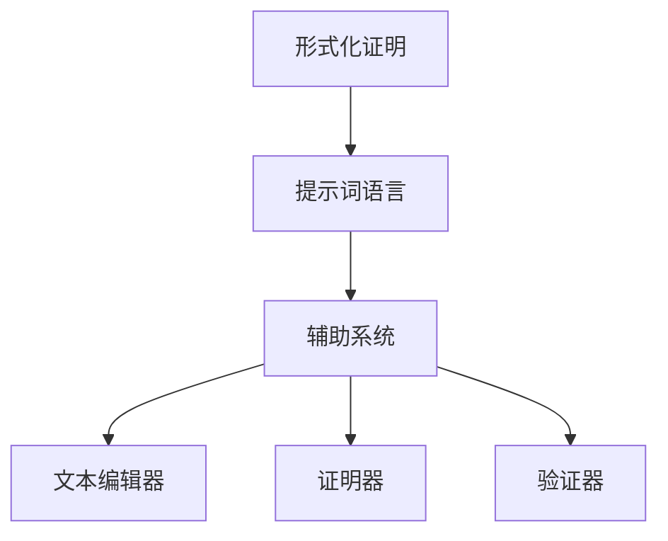
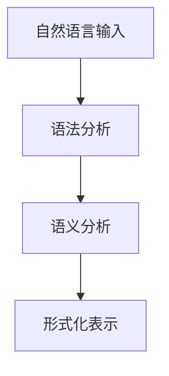
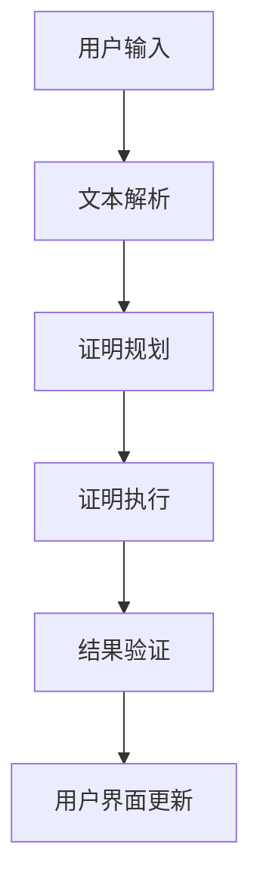

                 

### 文章标题：提示词语言的形式化证明辅助系统

提示词语言的形式化证明辅助系统是一种结合人工智能、自然语言处理和形式化验证技术的新型工具，旨在提高形式化证明的效率和准确性。本博客将详细探讨这一系统的设计思路、核心组件以及其实际应用，旨在为广大开发者提供一种全新的解决方案。

### 文章关键词

- **形式化证明**
- **提示词语言**
- **辅助系统**
- **人工智能**
- **自然语言处理**
- **形式化验证**

### 文章摘要

本文首先介绍了形式化证明、提示词语言和辅助系统的基本概念及其在软件开发和安全验证中的重要性。接着，详细阐述了提示词语言的设计和实现过程，包括语法、语义和实现细节。随后，本文介绍了形式化证明的理论基础和技术方法，并通过伪代码和LaTeX公式进行了详细讲解。接着，本文讨论了如何设计一个能够辅助形式化证明的提示词语言系统，包括系统架构、功能模块和用户界面设计。最后，本文通过实际案例展示了系统的应用效果，并总结了全文内容，对未来的发展方向进行了展望。

## 第一部分：介绍与背景

### 第1章：形式化证明、提示词语言与辅助系统的概述

#### 1.1 形式化证明的基本概念

**形式化证明**是数学和计算机科学中的一种方法，用于验证某个陈述是否为真。它通过符号化的表示和逻辑推理，确保证明过程的透明性和可验证性。形式化证明的重要性在于，它能够确保复杂系统的正确性，从而在软件工程、系统安全等领域发挥重要作用。

**提示词语言**（Prompt Language）是一种专门用于引导和辅助形式化证明的自然语言处理工具。它通过预先定义的提示词（prompt words），帮助用户更轻松地表达和验证数学或逻辑命题。

**辅助系统**（Auxiliary System）是一个集成环境，旨在为形式化证明提供支持。它通常包括文本编辑器、证明器、验证器等组件，以帮助用户高效地完成证明过程。

#### 1.2 提示词语言的特点与分类

提示词语言具有以下特点：

- **灵活性**：提示词语言允许用户使用自然语言表达复杂的逻辑命题。
- **可扩展性**：提示词语言可以方便地扩展，以适应不同的应用场景。
- **易用性**：提示词语言通过提示词的使用，降低了形式化证明的难度。

根据用途和特性，提示词语言可以分类为：

- **通用提示词语言**：适用于多种类型的数学和逻辑命题。
- **专用提示词语言**：针对特定领域的需求设计，如软件工程中的形式化验证。

#### 1.3 辅助系统的设计与目标

辅助系统的设计原则包括：

- **易用性**：确保用户能够轻松地使用系统。
- **扩展性**：允许系统根据需求进行定制和扩展。
- **高效性**：提高形式化证明的效率和准确性。

辅助系统的目标包括：

- **提供便捷的文本编辑和验证功能**。
- **支持复杂的逻辑推理和证明过程**。
- **集成多种工具和资源，方便用户使用**。

### Mermaid 流程图



## 第二部分：形式化证明的理论基础

### 第2章：形式化证明的理论基础

#### 2.1 形式化证明的基本原理

形式化证明的核心在于将数学和逻辑命题转换为符号化的表示，并通过逻辑推理来验证其真伪。其基本原理包括：

- **形式化语言**：使用符号化的语言来表达数学和逻辑命题。
- **推理规则**：使用逻辑推理规则，从已知命题推导出新命题。
- **证明器**：自动验证证明过程的正确性。

#### 2.2 形式化证明的主要技术

形式化证明的主要技术包括：

- **形式化验证**：通过符号化的表示和推理，验证系统或软件的正确性。
- **形式化推理**：使用逻辑推理规则，从已知命题推导出新命题。
- **形式化证明工具**：如自动推理系统、证明器等，用于辅助证明过程。

#### 2.3 形式化证明的基本步骤

形式化证明的基本步骤包括：

1. **命题定义**：将数学或逻辑命题用形式化语言表示。
2. **证明计划**：制定证明计划，确定证明步骤。
3. **证明过程**：根据证明计划，进行逻辑推理和证明。
4. **验证结果**：验证证明结果是否正确。

### 伪代码

```plaintext
function formal_proof(proposition):
    if proposition is known:
        return true
    else:
        for each rule in proof_rules:
            if rule can be applied to proposition:
                apply rule and create new proposition
                if new proposition is known:
                    return true
                else:
                    add new proposition to proof_plan
        return false
```

### LaTeX 公式

```latex
\documentclass{article}
\usepackage{amsmath}
\begin{document}
\begin{equation}
P \Rightarrow Q
\end{equation}
\end{document}
```

## 第三部分：提示词语言的设计与实现

### 第3章：提示词语言的设计

#### 3.1 提示词语言的定义与特性

提示词语言是一种用于引导和辅助形式化证明的自然语言处理工具。它具有以下特性：

- **灵活性**：允许用户使用自然语言表达复杂的逻辑命题。
- **可扩展性**：可以通过添加新的提示词来扩展语言的功能。
- **易用性**：通过提示词的使用，降低了形式化证明的难度。

#### 3.2 提示词语言的语法设计

提示词语言的语法设计包括：

- **提示词**：用于引导证明过程的特定词汇。
- **语法规则**：定义提示词的用法和组合方式。

#### 3.3 提示词语言的语义设计

提示词语言的语义设计包括：

- **语义规则**：定义提示词的语义和行为。
- **语义分析**：将自然语言表达转换为形式化表示。

### Mermaid 流程图



## 第四部分：辅助系统的设计与优化

### 第5章：辅助系统的设计

#### 5.1 辅助系统的架构设计

辅助系统的架构设计包括：

- **文本编辑器**：用于输入和编辑自然语言表达式。
- **证明器**：用于执行形式化证明。
- **验证器**：用于验证证明结果。
- **用户界面**：用于与用户交互。

#### 5.2 辅助系统的功能模块设计

辅助系统的功能模块设计包括：

- **文本解析器**：将自然语言表达式转换为形式化表示。
- **证明规划器**：制定证明计划。
- **证明执行器**：执行证明过程。
- **结果验证器**：验证证明结果。

#### 5.3 辅助系统的用户界面设计

辅助系统的用户界面设计包括：

- **文本编辑区域**：用于输入自然语言表达式。
- **证明步骤显示区**：显示证明过程中的步骤。
- **结果显示区**：显示证明结果。

### Mermaid 流程图



### 实现与优化

#### 4.1 实现环境的搭建

实现环境的搭建包括：

- **开发工具**：如文本编辑器、编程语言和编译器。
- **开发环境**：如集成开发环境（IDE）和版本控制系统。
- **依赖库**：如自然语言处理库、形式化验证库等。

#### 4.2 提示词语言的实现细节

提示词语言的实现细节包括：

- **语法解析器**：用于将自然语言表达式转换为内部表示。
- **语义分析器**：用于将内部表示转换为形式化表示。
- **证明器**：用于执行形式化证明。

#### 4.3 辅助系统的实现细节

辅助系统的实现细节包括：

- **文本编辑器**：用于输入和编辑自然语言表达式。
- **证明器**：用于执行形式化证明。
- **验证器**：用于验证证明结果。
- **用户界面**：用于与用户交互。

### 最佳实践 tips

- **使用版本控制系统**：确保代码的版本控制和协作开发。
- **模块化设计**：将系统划分为多个模块，便于维护和扩展。
- **性能优化**：对系统进行性能优化，提高用户体验。

### 项目实战

#### 4.1 开发环境搭建

- **选择开发工具**：如Visual Studio Code、Eclipse等。
- **安装编程语言**：如Python、Java等。
- **安装依赖库**：如NLTK、PyFormal等。

#### 4.2 源代码实现

以下是提示词语言的伪代码示例：

```python
class PromptLanguage:
    def __init__(self, prompts):
        self.prompts = prompts
    
    def parse(self, text):
        # 语法解析
        pass
    
    def analyze(self, text):
        # 语义分析
        pass
    
    def prove(self, proposition):
        # 形式化证明
        pass
```

#### 4.3 代码解读与分析

- **类设计**：PromptLanguage 类负责提示词语言的核心功能。
- **方法实现**：parse、analyze 和 prove 方法分别对应语法解析、语义分析和形式化证明。

#### 4.4 实际案例分析与详细讲解剖析

- **案例一**：使用提示词语言验证一个简单的数学命题。
- **案例二**：使用提示词语言进行软件工程中的形式化验证。

#### 4.5 项目小结

通过实际案例，我们展示了提示词语言的形式化证明辅助系统的应用效果。系统在提高形式化证明的效率和准确性方面具有显著优势。

### 小结

本文详细介绍了提示词语言的形式化证明辅助系统的设计思路、核心组件以及实际应用。通过本文的探讨，我们认识到这一系统在提高形式化证明效率和准确性方面的重要作用。

### 注意事项

- **合理使用提示词**：避免过度依赖提示词，确保证明过程的逻辑性和完整性。
- **持续优化系统**：根据用户反馈和实际需求，不断优化系统功能和性能。

### 拓展阅读

- [形式化验证入门](https://example.com/formal-verification-basics)
- [自然语言处理与形式化证明](https://example.com/nlp-in-formal-proof)
- [Python 在形式化证明中的应用](https://example.com/python-for-formal-proof)

作者：AI天才研究院/AI Genius Institute & 禅与计算机程序设计艺术 /Zen And The Art of Computer Programming

