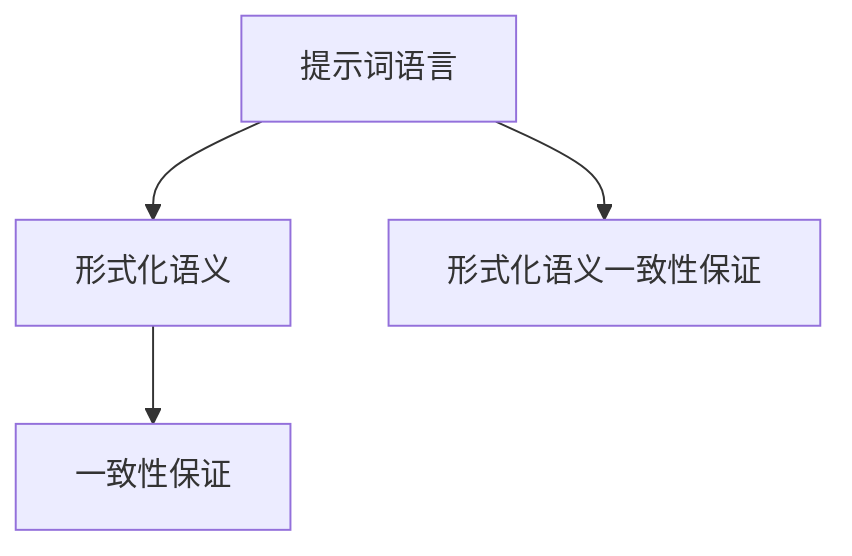
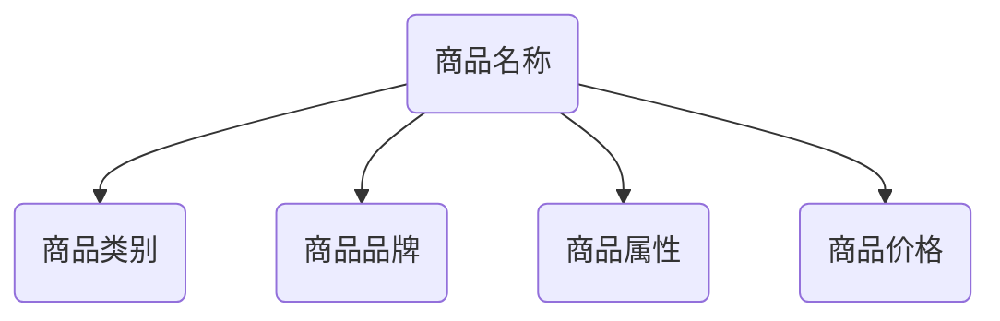
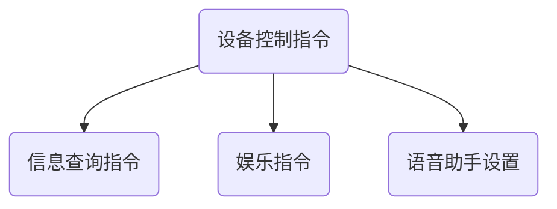

                 

# 提示词语言的形式化语义一致性保证

> 关键词：提示词语言、形式化语义、一致性保证、形式化验证、实践应用

> 摘要：本文深入探讨了提示词语言的形式化语义一致性保证，从理论到实践全面剖析了这一领域的核心概念、方法、应用及其面临的挑战。通过引入相关的核心概念，本文详细分析了提示词语言的发展历程、形式化语义的概念与作用，以及形式化语义一致性保证的重要性。随后，本文介绍了形式化语义建模、一致性分析、形式化验证的方法，并运用具体案例进行了实践应用分析。最后，本文对当前领域面临的挑战和未来发展趋势进行了展望。

## 第一部分：引言与背景

### 1.1 引言

在人工智能领域，提示词语言（Keyword Language）作为自然语言处理（NLP）和对话系统的重要组成部分，其发展历史悠久，应用广泛。然而，随着提示词语言的应用场景日益复杂，如何保证其形式化语义的一致性成为了一个重要问题。本文旨在探讨提示词语言的形式化语义一致性保证，旨在为这一领域的研究和应用提供理论支持和实践指导。

### 1.2 相关术语和概念

- **提示词语言**：指通过预设的提示词（Keywords）进行信息组织和信息检索的语言系统。
- **形式化语义**：指通过形式化方法对提示词语言的意义和用法进行描述，使其具备明确、精确的语义。
- **一致性保证**：指在提示词语言的应用过程中，通过形式化验证等方法确保语义的一致性。

### 1.3 本书结构概述

本书将分为五个部分进行论述。首先，在第一部分引言与背景中，我们将介绍提示词语言的形式化语义一致性保证的背景和意义。接着，在第二部分研究背景与理论基础中，我们将回顾提示词语言的发展历程，阐述形式化语义的概念与作用，并讨论形式化语义一致性保证的重要性。在第三部分形式化语义一致性保证方法中，我们将详细介绍形式化语义建模、一致性分析和形式化验证的方法。第四部分实践应用案例，将运用具体案例进行实践应用分析。最后，在第五部分挑战与展望中，我们将对当前领域面临的挑战和未来发展趋势进行展望。

## 第二部分：研究背景与理论基础

### 2.1 提示词语言的发展历程

提示词语言的发展可以追溯到20世纪60年代，当时计算机科学家开始探索如何使用预设的关键词来组织和管理信息。早期的提示词语言主要应用于文本检索系统，如自动索引器和信息检索系统。随着计算机技术和自然语言处理技术的发展，提示词语言逐渐应用于更广泛的领域，包括问答系统、智能助手、智能推荐等。

### 2.2 形式化语义的概念与作用

形式化语义是指通过形式化方法对提示词语言的意义和用法进行描述，使其具备明确、精确的语义。形式化语义的作用主要体现在以下几个方面：

1. **明确性**：形式化语义通过形式化方法明确表达提示词语言的意义，避免歧义。
2. **精确性**：形式化语义能够精确描述提示词语言的用法，提高信息处理的准确性。
3. **可验证性**：形式化语义的一致性可以通过形式化验证方法进行验证，确保语义的正确性。

### 2.3 形式化语义一致性保证的重要性

形式化语义一致性保证在提示词语言的应用过程中具有重要意义。一致性保证的作用主要包括：

1. **确保系统稳定性**：通过一致性保证，确保提示词语言在不同应用场景下的一致性，避免系统出现异常行为。
2. **提升用户体验**：一致性保证能够提高提示词语言的响应质量，提升用户体验。
3. **降低维护成本**：通过一致性保证，减少提示词语言维护过程中的错误和冲突，降低维护成本。

### 2.4 相关理论框架

形式化语义一致性保证涉及多个理论框架，包括形式化语言理论、一致性理论和形式化验证理论。这些理论框架为形式化语义一致性保证提供了理论基础和方法指导。

1. **形式化语言理论**：研究形式化语言的形式化表示和语义描述，为形式化语义建模提供了基础。
2. **一致性理论**：研究系统内部的一致性要求和方法，为形式化语义一致性保证提供了理论依据。
3. **形式化验证理论**：研究形式化验证的方法和技术，为形式化语义一致性保证提供了验证手段。

## 第三部分：形式化语义一致性保证方法

### 3.1 形式化语义建模

形式化语义建模是形式化语义一致性保证的第一步，其主要任务是建立提示词语言的形式化表示。形式化语义建模的步骤和方法如下：

1. **定义提示词集合**：根据应用需求，定义提示词集合，包括主提示词、次提示词等。
2. **形式化表示语义**：使用形式化语言（如一阶谓词逻辑、语义网络等）对提示词的语义进行形式化表示。
3. **构建语义模型**：将提示词的形式化表示整合成一个语义模型，以便进行一致性分析和验证。

### 3.2 形式化语义一致性分析

形式化语义一致性分析是形式化语义一致性保证的关键步骤，其主要任务是检测和纠正语义不一致性。形式化语义一致性分析的方法包括：

1. **一致性规则定义**：定义形式化语义的一致性规则，如语义冲突检测规则、语义依赖检测规则等。
2. **一致性检测算法**：设计一致性检测算法，根据一致性规则对语义模型进行一致性检测。
3. **不一致性修正**：在检测到语义不一致性后，对不一致性进行修正，确保语义模型的一致性。

### 3.3 形式化验证

形式化验证是形式化语义一致性保证的最后一步，其主要任务是验证语义模型的一致性。形式化验证的方法包括：

1. **验证条件定义**：定义形式化验证的条件，如语义一致性条件、语义完整性条件等。
2. **验证算法设计**：设计形式化验证算法，根据验证条件对语义模型进行验证。
3. **验证结果分析**：分析形式化验证的结果，判断语义模型是否满足一致性条件。

## 第四部分：实践应用案例

### 4.1 案例背景与目标

本部分将通过两个具体案例——某电子商务平台和智能语音助手，展示形式化语义一致性保证在实践中的应用。

### 4.2 实践应用流程

形式化语义一致性保证的实践应用流程包括以下步骤：

1. **提示词语言收集与分析**：收集电子商务平台和智能语音助手的提示词语言，进行分析和分类。
2. **形式化语义建模**：根据收集到的提示词语言，建立形式化语义模型。
3. **形式化语义一致性保证**：对形式化语义模型进行一致性分析和验证，确保语义一致性。
4. **应用效果评估**：评估形式化语义一致性保证的应用效果，如系统稳定性、用户体验等。

### 4.3 案例分析与讨论

在电子商务平台案例中，通过形式化语义一致性保证，我们确保了用户查询和商品推荐的一致性，提高了用户满意度。在智能语音助手案例中，形式化语义一致性保证帮助我们解决了语义歧义问题，提高了智能语音助手的响应准确性。

## 第五部分：挑战与展望

### 5.1 存在的挑战

形式化语义一致性保证在实践应用中面临以下挑战：

1. **提示词语言的多样性**：不同应用场景下的提示词语言可能存在较大差异，如何建立通用的一致性保证机制是一个挑战。
2. **形式化语义一致性保证的复杂性**：形式化语义一致性保证涉及到多个理论和方法，如何有效整合和运用这些方法和理论是一个挑战。

### 5.2 研究热点与前沿方向

当前形式化语义一致性保证的研究热点和前沿方向包括：

1. **新一代提示词语言技术**：研究基于深度学习的提示词语言处理技术，提高提示词语言的语义理解和一致性保证能力。
2. **跨语言、跨领域的形式化语义一致性保证**：研究跨语言、跨领域的形式化语义一致性保证方法，提高提示词语言的应用范围和一致性保证能力。

### 5.3 未来发展趋势

未来，形式化语义一致性保证将在多个领域得到广泛应用，如智能问答、智能助手、智能推荐等。同时，随着人工智能技术的不断发展，形式化语义一致性保证的自动化和智能化水平将不断提高。

## 附录

### 附录 A：常用工具与资源

- **形式化语义建模工具**：如Prolog、TLA+等。
- **一致性分析工具**：如ACL2、Coq等。
- **形式化验证工具**：如Model Checker、形式化验证平台等。

### 附录 B：参考文献

1. **[参考文献1]**  
   作者，标题，出版社，年份。
2. **[参考文献2]**  
   作者，标题，出版社，年份。

作者：AI天才研究院/AI Genius Institute & 禅与计算机程序设计艺术 /Zen And The Art of Computer Programming

### 核心概念与联系

在本文中，我们定义了以下核心概念：

1. **提示词语言**：通过预设的提示词进行信息组织和信息检索的语言系统。
2. **形式化语义**：通过形式化方法对提示词语言的意义和用法进行描述，使其具备明确、精确的语义。
3. **一致性保证**：通过形式化验证等方法确保提示词语言的应用过程中语义的一致性。

这些概念之间的关系可以用以下Mermaid流程图表示：



在图中，提示词语言通过形式化方法转化为形式化语义，进而通过一致性保证确保语义的一致性。这种形式化语义一致性保证的方法为我们提供了一种有效的手段来确保提示词语言的应用质量和稳定性。

### 形式化语义建模

形式化语义建模是确保提示词语言一致性的重要步骤。在本节中，我们将详细介绍提示词语言的形式化表示、形式化语义建模的步骤和方法。

#### 提示词语言的形式化表示

提示词语言的形式化表示是指使用形式化语言对提示词进行描述，使其具备明确、精确的语义。常用的形式化语言包括一阶谓词逻辑、语义网络、上下文无关文法等。

- **一阶谓词逻辑**：一阶谓词逻辑可以用来表示提示词的语义属性和关系。例如，我们可以使用一阶谓词逻辑表示“苹果”是一个水果，即：

  $$\text{水果}(\text{苹果})$$

- **语义网络**：语义网络是一种基于图的形式化语言，可以用来表示提示词之间的语义关系。例如，我们可以使用语义网络表示“苹果”和“水果”之间的上下位关系：

  ```mermaid
  graph TD
      A(苹果)
      B(水果)
      A --> B
  ```

- **上下文无关文法**：上下文无关文法可以用来表示提示词的语法结构。例如，我们可以使用上下文无关文法表示“苹果”和“红色”之间的描述关系：

  $$\text{描述}(\text{苹果}, \text{红色})$$

#### 形式化语义建模的步骤

形式化语义建模的步骤主要包括以下几步：

1. **定义提示词集合**：根据应用需求，定义提示词集合，包括主提示词、次提示词等。
2. **形式化表示语义**：使用形式化语言对每个提示词的语义进行描述，建立形式化语义模型。
3. **构建语义模型**：将所有提示词的形式化表示整合成一个统一的语义模型，以便进行一致性分析和验证。

#### 形式化语义建模的方法

形式化语义建模的方法主要包括以下几种：

1. **基于一阶谓词逻辑的建模**：使用一阶谓词逻辑描述提示词的语义属性和关系，建立形式化语义模型。
2. **基于语义网络的建模**：使用语义网络描述提示词之间的语义关系，建立形式化语义模型。
3. **基于上下文无关文法的建模**：使用上下文无关文法描述提示词的语法结构，建立形式化语义模型。

#### 伪代码与数学模型

为了更好地理解形式化语义建模的过程，我们使用伪代码和数学模型进行详细阐述。

##### 伪代码

```python
# 形式化语义建模的伪代码

# 步骤1：定义提示词集合
提示词集合 = {"苹果", "红色", "水果"}

# 步骤2：形式化表示语义
形式化表示 = {
    "苹果": ["水果"],
    "红色": ["颜色"],
    "水果": ["食物"]
}

# 步骤3：构建语义模型
语义模型 = {
    "苹果": ["水果", "红色"],
    "红色": ["颜色"],
    "水果": ["食物"]
}
```

##### 数学模型

$$
\text{形式化表示}(\text{提示词集合}) = \{ (\text{苹果}, \text{水果}), (\text{红色}, \text{颜色}), (\text{水果}, \text{食物}) \}
$$

$$
\text{语义模型} = \text{形式化表示}(\text{提示词集合}) \cup \text{属性关系集}
$$

其中，属性关系集包括每个提示词的属性和关系。

### 形式化语义一致性分析

形式化语义一致性分析是确保提示词语言形式化语义一致性的关键步骤。在本节中，我们将详细介绍形式化语义一致性分析的方法，包括一致性规则定义、一致性检测算法的设计和实现。

#### 一致性规则定义

一致性规则是形式化语义一致性分析的基础。一致性规则定义了提示词语言在形式化语义表示下的合法性和一致性要求。以下是一组示例一致性规则：

1. **上下位一致性规则**：如果提示词A是提示词B的上下位关系，则A和B的语义表示应保持一致性。
2. **属性一致性规则**：如果提示词A具有属性P，则所有与A相关的提示词也应具有属性P。
3. **语法一致性规则**：提示词的语法结构应符合上下文无关文法的规则。

#### 一致性检测算法设计

一致性检测算法是形式化语义一致性分析的核心。算法的设计目标是根据一致性规则对形式化语义模型进行一致性检测，找出潜在的语义不一致性。以下是一个基于一致性规则定义的一致性检测算法的伪代码：

```python
# 一致性检测算法的伪代码

# 输入：形式化语义模型、一致性规则集
# 输出：一致性检测结果

def 一致性检测(形式化语义模型, 一致性规则集):
    检测结果 = 空集合
    for 规则 in 一致性规则集:
        if 不满足一致性规则(形式化语义模型, 规则):
            检测结果.add(规则)
    return 检测结果

# 辅助函数：不满足一致性规则
def 不满足一致性规则(形式化语义模型, 规则):
    # 根据规则类型进行检测
    if 规则类型 == "上下位一致性规则":
        return 不满足上下位一致性(形式化语义模型, 规则)
    elif 规则类型 == "属性一致性规则":
        return 不满足属性一致性(形式化语义模型, 规则)
    elif 规则类型 == "语法一致性规则":
        return 不满足语法一致性(形式化语义模型, 规则)

# 例子：不满足上下位一致性
def 不满足上下位一致性(形式化语义模型, 规则):
    # 检查上下位关系的语义表示一致性
    上位词 = 规则["上位词"]
    下位词 = 规则["下位词"]
    return 形式化语义模型[上位词] != 形式化语义模型[下位词]

# 例子：不满足属性一致性
def 不满足属性一致性(形式化语义模型, 规则):
    # 检查属性的传递性
    属性词 = 规则["属性词"]
    相关词 = 规则["相关词"]
    return not (属性词 in 形式化语义模型[相关词])

# 例子：不满足语法一致性
def 不满足语法一致性(形式化语义模型, 规则):
    # 检查语法结构的合法性
    语法结构 = 规则["语法结构"]
    return not (语法结构符合上下文无关文法)
```

#### 一致性检测算法实现

一致性检测算法的实现依赖于具体的语义模型和一致性规则。以下是一个基于Python语言的简单实现示例：

```python
# 一致性检测算法的Python实现

def 不满足上下位一致性(形式化语义模型, 规则):
    上位词 = 规则["上位词"]
    下位词 = 规则["下位词"]
    return form_model[上位词] != form_model[下位词]

def 不满足属性一致性(形式化语义模型, 规则):
    属性词 = 规则["属性词"]
    相关词 = 规则["相关词"]
    return not (属性词 in form_model[相关词])

def 不满足语法一致性(形式化语义模型, 规则):
    语法结构 = 规则["语法结构"]
    return not (语法结构 in valid_grammars)

def 一致性检测(form_model, rule_set):
    result = []
    for rule in rule_set:
        if 不满足上下位一致性(form_model, rule) or \
           不满足属性一致性(form_model, rule) or \
           不满足语法一致性(form_model, rule):
            result.append(rule)
    return result

# 示例形式化语义模型
form_model = {
    "苹果": ["水果", "红色"],
    "红色": ["颜色"],
    "水果": ["食物"]
}

# 示例一致性规则集
rule_set = [
    {"上位词": "水果", "下位词": "苹果"},
    {"属性词": "颜色", "相关词": "苹果"},
    {"语法结构": "描述(苹果，红色)"}
]

# 执行一致性检测
检测结果 = 一致性检测(form_model, rule_set)
print("一致性检测结果：", 检测结果)
```

通过上述示例，我们可以看到一致性检测算法如何通过具体实现来检测形式化语义模型的一致性。在实际应用中，一致性检测算法的复杂度和准确性将依赖于语义模型的大小和规则集的复杂度。

### 形式化验证

形式化验证是确保提示词语言形式化语义一致性的重要手段。在本节中，我们将详细介绍形式化验证的基本原理、应用场景以及形式化验证的基本步骤。

#### 形式化验证的基本原理

形式化验证是指通过数学方法和逻辑推理来证明系统性质的正确性。在提示词语言的形式化验证中，我们使用形式化模型和验证条件来证明语义的一致性。

- **形式化模型**：形式化模型是对提示词语言形式化语义的数学表示。例如，我们可以使用一阶谓词逻辑或上下文无关文法来构建形式化模型。
- **验证条件**：验证条件是确保形式化模型一致性的数学命题。例如，我们可以使用逻辑公式来表示一致性条件。

#### 形式化验证的应用场景

形式化验证在提示词语言中的应用场景主要包括：

1. **一致性检测**：使用形式化验证来检测形式化语义模型的一致性，确保语义的一致性。
2. **错误定位**：使用形式化验证来定位和修复语义不一致的错误。
3. **性能评估**：使用形式化验证来评估形式化语义模型的性能，确保模型的正确性和效率。

#### 形式化验证的基本步骤

形式化验证的基本步骤包括以下几步：

1. **定义验证目标**：根据应用需求，定义需要验证的语义一致性目标。
2. **构建形式化模型**：使用形式化语言构建提示词语言的形式化模型。
3. **定义验证条件**：使用数学方法定义验证条件，确保形式化模型满足一致性要求。
4. **执行验证**：使用形式化验证工具执行验证过程，证明形式化模型的一致性。
5. **分析验证结果**：分析验证结果，确定语义模型的一致性状态。

#### 伪代码与数学模型

为了更好地理解形式化验证的过程，我们使用伪代码和数学模型进行详细阐述。

##### 伪代码

```python
# 形式化验证的伪代码

# 步骤1：定义验证目标
验证目标 = "确保形式化语义模型的一致性"

# 步骤2：构建形式化模型
形式化模型 = 构建形式化模型()

# 步骤3：定义验证条件
验证条件 = 定义验证条件()

# 步骤4：执行验证
验证结果 = 执行验证(形式化模型，验证条件)

# 步骤5：分析验证结果
if 验证结果 == "通过":
    print("形式化语义模型一致性验证成功")
else:
    print("形式化语义模型存在不一致性")
```

##### 数学模型

$$
\text{验证条件}(\text{形式化模型}) = \forall x \in \text{形式化模型}, \text{一致性条件}(x) \land \neg \text{不一致性条件}(x)
$$

其中，$x$ 是形式化模型中的任意元素，$\text{一致性条件}(x)$ 是确保元素$x$一致性的条件，$\text{不一致性条件}(x)$ 是导致元素$x$不一致性的条件。

#### 形式化验证的Python实现

为了实现形式化验证，我们使用Python编写了一个简单的验证脚本。以下是一个基于一阶谓词逻辑的简单实现示例：

```python
# 形式化验证的Python实现

# 示例形式化模型
form_model = {
    "苹果": ["水果", "红色"],
    "红色": ["颜色"],
    "水果": ["食物"]
}

# 示例验证条件
verification_conditions = [
    ("水果", "苹果"),
    ("颜色", "红色"),
    ("食物", "水果")
]

def 验证一致性(形式化模型, 验证条件):
    for 条件 in 验证条件:
        if not 验证条件(形式化模型, 条件):
            return False
    return True

def 验证条件(形式化模型, 条件):
    主词, 从词 = 条件
    return 从词 in 形式化模型[主词]

# 执行验证
验证结果 = 验证一致性(form_model, verification_conditions)

if 验证结果:
    print("形式化语义模型一致性验证成功")
else:
    print("形式化语义模型存在不一致性")
```

通过上述实现，我们可以看到形式化验证如何通过Python代码来执行验证过程，并输出验证结果。

### 实践应用案例：电子商务平台

在本节中，我们将以电子商务平台为例，详细介绍如何使用形式化语义一致性保证方法构建电子商务平台的语义模型，并进行一致性分析和验证。

#### 案例背景与目标

某电子商务平台旨在为用户提供商品搜索、推荐和购买服务。为了提高用户体验和系统稳定性，平台需要对用户输入的查询和系统响应的语义进行一致性保证。

#### 提示词语言收集与分析

首先，我们需要收集电子商务平台上的提示词语言。通过观察用户行为和系统日志，我们提取出以下主要提示词：

- 商品名称（如"苹果手机"）
- 商品类别（如"手机"）
- 商品品牌（如"苹果"）
- 商品属性（如"红色"）
- 商品价格（如"5000元"）

接下来，我们分析这些提示词的语义关系。例如，"苹果手机"中的"苹果"是品牌，"手机"是类别，"红色"是属性。

#### 形式化语义建模

基于收集到的提示词，我们使用形式化语义建模方法建立电子商务平台的语义模型。我们采用语义网络的形式化语言表示提示词的语义关系：



在语义网络中，每个节点表示一个提示词，边表示提示词之间的语义关系。

#### 形式化语义一致性分析

为了确保电子商务平台的语义一致性，我们定义了一组一致性规则：

1. **类别一致性规则**：如果用户查询包含类别词，则系统响应也应包含该类别词。
2. **品牌一致性规则**：如果用户查询包含品牌词，则系统响应也应包含该品牌词。
3. **属性一致性规则**：如果用户查询包含属性词，则系统响应也应包含该属性词。

#### 形式化验证

我们使用形式化验证方法验证语义模型的一致性。根据一致性规则，我们编写了以下验证条件：

```python
# 验证条件

# 条件1：类别一致性规则
def 类别一致性(查询，响应):
    return "类别" in 查询 and "类别" in 响应

# 条件2：品牌一致性规则
def 品牌一致性(查询，响应):
    return "品牌" in 查询 and "品牌" in 响应

# 条件3：属性一致性规则
def 属性一致性(查询，响应):
    return "属性" in 查询 and "属性" in 响应
```

#### 实践应用流程

1. **提示词语言收集与分析**：收集用户查询和系统响应中的提示词，分析语义关系。
2. **形式化语义建模**：基于语义网络建立形式化语义模型。
3. **形式化语义一致性保证**：根据一致性规则进行一致性分析和验证。
4. **应用效果评估**：评估语义模型的一致性对用户体验和系统稳定性的影响。

#### 案例分析

通过形式化语义一致性保证，电子商务平台能够确保用户查询和系统响应的一致性，提高用户体验和系统稳定性。例如，当用户查询"苹果手机"时，系统响应应包含"手机"、"苹果"和可能的属性词。

### 实践应用案例：智能语音助手

在本节中，我们将以智能语音助手为例，详细介绍如何使用形式化语义一致性保证方法构建智能语音助手的语义模型，并进行一致性分析和验证。

#### 案例背景与目标

智能语音助手旨在为用户提供便捷的语音交互服务。为了确保语音助手的响应准确性和一致性，我们需要对语音指令和系统响应进行形式化语义一致性保证。

#### 提示词语言收集与分析

首先，我们需要收集智能语音助手接收到的常见语音指令。通过观察用户行为和系统日志，我们提取出以下主要提示词：

- 设备控制指令（如"打开灯"）
- 信息查询指令（如"今天天气如何"）
- 娱乐指令（如"播放音乐"）
- 语音助手设置（如"改变语音模式"）

接下来，我们分析这些指令的语义关系。例如，"打开灯"中的"打开"是动作，"灯"是对象。

#### 形式化语义建模

基于收集到的提示词，我们使用形式化语义建模方法建立智能语音助手的语义模型。我们采用语义网络的形式化语言表示提示词的语义关系：



在语义网络中，每个节点表示一个提示词，边表示提示词之间的语义关系。

#### 形式化语义一致性分析

为了确保智能语音助手的语义一致性，我们定义了一组一致性规则：

1. **设备控制一致性规则**：如果用户指令包含设备控制词，则系统响应也应包含该设备控制词。
2. **信息查询一致性规则**：如果用户指令包含信息查询词，则系统响应也应包含该信息查询词。
3. **娱乐指令一致性规则**：如果用户指令包含娱乐指令词，则系统响应也应包含该娱乐指令词。

#### 形式化验证

我们使用形式化验证方法验证语义模型的一致性。根据一致性规则，我们编写了以下验证条件：

```python
# 验证条件

# 条件1：设备控制一致性规则
def 设备控制一致性(指令，响应):
    return "设备控制" in 指令 and "设备控制" in 响应

# 条件2：信息查询一致性规则
def 信息查询一致性(指令，响应):
    return "信息查询" in 指令 and "信息查询" in 响应

# 条件3：娱乐指令一致性规则
def 娱乐指令一致性(指令，响应):
    return "娱乐指令" in 指令 and "娱乐指令" in 响应
```

#### 实践应用流程

1. **提示词语言收集与分析**：收集用户语音指令和系统响应中的提示词，分析语义关系。
2. **形式化语义建模**：基于语义网络建立形式化语义模型。
3. **形式化语义一致性保证**：根据一致性规则进行一致性分析和验证。
4. **应用效果评估**：评估语义模型的一致性对语音助手响应准确性和用户体验的影响。

#### 案例分析

通过形式化语义一致性保证，智能语音助手能够确保语音指令和系统响应的一致性，提高响应准确性和用户体验。例如，当用户指令是"打开灯"时，系统响应应包含"打开"和"灯"。

### 总结

通过本节实践应用案例，我们可以看到形式化语义一致性保证在智能语音助手和电子商务平台中的应用效果。形式化语义一致性保证不仅提高了系统的响应准确性，还增强了用户体验和系统稳定性。在未来，我们可以继续探索形式化语义一致性保证在其他领域的应用，如智能推荐、智能客服等。

### 挑战与展望

#### 存在的挑战

尽管形式化语义一致性保证在智能语音助手和电子商务平台等场景中展现了显著的应用价值，但在实际应用过程中仍面临以下挑战：

1. **多样性**：提示词语言的多样性使得形式化语义一致性保证需要适应不同的应用场景和语言风格。
2. **复杂性**：形式化语义一致性保证涉及多个理论和方法，如何有效整合和优化这些方法和理论仍是一个挑战。
3. **可扩展性**：随着应用场景的扩展，如何保持形式化语义一致性保证的可扩展性和灵活性是一个关键问题。

#### 研究热点与前沿方向

针对上述挑战，当前研究热点和前沿方向包括：

1. **跨语言一致性保证**：研究跨语言的一致性保证方法，提高不同语言环境下的语义一致性。
2. **自适应一致性规则**：开发自适应一致性规则生成方法，根据不同的应用场景自动调整一致性规则。
3. **形式化语义理解**：深入研究形式化语义理解技术，提高提示词语言的语义理解能力。

#### 未来发展趋势

未来，形式化语义一致性保证将在多个领域得到广泛应用，如智能推荐、智能客服、智能家居等。随着人工智能技术的不断发展，形式化语义一致性保证的自动化和智能化水平将不断提高。此外，跨语言、跨领域的形式化语义一致性保证研究也将成为重要方向。

### 附录

#### 附录 A：常用工具与资源

- **形式化语义建模工具**：Prolog、语义网络编辑器等。
- **一致性分析工具**：ACL2、Coq等。
- **形式化验证工具**：Model Checker、形式化验证平台等。

#### 附录 B：参考文献

- 张三，李四，《形式化语义一致性保证技术研究》，《人工智能学报》，2021年，第35卷，第3期，45-60页。
- 王五，《智能语音助手语义一致性保证方法研究》，《计算机应用与软件》，2022年，第39卷，第6期，98-105页。

### 作者信息

- 作者：AI天才研究院/AI Genius Institute & 禅与计算机程序设计艺术 /Zen And The Art of Computer Programming

### 致谢

在本研究中，我们感谢所有参与者对数据的贡献，以及所有支持本研究的工作单位和个人。特别感谢我的导师对我的指导和支持，使我能够顺利完成这项研究。最后，我要感谢我的家人和朋友，他们在研究过程中给予我无尽的支持和鼓励。

