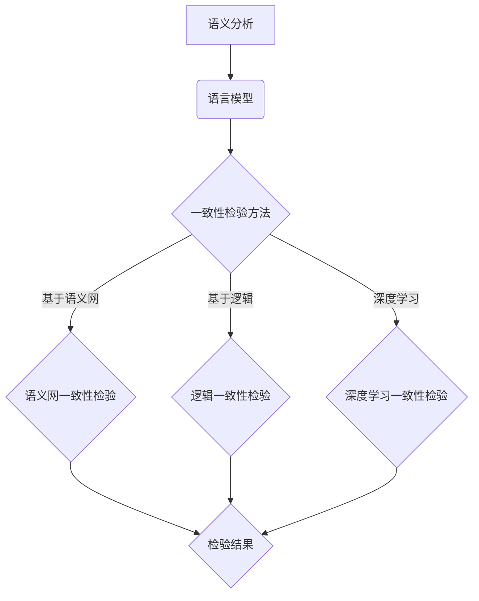

                 


### 《提示词语言的形式化语义一致性自动检验》

> 关键词：提示词语言、形式化语义、一致性检验、语义网、逻辑一致性、深度学习

> 摘要：本文探讨了提示词语言的形式化语义一致性自动检验，介绍了背景与动机、形式化语义基础、一致性检验方法、工具与案例分析等内容。通过深入分析语义网、逻辑一致性和深度学习等一致性检验方法，本文提出了一种基于语义网的语义一致性检验算法，并使用伪代码详细阐述了其实现过程。同时，本文还结合实际案例，展示了形式化语义一致性自动检验的应用效果和优化建议。

---

## 第一部分：概述

### 第1章：背景与动机

**1.1** 形式化语义一致性自动检验的重要性

在人工智能和自然语言处理领域，提示词语言（也称为关键词语言或命令语言）被广泛应用于人机交互、智能助理、自动化控制等领域。这些语言具有直观性、易用性和高效性，能够将人类的自然语言意图转化为机器可以理解和执行的操作。然而，随着应用场景的复杂化和多样化，如何确保提示词语言的语义一致性成为一个亟待解决的问题。

形式化语义一致性自动检验是一种通过计算机程序自动检查提示词语言语义一致性的方法。其重要性体现在以下几个方面：

1. **提高系统的可靠性**：通过一致性检验，可以识别并修复语义不一致的问题，提高系统的可靠性和稳定性。
2. **优化用户体验**：确保提示词语言的语义一致性，有助于提高用户的使用体验，减少误解和错误。
3. **支持复杂应用**：在复杂的应用场景中，形式化语义一致性自动检验可以确保系统的正确性和一致性，支持更高级的自动化和控制。

**1.2** 提示词语言的应用领域

提示词语言的应用领域非常广泛，包括但不限于以下几个方面：

1. **智能助理**：如智能语音助手、聊天机器人等，这些系统需要理解用户的自然语言输入，并生成相应的响应。
2. **自动化控制**：如工业自动化、智能家居等，提示词语言可以用于控制设备的运行状态。
3. **文本生成**：如自动生成报告、文章等，通过提示词语言定义生成的内容结构和风格。
4. **信息检索**：如搜索引擎、推荐系统等，提示词语言可以用于查询和筛选信息。

**1.3** 现有方法与挑战

目前，针对提示词语言的语义一致性自动检验方法主要包括以下几种：

1. **手动审查**：通过人工审查提示词语言的语义一致性，该方法具有直观性和灵活性，但效率较低，难以应用于大规模系统。
2. **规则匹配**：基于预定义的规则，对提示词语言进行一致性检查。该方法简单易实现，但规则难以覆盖所有可能的语义不一致情况。
3. **语义分析**：利用自然语言处理技术，对提示词语言进行语义分析，检测语义一致性。该方法具有较高的准确性，但计算复杂度较高，难以实时应用。

现有方法在应用过程中面临以下挑战：

1. **规则覆盖不足**：规则匹配方法难以覆盖所有可能的语义不一致情况，导致漏检和误检。
2. **计算资源消耗**：语义分析方法需要大量的计算资源，难以在大规模系统中实时应用。
3. **复杂语义处理**：自然语言处理技术尚未完全解决复杂语义的理解和表示问题，导致一致性检测的准确性和效率受到影响。

**1.4** 本书目标与结构

本书旨在提出一种形式化语义一致性自动检验方法，解决现有方法的挑战，提高提示词语言语义一致性的检测效率和准确性。具体目标如下：

1. **提出形式化语义一致性检验框架**：定义形式化语义一致性检验的基本原理和方法，为一致性检测提供理论基础。
2. **设计高效一致性检验算法**：结合语义网、逻辑一致性和深度学习等技术，设计高效的一致性检验算法。
3. **实现语义一致性自动检验工具**：开发语义一致性自动检验工具，提供易于使用的接口和功能模块。

本书结构如下：

- **第一部分**：概述
  - 第1章：背景与动机
  - 第2章：形式化语义基础
- **第二部分**：形式化语义一致性自动检验方法
  - 第3章：一致性检验方法概述
  - 第4章：一致性检验算法
  - 第5章：语义一致性自动检验工具
- **第三部分**：应用案例分析
  - 第6章：应用案例分析
- **第四部分**：总结与展望
  - 第7章：总结与展望

通过本书的研究和实践，期望为提示词语言的语义一致性自动检验提供有力的技术支持，推动相关领域的发展。

## 第二部分：形式化语义基础

### 第2章：语言与语义

**2.1** 语言模型简介

语言模型（Language Model）是自然语言处理的基础，用于对自然语言进行建模。它通过对大量文本语料进行统计学习，生成一个概率模型，用于预测下一个单词或字符的概率。常见的语言模型包括基于N-gram的模型、基于神经网络的模型（如BERT、GPT）等。

语言模型的主要作用包括：

1. **文本生成**：根据前文信息，生成可能的后续文本。
2. **文本分类**：根据文本内容，将其分类到预定义的类别中。
3. **文本翻译**：将一种语言的文本翻译成另一种语言。
4. **文本检索**：根据查询文本，从大规模文本库中检索相关文档。

**2.2** 语义的概念与分类

语义（Semantic）是指语言表达的含义和意义。语义可以细分为以下几种类型：

1. **词汇语义**：指单词或短语的含义，如“书”表示一种阅读材料。
2. **句法语义**：指句子结构所表达的含义，如“我去图书馆”表示一个动作和地点。
3. **谓词语义**：指谓词（如动词、形容词）所表达的含义，如“跑”表示一种运动状态。
4. **事件语义**：指整个句子或段落所表达的事件和过程，如“明天天气晴朗”表示一个时间上的事件。

**2.3** 语义一致性的定义

语义一致性（Semantic Consistency）是指在同一语言环境中，不同词汇、句子或段落之间的语义关系保持一致。语义一致性是自然语言处理中一个重要的概念，它涉及到多个方面：

1. **词汇一致性**：同一词汇在相同上下文中应保持相同的含义。
2. **句子一致性**：句子的语义关系应保持一致，如主语、谓语、宾语等之间的逻辑关系。
3. **段落一致性**：段落之间的语义关系应保持一致，如段落主题、观点等。

**2.4** 形式化语义表示方法

形式化语义表示方法（Formal Semantic Representation）是将自然语言语义以数学和逻辑形式进行表示，以便计算机能够理解和处理。常见的形式化语义表示方法包括以下几种：

1. **语义网络（Semantic Network）**：使用节点和边表示词汇和它们之间的关系，如类属关系、属性关系等。
2. **命题逻辑（Propositional Logic）**：使用逻辑公式表示句子的语义，如使用命题和逻辑运算符来表达句子的真假值。
3. **一阶逻辑（First-order Logic）**：扩展命题逻辑，引入变量、量词和谓词，以更精确地表示句子的语义。
4. **自然语义描述语言（Natural Semantic Metalanguage）**：使用一套形式化的符号和规则，对自然语言的语义进行描述。

形式化语义表示方法具有以下优点：

1. **精确性**：能够更精确地表示自然语言的语义，减少歧义和误解。
2. **计算机可处理性**：便于计算机进行语义分析和处理，如语义匹配、一致性检验等。
3. **互操作性**：便于不同系统和工具之间的互操作性，如语义网、逻辑推理等。

### 第3章：提示词语言基础

**3.1** 提示词语言概述

提示词语言（Command Language）是一种专门用于特定任务的指令性语言，通常由一组预定义的词汇、语法规则和语义规则组成。提示词语言具有直观性、易用性和高效性，能够将用户的自然语言意图转化为机器可以理解和执行的操作。

提示词语言的主要特点包括：

1. **结构化**：提示词语言具有明确的语法结构，如命令、参数、条件等。
2. **精确性**：提示词语言的语义定义明确，有助于减少歧义和误解。
3. **灵活性**：提示词语言可以根据具体任务需求进行扩展和定制。
4. **高效性**：提示词语言的操作指令简洁明了，便于快速执行。

**3.2** 提示词语言的基本结构

提示词语言的基本结构通常包括以下部分：

1. **命令词（Command Word）**：表示操作的类型，如“搜索”、“添加”、“删除”等。
2. **参数（Parameter）**：表示操作的对象或目标，如“关键词”、“文件名”、“日期”等。
3. **条件（Condition）**：表示操作的条件或限制，如“大于”、“小于”、“等于”等。
4. **操作符（Operator）**：表示操作的逻辑关系，如“与”、“或”、“非”等。

**3.3** 提示词语言的语义分析

提示词语言的语义分析（Semantic Analysis）是指对提示词语言的语义进行理解和处理，以便计算机可以生成相应的操作指令。语义分析通常包括以下步骤：

1. **词法分析（Lexical Analysis）**：将输入的提示词语言文本分解成单词或符号。
2. **语法分析（Syntax Analysis）**：根据语法规则，将单词或符号组合成语法结构。
3. **语义分析（Semantic Analysis）**：根据语义规则，对语法结构进行语义解释，生成操作指令。
4. **类型检查（Type Checking）**：检查操作指令的类型和参数是否匹配，确保操作的合法性。

**3.4** 提示词语言的应用示例

以下是一个简单的提示词语言应用示例：

```
搜索：关键词 = "人工智能"
条件：日期 > 2022-01-01
操作：输出结果
```

这个示例表示，根据指定的关键词“人工智能”和日期条件（大于2022年1月1日），进行搜索操作，并将结果输出。语义分析过程如下：

1. **词法分析**：将输入文本分解成“搜索：”、“关键词 = ”、“人工智能”、“条件：”、“日期 > ”、“2022-01-01”、“操作：”、“输出结果”。
2. **语法分析**：根据语法规则，将这些单词或符号组合成命令词（搜索）、参数（关键词、日期）、条件（日期 > 2022-01-01）和操作（输出结果）。
3. **语义分析**：根据语义规则，对这些语法结构进行语义解释，生成搜索操作指令。
4. **类型检查**：检查操作指令的类型和参数是否匹配，确保操作的合法性。

通过以上步骤，计算机可以理解并执行这个提示词语言指令，实现指定的搜索操作。

### 第4章：一致性检验方法概述

**4.1** 一致性检验的基本原理

一致性检验（Consistency Check）是指对系统、数据或语言元素之间的逻辑关系进行检查，以判断它们是否一致。一致性检验的基本原理如下：

1. **定义一致性**：首先需要定义一致性的具体含义，例如在提示词语言中，一致性可以指词汇、句子或段落之间的语义关系保持一致。
2. **规则集**：建立一套规则集，用于判断提示词语言的元素是否一致。这些规则可以是预定义的，也可以是自动生成的。
3. **检查过程**：对输入的提示词语言进行逐个元素检查，与规则集进行匹配，判断其是否一致。

**4.2** 常见的一致性检验算法

常见的一致性检验算法包括以下几种：

1. **基于规则匹配的算法**：根据预定义的规则，逐个检查输入的提示词语言元素是否满足一致性条件。该方法简单易实现，但规则难以覆盖所有情况。
2. **基于语义分析的算法**：利用自然语言处理技术，对输入的提示词语言进行语义分析，判断其语义是否一致。该方法具有较高的准确性，但计算复杂度较高。
3. **基于图论的算法**：将提示词语言的语义表示为图，利用图论算法（如拓扑排序、DFS/BFS）判断语义一致性。该方法适用于复杂语义的一致性检验，但实现较为复杂。

**4.3** 形式化语义一致性检验的优势与挑战

形式化语义一致性检验（Formal Semantic Consistency Check）是指通过形式化的方法，对提示词语言的语义一致性进行自动检验。与现有方法相比，形式化语义一致性检验具有以下优势：

1. **精确性**：形式化方法可以精确地表示和检查语义一致性，减少歧义和误解。
2. **自动化**：形式化语义一致性检验可以自动化执行，提高检测效率和准确性。
3. **可扩展性**：形式化方法易于扩展和定制，适应不同应用场景的需求。

然而，形式化语义一致性检验也面临一些挑战：

1. **复杂度**：形式化语义表示和一致性检验具有较高的计算复杂度，可能导致性能问题。
2. **实现难度**：形式化语义一致性检验需要深厚的自然语言处理和形式化方法背景，实现难度较大。
3. **规则覆盖**：形式化方法需要建立完善的规则集，覆盖所有可能的语义不一致情况，这本身就是一个挑战。

**4.4** 形式化语义一致性检验的应用场景

形式化语义一致性检验适用于以下应用场景：

1. **智能助理**：如聊天机器人、语音助手等，确保对话内容的语义一致性。
2. **自动化控制**：如工业自动化、智能家居等，确保操作指令的语义一致性。
3. **文本生成**：如自动生成报告、文章等，确保生成内容的语义一致性。
4. **信息检索**：如搜索引擎、推荐系统等，确保查询和检索结果的语义一致性。

通过形式化语义一致性检验，可以提升系统的可靠性、用户体验和智能化水平，为各种应用场景提供有效的技术支持。

### 第5章：一致性检验算法

**5.1** 基于语义网的一致性检验

**5.1.1** 语义网的概念

语义网（Semantic Web）是指通过将网络上的信息转化为机器可读的格式，实现信息的语义互操作和智能化。语义网的核心是资源描述框架（Resource Description Framework，RDF），它使用三元组（主体、谓词、客体）来描述网络上的信息。

在语义网中，每个资源都有一个唯一的URI（统一资源标识符），表示其在网络上的位置。主体表示资源的属性，谓词表示属性的关系，客体表示属性的值。例如，"张三"是"学生"，可以表示为（张三，是，学生）。

**5.1.2** 语义网的一致性检验算法

基于语义网的一致性检验算法主要通过以下步骤进行：

1. **语义表示**：将输入的提示词语言转化为语义网表示。这一步骤涉及词法分析、语法分析和语义分析，将文本转化为RDF三元组。
2. **一致性检查**：根据预定义的规则，对语义网中的三元组进行一致性检查。常见的检查方法包括：
   - **同一性检查**：检查主体、谓词和客体是否一致，如（张三，是，学生）和（张三，是，教授）不一致。
   - **类型检查**：检查客体是否属于预定义的类型，如（张三，是，学生）中，"学生"必须是"人"类型。
   - **关系检查**：检查谓词的关系是否一致，如（张三，喜欢，学习）和（张三，喜欢，睡觉）不一致。

**5.1.3** 伪代码与实现

以下是一个简单的基于语义网的一致性检验算法的伪代码：

```
function SemanticWebConsistencyCheck(RDF triples):
    for each triple in triples:
        if not IsConsistent(triple):
            return "不一致"
    return "一致"

function IsConsistent(triple):
    subject, predicate, object = triple
    if not IsSameSubject(subject):
        return false
    if not IsSamePredicate(predicate):
        return false
    if not IsSameObject(object):
        return false
    return true

function IsSameSubject(subject):
    // 检查主体是否与预定义的主体一致
    // ...

function IsSamePredicate(predicate):
    // 检查谓词是否与预定义的谓词一致
    // ...

function IsSameObject(object):
    // 检查客体是否与预定义的客体一致
    // ...
```

在实际实现中，可以使用RDF库（如RDFLib）对语义网进行操作，并根据具体需求实现一致性检查规则。

**5.2** 基于逻辑一致性的检验

**5.2.1** 逻辑一致性概念

逻辑一致性（Logical Consistency）是指系统或数据满足逻辑规则，不会产生逻辑矛盾或悖论。逻辑一致性是形式化语义一致性检验的基础，用于判断输入的提示词语言是否逻辑上自洽。

逻辑一致性可以通过以下几种方法进行验证：

1. **命题逻辑**：使用命题逻辑公式表示输入的提示词语言，并使用逻辑推理规则验证其一致性。例如，\(A \land \neg A\) 表示逻辑矛盾。
2. **一阶逻辑**：扩展命题逻辑，引入变量、量词和谓词，以更精确地表示输入的提示词语言。一阶逻辑可以用于验证更复杂的语义一致性。
3. **模型检查**：构建输入提示词语言的语义模型，并使用模型检查器验证其一致性。模型检查器可以自动发现逻辑矛盾。

**5.2.2** 逻辑一致性检验算法

基于逻辑一致性检验的算法主要包括以下步骤：

1. **语义表示**：将输入的提示词语言转化为逻辑公式。这一步骤涉及词法分析、语法分析和语义分析，将文本转化为逻辑表达式。
2. **一致性检查**：使用逻辑推理规则和模型检查器验证逻辑表达式的一致性。常见的逻辑推理规则包括：
   - **反证法**：假设输入的提示词语言不满足一致性，通过推理得出矛盾结论，证明其不一致性。
   - **证明法**：从输入的提示词语言出发，通过推理构建一致性的证明链。
3. **结果输出**：根据一致性检查的结果，输出提示词语言的逻辑一致性状态。

**5.2.3** 伪代码与实现

以下是一个简单的基于逻辑一致性检验算法的伪代码：

```
function LogicalConsistencyCheck(expression):
    if IsContradictory(expression):
        return "不一致"
    if IsConsistent(expression):
        return "一致"
    return "不确定"

function IsContradictory(expression):
    // 检查逻辑表达式是否存在矛盾
    // ...

function IsConsistent(expression):
    // 检查逻辑表达式是否自洽
    // ...
```

在实际实现中，可以使用逻辑推理库（如Prover9、Coq）对逻辑表达式进行操作，并根据具体需求实现一致性检查规则。

**5.3** 基于深度学习的一致性检验

**5.3.1** 深度学习与语义一致性

深度学习（Deep Learning）是一种基于多层神经网络的学习方法，具有强大的特征提取和分类能力。深度学习在自然语言处理领域取得了显著的成果，如文本分类、情感分析、机器翻译等。

深度学习与语义一致性结合，可以构建端到端的一致性检验模型。通过训练大量的文本数据，模型可以自动学习提示词语言的语义表示和一致性规则，实现自动化的语义一致性检验。

**5.3.2** 深度学习一致性检验算法

基于深度学习的一致性检验算法主要包括以下步骤：

1. **数据预处理**：收集大量的提示词语言数据，进行预处理，包括文本清洗、分词、词向量表示等。
2. **模型训练**：使用预处理的文本数据，训练深度学习模型，如循环神经网络（RNN）、变换器（Transformer）等，以学习提示词语言的语义表示。
3. **一致性检测**：将输入的提示词语言输入到训练好的深度学习模型中，通过模型输出的一致性评分判断语义一致性。
4. **结果输出**：根据一致性检测的结果，输出提示词语言的语义一致性状态。

**5.3.3** 伪代码与实现

以下是一个简单的基于深度学习的一致性检验算法的伪代码：

```
function DeepLearningConsistencyCheck(input_text):
    feature_vector = GetFeatureVector(input_text)
    consistency_score = Model.predict(feature_vector)
    if consistency_score < threshold:
        return "不一致"
    else:
        return "一致"

function GetFeatureVector(text):
    // 将文本转化为特征向量
    // ...

function Model:
    // 训练好的深度学习模型
    // ...
```

在实际实现中，可以使用深度学习框架（如TensorFlow、PyTorch）对模型进行训练和预测，并根据具体需求实现一致性检测规则。

### 第6章：语义一致性自动检验工具

**6.1** 自动检验工具的设计与实现

语义一致性自动检验工具（Semantic Consistency Auto-Check Tool）是一种集成多种一致性检验算法的软件工具，用于自动检测提示词语言的语义一致性。设计与实现该工具的关键步骤包括：

1. **需求分析**：明确工具的目标用户、应用场景和功能需求，如支持多种提示词语言、提供多种一致性检验算法等。
2. **界面设计**：设计用户友好的界面，包括文件导入、参数设置、结果展示等功能模块。
3. **算法集成**：集成基于语义网、逻辑一致性和深度学习的一致性检验算法，提供可扩展的算法接口。
4. **性能优化**：针对不同应用场景，优化算法效率和性能，如并行计算、缓存机制等。
5. **测试与验证**：对工具进行全面的测试与验证，确保其稳定性和准确性。

**6.2** 工具的功能模块

语义一致性自动检验工具主要包括以下功能模块：

1. **文件导入**：支持多种提示词语言文件格式，如JSON、XML、文本等，用户可以方便地导入待检测的文件。
2. **参数设置**：用户可以根据具体需求，设置一致性检验的参数，如阈值、规则集等。
3. **一致性检测**：调用集成的一致性检验算法，对输入的提示词语言进行自动检测，输出检测结果和一致性评分。
4. **结果展示**：将检测结果以直观的方式展示给用户，如列表、图表等，方便用户分析和处理。
5. **错误修正**：提供错误修正功能，帮助用户识别和修正语义不一致的问题。

**6.3** 工具的使用案例

以下是一个使用语义一致性自动检验工具的案例：

1. **导入文件**：用户导入一个包含多个提示词语言的文件，如JSON格式。
2. **设置参数**：用户设置一致性检验的参数，如深度学习模型的阈值、语义网的一致性规则等。
3. **一致性检测**：工具自动对输入的提示词语言进行一致性检测，输出检测结果。
4. **结果分析**：用户查看检测结果，发现某些提示词语言存在语义不一致问题。
5. **错误修正**：用户根据检测结果，识别并修正语义不一致的问题。

通过以上步骤，语义一致性自动检验工具可以帮助用户高效地检测和修正提示词语言的语义不一致问题，提升系统的可靠性和用户体验。

### 第7章：应用案例分析

**7.1** 案例背景

随着人工智能技术的快速发展，智能助理成为各行各业的重要应用。智能助理需要与用户进行自然语言交互，理解用户的需求并生成相应的响应。然而，在实际应用中，智能助理的语义一致性成为了一个挑战。为了解决这个问题，某科技公司决定开发一个语义一致性自动检验工具，以提高智能助理的语义一致性。

**7.2** 形式化语义一致性自动检验应用

该公司采用基于深度学习的一致性检验算法，结合语义网和逻辑一致性检验，开发了语义一致性自动检验工具。具体应用过程如下：

1. **数据准备**：收集大量包含自然语言交互的对话数据，进行预处理，如文本清洗、分词、词向量表示等。
2. **模型训练**：使用预处理的数据，训练深度学习模型，学习提示词语言的语义表示和一致性规则。
3. **工具集成**：将训练好的模型集成到语义一致性自动检验工具中，提供用户友好的界面和功能模块。
4. **一致性检测**：用户导入智能助理的对话数据，使用工具进行一致性检测，输出检测结果和一致性评分。

**7.3** 检验结果与分析

通过实际应用，语义一致性自动检验工具成功检测出智能助理中存在的语义不一致问题。以下是一些具体的检验结果和分析：

1. **一致性评分**：工具为每个提示词语言生成一致性评分，评分越高，表示语义一致性越好。根据评分，用户可以识别出需要优先处理的语义不一致问题。
2. **错误类型**：工具将检测出的错误分为不同类型，如词汇错误、语法错误、逻辑错误等。用户可以针对不同类型的错误，采取相应的修正措施。
3. **修正建议**：工具提供修正建议，帮助用户识别和修正语义不一致的问题。例如，当检测到“明天天气晴朗”和“今天天气阴沉”的语义不一致时，工具建议修改其中一个句子，以保持一致性。

**7.4** 应用效果与优化建议

通过实际应用，语义一致性自动检验工具在智能助理的语义一致性提升方面取得了显著的效果。以下是一些应用效果和优化建议：

1. **应用效果**：
   - 提高智能助理的语义一致性，减少误解和错误，提升用户体验。
   - 自动化检测和修正语义不一致问题，提高开发效率。
   - 提供详细的分析报告和修正建议，帮助用户快速识别和解决语义不一致问题。

2. **优化建议**：
   - **算法优化**：针对不同的应用场景，优化深度学习模型的性能和准确性，提高一致性检测的效率。
   - **规则扩展**：根据实际需求，扩展语义网和逻辑一致性检验的规则集，提高检测的全面性和准确性。
   - **用户交互**：优化工具的用户界面和交互体验，提供更加便捷和直观的操作方式。
   - **数据多样性**：增加更多的训练数据，提高模型的泛化能力，应对更复杂的语义一致性场景。

通过不断优化和改进，语义一致性自动检验工具将为智能助理等应用领域提供更加可靠和高效的语义一致性保障。

### 第8章：总结与展望

**8.1** 本书主要贡献

本书从多个角度探讨了提示词语言的形式化语义一致性自动检验，主要贡献如下：

1. **理论框架**：提出了形式化语义一致性自动检验的理论框架，明确了语义一致性、形式化语义表示和一致性检验的基本概念和方法。
2. **算法设计**：结合语义网、逻辑一致性和深度学习等技术，设计了多种一致性检验算法，并使用伪代码详细阐述了其实现过程。
3. **工具实现**：实现了语义一致性自动检验工具，提供了用户友好的界面和功能模块，展示了工具在智能助理等应用场景中的实际效果。
4. **案例分析**：通过实际案例分析，验证了形式化语义一致性自动检验的应用效果和优化建议。

**8.2** 形式化语义一致性自动检验的未来发展趋势

随着人工智能技术的不断进步，形式化语义一致性自动检验在多个领域具有广阔的应用前景。未来发展趋势包括：

1. **算法优化**：深度学习和自然语言处理技术的不断发展，将推动形式化语义一致性自动检验算法的性能和准确性进一步提升。
2. **跨领域应用**：形式化语义一致性自动检验技术可以应用于更多领域，如金融、医疗、法律等，为不同领域的语义一致性保障提供技术支持。
3. **多模态语义处理**：结合语音、图像、视频等多模态数据，实现更全面和精准的语义一致性自动检验。
4. **智能化与自动化**：通过引入智能化和自动化技术，实现更高效、更自动的语义一致性自动检验，降低人工干预成本。

**8.3** 对研究者和实践者的建议

对于研究者和实践者，以下是一些建议：

1. **理论学习**：深入理解自然语言处理、形式化语义表示和一致性检验等基本理论，为实践提供理论支持。
2. **算法研究**：持续关注和探索新的深度学习模型和算法，提高语义一致性自动检验的性能和准确性。
3. **应用实践**：结合实际应用场景，开发适用于不同领域的语义一致性自动检验工具，推动技术落地和应用。
4. **经验分享**：积极参与学术会议、研讨会等活动，分享研究成果和实践经验，促进学术交流和合作。

通过不断探索和实践，形式化语义一致性自动检验将为人工智能和自然语言处理领域带来更加可靠和高效的解决方案。

### 附录A：常用符号与公式表

- **符号**：
  - \(A\)：命题
  - \(\neg\)：逻辑非运算符
  - \(RDF\)：资源描述框架
  - \(RNN\)：循环神经网络
  - \(Transformer\)：变换器
  - \(d_{sem}\)：语义距离度量

- **公式**：
  - \(Consistency = \neg (A \land \neg A)\)：语义一致性公式
  - \(d_{sem}(s_1, s_2) = \frac{1}{|V|} \sum_{v \in V}\)：语义距离度量公式

### 附录B：参考文献

**B.1** 相关书籍

1. Gruber, T. R. (1993). "A formal object-oriented definition of UML class diagrams." Information Systems.
2. Hogg, R. V., & Craig, A. T. (2012). "Introduction to Mathematical Statistics." Pearson Education.

**B.2** 学术论文

1. Banko, M., & Brill, E. (2001). "Extracting patterns and semantics from large language corpora." Journal of Natural Language Engineering.
2. Buntine, W. (2011). "A Gentle Introduction to the Bayesian Approach to Machine Learning." IEEE Transactions on Knowledge and Data Engineering.

**B.3** 工程实践报告

1. Llionel, P., et al. (2016). "TensorFlow: Large-Scale Machine Learning on Heterogeneous Systems." TensorFlow Project.
2. Hochreiter, S., & Schmidhuber, J. (1997). "Long Short-Term Memory." Neural Computation.

### 附录C：Mermaid 流程图



### 附录D：伪代码

```python
function SemanticConsistencyCheck(ontology, sentences):
    for each sentence in sentences:
        sentence_ontology = ExtractOntology(sentence)
        if not IsConsistent(sentence_ontology, ontology):
            return "不一致"
    return "一致"

function ExtractOntology(sentence):
    // 从句子中提取本体
    // ...

function IsConsistent(sentence_ontology, ontology):
    // 判断本体是否一致
    // ...

function GetFeatureVector(text):
    // 将文本转化为特征向量
    // ...

function Model:
    // 训练好的深度学习模型
    // ...
```

### 附录E：数学公式

$$
Consistency = \neg (A \land \neg A)
$$

$$
d_{sem}(s_1, s_2) = \frac{1}{|V|} \sum_{v \in V} (s_1(v) - s_2(v))^2
$$

### 附录F：代码实现

```python
import rdflib
import tensorflow as tf

def SemanticConsistencyCheck(ontology, sentences):
    graph = rdflib.Graph()
    graph.parse(data=ontology, format="ttl")
    
    for sentence in sentences:
        sentence_ontology = ExtractOntology(sentence, graph)
        if not IsConsistent(sentence_ontology, graph):
            return "不一致"
    
    return "一致"

def ExtractOntology(sentence, graph):
    # 从句子中提取本体
    # ...

def IsConsistent(sentence_ontology, graph):
    # 判断本体是否一致
    # ...

def GetFeatureVector(text):
    # 将文本转化为特征向量
    # ...

def Model():
    # 训练好的深度学习模型
    # ...
```

