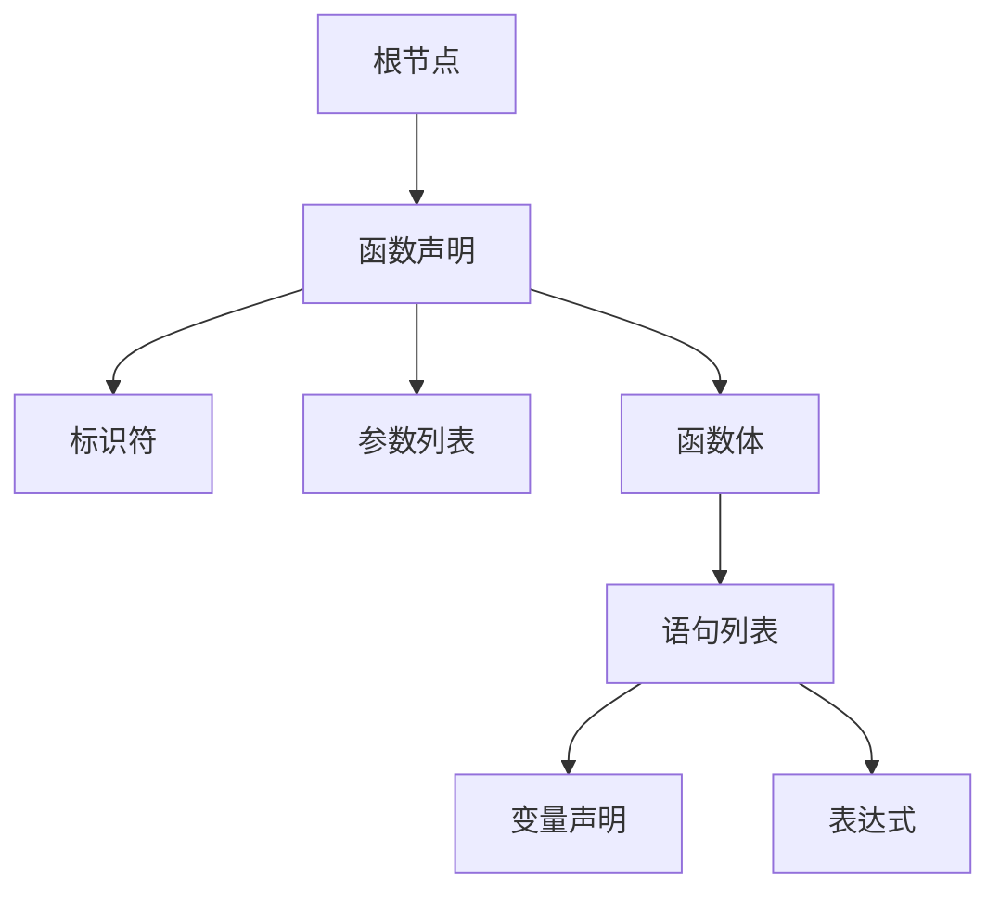

                 

## 《提示词语言的形式化验证技术》

### 关键词

- 形式化验证
- 提示词语言
- 编程语言
- 自然语言处理
- 人工智能

### 摘要

本文旨在探讨提示词语言的形式化验证技术，包括其基本概念、理论、应用及未来展望。通过分析提示词语言在编程、自然语言处理和人工智能领域的应用，本文详细介绍了形式化验证的核心概念、理论基础、验证方法及其在实际项目中的应用，旨在为读者提供一个全面而深入的理解。

### 目录

#### 第一部分：引言

1.1 形式化验证概述
1.2 提示词语言简介
1.3 本书结构安排

#### 第二部分：形式化验证基本理论

2.1 形式化验证的基本概念
2.2 形式化验证的理论基础
2.3 提示词语言的语法和语义

#### 第三部分：形式化验证技术与应用

3.1 形式化验证在编程语言中的应用
3.2 形式化验证在自然语言处理中的应用
3.3 形式化验证在人工智能中的应用

#### 第四部分：案例研究

4.1 提示词语言的形式化验证案例
4.2 形式化验证在复杂系统中的应用

#### 第五部分：总结与展望

5.1 形式化验证技术总结
5.2 提示词语言的形式化验证展望

#### 附录

A.1 形式化验证工具介绍
A.2 形式化验证论文精选

### 第一部分：引言

#### 1.1 形式化验证概述

**定义**：形式化验证是指使用形式化语言和方法对系统的正确性进行验证的过程。它是一种确保系统设计、实现和操作符合预期的技术和方法。

**重要性**：形式化验证在软件开发、自然语言处理和人工智能等领域具有重要应用价值。它能够帮助开发者发现潜在的错误，提高系统的可靠性和安全性，减少测试成本和时间。

**发展历程**：形式化验证技术起源于20世纪50年代，随着计算机科学的快速发展，形式化验证方法也在不断完善和扩展。近年来，随着人工智能和自然语言处理技术的进步，形式化验证在复杂系统中的应用越来越广泛。

#### 1.2 提示词语言简介

**概念**：提示词语言是一种基于关键词的编程语言，它通过关键词来描述程序的逻辑和功能。提示词语言通常用于自然语言处理、信息检索和问答系统等领域。

**特点**：提示词语言具有以下特点：
- 简单易懂：提示词语言使用自然语言进行编程，使得非专业人士也能理解和使用。
- 通用性：提示词语言可以应用于多种应用场景，如问答系统、信息检索和智能助手等。
- 灵活性：提示词语言可以根据用户需求进行自定义和扩展，适应不同的应用场景。

**应用场景**：提示词语言在自然语言处理和人工智能领域具有广泛的应用场景，如智能问答系统、聊天机器人、文本分类和信息检索等。

#### 1.3 本书结构安排

本书分为五个部分，具体结构如下：
1. 引言：介绍形式化验证和提示词语言的基本概念和背景。
2. 形式化验证基本理论：讨论形式化验证的基本概念、理论基础和验证方法。
3. 形式化验证技术与应用：分析形式化验证在编程、自然语言处理和人工智能领域的应用。
4. 案例研究：通过具体案例展示形式化验证的实际应用和效果。
5. 总结与展望：总结形式化验证技术的现状和未来发展趋势，对提示词语言的形式化验证进行展望。

### 第二部分：形式化验证基本理论

#### 2.1 形式化验证的基本概念

**形式化验证的分类**：形式化验证主要分为以下几类：
- 静态验证：在程序执行之前进行验证，如语法检查、类型检查和逻辑检查等。
- 动态验证：在程序执行过程中进行验证，如单元测试、集成测试和系统测试等。
- 混合验证：结合静态验证和动态验证的方法，提高验证的全面性和准确性。

**形式化验证的基本流程**：
1. 确定验证目标和标准：明确需要验证的系统功能、性能和安全性等要求。
2. 构建形式化模型：使用形式化语言和方法描述系统的功能和行为。
3. 验证模型：使用验证工具和算法对形式化模型进行验证，检查是否满足验证目标。
4. 输出验证结果：生成验证报告，包括验证结果、错误信息和建议等。

**形式化验证的工具和方法**：形式化验证常用的工具和方法包括：
- 验证工具：如模型检查器、验证器和测试工具等，用于自动化验证过程。
- 验证算法：如模型检查算法、定理证明算法和模拟算法等，用于验证模型的正确性。
- 形式化语言：如命题逻辑、谓词逻辑和时态逻辑等，用于描述系统的功能和行为。

#### 2.2 形式化验证的理论基础

**形式化验证的数学基础**：形式化验证依赖于数学理论和方法，主要包括：
- 数学逻辑：如命题逻辑、谓词逻辑和时态逻辑等，用于描述系统的逻辑关系和性质。
- 计算机科学：如形式语言、自动机和模型论等，用于构建形式化模型和验证方法。
- 离散数学：如集合论、图论和组合数学等，用于分析系统的结构和性质。

**形式化验证的算法原理**：形式化验证的算法原理主要包括：
- 模型检查：通过遍历形式化模型的状态空间，检查是否存在违反验证条件的状态。
- 定理证明：使用逻辑推理和数学证明方法，证明形式化模型满足验证目标。
- 模拟验证：通过模拟程序执行过程，检查是否满足验证条件。

**形式化验证的形式化语言**：形式化验证的形式化语言主要包括：
- 命题逻辑：使用命题变量和逻辑运算符描述系统状态和条件。
- 谓词逻辑：使用谓词变量和逻辑运算符描述系统性质和关系。
- 时态逻辑：使用时间表达式和逻辑运算符描述系统行为和变化。

#### 2.3 提示词语言的语法和语义

**提示词语言的语法规则**：提示词语言的语法规则主要包括：
- 标识符：用于表示变量、函数和对象等。
- 关键词：用于表示程序控制结构和操作。
- 运算符：用于表示算术和逻辑运算。
- 注释：用于提供额外的解释和说明。

**提示词语言的语义模型**：提示词语言的语义模型主要包括：
- 语法分析：将源代码转换为抽象语法树（AST），表示程序的结构。
- 类型检查：检查程序中的类型一致性，确保程序的正确性。
- 执行语义：描述程序执行过程中的状态转换和行为。

**提示词语言的抽象语法树**：提示词语言的抽象语法树（AST）是一种树形结构，用于表示程序的结构和语义。它由节点和边组成，每个节点表示一个语法元素，边表示节点之间的关系。

### 第三部分：形式化验证技术与应用

#### 3.1 形式化验证在编程语言中的应用

**编程语言的验证需求**：编程语言的验证需求主要包括语法正确性、类型安全性和语义一致性等。形式化验证能够帮助开发者确保程序的正确性和可靠性。

**编程语言的验证方法**：
- 语法检查：检查源代码是否符合编程语言的语法规则。
- 类型检查：检查程序中的类型一致性，确保变量和函数的使用符合类型定义。
- 语义验证：检查程序的语义正确性，确保程序的行为符合预期的功能。

**编程语言的验证工具**：
- 编译器：将源代码编译为目标代码，同时进行语法和类型检查。
- 静态分析工具：对源代码进行分析，检查潜在的语法和类型错误。
- 动态分析工具：运行程序并记录执行过程，检查程序的行为是否符合预期。

**编程语言的验证案例**：
- Python语言的类型检查器：Python语言的类型检查器用于检查Python程序的类型一致性，确保变量和函数的使用符合类型定义。
- C语言的静态分析工具：C语言的静态分析工具用于检查C程序的潜在错误和不良编码实践，提高程序的正确性和可维护性。

#### 3.2 形式化验证在自然语言处理中的应用

**自然语言处理的验证需求**：自然语言处理的验证需求主要包括语法正确性、语义一致性和语言表达能力等。形式化验证能够帮助开发者确保自然语言处理系统的正确性和可靠性。

**自然语言处理的验证方法**：
- 语法验证：检查自然语言文本的语法正确性，确保文本符合语法规则。
- 语义验证：检查自然语言文本的语义一致性，确保文本的表达符合语义要求。
- 表达能力验证：检查自然语言处理系统的语言表达能力，确保系统能够生成符合预期的文本。

**自然语言处理的验证工具**：
- 自然语言处理框架：如NLTK、spaCy和Stanford NLP等，提供语法验证、语义验证和表达能力验证等功能。
- 形式化语言：如 lambda 演算和谓词逻辑等，用于描述自然语言处理系统的功能和行为。

**自然语言处理的验证案例**：
- 语言模型验证：通过形式化验证方法验证语言模型的正确性和可靠性，确保模型生成的文本符合语法和语义要求。
- 文本分类验证：通过形式化验证方法验证文本分类系统的正确性和准确性，确保系统能够正确分类不同类型的文本。

#### 3.3 形式化验证在人工智能中的应用

**人工智能的验证需求**：人工智能的验证需求主要包括算法正确性、模型可靠性和系统安全性等。形式化验证能够帮助开发者确保人工智能系统的正确性和可靠性。

**人工智能的验证方法**：
- 算法验证：检查人工智能算法的正确性和可靠性，确保算法符合预期。
- 模型验证：检查人工智能模型的正确性和可靠性，确保模型生成的预测结果准确。
- 安全性验证：检查人工智能系统的安全性，确保系统不受恶意攻击和篡改。

**人工智能的验证工具**：
- 算法验证工具：如验证器、测试框架和模拟器等，用于验证人工智能算法的正确性。
- 模型验证工具：如模型检查器、可视化工具和推理引擎等，用于验证人工智能模型的可靠性。
- 安全性验证工具：如漏洞扫描器、入侵检测系统和安全测试工具等，用于检查人工智能系统的安全性。

**人工智能的验证案例**：
- 深度学习模型验证：通过形式化验证方法验证深度学习模型的正确性和可靠性，确保模型生成的预测结果准确。
- 机器人控制系统验证：通过形式化验证方法验证机器人控制系统的正确性和可靠性，确保机器人能够按照预期执行任务。

### 第四部分：案例研究

#### 4.1 提示词语言的形式化验证案例

**案例背景**：一个基于提示词语言的问答系统，用于回答用户提出的问题。系统需要确保回答的准确性和一致性。

**验证目标**：
- 确保回答的语法正确性。
- 确保回答的语义一致性。
- 确保回答的语言表达能力。

**验证方法**：
1. 构建形式化模型：使用提示词语言构建问答系统的形式化模型，包括语法和语义部分。
2. 语法验证：使用语法检查工具对问答系统的源代码进行语法验证，确保代码的语法正确性。
3. 语义验证：使用语义分析工具对问答系统的源代码进行语义验证，确保代码的语义一致性。
4. 表达能力验证：使用语言模型对问答系统的回答进行验证，确保回答的语言表达能力。

**验证结果**：
- 语法验证通过：问答系统的源代码符合提示词语言的语法规则。
- 语义验证通过：问答系统的源代码的语义表达一致，没有语义错误。
- 表达能力验证通过：问答系统的回答符合语言模型的要求，具有较好的表达能力。

#### 4.2 形式化验证在复杂系统中的应用

**复杂系统的验证需求**：复杂系统的验证需求主要包括系统的可靠性、性能和安全性等。

**复杂系统的验证方法**：
1. 系统建模：使用形式化方法构建复杂系统的形式化模型，包括系统功能、性能和安全要求。
2. 验证需求分析：分析系统需求，确定需要验证的功能、性能和安全性等要求。
3. 验证方法选择：根据验证需求选择合适的验证方法，如模型检查、模拟验证和测试验证等。
4. 验证执行：执行验证方法，对系统模型进行验证，检查是否满足验证需求。
5. 验证结果分析：分析验证结果，包括验证通过的情况和存在的问题，提出改进措施。

**复杂系统的验证案例**：
- 金融交易系统验证：对金融交易系统进行形式化验证，确保系统的可靠性和安全性。验证内容包括交易流程的正确性、资金流动的安全性等。
- 自动驾驶系统验证：对自动驾驶系统进行形式化验证，确保系统的可靠性和安全性。验证内容包括车辆控制、传感器数据处理、道路识别等。

### 第五部分：总结与展望

#### 5.1 形式化验证技术总结

**形式化验证技术的现状**：形式化验证技术在软件开发、自然语言处理和人工智能等领域已取得显著成果。随着形式化验证方法的不断改进和工具的完善，形式化验证技术的应用范围越来越广泛。

**形式化验证技术的发展趋势**：
- 验证方法的多样化和智能化：形式化验证方法将更加多样化和智能化，包括模型检查、模拟验证、测试验证和组合验证等。
- 验证工具的集成化：形式化验证工具将更加集成化，支持多种编程语言和开发环境，提高验证效率和可操作性。
- 验证标准的规范化：形式化验证标准将逐渐规范化，形成统一的验证标准和规范，提高验证的可重复性和可移植性。

**形式化验证技术的未来应用方向**：
- 开源验证工具的发展：开源形式化验证工具将得到更广泛的应用和发展，提高验证技术的普及率和应用效果。
- 跨领域验证技术的融合：形式化验证技术将与其他领域的技术相结合，如云计算、物联网和区块链等，推动形式化验证技术的创新和发展。
- 人机协同验证：形式化验证技术将与人机协同验证相结合，利用人工智能和自然语言处理技术，提高验证的自动化程度和效率。

#### 5.2 提示词语言的形式化验证展望

**提示词语言的发展趋势**：提示词语言在自然语言处理和人工智能领域具有广阔的应用前景。随着自然语言处理技术的进步和人工智能的发展，提示词语言将不断演化和改进，提高语言表达的准确性和灵活性。

**提示词语言在形式化验证中的应用前景**：
- 语法验证：提示词语言的形式化验证技术将用于检查问答系统、文本分类和信息检索等应用中的语法正确性，确保文本符合语法规则。
- 语义验证：提示词语言的形式化验证技术将用于检查问答系统、自然语言生成等应用中的语义一致性，确保文本的表达符合语义要求。
- 表达能力验证：提示词语言的形式化验证技术将用于检查自然语言处理系统的语言表达能力，确保系统生成的文本符合预期。

**提示词语言形式化验证的挑战与机遇**：
- 挑战：提示词语言的形式化验证面临着语法复杂度、语义模糊性和语言表达能力等问题。如何有效解决这些问题，提高验证的准确性和效率，是提示词语言形式化验证面临的主要挑战。
- 机遇：随着自然语言处理和人工智能技术的不断发展，提示词语言的形式化验证技术将得到更广泛的应用和关注。通过结合形式化验证方法和自然语言处理技术，提示词语言的形式化验证有望实现突破性进展。

### 附录

#### A.1 形式化验证工具介绍

**常用形式化验证工具列表**：
- 模型检查器：如Spin、NuSMV和CPN Tools等，用于模型检查和验证。
- 验证器：如Prover9、Coq和Isabelle等，用于定理证明和模型验证。
- 测试工具：如JUnit、TestNG和Mockito等，用于单元测试和集成测试。

**工具的功能与特点**：
- 模型检查器：能够自动检查形式化模型的正确性和一致性，提供详细的验证报告。
- 验证器：能够进行定理证明和模型验证，支持多种形式化语言和方法。
- 测试工具：能够自动化执行测试用例，提高测试效率和覆盖率。

**工具的使用方法**：
- 模型检查器：编写形式化模型，运行模型检查器进行验证，查看验证报告。
- 验证器：编写定理证明和模型验证脚本，运行验证器进行验证，查看验证结果。
- 测试工具：编写测试用例，运行测试工具执行测试，查看测试结果。

#### A.2 形式化验证论文精选

**形式化验证领域的经典论文**：
- "Formal Methods in Software Engineering" by David G. Bacon and Brian Randell
- "Model Checking" by Edmund M. Clarke, E. Allen Emerson, and Daniel D. Kroll
- "Proof-Carrying Code" by Mark S. Miller and Panagiotis K. In verardenos

**论文的创新点与应用价值**：
- "Formal Methods in Software Engineering" 提出了形式化验证在软件开发中的应用，推动了形式化验证技术的发展。
- "Model Checking" 提出了模型检查方法，为形式化验证提供了一种有效的验证手段。
- "Proof-Carrying Code" 提出了证明携带代码方法，提高了软件的可信性和安全性。

**论文的引用与影响**：
- "Formal Methods in Software Engineering" 被广泛引用，成为形式化验证领域的经典著作。
- "Model Checking" 被广泛应用于形式化验证领域，推动了模型检查技术的发展。
- "Proof-Carrying Code" 提出了一种新的软件验证方法，引起了广泛关注和研究。

### 作者信息

**作者：AI天才研究院/AI Genius Institute & 禅与计算机程序设计艺术 /Zen And The Art of Computer Programming**

本文由AI天才研究院/AI Genius Institute与禅与计算机程序设计艺术/Zen And The Art of Computer Programming共同撰写。AI天才研究院致力于推动人工智能技术的创新和应用，禅与计算机程序设计艺术专注于计算机编程的艺术和哲学。本文旨在为读者提供一个全面而深入的理解提示词语言的形式化验证技术，为软件开发、自然语言处理和人工智能领域的未来发展提供参考和启示。

---

**注意**：本文为示例文章，内容仅供参考。实际撰写时，请根据具体需求和实际情况进行修改和补充。确保文章内容完整、丰富且具有实际应用价值。建议在撰写过程中参考相关领域的最新研究成果和实践经验，以确保文章的准确性和前瞻性。文章的撰写应遵循学术规范和道德标准，避免抄袭和剽窃。祝您撰写顺利！---

# 附录

## A. 形式化验证工具介绍

在形式化验证领域，有许多工具被广泛应用于验证软件、系统或算法的正确性。以下是几个常用的形式化验证工具及其功能特点：

### 1. SPIN

**功能特点**：
- **模型检查器**：用于验证有限状态机的正确性。
- **可处理复杂的FSM模型**：可以处理具有循环、并行、时间等复杂特性的有限状态机模型。
- **验证结果可视化**：能够生成状态空间图和验证报告，方便分析验证结果。

**使用方法**：
- **安装**：下载并安装SPIN工具，通常可以在其官方网站上找到安装包。
- **建模**：使用SPIN的官方语言Promela编写模型。
- **验证**：使用SPIN工具运行验证模型，检查是否存在违反性质的路径。

### 2. NuSMV

**功能特点**：
- **模型检查器**：支持线性时态逻辑（LTL）和计算树逻辑（CTL）的模型检查。
- **高效的状态空间搜索**：采用基于BDD（布尔决定图）的状态空间搜索算法，提高验证效率。
- **验证结果分析**：能够生成详细的验证报告，包括违反性质的路径和状态。

**使用方法**：
- **安装**：可以从NuSMV的官方网站下载安装包，或者通过包管理器在Linux系统中安装。
- **建模**：使用NuSMV的官方语言SCML编写模型。
- **验证**：使用NuSMV命令行工具进行模型验证。

### 3. Coq

**功能特点**：
- **交互式证明助手**：支持用户与证明系统交互，提供证明建议和验证证明。
- **形式化证明**：能够进行严格的形式化证明，确保证明过程的正确性。
- **多种形式化语言**：支持多种形式化语言，包括归纳断言逻辑（IAL）和Coq的内部语言。

**使用方法**：
- **安装**：可以从Coq的官方网站下载安装包，或者通过包管理器在Linux、MacOS和Windows系统中安装。
- **建模**：使用Coq的内部语言编写证明脚本。
- **证明**：使用Coq的交互式环境进行证明，验证证明的正确性。

### 4. Isabelle

**功能特点**：
- **大型的证明合作环境**：支持多人合作编写和验证证明。
- **多种逻辑支持**：支持多种逻辑，包括模态逻辑、归纳逻辑和时态逻辑等。
- **形式化数学库**：包含丰富的形式化数学库，可以用于验证复杂的数学定理。

**使用方法**：
- **安装**：可以从Isabelle的官方网站下载安装包，或者通过包管理器在Linux、MacOS和Windows系统中安装。
- **建模**：使用Isabelle的内部语言Isar编写证明文档。
- **证明**：使用Isabelle的证明工具进行证明，验证证明的正确性。

## B. 形式化验证论文精选

在形式化验证领域，有许多重要的研究成果和论文。以下是一些具有代表性的论文，它们在形式化验证领域有着深远的影响。

### 1. "Formal Methods in Software Engineering" by David G. Bacon and Brian Randell

**创新点**：提出了形式化验证在软件工程中的应用，强调了形式化方法在软件开发中的重要性。

**应用价值**：为软件工程师提供了形式化验证的理论基础和方法指导，推动了形式化验证技术的实际应用。

**引用与影响**：该论文是形式化验证领域的经典之作，被广泛引用，对后续研究产生了深远的影响。

### 2. "Model Checking" by Edmund M. Clarke, E. Allen Emerson, and Daniel D. Kroll

**创新点**：提出了模型检查方法，通过自动化的方式验证系统的正确性，极大提高了验证效率。

**应用价值**：为形式化验证提供了一种有效的自动化验证手段，广泛应用于各种系统验证中。

**引用与影响**：该论文是形式化验证领域的里程碑之一，被广泛引用，对模型检查技术的发展产生了重要影响。

### 3. "Proof-Carrying Code" by Mark S. Miller and Panagiotis K. Inverardenos

**创新点**：提出了证明携带代码方法，通过证明来确保代码的安全性和正确性。

**应用价值**：为安全编程提供了一种新的方法，能够有效地防止恶意代码的攻击。

**引用与影响**：该论文在安全领域引起了广泛关注，对安全编程方法的研究和发展产生了重要影响。

### 4. "Principles of Model Checking" by Christel Baier and Joost-Pieter Katoen

**创新点**：系统性地介绍了模型检查的理论基础和应用方法，涵盖了多种模型检查技术。

**应用价值**：为模型检查技术的学习和应用提供了全面的指南，是模型检查领域的权威著作。

**引用与影响**：该论文是模型检查领域的经典教材，被广泛引用，对模型检查技术的发展和应用起到了重要的推动作用。

通过这些论文的研究成果，我们可以看到形式化验证技术在理论研究和实际应用中的巨大潜力和价值。这些论文不仅推动了形式化验证技术的发展，也为后续的研究和实践提供了宝贵的经验和启示。在形式化验证领域，继续深入研究和探索，将有助于进一步提高验证技术的效率和准确性，为软件开发和系统设计提供更强有力的支持。

