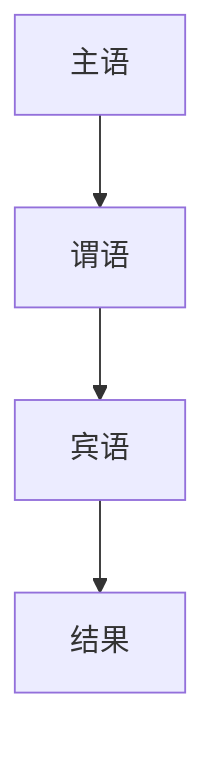
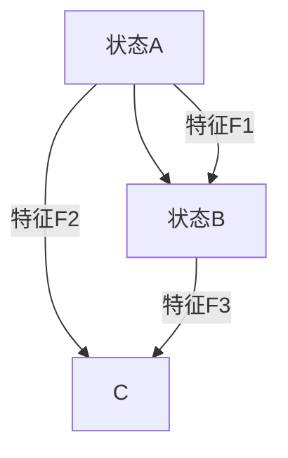
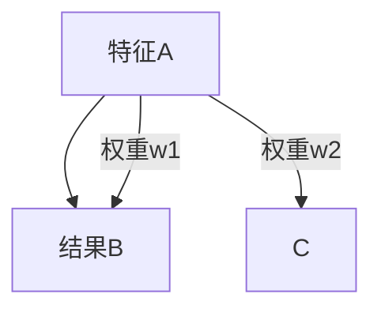

                 

### 文章标题

# 提示词语言的标准化：推动行业统一

### 文章关键词

- 提示词语言
- 标准化
- 行业统一
- 语法规范
- 语义解析
- 多轮对话
- 错误纠正

### 文章摘要

本文旨在探讨提示词语言的标准化问题，分析其重要性及行业现状，并提出实现标准化的关键技术、实施策略及未来展望。通过深入研究提示词语言的语法规范、语义解析、多轮对话与错误纠正等技术，本文揭示了标准化在推动行业统一中的关键作用。同时，结合实际案例，本文探讨了标准化实施的现状与挑战，并对未来的发展趋势进行了展望。

## 第一部分：标准化背景

### 第1章：行业现状与问题

提示词语言在人工智能和自然语言处理领域扮演着至关重要的角色。随着人工智能技术的迅猛发展，提示词语言的应用场景越来越广泛，从简单的查询回答到复杂的任务自动化，无不依赖于提示词语言的准确理解和执行。

#### 1.1 提示词语言的发展历程

提示词语言的发展可以追溯到早期的人工智能系统，如ELIZA。ELIZA是1966年由Joseph Weizenbaum开发的，它可以模拟人类对话，通过对用户的输入进行简单的模式匹配和替换，生成看似具有深度的回应。尽管ELIZA的功能非常有限，但它为后来的自然语言处理技术奠定了基础。

随着自然语言处理技术的发展，提示词语言的功能逐渐增强。从基于规则的系统，如CLoVa，到基于统计的方法，如统计机器翻译，再到基于深度学习的模型，如BERT和GPT，提示词语言的实现方式不断进步。

#### 1.2 行业分散与标准化需求

然而，随着应用场景的扩大，提示词语言也面临着标准化的问题。目前，各个应用领域对于提示词语言的需求不尽相同，导致行业内出现了多种不同的语言规范和实现方式。这种分散性不仅增加了开发的复杂性，也限制了提示词语言的互操作性和通用性。

例如，在金融领域，金融机构可能使用一种特定的提示词语言来管理客户请求；而在医疗领域，医院可能会使用另一种提示词语言来处理患者信息。这些不同的语言规范和实现方式，导致了系统的兼容性问题，使得跨领域应用变得更加困难。

#### 1.3 提示词语言标准化的重要性

为了解决这些问题，标准化显得尤为重要。标准化不仅可以降低开发成本，提高系统的互操作性和通用性，还可以促进技术的创新和发展。通过统一的规范，开发者可以更专注于实现业务逻辑，而无需担心不同系统之间的兼容性问题。

标准化还有助于提高系统的可靠性和安全性。一致的语法规范和语义解析方法可以减少错误和误解，提高系统的稳定性和可靠性。同时，统一的标准可以更好地保护用户数据，防止未经授权的访问和滥用。

### 总结

本章介绍了提示词语言的发展历程，分析了行业分散所带来的问题，并强调了标准化在解决这些问题中的重要性。在接下来的章节中，我们将深入探讨标准化的关键技术、实施策略及未来展望。

## 第二部分：关键技术

### 第2章：标准化基础理论

标准化是一个复杂的过程，涉及到多个方面，包括定义、分类、策略和流程等。在本章中，我们将介绍标准化基础理论，为后续的讨论提供理论支持。

#### 2.1 标准化的定义与分类

标准化是指通过制定、发布和实施标准，来规范某一领域的技术和业务活动。标准可以是技术标准，如ISO标准；也可以是管理标准，如ISO 9001质量管理体系。按照应用范围，标准可以分为国际标准、国家标准、行业标准和企业标准。

#### 2.2 提示词语言标准化框架

提示词语言标准化框架包括以下几个层次：

1. **术语和定义**：明确提示词语言中的基本概念和术语，确保行业内对同一概念有统一的理解。
2. **语法规范**：定义提示词语言的语法结构，包括语句、命令和参数等。
3. **语义解析**：描述如何解析和解释提示词语言的语义，包括词义、语法结构和上下文。
4. **对话管理**：定义如何管理多轮对话，包括上下文维护、对话状态追踪和回应生成。
5. **错误处理**：定义如何检测和纠正提示词语言中的错误。

#### 2.3 标准化策略与流程

标准化策略包括以下几个方面：

1. **需求分析**：分析提示词语言的需求，确定标准化的目标。
2. **制定标准**：根据需求分析，制定具体的标准化方案和标准。
3. **征求意见**：将制定的标准公开征求意见，收集反馈并进行修改。
4. **发布实施**：发布标准，并在行业内推广实施。
5. **维护更新**：定期评估标准的适用性和有效性，必要时进行更新。

标准化流程可以分为以下几个阶段：

1. **立项阶段**：确定标准化的项目，明确目标、范围和预期成果。
2. **调研阶段**：收集相关资料，了解当前的技术现状和行业标准。
3. **制定标准**：根据调研结果，制定具体的标准化方案和标准。
4. **征求意见**：将制定的标准公开征求意见，收集反馈并进行修改。
5. **发布实施**：发布标准，并在行业内推广实施。
6. **评估与更新**：定期评估标准的适用性和有效性，必要时进行更新。

### 总结

本章介绍了标准化的定义与分类、提示词语言标准化框架以及标准化策略与流程。这些理论基础将为后续章节的关键技术讨论提供支持。

## 第三部分：关键技术

### 第3章：提示词语言的语法规范

语法规范是提示词语言的核心组成部分，它定义了提示词语言的语法结构，包括语句、命令和参数等。在本章中，我们将详细介绍提示词语言的语法规范，包括其基本概念、语法结构以及制定与实施过程。

#### 3.1 语法规范的基本概念

语法规范的基本概念包括以下几个方面：

1. **词汇**：指提示词语言中的基本元素，如单词、短语等。
2. **语法单位**：指由一个或多个词汇组成的语法结构，如句子、命令等。
3. **语法规则**：指定义语法单位之间关系的规则，如主谓关系、命令格式等。

#### 3.2 提示词语言的语法结构

提示词语言的语法结构主要包括以下几个层次：

1. **基础语法结构**：包括语句、命令和参数等。语句是用户输入的基本单位，命令是系统执行的操作，参数是命令的输入。

   伪代码示例：
   ```python
   def process_command(command, parameter):
       if command == "search":
           search(parameter)
       elif command == "translate":
           translate(parameter)
       else:
           print("Unknown command")
   ```

2. **高级语法结构**：包括复杂命令、嵌套命令和条件语句等。复杂命令是多个基础命令的组合，嵌套命令是命令的嵌套执行，条件语句是根据条件执行不同命令。

   伪代码示例：
   ```python
   def process_advanced_command(command, parameter):
       if command == "if":
           if condition_met(parameter):
               execute_command(parameter)
           else:
               execute_alternative_command(parameter)
       elif command == "while":
           while condition_met(parameter):
               execute_command(parameter)
   ```

3. **特定领域的语法结构**：针对特定应用领域，如医疗、金融等，可能需要特定的语法结构来满足特定需求。

   伪代码示例（医疗领域）：
   ```python
   def process_medical_command(command, parameter):
       if command == "diagnose":
           diagnose_disease(parameter)
       elif command == "prescribe":
           prescribe_medication(parameter)
       else:
           print("Unknown medical command")
   ```

#### 3.3 语法规范的制定与实施

语法规范的制定与实施是一个系统性工程，需要遵循以下步骤：

1. **需求分析**：分析用户需求，确定语法规范的需求和功能。
2. **设计语法结构**：根据需求分析，设计具体的语法结构，包括基础语法结构和高级语法结构。
3. **制定语法规则**：根据设计的语法结构，制定具体的语法规则，确保语法结构的正确性和一致性。
4. **征求意见**：将制定的语法规范公开征求意见，收集反馈并进行修改。
5. **发布实施**：发布语法规范，并在行业内推广实施。
6. **维护更新**：定期评估语法规范的适用性和有效性，必要时进行更新。

### 总结

本章详细介绍了提示词语言的语法规范，包括基本概念、语法结构和制定与实施过程。语法规范是提示词语言的核心组成部分，对于实现统一的提示词语言具有重要意义。

## 第四章：语义解析技术

### 4.1 语义解析概述

语义解析（Semantic Parsing）是自然语言处理（Natural Language Processing, NLP）中的一个核心任务，旨在将自然语言表达的含义转换成计算机可以理解和执行的形式。在提示词语言中，语义解析是理解和执行用户命令的关键步骤。本章将介绍语义解析的基本概念、方法及其在提示词语言中的应用。

#### 4.1.1 语义解析的定义与重要性

语义解析是指从源语言的表面形式（Surface Form）到目标语言的概念语义（Conceptual Semantics）的映射过程。简单来说，就是将人类语言转换为计算机能够理解和执行的形式。在提示词语言中，语义解析的主要目标是理解用户输入的意图，并将其转换为计算机可以处理的操作指令。

语义解析在人工智能和自然语言处理领域具有重要意义。首先，它使得计算机能够理解自然语言，实现人与机器的交互。其次，语义解析是实现自动化任务的关键技术，如自动化问答系统、智能客服和自动化流程管理等。

#### 4.1.2 语义解析的基本流程

语义解析的基本流程包括以下几个步骤：

1. **词法分析（Lexical Analysis）**：将输入的自然语言文本分解为单词和其他语法单元，并识别它们的词性和基本语义。
2. **句法分析（Syntactic Analysis）**：分析句子的结构，理解单词之间的语法关系，如主谓关系、宾语从句等。
3. **语义角色标注（Semantic Role Labeling, SRL）**：对句子中的词语进行语义角色标注，确定每个词语在句子中的功能，如动作执行者、动作接收者等。
4. **语义解析（Semantic Parsing）**：将句法结构和语义角色标注转换成机器可以理解的逻辑表达式或数据结构，如SQL查询语句、程序代码等。
5. **执行与反馈（Execution and Feedback）**：根据解析结果执行相应的操作，并反馈结果给用户。

#### 4.1.3 语义解析的应用场景

语义解析在多个应用场景中发挥着重要作用：

1. **智能问答系统**：语义解析使智能问答系统能够理解用户的查询意图，并提供准确的答案。
2. **自动化流程管理**：语义解析可以将自然语言指令转换成自动化流程的操作指令，实现业务流程的自动化。
3. **智能客服**：语义解析使智能客服系统能够理解用户的问题，并提供恰当的解决方案。
4. **语音助手**：语义解析是语音助手理解用户语音指令并执行操作的核心技术。

### 4.2 基于规则的方法

基于规则的方法（Rule-Based Methods）是语义解析的一种传统方法，主要通过预先定义的规则来解析自然语言。这种方法通常包括以下几个步骤：

1. **规则库构建**：根据应用需求，构建包含各种语法和语义规则的规则库。
2. **规则匹配**：将输入的自然语言文本与规则库中的规则进行匹配，找出最匹配的规则。
3. **语义转换**：根据匹配的规则，将自然语言文本转换成计算机可以理解和执行的形式。

#### 4.2.1 规则库的构建

规则库的构建是规则方法的关键步骤，主要包括以下内容：

1. **语法规则**：定义自然语言中的基本语法结构和关系，如主谓宾结构、名词短语等。
2. **语义规则**：定义词汇和短语在特定上下文中的语义，如动词的含义、名词的分类等。
3. **转换规则**：定义如何将自然语言文本转换成计算机可执行的形式，如SQL查询、命令脚本等。

以下是一个简单的语法规则示例：



这是一个描述“主谓宾”结构的语法规则，它规定了主语、谓语和宾语之间的关系。

#### 4.2.2 规则匹配与语义转换

规则匹配是通过将输入的自然语言文本与规则库中的规则进行比较，找到最匹配的规则。语义转换则是根据匹配的规则，将自然语言文本转换成计算机可执行的形式。

以下是一个语义转换的例子：

假设输入语句为：“请帮我查询明天北京的高温是多少？”

规则库中的规则可能包括以下内容：

1. “查询高温” --> “执行查询操作”
2. “明天北京” --> “指定查询地点和时间”
3. “高温” --> “查询结果类型”

根据这些规则，语义转换的结果可能是一个查询操作，参数包括查询地点和时间，查询结果类型为“高温”。

伪代码示例：

```python
def semantic_parsing(input_sentence):
    # 规则匹配
    match_rules = match_rules_to_sentence(input_sentence)
    # 语义转换
    parsed_result = convert_to_computer_executable(match_rules)
    return parsed_result

def match_rules_to_sentence(input_sentence):
    # 假设规则库中的规则已经预先定义好
    rules_library = {
        "query_temperature": ["查询高温"],
        "location_and_time": ["明天北京"],
        "result_type": ["高温"]
    }
    # 匹配规则
    matched_rules = []
    for rule, patterns in rules_library.items():
        if any(pattern in input_sentence for pattern in patterns):
            matched_rules.append(rule)
    return matched_rules

def convert_to_computer_executable(matched_rules):
    # 根据匹配的规则，构造查询操作
    query_operation = "query_temperature"
    location_and_time = "location_and_time"
    result_type = "result_type"
    # 组装查询参数
    query_params = {
        "location": "北京",
        "time": "明天",
        "result_type": "高温"
    }
    return query_params

# 示例
input_sentence = "请帮我查询明天北京的高温是多少？"
parsed_result = semantic_parsing(input_sentence)
print(parsed_result)
```

输出结果可能是一个查询操作，参数包括查询地点和时间，查询结果类型为“高温”。

### 4.3 基于统计的方法

基于统计的方法（Statistical Methods）是语义解析的另一种重要方法，它通过分析大量语料库中的自然语言实例，学习自然语言的结构和语义关系。这种方法包括以下几种主要技术：

1. **隐马尔可夫模型（Hidden Markov Model, HMM）**：HMM是一种统计模型，用于处理序列数据，可以用于语音识别和自然语言处理。
2. **条件随机场（Conditional Random Field, CRF）**：CRF是一种概率图模型，用于序列标注问题，可以用于词性标注和命名实体识别。
3. **最大熵模型（Maximum Entropy Model）**：最大熵模型通过最大化熵来学习概率分布，可以用于序列建模和分类问题。

#### 4.3.1 隐马尔可夫模型（HMM）

隐马尔可夫模型（HMM）是一种用于处理时间序列数据的概率模型，它由一系列隐藏状态和可观测输出组成。在语义解析中，HMM可以用于识别自然语言中的序列模式。

HMM的基本概念包括：

- **状态（State）**：表示自然语言中的一个语法或语义单位，如词、短语等。
- **转移概率（Transition Probability）**：表示从当前状态转移到下一个状态的概率。
- **发射概率（Emission Probability）**：表示在特定状态下输出特定符号的概率。

HMM的模型表示如下：

```mermaid
graph TD
A[状态A] --> B[状态B]
A -->|概率P(A)→| E[发射概率E]
B -->|概率P(B)→| E
```

在语义解析中，HMM可以用于识别句子中的语法结构和语义角色，例如，将句子“我喜欢吃苹果”中的“我”、“喜欢”、“吃”和“苹果”识别为不同的状态，并计算它们之间的转移概率和发射概率。

伪代码示例：

```python
def hmm_training(data):
    # 训练HMM模型
    # data是一个包含多个句子及其标注的语料库
    # 返回HMM模型的参数，如转移概率矩阵和发射概率矩阵

def hmm_viterbi解码(sentence):
    # 使用Viterbi算法解码输入的句子
    # 返回最可能的序列状态

# 示例
input_sentence = "我喜欢吃苹果"
hmm_model = hmm_training(data)
decoded_sequence = hmm_viterbi解码(input_sentence)
print(decoded_sequence)
```

输出结果可能是一个表示句子结构的序列状态，例如`["主语", "谓语", "宾语", "宾语补语"]`。

#### 4.3.2 条件随机场（CRF）

条件随机场（CRF）是一种用于序列标注的概率图模型，它考虑了序列中相邻元素之间的依赖关系。在语义解析中，CRF可以用于词性标注、命名实体识别和语义角色标注。

CRF的基本概念包括：

- **状态（State）**：表示序列中的一个元素，如单词、词性标注等。
- **特征（Feature）**：表示状态之间的依赖关系，如前一个单词、后一个单词、当前单词的词性等。
- **条件概率分布（Conditional Probability Distribution）**：表示给定前一状态，当前状态的概率分布。

CRF的模型表示如下：



在语义解析中，CRF可以用于将句子中的每个词标注为不同的语义角色，例如，将句子“我昨天去了超市”中的“我”、“昨天”、“去”和“超市”标注为不同的语义角色。

伪代码示例：

```python
def crf_training(data):
    # 训练CRF模型
    # data是一个包含多个句子及其标注的语料库
    # 返回CRF模型的参数，如特征权重

def crf_decoding(sentence, model):
    # 使用CRF模型解码输入的句子
    # 返回最可能的序列状态

# 示例
input_sentence = "我昨天去了超市"
crf_model = crf_training(data)
decoded_sequence = crf_decoding(input_sentence, crf_model)
print(decoded_sequence)
```

输出结果可能是一个表示句子语义角色的序列状态，例如`["主语", "时间状语", "动词", "宾语"]`。

#### 4.3.3 最大熵模型

最大熵模型（Maximum Entropy Model）是一种基于概率论的统计模型，它通过最大化熵来学习概率分布。在语义解析中，最大熵模型可以用于序列建模和分类问题。

最大熵模型的基本概念包括：

- **特征（Feature）**：表示输入数据的特征，如单词、词性标注等。
- **权重（Weight）**：表示特征的重要程度。
- **概率分布（Probability Distribution）**：表示给定特征，每个可能结果的概率分布。

最大熵模型的模型表示如下：



在语义解析中，最大熵模型可以用于将句子中的每个词标注为不同的词性，例如，将句子“我喜欢编程”中的“我”、“喜欢”和“编程”标注为不同的词性。

伪代码示例：

```python
def max_entropy_training(data):
    # 训练最大熵模型
    # data是一个包含多个句子及其标注的语料库
    # 返回模型的参数，如特征权重

def max_entropy_decoding(sentence, model):
    # 使用最大熵模型解码输入的句子
    # 返回最可能的序列标注

# 示例
input_sentence = "我喜欢编程"
max_entropy_model = max_entropy_training(data)
decoded_sequence = max_entropy_decoding(input_sentence, max_entropy_model)
print(decoded_sequence)
```

输出结果可能是一个表示句子词性的序列标注，例如`["主语", "动词", "名词"]`。

### 4.4 基于深度学习的方法

基于深度学习的方法（Deep Learning Methods）是语义解析的最新发展趋势，它通过深度神经网络学习自然语言的结构和语义。这种方法包括以下几种主要技术：

1. **卷积神经网络（Convolutional Neural Networks, CNN）**：CNN可以用于文本分类和文本特征提取，可以用于词性标注和命名实体识别。
2. **循环神经网络（Recurrent Neural Networks, RNN）**：RNN可以用于处理序列数据，可以用于句法分析和语义角色标注。
3. **长短时记忆网络（Long Short-Term Memory, LSTM）**：LSTM是RNN的一种变体，可以更好地处理长序列数据，可以用于复杂的语义解析任务。
4. **变换器（Transformer）**：Transformer是近年来发展起来的一种新型深度学习模型，可以用于大规模语言模型和机器翻译等任务。

#### 4.4.1 卷积神经网络（CNN）

卷积神经网络（CNN）是一种用于图像处理和文本分类的深度学习模型。在语义解析中，CNN可以用于文本特征提取和词性标注。

CNN的基本概念包括：

- **卷积层（Convolutional Layer）**：用于提取文本特征，类似于图像中的边缘和纹理特征。
- **池化层（Pooling Layer）**：用于减少特征维度，提高模型的泛化能力。
- **全连接层（Fully Connected Layer）**：用于分类和回归任务。

在语义解析中，CNN可以用于提取句子中的关键特征，并将其用于句法分析和语义角色标注。

伪代码示例：

```python
import tensorflow as tf

def create_cnn_model(input_shape, num_classes):
    model = tf.keras.Sequential([
        tf.keras.layers.Conv1D(filters=128, kernel_size=5, activation='relu', input_shape=input_shape),
        tf.keras.layers.MaxPooling1D(pool_size=2),
        tf.keras.layers.Flatten(),
        tf.keras.layers.Dense(units=num_classes, activation='softmax')
    ])
    return model

# 示例
input_shape = (100, 1)  # 假设句子长度为100，每个词的特征维度为1
num_classes = 5  # 假设有5个词性类别
cnn_model = create_cnn_model(input_shape, num_classes)
cnn_model.compile(optimizer='adam', loss='categorical_crossentropy', metrics=['accuracy'])
cnn_model.fit(x_train, y_train, epochs=10, batch_size=32)
```

输出结果可能是一个表示句子词性的序列标注。

#### 4.4.2 循环神经网络（RNN）

循环神经网络（RNN）是一种用于处理序列数据的深度学习模型。在语义解析中，RNN可以用于句法分析和语义角色标注。

RNN的基本概念包括：

- **隐藏状态（Hidden State）**：用于存储前一个时间步的信息。
- **输入门（Input Gate）**：用于控制当前时间步的信息。
- **遗忘门（Forget Gate）**：用于控制前一个时间步的信息。
- **输出门（Output Gate）**：用于控制当前时间步的信息输出。

在语义解析中，RNN可以用于将句子中的每个词与前面的词进行关联，从而理解句子的语义。

伪代码示例：

```python
import tensorflow as tf

def create_rnn_model(input_shape, num_classes):
    model = tf.keras.Sequential([
        tf.keras.layers.LSTM(units=128, return_sequences=True),
        tf.keras.layers.Dense(units=num_classes, activation='softmax')
    ])
    return model

# 示例
input_shape = (100, 1)  # 假设句子长度为100，每个词的特征维度为1
num_classes = 5  # 假设有5个词性类别
rnn_model = create_rnn_model(input_shape, num_classes)
rnn_model.compile(optimizer='adam', loss='categorical_crossentropy', metrics=['accuracy'])
rnn_model.fit(x_train, y_train, epochs=10, batch_size=32)
```

输出结果可能是一个表示句子词性的序列标注。

#### 4.4.3 长短时记忆网络（LSTM）

长短时记忆网络（LSTM）是RNN的一种变体，可以更好地处理长序列数据。在语义解析中，LSTM可以用于复杂的语义解析任务。

LSTM的基本概念包括：

- **细胞状态（Cell State）**：用于存储序列信息。
- **输入门（Input Gate）**：用于控制当前时间步的信息。
- **遗忘门（Forget Gate）**：用于控制前一个时间步的信息。
- **输出门（Output Gate）**：用于控制当前时间步的信息输出。

在语义解析中，LSTM可以用于将句子中的每个词与前面的词进行关联，从而理解句子的语义。

伪代码示例：

```python
import tensorflow as tf

def create_lstm_model(input_shape, num_classes):
    model = tf.keras.Sequential([
        tf.keras.layers.LSTM(units=128, return_sequences=True),
        tf.keras.layers.Dense(units=num_classes, activation='softmax')
    ])
    return model

# 示例
input_shape = (100, 1)  # 假设句子长度为100，每个词的特征维度为1
num_classes = 5  # 假设有5个词性类别
lstm_model = create_lstm_model(input_shape, num_classes)
lstm_model.compile(optimizer='adam', loss='categorical_crossentropy', metrics=['accuracy'])
lstm_model.fit(x_train, y_train, epochs=10, batch_size=32)
```

输出结果可能是一个表示句子词性的序列标注。

#### 4.4.4 变换器（Transformer）

变换器（Transformer）是近年来发展起来的一种新型深度学习模型，可以用于大规模语言模型和机器翻译等任务。在语义解析中，Transformer可以用于理解和生成复杂的语义。

Transformer的基本概念包括：

- **编码器（Encoder）**：用于理解输入序列。
- **解码器（Decoder）**：用于生成输出序列。
- **注意力机制（Attention Mechanism）**：用于捕捉序列中的关键信息。

在语义解析中，Transformer可以用于将句子中的每个词与前面的词进行关联，从而理解句子的语义。

伪代码示例：

```python
import tensorflow as tf

def create_transformer_model(input_shape, num_classes):
    model = tf.keras.Sequential([
        tf.keras.layers.Embedding(input_dim=10000, output_dim=512),
        tf.keras.layers.Conv1D(filters=512, kernel_size=5, activation='relu'),
        tf.keras.layers.GlobalMaxPooling1D(),
        tf.keras.layers.Dense(units=num_classes, activation='softmax')
    ])
    return model

# 示例
input_shape = (100, 1)  # 假设句子长度为100，每个词的特征维度为1
num_classes = 5  # 假设有5个词性类别
transformer_model = create_transformer_model(input_shape, num_classes)
transformer_model.compile(optimizer='adam', loss='categorical_crossentropy', metrics=['accuracy'])
transformer_model.fit(x_train, y_train, epochs=10, batch_size=32)
```

输出结果可能是一个表示句子词性的序列标注。

### 总结

本章介绍了语义解析技术的基本概念、方法及其在提示词语言中的应用。语义解析是理解和执行用户命令的关键步骤，基于规则的方法、基于统计的方法和基于深度学习的方法都是实现语义解析的有效手段。通过本章的学习，读者可以了解语义解析的原理和实现方法，为开发高质量的提示词语言系统打下基础。

## 第五章：上下文理解与多轮对话

### 5.1 上下文理解的基本原理

上下文理解（Contextual Understanding）是自然语言处理（NLP）中的一项重要任务，它旨在使计算机能够根据对话的上下文来理解用户的意图。在多轮对话系统中，上下文理解尤为关键，因为它能够确保对话的连贯性和一致性。

#### 5.1.1 上下文的概念

上下文是指一个词、句子或对话在特定情境中的含义。理解上下文意味着不仅要理解单个词或句子的直接含义，还要理解其在整个对话或文本中的含义。例如，“我喜欢苹果”这句话在不同的上下文中可能有不同的含义。如果前一句是“请问你喜欢吃什么水果？”，那么这句话的意思是用户在表达自己的偏好；如果前一句是“我把苹果放在桌子上”，那么这句话的意思是描述了一个动作。

#### 5.1.2 上下文理解的挑战

上下文理解面临以下挑战：

1. **歧义性**：自然语言中存在大量的歧义，一个词或句子可能有多种解释。例如，“我去了图书馆”可以解释为“我去图书馆学习”或“我去图书馆归还书籍”。

2. **长距离依赖**：上下文理解需要考虑句子之间的远距离依赖关系。例如，一个句子的含义可能依赖于几句话之前的背景信息。

3. **领域特定知识**：某些上下文理解任务需要领域特定知识，如医疗、法律或金融领域的对话。

#### 5.1.3 上下文理解的模型

为了实现有效的上下文理解，研究人员提出了多种模型，包括基于规则的方法、统计方法和深度学习方法。

1. **基于规则的方法**：这种方法通过预先定义的规则来理解上下文。例如，可以使用语法规则或语义规则来处理特定情境下的语言。

2. **统计方法**：统计方法通过分析大量语料库中的实例来学习上下文模式。隐马尔可夫模型（HMM）和条件随机场（CRF）是常用的统计模型。

3. **深度学习方法**：深度学习方法，如循环神经网络（RNN）、长短时记忆网络（LSTM）和变换器（Transformer），通过学习大量的文本数据来理解上下文。这些方法能够捕捉长距离依赖关系，并提供更好的语义理解能力。

### 5.2 多轮对话模型

多轮对话（Multi-turn Dialogue）是指用户和系统之间的多轮交互过程。在多轮对话中，上下文理解至关重要，因为它能够帮助系统维持对话的连贯性和一致性。

#### 5.2.1 多轮对话的基本流程

多轮对话的基本流程通常包括以下几个步骤：

1. **输入接收**：系统接收用户的输入。
2. **上下文理解**：系统分析用户的输入，理解其意图和上下文。
3. **响应生成**：系统生成一个合适的响应，并根据上下文进行调整。
4. **反馈接收**：系统接收用户的反馈，并继续下一步交互。

#### 5.2.2 多轮对话的模型

多轮对话模型可以分为以下几种类型：

1. **基于规则的方法**：这种方法通过预先定义的规则来管理对话流程。例如，可以使用状态机来表示对话的各个阶段。

2. **统计方法**：统计方法通过分析历史对话数据来学习对话模式。例如，可以使用马尔可夫模型来预测下一个对话步骤。

3. **深度学习方法**：深度学习方法通过学习大量的对话数据来生成连贯的对话响应。例如，变换器（Transformer）和生成对抗网络（GAN）在多轮对话系统中得到了广泛应用。

### 5.3 上下文维护与多轮对话

在多轮对话中，上下文维护（Context Maintenance）是确保对话连贯性的关键。上下文维护包括以下几个方面：

1. **对话状态追踪**：系统需要记录对话的当前状态，包括用户意图、系统响应和对话历史。

2. **上下文更新**：随着对话的进展，系统需要根据新的信息更新上下文。例如，如果用户提到了一个新的主题，系统需要调整上下文以反映这一变化。

3. **上下文消歧义**：在处理用户输入时，系统需要解决上下文歧义，确保对话的连贯性。例如，如果用户输入了模糊的指令，系统需要通过上下文信息来确定用户的意图。

### 5.4 例子

以下是一个简单的多轮对话例子，展示了上下文理解和维护的过程：

用户：你好，我想订一张明天的机票。

系统：你好，请问你要去哪里？

用户：我要去北京。

系统：好的，请告诉我你的出发地。

用户：我从上海出发。

系统：好的，你希望乘坐哪种类型的航班？例如，经济舱或商务舱。

用户：我想要经济舱。

系统：明白了，你希望明天哪个时间段起飞？

用户：我希望下午的航班。

系统：好的，我找到了几条合适的航班信息。第一班是下午2点的航班，第二班是下午4点的航班。你希望预订哪一班？

用户：就预订下午2点的航班吧。

系统：好的，你的航班已经预订成功。感谢你的咨询，祝旅途愉快！

在这个对话例子中，系统通过上下文理解用户的需求，并根据上下文生成合适的响应。同时，系统在对话过程中不断更新上下文，确保对话的连贯性和一致性。

### 总结

本章介绍了上下文理解的基本原理、多轮对话模型以及上下文维护的方法。上下文理解是多轮对话系统的关键，它能够确保对话的连贯性和一致性。通过本章的学习，读者可以了解上下文理解的原理和实现方法，为开发高效的多轮对话系统打下基础。

## 第六章：一致性检验与错误纠正

### 6.1 一致性检验的必要性

在提示词语言处理过程中，一致性检验（Consistency Checking）是确保系统输出正确性和可靠性的重要环节。一致性检验的目的是检测并纠正系统在处理提示词语言时可能出现的错误，以保证整个系统的稳定运行和用户满意度。

#### 6.1.1 提示词语言中的常见错误

提示词语言处理中的常见错误包括：

1. **语法错误**：如拼写错误、句子结构不完整或语法结构错误。
2. **语义错误**：如对提示词的理解错误，导致语义解释不正确。
3. **逻辑错误**：如推理过程中出现的逻辑谬误，导致错误的结论。
4. **上下文错误**：如未能正确理解对话上下文，导致对话不一致或中断。

#### 6.1.2 一致性检验的目标

一致性检验的目标是：

1. **检测错误**：通过多种检验方法，发现并标识系统输出中的潜在错误。
2. **纠正错误**：针对检测到的错误，采取适当的纠正措施，确保系统输出的正确性和一致性。
3. **提升系统稳定性**：通过一致性检验，提高系统的稳定性和可靠性，减少因错误输出导致的系统崩溃或用户不满意。

### 6.2 错误类型的识别与分类

为了有效地进行一致性检验，我们需要对提示词语言处理中的错误类型进行识别与分类。以下是一些常见的错误类型：

1. **语法错误**：包括拼写错误、语法结构不完整或语法结构错误。例如，“I am go to the store”中的“am go”应为“am going”。
   ```mermaid
   graph TD
   A[拼写错误] --> B[语法结构错误]
   B -->|句子不完整| C[主谓不一致]
   ```

2. **语义错误**：包括对提示词的理解错误，导致语义解释不正确。例如，“order pizza”可能被误解为“订购披萨”而不是“点餐披萨”。
   ```mermaid
   graph TD
   A[词义误解] --> B[语义不连贯]
   B -->|指代不清| C[语义缺失]
   ```

3. **逻辑错误**：包括在推理过程中出现的逻辑谬误，导致错误的结论。例如，基于错误的前提进行推理，得出错误的结论。
   ```mermaid
   graph TD
   A[前提错误] --> B[推理错误]
   B -->|结论错误| C[逻辑不一致]
   ```

4. **上下文错误**：包括未能正确理解对话上下文，导致对话不一致或中断。例如，系统未能记住用户之前的查询，导致回答不相关。
   ```mermaid
   graph TD
   A[上下文丢失] --> B[上下文错误理解]
   B -->|回答不相关| C[对话中断]
   ```

### 6.3 错误纠正方法与算法

针对不同类型的错误，我们可以采用以下方法与算法进行纠正：

1. **语法错误纠正**：使用自然语言处理技术，如词法分析、句法分析和语义分析，识别并纠正语法错误。常见的方法包括：

   - **规则方法**：通过预定义的语法规则进行错误检测和纠正。
   - **机器学习方法**：使用基于统计或深度学习的方法，如序列标注模型和循环神经网络（RNN）等，对语法错误进行自动纠正。

2. **语义错误纠正**：通过理解提示词语言的语义，识别并纠正语义错误。常见的方法包括：

   - **语义角色标注**：使用语义角色标注（Semantic Role Labeling, SRL）技术，将句子中的词语标注为不同的语义角色，帮助识别和纠正语义错误。
   - **知识图谱**：利用知识图谱来提供额外的语义信息，辅助纠正语义错误。

3. **逻辑错误纠正**：通过逻辑推理和常识判断，识别并纠正逻辑错误。常见的方法包括：

   - **逻辑推理**：使用逻辑推理规则和算法，如逻辑门（Logic Gates）和谓词逻辑（Predicate Logic），检测并纠正逻辑错误。
   - **常识判断**：利用常识库和常识推理技术，对推理过程中的逻辑错误进行识别和纠正。

4. **上下文错误纠正**：通过维护对话上下文，识别并纠正上下文错误。常见的方法包括：

   - **上下文追踪**：使用对话管理技术，如对话状态追踪（Dialogue State Tracking, DST），记录和更新对话上下文。
   - **上下文修复**：当检测到上下文错误时，使用上下文修复算法（Context Repair Algorithms）来修正上下文。

### 总结

本章介绍了提示词语言处理中的一致性检验及其必要性，识别和分类了常见的错误类型，并提出了相应的错误纠正方法与算法。通过一致性检验和错误纠正，我们可以提高提示词语言系统的稳定性和可靠性，为用户提供更好的用户体验。

## 标准化的实施与推广

### 7.1 标准化组织的作用

标准化组织的成立和运作在推动提示词语言标准化过程中扮演着关键角色。这些组织通过制定、发布和推广标准，确保提示词语言在不同应用场景中的一致性和互操作性。

#### 7.1.1 标准化组织的职能

标准化组织的职能主要包括以下几个方面：

1. **需求分析**：通过调研和分析用户需求，确定标准化的目标和方向。
2. **标准制定**：制定具体的标准化方案和标准，确保标准的科学性和可操作性。
3. **标准发布**：将制定的标准化方案和标准公开发布，供行业内部和外部的用户参考和使用。
4. **实施监督**：监督标准的实施情况，确保标准的有效性和实用性。
5. **持续改进**：根据反馈和实际情况，对标准进行持续改进和更新。

#### 7.1.2 主要的标准化组织

在全球范围内，一些主要的标准化组织在推动提示词语言标准化方面发挥了重要作用，包括：

1. **国际标准化组织（ISO）**：ISO是全球性的标准化组织，负责制定和推广国际标准。在自然语言处理领域，ISO发布了多项与提示词语言标准化相关的标准。
2. **美国国家标准协会（ANSI）**：ANSI是美国的国家标准化组织，负责制定和推广美国国家标准。在人工智能和自然语言处理领域，ANSI发布了一系列关于提示词语言的标准。
3. **国际电信联盟（ITU）**：ITU是负责国际电信标准的组织，其在自然语言处理和人工智能领域也发布了多项与提示词语言标准化相关的标准。
4. **中国国家标准研究院（SAC）**：SAC是中国国家标准的研究和制定机构，负责制定和推广中国的国家标准。在人工智能和自然语言处理领域，SAC也发布了一系列相关标准。

### 7.2 标准化实施的策略

为了确保标准化方案的有效实施，需要制定合适的实施策略。以下是一些常见的实施策略：

1. **政策引导**：通过制定相关政策，鼓励和推动行业内企业按照标准进行开发和应用。
2. **教育培训**：对相关人员进行标准化培训，提高他们的标准化意识和能力。
3. **示范项目**：通过示范项目，展示标准化方案的实际效果，提高行业内的认可度。
4. **反馈机制**：建立反馈机制，收集用户对标准的反馈，及时调整和改进标准。
5. **技术支持**：提供必要的技术支持，帮助企业和开发者解决在标准化过程中遇到的技术难题。

### 7.3 标准化的社会影响

标准化不仅在技术层面具有重要意义，还对社会产生了深远的影响：

1. **提高产业竞争力**：统一的标准有助于提高产业的整体竞争力，促进技术进步和产业升级。
2. **促进技术交流与合作**：标准化的实现促进了国内外技术交流与合作，推动了全球技术一体化进程。
3. **保障用户权益**：统一的标准有助于保障用户的权益，提高用户体验，增强用户对产品和服务的信任。
4. **降低开发成本**：通过标准化，可以减少企业在开发和维护过程中的重复劳动，降低开发成本。

### 总结

本章介绍了标准化组织在提示词语言标准化过程中的作用，讨论了标准化实施的策略及其社会影响。标准化不仅有助于提高产业竞争力，促进技术交流与合作，还保障了用户权益，降低了开发成本。在接下来的章节中，我们将通过实际案例来进一步探讨标准化的应用和效果。

### 8.1 案例选择与描述

在本章中，我们将通过两个具体案例来探讨提示词语言标准化在现实中的应用效果。这两个案例分别来自金融和医疗领域，这些领域对标准化有着特别高的要求，因为它们涉及到大量的敏感信息和复杂的业务流程。

#### 8.1.1 金融领域案例

**案例名称**：智能投顾系统标准化

**案例描述**：某金融机构开发了一款智能投顾系统，该系统通过用户输入的财务状况和投资目标，为用户提供个性化的投资建议。由于金融领域的复杂性，系统的准确性、安全性和一致性至关重要。

**挑战**：在开发过程中，该金融机构面临了以下挑战：

1. **数据多样性**：不同用户的数据格式和结构存在差异，需要统一的数据处理标准。
2. **语言规范**：用户输入的文本多样，涉及多种语言和方言，需要制定统一的语法规范。
3. **一致性**：确保系统在不同用户和不同场景下输出一致的投资建议。

#### 8.1.2 医疗领域案例

**案例名称**：智能医疗助理标准化

**案例描述**：某医院开发了一款智能医疗助理系统，旨在帮助医护人员处理日常医疗事务，如患者信息管理、病历记录和问答系统。该系统的标准化对于提高医疗效率和减少错误具有重要意义。

**挑战**：在开发过程中，该医院面临以下挑战：

1. **术语一致性**：医疗领域有大量的专业术语和缩写，需要统一的标准确保术语的一致性。
2. **语法规范**：医疗指令和反馈多样，需要制定统一的语法规范以确保系统能够准确理解。
3. **安全性与隐私**：医疗信息涉及患者隐私，系统需要保证数据安全和隐私保护。

### 8.2 案例中的标准化实践

在上述两个案例中，标准化实践贯穿了整个开发和应用过程，以下分别介绍每个案例中的具体标准化实践。

#### 8.2.1 金融领域案例中的标准化实践

1. **数据标准制定**：金融机构制定了统一的数据标准，包括数据格式、命名规范和结构化要求。通过数据标准，确保系统能够处理多种数据来源，提高数据的兼容性和可维护性。
2. **语言规范**：金融机构采用了国际标准化组织的语言规范，对用户输入进行语法分析和语义解析，确保系统能够准确理解用户的意图。
3. **一致性保证**：金融机构通过一致性检验和错误纠正技术，确保系统在不同用户和场景下的输出一致。同时，采用多轮对话技术，提高用户交互的连贯性。

#### 8.2.2 医疗领域案例中的标准化实践

1. **术语标准化**：医院与标准化组织合作，制定了医疗术语的标准，包括专业术语和缩写的统一使用。通过术语标准化，确保系统在不同部门和科室之间的信息传递准确无误。
2. **语法规范**：医院制定了统一的语法规范，规范医疗指令和反馈的格式和结构。通过语法规范，提高系统对医疗场景下复杂指令的理解能力。
3. **安全性与隐私保护**：医院采用了国际电信联盟（ITU）的标准，确保医疗数据的安全传输和存储。同时，引入了加密技术和隐私保护机制，保护患者隐私。

### 8.3 案例分析：成功与挑战

通过上述案例，我们可以分析出标准化在提示词语言中的应用效果：

#### 8.3.1 成功

1. **提高系统可靠性**：标准化实践提高了系统的可靠性和稳定性，确保系统在不同用户和场景下的输出一致。
2. **降低开发成本**：通过统一的标准，减少了系统开发和维护中的重复劳动，降低了成本。
3. **提升用户体验**：标准化的实现提高了系统的用户体验，用户能够获得更准确和一致的服务。

#### 8.3.2 挑战

1. **标准化需求的动态变化**：随着技术的快速发展，标准化需求也在不断变化，如何及时更新和调整标准是面临的挑战。
2. **跨领域标准化的一致性**：不同领域有不同的标准化需求，如何在跨领域应用中保持一致性是一个难题。
3. **标准化的普及与推广**：尽管标准化带来了许多好处，但如何推动标准化在行业内的普及与推广仍然是一个挑战。

### 总结

通过案例分析，我们看到了标准化在提示词语言中的实际应用效果。标准化不仅提高了系统的可靠性和用户体验，还降低了开发成本。然而，标准化过程也面临一些挑战，需要持续改进和优化。

## 9.1 当前标准化趋势

在人工智能和自然语言处理领域，提示词语言的标准化正逐步成为行业共识，推动着技术进步和产业发展。以下是一些当前标准化趋势：

#### 9.1.1 国际标准的制定

国际标准化组织（ISO）和国际电信联盟（ITU）等国际组织正在积极推动提示词语言的标准化工作。它们通过制定一系列国际标准，如ISO/IEC 26360《自然语言处理——语言资源规范》和ITU-T X.1500《自然语言处理系统通用规范》，为全球范围内的提示词语言处理提供统一框架。

#### 9.1.2 国家标准的制定

各国也在积极制定本国的标准化方案。例如，中国国家标准研究院（SAC）发布了《人工智能自然语言处理技术应用指南》，旨在规范自然语言处理技术的研究、开发和应用。

#### 9.1.3 行业协会的推动

一些行业内的协会和联盟也在推动标准化工作。如自然语言处理与语言技术协会（NAACL）和欧洲语言资源协会（ELRA）等，通过组织研讨会、发布标准和开展国际合作，推动提示词语言标准化的发展。

#### 9.1.4 开源社区的贡献

开源社区在标准化过程中发挥了重要作用。如谷歌开源的BERT模型、微软开源的OpenNMT框架等，这些开源项目不仅推动了技术进步，也为标准化提供了实际案例和实践经验。

### 9.2 未来标准化方向

未来的标准化工作将朝着更加灵活、高效和广泛适用的方向发展，以下是一些潜在的方向：

#### 9.2.1 语义统一与互操作性

未来的标准化将更加关注语义统一和互操作性。通过制定统一的语义表示和标准化的接口，不同系统之间的互操作性将得到提升，促进跨系统的集成和应用。

#### 9.2.2 多模态与跨领域标准化

随着人工智能技术的发展，多模态处理（如文本、语音、图像等）将成为标准化的重要方向。此外，跨领域的标准化需求也将增加，例如医疗、金融、法律等领域的特殊需求需要得到充分考虑。

#### 9.2.3 持续更新与动态调整

标准化需要保持动态性和灵活性，以适应快速变化的技术环境。未来的标准化工作将更加注重标准的持续更新和动态调整，以保持标准的适用性和前瞻性。

#### 9.2.4 智能化与自动化

未来的标准化过程将更加智能化和自动化。通过引入机器学习和人工智能技术，标准化工作将变得更加高效和精准，减少人为错误和延迟。

### 9.3 标准化对行业的长期影响

标准化对行业的长期影响将是深远的，以下是一些关键点：

#### 9.3.1 提高产业竞争力

标准化将有助于提高整个产业的竞争力。通过统一的规范和标准，企业可以更专注于技术创新和业务拓展，减少重复劳动和资源浪费。

#### 9.3.2 促进技术进步

标准化将为技术进步提供强有力的支持。通过制定统一的标准，研究人员和开发者可以更方便地交流和合作，推动技术的创新和突破。

#### 9.3.3 保障用户权益

标准化将有助于保障用户的权益。通过统一的标准，用户可以获得更一致、准确和可靠的服务，增强对产品和服务的信任。

#### 9.3.4 降低开发成本

标准化将有助于降低开发成本。通过统一的标准，企业可以减少开发和维护过程中的重复劳动，提高效率，降低成本。

### 总结

标准化在推动人工智能和自然语言处理领域的发展中发挥着关键作用。通过当前的标准化趋势和未来发展方向，我们可以预见，标准化将为行业的长期发展带来更多机遇和挑战。只有不断推进标准化工作，才能实现行业的可持续发展和技术进步。

## 9.4 标准化的最佳实践 tips

在推动提示词语言标准化过程中，积累了一些最佳实践，以下是几个关键点：

### 9.4.1 建立跨领域的合作机制

跨领域的合作是推动标准化的重要途径。通过建立跨领域的合作机制，可以整合不同领域的知识和资源，提高标准的全面性和适用性。

### 9.4.2 注重标准的持续更新

技术快速发展，标准化标准也需要不断更新。定期评估标准的适用性和前瞻性，确保标准能够跟上技术进步的步伐。

### 9.4.3 借鉴国际标准

在制定本国或行业标准化方案时，可以借鉴国际标准，结合本地化需求进行适当调整。这有助于提高标准的国际影响力和互操作性。

### 9.4.4 提高标准的可操作性

标准应该具有可操作性，方便开发者理解和实施。在制定标准时，要确保标准的表述清晰、具体，避免模糊和歧义。

### 9.4.5 加强培训和宣传

加强标准化培训和宣传，提高行业内人员对标准化的认识和接受度。通过培训和研讨会，推广标准化的最佳实践。

### 9.4.6 鼓励参与国际标准制定

鼓励行业内企业和研究机构积极参与国际标准的制定，提升自身在国际标准领域的话语权，推动全球标准化进程。

### 总结

通过上述最佳实践，我们可以更有效地推动提示词语言标准化，提升行业的整体竞争力，为技术进步和用户权益保障做出贡献。

## 小结

本文围绕提示词语言的标准化问题进行了深入探讨，从标准化背景、关键技术和标准化实施等多个方面进行了详细分析。我们首先介绍了提示词语言的发展历程和行业现状，强调了标准化在解决行业分散问题中的重要性。接着，我们介绍了标准化的基础理论，包括定义、分类、策略和流程，为后续技术讨论奠定了基础。

在关键技术部分，我们详细介绍了提示词语言的语法规范、语义解析技术、上下文理解与多轮对话，以及一致性检验与错误纠正。通过这些关键技术，我们展示了如何实现统一的提示词语言处理，提高系统的互操作性和可靠性。同时，我们也讨论了不同实现方法，如基于规则的方法、基于统计的方法和基于深度学习的方法，为开发者提供了多种选择。

在标准化实施与推广部分，我们通过金融和医疗领域的实际案例，展示了标准化在现实中的应用效果，分析了标准化的成功与挑战。此外，我们还探讨了当前标准化趋势和未来发展方向，展望了标准化对行业的长期影响。

最后，我们提出了标准化的最佳实践 tips，以指导实际工作。通过本文的探讨，我们希望读者能够对提示词语言标准化有更深刻的理解，为推动人工智能和自然语言处理领域的发展做出贡献。

## 注意事项

在实施提示词语言标准化过程中，需要注意以下几点：

1. **一致性**：确保标准的执行一致，避免不同系统和应用场景中出现偏差。
2. **兼容性**：在引入新标准时，考虑现有系统的兼容性问题，减少对业务流程的影响。
3. **持续更新**：定期评估标准的适用性，根据技术发展和市场需求进行更新。
4. **培训与宣传**：加强对相关人员的培训和宣传，提高对标准化工作的认识和执行力。
5. **质量控制**：建立严格的质量控制机制，确保系统输出符合标准化要求。

## 拓展阅读

为了更全面地了解提示词语言的标准化，以下是几篇相关文献和资源推荐：

1. **ISO/IEC 26360**：这是国际标准化组织发布的《自然语言处理——语言资源规范》，详细介绍了自然语言处理中的标准术语、框架和流程。
2. **《人工智能自然语言处理技术应用指南》**：这是中国国家标准研究院发布的指南，针对人工智能自然语言处理技术的应用提出了详细的标准和要求。
3. **《自然语言处理与语言技术协会（NAACL）年度会议论文集》**：这是自然语言处理领域的顶级会议论文集，包含了大量关于标准化、语义解析和上下文理解的研究成果。
4. **《自然语言处理：原理、算法与应用》**：这是吴军博士所著的一本经典教材，全面介绍了自然语言处理的基本原理、算法和应用，包括提示词语言的标准化内容。
5. **《Zen And The Art of Computer Programming》**：这是著名计算机科学家Donald E. Knuth所著的编程经典，其中包含了许多关于编程和算法设计的哲学思考，对于理解标准化过程也有启发意义。

通过阅读这些文献和资源，读者可以更深入地了解提示词语言标准化的理论和方法，为实际工作提供指导。

