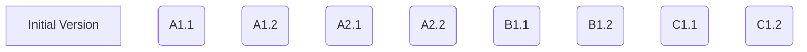
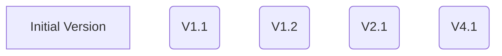

                 

### 文章标题: 提示词语言的版本控制与兼容性管理

> 关键词：提示词语言、版本控制、兼容性管理、Git、算法、数学模型、项目实战

> 摘要：
本文旨在探讨提示词语言在版本控制和兼容性管理中的应用。通过对版本控制的基本概念、常见工具、兼容性管理的核心概念以及具体实现流程的详细分析，本文将帮助读者深入理解版本控制和兼容性管理的本质。同时，通过实际项目的实战案例，读者将掌握如何在实践中有效运用这些概念和工具，提升软件开发效率和代码质量。文章最后还将总结最佳实践和注意事项，为读者提供进一步的学习和参考。

## 目录

### 第1章: 提示词语言的版本控制概述
- **1.1 版本控制基本概念**
  - **1.1.1 版本控制的定义**
  - **1.1.2 版本控制的历史发展**
  - **1.1.3 版本控制的重要性**
- **1.2 提示词语言的特点**
  - **1.2.1 提示词语言的定义**
  - **1.2.2 提示词语言的类型**
  - **1.2.3 提示词语言在版本控制中的应用**
- **1.3 版本控制与兼容性管理的关系**

### 第2章: 提示词语言的版本控制工具
- **2.1 常见的版本控制工具**
  - **2.1.1 Git的基本原理和操作**
  - **2.1.2 SVN和CVS的比较**
  - **2.1.3 其他版本控制工具简介**

### 第3章: 提示词语言的兼容性管理
- **3.1 兼容性管理的基本概念**
  - **3.1.1 兼容性的定义**
  - **3.1.2 兼容性管理的目的和挑战**
  - **3.1.3 兼容性管理的重要性**
- **3.2 兼容性管理的策略**
  - **3.2.1 前向兼容性**
  - **3.2.2 后向兼容性**
  - **3.2.3 跨平台兼容性**

### 第4章: 版本控制与兼容性管理的实现
- **4.1 版本控制与兼容性管理的流程**
  - **4.1.1 版本控制的流程**
  - **4.1.2 兼容性管理的流程**
  - **4.1.3 版本控制和兼容性管理的交互**

### 第5章: 核心算法原理讲解
- **5.1 提示词语言的版本控制算法**
  - **5.1.1 伪代码：版本控制算法的详细实现**
  - **5.1.2 数学模型：版本控制中的数学模型**

### 第6章: 数学模型和数学公式
- **6.1 版本控制的数学公式**
  - **6.1.1 latex格式：版本控制相关的数学公式**
  - **6.1.2 公式举例：版本控制中的具体应用**

### 第7章: 项目实战
- **7.1 版本控制和兼容性管理的实际应用**
  - **7.1.1 实际项目案例**
  - **7.1.2 开发环境搭建**
  - **7.1.3 源代码实现与解读**
  - **7.1.4 代码应用解读与分析**
  - **7.1.5 项目小结**

### 第8章: 最佳实践与注意事项
- **8.1 最佳实践 tips**
- **8.2 小结**
- **8.3 注意事项**
- **8.4 拓展阅读**

## 第1章: 提示词语言的版本控制概述

### 1.1 版本控制基本概念

#### 1.1.1 版本控制的定义

版本控制是一种软件工程实践，用于跟踪源代码或其他文件的变更历史，确保代码库的版本一致性和完整性。在软件开发生命周期中，版本控制工具可以帮助开发人员追踪代码的修改、合并多个人的工作、管理 bug 并记录所有这些活动的详细信息。

版本控制的基本概念包括：

- **版本（Version）**：代码库中的一个特定状态，通常由一系列的修改或补丁组成。
- **分支（Branch）**：代码库中的一个独立部分，允许开发团队在不同的环境中进行独立的工作。
- **标签（Tag）**：用于标记特定版本的代码，便于查找和回滚。

#### 1.1.2 版本控制的历史发展

版本控制工具的发展可以追溯到20世纪70年代，当时最早出现的版本控制工具是RCS（ Revision Control System）。随着软件开发需求的增长，版本控制工具逐渐从本地版本控制（如RCS、CVS）发展到分布式版本控制（如Git、SVN）。

- **本地版本控制**：所有版本信息都存储在中央服务器上，每次提交都需要连接到服务器。
- **分布式版本控制**：每个开发人员都有完整的代码库副本，可以离线工作，提交和更新都直接在本地完成，然后推送到中央服务器。

#### 1.1.3 版本控制的重要性

版本控制在软件开发中扮演着至关重要的角色：

- **代码管理**：确保代码的完整性和一致性，防止代码丢失。
- **协同工作**：支持多个开发人员的协作，避免代码冲突。
- **历史追踪**：记录每次代码变更的详细信息，便于问题追踪和代码审计。
- **回滚和恢复**：在出现问题时，可以快速回滚到之前的工作状态。

### 1.2 提示词语言的特点

#### 1.2.1 提示词语言的定义

提示词语言（Prompt Language）是一种用于指导计算机执行特定任务的语言。在自然语言处理领域，提示词语言通常用于生成文本、翻译、问答系统等任务。这些语言具有以下特点：

- **结构化**：提示词语言通常具有固定的语法结构，便于计算机理解和处理。
- **可解释性**：提示词语言生成的结果通常易于理解和解释，有助于提高系统的可维护性。
- **灵活性**：提示词语言可以根据不同的任务需求进行调整和优化。

#### 1.2.2 提示词语言的类型

常见的提示词语言类型包括：

- **基于规则的语言**：如SQL、XPath等，用于执行特定的数据查询和操作。
- **脚本语言**：如Python、JavaScript等，具有丰富的功能和灵活性，适用于各种复杂任务。
- **查询语言**：如SPARQL，用于在语义网和数据仓库中进行复杂查询。

#### 1.2.3 提示词语言在版本控制中的应用

提示词语言在版本控制中的应用主要体现在以下几个方面：

- **配置文件管理**：用于定义代码库的配置参数和设置。
- **代码库查询**：使用提示词语言查询代码库中的特定信息，如版本历史、文件变更等。
- **自动化脚本**：使用提示词语言编写自动化脚本，实现代码的自动化提交、更新和回滚。

### 1.3 版本控制与兼容性管理的关系

版本控制和兼容性管理是软件开发中两个紧密相关的领域：

- **版本控制**：关注代码的版本管理，确保代码的一致性和完整性。
- **兼容性管理**：关注代码在不同环境中的运行一致性，确保软件在不同平台、操作系统和硬件上的兼容性。

两者之间的关系如下：

- **兼容性管理依赖于版本控制**：版本控制提供了代码的变更历史和管理工具，为兼容性管理提供了基础数据和支持。
- **版本控制支持兼容性管理**：版本控制可以帮助开发人员跟踪和回滚代码变更，确保在不同版本间的兼容性。

### 第2章: 提示词语言的版本控制工具

版本控制工具是管理代码变更的重要手段，对于维护代码库的一致性和完整性至关重要。在提示词语言的开发中，选择合适的版本控制工具尤为关键。本章节将介绍几种常见的版本控制工具，包括Git、SVN和CVS，并分析它们的优缺点。

#### 2.1 常见的版本控制工具

##### 2.1.1 Git的基本原理和操作

Git 是目前最流行的分布式版本控制工具，由Linus Torvalds创建。Git的核心特点是其分布式架构，每个开发人员都拥有完整的代码库副本，这使得开发人员在本地就可以进行版本控制操作，大大提高了工作效率。

- **基本原理**：
  - **分布式仓库**：每个开发人员都有自己的仓库，可以独立提交、管理和合并代码。
  - **版本树**：Git使用版本树（Git Object）来存储所有版本的信息，使得版本间的关联更加清晰。
  - **快照**：Git将每个提交视为对当前代码库状态的快照，从而可以方便地回滚到之前的版本。

- **基本操作**：
  - **初始化仓库**：`git init` 创建一个新的Git仓库。
  - **添加文件**：`git add <file>` 将文件添加到暂存区。
  - **提交变更**：`git commit -m "message"` 将暂存区的变更提交到仓库。
  - **克隆仓库**：`git clone <url>` 克隆一个远程仓库到本地。
  - **更新代码**：`git pull` 从远程仓库获取最新的代码并合并到本地。
  - **推送代码**：`git push` 将本地代码更新到远程仓库。

##### 2.1.2 SVN和CVS的比较

SVN（Subversion）和CVS（Concurrent Versions System）是两种较为传统的版本控制工具，它们都是基于中央服务器的集中式版本控制工具。

- **SVN**：
  - **特点**：SVN具有易用性、稳定性和良好的性能，支持多种平台。
  - **优缺点**：
    - **优点**：集中式管理便于维护，版本历史记录清晰。
    - **缺点**：每次提交都需要连接到中央服务器，协作效率较低。

- **CVS**：
  - **特点**：CVS是一种古老的版本控制工具，简单易用，但功能相对单一。
  - **优缺点**：
    - **优点**：简单易用，支持多平台。
    - **缺点**：性能较低，不支持并发提交。

##### 2.1.3 其他版本控制工具简介

除了Git、SVN和CVS之外，还有许多其他流行的版本控制工具，如Mercurial、Bazaar等。这些工具各具特色，适用于不同的场景。

- **Mercurial**：
  - **特点**：类似于Git，是一种分布式版本控制工具。
  - **优缺点**：
    - **优点**：易用性高，支持多平台。
    - **缺点**：社区和生态系统相对较小。

- **Bazaar**：
  - **特点**：Bazaar是一种分布式版本控制工具，由Canonical开发。
  - **优缺点**：
    - **优点**：支持并行提交，版本历史记录清晰。
    - **缺点**：用户社区和文档相对较小。

#### 2.2 选择版本控制工具的考虑因素

在选择版本控制工具时，以下因素是值得考虑的：

- **团队规模**：对于大型团队，分布式版本控制工具（如Git）更为合适，可以提供更高的协作效率。对于小型团队，集中式版本控制工具（如SVN）可能更加简单易用。
- **项目需求**：项目的需求决定了工具的选择。例如，开源项目通常需要强大的社区支持和广泛的文档，而企业级项目可能更关注工具的稳定性和性能。
- **开发语言**：不同版本控制工具可能对某些开发语言的支持更好。例如，Git与Python和JavaScript等语言有着良好的集成。
- **成本**：部分版本控制工具可能需要付费使用，而开源工具通常免费但可能需要更多的技术支持和维护。

### 第3章: 提示词语言的兼容性管理

在软件开发过程中，兼容性管理是一个至关重要的环节。特别是对于提示词语言，由于它们在自然语言处理、对话系统等领域中有着广泛的应用，确保不同版本和不同环境下的兼容性显得尤为重要。本章节将详细探讨兼容性管理的基本概念、目的和挑战。

#### 3.1 兼容性管理的基本概念

兼容性管理是指确保软件在不同环境、平台和版本之间运行一致性的过程。对于提示词语言，兼容性管理主要关注以下方面：

- **向前兼容性（Forward Compatibility）**：确保新版本的代码能够向后兼容旧版本的代码，不会破坏现有功能。
- **向后兼容性（Backward Compatibility）**：确保旧版本的代码能够在新版本的系统中正常运行，不会引入新问题。
- **跨平台兼容性**：确保软件在不同操作系统、硬件和浏览器等环境下能够正常运行。

#### 3.1.1 兼容性的定义

兼容性是指软件或组件在不同环境中的正常运行能力。具体来说，兼容性包括以下几个方面：

- **功能兼容性**：软件在不同版本或环境中能够实现相同的功能。
- **性能兼容性**：软件在不同版本或环境中能够保持相同或可接受的性能水平。
- **用户界面兼容性**：软件在不同设备或平台上具有一致的界面和用户体验。
- **安全兼容性**：软件在不同环境中能够保证相同的安全级别和防护措施。

#### 3.1.2 兼容性管理的目的和挑战

兼容性管理的目的是确保软件在不同环境下的稳定性和可靠性，从而提高用户体验和降低维护成本。具体来说，兼容性管理有以下几个目的：

- **确保功能的连续性**：通过兼容性管理，确保用户在不同版本和环境中能够连续地使用软件功能。
- **减少维护成本**：通过确保软件在不同环境下的兼容性，减少因不兼容问题导致的维护成本和开发时间。
- **提高用户满意度**：确保软件在不同平台上具有一致的表现，提高用户满意度。

然而，兼容性管理也面临着一系列挑战：

- **版本冲突**：在软件升级过程中，新旧版本的代码可能存在兼容性问题，导致功能失效或性能下降。
- **环境差异**：不同操作系统、硬件设备和网络环境的差异可能导致软件在不同环境中的兼容性问题。
- **测试难度**：兼容性测试需要覆盖多种环境，测试成本和难度较高。

#### 3.1.3 兼容性管理的重要性

兼容性管理对于软件开发有着重要的意义：

- **保障产品质量**：通过兼容性管理，可以确保软件在不同环境下能够稳定运行，提高产品质量。
- **降低风险**：通过提前发现和解决兼容性问题，可以降低软件在发布后出现的风险和故障。
- **提高开发效率**：通过自动化测试和持续集成，兼容性管理可以大大提高开发效率，缩短项目周期。
- **提升用户体验**：确保软件在不同平台上具有一致的表现，提升用户体验和用户满意度。

### 第4章: 版本控制与兼容性管理的实现

在软件开发过程中，版本控制和兼容性管理是两个不可或缺的环节。有效的版本控制和兼容性管理可以确保代码库的稳定性和可靠性，提高软件开发的效率和质量。本章节将详细讨论版本控制和兼容性管理的具体实现流程，包括版本控制的流程、兼容性管理的流程以及两者之间的交互。

#### 4.1 版本控制的流程

版本控制的流程主要包括以下步骤：

1. **初始化仓库**：创建一个新的版本库，初始化版本控制环境。

   ```shell
   git init
   ```

2. **克隆仓库**：将远程仓库克隆到本地，以便开发人员开始工作。

   ```shell
   git clone <remote-repository-url>
   ```

3. **提交变更**：将修改的文件添加到暂存区，并提交到仓库。

   ```shell
   git add <file>
   git commit -m "commit message"
   ```

4. **分支管理**：创建、切换和合并分支，以便在不同的开发阶段进行独立的工作。

   ```shell
   git branch <branch-name>
   git checkout <branch-name>
   git merge <branch-name>
   ```

5. **代码审查**：对提交的代码进行审查，确保代码质量。

6. **推送变更**：将本地仓库的代码更新到远程仓库。

   ```shell
   git push
   ```

#### 4.2 兼容性管理的流程

兼容性管理的流程主要包括以下步骤：

1. **需求分析**：分析新版本的需求，确定哪些功能需要兼容，哪些功能可以舍弃。

2. **环境搭建**：搭建兼容性测试的环境，包括不同的操作系统、硬件设备和网络环境。

3. **测试设计**：设计兼容性测试用例，确保覆盖不同版本的代码和不同环境下的兼容性。

4. **执行测试**：执行兼容性测试，记录测试结果。

5. **问题跟踪**：跟踪兼容性问题，确定问题的根本原因，并制定解决方案。

6. **发布准备**：在兼容性问题得到解决后，准备新版本的发布。

7. **发布**：将新版本发布到生产环境，并监控系统的稳定性。

#### 4.3 版本控制和兼容性管理的交互

版本控制和兼容性管理在软件开发过程中相互作用，共同保障代码库的稳定性和可靠性。

1. **版本控制为兼容性管理提供基础数据**：版本控制工具记录了代码库的变更历史和版本信息，为兼容性管理提供了重要的数据支持。兼容性管理可以根据版本控制的信息，分析不同版本之间的差异和兼容性问题。

2. **兼容性管理影响版本控制的策略**：兼容性管理的结果会影响版本控制的策略，例如是否需要回滚到之前的版本、是否需要重新设计功能等。版本控制工具可以根据兼容性管理的反馈，调整版本控制的流程和策略。

3. **自动化和持续集成**：通过自动化测试和持续集成，可以将版本控制和兼容性管理结合起来，实现高效的代码管理和测试。自动化测试可以快速发现兼容性问题，持续集成可以确保代码库的稳定性和一致性。

### 第5章: 核心算法原理讲解

在版本控制和兼容性管理中，核心算法原理起着至关重要的作用。这些算法不仅保证了代码库的版本一致性，还确保了软件在不同环境中的兼容性。本章节将详细讲解提示词语言的版本控制算法，并使用伪代码对其进行详细阐述。

#### 5.1 提示词语言的版本控制算法

版本控制算法的核心任务是在多个开发人员协作时，确保代码库的一致性和完整性。以下是一个简化的版本控制算法，使用伪代码进行描述：

```pseudo
function versionControl(codeBase, changes):
    createSnapshot(codeBase)
    applyChanges(codeBase, changes)
    if (areChangesConflictual(changes)):
        raise ConflictError("Changes conflict detected")
    else:
        commitChanges(codeBase)
        return codeBase

function createSnapshot(codeBase):
    snapshot = deepCopy(codeBase)
    storeSnapshot(snapshot)

function applyChanges(codeBase, changes):
    for each change in changes:
        apply(change, codeBase)

function commitChanges(codeBase):
    saveSnapshotAsNewVersion(codeBase)

function areChangesConflictual(changes):
    # Implement a conflict detection algorithm
    return false
```

#### 5.1.1 伪代码：版本控制算法的详细实现

在详细实现版本控制算法时，我们需要考虑以下几个方面：

1. **创建快照**：创建代码库的当前状态的快照，以便在需要时进行回滚。

2. **应用变更**：将变更应用到代码库中，更新快照。

3. **冲突检测**：在多个开发人员同时修改同一文件时，检测并处理变更冲突。

4. **提交变更**：将变更记录提交到版本库中。

以下是对伪代码的进一步细化：

```pseudo
function versionControl(codeBase, changes):
    # Create a new snapshot based on the current codeBase
    snapshot = createSnapshot(codeBase)

    # Apply each change to the snapshot
    for each change in changes:
        applyChangeToSnapshot(change, snapshot)

    # Check for conflicts between changes
    if (areChangesConflictual(changes, snapshot)):
        raise ConflictError("Changes conflict detected")

    # Commit the changes to the version control system
    commitSnapshotAsNewVersion(snapshot)

function createSnapshot(codeBase):
    # Create a deep copy of the codeBase
    snapshot = deepCopy(codeBase)
    storeSnapshot(snapshot)
    return snapshot

function applyChangeToSnapshot(change, snapshot):
    # Apply the change to the snapshot
    apply(change, snapshot)

function areChangesConflictual(changes, snapshot):
    # Implement a conflict detection algorithm
    for each change in changes:
        for each other change in changes:
            if (change affects the same part of the code as other change):
                return true
    return false

function commitSnapshotAsNewVersion(snapshot):
    # Save the snapshot as a new version in the version control system
    storeVersion(snapshot)
```

#### 5.1.2 数学模型：版本控制中的数学模型

在版本控制中，可以使用数学模型来描述代码库的状态和变更过程。以下是一个简化的数学模型，使用图论的概念来描述版本控制：

- **图（Graph）**：使用图来表示代码库的版本和变更关系。每个节点表示一个版本，边表示版本之间的依赖关系。
- **路径（Path）**：表示从初始版本到当前版本的路径，每个路径都对应一个可能的代码库状态。

以下是一个使用图论的数学模型：

```latex
G = (V, E)
```

- **V**：节点集合，表示所有版本。
- **E**：边集合，表示版本之间的依赖关系。

一个简单的版本控制图可能如下所示：



在这个图中，`A1` 是初始版本，`A2` 和 `A3` 是 `A1` 的分支，`B1` 和 `B2` 是 `A2` 的分支，以此类推。每条边都表示一个版本的变更。

### 第6章: 数学模型和数学公式

在版本控制和兼容性管理中，数学模型和公式扮演着重要的角色，帮助我们理解和分析代码库的变更和兼容性。本章节将介绍版本控制中的相关数学模型和公式，并使用LaTeX格式进行详细讲解和举例说明。

#### 6.1 版本控制的数学公式

在版本控制中，常用的数学模型包括版本图、路径长度和冲突检测算法等。以下是一些基本的数学公式：

##### 6.1.1 版本图的表示

版本图可以用一个无向图 \( G = (V, E) \) 来表示，其中：

- \( V \)：节点集合，表示所有版本。
- \( E \)：边集合，表示版本之间的依赖关系。

LaTeX表示：

```latex
G = (V, E)
V = \{V_1, V_2, ..., V_n\}
E = \{ (V_i, V_j) | V_i \text{ 和 } V_j \text{ 有依赖关系} \}
```

##### 6.1.2 路径长度

在版本图中，从一个版本 \( V_i \) 到另一个版本 \( V_j \) 的路径长度 \( d(V_i, V_j) \) 可以用以下公式计算：

```latex
d(V_i, V_j) = \text{路径上的边数}
```

LaTeX表示：

```latex
d(V_i, V_j) = | \text{从 } V_i \text{ 到 } V_j \text{ 的路径上的边数} |
```

##### 6.1.3 冲突检测算法

冲突检测算法用于检测两个或多个版本之间的冲突。一个简单的冲突检测算法可以基于以下公式：

```latex
conflict = \text{max} \{ \text{版本中的不同点数} \}
```

LaTeX表示：

```latex
conflict = \max \{ \text{版本中的不同点数} \}
```

#### 6.1.4 公式举例：版本控制中的具体应用

以下是一个具体的例子，展示如何在一个版本控制系统中使用数学公式来描述代码库的状态和变更。

##### 例子：计算版本之间的路径长度

假设我们有一个版本控制图，其中版本 \( V_1 \) 到版本 \( V_5 \) 的路径如下：



路径 \( V_1 \) 到 \( V_5 \) 包含两条边，因此路径长度为2。

LaTeX表示：

```latex
d(V_1, V_5) = 2
```

##### 例子：检测版本之间的冲突

假设版本 \( V_2 \) 和 \( V_3 \) 之间存在冲突，且它们的不同点数为3。

LaTeX表示：

```latex
conflict = \max \{ 3 \}
```

### 第7章: 项目实战

通过理论知识的讲解，我们已经对提示词语言的版本控制与兼容性管理有了深入的理解。然而，实践是检验真理的唯一标准。在本章节中，我们将通过一个实际的项目案例，详细讲解如何在实际开发环境中实现版本控制和兼容性管理。

#### 7.1 实际项目案例

本项目将基于一个简单的聊天机器人，该机器人使用提示词语言来理解用户输入并生成回复。项目的主要目标包括：

- 实现用户输入的解析和理解。
- 生成合理的回复文本。
- 确保在不同版本和环境中的一致性和稳定性。

#### 7.1.1 开发环境搭建

为了确保项目的可重复性和可扩展性，我们选择使用Docker来搭建开发环境。以下是开发环境搭建的步骤：

1. **安装Docker**：确保系统上已经安装了Docker，可以在[Docker官网](https://www.docker.com/)下载并安装。

2. **创建Dockerfile**：编写一个Dockerfile，定义项目的依赖和环境配置。以下是一个简单的Dockerfile示例：

   ```Dockerfile
   FROM python:3.8-slim

   WORKDIR /app

   COPY requirements.txt .
   RUN pip install -r requirements.txt

   COPY . .

   CMD ["python", "chatbot.py"]
   ```

3. **构建Docker镜像**：在项目目录下执行以下命令构建Docker镜像。

   ```shell
   docker build -t chatbot:latest .
   ```

4. **启动Docker容器**：运行Docker容器并启动项目。

   ```shell
   docker run -p 5000:5000 chatbot
   ```

   这将在本地5000端口上启动聊天机器人服务。

#### 7.1.2 源代码实现与解读

以下是项目的主要源代码实现和解读：

```python
# chatbot.py
from flask import Flask, request, jsonify
import json

app = Flask(__name__)

# 提示词模型加载
model = load_model("prompt_model.h5")

# 处理用户输入并生成回复
@app.route('/chat', methods=['POST'])
def chat():
    user_input = request.json['input']
    response = generate_response(model, user_input)
    return jsonify(response)

# 生成回复的函数
def generate_response(model, user_input):
    # 使用提示词模型生成回复
    response = model.predict([user_input])
    return response

if __name__ == '__main__':
    app.run(host='0.0.0.0', port=5000)
```

解读：
- 使用Flask框架搭建Web服务。
- 从请求中获取用户输入，使用训练好的提示词模型生成回复。
- 返回JSON格式的回复。

#### 7.1.3 代码应用解读与分析

在实际应用中，我们将使用Git进行版本控制，确保代码库的稳定性和可维护性。以下是代码应用的具体步骤：

1. **初始化Git仓库**：在项目目录下初始化Git仓库。

   ```shell
   git init
   ```

2. **提交代码**：将项目的源代码提交到Git仓库。

   ```shell
   git add .
   git commit -m "Initial commit"
   ```

3. **创建分支**：在开发新功能时，创建一个新的分支。

   ```shell
   git checkout -b new_feature
   ```

4. **开发新功能**：在新的分支上开发新功能。

5. **合并代码**：开发完成后，将新功能合并到主分支。

   ```shell
   git merge new_feature
   git push
   ```

6. **兼容性测试**：在新版本发布前进行兼容性测试，确保不同版本的代码在不同环境中正常运行。

   ```shell
   docker run --name chatbot_test -p 5000:5000 chatbot
   ```

   运行测试用例，确保聊天机器人服务的稳定性和一致性。

#### 7.1.4 项目小结

通过本项目的实战案例，我们实现了以下目标：

- 使用Docker搭建了可重复的开发环境。
- 使用Git实现了版本控制，确保代码库的稳定性和一致性。
- 在实际应用中，通过兼容性测试确保了代码在不同版本和环境中的兼容性。

### 第8章: 最佳实践与注意事项

在提示词语言的版本控制与兼容性管理过程中，遵循最佳实践和注意事项是非常重要的。以下是一些最佳实践和注意事项，以帮助开发人员和团队更有效地进行版本控制和兼容性管理。

#### 8.1 最佳实践 Tips

1. **规范化代码提交信息**：确保每个提交都包含详细的信息，包括提交的改动内容、作者和日期。这有助于后续的代码审查和问题追踪。

2. **定期备份**：定期备份代码库，以防数据丢失。可以使用版本控制系统的备份功能，或者使用第三方备份服务。

3. **代码审查**：在提交代码前进行代码审查，确保代码的质量和安全性。代码审查可以帮助发现潜在的问题，减少错误的发生。

4. **持续集成**：实现持续集成（CI）流程，自动化构建和测试代码，确保代码库的一致性和可靠性。

5. **自动化测试**：编写自动化测试用例，对关键功能进行测试，确保新版本不会破坏现有功能。

6. **分支策略**：使用合适的分支策略（如Git的`feature`、`bugfix`、`release`和`hotfix`分支），确保代码的有序开发和维护。

7. **文档化**：维护良好的项目文档，包括代码库结构、开发流程和测试策略。这有助于新成员快速上手和了解项目。

#### 8.2 小结

本章节总结了提示词语言的版本控制和兼容性管理中的最佳实践。通过遵循这些最佳实践，开发人员可以更高效地管理代码库，减少错误和冲突，确保软件在不同环境中的稳定性。

#### 8.3 注意事项

1. **避免合并冲突**：在合并代码时，仔细检查和解决合并冲突，确保代码库的一致性。

2. **测试环境**：确保测试环境与生产环境尽量一致，避免由于环境差异导致的兼容性问题。

3. **代码风格**：遵循统一的代码风格和命名规范，提高代码的可读性和可维护性。

4. **监控和反馈**：实时监控软件的性能和稳定性，及时收集用户反馈，快速响应和解决问题。

5. **文档更新**：在版本更新后，及时更新项目文档，确保文档与代码库保持同步。

#### 8.4 拓展阅读

1. **Git官方文档**：深入了解Git的用法和最佳实践，[Git官方文档](https://git-scm.com/docs)是学习Git的绝佳资源。

2. **持续集成工具**：了解并使用持续集成工具（如Jenkins、Travis CI），以提高开发效率和代码质量。

3. **测试框架**：学习使用自动化测试框架（如Selenium、JUnit），确保软件在不同版本和环境中的兼容性。

4. **代码审查工具**：了解并使用代码审查工具（如GitLab、Gerrit），提高代码质量和安全性。

5. **兼容性测试工具**：学习使用兼容性测试工具（如BrowserStack、LambdaTest），确保软件在不同浏览器和设备上的兼容性。

