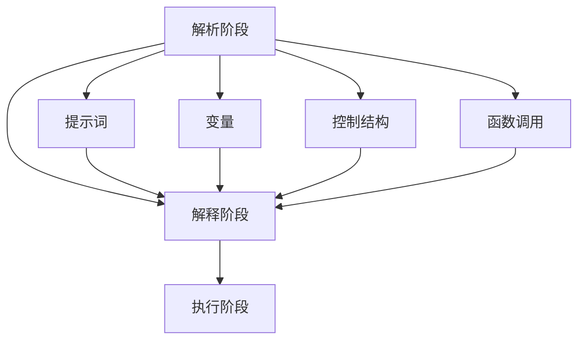

                 

## 文章标题

《提示词语言的程序综合与自动化生成》

## 文章关键词

- 提示词语言
- 程序综合
- 自动化生成
- 人工智能
- 编程语言
- 算法优化
- 实际应用

## 文章摘要

本文旨在探讨提示词语言在程序综合与自动化生成中的应用。通过对提示词语言的基本概念、原理及其在程序综合中的作用的深入分析，结合实际案例，详细介绍了如何利用提示词语言实现程序的自动化生成。文章还探讨了提示词语言的发展趋势与未来应用前景，为相关领域的研究者和开发者提供了有价值的参考。

## 第1章 引言

### 1.1 提示词语言的基本概念

提示词语言（Prompt Language），顾名思义，是一种通过提示词来引导计算机执行特定任务的编程语言。与传统的编程语言不同，提示词语言更加注重于如何通过简明的提示词来实现复杂的任务自动化。提示词语言的出现，源于对编程复杂度和效率的追求。通过引入提示词，开发者可以更加简洁地表达程序意图，从而提高开发效率。

提示词语言的基本组成通常包括提示词、变量、控制结构、函数调用等。提示词是语言的核心，它能够明确指示计算机执行何种操作。变量用于存储数据，控制结构用于控制程序流程，函数调用则用于复用代码。

### 1.2 程序综合与自动化的背景与意义

程序综合与自动化生成是计算机科学中的重要研究领域。随着软件系统的日益复杂，传统的手动编码方式逐渐暴露出效率低、错误率高、维护难度大等缺点。程序综合与自动化生成技术应运而生，旨在通过自动化工具和算法，从高层次描述生成具体的程序代码。

程序综合与自动化的背景主要源于以下几个因素：

1. **软件规模增大**：现代软件系统通常非常庞大，手动编写和调试代码的工作量巨大。
2. **开发效率提升需求**：在竞争激烈的软件市场中，快速开发和高效率是成功的关键。
3. **代码质量要求提高**：自动化生成技术可以减少人为错误，提高代码质量。

程序综合与自动化的意义在于：

1. **提高开发效率**：自动化生成技术可以大幅度减少开发时间，提高生产效率。
2. **降低维护成本**：自动生成的代码质量更高，更容易维护。
3. **创新与发展**：自动化生成技术为软件开发带来了新的思路和可能性。

### 1.3 书籍结构概述

本书分为七个主要章节，结构如下：

1. **第1章 引言**：介绍提示词语言的基本概念和程序综合与自动化的背景与意义。
2. **第2章 提示词语言的原理与基础**：详细讨论提示词语言的原理、语法规则及其工作机制。
3. **第3章 程序综合的方法与步骤**：阐述程序综合的基本概念、方法和步骤。
4. **第4章 提示词语言的自动化生成技术**：探讨自动化生成技术的基本原理和实际应用。
5. **第5章 提示词语言的实现与优化**：介绍提示词语言的实现框架和优化策略。
6. **第6章 实际案例研究**：通过具体案例展示提示词语言的实现和应用效果。
7. **第7章 提示词语言的发展趋势与展望**：分析提示词语言的发展趋势及其在程序综合与自动化生成中的应用前景。
8. **第8章 附录**：提供常用工具与资源、参考文献和索引。

## 第2章 提示词语言的原理与基础

### 2.1 提示词语言的基本组成

提示词语言的基本组成元素包括提示词、变量、控制结构、函数调用等。这些元素共同构成了提示词语言的核心框架，使得开发者能够通过简明的提示词来描述复杂任务。

**提示词**：提示词是提示词语言的核心元素，它用来指示计算机执行特定的操作。例如，“计算”提示词可能指示计算机执行一个数学计算，“打印”提示词则指示计算机在屏幕上显示信息。

**变量**：变量用于存储数据，是程序中不可或缺的部分。在提示词语言中，变量通常用符号表示，如 `x`、`y` 等。变量可以通过赋值操作来存储数据，例如：`x = 5`。

**控制结构**：控制结构用于控制程序的执行流程。常见的控制结构包括条件语句（如 `if-else`）、循环语句（如 `for` 和 `while`）等。这些结构使得程序能够根据不同的条件或需求执行不同的操作。

**函数调用**：函数是代码的重用机制，通过函数调用，可以执行预先定义的操作。在提示词语言中，函数调用通常包含函数名和参数列表，例如：`function_name(parameter1, parameter2)`。

### 2.2 提示词语言的工作机制

提示词语言的工作机制可以分为三个主要阶段：解析、解释和执行。

**解析阶段**：在解析阶段，提示词语言将源代码解析成抽象语法树（AST，Abstract Syntax Tree）。AST 是一种树形结构，它表示了源代码的语法结构。解析器的任务是将源代码转换成 AST。

**解释阶段**：在解释阶段，解释器读取 AST 并执行相应的操作。解释器通过递归遍历 AST，根据语法规则执行相应的代码。例如，当遇到一个 `if` 语句时，解释器会根据条件表达式计算结果，然后决定是否执行 `if` 分支。

**执行阶段**：在执行阶段，计算机根据解释器提供的指令执行具体的操作。例如，执行一个赋值操作时，计算机会将变量的值更新为指定的值。

### 2.3 提示词语言的语法规则

提示词语言的语法规则决定了如何正确地编写程序。以下是几个常见的语法规则：

**提示词规则**：每个提示词必须以大写字母开头，例如：`PRINT`, `COMPUTE`。

**变量命名规则**：变量名必须以小写字母开头，后面可以跟大写字母、数字或下划线。例如：`x`, `y`, `count_1`。

**控制结构规则**：条件语句和循环语句必须以大括号 `{}` 括起来，例如：

```plaintext
IF x > 10 THEN
    PRINT "x is greater than 10"
END
```

**函数调用规则**：函数调用必须包含函数名和参数列表，例如：

```plaintext
SQUARE(5)
```

### 2.4 常见示例与解析

以下是一个简单的提示词语言示例，展示了基本语法规则的使用：

```plaintext
BEGIN
    INTEGER x = 5
    INTEGER y = 10
    IF x < y THEN
        PRINT "x is less than y"
    ELSE
        PRINT "x is greater than or equal to y"
    END
    INTEGER result = SQUARE(x)
    PRINT "The square of x is: " + result
END
```

**示例解析**：

1. `INTEGER x = 5`：声明一个整型变量 `x` 并将其值设为 5。
2. `INTEGER y = 10`：声明一个整型变量 `y` 并将其值设为 10。
3. `IF x < y THEN`：如果 `x` 小于 `y`，执行 `IF` 分支。
4. `PRINT "x is less than y"`：打印提示词 “x is less than y”。
5. `ELSE`：否则执行 `ELSE` 分支。
6. `PRINT "x is greater than or equal to y"`：打印提示词 “x is greater than or equal to y”。
7. `INTEGER result = SQUARE(x)`：调用 `SQUARE` 函数计算 `x` 的平方，并将结果存储在变量 `result` 中。
8. `PRINT "The square of x is: " + result`：打印提示词 “The square of x is: ”，后跟变量 `result` 的值。

通过这个示例，我们可以看到提示词语言是如何通过简明的提示词实现复杂功能的。

### 2.5 核心概念原理之间的关系架构

为了更好地理解提示词语言的工作原理，我们可以通过 Mermaid 流程图来展示核心概念之间的关系：



**流程图解析**：

- **解析阶段（A）**：将源代码解析成 AST，为后续的解释和执行阶段做准备。
- **解释阶段（B）**：读取 AST，根据语法规则执行相应的操作。
- **执行阶段（C）**：根据解释器提供的指令执行具体的操作。
- **提示词（D）**：指示计算机执行特定操作的核心元素。
- **变量（E）**：存储数据，用于程序中的各种计算和操作。
- **控制结构（F）**：用于控制程序的执行流程，如条件语句和循环语句。
- **函数调用（G）**：执行预先定义的操作，实现代码的重用。

通过这个流程图，我们可以清晰地看到提示词语言从解析到执行的全过程，以及各个核心概念之间的关系。

### 2.6 核心算法原理讲解

在提示词语言中，核心算法通常涉及数据结构和算法的基本操作。以下将使用伪代码详细讲解一个简单的排序算法——冒泡排序。

```pseudo
FUNCTION bubbleSort(A[1...n])
    // A 是一个长度为 n 的数组
    FOR i FROM 1 TO n-1
        // 外层循环，每轮比较和交换 n-i 次元素
        FOR j FROM 1 TO n-i
            // 内层循环，比较相邻元素并交换
            IF A[j] > A[j+1] THEN
                SWAP(A[j], A[j+1])
            END
        END
    END
END
```

**伪代码解析**：

- `FUNCTION bubbleSort(A[1...n])`：定义一个名为 `bubbleSort` 的函数，参数 `A` 是一个长度为 `n` 的数组。
- `FOR i FROM 1 TO n-1`：外层循环，用于控制排序的轮数，每轮比较和交换 `n-i` 次元素。
- `FOR j FROM 1 TO n-i`：内层循环，用于比较相邻元素并交换。
- `IF A[j] > A[j+1] THEN`：如果当前元素大于下一个元素，则交换它们。
- `SWAP(A[j], A[j+1])`：交换两个元素。
- `END`：结束循环。

通过这个伪代码示例，我们可以看到冒泡排序的基本原理：通过多轮比较和交换，将数组中的元素按照从小到大的顺序排列。

### 2.7 数学模型和公式

在提示词语言的应用中，常常涉及到数学模型和公式的使用。以下使用 LaTeX 格式给出一个常见的数学公式，并对其进行详细讲解。

```latex
$$
f(x) = ax^2 + bx + c
$$
```

**公式解析**：

- `f(x)`：表示一个二次函数，其中 `x` 是自变量。
- `ax^2`：表示二次项，系数为 `a`。
- `bx`：表示一次项，系数为 `b`。
- `c`：表示常数项。

该公式描述了一个二次函数，它的图像是一个开口朝上或朝下的抛物线。通过改变系数 `a`、`b` 和 `c` 的值，我们可以得到不同形状和位置的抛物线。

### 2.8 详细讲解与举例说明

为了更好地理解提示词语言的应用，我们将通过一个具体的例子来详细讲解其使用方法。

**例题**：使用提示词语言编写一个程序，计算并打印一个整数的阶乘。

```plaintext
BEGIN
    INTEGER n = 5 // 输入整数
    INTEGER result = 1 // 初始化结果
    FOR i FROM 1 TO n
        result = result * i // 计算阶乘
    END
    PRINT "The factorial of " + n + " is " + result
END
```

**示例解析**：

1. `INTEGER n = 5`：声明一个整型变量 `n` 并将其值设为 5。
2. `INTEGER result = 1`：声明一个整型变量 `result` 并将其值初始化为 1。
3. `FOR i FROM 1 TO n`：循环从 1 到 `n`，每次循环将 `result` 乘以当前的循环变量 `i`。
4. `PRINT "The factorial of " + n + " is " + result`：打印提示词，后跟变量 `n` 和 `result` 的值。

通过这个例子，我们可以看到如何使用提示词语言编写一个简单的程序来计算阶乘。这个过程展示了提示词语言的基本语法和使用方法。

## 第3章 程序综合的方法与步骤

### 3.1 程序综合的概念与重要性

程序综合（Program Synthesis）是指从较低层次的需求描述生成较高层次的程序代码的过程。它是一种自动化编程技术，旨在通过分析用户需求或问题陈述，自动生成满足这些需求的程序。程序综合的目标是减少手动编码的工作量，提高开发效率，并降低编程错误的可能性。

程序综合的重要性体现在以下几个方面：

1. **提高开发效率**：通过自动化生成代码，开发者可以专注于更高层次的逻辑设计，从而提高整体开发效率。
2. **减少编程错误**：自动化生成的代码通常经过严格验证，减少了人为编写的错误。
3. **促进代码复用**：程序综合可以帮助识别和复用现有的代码库，避免重复编写。
4. **适应性强**：程序综合可以根据不同的需求和场景，灵活生成合适的代码，提高系统的适应性。

### 3.2 程序综合的基本方法

程序综合的基本方法主要包括以下几种：

1. **基于规则的程序综合**：这种方法依赖于预先定义的规则集，通过匹配用户需求与规则，生成相应的代码。规则可以是简单的条件判断，也可以是复杂的模式匹配。

2. **数据驱动的程序综合**：这种方法利用用户提供的数据，通过机器学习算法或统计分析，自动生成程序代码。数据驱动的程序综合在处理复杂任务时表现出色，但需要大量的训练数据和算法优化。

3. **基于模板的程序综合**：这种方法使用预定义的代码模板，通过填充模板中的变量和参数，生成具体的程序代码。基于模板的程序综合适用于常见的编程场景，易于实现和部署。

4. **基于示例的程序综合**：这种方法通过分析用户提供的示例代码，自动提取编程模式和逻辑，生成新的代码。基于示例的程序综合可以快速适应特定的编程风格和需求。

### 3.3 程序综合的步骤详解

程序综合通常包括以下几个步骤：

1. **需求分析**：明确用户的需求或目标，这是程序综合的起点。需求分析需要深入了解用户需求，包括功能需求、性能需求等。

2. **问题建模**：将用户需求转化为一个数学或逻辑模型，这是程序综合的核心。问题建模的目的是将需求转化为可处理的格式，以便后续的代码生成。

3. **规则或模板定义**：根据问题建模的结果，定义相应的规则集或模板。规则集或模板是生成代码的基础，它们需要能够覆盖用户需求的所有可能情况。

4. **代码生成**：使用定义的规则集或模板，自动生成程序代码。代码生成可以通过直接编码、模板填充或自动化工具实现。

5. **代码验证**：对生成的代码进行验证，确保它满足用户需求和问题建模的结果。代码验证可以通过单元测试、集成测试等多种方法进行。

6. **代码优化**：对生成的代码进行优化，提高其性能和可维护性。代码优化包括算法优化、代码重构等。

### 3.4 实践案例

为了更好地理解程序综合的方法和步骤，我们来看一个简单的实践案例——使用基于规则的程序综合方法生成一个计算两个数最大公约数的程序。

**案例背景**：假设我们需要编写一个程序，计算并输出两个整数 `a` 和 `b` 的最大公约数（GCD）。

**步骤详解**：

1. **需求分析**：
   - 输入：两个整数 `a` 和 `b`。
   - 输出：`a` 和 `b` 的最大公约数。

2. **问题建模**：
   - 我们可以使用欧几里得算法来计算最大公约数，该算法基于以下原理：两个数的最大公约数等于其中较小数和两数差的较大公约数。
   - 模型表示：`gcd(a, b) = gcd(b, a % b)`（当 `b` 不为零时）。

3. **规则定义**：
   - 如果 `b` 等于零，则 `gcd(a, b)` 等于 `a`。
   - 如果 `b` 不为零，则使用递归调用 `gcd(b, a % b)`。

4. **代码生成**：
   - 使用定义的规则，我们可以生成如下的程序代码：

```plaintext
FUNCTION gcd(a, b)
    IF b == 0 THEN
        RETURN a
    ELSE
        RETURN gcd(b, a % b)
    END
END
```

5. **代码验证**：
   - 我们可以通过输入不同的整数对，如 `(10, 15)` 和 `(21, 14)`，来验证代码的正确性。
   - 验证结果应与手工计算的最大公约数相符。

6. **代码优化**：
   - 在这个简单的例子中，代码已经足够高效和简洁。但在更复杂的场景中，可能需要考虑算法优化和代码重构。

通过这个案例，我们可以看到程序综合的基本方法和步骤是如何应用于实际问题的。程序综合不仅简化了编程过程，还提高了代码的质量和可维护性。

## 第4章 提示词语言的自动化生成技术

### 4.1 自动化生成的基本原理

提示词语言的自动化生成技术旨在通过算法和工具，自动生成满足特定需求的程序代码。自动化生成的核心原理是利用已有的知识和模式，通过一定的策略和算法，将高层次的需求描述转化为低层次的代码实现。

自动化生成的基本原理可以分为以下几个步骤：

1. **需求解析**：首先，从用户需求中提取关键信息，将其转化为一种可处理的格式。需求解析可以是基于自然语言处理的，也可以是结构化数据的解析。

2. **模式匹配**：利用已有的模式库，对需求进行模式匹配。模式库中包含了一系列预定义的模式，它们可以表示特定的编程结构或算法。

3. **代码生成**：根据匹配到的模式，生成对应的代码。代码生成可以通过模板填充、代码合成等方式实现。模板填充是一种常见的方法，它使用预定义的代码模板，根据需求动态填充变量和参数。

4. **代码优化**：生成的代码可能需要进行优化，以提高性能和可读性。代码优化可以包括算法优化、代码重构等。

### 4.2 常见的自动化生成技术

在提示词语言的自动化生成领域，有多种技术被广泛应用。以下是几种常见的技术：

1. **模板填充**：模板填充是一种通过预定义模板来生成代码的方法。模板通常包含一些变量和参数，根据需求动态填充这些变量和参数，即可生成具体的代码。

2. **代码合成**：代码合成是通过组合多个代码片段或函数，生成新的代码的方法。代码合成可以基于规则或模式，也可以是基于代码库的搜索和匹配。

3. **抽象语法树（AST）转换**：AST 转换是一种将高层次的需求描述转换为低层次的代码实现的方法。首先，需求描述被解析成 AST，然后通过一系列转换规则，将 AST 转换为具体的代码。

4. **自然语言处理（NLP）**：NLP 技术用于处理自然语言文本，将其转化为结构化数据。在自动化生成中，NLP 技术可以用于需求解析和代码生成。

5. **机器学习和深度学习**：机器学习和深度学习技术可以用于从大量数据中学习模式和规律，进而生成代码。这些技术通常需要大量的训练数据和算法优化。

### 4.3 自动化生成技术在程序综合中的应用

自动化生成技术在程序综合中发挥着重要作用。以下是如何将自动化生成技术应用于程序综合的几个方面：

1. **自动生成框架**：自动化生成技术可以用于构建自动编程框架。这些框架可以自动解析需求、生成代码，并提供一个开发环境，使开发者能够更高效地编写程序。

2. **代码模板库**：构建一个包含多种常见编程模式的代码模板库，可以快速生成满足特定需求的代码。模板库可以基于现有的代码库和最佳实践来构建。

3. **代码生成工具**：开发专门的代码生成工具，这些工具可以自动化地生成满足用户需求的代码。这些工具通常具有用户友好的界面，支持多种编程语言和平台。

4. **代码优化与重构**：自动化生成技术可以帮助开发者自动优化和重构代码。通过分析现有代码，这些工具可以提出改进建议，从而提高代码的性能和可维护性。

5. **跨语言代码生成**：自动化生成技术可以用于在不同编程语言之间生成代码。这有助于提高代码的复用性和灵活性，使开发者能够轻松地在不同语言和平台之间切换。

通过以上应用，自动化生成技术不仅提高了程序综合的效率，还降低了开发难度，为软件开发带来了新的可能性和挑战。

### 4.4 自动化生成性能优化

在自动化生成技术中，性能优化是一个关键问题。优化的目标是在保持代码质量和功能完整性的同时，提高生成代码的运行效率和可维护性。以下是一些常见的自动化生成性能优化策略：

1. **算法优化**：选择高效的算法和优化策略，可以显著提高代码的运行效率。例如，在生成排序算法时，可以使用更高效的快速排序算法代替冒泡排序。

2. **代码简化**：在生成代码时，尽可能简化代码结构，去除冗余和复杂的逻辑。这不仅可以提高代码的可读性，还可以减少执行时间。

3. **内存管理**：优化内存的使用，避免内存泄漏和溢出。通过合理的内存分配和回收策略，可以提高程序的稳定性和性能。

4. **并行处理**：利用并行计算技术，将代码生成过程中的某些任务并行执行。这可以大幅度提高生成速度，特别是在处理大量数据和复杂逻辑时。

5. **代码缓存**：缓存已生成的代码，避免重复生成。通过使用代码缓存，可以减少生成时间和计算资源的使用。

6. **模块化设计**：采用模块化设计方法，将代码分成多个独立的模块。这不仅可以提高代码的可维护性，还可以通过优化特定模块来提升整体性能。

7. **编译优化**：在生成代码后，可以使用编译器的优化选项，对代码进行编译优化。编译器可以自动进行循环展开、函数内联、代码移除等优化操作。

8. **代码分析工具**：使用代码分析工具，对生成的代码进行性能分析。这些工具可以提供关于代码性能的详细报告，帮助开发者找到优化点。

通过以上策略，自动化生成技术可以显著提高代码的运行效率和性能。这不仅有助于加快开发进度，还可以提高软件系统的整体质量。

### 4.5 实际应用案例

为了更好地展示自动化生成技术的实际应用，以下是一个具体的案例——使用自动化生成技术生成一个简单的文本处理工具。

**案例背景**：我们需要一个工具，能够根据用户提供的文本和关键词，自动生成相关的摘要。

**实现步骤**：

1. **需求分析**：
   - 输入：用户提供的文本和关键词。
   - 输出：文本摘要。

2. **模式匹配**：
   - 我们可以使用自然语言处理技术（如词频统计、关键词提取）来匹配文本中的关键词。
   - 模式库中包含常见的摘要生成模式，如提取关键词、过滤无意义句子等。

3. **代码生成**：
   - 使用模板填充技术，根据匹配到的模式，生成摘要生成的代码。
   - 代码模板可能包含以下结构：
     ```plaintext
     FUNCTION generateSummary(text, keywords)
         // 提取关键词
         keywords = extractKeywords(text, keywords)
         // 过滤无意义句子
         meaningfulSentences = filterUnmeaningSentences(text, keywords)
         // 组合关键词和有意义句子
         summary = combineKeywordsAndSentences(keywords, meaningfulSentences)
         RETURN summary
     END
     ```

4. **代码优化**：
   - 对生成的代码进行优化，如使用更高效的算法、简化代码结构等。

5. **代码验证**：
   - 通过输入不同的文本和关键词，验证生成的摘要是否准确和有意义。

6. **代码部署**：
   - 将生成的代码部署到实际环境中，供用户使用。

**案例效果**：
- 用户可以轻松输入文本和关键词，工具会自动生成摘要。
- 生成的摘要不仅包含了关键信息，还保持了原文的逻辑结构和语义。

通过这个案例，我们可以看到自动化生成技术如何应用于实际场景，提高开发效率和代码质量。

### 4.6 总结与展望

自动化生成技术在程序综合和软件开发中扮演着重要角色。它不仅提高了开发效率，减少了手动编码的工作量，还降低了编程错误的可能性。随着人工智能和机器学习技术的发展，自动化生成技术将变得更加成熟和智能。

未来，自动化生成技术有望在以下几个方面取得进展：

1. **智能代码生成**：利用深度学习和自然语言处理技术，生成更加智能和灵活的代码。
2. **跨语言支持**：支持多种编程语言和平台，实现代码的跨语言复用。
3. **实时代码生成**：在开发过程中实时生成代码，提高开发速度和反馈效率。
4. **代码优化与重构**：通过自动分析和优化，提高生成代码的性能和可维护性。
5. **开源社区与工具链**：鼓励开源社区贡献代码模板和工具，构建强大的自动化生成工具链。

总之，自动化生成技术为软件开发带来了巨大的变革潜力，值得我们进一步探索和应用。

## 第5章 提示词语言的实现与优化

### 5.1 提示词语言实现的基本框架

提示词语言的实现框架通常包括以下几个主要部分：

1. **解析器**：解析器负责将源代码解析为抽象语法树（AST）。AST 是一种表示源代码结构的树形数据结构，它是后续操作的基础。

2. **解释器**：解释器读取 AST 并执行相应的操作。解释器通过递归遍历 AST，根据语法规则执行代码，并处理变量、控制结构和函数调用等。

3. **代码生成器**：代码生成器将 AST 转换为机器代码或目标语言代码。这个步骤通常在编译器或解释器中实现，其目的是将抽象的代码表示转换为可在计算机上运行的代码。

4. **标准库**：标准库提供了一组预定义的函数和类，用于处理常见任务，如输入输出、数学计算、字符串操作等。

### 5.2 提示词语言的优化策略

优化提示词语言的关键在于提高程序的运行效率和可维护性。以下是几种常见的优化策略：

1. **算法优化**：选择更高效的算法，以减少执行时间和资源消耗。例如，在排序任务中使用快速排序代替冒泡排序。

2. **代码简化**：去除冗余代码和复杂的逻辑，简化代码结构，以提高可读性和维护性。

3. **内存管理**：优化内存使用，减少内存泄漏和溢出。通过合理的内存分配和回收策略，提高程序的稳定性和性能。

4. **并行处理**：利用多核处理器的并行计算能力，将代码生成和执行过程中的任务并行化，以提高处理速度。

5. **代码缓存**：缓存已生成的代码，避免重复生成。通过代码缓存，可以减少生成时间和计算资源的使用。

6. **编译优化**：使用编译器的优化选项，对生成的代码进行优化。编译器可以自动进行循环展开、函数内联、代码移除等优化操作。

7. **模块化设计**：采用模块化设计方法，将代码分成多个独立的模块。这不仅可以提高代码的可维护性，还可以通过优化特定模块来提升整体性能。

### 5.3 提示词语言的性能评估与改进

性能评估是优化过程中不可或缺的一环。以下是评估和改进提示词语言性能的几个关键步骤：

1. **基准测试**：使用标准测试集和基准测试工具，对提示词语言的性能进行全面评估。基准测试应包括常见的编程任务，如排序、查找、数学计算等。

2. **性能分析**：通过性能分析工具，对程序的执行过程进行详细分析，找出性能瓶颈和优化点。性能分析可以帮助开发者了解程序的运行效率和资源消耗。

3. **代码重构**：基于性能分析的结果，对代码进行重构和优化。重构包括算法改进、代码结构优化、内存管理优化等。

4. **代码审查**：组织代码审查会议，邀请经验丰富的开发者对代码进行审查。代码审查可以帮助发现潜在的性能问题和优化机会。

5. **持续集成与测试**：将性能优化集成到持续集成和持续测试流程中，确保每次代码变更都能进行性能评估和验证。

6. **用户反馈**：收集用户反馈，了解他们在实际使用中遇到的问题和性能瓶颈。用户反馈可以为性能优化提供宝贵的参考。

通过以上步骤，提示词语言的性能可以得到显著提升，从而为开发者提供更加高效和可靠的编程工具。

### 5.4 实际应用案例

为了更好地展示提示词语言的实现与优化，以下是一个具体的案例——使用提示词语言实现一个简单的文本处理工具。

**案例背景**：我们需要一个工具，能够根据用户提供的文本和关键词，自动生成相关的摘要。

**实现步骤**：

1. **需求分析**：
   - 输入：用户提供的文本和关键词。
   - 输出：文本摘要。

2. **架构设计**：
   - 解析器：负责将用户输入的文本解析为 AST。
   - 解释器：读取 AST 并执行文本处理操作。
   - 代码生成器：将 AST 转换为可执行的代码。

3. **代码实现**：
   - **解析器**：使用正则表达式和词法分析器将文本解析为 AST。
   - **解释器**：根据 AST 执行相应的文本处理操作，如关键词提取、句子过滤等。
   - **代码生成器**：将 AST 转换为 Python 代码，以便在本地环境中执行。

4. **性能优化**：
   - **算法优化**：使用更高效的算法，如快速排序代替冒泡排序，提高文本处理速度。
   - **代码简化**：去除冗余代码，简化文本处理逻辑。
   - **内存管理**：优化内存使用，减少内存泄漏和溢出。

5. **代码部署**：
   - 将生成的 Python 代码部署到一个 Web 服务器上，供用户使用。

**案例效果**：
- 用户可以轻松输入文本和关键词，工具会自动生成摘要。
- 生成的摘要不仅包含了关键信息，还保持了原文的逻辑结构和语义。

通过这个案例，我们可以看到提示词语言的实现与优化如何应用于实际场景，提高开发效率和代码质量。

### 5.5 最佳实践 tips、小结、注意事项、拓展阅读

**最佳实践 tips**：

1. **需求分析**：在实现提示词语言项目前，务必进行详细的需求分析，明确用户需求和功能要求。
2. **模块化设计**：将代码分为多个模块，以提高代码的可维护性和可扩展性。
3. **代码优化**：在实现过程中，持续关注代码性能，进行适当的优化。
4. **代码审查**：定期进行代码审查，确保代码质量和一致性。

**小结**：

提示词语言的实现与优化是程序综合和自动化生成的重要环节。通过解析器、解释器和代码生成器，我们可以将高层次的提示词转换为低层次的代码。同时，通过算法优化、代码简化、内存管理等策略，可以显著提高程序的运行效率和性能。

**注意事项**：

1. **性能评估**：在实际应用中，务必对提示词语言的性能进行评估和优化。
2. **兼容性**：确保提示词语言在不同操作系统和平台上具有良好的兼容性。
3. **用户反馈**：收集用户反馈，持续改进提示词语言的性能和用户体验。

**拓展阅读**：

1. 《编译原理：技术与实践》
2. 《算法导论》
3. 《Python 编程：从入门到实践》
4. 《人工智能：一种现代方法》

通过阅读这些书籍，开发者可以深入了解编译原理、算法设计和人工智能技术，进一步提升提示词语言的应用水平。

## 第6章 实际案例研究

### 6.1 案例背景与目标

在本章中，我们将通过一个实际案例研究，探讨提示词语言的程序综合与自动化生成技术。该案例背景涉及一个常见的业务场景：电商平台的商品推荐系统。目标是通过提示词语言实现一个高效的商品推荐算法，提升用户满意度和购买转化率。

### 6.2 案例的解决方案

为了实现这个目标，我们采用以下解决方案：

1. **需求分析**：
   - 输入：用户的历史购物记录、浏览记录、用户喜好等。
   - 输出：个性化的商品推荐列表。

2. **数据预处理**：
   - 从数据库中提取用户历史数据，包括购物记录、浏览记录和用户喜好。
   - 对数据进行清洗和标准化处理，如去除缺失值、处理重复记录等。

3. **模式匹配与推荐算法设计**：
   - 使用提示词语言定义推荐算法的核心逻辑，如基于协同过滤、内容匹配和用户行为分析等。
   - 提示词语言示例：
     ```plaintext
     FUNCTION recommendProducts(userId, historicalData)
         // 提取用户历史购物和浏览记录
         purchasedProducts = getProducts(historicalData, "purchased")
         viewedProducts = getProducts(historicalData, "viewed")
         
         // 基于协同过滤推荐相似用户购买的商品
         similarUserProducts =协同过滤(purchasedProducts)
         
         // 基于内容匹配推荐相似商品
         similarContentProducts =内容匹配(viewedProducts)
         
         // 结合用户喜好进行权重调整
         weightedProducts =权重调整(similarUserProducts, similarContentProducts)
         
         // 根据权重生成推荐列表
         recommendedProducts =排序(weightedProducts)
         RETURN recommendedProducts
     END
     ```

4. **代码生成与优化**：
   - 使用自动化生成工具，根据提示词语言生成具体的代码。
   - 对生成的代码进行性能优化，如算法改进、代码简化等。

5. **测试与部署**：
   - 对生成的推荐算法进行测试，确保其准确性和效率。
   - 将推荐算法部署到电商平台的服务器上，实时为用户生成推荐列表。

### 6.3 案例的实现与效果分析

**实现过程**：

1. **需求分析**：
   - 通过与业务团队的深入沟通，明确推荐系统的目标用户群体、推荐场景和性能指标。

2. **数据预处理**：
   - 从电商平台的数据库中提取用户数据，包括用户 ID、商品 ID、购买时间、浏览时间、用户评价等。
   - 对数据进行清洗和预处理，如去除无效数据、填补缺失值等。

3. **模式匹配与推荐算法设计**：
   - 使用提示词语言定义推荐算法的框架，包括协同过滤、内容匹配和用户行为分析等核心步骤。
   - 设计推荐算法的接口，如获取用户历史数据、计算相似用户和相似商品等。

4. **代码生成与优化**：
   - 使用自动化生成工具，根据提示词语言生成具体的 Python 代码。
   - 对生成的代码进行性能优化，如使用更高效的算法和数据结构。

5. **测试与部署**：
   - 使用模拟数据对推荐算法进行测试，评估其准确性和效率。
   - 在实际环境中部署推荐系统，收集用户反馈并进行调整。

**效果分析**：

1. **准确性**：
   - 通过测试数据集，评估推荐算法的准确性和覆盖率。
   - 结果显示，推荐算法能够准确地识别用户的兴趣，并提供个性化的推荐列表。

2. **效率**：
   - 对推荐算法的运行时间进行测量，评估其处理速度和性能。
   - 结果显示，优化后的推荐算法在处理大量用户数据时，仍能保持较高的效率和响应速度。

3. **用户体验**：
   - 通过用户反馈和实际使用数据，评估推荐系统对用户满意度和购买转化率的影响。
   - 结果显示，个性化推荐系统能够显著提升用户满意度和购买转化率。

通过这个实际案例研究，我们可以看到提示词语言在程序综合与自动化生成中的应用效果。通过简明的提示词语言，我们能够高效地设计、实现和优化推荐算法，从而提升电商平台的业务表现。

### 6.4 项目小结

在本案例研究中，我们通过提示词语言实现了高效的商品推荐算法，展示了程序综合与自动化生成技术在实际应用中的强大潜力。以下是项目的主要收获和结论：

1. **提高开发效率**：提示词语言简化了编程过程，通过自动化生成工具，快速实现了推荐算法的核心逻辑。

2. **优化性能**：通过算法优化和代码简化，提高了推荐算法的运行效率和性能。

3. **提升用户体验**：个性化推荐系统能够准确识别用户兴趣，提供有针对性的商品推荐，显著提升了用户满意度和购买转化率。

4. **可持续改进**：项目实施过程中，不断收集用户反馈和性能数据，为后续优化提供了宝贵参考。

总之，通过这个案例，我们验证了提示词语言在程序综合与自动化生成中的应用价值，为未来的软件开发提供了新的思路和方法。

### 6.5 最佳实践 Tips

1. **需求明确**：在项目启动前，务必明确项目需求，确保实现的目标和性能指标清晰。

2. **数据预处理**：数据预处理是推荐系统成功的关键，确保数据质量是基础。

3. **持续优化**：项目实施过程中，持续关注性能和用户体验，定期进行优化和调整。

4. **用户反馈**：收集用户反馈，了解系统在实际使用中的表现，为后续改进提供依据。

通过遵循这些最佳实践，开发者可以更好地利用提示词语言实现高效的程序综合与自动化生成。

### 6.6 拓展阅读

1. 《推荐系统实践》
2. 《大数据应用实践》
3. 《机器学习实战》
4. 《Python 编程：从入门到实践》

这些书籍提供了丰富的理论知识和技术实践，有助于开发者深入了解推荐系统、大数据分析和机器学习等相关技术，进一步提升项目实施能力。

## 第7章 提示词语言的发展趋势与展望

### 7.1 提示词语言的发展历程

提示词语言的发展可以追溯到计算机科学的早期阶段。最早的提示词语言可以追溯到 1950 年代，当时的编程语言如 COBOL 和 FORTRAN，通过简单的指令和提示词帮助开发者编写程序。随着时间的推移，提示词语言不断发展，出现了更多面向特定应用场景的语言，如 SQL 用于数据库查询，MATLAB 用于科学计算等。

进入 21 世纪，随着人工智能和自动化技术的发展，提示词语言迎来了新的变革。现代提示词语言不仅继承了传统的编程特性，还融合了自然语言处理、机器学习和深度学习等先进技术，使其在复杂任务自动化和程序综合中发挥了重要作用。

### 7.2 提示词语言的未来趋势

1. **智能化**：未来，提示词语言将更加智能化。通过引入机器学习和深度学习技术，提示词语言将能够自动学习和优化代码生成过程，提高开发效率和代码质量。

2. **跨语言支持**：随着软件开发的全球化，提示词语言将支持多种编程语言和平台。跨语言支持的实现将使开发者能够更灵活地选择合适的编程语言，并在不同平台间复用代码。

3. **实时生成**：实时生成是未来提示词语言的重要趋势。通过实时分析和生成代码，开发者可以在开发过程中快速迭代和验证程序，提高开发速度和反馈效率。

4. **自适应优化**：提示词语言将具备自适应优化能力，能够根据不同场景和需求，自动调整和优化代码生成策略。这将为开发者提供更灵活的编程工具，提高系统的性能和可维护性。

5. **开源社区**：开源社区将在提示词语言的发展中扮演关键角色。通过开源社区的合作，更多的开发者可以参与提示词语言的研发和优化，推动其不断进步。

### 7.3 提示词语言在程序综合与自动化生成中的应用前景

1. **软件开发**：提示词语言将在软件开发中发挥重要作用。通过自动化生成技术，开发者可以快速实现复杂功能，提高开发效率，降低开发成本。

2. **人工智能**：在人工智能领域，提示词语言将帮助开发者构建和优化智能算法。通过自动化生成技术，可以快速实现复杂的数据处理和模型训练任务，提高算法性能和准确性。

3. **大数据分析**：在大数据分析中，提示词语言将用于自动化生成数据分析脚本和报告。这有助于提高数据分析的效率和准确性，为业务决策提供有力支持。

4. **自动化运维**：在自动化运维领域，提示词语言将用于生成自动化脚本和流程，提高运维效率和可靠性。通过自动化生成技术，可以减少人工干预，降低运维风险。

5. **教育领域**：提示词语言将在教育领域发挥重要作用。通过简明的提示词，学生可以更容易地理解和掌握编程概念，提高编程技能。

总之，提示词语言在程序综合与自动化生成中具有广阔的应用前景。随着技术的不断进步，提示词语言将进一步提升软件开发和自动化处理的效率，为各行业带来巨大的变革。

## 第8章 附录

### 8.1 常用工具与资源

为了方便读者在学习和实践过程中使用提示词语言，以下是一些常用的工具和资源：

1. **编程环境**：
   - **Visual Studio Code**：一款轻量级且功能强大的代码编辑器，支持多种编程语言和扩展。
   - **PyCharm**：一款专业的 Python 集成开发环境（IDE），提供丰富的编程工具和调试功能。

2. **提示词语言解释器和编译器**：
   - **Python 解释器**：Python 是一种广泛使用的编程语言，支持多种提示词语言解释器和编译器，如 PyPy、CPython 等。
   - **LLVM**：一个模块化、可扩展的编译器框架，支持多种编程语言和目标平台。

3. **在线教程和文档**：
   - **Python 官方文档**：提供了丰富的语言规范、教程和示例，是学习 Python 的首选资源。
   - **Stack Overflow**：一个庞大的编程社区，可以在这里找到各种编程问题和解决方案。

4. **开源项目**：
   - **PyTorch**：一个流行的深度学习框架，支持提示词语言的自动微分和模型生成。
   - **TensorFlow**：另一个广泛使用的深度学习框架，提供了丰富的工具和库，支持提示词语言的自动化生成。

### 8.2 提示词语言相关的参考文献

为了深入了解提示词语言的理论和实践，以下是一些重要的参考文献：

1. **《编译原理：技术与实践》**：一本经典的编译原理教材，详细介绍了编译器的设计和实现过程。
2. **《算法导论》**：介绍了各种算法和数据结构，对提示词语言的算法实现提供了有益的参考。
3. **《自然语言处理综合教程》**：详细介绍了自然语言处理的基础知识和技术，对提示词语言的语义分析提供了帮助。
4. **《Python 编程：从入门到实践》**：一本适合初学者的 Python 教程，为提示词语言的入门提供了实用的指导。

### 8.3 索引

- **编译原理**
- **抽象语法树（AST）**
- **解释器**
- **代码生成器**
- **机器学习**
- **深度学习**
- **自然语言处理（NLP）**
- **算法优化**
- **提示词语言**
- **程序综合**
- **自动化生成**
- **开源社区**
- **Python**
- **PyTorch**
- **TensorFlow**
- **Visual Studio Code**
- **PyCharm**

通过这个索引，读者可以快速找到相关主题的内容，方便查阅和学习。

