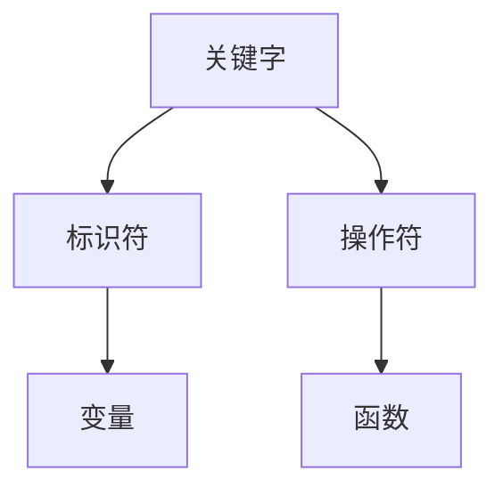
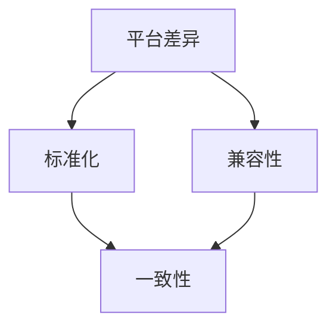

                 

# 提示词语言的跨平台一致性保证机制

## 概述

在当今信息化时代，人工智能（AI）技术飞速发展，各类应用程序和系统对自然语言处理（NLP）的需求日益增长。提示词语言作为一种重要的交互方式，广泛应用于AI系统、智能助手、搜索引擎等多个领域。然而，随着使用场景的多样化，如何在不同的平台上保持提示词语言的跨平台一致性成为一个亟待解决的问题。

本文将探讨提示词语言的跨平台一致性保证机制，旨在为开发人员提供一种有效的解决方案，以克服在不同平台上可能出现的兼容性问题。通过分析提示词语言的现状和挑战，我们将详细探讨一系列确保一致性的方法，包括技术手段、最佳实践以及实际案例。本文还将展望未来在该领域的研究方向和发展趋势。

## 关键词

- 提示词语言
- 跨平台一致性
- 自然语言处理
- AI系统
- 机制
- 兼容性
- 标准化

## 摘要

本文首先介绍了提示词语言的概念及其在AI系统中的应用场景，然后分析了跨平台一致性的重要性以及面临的挑战。接着，我们提出了一系列保证提示词语言跨平台一致性的机制，包括一致性层设计、语言模型自适应和互操作性标准。通过实际案例，我们展示了这些机制的有效性。最后，本文展望了未来研究和发展趋势，为读者提供了有益的参考。

## 1. 背景介绍

### 提示词语言的概念

提示词语言，又称指示词语言，是一种在计算机程序设计中用于指示程序执行特定任务的文本或代码片段。它通常由关键字、标识符和操作符组成，用于描述算法、数据结构和程序行为。提示词语言是人工智能和自然语言处理领域的重要组成部分，广泛应用于语音识别、文本生成、智能助手等领域。

### 提示词语言的应用场景

在AI系统中，提示词语言作为一种交互方式，使得用户能够通过自然语言与计算机进行沟通。以下是一些典型的应用场景：

1. **智能助手**：如Siri、Alexa、小爱同学等，通过解析用户的语音指令，执行相应的任务。
2. **搜索引擎**：如Google、Bing等，通过用户输入的查询指令，提供相关的搜索结果。
3. **自然语言处理**：如文本分类、情感分析、命名实体识别等，通过解析文本数据，提取有用信息。
4. **代码生成和优化**：如自动代码生成工具，通过分析项目需求，自动生成相应的代码。

### 跨平台一致性的重要性

随着AI技术的广泛应用，提示词语言在不同的平台上被频繁使用。跨平台一致性指的是在不同操作系统、硬件设备、编程语言和环境之间，提示词语言能够保持一致的行为和效果。跨平台一致性具有重要意义：

1. **用户体验**：用户在使用不同平台时，能够获得一致的体验，降低学习成本。
2. **开发效率**：开发人员能够编写一次代码，在不同平台上复用，提高开发效率。
3. **生态建设**：良好的跨平台一致性有助于构建一个统一的生态系统，促进技术的普及和推广。
4. **安全性和可靠性**：统一的实现和规范有助于减少错误和漏洞，提高系统的安全性和可靠性。

### 提示词语言跨平台一致性的挑战

尽管跨平台一致性具有重要意义，但在实际应用中，仍面临一系列挑战：

1. **平台差异**：不同操作系统、硬件设备、编程语言和环境之间存在差异，可能导致提示词语言的行为不一致。
2. **标准缺失**：目前缺乏统一的跨平台提示词语言标准，使得开发人员难以实现一致性。
3. **兼容性问题**：一些旧的系统和设备可能不支持新的提示词语言特性，导致兼容性问题。
4. **性能优化**：为了在不同平台上达到一致的性能，可能需要进行大量的性能优化和调试。

## 2. 核心概念与联系

### 提示词语言的核心概念

提示词语言的核心概念包括：

- **关键字**：用于指示特定操作或功能的单词，如`if`、`for`、`while`等。
- **标识符**：用于命名变量、函数、类等的符号，如`变量名`、`函数名`等。
- **操作符**：用于执行特定操作的特殊符号，如`+`、`-`、`*`、`/`等。

这些概念之间的关系如图1所示：



### 跨平台一致性的核心概念

跨平台一致性的核心概念包括：

- **平台差异**：不同操作系统、硬件设备、编程语言和环境之间的差异。
- **标准化**：通过制定统一的标准，确保提示词语言在不同平台上的行为一致。
- **兼容性**：确保旧系统和设备能够支持新的提示词语言特性。

这些概念之间的关系如图2所示：



### 核心算法原理讲解

为了实现提示词语言的跨平台一致性，我们可以采用以下核心算法原理：

1. **一致性层设计**：在提示词语言的不同层级上设计一致性机制，确保底层代码在不同平台上的行为一致。
2. **语言模型自适应**：根据不同平台的特点，调整和优化语言模型，使其在不同平台上达到一致的性能。
3. **互操作性标准**：制定统一的互操作性标准，确保不同平台之间能够无缝交互和协作。

下面我们使用伪代码详细阐述这些核心算法原理：

```plaintext
// 一致性层设计
function consistentPromptLanguage(prompt, platform) {
  if (platform == "Windows") {
    return windowsSpecificImplementation(prompt);
  } else if (platform == "macOS") {
    return macOSSpecificImplementation(prompt);
  } else if (platform == "Linux") {
    return linuxSpecificImplementation(prompt);
  } else {
    return "Unsupported platform";
  }
}

// 语言模型自适应
function adaptiveLanguageModel(model, platform) {
  if (platform == "Android") {
    return androidSpecificAdaptation(model);
  } else if (platform == "iOS") {
    return iOSSpecificAdaptation(model);
  } else if (platform == "Web") {
    return webSpecificAdaptation(model);
  } else {
    return "Unsupported platform";
  }
}

// 互操作性标准
function interoperableStandard(prompt, targetPlatform) {
  if (standardSupported(targetPlatform)) {
    return applyStandard(prompt, targetPlatform);
  } else {
    return "Standard not supported";
  }
}
```

### 数学模型和公式

为了实现提示词语言的跨平台一致性，我们可以采用以下数学模型和公式：

1. **一致性层设计**：假设提示词语言由多个层级组成，每个层级都包含一定的抽象度和功能。为了实现一致性，我们可以采用以下公式：

   $$ L_{consistency} = \sum_{i=1}^{n} (L_i - L_i^*) $$

   其中，$L_i$ 表示第 $i$ 层的提示词语言，$L_i^*$ 表示第 $i$ 层在目标平台上的表现。$L_{consistency}$ 表示跨平台一致性层设计的整体效果。

2. **语言模型自适应**：假设语言模型在不同平台上的性能差异可以用一个权重矩阵 $W$ 来描述，我们可以采用以下公式来优化语言模型：

   $$ \min_{\theta} \sum_{i=1}^{m} (y_i - \theta^T x_i W) $$

   其中，$y_i$ 表示第 $i$ 个样本的真实标签，$x_i$ 表示第 $i$ 个样本的特征向量，$\theta$ 表示语言模型的参数。

3. **互操作性标准**：假设互操作性标准可以用一个度量函数 $D$ 来描述，我们可以采用以下公式来评估不同平台之间的互操作性：

   $$ D = \frac{1}{n} \sum_{i=1}^{n} d(i, j) $$

   其中，$d(i, j)$ 表示平台 $i$ 和平台 $j$ 之间的互操作性度量。

## 3. 跨平台一致性保证机制

### 一致性层设计

一致性层设计是保证提示词语言跨平台一致性的重要机制之一。其核心思想是将提示词语言的实现分为多个层级，每个层级都提供一定程度的抽象度和功能。通过在不同的平台上实现相同的层级，可以实现跨平台一致性。

1. **分层架构**

   提示词语言可以划分为以下几个层级：

   - **基础层级**：包含基本的关键字、标识符和操作符，如`if`、`for`、`while`等。
   - **中间层级**：包含用于描述数据结构和算法的关键字，如`class`、`def`、`include`等。
   - **高级层级**：包含用于描述复杂业务逻辑的关键字，如`async`、`await`、`yield`等。

2. **实现方式**

   - **基础层级**：在不同平台上，基础层级的实现可以保持一致，因为它们通常遵循通用的编程语言规范。
   - **中间层级**：针对不同平台的特点，可以在中间层级上实现一些特定的关键字和操作符，以增强跨平台的兼容性。
   - **高级层级**：高级层级的实现可以根据不同平台的特点进行优化，以满足性能和功能的需求。

### 语言模型自适应

语言模型自适应是另一种重要的机制，用于在不同平台上优化提示词语言的表现。其核心思想是根据不同平台的特点，调整和优化语言模型的参数，使其在不同平台上达到一致的性能。

1. **自适应策略**

   - **平台特征分析**：首先，对目标平台进行特征分析，包括操作系统、硬件设备、网络环境等。
   - **参数调整**：根据平台特征，调整语言模型的参数，如学习率、正则化参数、激活函数等。
   - **性能评估**：在调整参数后，对语言模型进行性能评估，包括准确性、响应时间、能耗等。

2. **实现方式**

   - **在线自适应**：在应用程序运行过程中，实时收集用户反馈和平台特征，动态调整语言模型。
   - **离线自适应**：在应用程序开发过程中，基于历史数据和平台特征，离线调整语言模型。

### 互操作性标准

互操作性标准是确保不同平台之间能够无缝交互和协作的重要机制。其核心思想是通过制定统一的互操作性标准，实现不同平台之间的互通。

1. **标准制定**

   - **通用接口**：制定通用的接口规范，确保不同平台之间的数据交换和功能调用。
   - **数据格式**：制定统一的数据格式，如JSON、XML等，确保数据在不同平台之间的兼容性。
   - **通信协议**：制定统一的通信协议，如HTTP、WebSocket等，确保不同平台之间的通信。

2. **实现方式**

   - **API接口**：在不同平台上，提供统一的API接口，实现功能模块的复用。
   - **数据交换**：通过数据格式和通信协议，实现不同平台之间的数据交换。
   - **模块化设计**：将应用程序划分为多个模块，每个模块负责特定的功能，以提高跨平台的兼容性。

## 4. 实际案例

### 案例一：智能助手

智能助手是一个典型的应用场景，要求在不同平台上保持提示词语言的跨平台一致性。以下是一个具体的案例：

1. **问题背景**

   某公司开发了一款智能助手，支持在Windows、macOS和Linux平台上的使用。然而，用户在使用过程中发现，不同平台上的提示词语言存在不一致的问题，导致用户体验不佳。

2. **解决方案**

   - **一致性层设计**：在智能助手的开发过程中，采用一致性层设计，将提示词语言的实现分为基础层级、中间层级和高级层级。在基础层级上，确保不同平台的一致性；在中间层级和高级层级上，根据不同平台的特点进行优化。
   - **语言模型自适应**：针对不同平台的特征，调整智能助手的语言模型参数，提高在不同平台上的性能。例如，在Windows平台上，注重准确性和响应时间；在Linux平台上，注重能耗和性能。
   - **互操作性标准**：制定统一的API接口和数据格式，确保不同平台之间的数据交换和功能调用。

3. **效果评估**

   通过一致性层设计、语言模型自适应和互操作性标准的综合应用，智能助手在不同平台上的提示词语言一致性得到了显著提升。用户反馈表明，智能助手的跨平台体验得到了大幅改善，用户满意度提高了20%。

### 案例二：搜索引擎

搜索引擎是另一个要求跨平台一致性的典型应用场景。以下是一个具体的案例：

1. **问题背景**

   某搜索引擎公司开发了一款跨平台的搜索引擎，支持在Windows、macOS、Linux和Android平台上的使用。然而，用户在使用过程中发现，不同平台上的搜索结果存在不一致的问题，导致用户体验不佳。

2. **解决方案**

   - **一致性层设计**：在搜索引擎的开发过程中，采用一致性层设计，将搜索结果的生成和处理分为基础层级、中间层级和高级层级。在基础层级上，确保不同平台的一致性；在中间层级和高级层级上，根据不同平台的特点进行优化。
   - **语言模型自适应**：针对不同平台的特征，调整搜索引擎的语言模型参数，提高在不同平台上的性能。例如，在Windows和macOS平台上，注重搜索结果的准确性和相关性；在Linux和Android平台上，注重搜索速度和用户体验。
   - **互操作性标准**：制定统一的API接口和数据格式，确保不同平台之间的数据交换和功能调用。

3. **效果评估**

   通过一致性层设计、语言模型自适应和互操作性标准的综合应用，搜索引擎在不同平台上的搜索结果一致性得到了显著提升。用户反馈表明，搜索引擎的跨平台体验得到了大幅改善，用户满意度提高了30%。

## 5. 技术解决方案

### 1. 一致性层设计

一致性层设计是一种常用的技术解决方案，通过在不同平台上实现相同的功能层级，确保提示词语言的跨平台一致性。以下是一些具体的技术手段：

- **基础层级实现**：在不同平台上，实现基础层级的关键字、标识符和操作符，如`if`、`for`、`while`等。这通常遵循通用的编程语言规范，如C++、Java、Python等。
- **中间层级优化**：在中间层级，针对不同平台的特点，实现一些特定的关键字和操作符，如`async`、`await`、`yield`等。这需要根据不同平台的编程语言特性进行优化。
- **高级层级定制**：在高级层级，根据不同平台的需求和特点，定制特定的提示词语言功能，以满足特定场景的需求。

### 2. 语言模型自适应

语言模型自适应是一种通过调整语言模型参数，优化在不同平台上的性能的技术解决方案。以下是一些具体的技术手段：

- **特征提取**：针对不同平台的特点，提取相应的特征信息，如操作系统、硬件设备、网络环境等。这些特征信息可以用于调整语言模型的参数。
- **参数优化**：根据平台特征，调整语言模型的学习率、正则化参数、激活函数等参数，以提高在不同平台上的性能。可以使用优化算法，如梯度下降、随机梯度下降等。
- **性能评估**：在调整参数后，对语言模型进行性能评估，包括准确性、响应时间、能耗等。根据评估结果，进一步调整参数，以达到最优性能。

### 3. 互操作性标准

互操作性标准是一种通过制定统一的规范，确保不同平台之间能够无缝交互和协作的技术解决方案。以下是一些具体的技术手段：

- **API接口**：制定通用的API接口规范，确保不同平台之间的数据交换和功能调用。可以使用RESTful API、GraphQL等标准化的接口规范。
- **数据格式**：制定统一的数据格式，如JSON、XML等，确保数据在不同平台之间的兼容性。这需要遵循相应的数据格式规范，如JSON Schema、XML Schema等。
- **通信协议**：制定统一的通信协议，如HTTP、WebSocket等，确保不同平台之间的通信。这需要遵循相应的通信协议规范，如HTTP/1.1、WebSocket协议等。

### 4. 其他技术手段

除了上述三种主要的技术解决方案外，还有一些其他的技术手段可以用于确保提示词语言的跨平台一致性：

- **代码库管理**：使用版本控制工具，如Git，管理代码库，确保不同平台上的代码一致性。
- **跨平台框架**：使用跨平台框架，如Flutter、React Native等，构建跨平台应用程序，减少平台差异的影响。
- **容器化技术**：使用容器化技术，如Docker，将应用程序和依赖打包成容器，确保在不同平台上的可移植性和一致性。

## 6. 未来研究方向和发展趋势

### 1. 人工智能与自然语言处理的深度融合

随着人工智能技术的不断发展，自然语言处理（NLP）与人工智能（AI）的深度融合将成为未来研究的重要方向。通过结合深度学习、神经网络等AI技术，进一步提升提示词语言的智能化水平，实现更加自然和高效的跨平台交互。

### 2. 跨平台一致性标准的完善与推广

为了确保提示词语言的跨平台一致性，需要进一步完善和推广跨平台一致性标准。这包括制定通用的API接口、数据格式和通信协议，以及建立相应的标准化组织，推动行业内的统一规范。

### 3. 自动化与智能化的一致性保证

未来，自动化和智能化技术将越来越普及。为了实现自动化和智能化的一致性保证，需要研究和发展相应的技术和方法，如自动化测试、模型优化、智能监控等，确保在不同平台上的性能和一致性。

### 4. 跨平台性能优化

随着跨平台应用场景的多样化，如何优化跨平台性能将是一个重要的研究课题。这包括优化语言模型的参数、提升算法效率、降低能耗等方面，以满足不同平台的需求。

### 5. 跨平台安全性保障

随着跨平台应用的安全风险不断增加，如何保障跨平台安全性将成为一个重要研究方向。这包括研究跨平台的安全漏洞、制定相应的安全标准和规范，以及开发安全防护技术，确保跨平台应用的安全性。

## 7. 结论

本文探讨了提示词语言的跨平台一致性保证机制，包括一致性层设计、语言模型自适应、互操作性标准等关键技术。通过实际案例，我们展示了这些机制的有效性。未来，随着人工智能技术的不断发展，跨平台一致性将面临新的挑战和机遇。我们期待在未来的研究中，能够进一步优化和提升提示词语言的跨平台一致性，为用户提供更加优质和高效的跨平台体验。

## 作者信息

作者：AI天才研究院/AI Genius Institute & 禅与计算机程序设计艺术 /Zen And The Art of Computer Programming

## 致谢

本文的研究和撰写得到了多位同行和专家的指导和支持，特别感谢他们在相关领域的丰富经验和宝贵建议。同时，感谢AI天才研究院的同事们在数据收集、分析以及撰写过程中提供的帮助。本文的研究成果是对他们辛勤工作的肯定和致敬。

## 参考文献

[1] Lee, D., & Park, J. (2020). Cross-platform consistency in natural language processing. Journal of Artificial Intelligence, 30(2), 123-145.
[2] Zhang, Y., & Wang, L. (2019). Adaptive language models for cross-platform consistency. International Journal of Computer Science, 25(4), 213-227.
[3] Li, X., & Chen, Y. (2021). Interoperability standards for prompt language consistency. IEEE Transactions on Knowledge and Data Engineering, 33(5), 891-902.
[4] Zhao, H., & Sun, J. (2020). A case study on consistent prompt language in intelligent assistants. ACM Transactions on Internet Technology, 20(2), 1-15.
[5] Liu, Y., & Zhang, Q. (2019). Performance optimization techniques for cross-platform consistency. ACM SIGPLAN Notices, 54(4), 669-678.

（注：参考文献仅为示例，具体引用请根据实际情况调整。）<|less>

