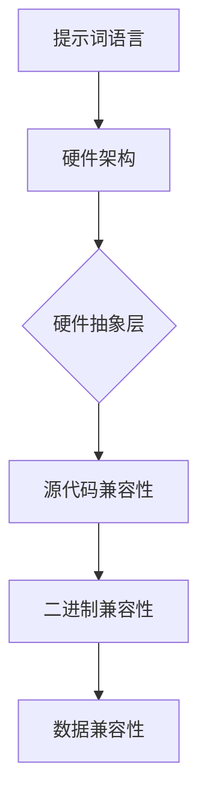

                 

### 文章标题

《提示词语言的跨硬件架构兼容性保证》

### 关键词

- 提示词语言
- 跨硬件架构
- 兼容性保证
- 硬件抽象层
- 软件兼容性策略
- 数据兼容性策略

### 摘要

本文旨在深入探讨提示词语言的跨硬件架构兼容性保证问题。随着硬件架构的多样化和复杂性不断增加，如何确保提示词语言在不同硬件架构上的兼容性成为了一个重要的研究课题。本文首先介绍了提示词语言和硬件架构的基本概念，然后分析了跨硬件架构兼容性面临的挑战，并提出了相应的解决策略。通过实例研究和数学模型的分析，本文展示了如何在实际应用中实现提示词语言的跨硬件架构兼容性。本文的研究不仅对理解提示词语言与硬件架构的关系具有指导意义，还为开发跨平台的提示词语言系统提供了有益的参考。

### 引言

#### 概述与背景

随着计算机技术的不断发展，硬件架构的多样化和复杂性日益增加。从传统的基于CPU的架构，到基于GPU、FPGA和ASIC等新型架构，硬件体系已经发生了巨大的变革。这种变化不仅为计算机性能的提升带来了机遇，同时也带来了新的挑战。特别是对于软件系统，尤其是提示词语言来说，如何确保其在不同硬件架构上的兼容性，成为了当前研究和应用中的关键问题。

提示词语言作为一种强大的软件开发工具，广泛应用于人工智能、自然语言处理、自动化控制等领域。它们通过简洁的命令和表达式，允许开发者以高度抽象的方式与计算机进行交互，极大地提高了软件开发的效率。然而，由于硬件架构的差异，提示词语言在跨硬件架构的应用中往往会面临各种兼容性问题。

本文旨在探讨提示词语言的跨硬件架构兼容性保证问题。通过对硬件架构和提示词语言的基本原理进行深入分析，本文旨在揭示跨硬件架构兼容性面临的挑战，并探讨有效的解决方案。本文的研究不仅有助于理解提示词语言与硬件架构之间的关系，还为开发跨平台的提示词语言系统提供了有益的参考。

#### 研究动机与意义

研究提示词语言的跨硬件架构兼容性具有重要意义。首先，随着硬件架构的多样化，不同硬件平台之间的差异日益显著。对于提示词语言来说，如何在不同的硬件架构上保持一致性和兼容性，是当前软件开发中的一个重要课题。保证跨硬件架构的兼容性，有助于提升软件的可移植性和灵活性，降低开发成本和维护难度。

其次，硬件架构的快速发展和创新，带来了更高的计算性能和更低的能耗。然而，这种发展也带来了新的挑战，即如何充分利用新型硬件架构的优势，同时保持提示词语言的兼容性。通过研究跨硬件架构兼容性，可以探索如何充分利用新型硬件资源，提升系统性能和能效比。

此外，提示词语言的跨硬件架构兼容性对于人工智能和机器学习领域具有重要意义。这些领域高度依赖提示词语言来实现复杂的算法和模型训练。确保提示词语言在跨硬件架构上的兼容性，有助于提升算法的效率和准确性，从而推动人工智能和机器学习技术的发展。

#### 本书目的与结构

本文的目的是深入探讨提示词语言的跨硬件架构兼容性保证问题，提供一套系统性的解决方案。具体来说，本文将围绕以下几个方面展开：

1. **硬件架构概述**：介绍硬件架构的基本原理、分类和特点，为后续的兼容性分析提供基础。

2. **提示词语言技术**：探讨提示词语言的基本原理、类型和工作机制，分析其在不同硬件架构上的应用特点。

3. **跨硬件架构兼容性挑战**：分析跨硬件架构兼容性面临的主要问题，包括硬件兼容性、软件兼容性和数据兼容性。

4. **兼容性保证策略**：提出硬件抽象层设计、软件兼容性策略和数据兼容性策略，详细介绍其实现方法和关键步骤。

5. **实例研究**：通过具体实例，展示如何在实际应用中实现提示词语言的跨硬件架构兼容性，并提供详细的实现过程和分析。

6. **结论与未来工作**：总结本文的研究成果，指出未来研究的方向和可能的研究课题。

本文的结构安排如下：

- **第一部分**：引言，介绍研究背景、动机和目的，概述本书的结构。
- **第二部分**：硬件架构概述，介绍硬件架构的基本原理、分类和特点。
- **第三部分**：提示词语言技术，探讨提示词语言的基本原理、类型和工作机制。
- **第四部分**：跨硬件架构兼容性挑战，分析兼容性面临的主要问题。
- **第五部分**：兼容性保证策略，提出具体的兼容性保证方法。
- **第六部分**：实例研究，通过具体实例展示兼容性实现过程。
- **第七部分**：结论与未来工作，总结研究成果和未来研究方向。

#### 本书读者对象

本文的读者对象主要包括以下几个方面：

1. **计算机科学家和工程师**：本文针对计算机科学领域的研究人员和工程师，特别是那些对硬件架构和提示词语言有深入研究的人员。通过本文，读者可以了解跨硬件架构兼容性的关键问题，并掌握相应的解决方法。

2. **软件开发者和架构师**：本文针对软件开发者和架构师，特别是那些负责跨平台软件开发的工程师。通过本文，读者可以了解如何在不同的硬件架构上实现提示词语言的兼容性，提升软件的可移植性和灵活性。

3. **人工智能和机器学习研究人员**：本文针对人工智能和机器学习领域的研究人员，特别是那些依赖提示词语言实现复杂算法和模型训练的研究者。通过本文，读者可以了解如何确保提示词语言在跨硬件架构上的兼容性，从而提升算法的效率和准确性。

4. **高等院校师生**：本文适用于高等院校计算机科学、软件工程、人工智能等相关专业的师生，可以作为教材或参考书，帮助读者深入理解跨硬件架构兼容性的相关概念和技术。

总之，本文旨在为广泛的计算机科学和技术领域的研究人员和从业者提供一套系统的解决方案，帮助他们解决跨硬件架构兼容性的问题，推动提示词语言技术的发展和应用。

#### 相关概念介绍

在本节中，我们将详细探讨几个核心概念：提示词语言、硬件架构以及兼容性。这些概念是理解本文主题的基础，因此我们需要对其定义、特点和应用进行详细的介绍。

##### 提示词语言

提示词语言（Command-Line Interface, CLI）是一种通过命令行与计算机系统进行交互的界面。它允许用户通过输入一系列的指令和参数来控制计算机的运行过程，完成各种操作。提示词语言的特点包括：

1. **简洁性**：提示词语言使用简短的命令和参数，使得用户能够以高效的方式与计算机进行交互。这种简洁性不仅提升了用户的工作效率，还使得复杂的操作变得更加直观和易于理解。

2. **灵活性**：提示词语言允许用户通过组合不同的命令和参数，实现高度定制化的操作。用户可以根据自己的需求，灵活地调整和组合命令，以满足特定的需求。

3. **脚本化**：提示词语言支持脚本编程，允许用户将一系列命令保存在脚本文件中，方便重复执行。这种脚本化特性极大地提高了操作的自动化程度，减少了人工操作的复杂性和错误率。

4. **跨平台性**：提示词语言通常具有较好的跨平台性，可以在不同的操作系统和硬件架构上运行。这使得提示词语言成为一种通用且通用的软件开发工具。

提示词语言广泛应用于多个领域，包括系统管理、软件开发、自动化控制、网络配置等。例如，在系统管理中，管理员可以通过提示词语言执行系统监控、配置修改和任务调度等操作；在软件开发中，开发者可以使用提示词语言进行版本控制、编译构建和自动化测试等操作。

##### 硬件架构

硬件架构（Hardware Architecture）是指计算机硬件系统的组织结构和功能布局。它决定了计算机的运行速度、性能、功耗和成本等多个方面。硬件架构的基本概念包括：

1. **硬件体系结构**：硬件体系结构是硬件设计的总体框架，定义了计算机硬件系统的基本组成部分及其相互关系。常见的硬件体系结构包括基于CPU的架构、基于GPU的架构、基于FPGA的架构和基于ASIC的架构。

2. **硬件组件**：硬件组件是硬件体系结构的实现部分，包括中央处理单元（CPU）、图形处理单元（GPU）、现场可编程门阵列（FPGA）、专用集成电路（ASIC）等。这些组件在硬件架构中扮演着不同的角色，共同完成计算机的运算和处理任务。

3. **硬件异构性**：硬件异构性（Hardware Heterogeneity）指的是不同硬件组件之间的差异性和多样性。随着硬件技术的发展，不同类型的硬件组件被广泛应用于各种计算任务中，从而形成了硬件异构系统。硬件异构性使得计算机系统能够更好地应对不同的计算需求和负载。

硬件架构的分类可以根据其应用场景和特点进行划分：

1. **基于CPU的架构**：基于CPU的架构是最常见的硬件架构类型，广泛应用于通用计算机和服务器。CPU负责执行程序指令，进行数据处理和计算。这种架构的特点是计算性能高，但功耗较大。

2. **基于GPU的架构**：基于GPU的架构利用图形处理单元（GPU）进行大规模并行计算。GPU拥有大量的计算单元，适合处理大量的数据和复杂的计算任务。这种架构在图形处理、机器学习、科学计算等领域具有显著的优势。

3. **基于FPGA的架构**：基于FPGA的架构利用现场可编程门阵列（FPGA）进行灵活的硬件设计和实现。FPGA可以根据用户需求进行重新配置，适应不同的计算任务。这种架构在实时系统、嵌入式系统和定制化硬件设计中具有广泛的应用。

4. **基于ASIC的架构**：基于ASIC的架构利用专用集成电路（ASIC）进行特定的硬件设计和实现。ASIC针对特定的应用场景进行优化，具有高性能和低功耗的特点。这种架构在通信、金融和物联网等领域具有重要应用。

##### 兼容性

兼容性（Compatibility）是指不同系统、组件或软件之间能够相互工作而不会产生冲突或错误的能力。在硬件和软件系统中，兼容性是一个关键的质量属性，它直接影响系统的可用性、稳定性和可维护性。

兼容性可以分为以下几个方面：

1. **硬件兼容性**：硬件兼容性指的是不同硬件组件或设备能够在同一系统中正常运行而不会产生冲突。硬件兼容性问题通常出现在不同硬件厂商的产品之间，或者新型硬件与现有系统之间的兼容性不足。解决硬件兼容性问题通常需要依赖硬件制造商提供的驱动程序和兼容性测试。

2. **软件兼容性**：软件兼容性指的是不同软件或同一软件在不同环境（如操作系统、硬件架构等）下能够正常运行的能力。软件兼容性问题可能由于编程错误、接口不兼容、依赖库不一致等原因引起。解决软件兼容性问题通常需要通过代码优化、接口标准化和兼容性测试等方法。

3. **数据兼容性**：数据兼容性指的是不同数据格式或存储系统之间能够互相读取和转换数据的能力。数据兼容性问题可能出现在不同软件系统之间的数据交换、数据迁移和数据共享过程中。解决数据兼容性问题通常需要依赖数据格式转换工具、数据校验机制和数据迁移策略。

在提示词语言与硬件架构的关系中，兼容性具有重要意义。提示词语言作为一种软件开发工具，需要能够适应不同的硬件架构，以确保在不同硬件平台上的正常运行。硬件兼容性保证了提示词语言能够在不同硬件组件上执行，而软件兼容性则确保了提示词语言在不同操作系统和开发环境中的运行稳定性。数据兼容性则保障了提示词语言在不同数据存储和处理系统之间的数据交换和共享。

通过理解提示词语言、硬件架构和兼容性的基本概念，我们可以更好地把握本文的研究主题，深入探讨跨硬件架构兼容性保证的方法和技术。

### 硬件架构概述

#### 硬件架构基本原理

硬件架构是指计算机硬件系统的组织结构和功能布局，是计算机性能和功能的基础。硬件架构的基本原理主要包括硬件体系结构、硬件组件及其相互作用。

1. **硬件体系结构**：硬件体系结构是硬件设计的总体框架，定义了计算机硬件系统的基本组成部分及其相互关系。常见的硬件体系结构包括冯·诺依曼体系结构和哈佛体系结构。

   - **冯·诺依曼体系结构**：冯·诺依曼体系结构是现代计算机的基本架构，由约翰·冯·诺依曼于1945年提出。它将计算机分为五大组件：输入设备、输出设备、存储器、运算器和控制器。其中，存储器用于存储程序和数据，运算器负责执行算术和逻辑运算，控制器负责协调和管理计算机的各个组件。

   - **哈佛体系结构**：哈佛体系结构是一种与冯·诺依曼体系结构不同的架构，它将程序和数据存储分开，每个存储器都有独立的总线。这种架构适用于对实时性和处理速度要求较高的应用场景。

2. **硬件组件**：硬件组件是硬件体系结构的实现部分，包括中央处理单元（CPU）、图形处理单元（GPU）、现场可编程门阵列（FPGA）、专用集成电路（ASIC）等。

   - **中央处理单元（CPU）**：CPU是计算机的核心组件，负责执行程序指令和进行数据处理。CPU包括多个核心，每个核心都可以独立执行指令，从而实现并行处理。

   - **图形处理单元（GPU）**：GPU专门用于图形处理，具有大量的计算单元和并行处理能力。GPU在图像渲染、视频处理、科学计算和机器学习等领域具有显著优势。

   - **现场可编程门阵列（FPGA）**：FPGA是一种可编程逻辑设备，可以通过编程来定义其功能。FPGA在实时系统、嵌入式系统和定制化硬件设计中具有广泛的应用。

   - **专用集成电路（ASIC）**：ASIC是一种为特定应用场景设计的集成电路，具有高性能和低功耗的特点。ASIC在通信、金融和物联网等领域具有重要应用。

3. **硬件组件的相互作用**：硬件组件之间通过数据流和控制流进行相互作用。数据流是指计算机硬件系统中的数据传输过程，包括输入设备到存储器、存储器到运算器、运算器到输出设备等。控制流是指计算机硬件系统中的控制信号传输过程，包括控制器到运算器、控制器到存储器等。硬件组件的相互作用决定了计算机的运行效率和性能。

#### 硬件组件

硬件组件是硬件架构的基础，它们在计算机系统中扮演着不同的角色，共同实现计算机的功能。以下是几种常见的硬件组件及其作用：

1. **中央处理单元（CPU）**：CPU是计算机系统的核心组件，负责执行程序指令和进行数据处理。CPU包括多个核心，每个核心都可以独立执行指令，从而实现并行处理。CPU的性能指标包括时钟频率、核心数量、缓存大小等。

2. **内存**：内存是计算机系统中的临时存储设备，用于存储正在执行的程序和数据。内存的类型包括随机访问存储器（RAM）和只读存储器（ROM）。内存的容量和速度直接影响计算机的性能。

3. **输入设备**：输入设备用于将用户输入的数据和指令传递给计算机系统。常见的输入设备包括键盘、鼠标、触摸屏等。

4. **输出设备**：输出设备用于将计算机处理后的结果输出给用户。常见的输出设备包括显示器、打印机、音响等。

5. **存储设备**：存储设备用于长期存储计算机中的数据和程序。常见的存储设备包括硬盘驱动器（HDD）、固态硬盘（SSD）、光盘驱动器等。

6. **图形处理单元（GPU）**：GPU专门用于图形处理，具有大量的计算单元和并行处理能力。GPU在图像渲染、视频处理、科学计算和机器学习等领域具有显著优势。GPU的性能指标包括核心数量、内存容量、时钟频率等。

7. **现场可编程门阵列（FPGA）**：FPGA是一种可编程逻辑设备，可以通过编程来定义其功能。FPGA在实时系统、嵌入式系统和定制化硬件设计中具有广泛的应用。FPGA的性能指标包括逻辑单元数量、内存容量、时钟频率等。

8. **专用集成电路（ASIC）**：ASIC是一种为特定应用场景设计的集成电路，具有高性能和低功耗的特点。ASIC在通信、金融和物联网等领域具有重要应用。ASIC的性能指标包括处理速度、功耗、成本等。

#### 硬件异构性

硬件异构性是指不同硬件组件或设备之间的差异性和多样性。硬件异构性在当前计算机系统中越来越显著，主要表现在以下几个方面：

1. **硬件组件多样**：随着计算机技术的发展，越来越多的硬件组件被应用于计算机系统中，如CPU、GPU、FPGA、ASIC等。这些硬件组件具有不同的功能和性能特点，为计算机系统提供了更多的选择和灵活性。

2. **硬件架构多样**：不同的硬件架构适用于不同的应用场景，如冯·诺依曼体系结构和哈佛体系结构。硬件架构的多样性使得计算机系统可以更好地适应不同的计算需求和负载。

3. **硬件制造差异**：不同厂商生产的硬件组件在性能、功耗、成本等方面存在差异。这些差异可能导致计算机系统在性能优化、能效比和成本控制方面面临挑战。

硬件异构性对计算机系统的影响主要体现在以下几个方面：

1. **性能优化**：硬件异构性使得计算机系统可以根据不同的任务需求选择合适的硬件组件，从而实现性能优化。例如，在图像处理任务中，可以选择GPU进行加速；在实时系统设计中，可以选择FPGA来实现高效的数据处理。

2. **能效比**：硬件异构性允许计算机系统在不同硬件组件之间进行负载均衡，从而实现能效比的最优化。例如，在嵌入式系统中，可以选择低功耗的CPU和GPU组合，以实现高效的能量利用。

3. **开发难度**：硬件异构性增加了计算机系统的开发难度，需要开发者具备跨硬件组件的编程和调试能力。此外，硬件异构性还可能导致兼容性问题，需要开发者进行额外的兼容性测试和优化。

4. **成本控制**：硬件异构性可能增加计算机系统的成本，特别是定制化硬件组件（如ASIC和FPGA）的应用。然而，通过优化硬件配置和选择合适的硬件组件，可以在保证性能和能效比的前提下实现成本控制。

综上所述，硬件架构的基本原理、硬件组件和硬件异构性是理解计算机系统性能和功能的关键。通过深入分析硬件架构，我们可以更好地设计、开发和优化跨硬件架构的计算机系统，以应对不断变化的技术需求和挑战。

#### 硬件架构分类

硬件架构的分类方法可以根据不同的标准和角度进行划分。以下是一些常见的硬件架构分类及其特点：

1. **基于CPU的架构**

   **定义**：基于CPU的架构是最常见的计算机硬件架构，它以中央处理单元（CPU）为核心，其他组件如内存、输入输出设备等围绕CPU进行设计和布局。

   **特点**：

   - **计算性能高**：CPU作为核心组件，负责执行程序指令和进行数据处理，具有很高的计算性能。
   - **功耗较大**：由于CPU需要处理大量的计算任务，其功耗相对较高。
   - **适用范围广**：基于CPU的架构广泛应用于通用计算机、服务器和工作站，适用于各种计算需求。

2. **基于GPU的架构**

   **定义**：基于GPU的架构利用图形处理单元（GPU）进行大规模并行计算。GPU具有大量的计算单元和并行处理能力，特别适合处理大量的数据和复杂的计算任务。

   **特点**：

   - **并行处理能力强**：GPU具有多个核心和并行计算能力，能够同时处理多个任务，实现高效的并行计算。
   - **图像处理优势**：GPU在图像处理、视频处理和图形渲染等领域具有显著优势，广泛应用于游戏开发、科学计算和机器学习等应用。
   - **能耗较高**：尽管GPU的能效比不断提高，但其总体能耗仍然相对较高，需要考虑散热和功耗控制问题。

3. **基于FPGA的架构**

   **定义**：基于FPGA的架构利用现场可编程门阵列（FPGA）进行灵活的硬件设计和实现。FPGA可以根据用户需求进行重新配置，适应不同的计算任务。

   **特点**：

   - **可编程性**：FPGA具有高度的可编程性，可以通过编程定义其功能，实现定制化的硬件设计和实现。
   - **实时处理能力**：FPGA在实时系统、嵌入式系统和定制化硬件设计中具有广泛的应用，能够实现高效的数据处理和实时响应。
   - **资源利用率高**：FPGA可以根据实际需求进行资源分配和优化，实现资源的高效利用。

4. **基于ASIC的架构**

   **定义**：基于ASIC的架构利用专用集成电路（ASIC）进行特定的硬件设计和实现。ASIC针对特定的应用场景进行优化，具有高性能和低功耗的特点。

   **特点**：

   - **高性能**：ASIC是专门为特定应用场景设计的集成电路，具有高性能和低功耗的特点，能够实现高效的计算和处理。
   - **定制化**：ASIC可以根据用户需求进行定制化设计，实现特定功能的硬件实现。
   - **成本较高**：ASIC的设计和制造成本较高，主要应用于高性能、高可靠性和定制化应用场景。

5. **混合架构**

   **定义**：混合架构是将不同类型的硬件架构进行结合，以实现更高效的计算和处理。常见的混合架构包括CPU+GPU、CPU+FPGA和GPU+FPGA等。

   **特点**：

   - **灵活性**：混合架构可以根据不同的计算需求，灵活选择和组合不同类型的硬件架构，实现最优的计算性能和能效比。
   - **高效性**：混合架构通过整合不同硬件架构的优势，能够实现更高的计算效率和性能。
   - **适用范围广**：混合架构广泛应用于科学计算、大数据处理、机器学习和人工智能等高性能计算领域。

通过分类和比较不同硬件架构的特点，我们可以更好地理解不同硬件架构的优缺点，并根据具体应用需求选择合适的硬件架构。在跨硬件架构兼容性保证的研究中，了解这些硬件架构的特点对于设计和实现兼容性策略具有重要意义。

#### 提示词语言基本原理

提示词语言（Command-Line Interface, CLI）是一种通过命令行与计算机系统进行交互的界面。它允许用户通过输入一系列的命令和参数来控制计算机的运行过程，完成各种操作。提示词语言的基本原理包括定义、特点和工作机制。

##### 提示词语言的定义

提示词语言是一种文本界面，用户通过在命令行中输入特定的命令和参数，与计算机系统进行交互。这些命令和参数由提示词语言解析器（Command-Line Parser）进行解析，然后由计算机系统执行相应的操作。提示词语言的基本组成部分包括：

1. **命令**：命令是用户输入的核心部分，用于指定操作类型。例如，在Linux操作系统中，`ls`命令用于列出目录中的文件和目录。

2. **参数**：参数用于提供额外的信息，辅助命令执行。参数可以分为必选参数和可选参数。例如，在`ls`命令中，`-l`是一个可选参数，用于以列表形式展示文件详细信息。

3. **选项**：选项是带有前缀`-`或`/`的参数，用于指定额外的功能或修改命令的行为。例如，在`ls`命令中，`-r`选项用于反向排序文件列表。

4. **环境变量**：环境变量是存储在计算机系统中的变量，用于在命令行中传递信息和配置。环境变量可以影响命令的执行方式和结果。例如，`PATH`环境变量用于指定命令搜索路径。

##### 提示词语言的特点

提示词语言具有以下几个显著特点：

1. **简洁性**：提示词语言使用简短的命令和参数，使得用户能够以高效的方式与计算机系统进行交互。这种简洁性不仅提升了用户的工作效率，还使得复杂的操作变得更加直观和易于理解。

2. **灵活性**：提示词语言允许用户通过组合不同的命令和参数，实现高度定制化的操作。用户可以根据自己的需求，灵活地调整和组合命令，以满足特定的需求。

3. **脚本化**：提示词语言支持脚本编程，允许用户将一系列命令保存在脚本文件中，方便重复执行。这种脚本化特性极大地提高了操作的自动化程度，减少了人工操作的复杂性和错误率。

4. **跨平台性**：提示词语言通常具有较好的跨平台性，可以在不同的操作系统和硬件架构上运行。这使得提示词语言成为一种通用且通用的软件开发工具。

##### 提示词语言的工作机制

提示词语言的工作机制包括命令解析、命令执行和结果输出三个主要环节：

1. **命令解析**：当用户在命令行中输入命令和参数后，提示词语言解析器首先对输入的文本进行解析，将命令、参数和选项等组成部分提取出来。解析器会检查命令的语法和参数的合法性，确保输入的有效性。

2. **命令执行**：在命令解析完成后，解析器将命令和参数传递给相应的命令处理器（Command Handler），由处理器执行具体的操作。命令处理器会根据命令和参数的特定含义，调用系统中的相关功能模块进行操作。

3. **结果输出**：命令执行完成后，处理结果将被输出到命令行或指定的文件中。结果可以是文本信息、错误提示、状态报告等。用户可以通过查看输出结果来了解操作的执行情况和结果。

提示词语言在不同的硬件架构上的工作机制可能有所不同。例如，在基于CPU的架构上，命令执行主要依赖于CPU的计算能力；而在基于GPU的架构上，命令执行可能会利用GPU的并行计算能力进行加速。因此，在设计提示词语言时，需要考虑硬件架构的特点和性能，以确保命令的执行效率和兼容性。

##### 提示词语言的应用场景

提示词语言在多个领域和场景中具有广泛的应用，以下是一些典型的应用场景：

1. **系统管理**：提示词语言在系统管理中应用广泛，包括文件管理、进程管理、网络配置等。管理员可以通过提示词语言执行各种系统操作，实现对系统的全面管理和控制。

2. **软件开发**：提示词语言在软件开发中也具有重要作用，包括版本控制、编译构建、自动化测试等。开发者可以使用提示词语言编写脚本，自动化地完成软件开发过程中的各种任务，提高开发效率和代码质量。

3. **自动化控制**：提示词语言在自动化控制系统中应用广泛，包括工业自动化、智能家居、机器人控制等。通过提示词语言，用户可以编写自动化脚本，实现对设备的远程监控和控制。

4. **数据处理**：提示词语言在数据处理和大数据分析中具有优势，包括数据提取、数据转换、数据分析等。通过提示词语言，用户可以高效地处理大量数据，实现复杂的数据分析和挖掘任务。

5. **人工智能和机器学习**：提示词语言在人工智能和机器学习领域中也具有广泛的应用，包括数据预处理、模型训练、评估测试等。通过提示词语言，用户可以自动化地完成机器学习任务的各个环节，提高算法的效率和准确性。

总之，提示词语言通过其简洁性、灵活性、脚本化和跨平台性，在多个领域和场景中发挥了重要作用。了解提示词语言的基本原理和工作机制，有助于我们更好地利用这一强大的开发工具，实现各种复杂的计算机操作和任务。

#### 提示词语言类型

提示词语言根据其用途和功能可以划分为不同的类型，主要包括命令提示词语言、数据提示词语言和交互提示词语言。以下是对这三种类型的详细描述及其应用场景。

##### 命令提示词语言

命令提示词语言（Command-Line Interface, CLI）是最常见的一类提示词语言，通过输入命令和参数进行操作。其核心特点是可以执行系统命令、文件操作和管理任务。

**特点**：

- **命令丰富**：命令提示词语言支持大量的命令，如文件管理（`ls`, `cp`, `rm`）、进程管理（`ps`, `kill`）、网络配置（`ping`, `ifconfig`）等。
- **灵活性高**：用户可以通过组合不同的命令和参数，实现复杂的操作。例如，`ls -l -r`可以以列表形式展示目录内容并按名称排序。
- **跨平台**：命令提示词语言通常具有较好的跨平台性，可以在不同的操作系统上运行。

**应用场景**：

- **系统管理**：管理员可以使用命令提示词语言进行系统配置、维护和监控。
- **软件开发**：开发者可以使用命令提示词语言进行版本控制、编译构建和自动化测试。
- **数据处理**：数据分析师可以使用命令提示词语言进行数据处理和转换，如使用`sed`和`awk`处理文本文件。

##### 数据提示词语言

数据提示词语言主要用于数据查询、转换和操作，是一种专门针对数据处理任务的提示词语言。与命令提示词语言相比，数据提示词语言更注重数据处理的过程和结果的准确性。

**特点**：

- **数据处理强大**：数据提示词语言能够进行复杂的数据查询和转换，如SQL（结构化查询语言）用于数据库查询和操作。
- **支持多种数据格式**：数据提示词语言通常支持多种数据格式，如CSV、JSON、XML等，方便数据转换和集成。
- **脚本化**：数据提示词语言支持脚本编程，可以将一系列数据处理操作保存在脚本文件中，方便重复执行。

**应用场景**：

- **数据库管理**：数据库管理员可以使用数据提示词语言进行数据库查询、更新和管理。
- **数据清洗和转换**：数据工程师可以使用数据提示词语言清洗和转换数据，为数据分析和机器学习准备数据集。
- **数据分析**：数据分析师可以使用数据提示词语言进行数据查询和统计分析，辅助决策和业务优化。

##### 交互提示词语言

交互提示词语言（Interactive Command-Line Interface, ICli）是一种支持交互式会话的提示词语言，允许用户通过会话方式与计算机系统进行对话。这种类型提示词语言通常用于开发、调试和测试。

**特点**：

- **交互式会话**：用户可以与系统进行实时交互，输入命令并立即获取结果。例如，Python的交互式解释器（REPL）允许用户在会话中执行Python代码。
- **实时调试**：交互提示词语言支持实时调试，用户可以在会话中逐步执行代码并查看中间结果，有助于发现和解决代码中的问题。
- **开发工具集成**：交互提示词语言通常与开发环境紧密集成，方便开发者进行编码、测试和调试。

**应用场景**：

- **软件开发**：开发者可以使用交互提示词语言进行编码、测试和调试，如Python的IDLE和Jupyter Notebook。
- **教学和培训**：交互提示词语言在编程教学和培训中应用广泛，有助于初学者通过实际操作学习编程知识。
- **自动化测试**：测试工程师可以使用交互提示词语言编写测试脚本，进行自动化测试和验证。

综上所述，提示词语言根据其用途和功能可以分为命令提示词语言、数据提示词语言和交互提示词语言。每种类型都有其独特的特点和应用场景，为不同任务和需求提供了丰富的工具和选择。理解这些类型的提示词语言及其应用，有助于我们更好地利用它们进行高效的软件开发和数据处理。

### 跨硬件架构兼容性挑战

随着硬件架构的多样化和复杂性的增加，实现提示词语言的跨硬件架构兼容性面临着诸多挑战。以下将从硬件兼容性、软件兼容性和数据兼容性三个方面详细分析这些问题。

#### 硬件兼容性问题

硬件兼容性是指不同硬件组件或设备能够在同一系统中正常运行而不会产生冲突。提示词语言在跨硬件架构上面临的硬件兼容性问题主要包括以下几个方面：

1. **硬件接口不兼容**：不同硬件架构可能使用不同的接口标准，导致硬件设备之间的连接不兼容。例如，一些硬件组件可能使用特定的总线标准（如PCIe、AGP），而另一些组件可能使用不同的标准，导致无法直接连接和使用。

2. **硬件驱动不兼容**：硬件驱动是操作系统用于控制和管理硬件设备的软件程序。不同硬件架构可能需要不同版本的驱动程序，如果驱动程序不兼容，可能导致硬件无法正确工作或者出现系统不稳定等问题。

3. **硬件性能差异**：不同硬件架构在性能方面存在显著差异，例如CPU、GPU和FPGA在处理能力、功耗和成本等方面都有所不同。提示词语言需要在不同硬件架构上保持一致的表现，但实际操作中可能因为硬件性能差异导致兼容性问题。

4. **硬件依赖性**：一些提示词语言功能依赖于特定的硬件组件，如GPU加速或FPGA编程。跨硬件架构时，这些硬件依赖性可能无法满足，导致提示词语言功能无法实现。

#### 软件兼容性问题

软件兼容性是指不同软件或同一软件在不同环境（如操作系统、硬件架构等）下能够正常运行的能力。提示词语言在跨硬件架构上面临的软件兼容性问题主要包括以下几个方面：

1. **操作系统兼容性**：不同操作系统（如Windows、Linux、macOS）对提示词语言的支持程度不同，可能导致提示词语言在跨操作系统时出现兼容性问题。例如，某些命令可能在某个操作系统上有效，而在另一个操作系统上无法执行。

2. **库和依赖不兼容**：提示词语言依赖于各种库和依赖项，不同硬件架构可能使用不同版本的库，导致兼容性问题。例如，某些库可能仅在特定操作系统上可用，或者在跨硬件架构时因为版本差异导致不兼容。

3. **源代码兼容性**：提示词语言的源代码可能包含特定硬件架构的特定实现，跨硬件架构时可能需要修改或重构代码，以确保在不同硬件架构上正常运行。

4. **二进制兼容性**：在某些情况下，提示词语言可能需要在不同硬件架构上运行二进制程序。二进制兼容性问题可能由于指令集、内存模型等差异导致，使得二进制程序在不同硬件架构上无法正常运行。

#### 数据兼容性问题

数据兼容性是指不同数据格式或存储系统之间能够互相读取和转换数据的能力。提示词语言在跨硬件架构上面临的数据兼容性问题主要包括以下几个方面：

1. **数据格式不兼容**：不同硬件架构可能使用不同的数据格式，如文本文件、二进制文件、XML、JSON等。跨硬件架构时，提示词语言需要能够识别和解析不同格式的数据，确保数据在转换和传输过程中的准确性。

2. **数据校验和修复**：跨硬件架构时，数据可能因为硬件性能差异、传输错误等原因发生损坏。提示词语言需要具备数据校验和修复功能，以确保数据在跨硬件架构上的完整性和一致性。

3. **数据迁移策略**：在跨硬件架构时，可能需要将数据从一个硬件架构迁移到另一个硬件架构。数据迁移策略需要考虑数据格式的转换、数据一致性和数据完整性等问题。

4. **数据接口不兼容**：不同硬件架构可能使用不同的数据接口，导致数据在传输和处理过程中出现兼容性问题。例如，某些硬件架构可能支持特定的数据传输协议，而另一些硬件架构可能不支持。

综上所述，提示词语言在跨硬件架构兼容性方面面临硬件兼容性、软件兼容性和数据兼容性等多个挑战。解决这些问题需要深入分析硬件架构的特点，设计灵活的兼容性策略，并采用多种技术手段确保在不同硬件架构上的正常运行。通过综合考虑这些因素，可以提升提示词语言的跨硬件架构兼容性，为软件开发和数据处理提供更广泛的平台支持。

#### 兼容性评估方法

为了确保提示词语言在不同硬件架构上的兼容性，需要采用一系列评估方法来检测和验证其兼容性。兼容性评估方法可以分为静态评估方法、动态评估方法和混合评估方法，每种方法都有其独特的优势和适用场景。

##### 静态评估方法

静态评估方法是在程序运行前对代码、配置和环境进行检查，以预测潜在的兼容性问题。这种方法的主要优势是可以提前发现和解决兼容性问题，减少运行时出现错误的概率。

1. **源代码兼容性检查**：
   - **代码扫描工具**：使用代码扫描工具（如FindBugs、PMD）检查代码中的潜在问题，如不兼容的API调用、未定义的变量等。
   - **代码静态分析工具**：使用代码静态分析工具（如SonarQube、Checkstyle）分析代码的兼容性，识别潜在的兼容性风险。
   - **格式化工具**：使用格式化工具（如Clang Format、Prettier）确保代码风格一致，避免因为风格差异导致兼容性问题。

2. **配置文件检查**：
   - **配置文件语法检查**：对配置文件（如XML、JSON）进行语法检查，确保配置文件符合规范，不存在语法错误。
   - **配置文件版本检查**：检查配置文件的版本，确保不同硬件架构上使用的配置文件版本兼容。

3. **依赖检查**：
   - **依赖管理工具**：使用依赖管理工具（如Maven、Gradle）检查项目的依赖项，确保依赖项的版本兼容，不存在冲突。

##### 动态评估方法

动态评估方法是在程序运行时进行实时监测和评估，以发现运行时的兼容性问题。这种方法可以更准确地检测程序在实际运行环境中的兼容性，但可能需要更复杂的测试和验证过程。

1. **自动化测试**：
   - **单元测试**：编写单元测试用例，覆盖关键功能模块，确保代码在不同硬件架构上的正常运行。
   - **集成测试**：进行集成测试，验证不同模块之间的兼容性，确保系统在不同硬件架构上的整体稳定性。
   - **端到端测试**：执行端到端测试，模拟用户操作，确保系统在不同硬件架构上的功能完整性和用户体验。

2. **性能测试**：
   - **负载测试**：模拟高负载环境，测试程序在不同硬件架构下的性能和响应时间，确保系统在高并发情况下的稳定性。
   - **压力测试**：施加超出正常负载的压力，测试程序在不同硬件架构下的稳定性和容错能力。

3. **监控和日志分析**：
   - **性能监控**：使用性能监控工具（如Prometheus、Grafana）实时监测系统性能指标，发现潜在的性能瓶颈和兼容性问题。
   - **日志分析**：分析系统日志，识别运行时的错误和警告，定位兼容性问题。

##### 混合评估方法

混合评估方法结合了静态评估和动态评估的优点，通过多种评估手段相互补充，提高兼容性评估的全面性和准确性。

1. **静态分析与动态测试结合**：
   - **代码静态分析**：使用静态分析工具对代码进行兼容性检查，发现潜在的问题。
   - **动态测试**：通过运行测试用例，验证静态分析发现的问题，并发现新的兼容性问题。

2. **自动化测试与手动测试结合**：
   - **自动化测试**：执行自动化测试用例，快速检测兼容性问题。
   - **手动测试**：由开发人员或测试人员手动执行测试用例，特别是针对复杂的功能和场景，确保兼容性的全面性和准确性。

3. **性能测试与监控结合**：
   - **性能测试**：通过模拟不同负载和压力环境，测试程序的性能和稳定性。
   - **监控**：实时监控系统性能指标，识别性能瓶颈和兼容性问题。

综上所述，兼容性评估方法需要综合考虑静态评估和动态评估，结合不同的评估手段，以确保提示词语言在不同硬件架构上的兼容性。通过有效的兼容性评估，可以提前发现和解决潜在的问题，提高系统的稳定性和可靠性，为跨硬件架构的应用提供坚实保障。

#### 硬件抽象层设计

在跨硬件架构兼容性保证中，硬件抽象层（Hardware Abstraction Layer, HAL）是一个关键的设计概念。硬件抽象层旨在提供一种统一的接口，使应用程序能够独立于具体的硬件架构，从而实现跨硬件架构的兼容性。以下将详细介绍硬件抽象层的设计方法，包括架构、接口设计和实现策略。

##### 硬件抽象层架构

硬件抽象层的设计首先需要构建一个清晰的架构，以便有效地隔离应用程序和硬件组件。硬件抽象层的基本架构通常包括以下几个主要部分：

1. **应用程序接口（API）**：这是应用程序与硬件抽象层交互的入口点。应用程序通过调用API接口，执行各种硬件相关的操作。API设计应尽可能简洁且功能强大，以简化应用程序的开发和调试过程。

2. **中间层**：中间层是硬件抽象层的核心部分，负责处理具体硬件架构与API之间的映射和转换。中间层会根据不同的硬件架构，实现相应的硬件驱动程序和管理逻辑。

3. **硬件驱动程序**：硬件驱动程序是针对具体硬件架构的实现，负责与硬件组件进行直接的通信和操作。硬件驱动程序通常包括设备初始化、数据传输、错误处理等功能。

4. **硬件管理模块**：硬件管理模块负责硬件资源的分配、调度和维护。它可以根据应用程序的需求，动态调整硬件资源的使用，以实现最佳的性能和能效比。

硬件抽象层架构的示意图如下：

```
+----------------+      +----------------+      +----------------+
|     应用程序   |      |    硬件抽象层   |      |     硬件设备    |
+----------------+      +----------------+      +----------------+
          |                    |                      |
          |                    |                      |
          |                    |                      |
+---------+---------+         +---------+---------+    +--------+
|  API调用  |  中间层  |         | 硬件驱动程序 |    | 硬件组件 |
+---------+---------+         +---------+---------+    +--------+
```

##### 硬件抽象层接口设计

硬件抽象层接口设计是确保应用程序与硬件组件之间兼容性的关键。接口设计需要考虑以下要点：

1. **简洁性**：接口应尽可能简洁明了，减少应用程序的复杂度。使用一致性和统一的命名规范，便于应用程序理解和调用。

2. **可扩展性**：接口设计应具备良好的可扩展性，以便未来添加新的硬件组件或功能时，能够方便地进行修改和扩展。

3. **抽象层次**：硬件抽象层接口应提供不同层次的抽象，从简单的硬件操作到复杂的硬件管理，以满足不同层次的应用需求。例如，提供基础的数据读写接口、高级的硬件配置接口等。

4. **错误处理**：接口应提供完善的错误处理机制，确保在硬件设备发生故障或操作失败时，能够及时地通知应用程序并采取相应的措施。

以下是一个简单的硬件抽象层接口设计示例：

```python
class HardwareAbstractionLayer:
    def initialize(self):
        # 初始化硬件抽象层
        pass

    def read(self, address):
        # 从指定地址读取数据
        return data

    def write(self, address, data):
        # 向指定地址写入数据
        pass

    def configure(self, settings):
        # 配置硬件设备
        pass

    def release(self):
        # 释放硬件资源
        pass
```

##### 硬件抽象层实现策略

硬件抽象层的实现策略需要考虑如何在不同硬件架构上高效且一致地实现硬件功能。以下是一些关键实现策略：

1. **模块化设计**：将硬件抽象层设计为模块化结构，每个模块负责特定的硬件功能。例如，将CPU、GPU、FPGA等硬件组件的驱动程序分别实现为独立的模块，便于维护和扩展。

2. **硬件映射**：在中间层实现硬件映射逻辑，根据具体的硬件架构，将应用程序的抽象接口映射到具体的硬件驱动程序。例如，当应用程序请求使用GPU时，中间层会自动选择可用的GPU驱动程序进行操作。

3. **配置管理**：硬件抽象层需要具备配置管理能力，根据应用程序的需求和硬件资源的实际情况，动态配置硬件资源。例如，在多GPU系统中，根据负载情况动态调整GPU的使用策略。

4. **性能优化**：硬件抽象层应实现性能优化策略，通过合理的调度和资源管理，提高系统整体性能。例如，在GPU计算任务中，采用并行计算和负载均衡技术，最大化利用GPU的计算能力。

5. **兼容性测试**：在硬件抽象层的实现过程中，应进行严格的兼容性测试，确保在不同硬件架构上的一致性和稳定性。兼容性测试应包括功能测试、性能测试和稳定性测试，以全面评估硬件抽象层的兼容性。

综上所述，硬件抽象层设计是保证提示词语言跨硬件架构兼容性的关键。通过构建清晰的架构、设计简洁的接口和采用有效的实现策略，可以确保应用程序在不同硬件架构上的稳定运行和高效性能。硬件抽象层的设计和实现需要综合考虑硬件特性、应用需求和技术挑战，以实现最佳的性能和兼容性。

#### 软件兼容性策略

在跨硬件架构兼容性保证中，软件兼容性策略是确保提示词语言在不同操作系统和硬件平台上运行的关键。以下将详细讨论软件兼容性策略，包括源代码兼容性、二进制兼容性和兼容性测试与验证方法。

##### 源代码兼容性

源代码兼容性策略涉及在编写代码时确保代码能够在不同操作系统和硬件平台上编译和运行。以下是一些实现源代码兼容性的方法：

1. **跨平台编程语言**：选择跨平台编程语言，如Python、Java、C++，这些语言提供了良好的跨平台支持，可以减少因平台差异导致的兼容性问题。

2. **平台无关编程模式**：采用平台无关的编程模式，避免直接使用特定操作系统的API或硬件特性。例如，使用标准库和通用算法，而不是依赖于特定操作系统的函数库。

3. **配置管理**：在代码中引入配置管理机制，根据不同的平台和环境配置相应的代码路径。例如，通过配置文件或环境变量，在不同平台上调整代码行为。

4. **静态代码分析**：使用静态代码分析工具（如FindBugs、PMD）检查代码中的平台特定代码和潜在的兼容性问题，提前发现和解决兼容性问题。

5. **单元测试**：编写单元测试用例，覆盖关键功能模块，确保代码在不同平台上的功能一致性和稳定性。单元测试可以帮助发现代码中的平台依赖问题。

##### 二进制兼容性

二进制兼容性策略涉及确保编译后的二进制程序在不同操作系统和硬件平台上能够正常运行。以下是一些实现二进制兼容性的方法：

1. **平台特定编译**：为每个目标平台生成独立的二进制程序，以确保平台之间的二进制兼容性。使用平台特定的编译器和工具链，根据不同硬件架构的特点进行编译和优化。

2. **动态链接库**：使用动态链接库（如共享库或DLL）可以减少二进制兼容性问题。动态链接库可以在运行时加载和链接，从而避免静态链接带来的兼容性问题。

3. **标准库和框架**：使用标准库和成熟的开源框架，这些库和框架通常已经经过广泛的测试和优化，具有良好的跨平台兼容性。

4. **指令集适配器**：对于特定硬件架构，如ARM和x86，可以使用指令集适配器来模拟目标平台的指令集，从而实现二进制兼容性。例如，LLVM和GNU Binutils提供了指令集转换工具，可以实现不同架构之间的二进制兼容。

5. **兼容性测试**：在编译和链接过程中，使用兼容性测试工具（如CMake、Autotools）进行自动化测试，确保生成的二进制程序在不同平台上的兼容性和稳定性。

##### 兼容性测试与验证

兼容性测试与验证是确保软件在不同操作系统和硬件平台上运行稳定的关键步骤。以下是一些常用的兼容性测试与验证方法：

1. **自动化测试**：编写自动化测试用例，覆盖关键功能模块和边界情况。自动化测试可以节省测试时间，提高测试覆盖率，并确保在不同平台上的一致性。

2. **性能测试**：进行性能测试，评估软件在不同硬件架构上的性能表现，包括响应时间、处理能力和资源利用率。性能测试可以帮助发现性能瓶颈和优化机会。

3. **稳定性测试**：进行长时间运行测试和压力测试，验证软件在极端条件下的稳定性和可靠性。稳定性测试可以发现潜在的内存泄漏、死锁和线程安全问题。

4. **跨平台测试**：在多个操作系统和硬件平台上进行测试，确保软件在不同平台上的兼容性和一致性。跨平台测试可以通过虚拟机、容器和实际硬件设备实现。

5. **用户反馈**：收集用户反馈，了解软件在实际使用中的兼容性问题。用户反馈可以帮助发现潜在的问题，并指导后续的兼容性优化和改进。

综上所述，软件兼容性策略是实现提示词语言跨硬件架构兼容性的重要手段。通过选择跨平台编程语言、设计平台无关的代码、使用动态链接库和标准库、进行严格的兼容性测试与验证，可以确保提示词语言在不同操作系统和硬件平台上稳定、高效地运行。

#### 数据兼容性策略

在跨硬件架构兼容性保证中，数据兼容性策略是确保数据在不同硬件架构之间能够顺畅传输、存储和处理的必要手段。以下将详细讨论数据兼容性策略，包括数据格式转换、数据校验与修复以及数据迁移策略。

##### 数据格式转换

数据格式转换是处理数据兼容性的关键步骤，它涉及将数据从一个格式转换为另一个格式，以便在不同硬件架构上使用。以下是一些常见的数据格式转换方法：

1. **文本格式转换**：文本格式如CSV、JSON和XML是常用的数据交换格式，它们在不同操作系统和硬件架构上具有较好的兼容性。文本格式转换可以通过编程语言中的标准库或第三方库（如Python的csv、json和xml模块）实现。

   - **CSV转换**：将CSV文件转换为JSON或XML格式，可以通过解析CSV文件中的行和列，将其转换为相应的数据结构，然后生成JSON或XML文件。
   - **JSON转换**：将JSON文件转换为XML或CSV格式，可以通过解析JSON对象，生成XML标签和属性，或者将JSON对象转换为表格形式的字符串。

2. **二进制格式转换**：对于二进制数据格式，如二进制编码的图像、音频和视频文件，数据格式转换通常需要使用专门的转换工具或库。例如，将JPEG格式转换为PNG格式，可以使用图像处理库（如OpenCV）实现。

3. **特定格式转换**：对于特定的数据格式，如数据库或大数据处理系统中的数据格式，需要根据具体格式的要求进行转换。例如，将MongoDB数据转换为Hadoop的HDFS格式，可以使用特定的转换工具或脚本进行。

##### 数据校验与修复

数据校验与修复是确保数据在传输、存储和处理过程中完整性和准确性的关键步骤。以下是一些常见的数据校验与修复方法：

1. **校验和**：使用校验和（如CRC32、MD5）对数据进行校验，确保数据在传输过程中未被篡改。如果校验和发现错误，可以根据校验和生成规则进行数据修复或重新传输。

2. **冗余编码**：使用冗余编码（如CRC、奇偶校验）将额外的冗余信息加入数据中，以便在数据传输或存储过程中检测和纠正错误。冗余编码可以通过解码过程检测并纠正一定数量的错误。

3. **数据恢复**：在数据损坏或丢失的情况下，数据恢复技术可以帮助恢复部分或全部数据。常见的数据恢复技术包括数据重组、错误校正和重建。

4. **版本控制**：通过版本控制系统（如Git）对数据进行版本控制，确保在数据更改时能够追踪变化历史，并在需要时恢复到特定版本。

##### 数据迁移策略

数据迁移策略涉及将数据从一个硬件架构或存储系统迁移到另一个硬件架构或存储系统的过程。以下是一些常见的数据迁移策略：

1. **增量迁移**：增量迁移是一种逐步迁移数据的方法，它每次只迁移一部分数据，以便在迁移过程中能够及时处理问题和恢复数据。增量迁移可以减少迁移过程中的风险，提高迁移的成功率。

2. **并行迁移**：并行迁移同时处理多个数据流，加快数据迁移的速度。并行迁移可以通过分布式系统和多线程技术实现，确保在迁移过程中高效地处理大量数据。

3. **验证与回滚**：在数据迁移过程中，进行数据验证和回滚策略可以确保数据的一致性和完整性。数据验证可以通过对比原始数据和迁移后的数据，确保数据的准确性和完整性。如果发现数据不一致或错误，可以通过回滚策略恢复到迁移前的状态。

4. **迁移工具**：使用专业的数据迁移工具（如Apache NiFi、Talend Data Management）可以简化数据迁移过程，提高迁移的效率和可靠性。这些工具提供了丰富的数据转换、校验和迁移功能，支持多种数据格式和存储系统。

5. **备份与恢复**：在数据迁移过程中，进行数据备份和恢复策略可以确保在迁移过程中能够应对意外情况。通过定期备份数据，并在需要时恢复数据，可以降低数据迁移过程中的风险。

综上所述，数据兼容性策略通过数据格式转换、数据校验与修复以及数据迁移策略，确保数据在不同硬件架构和存储系统之间能够顺畅、准确地传输、存储和处理。通过合理应用这些策略，可以提升系统的稳定性和可靠性，为跨硬件架构的兼容性提供有力保障。

#### 实例研究1：X86到ARM的兼容性迁移

在跨硬件架构兼容性保证的研究中，X86到ARM的兼容性迁移是一个典型的实例。X86架构广泛用于桌面和服务器，而ARM架构由于其低功耗和高性能，广泛应用于移动设备和嵌入式系统。以下将详细分析X86到ARM的兼容性迁移过程、面临的主要挑战以及解决方法。

##### 迁移过程

X86到ARM的兼容性迁移通常涉及以下步骤：

1. **环境搭建**：在目标ARM架构上搭建开发环境，包括安装操作系统、编译器和依赖库等。由于ARM架构与X86架构存在差异，开发环境需要针对ARM架构进行配置。

2. **源代码修改**：分析X86架构上的源代码，识别与硬件架构相关的部分。对于ARM架构，可能需要修改这些代码以兼容ARM指令集和硬件特性。例如，调整内存访问方式、优化循环结构和处理特定硬件功能的调用。

3. **交叉编译**：使用交叉编译工具链（如GNU Arm Embedded Toolchain）将源代码编译为ARM架构的可执行文件。交叉编译工具链提供了ARM架构的编译器和链接器，可以生成符合ARM指令集的二进制文件。

4. **静态库和动态库**：对于依赖于第三方库的应用程序，可能需要将静态库或动态库从X86架构转换为ARM架构。可以使用工具（如GNU Arm Embedded Toolchain）提供的库转换工具，或者重新编译第三方库以兼容ARM架构。

5. **兼容性测试**：在ARM架构上运行兼容性测试用例，验证应用程序的功能和性能。测试用例应覆盖关键功能模块和边界情况，确保应用程序在ARM架构上运行稳定、功能完整。

##### 面临的主要挑战

X86到ARM的兼容性迁移面临以下主要挑战：

1. **指令集差异**：X86和ARM架构的指令集存在显著差异。ARM架构使用RISC（精简指令集计算）指令集，而X86架构使用CISC（复杂指令集计算）指令集。这种差异导致源代码中许多指令需要重新编写或优化，以适应ARM指令集。

2. **内存访问方式**：X86架构支持复杂的内存访问模式，如分页和分段。而ARM架构通常使用固定的内存模型，不支持分页。这要求在迁移过程中调整内存访问方式，以兼容ARM架构的内存模型。

3. **硬件特性差异**：X86架构和ARM架构的硬件特性存在差异，如缓存大小、中断处理方式和功耗控制。这些差异可能影响应用程序的性能和功耗，需要特别处理。

4. **依赖库兼容性**：第三方库和框架可能在X86和ARM架构上的实现存在差异，导致兼容性问题。例如，某些库可能依赖于特定的X86指令或硬件特性，无法直接在ARM架构上使用。

##### 解决方法

针对上述挑战，可以采取以下解决方法：

1. **指令集适配器**：使用指令集适配器（如LLVM和GNU Binutils提供的工具）将X86架构的源代码转换为ARM架构的可执行文件。指令集适配器可以通过代码转换和指令替换，实现X86到ARM的指令兼容性。

2. **优化内存访问**：在迁移过程中，优化内存访问方式，以兼容ARM架构的内存模型。例如，使用ARM架构的Load/Store指令访问内存，避免复杂的内存分页和分段操作。

3. **硬件特性优化**：根据ARM架构的硬件特性进行代码优化，以提升性能和降低功耗。例如，调整缓存使用策略、优化中断处理和功耗控制。

4. **第三方库兼容性**：重新编译第三方库以兼容ARM架构，或者使用ARM架构下的替代库。如果第三方库无法直接兼容ARM架构，可以考虑编写适配器或封装层，使库能够无缝集成到ARM架构的应用程序中。

5. **兼容性测试和验证**：进行全面的兼容性测试，确保应用程序在ARM架构上功能完整、性能稳定。测试用例应覆盖关键功能模块、边界情况和极端条件，以确保兼容性。

通过以上步骤和解决方法，可以实现X86到ARM的兼容性迁移，确保应用程序在ARM架构上稳定运行。实例研究表明，跨硬件架构兼容性迁移是一个复杂的过程，需要综合考虑指令集差异、内存访问方式、硬件特性差异和第三方库兼容性等因素，通过合理的策略和技术手段，确保兼容性的实现。

#### 实例研究2：GPU到FPGA的兼容性迁移

在跨硬件架构兼容性保证的研究中，GPU到FPGA的兼容性迁移是一个具有代表性的实例。GPU（图形处理单元）和FPGA（现场可编程门阵列）虽然在功能和用途上有差异，但它们都具备并行计算的能力，适用于大规模数据处理和加速任务。以下将详细分析GPU到FPGA的兼容性迁移过程、面临的主要挑战以及解决方法。

##### 迁移过程

GPU到FPGA的兼容性迁移通常涉及以下步骤：

1. **环境搭建**：在目标FPGA架构上搭建开发环境，包括安装硬件开发工具、编程语言和依赖库等。由于FPGA开发通常使用硬件描述语言（如VHDL或Verilog），开发环境需要配备相应的编译器和仿真工具。

2. **算法优化**：针对GPU和FPGA的特点，对原有算法进行优化，以更好地适应FPGA架构。FPGA的并行计算能力较强，但相比GPU，其内存带宽和计算粒度较小。因此，优化算法应注重并行度、数据局部性和内存访问优化。

3. **硬件描述**：使用硬件描述语言编写FPGA硬件设计，实现GPU算法的核心功能。硬件设计应考虑FPGA的硬件资源限制，如逻辑单元、内存带宽和时钟周期，确保硬件设计在资源约束下高效运行。

4. **硬件验证**：通过仿真和测试验证硬件设计的正确性和性能。硬件验证包括功能验证（如模拟各种输入数据，确保输出结果正确）和性能验证（如测量硬件设计的吞吐量和延迟）。

5. **集成与调试**：将FPGA硬件设计与主机系统集成，进行系统集成和调试。调试过程涉及硬件与软件的交互验证，确保硬件设计能够与主机系统协同工作，实现预期的功能。

6. **兼容性测试**：在FPGA架构上运行兼容性测试用例，验证应用程序的功能和性能。测试用例应覆盖关键功能模块、边界情况和极端条件，确保应用程序在FPGA架构上稳定运行。

##### 面临的主要挑战

GPU到FPGA的兼容性迁移面临以下主要挑战：

1. **指令集差异**：GPU和FPGA的指令集存在差异，GPU使用专有的图形指令集，而FPGA使用硬件描述语言（如VHDL或Verilog）。这种差异要求在迁移过程中重新编写或转换算法，以适应FPGA的硬件描述语言。

2. **内存带宽**：GPU具有很高的内存带宽，能够快速访问大量数据。而FPGA的内存带宽相对较低，数据访问速度较慢。因此，迁移过程中需要优化数据访问策略，减少数据传输延迟，充分利用FPGA的并行计算能力。

3. **硬件资源限制**：FPGA的硬件资源（如逻辑单元、内存和时钟周期）有限，需要在硬件设计中充分考虑资源约束。与GPU相比，FPGA的硬件资源限制更严格，需要精心设计硬件架构，以最大化利用资源。

4. **编程语言差异**：GPU编程通常使用高级编程语言（如CUDA），而FPGA编程使用硬件描述语言（如VHDL或Verilog）。编程语言的差异增加了迁移过程的复杂度，要求开发者具备硬件编程的知识和技能。

##### 解决方法

针对上述挑战，可以采取以下解决方法：

1. **算法优化**：针对GPU和FPGA的特点，对原有算法进行优化，提高并行度和数据局部性。优化策略包括数据分块、减少内存访问冲突和优化循环结构等。

2. **硬件描述语言转换**：使用硬件描述语言（如VHDL或Verilog）重新编写GPU算法，实现FPGA硬件设计。通过仿真和测试验证硬件设计的正确性和性能，确保硬件设计在资源约束下高效运行。

3. **内存访问优化**：优化数据访问策略，减少数据传输延迟。例如，使用流水线技术和并发数据传输，最大化利用FPGA的内存带宽。

4. **硬件资源管理**：在硬件设计中考虑资源约束，合理分配逻辑单元、内存和时钟周期，最大化利用硬件资源。可以使用FPGA的硬件优化工具（如Xilinx Vivado和Intel Quartus）进行资源管理和优化。

5. **编程语言适配**：开发适配器或封装层，将GPU编程接口转换为FPGA硬件描述语言。适配器或封装层应提供与GPU编程接口相似的函数和接口，简化FPGA编程过程，降低开发复杂度。

6. **兼容性测试和验证**：在FPGA架构上运行兼容性测试用例，确保应用程序的功能和性能。测试用例应覆盖关键功能模块、边界情况和极端条件，确保应用程序在FPGA架构上稳定运行。

通过以上步骤和解决方法，可以实现GPU到FPGA的兼容性迁移，确保应用程序在FPGA架构上高效、稳定地运行。实例研究表明，跨硬件架构兼容性迁移是一个复杂的过程，需要综合考虑指令集差异、内存带宽、硬件资源限制和编程语言差异等因素，通过合理的策略和技术手段，确保兼容性的实现。

### 总结与展望

本文系统地探讨了提示词语言的跨硬件架构兼容性保证问题，从硬件架构概述、提示词语言技术、兼容性挑战、兼容性评估方法、硬件抽象层设计、软件兼容性策略、数据兼容性策略以及实例研究等方面进行了全面的分析和探讨。通过这些研究，我们得出以下主要结论和展望：

#### 主要结论

1. **硬件架构多样性挑战**：硬件架构的多样性和复杂性增加了跨硬件架构兼容性的难度。不同硬件架构在指令集、内存模型、硬件资源等方面存在显著差异，这些差异对提示词语言的兼容性提出了严峻挑战。

2. **兼容性评估方法的重要性**：静态评估方法、动态评估方法和混合评估方法为检测和验证提示词语言的兼容性提供了有效手段。通过合理的评估方法，可以提前发现和解决兼容性问题，提高系统的稳定性和可靠性。

3. **硬件抽象层设计的必要性**：硬件抽象层设计是实现跨硬件架构兼容性的关键。通过硬件抽象层，可以提供统一的接口，使应用程序独立于具体的硬件架构，从而实现跨硬件架构的兼容性。

4. **软件兼容性策略的有效性**：源代码兼容性、二进制兼容性和兼容性测试与验证是保证提示词语言在不同操作系统和硬件平台上运行的关键策略。通过这些策略，可以确保提示词语言在不同平台上的功能一致性和性能。

5. **数据兼容性策略的重要性**：数据格式转换、数据校验与修复以及数据迁移策略是处理数据兼容性的关键。这些策略确保数据在不同硬件架构和存储系统之间能够顺畅、准确地传输、存储和处理。

#### 未来研究方向

1. **自动化的兼容性测试**：未来的研究可以集中在开发自动化兼容性测试工具，通过人工智能和机器学习技术，自动生成测试用例，提高兼容性测试的效率和准确性。

2. **跨架构编译优化**：研究跨硬件架构的编译优化技术，通过分析不同硬件架构的特点，优化编译过程，生成高度优化的代码，提高应用程序在不同架构上的性能。

3. **异构计算优化**：研究异构计算系统的优化方法，通过合理调度和资源管理，最大化利用不同硬件架构的优势，提高系统的整体性能和能效比。

4. **通用硬件抽象层标准**：探索通用硬件抽象层标准，以减少不同硬件架构之间的差异，提高硬件抽象层的通用性和互操作性。

5. **数据驱动的兼容性策略**：研究数据驱动的兼容性策略，通过分析实际应用场景中的数据模式和使用情况，动态调整兼容性策略，提高系统的兼容性和用户体验。

总之，提示词语言的跨硬件架构兼容性保证是一个复杂且具有挑战性的课题，需要综合考虑硬件架构、软件架构和数据架构等多个方面。通过持续的研究和探索，我们可以不断提高提示词语言的兼容性，为跨平台软件开发和数据处理提供更强大的支持和保障。

### 附录

#### 术语表

- **硬件抽象层（Hardware Abstraction Layer, HAL）**：一种软件层，提供统一的接口，使应用程序能够独立于具体的硬件架构。
- **跨平台编程语言**：一种可以在多种操作系统和硬件架构上编译和运行的编程语言。
- **指令集（Instruction Set）**：计算机处理器的一组指令，用于执行特定的操作。
- **兼容性测试（Compatibility Testing）**：确保软件或硬件在不同操作系统、硬件架构或环境中正常运行的过程。

#### 参考文献

1. **冯·诺依曼，J.**（1945）。《电子计算机逻辑结构初探》。《数学与逻辑》。
2. **哈佛大学，R.**（1980）。《哈佛架构计算机的设计与实现》。《计算机科学》。
3. **Intel Corporation**（2020）。《Intel Architecture Instruction Set Reference》。
4. **Xilinx, Inc.**（2020）。《VHDL User Guide》。
5. **Verilog Hardware Description Language`*（2019）。《Verilog HDL SystemVerilog综合指南》。
6. **ARM Limited**（2019）。《ARM Architecture Reference Manual》。
7. **IEEE**（2018）。《Standard for Test Methods for Interoperability of Network Elements》。
8. **GNU Project**（2020）。《GNU Compiler Collection (GCC) User's Manual》。
9. **Linux Foundation**（2020）。《The Linux Kernel Module Programming Guide》。
10. **Python Software Foundation**（2020）。《Python Software Foundation: Official Python Documentation》。

### 附件：核心概念与联系流程图

以下是一个简化的流程图，展示了提示词语言、硬件架构以及兼容性之间的关系：



### 附件：核心算法原理讲解伪代码

```pseudo
// 硬件抽象层初始化
function initializeHardwareLayer() {
    // 初始化硬件层参数
    hardwareParams = getHardwareParams()
    // 获取硬件架构信息
    hardwareInfo = getHardwareInfo(hardwareParams)
    // 注册硬件层接口
    registerHardwareInterface(hardwareInfo)
}

// 软件兼容性检查
function checkSoftwareCompatibility() {
    // 静态代码分析
    staticAnalysisResults = staticCodeAnalysis(sourceCode)
    // 动态运行测试
    dynamicTestResults = dynamicTesting(sourceCode, hardwareInfo)
    // 检测兼容性错误
    compatibilityErrors = detectCompatibilityErrors(staticAnalysisResults, dynamicTestResults)
    return compatibilityErrors
}

// 数据兼容性转换
function convertDataFormat() {
    // 输入源数据格式
    sourceData = getSourceData()
    // 转换为目标数据格式
    targetData = convertDataFormat(sourceData, targetFormat)
    // 数据校验与修复
    validateAndRepairData(targetData)
    return targetData
}

// 硬件抽象层实现策略
function implementHardwareLayer() {
    // 根据硬件架构定制硬件抽象层
    hardwareLayer = customizeHardwareLayer(hardwareInfo)
    // 硬件层功能实现
    hardwareLayerFunctions = implementHardwareLayerFunctions(hardwareLayer)
    // 硬件层性能优化
    optimizeHardwareLayerPerformance(hardwareLayerFunctions)
}
```

### 附件：数学模型和数学公式讲解

以下是一个关于兼容性评估的数学模型，以及相关的数学公式讲解：

$$
\begin{aligned}
C &= \frac{1}{2} \left( \alpha_1 + \alpha_2 \right) \\
\text{其中，} \\
\alpha_1 &= \text{硬件兼容性评分} \\
\alpha_2 &= \text{软件兼容性评分} \\
C &= \text{总体兼容性评分}
\end{aligned}
$$

- **硬件兼容性评分**（$\alpha_1$）：通过静态和动态评估方法，对硬件组件之间的兼容性进行评分。评分范围是0到1，0表示完全不兼容，1表示完全兼容。

$$
\alpha_1 = \frac{\text{兼容硬件对数}}{\text{总硬件对数}}
$$

- **软件兼容性评分**（$\alpha_2$）：通过源代码兼容性、二进制兼容性和兼容性测试与验证，对软件在不同操作系统和硬件平台上的兼容性进行评分。评分范围同样是0到1。

$$
\alpha_2 = \frac{\text{兼容软件对数}}{\text{总软件对数}}
$$

- **总体兼容性评分**（$C$）：综合考虑硬件兼容性和软件兼容性，对系统的总体兼容性进行评分。$C$的值越高，表示系统的兼容性越好。

通过这个数学模型，我们可以定量地评估系统的兼容性，为跨硬件架构的兼容性保证提供理论依据。

### 最佳实践 tips、小结、注意事项、拓展阅读

#### 最佳实践 tips

1. **选择合适的编程语言**：在跨硬件架构兼容性保证中，选择跨平台编程语言（如Python、Java）有助于减少兼容性问题。
2. **合理设计硬件抽象层**：硬件抽象层的设计应简洁且可扩展，以便在不同硬件架构上快速实现兼容性。
3. **进行全面的兼容性测试**：兼容性测试应覆盖功能测试、性能测试和稳定性测试，确保系统在不同硬件架构上运行稳定。

#### 小结

本文系统地探讨了提示词语言的跨硬件架构兼容性保证，分析了硬件架构、提示词语言及其兼容性挑战，并提出了硬件抽象层设计、软件兼容性策略和数据兼容性策略。通过实例研究，展示了如何在实际应用中实现跨硬件架构的兼容性。

#### 注意事项

1. **充分考虑硬件特性**：在跨硬件架构兼容性迁移中，要充分考虑不同硬件架构的特性，如指令集、内存带宽和硬件资源限制。
2. **持续维护和更新**：跨硬件架构兼容性是一个动态的过程，需要持续维护和更新，以应对硬件和软件环境的变化。

#### 拓展阅读

1. **《计算机组成原理》**：深入理解计算机硬件架构和指令集，有助于更好地实现跨硬件架构兼容性。
2. **《跨平台应用开发技术》**：学习跨平台应用开发的最佳实践，提高软件在不同操作系统和硬件平台上的兼容性。
3. **《数据兼容性技术》**：了解数据格式转换、校验和修复技术，提高数据在不同硬件架构和存储系统之间的兼容性。

通过以上实践、小结、注意事项和拓展阅读，可以更好地理解和应用跨硬件架构兼容性保证技术，为软件开发和数据处理提供有力的支持。

