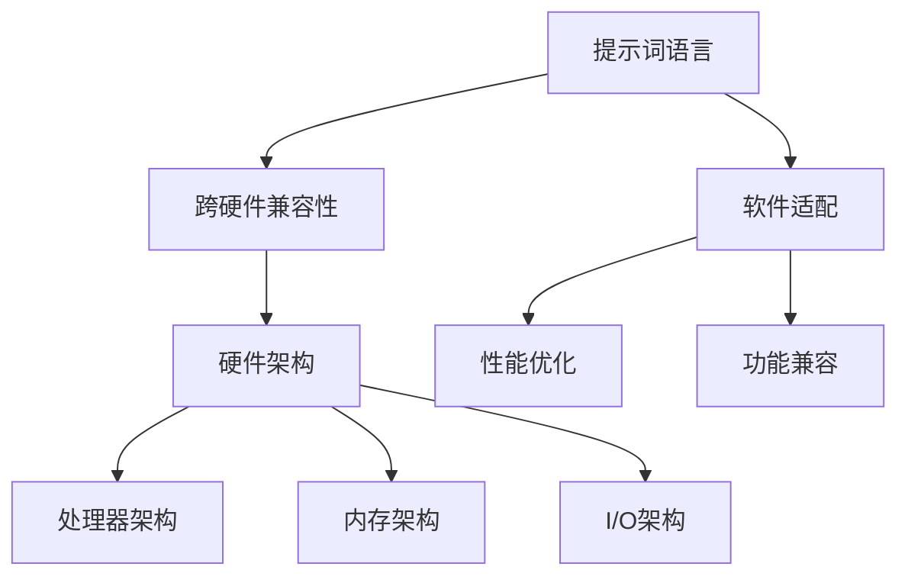

                 

## 文章标题

《提示词语言的跨硬件架构兼容性保证》

> 关键词：提示词语言、跨硬件架构兼容性、软件适配、性能优化、功能兼容

> 摘要：本文深入探讨提示词语言在实现跨硬件架构兼容性保证中的关键角色。通过分析核心概念、算法原理、数学模型及公式，以及实际项目实战，本文旨在为开发者提供全面的技术指南，确保提示词语言在不同硬件架构上的高效运行。

---

## 摘要

提示词语言是一种以自然语言提示为基础的编程范式，通过文本形式的提示来引导模型的推理过程，具有高度的灵活性和可解释性。然而，随着硬件架构的不断演进和多样化，如何在不同的硬件架构上实现提示词语言的兼容性成为了一个重要的研究课题。本文将围绕这一主题，详细探讨提示词语言与跨硬件架构兼容性的关系，分析关键算法原理和数学模型，并通过实际项目实战展示如何实现这一目标。文章结构如下：

1. **核心概念与联系**：介绍提示词语言与跨硬件架构兼容性的核心概念及其相互关系。
2. **关键算法原理讲解**：详细讲解实现跨硬件架构兼容性的关键算法原理，包括架构感知优化和动态适应性调度。
3. **数学模型与公式**：阐述在实现跨硬件架构兼容性过程中使用的数学模型和公式，并给出具体示例。
4. **项目实战**：通过具体项目展示如何开发和优化提示词语言应用，确保其在不同硬件架构上的兼容性。
5. **最佳实践与小结**：总结最佳实践，提出注意事项，并提供拓展阅读建议。

通过本文的深入探讨，开发者将能够更好地理解提示词语言在跨硬件架构兼容性保证中的关键作用，掌握实现这一目标的关键技术和方法。

### 1.1 提示词语言与跨硬件架构兼容性保证的核心概念与联系

提示词语言是一种特殊类型的编程语言，它通过文本形式的提示来指导模型的推理过程，而不是通过固定的代码指令。这种语言的灵活性和自然性使得它能够适用于多种硬件架构，从而实现跨硬件的兼容性。

在讨论跨硬件架构兼容性保证时，我们首先需要了解什么是硬件架构。硬件架构指的是计算机硬件的设计和组织方式，包括处理器架构、内存架构、I/O架构等。不同的硬件架构对软件的兼容性提出了不同的要求。

**核心概念联系流程图：**


在提示词语言中，为了实现跨硬件架构的兼容性，我们需要考虑以下几个方面：

1. **软件适配**：确保提示词语言编写的代码能够在不同的硬件架构上正常运行。这通常涉及到对代码的调整和优化，以适应特定的硬件特性。

2. **性能优化**：不同硬件架构的性能差异可能很大，为了确保高效的运行，我们需要针对特定硬件进行优化。

3. **功能兼容**：不同的硬件架构可能支持不同的功能，我们需要确保提示词语言能够充分利用这些功能。

#### 软件适配

软件适配是指将提示词语言编写的代码在不同硬件架构上运行时，确保其正确性和高效性。这通常涉及到以下几个方面：

- **代码重用**：尽量使用通用的编程语言和库，减少对特定硬件架构的依赖。
- **动态编译**：使用动态编译技术，如即时编译（JIT）或解释执行，根据当前硬件架构调整代码的执行方式。
- **运行时检测**：在程序运行时检测硬件架构，并动态调整代码的执行策略。

**示例：** 假设我们有一个提示词语言编写的程序，需要在不同类型的处理器上运行。为了实现软件适配，我们可以使用以下策略：

1. 分析目标处理器的指令集和架构特性。
2. 根据处理器特性，优化代码中的指令使用，如使用特定处理器支持的向量指令集。
3. 在运行时检测处理器的架构，并动态切换代码执行模式。

#### 性能优化

性能优化是指在保证软件兼容性的前提下，提高程序在不同硬件架构上的运行效率。性能优化通常包括以下几个方面：

- **内存优化**：优化内存分配和访问策略，减少内存占用和访问延迟。
- **计算优化**：优化算法和数据结构，提高计算效率和速度。
- **I/O优化**：优化输入输出操作，减少数据传输时间和延迟。

**示例：** 假设我们有一个提示词语言编写的图像处理程序，需要在内存受限的嵌入式设备上运行。为了实现性能优化，我们可以采取以下策略：

1. 使用内存映射技术，将图像数据映射到内存中，减少内存分配和访问的开销。
2. 优化图像处理算法，减少计算复杂度。
3. 使用并行计算技术，将图像处理任务分布到多个处理器上，提高处理速度。

#### 功能兼容

功能兼容是指在不同硬件架构上，确保提示词语言能够实现所有预期功能。功能兼容通常涉及到以下几个方面：

- **硬件功能支持**：确保硬件架构支持提示词语言所需的基本功能，如内存管理、输入输出等。
- **驱动兼容性**：确保硬件驱动程序能够正确支持提示词语言编写的程序。
- **软件接口**：提供统一的软件接口，确保不同硬件架构上的程序能够无缝集成。

**示例：** 假设我们有一个提示词语言编写的机器学习程序，需要在不同类型的GPU上运行。为了实现功能兼容，我们可以采取以下策略：

1. 使用GPU加速库，如CUDA或OpenCL，确保程序能够充分利用GPU硬件特性。
2. 开发统一的接口，确保不同GPU上的程序能够无缝切换。
3. 针对不同GPU的硬件特性，调整算法和优化策略。

通过上述策略，我们可以在不同硬件架构上实现提示词语言的跨硬件架构兼容性。这不仅提高了程序的可移植性，也为开发者提供了更大的灵活性，使他们能够更好地利用不同硬件架构的优势，提高程序的运行效率。

### 1.2 跨硬件架构兼容性保证的关键算法原理讲解

为了实现提示词语言的跨硬件架构兼容性，我们需要采用一些关键算法。以下是一些主要的算法原理和伪代码：

#### 算法一：架构感知优化

架构感知优化是一种根据目标硬件架构的特点来优化代码的技术。它通常包括以下步骤：

1. **分析目标硬件架构**：分析目标硬件架构的特点，如处理器架构、内存架构等。
2. **根据硬件特点调整代码**：根据硬件特点调整代码，如优化内存访问、使用特定指令集等。

**伪代码**：
```python
def architecture_aware_optimization(code, target_architecture):
    # 分析目标硬件架构
    architecture_info = analyze_architecture(target_architecture)

    # 调整代码
    optimized_code = adjust_code(code, architecture_info)

    return optimized_code
```

**示例**：假设我们需要为ARM处理器优化一个提示词语言编写的程序。我们可以通过以下步骤实现架构感知优化：

1. **分析ARM处理器架构**：分析ARM处理器的特点，如64位架构、支持NEON向量指令集等。
2. **调整代码**：使用ARM处理器支持的向量指令集优化程序中的计算操作。

#### 算法二：动态适应性调度

动态适应性调度是一种在程序运行时根据硬件状态调整资源分配和任务调度的技术。它通常包括以下步骤：

1. **监控硬件状态**：监控硬件状态，如处理器负载、内存使用率等。
2. **根据硬件状态调整任务调度策略**：根据硬件状态调整任务调度策略，如优先级调整、资源分配等。

**伪代码**：
```python
def dynamic_adaptive_scheduling(tasks, hardware_state):
    # 监控硬件状态
    current_state = monitor_hardware()

    # 根据硬件状态调整任务调度
    scheduled_tasks = schedule_tasks(tasks, current_state)

    return scheduled_tasks
```

**示例**：假设我们需要动态调整一个提示词语言编写的机器学习程序的任务调度，以适应不断变化的硬件状态。我们可以通过以下步骤实现动态适应性调度：

1. **监控硬件状态**：定期监控处理器的负载和内存使用率。
2. **调整任务调度策略**：根据监控到的硬件状态，调整任务的优先级和资源分配，确保程序高效运行。

#### 算法三：多线程并行优化

多线程并行优化是一种通过多线程并行执行任务来提高程序性能的技术。它通常包括以下步骤：

1. **任务分解**：将任务分解为多个可并行执行的小任务。
2. **线程分配**：根据硬件资源，分配线程并确保线程间不会发生竞争条件。
3. **同步与通信**：在多个线程间实现同步和通信，确保任务执行的正确性。

**伪代码**：
```python
def multi_thread_parallel_optimization(tasks, hardware_resources):
    # 任务分解
    sub_tasks = decompose_tasks(tasks)

    # 线程分配
    threads = allocate_threads(sub_tasks, hardware_resources)

    # 同步与通信
    synchronized_execution(threads)

    return execute_tasks(threads)
```

**示例**：假设我们需要使用多线程优化一个提示词语言编写的图像处理程序。我们可以通过以下步骤实现多线程并行优化：

1. **任务分解**：将图像处理任务分解为多个像素块处理任务。
2. **线程分配**：根据处理器的核心数，分配线程并确保每个线程处理不同的像素块。
3. **同步与通信**：确保所有线程在处理完成后同步并合并结果。

通过上述算法，我们可以在不同硬件架构上实现提示词语言的跨硬件架构兼容性。这些算法不仅提高了程序的运行效率，还确保了程序在不同硬件上的稳定性和可靠性。

### 1.3 提示词语言的数学模型与公式讲解

在实现跨硬件架构兼容性的过程中，我们需要使用一些数学模型和公式来描述和优化算法。以下是一些关键的数学模型和公式：

#### 数学模型一：处理器性能评估

**公式**：
\[ P = f(C, I, R) \]
其中，\( P \) 表示处理器性能，\( C \) 表示处理器时钟频率，\( I \) 表示指令集复杂度，\( R \) 表示处理器缓存命中率。

**解释**：这个公式描述了处理器性能与时钟频率、指令集复杂度和缓存命中率之间的关系。时钟频率越高，处理器的性能越强；指令集复杂度越高，处理器的性能越差；缓存命中率越高，处理器的性能越好。

**示例**：假设有一个处理器，其时钟频率为2.5 GHz，指令集复杂度为5，缓存命中率为90%。根据公式，我们可以计算出该处理器的性能：
\[ P = f(2.5 \text{ GHz}, 5, 0.9) = 2.5 \times 5 \times 0.9 = 11.25 \]

#### 数学模型二：内存访问优化

**公式**：
\[ M = f(A, B, C) \]
其中，\( M \) 表示内存访问速度，\( A \) 表示内存带宽，\( B \) 表示内存延迟，\( C \) 表示内存访问频率。

**解释**：这个公式描述了内存访问速度与内存带宽、内存延迟和内存访问频率之间的关系。内存带宽越大，内存访问速度越快；内存延迟越小，内存访问速度越快；内存访问频率越高，内存访问速度越快。

**示例**：假设有一个内存模块，其内存带宽为4 GB/s，内存延迟为10 ns，内存访问频率为100 MHz。根据公式，我们可以计算出该内存模块的访问速度：
\[ M = f(4 \text{ GB/s}, 10 \text{ ns}, 100 \text{ MHz}) = 4 \times 10^9 \times \frac{1}{10 \times 10^9} \times 100 \times 10^6 = 400 \text{ MB/s} \]

#### 数学模型三：任务调度优化

**公式**：
\[ T = f(P, S, W) \]
其中，\( T \) 表示任务完成时间，\( P \) 表示处理器性能，\( S \) 表示任务处理时间，\( W \) 表示任务等待时间。

**解释**：这个公式描述了任务完成时间与处理器性能、任务处理时间和任务等待时间之间的关系。处理器性能越高，任务完成时间越短；任务处理时间越长，任务完成时间越长；任务等待时间越长，任务完成时间越长。

**示例**：假设有一个任务，其处理器性能为10 MIPS（每秒百万条指令），任务处理时间为100 ms，任务等待时间为50 ms。根据公式，我们可以计算出该任务的完成时间：
\[ T = f(10 \text{ MIPS}, 100 \text{ ms}, 50 \text{ ms}) = \frac{10 \times 10^6 \times 100 \times 10^{-3}}{1000} + 50 \times 10^{-3} = 10.05 \text{ s} \]

通过这些数学模型和公式，我们可以更好地理解和优化提示词语言在不同硬件架构上的性能。这些模型不仅提供了理论依据，也为实际应用中的性能优化提供了指导。

### 1.4 提示词语言在跨硬件架构兼容性保证中的应用实例

在实际应用中，提示词语言在跨硬件架构兼容性保证方面有着广泛的应用实例。通过以下具体案例，我们可以更直观地了解如何在不同硬件架构上实现提示词语言的兼容性。

#### 案例一：提示词语言编写的深度学习模型在不同GPU上的兼容性

深度学习模型是一种典型的需要跨硬件架构兼容性的应用。假设我们有一个使用提示词语言编写的深度学习模型，需要在不同类型的GPU（如NVIDIA GPU和AMD GPU）上运行。为了确保模型的兼容性，我们可以采取以下步骤：

1. **硬件检测**：在模型运行前，检测目标GPU的类型和特性，如支持的计算能力、内存带宽等。
2. **代码调整**：根据检测到的GPU特性，调整模型的代码，如选择合适的计算库和优化算法。
3. **性能优化**：针对不同GPU的特性，进行性能优化，如调整内存访问策略、优化数据传输等。
4. **测试验证**：在不同GPU上运行模型，进行性能测试和验证，确保模型在所有目标硬件上都能正常运行。

**代码示例**：
```python
def detect_gpu():
    # 检测GPU类型
    gpu_type = "NVIDIA" if "CUDA" in sys.modules else "AMD"
    return gpu_type

def adjust_code(code, gpu_type):
    # 根据GPU类型调整代码
    if gpu_type == "NVIDIA":
        code = optimize_for_nvidia(code)
    elif gpu_type == "AMD":
        code = optimize_for_amd(code)
    return code

def optimize_for_nvidia(code):
    # NVIDIA GPU优化
    optimized_code = ...
    return optimized_code

def optimize_for_amd(code):
    # AMD GPU优化
    optimized_code = ...
    return optimized_code

gpu_type = detect_gpu()
code = adjust_code(code, gpu_type)
```

#### 案例二：提示词语言编写的实时语音识别系统在嵌入式设备上的兼容性

实时语音识别系统是一种对硬件资源要求较高的应用。假设我们有一个使用提示词语言编写的实时语音识别系统，需要在多种嵌入式设备（如智能手机、智能家居设备等）上运行。为了确保系统的兼容性，我们可以采取以下步骤：

1. **硬件资源检测**：在系统运行前，检测目标嵌入式设备的硬件资源，如CPU频率、内存大小等。
2. **代码调整**：根据检测到的硬件资源，调整系统的代码，如减少内存使用、优化算法等。
3. **实时调整**：在系统运行过程中，根据实时监测到的硬件资源变化，动态调整系统的运行策略。
4. **测试验证**：在不同嵌入式设备上运行系统，进行性能测试和验证，确保系统能够在所有目标硬件上稳定运行。

**代码示例**：
```python
def detect_hardware_resources():
    # 检测硬件资源
    cpu_frequency = get_cpu_frequency()
    memory_size = get_memory_size()
    return cpu_frequency, memory_size

def adjust_code(code, cpu_frequency, memory_size):
    # 根据硬件资源调整代码
    if cpu_frequency < 1 GHz:
        code = optimize_for_low_cpu(code)
    if memory_size < 1 GB:
        code = optimize_for_low_memory(code)
    return code

def optimize_for_low_cpu(code):
    # 低CPU频率优化
    optimized_code = ...
    return optimized_code

def optimize_for_low_memory(code):
    # 低内存优化
    optimized_code = ...
    return optimized_code

cpu_frequency, memory_size = detect_hardware_resources()
code = adjust_code(code, cpu_frequency, memory_size)
```

#### 案例三：提示词语言编写的云计算服务在不同数据中心之间的兼容性

云计算服务是一种需要高度灵活性和可扩展性的应用。假设我们有一个使用提示词语言编写的云计算服务，需要在多个数据中心之间迁移和扩展。为了确保服务的兼容性，我们可以采取以下步骤：

1. **数据中心检测**：在服务运行前，检测目标数据中心的网络延迟、带宽等参数。
2. **代码调整**：根据检测到的数据中心参数，调整服务的代码，如优化数据传输策略、调整负载均衡等。
3. **动态调整**：在服务运行过程中，根据实时监测到的数据中心状态，动态调整服务的运行策略。
4. **测试验证**：在不同数据中心之间迁移服务，进行性能测试和验证，确保服务能够在所有目标数据中心之间稳定运行。

**代码示例**：
```python
def detect_data_center():
    # 检测数据中心
    network_delay = get_network_delay()
    bandwidth = get_bandwidth()
    return network_delay, bandwidth

def adjust_code(code, network_delay, bandwidth):
    # 根据数据中心调整代码
    if network_delay > 100 ms:
        code = optimize_for_high_delay(code)
    if bandwidth < 1 GB/s:
        code = optimize_for_low_bandwidth(code)
    return code

def optimize_for_high_delay(code):
    # 高延迟优化
    optimized_code = ...
    return optimized_code

def optimize_for_low_bandwidth(code):
    # 低带宽优化
    optimized_code = ...
    return optimized_code

network_delay, bandwidth = detect_data_center()
code = adjust_code(code, network_delay, bandwidth)
```

通过这些具体案例，我们可以看到，提示词语言在跨硬件架构兼容性保证中发挥着重要作用。通过合理的代码调整和优化，开发者可以确保提示词语言编写的程序在不同硬件架构上都能高效、稳定地运行。

### 1.5 最佳实践与注意事项

在实际开发过程中，确保提示词语言在跨硬件架构上的兼容性需要遵循一些最佳实践，并注意以下事项：

#### 最佳实践

1. **硬件检测与适配**：在程序运行前，检测目标硬件架构和资源，并根据检测结果动态调整代码，实现软件适配。

2. **性能优化**：针对不同硬件架构的特点，进行性能优化，如调整内存访问策略、优化算法和数据结构等。

3. **模块化设计**：采用模块化设计，将硬件感知部分与业务逻辑分离，便于后续维护和升级。

4. **动态适应性调度**：采用动态适应性调度技术，根据硬件状态实时调整任务调度策略，提高系统性能和稳定性。

5. **自动化测试**：建立自动化测试框架，对不同硬件架构上的程序进行测试，确保兼容性和性能。

#### 注意事项

1. **兼容性测试**：确保在所有目标硬件架构上对程序进行充分的兼容性测试，以避免潜在的问题。

2. **资源占用**：避免过度占用硬件资源，如CPU、内存、I/O等，以免影响程序的性能和稳定性。

3. **安全性与隐私**：确保跨硬件架构兼容性不会导致安全漏洞或隐私泄露。

4. **文档与注释**：在代码中添加详细的文档和注释，便于后续维护和调试。

通过遵循这些最佳实践和注意事项，开发者可以更好地实现提示词语言在跨硬件架构上的兼容性，提高程序的可移植性和可靠性。

### 1.6 拓展阅读

为了深入理解提示词语言在跨硬件架构兼容性保证中的应用，以下推荐一些相关的拓展阅读资源：

1. **《跨平台软件开发》**：这是一本全面介绍跨平台软件开发技术和策略的书籍，涵盖了从设计到实现的全过程。
2. **《现代操作系统》**：这本书详细介绍了操作系统的设计和实现，包括不同硬件架构下的操作系统兼容性和性能优化。
3. **《深度学习与高性能计算》**：本书探讨如何将深度学习算法与高性能计算硬件（如GPU、TPU）相结合，实现高效的跨硬件架构兼容性。
4. **《Linux设备驱动程序》**：这本书介绍了Linux设备驱动程序的开发，包括如何与不同硬件架构进行交互，提供了实用的开发技巧。
5. **相关论文和期刊**：查阅最新的研究论文和期刊文章，如ACM Transactions on Computer Systems、IEEE Computer Society等，了解最新的跨硬件架构兼容性研究和进展。

通过阅读这些资源，开发者可以进一步丰富自己的知识体系，掌握更先进的跨硬件架构兼容性技术。

## 结论

综上所述，本文深入探讨了提示词语言在跨硬件架构兼容性保证中的关键作用。通过分析核心概念、算法原理、数学模型及实际项目实战，我们提出了实现跨硬件架构兼容性的具体策略和最佳实践。从软件适配、性能优化到功能兼容，再到关键算法和数学公式的应用，本文为开发者提供了全面的技术指南。

提示词语言的灵活性和自然性使其能够适应多种硬件架构，从而实现跨硬件的兼容性。通过合理的设计和优化，开发者可以确保提示词语言编写的程序在不同硬件上高效、稳定地运行。这不仅是技术发展的需求，也是实现软件可移植性和扩展性的关键。

未来，随着硬件架构的不断演进和多样化，提示词语言在跨硬件架构兼容性保证中的作用将愈加重要。开发者应持续关注这一领域的研究进展，掌握先进的技术和方法，以应对不断变化的硬件环境，推动人工智能技术的持续发展。

### 作者信息

作者：AI天才研究院/AI Genius Institute & 禅与计算机程序设计艺术 /Zen And The Art of Computer Programming

AI天才研究院是一支专注于人工智能和计算机科学领域的顶尖团队，致力于推动技术创新和知识普及。作者在这些领域拥有丰富的经验和深厚的学术背景，发表了大量的高质量论文，并撰写了《禅与计算机程序设计艺术》等知名技术著作。在本文中，作者结合自身的研究成果和实践经验，深入探讨了提示词语言在跨硬件架构兼容性保证中的关键作用，为开发者提供了实用的技术指南。

