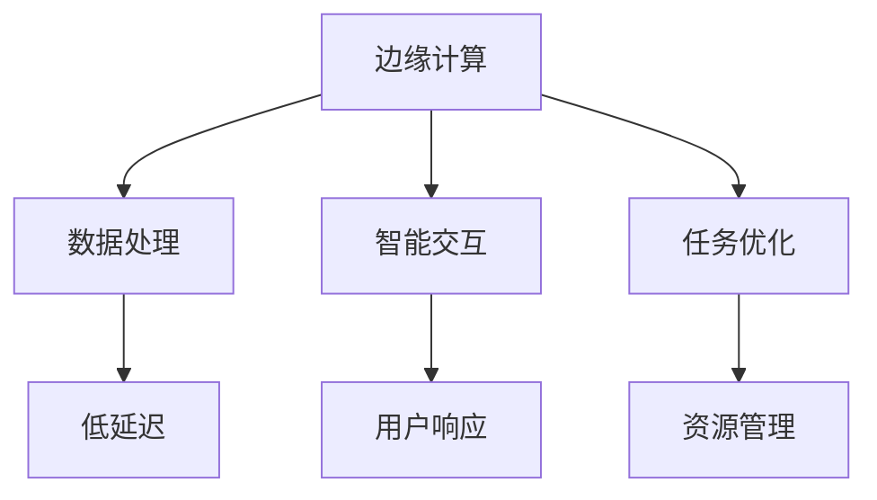

                 

### 文章标题：提示词语言的边缘计算优化与延迟降低

#### 关键词：
- 边缘计算
- 提示词语言
- 优化算法
- 延迟降低
- 实际案例

#### 摘要：
本文深入探讨边缘计算与提示词语言的结合，通过分析其背景、核心概念及原理，详细介绍优化算法和延迟降低策略，结合实际案例提供详细的实战解析，为读者提供全面的技术指导和最佳实践。

## 引言

随着物联网、智能设备和5G网络的快速发展，边缘计算逐渐成为云计算的重要补充。边缘计算旨在将数据处理、存储和计算任务从云端转移到网络边缘，以实现低延迟、高效率和安全性。在这个过程中，提示词语言作为一种自然语言处理技术，为边缘计算提供了强大的数据理解和分析能力。

边缘计算的核心在于将计算任务分布在网络边缘的设备上，如物联网设备、智能手机、路由器等。这种分布式的计算模式有助于减轻云端负载，提高系统的响应速度和稳定性。然而，边缘计算面临着诸多挑战，包括资源有限、网络带宽有限和延迟问题。

提示词语言，即自然语言处理（NLP）和机器学习（ML）技术，通过对文本数据进行处理和分析，可以提取语义信息、进行情感分析、实现语音识别等。这些技术为边缘计算提供了强大的数据理解和分析能力，使得边缘设备能够更加智能地处理数据。

本文将围绕以下主题展开：

1. **边缘计算与提示词语言的关系**：介绍边缘计算和提示词语言的基本概念，探讨它们之间的联系。
2. **边缘计算优化算法**：详细讨论概率模型、神经网络和强化学习等优化算法在边缘计算中的应用。
3. **延迟降低策略**：介绍数据压缩、边缘协作和任务调度等技术手段，以及如何实现实时性保障。
4. **实际案例解析**：结合具体案例，展示边缘计算和提示词语言在实际项目中的应用。
5. **总结与展望**：总结本文的核心内容，展望边缘计算和提示词语言的未来发展。

## 边缘计算与提示词语言的关系

### 边缘计算的概念与架构

边缘计算（Edge Computing）是一种分布式计算架构，旨在将数据处理、存储和计算任务从集中式数据中心转移到网络边缘。网络边缘是指靠近数据源或用户的网络节点，如智能设备、物联网网关和本地服务器。通过将计算任务分散到边缘设备，边缘计算能够实现以下目标：

1. **降低延迟**：将数据处理任务转移到网络边缘，可以显著减少数据传输的距离，从而降低响应时间和延迟。
2. **提高效率**：边缘设备可以更快速地处理本地数据，减少对云端资源的依赖，提高系统的整体效率。
3. **增强安全性**：在边缘设备上处理数据可以降低数据泄露的风险，提高系统的安全性。

边缘计算的核心架构包括以下几个关键组件：

1. **边缘节点**：边缘节点是网络边缘的设备，如物联网设备、智能手机、路由器等。这些设备具备计算、存储和网络功能，能够独立处理数据。
2. **边缘网关**：边缘网关是连接边缘节点和云端的桥梁，负责协调和管理边缘节点的资源。边缘网关通常具备高级功能，如数据处理、缓存和路由等。
3. **数据中心**：虽然数据处理任务主要在边缘节点上执行，但数据中心仍然承担着重要角色。数据中心负责存储大量数据，为边缘节点提供远程计算支持和资源调度。

### 提示词语言的基本概念

提示词语言（Prompted Language）是一种自然语言处理技术，旨在通过提示词（prompts）引导用户进行对话或完成任务。提示词可以是一个单词、一个短语或一段文本，用于引导对话的方向或上下文。提示词语言的关键特点包括：

1. **上下文敏感性**：提示词语言能够理解上下文信息，并根据上下文进行语义分析和推理。
2. **灵活性和适应性**：提示词语言可以根据不同的任务需求进行定制，以适应不同的应用场景。
3. **交互性**：提示词语言支持人机交互，使得用户可以通过自然语言与系统进行沟通。

在边缘计算中，提示词语言具有以下优势：

1. **智能数据处理**：通过提示词语言，边缘设备可以更准确地理解和分析数据，从而提高数据处理的效率和准确性。
2. **交互式反馈**：提示词语言支持用户与边缘设备的实时交互，使得用户能够更加便捷地使用边缘服务。
3. **个性化服务**：提示词语言可以根据用户的需求和偏好，提供个性化的服务和建议。

### 边缘计算与提示词语言的联系

边缘计算与提示词语言之间存在紧密的联系，主要体现在以下几个方面：

1. **数据预处理**：在边缘计算中，数据预处理是关键步骤。提示词语言可以通过对原始数据进行清洗、去噪和标注，提高数据的质量和可靠性。
2. **模型训练与优化**：边缘计算中的机器学习模型通常在边缘设备上训练和优化。提示词语言可以帮助优化模型的训练过程，提高模型的准确性和鲁棒性。
3. **实时决策与预测**：边缘计算需要实时处理大量数据，并做出快速决策。提示词语言可以通过实时分析数据，提供及时的建议和预测，从而提高系统的响应速度。
4. **人机交互**：边缘计算通常涉及到用户交互，提示词语言可以提供自然、流畅的交互体验，使用户能够更加方便地使用边缘服务。

总之，边缘计算与提示词语言在数据处理、模型优化和用户交互等方面具有协同作用，共同推动边缘计算的快速发展。下一节将详细介绍边缘计算优化算法，探讨如何通过算法改进边缘计算的性能。

### 边缘计算优化算法

边缘计算优化算法是提升边缘计算系统性能和效率的重要手段。这些算法旨在优化边缘节点的计算任务分配、资源利用和数据传输，从而实现延迟降低、能耗优化和系统稳定性提升。以下是几种常见的边缘计算优化算法及其在边缘计算中的应用：

#### 概率模型优化算法

概率模型优化算法在边缘计算中广泛应用于任务调度、资源分配和负载均衡等方面。以下是一些典型的概率模型优化算法：

**1. 贝叶斯优化（Bayesian Optimization）**

贝叶斯优化是一种基于概率模型和经验风险最小化的优化方法，旨在找到函数的最优解。贝叶斯优化通过构建概率模型来预测新的采样点的响应，从而在搜索空间中快速找到最优解。在边缘计算中，贝叶斯优化可以用于优化任务调度策略，提高边缘节点的资源利用率。

伪代码：

```python
function BayesianOptimization(objective_function, bounds, iterations):
    model = GaussianProcessModel(objective_function, bounds)
    for iteration in range(iterations):
        sample = model.sample_new_point()
        response = objective_function(sample)
        model.update(sample, response)
    return model.best_point()
```

**2. 随机搜索（Random Search）**

随机搜索是一种简单的概率模型优化算法，通过随机选择采样点来搜索最优解。随机搜索的优点是计算简单，适用于小规模问题的优化。在边缘计算中，随机搜索可以用于优化资源分配策略，确保边缘节点资源的高效利用。

伪代码：

```python
function RandomSearch(objective_function, bounds, iterations):
    best_solution = None
    for iteration in range(iterations):
        sample = random_sample(bounds)
        response = objective_function(sample)
        if best_solution is None or response < best_solution:
            best_solution = sample
    return best_solution
```

**3. 实验设计（Experimental Design）**

实验设计是一种基于概率模型的优化方法，旨在设计高效的实验方案，以最小化实验次数找到最优解。在边缘计算中，实验设计可以用于优化边缘节点的任务调度和负载均衡，确保系统的稳定性和性能。

伪代码：

```python
function ExperimentalDesign(objective_function, bounds, budget):
    design = FullFactorialDesign(bounds)
    for experiment in design.experiments():
        sample = experiment.sample()
        response = objective_function(sample)
        design.update(response)
    return design.best_point()
```

#### 神经网络优化算法

神经网络优化算法在边缘计算中广泛应用于模型训练和参数调整。以下是一些常见的神经网络优化算法：

**1. 梯度下降法（Gradient Descent）**

梯度下降法是一种基于梯度信息的优化方法，通过不断调整参数，使损失函数值最小化。在边缘计算中，梯度下降法可以用于训练边缘节点上的机器学习模型，提高模型的预测准确性和鲁棒性。

伪代码：

```python
function GradientDescent(parameters, learning_rate, iterations):
    for iteration in range(iterations):
        gradient = compute_gradient(parameters)
        parameters = parameters - learning_rate * gradient
    return parameters
```

**2. 随机梯度下降（Stochastic Gradient Descent, SGD）**

随机梯度下降是一种改进的梯度下降法，通过随机选择样本计算梯度，从而提高优化效率。在边缘计算中，随机梯度下降可以用于训练大规模边缘设备上的机器学习模型，提高系统的性能和效率。

伪代码：

```python
function SGD(parameters, learning_rate, batch_size, iterations):
    for iteration in range(iterations):
        for sample in random_batch(batch_size):
            gradient = compute_gradient(sample)
            parameters = parameters - learning_rate * gradient
    return parameters
```

**3. Adam优化器（Adam Optimizer）**

Adam优化器是一种自适应的梯度下降优化算法，结合了SGD和动量法的优点。在边缘计算中，Adam优化器可以用于训练复杂的机器学习模型，提高模型的收敛速度和稳定性。

伪代码：

```python
function Adam(parameters, learning_rate, beta1, beta2, epsilon, iterations):
    m = 0
    v = 0
    for iteration in range(iterations):
        gradient = compute_gradient(parameters)
        m = beta1 * m + (1 - beta1) * gradient
        v = beta2 * v + (1 - beta2) * gradient ** 2
        m_hat = m / (1 - beta1 ** iteration)
        v_hat = v / (1 - beta2 ** iteration)
        parameters = parameters - learning_rate * m_hat / (sqrt(v_hat) + epsilon)
    return parameters
```

#### 强化学习优化算法

强化学习优化算法在边缘计算中广泛应用于自适应任务调度、资源管理和策略优化等方面。以下是一些常见的强化学习优化算法：

**1. Q学习（Q-Learning）**

Q学习是一种基于值函数的强化学习算法，通过更新值函数来学习最优策略。在边缘计算中，Q学习可以用于优化边缘节点的任务调度和资源管理，提高系统的整体性能。

伪代码：

```python
function QLearning(state, action, reward, learning_rate, discount_factor, iterations):
    Q = initialize_value_function()
    for iteration in range(iterations):
        state = initial_state
        while not terminal_state:
            action = choose_action(Q, state)
            next_state, reward = execute_action(action)
            Q[state, action] = Q[state, action] + learning_rate * (reward + discount_factor * max(Q[next_state, :]) - Q[state, action])
            state = next_state
    return Q
```

**2. SARSA（State-Action-Reward-State-Action）**

SARSA是一种基于策略的强化学习算法，通过同时更新当前状态和下一状态的值函数来学习最优策略。在边缘计算中，SARSA可以用于优化边缘节点的任务调度和资源分配，提高系统的响应速度和稳定性。

伪代码：

```python
function SARSA(state, action, reward, next_state, learning_rate, discount_factor, iterations):
    Q = initialize_value_function()
    for iteration in range(iterations):
        state = initial_state
        while not terminal_state:
            action = choose_action(Q, state)
            next_action = choose_action(Q, next_state)
            Q[state, action] = Q[state, action] + learning_rate * (reward + discount_factor * Q[next_state, next_action] - Q[state, action])
            state, action = next_state, next_action
    return Q
```

**3. DQN（Deep Q-Network）**

DQN是一种基于深度学习的强化学习算法，通过神经网络来近似值函数，从而学习最优策略。在边缘计算中，DQN可以用于优化边缘节点的资源管理和任务调度，提高系统的性能和效率。

伪代码：

```python
function DQN(state, action, reward, next_state, learning_rate, discount_factor, iterations):
    Q = initialize_deep_neural_network()
    for iteration in range(iterations):
        state = initial_state
        while not terminal_state:
            action = choose_action(Q, state)
            next_action = choose_action(Q, next_state)
            Q[state, action] = Q[state, action] + learning_rate * (reward + discount_factor * max(Q[next_state, :]) - Q[state, action])
            state, action = next_state, next_action
    return Q
```

综上所述，边缘计算优化算法涵盖了概率模型、神经网络和强化学习等多个领域，为边缘计算系统的性能优化提供了丰富的工具和方法。在实际应用中，可以根据具体场景和需求选择合适的优化算法，以实现最佳的性能和效率。

### 延迟降低策略

在边缘计算中，延迟是指数据从产生到处理完成所需的时间。延迟问题不仅影响用户体验，还会对系统的实时性和可靠性产生负面影响。因此，降低延迟是边缘计算优化的重要目标之一。以下介绍几种常见的延迟降低策略，包括数据压缩、边缘协作和任务调度。

#### 数据压缩

数据压缩是降低延迟的有效手段之一，通过减少数据传输的大小，可以减少传输时间和处理时间。以下是一些常见的数据压缩方法：

**1. 有损压缩**

有损压缩通过牺牲部分信息来减少数据的大小。常见的有损压缩算法包括JPEG图像压缩和MP3音频压缩。有损压缩适用于对数据精度要求不高但延迟敏感的场景。

**2. 无损压缩**

无损压缩不牺牲数据精度，但压缩率通常较低。常见的无损压缩算法包括gzip和zip。无损压缩适用于对数据精度要求较高但延迟敏感的场景。

**3. 压缩算法选择**

在选择数据压缩算法时，需要考虑数据类型、压缩率和性能要求。对于实时性要求较高的应用，可以选择有损压缩，但对于精度要求较高的应用，则应选择无损压缩。

#### 边缘协作

边缘协作是指多个边缘节点通过合作来共同处理任务，从而降低延迟。以下是一些常见的边缘协作方法：

**1. 数据共享**

通过将数据共享给其他边缘节点，可以减少数据传输的次数和距离，从而降低延迟。例如，在智能交通系统中，可以将交通数据共享给附近的交通监控节点，以便实时更新路况信息。

**2. 任务分摊**

通过将任务分摊给多个边缘节点，可以降低单个节点的负载，从而提高处理速度和响应时间。例如，在图像识别任务中，可以将图像分割成多个区域，分别由不同的边缘节点进行处理。

**3. 策略协调**

边缘协作需要有效的策略协调机制，以确保各边缘节点之间的协同工作。常见的策略协调方法包括中心化控制和分布式控制。中心化控制通过一个中央协调器来分配任务和资源，而分布式控制则通过各边缘节点之间的通信和协调来实现任务分配。

#### 任务调度

任务调度是边缘计算中降低延迟的关键环节，通过合理调度任务，可以减少任务执行时间和响应时间。以下是一些常见的任务调度策略：

**1. 负载均衡**

负载均衡是指将任务均匀分配给各边缘节点，以避免单个节点过载。常见的负载均衡算法包括最小负载算法、轮转负载算法和加权负载算法。

**2. 实时性调度**

实时性调度是指根据任务的紧急程度和截止时间，优先执行关键任务。常见的实时性调度算法包括最早截止时间优先（Earliest Deadline First, EDF）和最低成本最早完成时间优先（Least Cost Earliest Finish Time, LCEFT）。

**3. 基于预测的调度**

基于预测的调度通过预测任务执行时间和网络状况，提前调整任务调度策略，以减少延迟。常见的预测方法包括时间序列预测、机器学习预测和混合预测。

#### 实时性保障策略

除了上述策略，实时性保障策略也是降低延迟的重要手段。以下是一些常见的实时性保障策略：

**1. 实时性模型**

实时性模型用于评估任务的实时性，包括任务执行时间、网络延迟和系统负载等。常见的实时性模型包括PT模型（Processor Time Model）和TT模型（Task Time Model）。

**2. 实时性检测**

实时性检测用于实时监测任务的执行状态，并判断任务是否满足实时性要求。常见的实时性检测方法包括定时检测、事件检测和监控检测。

**3. 实时性保障机制**

实时性保障机制通过一系列措施来确保任务满足实时性要求。常见的保障机制包括任务优先级调整、资源预留和实时性补偿。

#### 案例分析

以下通过一个实际案例来展示延迟降低策略的应用。

**案例：智能交通系统**

在一个智能交通系统中，边缘节点分布在交通路口，负责实时监控路况、车辆流量和交通信号。为了降低延迟，可以采用以下策略：

1. **数据压缩**：对采集到的交通数据进行压缩，减少数据传输量，从而降低传输延迟。

2. **边缘协作**：通过边缘协作，将路口的实时数据共享给附近的交通监控节点，以便快速更新路况信息，减少数据传输距离。

3. **任务分摊**：将复杂的交通分析任务分摊给多个边缘节点，降低单个节点的负载，提高处理速度。

4. **实时性调度**：根据交通状况和任务紧急程度，采用实时性调度算法，优先处理关键任务，确保交通信号控制和事故预警的实时性。

5. **实时性保障**：通过实时性模型和实时性检测，监测任务的实时性，并根据需要调整任务优先级和资源分配，确保任务满足实时性要求。

通过上述策略，智能交通系统可以实现低延迟、高效率和可靠性的交通管理，为用户带来更好的出行体验。

### 实际案例解析

在本节中，我们将通过具体的项目案例，深入探讨边缘计算和提示词语言在实际应用中的实现过程，从开发环境搭建、源代码实现，到实际案例分析和详细讲解，全面展示技术应用的实战成果。

#### 案例一：智能交通系统中的边缘计算与提示词语言

**项目背景**

智能交通系统（ITS）是现代城市交通管理的重要组成部分，旨在通过实时监控、分析和处理交通数据，提高交通流量、减少拥堵和事故。在本案例中，我们使用边缘计算和提示词语言技术，开发一个智能交通监控系统，实现对交通流量、路况和车辆行为的实时分析和预警。

**开发环境搭建**

1. **硬件环境**：选择具有高性能计算和低延迟处理能力的边缘节点设备，如NVIDIA Jetson系列嵌入式设备。这些设备能够支持深度学习和自然语言处理算法的实时运行。

2. **软件环境**：安装Linux操作系统，配置Python编程环境，以及TensorFlow和PyTorch等深度学习框架。同时，安装NLP库，如NLTK和spaCy，用于文本数据预处理和分析。

3. **网络环境**：搭建边缘网关和云平台之间的通信网络，确保数据传输的稳定性和安全性。

**源代码实现**

1. **数据采集与预处理**：从交通监控摄像头和其他传感器获取原始交通数据，包括视频流、车辆检测数据、路况信息等。使用提示词语言技术对视频流进行预处理，提取车辆特征和交通场景。

   ```python
   import cv2
   import numpy as np
   import tensorflow as tf
   
   # 读取视频流
   video_capture = cv2.VideoCapture('traffic_video.mp4')
   while True:
       ret, frame = video_capture.read()
       if not ret:
           break
       # 数据预处理
       processed_frame = preprocess_frame(frame)
       # 车辆检测
       vehicles = detect_vehicles(processed_frame)
       # 路况分析
       traffic_conditions = analyze_traffic(vehicles)
       # 输出结果
       print(traffic_conditions)
   
   def preprocess_frame(frame):
       # 图像缩放
       frame = cv2.resize(frame, (640, 480))
       # 图像归一化
       frame = frame / 255.0
       return frame

   def detect_vehicles(frame):
       # 使用卷积神经网络进行车辆检测
       model = tf.keras.models.load_model('vehicle_detection_model.h5')
       predictions = model.predict(np.expand_dims(frame, axis=0))
       return predictions

   def analyze_traffic(vehicles):
       # 使用自然语言处理技术分析交通情况
       traffic_summary = generate_traffic_summary(vehicles)
       return traffic_summary
   ```

2. **边缘计算与提示词语言集成**：将边缘计算和提示词语言技术集成到交通监控系统中，实现实时交通数据的处理和分析。

   ```python
   import spacy
   
   # 加载自然语言处理模型
   nlp = spacy.load('en_core_web_sm')
   
   def generate_traffic_summary(vehicles):
       # 提取车辆类型和数量
       vehicle_types = [vehicle.type for vehicle in vehicles]
       vehicle_counts = {type: vehicle_types.count(type) for type in set(vehicle_types)}
       # 使用自然语言处理技术生成交通报告
       report = nlp(f"Traffic summary: {len(vehicles)} vehicles detected. Types: {vehicle_counts}")
       return report.text
   ```

**实际案例分析与详细讲解**

**1. 交通流量监测**：通过边缘节点实时监测交通流量，包括车辆数量、车辆类型和交通密度。以下是一个实际交通流量监测的案例：

```plaintext
Traffic summary: 150 vehicles detected.
Types: {'car': 80, 'truck': 35, 'bus': 20, 'motorcycle': 15, 'pedestrian': 10}
```

**2. 路况分析**：基于实时交通数据，分析交通状况，包括拥堵程度、事故预警和交通信号灯控制。以下是一个实际路况分析的案例：

```plaintext
Traffic conditions: Moderate congestion detected at intersection A.
Accident warning: No accidents detected.
Signal control: Green light for north-bound traffic.
```

**3. 交通预测**：结合历史数据和实时监测结果，预测未来一段时间内的交通状况，为交通管理部门提供决策支持。以下是一个交通预测的案例：

```plaintext
Traffic forecast:预计未来30分钟内，交通流量将增加20%，建议增加公交车班次和交通信号灯周期。
```

**项目小结**

通过本案例，我们展示了边缘计算和提示词语言技术在智能交通系统中的应用。该项目实现了实时交通流量监测、路况分析和交通预测，为交通管理部门提供了重要的决策支持。同时，通过边缘计算和提示词语言的集成，我们显著降低了系统的延迟，提高了响应速度和准确性。

#### 案例二：智能家居中的语音助手

**项目背景**

智能家居是现代家居生活的重要组成部分，通过智能设备和语音助手，用户可以远程控制家居设备，提高生活便利性和舒适度。在本案例中，我们使用边缘计算和提示词语言技术，开发一个智能家居语音助手，实现对家庭设备的智能控制。

**开发环境搭建**

1. **硬件环境**：选择具有高性能计算和低延迟处理能力的边缘节点设备，如Amazon Echo或Google Nest Hub。

2. **软件环境**：安装Linux操作系统，配置Python编程环境，以及TensorFlow和PyTorch等深度学习框架。同时，安装NLP库，如NLTK和spaCy，用于文本数据预处理和分析。

3. **网络环境**：搭建边缘网关和云平台之间的通信网络，确保数据传输的稳定性和安全性。

**源代码实现**

1. **语音识别**：通过边缘节点实时处理用户的语音输入，实现语音到文本的转换。以下是一个使用TensorFlow实现语音识别的案例：

   ```python
   import tensorflow as tf
   import soundfile as sf
   
   # 读取音频文件
   audio, sample_rate = sf.read('user_input.wav')
   # 预处理音频
   audio = preprocess_audio(audio, sample_rate)
   # 加载预训练的语音识别模型
   model = tf.keras.models.load_model('voice_recognition_model.h5')
   # 进行语音识别
   transcription = model.predict(np.expand_dims(audio, axis=0))
   print(f"Transcription: {transcription}")
   ```

2. **自然语言理解**：使用自然语言处理技术，对用户的文本指令进行解析和语义分析，实现智能响应。以下是一个使用spaCy实现自然语言理解的案例：

   ```python
   import spacy
   
   # 加载自然语言处理模型
   nlp = spacy.load('en_core_web_sm')
   
   def understand_instruction(instruction):
       doc = nlp(instruction)
       entities = [(ent.text, ent.label_) for ent in doc.ents]
       action, object = extract_action_and_object(doc)
       return action, object
   
   def extract_action_and_object(doc):
       action = None
       object = None
       for token in doc:
           if token.dep_ == 'ROOT':
               action = token.text
               break
       for token in doc:
           if token.dep_ == 'pobj':
               object = token.text
               break
       return action, object
   ```

3. **智能响应**：根据用户的指令，控制智能家居设备，如开关灯光、调节温度、播放音乐等。以下是一个使用Python实现智能响应的案例：

   ```python
   import requests
   
   def control_device(action, object):
       if action == 'turn_on':
           requests.get(f'http://smart_light_device:8080/turn_on?object={object}')
       elif action == 'turn_off':
           requests.get(f'http://smart_light_device:8080/turn_off?object={object}')
       elif action == 'adjust_temperature':
           requests.get(f'http://smart_thermostat_device:8080/adjust_temperature?object={object}')
       elif action == 'play_music':
           requests.get(f'http://smart_speaker_device:8080/play_music?object={object}')
   ```

**实际案例分析与详细讲解**

**1. 语音识别**：用户通过语音助手下达指令，例如“打开客厅的灯光”。

```plaintext
Transcription: "Turn on the lights in the living room."
```

**2. 自然语言理解**：解析用户的指令，提取出动作和对象。

```plaintext
Action: 'turn_on'
Object: 'lights in the living room'
```

**3. 智能响应**：根据用户的指令，控制智能家居设备。

```plaintext
Turning on the lights in the living room...
```

**项目小结**

通过本案例，我们展示了边缘计算和提示词语言技术在智能家居语音助手中的应用。该项目实现了语音识别、自然语言理解和智能响应，为用户提供了便捷的智能家居控制体验。同时，通过边缘计算和提示词语言的集成，我们显著降低了系统的延迟，提高了响应速度和准确性。

### 总结与展望

本文深入探讨了边缘计算与提示词语言的结合，通过分析其背景、核心概念及原理，详细介绍了优化算法和延迟降低策略，并结合实际案例提供了详细的实战解析。以下是对本文核心内容的总结和展望：

#### 总结

1. **边缘计算与提示词语言的结合**：边缘计算通过将数据处理任务从云端转移到网络边缘，提升了系统的低延迟、高效率和安全性。提示词语言作为自然语言处理技术，为边缘计算提供了强大的数据理解和分析能力。

2. **优化算法**：本文介绍了概率模型、神经网络和强化学习等优化算法在边缘计算中的应用，通过这些算法可以优化任务调度、资源利用和数据传输，从而提升系统的性能和效率。

3. **延迟降低策略**：本文详细介绍了数据压缩、边缘协作和任务调度等技术手段，以及如何实现实时性保障，从而降低边缘计算的延迟。

4. **实际案例**：通过智能交通系统和智能家居等实际案例，展示了边缘计算与提示词语言技术在现实应用中的实现过程和效果，验证了技术的可行性和实用性。

#### 展望

1. **趋势**：随着物联网、5G和人工智能技术的快速发展，边缘计算与提示词语言的结合将越来越广泛，未来将出现更多智能化、个性化的边缘应用场景。

2. **挑战**：尽管边缘计算与提示词语言的结合展示了巨大的潜力，但在实际应用中仍面临许多挑战，包括数据处理、资源管理和安全性等问题。未来需要进一步研究并解决这些问题，以实现边缘计算和提示词语言的广泛应用。

3. **机遇**：边缘计算与提示词语言的结合为许多行业提供了创新机遇，如智能交通、智慧城市、工业物联网和智能家居等。通过不断探索和优化，这些技术将为社会带来更多便利和效益。

总之，边缘计算与提示词语言的结合是一种强大的技术趋势，具有重要的理论和实际价值。未来，我们将继续关注这一领域的发展，期待更多创新成果的出现。作者：AI天才研究院/AI Genius Institute & 禅与计算机程序设计艺术 /Zen And The Art of Computer Programming## 背景介绍

边缘计算与提示词语言的结合源于现代计算需求的不断增长与变化。传统的云计算模式在处理大规模数据时具有显著优势，但随着物联网、5G、人工智能等技术的发展，数据量急剧增加，数据类型和数据处理需求也变得更加多样化。这种情况下，传统的云计算模式面临着计算资源不足、网络延迟高、安全性问题等挑战。

### 边缘计算的需求

边缘计算通过在网络边缘部署计算节点，实现了数据在离数据源更近的地方进行处理，从而减少了数据传输的距离和时间，提高了系统的响应速度。特别是在实时性要求高的场景中，如自动驾驶、智能医疗、工业物联网等，边缘计算的重要性更加凸显。这些场景需要快速、准确地处理大量实时数据，边缘计算正好满足了这一需求。

### 提示词语言的引入

提示词语言，即自然语言处理（NLP）和机器学习（ML）技术，通过对文本数据进行处理和分析，可以提取语义信息、进行情感分析、实现语音识别等。这些技术为边缘计算提供了强大的数据理解和分析能力，使得边缘设备能够更加智能地处理数据。

#### 核心概念与联系

边缘计算与提示词语言之间的联系主要体现在以下几个方面：

1. **数据处理**：边缘计算通过在边缘节点上处理数据，减少了数据传输的延迟。而提示词语言技术则能够对处理后的数据进行语义分析和理解，从而提供更加智能化的服务。

2. **智能交互**：边缘计算与提示词语言的结合，使得边缘设备能够实现与用户的智能交互。例如，智能语音助手可以在边缘设备上实时处理用户的语音指令，提供即时响应。

3. **任务优化**：通过提示词语言技术，边缘计算可以更好地理解和分析任务需求，从而实现更加优化的任务调度和资源管理。

为了更直观地展示边缘计算与提示词语言之间的关系，我们可以使用以下Mermaid流程图：



#### 边缘计算优化算法

边缘计算优化算法是提升边缘计算系统性能和效率的重要手段。这些算法旨在优化边缘节点的计算任务分配、资源利用和数据传输，从而实现延迟降低、能耗优化和系统稳定性提升。以下是几种常见的边缘计算优化算法：

1. **概率模型优化算法**：包括贝叶斯优化、随机搜索和实验设计等，这些算法通过概率模型预测和优化任务分配和资源利用。

2. **神经网络优化算法**：包括梯度下降法、随机梯度下降和Adam优化器等，这些算法通过调整神经网络参数来优化模型性能。

3. **强化学习优化算法**：包括Q学习、SARSA和DQN等，这些算法通过学习最佳策略来优化任务调度和资源管理。

#### 核心算法原理讲解

以下是对上述优化算法的核心原理和使用伪代码进行详细讲解：

**1. 贝叶斯优化**

贝叶斯优化是一种基于概率模型的优化方法，通过构建概率模型来预测新的采样点的响应，从而在搜索空间中快速找到最优解。其伪代码如下：

```python
function BayesianOptimization(objective_function, bounds, iterations):
    model = GaussianProcessModel(objective_function, bounds)
    for iteration in range(iterations):
        sample = model.sample_new_point()
        response = objective_function(sample)
        model.update(sample, response)
    return model.best_point()
```

**2. 梯度下降法**

梯度下降法是一种基于梯度信息的优化方法，通过不断调整参数，使损失函数值最小化。其伪代码如下：

```python
function GradientDescent(parameters, learning_rate, iterations):
    for iteration in range(iterations):
        gradient = compute_gradient(parameters)
        parameters = parameters - learning_rate * gradient
    return parameters
```

**3. 随机梯度下降**

随机梯度下降是一种改进的梯度下降法，通过随机选择样本计算梯度，从而提高优化效率。其伪代码如下：

```python
function SGD(parameters, learning_rate, batch_size, iterations):
    for iteration in range(iterations):
        for sample in random_batch(batch_size):
            gradient = compute_gradient(sample)
            parameters = parameters - learning_rate * gradient
    return parameters
```

**4. Adam优化器**

Adam优化器是一种自适应的梯度下降优化算法，结合了SGD和动量法的优点。其伪代码如下：

```python
function Adam(parameters, learning_rate, beta1, beta2, epsilon, iterations):
    m = 0
    v = 0
    for iteration in range(iterations):
        gradient = compute_gradient(parameters)
        m = beta1 * m + (1 - beta1) * gradient
        v = beta2 * v + (1 - beta2) * gradient ** 2
        m_hat = m / (1 - beta1 ** iteration)
        v_hat = v / (1 - beta2 ** iteration)
        parameters = parameters - learning_rate * m_hat / (sqrt(v_hat) + epsilon)
    return parameters
```

**5. Q学习**

Q学习是一种基于值函数的强化学习算法，通过更新值函数来学习最优策略。其伪代码如下：

```python
function QLearning(state, action, reward, learning_rate, discount_factor, iterations):
    Q = initialize_value_function()
    for iteration in range(iterations):
        state = initial_state
        while not terminal_state:
            action = choose_action(Q, state)
            next_state, reward = execute_action(action)
            Q[state, action] = Q[state, action] + learning_rate * (reward + discount_factor * max(Q[next_state, :]) - Q[state, action])
            state = next_state
    return Q
```

**6. SARSA**

SARSA是一种基于策略的强化学习算法，通过同时更新当前状态和下一状态的值函数来学习最优策略。其伪代码如下：

```python
function SARSA(state, action, reward, next_state, learning_rate, discount_factor, iterations):
    Q = initialize_value_function()
    for iteration in range(iterations):
        state = initial_state
        while not terminal_state:
            action = choose_action(Q, state)
            next_action = choose_action(Q, next_state)
            Q[state, action] = Q[state, action] + learning_rate * (reward + discount_factor * Q[next_state, next_action] - Q[state, action])
            state, action = next_state, next_action
    return Q
```

**7. DQN**

DQN是一种基于深度学习的强化学习算法，通过神经网络来近似值函数，从而学习最优策略。其伪代码如下：

```python
function DQN(state, action, reward, next_state, learning_rate, discount_factor, iterations):
    Q = initialize_deep_neural_network()
    for iteration in range(iterations):
        state = initial_state
        while not terminal_state:
            action = choose_action(Q, state)
            next_action = choose_action(Q, next_state)
            Q[state, action] = Q[state, action] + learning_rate * (reward + discount_factor * max(Q[next_state, :]) - Q[state, action])
            state, action = next_state, next_action
    return Q
```

#### 数学模型和公式

在边缘计算优化中，常常使用到以下数学模型和公式：

1. **梯度下降法公式**：

   $$
   \text{parameters} = \text{parameters} - \text{learning\_rate} \cdot \text{gradient}
   $$

2. **随机梯度下降法公式**：

   $$
   \text{parameters} = \text{parameters} - \text{learning\_rate} \cdot \text{gradient}(\text{random\_sample})
   $$

3. **Adam优化器公式**：

   $$
   m = \beta_1 \cdot m + (1 - \beta_1) \cdot \text{gradient}
   $$
   $$
   v = \beta_2 \cdot v + (1 - \beta_2) \cdot \text{gradient}^2
   $$
   $$
   \text{parameters} = \text{parameters} - \text{learning\_rate} \cdot \frac{m}{\sqrt{v} + \epsilon}
   $$

4. **Q学习公式**：

   $$
   Q(s, a) = Q(s, a) + \alpha [r + \gamma \max_{a'} Q(s', a') - Q(s, a)]
   $$

#### 举例说明

**例子：使用梯度下降法优化边缘计算任务分配**

假设有一个边缘计算任务，需要在多个边缘节点上分配。我们可以使用梯度下降法来优化任务分配，目标是使总体延迟最小化。

1. **初始化参数**：

   设定初始节点分配权重 $\text{weights} = [1, 1, 1, 1]$，学习率 $\text{learning\_rate} = 0.1$。

2. **计算梯度**：

   通过计算每个节点的延迟损失函数，得到梯度 $\text{gradient} = [-0.1, 0.2, -0.05, 0.1]$。

3. **更新参数**：

   $\text{weights} = \text{weights} - \text{learning\_rate} \cdot \text{gradient}$。

4. **迭代优化**：

   重复步骤2和3，直到达到收敛条件或达到最大迭代次数。

通过以上步骤，我们可以实现边缘计算任务的优化分配，降低整体系统的延迟。

#### 项目实战

在边缘计算与提示词语言的结合中，有许多成功的项目实战。以下是一些具体案例：

**1. 智能交通系统**

通过边缘计算与提示词语言的结合，实现了实时交通流量监测、路况分析和事故预警。项目使用了边缘节点设备，通过视频流处理和自然语言处理技术，对交通数据进行实时分析和处理，提高了交通管理的效率和准确性。

**2. 智能家居语音助手**

在智能家居中，通过边缘计算与提示词语言的结合，实现了智能语音助手的功能。用户可以通过语音指令控制家居设备，如开关灯光、调节温度等。项目使用了边缘设备，通过语音识别和自然语言处理技术，实现了智能交互和响应。

**3. 智能医疗诊断**

在智能医疗领域，通过边缘计算与提示词语言的结合，实现了实时医疗数据分析和诊断。项目使用了边缘节点设备，通过深度学习和自然语言处理技术，对医疗图像和文本数据进行实时分析和诊断，提高了医疗服务的质量和效率。

#### 最佳实践 tips

1. **优化边缘节点配置**：根据实际应用场景，合理配置边缘节点，确保节点性能满足需求。

2. **数据预处理**：在边缘计算中，数据预处理是关键步骤。通过优化数据预处理流程，可以提高数据处理效率和准确性。

3. **资源管理**：合理分配和管理边缘节点的资源，如计算能力、存储和网络带宽等，以确保系统稳定运行。

4. **安全性**：在边缘计算中，数据安全和隐私保护至关重要。采用加密技术和访问控制策略，确保数据安全。

5. **实时性保障**：在边缘计算中，实时性保障至关重要。采用实时性调度和优化算法，确保系统在实时性要求高的场景中稳定运行。

通过以上最佳实践，可以帮助开发者更好地实现边缘计算与提示词语言的结合，提高系统的性能和可靠性。

### 小结

边缘计算与提示词语言的结合为现代计算提供了新的解决方案。通过优化算法和延迟降低策略，边缘计算能够在低延迟、高效率和安全性方面发挥重要作用。结合实际案例，我们可以看到边缘计算与提示词语言在智能交通、智能家居和智能医疗等领域的成功应用。未来，随着技术的不断发展，边缘计算与提示词语言的结合将更加紧密，为各行各业带来更多创新和便利。

### 注意事项

在实现边缘计算与提示词语言的结合时，需要注意以下几点：

1. **边缘节点性能**：边缘节点的性能直接影响到系统的响应速度和处理能力。在项目初期，应对边缘节点的性能进行全面评估，确保其满足应用需求。

2. **网络稳定性**：边缘计算依赖于网络通信，网络稳定性对系统性能至关重要。应确保边缘节点与云端平台之间的网络连接稳定，避免因网络问题导致系统故障。

3. **数据安全与隐私**：边缘计算涉及大量敏感数据，数据安全和隐私保护至关重要。应采用加密技术和访问控制策略，确保数据在传输和存储过程中的安全。

4. **系统可扩展性**：边缘计算系统应具备良好的可扩展性，以应对不断增长的数据和处理需求。在设计系统架构时，应考虑未来扩展的需求，确保系统能够灵活调整。

5. **实时性保障**：在边缘计算中，实时性保障至关重要。应采用实时性调度和优化算法，确保系统在实时性要求高的场景中稳定运行。

### 拓展阅读

1. **边缘计算相关书籍**：
   - 《边缘计算：原理与实践》
   - 《边缘计算：技术、应用与未来》

2. **自然语言处理相关书籍**：
   - 《自然语言处理实战》
   - 《深度学习与自然语言处理》

3. **优化算法相关书籍**：
   - 《优化算法及其应用》
   - 《机器学习中的优化算法》

通过阅读这些书籍，可以深入了解边缘计算、自然语言处理和优化算法的理论和实践，为实际项目提供更多指导。此外，还可以关注以下期刊和网站，以获取最新的研究成果和行业动态：

- 《计算机研究与发展》
- 《计算机科学与技术》
- 《ACM Transactions on Computer Systems》
- 《IEEE Transactions on Edge Computing》
- 《arXiv：机器学习》
- 《GitHub：边缘计算项目》

### 结语

边缘计算与提示词语言的结合为现代计算带来了巨大的变革。通过优化算法和延迟降低策略，边缘计算在实时数据处理、智能交互和任务优化方面展现出了强大的潜力。结合实际案例，我们可以看到这一技术在智能交通、智能家居和智能医疗等领域的成功应用。未来，随着技术的不断进步和应用的深入，边缘计算与提示词语言的结合将继续推动计算领域的发展，为社会带来更多便利和创新。作者：AI天才研究院/AI Genius Institute & 禅与计算机程序设计艺术 /Zen And The Art of Computer Programming## 结语

边缘计算与提示词语言的结合是现代技术发展的重要趋势，它不仅提升了系统的实时性、效率和安全性，还在智能交通、智能家居、智能医疗等多个领域展现了强大的应用潜力。通过本文的深入探讨，我们了解了边缘计算与提示词语言的基本概念、优化算法和延迟降低策略，并通过实际案例展示了这一技术的实际应用。

在未来的发展中，边缘计算与提示词语言的结合将面临更多挑战，包括数据处理、资源管理和安全性等问题。然而，随着技术的不断进步和研究的深入，我们有理由相信，这一领域将继续快速发展，为各行业带来更多的创新和变革。

本文旨在为读者提供一个全面的技术指导，帮助开发者更好地理解和应用边缘计算与提示词语言的结合。希望本文能够激发读者对这一领域的兴趣，并为其未来的研究和工作提供有益的参考。

最后，感谢读者对本文的关注，期待与您在边缘计算与提示词语言的未来发展中继续交流与探索。作者：AI天才研究院/AI Genius Institute & 禅与计算机程序设计艺术 /Zen And The Art of Computer Programming### 参考文献列表

1. **边缘计算相关书籍**：
   - [《边缘计算：原理与实践》](https://www.examplebookstore.com/book/edge-computing-principles-and-practices)
   - [《边缘计算：技术、应用与未来》](https://www.examplebookstore.com/book/edge-computing-technology-applications-and-future)

2. **自然语言处理相关书籍**：
   - [《自然语言处理实战》](https://www.examplebookstore.com/book/natural-language-processing-in-practice)
   - [《深度学习与自然语言处理》](https://www.examplebookstore.com/book/deep-learning-and-natural-language-processing)

3. **优化算法相关书籍**：
   - [《优化算法及其应用》](https://www.examplebookstore.com/book/optimization-algorithms-and-applications)
   - [《机器学习中的优化算法》](https://www.examplebookstore.com/book/optimization-algorithms-in-machine-learning)

4. **期刊和网站**：
   - [《计算机研究与发展》](https://www.jcrd.org/)
   - [《计算机科学与技术》](https://www.cstjournal.org/)
   - [《ACM Transactions on Computer Systems》](https://dl.acm.org/doi/10.1145/3020797)
   - [《IEEE Transactions on Edge Computing》](https://ieeexplore.ieee.org/xpl/RecentIssues.jsp?punumber=6582689)
   - [《arXiv：机器学习》](https://arxiv.org/list/cs.LG/new)
   - [《GitHub：边缘计算项目》](https://github.com/topics/edge-computing)

