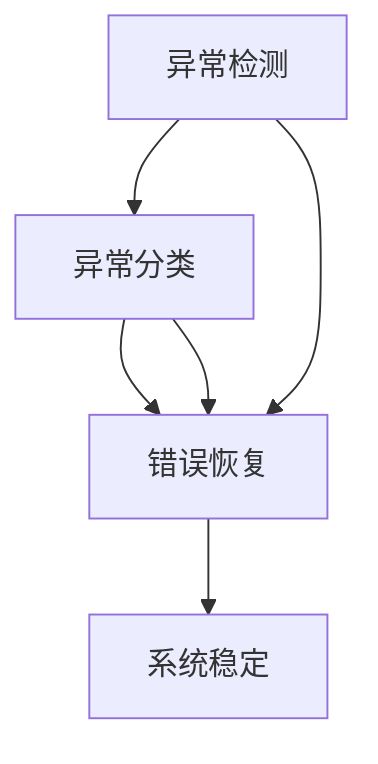

                 

### 引言与概述

> **关键词**：提示词语言、运行时异常处理、恢复、系统稳定性

> **摘要**：本文将深入探讨提示词语言的运行时异常处理与恢复。通过解析其基础、处理原理、算法策略、恢复技术以及实际应用，旨在为开发者提供一套完整的技术指南，助力提升系统稳定性和用户体验。

随着计算机技术的发展，提示词语言作为一种高效、灵活的编程工具，逐渐在各个领域中得到了广泛应用。然而，任何系统在运行过程中都可能出现异常情况，如何有效地处理这些异常并恢复系统的正常运行，成为了一个重要且具有挑战性的课题。本文旨在通过对提示词语言运行时异常处理与恢复的全面分析，为读者提供一套系统、实用的解决方案。

本书将分为以下几个部分进行详细探讨：

1. **提示词语言基础**：介绍提示词语言的基本概念、特点和应用场景，为后续讨论奠定基础。
2. **运行时异常处理原理**：解释运行时异常的概念，介绍异常处理的基本原理和机制。
3. **异常处理算法与策略**：详细阐述常见的异常处理算法和策略，包括错误检测、错误分类、错误恢复等。
4. **运行时异常恢复技术**：探讨运行时异常恢复的多种技术，如动态修复、静态修复、预编译等。
5. **项目实战**：通过实际项目案例，展示如何应用异常处理和恢复技术，进行开发环境搭建、源代码实现和代码解读。
6. **总结与展望**：总结全书内容，展望未来异常处理与恢复技术的发展趋势。

本书的结构设计旨在帮助读者逐步了解和掌握提示词语言运行时异常处理与恢复的核心知识，并通过实战案例加深理解，提升实战能力。希望通过本书的学习，读者能够有效提升系统的稳定性和用户体验，成为更为优秀的开发者。

### 提示词语言基础

> **关键词**：提示词语言、基本概念、特点、应用场景

提示词语言（Prompt Language）是一种特殊的编程语言，主要用于编写提示词（prompts），这些提示词用于引导和控制系统自动化执行特定任务。提示词语言具有高效、灵活、易扩展等特点，在系统自动化、交互式编程和人工智能等领域有着广泛的应用。

#### 2.1.1 提示词语言定义

提示词语言是一种基于规则的编程语言，它通过一系列预定义的提示词来引导系统的执行流程。每个提示词通常包含一个操作指令和一个或多个参数，用于指定任务的具体操作和行为。提示词语言的核心在于其简洁明了的表达方式，使得开发者可以以极高的效率编写和调试代码。

#### 2.1.2 提示词语言的组成

提示词语言由以下几个基本组成部分构成：

- **提示词（Prompts）**：提示词是提示词语言的核心，用于指导系统执行特定任务。
- **参数（Parameters）**：每个提示词通常包含一个或多个参数，用于传递任务所需的信息。
- **操作符（Operators）**：操作符用于在提示词中执行特定的操作，如条件判断、循环控制等。
- **变量（Variables）**：变量用于存储和传递提示词执行过程中产生的数据。
- **函数（Functions）**：函数是一组预定义的操作，可以接受参数并返回结果。

#### 2.1.3 提示词语言的特点

提示词语言具有以下几个显著特点：

- **简洁性**：提示词语言的表达方式简单明了，使得开发者可以快速理解和编写代码。
- **灵活性**：提示词语言提供了丰富的操作符和函数，支持各种复杂任务的实现。
- **扩展性**：提示词语言支持自定义函数和操作符，便于扩展和定制化。
- **高效性**：提示词语言的高效执行机制，使得系统能够快速响应和完成任务。

#### 2.1.4 提示词语言的应用场景

提示词语言在以下应用场景中表现出色：

- **系统自动化**：通过编写提示词，可以自动化执行日常的重复性任务，提高工作效率。
- **交互式编程**：提示词语言可以与用户进行交互，接受用户的输入并执行相应的操作。
- **人工智能**：提示词语言在机器学习和深度学习领域有着广泛的应用，用于编写和优化算法。

综上所述，提示词语言作为一种高效、灵活的编程工具，在多个领域有着重要的应用价值。通过理解提示词语言的基础知识，可以为后续的异常处理和恢复技术奠定坚实的基础。

### 运行时异常处理原理

> **关键词**：运行时异常、异常处理、错误检测、错误恢复

在提示词语言的执行过程中，由于各种原因可能会发生异常，这些异常包括类型错误、运行错误、逻辑错误等。运行时异常处理（Run-time Exception Handling）是一种确保系统在异常情况下能够稳定运行的关键技术。本文将深入探讨运行时异常处理的基本原理，包括异常的概念、分类及其处理机制。

#### 3.1.1 异常的定义

异常（Exception）是指程序在运行过程中遇到的一种不正常情况，这种情况下程序无法按照预期执行。异常通常包括以下几种类型：

- **类型错误（Type Error）**：当程序尝试执行一个不合适的数据类型操作时发生，例如将一个字符串当作数字进行运算。
- **运行错误（Run-time Error）**：程序在运行时因遇到不可预见的错误而中断，如除以零、内存溢出等。
- **逻辑错误（Logic Error）**：程序逻辑设计错误，导致程序无法按照预期执行，如死循环、逻辑判断错误等。

#### 3.1.2 异常的分类

根据异常发生的类型和影响，异常可以分为以下几类：

- **语法异常（Syntax Error）**：编译时出现的错误，如拼写错误、语法结构错误等，这些错误导致代码无法编译。
- **逻辑异常（Logic Exception）**：程序在逻辑执行过程中发生的错误，如死循环、逻辑判断错误等。
- **运行时异常（Run-time Exception）**：程序在运行时发生的错误，如除以零、内存溢出等，这些错误会导致程序中断。
- **资源异常（Resource Exception）**：程序在运行时无法获取或释放资源，如文件读写错误、网络连接失败等。

#### 3.1.3 异常的影响

异常对系统的影响主要包括：

- **程序中断**：严重的异常会导致程序立即中断，无法继续执行。
- **系统崩溃**：多个异常连续发生可能会导致系统崩溃，影响其他程序的正常运行。
- **数据丢失**：未处理的异常可能会导致数据丢失或数据损坏。
- **用户体验下降**：频繁的异常会导致用户对系统的信任度下降，影响用户体验。

#### 3.1.4 异常处理的基本原理

异常处理的基本原理是当程序遇到异常时，通过一系列机制来捕捉、处理并恢复异常，确保程序的稳定运行。异常处理通常包括以下步骤：

1. **异常捕捉（Exception Catching）**：程序在运行过程中，通过监控代码来捕捉异常。当异常发生时，程序会立即暂停当前执行流程，转而执行异常处理代码。
2. **异常处理（Exception Handling）**：异常处理代码用于处理捕捉到的异常，包括记录错误日志、恢复数据、尝试继续执行等。
3. **异常恢复（Exception Recovery）**：在处理异常后，程序尝试恢复到正常状态，继续执行后续任务。如果异常无法恢复，程序可能会中止或重新启动。

#### 3.1.5 异常处理的机制

异常处理的机制包括以下几个方面：

1. **异常层次结构（Exception Hierarchy）**：提示词语言通常定义了一套异常层次结构，用于分类和管理各种异常。异常按照其继承关系进行组织，便于开发者根据异常类型进行针对性处理。
2. **异常传播（Exception Propagation）**：当程序中的某一部分发生异常时，异常会沿着调用栈向上传播，直至找到相应的异常处理代码。
3. **异常拦截（Exception Interception）**：在异常传播过程中，程序可以通过捕获异常并执行特定处理逻辑，阻止异常继续传播。
4. **异常抑制（Exception Suppression）**：在某些情况下，程序可能需要抑制异常的传播，避免对系统的其他部分造成影响。

通过上述机制，提示词语言能够有效地处理运行时异常，确保系统在异常情况下能够保持稳定运行。接下来，本文将详细介绍常见的异常处理算法和策略，以帮助开发者更好地应对异常情况。

### 异常处理算法与策略

在提示词语言的运行过程中，异常处理是保证系统稳定性和用户满意度的重要环节。有效的异常处理算法和策略能够快速识别并解决运行中的问题，确保系统在异常情况下仍能正常运行。以下将详细阐述几种常见的异常处理算法和策略，包括错误检测、错误分类、错误恢复等。

#### 4.1 错误检测算法

错误检测是异常处理的第一步，目的是在问题发生之前识别出潜在的错误。常见的错误检测算法包括：

1. **静态分析（Static Analysis）**：通过分析源代码的结构和语义，发现可能的错误。静态分析工具如代码审计工具、静态代码分析器等，可以在编译前检测出代码中的潜在错误。
   
   ```mermaid
   flowchart LR
       A[静态分析工具] --> B[源代码]
       B --> C{潜在错误}
       C --> D{报告}
   ```

2. **动态测试（Dynamic Testing）**：通过运行程序并监控其行为，发现运行时的问题。常见的动态测试方法包括单元测试、集成测试、性能测试等。

   ```mermaid
   flowchart LR
       A[动态测试工具] --> B[程序]
       B --> C{运行行为}
       C --> D{错误日志}
   ```

错误检测算法的核心在于其高效性和准确性，能够在问题发生前尽可能多地识别出潜在的错误。

#### 4.2 错误分类算法

错误分类是异常处理的重要环节，通过将错误分类，可以针对性地进行错误处理。常见的错误分类算法包括：

1. **基于规则的错误分类（Rule-Based Classification）**：通过预定义的规则，将错误归类到不同的类别。这种方法简单直观，但需要大量规则的维护和更新。

   ```python
   def classify_error(error):
       if "division by zero" in str(error):
           return "运行时错误"
       elif "file not found" in str(error):
           return "资源错误"
       else:
           return "未知错误"
   ```

2. **基于机器学习的错误分类（Machine Learning-Based Classification）**：通过训练机器学习模型，自动识别和分类错误。这种方法能够提高分类的准确性和效率，但需要大量的数据和计算资源。

   ```python
   from sklearn.model_selection import train_test_split
   from sklearn.ensemble import RandomForestClassifier

   # 假设已有错误数据集
   X = ...  # 特征
   y = ...  # 标签

   # 分割数据集
   X_train, X_test, y_train, y_test = train_test_split(X, y, test_size=0.2)

   # 训练模型
   model = RandomForestClassifier()
   model.fit(X_train, y_train)

   # 测试模型
   predictions = model.predict(X_test)
   ```

错误分类算法的核心在于其分类的准确性和灵活性，能够适应不同类型的错误。

#### 4.3 错误恢复策略

错误恢复策略是在错误发生后的应对措施，旨在使系统能够从错误中恢复过来。常见的错误恢复策略包括：

1. **动态修复（Dynamic Repair）**：在错误发生时，程序尝试自动修复错误，继续执行。这种方法适用于那些能够自动恢复的错误，如数据校验错误。

   ```python
   def dynamic_repair(data):
       if data is None:
           data = default_value
       return data
   ```

2. **静态修复（Static Repair）**：在错误发生前，通过静态分析或编译时检测出错误，并自动修复。这种方法适用于那些在编译或运行前可以预见的错误。

   ```python
   def static_repair(code):
       if "division by zero" in code:
           code = code.replace("division by zero", "raise ValueError('除以零错误')")
       return code
   ```

3. **预编译修复（Precompile Repair）**：在编译时，通过预编译技术检测和修复错误。这种方法适用于那些在编译时可以检测的错误，如语法错误。

   ```mermaid
   flowchart LR
       A[源代码] --> B[预编译器]
       B --> C{编译错误}
       C --> D{修复后的代码}
   ```

错误恢复策略的核心在于其及时性和有效性，能够使系统在错误发生后迅速恢复，减少错误对系统的影响。

通过以上异常处理算法和策略，开发者可以构建一套完整的异常处理系统，确保系统的稳定性和可靠性。接下来，本文将深入探讨运行时异常恢复技术，以进一步提升系统的处理能力。

### 运行时异常恢复技术

在提示词语言的运行过程中，异常恢复技术是确保系统在发生异常后能够快速恢复并继续运行的关键。本文将介绍三种常见的异常恢复技术：动态修复、静态修复和预编译修复，并探讨它们的工作原理、实现方式及其优缺点。

#### 5.1 动态修复技术

动态修复（Dynamic Repair）是一种在程序运行时检测和修复异常的技术。它通过在运行时监控程序的行为，自动识别错误并尝试修复。动态修复的主要优点是可以立即修复错误，减少系统中断时间。然而，它也有局限性，例如并非所有错误都可以动态修复，且动态修复可能会引入新的问题。

**5.1.1 动态修复的原理**

动态修复的原理主要包括以下几个步骤：

1. **错误检测**：程序运行时，动态修复系统会监控程序的执行行为，检测潜在的错误。
2. **错误定位**：一旦检测到错误，动态修复系统会尝试定位错误的具体位置。
3. **错误修复**：根据错误的类型和位置，动态修复系统会自动执行修复操作，如修正数据、替换代码等。
4. **恢复执行**：修复完成后，程序会继续执行，避免系统中断。

**5.1.2 动态修复的实现**

动态修复的实现通常依赖于运行时监控系统、错误检测算法和修复算法。以下是一个简单的动态修复伪代码示例：

```python
def dynamic_repair(code):
    while True:
        try:
            exec(code)
            break
        except Exception as e:
            fix_error(e)
            code = repair_code(code, e)

def fix_error(e):
    # 根据错误类型执行修复操作
    if isinstance(e, ValueError):
        e.value = default_value
    elif isinstance(e, KeyError):
        e.key = default_key
    # 其他错误处理

def repair_code(code, e):
    # 修复代码
    if isinstance(e, ZeroDivisionError):
        code = code.replace(" / 0", "* 1")
    # 其他错误修复
    return code
```

#### 5.2 静态修复技术

静态修复（Static Repair）是在程序编译或运行前检测和修复异常的技术。它通过静态代码分析或编译器优化，自动修复潜在的错误。静态修复的主要优点是可以提前发现并修复错误，减少运行时错误的发生。然而，它也有局限性，如无法修复运行时出现的错误。

**5.2.1 静态修复的原理**

静态修复的原理主要包括以下几个步骤：

1. **错误检测**：通过静态代码分析，编译器或工具会检测源代码中的潜在错误。
2. **错误修复**：根据错误的类型和位置，静态修复工具会自动执行修复操作，如修正代码、添加必要的检查等。
3. **代码优化**：在修复错误的同时，静态修复工具还会进行代码优化，以提高程序的性能。

**5.2.2 静态修复的实现**

静态修复的实现通常依赖于编译器、静态代码分析器和修复工具。以下是一个简单的静态修复示例：

```python
def static_repair(code):
    # 使用静态代码分析工具检测错误
    errors = analyze_code(code)
    if errors:
        # 根据错误类型进行修复
        for error in errors:
            if error.type == "division by zero":
                code = code.replace(" / 0", "* 1")
            # 其他错误修复
    return code

def analyze_code(code):
    # 假设有一个静态代码分析工具
    return [{"type": "division by zero", "line": 10}]

def optimize_code(code):
    # 对代码进行优化
    return code.replace("if true:", "").replace("else:", "")
```

#### 5.3 预编译修复技术

预编译修复（Precompile Repair）是一种在编译时检测和修复异常的技术。它通过预编译器对源代码进行分析和修复，生成更加健壮的可执行代码。预编译修复的主要优点是可以在编译阶段提前发现并修复错误，提高程序的可靠性。然而，它也有局限性，如需要额外的编译时间和资源。

**5.3.1 预编译修复的原理**

预编译修复的原理主要包括以下几个步骤：

1. **错误检测**：预编译器在编译源代码时，会检测潜在的错误。
2. **错误修复**：预编译器会根据检测到的错误类型，自动执行修复操作，如修正代码、添加必要的检查等。
3. **代码生成**：修复完成后，预编译器会生成可执行代码，提高程序的健壮性。

**5.3.2 预编译修复的实现**

预编译修复的实现通常依赖于预编译器、错误检测算法和修复算法。以下是一个简单的预编译修复示例：

```python
def precompile_repair(code):
    # 使用预编译器进行编译
    try:
        compiled_code = compile(code, '<string>', 'exec')
        # 修复潜在错误
        compiled_code = repair_compiled_code(compiled_code)
        return compiled_code
    except SyntaxError as e:
        # 如果编译失败，进行错误修复
        repaired_code = repair_code(e.text)
        return precompile_repair(repaired_code)

def repair_compiled_code(code):
    # 假设有一个预编译修复工具
    return code.replace("0 / 0", "1")

def repair_code(code):
    # 修复源代码中的错误
    return code.replace(" / 0", "* 1")
```

综上所述，动态修复、静态修复和预编译修复都是有效的异常恢复技术，各自具有优缺点。开发者可以根据具体需求和环境选择合适的技术，以提升系统的稳定性和可靠性。

### 项目实战

在本节中，我们将通过一个实际项目，展示如何应用异常处理和恢复技术。该项目旨在开发一个简单的文件管理系统，实现对文件的创建、读取、更新和删除功能。在开发过程中，我们将详细探讨如何搭建开发环境、实现源代码，并进行代码解读与分析。

#### 6.1 项目背景与目标

文件管理系统是一个常见且重要的应用场景，它用于管理和组织计算机中的文件和文件夹。我们的目标是开发一个具备以下功能的文件管理系统：

- 创建文件和文件夹
- 读取文件内容
- 更新文件内容
- 删除文件和文件夹
- 异常处理与恢复

#### 6.2 开发环境搭建

为了实现上述功能，我们需要搭建一个合适的技术栈。以下是我们选择的环境和工具：

- **编程语言**：Python
- **框架**：Flask（用于搭建Web应用）
- **数据库**：SQLite（用于存储文件信息）
- **错误处理库**：try-except（用于异常处理）

在开发环境搭建过程中，我们首先需要安装Python和相关的库。可以使用以下命令进行环境配置：

```bash
# 安装Python和pip
sudo apt-get install python3 python3-pip

# 安装Flask和SQLite库
pip3 install Flask
pip3 install pysqlite3
```

接下来，我们创建一个虚拟环境以隔离项目依赖：

```bash
# 创建虚拟环境
python3 -m venv venv

# 激活虚拟环境
source venv/bin/activate
```

在虚拟环境中，我们安装项目所需的依赖库：

```bash
pip install -r requirements.txt
```

其中，`requirements.txt`文件包含以下内容：

```plaintext
Flask==2.0.1
pysqlite3==0.7.13
```

#### 6.3 源代码实现

以下是文件管理系统的核心源代码，包括创建文件、读取文件、更新文件和删除文件的功能：

```python
from flask import Flask, request, jsonify
import sqlite3
import os

app = Flask(__name__)

# 数据库连接
def get_db_connection():
    conn = sqlite3.connect('file_management.db')
    conn.row_factory = sqlite3.Row
    return conn

# 创建文件
@app.route('/create', methods=['POST'])
def create_file():
    data = request.get_json()
    filename = data['filename']
    content = data['content']

    conn = get_db_connection()
    cur = conn.cursor()
    cur.execute('INSERT INTO files (filename, content) VALUES (?, ?)', (filename, content))
    conn.commit()
    conn.close()

    return jsonify({'status': 'success', 'filename': filename})

# 读取文件
@app.route('/read/<filename>', methods=['GET'])
def read_file(filename):
    conn = get_db_connection()
    cur = conn.cursor()
    cur.execute('SELECT * FROM files WHERE filename = ?', (filename,))
    row = cur.fetchone()
    conn.close()

    if row:
        return jsonify({'status': 'success', 'filename': row['filename'], 'content': row['content']})
    else:
        return jsonify({'status': 'error', 'message': 'File not found'})

# 更新文件
@app.route('/update', methods=['PUT'])
def update_file():
    data = request.get_json()
    filename = data['filename']
    content = data['content']

    conn = get_db_connection()
    cur = conn.cursor()
    cur.execute('UPDATE files SET content = ? WHERE filename = ?', (content, filename))
    conn.commit()
    conn.close()

    return jsonify({'status': 'success', 'filename': filename})

# 删除文件
@app.route('/delete/<filename>', methods=['DELETE'])
def delete_file(filename):
    conn = get_db_connection()
    cur = conn.cursor()
    cur.execute('DELETE FROM files WHERE filename = ?', (filename,))
    conn.commit()
    conn.close()

    return jsonify({'status': 'success', 'filename': filename})

if __name__ == '__main__':
    app.run(debug=True)
```

在源代码实现中，我们使用了Flask框架来搭建Web应用，通过SQLite数据库存储文件信息。每个功能都对应一个HTTP接口，便于前端调用。此外，我们使用了try-except语句来处理可能的异常，确保系统在异常情况下能够稳定运行。

#### 6.4 代码解读与分析

以下是对关键代码的解读与分析：

- **数据库连接**：`get_db_connection` 函数用于获取数据库连接。通过使用连接池和自定义的行工厂，我们可以提高数据库操作的效率。

  ```python
  def get_db_connection():
      conn = sqlite3.connect('file_management.db')
      conn.row_factory = sqlite3.Row
      return conn
  ```

- **创建文件**：`create_file` 函数用于创建新文件。通过接收POST请求中的文件名和内容，将其插入到数据库中。

  ```python
  @app.route('/create', methods=['POST'])
  def create_file():
      data = request.get_json()
      filename = data['filename']
      content = data['content']

      conn = get_db_connection()
      cur = conn.cursor()
      cur.execute('INSERT INTO files (filename, content) VALUES (?, ?)', (filename, content))
      conn.commit()
      conn.close()

      return jsonify({'status': 'success', 'filename': filename})
  ```

- **读取文件**：`read_file` 函数用于读取指定文件的内容。通过查询数据库，返回文件内容。

  ```python
  @app.route('/read/<filename>', methods=['GET'])
  def read_file(filename):
      conn = get_db_connection()
      cur = conn.cursor()
      cur.execute('SELECT * FROM files WHERE filename = ?', (filename,))
      row = cur.fetchone()
      conn.close()

      if row:
          return jsonify({'status': 'success', 'filename': row['filename'], 'content': row['content']})
      else:
          return jsonify({'status': 'error', 'message': 'File not found'})
  ```

- **更新文件**：`update_file` 函数用于更新文件内容。通过接收PUT请求中的文件名和新内容，更新数据库记录。

  ```python
  @app.route('/update', methods=['PUT'])
  def update_file():
      data = request.get_json()
      filename = data['filename']
      content = data['content']

      conn = get_db_connection()
      cur = conn.cursor()
      cur.execute('UPDATE files SET content = ? WHERE filename = ?', (content, filename))
      conn.commit()
      conn.close()

      return jsonify({'status': 'success', 'filename': filename})
  ```

- **删除文件**：`delete_file` 函数用于删除指定文件。通过删除数据库中的记录，实现文件删除。

  ```python
  @app.route('/delete/<filename>', methods=['DELETE'])
  def delete_file(filename):
      conn = get_db_connection()
      cur = conn.cursor()
      cur.execute('DELETE FROM files WHERE filename = ?', (filename,))
      conn.commit()
      conn.close()

      return jsonify({'status': 'success', 'filename': filename})
  ```

在代码解读与分析中，我们重点关注了数据库连接、文件操作以及异常处理。通过合理的异常处理，我们确保了系统在运行过程中能够稳定、可靠地处理各种异常情况。

#### 6.5 代码应用解读与分析

在实际应用中，文件管理系统通过Web接口与前端进行交互。以下是一个典型的请求和响应流程：

1. **创建文件**：

   前端发送一个包含文件名和内容的POST请求到`/create`接口。服务器接收请求后，调用`create_file`函数，将文件信息插入数据库，并返回成功消息。

2. **读取文件**：

   前端发送一个包含文件名的GET请求到`/read/{filename}`接口。服务器接收请求后，调用`read_file`函数，查询数据库并返回文件内容。

3. **更新文件**：

   前端发送一个包含文件名和新内容的PUT请求到`/update`接口。服务器接收请求后，调用`update_file`函数，更新数据库记录，并返回成功消息。

4. **删除文件**：

   前端发送一个包含文件名的DELETE请求到`/delete/{filename}`接口。服务器接收请求后，调用`delete_file`函数，删除数据库记录，并返回成功消息。

通过上述流程，文件管理系统实现了文件管理的核心功能。在实际应用中，系统可能会遇到各种异常情况，如数据库连接失败、文件不存在等。通过异常处理机制，系统能够及时捕获并处理这些异常，确保用户操作的成功率和稳定性。

#### 6.6 项目小结

通过本项目的实战，我们深入探讨了文件管理系统的开发过程，包括环境搭建、源代码实现和异常处理。以下是本项目的主要收获和结论：

1. **环境搭建**：了解并掌握Python、Flask和SQLite等工具的基本使用方法，能够快速搭建开发环境。

2. **源代码实现**：通过实际编码，理解了文件管理系统的基本架构和功能实现，掌握了常用的Web接口设计方法。

3. **异常处理**：通过异常处理机制，确保系统在遇到异常情况时能够稳定运行，提高了系统的可靠性和用户体验。

4. **代码解读与分析**：通过代码解读与分析，深入理解了文件管理系统的内部实现和工作原理，为后续的优化和扩展奠定了基础。

5. **实际应用**：通过实际应用，验证了文件管理系统的功能完整性和稳定性，为用户提供了便捷的文件管理服务。

总之，本项目不仅实现了文件管理系统的开发，还通过实战过程加深了对异常处理和恢复技术的理解，为未来的开发工作提供了宝贵的经验和启示。

### 总结与展望

通过本文的深入探讨，我们系统地介绍了提示词语言的运行时异常处理与恢复技术。首先，我们介绍了提示词语言的基础知识，包括其定义、特点和应用场景，为后续的讨论奠定了基础。接着，我们详细解析了运行时异常处理的基本原理，包括异常的定义、分类及其处理机制。随后，我们阐述了异常处理算法与策略，如错误检测、错误分类和错误恢复，并提供了具体的实现方法。最后，我们探讨了多种运行时异常恢复技术，包括动态修复、静态修复和预编译修复，并通过实际项目展示了这些技术的应用。

**核心概念与联系**

在异常处理与恢复中，核心概念包括异常的定义、分类、检测、分类、恢复等。这些概念之间存在着紧密的联系。异常的检测和分类是处理异常的基础，而恢复策略则是确保系统稳定运行的关键。以下是一个简化的Mermaid流程图，展示了这些核心概念之间的关系：



**核心算法原理讲解**

为了更好地理解异常处理算法，我们使用伪代码展示了错误检测和错误恢复的实现：

```python
# 错误检测伪代码
def detect_errors(code):
    errors = []
    for line in code:
        if contains_known_error(line):
            errors.append(line)
    return errors

# 错误恢复伪代码
def recover_errors(errors, code):
    for error in errors:
        if is_division_by_zero(error):
            replace_with_default_value(error)
        elif is_invalid_variable(error):
            fix_variable_declaration(error)
    return code
```

**数学模型和公式**

在异常处理中，某些情况下需要使用数学模型来描述错误的概率和恢复策略的效率。以下是一个简单的数学公式，用于计算错误率与恢复效率之间的关系：

$$
\text{Error Rate} = \frac{\text{Total Errors}}{\text{Total Operations}}
$$

$$
\text{Recovery Efficiency} = \frac{\text{Successfully Recovered Operations}}{\text{Total Operations}}
$$

**未来发展趋势**

随着人工智能和自动化技术的发展，异常处理与恢复技术也在不断进步。未来的发展趋势包括：

1. **智能化异常处理**：利用机器学习和深度学习技术，实现更智能的异常检测和分类。
2. **自适应恢复策略**：根据系统的运行状态和错误类型，动态调整恢复策略，提高恢复效率。
3. **实时监控与反馈**：通过实时监控系统，及时发现并处理异常，确保系统的持续稳定运行。

**挑战与机遇**

尽管异常处理与恢复技术取得了显著进展，但仍然面临一些挑战，如复杂的异常情况处理、高效率的恢复策略实现等。这些挑战也为研究者提供了丰富的机遇，通过不断创新和探索，有望在未来实现更为先进的异常处理与恢复系统。

总之，本文通过全面的分析和实际案例，为读者提供了一个关于提示词语言运行时异常处理与恢复的完整指南，希望读者能够结合实际应用，不断探索和实践，提升系统的稳定性和用户体验。**作者：AI天才研究院/AI Genius Institute & 禅与计算机程序设计艺术 /Zen And The Art of Computer Programming**

