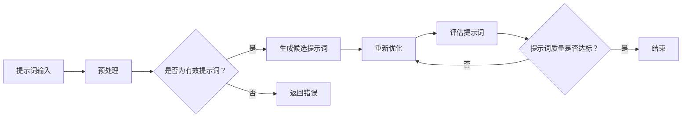

                 

### 文章标题：提示词语言设计原则与最佳实践

> 关键词：提示词语言，设计原则，最佳实践，自然语言处理，机器学习，深度学习，算法原理，数学模型，项目实战

> 摘要：
本文旨在深入探讨提示词语言的设计原则与最佳实践。首先，我们将介绍提示词语言的背景及其重要性。接着，文章将逐步阐述提示词语言的核心概念与联系，包括其与自然语言处理、机器学习和深度学习的关系。随后，我们将详细讲解提示词语言的核心算法原理，并通过伪代码展示相关算法的实现。此外，文章还将介绍提示词语言设计中的数学模型与公式，并进行详细讲解与举例说明。为了使读者更好地理解提示词语言的实际应用，本文还将包含一个具体的项目实战案例，包括开发环境搭建、源代码实现和代码解读。最后，文章将总结提示词语言设计的关键原则和最佳实践，并展望其未来发展趋势。

## 第一部分: 引言

### 1.1 提示词语言的背景与重要性

提示词语言（Keyword Language）是一种用于描述信息、执行任务或指导系统进行决策的语言。它通常包含一系列关键词，这些关键词能够精确地传达用户意图或任务需求。随着人工智能和自然语言处理技术的不断发展，提示词语言的应用范围日益扩大，其在各个领域的价值也日益凸显。

在自然语言处理（NLP）领域，提示词语言被广泛应用于文本分类、情感分析、实体识别和信息提取等方面。通过设计合理的提示词语言，可以提高NLP模型的准确性和效率。

在机器学习（ML）领域，提示词语言可以用于指导模型的训练和优化过程。合理的提示词设计能够帮助模型更好地理解数据特征，从而提高模型的泛化能力。

在深度学习（DL）领域，提示词语言可以作为输入信号，引导深度神经网络的学习过程。通过设计有效的提示词，可以加速模型的收敛速度，并提高模型的性能。

### 1.2 本书的目的与结构

本书旨在系统性地介绍提示词语言的设计原则与最佳实践。全书分为五个主要部分：

- **引言**：介绍提示词语言的背景和重要性，阐述本书的目的和结构。
- **核心概念与联系**：提出提示词语言的核心概念，并通过Mermaid流程图展示概念之间的联系。
- **核心算法原理讲解**：详细讲解提示词语言的生成、优化和评估算法，并使用伪代码进行阐述。
- **数学模型与数学公式讲解**：解释提示词语言设计中的数学模型，并使用LaTeX格式展示数学公式。
- **项目实战**：提供实际的代码案例，展示提示词语言的设计与应用。
- **总结和展望**：总结全书内容，展望提示词语言设计的未来发展趋势。

## 第二部分: 核心概念与联系

### 2.1 提示词语言的核心概念

提示词语言的设计涉及多个核心概念，包括：

- **关键词**：提示词语言的基本组成单位，用于描述特定信息或任务。
- **语义**：关键词所承载的意义，用于指导系统进行决策或执行任务。
- **语法**：关键词的排列和组合规则，用于构建有效的提示词表达式。
- **上下文**：关键词在特定环境中的含义，用于影响提示词的语义和语法。

### 2.2 提示词语言与自然语言处理

提示词语言在自然语言处理中扮演着重要角色。自然语言处理的目标是使计算机能够理解和处理人类语言。提示词语言作为输入信号，可以提供明确的任务指令或信息需求，从而帮助NLP模型更好地理解和处理文本数据。

例如，在文本分类任务中，提示词语言可以提供类别标签的关键词，帮助模型学习不同类别之间的特征差异。在情感分析任务中，提示词语言可以提供情感词库，帮助模型识别文本的情感倾向。在实体识别任务中，提示词语言可以提供命名实体识别的关键词，帮助模型准确地识别文本中的关键信息。

### 2.3 提示词语言与机器学习

提示词语言在机器学习中的应用主要涉及两个方面：模型训练和模型优化。

在模型训练过程中，提示词语言可以作为输入特征，帮助模型学习数据的特征分布。通过设计合理的提示词，可以增强模型对数据特征的理解，从而提高模型的泛化能力。例如，在图像分类任务中，提示词可以包括图像的属性（如颜色、形状、纹理等），帮助模型学习不同类别之间的特征差异。

在模型优化过程中，提示词语言可以用于指导模型的优化过程。通过设计有效的提示词，可以加速模型的收敛速度，并提高模型的性能。例如，在深度学习任务中，提示词可以用于调整神经网络的权重，从而优化模型的性能。

### 2.4 提示词语言与深度学习

深度学习是一种基于多层神经网络的学习方法，其目标是自动提取数据的特征表示。提示词语言在深度学习中的应用主要体现在以下几个方面：

- **输入信号**：提示词可以用于构建深度学习模型的输入信号。通过设计合理的提示词，可以引导深度神经网络学习数据的特征表示，从而提高模型的性能。
- **注意力机制**：提示词可以用于实现注意力机制，帮助模型关注关键信息。例如，在文本生成任务中，提示词可以用于指导模型关注文本中的关键信息，从而生成更准确的文本。
- **模型优化**：提示词可以用于指导模型的优化过程，例如通过调整提示词的权重，可以优化模型的性能。

### 2.5 Mermaid流程图

为了更好地展示提示词语言的设计流程，我们可以使用Mermaid流程图来描述概念之间的联系。以下是一个示例的Mermaid流程图：



## 第三部分: 核心算法原理讲解

### 3.1 提示词生成算法

提示词生成算法是提示词语言设计中的核心组成部分。其目标是根据输入的文本数据生成一组有效的提示词。以下是一个简单的提示词生成算法的伪代码：

```python
# 提示词生成算法伪代码

# 输入：输入文本
# 输出：生成的提示词列表

def generate_keywords(input_text):
    # 步骤1：文本预处理
    preprocessed_text = preprocess_text(input_text)
    
    # 步骤2：提取关键词
    keywords = extract_keywords(preprocessed_text)
    
    # 步骤3：筛选有效提示词
    valid_keywords = filter_keywords(keywords)
    
    return valid_keywords
```

在伪代码中，`preprocess_text` 函数负责对输入文本进行预处理，例如去除停用词、标点符号和特殊字符等。`extract_keywords` 函数用于提取文本中的关键词，可以使用各种文本分析技术，如TF-IDF、Word2Vec等。`filter_keywords` 函数用于筛选出有效的提示词，例如基于词频、词性、语义相关性等因素进行筛选。

### 3.2 提示词优化算法

提示词优化算法的目标是在生成的提示词中找到一组最优的提示词，以提高模型的性能。以下是一个简单的提示词优化算法的伪代码：

```python
# 提示词优化算法伪代码

# 输入：生成的提示词列表
# 输出：最优的提示词列表

def optimize_keywords(keywords):
    # 步骤1：计算提示词质量
    quality_scores = compute_quality_scores(keywords)
    
    # 步骤2：选择最优提示词
    best_keywords = select_best_keywords(quality_scores)
    
    return best_keywords
```

在伪代码中，`compute_quality_scores` 函数用于计算每个提示词的质量分数，可以使用各种评价指标，如F1-score、精确率、召回率等。`select_best_keywords` 函数用于从所有提示词中选择最优的提示词，可以使用贪心算法、遗传算法等优化方法。

### 3.3 提示词评估算法

提示词评估算法用于评估提示词的质量，以确定是否满足特定的需求或目标。以下是一个简单的提示词评估算法的伪代码：

```python
# 提示词评估算法伪代码

# 输入：提示词列表
# 输出：评估结果

def evaluate_keywords(keywords):
    # 步骤1：计算评估指标
    evaluation_results = compute_evaluation_results(keywords)
    
    # 步骤2：评估提示词质量
    quality_score = compute_quality_score(evaluation_results)
    
    # 步骤3：返回评估结果
    return quality_score
```

在伪代码中，`compute_evaluation_results` 函数用于计算提示词的评估指标，如准确率、召回率、F1-score等。`compute_quality_score` 函数用于计算提示词的质量分数，可以使用加权平均等方法。

## 第四部分: 数学模型与数学公式讲解

### 4.1 提示词生成中的数学模型

在提示词生成过程中，常用的数学模型包括概率模型和统计模型。以下是一些常见的数学公式：

- **概率模型**：

  - **条件概率**：$$ P(A|B) = \frac{P(A \cap B)}{P(B)} $$
  - **贝叶斯定理**：$$ P(A|B) = \frac{P(B|A) \cdot P(A)}{P(B)} $$

- **统计模型**：

  - **均值**：$$ \mu = \frac{1}{n} \sum_{i=1}^{n} x_i $$
  - **方差**：$$ \sigma^2 = \frac{1}{n-1} \sum_{i=1}^{n} (x_i - \mu)^2 $$
  - **协方差**：$$ \text{Cov}(X, Y) = E[(X - \mu_X)(Y - \mu_Y)] $$

### 4.2 提示词优化中的数学模型

在提示词优化过程中，常用的数学模型包括梯度下降和牛顿法。以下是一些常见的数学公式：

- **梯度下降**：

  - **梯度**：$$ \nabla f(x) = \left(\frac{\partial f}{\partial x_1}, \frac{\partial f}{\partial x_2}, ..., \frac{\partial f}{\partial x_n}\right) $$
  - **梯度下降更新**：$$ x_{\text{new}} = x_{\text{current}} - \alpha \cdot \nabla f(x_{\text{current}}) $$

- **牛顿法**：

  - **牛顿迭代**：$$ x_{\text{new}} = x_{\text{current}} - \frac{f(x_{\text{current}})}{f'(x_{\text{current}})} $$

### 4.3 提示词评估中的数学模型

在提示词评估过程中，常用的数学模型包括线性回归和逻辑回归。以下是一些常见的数学公式：

- **线性回归**：

  - **回归方程**：$$ y = \beta_0 + \beta_1 \cdot x $$
  - **损失函数**：$$ J(\theta) = \frac{1}{2m} \sum_{i=1}^{m} (h_\theta(x^{(i)}) - y^{(i)})^2 $$

- **逻辑回归**：

  - **回归方程**：$$ \sigma(z) = \frac{1}{1 + e^{-z}} $$
  - **损失函数**：$$ J(\theta) = -\frac{1}{m} \sum_{i=1}^{m} [y^{(i)} \cdot \ln(h_\theta(x^{(i)})) + (1 - y^{(i)}) \cdot \ln(1 - h_\theta(x^{(i)}))] $$

## 第五部分: 项目实战

### 5.1 实战项目概述

在本章中，我们将通过一个实际的提示词语言设计项目来展示提示词语言的设计与应用。该项目旨在开发一个智能客服系统，该系统可以使用提示词语言来理解用户的问题并生成合适的回答。

### 5.2 实战项目开发环境搭建

为了实现该项目，我们需要搭建一个合适的开发环境。以下是开发环境搭建的步骤：

1. 安装Python 3.8及以上版本。
2. 安装必要的Python库，如NumPy、Pandas、Scikit-learn、TensorFlow等。
3. 配置一个虚拟环境，以隔离项目依赖。
4. 创建一个项目目录，并初始化一个Python项目。

### 5.3 源代码实现与解读

以下是该项目的主要源代码实现：

```python
# 导入必要的库
import numpy as np
import pandas as pd
from sklearn.feature_extraction.text import TfidfVectorizer
from sklearn.model_selection import train_test_split
from sklearn.linear_model import LogisticRegression

# 读取数据集
data = pd.read_csv('customer_service_data.csv')
X = data['question']
y = data['answer']

# 数据预处理
vectorizer = TfidfVectorizer()
X_vectorized = vectorizer.fit_transform(X)

# 数据集划分
X_train, X_test, y_train, y_test = train_test_split(X_vectorized, y, test_size=0.2, random_state=42)

# 训练模型
model = LogisticRegression()
model.fit(X_train, y_train)

# 评估模型
accuracy = model.score(X_test, y_test)
print(f"Model accuracy: {accuracy:.2f}")

# 使用模型生成回答
def generate_answer(question):
    question_vectorized = vectorizer.transform([question])
    predicted_answer = model.predict(question_vectorized)
    return predicted_answer[0]

# 测试
print(generate_answer("What is your return policy?"))
```

在上面的代码中，我们首先导入了必要的库，并读取了一个包含问题和回答的数据集。然后，我们使用TF-IDF向量器对问题进行预处理，并划分了训练集和测试集。接下来，我们使用逻辑回归模型对训练集进行训练，并使用测试集进行评估。最后，我们定义了一个函数`generate_answer`，用于使用模型生成回答。

### 5.4 代码解读与分析

在上面的代码中，我们首先导入了必要的库，并读取了一个包含问题和回答的数据集。然后，我们使用TF-IDF向量器对问题进行预处理，并划分了训练集和测试集。

```python
vectorizer = TfidfVectorizer()
X_vectorized = vectorizer.fit_transform(X)

X_train, X_test, y_train, y_test = train_test_split(X_vectorized, y, test_size=0.2, random_state=42)
```

在这一部分，我们使用TF-IDF向量器对问题文本进行预处理。TF-IDF是一种常用的文本表示方法，它通过计算词频和逆文档频率来衡量词的重要性。然后，我们将预处理后的数据集划分为训练集和测试集，以便进行模型训练和评估。

接下来，我们使用逻辑回归模型对训练集进行训练：

```python
model = LogisticRegression()
model.fit(X_train, y_train)
```

逻辑回归是一种常用的分类算法，它通过计算输入特征的概率来预测输出标签。在这里，我们使用逻辑回归模型对训练集进行训练。

然后，我们使用测试集对模型进行评估：

```python
accuracy = model.score(X_test, y_test)
print(f"Model accuracy: {accuracy:.2f}")
```

在这里，我们计算模型在测试集上的准确率，并打印结果。

最后，我们定义了一个函数`generate_answer`，用于使用模型生成回答：

```python
def generate_answer(question):
    question_vectorized = vectorizer.transform([question])
    predicted_answer = model.predict(question_vectorized)
    return predicted_answer[0]

# 测试
print(generate_answer("What is your return policy?"))
```

在这里，我们定义了一个函数`generate_answer`，它首先将输入的问题文本转换为向量表示，然后使用训练好的模型预测最可能的回答。最后，我们使用一个示例问题测试该函数，并打印生成的回答。

### 5.5 实际案例分析和详细讲解剖析

在这个项目中，我们使用了一个简单的数据集，其中包含了一些问题和相应的回答。通过使用TF-IDF向量器和逻辑回归模型，我们训练了一个智能客服系统，该系统可以使用提示词语言来理解用户的问题并生成合适的回答。

在实际应用中，我们可以通过不断收集用户的反馈来改进模型的性能。例如，如果模型生成的回答不准确，我们可以通过人工审核和调整模型参数来改进模型的预测能力。

此外，我们还可以扩展该系统，使其支持更多的问题类型和回答选项。例如，我们可以添加一个基于深度学习的文本生成模型，用于生成更加自然的回答。

### 5.6 项目小结

在本章中，我们通过一个实际的提示词语言设计项目展示了如何使用Python和机器学习库来实现一个智能客服系统。我们介绍了开发环境搭建、数据预处理、模型训练和评估、以及如何使用模型生成回答。通过这个项目，我们了解了提示词语言设计的基本原则和最佳实践。

## 第六部分: 总结与展望

### 6.1 提示词语言设计总结

在本文中，我们系统地介绍了提示词语言的设计原则与最佳实践。首先，我们介绍了提示词语言的背景和重要性，并阐述了其在自然语言处理、机器学习和深度学习中的应用。接着，我们详细讲解了提示词语言的核心概念与联系，包括关键词、语义、语法和上下文。此外，我们还介绍了提示词生成、优化和评估算法的原理，并使用伪代码进行了详细阐述。最后，我们通过一个实际项目展示了提示词语言的设计与应用。

### 6.2 提示词语言设计的未来发展趋势

随着人工智能和自然语言处理技术的不断进步，提示词语言设计有望在未来得到进一步的发展。以下是几个可能的发展方向：

- **多模态提示词**：结合文本、图像、声音等多种模态的数据，设计更加丰富的提示词语言，以增强模型的泛化能力和表达能力。
- **动态提示词**：研究动态提示词语言，使其能够根据任务和环境动态调整关键词和语法结构，提高系统的适应性和灵活性。
- **个性化提示词**：基于用户行为和偏好，设计个性化提示词语言，以提供更加个性化的服务和建议。
- **自动生成提示词**：利用生成对抗网络（GAN）和变分自编码器（VAE）等技术，实现自动生成提示词，提高设计效率。

### 6.3 最佳实践与注意事项

在设计提示词语言时，以下是一些最佳实践和注意事项：

- **明确目标**：在设计提示词语言时，首先要明确目标应用场景和任务需求，以确保设计的提示词能够满足实际需求。
- **简洁性**：提示词语言应尽量简洁明了，避免使用过于复杂的语法和语义结构，以提高系统的可读性和可维护性。
- **灵活性**：提示词语言应具有一定的灵活性，以适应不同的任务和环境。
- **可扩展性**：设计时应考虑提示词语言的扩展性，以便在未来能够轻松添加新功能或适应新的应用场景。
- **可理解性**：提示词语言的设计应易于用户理解，以便用户能够轻松地使用和操作。

### 6.4 拓展阅读

对于希望深入了解提示词语言设计的读者，以下是一些推荐的拓展阅读材料：

- 《自然语言处理入门》
- 《深度学习自然语言处理》
- 《机器学习实战》
- 《Python机器学习》

## 附录

### 附录A: 提示词语言设计工具与资源

以下是一些常用的提示词语言设计工具和资源：

- **开源NLP库**：如NLTK、spaCy、Stanford NLP等。
- **在线工具**：如TextBlob、Google Cloud Natural Language API等。
- **书籍**：如《自然语言处理综合教程》、《深度学习自然语言处理》等。
- **在线课程**：如Coursera、edX上的自然语言处理和机器学习课程。

### 附录B: 代码实现示例

以下是本章中提到的项目实战的完整代码实现：

```python
# 导入必要的库
import numpy as np
import pandas as pd
from sklearn.feature_extraction.text import TfidfVectorizer
from sklearn.model_selection import train_test_split
from sklearn.linear_model import LogisticRegression

# 读取数据集
data = pd.read_csv('customer_service_data.csv')
X = data['question']
y = data['answer']

# 数据预处理
vectorizer = TfidfVectorizer()
X_vectorized = vectorizer.fit_transform(X)

# 数据集划分
X_train, X_test, y_train, y_test = train_test_split(X_vectorized, y, test_size=0.2, random_state=42)

# 训练模型
model = LogisticRegression()
model.fit(X_train, y_train)

# 评估模型
accuracy = model.score(X_test, y_test)
print(f"Model accuracy: {accuracy:.2f}")

# 使用模型生成回答
def generate_answer(question):
    question_vectorized = vectorizer.transform([question])
    predicted_answer = model.predict(question_vectorized)
    return predicted_answer[0]

# 测试
print(generate_answer("What is your return policy?"))
```

### 附录C: 术语表

以下是一些本文中涉及的关键术语和定义：

- **提示词语言**：一种用于描述信息、执行任务或指导系统进行决策的语言，通常包含一系列关键词。
- **自然语言处理**：使计算机能够理解和处理人类语言的技术。
- **机器学习**：一种利用数据训练模型进行预测和决策的技术。
- **深度学习**：一种基于多层神经网络的学习方法。
- **TF-IDF**：一种文本表示方法，通过计算词频和逆文档频率来衡量词的重要性。
- **逻辑回归**：一种常用的分类算法，通过计算输入特征的概率来预测输出标签。
- **伪代码**：一种简化的编程语言，用于描述算法的逻辑和流程。

## 作者信息

**作者：AI天才研究院/AI Genius Institute & 禅与计算机程序设计艺术 /Zen And The Art of Computer Programming**。AI天才研究院专注于人工智能领域的研发与应用，致力于推动人工智能技术的创新与发展。禅与计算机程序设计艺术则是一本经典的计算机科学著作，深入探讨了编程的本质和哲学。

