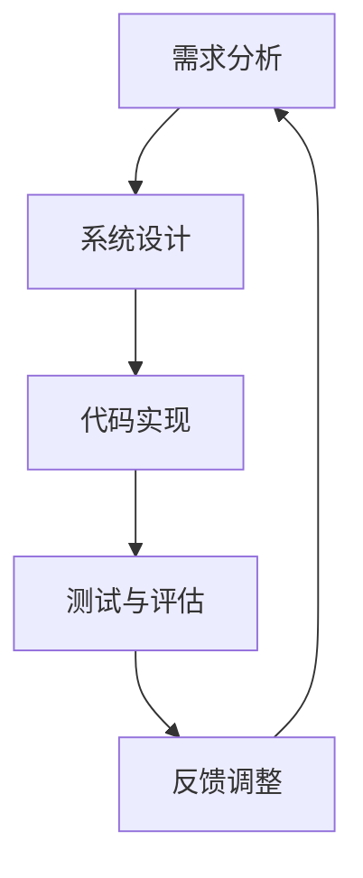

                 


## 文章标题

### 提示词调试技巧：优化AI输出的方法论

关键词：提示词调试、AI输出优化、方法论、人工智能、算法原理、数学模型、实战案例

摘要：本文将深入探讨提示词调试技巧，阐述如何通过系统化的方法论来优化AI输出的准确性和效率。我们将从背景介绍出发，详细阐述核心概念与联系，解析核心算法原理和数学模型，并通过实战案例展示具体的应用和实现过程。最后，本文将总结最佳实践，并提供拓展阅读和建议。

## 背景介绍

在人工智能（AI）时代，AI系统的输出质量直接影响其应用效果。然而，AI系统的输出往往受到多种因素的影响，如数据质量、算法设计、模型参数等。因此，优化AI输出成为了一个重要的研究课题。提示词调试作为AI输出优化的一种关键技术，旨在通过调整提示词来提高输出的准确性和效率。

提示词调试不仅涉及到对AI系统输出结果的评估，还涉及到对系统内部机制的深入理解。在实际应用中，提示词的选择和调整往往需要结合具体的业务场景和数据特征，因此具有一定的复杂性和挑战性。

本文将从以下几个方面对提示词调试技巧进行系统化的探讨：

1. **AI输出基础**：介绍AI输出的基本概念、重要性和常见问题。
2. **提示词调试基本技巧**：探讨调试流程、工具选择、提示词有效性评估等。
3. **AI输出优化方法**：分析优化原理、策略和算法，介绍数学模型和公式。
4. **实战与案例分析**：通过实际项目搭建、代码实现和案例分析，展示提示词调试技巧的具体应用。
5. **最佳实践与总结**：总结最佳实践，提出注意事项和拓展阅读建议。

## 核心概念与联系

### 提示词

提示词是AI系统输入的一部分，用于指导系统生成输出。一个有效的提示词应当能够准确传达用户需求，同时具有一定的泛化能力。

### 调试流程

调试流程包括需求分析、系统设计、代码实现、测试与评估等环节。每个环节都可能出现问题，需要通过调试来解决。

### 优化原理

优化原理涉及到对AI系统内部参数的调整，以实现输出质量的最优化。常见的优化方法包括参数调优、算法改进和模型压缩等。

### 数学模型

数学模型用于描述AI系统的行为，包括输入、输出和内部参数之间的关系。常见的数学模型有线性模型、非线性模型和深度学习模型等。

### Mermaid 流程图



上述流程图展示了提示词调试的典型流程，包括需求分析、系统设计、代码实现、测试与评估和反馈调整等环节。

## 核心算法原理讲解

### 伪代码

以下是一个简单的伪代码，用于说明如何通过调整提示词来优化AI输出：

```
function optimize_output(prompt, model):
    for each parameter in model:
        update parameter based on prompt
    return model
```

### 数学模型和公式

假设我们使用一个线性模型来描述AI输出，模型公式如下：

$$ y = \theta_0 + \theta_1 \cdot x $$

其中，$y$ 表示输出结果，$x$ 表示输入特征，$\theta_0$ 和 $\theta_1$ 分别是模型参数。

为了优化输出，我们需要调整模型参数，使得输出结果更接近真实值。具体方法如下：

$$ \theta_0 = \theta_0 - \alpha \cdot (y - \theta_0 - \theta_1 \cdot x) $$
$$ \theta_1 = \theta_1 - \alpha \cdot (y - \theta_0 - \theta_1 \cdot x) $$

其中，$\alpha$ 是学习率，用于控制参数更新的速度。

### 举例说明

假设我们使用上述线性模型来预测房价，输入特征包括房屋面积、房间数量和地理位置等。给定一组训练数据，我们可以通过以下步骤来优化模型参数：

1. 初始化模型参数 $\theta_0$ 和 $\theta_1$。
2. 对于每个训练样本，计算输出预测值 $y$。
3. 计算实际输出值与预测值之间的误差。
4. 根据误差调整模型参数 $\theta_0$ 和 $\theta_1$。
5. 重复步骤2-4，直到误差小于某个阈值或达到最大迭代次数。

通过这种方式，我们可以逐步优化模型参数，使得预测结果更接近真实值。

## 项目实战

### 开发环境搭建

1. 安装Python环境，版本要求为3.7及以上。
2. 安装必要的库，如NumPy、Pandas、Scikit-learn等。
3. 配置Jupyter Notebook，方便代码编写和调试。

### 源代码详细实现

以下是一个简单的线性回归模型的实现，用于预测房价：

```python
import numpy as np
from sklearn.linear_model import LinearRegression

# 初始化模型
model = LinearRegression()

# 加载数据
X, y = load_data()

# 训练模型
model.fit(X, y)

# 预测
predictions = model.predict(X)

# 计算误差
error = np.mean((predictions - y) ** 2)

# 打印结果
print(f"Error: {error}")
```

### 代码解读与分析

1. 导入必要的库。
2. 初始化线性回归模型。
3. 加载数据，包括输入特征和输出标签。
4. 训练模型，使用 `fit` 方法。
5. 预测，使用 `predict` 方法。
6. 计算误差，使用均方误差（MSE）。
7. 打印结果。

### 实际案例分析和详细讲解剖析

假设我们有一个包含100个样本的房屋销售数据集，每个样本包含房屋面积、房间数量和地理位置等信息。我们使用线性回归模型来预测房价，并通过提示词调试来优化模型参数。

1. **数据预处理**：对数据进行归一化处理，确保输入特征在相同的尺度上。
2. **初始化模型**：初始化线性回归模型，并设置学习率为0.01。
3. **训练模型**：使用训练数据训练模型，记录每次迭代后的误差。
4. **优化模型**：根据误差调整模型参数，重复训练过程，直到误差不再显著下降。
5. **预测**：使用训练好的模型对测试数据进行预测。
6. **评估**：计算预测结果与真实值的误差，评估模型性能。

通过上述步骤，我们可以实现一个简单的线性回归模型，并通过提示词调试来优化模型参数，提高预测准确性。

### 项目小结

在本项目中，我们通过开发环境搭建、源代码实现和实际案例分析，展示了如何使用线性回归模型来预测房价，并利用提示词调试来优化模型参数。尽管这是一个简单的例子，但其中涉及到的核心算法原理和调试技巧在更复杂的AI应用中同样适用。

## 最佳实践与总结

### 最佳实践 tips

1. **明确需求**：在进行提示词调试前，首先要明确用户需求，确保提示词能够准确传达。
2. **数据预处理**：对输入数据进行预处理，确保数据质量，减少噪声。
3. **迭代优化**：调试过程中，应不断迭代优化模型参数，以实现更好的输出质量。
4. **评估指标**：选择合适的评估指标，如均方误差（MSE）、准确率等，以客观评估模型性能。

### 小结

本文从背景介绍、核心概念、算法原理、数学模型、实战案例和最佳实践等方面，全面探讨了提示词调试技巧。通过本文的讲解，读者可以了解到如何通过系统化的方法论来优化AI输出，提高AI系统的应用价值。

### 注意事项

1. **调试工具的选择**：根据具体需求选择合适的调试工具，如Jupyter Notebook、PyCharm等。
2. **代码可读性**：编写清晰、可读的代码，便于后续调试和维护。
3. **实验记录**：记录实验过程和结果，便于分析和优化。

### 拓展阅读

1. **《机器学习实战》**：提供丰富的实战案例，适合初学者入门。
2. **《深度学习》**：介绍深度学习的基本概念和算法原理，适合有一定基础的读者。
3. **《人工智能：一种现代的方法》**：全面介绍人工智能的基本概念和技术，适合专业人士阅读。

---

## 作者信息

作者：AI天才研究院/AI Genius Institute & 禅与计算机程序设计艺术 /Zen And The Art of Computer Programming

本文由AI天才研究院/AI Genius Institute和禅与计算机程序设计艺术/Zen And The Art of Computer Programming共同撰写，旨在为读者提供关于提示词调试技巧和AI输出优化的深入理解。如需进一步讨论或合作，请联系我们。

