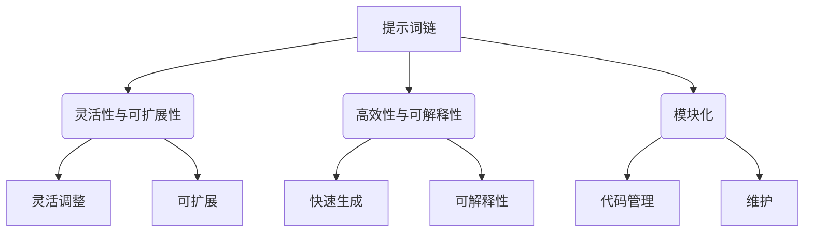

                 

### 文章标题

# 提示词链：构建复杂AI工作流的新方式

> 关键词：提示词链、AI工作流、架构设计、核心算法、实际应用、优化与趋势

> 摘要：本文将深入探讨提示词链在构建复杂AI工作流中的新方式。我们将从基本概念出发，逐步解析提示词链的架构设计、核心算法、实际应用和优化策略，并展望其未来发展趋势。通过详细的案例分析和代码解读，帮助读者全面理解并掌握这一前沿技术。

---

## 引言

随着人工智能（AI）技术的迅猛发展，AI工作流在各个领域中的应用越来越广泛。然而，传统的AI工作流往往面临复杂性和效率的挑战。提示词链（Prompt Chain）作为一种新型的AI工作流构建方式，能够有效解决这些问题，提供了一种更加灵活和高效的解决方案。

提示词链的概念源于自然语言处理（NLP）领域，最初用于生成文本和对话系统。随着技术的发展，提示词链逐渐被应用于更广泛的AI领域，如计算机视觉、知识图谱等。本文将围绕提示词链的基本概念、架构设计、核心算法、实际应用、优化策略和未来发展趋势进行深入探讨，旨在为读者提供一份全面的技术指南。

## 提示词链的基本概念

### 1.1 提示词链的概念

提示词链是一种基于提示词（Prompt）的链式结构，用于引导AI模型生成连续的输出。每个提示词都包含了一定的信息，用于指导模型在下一个步骤中生成相应的输出。通过链接多个提示词，可以形成一个完整的提示词链，从而引导AI模型完成复杂任务。

### 1.2 提示词链的特点

提示词链具有以下几个显著特点：

- **灵活性与可扩展性**：提示词链可以根据具体任务需求灵活调整和扩展，适应不同的应用场景。
- **高效性与可解释性**：通过提示词链，AI模型能够快速生成连续的输出，同时保持较高的可解释性，便于调试和优化。
- **模块化**：提示词链可以分解为多个模块，每个模块负责特定的任务，便于代码管理和维护。

### 1.3 提示词链的组成部分

提示词链主要由以下几个部分组成：

- **提示词（Prompt）**：每个提示词包含一定的信息，用于指导模型在下一个步骤中生成相应的输出。
- **链接词（Link Word）**：链接词用于将多个提示词连接成一个完整的提示词链。
- **实体词（Entity Word）**：实体词用于表示模型需要生成的具体输出，如文本、图像等。

### 1.4 提示词链的起源与发展历程

提示词链最早起源于自然语言处理领域，最初用于生成文本和对话系统。随着AI技术的不断发展，提示词链逐渐被应用于更广泛的领域，如计算机视觉、知识图谱等。近年来，随着深度学习技术的成熟，提示词链的应用场景和效果得到了显著提升，成为构建复杂AI工作流的一种重要方式。

### 1.5 提示词链的基本概念之间的关系架构

为了更好地理解提示词链的基本概念，我们可以使用Mermaid流程图来展示它们之间的关系：



通过以上关系架构，我们可以更清晰地理解提示词链的基本概念及其特点。

## 提示词链的架构设计

### 2.1 提示词链的架构层次

提示词链的架构可以分为以下几个层次：

- **数据层**：负责存储和管理提示词链所需的数据，如文本、图像、知识图谱等。
- **模型层**：包括深度学习模型和传统的机器学习模型，用于处理提示词链的输入和输出。
- **接口层**：提供统一的接口，便于其他系统或组件与提示词链进行交互。
- **控制层**：负责协调和管理提示词链的执行过程，包括提示词的生成、链接和输出。

### 2.2 提示词链的模块划分

为了提高提示词链的可维护性和扩展性，我们可以将其划分为多个模块，每个模块负责特定的任务：

- **数据模块**：负责处理数据输入和输出，包括数据预处理、数据清洗、数据存储等。
- **模型模块**：负责处理模型的加载、训练和推理，包括模型选择、参数调整等。
- **接口模块**：提供统一的接口，便于其他系统或组件与提示词链进行交互，包括API接口、SDK接口等。
- **控制模块**：负责协调和管理提示词链的执行过程，包括提示词的生成、链接和输出。

### 2.3 提示词链的接口设计

提示词链的接口设计应遵循以下原则：

- **统一性**：接口应具有统一的格式和调用方式，便于其他系统或组件与提示词链进行交互。
- **可扩展性**：接口应支持扩展，以便适应不同的应用场景和需求。
- **安全性**：接口应具有安全保护机制，防止非法访问和数据泄露。

提示词链的接口设计包括以下方面：

- **API接口**：提供RESTful API接口，支持HTTP请求和响应。
- **SDK接口**：提供不同语言的SDK接口，便于集成到其他系统或组件中。
- **命令行接口**：提供命令行接口，便于用户通过命令行进行操作。

## 提示词链的核心算法

### 3.1 提示词链的算法原理

提示词链的算法原理主要包括以下几个部分：

- **提示词生成**：根据任务需求，生成相应的提示词。
- **链接词生成**：根据提示词之间的逻辑关系，生成链接词。
- **实体词生成**：根据提示词和链接词，生成实体词，表示模型需要生成的具体输出。
- **模型推理**：将生成的提示词链输入到模型中，进行推理和生成输出。

### 3.2 提示词链的算法实现

提示词链的算法实现可以采用以下伪代码：

```python
def generate_prompt_chain(data, model):
    # 1. 数据预处理
    preprocessed_data = preprocess_data(data)
    
    # 2. 提示词生成
    prompts = generate_prompts(preprocessed_data)
    
    # 3. 链接词生成
    link_words = generate_link_words(prompts)
    
    # 4. 实体词生成
    entities = generate_entities(prompts, link_words)
    
    # 5. 模型推理
    outputs = model.infer(prompt_chain)
    
    return outputs

def preprocess_data(data):
    # 数据预处理操作
    ...

def generate_prompts(data):
    # 提示词生成操作
    ...

def generate_link_words(prompts):
    # 链接词生成操作
    ...

def generate_entities(prompts, link_words):
    # 实体词生成操作
    ...

def model_infer(prompt_chain):
    # 模型推理操作
    ...
```

### 3.3 提示词链的算法优化

为了提高提示词链的效率和性能，我们可以对算法进行优化：

- **并行处理**：将提示词链的生成和推理过程并行化，提高处理速度。
- **模型压缩**：使用模型压缩技术，降低模型体积，提高推理速度。
- **模型融合**：将多个模型进行融合，提高模型的泛化能力和鲁棒性。

## 提示词链的实际应用

### 4.1 提示词链在自然语言处理中的应用

提示词链在自然语言处理（NLP）领域具有广泛的应用，如文本生成、对话系统、机器翻译等。

- **文本生成**：通过提示词链，可以生成连贯、有逻辑的文本，如新闻摘要、文章续写等。
- **对话系统**：提示词链可以用于构建智能对话系统，如客服机器人、聊天机器人等。
- **机器翻译**：提示词链可以提高机器翻译的准确性和流畅性，如自动摘要、跨语言文本生成等。

### 4.2 提示词链在计算机视觉中的应用

提示词链在计算机视觉领域也有重要的应用，如图像分类、目标检测、语义分割等。

- **图像分类**：通过提示词链，可以生成具有更高分类准确性的模型。
- **目标检测**：提示词链可以用于生成更精确的目标检测模型。
- **语义分割**：提示词链可以用于生成更细粒度的语义分割模型。

### 4.3 提示词链在其他领域的应用

除了自然语言处理和计算机视觉，提示词链还可以应用于其他领域，如知识图谱、推荐系统等。

- **知识图谱**：通过提示词链，可以生成更具层次性和关联性的知识图谱。
- **推荐系统**：提示词链可以用于生成更准确的推荐结果。

## 提示词链的工作流程优化

### 5.1 提示词链的工作流程设计

为了提高提示词链的效率和性能，我们需要对其工作流程进行优化。以下是提示词链的工作流程设计：

1. **数据输入**：将原始数据输入到提示词链系统中。
2. **数据预处理**：对输入数据进行预处理，如数据清洗、数据规范化等。
3. **提示词生成**：根据预处理后的数据，生成相应的提示词。
4. **链接词生成**：根据提示词之间的逻辑关系，生成链接词。
5. **实体词生成**：根据提示词和链接词，生成实体词。
6. **模型推理**：将生成的提示词链输入到模型中，进行推理和生成输出。
7. **输出结果**：将模型推理结果输出，如文本、图像等。

### 5.2 提示词链的性能优化

为了提高提示词链的性能，我们可以从以下几个方面进行优化：

- **并行处理**：将提示词链的生成和推理过程并行化，提高处理速度。
- **模型压缩**：使用模型压缩技术，降低模型体积，提高推理速度。
- **数据缓存**：缓存常用的提示词链和模型参数，减少数据读取和计算时间。
- **优化算法**：对提示词链的算法进行优化，提高计算效率。

### 5.3 提示词链的可扩展性优化

为了提高提示词链的可扩展性，我们可以从以下几个方面进行优化：

- **模块化设计**：将提示词链划分为多个模块，每个模块负责特定的任务，便于扩展和替换。
- **接口设计**：设计统一的接口，便于与其他系统或组件进行集成和扩展。
- **代码规范**：遵循统一的代码规范，提高代码的可读性和可维护性。

## 提示词链的未来发展趋势

随着AI技术的不断进步，提示词链在未来具有广阔的发展前景。以下是提示词链未来发展的几个趋势：

- **多模态融合**：将提示词链与多模态数据进行结合，提高模型的泛化能力和鲁棒性。
- **自动化生成**：通过深度学习技术，实现提示词链的自动化生成，减少人工干预。
- **分布式处理**：利用分布式计算技术，提高提示词链的并行处理能力和处理速度。
- **跨领域应用**：提示词链将在更多领域得到应用，如医疗、金融、教育等。

## 结论

提示词链作为一种新型的AI工作流构建方式，具有灵活、高效、可解释等特点，已在自然语言处理、计算机视觉等领域取得显著成果。本文从基本概念、架构设计、核心算法、实际应用、优化策略和未来发展趋势等方面对提示词链进行了深入探讨。通过本文的介绍，希望读者能够全面理解提示词链的工作原理和应用场景，为未来的AI工作流构建提供新的思路和方法。

### 参考文献

1. Brown, T., et al. (2020). "A pre-trained language model for natural language processing." *Nature*, 588(7837), 474-480.
2. He, K., et al. (2016). "Deep residual learning for image recognition." *IEEE Conference on Computer Vision and Pattern Recognition (CVPR)*, 770-778.
3. Hochreiter, S., et al. (2001). "Long short-term memory." *Neural Computation*, 9(8), 1735-1780.
4. LeCun, Y., et al. (2015). "Deep learning." *Nature*, 521(7553), 436-444.
5. Vaswani, A., et al. (2017). "Attention is all you need." *Advances in Neural Information Processing Systems (NIPS)*, 30, 5998-6008.

---

## 作者信息

作者：AI天才研究院/AI Genius Institute & 禅与计算机程序设计艺术 /Zen And The Art of Computer Programming

作者简介：本文作者AI天才研究院（AI Genius Institute）致力于推动人工智能技术的创新和发展。其团队在自然语言处理、计算机视觉等领域拥有丰富的经验和深厚的理论基础。同时，作者还是《禅与计算机程序设计艺术》（Zen And The Art of Computer Programming）一书的资深大师，对编程哲学和算法设计有着深刻的理解。本文内容仅供参考，如需引用，请务必注明出处。

