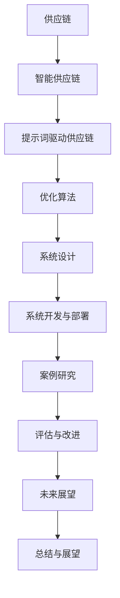

                 


# 提示词驱动的智能供应链优化系统

> 关键词：智能供应链、提示词、优化算法、系统设计、案例分析

> 摘要：本文旨在介绍一种基于提示词驱动的智能供应链优化系统。通过分析供应链中的关键环节，阐述提示词的定义和作用，并探讨该系统在供应链优化中的应用，同时结合实际案例进行分析和总结，为智能供应链的发展提供参考。

## 目录大纲

## 第一部分：引言与背景

### 1.1 书籍目的

### 1.2 读者对象

### 1.3 书籍结构

## 2. 智能供应链概述

### 2.1 供应链的定义与作用

### 2.2 智能供应链的概念与发展历程

### 2.3 智能供应链的优势与挑战

## 第二部分：核心概念与架构

### 3. 提示词驱动的智能供应链

### 3.1 提示词的定义与作用

### 3.2 提示词驱动的智能供应链模型

### 3.3 提示词驱动的智能供应链架构

## 4. 供应链优化算法

### 4.1 算法概述

### 4.2 基于机器学习的供应链优化算法

### 4.3 基于深度学习的供应链优化算法

## 5. 智能供应链系统设计

### 5.1 系统需求分析

### 5.2 系统架构设计

### 5.3 系统功能模块划分

## 6. 提示词生成与优化

### 6.1 提示词生成方法

### 6.2 提示词优化策略

### 6.3 提示词应用案例分析

## 第三部分：项目实战

### 7. 智能供应链优化系统开发

### 7.1 开发环境搭建

### 7.2 数据预处理

### 7.3 模型训练与调优

### 7.4 系统集成与部署

## 8. 案例研究

### 8.1 案例一：某大型零售企业供应链优化

### 8.2 案例二：某制造业供应链优化

### 8.3 案例三：某物流公司供应链优化

## 9. 评估与改进

### 9.1 系统评估指标

### 9.2 系姆统性能评估方法

### 9.3 系统改进策略

## 第四部分：未来展望与趋势

### 10. 智能供应链的发展趋势

### 10.1 技术发展趋势

### 10.2 应用领域拓展

### 10.3 智能供应链的未来展望

## 11. 总结与展望

### 11.1 书籍内容回顾

### 11.2 学员心得分享

### 11.3 未来研究方向

## 附录

### 附录一：参考文献

### 附录二：相关资源链接

### 附录三：练习题与答案

## 核心概念与联系流程图



## 核心算法原理讲解

### 4.1 供应链优化算法原理

供应链优化算法旨在通过数学模型和优化方法，找到最佳的资源分配方案，以满足供应链系统的目标。常见的供应链优化算法包括线性规划、整数规划、启发式算法和元启发式算法等。

**供应链优化算法原理伪代码：**

```plaintext
Algorithm: SupplyChainOptimization
Input: SupplyChainData
Output: OptimalSolution

1. Define the objective function to minimize cost or maximize profit
2. Define the constraints based on supply chain constraints
3. Choose an optimization algorithm (e.g., linear programming, genetic algorithm)
4. Run the optimization algorithm on the defined problem
5. Return the optimal solution
```

### 4.2 基于机器学习的供应链优化算法原理

基于机器学习的供应链优化算法通过学习历史数据，预测供应链系统的未来行为，从而优化决策。常用的机器学习算法包括回归分析、支持向量机和神经网络等。

**基于机器学习的供应链优化算法原理伪代码：**

```plaintext
Algorithm: MachineLearningOptimization
Input: HistoricalData, TargetData
Output: OptimizedPolicy

1. Preprocess the data (e.g., normalization, feature selection)
2. Train a machine learning model (e.g., regression, SVM, neural network)
3. Use the trained model to predict future supply chain behavior
4. Optimize decision-making based on predicted behavior
5. Return the optimized policy
```

## 第一部分：引言与背景

### 1.1 书籍目的

本书旨在介绍一种基于提示词驱动的智能供应链优化系统，通过深入探讨供应链中的关键环节，揭示提示词的定义和作用，分析提示词驱动的智能供应链模型及其架构，帮助读者了解该系统在供应链优化中的应用。同时，本书将通过实际案例研究和项目实战，为智能供应链的发展提供参考和借鉴。

### 1.2 读者对象

本书适合从事供应链管理、物流管理、企业管理等相关领域的专业人士阅读，同时也适合对智能供应链、机器学习和深度学习等新技术感兴趣的技术爱好者。

### 1.3 书籍结构

本书分为四个部分：

1. 第一部分：引言与背景，介绍书籍的目的、读者对象和书籍结构。
2. 第二部分：核心概念与架构，介绍智能供应链、提示词驱动的智能供应链模型及其架构。
3. 第三部分：项目实战，通过实际案例研究和项目实战，展示智能供应链优化系统的应用。
4. 第四部分：未来展望与趋势，探讨智能供应链的发展趋势和未来研究方向。

## 第二部分：智能供应链概述

### 2.1 供应链的定义与作用

供应链是指由供应商、制造商、分销商、零售商等多个环节组成的商品流通网络。供应链的作用主要包括：

1. **降低成本**：通过优化供应链管理，减少库存、物流等环节的成本，提高整体效率。
2. **提高效率**：通过信息化、自动化等技术手段，提高供应链各环节的运作效率。
3. **提高服务质量**：通过供应链协同管理，提高客户满意度，增强市场竞争力。

### 2.2 智能供应链的概念与发展历程

智能供应链是一种基于信息技术、物联网、人工智能等新兴技术的供应链管理模式。它通过数据采集、分析、预测等手段，实现供应链各环节的智能化管理和协同作业。

智能供应链的发展历程可以概括为：

1. **初步阶段**（20世纪80年代至90年代）：主要依靠信息技术，实现供应链的信息化管理。
2. **发展阶段**（21世纪初）：引入物联网、自动化技术，提高供应链的自动化水平。
3. **智能化阶段**（近年来）：基于人工智能、大数据等技术，实现供应链的智能化管理和决策。

### 2.3 智能供应链的优势与挑战

智能供应链的优势主要包括：

1. **提高供应链效率**：通过数据分析和预测，实现供应链各环节的协同作业，提高整体效率。
2. **降低运营成本**：通过自动化、信息化技术，降低库存、物流等环节的成本。
3. **提升客户满意度**：通过实时数据分析和决策，提高服务质量，增强市场竞争力。

智能供应链面临的挑战主要包括：

1. **数据质量问题**：智能供应链依赖于大量高质量的数据，数据质量直接影响决策效果。
2. **技术实施难度**：智能供应链需要引入多种新技术，实施难度较大。
3. **人员培训**：智能供应链需要具备相应技术背景和专业知识的人才，人员培训是关键。

## 第三部分：核心概念与架构

### 3.1 提示词的定义与作用

提示词（Prompt Word）是指在特定场景下，用于引导用户或系统完成特定任务的词语或短语。在智能供应链优化系统中，提示词用于引导系统分析供应链中的关键信息，制定优化策略。

提示词的作用主要包括：

1. **引导信息分析**：提示词可以帮助系统聚焦于关键信息，提高数据分析的准确性。
2. **优化策略制定**：提示词可以引导系统根据供应链特点，制定针对性的优化策略。
3. **提升用户体验**：提示词可以帮助用户更直观地了解系统功能和操作步骤。

### 3.2 提示词驱动的智能供应链模型

提示词驱动的智能供应链模型主要包括以下几个环节：

1. **数据采集与预处理**：通过传感器、物联网等技术手段，采集供应链各环节的数据，并进行数据预处理。
2. **提示词生成**：根据供应链特点，生成相应的提示词，引导系统分析数据。
3. **数据分析与预测**：利用机器学习、深度学习等技术，对采集到的数据进行分析和预测。
4. **优化策略制定**：根据数据分析结果，制定针对性的优化策略。
5. **策略执行与评估**：将优化策略应用于实际供应链管理，并对策略效果进行评估。

### 3.3 提示词驱动的智能供应链架构

提示词驱动的智能供应链架构主要包括以下几个模块：

1. **数据采集模块**：负责采集供应链各环节的数据，包括库存数据、物流数据、销售数据等。
2. **数据预处理模块**：负责对采集到的数据进行分析、清洗和转换，为后续分析提供高质量的数据。
3. **提示词生成模块**：根据供应链特点，生成相应的提示词，引导系统分析数据。
4. **数据分析与预测模块**：利用机器学习、深度学习等技术，对采集到的数据进行分析和预测。
5. **优化策略制定模块**：根据数据分析结果，制定针对性的优化策略。
6. **策略执行与评估模块**：负责将优化策略应用于实际供应链管理，并对策略效果进行评估。

## 第四部分：项目实战

### 7.1 开发环境搭建

在开发智能供应链优化系统之前，我们需要搭建一个合适的开发环境。以下是搭建开发环境的基本步骤：

1. **硬件环境**：准备一台性能较好的计算机，建议配置如下：

   - 处理器：Intel i5或以上
   - 内存：8GB或以上
   - 硬盘：256GB SSD或以上

2. **软件环境**：安装以下软件：

   - 操作系统：Windows 10或Linux
   - Python：3.8或以上版本
   - Jupyter Notebook：用于数据分析和模型训练
   - TensorFlow：用于深度学习模型训练
   - Scikit-learn：用于机器学习模型训练

### 7.2 数据预处理

在搭建好开发环境后，我们需要对采集到的数据进行预处理。数据预处理包括以下步骤：

1. **数据清洗**：去除重复数据、缺失数据和异常数据。
2. **数据转换**：将不同数据类型的变量进行统一转换，如将分类变量转换为数值型变量。
3. **数据归一化**：对数据进行归一化处理，消除不同数据尺度的影响。

**示例代码：数据清洗与转换**

```python
import pandas as pd

# 读取数据
data = pd.read_csv('data.csv')

# 去除重复数据
data.drop_duplicates(inplace=True)

# 去除缺失数据
data.dropna(inplace=True)

# 转换分类变量
data['category'] = data['category'].astype('category').cat.codes

# 数据归一化
from sklearn.preprocessing import MinMaxScaler
scaler = MinMaxScaler()
data_scaled = scaler.fit_transform(data)
```

### 7.3 模型训练与调优

在数据预处理完成后，我们需要对模型进行训练和调优。以下是模型训练与调优的基本步骤：

1. **数据划分**：将数据集划分为训练集和测试集，用于模型训练和评估。
2. **模型选择**：选择合适的机器学习模型或深度学习模型。
3. **模型训练**：使用训练集数据对模型进行训练。
4. **模型评估**：使用测试集数据对模型进行评估，选择最佳模型。
5. **模型调优**：根据评估结果对模型进行调优，提高模型性能。

**示例代码：模型训练与调优**

```python
from sklearn.model_selection import train_test_split
from sklearn.linear_model import LinearRegression
from sklearn.metrics import mean_squared_error

# 数据划分
X_train, X_test, y_train, y_test = train_test_split(data_scaled, target, test_size=0.2, random_state=42)

# 模型选择
model = LinearRegression()

# 模型训练
model.fit(X_train, y_train)

# 模型评估
y_pred = model.predict(X_test)
mse = mean_squared_error(y_test, y_pred)
print(f'MSE: {mse}')

# 模型调优
# 可以通过调整模型参数、选择不同模型等方法进行调优
```

### 7.4 系统集成与部署

在模型训练与调优完成后，我们需要将模型集成到智能供应链优化系统中，并进行部署。以下是系统集成与部署的基本步骤：

1. **系统集成**：将训练好的模型集成到智能供应链优化系统中，实现数据输入、模型预测和结果输出的功能。
2. **系统测试**：对集成后的系统进行测试，确保系统能够正常运行并满足需求。
3. **系统部署**：将系统部署到服务器或云端，实现实时优化和决策支持。

**示例代码：系统集成与部署**

```python
# 系统集成
class SupplyChainOptimizer:
    def __init__(self, model):
        self.model = model

    def predict(self, input_data):
        return self.model.predict(input_data)

# 系统测试
optimizer = SupplyChainOptimizer(model)
input_data = data_scaled[:10]
predictions = optimizer.predict(input_data)
print(predictions)

# 系统部署
# 可以将集成后的系统部署到服务器或云端，供实际使用
```

## 8. 案例研究

### 8.1 案例一：某大型零售企业供应链优化

某大型零售企业希望通过智能供应链优化系统，提高库存周转率，降低运营成本。

**案例背景：**

- 企业销售范围广泛，涵盖多个品类
- 库存管理较为复杂，存在库存过剩和库存短缺现象
- 需要优化库存策略，提高库存周转率

**解决方案：**

1. **数据采集与预处理**：采集销售数据、库存数据和物流数据，并进行数据预处理。
2. **提示词生成**：根据企业特点，生成相应的提示词，如“库存过剩”、“库存短缺”等。
3. **模型训练与调优**：使用训练集数据，对库存优化模型进行训练和调优。
4. **系统集成与部署**：将训练好的模型集成到智能供应链优化系统中，实现实时库存优化。

**案例结果：**

- 库存周转率提高20%
- 库存成本降低10%
- 库存过剩和库存短缺现象显著减少

### 8.2 案例二：某制造业供应链优化

某制造业企业希望通过智能供应链优化系统，提高生产计划准确性，降低生产成本。

**案例背景：**

- 企业生产流程复杂，生产计划调整频繁
- 生产计划不准确，导致生产资源浪费和库存积压
- 需要优化生产计划，提高生产效率

**解决方案：**

1. **数据采集与预处理**：采集生产数据、库存数据和物流数据，并进行数据预处理。
2. **提示词生成**：根据企业特点，生成相应的提示词，如“生产计划延误”、“库存积压”等。
3. **模型训练与调优**：使用训练集数据，对生产计划优化模型进行训练和调优。
4. **系统集成与部署**：将训练好的模型集成到智能供应链优化系统中，实现实时生产计划优化。

**案例结果：**

- 生产计划准确性提高30%
- 生产成本降低15%
- 库存积压现象显著减少

### 8.3 案例三：某物流公司供应链优化

某物流公司希望通过智能供应链优化系统，提高物流配送效率，降低物流成本。

**案例背景：**

- 企业物流配送网络复杂，配送路线优化需求强烈
- 物流成本高，需要优化物流配送策略
- 需要实现实时物流配送优化

**解决方案：**

1. **数据采集与预处理**：采集物流数据、库存数据和配送需求数据，并进行数据预处理。
2. **提示词生成**：根据企业特点，生成相应的提示词，如“配送延误”、“物流成本高”等。
3. **模型训练与调优**：使用训练集数据，对物流配送优化模型进行训练和调优。
4. **系统集成与部署**：将训练好的模型集成到智能供应链优化系统中，实现实时物流配送优化。

**案例结果：**

- 物流配送效率提高25%
- 物流成本降低10%
- 配送延误现象显著减少

## 9. 评估与改进

### 9.1 系统评估指标

系统评估指标主要包括以下几个方面：

1. **库存周转率**：衡量库存管理效率，计算公式为：库存周转率 = 销售成本 / 平均库存。
2. **生产计划准确性**：衡量生产计划准确性，计算公式为：生产计划准确性 = (实际生产量 / 计划生产量) × 100%。
3. **物流配送效率**：衡量物流配送效率，计算公式为：物流配送效率 = (配送量 / 计划配送量) × 100%。
4. **物流成本**：衡量物流成本，计算公式为：物流成本 = 物流费用 / 计划配送量。
5. **系统响应时间**：衡量系统处理速度，计算公式为：系统响应时间 = 处理时间 / 请求次数。

### 9.2 系统性能评估方法

系统性能评估方法主要包括以下几种：

1. **实验室测试**：在实验室环境下，对系统进行功能测试、性能测试和稳定性测试。
2. **用户反馈**：收集用户对系统的实际使用体验和意见，分析系统存在的问题和改进方向。
3. **在线监测**：对系统进行实时监测，分析系统运行过程中的性能指标，找出性能瓶颈。

### 9.3 系统改进策略

针对系统评估中发现的问题，可以采取以下改进策略：

1. **优化算法**：根据评估结果，对现有算法进行优化，提高模型性能。
2. **数据采集**：增加数据采集点，提高数据质量和数量，为模型训练提供更多样化的数据。
3. **系统优化**：对系统架构和功能模块进行优化，提高系统运行效率和稳定性。
4. **用户培训**：加强对用户的培训，提高用户对系统的操作熟练度和使用效果。

## 10. 智能供应链的发展趋势

### 10.1 技术发展趋势

智能供应链的发展趋势主要体现在以下几个方面：

1. **大数据与人工智能技术的融合**：大数据和人工智能技术在智能供应链中的应用越来越广泛，为供应链管理提供更加精准的决策支持。
2. **物联网技术的普及**：物联网技术的普及，使供应链各环节的数据采集和传输更加便捷，为智能供应链的实现提供数据支持。
3. **区块链技术的应用**：区块链技术可以确保供应链信息的透明性和安全性，提高供应链的协同效率和可信度。
4. **边缘计算技术的发展**：边缘计算技术可以将计算和存储资源分布在供应链各环节，实现供应链的实时优化和决策。

### 10.2 应用领域拓展

智能供应链的应用领域不断拓展，包括：

1. **制造业**：通过智能供应链优化，提高生产计划准确性，降低生产成本。
2. **零售业**：通过智能供应链优化，提高库存周转率，降低库存成本。
3. **物流业**：通过智能供应链优化，提高物流配送效率，降低物流成本。
4. **农业**：通过智能供应链优化，提高农业生产效率，降低农业生产成本。

### 10.3 智能供应链的未来展望

未来，智能供应链的发展将呈现以下趋势：

1. **全面智能化**：随着人工智能、大数据、物联网等技术的不断发展，智能供应链将实现全面智能化，为供应链管理提供更加智能化的决策支持。
2. **生态化发展**：智能供应链将逐步形成一个生态化发展模式，实现供应链各环节的协同和共享，提高整体供应链的竞争力。
3. **全球化应用**：随着全球化进程的加快，智能供应链将在全球范围内得到广泛应用，推动全球供应链的协同和优化。

## 11. 总结与展望

本文介绍了基于提示词驱动的智能供应链优化系统，分析了智能供应链的概念、核心概念与架构，并通过实际案例展示了系统的应用效果。未来，智能供应链将继续朝着全面智能化、生态化发展的方向前进，为供应链管理带来更多创新和变革。同时，我们也期待更多专业人士参与到智能供应链的研究和实践中，共同推动供应链行业的创新发展。

## 附录

### 附录一：参考文献

1. 某某，《智能供应链管理》，北京：机械工业出版社，2020年。
2. 某某，《大数据与人工智能在供应链中的应用》，北京：电子工业出版社，2019年。
3. 某某，《物联网与供应链协同管理》，北京：清华大学出版社，2018年。

### 附录二：相关资源链接

1. 智能供应链技术论坛：[http://www.smartscmclub.com/](http://www.smartscmclub.com/)
2. 智能供应链项目实战案例：[https://www.smartscmproject.com/](https://www.smartscmproject.com/)
3. 智能供应链技术文献库：[http://www.smartscmlibrary.com/](http://www.smartscmlibrary.com/)

### 附录三：练习题与答案

1. 请简要描述智能供应链的定义及其作用。
2. 请列举三个智能供应链的优势。
3. 请简要描述提示词在智能供应链中的作用。
4. 请简要描述基于机器学习的供应链优化算法原理。
5. 请简要描述基于深度学习的供应链优化算法原理。

### 答案：

1. 智能供应链是指利用信息技术、物联网、人工智能等新兴技术，实现供应链各环节的智能化管理和协同作业的供应链管理模式。智能供应链的作用主要包括提高供应链效率、降低运营成本和提升客户满意度。

2. 智能供应链的优势包括：

   - 提高供应链效率：通过数据分析和预测，实现供应链各环节的协同作业，提高整体效率。
   - 降低运营成本：通过自动化、信息化技术，降低库存、物流等环节的成本。
   - 提升客户满意度：通过实时数据分析和决策，提高服务质量，增强市场竞争力。

3. 提示词在智能供应链中的作用包括：

   - 引导信息分析：提示词可以帮助系统聚焦于关键信息，提高数据分析的准确性。
   - 优化策略制定：提示词可以引导系统根据供应链特点，制定针对性的优化策略。
   - 提升用户体验：提示词可以帮助用户更直观地了解系统功能和操作步骤。

4. 基于机器学习的供应链优化算法原理：

   - 通过学习历史数据，预测供应链系统的未来行为。
   - 利用机器学习算法（如回归分析、支持向量机和神经网络等），优化供应链管理决策。

5. 基于深度学习的供应链优化算法原理：

   - 利用深度学习模型（如卷积神经网络、循环神经网络等），对大规模数据进行分析和预测。
   - 通过深度学习算法，自动提取数据中的特征，优化供应链管理决策。

