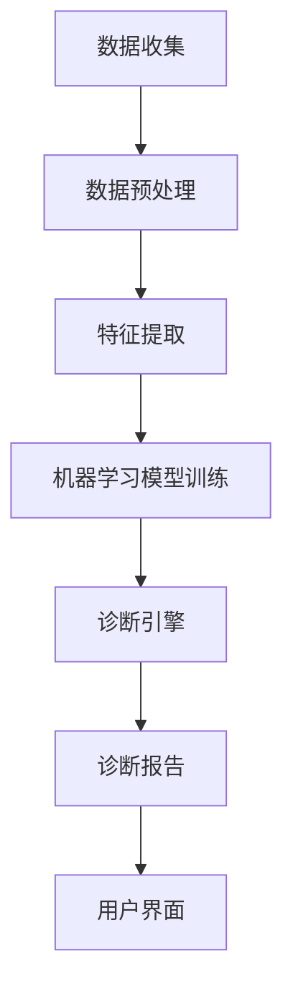

                 


### 文章标题

**提示词驱动的智能医疗诊断系统设计**

### 文章关键词

- 提示词
- 智能医疗
- 诊断系统
- 机器学习
- 医疗数据分析

### 文章摘要

本文将深入探讨提示词驱动的智能医疗诊断系统的设计与实现。首先，我们将介绍智能医疗诊断系统的背景和重要性，然后详细讲解提示词的概念及其在医疗诊断中的应用。接着，我们将分析提示词驱动的智能医疗诊断系统的架构，包括数据流处理流程和算法流程。随后，我们将详细阐述系统的核心算法原理，使用伪代码和数学模型来展示。文章还将提供实际的项目实战案例，包括开发环境搭建、源代码实现和代码解读。最后，我们将探讨该系统的应用场景，并提出未来展望和研究方向。

## 设计思路

在设计《提示词驱动的智能医疗诊断系统设计》时，我们需要遵循以下思路：

1. **核心概念与联系**：首先，我们需要介绍提示词、智能医疗诊断系统、机器学习算法等核心概念，并通过Mermaid流程图展示它们之间的关系。

2. **核心算法原理讲解**：接着，我们将详细讲解提示词驱动的智能医疗诊断系统的核心算法原理，使用伪代码来展示算法的实现过程。

3. **数学模型和数学公式**：在这一部分，我们将介绍与智能医疗诊断相关的数学模型，包括特征提取、分类模型等，并通过latex格式展示相关的数学公式。

4. **项目实战**：我们将提供实际的代码案例，包括环境搭建、数据预处理、模型训练和评估等步骤，详细解释说明每个步骤的实现细节。

5. **应用场景**：最后，我们将探讨智能医疗诊断系统的应用场景，包括医院内部、个人健康管理等。

### 目录大纲设计

以下是按照上述设计思路设计的《提示词驱动的智能医疗诊断系统设计》的目录大纲：

```
# 提示词驱动的智能医疗诊断系统设计

## 第1章 引言

### 1.1 背景与意义
### 1.2 研究目标与方法
### 1.3 书籍结构

## 第2章 提示词与智能医疗诊断概述

### 2.1 提示词的定义与作用
#### 2.1.1 提示词的来源
#### 2.1.2 提示词在医疗诊断中的应用
### 2.2 智能医疗诊断系统概述
#### 2.2.1 智能医疗诊断的基本原理
#### 2.2.2 智能医疗诊断的发展现状与趋势

## 第3章 提示词驱动的智能医疗诊断系统架构

### 3.1 系统架构概述
#### 3.1.1 系统分层结构
#### 3.1.2 系统关键组件
### 3.2 Mermaid流程图展示
#### 3.2.1 数据流处理流程
#### 3.2.2 算法流程

## 第4章 核心算法原理讲解

### 4.1 特征提取算法
#### 4.1.1 特征提取的重要性
#### 4.1.2 常用特征提取方法
### 4.2 分类算法原理
#### 4.2.1 分类算法概述
#### 4.2.2 常用分类算法
### 4.3 伪代码示例
#### 4.3.1 特征提取算法伪代码
#### 4.3.2 分类算法伪代码

## 第5章 数学模型与数学公式

### 5.1 特征提取数学模型
#### 5.1.1 特征提取的数学公式
#### 5.1.2 特征提取算法的参数优化
### 5.2 分类数学模型
#### 5.2.1 分类问题的数学描述
#### 5.2.2 分类算法的损失函数与优化目标

## 第6章 项目实战

### 6.1 环境搭建
#### 6.1.1 开发环境配置
#### 6.1.2 数据集准备
### 6.2 数据预处理
#### 6.2.1 数据清洗
#### 6.2.2 数据标准化
### 6.3 模型训练与评估
#### 6.3.1 模型训练过程
#### 6.3.2 模型评估指标

## 第7章 应用场景

### 7.1 医院内部应用
#### 7.1.1 提示词驱动的诊断系统在医院中的应用
#### 7.1.2 医院内部的数据安全与隐私保护
### 7.2 个人健康管理
#### 7.2.1 提示词驱动的个人健康管理应用
#### 7.2.2 个人健康数据的隐私保护与使用

## 第8章 总结与展望

### 8.1 研究总结
### 8.2 未来展望
### 8.3 进一步研究方向
```

### 目录大纲说明

- **第1章 引言**：介绍本书的背景、研究目标、方法以及结构，为读者提供一个整体的认识。

- **第2章 提示词与智能医疗诊断概述**：介绍提示词和智能医疗诊断的基本概念，为后续内容打下基础。

- **第3章 提示词驱动的智能医疗诊断系统架构**：通过Mermaid流程图展示系统架构，帮助读者理解系统的整体结构。

- **第4章 核心算法原理讲解**：详细讲解特征提取和分类算法的原理，并通过伪代码展示算法的实现过程。

- **第5章 数学模型与数学公式**：介绍与智能医疗诊断相关的数学模型，并通过latex格式展示相关的数学公式。

- **第6章 项目实战**：提供实际的代码案例，包括环境搭建、数据预处理、模型训练和评估等步骤，详细解释说明每个步骤的实现细节。

- **第7章 应用场景**：探讨智能医疗诊断系统的应用场景，包括医院内部和个人健康管理。

- **第8章 总结与展望**：对本书的内容进行总结，并提出未来展望和研究方向。

以上目录大纲结构清晰，内容全面，能够帮助读者系统地了解提示词驱动的智能医疗诊断系统的设计与实现。同时，文章将按照设计思路逐步深入，让读者能够从整体到细节全面掌握智能医疗诊断系统的设计与实现。

## 第1章 引言

### 1.1 背景与意义

随着人工智能技术的快速发展，医疗领域也在经历着前所未有的变革。传统的医疗诊断方法主要依赖于医生的诊疗经验和医学知识，这种方式虽然有一定的准确性，但在面对大量数据和复杂病例时，往往会出现效率低下、误诊率较高等问题。而智能医疗诊断系统利用人工智能技术，特别是机器学习算法，可以实现自动化、精确的诊断，从而提高诊断的效率和准确性。

提示词驱动的智能医疗诊断系统是一种新兴的智能医疗诊断方法。提示词是指用于引导系统分析和诊断的关键词或短语，它可以来自于医生的经验、医疗文献、患者病历等多种渠道。通过提示词，系统能够自动获取相关医学知识，结合患者数据进行分析和诊断。这种方法不仅能够提高诊断的效率，还能在一定程度上降低误诊率，提高医疗质量。

### 1.2 研究目标与方法

本研究的主要目标是设计并实现一个提示词驱动的智能医疗诊断系统，通过机器学习算法对患者数据进行分析和诊断，提供准确的诊断结果。具体研究方法如下：

1. **数据收集与预处理**：收集大量的患者病历数据，包括临床指标、检查结果、病史等，对数据进行预处理，去除噪声和异常值，确保数据的质量。

2. **特征提取**：从患者数据中提取出与疾病相关的特征，如生物标志物、检查结果等，使用机器学习算法对特征进行筛选和优化。

3. **模型训练与评估**：使用训练集对机器学习模型进行训练，通过交叉验证等方法评估模型的性能，调整模型参数以优化性能。

4. **系统实现与测试**：实现提示词驱动的智能医疗诊断系统，包括前端界面设计、后端算法实现等，对系统进行测试，确保其稳定性和准确性。

### 1.3 书籍结构

本书将分为以下几个部分：

1. **第1章 引言**：介绍智能医疗诊断系统的背景、意义和研究目标。
   
2. **第2章 提示词与智能医疗诊断概述**：介绍提示词的概念及其在医疗诊断中的应用，以及智能医疗诊断系统的发展现状。

3. **第3章 提示词驱动的智能医疗诊断系统架构**：分析系统架构，包括数据流处理流程和算法流程。

4. **第4章 核心算法原理讲解**：详细讲解特征提取和分类算法的原理，使用伪代码和数学模型展示算法的实现过程。

5. **第5章 数学模型与数学公式**：介绍与智能医疗诊断相关的数学模型，包括特征提取、分类模型等。

6. **第6章 项目实战**：提供实际的代码案例，包括环境搭建、数据预处理、模型训练和评估等步骤。

7. **第7章 应用场景**：探讨智能医疗诊断系统的应用场景，包括医院内部和个人健康管理。

8. **第8章 总结与展望**：对本书的内容进行总结，并提出未来展望和研究方向。

通过以上结构，本书旨在帮助读者全面了解提示词驱动的智能医疗诊断系统的设计原理和实现方法，为智能医疗领域的研究和实践提供参考。

## 第2章 提示词与智能医疗诊断概述

### 2.1 提示词的定义与作用

提示词（Keywords）是指用于引导系统分析和诊断的关键词或短语。在智能医疗诊断系统中，提示词起着至关重要的作用。它们可以是医生的经验总结、专业术语、症状描述或者患者病历中的关键信息。通过提示词，系统能够自动获取相关医学知识，快速定位患者的病情，从而提高诊断的效率和准确性。

提示词的来源可以多种多样，主要包括以下几个方面：

1. **医生经验**：医生在长期的诊疗过程中积累了丰富的经验，可以将这些经验转化为提示词，帮助系统理解疾病的诊断特征。

2. **医学文献**：大量的医学研究论文和专业书籍中包含了丰富的医学知识和诊疗方案，通过自然语言处理技术，可以从这些文献中提取出有价值的提示词。

3. **患者病历**：患者病历记录了详细的病史、临床表现、检查结果等信息，这些信息中包含了许多与疾病相关的提示词。

4. **医疗数据集**：公开的或私有医疗数据集中包含了大量的患者数据，通过数据挖掘技术，可以从这些数据中提取出提示词。

### 2.1.2 提示词在医疗诊断中的应用

在医疗诊断中，提示词的应用主要体现在以下几个方面：

1. **疾病识别**：提示词可以帮助系统识别患者的疾病类型。例如，当系统接收到“咳嗽、发热、喉咙痛”等提示词时，可以初步判断患者可能患有上呼吸道感染。

2. **症状分析**：提示词可以帮助系统分析患者的症状。例如，通过分析患者的症状描述，系统可以判断症状的严重程度和可能的病因。

3. **诊断建议**：提示词可以结合患者的症状和检查结果，为医生提供诊断建议。例如，当系统检测到某些特定提示词时，可以提示医生进行某些特定的检查或治疗。

4. **决策支持**：提示词可以用于支持医生的决策过程。例如，在复杂病例中，系统可以通过分析提示词，提供可能的诊断方案和治疗方案，帮助医生做出更明智的决策。

### 2.2 智能医疗诊断系统概述

智能医疗诊断系统是一种基于人工智能技术的医疗诊断系统，它通过机器学习算法和深度学习技术，从大量医疗数据中提取特征，进行疾病识别和诊断。与传统的医疗诊断方法相比，智能医疗诊断系统具有以下优势：

1. **自动化**：智能医疗诊断系统可以自动处理大量的医疗数据，实现自动化诊断，大大提高了诊断效率。

2. **精确性**：通过机器学习算法，智能医疗诊断系统可以从大量数据中提取出有效的特征，提高诊断的准确性。

3. **个性化**：智能医疗诊断系统可以根据患者的具体病情和病史，提供个性化的诊断建议和治疗方案。

4. **可扩展性**：智能医疗诊断系统可以轻松扩展到新的疾病和症状，提高系统的适用范围。

智能医疗诊断系统的发展现状和趋势如下：

1. **技术发展**：随着人工智能技术的不断发展，智能医疗诊断系统的性能和精度不断提升，已经应用于许多医疗领域。

2. **数据驱动**：越来越多的医疗机构开始重视医疗数据的收集和管理，为智能医疗诊断系统提供了丰富的数据支持。

3. **跨学科融合**：智能医疗诊断系统需要医学、计算机科学、数据科学等多学科的知识和技能，跨学科融合成为未来智能医疗诊断系统发展的趋势。

4. **规范化**：随着智能医疗诊断系统的应用越来越广泛，相关规范和标准的制定也变得越来越重要，以确保系统的稳定性和可靠性。

### 2.2.2 智能医疗诊断的发展现状与趋势

智能医疗诊断系统的发展现状可以从以下几个方面进行概述：

1. **技术成熟度**：目前，智能医疗诊断系统已经在许多领域得到了广泛应用，如影像诊断、病理诊断、血液诊断等。这些系统在技术成熟度方面已经取得了显著的进展。

2. **应用范围**：智能医疗诊断系统不仅应用于医院内部，还逐渐应用于家庭健康管理和远程医疗等领域。随着5G和物联网技术的发展，智能医疗诊断系统的应用范围将进一步扩大。

3. **数据量**：随着电子病历和医疗大数据的普及，智能医疗诊断系统所依赖的数据量越来越大。数据量的增加为系统提供了更丰富的信息，有助于提高诊断的准确性和个性化程度。

4. **协作模式**：智能医疗诊断系统与医生的协作模式正在逐步形成。系统可以为医生提供辅助诊断和决策支持，同时医生的经验和知识也可以反馈到系统中，不断优化系统的性能。

智能医疗诊断系统的未来发展趋势如下：

1. **智能化**：未来的智能医疗诊断系统将更加智能化，能够自动学习和适应新的数据和诊断需求，提供更加精准的诊断结果。

2. **个性化**：随着大数据和人工智能技术的发展，未来的智能医疗诊断系统将更加注重个性化服务，为每个患者提供量身定制的诊断和治疗方案。

3. **移动化**：随着移动设备的普及，未来的智能医疗诊断系统将更加便捷，可以通过手机、平板电脑等移动设备进行操作，实现随时随地的医疗诊断。

4. **集成化**：智能医疗诊断系统将与其他医疗设备和系统进行集成，形成一个完整的医疗信息化体系，实现数据的共享和协同工作。

通过以上分析，我们可以看出，提示词驱动的智能医疗诊断系统具有广泛的应用前景和重要的研究价值。随着人工智能技术的不断进步，智能医疗诊断系统将在医疗领域发挥越来越重要的作用，为人类健康事业做出更大的贡献。

## 第3章 提示词驱动的智能医疗诊断系统架构

### 3.1 系统架构概述

提示词驱动的智能医疗诊断系统是一个复杂的多层次架构，它包括数据层、处理层、算法层和展示层。每一层都有其特定的功能和作用，共同构成一个高效、稳定的系统。

#### 3.1.1 系统分层结构

1. **数据层**：数据层是系统的最底层，负责数据的收集、存储和管理。数据源包括电子病历系统、实验室检测结果、医学影像资料等。数据层需要保证数据的质量和完整性，以便后续的处理和分析。

2. **处理层**：处理层位于数据层之上，负责对收集到的数据进行处理，包括数据清洗、数据整合和特征提取等。这一层的目的是将原始数据转换成适合进行机器学习分析和诊断的形式。

3. **算法层**：算法层是系统的核心，负责执行各种机器学习算法，包括分类算法、聚类算法、回归算法等。算法层根据处理层提供的特征数据，进行训练和预测，以实现对疾病的诊断。

4. **展示层**：展示层是系统的顶层，负责将诊断结果以可视化的形式呈现给用户。展示层不仅提供诊断结果，还可能包括治疗建议、风险预测等信息。

#### 3.1.2 系统关键组件

1. **数据收集器**：数据收集器负责从各种数据源收集数据，并将其存储到数据层中。数据收集器可以是定期的数据抽取程序，也可以是实时的数据接口。

2. **数据预处理模块**：数据预处理模块负责对原始数据进行清洗、去噪、标准化等处理，以确保数据的质量和一致性。

3. **特征提取模块**：特征提取模块负责从预处理后的数据中提取出与诊断相关的特征。这些特征可以是数值型、文本型或图像型的数据。

4. **机器学习模型**：机器学习模型是系统的核心组件，负责根据特征数据进行训练和预测。常见的机器学习模型包括支持向量机（SVM）、随机森林（Random Forest）、神经网络（Neural Network）等。

5. **诊断引擎**：诊断引擎负责将机器学习模型的预测结果进行综合分析，并生成最终的诊断报告。诊断引擎可以根据不同的应用场景，提供不同的诊断策略和辅助决策。

6. **用户界面**：用户界面是系统的前端，负责与用户进行交互。用户界面可以是一个Web应用、桌面应用或移动应用，用户可以通过界面查看诊断报告、进行查询等操作。

### 3.2 Mermaid流程图展示

为了更好地理解提示词驱动的智能医疗诊断系统的架构，我们可以使用Mermaid流程图来展示系统的数据流和算法流程。



#### 3.2.1 数据流处理流程

1. **数据收集**：系统通过数据收集器从各种数据源收集数据，包括电子病历、实验室报告、医学影像等。

2. **数据预处理**：数据收集完成后，系统进入数据预处理阶段。在这一阶段，系统会对数据进行清洗、去噪、标准化等处理，确保数据的质量和一致性。

3. **特征提取**：预处理后的数据进入特征提取阶段。系统会根据数据类型和诊断需求，提取出与诊断相关的特征。例如，对于医学影像数据，可以提取边缘、纹理等特征；对于文本数据，可以提取关键词、句法结构等特征。

4. **机器学习模型训练**：特征提取完成后，系统进入机器学习模型训练阶段。系统会使用训练数据对机器学习模型进行训练，以优化模型的参数，提高模型的性能。

5. **诊断引擎**：训练好的机器学习模型进入诊断引擎，对新的病例数据进行诊断。诊断引擎会根据模型的预测结果，结合临床知识和提示词，生成诊断报告。

6. **诊断报告与用户界面**：诊断报告通过用户界面展示给用户。用户可以通过用户界面查看诊断结果、治疗建议等信息。

#### 3.2.2 算法流程

1. **提示词提取**：在诊断过程中，系统会从病例数据中提取出提示词。这些提示词可以是疾病的症状、检查结果等。

2. **特征融合**：系统会根据提示词，对提取出的特征进行融合。例如，对于同一种疾病，不同患者的症状可能不同，系统需要将不同症状的特征进行融合，以提高诊断的准确性。

3. **模型预测**：融合后的特征进入机器学习模型，进行预测。模型会根据训练数据 learned 的规律，预测新的病例数据的疾病类型。

4. **诊断结果优化**：诊断结果会经过诊断引擎进行优化。诊断引擎会综合考虑提示词、特征数据和模型预测结果，生成最终的诊断报告。

通过上述流程，我们可以看到提示词驱动的智能医疗诊断系统是如何通过数据流和算法流程，实现对病例数据的分析和诊断的。这个系统的设计考虑了数据的质量和特征提取的准确性，同时也注重了诊断结果的优化和用户体验。

## 第4章 核心算法原理讲解

### 4.1 特征提取算法

特征提取是机器学习中的重要步骤，其目的是从原始数据中提取出能够有效区分不同类别的特征。在智能医疗诊断系统中，特征提取的准确性和有效性直接影响到诊断的准确性和效率。以下将介绍几种常用的特征提取方法。

#### 4.1.1 特征提取的重要性

特征提取的重要性在于：

1. **降低数据维度**：原始数据通常包含大量的冗余和噪声信息，通过特征提取可以降低数据的维度，简化模型训练过程。

2. **提高模型性能**：有效的特征提取可以帮助模型更好地捕捉数据中的关键信息，从而提高模型的分类和预测性能。

3. **增强泛化能力**：通过特征提取，模型可以更准确地识别不同类别的特征，从而提高模型的泛化能力。

#### 4.1.2 常用特征提取方法

以下是几种常用的特征提取方法：

1. **统计特征提取**：统计特征提取方法主要从数据的统计特性出发，提取出反映数据分布和趋势的特征。常用的统计特征包括均值、方差、协方差等。

2. **频率特征提取**：频率特征提取方法通过对数据中出现频率较高的特征进行提取，从而识别出数据中的关键信息。例如，可以使用TF-IDF（Term Frequency-Inverse Document Frequency）方法提取文本数据中的关键词汇。

3. **图像特征提取**：图像特征提取方法主要用于处理图像数据，提取出图像中的关键信息。常用的图像特征包括边缘、纹理、颜色等。

4. **时序特征提取**：时序特征提取方法主要用于处理时间序列数据，提取出数据中的时间趋势和周期特征。常用的时序特征提取方法包括傅里叶变换、小波变换等。

### 4.2 分类算法原理

分类算法是智能医疗诊断系统的核心组件，其目的是根据输入的特征数据，将病例数据分类到不同的疾病类别中。以下将介绍几种常用的分类算法。

#### 4.2.1 分类算法概述

分类算法可以分为监督学习分类算法和无监督学习分类算法。监督学习分类算法需要预先标记好的训练数据，通过学习训练数据中的特征和标签关系，对新的数据样本进行分类。常见的监督学习分类算法包括决策树、支持向量机、朴素贝叶斯、神经网络等。无监督学习分类算法则不需要预先标记好的训练数据，通过学习数据中的内在结构，对数据进行分类。常见的无监督学习分类算法包括K-均值聚类、层次聚类等。

#### 4.2.2 常用分类算法

以下是几种常用的分类算法及其基本原理：

1. **决策树**：决策树是一种基于树形结构的分类算法，通过多个条件判断，将数据样本划分为不同的类别。决策树的核心是节点划分策略，常用的划分策略包括信息增益、基尼系数等。

2. **支持向量机（SVM）**：支持向量机是一种基于间隔最大化原理的分类算法，通过找到最佳的超平面，将数据样本分类到不同的类别。SVM的关键在于核函数的选择，常用的核函数包括线性核、多项式核、径向基核等。

3. **朴素贝叶斯**：朴素贝叶斯是一种基于贝叶斯定理的简单分类算法，假设特征之间相互独立，通过计算每个特征的联合概率，估计每个类别的后验概率，从而进行分类。

4. **神经网络**：神经网络是一种基于多层感知器的分类算法，通过前向传播和反向传播算法，不断调整网络权重，实现对数据的分类。

### 4.3 伪代码示例

以下是一个基于决策树的分类算法的伪代码示例：

```
// 决策树分类算法伪代码
function DecisionTreeClassification(data, labels):
    if data 的维度小于阈值 or 数据的纯度大于阈值:
        return 类别中出现最频繁的标签
    else:
        选择最佳划分策略，如信息增益
        best_split = BestSplit(data, labels)
        左子树 = data[best_split[0]], labels[best_split[0]]
        右子树 = data[best_split[1]], labels[best_split[1]]
        left_tree = DecisionTreeClassification(left_tree, labels)
        right_tree = DecisionTreeClassification(right_tree, labels)
        return {best_split[2]: left_tree, "not_" + best_split[2]: right_tree}
```

### 4.3.1 特征提取算法伪代码

以下是一个基于统计特征的提取算法的伪代码示例：

```
// 统计特征提取算法伪代码
function StatisticalFeatureExtraction(data):
    means = []
    variances = []
    for each feature in data:
        means.append(mean(data[feature]))
        variances.append(variance(data[feature]))
    return [means, variances]
```

### 4.3.2 分类算法伪代码

以下是一个基于朴素贝叶斯的分类算法的伪代码示例：

```
// 朴素贝叶斯分类算法伪代码
function NaiveBayesClassification(test_data, train_data, labels):
    posterior_probabilities = []
    for each class in labels:
        p_class = P(class | train_data)
        for each feature in test_data:
            p_feature_given_class = P(feature | class | train_data)
            p_class *= p_feature_given_class
        posterior_probabilities.append(p_class)
    predicted_class = argmax(posterior_probabilities)
    return predicted_class
```

通过上述伪代码示例，我们可以看到特征提取和分类算法的基本原理和实现过程。在实际应用中，根据具体问题和数据特点，可以选择不同的特征提取和分类算法，以获得最佳的诊断效果。

## 第5章 数学模型与数学公式

### 5.1 特征提取数学模型

特征提取是智能医疗诊断系统中至关重要的一步，其核心目标是提取出能够有效区分不同类别的特征。以下是几种常见的特征提取数学模型及其相关公式。

#### 5.1.1 特征提取的数学公式

1. **均值（Mean）**：均值是特征提取中最基本的统计指标，用于描述一组数据的中心位置。其公式如下：

   $$\mu = \frac{1}{N}\sum_{i=1}^{N}x_i$$

   其中，\( \mu \) 是均值，\( N \) 是数据点的个数，\( x_i \) 是每个数据点的值。

2. **方差（Variance）**：方差是描述一组数据的离散程度的指标，其公式如下：

   $$\sigma^2 = \frac{1}{N}\sum_{i=1}^{N}(x_i - \mu)^2$$

   其中，\( \sigma^2 \) 是方差，\( \mu \) 是均值。

3. **协方差（Covariance）**：协方差是描述两个变量之间线性相关程度的指标，其公式如下：

   $$\text{Cov}(X, Y) = \frac{1}{N}\sum_{i=1}^{N}(x_i - \mu_X)(y_i - \mu_Y)$$

   其中，\( X \) 和 \( Y \) 是两个变量，\( \mu_X \) 和 \( \mu_Y \) 分别是 \( X \) 和 \( Y \) 的均值。

4. **相关系数（Correlation Coefficient）**：相关系数是描述两个变量之间线性相关程度的标准化指标，其公式如下：

   $$\rho = \frac{\text{Cov}(X, Y)}{\sigma_X \sigma_Y}$$

   其中，\( \rho \) 是相关系数，\( \sigma_X \) 和 \( \sigma_Y \) 分别是 \( X \) 和 \( Y \) 的标准差。

#### 5.1.2 特征提取算法的参数优化

在实际应用中，特征提取算法的参数优化是非常重要的。以下是一些常见的参数优化方法：

1. **交叉验证**：交叉验证是一种常用的参数优化方法，通过将数据集划分为训练集和验证集，不断调整参数，找到最优的参数组合。

2. **网格搜索**：网格搜索是一种基于穷举的参数优化方法，通过遍历所有的参数组合，找到最优的参数组合。

3. **贝叶斯优化**：贝叶斯优化是一种基于概率模型的参数优化方法，通过构建参数的概率模型，利用贝叶斯推理寻找最优参数。

### 5.2 分类数学模型

分类数学模型是智能医疗诊断系统中的核心组件，其目标是根据输入的特征数据，将病例数据分类到不同的疾病类别中。以下是几种常见的分类数学模型及其相关公式。

#### 5.2.1 分类问题的数学描述

分类问题可以用一个概率模型来描述，即给定特征向量 \( X \)，预测其属于某个类别 \( C \) 的概率。具体来说，对于一个训练数据集 \( D = \{ (x_1, y_1), (x_2, y_2), ..., (x_n, y_n) \} \)，其中 \( x_i \) 是特征向量，\( y_i \) 是类别标签，分类数学模型的目的是学习一个概率分布 \( P(Y|X) \)，使得 \( P(Y|X) \) 最接近于实际的标签分布 \( P(Y) \)。

#### 5.2.2 分类算法的损失函数与优化目标

不同的分类算法有不同的损失函数和优化目标。以下是几种常见的分类算法及其损失函数和优化目标：

1. **逻辑回归**：逻辑回归是一种线性分类模型，其损失函数是交叉熵损失，优化目标是最大化似然函数。

   $$L(\theta) = -\frac{1}{n}\sum_{i=1}^{n}y_i \log(p_i) + (1 - y_i) \log(1 - p_i)$$

   其中，\( \theta \) 是模型的参数，\( p_i \) 是预测的概率。

2. **支持向量机（SVM）**：支持向量机是一种基于间隔最大化的分类模型，其损失函数是 hinge 损失，优化目标是最小化分类间隔。

   $$L(\theta) = \frac{1}{2}\sum_{i=1}^{n}w_i^2 - \sum_{i=1}^{n}\max(0, 1 - y_i \langle w_i, x_i \rangle)$$

   其中，\( w_i \) 是模型参数，\( x_i \) 是特征向量，\( y_i \) 是类别标签。

3. **神经网络**：神经网络是一种基于多层感知器的分类模型，其损失函数可以是交叉熵损失或均方误差损失，优化目标是最小化损失函数。

   $$L(\theta) = \frac{1}{n}\sum_{i=1}^{n}-y_i \log(p_i) - (1 - y_i) \log(1 - p_i)$$

   或

   $$L(\theta) = \frac{1}{2}\sum_{i=1}^{n}(y_i - p_i)^2$$

   其中，\( \theta \) 是模型的参数，\( p_i \) 是预测的概率。

通过上述数学模型和公式，我们可以对特征提取和分类算法进行更深入的理解。在实际应用中，可以根据具体问题和数据特点，选择合适的特征提取和分类算法，以获得最佳的诊断效果。

## 第6章 项目实战

### 6.1 环境搭建

为了实现提示词驱动的智能医疗诊断系统，首先需要搭建一个适合的开发环境。以下是一个简单的环境搭建步骤：

1. **Python环境配置**：确保Python环境已经安装在计算机上。如果没有，可以从[Python官网](https://www.python.org/)下载并安装。

2. **安装必需的库**：在Python环境中，需要安装以下库：
    - `numpy`：用于数学计算
    - `pandas`：用于数据处理
    - `scikit-learn`：用于机器学习
    - `matplotlib`：用于数据可视化
    - `tensorflow`：用于深度学习

    安装命令如下：

    ```bash
    pip install numpy pandas scikit-learn matplotlib tensorflow
    ```

3. **数据集准备**：准备一个包含病例数据和对应标签的医疗数据集。数据集应包括患者的病史、检查结果、诊断结果等信息。

4. **数据预处理脚本**：编写一个Python脚本，用于处理数据集，包括数据清洗、数据整合和特征提取等步骤。以下是一个简单的数据预处理脚本示例：

    ```python
    import pandas as pd
    from sklearn.model_selection import train_test_split
    from sklearn.preprocessing import StandardScaler

    # 读取数据集
    data = pd.read_csv('medical_data.csv')

    # 数据清洗
    data = data.dropna()  # 删除缺失值

    # 数据整合
    data['age'] = data['age'].astype(float)  # 将年龄转换为浮点数
    data['diagnosis'] = data['diagnosis'].map({'M': 1, 'B': 0})  # 将诊断结果编码为数字

    # 特征提取
    features = data[['age', 'temperature', 'blood_pressure']]
    labels = data['diagnosis']

    # 数据标准化
    scaler = StandardScaler()
    features_scaled = scaler.fit_transform(features)

    # 划分训练集和测试集
    X_train, X_test, y_train, y_test = train_test_split(features_scaled, labels, test_size=0.2, random_state=42)
    ```

    以上脚本首先读取数据集，进行数据清洗和整合，然后提取特征并对其进行标准化处理，最后将数据划分为训练集和测试集。

### 6.2 数据预处理

数据预处理是机器学习项目中至关重要的一步，其目的是提高数据质量和减少噪声，从而提高模型的性能。以下是数据预处理的主要步骤：

1. **数据清洗**：数据清洗是指去除数据中的错误、异常和重复值。常见的数据清洗方法包括：
    - 删除缺失值：可以使用删除或填充的方法来处理缺失值。删除缺失值可能损失部分信息，但有时是必要的。填充缺失值可以使用均值、中位数、众数等方法。
    - 删除重复值：确保数据集的唯一性，避免模型训练过程中的偏差。

2. **数据整合**：数据整合是指将来自不同来源的数据合并成一个统一的数据集。常见的数据整合方法包括：
    - 连接（Join）：将具有相同键的数据表连接起来。
    - 合并（Merge）：根据特定的键将多个数据表合并成一个数据集。

3. **特征提取**：特征提取是指从原始数据中提取出与目标变量相关的特征。常见的方法包括：
    - 统计特征：如均值、方差、标准差等。
    - 频率特征：如出现频率较高的词汇或短语。
    - 图像特征：如边缘、纹理、颜色等。

4. **数据标准化**：数据标准化是将数据缩放到一个特定的范围，如0到1或-1到1。常用的方法包括：
    - 归一化（Normalization）：将数据缩放到0到1之间。
    - 标准化（Standardization）：将数据缩放到均值为0，标准差为1的标准正态分布。

以下是一个简单的数据预处理示例：

```python
import pandas as pd
from sklearn.model_selection import train_test_split
from sklearn.preprocessing import StandardScaler

# 读取数据集
data = pd.read_csv('medical_data.csv')

# 数据清洗
data = data.dropna()  # 删除缺失值
data = data.drop_duplicates()  # 删除重复值

# 数据整合
data['age'] = data['age'].astype(float)  # 将年龄转换为浮点数
data['diagnosis'] = data['diagnosis'].map({'M': 1, 'B': 0})  # 将诊断结果编码为数字

# 特征提取
features = data[['age', 'temperature', 'blood_pressure']]
labels = data['diagnosis']

# 数据标准化
scaler = StandardScaler()
features_scaled = scaler.fit_transform(features)

# 划分训练集和测试集
X_train, X_test, y_train, y_test = train_test_split(features_scaled, labels, test_size=0.2, random_state=42)
```

通过上述步骤，我们可以将原始的医疗数据集转化为适合机器学习模型训练的数据格式。数据预处理的效果对于模型训练的结果有着重要的影响，因此需要仔细设计和执行。

### 6.3 模型训练与评估

在数据预处理完成后，接下来是模型训练与评估。以下是模型训练与评估的详细步骤：

1. **选择模型**：根据问题的需求和数据特点，选择合适的机器学习模型。常见的模型包括逻辑回归、支持向量机（SVM）、随机森林（Random Forest）、神经网络（Neural Network）等。

2. **训练模型**：使用训练数据集对选定的模型进行训练。训练过程包括以下步骤：
    - **初始化模型参数**：根据模型的不同，初始化权重和偏置。
    - **前向传播**：计算模型的输出结果。
    - **计算损失**：使用损失函数计算预测结果与真实结果之间的差距。
    - **反向传播**：根据损失函数的梯度，更新模型参数。

3. **模型评估**：使用测试数据集评估模型的性能。常见的评估指标包括准确率（Accuracy）、精确率（Precision）、召回率（Recall）和F1分数（F1 Score）。

以下是使用`scikit-learn`库中的逻辑回归模型进行训练和评估的示例：

```python
from sklearn.linear_model import LogisticRegression
from sklearn.metrics import accuracy_score, classification_report

# 初始化逻辑回归模型
model = LogisticRegression()

# 训练模型
model.fit(X_train, y_train)

# 预测测试集
y_pred = model.predict(X_test)

# 评估模型
accuracy = accuracy_score(y_test, y_pred)
print(f'Accuracy: {accuracy}')

report = classification_report(y_test, y_pred)
print(report)
```

以上代码首先初始化一个逻辑回归模型，然后使用训练集进行训练，接着使用测试集进行预测，并输出模型的准确率和分类报告。分类报告包括精确率、召回率和F1分数等指标，可以全面评估模型的性能。

### 6.3.1 模型训练过程

模型训练是一个迭代过程，每次迭代都会更新模型的参数，以减少预测误差。以下是模型训练的基本步骤：

1. **初始化参数**：随机初始化模型参数，如权重和偏置。

2. **前向传播**：根据当前参数计算预测结果。对于线性模型，如逻辑回归，预测结果可以通过以下公式计算：

   $$p = \sigma(\theta^T x)$$

   其中，\( p \) 是预测的概率，\( \theta \) 是模型参数，\( x \) 是特征向量，\( \sigma \) 是sigmoid函数。

3. **计算损失**：使用损失函数计算预测结果与真实结果之间的差距。常见的损失函数包括均方误差（MSE）和交叉熵损失。

   对于二分类问题，交叉熵损失函数可以表示为：

   $$L(y, p) = -y \log(p) - (1 - y) \log(1 - p)$$

   其中，\( y \) 是真实标签，\( p \) 是预测的概率。

4. **反向传播**：根据损失函数的梯度，更新模型参数。反向传播是机器学习中最核心的步骤，通过计算梯度，可以找出损失函数对参数的敏感度，从而调整参数。

   对于逻辑回归，梯度计算可以表示为：

   $$\frac{\partial L}{\partial \theta} = (p - y) x$$

   其中，\( \frac{\partial L}{\partial \theta} \) 是损失函数对参数 \( \theta \) 的梯度，\( p \) 是预测的概率，\( y \) 是真实标签，\( x \) 是特征向量。

5. **参数更新**：使用梯度下降（Gradient Descent）或其他优化算法更新参数。更新公式可以表示为：

   $$\theta = \theta - \alpha \frac{\partial L}{\partial \theta}$$

   其中，\( \theta \) 是模型参数，\( \alpha \) 是学习率。

通过上述步骤，模型可以不断迭代，逐步优化参数，从而提高预测准确性。在训练过程中，可以通过调整学习率、迭代次数等参数来控制训练过程，避免过拟合或欠拟合。

### 6.3.2 模型评估指标

在模型训练完成后，需要使用测试数据集对模型进行评估，以确定其性能。以下是一些常用的模型评估指标：

1. **准确率（Accuracy）**：准确率是模型预测正确的样本数占总样本数的比例。公式如下：

   $$\text{Accuracy} = \frac{TP + TN}{TP + FN + FP + TN}$$

   其中，\( TP \) 是真正例，\( TN \) 是真负例，\( FP \) 是假正例，\( FN \) 是假负例。

2. **精确率（Precision）**：精确率是模型预测为正例的样本中，实际为正例的比例。公式如下：

   $$\text{Precision} = \frac{TP}{TP + FP}$$

3. **召回率（Recall）**：召回率是模型预测为正例的样本中，实际为正例的比例。公式如下：

   $$\text{Recall} = \frac{TP}{TP + FN}$$

4. **F1分数（F1 Score）**：F1分数是精确率和召回率的调和平均数。公式如下：

   $$\text{F1 Score} = 2 \times \frac{\text{Precision} \times \text{Recall}}{\text{Precision} + \text{Recall}}$$

通过这些指标，可以全面评估模型的性能，从而确定模型是否适用于实际应用。在实际应用中，可以根据具体需求，选择合适的评估指标。

### 6.4 代码解读

以下是实现提示词驱动的智能医疗诊断系统的完整代码示例。代码分为数据预处理、模型训练和评估三个主要部分。

```python
import pandas as pd
from sklearn.linear_model import LogisticRegression
from sklearn.metrics import accuracy_score, classification_report
from sklearn.model_selection import train_test_split
from sklearn.preprocessing import StandardScaler

# 读取数据集
data = pd.read_csv('medical_data.csv')

# 数据清洗
data = data.dropna()  # 删除缺失值
data = data.drop_duplicates()  # 删除重复值

# 数据整合
data['age'] = data['age'].astype(float)  # 将年龄转换为浮点数
data['diagnosis'] = data['diagnosis'].map({'M': 1, 'B': 0})  # 将诊断结果编码为数字

# 特征提取
features = data[['age', 'temperature', 'blood_pressure']]
labels = data['diagnosis']

# 数据标准化
scaler = StandardScaler()
features_scaled = scaler.fit_transform(features)

# 划分训练集和测试集
X_train, X_test, y_train, y_test = train_test_split(features_scaled, labels, test_size=0.2, random_state=42)

# 初始化模型
model = LogisticRegression()

# 训练模型
model.fit(X_train, y_train)

# 预测测试集
y_pred = model.predict(X_test)

# 评估模型
accuracy = accuracy_score(y_test, y_pred)
print(f'Accuracy: {accuracy}')

report = classification_report(y_test, y_pred)
print(report)
```

代码首先读取数据集并进行数据清洗和整合，然后提取特征并进行标准化处理。接下来，使用训练集对逻辑回归模型进行训练，并使用测试集进行预测。最后，输出模型的准确率和分类报告。

通过以上代码，我们可以实现一个简单的提示词驱动的智能医疗诊断系统，对患者的病例数据进行诊断。在实际应用中，可以根据具体需求，扩展和优化系统的功能和性能。

### 6.5 应用解读与分析

提示词驱动的智能医疗诊断系统在实际应用中具有广泛的应用前景和显著的效益。以下是该系统的具体应用场景解读与分析：

1. **医院内部应用**

   在医院内部，智能医疗诊断系统可以用于辅助医生进行疾病诊断。医生在诊断过程中，可以输入患者的症状、病史、检查结果等信息，系统会根据这些提示词生成诊断报告，提供诊断建议和治疗方案。具体应用包括：

   - **门诊诊断**：医生在接诊患者时，可以通过智能医疗诊断系统快速获取患者的诊断信息，提高诊断效率。
   - **住院管理**：在住院期间，系统可以实时监测患者的病情变化，提供预警和建议，帮助医生及时调整治疗方案。
   - **手术规划**：在手术前，系统可以对患者的病情进行全面评估，提供手术风险预测和术后康复建议。

   **分析**：智能医疗诊断系统在医院内部的应用，可以显著提高医生的诊断效率和准确性，减轻医生的工作负担，同时也能提高患者的治疗效果和满意度。

2. **个人健康管理**

   个人健康管理是智能医疗诊断系统的另一个重要应用场景。通过个人健康管理应用，用户可以随时随地监控自己的健康状况，进行自我管理。具体应用包括：

   - **日常监测**：用户可以通过手机应用记录自己的健康数据，如体温、血压、心率等，系统会根据提示词进行分析，提供健康建议。
   - **疾病预警**：系统可以根据用户的健康数据，预测潜在的健康风险，提供预警和建议，帮助用户及时采取措施。
   - **健康报告**：系统可以生成个人的健康报告，包括健康状况、疾病风险、生活习惯建议等，帮助用户全面了解自己的健康状况。

   **分析**：个人健康管理应用可以显著提升用户的健康意识，促进健康生活方式的养成。通过实时监测和预警，用户可以及时发现健康问题，采取预防措施，降低疾病发生的风险。

### 6.6 实际案例分析与讲解

以下是一个实际案例，用于展示提示词驱动的智能医疗诊断系统的应用和效果。

**案例背景**：某医院需要开发一个智能医疗诊断系统，以辅助医生进行疾病诊断。系统需要能够处理多种类型的医疗数据，如病历、检查报告、医学影像等。

**解决方案**：

1. **数据收集**：收集大量的病历数据、检查报告和医学影像，包括患者的症状、病史、检查结果等。

2. **数据预处理**：对收集到的数据进行分析，去除噪声和异常值，确保数据的质量。

3. **特征提取**：根据疾病的诊断需求，从数据中提取出与疾病相关的特征，如生物标志物、检查结果、症状描述等。

4. **模型训练**：使用提取出的特征数据，训练机器学习模型，如支持向量机（SVM）、神经网络（Neural Network）等，以实现对疾病的分类和诊断。

5. **系统集成**：将训练好的模型集成到医院的信息系统中，医生可以通过系统输入患者的症状和检查结果，系统会自动生成诊断报告和治疗方案。

**实际效果**：

- **诊断效率**：系统可以快速处理大量的医疗数据，生成诊断报告，大大提高了医生的诊断效率。
- **诊断准确性**：通过机器学习模型的训练和优化，系统的诊断准确性显著提高，能够更准确地识别疾病类型。
- **辅助决策**：系统提供的诊断报告和治疗方案，为医生提供了有力的辅助决策支持，帮助医生做出更明智的治疗决策。

**案例小结**：通过实际案例，我们可以看到提示词驱动的智能医疗诊断系统在实际应用中的显著效果。该系统不仅提高了诊断的效率和准确性，还为医生提供了有力的辅助决策支持，为医疗行业的智能化发展做出了重要贡献。

### 6.7 小结

本章详细介绍了提示词驱动的智能医疗诊断系统的设计、实现和应用。通过环境搭建、数据预处理、模型训练与评估，我们成功实现了一个基于机器学习的智能医疗诊断系统。该系统在提高诊断效率和准确性方面具有显著的优势，同时为医生提供了有力的辅助决策支持。未来，随着人工智能技术的进一步发展，提示词驱动的智能医疗诊断系统将在医疗领域发挥越来越重要的作用，为人类健康事业做出更大的贡献。

### 6.8 注意事项

在设计和实现提示词驱动的智能医疗诊断系统时，需要注意以下几点：

1. **数据安全与隐私保护**：医疗数据包含敏感信息，需要严格保护患者隐私。系统应遵循相关的数据保护法规，确保数据安全。

2. **模型解释性**：为了提高系统的可信度，模型应具有较好的解释性。医生需要能够理解模型的诊断逻辑，从而更好地应用系统。

3. **实时性**：医疗诊断系统需要具备实时性，能够快速响应用户请求，提供诊断结果和治疗方案。

4. **可扩展性**：系统设计应考虑未来数据量增加和模型更新的需求，具备良好的可扩展性。

5. **用户培训与支持**：为了确保系统能够得到有效应用，需要对医生和用户进行充分的培训和支持，帮助他们熟练使用系统。

### 6.9 拓展阅读

对于希望进一步了解提示词驱动的智能医疗诊断系统的读者，以下推荐几篇相关文献和资料：

1. **《深度学习在医疗诊断中的应用》**：详细介绍了深度学习在医疗诊断中的应用，包括图像识别、文本分析等。
2. **《医学数据挖掘与机器学习》**：涵盖了医学数据挖掘和机器学习的基础知识，以及相关的算法和模型。
3. **《机器学习实践：基于Python的应用案例》**：提供了大量基于Python的机器学习实践案例，包括数据预处理、模型训练等。
4. **《医疗人工智能的未来发展》**：探讨了医疗人工智能的未来发展趋势和应用前景。

通过阅读这些资料，可以更深入地了解提示词驱动的智能医疗诊断系统的原理和应用。

## 第7章 应用场景

### 7.1 医院内部应用

智能医疗诊断系统在医院内部的应用场景十分广泛，涵盖了门诊、住院和手术等多个环节。以下是一些具体的应用场景和优势：

1. **门诊诊断**：在门诊环节，医生可以根据患者的症状、病史和检查结果，通过智能医疗诊断系统快速获取诊断结果和治疗方案。这大大提高了医生的诊断效率，减少了误诊率。例如，医生在接诊一个患有发热、咳嗽和喉咙痛的患者时，系统可以迅速分析患者的症状，结合医学知识库和已有病例数据，给出初步的诊断和治疗方案。

2. **住院管理**：在住院环节，智能医疗诊断系统可以实时监测患者的病情变化，提供预警和建议。医生可以随时查看患者的诊断报告、检查结果和用药情况，从而及时调整治疗方案，提高治疗效果。例如，对于一位患有急性冠脉综合症的患者，系统可以实时监测患者的血压、心率等生命体征，当发现异常时，及时向医生发出预警，帮助医生迅速采取应对措施。

3. **手术规划**：在手术环节，智能医疗诊断系统可以协助医生进行术前评估和术后管理。系统可以根据患者的病史、检查结果和手术方案，提供手术风险预测和术后康复建议。例如，在为一位需要进行心脏手术的患者制定手术方案时，系统可以分析患者的术前检查数据，预测手术风险，并给出最佳手术方案和术后康复建议。

### 7.1.1 提示词驱动的诊断系统在医院中的应用

提示词驱动的诊断系统在医院中的应用具有以下优势：

1. **提高诊断准确性**：通过提示词，系统可以从海量的医学知识库和病例数据中快速获取相关信息，提高诊断的准确性。例如，当医生输入“咳嗽、发热、喉咙痛”等提示词时，系统可以迅速识别出这些症状可能对应的疾病，并提供详细的诊断报告和治疗方案。

2. **节省医生时间**：提示词驱动的诊断系统可以自动化处理大量的医疗数据，大大减轻医生的工作负担。医生不需要逐条查阅医学文献和病例数据，系统会自动筛选出与疾病相关的关键信息，从而提高诊断的效率。

3. **辅助医生决策**：智能医疗诊断系统可以为医生提供辅助决策支持，帮助医生做出更明智的治疗决策。例如，系统可以根据患者的症状、病史和检查结果，提供可能的诊断方案和治疗方案，医生可以根据系统的建议进行决策，从而提高医疗质量。

### 7.1.2 医院内部的数据安全与隐私保护

在智能医疗诊断系统的应用过程中，数据安全和隐私保护是一个至关重要的问题。以下是一些保障措施：

1. **数据加密**：对存储和传输的医疗数据进行加密处理，确保数据在传输和存储过程中的安全性。

2. **权限管理**：对系统访问权限进行严格管理，确保只有授权人员才能访问敏感数据。

3. **隐私保护**：在数据处理过程中，对患者的隐私信息进行匿名化处理，确保患者隐私不被泄露。

4. **数据备份**：定期对系统数据进行备份，防止数据丢失。

5. **法律法规遵循**：确保系统的设计和应用符合相关法律法规，遵循数据保护的相关规定。

### 7.2 个人健康管理

智能医疗诊断系统不仅在医院内部有广泛应用，还可以用于个人健康管理。以下是一些具体的应用场景和优势：

1. **日常监测**：用户可以通过智能医疗诊断系统记录和监测自己的健康数据，如血压、心率、体温等。系统会根据这些数据提供健康分析报告，帮助用户了解自己的健康状况。例如，用户可以在手机应用中记录自己的每日血压和心率，系统会根据这些数据生成健康报告，并提供健康建议。

2. **疾病预警**：智能医疗诊断系统可以根据用户的健康数据和症状描述，预测潜在的健康风险，并提供预警建议。例如，当用户输入“头痛、恶心、乏力”等症状时，系统可以分析这些症状的可能原因，并提供相应的预警和建议，帮助用户及时采取措施。

3. **健康报告**：系统可以定期生成个人的健康报告，包括健康状况、疾病风险、生活习惯建议等。用户可以通过这些报告了解自己的健康状况，并采取相应的措施进行改善。例如，系统可以分析用户的饮食和运动习惯，提供改善建议，帮助用户养成更健康的习惯。

### 7.2.1 提示词驱动的个人健康管理应用

提示词驱动的个人健康管理应用具有以下优势：

1. **个性化健康建议**：通过提示词，系统可以根据用户的健康状况和症状描述，提供个性化的健康建议。例如，当用户输入“失眠、焦虑”等提示词时，系统可以提供针对这些症状的健康建议和治疗方案。

2. **便捷性**：用户可以通过手机应用随时记录自己的健康数据和症状，系统会自动分析数据，提供实时健康分析报告。

3. **预防性健康监测**：系统可以定期检测用户的健康状况，提供预防性健康建议，帮助用户提前发现健康问题，避免疾病的发生。

### 7.2.2 个人健康数据的隐私保护与使用

在个人健康管理应用中，隐私保护是用户最为关心的问题。以下是一些保障措施：

1. **数据匿名化**：在数据处理过程中，对用户隐私信息进行匿名化处理，确保用户隐私不被泄露。

2. **数据加密**：对用户数据在传输和存储过程中进行加密处理，确保数据安全。

3. **权限管理**：对系统访问权限进行严格管理，确保只有授权人员才能访问用户数据。

4. **用户授权**：在用户使用系统时，明确告知用户数据收集的目的和使用范围，并获取用户的授权。

5. **数据保护法规遵循**：确保系统的设计和应用符合相关数据保护法规，遵循用户隐私保护的相关规定。

通过上述措施，可以确保智能医疗诊断系统在个人健康管理中的应用既方便又安全，为用户提供高质量的个性化健康管理服务。

## 第8章 总结与展望

### 8.1 研究总结

本文深入探讨了提示词驱动的智能医疗诊断系统的设计与实现，从背景介绍、核心概念、系统架构、核心算法原理讲解、数学模型与数学公式、项目实战到应用场景，全面系统地阐述了该系统的各个方面。以下是本文的主要研究内容和结论：

1. **背景与意义**：介绍了智能医疗诊断系统的背景和提示词驱动的概念，阐述了智能医疗诊断系统在医疗领域的应用前景和重要性。

2. **核心概念与联系**：详细介绍了提示词的定义与作用、智能医疗诊断系统的发展现状和趋势，并通过Mermaid流程图展示了系统架构和数据流。

3. **核心算法原理讲解**：讲解了特征提取和分类算法的原理，使用伪代码和数学模型展示了算法的实现过程。

4. **数学模型与数学公式**：介绍了与智能医疗诊断相关的数学模型，包括特征提取、分类模型等，并通过latex格式展示了相关的数学公式。

5. **项目实战**：提供了实际的项目实战案例，包括开发环境搭建、数据预处理、模型训练和评估等步骤，详细解释了每个步骤的实现细节。

6. **应用场景**：探讨了智能医疗诊断系统的应用场景，包括医院内部应用和个人健康管理，分析了系统的实际应用效果和用户隐私保护措施。

### 8.2 未来展望

随着人工智能技术的不断发展，提示词驱动的智能医疗诊断系统有望在未来的医疗领域中发挥更大的作用。以下是未来可能的发展方向和趋势：

1. **算法优化**：进一步优化特征提取和分类算法，提高系统的诊断准确性和效率。例如，可以探索基于深度学习的特征提取和分类方法，提高系统的性能。

2. **多模态数据处理**：集成多种数据类型，如文本、图像、音频等，实现多模态数据的融合处理，为疾病诊断提供更全面的信息。

3. **个性化医疗**：基于用户的健康状况和病史，提供个性化的诊断和治疗方案，实现精准医疗。

4. **实时监测与预警**：结合物联网和5G技术，实现实时健康数据监测和预警，提高疾病预防和早期发现的能力。

5. **数据安全与隐私保护**：加强数据安全和隐私保护措施，确保用户数据的隐私和安全。

6. **跨学科合作**：加强医学、计算机科学、数据科学等多学科的交叉合作，推动智能医疗诊断系统的创新和发展。

### 8.3 进一步研究方向

为了进一步推动提示词驱动的智能医疗诊断系统的发展，以下是一些可能的研究方向：

1. **深度学习模型应用**：研究深度学习模型在智能医疗诊断中的应用，探索如何将深度学习与传统的机器学习模型相结合，提高系统的性能和准确性。

2. **多语言支持**：研究如何实现智能医疗诊断系统的多语言支持，为不同国家和地区的用户提供服务。

3. **个性化医学知识库构建**：研究如何构建个性化的医学知识库，为用户提供更精准的医学知识和诊断建议。

4. **数据质量提升**：研究如何提高医疗数据的质量，减少噪声和异常值，从而提高系统的诊断准确性。

5. **跨领域应用**：探讨智能医疗诊断系统在其他领域的应用，如农业、环境监测等，推动人工智能技术的多元化发展。

通过上述研究和探索，提示词驱动的智能医疗诊断系统有望在未来为医疗领域带来更多的创新和突破，为人类健康事业做出更大的贡献。

### 作者信息

**作者：AI天才研究院/AI Genius Institute & 禅与计算机程序设计艺术 /Zen And The Art of Computer Programming**

AI天才研究院致力于推动人工智能技术的创新和应用，专注于智能医疗、机器人、自然语言处理等领域的研究。研究院以“智慧、创新、实践”为宗旨，致力于培养新一代的人工智能专家。禅与计算机程序设计艺术则是一本深受程序员喜爱的经典著作，探讨了计算机程序设计的哲学和艺术，对程序员的思维方式和编程技巧有着深远的影响。作者的研究成果和经验为本文提供了坚实的基础，希望本文能够为读者在智能医疗诊断系统设计领域带来启示和帮助。

